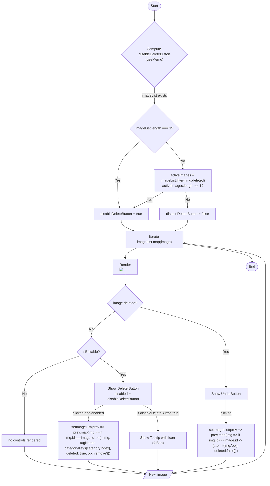

# Diagram: web/portal/src/pages/damageview/details/components/ImageList.js

> Auto-generated by Obscura crawlers

## Mermaid

### SVG

<svg id="container" width="1222.7669677734375" xmlns="http://www.w3.org/2000/svg" class="flowchart" height="2208.046875" viewBox="0 0 1222.7669677734375 2208.046875" role="graphics-document document" aria-roledescription="flowchart-v2"><g><marker id="container_flowchart-v2-pointEnd" class="marker flowchart-v2" viewBox="0 0 10 10" refX="5" refY="5" markerUnits="userSpaceOnUse" markerWidth="8" markerHeight="8" orient="auto"><path d="M 0 0 L 10 5 L 0 10 z" class="arrowMarkerPath" style="stroke-width: 1; stroke-dasharray: 1, 0;"></path></marker><marker id="container_flowchart-v2-pointStart" class="marker flowchart-v2" viewBox="0 0 10 10" refX="4.5" refY="5" markerUnits="userSpaceOnUse" markerWidth="8" markerHeight="8" orient="auto"><path d="M 0 5 L 10 10 L 10 0 z" class="arrowMarkerPath" style="stroke-width: 1; stroke-dasharray: 1, 0;"></path></marker><marker id="container_flowchart-v2-circleEnd" class="marker flowchart-v2" viewBox="0 0 10 10" refX="11" refY="5" markerUnits="userSpaceOnUse" markerWidth="11" markerHeight="11" orient="auto"><circle cx="5" cy="5" r="5" class="arrowMarkerPath" style="stroke-width: 1; stroke-dasharray: 1, 0;"></circle></marker><marker id="container_flowchart-v2-circleStart" class="marker flowchart-v2" viewBox="0 0 10 10" refX="-1" refY="5" markerUnits="userSpaceOnUse" markerWidth="11" markerHeight="11" orient="auto"><circle cx="5" cy="5" r="5" class="arrowMarkerPath" style="stroke-width: 1; stroke-dasharray: 1, 0;"></circle></marker><marker id="container_flowchart-v2-crossEnd" class="marker cross flowchart-v2" viewBox="0 0 11 11" refX="12" refY="5.2" markerUnits="userSpaceOnUse" markerWidth="11" markerHeight="11" orient="auto"><path d="M 1,1 l 9,9 M 10,1 l -9,9" class="arrowMarkerPath" style="stroke-width: 2; stroke-dasharray: 1, 0;"></path></marker><marker id="container_flowchart-v2-crossStart" class="marker cross flowchart-v2" viewBox="0 0 11 11" refX="-1" refY="5.2" markerUnits="userSpaceOnUse" markerWidth="11" markerHeight="11" orient="auto"><path d="M 1,1 l 9,9 M 10,1 l -9,9" class="arrowMarkerPath" style="stroke-width: 2; stroke-dasharray: 1, 0;"></path></marker><g class="root"><g class="clusters"></g><g class="edgePaths"><path d="M707.486,47.5L707.403,51.583C707.319,55.667,707.153,63.833,707.069,71.417C706.986,79,706.986,86,706.986,89.5L706.986,93" id="L_Start_ComputeDisable_0" class="edge-thickness-normal edge-pattern-solid edge-thickness-normal edge-pattern-solid flowchart-link" style=";" data-edge="true" data-et="edge" data-id="L_Start_ComputeDisable_0" data-points="W3sieCI6NzA3LjQ4NjA3NDQ0NzYzMTgsInkiOjQ3LjUwMDAwMDAwMDAwMDE3fSx7IngiOjcwNi45ODYwNzQ0NDc2MzE4LCJ5Ijo3Mn0seyJ4Ijo3MDYuOTg2MDc0NDQ3NjMxOCwieSI6OTd9XQ==" marker-end="url(#container_flowchart-v2-pointEnd)"></path><path d="M706.986,420.844L706.986,427.01C706.986,433.177,706.986,445.51,706.986,457.177C706.986,468.844,706.986,479.844,706.986,485.344L706.986,490.844" id="L_ComputeDisable_CheckLength_0" class="edge-thickness-normal edge-pattern-solid edge-thickness-normal edge-pattern-solid flowchart-link" style=";" data-edge="true" data-et="edge" data-id="L_ComputeDisable_CheckLength_0" data-points="W3sieCI6NzA2Ljk4NjA3NDQ0NzYzMTgsInkiOjQyMC44NDM3NX0seyJ4Ijo3MDYuOTg2MDc0NDQ3NjMxOCwieSI6NDU3Ljg0Mzc1fSx7IngiOjcwNi45ODYwNzQ0NDc2MzE4LCJ5Ijo0OTQuODQzNzV9XQ==" marker-end="url(#container_flowchart-v2-pointEnd)"></path><path d="M648.027,656.01L629.576,672.003C611.124,687.996,574.221,719.982,555.77,750.642C537.318,781.302,537.318,810.635,537.318,839.969C537.318,869.302,537.318,898.635,538.699,918.822C540.081,939.009,542.843,950.049,544.225,955.568L545.606,961.088" id="L_CheckLength_DisableTrue_0" class="edge-thickness-normal edge-pattern-solid edge-thickness-normal edge-pattern-solid flowchart-link" style=";" data-edge="true" data-et="edge" data-id="L_CheckLength_DisableTrue_0" data-points="W3sieCI6NjQ4LjAyNzE3MTk5NTgyMzIsInkiOjY1Ni4wMDk4NDc1NDgxOTE0fSx7IngiOjUzNy4zMTgxMDU2OTc2MzE4LCJ5Ijo3NTEuOTY4NzV9LHsieCI6NTM3LjMxODEwNTY5NzYzMTgsInkiOjgzOS45Njg3NX0seyJ4Ijo1MzcuMzE4MTA1Njk3NjMxOCwieSI6OTI3Ljk2ODc1fSx7IngiOjU0Ni41NzcxMzg5MDA3NTY4LCJ5Ijo5NjQuOTY4NzV9XQ==" marker-end="url(#container_flowchart-v2-pointEnd)"></path><path d="M759.164,662.79L772.562,677.653C785.96,692.516,812.756,722.243,826.154,742.606C839.552,762.969,839.552,773.969,839.552,779.469L839.552,784.969" id="L_CheckLength_CountActive_0" class="edge-thickness-normal edge-pattern-solid edge-thickness-normal edge-pattern-solid flowchart-link" style=";" data-edge="true" data-et="edge" data-id="L_CheckLength_CountActive_0" data-points="W3sieCI6NzU5LjE2NDQ3ODYxNzQ5OTgsInkiOjY2Mi43OTAzNDU4MzAxMzJ9LHsieCI6ODM5LjU1MjQ4MDY5NzYzMTgsInkiOjc1MS45Njg3NX0seyJ4Ijo4MzkuNTUyNDgwNjk3NjMxOCwieSI6Nzg4Ljk2ODc1fV0=" marker-end="url(#container_flowchart-v2-pointEnd)"></path><path d="M750.504,890.969L739.737,897.135C728.969,903.302,707.435,915.635,684.494,927.679C661.554,939.722,637.208,951.476,625.035,957.353L612.862,963.23" id="L_CountActive_DisableTrue_0" class="edge-thickness-normal edge-pattern-solid edge-thickness-normal edge-pattern-solid flowchart-link" style=";" data-edge="true" data-et="edge" data-id="L_CountActive_DisableTrue_0" data-points="W3sieCI6NzUwLjUwMzk2MzI5NzA2MzYsInkiOjg5MC45Njg3NX0seyJ4Ijo2ODUuOTAwMTM2OTQ3NjMxOCwieSI6OTI3Ljk2ODc1fSx7IngiOjYwOS4yNjAxODMzMzQzNTA2LCJ5Ijo5NjQuOTY4NzV9XQ==" marker-end="url(#container_flowchart-v2-pointEnd)"></path><path d="M851.773,890.969L853.25,897.135C854.728,903.302,857.683,915.635,859.161,927.302C860.638,938.969,860.638,949.969,860.638,955.469L860.638,960.969" id="L_CountActive_DisableFalse_0" class="edge-thickness-normal edge-pattern-solid edge-thickness-normal edge-pattern-solid flowchart-link" style=";" data-edge="true" data-et="edge" data-id="L_CountActive_DisableFalse_0" data-points="W3sieCI6ODUxLjc3MjczOTkzMDU4NjMsInkiOjg5MC45Njg3NX0seyJ4Ijo4NjAuNjM4NDE4MTk3NjMxOCwieSI6OTI3Ljk2ODc1fSx7IngiOjg2MC42Mzg0MTgxOTc2MzE4LCJ5Ijo5NjQuOTY4NzV9XQ==" marker-end="url(#container_flowchart-v2-pointEnd)"></path><path d="M553.334,1018.969L553.334,1023.135C553.334,1027.302,553.334,1035.635,562.722,1043.712C572.11,1051.789,590.886,1059.61,600.274,1063.52L609.662,1067.431" id="L_DisableTrue_IterateImages_0" class="edge-thickness-normal edge-pattern-solid edge-thickness-normal edge-pattern-solid flowchart-link" style=";" data-edge="true" data-et="edge" data-id="L_DisableTrue_IterateImages_0" data-points="W3sieCI6NTUzLjMzMzczMDY5NzYzMTgsInkiOjEwMTguOTY4NzV9LHsieCI6NTUzLjMzMzczMDY5NzYzMTgsInkiOjEwNDMuOTY4NzV9LHsieCI6NjEzLjM1NDE3NzQ3NDk3NTYsInkiOjEwNjguOTY4NzV9XQ==" marker-end="url(#container_flowchart-v2-pointEnd)"></path><path d="M860.638,1018.969L860.638,1023.135C860.638,1027.302,860.638,1035.635,851.25,1043.712C841.862,1051.789,823.086,1059.61,813.698,1063.52L804.31,1067.431" id="L_DisableFalse_IterateImages_0" class="edge-thickness-normal edge-pattern-solid edge-thickness-normal edge-pattern-solid flowchart-link" style=";" data-edge="true" data-et="edge" data-id="L_DisableFalse_IterateImages_0" data-points="W3sieCI6ODYwLjYzODQxODE5NzYzMTgsInkiOjEwMTguOTY4NzV9LHsieCI6ODYwLjYzODQxODE5NzYzMTgsInkiOjEwNDMuOTY4NzV9LHsieCI6ODAwLjYxNzk3MTQyMDI4ODEsInkiOjEwNjguOTY4NzV9XQ==" marker-end="url(#container_flowchart-v2-pointEnd)"></path><path d="M626.517,1146.969L617.919,1151.135C609.322,1155.302,592.128,1163.635,583.531,1171.302C574.934,1178.969,574.934,1185.969,574.934,1189.469L574.934,1192.969" id="L_IterateImages_RenderImage_0" class="edge-thickness-normal edge-pattern-solid edge-thickness-normal edge-pattern-solid flowchart-link" style=";" data-edge="true" data-et="edge" data-id="L_IterateImages_RenderImage_0" data-points="W3sieCI6NjI2LjUxNjU5NDAyMjUxMjQsInkiOjExNDYuOTY4NzV9LHsieCI6NTc0LjkzMzU5Mzc1LCJ5IjoxMTcxLjk2ODc1fSx7IngiOjU3NC45MzM1OTM3NSwieSI6MTE5Ni45Njg3NX1d" marker-end="url(#container_flowchart-v2-pointEnd)"></path><path d="M574.934,1266.969L574.934,1271.135C574.934,1275.302,574.934,1283.635,574.934,1291.302C574.934,1298.969,574.934,1305.969,574.934,1309.469L574.934,1312.969" id="L_RenderImage_IsDeleted_0" class="edge-thickness-normal edge-pattern-solid edge-thickness-normal edge-pattern-solid flowchart-link" style=";" data-edge="true" data-et="edge" data-id="L_RenderImage_IsDeleted_0" data-points="W3sieCI6NTc0LjkzMzU5Mzc1LCJ5IjoxMjY2Ljk2ODc1fSx7IngiOjU3NC45MzM1OTM3NSwieSI6MTI5MS45Njg3NX0seyJ4Ijo1NzQuOTMzNTkzNzUsInkiOjEzMTYuOTY4NzV9XQ==" marker-end="url(#container_flowchart-v2-pointEnd)"></path><path d="M528.575,1434.469L510.468,1448.362C492.361,1462.255,456.147,1490.042,438.04,1509.435C419.934,1528.828,419.934,1539.828,419.934,1545.328L419.934,1550.828" id="L_IsDeleted_IsEditable_0" class="edge-thickness-normal edge-pattern-solid edge-thickness-normal edge-pattern-solid flowchart-link" style=";" data-edge="true" data-et="edge" data-id="L_IsDeleted_IsEditable_0" data-points="W3sieCI6NTI4LjU3NDYxMTM0Njg5NywieSI6MTQzNC40NjkxNDI1OTY4OTd9LHsieCI6NDE5LjkzMzU5Mzc1LCJ5IjoxNTE3LjgyODEyNX0seyJ4Ijo0MTkuOTMzNTkzNzUsInkiOjE1NTQuODI4MTI1fV0=" marker-end="url(#container_flowchart-v2-pointEnd)"></path><path d="M370.495,1637.608L327.77,1652.015C285.046,1666.421,199.597,1695.234,156.873,1724.307C114.148,1753.38,114.148,1782.714,114.148,1812.047C114.148,1841.38,114.148,1870.714,114.148,1900.88C114.148,1931.047,114.148,1962.047,114.148,1977.547L114.148,1993.047" id="L_IsEditable_EndImage_0" class="edge-thickness-normal edge-pattern-solid edge-thickness-normal edge-pattern-solid flowchart-link" style=";" data-edge="true" data-et="edge" data-id="L_IsEditable_EndImage_0" data-points="W3sieCI6MzcwLjQ5NDc2Nzc5NjExMzMsInkiOjE2MzcuNjA4MDQ5MDQ2MTEzNH0seyJ4IjoxMTQuMTQ4NDM3NSwieSI6MTcyNC4wNDY4NzV9LHsieCI6MTE0LjE0ODQzNzUsInkiOjE4MTIuMDQ2ODc1fSx7IngiOjExNC4xNDg0Mzc1LCJ5IjoxOTAwLjA0Njg3NX0seyJ4IjoxMTQuMTQ4NDM3NSwieSI6MTk5Ny4wNDY4NzV9XQ==" marker-end="url(#container_flowchart-v2-pointEnd)"></path><path d="M458.781,1648.199L476.795,1660.841C494.809,1673.482,530.836,1698.764,548.85,1716.906C566.863,1735.047,566.863,1746.047,566.863,1751.547L566.863,1757.047" id="L_IsEditable_ShowDeleteButton_0" class="edge-thickness-normal edge-pattern-solid edge-thickness-normal edge-pattern-solid flowchart-link" style=";" data-edge="true" data-et="edge" data-id="L_IsEditable_ShowDeleteButton_0" data-points="W3sieCI6NDU4Ljc4MTI0MzA0MzA3OTIsInkiOjE2NDguMTk5MjI1NzA2OTIwN30seyJ4Ijo1NjYuODYzMjgxMjUsInkiOjE3MjQuMDQ2ODc1fSx7IngiOjU2Ni44NjMyODEyNSwieSI6MTc2MS4wNDY4NzV9XQ==" marker-end="url(#container_flowchart-v2-pointEnd)"></path><path d="M474.799,1863.047L463.667,1869.214C452.535,1875.38,430.272,1887.714,419.14,1899.38C408.008,1911.047,408.008,1922.047,408.008,1927.547L408.008,1933.047" id="L_ShowDeleteButton_DeleteAction_0" class="edge-thickness-normal edge-pattern-solid edge-thickness-normal edge-pattern-solid flowchart-link" style=";" data-edge="true" data-et="edge" data-id="L_ShowDeleteButton_DeleteAction_0" data-points="W3sieCI6NDc0Ljc5OTMxNjQwNjI1LCJ5IjoxODYzLjA0Njg3NX0seyJ4Ijo0MDguMDA3ODEyNSwieSI6MTkwMC4wNDY4NzV9LHsieCI6NDA4LjAwNzgxMjUsInkiOjE5MzcuMDQ2ODc1fV0=" marker-end="url(#container_flowchart-v2-pointEnd)"></path><path d="M658.927,1863.047L670.059,1869.214C681.191,1875.38,703.455,1887.714,714.587,1907.38C725.719,1927.047,725.719,1954.047,725.719,1967.547L725.719,1981.047" id="L_ShowDeleteButton_ShowTooltip_0" class="edge-thickness-normal edge-pattern-solid edge-thickness-normal edge-pattern-solid flowchart-link" style=";" data-edge="true" data-et="edge" data-id="L_ShowDeleteButton_ShowTooltip_0" data-points="W3sieCI6NjU4LjkyNzI0NjA5Mzc1LCJ5IjoxODYzLjA0Njg3NX0seyJ4Ijo3MjUuNzE4NzUsInkiOjE5MDAuMDQ2ODc1fSx7IngiOjcyNS43MTg3NSwieSI6MTk4NS4wNDY4NzV9XQ==" marker-end="url(#container_flowchart-v2-pointEnd)"></path><path d="M640.055,1415.706L705.999,1432.727C771.943,1449.747,903.831,1483.788,969.775,1517.993C1035.719,1552.198,1035.719,1586.568,1035.719,1620.938C1035.719,1655.307,1035.719,1689.677,1035.719,1716.362C1035.719,1743.047,1035.719,1762.047,1035.719,1771.547L1035.719,1781.047" id="L_IsDeleted_ShowUndoButton_0" class="edge-thickness-normal edge-pattern-solid edge-thickness-normal edge-pattern-solid flowchart-link" style=";" data-edge="true" data-et="edge" data-id="L_IsDeleted_ShowUndoButton_0" data-points="W3sieCI6NjQwLjA1NTIzODA2MDQ5NDIsInkiOjE0MTUuNzA2NDgwNjg5NTA2fSx7IngiOjEwMzUuNzE4NzUsInkiOjE1MTcuODI4MTI1fSx7IngiOjEwMzUuNzE4NzUsInkiOjE2MjAuOTM3NX0seyJ4IjoxMDM1LjcxODc1LCJ5IjoxNzI0LjA0Njg3NX0seyJ4IjoxMDM1LjcxODc1LCJ5IjoxNzg1LjA0Njg3NX1d" marker-end="url(#container_flowchart-v2-pointEnd)"></path><path d="M1035.719,1839.047L1035.719,1849.214C1035.719,1859.38,1035.719,1879.714,1035.719,1897.38C1035.719,1915.047,1035.719,1930.047,1035.719,1937.547L1035.719,1945.047" id="L_ShowUndoButton_UndoAction_0" class="edge-thickness-normal edge-pattern-solid edge-thickness-normal edge-pattern-solid flowchart-link" style=";" data-edge="true" data-et="edge" data-id="L_ShowUndoButton_UndoAction_0" data-points="W3sieCI6MTAzNS43MTg3NSwieSI6MTgzOS4wNDY4NzV9LHsieCI6MTAzNS43MTg3NSwieSI6MTkwMC4wNDY4NzV9LHsieCI6MTAzNS43MTg3NSwieSI6MTk0OS4wNDY4NzV9XQ==" marker-end="url(#container_flowchart-v2-pointEnd)"></path><path d="M114.148,2051.047L114.148,2065.214C114.148,2079.38,114.148,2107.714,206.221,2128.656C298.293,2149.599,482.438,2163.152,574.51,2169.928L666.582,2176.704" id="L_EndImage_IterateNext_0" class="edge-thickness-normal edge-pattern-solid edge-thickness-normal edge-pattern-solid flowchart-link" style=";" data-edge="true" data-et="edge" data-id="L_EndImage_IterateNext_0" data-points="W3sieCI6MTE0LjE0ODQzNzUsInkiOjIwNTEuMDQ2ODc1fSx7IngiOjExNC4xNDg0Mzc1LCJ5IjoyMTM2LjA0Njg3NX0seyJ4Ijo2NzAuNTcxNDIyMzI1ODYzOCwieSI6MjE3Ni45OTc3ODAzNDgyNzI1fV0=" marker-end="url(#container_flowchart-v2-pointEnd)"></path><path d="M408.008,2111.047L408.008,2115.214C408.008,2119.38,408.008,2127.714,451.4,2138.028C494.792,2148.343,581.577,2160.64,624.969,2166.788L668.361,2172.937" id="L_DeleteAction_IterateNext_0" class="edge-thickness-normal edge-pattern-solid edge-thickness-normal edge-pattern-solid flowchart-link" style=";" data-edge="true" data-et="edge" data-id="L_DeleteAction_IterateNext_0" data-points="W3sieCI6NDA4LjAwNzgxMjUsInkiOjIxMTEuMDQ2ODc1fSx7IngiOjQwOC4wMDc4MTI1LCJ5IjoyMTM2LjA0Njg3NX0seyJ4Ijo2NzIuMzIxNDI0MDA2MDg5OCwieSI6MjE3My40OTc3NzY5ODc4Mn1d" marker-end="url(#container_flowchart-v2-pointEnd)"></path><path d="M725.719,2063.047L725.719,2075.214C725.719,2087.38,725.719,2111.714,725.789,2127.464C725.859,2143.214,726,2150.381,726.07,2153.964L726.14,2157.548" id="L_ShowTooltip_IterateNext_0" class="edge-thickness-normal edge-pattern-solid edge-thickness-normal edge-pattern-solid flowchart-link" style=";" data-edge="true" data-et="edge" data-id="L_ShowTooltip_IterateNext_0" data-points="W3sieCI6NzI1LjcxODc1LCJ5IjoyMDYzLjA0Njg3NX0seyJ4Ijo3MjUuNzE4NzUsInkiOjIxMzYuMDQ2ODc1fSx7IngiOjcyNi4yMTg3NSwieSI6MjE2MS41NDY4NzV9XQ==" marker-end="url(#container_flowchart-v2-pointEnd)"></path><path d="M1035.719,2099.047L1035.719,2105.214C1035.719,2111.38,1035.719,2123.714,995.15,2135.798C954.582,2147.881,873.445,2159.716,832.877,2165.633L792.308,2171.551" id="L_UndoAction_IterateNext_0" class="edge-thickness-normal edge-pattern-solid edge-thickness-normal edge-pattern-solid flowchart-link" style=";" data-edge="true" data-et="edge" data-id="L_UndoAction_IterateNext_0" data-points="W3sieCI6MTAzNS43MTg3NSwieSI6MjA5OS4wNDY4NzV9LHsieCI6MTAzNS43MTg3NSwieSI6MjEzNi4wNDY4NzV9LHsieCI6Nzg4LjM1MDA0ODg3MDU0NzMsInkiOjIxNzIuMTI4MDI3MjU4OTA1fV0=" marker-end="url(#container_flowchart-v2-pointEnd)"></path><path d="M786.64,2175.549L857.994,2168.965C929.349,2162.382,1072.058,2149.214,1143.413,2123.964C1214.767,2098.714,1214.767,2061.38,1214.767,2022.047C1214.767,1982.714,1214.767,1941.38,1214.767,1906.047C1214.767,1870.714,1214.767,1841.38,1214.767,1812.047C1214.767,1782.714,1214.767,1753.38,1214.767,1721.529C1214.767,1689.677,1214.767,1655.307,1214.767,1620.938C1214.767,1586.568,1214.767,1552.198,1214.767,1515.191C1214.767,1478.185,1214.767,1438.542,1214.767,1400.898C1214.767,1363.255,1214.767,1327.612,1214.767,1299.79C1214.767,1271.969,1214.767,1251.969,1214.767,1231.969C1214.767,1211.969,1214.767,1191.969,1152.465,1174.116C1090.163,1156.264,965.559,1140.559,903.257,1132.706L840.955,1124.854" id="L_IterateNext_IterateImages_0" class="edge-thickness-normal edge-pattern-solid edge-thickness-normal edge-pattern-solid flowchart-link" style=";" data-edge="true" data-et="edge" data-id="L_IterateNext_IterateImages_0" data-points="W3sieCI6Nzg2LjYzOTU2MDU5ODc2MSwieSI6MjE3NS41NDkwMDM4MDI0Nzc3fSx7IngiOjEyMTQuNzY3MzI0NDQ3NjMxOCwieSI6MjEzNi4wNDY4NzV9LHsieCI6MTIxNC43NjczMjQ0NDc2MzE4LCJ5IjoyMDI0LjA0Njg3NX0seyJ4IjoxMjE0Ljc2NzMyNDQ0NzYzMTgsInkiOjE5MDAuMDQ2ODc1fSx7IngiOjEyMTQuNzY3MzI0NDQ3NjMxOCwieSI6MTgxMi4wNDY4NzV9LHsieCI6MTIxNC43NjczMjQ0NDc2MzE4LCJ5IjoxNzI0LjA0Njg3NX0seyJ4IjoxMjE0Ljc2NzMyNDQ0NzYzMTgsInkiOjE2MjAuOTM3NX0seyJ4IjoxMjE0Ljc2NzMyNDQ0NzYzMTgsInkiOjE1MTcuODI4MTI1fSx7IngiOjEyMTQuNzY3MzI0NDQ3NjMxOCwieSI6MTM5OC44OTg0Mzc1fSx7IngiOjEyMTQuNzY3MzI0NDQ3NjMxOCwieSI6MTI5MS45Njg3NX0seyJ4IjoxMjE0Ljc2NzMyNDQ0NzYzMTgsInkiOjEyMzEuOTY4NzV9LHsieCI6MTIxNC43NjczMjQ0NDc2MzE4LCJ5IjoxMTcxLjk2ODc1fSx7IngiOjgzNi45ODYwNzQ0NDc2MzE4LCJ5IjoxMTI0LjM1Mzc1ODMwODIwMzZ9XQ==" marker-end="url(#container_flowchart-v2-pointEnd)"></path><path d="M836.986,1126.593L889.776,1134.155C942.565,1141.718,1048.144,1156.843,1101.008,1170.573C1153.873,1184.302,1154.023,1196.636,1154.099,1202.802L1154.174,1208.969" id="L_IterateImages_End_0" class="edge-thickness-normal edge-pattern-solid edge-thickness-normal edge-pattern-solid flowchart-link" style=";" data-edge="true" data-et="edge" data-id="L_IterateImages_End_0" data-points="W3sieCI6ODM2Ljk4NjA3NDQ0NzYzMTgsInkiOjExMjYuNTkyNzAwNTMxMjc5fSx7IngiOjExNTMuNzIyNjU2MjUsInkiOjExNzEuOTY4NzV9LHsieCI6MTE1NC4yMjI2NTYyNSwieSI6MTIxMi45Njg3NX1d" marker-end="url(#container_flowchart-v2-pointEnd)"></path></g><g class="edgeLabels"><g class="edgeLabel"><g class="label" data-id="L_Start_ComputeDisable_0" transform="translate(0, 0)"><foreignObject width="0" height="0">

</foreignObject></g></g><g class="edgeLabel" transform="translate(706.9860744476318, 457.84375)"><g class="label" data-id="L_ComputeDisable_CheckLength_0" transform="translate(-57.546875, -12)"><foreignObject width="115.09375" height="24">

imageList exists

</foreignObject></g></g><g class="edgeLabel" transform="translate(537.3181056976318, 839.96875)"><g class="label" data-id="L_CheckLength_DisableTrue_0" transform="translate(-12.03125, -12)"><foreignObject width="24.0625" height="24">

Yes

</foreignObject></g></g><g class="edgeLabel" transform="translate(839.5524806976318, 751.96875)"><g class="label" data-id="L_CheckLength_CountActive_0" transform="translate(-10.140625, -12)"><foreignObject width="20.28125" height="24">

No

</foreignObject></g></g><g class="edgeLabel" transform="translate(685.9001369476318, 927.96875)"><g class="label" data-id="L_CountActive_DisableTrue_0" transform="translate(-12.03125, -12)"><foreignObject width="24.0625" height="24">

Yes

</foreignObject></g></g><g class="edgeLabel" transform="translate(860.6384181976318, 927.96875)"><g class="label" data-id="L_CountActive_DisableFalse_0" transform="translate(-10.140625, -12)"><foreignObject width="20.28125" height="24">

No

</foreignObject></g></g><g class="edgeLabel"><g class="label" data-id="L_DisableTrue_IterateImages_0" transform="translate(0, 0)"><foreignObject width="0" height="0">

</foreignObject></g></g><g class="edgeLabel"><g class="label" data-id="L_DisableFalse_IterateImages_0" transform="translate(0, 0)"><foreignObject width="0" height="0">

</foreignObject></g></g><g class="edgeLabel"><g class="label" data-id="L_IterateImages_RenderImage_0" transform="translate(0, 0)"><foreignObject width="0" height="0">

</foreignObject></g></g><g class="edgeLabel"><g class="label" data-id="L_RenderImage_IsDeleted_0" transform="translate(0, 0)"><foreignObject width="0" height="0">

</foreignObject></g></g><g class="edgeLabel" transform="translate(419.93359375, 1517.828125)"><g class="label" data-id="L_IsDeleted_IsEditable_0" transform="translate(-10.140625, -12)"><foreignObject width="20.28125" height="24">

No

</foreignObject></g></g><g class="edgeLabel" transform="translate(114.1484375, 1812.046875)"><g class="label" data-id="L_IsEditable_EndImage_0" transform="translate(-10.140625, -12)"><foreignObject width="20.28125" height="24">

No

</foreignObject></g></g><g class="edgeLabel" transform="translate(566.86328125, 1724.046875)"><g class="label" data-id="L_IsEditable_ShowDeleteButton_0" transform="translate(-12.03125, -12)"><foreignObject width="24.0625" height="24">

Yes

</foreignObject></g></g><g class="edgeLabel" transform="translate(408.0078125, 1900.046875)"><g class="label" data-id="L_ShowDeleteButton_DeleteAction_0" transform="translate(-73.0859375, -12)"><foreignObject width="146.171875" height="24">

clicked and enabled

</foreignObject></g></g><g class="edgeLabel" transform="translate(725.71875, 1900.046875)"><g class="label" data-id="L_ShowDeleteButton_ShowTooltip_0" transform="translate(-98.4765625, -12)"><foreignObject width="196.953125" height="24">

if disableDeleteButton true

</foreignObject></g></g><g class="edgeLabel" transform="translate(1035.71875, 1620.9375)"><g class="label" data-id="L_IsDeleted_ShowUndoButton_0" transform="translate(-12.03125, -12)"><foreignObject width="24.0625" height="24">

Yes

</foreignObject></g></g><g class="edgeLabel" transform="translate(1035.71875, 1900.046875)"><g class="label" data-id="L_ShowUndoButton_UndoAction_0" transform="translate(-25.421875, -12)"><foreignObject width="50.84375" height="24">

clicked

</foreignObject></g></g><g class="edgeLabel"><g class="label" data-id="L_EndImage_IterateNext_0" transform="translate(0, 0)"><foreignObject width="0" height="0">

</foreignObject></g></g><g class="edgeLabel"><g class="label" data-id="L_DeleteAction_IterateNext_0" transform="translate(0, 0)"><foreignObject width="0" height="0">

</foreignObject></g></g><g class="edgeLabel"><g class="label" data-id="L_ShowTooltip_IterateNext_0" transform="translate(0, 0)"><foreignObject width="0" height="0">

</foreignObject></g></g><g class="edgeLabel"><g class="label" data-id="L_UndoAction_IterateNext_0" transform="translate(0, 0)"><foreignObject width="0" height="0">

</foreignObject></g></g><g class="edgeLabel"><g class="label" data-id="L_IterateNext_IterateImages_0" transform="translate(0, 0)"><foreignObject width="0" height="0">

</foreignObject></g></g><g class="edgeLabel"><g class="label" data-id="L_IterateImages_End_0" transform="translate(0, 0)"><foreignObject width="0" height="0">

</foreignObject></g></g></g><g class="nodes"><g class="node default" id="flowchart-Start-0" transform="translate(706.9860744476318, 27.5)"><g class="basic label-container outer-path"><path d="M-10.3984375 -19.5 C-3.171898691385371 -19.5, 4.054640117229258 -19.5, 10.3984375 -19.5 C10.3984375 -19.5, 10.398437499999998 -19.5, 10.398437499999998 -19.5 C10.654112950320378 -19.4918009859503, 10.909788400640759 -19.483601971900598, 11.6478067896239 -19.45993515863156 C11.970270530524544 -19.42882746936626, 12.292734271425191 -19.397719780100964, 12.892042152847864 -19.3399052695533 C13.197849753070471 -19.290464668322667, 13.503657353293079 -19.241024067092034, 14.126030759676757 -19.140403561325776 C14.580753827178665 -19.036615988513795, 15.035476894680574 -18.93282841570181, 15.34470188623539 -18.862249829261074 C15.78928725770014 -18.730299224686572, 16.233872629164892 -18.598348620112073, 16.543047751460602 -18.50658706670804 C16.86245639582856 -18.38904173299949, 17.181865040196517 -18.27149639929094, 17.716144095147794 -18.074876768247425 C18.051373652825653 -17.926480587294947, 18.386603210503512 -17.77808440634247, 18.85917041279238 -17.568892924097174 C19.19117652447087 -17.39568554829457, 19.52318263614936 -17.222478172491968, 19.967429764076783 -16.990714730406097 C20.314398098591614 -16.780380487010945, 20.661366433106444 -16.570046243615792, 21.036368073605697 -16.342718045390892 C21.333821707158762 -16.135227267184536, 21.631275340711827 -15.927736488978182, 22.061592844578712 -15.627565626425154 C22.446938176410278 -15.32026297875942, 22.832283508241847 -15.012960331093685, 23.03889120850187 -14.848196188198123 C23.228783987628894 -14.675740590482572, 23.418676766755922 -14.503284992767021, 23.964247236767985 -14.007812326905688 C24.198842873940695 -13.765573070864853, 24.433438511113405 -13.523333814824019, 24.833858442968648 -13.10986736009568 C25.071063552286127 -12.831232741338287, 25.30826866160361 -12.552598122580891, 25.644151408126582 -12.158051136245305 C25.821655623893516 -11.92021165808434, 25.999159839660447 -11.682372179923373, 26.391796464640635 -11.156274872382312 C26.568284960852324 -10.88514114840417, 26.74477345706401 -10.614007424426028, 27.073721378604247 -10.108655082055241 C27.304320107640685 -9.699203687997677, 27.534918836677118 -9.289752293940111, 27.6871239742735 -9.019496659696287 C27.88601526014924 -8.606494648983528, 28.084906546024982 -8.193492638270769, 28.22948364880834 -7.893275190886684 C28.36559940115967 -7.55706665095986, 28.501715153510997 -7.220858111033036, 28.698571729970325 -6.734618561215508 C28.785377308319212 -6.473173989819344, 28.872182886668096 -6.211729418423179, 29.09246063421488 -5.548287939305138 C29.167151948257008 -5.2634575874422325, 29.241843262299135 -4.978627235579326, 29.40953178754556 -4.339158212148133 C29.473666107435868 -4.009842034304706, 29.53780042732618 -3.680525856461278, 29.648482276581777 -3.1121979531509023 C29.69928354250239 -2.7181933665152798, 29.750084808423 -2.3241887798796577, 29.808330202509367 -1.872449005199798 C29.839643223813436 -1.3847234229730252, 29.870956245117508 -0.8969978407462527, 29.888418715913414 -0.6250057626472757 C29.888418715913414 -0.1397810032276684, 29.888418715913414 0.3454437561919389, 29.888418715913414 0.625005762647271 C29.86501449083113 0.9895454598543207, 29.841610265748844 1.3540851570613706, 29.808330202509367 1.8724490051997846 C29.757509886757553 2.2666013385644055, 29.70668957100574 2.6607536719290263, 29.648482276581777 3.1121979531508885 C29.59304282297667 3.396867830280443, 29.537603369371563 3.681537707409997, 29.40953178754556 4.339158212148129 C29.30022756489931 4.755982585848049, 29.190923342253058 5.172806959547968, 29.092460634214884 5.548287939305125 C29.0037591350467 5.815442722135057, 28.915057635878515 6.082597504964988, 28.69857172997033 6.734618561215495 C28.53051900432523 7.149712042637305, 28.362466278680134 7.564805524059116, 28.229483648808344 7.893275190886679 C28.057933615782584 8.249502505047364, 27.88638358275682 8.605729819208047, 27.687123974273504 9.019496659696284 C27.525466644050145 9.306535619087597, 27.363809313826785 9.593574578478913, 27.07372137860425 10.108655082055236 C26.904652462984856 10.36839033780726, 26.73558354736546 10.628125593559284, 26.39179646464064 11.156274872382301 C26.229815015623416 11.373315257251805, 26.067833566606186 11.590355642121308, 25.644151408126582 12.158051136245302 C25.337942415522246 12.517741642743628, 25.03173342291791 12.877432149241956, 24.83385844296866 13.10986736009567 C24.528984063532743 13.424675187515312, 24.224109684096828 13.739483014934954, 23.96424723676799 14.007812326905684 C23.712845183024154 14.236129020381998, 23.46144312928032 14.46444571385831, 23.038891208501887 14.848196188198111 C22.70633609394174 15.113400042396568, 22.373780979381593 15.378603896595026, 22.061592844578715 15.627565626425152 C21.721715792989038 15.864649144573681, 21.38183874139936 16.10173266272221, 21.036368073605708 16.34271804539089 C20.69589885558551 16.549112486173943, 20.35542963756532 16.755506926956997, 19.967429764076787 16.990714730406093 C19.576381247181047 17.194724491192073, 19.185332730285303 17.398734251978052, 18.859170412792388 17.56889292409717 C18.512007526595585 17.722571635595372, 18.16484464039878 17.876250347093574, 17.716144095147804 18.07487676824742 C17.404157101445037 18.189690865906194, 17.092170107742273 18.304504963564966, 16.543047751460616 18.506587066708033 C16.167376256547644 18.618084394458286, 15.791704761634673 18.729581722208543, 15.344701886235413 18.86224982926107 C15.073209864561214 18.924216111557197, 14.801717842887014 18.98618239385332, 14.126030759676766 19.140403561325773 C13.725480352606985 19.205161444826015, 13.324929945537203 19.26991932832626, 12.892042152847878 19.3399052695533 C12.523585451915078 19.375449844358272, 12.155128750982279 19.41099441916324, 11.6478067896239 19.45993515863156 C11.384364657491536 19.46838323505004, 11.120922525359171 19.476831311468523, 10.398437500000004 19.5 C10.398437500000002 19.5, 10.398437500000002 19.5, 10.3984375 19.5 C3.900355927989054 19.5, -2.5977256440218923 19.5, -10.398437499999996 19.5 C-10.837461270407893 19.485921362190947, -11.276485040815789 19.471842724381897, -11.647806789623893 19.45993515863156 C-11.999407900005297 19.42601662237527, -12.351009010386699 19.392098086118974, -12.892042152847871 19.3399052695533 C-13.281763066558367 19.27689821455541, -13.671483980268862 19.21389115955752, -14.126030759676759 19.140403561325773 C-14.542782184477117 19.045282768172292, -14.959533609277475 18.950161975018815, -15.344701886235388 18.862249829261074 C-15.750278453842576 18.74187683291011, -16.155855021449764 18.621503836559143, -16.54304775146059 18.506587066708043 C-16.809863448457143 18.408396423796045, -17.0766791454537 18.310205780884047, -17.716144095147797 18.074876768247425 C-18.069997568292276 17.918236332376697, -18.423851041436755 17.76159589650597, -18.85917041279238 17.568892924097174 C-19.24507553903938 17.367566466918145, -19.630980665286376 17.166240009739116, -19.96742976407678 16.990714730406097 C-20.220630306466642 16.837223073637812, -20.4738308488565 16.68373141686953, -21.036368073605686 16.3427180453909 C-21.33248208656234 16.13616172852136, -21.628596099518997 15.92960541165182, -22.061592844578712 15.627565626425156 C-22.27823633740333 15.454798206022986, -22.49487983022795 15.282030785620815, -23.03889120850187 14.848196188198125 C-23.350421924569982 14.565272234516128, -23.6619526406381 14.28234828083413, -23.964247236767974 14.007812326905697 C-24.280746075981316 13.68100129037997, -24.597244915194654 13.354190253854242, -24.833858442968655 13.109867360095677 C-25.145606490213076 12.74367036483597, -25.457354537457498 12.37747336957626, -25.64415140812658 12.158051136245307 C-25.86917697781305 11.856537373116561, -26.094202547499524 11.555023609987817, -26.391796464640635 11.156274872382316 C-26.640251523186176 10.77458118293153, -26.888706581731718 10.392887493480746, -27.073721378604244 10.108655082055249 C-27.2172234459759 9.853852630276844, -27.36072551334756 9.59905017849844, -27.6871239742735 9.019496659696289 C-27.86972698174178 8.640317607609944, -28.052329989210065 8.261138555523601, -28.22948364880834 7.893275190886686 C-28.346261939682265 7.604830554673432, -28.46304023055619 7.3163859184601785, -28.698571729970325 6.73461856121551 C-28.812851404679705 6.390426388984332, -28.92713107938908 6.046234216753152, -29.09246063421488 5.5482879393051325 C-29.197264269553155 5.148626255577407, -29.30206790489143 4.748964571849682, -29.409531787545557 4.339158212148136 C-29.46505789139796 4.054043404312247, -29.520583995250366 3.768928596476359, -29.648482276581777 3.112197953150904 C-29.688203413362988 2.8041286601014725, -29.727924550144202 2.496059367052041, -29.808330202509364 1.872449005199809 C-29.836683663892543 1.430820957654676, -29.865037125275723 0.989192910109543, -29.888418715913414 0.6250057626472781 C-29.888418715913414 0.18106673723600225, -29.888418715913414 -0.26287228817527364, -29.888418715913414 -0.6250057626472687 C-29.86242065806417 -1.0299464989038012, -29.83642260021493 -1.4348872351603337, -29.808330202509367 -1.8724490051997822 C-29.76431948207475 -2.2137874619909073, -29.720308761640137 -2.555125918782032, -29.648482276581777 -3.112197953150895 C-29.591138838087538 -3.4066443902788035, -29.533795399593295 -3.701090827406712, -29.40953178754556 -4.339158212148126 C-29.29542451266777 -4.7742987056629165, -29.181317237789976 -5.209439199177707, -29.092460634214884 -5.548287939305123 C-28.943999195530925 -5.995430138503248, -28.795537756846965 -6.442572337701373, -28.698571729970332 -6.734618561215485 C-28.55389236781618 -7.091979382921418, -28.40921300566203 -7.449340204627353, -28.229483648808344 -7.893275190886676 C-28.11387505528964 -8.1333389089559, -27.998266461770935 -8.373402627025122, -27.687123974273504 -9.019496659696282 C-27.527704715201303 -9.302561697129438, -27.3682854561291 -9.585626734562592, -27.073721378604247 -10.108655082055243 C-26.86216020854357 -10.43366985139705, -26.6505990384829 -10.758684620738858, -26.39179646464064 -11.156274872382308 C-26.23175532353432 -11.370715421416886, -26.071714182427996 -11.585155970451462, -25.644151408126586 -12.158051136245302 C-25.40774188027535 -12.435751219742578, -25.171332352424116 -12.713451303239854, -24.833858442968662 -13.10986736009567 C-24.599599399093467 -13.351759055921997, -24.36534035521827 -13.593650751748324, -23.964247236767996 -14.007812326905677 C-23.637475828627835 -14.30457747388089, -23.310704420487678 -14.601342620856105, -23.038891208501887 -14.848196188198107 C-22.781674296357572 -15.053319830803702, -22.52445738421326 -15.258443473409297, -22.06159284457872 -15.627565626425149 C-21.732255872802423 -15.857296841168564, -21.402918901026126 -16.08702805591198, -21.03636807360571 -16.342718045390885 C-20.609269344894898 -16.601627804646107, -20.182170616184084 -16.860537563901325, -19.96742976407679 -16.99071473040609 C-19.67332221146224 -17.144150452220224, -19.379214658847683 -17.297586174034357, -18.859170412792388 -17.56889292409717 C-18.47615550947429 -17.73844226006267, -18.093140606156194 -17.907991596028165, -17.716144095147804 -18.07487676824742 C-17.281336252831093 -18.234890073539606, -16.84652841051438 -18.39490337883179, -16.54304775146062 -18.506587066708033 C-16.284279807915723 -18.583388034051506, -16.025511864370824 -18.660189001394976, -15.344701886235413 -18.862249829261067 C-14.860127240482464 -18.972850830009097, -14.375552594729516 -19.083451830757127, -14.126030759676768 -19.140403561325773 C-13.876504334012653 -19.180745058720817, -13.626977908348538 -19.221086556115857, -12.89204215284788 -19.3399052695533 C-12.497766454201537 -19.37794057201581, -12.103490755555194 -19.415975874478317, -11.647806789623903 -19.45993515863156 C-11.188584325594386 -19.474661529230683, -10.729361861564868 -19.489387899829808, -10.398437500000005 -19.5 C-10.398437500000004 -19.5, -10.398437500000004 -19.5, -10.3984375 -19.5" stroke="none" stroke-width="0" fill="#ECECFF" style=""></path><path d="M-10.3984375 -19.5 C-3.7574574711960382 -19.5, 2.8835225576079235 -19.5, 10.3984375 -19.5 M-10.3984375 -19.5 C-3.4548375924335675 -19.5, 3.488762315132865 -19.5, 10.3984375 -19.5 M10.3984375 -19.5 C10.3984375 -19.5, 10.398437499999998 -19.5, 10.398437499999998 -19.5 M10.3984375 -19.5 C10.3984375 -19.5, 10.3984375 -19.5, 10.398437499999998 -19.5 M10.398437499999998 -19.5 C10.677000845859855 -19.491067015688934, 10.955564191719711 -19.482134031377868, 11.6478067896239 -19.45993515863156 M10.398437499999998 -19.5 C10.829931310603868 -19.486162833345684, 11.26142512120774 -19.472325666691372, 11.6478067896239 -19.45993515863156 M11.6478067896239 -19.45993515863156 C12.092288352192174 -19.417056556857887, 12.536769914760447 -19.374177955084214, 12.892042152847864 -19.3399052695533 M11.6478067896239 -19.45993515863156 C12.090390927792802 -19.417239599107706, 12.532975065961702 -19.374544039583853, 12.892042152847864 -19.3399052695533 M12.892042152847864 -19.3399052695533 C13.227017697566884 -19.285749021257274, 13.561993242285904 -19.231592772961253, 14.126030759676757 -19.140403561325776 M12.892042152847864 -19.3399052695533 C13.344213972360242 -19.26680163641937, 13.79638579187262 -19.193698003285444, 14.126030759676757 -19.140403561325776 M14.126030759676757 -19.140403561325776 C14.40634743316032 -19.0764231098404, 14.686664106643883 -19.01244265835502, 15.34470188623539 -18.862249829261074 M14.126030759676757 -19.140403561325776 C14.60813048824426 -19.03036744427498, 15.090230216811761 -18.920331327224186, 15.34470188623539 -18.862249829261074 M15.34470188623539 -18.862249829261074 C15.71638210585893 -18.751937091066093, 16.088062325482472 -18.641624352871112, 16.543047751460602 -18.50658706670804 M15.34470188623539 -18.862249829261074 C15.647284832407127 -18.772444799127598, 15.949867778578863 -18.68263976899412, 16.543047751460602 -18.50658706670804 M16.543047751460602 -18.50658706670804 C16.892744491840176 -18.377895433687122, 17.24244123221975 -18.24920380066621, 17.716144095147794 -18.074876768247425 M16.543047751460602 -18.50658706670804 C16.944143693812503 -18.358980052232294, 17.345239636164408 -18.211373037756545, 17.716144095147794 -18.074876768247425 M17.716144095147794 -18.074876768247425 C18.007474771995355 -17.945913319624488, 18.298805448842916 -17.816949871001547, 18.85917041279238 -17.568892924097174 M17.716144095147794 -18.074876768247425 C18.161789161623723 -17.877602916909737, 18.60743422809965 -17.680329065572046, 18.85917041279238 -17.568892924097174 M18.85917041279238 -17.568892924097174 C19.10276222458064 -17.441811231915242, 19.346354036368897 -17.31472953973331, 19.967429764076783 -16.990714730406097 M18.85917041279238 -17.568892924097174 C19.27806908738506 -17.35035375387958, 19.69696776197774 -17.13181458366199, 19.967429764076783 -16.990714730406097 M19.967429764076783 -16.990714730406097 C20.337110559075718 -16.766612059992248, 20.70679135407465 -16.542509389578402, 21.036368073605697 -16.342718045390892 M19.967429764076783 -16.990714730406097 C20.227910000082986 -16.83281008058736, 20.488390236089185 -16.67490543076862, 21.036368073605697 -16.342718045390892 M21.036368073605697 -16.342718045390892 C21.36543604613159 -16.113174472879766, 21.69450401865749 -15.883630900368644, 22.061592844578712 -15.627565626425154 M21.036368073605697 -16.342718045390892 C21.27398320960824 -16.176968012708972, 21.511598345610782 -16.01121798002705, 22.061592844578712 -15.627565626425154 M22.061592844578712 -15.627565626425154 C22.296776328104407 -15.440013056808748, 22.531959811630102 -15.252460487192343, 23.03889120850187 -14.848196188198123 M22.061592844578712 -15.627565626425154 C22.307472231005683 -15.431483358874912, 22.55335161743265 -15.23540109132467, 23.03889120850187 -14.848196188198123 M23.03889120850187 -14.848196188198123 C23.318359484146736 -14.594390494582832, 23.597827759791603 -14.340584800967541, 23.964247236767985 -14.007812326905688 M23.03889120850187 -14.848196188198123 C23.27540902307921 -14.633396966917436, 23.511926837656546 -14.418597745636747, 23.964247236767985 -14.007812326905688 M23.964247236767985 -14.007812326905688 C24.27354701377684 -13.688434913160087, 24.5828467907857 -13.369057499414485, 24.833858442968648 -13.10986736009568 M23.964247236767985 -14.007812326905688 C24.245612504804985 -13.717279587139368, 24.526977772841985 -13.42674684737305, 24.833858442968648 -13.10986736009568 M24.833858442968648 -13.10986736009568 C25.129205142616417 -12.76293632098612, 25.424551842264183 -12.416005281876558, 25.644151408126582 -12.158051136245305 M24.833858442968648 -13.10986736009568 C25.090534798113154 -12.808360708044589, 25.34721115325766 -12.506854055993495, 25.644151408126582 -12.158051136245305 M25.644151408126582 -12.158051136245305 C25.942674908207305 -11.758056842187466, 26.241198408288028 -11.358062548129627, 26.391796464640635 -11.156274872382312 M25.644151408126582 -12.158051136245305 C25.938355955501034 -11.763843845349184, 26.232560502875486 -11.369636554453061, 26.391796464640635 -11.156274872382312 M26.391796464640635 -11.156274872382312 C26.58452882716468 -10.860186207659538, 26.777261189688723 -10.564097542936763, 27.073721378604247 -10.108655082055241 M26.391796464640635 -11.156274872382312 C26.533212191295473 -10.939022340800815, 26.674627917950307 -10.721769809219316, 27.073721378604247 -10.108655082055241 M27.073721378604247 -10.108655082055241 C27.222509380052667 -9.84446691906468, 27.371297381501087 -9.580278756074115, 27.6871239742735 -9.019496659696287 M27.073721378604247 -10.108655082055241 C27.24796199560866 -9.799273222788212, 27.42220261261307 -9.489891363521185, 27.6871239742735 -9.019496659696287 M27.6871239742735 -9.019496659696287 C27.888646253955148 -8.601031334051308, 28.0901685336368 -8.18256600840633, 28.22948364880834 -7.893275190886684 M27.6871239742735 -9.019496659696287 C27.870764917990797 -8.638162310780586, 28.05440586170809 -8.256827961864886, 28.22948364880834 -7.893275190886684 M28.22948364880834 -7.893275190886684 C28.398693556187208 -7.475323448209876, 28.56790346356608 -7.057371705533067, 28.698571729970325 -6.734618561215508 M28.22948364880834 -7.893275190886684 C28.377824857904578 -7.526869536436805, 28.52616606700082 -7.160463881986925, 28.698571729970325 -6.734618561215508 M28.698571729970325 -6.734618561215508 C28.84755909128223 -6.2858923668564115, 28.99654645259413 -5.837166172497314, 29.09246063421488 -5.548287939305138 M28.698571729970325 -6.734618561215508 C28.812724151522406 -6.390809655219074, 28.926876573074487 -6.047000749222639, 29.09246063421488 -5.548287939305138 M29.09246063421488 -5.548287939305138 C29.19041134349835 -5.174759432701323, 29.28836205278182 -4.801230926097507, 29.40953178754556 -4.339158212148133 M29.09246063421488 -5.548287939305138 C29.166736365058206 -5.265042386294163, 29.241012095901528 -4.981796833283189, 29.40953178754556 -4.339158212148133 M29.40953178754556 -4.339158212148133 C29.458128885025815 -4.08962238758722, 29.50672598250607 -3.8400865630263077, 29.648482276581777 -3.1121979531509023 M29.40953178754556 -4.339158212148133 C29.504472108223897 -3.8516597311087564, 29.599412428902234 -3.364161250069379, 29.648482276581777 -3.1121979531509023 M29.648482276581777 -3.1121979531509023 C29.693454421972213 -2.763402874257272, 29.738426567362648 -2.414607795363642, 29.808330202509367 -1.872449005199798 M29.648482276581777 -3.1121979531509023 C29.690186333571393 -2.7887495225369916, 29.731890390561006 -2.465301091923081, 29.808330202509367 -1.872449005199798 M29.808330202509367 -1.872449005199798 C29.82992685820557 -1.536063660224677, 29.85152351390178 -1.1996783152495563, 29.888418715913414 -0.6250057626472757 M29.808330202509367 -1.872449005199798 C29.837429746571928 -1.4192001176962121, 29.86652929063449 -0.9659512301926262, 29.888418715913414 -0.6250057626472757 M29.888418715913414 -0.6250057626472757 C29.888418715913414 -0.2655988085215245, 29.888418715913414 0.09380814560422668, 29.888418715913414 0.625005762647271 M29.888418715913414 -0.6250057626472757 C29.888418715913414 -0.22237644315374516, 29.888418715913414 0.18025287633978537, 29.888418715913414 0.625005762647271 M29.888418715913414 0.625005762647271 C29.86860688365903 0.9335910418324613, 29.848795051404647 1.2421763210176517, 29.808330202509367 1.8724490051997846 M29.888418715913414 0.625005762647271 C29.862657322165145 1.0262602644993328, 29.836895928416876 1.4275147663513945, 29.808330202509367 1.8724490051997846 M29.808330202509367 1.8724490051997846 C29.7693373145466 2.174870144222342, 29.730344426583834 2.477291283244899, 29.648482276581777 3.1121979531508885 M29.808330202509367 1.8724490051997846 C29.753649042858296 2.2965452814371696, 29.698967883207228 2.720641557674554, 29.648482276581777 3.1121979531508885 M29.648482276581777 3.1121979531508885 C29.555289664750347 3.590722318639799, 29.462097052918917 4.069246684128709, 29.40953178754556 4.339158212148129 M29.648482276581777 3.1121979531508885 C29.59378745030745 3.3930443263139463, 29.539092624033117 3.673890699477004, 29.40953178754556 4.339158212148129 M29.40953178754556 4.339158212148129 C29.322148060152777 4.672390237043839, 29.23476433275999 5.005622261939549, 29.092460634214884 5.548287939305125 M29.40953178754556 4.339158212148129 C29.333434411842347 4.629350486515735, 29.257337036139134 4.919542760883342, 29.092460634214884 5.548287939305125 M29.092460634214884 5.548287939305125 C29.000168909219255 5.826255910302519, 28.907877184223626 6.104223881299913, 28.69857172997033 6.734618561215495 M29.092460634214884 5.548287939305125 C29.00376071964782 5.815437949568963, 28.915060805080753 6.0825879598328, 28.69857172997033 6.734618561215495 M28.69857172997033 6.734618561215495 C28.555482671118313 7.088051303018727, 28.4123936122663 7.441484044821958, 28.229483648808344 7.893275190886679 M28.69857172997033 6.734618561215495 C28.604069913274852 6.968039875521652, 28.50956809657938 7.201461189827809, 28.229483648808344 7.893275190886679 M28.229483648808344 7.893275190886679 C28.0401475424295 8.286435666926042, 27.85081143605066 8.679596142965405, 27.687123974273504 9.019496659696284 M28.229483648808344 7.893275190886679 C28.10594549946189 8.149804801297538, 27.982407350115437 8.406334411708398, 27.687123974273504 9.019496659696284 M27.687123974273504 9.019496659696284 C27.500549999017377 9.350777645427181, 27.31397602376125 9.68205863115808, 27.07372137860425 10.108655082055236 M27.687123974273504 9.019496659696284 C27.470727475198508 9.40373055632558, 27.254330976123512 9.78796445295488, 27.07372137860425 10.108655082055236 M27.07372137860425 10.108655082055236 C26.831184590766277 10.481256718420992, 26.588647802928303 10.853858354786746, 26.39179646464064 11.156274872382301 M27.07372137860425 10.108655082055236 C26.814896718962075 10.506279263418232, 26.5560720593199 10.903903444781227, 26.39179646464064 11.156274872382301 M26.39179646464064 11.156274872382301 C26.15109758876417 11.478789437938078, 25.910398712887698 11.801304003493854, 25.644151408126582 12.158051136245302 M26.39179646464064 11.156274872382301 C26.241880123112402 11.357149112370466, 26.091963781584163 11.558023352358632, 25.644151408126582 12.158051136245302 M25.644151408126582 12.158051136245302 C25.408479581594758 12.434884673796406, 25.172807755062934 12.711718211347508, 24.83385844296866 13.10986736009567 M25.644151408126582 12.158051136245302 C25.347226517214914 12.506836008615068, 25.05030162630325 12.855620880984834, 24.83385844296866 13.10986736009567 M24.83385844296866 13.10986736009567 C24.55832398435956 13.394379310409322, 24.282789525750466 13.678891260722974, 23.96424723676799 14.007812326905684 M24.83385844296866 13.10986736009567 C24.62964149262806 13.320738127845777, 24.425424542287463 13.531608895595882, 23.96424723676799 14.007812326905684 M23.96424723676799 14.007812326905684 C23.633190962600214 14.308468875835835, 23.302134688432442 14.609125424765988, 23.038891208501887 14.848196188198111 M23.96424723676799 14.007812326905684 C23.72374994696352 14.22622560229651, 23.483252657159046 14.444638877687336, 23.038891208501887 14.848196188198111 M23.038891208501887 14.848196188198111 C22.70656828139654 15.113214879080134, 22.374245354291187 15.378233569962159, 22.061592844578715 15.627565626425152 M23.038891208501887 14.848196188198111 C22.68559781931729 15.1299382645409, 22.332304430132698 15.41168034088369, 22.061592844578715 15.627565626425152 M22.061592844578715 15.627565626425152 C21.710400417750673 15.872542260505265, 21.359207990922634 16.117518894585377, 21.036368073605708 16.34271804539089 M22.061592844578715 15.627565626425152 C21.79928980544247 15.810536871611044, 21.536986766306224 15.993508116796933, 21.036368073605708 16.34271804539089 M21.036368073605708 16.34271804539089 C20.674738737100018 16.56193987435051, 20.313109400594325 16.781161703310133, 19.967429764076787 16.990714730406093 M21.036368073605708 16.34271804539089 C20.63656322890731 16.585082091761116, 20.236758384208915 16.827446138131343, 19.967429764076787 16.990714730406093 M19.967429764076787 16.990714730406093 C19.5257625992056 17.221132207418073, 19.084095434334408 17.45154968443005, 18.859170412792388 17.56889292409717 M19.967429764076787 16.990714730406093 C19.561421321693818 17.202529074736468, 19.15541287931085 17.414343419066846, 18.859170412792388 17.56889292409717 M18.859170412792388 17.56889292409717 C18.49906821837567 17.72829948351339, 18.13896602395895 17.887706042929604, 17.716144095147804 18.07487676824742 M18.859170412792388 17.56889292409717 C18.490536145841812 17.732076378929186, 18.121901878891236 17.895259833761205, 17.716144095147804 18.07487676824742 M17.716144095147804 18.07487676824742 C17.34682466399859 18.21078973286173, 16.97750523284937 18.346702697476037, 16.543047751460616 18.506587066708033 M17.716144095147804 18.07487676824742 C17.42593688316535 18.181675704903025, 17.135729671182894 18.28847464155863, 16.543047751460616 18.506587066708033 M16.543047751460616 18.506587066708033 C16.262276893769027 18.58991838347459, 15.98150603607744 18.673249700241147, 15.344701886235413 18.86224982926107 M16.543047751460616 18.506587066708033 C16.09955862979246 18.638212310097238, 15.656069508124308 18.769837553486443, 15.344701886235413 18.86224982926107 M15.344701886235413 18.86224982926107 C14.881084091848232 18.9680675654411, 14.417466297461052 19.073885301621125, 14.126030759676766 19.140403561325773 M15.344701886235413 18.86224982926107 C14.953264810466369 18.95159278743972, 14.561827734697326 19.040935745618363, 14.126030759676766 19.140403561325773 M14.126030759676766 19.140403561325773 C13.8158024901453 19.19055886208746, 13.505574220613834 19.240714162849144, 12.892042152847878 19.3399052695533 M14.126030759676766 19.140403561325773 C13.65287336520176 19.216899979474096, 13.179715970726754 19.29339639762242, 12.892042152847878 19.3399052695533 M12.892042152847878 19.3399052695533 C12.505982015248149 19.3771480267223, 12.11992187764842 19.4143907838913, 11.6478067896239 19.45993515863156 M12.892042152847878 19.3399052695533 C12.482583817979487 19.379405222672357, 12.073125483111095 19.418905175791416, 11.6478067896239 19.45993515863156 M11.6478067896239 19.45993515863156 C11.16763207867678 19.475333427008255, 10.68745736772966 19.490731695384955, 10.398437500000004 19.5 M11.6478067896239 19.45993515863156 C11.188606051122644 19.474660832535278, 10.729405312621388 19.489386506439, 10.398437500000004 19.5 M10.398437500000004 19.5 C10.398437500000002 19.5, 10.398437500000002 19.5, 10.3984375 19.5 M10.398437500000004 19.5 C10.398437500000002 19.5, 10.398437500000002 19.5, 10.3984375 19.5 M10.3984375 19.5 C4.621637988188821 19.5, -1.1551615236223576 19.5, -10.398437499999996 19.5 M10.3984375 19.5 C3.402788754533436 19.5, -3.5928599909331282 19.5, -10.398437499999996 19.5 M-10.398437499999996 19.5 C-10.854667771630654 19.485369583187158, -11.310898043261313 19.470739166374315, -11.647806789623893 19.45993515863156 M-10.398437499999996 19.5 C-10.862269981555896 19.48512579511166, -11.326102463111797 19.470251590223317, -11.647806789623893 19.45993515863156 M-11.647806789623893 19.45993515863156 C-12.082809420637044 19.417970977984925, -12.517812051650195 19.37600679733829, -12.892042152847871 19.3399052695533 M-11.647806789623893 19.45993515863156 C-11.956277271990668 19.43017738218767, -12.264747754357442 19.400419605743778, -12.892042152847871 19.3399052695533 M-12.892042152847871 19.3399052695533 C-13.2296041664194 19.285330861031564, -13.567166179990929 19.230756452509834, -14.126030759676759 19.140403561325773 M-12.892042152847871 19.3399052695533 C-13.242769250840352 19.28320243227914, -13.593496348832835 19.226499595004984, -14.126030759676759 19.140403561325773 M-14.126030759676759 19.140403561325773 C-14.550133974226362 19.04360477013694, -14.974237188775966 18.94680597894811, -15.344701886235388 18.862249829261074 M-14.126030759676759 19.140403561325773 C-14.396511239772583 19.078668156793988, -14.666991719868406 19.0169327522622, -15.344701886235388 18.862249829261074 M-15.344701886235388 18.862249829261074 C-15.600803174556798 18.786240311190376, -15.856904462878209 18.710230793119674, -16.54304775146059 18.506587066708043 M-15.344701886235388 18.862249829261074 C-15.616758728864227 18.781504786424343, -15.888815571493065 18.700759743587614, -16.54304775146059 18.506587066708043 M-16.54304775146059 18.506587066708043 C-16.91648478323023 18.369158787002736, -17.289921814999875 18.231730507297428, -17.716144095147797 18.074876768247425 M-16.54304775146059 18.506587066708043 C-16.81150422880566 18.407792601460585, -17.07996070615073 18.308998136213127, -17.716144095147797 18.074876768247425 M-17.716144095147797 18.074876768247425 C-18.001560026651816 17.948531601933386, -18.28697595815584 17.822186435619347, -18.85917041279238 17.568892924097174 M-17.716144095147797 18.074876768247425 C-18.074077979845942 17.916430055222996, -18.432011864544087 17.757983342198568, -18.85917041279238 17.568892924097174 M-18.85917041279238 17.568892924097174 C-19.290044199357343 17.344106345634064, -19.72091798592231 17.119319767170953, -19.96742976407678 16.990714730406097 M-18.85917041279238 17.568892924097174 C-19.142526978949324 17.42106598503164, -19.42588354510627 17.273239045966104, -19.96742976407678 16.990714730406097 M-19.96742976407678 16.990714730406097 C-20.287437964567367 16.796723878691775, -20.607446165057954 16.602733026977457, -21.036368073605686 16.3427180453909 M-19.96742976407678 16.990714730406097 C-20.363723024340505 16.750479427156527, -20.76001628460423 16.510244123906958, -21.036368073605686 16.3427180453909 M-21.036368073605686 16.3427180453909 C-21.303428923419162 16.15642795743888, -21.570489773232637 15.970137869486859, -22.061592844578712 15.627565626425156 M-21.036368073605686 16.3427180453909 C-21.2714249579723 16.178752538305275, -21.50648184233891 16.014787031219655, -22.061592844578712 15.627565626425156 M-22.061592844578712 15.627565626425156 C-22.25991817624576 15.469406452079408, -22.458243507912808 15.311247277733662, -23.03889120850187 14.848196188198125 M-22.061592844578712 15.627565626425156 C-22.37313924551238 15.379115662278465, -22.684685646446052 15.130665698131775, -23.03889120850187 14.848196188198125 M-23.03889120850187 14.848196188198125 C-23.360086442644484 14.556495174910001, -23.6812816767871 14.264794161621877, -23.964247236767974 14.007812326905697 M-23.03889120850187 14.848196188198125 C-23.327315634852276 14.586256755478825, -23.615740061202686 14.324317322759523, -23.964247236767974 14.007812326905697 M-23.964247236767974 14.007812326905697 C-24.18371158842123 13.781197365465346, -24.403175940074483 13.554582404024995, -24.833858442968655 13.109867360095677 M-23.964247236767974 14.007812326905697 C-24.164839264680875 13.800684589173855, -24.365431292593776 13.593556851442013, -24.833858442968655 13.109867360095677 M-24.833858442968655 13.109867360095677 C-25.073464015680408 12.828413020445133, -25.31306958839216 12.546958680794589, -25.64415140812658 12.158051136245307 M-24.833858442968655 13.109867360095677 C-25.125038815802686 12.76783032553224, -25.416219188636717 12.425793290968802, -25.64415140812658 12.158051136245307 M-25.64415140812658 12.158051136245307 C-25.936186312716924 11.76675096902137, -26.228221217307265 11.375450801797435, -26.391796464640635 11.156274872382316 M-25.64415140812658 12.158051136245307 C-25.90639998202414 11.806661938559147, -26.168648555921703 11.455272740872989, -26.391796464640635 11.156274872382316 M-26.391796464640635 11.156274872382316 C-26.598434499948254 10.838823360067986, -26.805072535255878 10.521371847753656, -27.073721378604244 10.108655082055249 M-26.391796464640635 11.156274872382316 C-26.573315731110927 10.877412534335992, -26.754834997581217 10.59855019628967, -27.073721378604244 10.108655082055249 M-27.073721378604244 10.108655082055249 C-27.220701884422816 9.847676310584262, -27.367682390241388 9.586697539113274, -27.6871239742735 9.019496659696289 M-27.073721378604244 10.108655082055249 C-27.26071807047953 9.776623520162335, -27.447714762354813 9.444591958269422, -27.6871239742735 9.019496659696289 M-27.6871239742735 9.019496659696289 C-27.87424338476407 8.630939200098616, -28.06136279525464 8.242381740500942, -28.22948364880834 7.893275190886686 M-27.6871239742735 9.019496659696289 C-27.829022701605833 8.724840916244313, -27.97092142893817 8.430185172792338, -28.22948364880834 7.893275190886686 M-28.22948364880834 7.893275190886686 C-28.332508986874448 7.638800614003997, -28.435534324940555 7.3843260371213075, -28.698571729970325 6.73461856121551 M-28.22948364880834 7.893275190886686 C-28.32507037585912 7.657174127027616, -28.4206571029099 7.421073063168547, -28.698571729970325 6.73461856121551 M-28.698571729970325 6.73461856121551 C-28.855501392092364 6.261971422250059, -29.012431054214407 5.789324283284607, -29.09246063421488 5.5482879393051325 M-28.698571729970325 6.73461856121551 C-28.777746466684658 6.496156869013115, -28.85692120339899 6.25769517681072, -29.09246063421488 5.5482879393051325 M-29.09246063421488 5.5482879393051325 C-29.20793090176874 5.10794976399173, -29.323401169322604 4.667611588678327, -29.409531787545557 4.339158212148136 M-29.09246063421488 5.5482879393051325 C-29.193132608960497 5.16438206809025, -29.29380458370611 4.780476196875367, -29.409531787545557 4.339158212148136 M-29.409531787545557 4.339158212148136 C-29.497764659686062 3.8861010617307743, -29.585997531826568 3.4330439113134132, -29.648482276581777 3.112197953150904 M-29.409531787545557 4.339158212148136 C-29.494979376990194 3.900402899704355, -29.580426966434832 3.4616475872605745, -29.648482276581777 3.112197953150904 M-29.648482276581777 3.112197953150904 C-29.685341228972224 2.8263271970340176, -29.72220018136267 2.5404564409171306, -29.808330202509364 1.872449005199809 M-29.648482276581777 3.112197953150904 C-29.695480670074044 2.747687694107408, -29.74247906356631 2.3831774350639114, -29.808330202509364 1.872449005199809 M-29.808330202509364 1.872449005199809 C-29.839319067278804 1.389772422654329, -29.87030793204825 0.9070958401088492, -29.888418715913414 0.6250057626472781 M-29.808330202509364 1.872449005199809 C-29.839011316223534 1.3945658937523941, -29.8696924299377 0.9166827823049793, -29.888418715913414 0.6250057626472781 M-29.888418715913414 0.6250057626472781 C-29.888418715913414 0.23530844577648063, -29.888418715913414 -0.15438887109431687, -29.888418715913414 -0.6250057626472687 M-29.888418715913414 0.6250057626472781 C-29.888418715913414 0.24601883768416716, -29.888418715913414 -0.13296808727894383, -29.888418715913414 -0.6250057626472687 M-29.888418715913414 -0.6250057626472687 C-29.866671812162654 -0.9637313423501039, -29.844924908411897 -1.3024569220529392, -29.808330202509367 -1.8724490051997822 M-29.888418715913414 -0.6250057626472687 C-29.860922269826528 -1.0532851051823324, -29.833425823739642 -1.4815644477173964, -29.808330202509367 -1.8724490051997822 M-29.808330202509367 -1.8724490051997822 C-29.744568176926258 -2.3669746843862773, -29.680806151343145 -2.8615003635727727, -29.648482276581777 -3.112197953150895 M-29.808330202509367 -1.8724490051997822 C-29.76016048057015 -2.2460438563728484, -29.711990758630936 -2.6196387075459144, -29.648482276581777 -3.112197953150895 M-29.648482276581777 -3.112197953150895 C-29.57043868642057 -3.5129352941100755, -29.49239509625936 -3.9136726350692563, -29.40953178754556 -4.339158212148126 M-29.648482276581777 -3.112197953150895 C-29.55736119892385 -3.580085428477769, -29.466240121265923 -4.047972903804642, -29.40953178754556 -4.339158212148126 M-29.40953178754556 -4.339158212148126 C-29.29045643223917 -4.793244149516838, -29.17138107693278 -5.247330086885549, -29.092460634214884 -5.548287939305123 M-29.40953178754556 -4.339158212148126 C-29.31041916485253 -4.717117598159059, -29.211306542159495 -5.095076984169992, -29.092460634214884 -5.548287939305123 M-29.092460634214884 -5.548287939305123 C-28.962129463380684 -5.940824660405667, -28.831798292546484 -6.3333613815062115, -28.698571729970332 -6.734618561215485 M-29.092460634214884 -5.548287939305123 C-28.997153806151264 -5.8353369203518675, -28.901846978087647 -6.122385901398613, -28.698571729970332 -6.734618561215485 M-28.698571729970332 -6.734618561215485 C-28.573072789466774 -7.044603370616226, -28.447573848963216 -7.354588180016968, -28.229483648808344 -7.893275190886676 M-28.698571729970332 -6.734618561215485 C-28.602201803107235 -6.972654143753117, -28.50583187624414 -7.21068972629075, -28.229483648808344 -7.893275190886676 M-28.229483648808344 -7.893275190886676 C-28.04988421962712 -8.266217248393664, -27.870284790445897 -8.639159305900654, -27.687123974273504 -9.019496659696282 M-28.229483648808344 -7.893275190886676 C-28.116737539878184 -8.127394898460427, -28.003991430948027 -8.361514606034179, -27.687123974273504 -9.019496659696282 M-27.687123974273504 -9.019496659696282 C-27.451563582105194 -9.43775798906736, -27.216003189936885 -9.856019318438442, -27.073721378604247 -10.108655082055243 M-27.687123974273504 -9.019496659696282 C-27.484641475680423 -9.379024839524613, -27.28215897708734 -9.738553019352944, -27.073721378604247 -10.108655082055243 M-27.073721378604247 -10.108655082055243 C-26.80124218878615 -10.527256288523201, -26.528762998968055 -10.945857494991158, -26.39179646464064 -11.156274872382308 M-27.073721378604247 -10.108655082055243 C-26.928213026999327 -10.332194984583747, -26.782704675394406 -10.555734887112253, -26.39179646464064 -11.156274872382308 M-26.39179646464064 -11.156274872382308 C-26.197225449203493 -11.416982307283927, -26.002654433766345 -11.677689742185544, -25.644151408126586 -12.158051136245302 M-26.39179646464064 -11.156274872382308 C-26.203687479965517 -11.408323774765929, -26.01557849529039 -11.66037267714955, -25.644151408126586 -12.158051136245302 M-25.644151408126586 -12.158051136245302 C-25.454512569594176 -12.380811706741072, -25.264873731061765 -12.603572277236841, -24.833858442968662 -13.10986736009567 M-25.644151408126586 -12.158051136245302 C-25.34152707649616 -12.513530895990685, -25.038902744865734 -12.869010655736071, -24.833858442968662 -13.10986736009567 M-24.833858442968662 -13.10986736009567 C-24.61199219898715 -13.338962472563976, -24.390125955005637 -13.56805758503228, -23.964247236767996 -14.007812326905677 M-24.833858442968662 -13.10986736009567 C-24.552752876358795 -13.40013193681659, -24.27164730974893 -13.690396513537511, -23.964247236767996 -14.007812326905677 M-23.964247236767996 -14.007812326905677 C-23.74274004463741 -14.20897929803953, -23.521232852506824 -14.410146269173383, -23.038891208501887 -14.848196188198107 M-23.964247236767996 -14.007812326905677 C-23.744565336093707 -14.207321616633486, -23.524883435419422 -14.406830906361295, -23.038891208501887 -14.848196188198107 M-23.038891208501887 -14.848196188198107 C-22.65876692000277 -15.151335192744014, -22.27864263150365 -15.45447419728992, -22.06159284457872 -15.627565626425149 M-23.038891208501887 -14.848196188198107 C-22.732830480019572 -15.092271474544717, -22.426769751537257 -15.336346760891326, -22.06159284457872 -15.627565626425149 M-22.06159284457872 -15.627565626425149 C-21.85258545724697 -15.773360132043804, -21.643578069915222 -15.919154637662459, -21.03636807360571 -16.342718045390885 M-22.06159284457872 -15.627565626425149 C-21.74023818228354 -15.851728727623145, -21.41888351998836 -16.075891828821142, -21.03636807360571 -16.342718045390885 M-21.03636807360571 -16.342718045390885 C-20.616962812577274 -16.596963979325214, -20.19755755154884 -16.85120991325954, -19.96742976407679 -16.99071473040609 M-21.03636807360571 -16.342718045390885 C-20.680564163576232 -16.55840846658662, -20.324760253546753 -16.77409888778236, -19.96742976407679 -16.99071473040609 M-19.96742976407679 -16.99071473040609 C-19.726408410018117 -17.116455416436956, -19.485387055959443 -17.242196102467823, -18.859170412792388 -17.56889292409717 M-19.96742976407679 -16.99071473040609 C-19.534325693072738 -17.216664846832508, -19.10122162206868 -17.442614963258926, -18.859170412792388 -17.56889292409717 M-18.859170412792388 -17.56889292409717 C-18.48353938830358 -17.735173635939926, -18.107908363814776 -17.90145434778268, -17.716144095147804 -18.07487676824742 M-18.859170412792388 -17.56889292409717 C-18.507767753547228 -17.724448457355482, -18.156365094302064 -17.880003990613794, -17.716144095147804 -18.07487676824742 M-17.716144095147804 -18.07487676824742 C-17.28394066350447 -18.233931626336894, -16.85173723186114 -18.392986484426366, -16.54304775146062 -18.506587066708033 M-17.716144095147804 -18.07487676824742 C-17.365644536868817 -18.203863845676487, -17.015144978589834 -18.332850923105553, -16.54304775146062 -18.506587066708033 M-16.54304775146062 -18.506587066708033 C-16.207185343770167 -18.606269266332806, -15.871322936079716 -18.70595146595758, -15.344701886235413 -18.862249829261067 M-16.54304775146062 -18.506587066708033 C-16.112020765367188 -18.634513613673743, -15.680993779273754 -18.762440160639457, -15.344701886235413 -18.862249829261067 M-15.344701886235413 -18.862249829261067 C-14.92102778157857 -18.95895067891708, -14.497353676921728 -19.055651528573097, -14.126030759676768 -19.140403561325773 M-15.344701886235413 -18.862249829261067 C-15.07233043640656 -18.924416835294686, -14.799958986577707 -18.986583841328308, -14.126030759676768 -19.140403561325773 M-14.126030759676768 -19.140403561325773 C-13.876875044195252 -19.180685125173394, -13.627719328713734 -19.220966689021015, -12.89204215284788 -19.3399052695533 M-14.126030759676768 -19.140403561325773 C-13.72779234400983 -19.204787659985765, -13.329553928342891 -19.269171758645758, -12.89204215284788 -19.3399052695533 M-12.89204215284788 -19.3399052695533 C-12.408420404021532 -19.386559678022326, -11.924798655195184 -19.433214086491354, -11.647806789623903 -19.45993515863156 M-12.89204215284788 -19.3399052695533 C-12.548182978630175 -19.37307695053892, -12.204323804412471 -19.40624863152454, -11.647806789623903 -19.45993515863156 M-11.647806789623903 -19.45993515863156 C-11.373680313718461 -19.46872586115903, -11.099553837813021 -19.4775165636865, -10.398437500000005 -19.5 M-11.647806789623903 -19.45993515863156 C-11.167502387825326 -19.475337585941435, -10.687197986026748 -19.490740013251312, -10.398437500000005 -19.5 M-10.398437500000005 -19.5 C-10.398437500000004 -19.5, -10.398437500000004 -19.5, -10.3984375 -19.5 M-10.398437500000005 -19.5 C-10.398437500000004 -19.5, -10.398437500000002 -19.5, -10.3984375 -19.5" stroke="#9370DB" stroke-width="1.3" fill="none" stroke-dasharray="0 0" style=""></path></g><g class="label" style="" transform="translate(-17.5234375, -12)"><rect></rect><foreignObject width="35.046875" height="24">

Start

</foreignObject></g></g><g class="node default" id="flowchart-ComputeDisable-1" transform="translate(706.9860744476318, 258.921875)"><polygon points="161.921875,0 323.84375,-161.921875 161.921875,-323.84375 0,-161.921875" class="label-container" transform="translate(-161.421875, 161.921875)"></polygon><g class="label" style="" transform="translate(-122.921875, -24)"><rect></rect><foreignObject width="245.84375" height="48">

Compute disableDeleteButton\n(useMemo)

</foreignObject></g></g><g class="node default" id="flowchart-CheckLength-3" transform="translate(706.9860744476318, 604.90625)"><polygon points="110.0625,0 220.125,-110.0625 110.0625,-220.125 0,-110.0625" class="label-container" transform="translate(-109.5625, 110.0625)"></polygon><g class="label" style="" transform="translate(-83.0625, -12)"><rect></rect><foreignObject width="166.125" height="24">

imageList.length === 1?

</foreignObject></g></g><g class="node default" id="flowchart-DisableTrue-5" transform="translate(553.3337306976318, 991.96875)"><rect class="basic label-container" style="" x="-127.5390625" y="-27" width="255.078125" height="54"></rect><g class="label" style="" transform="translate(-97.5390625, -12)"><rect></rect><foreignObject width="195.078125" height="24">

disableDeleteButton = true

</foreignObject></g></g><g class="node default" id="flowchart-CountActive-7" transform="translate(839.5524806976318, 839.96875)"><rect class="basic label-container" style="" x="-216.7578125" y="-51" width="433.515625" height="102"></rect><g class="label" style="" transform="translate(-186.7578125, -36)"><rect></rect><foreignObject width="373.515625" height="72">

activeImages = imageList.filter(!img.deleted)\nactiveImages.length &lt;= 1?

</foreignObject></g></g><g class="node default" id="flowchart-DisableFalse-11" transform="translate(860.6384181976318, 991.96875)"><rect class="basic label-container" style="" x="-129.765625" y="-27" width="259.53125" height="54"></rect><g class="label" style="" transform="translate(-99.765625, -12)"><rect></rect><foreignObject width="199.53125" height="24">

disableDeleteButton = false

</foreignObject></g></g><g class="node default" id="flowchart-IterateImages-13" transform="translate(706.9860744476318, 1107.96875)"><rect class="basic label-container" style="" x="-130" y="-39" width="260" height="78"></rect><g class="label" style="" transform="translate(-100, -24)"><rect></rect><foreignObject width="200" height="48">

Iterate imageList.map(image)

</foreignObject></g></g><g class="node default" id="flowchart-RenderImage-17" transform="translate(574.93359375, 1231.96875)"><rect class="basic label-container" style="" x="-56.0078125" y="-35" width="112.015625" height="70"></rect><g class="label" style="" transform="translate(-26.0078125, -20)"><rect></rect><foreignObject width="52.015625" height="40">

Render 

</foreignObject></g></g><g class="node default" id="flowchart-IsDeleted-19" transform="translate(574.93359375, 1398.8984375)"><polygon points="81.9296875,0 163.859375,-81.9296875 81.9296875,-163.859375 0,-81.9296875" class="label-container" transform="translate(-81.4296875, 81.9296875)"></polygon><g class="label" style="" transform="translate(-54.9296875, -12)"><rect></rect><foreignObject width="109.859375" height="24">

image.deleted?

</foreignObject></g></g><g class="node default" id="flowchart-IsEditable-21" transform="translate(419.93359375, 1620.9375)"><polygon points="66.109375,0 132.21875,-66.109375 66.109375,-132.21875 0,-66.109375" class="label-container" transform="translate(-65.609375, 66.109375)"></polygon><g class="label" style="" transform="translate(-39.109375, -12)"><rect></rect><foreignObject width="78.21875" height="24">

isEditable?

</foreignObject></g></g><g class="node default" id="flowchart-EndImage-23" transform="translate(114.1484375, 2024.046875)"><rect class="basic label-container" style="" x="-106.1484375" y="-27" width="212.296875" height="54"></rect><g class="label" style="" transform="translate(-76.1484375, -12)"><rect></rect><foreignObject width="152.296875" height="24">

no controls rendered

</foreignObject></g></g><g class="node default" id="flowchart-ShowDeleteButton-25" transform="translate(566.86328125, 1812.046875)"><rect class="basic label-container" style="" x="-130" y="-51" width="260" height="102"></rect><g class="label" style="" transform="translate(-100, -36)"><rect></rect><foreignObject width="200" height="72">

Show Delete Button\ndisabled = disableDeleteButton

</foreignObject></g></g><g class="node default" id="flowchart-DeleteAction-27" transform="translate(408.0078125, 2024.046875)"><rect class="basic label-container" style="" x="-137.7109375" y="-87" width="275.421875" height="174"></rect><g class="label" style="" transform="translate(-107.7109375, -72)"><rect></rect><foreignObject width="215.421875" height="144">

setImageList(prev =&gt; prev.map(img =&gt; if img.id===image.id -&gt; {...img, tagName: categoryKeys[categoryIndex], deleted: true, op: 'remove'}))

</foreignObject></g></g><g class="node default" id="flowchart-ShowTooltip-29" transform="translate(725.71875, 2024.046875)"><rect class="basic label-container" style="" x="-130" y="-39" width="260" height="78"></rect><g class="label" style="" transform="translate(-100, -24)"><rect></rect><foreignObject width="200" height="48">

Show Tooltip with Icon (faBan)

</foreignObject></g></g><g class="node default" id="flowchart-ShowUndoButton-31" transform="translate(1035.71875, 1812.046875)"><rect class="basic label-container" style="" x="-97.6796875" y="-27" width="195.359375" height="54"></rect><g class="label" style="" transform="translate(-67.6796875, -12)"><rect></rect><foreignObject width="135.359375" height="24">

Show Undo Button

</foreignObject></g></g><g class="node default" id="flowchart-UndoAction-33" transform="translate(1035.71875, 2024.046875)"><rect class="basic label-container" style="" x="-130" y="-75" width="260" height="150"></rect><g class="label" style="" transform="translate(-100, -60)"><rect></rect><foreignObject width="200" height="120">

setImageList(prev =&gt; prev.map(img =&gt; if img.id===image.id -&gt; {...omit(img,'op'), deleted:false}))

</foreignObject></g></g><g class="node default" id="flowchart-IterateNext-35" transform="translate(725.71875, 2180.546875)"><polygon points="-19.5,0 95.84375,0 115.34375,-39 0,-39" class="label-container" transform="translate(-47.921875,19.5)"></polygon><g class="label" style="" transform="translate(-40.421875, -12)"><rect></rect><foreignObject width="80.84375" height="24">

Next image

</foreignObject></g></g><g class="node default" id="flowchart-End-45" transform="translate(1153.72265625, 1231.96875)"><g class="basic label-container outer-path"><path d="M-6.5546875 -19.5 C-1.4780574766792967 -19.5, 3.5985725466414067 -19.5, 6.5546875 -19.5 C6.5546875 -19.5, 6.554687499999999 -19.5, 6.554687499999999 -19.5 C7.020488121090128 -19.485062680707546, 7.486288742180258 -19.470125361415093, 7.8040567896239 -19.45993515863156 C8.09982840585999 -19.431402426530674, 8.395600022096081 -19.40286969442979, 9.048292152847864 -19.3399052695533 C9.344941088636006 -19.29194537016193, 9.641590024424147 -19.243985470770557, 10.282280759676757 -19.140403561325776 C10.672153519340247 -19.051417648090105, 11.062026279003735 -18.962431734854434, 11.50095188623539 -18.862249829261074 C11.794442042077105 -18.775143491568517, 12.087932197918818 -18.688037153875964, 12.699297751460602 -18.50658706670804 C13.048446812023123 -18.378096984922497, 13.397595872585644 -18.249606903136954, 13.872394095147794 -18.074876768247425 C14.123419579091241 -17.96375523291207, 14.37444506303469 -17.852633697576717, 15.015420412792382 -17.568892924097174 C15.23891794040592 -17.45229440709819, 15.462415468019454 -17.33569589009921, 16.123679764076783 -16.990714730406097 C16.37421105366925 -16.838841190369866, 16.624742343261712 -16.686967650333635, 17.192618073605697 -16.342718045390892 C17.489578708815742 -16.135571161487075, 17.786539344025783 -15.928424277583257, 18.217842844578712 -15.627565626425154 C18.455968514636684 -15.43766674134413, 18.694094184694656 -15.247767856263106, 19.19514120850187 -14.848196188198123 C19.525699382786108 -14.547992000403198, 19.856257557070347 -14.247787812608273, 20.120497236767985 -14.007812326905688 C20.424751704266303 -13.693644609457333, 20.72900617176462 -13.379476892008977, 20.990108442968648 -13.10986736009568 C21.302378016200286 -12.74305775073572, 21.614647589431925 -12.376248141375758, 21.800401408126582 -12.158051136245305 C22.08119454175282 -11.781813917966865, 22.361987675379055 -11.405576699688426, 22.548046464640635 -11.156274872382312 C22.74928270619026 -10.847121965864988, 22.950518947739887 -10.537969059347663, 23.229971378604247 -10.108655082055241 C23.406395665553667 -9.79539589568029, 23.582819952503087 -9.482136709305337, 23.8433739742735 -9.019496659696287 C24.033542472149716 -8.624607704902306, 24.22371097002593 -8.229718750108328, 24.38573364880834 -7.893275190886684 C24.489810449051095 -7.636203482099033, 24.593887249293854 -7.379131773311381, 24.854821729970325 -6.734618561215508 C24.965614522992357 -6.400928321067472, 25.076407316014386 -6.067238080919434, 25.24871063421488 -5.548287939305138 C25.31762863169185 -5.285473745676411, 25.386546629168816 -5.022659552047684, 25.56578178754556 -4.339158212148133 C25.626521077330498 -4.0272747963559254, 25.687260367115435 -3.715391380563718, 25.804732276581777 -3.1121979531509023 C25.851023111890598 -2.7531753756550574, 25.897313947199418 -2.3941527981592126, 25.964580202509367 -1.872449005199798 C25.98860631495695 -1.4982229102997764, 26.012632427404533 -1.1239968153997548, 26.044668715913414 -0.6250057626472757 C26.044668715913414 -0.3134471370981198, 26.044668715913414 -0.001888511548963856, 26.044668715913414 0.625005762647271 C26.019084547222374 1.0234998411794967, 25.993500378531333 1.4219939197117224, 25.964580202509367 1.8724490051997846 C25.903283610667742 2.347853267142278, 25.841987018826114 2.8232575290847715, 25.804732276581777 3.1121979531508885 C25.717994476517894 3.5575782244383984, 25.63125667645401 4.002958495725909, 25.56578178754556 4.339158212148129 C25.440510873165238 4.8168705014380295, 25.315239958784915 5.29458279072793, 25.248710634214884 5.548287939305125 C25.16384972501474 5.80387547706624, 25.07898881581459 6.0594630148273545, 24.85482172997033 6.734618561215495 C24.67850255036972 7.170130343728429, 24.502183370769114 7.6056421262413645, 24.385733648808344 7.893275190886679 C24.247082657727873 8.181186940521242, 24.108431666647398 8.469098690155803, 23.843373974273504 9.019496659696284 C23.63732562501739 9.38535636845836, 23.43127727576128 9.751216077220436, 23.22997137860425 10.108655082055236 C22.9574672815827 10.527294552676217, 22.68496318456115 10.945934023297198, 22.54804646464064 11.156274872382301 C22.32539497578224 11.45460758348465, 22.10274348692383 11.752940294586997, 21.800401408126582 12.158051136245302 C21.59006673235622 12.40512221478727, 21.379732056585862 12.652193293329235, 20.99010844296866 13.10986736009567 C20.744564327073928 13.36341181930381, 20.4990202111792 13.616956278511951, 20.12049723676799 14.007812326905684 C19.863753239308405 14.240980432324555, 19.607009241848818 14.474148537743428, 19.195141208501887 14.848196188198111 C18.94813737376648 15.045175173351506, 18.701133539031073 15.2421541585049, 18.217842844578715 15.627565626425152 C17.93229685439775 15.826750148088705, 17.646750864216788 16.025934669752257, 17.192618073605708 16.34271804539089 C16.851811330897174 16.54931709562353, 16.511004588188644 16.75591614585617, 16.123679764076787 16.990714730406093 C15.861930848770324 17.12726897186329, 15.600181933463862 17.263823213320492, 15.015420412792386 17.56889292409717 C14.777030014590427 17.67442128178127, 14.538639616388469 17.779949639465368, 13.872394095147804 18.07487676824742 C13.433299777755874 18.236467535991025, 12.994205460363943 18.398058303734633, 12.699297751460616 18.506587066708033 C12.373831943258965 18.603183610177396, 12.048366135057314 18.699780153646756, 11.500951886235413 18.86224982926107 C11.12699481318519 18.947603090886822, 10.753037740134966 19.032956352512578, 10.282280759676766 19.140403561325773 C9.898848737519536 19.202393877108413, 9.515416715362308 19.26438419289105, 9.048292152847878 19.3399052695533 C8.650836439276514 19.3782473442311, 8.25338072570515 19.416589418908895, 7.804056789623901 19.45993515863156 C7.513698615413282 19.469246380130592, 7.223340441202663 19.47855760162963, 6.5546875000000036 19.5 C6.554687500000003 19.5, 6.554687500000002 19.5, 6.5546875 19.5 C3.8399104922745764 19.5, 1.1251334845491527 19.5, -6.5546874999999964 19.5 C-6.887631696598701 19.489323127651645, -7.220575893197406 19.47864625530329, -7.8040567896238935 19.45993515863156 C-8.251775981267722 19.416744226674787, -8.699495172911549 19.373553294718015, -9.048292152847871 19.3399052695533 C-9.483059716713095 19.269615421500383, -9.917827280578319 19.199325573447467, -10.282280759676759 19.140403561325773 C-10.69868743944993 19.04536145397508, -11.115094119223102 18.950319346624383, -11.500951886235388 18.862249829261074 C-11.933438063715004 18.733890201951397, -12.365924241194618 18.60553057464172, -12.699297751460593 18.506587066708043 C-13.088881472153615 18.363216656220576, -13.478465192846638 18.219846245733105, -13.872394095147797 18.074876768247425 C-14.150222562552118 17.951890347216196, -14.428051029956439 17.828903926184967, -15.01542041279238 17.568892924097174 C-15.32244148438556 17.408720227703395, -15.629462555978739 17.248547531309615, -16.12367976407678 16.990714730406097 C-16.499873223962524 16.762664044265197, -16.876066683848272 16.534613358124297, -17.192618073605686 16.3427180453909 C-17.545694881853848 16.09642694840567, -17.898771690102013 15.85013585142044, -18.217842844578712 15.627565626425156 C-18.511888158638154 15.393072313337182, -18.805933472697596 15.158579000249208, -19.19514120850187 14.848196188198125 C-19.476327621726846 14.592830127492007, -19.75751403495182 14.33746406678589, -20.120497236767974 14.007812326905697 C-20.3245333962609 13.79712824054902, -20.528569555753823 13.586444154192343, -20.990108442968655 13.109867360095677 C-21.189004291466702 12.87623297895548, -21.38790013996475 12.642598597815281, -21.80040140812658 12.158051136245307 C-22.04979709977851 11.823883629846632, -22.299192791430443 11.489716123447957, -22.548046464640635 11.156274872382316 C-22.780920624012168 10.798517628120056, -23.013794783383705 10.440760383857794, -23.229971378604244 10.108655082055249 C-23.42327168249998 9.76543081871009, -23.61657198639572 9.422206555364934, -23.8433739742735 9.019496659696289 C-24.04735737319456 8.595920767291155, -24.251340772115626 8.172344874886019, -24.38573364880834 7.893275190886686 C-24.561289916454484 7.459647815651176, -24.73684618410063 7.026020440415667, -24.854821729970325 6.73461856121551 C-24.95484795858808 6.43335549763407, -25.054874187205836 6.13209243405263, -25.24871063421488 5.5482879393051325 C-25.3541196154951 5.146317809142185, -25.459528596775318 4.744347678979238, -25.565781787545557 4.339158212148136 C-25.6180458963769 4.070793059322523, -25.670310005208236 3.8024279064969106, -25.804732276581777 3.112197953150904 C-25.843259951538872 2.813384914333622, -25.88178762649597 2.5145718755163395, -25.964580202509364 1.872449005199809 C-25.988537962182356 1.4992875599374433, -26.012495721855345 1.1261261146750778, -26.044668715913414 0.6250057626472781 C-26.044668715913414 0.14488424642965608, -26.044668715913414 -0.335237269787966, -26.044668715913414 -0.6250057626472687 C-26.0278813069121 -0.8864832083953915, -26.011093897910786 -1.1479606541435143, -25.964580202509367 -1.8724490051997822 C-25.926860954473057 -2.1649920444613886, -25.88914170643675 -2.4575350837229952, -25.804732276581777 -3.112197953150895 C-25.72732023302214 -3.509692435788423, -25.649908189462508 -3.9071869184259507, -25.56578178754556 -4.339158212148126 C-25.476826937161913 -4.678381609937008, -25.387872086778266 -5.017605007725891, -25.248710634214884 -5.548287939305123 C-25.137204894659654 -5.884125460818552, -25.025699155104423 -6.219962982331981, -24.854821729970332 -6.734618561215485 C-24.67006664244079 -7.190967199410073, -24.48531155491125 -7.647315837604661, -24.385733648808344 -7.893275190886676 C-24.264545317842696 -8.144925353151734, -24.14335698687705 -8.396575515416792, -23.843373974273504 -9.019496659696282 C-23.698984704773498 -9.275874428692525, -23.554595435273495 -9.532252197688766, -23.229971378604247 -10.108655082055243 C-23.02543554698852 -10.422877044978096, -22.820899715372793 -10.737099007900946, -22.54804646464064 -11.156274872382308 C-22.31077805763908 -11.47419292216785, -22.073509650637515 -11.792110971953392, -21.800401408126586 -12.158051136245302 C-21.47945528945767 -12.535052709585313, -21.158509170788754 -12.912054282925325, -20.990108442968662 -13.10986736009567 C-20.688390031988245 -13.421416390975178, -20.386671621007828 -13.732965421854686, -20.120497236767996 -14.007812326905677 C-19.909756326511612 -14.199201645701589, -19.69901541625523 -14.3905909644975, -19.195141208501887 -14.848196188198107 C-18.806009856052494 -15.15851808655632, -18.4168785036031 -15.468839984914531, -18.21784284457872 -15.627565626425149 C-17.896645714052834 -15.851618840280326, -17.57544858352695 -16.075672054135502, -17.19261807360571 -16.342718045390885 C-16.913317086710634 -16.512031945001468, -16.634016099815554 -16.68134584461205, -16.12367976407679 -16.99071473040609 C-15.873281100173264 -17.121347552976562, -15.622882436269737 -17.25198037554703, -15.01542041279239 -17.56889292409717 C-14.653136526955663 -17.72926525358745, -14.290852641118938 -17.88963758307773, -13.872394095147806 -18.07487676824742 C-13.460855894516646 -18.226326630297113, -13.049317693885486 -18.377776492346804, -12.699297751460618 -18.506587066708033 C-12.256764974857388 -18.637928471901926, -11.81423219825416 -18.769269877095816, -11.500951886235413 -18.862249829261067 C-11.040840504612696 -18.96726724960909, -10.58072912298998 -19.07228466995711, -10.282280759676768 -19.140403561325773 C-9.982610419672062 -19.188851937919537, -9.682940079667356 -19.237300314513305, -9.04829215284788 -19.3399052695533 C-8.589926605625886 -19.384123242628583, -8.13156105840389 -19.428341215703863, -7.804056789623903 -19.45993515863156 C-7.518245416259426 -19.469100573077267, -7.2324340428949485 -19.478265987522978, -6.554687500000006 -19.5 C-6.554687500000004 -19.5, -6.5546875000000036 -19.5, -6.5546875 -19.5" stroke="none" stroke-width="0" fill="#ECECFF" style=""></path><path d="M-6.5546875 -19.5 C-1.9447718899018431 -19.5, 2.6651437201963137 -19.5, 6.5546875 -19.5 M-6.5546875 -19.5 C-1.808487829133334 -19.5, 2.937711841733332 -19.5, 6.5546875 -19.5 M6.5546875 -19.5 C6.5546875 -19.5, 6.554687499999999 -19.5, 6.554687499999999 -19.5 M6.5546875 -19.5 C6.5546875 -19.5, 6.554687499999999 -19.5, 6.554687499999999 -19.5 M6.554687499999999 -19.5 C6.840601175083273 -19.490831304937288, 7.126514850166545 -19.481662609874576, 7.8040567896239 -19.45993515863156 M6.554687499999999 -19.5 C6.824589633890225 -19.491344763898773, 7.094491767780452 -19.482689527797547, 7.8040567896239 -19.45993515863156 M7.8040567896239 -19.45993515863156 C8.215081792385408 -19.420284070945044, 8.626106795146915 -19.38063298325853, 9.048292152847864 -19.3399052695533 M7.8040567896239 -19.45993515863156 C8.274058593909597 -19.414594649831987, 8.744060398195295 -19.369254141032414, 9.048292152847864 -19.3399052695533 M9.048292152847864 -19.3399052695533 C9.377731617518732 -19.286644051746517, 9.707171082189598 -19.23338283393974, 10.282280759676757 -19.140403561325776 M9.048292152847864 -19.3399052695533 C9.439801542276697 -19.276609067671107, 9.831310931705532 -19.213312865788915, 10.282280759676757 -19.140403561325776 M10.282280759676757 -19.140403561325776 C10.752789992172692 -19.03301289936826, 11.22329922466863 -18.925622237410746, 11.50095188623539 -18.862249829261074 M10.282280759676757 -19.140403561325776 C10.762074741480522 -19.0308937159274, 11.241868723284286 -18.921383870529024, 11.50095188623539 -18.862249829261074 M11.50095188623539 -18.862249829261074 C11.849789649248923 -18.758716612285443, 12.198627412262455 -18.65518339530981, 12.699297751460602 -18.50658706670804 M11.50095188623539 -18.862249829261074 C11.95597561238874 -18.72720117580704, 12.410999338542087 -18.592152522353004, 12.699297751460602 -18.50658706670804 M12.699297751460602 -18.50658706670804 C12.946392217550393 -18.41565401907079, 13.193486683640186 -18.324720971433543, 13.872394095147794 -18.074876768247425 M12.699297751460602 -18.50658706670804 C12.954877945763627 -18.41253119264711, 13.210458140066653 -18.318475318586177, 13.872394095147794 -18.074876768247425 M13.872394095147794 -18.074876768247425 C14.145157332814536 -17.954132574166323, 14.417920570481279 -17.833388380085218, 15.015420412792382 -17.568892924097174 M13.872394095147794 -18.074876768247425 C14.134585118278103 -17.958812579928, 14.396776141408411 -17.842748391608573, 15.015420412792382 -17.568892924097174 M15.015420412792382 -17.568892924097174 C15.246553116459449 -17.44831114064163, 15.477685820126514 -17.327729357186083, 16.123679764076783 -16.990714730406097 M15.015420412792382 -17.568892924097174 C15.250225225205353 -17.446395403860986, 15.485030037618325 -17.323897883624802, 16.123679764076783 -16.990714730406097 M16.123679764076783 -16.990714730406097 C16.378984443871634 -16.835947533177624, 16.63428912366648 -16.681180335949154, 17.192618073605697 -16.342718045390892 M16.123679764076783 -16.990714730406097 C16.371406748922904 -16.840541176387024, 16.619133733769026 -16.690367622367948, 17.192618073605697 -16.342718045390892 M17.192618073605697 -16.342718045390892 C17.413667758229103 -16.188523354484225, 17.634717442852512 -16.034328663577558, 18.217842844578712 -15.627565626425154 M17.192618073605697 -16.342718045390892 C17.417205182094765 -16.186055800728152, 17.641792290583833 -16.029393556065408, 18.217842844578712 -15.627565626425154 M18.217842844578712 -15.627565626425154 C18.429646390607875 -15.45865793479597, 18.641449936637034 -15.289750243166782, 19.19514120850187 -14.848196188198123 M18.217842844578712 -15.627565626425154 C18.5320763416194 -15.376972774639746, 18.84630983866009 -15.126379922854339, 19.19514120850187 -14.848196188198123 M19.19514120850187 -14.848196188198123 C19.432553229687517 -14.63258487213518, 19.66996525087316 -14.416973556072238, 20.120497236767985 -14.007812326905688 M19.19514120850187 -14.848196188198123 C19.400022499532454 -14.662128420546054, 19.604903790563036 -14.476060652893985, 20.120497236767985 -14.007812326905688 M20.120497236767985 -14.007812326905688 C20.400233674106044 -13.718961488565512, 20.679970111444103 -13.430110650225336, 20.990108442968648 -13.10986736009568 M20.120497236767985 -14.007812326905688 C20.447450493057538 -13.670206246425163, 20.774403749347094 -13.332600165944637, 20.990108442968648 -13.10986736009568 M20.990108442968648 -13.10986736009568 C21.2328639891548 -12.824712882363537, 21.475619535340957 -12.539558404631395, 21.800401408126582 -12.158051136245305 M20.990108442968648 -13.10986736009568 C21.206120256532536 -12.856127592463148, 21.422132070096424 -12.602387824830615, 21.800401408126582 -12.158051136245305 M21.800401408126582 -12.158051136245305 C22.045405309147835 -11.829768229191382, 22.290409210169088 -11.501485322137457, 22.548046464640635 -11.156274872382312 M21.800401408126582 -12.158051136245305 C22.054309409817005 -11.81783754547495, 22.30821741150743 -11.477623954704594, 22.548046464640635 -11.156274872382312 M22.548046464640635 -11.156274872382312 C22.807631653257086 -10.757482314284205, 23.067216841873538 -10.3586897561861, 23.229971378604247 -10.108655082055241 M22.548046464640635 -11.156274872382312 C22.76107967619862 -10.828998652002149, 22.974112887756604 -10.501722431621987, 23.229971378604247 -10.108655082055241 M23.229971378604247 -10.108655082055241 C23.470136137412105 -9.682218233472964, 23.710300896219962 -9.255781384890685, 23.8433739742735 -9.019496659696287 M23.229971378604247 -10.108655082055241 C23.370410123296207 -9.859291869889699, 23.510848867988166 -9.609928657724154, 23.8433739742735 -9.019496659696287 M23.8433739742735 -9.019496659696287 C24.028105996971707 -8.635896661931374, 24.212838019669913 -8.252296664166462, 24.38573364880834 -7.893275190886684 M23.8433739742735 -9.019496659696287 C24.040816713230193 -8.60950258765487, 24.238259452186885 -8.199508515613454, 24.38573364880834 -7.893275190886684 M24.38573364880834 -7.893275190886684 C24.555782247583597 -7.4732518642458, 24.725830846358857 -7.053228537604916, 24.854821729970325 -6.734618561215508 M24.38573364880834 -7.893275190886684 C24.51204976524633 -7.581271941128876, 24.638365881684322 -7.269268691371069, 24.854821729970325 -6.734618561215508 M24.854821729970325 -6.734618561215508 C24.95439851190766 -6.434709159425897, 25.053975293844992 -6.134799757636286, 25.24871063421488 -5.548287939305138 M24.854821729970325 -6.734618561215508 C24.98783802077588 -6.3339946865770225, 25.12085431158143 -5.933370811938537, 25.24871063421488 -5.548287939305138 M25.24871063421488 -5.548287939305138 C25.36783908124529 -5.093999540182654, 25.486967528275695 -4.639711141060171, 25.56578178754556 -4.339158212148133 M25.24871063421488 -5.548287939305138 C25.313538978681212 -5.301069365072796, 25.378367323147543 -5.053850790840453, 25.56578178754556 -4.339158212148133 M25.56578178754556 -4.339158212148133 C25.636447629482678 -3.9763040490320165, 25.707113471419795 -3.6134498859158994, 25.804732276581777 -3.1121979531509023 M25.56578178754556 -4.339158212148133 C25.641104007084824 -3.9523945341707565, 25.716426226624087 -3.5656308561933803, 25.804732276581777 -3.1121979531509023 M25.804732276581777 -3.1121979531509023 C25.86740657093556 -2.6261085025822486, 25.930080865289344 -2.1400190520135953, 25.964580202509367 -1.872449005199798 M25.804732276581777 -3.1121979531509023 C25.852617652750755 -2.7408084316213945, 25.90050302891973 -2.3694189100918868, 25.964580202509367 -1.872449005199798 M25.964580202509367 -1.872449005199798 C25.98179430675657 -1.6043254365747532, 25.99900841100377 -1.3362018679497085, 26.044668715913414 -0.6250057626472757 M25.964580202509367 -1.872449005199798 C25.995473947456976 -1.3912539906587043, 26.026367692404584 -0.9100589761176104, 26.044668715913414 -0.6250057626472757 M26.044668715913414 -0.6250057626472757 C26.044668715913414 -0.12965734503420057, 26.044668715913414 0.36569107257887457, 26.044668715913414 0.625005762647271 M26.044668715913414 -0.6250057626472757 C26.044668715913414 -0.12888181015251177, 26.044668715913414 0.36724214234225216, 26.044668715913414 0.625005762647271 M26.044668715913414 0.625005762647271 C26.02584815766287 0.9181511490806671, 26.00702759941233 1.211296535514063, 25.964580202509367 1.8724490051997846 M26.044668715913414 0.625005762647271 C26.01442827501514 1.0960250392824842, 25.98418783411686 1.5670443159176972, 25.964580202509367 1.8724490051997846 M25.964580202509367 1.8724490051997846 C25.912757361987698 2.2743767227085008, 25.860934521466028 2.6763044402172165, 25.804732276581777 3.1121979531508885 M25.964580202509367 1.8724490051997846 C25.91743285918748 2.238114489708363, 25.870285515865586 2.603779974216941, 25.804732276581777 3.1121979531508885 M25.804732276581777 3.1121979531508885 C25.73815307101468 3.4540681022178634, 25.67157386544758 3.7959382512848383, 25.56578178754556 4.339158212148129 M25.804732276581777 3.1121979531508885 C25.716723560893886 3.5641041075595585, 25.628714845205998 4.016010261968228, 25.56578178754556 4.339158212148129 M25.56578178754556 4.339158212148129 C25.487943408950457 4.63598968509794, 25.410105030355354 4.9328211580477515, 25.248710634214884 5.548287939305125 M25.56578178754556 4.339158212148129 C25.490399595801698 4.62662318011604, 25.41501740405784 4.914088148083951, 25.248710634214884 5.548287939305125 M25.248710634214884 5.548287939305125 C25.132601092617588 5.8979913790530185, 25.01649155102029 6.247694818800912, 24.85482172997033 6.734618561215495 M25.248710634214884 5.548287939305125 C25.128998860095404 5.908840729472019, 25.009287085975927 6.269393519638912, 24.85482172997033 6.734618561215495 M24.85482172997033 6.734618561215495 C24.71926505015602 7.069446181166952, 24.58370837034171 7.404273801118408, 24.385733648808344 7.893275190886679 M24.85482172997033 6.734618561215495 C24.667830500353332 7.19649051359896, 24.480839270736336 7.658362465982424, 24.385733648808344 7.893275190886679 M24.385733648808344 7.893275190886679 C24.21139701055656 8.255288950423, 24.037060372304776 8.61730270995932, 23.843373974273504 9.019496659696284 M24.385733648808344 7.893275190886679 C24.221606174499072 8.234089403055256, 24.057478700189804 8.574903615223832, 23.843373974273504 9.019496659696284 M23.843373974273504 9.019496659696284 C23.657200199890326 9.35006704825253, 23.471026425507144 9.680637436808777, 23.22997137860425 10.108655082055236 M23.843373974273504 9.019496659696284 C23.66017433250226 9.344786174636452, 23.47697469073102 9.67007568957662, 23.22997137860425 10.108655082055236 M23.22997137860425 10.108655082055236 C22.96320339609634 10.518482340420848, 22.696435413588432 10.928309598786457, 22.54804646464064 11.156274872382301 M23.22997137860425 10.108655082055236 C23.044582303549582 10.393462485276267, 22.859193228494913 10.678269888497299, 22.54804646464064 11.156274872382301 M22.54804646464064 11.156274872382301 C22.273242310494414 11.524487403764782, 21.998438156348186 11.892699935147261, 21.800401408126582 12.158051136245302 M22.54804646464064 11.156274872382301 C22.33028092649014 11.448060854655326, 22.112515388339638 11.739846836928349, 21.800401408126582 12.158051136245302 M21.800401408126582 12.158051136245302 C21.57591408319728 12.421746721797913, 21.351426758267976 12.685442307350522, 20.99010844296866 13.10986736009567 M21.800401408126582 12.158051136245302 C21.559431933001935 12.441107593278279, 21.318462457877285 12.724164050311256, 20.99010844296866 13.10986736009567 M20.99010844296866 13.10986736009567 C20.697341972846196 13.41217277707133, 20.40457550272373 13.714478194046992, 20.12049723676799 14.007812326905684 M20.99010844296866 13.10986736009567 C20.6874265418323 13.422411273665205, 20.38474464069594 13.73495518723474, 20.12049723676799 14.007812326905684 M20.12049723676799 14.007812326905684 C19.82500181326236 14.276173452153024, 19.529506389756733 14.544534577400364, 19.195141208501887 14.848196188198111 M20.12049723676799 14.007812326905684 C19.75149126735381 14.342933784964707, 19.382485297939635 14.67805524302373, 19.195141208501887 14.848196188198111 M19.195141208501887 14.848196188198111 C18.952947163866927 15.041339493740288, 18.71075311923197 15.234482799282464, 18.217842844578715 15.627565626425152 M19.195141208501887 14.848196188198111 C18.872756675243007 15.105289274459343, 18.550372141984127 15.362382360720574, 18.217842844578715 15.627565626425152 M18.217842844578715 15.627565626425152 C17.903641378120657 15.84673896786403, 17.5894399116626 16.065912309302906, 17.192618073605708 16.34271804539089 M18.217842844578715 15.627565626425152 C17.994813899603205 15.783140963672647, 17.771784954627698 15.938716300920142, 17.192618073605708 16.34271804539089 M17.192618073605708 16.34271804539089 C16.947184971724965 16.491501034076, 16.70175186984422 16.640284022761108, 16.123679764076787 16.990714730406093 M17.192618073605708 16.34271804539089 C16.84475975669499 16.553591801344542, 16.496901439784274 16.764465557298198, 16.123679764076787 16.990714730406093 M16.123679764076787 16.990714730406093 C15.852690775545755 17.132089512146003, 15.581701787014723 17.273464293885908, 15.015420412792386 17.56889292409717 M16.123679764076787 16.990714730406093 C15.880385155974091 17.117641371615637, 15.637090547871393 17.24456801282518, 15.015420412792386 17.56889292409717 M15.015420412792386 17.56889292409717 C14.611105048781361 17.74787134215571, 14.206789684770337 17.926849760214253, 13.872394095147804 18.07487676824742 M15.015420412792386 17.56889292409717 C14.58798784721362 17.75810464154233, 14.160555281634853 17.94731635898749, 13.872394095147804 18.07487676824742 M13.872394095147804 18.07487676824742 C13.447858080299296 18.231109946079574, 13.023322065450786 18.387343123911727, 12.699297751460616 18.506587066708033 M13.872394095147804 18.07487676824742 C13.566349614697883 18.187503966097157, 13.260305134247961 18.300131163946894, 12.699297751460616 18.506587066708033 M12.699297751460616 18.506587066708033 C12.389354905142945 18.598576476571917, 12.079412058825275 18.690565886435806, 11.500951886235413 18.86224982926107 M12.699297751460616 18.506587066708033 C12.250754546948265 18.639712335355973, 11.802211342435912 18.772837604003914, 11.500951886235413 18.86224982926107 M11.500951886235413 18.86224982926107 C11.108743705525457 18.95176878711055, 10.716535524815502 19.04128774496003, 10.282280759676766 19.140403561325773 M11.500951886235413 18.86224982926107 C11.056577937783059 18.963675283184305, 10.612203989330705 19.06510073710754, 10.282280759676766 19.140403561325773 M10.282280759676766 19.140403561325773 C9.823712218090542 19.21454136687728, 9.365143676504317 19.28867917242879, 9.048292152847878 19.3399052695533 M10.282280759676766 19.140403561325773 C9.889191604563589 19.203955167472547, 9.49610244945041 19.267506773619317, 9.048292152847878 19.3399052695533 M9.048292152847878 19.3399052695533 C8.749765200913483 19.368703805575223, 8.451238248979088 19.397502341597146, 7.804056789623901 19.45993515863156 M9.048292152847878 19.3399052695533 C8.687672840287396 19.37469378092783, 8.327053527726914 19.409482292302364, 7.804056789623901 19.45993515863156 M7.804056789623901 19.45993515863156 C7.4341030352406365 19.47179885546333, 7.064149280857372 19.483662552295105, 6.5546875000000036 19.5 M7.804056789623901 19.45993515863156 C7.527521122003339 19.468803119248125, 7.250985454382778 19.477671079864695, 6.5546875000000036 19.5 M6.5546875000000036 19.5 C6.554687500000003 19.5, 6.554687500000002 19.5, 6.5546875 19.5 M6.5546875000000036 19.5 C6.554687500000003 19.5, 6.554687500000002 19.5, 6.5546875 19.5 M6.5546875 19.5 C2.6633407854023488 19.5, -1.2280059291953025 19.5, -6.5546874999999964 19.5 M6.5546875 19.5 C3.144912787862737 19.5, -0.26486192427452604 19.5, -6.5546874999999964 19.5 M-6.5546874999999964 19.5 C-6.817669085075884 19.49156669242922, -7.080650670151771 19.483133384858437, -7.8040567896238935 19.45993515863156 M-6.5546874999999964 19.5 C-6.901956679766586 19.48886375332334, -7.249225859533177 19.477727506646676, -7.8040567896238935 19.45993515863156 M-7.8040567896238935 19.45993515863156 C-8.223393200249168 19.419482279424358, -8.642729610874442 19.379029400217156, -9.048292152847871 19.3399052695533 M-7.8040567896238935 19.45993515863156 C-8.114118016285552 19.430023924998693, -8.424179242947211 19.400112691365823, -9.048292152847871 19.3399052695533 M-9.048292152847871 19.3399052695533 C-9.459693529515928 19.273393085438933, -9.871094906183984 19.206880901324567, -10.282280759676759 19.140403561325773 M-9.048292152847871 19.3399052695533 C-9.502525684158519 19.266468314844637, -9.956759215469166 19.19303136013598, -10.282280759676759 19.140403561325773 M-10.282280759676759 19.140403561325773 C-10.638376520205544 19.05912702772708, -10.994472280734326 18.97785049412839, -11.500951886235388 18.862249829261074 M-10.282280759676759 19.140403561325773 C-10.734361818428892 19.037219009770208, -11.186442877181026 18.934034458214644, -11.500951886235388 18.862249829261074 M-11.500951886235388 18.862249829261074 C-11.795823735651087 18.774733412168416, -12.090695585066788 18.68721699507576, -12.699297751460593 18.506587066708043 M-11.500951886235388 18.862249829261074 C-11.905789428951106 18.742096171618677, -12.310626971666823 18.62194251397628, -12.699297751460593 18.506587066708043 M-12.699297751460593 18.506587066708043 C-13.134187980182784 18.346543442457072, -13.569078208904974 18.186499818206098, -13.872394095147797 18.074876768247425 M-12.699297751460593 18.506587066708043 C-12.974151927254333 18.405438189291797, -13.249006103048071 18.304289311875554, -13.872394095147797 18.074876768247425 M-13.872394095147797 18.074876768247425 C-14.310324997940974 17.881017748339556, -14.748255900734149 17.687158728431683, -15.01542041279238 17.568892924097174 M-13.872394095147797 18.074876768247425 C-14.268040709082227 17.899735748698458, -14.663687323016656 17.72459472914949, -15.01542041279238 17.568892924097174 M-15.01542041279238 17.568892924097174 C-15.270039841375795 17.436058131296736, -15.524659269959209 17.303223338496295, -16.12367976407678 16.990714730406097 M-15.01542041279238 17.568892924097174 C-15.415790993432806 17.36001984862666, -15.81616157407323 17.151146773156146, -16.12367976407678 16.990714730406097 M-16.12367976407678 16.990714730406097 C-16.38686235224845 16.831171898823868, -16.65004494042012 16.67162906724164, -17.192618073605686 16.3427180453909 M-16.12367976407678 16.990714730406097 C-16.446756453016253 16.79486374296162, -16.769833141955726 16.599012755517148, -17.192618073605686 16.3427180453909 M-17.192618073605686 16.3427180453909 C-17.39834598845322 16.19921115781116, -17.60407390330075 16.05570427023142, -18.217842844578712 15.627565626425156 M-17.192618073605686 16.3427180453909 C-17.480442147980153 16.14194443081064, -17.76826622235462 15.941170816230375, -18.217842844578712 15.627565626425156 M-18.217842844578712 15.627565626425156 C-18.52191373674677 15.385077181587397, -18.82598462891483 15.142588736749639, -19.19514120850187 14.848196188198125 M-18.217842844578712 15.627565626425156 C-18.55242420864403 15.36074589216709, -18.887005572709345 15.093926157909024, -19.19514120850187 14.848196188198125 M-19.19514120850187 14.848196188198125 C-19.475811283974853 14.59329905177682, -19.756481359447836 14.338401915355515, -20.120497236767974 14.007812326905697 M-19.19514120850187 14.848196188198125 C-19.396147174556283 14.66564788815393, -19.5971531406107 14.483099588109738, -20.120497236767974 14.007812326905697 M-20.120497236767974 14.007812326905697 C-20.31417680634762 13.807822269926323, -20.507856375927272 13.607832212946947, -20.990108442968655 13.109867360095677 M-20.120497236767974 14.007812326905697 C-20.455595951648238 13.661795391675678, -20.790694666528502 13.31577845644566, -20.990108442968655 13.109867360095677 M-20.990108442968655 13.109867360095677 C-21.286649823166478 12.761532981232769, -21.5831912033643 12.41319860236986, -21.80040140812658 12.158051136245307 M-20.990108442968655 13.109867360095677 C-21.227133989647633 12.83144366583087, -21.46415953632661 12.553019971566062, -21.80040140812658 12.158051136245307 M-21.80040140812658 12.158051136245307 C-21.984126652885504 11.911876045982474, -22.16785189764443 11.66570095571964, -22.548046464640635 11.156274872382316 M-21.80040140812658 12.158051136245307 C-21.987831976864364 11.90691124941276, -22.17526254560215 11.65577136258021, -22.548046464640635 11.156274872382316 M-22.548046464640635 11.156274872382316 C-22.720766822723593 10.890930020456667, -22.89348718080655 10.62558516853102, -23.229971378604244 10.108655082055249 M-22.548046464640635 11.156274872382316 C-22.698486846216774 10.925158047382535, -22.848927227792913 10.694041222382753, -23.229971378604244 10.108655082055249 M-23.229971378604244 10.108655082055249 C-23.357574294678372 9.882083183369256, -23.4851772107525 9.655511284683262, -23.8433739742735 9.019496659696289 M-23.229971378604244 10.108655082055249 C-23.384670255517253 9.833971561136266, -23.53936913243026 9.559288040217282, -23.8433739742735 9.019496659696289 M-23.8433739742735 9.019496659696289 C-24.030362873504746 8.631210209521102, -24.217351772735988 8.242923759345915, -24.38573364880834 7.893275190886686 M-23.8433739742735 9.019496659696289 C-24.008871235168662 8.675838056373376, -24.17436849606382 8.332179453050461, -24.38573364880834 7.893275190886686 M-24.38573364880834 7.893275190886686 C-24.540504531011816 7.510988119552657, -24.695275413215292 7.128701048218629, -24.854821729970325 6.73461856121551 M-24.38573364880834 7.893275190886686 C-24.495845192735118 7.621297548525669, -24.605956736661895 7.349319906164652, -24.854821729970325 6.73461856121551 M-24.854821729970325 6.73461856121551 C-24.945984395957748 6.4600511360597155, -25.037147061945166 6.185483710903921, -25.24871063421488 5.5482879393051325 M-24.854821729970325 6.73461856121551 C-25.005888390552812 6.279629848744763, -25.156955051135295 5.824641136274017, -25.24871063421488 5.5482879393051325 M-25.24871063421488 5.5482879393051325 C-25.348602763862075 5.1673559554375235, -25.448494893509274 4.786423971569914, -25.565781787545557 4.339158212148136 M-25.24871063421488 5.5482879393051325 C-25.36844136160711 5.09170278413305, -25.488172088999345 4.635117628960966, -25.565781787545557 4.339158212148136 M-25.565781787545557 4.339158212148136 C-25.648551616050096 3.9141526361867776, -25.731321444554638 3.4891470602254193, -25.804732276581777 3.112197953150904 M-25.565781787545557 4.339158212148136 C-25.630315366281994 4.007791924513229, -25.694848945018432 3.676425636878321, -25.804732276581777 3.112197953150904 M-25.804732276581777 3.112197953150904 C-25.866421905510016 2.633745373178594, -25.928111534438255 2.155292793206284, -25.964580202509364 1.872449005199809 M-25.804732276581777 3.112197953150904 C-25.84515000593109 2.798726025701052, -25.8855677352804 2.4852540982511995, -25.964580202509364 1.872449005199809 M-25.964580202509364 1.872449005199809 C-25.98548003048325 1.5469173144690658, -26.006379858457134 1.2213856237383225, -26.044668715913414 0.6250057626472781 M-25.964580202509364 1.872449005199809 C-25.98247282595289 1.5937569524012163, -26.000365449396412 1.3150648996026235, -26.044668715913414 0.6250057626472781 M-26.044668715913414 0.6250057626472781 C-26.044668715913414 0.1317529234883585, -26.044668715913414 -0.36149991567056117, -26.044668715913414 -0.6250057626472687 M-26.044668715913414 0.6250057626472781 C-26.044668715913414 0.3418216822702337, -26.044668715913414 0.05863760189318923, -26.044668715913414 -0.6250057626472687 M-26.044668715913414 -0.6250057626472687 C-26.026391329090945 -0.9096908156483303, -26.008113942268476 -1.194375868649392, -25.964580202509367 -1.8724490051997822 M-26.044668715913414 -0.6250057626472687 C-26.02084435786786 -0.9960893698824598, -25.997019999822307 -1.3671729771176508, -25.964580202509367 -1.8724490051997822 M-25.964580202509367 -1.8724490051997822 C-25.912712700724704 -2.274723106644909, -25.86084519894004 -2.6769972080900364, -25.804732276581777 -3.112197953150895 M-25.964580202509367 -1.8724490051997822 C-25.924723854766082 -2.181566967770621, -25.884867507022797 -2.49068493034146, -25.804732276581777 -3.112197953150895 M-25.804732276581777 -3.112197953150895 C-25.75007074200929 -3.39287338046121, -25.695409207436796 -3.6735488077715246, -25.56578178754556 -4.339158212148126 M-25.804732276581777 -3.112197953150895 C-25.747387284073742 -3.4066523698111966, -25.690042291565707 -3.7011067864714975, -25.56578178754556 -4.339158212148126 M-25.56578178754556 -4.339158212148126 C-25.44935401166472 -4.783147781699026, -25.332926235783884 -5.227137351249926, -25.248710634214884 -5.548287939305123 M-25.56578178754556 -4.339158212148126 C-25.477487650352785 -4.6758620241853075, -25.38919351316001 -5.012565836222488, -25.248710634214884 -5.548287939305123 M-25.248710634214884 -5.548287939305123 C-25.150494853078357 -5.844098223528734, -25.05227907194183 -6.139908507752346, -24.854821729970332 -6.734618561215485 M-25.248710634214884 -5.548287939305123 C-25.16452893260042 -5.801829812035193, -25.080347230985957 -6.055371684765264, -24.854821729970332 -6.734618561215485 M-24.854821729970332 -6.734618561215485 C-24.706072498732823 -7.102032038242874, -24.557323267495317 -7.469445515270263, -24.385733648808344 -7.893275190886676 M-24.854821729970332 -6.734618561215485 C-24.75604769780244 -6.978592330336173, -24.657273665634552 -7.222566099456863, -24.385733648808344 -7.893275190886676 M-24.385733648808344 -7.893275190886676 C-24.27599413122721 -8.121151647193427, -24.166254613646075 -8.349028103500178, -23.843373974273504 -9.019496659696282 M-24.385733648808344 -7.893275190886676 C-24.191922373480242 -8.29572845100245, -23.998111098152144 -8.698181711118222, -23.843373974273504 -9.019496659696282 M-23.843373974273504 -9.019496659696282 C-23.615109634741597 -9.424803108805985, -23.386845295209692 -9.830109557915687, -23.229971378604247 -10.108655082055243 M-23.843373974273504 -9.019496659696282 C-23.712222617323704 -9.252369174475632, -23.581071260373907 -9.48524168925498, -23.229971378604247 -10.108655082055243 M-23.229971378604247 -10.108655082055243 C-23.083025321173423 -10.334403686810404, -22.936079263742602 -10.560152291565565, -22.54804646464064 -11.156274872382308 M-23.229971378604247 -10.108655082055243 C-23.003337712244935 -10.456825253243721, -22.776704045885623 -10.804995424432201, -22.54804646464064 -11.156274872382308 M-22.54804646464064 -11.156274872382308 C-22.32907802220695 -11.449672636807971, -22.11010957977326 -11.743070401233632, -21.800401408126586 -12.158051136245302 M-22.54804646464064 -11.156274872382308 C-22.295891490821774 -11.494139565508902, -22.043736517002905 -11.832004258635497, -21.800401408126586 -12.158051136245302 M-21.800401408126586 -12.158051136245302 C-21.61411095837605 -12.376878498749164, -21.427820508625512 -12.595705861253029, -20.990108442968662 -13.10986736009567 M-21.800401408126586 -12.158051136245302 C-21.618683156466652 -12.3715077347065, -21.43696490480672 -12.584964333167697, -20.990108442968662 -13.10986736009567 M-20.990108442968662 -13.10986736009567 C-20.743309512080266 -13.364707518806998, -20.496510581191867 -13.619547677518327, -20.120497236767996 -14.007812326905677 M-20.990108442968662 -13.10986736009567 C-20.64890429502675 -13.462188656227216, -20.30770014708484 -13.814509952358764, -20.120497236767996 -14.007812326905677 M-20.120497236767996 -14.007812326905677 C-19.75574099142933 -14.339074298000854, -19.39098474609067 -14.67033626909603, -19.195141208501887 -14.848196188198107 M-20.120497236767996 -14.007812326905677 C-19.921358393365562 -14.188664955558698, -19.722219549963132 -14.369517584211719, -19.195141208501887 -14.848196188198107 M-19.195141208501887 -14.848196188198107 C-18.804341954083554 -15.159848193991813, -18.413542699665225 -15.471500199785519, -18.21784284457872 -15.627565626425149 M-19.195141208501887 -14.848196188198107 C-18.952671848550708 -15.041559050378524, -18.710202488599528 -15.23492191255894, -18.21784284457872 -15.627565626425149 M-18.21784284457872 -15.627565626425149 C-17.970563273954784 -15.800057150332321, -17.723283703330846 -15.972548674239494, -17.19261807360571 -16.342718045390885 M-18.21784284457872 -15.627565626425149 C-18.00725538382942 -15.77446232285961, -17.796667923080125 -15.921359019294071, -17.19261807360571 -16.342718045390885 M-17.19261807360571 -16.342718045390885 C-16.813989929770205 -16.57224465124992, -16.435361785934695 -16.801771257108957, -16.12367976407679 -16.99071473040609 M-17.19261807360571 -16.342718045390885 C-16.798928988919275 -16.581374682101668, -16.405239904232843 -16.820031318812447, -16.12367976407679 -16.99071473040609 M-16.12367976407679 -16.99071473040609 C-15.69607687155288 -17.21379488554309, -15.26847397902897 -17.43687504068009, -15.01542041279239 -17.56889292409717 M-16.12367976407679 -16.99071473040609 C-15.722758999311868 -17.199874836581944, -15.321838234546945 -17.4090349427578, -15.01542041279239 -17.56889292409717 M-15.01542041279239 -17.56889292409717 C-14.764833311707113 -17.679820400345378, -14.514246210621835 -17.790747876593585, -13.872394095147806 -18.07487676824742 M-15.01542041279239 -17.56889292409717 C-14.752383107669882 -17.68533173635048, -14.489345802547374 -17.801770548603788, -13.872394095147806 -18.07487676824742 M-13.872394095147806 -18.07487676824742 C-13.491258841741537 -18.215138064676587, -13.110123588335268 -18.355399361105757, -12.699297751460618 -18.506587066708033 M-13.872394095147806 -18.07487676824742 C-13.530502626090135 -18.200695989270738, -13.188611157032465 -18.326515210294055, -12.699297751460618 -18.506587066708033 M-12.699297751460618 -18.506587066708033 C-12.321298631994278 -18.618775221207777, -11.943299512527938 -18.730963375707518, -11.500951886235413 -18.862249829261067 M-12.699297751460618 -18.506587066708033 C-12.330511393063823 -18.616040922081105, -11.961725034667026 -18.725494777454177, -11.500951886235413 -18.862249829261067 M-11.500951886235413 -18.862249829261067 C-11.085250451328731 -18.95713096907314, -10.66954901642205 -19.05201210888521, -10.282280759676768 -19.140403561325773 M-11.500951886235413 -18.862249829261067 C-11.155671092018478 -18.94105791737333, -10.810390297801543 -19.019866005485596, -10.282280759676768 -19.140403561325773 M-10.282280759676768 -19.140403561325773 C-9.837931943402875 -19.212242431964402, -9.39358312712898 -19.284081302603028, -9.04829215284788 -19.3399052695533 M-10.282280759676768 -19.140403561325773 C-9.95399669595654 -19.193477982867122, -9.625712632236311 -19.246552404408472, -9.04829215284788 -19.3399052695533 M-9.04829215284788 -19.3399052695533 C-8.724113750063012 -19.371178370188385, -8.399935347278145 -19.40245147082347, -7.804056789623903 -19.45993515863156 M-9.04829215284788 -19.3399052695533 C-8.623447106643141 -19.38088956020975, -8.198602060438402 -19.421873850866195, -7.804056789623903 -19.45993515863156 M-7.804056789623903 -19.45993515863156 C-7.321383424187115 -19.475413553994404, -6.838710058750326 -19.490891949357252, -6.554687500000006 -19.5 M-7.804056789623903 -19.45993515863156 C-7.306740015845512 -19.475883139598256, -6.809423242067121 -19.49183112056495, -6.554687500000006 -19.5 M-6.554687500000006 -19.5 C-6.554687500000004 -19.5, -6.554687500000002 -19.5, -6.5546875 -19.5 M-6.554687500000006 -19.5 C-6.554687500000004 -19.5, -6.554687500000003 -19.5, -6.5546875 -19.5" stroke="#9370DB" stroke-width="1.3" fill="none" stroke-dasharray="0 0" style=""></path></g><g class="label" style="" transform="translate(-13.6796875, -12)"><rect></rect><foreignObject width="27.359375" height="24">

End

</foreignObject></g></g></g></g></g></svg>
