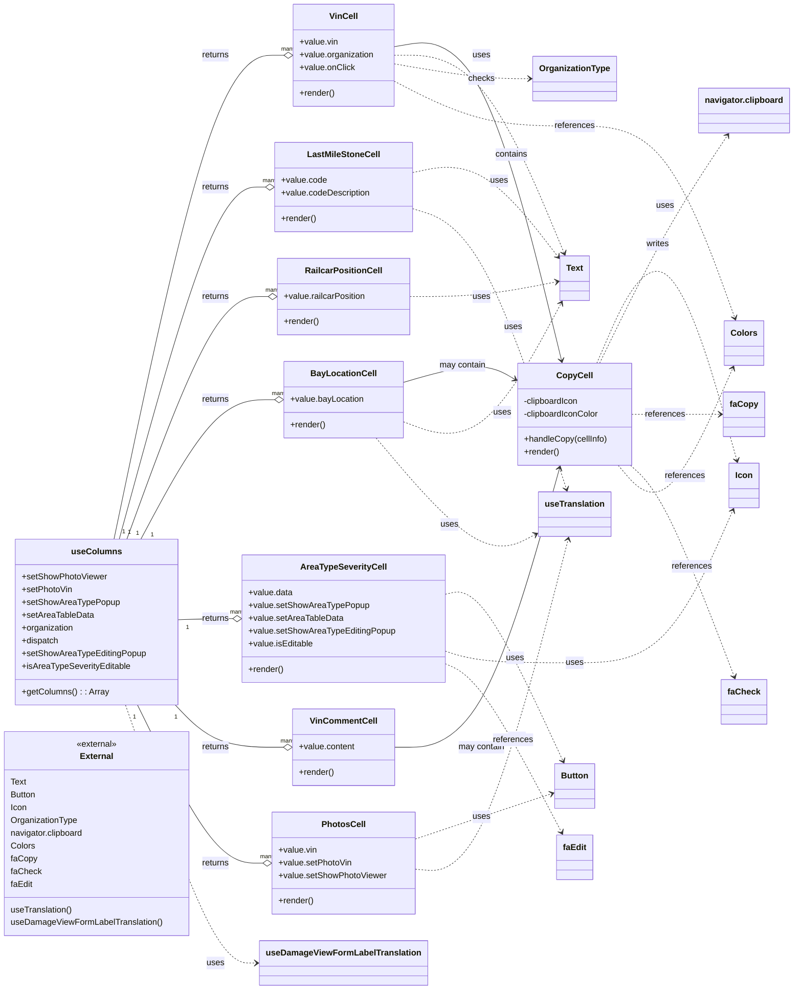

# Diagram: web/portal/src/pages/damageview/details/components/ImpactedVins.columns.js

> Auto-generated by Obscura crawlers

## Mermaid

### SVG

<svg id="container" width="1484.3203125" xmlns="http://www.w3.org/2000/svg" class="classDiagram" height="1862" viewBox="0 0 1484.3203125 1862" role="graphics-document document" aria-roledescription="class"><g><defs><marker id="container_class-aggregationStart" class="marker aggregation class" refX="18" refY="7" markerWidth="190" markerHeight="240" orient="auto"><path d="M 18,7 L9,13 L1,7 L9,1 Z"></path></marker></defs><defs><marker id="container_class-aggregationEnd" class="marker aggregation class" refX="1" refY="7" markerWidth="20" markerHeight="28" orient="auto"><path d="M 18,7 L9,13 L1,7 L9,1 Z"></path></marker></defs><defs><marker id="container_class-extensionStart" class="marker extension class" refX="18" refY="7" markerWidth="190" markerHeight="240" orient="auto"><path d="M 1,7 L18,13 V 1 Z"></path></marker></defs><defs><marker id="container_class-extensionEnd" class="marker extension class" refX="1" refY="7" markerWidth="20" markerHeight="28" orient="auto"><path d="M 1,1 V 13 L18,7 Z"></path></marker></defs><defs><marker id="container_class-compositionStart" class="marker composition class" refX="18" refY="7" markerWidth="190" markerHeight="240" orient="auto"><path d="M 18,7 L9,13 L1,7 L9,1 Z"></path></marker></defs><defs><marker id="container_class-compositionEnd" class="marker composition class" refX="1" refY="7" markerWidth="20" markerHeight="28" orient="auto"><path d="M 18,7 L9,13 L1,7 L9,1 Z"></path></marker></defs><defs><marker id="container_class-dependencyStart" class="marker dependency class" refX="6" refY="7" markerWidth="190" markerHeight="240" orient="auto"><path d="M 5,7 L9,13 L1,7 L9,1 Z"></path></marker></defs><defs><marker id="container_class-dependencyEnd" class="marker dependency class" refX="13" refY="7" markerWidth="20" markerHeight="28" orient="auto"><path d="M 18,7 L9,13 L14,7 L9,1 Z"></path></marker></defs><defs><marker id="container_class-lollipopStart" class="marker lollipop class" refX="13" refY="7" markerWidth="190" markerHeight="240" orient="auto"><circle stroke="black" fill="transparent" cx="7" cy="7" r="6"></circle></marker></defs><defs><marker id="container_class-lollipopEnd" class="marker lollipop class" refX="1" refY="7" markerWidth="190" markerHeight="240" orient="auto"><circle stroke="black" fill="transparent" cx="7" cy="7" r="6"></circle></marker></defs><g class="root"><g class="clusters"></g><g class="edgePaths"><path d="M214.52,1014.5L246.52,862.75C278.519,711,342.517,407.5,395.664,255.75C448.811,104,491.107,104,512.255,104L533.402,104" id="id_useColumns_VinCell_1" class="edge-thickness-normal edge-pattern-solid relation" style=";;;" data-edge="true" data-et="edge" data-id="id_useColumns_VinCell_1" data-points="W3sieCI6MjE0LjUyMDM5MzgxMTUzMzA0LCJ5IjoxMDE0LjV9LHsieCI6NDA2LjUxNTYyNSwieSI6MTA0fSx7IngiOjU1MC42NTIzNDM3NSwieSI6MTA0fV0=" marker-end="url(#container_class-aggregationEnd)"></path><path d="M224.487,1014.5L254.826,904.083C285.164,793.667,345.84,572.833,391.632,462.417C437.424,352,468.333,352,483.788,352L499.242,352" id="id_useColumns_LastMileStoneCell_2" class="edge-thickness-normal edge-pattern-solid relation" style=";;;" data-edge="true" data-et="edge" data-id="id_useColumns_LastMileStoneCell_2" data-points="W3sieCI6MjI0LjQ4NzQ3NzA5MjI0MTksInkiOjEwMTQuNX0seyJ4Ijo0MDYuNTE1NjI1LCJ5IjozNTJ9LHsieCI6NTE2LjQ5MjE4NzUsInkiOjM1Mn1d" marker-end="url(#container_class-aggregationEnd)"></path><path d="M238.903,1014.5L266.839,938.417C294.774,862.333,350.645,710.167,394.852,634.083C439.06,558,471.604,558,487.876,558L504.148,558" id="id_useColumns_RailcarPositionCell_3" class="edge-thickness-normal edge-pattern-solid relation" style=";;;" data-edge="true" data-et="edge" data-id="id_useColumns_RailcarPositionCell_3" data-points="W3sieCI6MjM4LjkwMzI2NTMwNjEyMjQ1LCJ5IjoxMDE0LjV9LHsieCI6NDA2LjUxNTYyNSwieSI6NTU4fSx7IngiOjUyMS4zOTg0Mzc1LCJ5Ijo1NTh9XQ==" marker-end="url(#container_class-aggregationEnd)"></path><path d="M265.455,1014.5L288.965,970.75C312.475,927,359.495,839.5,401.582,795.75C443.668,752,480.82,752,499.396,752L517.973,752" id="id_useColumns_BayLocationCell_4" class="edge-thickness-normal edge-pattern-solid relation" style=";;;" data-edge="true" data-et="edge" data-id="id_useColumns_BayLocationCell_4" data-points="W3sieCI6MjY1LjQ1NTE5NzEzMjYxNjUsInkiOjEwMTQuNX0seyJ4Ijo0MDYuNTE1NjI1LCJ5Ijo3NTJ9LHsieCI6NTM1LjIyMjY1NjI1LCJ5Ijo3NTJ9XQ==" marker-end="url(#container_class-aggregationEnd)"></path><path d="M331.465,1166.169L343.973,1165.808C356.482,1165.446,381.499,1164.723,399.676,1164.362C417.854,1164,429.193,1164,434.862,1164L440.531,1164" id="id_useColumns_AreaTypeSeverityCell_5" class="edge-thickness-normal edge-pattern-solid relation" style=";;;" data-edge="true" data-et="edge" data-id="id_useColumns_AreaTypeSeverityCell_5" data-points="W3sieCI6MzMxLjQ2NDg0Mzc1LCJ5IjoxMTY2LjE2OTE4ODE0NzAxNTh9LHsieCI6NDA2LjUxNTYyNSwieSI6MTE2NH0seyJ4Ijo0NTcuNzgxMjUsInkiOjExNjR9XQ==" marker-end="url(#container_class-aggregationEnd)"></path><path d="M330.597,1326.5L343.25,1339.75C355.903,1353,381.209,1379.5,415.022,1392.75C448.835,1406,491.154,1406,512.313,1406L533.473,1406" id="id_useColumns_VinCommentCell_6" class="edge-thickness-normal edge-pattern-solid relation" style=";;;" data-edge="true" data-et="edge" data-id="id_useColumns_VinCommentCell_6" data-points="W3sieCI6MzMwLjU5NzEzMzc1Nzk2MTgsInkiOjEzMjYuNX0seyJ4Ijo0MDYuNTE1NjI1LCJ5IjoxNDA2fSx7IngiOjU1MC43MjI2NTYyNSwieSI6MTQwNn1d" marker-end="url(#container_class-aggregationEnd)"></path><path d="M258.985,1326.5L283.574,1376.083C308.162,1425.667,357.339,1524.833,396.758,1574.417C436.177,1624,465.839,1624,480.669,1624L495.5,1624" id="id_useColumns_PhotosCell_7" class="edge-thickness-normal edge-pattern-solid relation" style=";;;" data-edge="true" data-et="edge" data-id="id_useColumns_PhotosCell_7" data-points="W3sieCI6MjU4Ljk4NTM5MTQwMDIyMDUsInkiOjEzMjYuNX0seyJ4Ijo0MDYuNTE1NjI1LCJ5IjoxNjI0fSx7IngiOjUxMi43NSwieSI6MTYyNH1d" marker-end="url(#container_class-aggregationEnd)"></path><path d="M740.277,87.766L767.305,83.139C794.333,78.511,848.389,69.255,900.617,167.573C952.845,265.891,1003.244,471.781,1028.444,574.727L1053.644,677.672" id="id_VinCell_CopyCell_8" class="edge-thickness-normal edge-pattern-solid relation" style=";;;" data-edge="true" data-et="edge" data-id="id_VinCell_CopyCell_8" data-points="W3sieCI6NzQwLjI3NzM0Mzc1LCJ5Ijo4Ny43NjYyNzYwMTE5NzgwNX0seyJ4Ijo5MDIuNDQ1MzEyNSwieSI6NjB9LHsieCI6MTA1NS4wNzA2NTk5NjM1MTY0LCJ5Ijo2ODMuNX1d" marker-end="url(#container_class-dependencyEnd)"></path><path d="M755.707,719.826L780.163,712.688C804.62,705.55,853.533,691.275,888.674,690.356C923.816,689.437,945.186,701.874,955.871,708.092L966.556,714.311" id="id_BayLocationCell_CopyCell_9" class="edge-thickness-normal edge-pattern-solid relation" style=";;;" data-edge="true" data-et="edge" data-id="id_BayLocationCell_CopyCell_9" data-points="W3sieCI6NzU1LjcwNzAzMTI1LCJ5Ijo3MTkuODI1NzEwMjQ2NzA1M30seyJ4Ijo5MDIuNDQ1MzEyNSwieSI6Njc3fSx7IngiOjk3MS43NDIxODc1LCJ5Ijo3MTcuMzI4OTEyMzQ5MTgzOH1d" marker-end="url(#container_class-dependencyEnd)"></path><path d="M740.207,1406L767.247,1406C794.286,1406,848.366,1406,899.991,1318.546C951.616,1231.092,1000.787,1056.184,1025.373,968.73L1049.958,881.276" id="id_VinCommentCell_CopyCell_10" class="edge-thickness-normal edge-pattern-solid relation" style=";;;" data-edge="true" data-et="edge" data-id="id_VinCommentCell_CopyCell_10" data-points="W3sieCI6NzQwLjIwNzAzMTI1LCJ5IjoxNDA2fSx7IngiOjkwMi40NDUzMTI1LCJ5IjoxNDA2fSx7IngiOjEwNTEuNTgyMjgzNzY4OTU0NSwieSI6ODc1LjV9XQ==" marker-end="url(#container_class-dependencyEnd)"></path><path d="M1120.066,683.5L1141.426,634.083C1162.786,584.667,1205.506,485.833,1248.91,516.203C1292.313,546.572,1336.399,706.144,1358.443,785.931L1380.486,865.717" id="id_CopyCell_Icon_11" class="edge-thickness-normal edge-pattern-dashed relation" style=";;;" data-edge="true" data-et="edge" data-id="id_CopyCell_Icon_11" data-points="W3sieCI6MTEyMC4wNjU4NTM5MDEyNzM4LCJ5Ijo2ODMuNX0seyJ4IjoxMjQ4LjIyNjU2MjUsInkiOjM4N30seyJ4IjoxMzgyLjA4Mzc3ODQ5MDAyODQsInkiOjg3MS41fV0=" marker-end="url(#container_class-dependencyEnd)"></path><path d="M740.277,104L767.305,104C794.333,104,848.389,104,901.445,165.995C954.502,227.989,1006.558,351.979,1032.586,413.973L1058.614,475.968" id="id_VinCell_Text_12" class="edge-thickness-normal edge-pattern-dashed relation" style=";;;" data-edge="true" data-et="edge" data-id="id_VinCell_Text_12" data-points="W3sieCI6NzQwLjI3NzM0Mzc1LCJ5IjoxMDR9LHsieCI6OTAyLjQ0NTMxMjUsInkiOjEwNH0seyJ4IjoxMDYwLjkzNjgyMDI0NzMxODMsInkiOjQ4MS41fV0=" marker-end="url(#container_class-dependencyEnd)"></path><path d="M774.438,324.648L795.772,320.123C817.107,315.598,859.776,306.549,905.286,333.046C950.797,359.543,999.148,421.587,1023.324,452.609L1047.499,483.63" id="id_LastMileStoneCell_Text_13" class="edge-thickness-normal edge-pattern-dashed relation" style=";;;" data-edge="true" data-et="edge" data-id="id_LastMileStoneCell_Text_13" data-points="W3sieCI6Nzc0LjQzNzUsInkiOjMyNC42NDc2ODg3NTMwOTcxfSx7IngiOjkwMi40NDUzMTI1LCJ5IjoyOTcuNX0seyJ4IjoxMDUxLjE4NzUsInkiOjQ4OC4zNjI5MzQ3MDU0NjQ4NX1d" marker-end="url(#container_class-dependencyEnd)"></path><path d="M769.531,558L791.684,558C813.836,558,858.141,558,904.102,553.336C950.063,548.672,997.681,539.345,1021.49,534.681L1045.299,530.017" id="id_RailcarPositionCell_Text_14" class="edge-thickness-normal edge-pattern-dashed relation" style=";;;" data-edge="true" data-et="edge" data-id="id_RailcarPositionCell_Text_14" data-points="W3sieCI6NzY5LjUzMTI1LCJ5Ijo1NTh9LHsieCI6OTAyLjQ0NTMxMjUsInkiOjU1OH0seyJ4IjoxMDUxLjE4NzUsInkiOjUyOC44NjM4NDQwMzgzMjV9XQ==" marker-end="url(#container_class-dependencyEnd)"></path><path d="M755.707,793.183L780.163,802.319C804.62,811.455,853.533,829.728,903.067,792.659C952.601,755.591,1002.757,663.182,1027.834,616.978L1052.912,570.773" id="id_BayLocationCell_Text_15" class="edge-thickness-normal edge-pattern-dashed relation" style=";;;" data-edge="true" data-et="edge" data-id="id_BayLocationCell_Text_15" data-points="W3sieCI6NzU1LjcwNzAzMTI1LCJ5Ijo3OTMuMTgzMDkwODg0MjE3Mn0seyJ4Ijo5MDIuNDQ1MzEyNSwieSI6ODQ4fSx7IngiOjEwNTUuNzc0NDcyNzQ2NTMzLCJ5Ijo1NjUuNX1d" marker-end="url(#container_class-dependencyEnd)"></path><path d="M833.148,1118.719L844.698,1115.932C856.247,1113.146,879.346,1107.573,916.557,1159.714C953.767,1211.855,1005.088,1321.709,1030.749,1376.637L1056.409,1431.564" id="id_AreaTypeSeverityCell_Button_16" class="edge-thickness-normal edge-pattern-dashed relation" style=";;;" data-edge="true" data-et="edge" data-id="id_AreaTypeSeverityCell_Button_16" data-points="W3sieCI6ODMzLjE0ODQzNzUsInkiOjExMTguNzE4ODA0NjI3MDU0fSx7IngiOjkwMi40NDUzMTI1LCJ5IjoxMTAyfSx7IngiOjEwNTguOTQ4OTU5NzE0ODU0LCJ5IjoxNDM3fV0=" marker-end="url(#container_class-dependencyEnd)"></path><path d="M833.148,1224.618L844.698,1228.349C856.247,1232.079,879.346,1239.539,920.25,1243.27C961.154,1247,1019.862,1247,1077.492,1247C1135.122,1247,1191.674,1247,1240.741,1199.333C1289.808,1151.667,1331.389,1056.333,1352.179,1008.666L1372.97,961" id="id_AreaTypeSeverityCell_Icon_17" class="edge-thickness-normal edge-pattern-dashed relation" style=";;;" data-edge="true" data-et="edge" data-id="id_AreaTypeSeverityCell_Icon_17" data-points="W3sieCI6ODMzLjE0ODQzNzUsInkiOjEyMjQuNjE4Mzc0NDUwODc5NH0seyJ4Ijo5MDIuNDQ1MzEyNSwieSI6MTI0N30seyJ4IjoxMDc4LjU3MDMxMjUsInkiOjEyNDd9LHsieCI6MTI0OC4yMjY1NjI1LCJ5IjoxMjQ3fSx7IngiOjEzNzUuMzY4NTgxMzM0MzMzLCJ5Ijo5NTUuNX1d" marker-end="url(#container_class-dependencyEnd)"></path><path d="M778.18,1579.07L798.891,1572.058C819.602,1565.047,861.023,1551.023,903.999,1536.679C946.975,1522.336,991.505,1507.671,1013.77,1500.339L1036.035,1493.007" id="id_PhotosCell_Button_18" class="edge-thickness-normal edge-pattern-dashed relation" style=";;;" data-edge="true" data-et="edge" data-id="id_PhotosCell_Button_18" data-points="W3sieCI6Nzc4LjE3OTY4NzUsInkiOjE1NzkuMDY5NzcwNjIzMzc1NX0seyJ4Ijo5MDIuNDQ1MzEyNSwieSI6MTUzN30seyJ4IjoxMDQxLjczNDM3NSwieSI6MTQ5MS4xMzA1MDAzNTQ4NjE2fV0=" marker-end="url(#container_class-dependencyEnd)"></path><path d="M778.18,1635.362L798.891,1637.135C819.602,1638.908,861.023,1642.454,909.02,1539.112C957.017,1435.769,1011.589,1225.538,1038.875,1120.423L1066.16,1015.308" id="id_PhotosCell_useTranslation_19" class="edge-thickness-normal edge-pattern-dashed relation" style=";;;" data-edge="true" data-et="edge" data-id="id_PhotosCell_useTranslation_19" data-points="W3sieCI6Nzc4LjE3OTY4NzUsInkiOjE2MzUuMzYxNjY3MTk4Njg2N30seyJ4Ijo5MDIuNDQ1MzEyNSwieSI6MTY0Nn0seyJ4IjoxMDY3LjY2Nzk1NDM1NzAzNzYsInkiOjEwMDkuNX1d" marker-end="url(#container_class-dependencyEnd)"></path><path d="M774.438,392.652L795.772,399.377C817.107,406.101,859.776,419.551,907.845,507.409C955.915,595.267,1009.384,757.534,1036.118,838.668L1062.853,919.801" id="id_LastMileStoneCell_useTranslation_20" class="edge-thickness-normal edge-pattern-dashed relation" style=";;;" data-edge="true" data-et="edge" data-id="id_LastMileStoneCell_useTranslation_20" data-points="W3sieCI6Nzc0LjQzNzUsInkiOjM5Mi42NTIwNTg5MTc0MTUzfSx7IngiOjkwMi40NDUzMTI1LCJ5Ijo0MzN9LHsieCI6MTA2NC43MzA3NDI4MDg2OTk3LCJ5Ijo5MjUuNX1d" marker-end="url(#container_class-dependencyEnd)"></path><path d="M705.931,824L738.683,863C771.436,902,836.94,980,887.143,1010.033C937.346,1040.067,972.247,1022.133,989.697,1013.166L1007.148,1004.2" id="id_BayLocationCell_useTranslation_21" class="edge-thickness-normal edge-pattern-dashed relation" style=";;;" data-edge="true" data-et="edge" data-id="id_BayLocationCell_useTranslation_21" data-points="W3sieCI6NzA1LjkzMDgzNjM5NzA1ODgsInkiOjgyNH0seyJ4Ijo5MDIuNDQ1MzEyNSwieSI6MTA1OH0seyJ4IjoxMDEyLjQ4NDM3NSwieSI6MTAwMS40NTc1NzE4NTk0NzQ4fV0=" marker-end="url(#container_class-dependencyEnd)"></path><path d="M1125.305,683.5L1145.792,641.417C1166.279,599.333,1207.253,515.167,1246.871,443.754C1286.489,372.342,1324.751,313.684,1343.882,284.354L1363.013,255.025" id="id_CopyCell_navigator.clipboard_22" class="edge-thickness-normal edge-pattern-dashed relation" style=";;;" data-edge="true" data-et="edge" data-id="id_CopyCell_navigator.clipboard_22" data-points="W3sieCI6MTEyNS4zMDQ4ODkyNTc1MzIzLCJ5Ijo2ODMuNX0seyJ4IjoxMjQ4LjIyNjU2MjUsInkiOjQzMX0seyJ4IjoxMzY2LjI5MTI2OTYxODgzNDEsInkiOjI1MH1d" marker-end="url(#container_class-dependencyEnd)"></path><path d="M740.277,120.234L767.305,124.861C794.333,129.489,848.389,138.745,891.1,143.372C933.81,148,965.174,148,980.857,148L996.539,148" id="id_VinCell_OrganizationType_23" class="edge-thickness-normal edge-pattern-dashed relation" style=";;;" data-edge="true" data-et="edge" data-id="id_VinCell_OrganizationType_23" data-points="W3sieCI6NzQwLjI3NzM0Mzc1LCJ5IjoxMjAuMjMzNzIzOTg4MDIxOTV9LHsieCI6OTAyLjQ0NTMxMjUsInkiOjE0OH0seyJ4IjoxMDAyLjUzOTA2MjUsInkiOjE0OH1d" marker-end="url(#container_class-dependencyEnd)"></path><path d="M236.314,1326.5L264.681,1407.417C293.048,1488.333,349.782,1650.167,391.846,1731.083C433.91,1812,461.305,1812,475.002,1812L488.699,1812" id="id_useColumns_useDamageViewFormLabelTranslation_24" class="edge-thickness-normal edge-pattern-dashed relation" style=";;;" data-edge="true" data-et="edge" data-id="id_useColumns_useDamageViewFormLabelTranslation_24" data-points="W3sieCI6MjM2LjMxMzkxMjcwNDU5ODYsInkiOjEzMjYuNX0seyJ4Ijo0MDYuNTE1NjI1LCJ5IjoxODEyfSx7IngiOjQ5NC42OTkyMTg3NSwieSI6MTgxMn1d" marker-end="url(#container_class-dependencyEnd)"></path><path d="M1185.398,779.5L1195.87,779.5C1206.341,779.5,1227.284,779.5,1254.829,779.5C1282.375,779.5,1316.523,779.5,1333.598,779.5L1350.672,779.5" id="id_CopyCell_faCopy_25" class="edge-thickness-normal edge-pattern-dashed relation" style=";;;" data-edge="true" data-et="edge" data-id="id_CopyCell_faCopy_25" data-points="W3sieCI6MTE4NS4zOTg0Mzc1LCJ5Ijo3NzkuNX0seyJ4IjoxMjQ4LjIyNjU2MjUsInkiOjc3OS41fSx7IngiOjEzNTYuNjcxODc1LCJ5Ijo3NzkuNX1d" marker-end="url(#container_class-dependencyEnd)"></path><path d="M1183.31,875.5L1194.129,885.417C1204.949,895.333,1226.588,915.167,1258.656,981.398C1290.725,1047.629,1333.223,1160.258,1354.472,1216.572L1375.721,1272.886" id="id_CopyCell_faCheck_26" class="edge-thickness-normal edge-pattern-dashed relation" style=";;;" data-edge="true" data-et="edge" data-id="id_CopyCell_faCheck_26" data-points="W3sieCI6MTE4My4zMDk4NjIzMzkyMjg0LCJ5Ijo4NzUuNX0seyJ4IjoxMjQ4LjIyNjU2MjUsInkiOjkzNX0seyJ4IjoxMzc3LjgzOTYxNTc1ODc1NSwieSI6MTI3OC41fV0=" marker-end="url(#container_class-dependencyEnd)"></path><path d="M833.148,1247.989L844.698,1253.158C856.247,1258.326,879.346,1268.663,916.092,1321.614C952.838,1374.564,1003.231,1470.128,1028.428,1517.911L1053.624,1565.693" id="id_AreaTypeSeverityCell_faEdit_27" class="edge-thickness-normal edge-pattern-dashed relation" style=";;;" data-edge="true" data-et="edge" data-id="id_AreaTypeSeverityCell_faEdit_27" data-points="W3sieCI6ODMzLjE0ODQzNzUsInkiOjEyNDcuOTg5MzEzOTk4MjA2NH0seyJ4Ijo5MDIuNDQ1MzEyNSwieSI6MTI3OX0seyJ4IjoxMDU2LjQyMjg1NzQxMDE3OTYsInkiOjE1NzF9XQ==" marker-end="url(#container_class-dependencyEnd)"></path><path d="M740.277,153.07L767.305,167.058C794.333,181.047,848.389,209.023,904.771,223.012C961.154,237,1019.862,237,1077.492,237C1135.122,237,1191.674,237,1241.366,297.141C1291.057,357.283,1333.888,477.565,1355.304,537.706L1376.719,597.848" id="id_VinCell_Colors_28" class="edge-thickness-normal edge-pattern-dashed relation" style=";;;" data-edge="true" data-et="edge" data-id="id_VinCell_Colors_28" data-points="W3sieCI6NzQwLjI3NzM0Mzc1LCJ5IjoxNTMuMDcwMTIwMjM2NTIwOX0seyJ4Ijo5MDIuNDQ1MzEyNSwieSI6MjM3fSx7IngiOjEwNzguNTcwMzEyNSwieSI6MjM3fSx7IngiOjEyNDguMjI2NTYyNSwieSI6MjM3fSx7IngiOjEzNzguNzMxOTA3ODk0NzM2OSwieSI6NjAzLjV9XQ==" marker-end="url(#container_class-dependencyEnd)"></path><path d="M1160.209,875.5L1174.879,892.75C1189.548,910,1218.888,944.5,1254.348,914.083C1289.808,883.667,1331.389,788.333,1352.179,740.666L1372.97,693" id="id_CopyCell_Colors_29" class="edge-thickness-normal edge-pattern-dashed relation" style=";;;" data-edge="true" data-et="edge" data-id="id_CopyCell_Colors_29" data-points="W3sieCI6MTE2MC4yMDk0MTAyNDQzNjEsInkiOjg3NS41fSx7IngiOjEyNDguMjI2NTYyNSwieSI6OTc5fSx7IngiOjEzNzUuMzY4NTgxMzM0MzMzLCJ5Ijo2ODcuNX1d" marker-end="url(#container_class-dependencyEnd)"></path></g><g class="edgeLabels"><g class="edgeLabel" transform="translate(406.515625, 104)"><g class="label" data-id="id_useColumns_VinCell_1" transform="translate(-26.265625, -12)"><foreignObject width="52.53125" height="24">

returns

</foreignObject></g></g><g class="edgeLabel" transform="translate(406.515625, 352)"><g class="label" data-id="id_useColumns_LastMileStoneCell_2" transform="translate(-26.265625, -12)"><foreignObject width="52.53125" height="24">

returns

</foreignObject></g></g><g class="edgeLabel" transform="translate(406.515625, 558)"><g class="label" data-id="id_useColumns_RailcarPositionCell_3" transform="translate(-26.265625, -12)"><foreignObject width="52.53125" height="24">

returns

</foreignObject></g></g><g class="edgeLabel" transform="translate(406.515625, 752)"><g class="label" data-id="id_useColumns_BayLocationCell_4" transform="translate(-26.265625, -12)"><foreignObject width="52.53125" height="24">

returns

</foreignObject></g></g><g class="edgeLabel" transform="translate(406.515625, 1164)"><g class="label" data-id="id_useColumns_AreaTypeSeverityCell_5" transform="translate(-26.265625, -12)"><foreignObject width="52.53125" height="24">

returns

</foreignObject></g></g><g class="edgeLabel" transform="translate(406.515625, 1406)"><g class="label" data-id="id_useColumns_VinCommentCell_6" transform="translate(-26.265625, -12)"><foreignObject width="52.53125" height="24">

returns

</foreignObject></g></g><g class="edgeLabel" transform="translate(406.515625, 1624)"><g class="label" data-id="id_useColumns_PhotosCell_7" transform="translate(-26.265625, -12)"><foreignObject width="52.53125" height="24">

returns

</foreignObject></g></g><g class="edgeLabel" transform="translate(959.19826, 291.84524)"><g class="label" data-id="id_VinCell_CopyCell_8" transform="translate(-30.890625, -12)"><foreignObject width="61.78125" height="24">

contains

</foreignObject></g></g><g class="edgeLabel" transform="translate(867.5596, 687.18143)"><g class="label" data-id="id_BayLocationCell_CopyCell_9" transform="translate(-44.296875, -12)"><foreignObject width="88.59375" height="24">

may contain

</foreignObject></g></g><g class="edgeLabel" transform="translate(902.4453125, 1406)"><g class="label" data-id="id_VinCommentCell_CopyCell_10" transform="translate(-44.296875, -12)"><foreignObject width="88.59375" height="24">

may contain

</foreignObject></g></g><g class="edgeLabel" transform="translate(1272.14558, 473.57557)"><g class="label" data-id="id_CopyCell_Icon_11" transform="translate(-16.4921875, -12)"><foreignObject width="32.984375" height="24">

uses

</foreignObject></g></g><g class="edgeLabel" transform="translate(902.4453125, 104)"><g class="label" data-id="id_VinCell_Text_12" transform="translate(-16.4921875, -12)"><foreignObject width="32.984375" height="24">

uses

</foreignObject></g></g><g class="edgeLabel" transform="translate(936.59846, 341.32462)"><g class="label" data-id="id_LastMileStoneCell_Text_13" transform="translate(-16.4921875, -12)"><foreignObject width="32.984375" height="24">

uses

</foreignObject></g></g><g class="edgeLabel" transform="translate(902.4453125, 558)"><g class="label" data-id="id_RailcarPositionCell_Text_14" transform="translate(-16.4921875, -12)"><foreignObject width="32.984375" height="24">

uses

</foreignObject></g></g><g class="edgeLabel" transform="translate(941.74862, 775.58596)"><g class="label" data-id="id_BayLocationCell_Text_15" transform="translate(-16.4921875, -12)"><foreignObject width="32.984375" height="24">

uses

</foreignObject></g></g><g class="edgeLabel" transform="translate(965.61093, 1237.20759)"><g class="label" data-id="id_AreaTypeSeverityCell_Button_16" transform="translate(-16.4921875, -12)"><foreignObject width="32.984375" height="24">

uses

</foreignObject></g></g><g class="edgeLabel" transform="translate(1078.5703125, 1247)"><g class="label" data-id="id_AreaTypeSeverityCell_Icon_17" transform="translate(-16.4921875, -12)"><foreignObject width="32.984375" height="24">

uses

</foreignObject></g></g><g class="edgeLabel" transform="translate(902.4453125, 1537)"><g class="label" data-id="id_PhotosCell_Button_18" transform="translate(-16.4921875, -12)"><foreignObject width="32.984375" height="24">

uses

</foreignObject></g></g><g class="edgeLabel" transform="translate(969.38848, 1388.10966)"><g class="label" data-id="id_PhotosCell_useTranslation_19" transform="translate(-16.4921875, -12)"><foreignObject width="32.984375" height="24">

uses

</foreignObject></g></g><g class="edgeLabel" transform="translate(962.58584, 615.51306)"><g class="label" data-id="id_LastMileStoneCell_useTranslation_20" transform="translate(-16.4921875, -12)"><foreignObject width="32.984375" height="24">

uses

</foreignObject></g></g><g class="edgeLabel" transform="translate(902.4453125, 1058)"><g class="label" data-id="id_BayLocationCell_useTranslation_21" transform="translate(-16.4921875, -12)"><foreignObject width="32.984375" height="24">

uses

</foreignObject></g></g><g class="edgeLabel" transform="translate(1234.06052, 460.09923)"><g class="label" data-id="id_CopyCell_navigator.clipboard_22" transform="translate(-21.9453125, -12)"><foreignObject width="43.890625" height="24">

writes

</foreignObject></g></g><g class="edgeLabel" transform="translate(902.4453125, 148)"><g class="label" data-id="id_VinCell_OrganizationType_23" transform="translate(-24.4921875, -12)"><foreignObject width="48.984375" height="24">

checks

</foreignObject></g></g><g class="edgeLabel" transform="translate(406.515625, 1812)"><g class="label" data-id="id_useColumns_useDamageViewFormLabelTranslation_24" transform="translate(-16.4921875, -12)"><foreignObject width="32.984375" height="24">

uses

</foreignObject></g></g><g class="edgeLabel" transform="translate(1248.2265625, 779.5)"><g class="label" data-id="id_CopyCell_faCopy_25" transform="translate(-37.828125, -12)"><foreignObject width="75.65625" height="24">

references

</foreignObject></g></g><g class="edgeLabel" transform="translate(1297.48912, 1065.55544)"><g class="label" data-id="id_CopyCell_faCheck_26" transform="translate(-37.828125, -12)"><foreignObject width="75.65625" height="24">

references

</foreignObject></g></g><g class="edgeLabel" transform="translate(961.72814, 1391.42279)"><g class="label" data-id="id_AreaTypeSeverityCell_faEdit_27" transform="translate(-37.828125, -12)"><foreignObject width="75.65625" height="24">

references

</foreignObject></g></g><g class="edgeLabel" transform="translate(1078.5703125, 237)"><g class="label" data-id="id_VinCell_Colors_28" transform="translate(-37.828125, -12)"><foreignObject width="75.65625" height="24">

references

</foreignObject></g></g><g class="edgeLabel" transform="translate(1284.63877, 895.5173)"><g class="label" data-id="id_CopyCell_Colors_29" transform="translate(-37.828125, -12)"><foreignObject width="75.65625" height="24">

references

</foreignObject></g></g><g class="edgeTerminals" transform="translate(232.80841234200352, 1000.4715171805226)"><g class="inner" transform="translate(0, 0)"><foreignObject style="width: 9px; height: 12px;">
1
</foreignObject></g></g><g class="edgeTerminals" transform="translate(243.58791309012233, 1001.5994843705486)"><g class="inner" transform="translate(0, 0)"><foreignObject style="width: 9px; height: 12px;">
1
</foreignObject></g></g><g class="edgeTerminals" transform="translate(259.0158472829482, 1003.2423775900537)"><g class="inner" transform="translate(0, 0)"><foreignObject style="width: 9px; height: 12px;">
1
</foreignObject></g></g><g class="edgeTerminals" transform="translate(286.951999248439, 1006.185099729638)"><g class="inner" transform="translate(0, 0)"><foreignObject style="width: 9px; height: 12px;">
1
</foreignObject></g></g><g class="edgeTerminals" transform="translate(349.39089898535696, 1180.6573376760484)"><g class="inner" transform="translate(0, 0)"><foreignObject style="width: 9px; height: 12px;">
1
</foreignObject></g></g><g class="edgeTerminals" transform="translate(331.8349951661175, 1349.5155965180722)"><g class="inner" transform="translate(0, 0)"><foreignObject style="width: 9px; height: 12px;">
1
</foreignObject></g></g><g class="edgeTerminals" transform="translate(253.32178529424968, 1348.8421928183861)"><g class="inner" transform="translate(0, 0)"><foreignObject style="width: 9px; height: 12px;">
1
</foreignObject></g></g><g class="edgeTerminals" transform="translate(528.152341875, 84)"><g class="inner" transform="translate(0, 0)"></g><foreignObject style="width: 36px; height: 12px;">
many
</foreignObject></g><g class="edgeTerminals" transform="translate(493.99218874999997, 332)"><g class="inner" transform="translate(0, 0)"></g><foreignObject style="width: 36px; height: 12px;">
many
</foreignObject></g><g class="edgeTerminals" transform="translate(498.89843874999997, 538)"><g class="inner" transform="translate(0, 0)"></g><foreignObject style="width: 36px; height: 12px;">
many
</foreignObject></g><g class="edgeTerminals" transform="translate(512.722658125, 732)"><g class="inner" transform="translate(0, 0)"></g><foreignObject style="width: 36px; height: 12px;">
many
</foreignObject></g><g class="edgeTerminals" transform="translate(435.28125, 1144)"><g class="inner" transform="translate(0, 0)"></g><foreignObject style="width: 36px; height: 12px;">
many
</foreignObject></g><g class="edgeTerminals" transform="translate(528.222658125, 1386)"><g class="inner" transform="translate(0, 0)"></g><foreignObject style="width: 36px; height: 12px;">
many
</foreignObject></g><g class="edgeTerminals" transform="translate(490.25, 1604)"><g class="inner" transform="translate(0, 0)"></g><foreignObject style="width: 36px; height: 12px;">
many
</foreignObject></g></g><g class="nodes"><g class="node default" id="classId-useColumns-0" transform="translate(181.625, 1170.5)"><g class="basic label-container"><path d="M-149.83984375 -156 L149.83984375 -156 L149.83984375 156 L-149.83984375 156" stroke="none" stroke-width="0" fill="#ECECFF" style=""></path><path d="M-149.83984375 -156 C-31.372115793280145 -156, 87.09561216343971 -156, 149.83984375 -156 M-149.83984375 -156 C-56.13452660106418 -156, 37.57079054787164 -156, 149.83984375 -156 M149.83984375 -156 C149.83984375 -68.53610531862402, 149.83984375 18.927789362751952, 149.83984375 156 M149.83984375 -156 C149.83984375 -69.06792287225913, 149.83984375 17.864154255481736, 149.83984375 156 M149.83984375 156 C45.876904936123466 156, -58.08603387775307 156, -149.83984375 156 M149.83984375 156 C83.00118148707553 156, 16.162519224151055 156, -149.83984375 156 M-149.83984375 156 C-149.83984375 73.24652746887851, -149.83984375 -9.506945062242977, -149.83984375 -156 M-149.83984375 156 C-149.83984375 65.47956905276786, -149.83984375 -25.040861894464285, -149.83984375 -156" stroke="#9370DB" stroke-width="1.3" fill="none" stroke-dasharray="0 0" style=""></path></g><g class="annotation-group text" transform="translate(0, -132)"></g><g class="label-group text" transform="translate(-44.1640625, -132)"><g class="label" style="font-weight: bolder" transform="translate(0,-12)"><foreignObject width="88.328125" height="24">

useColumns

</foreignObject></g></g><g class="members-group text" transform="translate(-137.83984375, -84)"><g class="label" style="" transform="translate(0,-12)"><foreignObject width="159.9375" height="24">

+setShowPhotoViewer

</foreignObject></g><g class="label" style="" transform="translate(0,12)"><foreignObject width="95.3125" height="24">

+setPhotoVin

</foreignObject></g><g class="label" style="" transform="translate(0,36)"><foreignObject width="181.203125" height="24">

+setShowAreaTypePopup

</foreignObject></g><g class="label" style="" transform="translate(0,60)"><foreignObject width="134.3125" height="24">

+setAreaTableData

</foreignObject></g><g class="label" style="" transform="translate(0,84)"><foreignObject width="98.34375" height="24">

+organization

</foreignObject></g><g class="label" style="" transform="translate(0,108)"><foreignObject width="70.15625" height="24">

+dispatch

</foreignObject></g><g class="label" style="" transform="translate(0,132)"><foreignObject width="231.515625" height="24">

+setShowAreaTypeEditingPopup

</foreignObject></g><g class="label" style="" transform="translate(0,156)"><foreignObject width="203.515625" height="24">

+isAreaTypeSeverityEditable

</foreignObject></g></g><g class="methods-group text" transform="translate(-137.83984375, 132)"><g class="label" style="" transform="translate(0,-12)"><foreignObject width="161.15625" height="24">

+getColumns() : : Array

</foreignObject></g></g><g class="divider" style=""><path d="M-149.83984375 -108 C-34.63488196379117 -108, 80.57007982241765 -108, 149.83984375 -108 M-149.83984375 -108 C-75.18729940818002 -108, -0.5347550663600487 -108, 149.83984375 -108" stroke="#9370DB" stroke-width="1.3" fill="none" stroke-dasharray="0 0" style=""></path></g><g class="divider" style=""><path d="M-149.83984375 108 C-87.06942978636701 108, -24.299015822734034 108, 149.83984375 108 M-149.83984375 108 C-46.77541629372507 108, 56.289011162549855 108, 149.83984375 108" stroke="#9370DB" stroke-width="1.3" fill="none" stroke-dasharray="0 0" style=""></path></g></g><g class="node default" id="classId-CopyCell-1" transform="translate(1078.5703125, 779.5)"><g class="basic label-container"><path d="M-106.828125 -96 L106.828125 -96 L106.828125 96 L-106.828125 96" stroke="none" stroke-width="0" fill="#ECECFF" style=""></path><path d="M-106.828125 -96 C-49.89798945658322 -96, 7.0321460868335635 -96, 106.828125 -96 M-106.828125 -96 C-50.100657335400136 -96, 6.626810329199728 -96, 106.828125 -96 M106.828125 -96 C106.828125 -23.149114962765125, 106.828125 49.70177007446975, 106.828125 96 M106.828125 -96 C106.828125 -42.625435215293905, 106.828125 10.74912956941219, 106.828125 96 M106.828125 96 C48.474984379739084 96, -9.878156240521832 96, -106.828125 96 M106.828125 96 C55.21855010674127 96, 3.6089752134825375 96, -106.828125 96 M-106.828125 96 C-106.828125 36.27251772160835, -106.828125 -23.454964556783295, -106.828125 -96 M-106.828125 96 C-106.828125 25.414237900164693, -106.828125 -45.171524199670614, -106.828125 -96" stroke="#9370DB" stroke-width="1.3" fill="none" stroke-dasharray="0 0" style=""></path></g><g class="annotation-group text" transform="translate(0, -72)"></g><g class="label-group text" transform="translate(-31.578125, -72)"><g class="label" style="font-weight: bolder" transform="translate(0,-12)"><foreignObject width="63.15625" height="24">

CopyCell

</foreignObject></g></g><g class="members-group text" transform="translate(-94.828125, -24)"><g class="label" style="" transform="translate(0,-12)"><foreignObject width="106.234375" height="24">

-clipboardIcon

</foreignObject></g><g class="label" style="" transform="translate(0,12)"><foreignObject width="144.34375" height="24">

-clipboardIconColor

</foreignObject></g></g><g class="methods-group text" transform="translate(-94.828125, 48)"><g class="label" style="" transform="translate(0,-12)"><foreignObject width="158.078125" height="24">

+handleCopy(cellInfo)

</foreignObject></g><g class="label" style="" transform="translate(0,12)"><foreignObject width="66.609375" height="24">

+render()

</foreignObject></g></g><g class="divider" style=""><path d="M-106.828125 -48 C-52.76120597650493 -48, 1.3057130469901352 -48, 106.828125 -48 M-106.828125 -48 C-45.89015943421998 -48, 15.047806131560037 -48, 106.828125 -48" stroke="#9370DB" stroke-width="1.3" fill="none" stroke-dasharray="0 0" style=""></path></g><g class="divider" style=""><path d="M-106.828125 24 C-30.827013255494705 24, 45.17409848901059 24, 106.828125 24 M-106.828125 24 C-58.57873951149224 24, -10.329354022984475 24, 106.828125 24" stroke="#9370DB" stroke-width="1.3" fill="none" stroke-dasharray="0 0" style=""></path></g></g><g class="node default" id="classId-VinCell-2" transform="translate(645.46484375, 104)"><g class="basic label-container"><path d="M-94.8125 -96 L94.8125 -96 L94.8125 96 L-94.8125 96" stroke="none" stroke-width="0" fill="#ECECFF" style=""></path><path d="M-94.8125 -96 C-23.899227132586944 -96, 47.01404573482611 -96, 94.8125 -96 M-94.8125 -96 C-48.05961744667266 -96, -1.3067348933453218 -96, 94.8125 -96 M94.8125 -96 C94.8125 -29.759539056876747, 94.8125 36.480921886246506, 94.8125 96 M94.8125 -96 C94.8125 -41.24560258237658, 94.8125 13.508794835246846, 94.8125 96 M94.8125 96 C34.498207396944196 96, -25.81608520611161 96, -94.8125 96 M94.8125 96 C54.1264436936177 96, 13.440387387235404 96, -94.8125 96 M-94.8125 96 C-94.8125 34.577257104170506, -94.8125 -26.845485791658987, -94.8125 -96 M-94.8125 96 C-94.8125 26.7879987766198, -94.8125 -42.4240024467604, -94.8125 -96" stroke="#9370DB" stroke-width="1.3" fill="none" stroke-dasharray="0 0" style=""></path></g><g class="annotation-group text" transform="translate(0, -72)"></g><g class="label-group text" transform="translate(-25.046875, -72)"><g class="label" style="font-weight: bolder" transform="translate(0,-12)"><foreignObject width="50.09375" height="24">

VinCell

</foreignObject></g></g><g class="members-group text" transform="translate(-82.8125, -24)"><g class="label" style="" transform="translate(0,-12)"><foreignObject width="71.515625" height="24">

+value.vin

</foreignObject></g><g class="label" style="" transform="translate(0,12)"><foreignObject width="140.578125" height="24">

+value.organization

</foreignObject></g><g class="label" style="" transform="translate(0,36)"><foreignObject width="102.796875" height="24">

+value.onClick

</foreignObject></g></g><g class="methods-group text" transform="translate(-82.8125, 72)"><g class="label" style="" transform="translate(0,-12)"><foreignObject width="66.609375" height="24">

+render()

</foreignObject></g></g><g class="divider" style=""><path d="M-94.8125 -48 C-53.62760339389788 -48, -12.442706787795757 -48, 94.8125 -48 M-94.8125 -48 C-42.173995440838304 -48, 10.464509118323392 -48, 94.8125 -48" stroke="#9370DB" stroke-width="1.3" fill="none" stroke-dasharray="0 0" style=""></path></g><g class="divider" style=""><path d="M-94.8125 48 C-20.670308883247074 48, 53.47188223350585 48, 94.8125 48 M-94.8125 48 C-25.99755539122178 48, 42.81738921755644 48, 94.8125 48" stroke="#9370DB" stroke-width="1.3" fill="none" stroke-dasharray="0 0" style=""></path></g></g><g class="node default" id="classId-LastMileStoneCell-3" transform="translate(645.46484375, 352)"><g class="basic label-container"><path d="M-128.97265625 -84 L128.97265625 -84 L128.97265625 84 L-128.97265625 84" stroke="none" stroke-width="0" fill="#ECECFF" style=""></path><path d="M-128.97265625 -84 C-62.15233928218211 -84, 4.667977685635776 -84, 128.97265625 -84 M-128.97265625 -84 C-52.94570040818269 -84, 23.081255433634624 -84, 128.97265625 -84 M128.97265625 -84 C128.97265625 -22.67788423151393, 128.97265625 38.64423153697214, 128.97265625 84 M128.97265625 -84 C128.97265625 -49.648029931204775, 128.97265625 -15.29605986240955, 128.97265625 84 M128.97265625 84 C33.909255609735894 84, -61.15414503052821 84, -128.97265625 84 M128.97265625 84 C31.09038301851497 84, -66.79189021297006 84, -128.97265625 84 M-128.97265625 84 C-128.97265625 19.979391776474742, -128.97265625 -44.041216447050516, -128.97265625 -84 M-128.97265625 84 C-128.97265625 24.84968336894581, -128.97265625 -34.30063326210838, -128.97265625 -84" stroke="#9370DB" stroke-width="1.3" fill="none" stroke-dasharray="0 0" style=""></path></g><g class="annotation-group text" transform="translate(0, -60)"></g><g class="label-group text" transform="translate(-65.4140625, -60)"><g class="label" style="font-weight: bolder" transform="translate(0,-12)"><foreignObject width="130.828125" height="24">

LastMileStoneCell

</foreignObject></g></g><g class="members-group text" transform="translate(-116.97265625, -12)"><g class="label" style="" transform="translate(0,-12)"><foreignObject width="85.1875" height="24">

+value.code

</foreignObject></g><g class="label" style="" transform="translate(0,12)"><foreignObject width="168.53125" height="24">

+value.codeDescription

</foreignObject></g></g><g class="methods-group text" transform="translate(-116.97265625, 60)"><g class="label" style="" transform="translate(0,-12)"><foreignObject width="66.609375" height="24">

+render()

</foreignObject></g></g><g class="divider" style=""><path d="M-128.97265625 -36 C-53.959945407082245 -36, 21.05276543583551 -36, 128.97265625 -36 M-128.97265625 -36 C-60.106595214060576 -36, 8.759465821878848 -36, 128.97265625 -36" stroke="#9370DB" stroke-width="1.3" fill="none" stroke-dasharray="0 0" style=""></path></g><g class="divider" style=""><path d="M-128.97265625 36 C-73.20875906124769 36, -17.444861872495395 36, 128.97265625 36 M-128.97265625 36 C-65.07026328520921 36, -1.167870320418416 36, 128.97265625 36" stroke="#9370DB" stroke-width="1.3" fill="none" stroke-dasharray="0 0" style=""></path></g></g><g class="node default" id="classId-RailcarPositionCell-4" transform="translate(645.46484375, 558)"><g class="basic label-container"><path d="M-124.06640625 -72 L124.06640625 -72 L124.06640625 72 L-124.06640625 72" stroke="none" stroke-width="0" fill="#ECECFF" style=""></path><path d="M-124.06640625 -72 C-54.932123497112116 -72, 14.202159255775769 -72, 124.06640625 -72 M-124.06640625 -72 C-54.71196491849854 -72, 14.642476413002925 -72, 124.06640625 -72 M124.06640625 -72 C124.06640625 -25.24221806414971, 124.06640625 21.51556387170058, 124.06640625 72 M124.06640625 -72 C124.06640625 -41.42309767456439, 124.06640625 -10.846195349128777, 124.06640625 72 M124.06640625 72 C40.96483654203767 72, -42.13673316592465 72, -124.06640625 72 M124.06640625 72 C56.921023471447825 72, -10.22435930710435 72, -124.06640625 72 M-124.06640625 72 C-124.06640625 40.55998402331355, -124.06640625 9.119968046627086, -124.06640625 -72 M-124.06640625 72 C-124.06640625 37.25350819933605, -124.06640625 2.507016398672107, -124.06640625 -72" stroke="#9370DB" stroke-width="1.3" fill="none" stroke-dasharray="0 0" style=""></path></g><g class="annotation-group text" transform="translate(0, -48)"></g><g class="label-group text" transform="translate(-68.7734375, -48)"><g class="label" style="font-weight: bolder" transform="translate(0,-12)"><foreignObject width="137.546875" height="24">

RailcarPositionCell

</foreignObject></g></g><g class="members-group text" transform="translate(-112.06640625, 0)"><g class="label" style="" transform="translate(0,-12)"><foreignObject width="155.359375" height="24">

+value.railcarPosition

</foreignObject></g></g><g class="methods-group text" transform="translate(-112.06640625, 48)"><g class="label" style="" transform="translate(0,-12)"><foreignObject width="66.609375" height="24">

+render()

</foreignObject></g></g><g class="divider" style=""><path d="M-124.06640625 -24 C-30.65859006835622 -24, 62.74922611328756 -24, 124.06640625 -24 M-124.06640625 -24 C-62.052677051943725 -24, -0.038947853887449924 -24, 124.06640625 -24" stroke="#9370DB" stroke-width="1.3" fill="none" stroke-dasharray="0 0" style=""></path></g><g class="divider" style=""><path d="M-124.06640625 24 C-73.29809094292443 24, -22.52977563584885 24, 124.06640625 24 M-124.06640625 24 C-33.11158592355284 24, 57.843234402894325 24, 124.06640625 24" stroke="#9370DB" stroke-width="1.3" fill="none" stroke-dasharray="0 0" style=""></path></g></g><g class="node default" id="classId-BayLocationCell-5" transform="translate(645.46484375, 752)"><g class="basic label-container"><path d="M-110.2421875 -72 L110.2421875 -72 L110.2421875 72 L-110.2421875 72" stroke="none" stroke-width="0" fill="#ECECFF" style=""></path><path d="M-110.2421875 -72 C-41.18135931786564 -72, 27.879468864268716 -72, 110.2421875 -72 M-110.2421875 -72 C-27.78334998904063 -72, 54.67548752191874 -72, 110.2421875 -72 M110.2421875 -72 C110.2421875 -40.573344842249355, 110.2421875 -9.146689684498718, 110.2421875 72 M110.2421875 -72 C110.2421875 -34.808110964487085, 110.2421875 2.38377807102583, 110.2421875 72 M110.2421875 72 C38.38412865491655 72, -33.4739301901669 72, -110.2421875 72 M110.2421875 72 C28.24749017992363 72, -53.74720714015274 72, -110.2421875 72 M-110.2421875 72 C-110.2421875 18.35960080042809, -110.2421875 -35.28079839914382, -110.2421875 -72 M-110.2421875 72 C-110.2421875 39.8344218402076, -110.2421875 7.668843680415193, -110.2421875 -72" stroke="#9370DB" stroke-width="1.3" fill="none" stroke-dasharray="0 0" style=""></path></g><g class="annotation-group text" transform="translate(0, -48)"></g><g class="label-group text" transform="translate(-58.296875, -48)"><g class="label" style="font-weight: bolder" transform="translate(0,-12)"><foreignObject width="116.59375" height="24">

BayLocationCell

</foreignObject></g></g><g class="members-group text" transform="translate(-98.2421875, 0)"><g class="label" style="" transform="translate(0,-12)"><foreignObject width="138.1875" height="24">

+value.bayLocation

</foreignObject></g></g><g class="methods-group text" transform="translate(-98.2421875, 48)"><g class="label" style="" transform="translate(0,-12)"><foreignObject width="66.609375" height="24">

+render()

</foreignObject></g></g><g class="divider" style=""><path d="M-110.2421875 -24 C-31.199852273528265 -24, 47.84248295294347 -24, 110.2421875 -24 M-110.2421875 -24 C-25.40157355132419 -24, 59.43904039735162 -24, 110.2421875 -24" stroke="#9370DB" stroke-width="1.3" fill="none" stroke-dasharray="0 0" style=""></path></g><g class="divider" style=""><path d="M-110.2421875 24 C-55.75803962255444 24, -1.2738917451088838 24, 110.2421875 24 M-110.2421875 24 C-29.141260402122796 24, 51.95966669575441 24, 110.2421875 24" stroke="#9370DB" stroke-width="1.3" fill="none" stroke-dasharray="0 0" style=""></path></g></g><g class="node default" id="classId-AreaTypeSeverityCell-6" transform="translate(645.46484375, 1164)"><g class="basic label-container"><path d="M-187.68359375 -120 L187.68359375 -120 L187.68359375 120 L-187.68359375 120" stroke="none" stroke-width="0" fill="#ECECFF" style=""></path><path d="M-187.68359375 -120 C-70.40549306459886 -120, 46.872607620802285 -120, 187.68359375 -120 M-187.68359375 -120 C-106.75805182106349 -120, -25.83250989212698 -120, 187.68359375 -120 M187.68359375 -120 C187.68359375 -24.02918484696781, 187.68359375 71.94163030606438, 187.68359375 120 M187.68359375 -120 C187.68359375 -63.74310289093895, 187.68359375 -7.486205781877899, 187.68359375 120 M187.68359375 120 C71.4674670102708 120, -44.74865972945841 120, -187.68359375 120 M187.68359375 120 C62.93903627185894 120, -61.80552120628212 120, -187.68359375 120 M-187.68359375 120 C-187.68359375 53.74014510354395, -187.68359375 -12.519709792912096, -187.68359375 -120 M-187.68359375 120 C-187.68359375 52.33278686859738, -187.68359375 -15.334426262805238, -187.68359375 -120" stroke="#9370DB" stroke-width="1.3" fill="none" stroke-dasharray="0 0" style=""></path></g><g class="annotation-group text" transform="translate(0, -96)"></g><g class="label-group text" transform="translate(-77.3984375, -96)"><g class="label" style="font-weight: bolder" transform="translate(0,-12)"><foreignObject width="154.796875" height="24">

AreaTypeSeverityCell

</foreignObject></g></g><g class="members-group text" transform="translate(-175.68359375, -48)"><g class="label" style="" transform="translate(0,-12)"><foreignObject width="82.875" height="24">

+value.data

</foreignObject></g><g class="label" style="" transform="translate(0,12)"><foreignObject width="223.671875" height="24">

+value.setShowAreaTypePopup

</foreignObject></g><g class="label" style="" transform="translate(0,36)"><foreignObject width="176.78125" height="24">

+value.setAreaTableData

</foreignObject></g><g class="label" style="" transform="translate(0,60)"><foreignObject width="273.96875" height="24">

+value.setShowAreaTypeEditingPopup

</foreignObject></g><g class="label" style="" transform="translate(0,84)"><foreignObject width="121.890625" height="24">

+value.isEditable

</foreignObject></g></g><g class="methods-group text" transform="translate(-175.68359375, 96)"><g class="label" style="" transform="translate(0,-12)"><foreignObject width="66.609375" height="24">

+render()

</foreignObject></g></g><g class="divider" style=""><path d="M-187.68359375 -72 C-89.31553052352037 -72, 9.052532702959269 -72, 187.68359375 -72 M-187.68359375 -72 C-81.15280000610319 -72, 25.377993737793616 -72, 187.68359375 -72" stroke="#9370DB" stroke-width="1.3" fill="none" stroke-dasharray="0 0" style=""></path></g><g class="divider" style=""><path d="M-187.68359375 72 C-73.20584608266954 72, 41.271901584660924 72, 187.68359375 72 M-187.68359375 72 C-50.095462773470445 72, 87.49266820305911 72, 187.68359375 72" stroke="#9370DB" stroke-width="1.3" fill="none" stroke-dasharray="0 0" style=""></path></g></g><g class="node default" id="classId-VinCommentCell-7" transform="translate(645.46484375, 1406)"><g class="basic label-container"><path d="M-94.7421875 -72 L94.7421875 -72 L94.7421875 72 L-94.7421875 72" stroke="none" stroke-width="0" fill="#ECECFF" style=""></path><path d="M-94.7421875 -72 C-38.9687713756941 -72, 16.804644748611807 -72, 94.7421875 -72 M-94.7421875 -72 C-49.42269444316146 -72, -4.103201386322922 -72, 94.7421875 -72 M94.7421875 -72 C94.7421875 -29.95368333845351, 94.7421875 12.092633323092983, 94.7421875 72 M94.7421875 -72 C94.7421875 -26.12728373219894, 94.7421875 19.74543253560212, 94.7421875 72 M94.7421875 72 C44.907424828369265 72, -4.927337843261469 72, -94.7421875 72 M94.7421875 72 C28.901819100539498 72, -36.938549298921004 72, -94.7421875 72 M-94.7421875 72 C-94.7421875 35.769534858908415, -94.7421875 -0.46093028218317045, -94.7421875 -72 M-94.7421875 72 C-94.7421875 17.912894483834457, -94.7421875 -36.17421103233109, -94.7421875 -72" stroke="#9370DB" stroke-width="1.3" fill="none" stroke-dasharray="0 0" style=""></path></g><g class="annotation-group text" transform="translate(0, -48)"></g><g class="label-group text" transform="translate(-59.796875, -48)"><g class="label" style="font-weight: bolder" transform="translate(0,-12)"><foreignObject width="119.59375" height="24">

VinCommentCell

</foreignObject></g></g><g class="members-group text" transform="translate(-82.7421875, 0)"><g class="label" style="" transform="translate(0,-12)"><foreignObject width="105.6875" height="24">

+value.content

</foreignObject></g></g><g class="methods-group text" transform="translate(-82.7421875, 48)"><g class="label" style="" transform="translate(0,-12)"><foreignObject width="66.609375" height="24">

+render()

</foreignObject></g></g><g class="divider" style=""><path d="M-94.7421875 -24 C-38.89918692827093 -24, 16.943813643458142 -24, 94.7421875 -24 M-94.7421875 -24 C-40.54823139787963 -24, 13.645724704240735 -24, 94.7421875 -24" stroke="#9370DB" stroke-width="1.3" fill="none" stroke-dasharray="0 0" style=""></path></g><g class="divider" style=""><path d="M-94.7421875 24 C-39.51492073311277 24, 15.712346033774466 24, 94.7421875 24 M-94.7421875 24 C-37.84387202553208 24, 19.054443448935842 24, 94.7421875 24" stroke="#9370DB" stroke-width="1.3" fill="none" stroke-dasharray="0 0" style=""></path></g></g><g class="node default" id="classId-PhotosCell-8" transform="translate(645.46484375, 1624)"><g class="basic label-container"><path d="M-132.71484375 -96 L132.71484375 -96 L132.71484375 96 L-132.71484375 96" stroke="none" stroke-width="0" fill="#ECECFF" style=""></path><path d="M-132.71484375 -96 C-30.747518989101792 -96, 71.21980577179642 -96, 132.71484375 -96 M-132.71484375 -96 C-49.580221528850345 -96, 33.55440069229931 -96, 132.71484375 -96 M132.71484375 -96 C132.71484375 -19.326584200828506, 132.71484375 57.34683159834299, 132.71484375 96 M132.71484375 -96 C132.71484375 -42.68622474539134, 132.71484375 10.627550509217315, 132.71484375 96 M132.71484375 96 C35.5876453610927 96, -61.539553027814605 96, -132.71484375 96 M132.71484375 96 C54.85109627433765 96, -23.0126512013247 96, -132.71484375 96 M-132.71484375 96 C-132.71484375 44.494102398589106, -132.71484375 -7.011795202821787, -132.71484375 -96 M-132.71484375 96 C-132.71484375 32.15925244102764, -132.71484375 -31.68149511794472, -132.71484375 -96" stroke="#9370DB" stroke-width="1.3" fill="none" stroke-dasharray="0 0" style=""></path></g><g class="annotation-group text" transform="translate(0, -72)"></g><g class="label-group text" transform="translate(-39.0234375, -72)"><g class="label" style="font-weight: bolder" transform="translate(0,-12)"><foreignObject width="78.046875" height="24">

PhotosCell

</foreignObject></g></g><g class="members-group text" transform="translate(-120.71484375, -24)"><g class="label" style="" transform="translate(0,-12)"><foreignObject width="71.515625" height="24">

+value.vin

</foreignObject></g><g class="label" style="" transform="translate(0,12)"><foreignObject width="137.78125" height="24">

+value.setPhotoVin

</foreignObject></g><g class="label" style="" transform="translate(0,36)"><foreignObject width="202.40625" height="24">

+value.setShowPhotoViewer

</foreignObject></g></g><g class="methods-group text" transform="translate(-120.71484375, 72)"><g class="label" style="" transform="translate(0,-12)"><foreignObject width="66.609375" height="24">

+render()

</foreignObject></g></g><g class="divider" style=""><path d="M-132.71484375 -48 C-46.39916480254631 -48, 39.91651414490738 -48, 132.71484375 -48 M-132.71484375 -48 C-29.107330648207082 -48, 74.50018245358584 -48, 132.71484375 -48" stroke="#9370DB" stroke-width="1.3" fill="none" stroke-dasharray="0 0" style=""></path></g><g class="divider" style=""><path d="M-132.71484375 48 C-69.07384840746012 48, -5.432853064920238 48, 132.71484375 48 M-132.71484375 48 C-79.44230220642359 48, -26.16976066284718 48, 132.71484375 48" stroke="#9370DB" stroke-width="1.3" fill="none" stroke-dasharray="0 0" style=""></path></g></g><g class="node default" id="classId-External-9" transform="translate(181.625, 1568.5)"><g class="basic label-container"><path d="M-173.625 -192 L173.625 -192 L173.625 192 L-173.625 192" stroke="none" stroke-width="0" fill="#ECECFF" style=""></path><path d="M-173.625 -192 C-45.06736751703801 -192, 83.49026496592398 -192, 173.625 -192 M-173.625 -192 C-74.05777718084015 -192, 25.509445638319704 -192, 173.625 -192 M173.625 -192 C173.625 -57.096007491630985, 173.625 77.80798501673803, 173.625 192 M173.625 -192 C173.625 -38.813092232792684, 173.625 114.37381553441463, 173.625 192 M173.625 192 C96.24819085693177 192, 18.871381713863542 192, -173.625 192 M173.625 192 C50.88279685407237 192, -71.85940629185527 192, -173.625 192 M-173.625 192 C-173.625 109.74359328959265, -173.625 27.487186579185305, -173.625 -192 M-173.625 192 C-173.625 105.16018223573562, -173.625 18.320364471471237, -173.625 -192" stroke="#9370DB" stroke-width="1.3" fill="none" stroke-dasharray="0 0" style=""></path></g><g class="annotation-group text" transform="translate(-38.65625, -168)"><g class="label" style="" transform="translate(0,-12)"><foreignObject width="77.3125" height="24">

«external»

</foreignObject></g></g><g class="label-group text" transform="translate(-30.171875, -144)"><g class="label" style="font-weight: bolder" transform="translate(0,-12)"><foreignObject width="60.34375" height="24">

External

</foreignObject></g></g><g class="members-group text" transform="translate(-161.625, -96)"><g class="label" style="" transform="translate(0,-12)"><foreignObject width="29.515625" height="24">

Text

</foreignObject></g><g class="label" style="" transform="translate(0,12)"><foreignObject width="49.078125" height="24">

Button

</foreignObject></g><g class="label" style="" transform="translate(0,36)"><foreignObject width="30.78125" height="24">

Icon

</foreignObject></g><g class="label" style="" transform="translate(0,60)"><foreignObject width="125.8125" height="24">

OrganizationType

</foreignObject></g><g class="label" style="" transform="translate(0,84)"><foreignObject width="139.421875" height="24">

navigator.clipboard

</foreignObject></g><g class="label" style="" transform="translate(0,108)"><foreignObject width="45.359375" height="24">

Colors

</foreignObject></g><g class="label" style="" transform="translate(0,132)"><foreignObject width="49.015625" height="24">

faCopy

</foreignObject></g><g class="label" style="" transform="translate(0,156)"><foreignObject width="56.453125" height="24">

faCheck

</foreignObject></g><g class="label" style="" transform="translate(0,180)"><foreignObject width="41.8125" height="24">

faEdit

</foreignObject></g></g><g class="methods-group text" transform="translate(-161.625, 144)"><g class="label" style="" transform="translate(0,-12)"><foreignObject width="117.15625" height="24">

useTranslation()

</foreignObject></g><g class="label" style="" transform="translate(0,12)"><foreignObject width="284.59375" height="24">

useDamageViewFormLabelTranslation()

</foreignObject></g></g><g class="divider" style=""><path d="M-173.625 -120 C-44.3694131890052 -120, 84.8861736219896 -120, 173.625 -120 M-173.625 -120 C-52.018590764028716 -120, 69.58781847194257 -120, 173.625 -120" stroke="#9370DB" stroke-width="1.3" fill="none" stroke-dasharray="0 0" style=""></path></g><g class="divider" style=""><path d="M-173.625 120 C-92.87737151924827 120, -12.129743038496542 120, 173.625 120 M-173.625 120 C-63.715559063613455 120, 46.19388187277309 120, 173.625 120" stroke="#9370DB" stroke-width="1.3" fill="none" stroke-dasharray="0 0" style=""></path></g></g><g class="node default" id="classId-Icon-10" transform="translate(1393.6875, 913.5)"><g class="basic label-container"><path d="M-27.3046875 -42 L27.3046875 -42 L27.3046875 42 L-27.3046875 42" stroke="none" stroke-width="0" fill="#ECECFF" style=""></path><path d="M-27.3046875 -42 C-5.785691506296892 -42, 15.733304487406215 -42, 27.3046875 -42 M-27.3046875 -42 C-11.396584629978756 -42, 4.511518240042488 -42, 27.3046875 -42 M27.3046875 -42 C27.3046875 -19.260294991564685, 27.3046875 3.479410016870631, 27.3046875 42 M27.3046875 -42 C27.3046875 -11.784184346497124, 27.3046875 18.431631307005752, 27.3046875 42 M27.3046875 42 C9.084584034246653 42, -9.135519431506694 42, -27.3046875 42 M27.3046875 42 C15.44695555790591 42, 3.5892236158118216 42, -27.3046875 42 M-27.3046875 42 C-27.3046875 19.686116579755776, -27.3046875 -2.627766840488448, -27.3046875 -42 M-27.3046875 42 C-27.3046875 22.732816290755768, -27.3046875 3.465632581511535, -27.3046875 -42" stroke="#9370DB" stroke-width="1.3" fill="none" stroke-dasharray="0 0" style=""></path></g><g class="annotation-group text" transform="translate(0, -18)"></g><g class="label-group text" transform="translate(-15.3046875, -18)"><g class="label" style="font-weight: bolder" transform="translate(0,-12)"><foreignObject width="30.609375" height="24">

Icon

</foreignObject></g></g><g class="members-group text" transform="translate(-15.3046875, 30)"></g><g class="methods-group text" transform="translate(-15.3046875, 60)"></g><g class="divider" style=""><path d="M-27.3046875 6 C-12.29149459008908 6, 2.72169831982184 6, 27.3046875 6 M-27.3046875 6 C-15.233570506757463 6, -3.162453513514926 6, 27.3046875 6" stroke="#9370DB" stroke-width="1.3" fill="none" stroke-dasharray="0 0" style=""></path></g><g class="divider" style=""><path d="M-27.3046875 24 C-13.634215946972223 24, 0.03625560605555478 24, 27.3046875 24 M-27.3046875 24 C-11.90193755240082 24, 3.500812395198359 24, 27.3046875 24" stroke="#9370DB" stroke-width="1.3" fill="none" stroke-dasharray="0 0" style=""></path></g></g><g class="node default" id="classId-Text-11" transform="translate(1078.5703125, 523.5)"><g class="basic label-container"><path d="M-27.3828125 -42 L27.3828125 -42 L27.3828125 42 L-27.3828125 42" stroke="none" stroke-width="0" fill="#ECECFF" style=""></path><path d="M-27.3828125 -42 C-9.7559728070318 -42, 7.870866885936401 -42, 27.3828125 -42 M-27.3828125 -42 C-11.66078875474947 -42, 4.06123499050106 -42, 27.3828125 -42 M27.3828125 -42 C27.3828125 -24.422710628301004, 27.3828125 -6.845421256602009, 27.3828125 42 M27.3828125 -42 C27.3828125 -12.718893865470125, 27.3828125 16.56221226905975, 27.3828125 42 M27.3828125 42 C14.067831734429888 42, 0.7528509688597751 42, -27.3828125 42 M27.3828125 42 C9.961272380138677 42, -7.460267739722646 42, -27.3828125 42 M-27.3828125 42 C-27.3828125 10.112400571073252, -27.3828125 -21.775198857853496, -27.3828125 -42 M-27.3828125 42 C-27.3828125 24.703998587304653, -27.3828125 7.4079971746093065, -27.3828125 -42" stroke="#9370DB" stroke-width="1.3" fill="none" stroke-dasharray="0 0" style=""></path></g><g class="annotation-group text" transform="translate(0, -18)"></g><g class="label-group text" transform="translate(-15.3828125, -18)"><g class="label" style="font-weight: bolder" transform="translate(0,-12)"><foreignObject width="30.765625" height="24">

Text

</foreignObject></g></g><g class="members-group text" transform="translate(-15.3828125, 30)"></g><g class="methods-group text" transform="translate(-15.3828125, 60)"></g><g class="divider" style=""><path d="M-27.3828125 6 C-16.123763845568305 6, -4.864715191136614 6, 27.3828125 6 M-27.3828125 6 C-10.269098527232359 6, 6.844615445535283 6, 27.3828125 6" stroke="#9370DB" stroke-width="1.3" fill="none" stroke-dasharray="0 0" style=""></path></g><g class="divider" style=""><path d="M-27.3828125 24 C-14.053606995020166 24, -0.7244014900403322 24, 27.3828125 24 M-27.3828125 24 C-15.328198089620038 24, -3.273583679240076 24, 27.3828125 24" stroke="#9370DB" stroke-width="1.3" fill="none" stroke-dasharray="0 0" style=""></path></g></g><g class="node default" id="classId-Button-12" transform="translate(1078.5703125, 1479)"><g class="basic label-container"><path d="M-36.8359375 -42 L36.8359375 -42 L36.8359375 42 L-36.8359375 42" stroke="none" stroke-width="0" fill="#ECECFF" style=""></path><path d="M-36.8359375 -42 C-10.397263635929416 -42, 16.041410228141167 -42, 36.8359375 -42 M-36.8359375 -42 C-13.92906053262821 -42, 8.97781643474358 -42, 36.8359375 -42 M36.8359375 -42 C36.8359375 -20.680693504944454, 36.8359375 0.638612990111092, 36.8359375 42 M36.8359375 -42 C36.8359375 -18.520133563324286, 36.8359375 4.959732873351427, 36.8359375 42 M36.8359375 42 C17.60368073443498 42, -1.628576031130038 42, -36.8359375 42 M36.8359375 42 C9.476414532580307 42, -17.883108434839386 42, -36.8359375 42 M-36.8359375 42 C-36.8359375 16.779117234591734, -36.8359375 -8.441765530816532, -36.8359375 -42 M-36.8359375 42 C-36.8359375 21.1078809345476, -36.8359375 0.21576186909520345, -36.8359375 -42" stroke="#9370DB" stroke-width="1.3" fill="none" stroke-dasharray="0 0" style=""></path></g><g class="annotation-group text" transform="translate(0, -18)"></g><g class="label-group text" transform="translate(-24.8359375, -18)"><g class="label" style="font-weight: bolder" transform="translate(0,-12)"><foreignObject width="49.671875" height="24">

Button

</foreignObject></g></g><g class="members-group text" transform="translate(-24.8359375, 30)"></g><g class="methods-group text" transform="translate(-24.8359375, 60)"></g><g class="divider" style=""><path d="M-36.8359375 6 C-17.953488638852278 6, 0.9289602222954443 6, 36.8359375 6 M-36.8359375 6 C-19.11548731615305 6, -1.3950371323061006 6, 36.8359375 6" stroke="#9370DB" stroke-width="1.3" fill="none" stroke-dasharray="0 0" style=""></path></g><g class="divider" style=""><path d="M-36.8359375 24 C-18.485121612757176 24, -0.13430572551435205 24, 36.8359375 24 M-36.8359375 24 C-14.62361568616619 24, 7.588706127667621 24, 36.8359375 24" stroke="#9370DB" stroke-width="1.3" fill="none" stroke-dasharray="0 0" style=""></path></g></g><g class="node default" id="classId-useTranslation-13" transform="translate(1078.5703125, 967.5)"><g class="basic label-container"><path d="M-66.0859375 -42 L66.0859375 -42 L66.0859375 42 L-66.0859375 42" stroke="none" stroke-width="0" fill="#ECECFF" style=""></path><path d="M-66.0859375 -42 C-23.06616901129661 -42, 19.953599477406783 -42, 66.0859375 -42 M-66.0859375 -42 C-20.414193520242165 -42, 25.25755045951567 -42, 66.0859375 -42 M66.0859375 -42 C66.0859375 -14.14130300872483, 66.0859375 13.717393982550341, 66.0859375 42 M66.0859375 -42 C66.0859375 -10.032471304003263, 66.0859375 21.935057391993475, 66.0859375 42 M66.0859375 42 C13.797687604289138 42, -38.490562291421725 42, -66.0859375 42 M66.0859375 42 C19.370128320362255 42, -27.34568085927549 42, -66.0859375 42 M-66.0859375 42 C-66.0859375 12.637968961130198, -66.0859375 -16.724062077739603, -66.0859375 -42 M-66.0859375 42 C-66.0859375 12.235126858538038, -66.0859375 -17.529746282923924, -66.0859375 -42" stroke="#9370DB" stroke-width="1.3" fill="none" stroke-dasharray="0 0" style=""></path></g><g class="annotation-group text" transform="translate(0, -18)"></g><g class="label-group text" transform="translate(-54.0859375, -18)"><g class="label" style="font-weight: bolder" transform="translate(0,-12)"><foreignObject width="108.171875" height="24">

useTranslation

</foreignObject></g></g><g class="members-group text" transform="translate(-54.0859375, 30)"></g><g class="methods-group text" transform="translate(-54.0859375, 60)"></g><g class="divider" style=""><path d="M-66.0859375 6 C-18.145799043194863 6, 29.794339413610274 6, 66.0859375 6 M-66.0859375 6 C-21.08403019774679 6, 23.917877104506417 6, 66.0859375 6" stroke="#9370DB" stroke-width="1.3" fill="none" stroke-dasharray="0 0" style=""></path></g><g class="divider" style=""><path d="M-66.0859375 24 C-38.70679533410555 24, -11.327653168211093 24, 66.0859375 24 M-66.0859375 24 C-38.56819447784309 24, -11.05045145568618 24, 66.0859375 24" stroke="#9370DB" stroke-width="1.3" fill="none" stroke-dasharray="0 0" style=""></path></g></g><g class="node default" id="classId-navigator.clipboard-14" transform="translate(1393.6875, 208)"><g class="basic label-container"><path d="M-82.6328125 -42 L82.6328125 -42 L82.6328125 42 L-82.6328125 42" stroke="none" stroke-width="0" fill="#ECECFF" style=""></path><path d="M-82.6328125 -42 C-28.89435813563348 -42, 24.844096228733036 -42, 82.6328125 -42 M-82.6328125 -42 C-40.54466987789592 -42, 1.5434727442081595 -42, 82.6328125 -42 M82.6328125 -42 C82.6328125 -9.777194345026743, 82.6328125 22.445611309946514, 82.6328125 42 M82.6328125 -42 C82.6328125 -10.159537214785942, 82.6328125 21.680925570428116, 82.6328125 42 M82.6328125 42 C44.731955611871925 42, 6.83109872374385 42, -82.6328125 42 M82.6328125 42 C22.743842619872233 42, -37.145127260255535 42, -82.6328125 42 M-82.6328125 42 C-82.6328125 17.623387927818666, -82.6328125 -6.753224144362669, -82.6328125 -42 M-82.6328125 42 C-82.6328125 12.735632090948972, -82.6328125 -16.528735818102056, -82.6328125 -42" stroke="#9370DB" stroke-width="1.3" fill="none" stroke-dasharray="0 0" style=""></path></g><g class="annotation-group text" transform="translate(0, -18)"></g><g class="label-group text" transform="translate(-70.6328125, -18)"><g class="label" style="font-weight: bolder" transform="translate(0,-12)"><foreignObject width="141.265625" height="24">

navigator.clipboard

</foreignObject></g></g><g class="members-group text" transform="translate(-70.6328125, 30)"></g><g class="methods-group text" transform="translate(-70.6328125, 60)"></g><g class="divider" style=""><path d="M-82.6328125 6 C-44.07727997949026 6, -5.521747458980514 6, 82.6328125 6 M-82.6328125 6 C-48.89617357317216 6, -15.159534646344326 6, 82.6328125 6" stroke="#9370DB" stroke-width="1.3" fill="none" stroke-dasharray="0 0" style=""></path></g><g class="divider" style=""><path d="M-82.6328125 24 C-17.770100742951016 24, 47.09261101409797 24, 82.6328125 24 M-82.6328125 24 C-34.94725522724924 24, 12.738302045501527 24, 82.6328125 24" stroke="#9370DB" stroke-width="1.3" fill="none" stroke-dasharray="0 0" style=""></path></g></g><g class="node default" id="classId-OrganizationType-15" transform="translate(1078.5703125, 148)"><g class="basic label-container"><path d="M-76.03125 -42 L76.03125 -42 L76.03125 42 L-76.03125 42" stroke="none" stroke-width="0" fill="#ECECFF" style=""></path><path d="M-76.03125 -42 C-36.207359179580436 -42, 3.6165316408391277 -42, 76.03125 -42 M-76.03125 -42 C-43.893171691195676 -42, -11.755093382391351 -42, 76.03125 -42 M76.03125 -42 C76.03125 -17.106000020647972, 76.03125 7.787999958704056, 76.03125 42 M76.03125 -42 C76.03125 -14.633570845217513, 76.03125 12.732858309564975, 76.03125 42 M76.03125 42 C26.421702841627116 42, -23.187844316745768 42, -76.03125 42 M76.03125 42 C38.428317231849775 42, 0.8253844636995495 42, -76.03125 42 M-76.03125 42 C-76.03125 21.6339960091419, -76.03125 1.267992018283799, -76.03125 -42 M-76.03125 42 C-76.03125 8.965449316501534, -76.03125 -24.069101366996932, -76.03125 -42" stroke="#9370DB" stroke-width="1.3" fill="none" stroke-dasharray="0 0" style=""></path></g><g class="annotation-group text" transform="translate(0, -18)"></g><g class="label-group text" transform="translate(-64.03125, -18)"><g class="label" style="font-weight: bolder" transform="translate(0,-12)"><foreignObject width="128.0625" height="24">

OrganizationType

</foreignObject></g></g><g class="members-group text" transform="translate(-64.03125, 30)"></g><g class="methods-group text" transform="translate(-64.03125, 60)"></g><g class="divider" style=""><path d="M-76.03125 6 C-40.64125710690142 6, -5.251264213802841 6, 76.03125 6 M-76.03125 6 C-44.86628500179661 6, -13.701320003593224 6, 76.03125 6" stroke="#9370DB" stroke-width="1.3" fill="none" stroke-dasharray="0 0" style=""></path></g><g class="divider" style=""><path d="M-76.03125 24 C-18.5014319479495 24, 39.028386104101 24, 76.03125 24 M-76.03125 24 C-22.78311362933681 24, 30.46502274132638 24, 76.03125 24" stroke="#9370DB" stroke-width="1.3" fill="none" stroke-dasharray="0 0" style=""></path></g></g><g class="node default" id="classId-useDamageViewFormLabelTranslation-16" transform="translate(645.46484375, 1812)"><g class="basic label-container"><path d="M-150.765625 -42 L150.765625 -42 L150.765625 42 L-150.765625 42" stroke="none" stroke-width="0" fill="#ECECFF" style=""></path><path d="M-150.765625 -42 C-82.01176349151412 -42, -13.257901983028233 -42, 150.765625 -42 M-150.765625 -42 C-58.68143950890223 -42, 33.40274598219554 -42, 150.765625 -42 M150.765625 -42 C150.765625 -17.985031671202236, 150.765625 6.0299366575955275, 150.765625 42 M150.765625 -42 C150.765625 -12.033414711153714, 150.765625 17.93317057769257, 150.765625 42 M150.765625 42 C59.94884567214021 42, -30.867933655719582 42, -150.765625 42 M150.765625 42 C59.160467379571955 42, -32.44469024085609 42, -150.765625 42 M-150.765625 42 C-150.765625 23.526429322842578, -150.765625 5.052858645685156, -150.765625 -42 M-150.765625 42 C-150.765625 23.74635238470636, -150.765625 5.492704769412718, -150.765625 -42" stroke="#9370DB" stroke-width="1.3" fill="none" stroke-dasharray="0 0" style=""></path></g><g class="annotation-group text" transform="translate(0, -18)"></g><g class="label-group text" transform="translate(-138.765625, -18)"><g class="label" style="font-weight: bolder" transform="translate(0,-12)"><foreignObject width="277.53125" height="24">

useDamageViewFormLabelTranslation

</foreignObject></g></g><g class="members-group text" transform="translate(-138.765625, 30)"></g><g class="methods-group text" transform="translate(-138.765625, 60)"></g><g class="divider" style=""><path d="M-150.765625 6 C-72.75170403474782 6, 5.262216930504366 6, 150.765625 6 M-150.765625 6 C-36.709298641951676 6, 77.34702771609665 6, 150.765625 6" stroke="#9370DB" stroke-width="1.3" fill="none" stroke-dasharray="0 0" style=""></path></g><g class="divider" style=""><path d="M-150.765625 24 C-61.01838833770864 24, 28.728848324582714 24, 150.765625 24 M-150.765625 24 C-81.64475041808181 24, -12.523875836163626 24, 150.765625 24" stroke="#9370DB" stroke-width="1.3" fill="none" stroke-dasharray="0 0" style=""></path></g></g><g class="node default" id="classId-faCopy-17" transform="translate(1393.6875, 779.5)"><g class="basic label-container"><path d="M-37.015625 -42 L37.015625 -42 L37.015625 42 L-37.015625 42" stroke="none" stroke-width="0" fill="#ECECFF" style=""></path><path d="M-37.015625 -42 C-10.562870531771118 -42, 15.889883936457764 -42, 37.015625 -42 M-37.015625 -42 C-11.490032502012365 -42, 14.03555999597527 -42, 37.015625 -42 M37.015625 -42 C37.015625 -11.496795219007272, 37.015625 19.006409561985457, 37.015625 42 M37.015625 -42 C37.015625 -9.951025454618012, 37.015625 22.097949090763976, 37.015625 42 M37.015625 42 C10.993418731110392 42, -15.028787537779216 42, -37.015625 42 M37.015625 42 C13.485379010333684 42, -10.044866979332632 42, -37.015625 42 M-37.015625 42 C-37.015625 10.33495730617382, -37.015625 -21.33008538765236, -37.015625 -42 M-37.015625 42 C-37.015625 11.594188285332852, -37.015625 -18.811623429334297, -37.015625 -42" stroke="#9370DB" stroke-width="1.3" fill="none" stroke-dasharray="0 0" style=""></path></g><g class="annotation-group text" transform="translate(0, -18)"></g><g class="label-group text" transform="translate(-25.015625, -18)"><g class="label" style="font-weight: bolder" transform="translate(0,-12)"><foreignObject width="50.03125" height="24">

faCopy

</foreignObject></g></g><g class="members-group text" transform="translate(-25.015625, 30)"></g><g class="methods-group text" transform="translate(-25.015625, 60)"></g><g class="divider" style=""><path d="M-37.015625 6 C-8.988049654045682 6, 19.039525691908636 6, 37.015625 6 M-37.015625 6 C-21.419142178642815 6, -5.822659357285627 6, 37.015625 6" stroke="#9370DB" stroke-width="1.3" fill="none" stroke-dasharray="0 0" style=""></path></g><g class="divider" style=""><path d="M-37.015625 24 C-7.446766921374287 24, 22.122091157251425 24, 37.015625 24 M-37.015625 24 C-20.373154367230025 24, -3.730683734460051 24, 37.015625 24" stroke="#9370DB" stroke-width="1.3" fill="none" stroke-dasharray="0 0" style=""></path></g></g><g class="node default" id="classId-faCheck-18" transform="translate(1393.6875, 1320.5)"><g class="basic label-container"><path d="M-40.84375 -42 L40.84375 -42 L40.84375 42 L-40.84375 42" stroke="none" stroke-width="0" fill="#ECECFF" style=""></path><path d="M-40.84375 -42 C-19.919223323026714 -42, 1.005303353946573 -42, 40.84375 -42 M-40.84375 -42 C-21.528297903454497 -42, -2.2128458069089945 -42, 40.84375 -42 M40.84375 -42 C40.84375 -16.256471175954108, 40.84375 9.487057648091785, 40.84375 42 M40.84375 -42 C40.84375 -17.99304760110068, 40.84375 6.013904797798638, 40.84375 42 M40.84375 42 C21.98354881988706 42, 3.123347639774117 42, -40.84375 42 M40.84375 42 C21.844605075484537 42, 2.8454601509690747 42, -40.84375 42 M-40.84375 42 C-40.84375 16.193772917322473, -40.84375 -9.612454165355054, -40.84375 -42 M-40.84375 42 C-40.84375 15.212311217128178, -40.84375 -11.575377565743644, -40.84375 -42" stroke="#9370DB" stroke-width="1.3" fill="none" stroke-dasharray="0 0" style=""></path></g><g class="annotation-group text" transform="translate(0, -18)"></g><g class="label-group text" transform="translate(-28.84375, -18)"><g class="label" style="font-weight: bolder" transform="translate(0,-12)"><foreignObject width="57.6875" height="24">

faCheck

</foreignObject></g></g><g class="members-group text" transform="translate(-28.84375, 30)"></g><g class="methods-group text" transform="translate(-28.84375, 60)"></g><g class="divider" style=""><path d="M-40.84375 6 C-19.07474118875339 6, 2.6942676224932214 6, 40.84375 6 M-40.84375 6 C-20.300757509892254 6, 0.2422349802154926 6, 40.84375 6" stroke="#9370DB" stroke-width="1.3" fill="none" stroke-dasharray="0 0" style=""></path></g><g class="divider" style=""><path d="M-40.84375 24 C-24.097138872041675 24, -7.350527744083351 24, 40.84375 24 M-40.84375 24 C-9.316856709643329 24, 22.210036580713343 24, 40.84375 24" stroke="#9370DB" stroke-width="1.3" fill="none" stroke-dasharray="0 0" style=""></path></g></g><g class="node default" id="classId-faEdit-19" transform="translate(1078.5703125, 1613)"><g class="basic label-container"><path d="M-33.234375 -42 L33.234375 -42 L33.234375 42 L-33.234375 42" stroke="none" stroke-width="0" fill="#ECECFF" style=""></path><path d="M-33.234375 -42 C-7.651391802485513 -42, 17.931591395028974 -42, 33.234375 -42 M-33.234375 -42 C-19.72026282577334 -42, -6.206150651546679 -42, 33.234375 -42 M33.234375 -42 C33.234375 -10.322872870246055, 33.234375 21.35425425950789, 33.234375 42 M33.234375 -42 C33.234375 -20.758540531033884, 33.234375 0.48291893793223295, 33.234375 42 M33.234375 42 C9.763643192049848 42, -13.707088615900304 42, -33.234375 42 M33.234375 42 C6.8464652799923265 42, -19.541444440015347 42, -33.234375 42 M-33.234375 42 C-33.234375 20.915679863881444, -33.234375 -0.16864027223711275, -33.234375 -42 M-33.234375 42 C-33.234375 16.863313121389996, -33.234375 -8.273373757220007, -33.234375 -42" stroke="#9370DB" stroke-width="1.3" fill="none" stroke-dasharray="0 0" style=""></path></g><g class="annotation-group text" transform="translate(0, -18)"></g><g class="label-group text" transform="translate(-21.234375, -18)"><g class="label" style="font-weight: bolder" transform="translate(0,-12)"><foreignObject width="42.46875" height="24">

faEdit

</foreignObject></g></g><g class="members-group text" transform="translate(-21.234375, 30)"></g><g class="methods-group text" transform="translate(-21.234375, 60)"></g><g class="divider" style=""><path d="M-33.234375 6 C-7.176036102187414 6, 18.882302795625172 6, 33.234375 6 M-33.234375 6 C-12.303350819857204 6, 8.627673360285591 6, 33.234375 6" stroke="#9370DB" stroke-width="1.3" fill="none" stroke-dasharray="0 0" style=""></path></g><g class="divider" style=""><path d="M-33.234375 24 C-9.1272484049035 24, 14.979878190192998 24, 33.234375 24 M-33.234375 24 C-12.350219050151413 24, 8.533936899697174 24, 33.234375 24" stroke="#9370DB" stroke-width="1.3" fill="none" stroke-dasharray="0 0" style=""></path></g></g><g class="node default" id="classId-Colors-20" transform="translate(1393.6875, 645.5)"><g class="basic label-container"><path d="M-35.1015625 -42 L35.1015625 -42 L35.1015625 42 L-35.1015625 42" stroke="none" stroke-width="0" fill="#ECECFF" style=""></path><path d="M-35.1015625 -42 C-16.948482814817314 -42, 1.2045968703653713 -42, 35.1015625 -42 M-35.1015625 -42 C-10.81031885935283 -42, 13.480924781294341 -42, 35.1015625 -42 M35.1015625 -42 C35.1015625 -24.58351106989534, 35.1015625 -7.1670221397906815, 35.1015625 42 M35.1015625 -42 C35.1015625 -13.998804366655072, 35.1015625 14.002391266689855, 35.1015625 42 M35.1015625 42 C15.181565890315305 42, -4.73843071936939 42, -35.1015625 42 M35.1015625 42 C14.812449488200283 42, -5.476663523599434 42, -35.1015625 42 M-35.1015625 42 C-35.1015625 11.248533569367439, -35.1015625 -19.502932861265123, -35.1015625 -42 M-35.1015625 42 C-35.1015625 15.785923656084375, -35.1015625 -10.42815268783125, -35.1015625 -42" stroke="#9370DB" stroke-width="1.3" fill="none" stroke-dasharray="0 0" style=""></path></g><g class="annotation-group text" transform="translate(0, -18)"></g><g class="label-group text" transform="translate(-23.1015625, -18)"><g class="label" style="font-weight: bolder" transform="translate(0,-12)"><foreignObject width="46.203125" height="24">

Colors

</foreignObject></g></g><g class="members-group text" transform="translate(-23.1015625, 30)"></g><g class="methods-group text" transform="translate(-23.1015625, 60)"></g><g class="divider" style=""><path d="M-35.1015625 6 C-20.807838830334497 6, -6.514115160668997 6, 35.1015625 6 M-35.1015625 6 C-8.235843907707203 6, 18.629874684585594 6, 35.1015625 6" stroke="#9370DB" stroke-width="1.3" fill="none" stroke-dasharray="0 0" style=""></path></g><g class="divider" style=""><path d="M-35.1015625 24 C-11.269451523213288 24, 12.562659453573424 24, 35.1015625 24 M-35.1015625 24 C-13.855973822386598 24, 7.389614855226803 24, 35.1015625 24" stroke="#9370DB" stroke-width="1.3" fill="none" stroke-dasharray="0 0" style=""></path></g></g></g></g></g></svg>
