# Diagram: web/portal/src/pages/damageview/details/components/ImpactedVinsTable.js

> Auto-generated by Obscura crawlers

## Mermaid

```mermaid
classDiagram
class ImpactedVinsTable {
  +props: submissionId, solutionId, searchEntities, searchResults, isLoading, pageIndex, pageSize, pageCount, setPagination, setPhotoVin, setShowPhotoViewer, fields, fetchFields, organization, fetchSubmissionIdsForVINs, updateData
  -state: tableData, typeOptions, severityOptions, areaOptions, showAreaTypePopup, showAreaTypeEditingPopup, areaTableData, vinFieldsData, isAreaTypeSeverityEditable
  +hooks: useTranslation(), useDispatch()
  +methods: getDefaultVinFieldsData(), updateVinFieldsData(), updateMultipleFieldData(), closeHandler(), closeEditingPopupHandler()
}
class AreaTableCell {
  +props.value.description
  +render(): Text
}
class AreaTypeSeverityRows {
  +props: vinFields, vinFieldsData, formStep, updateMultipleFieldData, getTranslatedFormLabel, checkForRequired, setVinFieldsData
}
class BaseTable {
  +props: data, columns, theme, isLoading, showPagination, isManualPagination, pageIndex, pageSize, pageCount, onPageChange, onPageSizeChange, isCustomHover
}
class Modal {
  +props: show, size, backdrop, onHide, children
}
class PanelGroup {
  +Header(title)
  +Content(style)
}
class Alert {
  +props: show, variant, children
}
class Button {
  +props: variant, disabled, onClick, children
}
class Hooks {
  +useMemo()
  +useCallback()
  +useEffect()
  +useState()
}
ImpactedVinsTable --> AreaTableCell : uses
ImpactedVinsTable --> AreaTypeSeverityRows : renders (editing popup)
ImpactedVinsTable --> BaseTable : renders (main & modal)
ImpactedVinsTable --> Modal : controls (showAreaTypePopup, showAreaTypeEditingPopup)
ImpactedVinsTable --> PanelGroup : layout
ImpactedVinsTable --> Alert : notifies (validation)
ImpactedVinsTable --> Button : actions (Add Row, Discard, Save Changes)
ImpactedVinsTable --> Hooks : uses
AreaTypeSeverityRows --> Button : contains
BaseTable <|-- Modal: contains
Modal "1" o-- "many" BaseTable : modal body
AreaTableCell --> Text : renders
Hooks ..> ImpactedVinsTable : provides state & effects
AreaTypeSeverityRows ..> ImpactedVinsTable : updates vinFieldsData
BaseTable --> Themes : uses
ImpactedVinsTable ..> useTranslation : gets t()
ImpactedVinsTable ..> useDispatch : gets dispatch()
class Themes
class Text
class Colors
class OrganizationType
class PropTypes
class _lodash as lodash
Themes <.. ImpactedVinsTable
Text <.. AreaTableCell
Colors <.. Modal
OrganizationType <.. BaseTable
PropTypes <.. AreaTableCell
lodash <.. ImpactedVinsTable
```

### SVG

<svg id="container" width="4433.126953125" xmlns="http://www.w3.org/2000/svg" class="classDiagram" height="808" viewBox="0 0 4433.126953125 808" role="graphics-document document" aria-roledescription="class"><g><defs><marker id="container_class-aggregationStart" class="marker aggregation class" refX="18" refY="7" markerWidth="190" markerHeight="240" orient="auto"><path d="M 18,7 L9,13 L1,7 L9,1 Z"></path></marker></defs><defs><marker id="container_class-aggregationEnd" class="marker aggregation class" refX="1" refY="7" markerWidth="20" markerHeight="28" orient="auto"><path d="M 18,7 L9,13 L1,7 L9,1 Z"></path></marker></defs><defs><marker id="container_class-extensionStart" class="marker extension class" refX="18" refY="7" markerWidth="190" markerHeight="240" orient="auto"><path d="M 1,7 L18,13 V 1 Z"></path></marker></defs><defs><marker id="container_class-extensionEnd" class="marker extension class" refX="1" refY="7" markerWidth="20" markerHeight="28" orient="auto"><path d="M 1,1 V 13 L18,7 Z"></path></marker></defs><defs><marker id="container_class-compositionStart" class="marker composition class" refX="18" refY="7" markerWidth="190" markerHeight="240" orient="auto"><path d="M 18,7 L9,13 L1,7 L9,1 Z"></path></marker></defs><defs><marker id="container_class-compositionEnd" class="marker composition class" refX="1" refY="7" markerWidth="20" markerHeight="28" orient="auto"><path d="M 18,7 L9,13 L1,7 L9,1 Z"></path></marker></defs><defs><marker id="container_class-dependencyStart" class="marker dependency class" refX="6" refY="7" markerWidth="190" markerHeight="240" orient="auto"><path d="M 5,7 L9,13 L1,7 L9,1 Z"></path></marker></defs><defs><marker id="container_class-dependencyEnd" class="marker dependency class" refX="13" refY="7" markerWidth="20" markerHeight="28" orient="auto"><path d="M 18,7 L9,13 L14,7 L9,1 Z"></path></marker></defs><defs><marker id="container_class-lollipopStart" class="marker lollipop class" refX="13" refY="7" markerWidth="190" markerHeight="240" orient="auto"><circle stroke="black" fill="transparent" cx="7" cy="7" r="6"></circle></marker></defs><defs><marker id="container_class-lollipopEnd" class="marker lollipop class" refX="1" refY="7" markerWidth="190" markerHeight="240" orient="auto"><circle stroke="black" fill="transparent" cx="7" cy="7" r="6"></circle></marker></defs><g class="root"><g class="clusters"></g><g class="edgePaths"><path d="M1299.438,294.647L1102.121,307.372C904.805,320.098,510.172,345.549,314.154,367.95C118.135,390.351,120.731,409.702,122.03,419.378L123.328,429.053" id="id_ImpactedVinsTable_AreaTableCell_1" class="edge-thickness-normal edge-pattern-solid relation" style=";;;" data-edge="true" data-et="edge" data-id="id_ImpactedVinsTable_AreaTableCell_1" data-points="W3sieCI6MTI5OS40Mzc1LCJ5IjoyOTQuNjQ2Nzk5ODc4MDE0OH0seyJ4IjoxMTUuNTM5MDYyNSwieSI6MzcxfSx7IngiOjEyNC4xMjU0NTk1NTg4MjM1NCwieSI6NDM1fV0=" marker-end="url(#container_class-dependencyEnd)"></path><path d="M1299.438,321.354L1212.248,329.629C1125.059,337.903,950.681,354.451,888.262,374.95C825.844,395.448,875.384,419.896,900.155,432.121L924.925,444.345" id="id_ImpactedVinsTable_AreaTypeSeverityRows_2" class="edge-thickness-normal edge-pattern-solid relation" style=";;;" data-edge="true" data-et="edge" data-id="id_ImpactedVinsTable_AreaTypeSeverityRows_2" data-points="W3sieCI6MTI5OS40Mzc1LCJ5IjozMjEuMzU0NDg4NTA2MTA3NTR9LHsieCI6Nzc2LjMwMjczNDM3NSwieSI6MzcxfSx7IngiOjkzMC4zMDU1NDkxNzI3OTQxLCJ5Ijo0NDd9XQ==" marker-end="url(#container_class-dependencyEnd)"></path><path d="M3002.455,334L3055.429,340.167C3108.403,346.333,3214.351,358.667,3302.256,377.167C3390.162,395.667,3460.025,420.335,3494.957,432.669L3529.889,445.002" id="id_ImpactedVinsTable_BaseTable_3" class="edge-thickness-normal edge-pattern-solid relation" style=";;;" data-edge="true" data-et="edge" data-id="id_ImpactedVinsTable_BaseTable_3" data-points="W3sieCI6MzAwMi40NTQ1MDU0MDQxMzU1LCJ5IjozMzR9LHsieCI6MzMyMC4yOTg4MjgxMjUsInkiOjM3MX0seyJ4IjozNTM1LjU0NjMwMDU1MTQ3MDcsInkiOjQ0N31d" marker-end="url(#container_class-dependencyEnd)"></path><path d="M2647.772,334L2677.963,340.167C2708.153,346.333,2768.535,358.667,2798.725,387.5C2828.916,416.333,2828.916,461.667,2828.916,507C2828.916,552.333,2828.916,597.667,2869.272,629.265C2909.629,660.863,2990.341,678.726,3030.698,687.658L3071.054,696.59" id="id_ImpactedVinsTable_Modal_4" class="edge-thickness-normal edge-pattern-solid relation" style=";;;" data-edge="true" data-et="edge" data-id="id_ImpactedVinsTable_Modal_4" data-points="W3sieCI6MjY0Ny43NzIxNzQ1NzcwNjc3LCJ5IjozMzR9LHsieCI6MjgyOC45MTYwMTU2MjUsInkiOjM3MX0seyJ4IjoyODI4LjkxNjAxNTYyNSwieSI6NTA3fSx7IngiOjI4MjguOTE2MDE1NjI1LCJ5Ijo2NDN9LHsieCI6MzA3Ni45MTIxMDkzNzUsInkiOjY5Ny44ODYyNjU1OTcxNDc5fV0=" marker-end="url(#container_class-dependencyEnd)"></path><path d="M1841.662,334L1820.071,340.167C1798.48,346.333,1755.299,358.667,1733.708,374C1712.117,389.333,1712.117,407.667,1712.117,416.833L1712.117,426" id="id_ImpactedVinsTable_PanelGroup_5" class="edge-thickness-normal edge-pattern-solid relation" style=";;;" data-edge="true" data-et="edge" data-id="id_ImpactedVinsTable_PanelGroup_5" data-points="W3sieCI6MTg0MS42NjE3NDIyNDYyNDA1LCJ5IjozMzR9LHsieCI6MTcxMi4xMTcxODc1LCJ5IjozNzF9LHsieCI6MTcxMi4xMTcxODc1LCJ5Ijo0MzJ9XQ==" marker-end="url(#container_class-dependencyEnd)"></path><path d="M2036.236,334L2027.144,340.167C2018.052,346.333,1999.868,358.667,1990.776,376.5C1981.684,394.333,1981.684,417.667,1981.684,429.333L1981.684,441" id="id_ImpactedVinsTable_Alert_6" class="edge-thickness-normal edge-pattern-solid relation" style=";;;" data-edge="true" data-et="edge" data-id="id_ImpactedVinsTable_Alert_6" data-points="W3sieCI6MjAzNi4yMzU5OTAzNjY1NDEzLCJ5IjozMzR9LHsieCI6MTk4MS42ODM1OTM3NSwieSI6MzcxfSx7IngiOjE5ODEuNjgzNTkzNzUsInkiOjQ0N31d" marker-end="url(#container_class-dependencyEnd)"></path><path d="M1299.438,303.511L1148.626,314.759C997.815,326.007,696.193,348.504,545.382,382.418C394.57,416.333,394.57,461.667,394.57,507C394.57,552.333,394.57,597.667,418.702,627.456C442.834,657.244,491.097,671.489,515.229,678.611L539.361,685.733" id="id_ImpactedVinsTable_Button_7" class="edge-thickness-normal edge-pattern-solid relation" style=";;;" data-edge="true" data-et="edge" data-id="id_ImpactedVinsTable_Button_7" data-points="W3sieCI6MTI5OS40Mzc1LCJ5IjozMDMuNTEwNzMyNzI1NjY3NjV9LHsieCI6Mzk0LjU3MDMxMjUsInkiOjM3MX0seyJ4IjozOTQuNTcwMzEyNSwieSI6NTA3fSx7IngiOjM5NC41NzAzMTI1LCJ5Ijo2NDN9LHsieCI6NTQ1LjExNTIzNDM3NSwieSI6Njg3LjQzMTc0NDg0MzIwMTN9XQ==" marker-end="url(#container_class-dependencyEnd)"></path><path d="M2177.777,334L2177.777,340.167C2177.777,346.333,2177.777,358.667,2180.144,370.088C2182.511,381.51,2187.244,392.019,2189.61,397.274L2191.977,402.529" id="id_ImpactedVinsTable_Hooks_8" class="edge-thickness-normal edge-pattern-solid relation" style=";;;" data-edge="true" data-et="edge" data-id="id_ImpactedVinsTable_Hooks_8" data-points="W3sieCI6MjE3Ny43NzczNDM3NSwieSI6MzM0fSx7IngiOjIxNzcuNzc3MzQzNzUsInkiOjM3MX0seyJ4IjoyMTk0LjQ0MDk0NjY5MTE3NjYsInkiOjQwOH1d" marker-end="url(#container_class-dependencyEnd)"></path><path d="M1051.887,567L1051.887,579.667C1051.887,592.333,1051.887,617.667,1027.755,637.456C1003.623,657.244,955.36,671.489,931.228,678.611L907.096,685.733" id="id_AreaTypeSeverityRows_Button_9" class="edge-thickness-normal edge-pattern-solid relation" style=";;;" data-edge="true" data-et="edge" data-id="id_AreaTypeSeverityRows_Button_9" data-points="W3sieCI6MTA1MS44ODY3MTg3NSwieSI6NTY3fSx7IngiOjEwNTEuODg2NzE4NzUsInkiOjY0M30seyJ4Ijo5MDEuMzQxNzk2ODc1LCJ5Ijo2ODcuNDMxNzQ0ODQzMjAxM31d" marker-end="url(#container_class-dependencyEnd)"></path><path d="M3339.887,569.926L3269.129,582.105C3198.371,594.284,3056.854,618.642,3013.025,638.245C2969.196,657.848,3023.054,672.695,3049.983,680.119L3076.912,687.543" id="id_BaseTable_Modal_10" class="edge-thickness-normal edge-pattern-solid relation" style=";;;" data-edge="true" data-et="edge" data-id="id_BaseTable_Modal_10" data-points="W3sieCI6MzM1Ni44ODcwNjM0MTkxMTc2LCJ5Ijo1Njd9LHsieCI6MjkxNS4zMzc4OTA2MjUsInkiOjY0M30seyJ4IjozMDc2LjkxMjEwOTM3NSwieSI6Njg3LjU0MjUwODU0ODMzN31d" marker-start="url(#container_class-extensionStart)"></path><path d="M3474.325,694.159L3512.85,685.632C3551.376,677.106,3628.427,660.053,3666.953,638.86C3705.479,617.667,3705.479,592.333,3705.479,579.667L3705.479,567" id="id_Modal_BaseTable_11" class="edge-thickness-normal edge-pattern-solid relation" style=";;;" data-edge="true" data-et="edge" data-id="id_Modal_BaseTable_11" data-points="W3sieCI6MzQ1Ny40ODI0MjE4NzUsInkiOjY5Ny44ODYyNjU1OTcxNDc5fSx7IngiOjM3MDUuNDc4NTE1NjI1LCJ5Ijo2NDN9LHsieCI6MzcwNS40Nzg1MTU2MjUsInkiOjU2N31d" marker-start="url(#container_class-aggregationStart)"></path><path d="M121.145,579L119.273,589.667C117.4,600.333,113.655,621.667,113.8,640.529C113.945,659.391,117.979,675.783,119.996,683.978L122.014,692.174" id="id_AreaTableCell_Text_12" class="edge-thickness-normal edge-pattern-solid relation" style=";;;" data-edge="true" data-et="edge" data-id="id_AreaTableCell_Text_12" data-points="W3sieCI6MTIxLjE0NTQ1MDM2NzY0NzA2LCJ5Ijo1Nzl9LHsieCI6MTA5LjkxMDE1NjI1LCJ5Ijo2NDN9LHsieCI6MTIzLjQ0NzUyNzM4NDAyMDYyLCJ5Ijo2OTh9XQ==" marker-end="url(#container_class-dependencyEnd)"></path><path d="M2283.614,408L2286.391,401.833C2289.168,395.667,2294.723,383.333,2292.498,371.736C2290.273,360.138,2280.268,349.276,2275.266,343.844L2270.263,338.413" id="id_Hooks_ImpactedVinsTable_13" class="edge-thickness-normal edge-pattern-dashed relation" style=";;;" data-edge="true" data-et="edge" data-id="id_Hooks_ImpactedVinsTable_13" data-points="W3sieCI6MjI4My42MTM3NDA4MDg4MjM0LCJ5Ijo0MDh9LHsieCI6MjMwMC4yNzczNDM3NSwieSI6MzcxfSx7IngiOjIyNjYuMTk4Mzk2MzgxNTc4NywieSI6MzM0fV0=" marker-end="url(#container_class-dependencyEnd)"></path><path d="M1170.445,447L1195.474,434.333C1220.503,421.667,1270.561,396.333,1334.345,377.653C1398.129,358.973,1475.638,346.947,1514.393,340.933L1553.148,334.92" id="id_AreaTypeSeverityRows_ImpactedVinsTable_14" class="edge-thickness-normal edge-pattern-dashed relation" style=";;;" data-edge="true" data-et="edge" data-id="id_AreaTypeSeverityRows_ImpactedVinsTable_14" data-points="W3sieCI6MTE3MC40NDUxNDAxNjU0NDEyLCJ5Ijo0NDd9LHsieCI6MTMyMC42MTkxNDA2MjUsInkiOjM3MX0seyJ4IjoxNTU5LjA3NjY4NTg1NTI2MzEsInkiOjMzNH1d" marker-end="url(#container_class-dependencyEnd)"></path><path d="M3859.187,567L3891.637,579.667C3924.086,592.333,3988.986,617.667,4061.582,643.904C4134.179,670.141,4214.473,697.282,4254.62,710.853L4294.767,724.423" id="id_BaseTable_Themes_15" class="edge-thickness-normal edge-pattern-solid relation" style=";;;" data-edge="true" data-et="edge" data-id="id_BaseTable_Themes_15" data-points="W3sieCI6Mzg1OS4xODcxNTUzMzA4ODI0LCJ5Ijo1Njd9LHsieCI6NDA1My44ODQ3NjU2MjUsInkiOjY0M30seyJ4Ijo0MzAwLjQ1MTE3MTg3NSwieSI6NzI2LjM0NDQ5OTk1MjM1N31d" marker-end="url(#container_class-dependencyEnd)"></path><path d="M2382.768,334L2395.936,340.167C2409.104,346.333,2435.44,358.667,2448.608,379.5C2461.775,400.333,2461.775,429.667,2461.775,444.333L2461.775,459" id="id_ImpactedVinsTable_useTranslation_16" class="edge-thickness-normal edge-pattern-dashed relation" style=";;;" data-edge="true" data-et="edge" data-id="id_ImpactedVinsTable_useTranslation_16" data-points="W3sieCI6MjM4Mi43Njg0MTUxNzg1NzE2LCJ5IjozMzR9LHsieCI6MjQ2MS43NzUzOTA2MjUsInkiOjM3MX0seyJ4IjoyNDYxLjc3NTM5MDYyNSwieSI6NDY1fV0=" marker-end="url(#container_class-dependencyEnd)"></path><path d="M2507.455,334L2528.632,340.167C2549.809,346.333,2592.163,358.667,2613.34,379.5C2634.518,400.333,2634.518,429.667,2634.518,444.333L2634.518,459" id="id_ImpactedVinsTable_useDispatch_17" class="edge-thickness-normal edge-pattern-dashed relation" style=";;;" data-edge="true" data-et="edge" data-id="id_ImpactedVinsTable_useDispatch_17" data-points="W3sieCI6MjUwNy40NTQ1MDU0MDQxMzU1LCJ5IjozMzR9LHsieCI6MjYzNC41MTc1NzgxMjUsInkiOjM3MX0seyJ4IjoyNjM0LjUxNzU3ODEyNSwieSI6NDY1fV0=" marker-end="url(#container_class-dependencyEnd)"></path><path d="M4349.859,692.103L4351.399,683.92C4352.938,675.736,4356.017,659.368,4357.556,628.517C4359.096,597.667,4359.096,552.333,4359.096,507C4359.096,461.667,4359.096,416.333,4141.933,380.426C3924.77,344.518,3490.443,318.036,3273.28,304.795L3056.117,291.554" id="id_Themes_ImpactedVinsTable_18" class="edge-thickness-normal edge-pattern-dashed relation" style=";;;" data-edge="true" data-et="edge" data-id="id_Themes_ImpactedVinsTable_18" data-points="W3sieCI6NDM0OC43NDk5Nzk4NjQ2OSwieSI6Njk4fSx7IngiOjQzNTkuMDk1NzAzMTI1LCJ5Ijo2NDN9LHsieCI6NDM1OS4wOTU3MDMxMjUsInkiOjUwN30seyJ4Ijo0MzU5LjA5NTcwMzEyNSwieSI6MzcxfSx7IngiOjMwNTYuMTE3MTg3NSwieSI6MjkxLjU1NDQwMTUwMDY2OTN9XQ==" marker-start="url(#container_class-dependencyStart)"></path><path d="M165.84,714.173L180.563,702.311C195.286,690.449,224.732,666.724,230.012,644.196C235.293,621.667,216.408,600.333,206.965,589.667L197.522,579" id="id_Text_AreaTableCell_19" class="edge-thickness-normal edge-pattern-dashed relation" style=";;;" data-edge="true" data-et="edge" data-id="id_Text_AreaTableCell_19" data-points="W3sieCI6MTYxLjE2Nzk2ODc1LCJ5Ijo3MTcuOTM3NzM2MjQ2OTc4NX0seyJ4IjoyNTQuMTc3NzM0Mzc1LCJ5Ijo2NDN9LHsieCI6MTk3LjUyMjQwMzQ5MjY0NzA3LCJ5Ijo1Nzl9XQ==" marker-start="url(#container_class-dependencyStart)"></path><path d="M3001.76,555L3001.76,569.667C3001.76,584.333,3001.76,613.667,3018.635,634.5C3035.51,655.333,3069.259,667.667,3086.134,673.833L3103.009,680" id="id_Colors_Modal_20" class="edge-thickness-normal edge-pattern-dashed relation" style=";;;" data-edge="true" data-et="edge" data-id="id_Colors_Modal_20" data-points="W3sieCI6MzAwMS43NTk3NjU2MjUsInkiOjU0OX0seyJ4IjozMDAxLjc1OTc2NTYyNSwieSI6NjQzfSx7IngiOjMxMDMuMDA5MTIxMjk1MTAzLCJ5Ijo2ODB9XQ==" marker-start="url(#container_class-dependencyStart)"></path><path d="M4267.507,271.204L4226.637,287.837C4185.767,304.469,4104.027,337.735,4033.65,367.034C3963.274,396.333,3904.26,421.667,3874.754,434.333L3845.247,447" id="id_OrganizationType_BaseTable_21" class="edge-thickness-normal edge-pattern-dashed relation" style=";;;" data-edge="true" data-et="edge" data-id="id_OrganizationType_BaseTable_21" data-points="W3sieCI6NDI3My4wNjQ0NTMxMjUsInkiOjI2OC45NDIxMzY5MDYzOTgzfSx7IngiOjQwMjIuMjg3MTA5Mzc1LCJ5IjozNzF9LHsieCI6Mzg0NS4yNDcwMTI4Njc2NDcsInkiOjQ0N31d" marker-start="url(#container_class-dependencyStart)"></path><path d="M175.83,284.448L188.888,298.874C201.946,313.299,228.062,342.149,231.677,367.241C235.293,392.333,216.408,413.667,206.965,424.333L197.522,435" id="id_PropTypes_AreaTableCell_22" class="edge-thickness-normal edge-pattern-dashed relation" style=";;;" data-edge="true" data-et="edge" data-id="id_PropTypes_AreaTableCell_22" data-points="W3sieCI6MTcxLjgwMzg2NTEzMTU3ODk2LCJ5IjoyODB9LHsieCI6MjU0LjE3NzczNDM3NSwieSI6MzcxfSx7IngiOjE5Ny41MjI0MDM0OTI2NDcwNywieSI6NDM1fV0=" marker-start="url(#container_class-dependencyStart)"></path><path d="M2177.777,98L2177.777,101.167C2177.777,104.333,2177.777,110.667,2177.777,118C2177.777,125.333,2177.777,133.667,2177.777,137.833L2177.777,142" id="id_lodash_ImpactedVinsTable_23" class="edge-thickness-normal edge-pattern-dashed relation" style=";;;" data-edge="true" data-et="edge" data-id="id_lodash_ImpactedVinsTable_23" data-points="W3sieCI6MjE3Ny43NzczNDM3NSwieSI6OTJ9LHsieCI6MjE3Ny43NzczNDM3NSwieSI6MTE3fSx7IngiOjIxNzcuNzc3MzQzNzUsInkiOjE0Mn1d" marker-start="url(#container_class-dependencyStart)"></path></g><g class="edgeLabels"><g class="edgeLabel" transform="translate(675.26851, 334.90135)"><g class="label" data-id="id_ImpactedVinsTable_AreaTableCell_1" transform="translate(-16.4921875, -12)"><foreignObject width="32.984375" height="24">

uses

</foreignObject></g></g><g class="edgeLabel" transform="translate(952.38675, 354.28962)"><g class="label" data-id="id_ImpactedVinsTable_AreaTypeSeverityRows_2" transform="translate(-86.1484375, -12)"><foreignObject width="172.296875" height="24">

renders (editing popup)

</foreignObject></g></g><g class="edgeLabel" transform="translate(3274.74642, 365.69728)"><g class="label" data-id="id_ImpactedVinsTable_BaseTable_3" transform="translate(-86.203125, -12)"><foreignObject width="172.40625" height="24">

renders (main &amp; modal)

</foreignObject></g></g><g class="edgeLabel" transform="translate(2828.916015625, 507)"><g class="label" data-id="id_ImpactedVinsTable_Modal_4" transform="translate(-102.7421875, -36)"><foreignObject width="205.484375" height="72">

controls (showAreaTypePopup, showAreaTypeEditingPopup)

</foreignObject></g></g><g class="edgeLabel" transform="translate(1712.1171875, 371)"><g class="label" data-id="id_ImpactedVinsTable_PanelGroup_5" transform="translate(-22.65625, -12)"><foreignObject width="45.3125" height="24">

layout

</foreignObject></g></g><g class="edgeLabel" transform="translate(1981.68359375, 371)"><g class="label" data-id="id_ImpactedVinsTable_Alert_6" transform="translate(-70.828125, -12)"><foreignObject width="141.65625" height="24">

notifies (validation)

</foreignObject></g></g><g class="edgeLabel" transform="translate(394.5703125, 507)"><g class="label" data-id="id_ImpactedVinsTable_Button_7" transform="translate(-100, -24)"><foreignObject width="200" height="48">

actions (Add Row, Discard, Save Changes)

</foreignObject></g></g><g class="edgeLabel" transform="translate(2177.77734375, 371)"><g class="label" data-id="id_ImpactedVinsTable_Hooks_8" transform="translate(-16.4921875, -12)"><foreignObject width="32.984375" height="24">

uses

</foreignObject></g></g><g class="edgeLabel" transform="translate(1051.88671875, 643)"><g class="label" data-id="id_AreaTypeSeverityRows_Button_9" transform="translate(-30.890625, -12)"><foreignObject width="61.78125" height="24">

contains

</foreignObject></g></g><g class="edgeLabel" transform="translate(3053.52614, 619.21486)"><g class="label" data-id="id_BaseTable_Modal_10" transform="translate(-30.890625, -12)"><foreignObject width="61.78125" height="24">

contains

</foreignObject></g></g><g class="edgeLabel" transform="translate(3705.478515625, 643)"><g class="label" data-id="id_Modal_BaseTable_11" transform="translate(-43.1953125, -12)"><foreignObject width="86.390625" height="24">

modal body

</foreignObject></g></g><g class="edgeLabel" transform="translate(110.63094, 638.89419)"><g class="label" data-id="id_AreaTableCell_Text_12" transform="translate(-27.75, -12)"><foreignObject width="55.5" height="24">

renders

</foreignObject></g></g><g class="edgeLabel" transform="translate(2296.9836, 367.42393)"><g class="label" data-id="id_Hooks_ImpactedVinsTable_13" transform="translate(-86.0078125, -12)"><foreignObject width="172.015625" height="24">

provides state &amp; effects

</foreignObject></g></g><g class="edgeLabel" transform="translate(1356.68807, 365.4034)"><g class="label" data-id="id_AreaTypeSeverityRows_ImpactedVinsTable_14" transform="translate(-80.109375, -12)"><foreignObject width="160.21875" height="24">

updates vinFieldsData

</foreignObject></g></g><g class="edgeLabel" transform="translate(4078.1682, 651.2083)"><g class="label" data-id="id_BaseTable_Themes_15" transform="translate(-16.4921875, -12)"><foreignObject width="32.984375" height="24">

uses

</foreignObject></g></g><g class="edgeLabel" transform="translate(2461.775390625, 371)"><g class="label" data-id="id_ImpactedVinsTable_useTranslation_16" transform="translate(-25.2109375, -12)"><foreignObject width="50.421875" height="24">

gets t()

</foreignObject></g></g><g class="edgeLabel" transform="translate(2634.517578125, 371)"><g class="label" data-id="id_ImpactedVinsTable_useDispatch_17" transform="translate(-53.40625, -12)"><foreignObject width="106.8125" height="24">

gets dispatch()

</foreignObject></g></g><g class="edgeLabel"><g class="label" data-id="id_Themes_ImpactedVinsTable_18" transform="translate(0, 0)"><foreignObject width="0" height="0">

</foreignObject></g></g><g class="edgeLabel"><g class="label" data-id="id_Text_AreaTableCell_19" transform="translate(0, 0)"><foreignObject width="0" height="0">

</foreignObject></g></g><g class="edgeLabel"><g class="label" data-id="id_Colors_Modal_20" transform="translate(0, 0)"><foreignObject width="0" height="0">

</foreignObject></g></g><g class="edgeLabel"><g class="label" data-id="id_OrganizationType_BaseTable_21" transform="translate(0, 0)"><foreignObject width="0" height="0">

</foreignObject></g></g><g class="edgeLabel"><g class="label" data-id="id_PropTypes_AreaTableCell_22" transform="translate(0, 0)"><foreignObject width="0" height="0">

</foreignObject></g></g><g class="edgeLabel"><g class="label" data-id="id_lodash_ImpactedVinsTable_23" transform="translate(0, 0)"><foreignObject width="0" height="0">

</foreignObject></g></g><g class="edgeTerminals" transform="translate(3477.8103084584404, 708.7502889755484)"><g class="inner" transform="translate(0, 0)"><foreignObject style="width: 9px; height: 12px;">
1
</foreignObject></g></g><g class="edgeTerminals" transform="translate(3685.4785178125003, 579.5000018750001)"><g class="inner" transform="translate(0, 0)"></g><foreignObject style="width: 36px; height: 12px;">
many
</foreignObject></g></g><g class="nodes"><g class="node default" id="classId-ImpactedVinsTable-0" transform="translate(2177.77734375, 238)"><g class="basic label-container"><path d="M-878.33984375 -96 L878.33984375 -96 L878.33984375 96 L-878.33984375 96" stroke="none" stroke-width="0" fill="#ECECFF" style=""></path><path d="M-878.33984375 -96 C-187.5429913379079 -96, 503.2538610741842 -96, 878.33984375 -96 M-878.33984375 -96 C-488.4486753548382 -96, -98.5575069596764 -96, 878.33984375 -96 M878.33984375 -96 C878.33984375 -39.880123926513576, 878.33984375 16.239752146972847, 878.33984375 96 M878.33984375 -96 C878.33984375 -30.361061236116385, 878.33984375 35.27787752776723, 878.33984375 96 M878.33984375 96 C192.98073911952451 96, -492.37836551095097 96, -878.33984375 96 M878.33984375 96 C455.09204375268945 96, 31.844243755378898 96, -878.33984375 96 M-878.33984375 96 C-878.33984375 57.03188498739358, -878.33984375 18.063769974787164, -878.33984375 -96 M-878.33984375 96 C-878.33984375 29.469520928053043, -878.33984375 -37.06095814389391, -878.33984375 -96" stroke="#9370DB" stroke-width="1.3" fill="none" stroke-dasharray="0 0" style=""></path></g><g class="annotation-group text" transform="translate(0, -72)"></g><g class="label-group text" transform="translate(-69.3046875, -72)"><g class="label" style="font-weight: bolder" transform="translate(0,-12)"><foreignObject width="138.609375" height="24">

ImpactedVinsTable

</foreignObject></g></g><g class="members-group text" transform="translate(-866.33984375, -24)"><g class="label" style="" transform="translate(0,-12)"><foreignObject width="1663.375" height="24">

+props: submissionId, solutionId, searchEntities, searchResults, isLoading, pageIndex, pageSize, pageCount, setPagination, setPhotoVin, setShowPhotoViewer, fields, fetchFields, organization, fetchSubmissionIdsForVINs, updateData

</foreignObject></g><g class="label" style="" transform="translate(0,12)"><foreignObject width="1223.765625" height="24">

-state: tableData, typeOptions, severityOptions, areaOptions, showAreaTypePopup, showAreaTypeEditingPopup, areaTableData, vinFieldsData, isAreaTypeSeverityEditable

</foreignObject></g></g><g class="methods-group text" transform="translate(-866.33984375, 48)"><g class="label" style="" transform="translate(0,-12)"><foreignObject width="283.71875" height="24">

+hooks: useTranslation(), useDispatch()

</foreignObject></g><g class="label" style="" transform="translate(0,12)"><foreignObject width="954.234375" height="24">

+methods: getDefaultVinFieldsData(), updateVinFieldsData(), updateMultipleFieldData(), closeHandler(), closeEditingPopupHandler()

</foreignObject></g></g><g class="divider" style=""><path d="M-878.33984375 -48 C-419.7498978365479 -48, 38.84004807690417 -48, 878.33984375 -48 M-878.33984375 -48 C-480.4034215868507 -48, -82.4669994237014 -48, 878.33984375 -48" stroke="#9370DB" stroke-width="1.3" fill="none" stroke-dasharray="0 0" style=""></path></g><g class="divider" style=""><path d="M-878.33984375 24 C-332.1324854519879 24, 214.07487284602416 24, 878.33984375 24 M-878.33984375 24 C-184.66278873765782 24, 509.01426627468436 24, 878.33984375 24" stroke="#9370DB" stroke-width="1.3" fill="none" stroke-dasharray="0 0" style=""></path></g></g><g class="node default" id="classId-AreaTableCell-1" transform="translate(133.78515625, 507)"><g class="basic label-container"><path d="M-125.78515625 -72 L125.78515625 -72 L125.78515625 72 L-125.78515625 72" stroke="none" stroke-width="0" fill="#ECECFF" style=""></path><path d="M-125.78515625 -72 C-59.47095786499028 -72, 6.843240520019435 -72, 125.78515625 -72 M-125.78515625 -72 C-68.42814221140944 -72, -11.07112817281886 -72, 125.78515625 -72 M125.78515625 -72 C125.78515625 -34.95213525842535, 125.78515625 2.0957294831492987, 125.78515625 72 M125.78515625 -72 C125.78515625 -15.97541676633871, 125.78515625 40.04916646732258, 125.78515625 72 M125.78515625 72 C55.47208100075042 72, -14.840994248499157 72, -125.78515625 72 M125.78515625 72 C51.89714754841259 72, -21.99086115317482 72, -125.78515625 72 M-125.78515625 72 C-125.78515625 17.068829020075093, -125.78515625 -37.862341959849815, -125.78515625 -72 M-125.78515625 72 C-125.78515625 20.073630163324232, -125.78515625 -31.852739673351536, -125.78515625 -72" stroke="#9370DB" stroke-width="1.3" fill="none" stroke-dasharray="0 0" style=""></path></g><g class="annotation-group text" transform="translate(0, -48)"></g><g class="label-group text" transform="translate(-49.8515625, -48)"><g class="label" style="font-weight: bolder" transform="translate(0,-12)"><foreignObject width="99.703125" height="24">

AreaTableCell

</foreignObject></g></g><g class="members-group text" transform="translate(-113.78515625, 0)"><g class="label" style="" transform="translate(0,-12)"><foreignObject width="177.71875" height="24">

+props.value.description

</foreignObject></g></g><g class="methods-group text" transform="translate(-113.78515625, 48)"><g class="label" style="" transform="translate(0,-12)"><foreignObject width="116.515625" height="24">

+render() : : Text

</foreignObject></g></g><g class="divider" style=""><path d="M-125.78515625 -24 C-45.86877748270285 -24, 34.04760128459429 -24, 125.78515625 -24 M-125.78515625 -24 C-36.23939897125537 -24, 53.30635830748926 -24, 125.78515625 -24" stroke="#9370DB" stroke-width="1.3" fill="none" stroke-dasharray="0 0" style=""></path></g><g class="divider" style=""><path d="M-125.78515625 24 C-69.57000573498021 24, -13.354855219960413 24, 125.78515625 24 M-125.78515625 24 C-28.030725863742603 24, 69.7237045225148 24, 125.78515625 24" stroke="#9370DB" stroke-width="1.3" fill="none" stroke-dasharray="0 0" style=""></path></g></g><g class="node default" id="classId-AreaTypeSeverityRows-2" transform="translate(1051.88671875, 507)"><g class="basic label-container"><path d="M-522.31640625 -60 L522.31640625 -60 L522.31640625 60 L-522.31640625 60" stroke="none" stroke-width="0" fill="#ECECFF" style=""></path><path d="M-522.31640625 -60 C-304.2235850553362 -60, -86.13076386067235 -60, 522.31640625 -60 M-522.31640625 -60 C-276.5768238247158 -60, -30.83724139943166 -60, 522.31640625 -60 M522.31640625 -60 C522.31640625 -18.877807897626163, 522.31640625 22.244384204747675, 522.31640625 60 M522.31640625 -60 C522.31640625 -17.42197661130146, 522.31640625 25.15604677739708, 522.31640625 60 M522.31640625 60 C265.82295911494447 60, 9.329511979888935 60, -522.31640625 60 M522.31640625 60 C230.6089898211477 60, -61.098426607704596 60, -522.31640625 60 M-522.31640625 60 C-522.31640625 33.58017998759287, -522.31640625 7.160359975185742, -522.31640625 -60 M-522.31640625 60 C-522.31640625 33.70195530418705, -522.31640625 7.4039106083740975, -522.31640625 -60" stroke="#9370DB" stroke-width="1.3" fill="none" stroke-dasharray="0 0" style=""></path></g><g class="annotation-group text" transform="translate(0, -36)"></g><g class="label-group text" transform="translate(-83.1328125, -36)"><g class="label" style="font-weight: bolder" transform="translate(0,-12)"><foreignObject width="166.265625" height="24">

AreaTypeSeverityRows

</foreignObject></g></g><g class="members-group text" transform="translate(-510.31640625, 12)"><g class="label" style="" transform="translate(0,-12)"><foreignObject width="937.5" height="24">

+props: vinFields, vinFieldsData, formStep, updateMultipleFieldData, getTranslatedFormLabel, checkForRequired, setVinFieldsData

</foreignObject></g></g><g class="methods-group text" transform="translate(-510.31640625, 60)"></g><g class="divider" style=""><path d="M-522.31640625 -12 C-185.62515448241652 -12, 151.06609728516696 -12, 522.31640625 -12 M-522.31640625 -12 C-252.36147732547118 -12, 17.59345159905763 -12, 522.31640625 -12" stroke="#9370DB" stroke-width="1.3" fill="none" stroke-dasharray="0 0" style=""></path></g><g class="divider" style=""><path d="M-522.31640625 36 C-296.7025302755081 36, -71.08865430101616 36, 522.31640625 36 M-522.31640625 36 C-106.09901254026835 36, 310.1183811694633 36, 522.31640625 36" stroke="#9370DB" stroke-width="1.3" fill="none" stroke-dasharray="0 0" style=""></path></g></g><g class="node default" id="classId-BaseTable-3" transform="translate(3705.478515625, 507)"><g class="basic label-container"><path d="M-618.6171875 -60 L618.6171875 -60 L618.6171875 60 L-618.6171875 60" stroke="none" stroke-width="0" fill="#ECECFF" style=""></path><path d="M-618.6171875 -60 C-236.56091322693345 -60, 145.4953610461331 -60, 618.6171875 -60 M-618.6171875 -60 C-297.8552411406276 -60, 22.906705218744833 -60, 618.6171875 -60 M618.6171875 -60 C618.6171875 -27.410230362244548, 618.6171875 5.179539275510905, 618.6171875 60 M618.6171875 -60 C618.6171875 -16.153304556479938, 618.6171875 27.693390887040124, 618.6171875 60 M618.6171875 60 C208.57790481302823 60, -201.46137787394355 60, -618.6171875 60 M618.6171875 60 C276.6281721218219 60, -65.36084325635625 60, -618.6171875 60 M-618.6171875 60 C-618.6171875 23.887962282731692, -618.6171875 -12.224075434536616, -618.6171875 -60 M-618.6171875 60 C-618.6171875 20.392953560643093, -618.6171875 -19.214092878713814, -618.6171875 -60" stroke="#9370DB" stroke-width="1.3" fill="none" stroke-dasharray="0 0" style=""></path></g><g class="annotation-group text" transform="translate(0, -36)"></g><g class="label-group text" transform="translate(-37.359375, -36)"><g class="label" style="font-weight: bolder" transform="translate(0,-12)"><foreignObject width="74.71875" height="24">

BaseTable

</foreignObject></g></g><g class="members-group text" transform="translate(-606.6171875, 12)"><g class="label" style="" transform="translate(0,-12)"><foreignObject width="1175.875" height="24">

+props: data, columns, theme, isLoading, showPagination, isManualPagination, pageIndex, pageSize, pageCount, onPageChange, onPageSizeChange, isCustomHover

</foreignObject></g></g><g class="methods-group text" transform="translate(-606.6171875, 60)"></g><g class="divider" style=""><path d="M-618.6171875 -12 C-209.7876409424722 -12, 199.0419056150556 -12, 618.6171875 -12 M-618.6171875 -12 C-227.60862100563241 -12, 163.39994548873517 -12, 618.6171875 -12" stroke="#9370DB" stroke-width="1.3" fill="none" stroke-dasharray="0 0" style=""></path></g><g class="divider" style=""><path d="M-618.6171875 36 C-223.35439719482753 36, 171.90839311034495 36, 618.6171875 36 M-618.6171875 36 C-320.5205129929258 36, -22.423838485851547 36, 618.6171875 36" stroke="#9370DB" stroke-width="1.3" fill="none" stroke-dasharray="0 0" style=""></path></g></g><g class="node default" id="classId-Modal-4" transform="translate(3267.197265625, 740)"><g class="basic label-container"><path d="M-190.28515625 -60 L190.28515625 -60 L190.28515625 60 L-190.28515625 60" stroke="none" stroke-width="0" fill="#ECECFF" style=""></path><path d="M-190.28515625 -60 C-65.44412989062816 -60, 59.39689646874368 -60, 190.28515625 -60 M-190.28515625 -60 C-109.64106723004966 -60, -28.996978210099314 -60, 190.28515625 -60 M190.28515625 -60 C190.28515625 -22.75305656706088, 190.28515625 14.493886865878238, 190.28515625 60 M190.28515625 -60 C190.28515625 -30.74403502737424, 190.28515625 -1.4880700547484835, 190.28515625 60 M190.28515625 60 C75.25023928520217 60, -39.78467767959566 60, -190.28515625 60 M190.28515625 60 C74.9352593050844 60, -40.4146376398312 60, -190.28515625 60 M-190.28515625 60 C-190.28515625 23.026742684987333, -190.28515625 -13.946514630025334, -190.28515625 -60 M-190.28515625 60 C-190.28515625 29.38274852511358, -190.28515625 -1.234502949772839, -190.28515625 -60" stroke="#9370DB" stroke-width="1.3" fill="none" stroke-dasharray="0 0" style=""></path></g><g class="annotation-group text" transform="translate(0, -36)"></g><g class="label-group text" transform="translate(-22.4453125, -36)"><g class="label" style="font-weight: bolder" transform="translate(0,-12)"><foreignObject width="44.890625" height="24">

Modal

</foreignObject></g></g><g class="members-group text" transform="translate(-178.28515625, 12)"><g class="label" style="" transform="translate(0,-12)"><foreignObject width="334.125" height="24">

+props: show, size, backdrop, onHide, children

</foreignObject></g></g><g class="methods-group text" transform="translate(-178.28515625, 60)"></g><g class="divider" style=""><path d="M-190.28515625 -12 C-105.71369006465547 -12, -21.142223879310933 -12, 190.28515625 -12 M-190.28515625 -12 C-86.14282660008554 -12, 17.999503049828917 -12, 190.28515625 -12" stroke="#9370DB" stroke-width="1.3" fill="none" stroke-dasharray="0 0" style=""></path></g><g class="divider" style=""><path d="M-190.28515625 36 C-58.11526512614935 36, 74.0546259977013 36, 190.28515625 36 M-190.28515625 36 C-100.54893178021726 36, -10.812707310434519 36, 190.28515625 36" stroke="#9370DB" stroke-width="1.3" fill="none" stroke-dasharray="0 0" style=""></path></g></g><g class="node default" id="classId-PanelGroup-5" transform="translate(1712.1171875, 507)"><g class="basic label-container"><path d="M-87.9140625 -75 L87.9140625 -75 L87.9140625 75 L-87.9140625 75" stroke="none" stroke-width="0" fill="#ECECFF" style=""></path><path d="M-87.9140625 -75 C-27.30151750633909 -75, 33.31102748732182 -75, 87.9140625 -75 M-87.9140625 -75 C-34.66580077624995 -75, 18.582460947500095 -75, 87.9140625 -75 M87.9140625 -75 C87.9140625 -35.69096857354002, 87.9140625 3.6180628529199623, 87.9140625 75 M87.9140625 -75 C87.9140625 -17.32351241988807, 87.9140625 40.35297516022386, 87.9140625 75 M87.9140625 75 C44.09283829246365 75, 0.2716140849272932 75, -87.9140625 75 M87.9140625 75 C44.35295626380065 75, 0.7918500276012992 75, -87.9140625 75 M-87.9140625 75 C-87.9140625 34.28011721041309, -87.9140625 -6.439765579173823, -87.9140625 -75 M-87.9140625 75 C-87.9140625 34.580083937049636, -87.9140625 -5.8398321259007275, -87.9140625 -75" stroke="#9370DB" stroke-width="1.3" fill="none" stroke-dasharray="0 0" style=""></path></g><g class="annotation-group text" transform="translate(0, -51)"></g><g class="label-group text" transform="translate(-42.328125, -51)"><g class="label" style="font-weight: bolder" transform="translate(0,-12)"><foreignObject width="84.65625" height="24">

PanelGroup

</foreignObject></g></g><g class="members-group text" transform="translate(-75.9140625, -3)"></g><g class="methods-group text" transform="translate(-75.9140625, 27)"><g class="label" style="" transform="translate(0,-12)"><foreignObject width="100.203125" height="24">

+Header(title)

</foreignObject></g><g class="label" style="" transform="translate(0,12)"><foreignObject width="109.5" height="24">

+Content(style)

</foreignObject></g></g><g class="divider" style=""><path d="M-87.9140625 -27 C-29.335935292535694 -27, 29.24219191492861 -27, 87.9140625 -27 M-87.9140625 -27 C-44.1811338168134 -27, -0.44820513362680003 -27, 87.9140625 -27" stroke="#9370DB" stroke-width="1.3" fill="none" stroke-dasharray="0 0" style=""></path></g><g class="divider" style=""><path d="M-87.9140625 -3 C-42.07337252414804 -3, 3.767317451703917 -3, 87.9140625 -3 M-87.9140625 -3 C-49.54033249739055 -3, -11.166602494781102 -3, 87.9140625 -3" stroke="#9370DB" stroke-width="1.3" fill="none" stroke-dasharray="0 0" style=""></path></g></g><g class="node default" id="classId-Alert-6" transform="translate(1981.68359375, 507)"><g class="basic label-container"><path d="M-131.65234375 -60 L131.65234375 -60 L131.65234375 60 L-131.65234375 60" stroke="none" stroke-width="0" fill="#ECECFF" style=""></path><path d="M-131.65234375 -60 C-56.269840914201495 -60, 19.11266192159701 -60, 131.65234375 -60 M-131.65234375 -60 C-66.35934747801684 -60, -1.066351206033687 -60, 131.65234375 -60 M131.65234375 -60 C131.65234375 -15.46933443444999, 131.65234375 29.06133113110002, 131.65234375 60 M131.65234375 -60 C131.65234375 -33.17310723857301, 131.65234375 -6.34621447714602, 131.65234375 60 M131.65234375 60 C71.96443928980557 60, 12.276534829611137 60, -131.65234375 60 M131.65234375 60 C69.43889006642056 60, 7.225436382841124 60, -131.65234375 60 M-131.65234375 60 C-131.65234375 33.15607064475738, -131.65234375 6.312141289514756, -131.65234375 -60 M-131.65234375 60 C-131.65234375 16.046333454500676, -131.65234375 -27.907333090998648, -131.65234375 -60" stroke="#9370DB" stroke-width="1.3" fill="none" stroke-dasharray="0 0" style=""></path></g><g class="annotation-group text" transform="translate(0, -36)"></g><g class="label-group text" transform="translate(-17.7734375, -36)"><g class="label" style="font-weight: bolder" transform="translate(0,-12)"><foreignObject width="35.546875" height="24">

Alert

</foreignObject></g></g><g class="members-group text" transform="translate(-119.65234375, 12)"><g class="label" style="" transform="translate(0,-12)"><foreignObject width="221.53125" height="24">

+props: show, variant, children

</foreignObject></g></g><g class="methods-group text" transform="translate(-119.65234375, 60)"></g><g class="divider" style=""><path d="M-131.65234375 -12 C-42.311268087552264 -12, 47.02980757489547 -12, 131.65234375 -12 M-131.65234375 -12 C-58.72710591513628 -12, 14.198131919727444 -12, 131.65234375 -12" stroke="#9370DB" stroke-width="1.3" fill="none" stroke-dasharray="0 0" style=""></path></g><g class="divider" style=""><path d="M-131.65234375 36 C-73.73692203369816 36, -15.821500317396328 36, 131.65234375 36 M-131.65234375 36 C-31.351480877588003 36, 68.949381994824 36, 131.65234375 36" stroke="#9370DB" stroke-width="1.3" fill="none" stroke-dasharray="0 0" style=""></path></g></g><g class="node default" id="classId-Button-7" transform="translate(723.228515625, 740)"><g class="basic label-container"><path d="M-178.11328125 -60 L178.11328125 -60 L178.11328125 60 L-178.11328125 60" stroke="none" stroke-width="0" fill="#ECECFF" style=""></path><path d="M-178.11328125 -60 C-71.62033485985968 -60, 34.872611530280636 -60, 178.11328125 -60 M-178.11328125 -60 C-84.66026109305221 -60, 8.792759063895573 -60, 178.11328125 -60 M178.11328125 -60 C178.11328125 -29.931577668868353, 178.11328125 0.13684466226329306, 178.11328125 60 M178.11328125 -60 C178.11328125 -27.90265222368439, 178.11328125 4.194695552631217, 178.11328125 60 M178.11328125 60 C79.46221360749482 60, -19.188854035010365 60, -178.11328125 60 M178.11328125 60 C60.30183186988958 60, -57.509617510220835 60, -178.11328125 60 M-178.11328125 60 C-178.11328125 28.917900913560274, -178.11328125 -2.164198172879452, -178.11328125 -60 M-178.11328125 60 C-178.11328125 17.053808124315623, -178.11328125 -25.892383751368754, -178.11328125 -60" stroke="#9370DB" stroke-width="1.3" fill="none" stroke-dasharray="0 0" style=""></path></g><g class="annotation-group text" transform="translate(0, -36)"></g><g class="label-group text" transform="translate(-24.8359375, -36)"><g class="label" style="font-weight: bolder" transform="translate(0,-12)"><foreignObject width="49.671875" height="24">

Button

</foreignObject></g></g><g class="members-group text" transform="translate(-166.11328125, 12)"><g class="label" style="" transform="translate(0,-12)"><foreignObject width="307.390625" height="24">

+props: variant, disabled, onClick, children

</foreignObject></g></g><g class="methods-group text" transform="translate(-166.11328125, 60)"></g><g class="divider" style=""><path d="M-178.11328125 -12 C-38.61211439971001 -12, 100.88905245057998 -12, 178.11328125 -12 M-178.11328125 -12 C-61.28577590639365 -12, 55.541729437212695 -12, 178.11328125 -12" stroke="#9370DB" stroke-width="1.3" fill="none" stroke-dasharray="0 0" style=""></path></g><g class="divider" style=""><path d="M-178.11328125 36 C-80.40718198738176 36, 17.298917275236477 36, 178.11328125 36 M-178.11328125 36 C-51.34259479647203 36, 75.42809165705594 36, 178.11328125 36" stroke="#9370DB" stroke-width="1.3" fill="none" stroke-dasharray="0 0" style=""></path></g></g><g class="node default" id="classId-Hooks-8" transform="translate(2239.02734375, 507)"><g class="basic label-container"><path d="M-75.69140625 -99 L75.69140625 -99 L75.69140625 99 L-75.69140625 99" stroke="none" stroke-width="0" fill="#ECECFF" style=""></path><path d="M-75.69140625 -99 C-22.350968584866926 -99, 30.989469080266147 -99, 75.69140625 -99 M-75.69140625 -99 C-39.15294337599843 -99, -2.6144805019968658 -99, 75.69140625 -99 M75.69140625 -99 C75.69140625 -48.82309596251553, 75.69140625 1.3538080749689385, 75.69140625 99 M75.69140625 -99 C75.69140625 -31.579295319280746, 75.69140625 35.84140936143851, 75.69140625 99 M75.69140625 99 C26.81721659640933 99, -22.056973057181338 99, -75.69140625 99 M75.69140625 99 C38.46057724023602 99, 1.2297482304720404 99, -75.69140625 99 M-75.69140625 99 C-75.69140625 41.455359666015866, -75.69140625 -16.089280667968268, -75.69140625 -99 M-75.69140625 99 C-75.69140625 53.7171870905169, -75.69140625 8.434374181033803, -75.69140625 -99" stroke="#9370DB" stroke-width="1.3" fill="none" stroke-dasharray="0 0" style=""></path></g><g class="annotation-group text" transform="translate(0, -75)"></g><g class="label-group text" transform="translate(-22.9140625, -75)"><g class="label" style="font-weight: bolder" transform="translate(0,-12)"><foreignObject width="45.828125" height="24">

Hooks

</foreignObject></g></g><g class="members-group text" transform="translate(-63.69140625, -27)"></g><g class="methods-group text" transform="translate(-63.69140625, 3)"><g class="label" style="" transform="translate(0,-12)"><foreignObject width="88.09375" height="24">

+useMemo()

</foreignObject></g><g class="label" style="" transform="translate(0,12)"><foreignObject width="104.46875" height="24">

+useCallback()

</foreignObject></g><g class="label" style="" transform="translate(0,36)"><foreignObject width="84.8125" height="24">

+useEffect()

</foreignObject></g><g class="label" style="" transform="translate(0,60)"><foreignObject width="81.203125" height="24">

+useState()

</foreignObject></g></g><g class="divider" style=""><path d="M-75.69140625 -51 C-28.341989091054195 -51, 19.00742806789161 -51, 75.69140625 -51 M-75.69140625 -51 C-21.23568900353051 -51, 33.22002824293898 -51, 75.69140625 -51" stroke="#9370DB" stroke-width="1.3" fill="none" stroke-dasharray="0 0" style=""></path></g><g class="divider" style=""><path d="M-75.69140625 -27 C-31.198319431094866 -27, 13.294767387810268 -27, 75.69140625 -27 M-75.69140625 -27 C-34.710243791184105 -27, 6.27091866763179 -27, 75.69140625 -27" stroke="#9370DB" stroke-width="1.3" fill="none" stroke-dasharray="0 0" style=""></path></g></g><g class="node default" id="classId-Text-9" transform="translate(133.78515625, 740)"><g class="basic label-container"><path d="M-27.3828125 -42 L27.3828125 -42 L27.3828125 42 L-27.3828125 42" stroke="none" stroke-width="0" fill="#ECECFF" style=""></path><path d="M-27.3828125 -42 C-8.163101696539009 -42, 11.056609106921982 -42, 27.3828125 -42 M-27.3828125 -42 C-9.809300684603471 -42, 7.764211130793058 -42, 27.3828125 -42 M27.3828125 -42 C27.3828125 -15.241639485702475, 27.3828125 11.51672102859505, 27.3828125 42 M27.3828125 -42 C27.3828125 -9.420772883648127, 27.3828125 23.158454232703747, 27.3828125 42 M27.3828125 42 C14.42519335024503 42, 1.4675742004900592 42, -27.3828125 42 M27.3828125 42 C14.232839989929428 42, 1.0828674798588551 42, -27.3828125 42 M-27.3828125 42 C-27.3828125 12.158088692092196, -27.3828125 -17.683822615815608, -27.3828125 -42 M-27.3828125 42 C-27.3828125 17.722931024904195, -27.3828125 -6.55413795019161, -27.3828125 -42" stroke="#9370DB" stroke-width="1.3" fill="none" stroke-dasharray="0 0" style=""></path></g><g class="annotation-group text" transform="translate(0, -18)"></g><g class="label-group text" transform="translate(-15.3828125, -18)"><g class="label" style="font-weight: bolder" transform="translate(0,-12)"><foreignObject width="30.765625" height="24">

Text

</foreignObject></g></g><g class="members-group text" transform="translate(-15.3828125, 30)"></g><g class="methods-group text" transform="translate(-15.3828125, 60)"></g><g class="divider" style=""><path d="M-27.3828125 6 C-7.0310770873817425 6, 13.320658325236515 6, 27.3828125 6 M-27.3828125 6 C-6.416809776424483 6, 14.549192947151035 6, 27.3828125 6" stroke="#9370DB" stroke-width="1.3" fill="none" stroke-dasharray="0 0" style=""></path></g><g class="divider" style=""><path d="M-27.3828125 24 C-13.108872624779904 24, 1.1650672504401918 24, 27.3828125 24 M-27.3828125 24 C-11.446603967985244 24, 4.489604564029513 24, 27.3828125 24" stroke="#9370DB" stroke-width="1.3" fill="none" stroke-dasharray="0 0" style=""></path></g></g><g class="node default" id="classId-Themes-10" transform="translate(4340.849609375, 740)"><g class="basic label-container"><path d="M-40.3984375 -42 L40.3984375 -42 L40.3984375 42 L-40.3984375 42" stroke="none" stroke-width="0" fill="#ECECFF" style=""></path><path d="M-40.3984375 -42 C-8.753383123744246 -42, 22.891671252511507 -42, 40.3984375 -42 M-40.3984375 -42 C-20.969764402876574 -42, -1.5410913057531488 -42, 40.3984375 -42 M40.3984375 -42 C40.3984375 -16.71935748217154, 40.3984375 8.561285035656923, 40.3984375 42 M40.3984375 -42 C40.3984375 -10.775334890726366, 40.3984375 20.449330218547267, 40.3984375 42 M40.3984375 42 C17.64738893613892 42, -5.103659627722159 42, -40.3984375 42 M40.3984375 42 C22.72183900067922 42, 5.0452405013584425 42, -40.3984375 42 M-40.3984375 42 C-40.3984375 10.70337095322315, -40.3984375 -20.5932580935537, -40.3984375 -42 M-40.3984375 42 C-40.3984375 25.06324664166632, -40.3984375 8.126493283332643, -40.3984375 -42" stroke="#9370DB" stroke-width="1.3" fill="none" stroke-dasharray="0 0" style=""></path></g><g class="annotation-group text" transform="translate(0, -18)"></g><g class="label-group text" transform="translate(-28.3984375, -18)"><g class="label" style="font-weight: bolder" transform="translate(0,-12)"><foreignObject width="56.796875" height="24">

Themes

</foreignObject></g></g><g class="members-group text" transform="translate(-28.3984375, 30)"></g><g class="methods-group text" transform="translate(-28.3984375, 60)"></g><g class="divider" style=""><path d="M-40.3984375 6 C-21.201714176096715 6, -2.00499085219343 6, 40.3984375 6 M-40.3984375 6 C-8.898874692056502 6, 22.600688115886996 6, 40.3984375 6" stroke="#9370DB" stroke-width="1.3" fill="none" stroke-dasharray="0 0" style=""></path></g><g class="divider" style=""><path d="M-40.3984375 24 C-21.01915597661991 24, -1.6398744532398197 24, 40.3984375 24 M-40.3984375 24 C-16.403903018667663 24, 7.590631462664675 24, 40.3984375 24" stroke="#9370DB" stroke-width="1.3" fill="none" stroke-dasharray="0 0" style=""></path></g></g><g class="node default" id="classId-useTranslation-11" transform="translate(2461.775390625, 507)"><g class="basic label-container"><path d="M-66.0859375 -42 L66.0859375 -42 L66.0859375 42 L-66.0859375 42" stroke="none" stroke-width="0" fill="#ECECFF" style=""></path><path d="M-66.0859375 -42 C-19.51536580795397 -42, 27.05520588409206 -42, 66.0859375 -42 M-66.0859375 -42 C-34.13072521197004 -42, -2.175512923940076 -42, 66.0859375 -42 M66.0859375 -42 C66.0859375 -25.090225728932335, 66.0859375 -8.18045145786467, 66.0859375 42 M66.0859375 -42 C66.0859375 -17.89068891784647, 66.0859375 6.218622164307057, 66.0859375 42 M66.0859375 42 C27.183159588832055 42, -11.71961832233589 42, -66.0859375 42 M66.0859375 42 C17.997239393772134 42, -30.091458712455733 42, -66.0859375 42 M-66.0859375 42 C-66.0859375 19.178981359814014, -66.0859375 -3.642037280371973, -66.0859375 -42 M-66.0859375 42 C-66.0859375 23.708815211776148, -66.0859375 5.417630423552296, -66.0859375 -42" stroke="#9370DB" stroke-width="1.3" fill="none" stroke-dasharray="0 0" style=""></path></g><g class="annotation-group text" transform="translate(0, -18)"></g><g class="label-group text" transform="translate(-54.0859375, -18)"><g class="label" style="font-weight: bolder" transform="translate(0,-12)"><foreignObject width="108.171875" height="24">

useTranslation

</foreignObject></g></g><g class="members-group text" transform="translate(-54.0859375, 30)"></g><g class="methods-group text" transform="translate(-54.0859375, 60)"></g><g class="divider" style=""><path d="M-66.0859375 6 C-22.029294794468214 6, 22.027347911063572 6, 66.0859375 6 M-66.0859375 6 C-23.43396981272732 6, 19.21799787454536 6, 66.0859375 6" stroke="#9370DB" stroke-width="1.3" fill="none" stroke-dasharray="0 0" style=""></path></g><g class="divider" style=""><path d="M-66.0859375 24 C-33.61305024511441 24, -1.1401629902288164 24, 66.0859375 24 M-66.0859375 24 C-36.95790230596941 24, -7.8298671119388175 24, 66.0859375 24" stroke="#9370DB" stroke-width="1.3" fill="none" stroke-dasharray="0 0" style=""></path></g></g><g class="node default" id="classId-useDispatch-12" transform="translate(2634.517578125, 507)"><g class="basic label-container"><path d="M-56.65625 -42 L56.65625 -42 L56.65625 42 L-56.65625 42" stroke="none" stroke-width="0" fill="#ECECFF" style=""></path><path d="M-56.65625 -42 C-24.683070741195486 -42, 7.290108517609028 -42, 56.65625 -42 M-56.65625 -42 C-21.167812644174646 -42, 14.320624711650709 -42, 56.65625 -42 M56.65625 -42 C56.65625 -12.615902772180618, 56.65625 16.768194455638763, 56.65625 42 M56.65625 -42 C56.65625 -16.053300770519236, 56.65625 9.893398458961528, 56.65625 42 M56.65625 42 C33.3148741523814 42, 9.9734983047628 42, -56.65625 42 M56.65625 42 C26.18143627131757 42, -4.293377457364862 42, -56.65625 42 M-56.65625 42 C-56.65625 17.837675511977984, -56.65625 -6.324648976044031, -56.65625 -42 M-56.65625 42 C-56.65625 22.243101396782947, -56.65625 2.4862027935658944, -56.65625 -42" stroke="#9370DB" stroke-width="1.3" fill="none" stroke-dasharray="0 0" style=""></path></g><g class="annotation-group text" transform="translate(0, -18)"></g><g class="label-group text" transform="translate(-44.65625, -18)"><g class="label" style="font-weight: bolder" transform="translate(0,-12)"><foreignObject width="89.3125" height="24">

useDispatch

</foreignObject></g></g><g class="members-group text" transform="translate(-44.65625, 30)"></g><g class="methods-group text" transform="translate(-44.65625, 60)"></g><g class="divider" style=""><path d="M-56.65625 6 C-21.42661726505525 6, 13.803015469889502 6, 56.65625 6 M-56.65625 6 C-16.484074743337445 6, 23.68810051332511 6, 56.65625 6" stroke="#9370DB" stroke-width="1.3" fill="none" stroke-dasharray="0 0" style=""></path></g><g class="divider" style=""><path d="M-56.65625 24 C-33.31600088140208 24, -9.975751762804165 24, 56.65625 24 M-56.65625 24 C-22.728219399434217 24, 11.199811201131567 24, 56.65625 24" stroke="#9370DB" stroke-width="1.3" fill="none" stroke-dasharray="0 0" style=""></path></g></g><g class="node default" id="classId-Colors-13" transform="translate(3001.759765625, 507)"><g class="basic label-container"><path d="M-35.1015625 -42 L35.1015625 -42 L35.1015625 42 L-35.1015625 42" stroke="none" stroke-width="0" fill="#ECECFF" style=""></path><path d="M-35.1015625 -42 C-9.57834470122561 -42, 15.94487309754878 -42, 35.1015625 -42 M-35.1015625 -42 C-16.906365031445336 -42, 1.2888324371093276 -42, 35.1015625 -42 M35.1015625 -42 C35.1015625 -22.857030074452016, 35.1015625 -3.714060148904032, 35.1015625 42 M35.1015625 -42 C35.1015625 -17.8845190867206, 35.1015625 6.230961826558797, 35.1015625 42 M35.1015625 42 C12.331672956494018 42, -10.438216587011965 42, -35.1015625 42 M35.1015625 42 C7.914607510647016 42, -19.272347478705967 42, -35.1015625 42 M-35.1015625 42 C-35.1015625 15.22557567596266, -35.1015625 -11.548848648074681, -35.1015625 -42 M-35.1015625 42 C-35.1015625 9.813310682996999, -35.1015625 -22.373378634006002, -35.1015625 -42" stroke="#9370DB" stroke-width="1.3" fill="none" stroke-dasharray="0 0" style=""></path></g><g class="annotation-group text" transform="translate(0, -18)"></g><g class="label-group text" transform="translate(-23.1015625, -18)"><g class="label" style="font-weight: bolder" transform="translate(0,-12)"><foreignObject width="46.203125" height="24">

Colors

</foreignObject></g></g><g class="members-group text" transform="translate(-23.1015625, 30)"></g><g class="methods-group text" transform="translate(-23.1015625, 60)"></g><g class="divider" style=""><path d="M-35.1015625 6 C-17.624550775935333 6, -0.14753905187066607 6, 35.1015625 6 M-35.1015625 6 C-11.476213348784338 6, 12.149135802431324 6, 35.1015625 6" stroke="#9370DB" stroke-width="1.3" fill="none" stroke-dasharray="0 0" style=""></path></g><g class="divider" style=""><path d="M-35.1015625 24 C-10.628700187005872 24, 13.844162125988255 24, 35.1015625 24 M-35.1015625 24 C-13.660566671382007 24, 7.780429157235986 24, 35.1015625 24" stroke="#9370DB" stroke-width="1.3" fill="none" stroke-dasharray="0 0" style=""></path></g></g><g class="node default" id="classId-OrganizationType-14" transform="translate(4349.095703125, 238)"><g class="basic label-container"><path d="M-76.03125 -42 L76.03125 -42 L76.03125 42 L-76.03125 42" stroke="none" stroke-width="0" fill="#ECECFF" style=""></path><path d="M-76.03125 -42 C-34.554202676599544 -42, 6.922844646800911 -42, 76.03125 -42 M-76.03125 -42 C-21.529208268807132 -42, 32.972833462385736 -42, 76.03125 -42 M76.03125 -42 C76.03125 -22.013608400564443, 76.03125 -2.027216801128887, 76.03125 42 M76.03125 -42 C76.03125 -21.76822318517027, 76.03125 -1.536446370340542, 76.03125 42 M76.03125 42 C22.727082277442854 42, -30.577085445114292 42, -76.03125 42 M76.03125 42 C15.800567157135681 42, -44.43011568572864 42, -76.03125 42 M-76.03125 42 C-76.03125 16.74525425664596, -76.03125 -8.509491486708079, -76.03125 -42 M-76.03125 42 C-76.03125 12.888750473998446, -76.03125 -16.22249905200311, -76.03125 -42" stroke="#9370DB" stroke-width="1.3" fill="none" stroke-dasharray="0 0" style=""></path></g><g class="annotation-group text" transform="translate(0, -18)"></g><g class="label-group text" transform="translate(-64.03125, -18)"><g class="label" style="font-weight: bolder" transform="translate(0,-12)"><foreignObject width="128.0625" height="24">

OrganizationType

</foreignObject></g></g><g class="members-group text" transform="translate(-64.03125, 30)"></g><g class="methods-group text" transform="translate(-64.03125, 60)"></g><g class="divider" style=""><path d="M-76.03125 6 C-42.54094574982096 6, -9.050641499641927 6, 76.03125 6 M-76.03125 6 C-26.788072937414995 6, 22.45510412517001 6, 76.03125 6" stroke="#9370DB" stroke-width="1.3" fill="none" stroke-dasharray="0 0" style=""></path></g><g class="divider" style=""><path d="M-76.03125 24 C-34.9967293157833 24, 6.037791368433403 24, 76.03125 24 M-76.03125 24 C-34.54031712322161 24, 6.950615753556775 24, 76.03125 24" stroke="#9370DB" stroke-width="1.3" fill="none" stroke-dasharray="0 0" style=""></path></g></g><g class="node default" id="classId-PropTypes-15" transform="translate(133.78515625, 238)"><g class="basic label-container"><path d="M-50.2578125 -42 L50.2578125 -42 L50.2578125 42 L-50.2578125 42" stroke="none" stroke-width="0" fill="#ECECFF" style=""></path><path d="M-50.2578125 -42 C-15.498694623271376 -42, 19.260423253457247 -42, 50.2578125 -42 M-50.2578125 -42 C-13.475038515901147 -42, 23.307735468197706 -42, 50.2578125 -42 M50.2578125 -42 C50.2578125 -12.503048397730002, 50.2578125 16.993903204539997, 50.2578125 42 M50.2578125 -42 C50.2578125 -24.50725598659471, 50.2578125 -7.014511973189421, 50.2578125 42 M50.2578125 42 C12.619664176221157 42, -25.018484147557686 42, -50.2578125 42 M50.2578125 42 C23.31465395784685 42, -3.628504584306299 42, -50.2578125 42 M-50.2578125 42 C-50.2578125 18.713739879965846, -50.2578125 -4.572520240068307, -50.2578125 -42 M-50.2578125 42 C-50.2578125 9.064858907185375, -50.2578125 -23.87028218562925, -50.2578125 -42" stroke="#9370DB" stroke-width="1.3" fill="none" stroke-dasharray="0 0" style=""></path></g><g class="annotation-group text" transform="translate(0, -18)"></g><g class="label-group text" transform="translate(-38.2578125, -18)"><g class="label" style="font-weight: bolder" transform="translate(0,-12)"><foreignObject width="76.515625" height="24">

PropTypes

</foreignObject></g></g><g class="members-group text" transform="translate(-38.2578125, 30)"></g><g class="methods-group text" transform="translate(-38.2578125, 60)"></g><g class="divider" style=""><path d="M-50.2578125 6 C-20.61196782680128 6, 9.03387684639744 6, 50.2578125 6 M-50.2578125 6 C-27.709004324211616 6, -5.160196148423232 6, 50.2578125 6" stroke="#9370DB" stroke-width="1.3" fill="none" stroke-dasharray="0 0" style=""></path></g><g class="divider" style=""><path d="M-50.2578125 24 C-28.833535620567257 24, -7.409258741134515 24, 50.2578125 24 M-50.2578125 24 C-10.945275296055812 24, 28.367261907888377 24, 50.2578125 24" stroke="#9370DB" stroke-width="1.3" fill="none" stroke-dasharray="0 0" style=""></path></g></g><g class="node default" id="classId-_lodashaslodash-16" transform="translate(2017.74609375, 50)"><g class="basic label-container"><path d="M-73.4375 -42 L73.4375 -42 L73.4375 42 L-73.4375 42" stroke="none" stroke-width="0" fill="#ECECFF" style=""></path><path d="M-73.4375 -42 C-22.69374422928415 -42, 28.0500115414317 -42, 73.4375 -42 M-73.4375 -42 C-42.470313919950456 -42, -11.50312783990092 -42, 73.4375 -42 M73.4375 -42 C73.4375 -24.888171931253023, 73.4375 -7.776343862506046, 73.4375 42 M73.4375 -42 C73.4375 -9.99416326837568, 73.4375 22.01167346324864, 73.4375 42 M73.4375 42 C17.69574309641572 42, -38.04601380716856 42, -73.4375 42 M73.4375 42 C23.147471359641862 42, -27.142557280716275 42, -73.4375 42 M-73.4375 42 C-73.4375 9.028577474558965, -73.4375 -23.94284505088207, -73.4375 -42 M-73.4375 42 C-73.4375 12.588874106529246, -73.4375 -16.822251786941507, -73.4375 -42" stroke="#9370DB" stroke-width="1.3" fill="none" stroke-dasharray="0 0" style=""></path></g><g class="annotation-group text" transform="translate(0, -18)"></g><g class="label-group text" transform="translate(-61.4375, -18)"><g class="label" style="font-weight: bolder" transform="translate(0,-12)"><foreignObject width="122.875" height="24">

_lodashaslodash

</foreignObject></g></g><g class="members-group text" transform="translate(-61.4375, 30)"></g><g class="methods-group text" transform="translate(-61.4375, 60)"></g><g class="divider" style=""><path d="M-73.4375 6 C-33.24697861268569 6, 6.943542774628625 6, 73.4375 6 M-73.4375 6 C-41.48699966207823 6, -9.536499324156473 6, 73.4375 6" stroke="#9370DB" stroke-width="1.3" fill="none" stroke-dasharray="0 0" style=""></path></g><g class="divider" style=""><path d="M-73.4375 24 C-27.66410883930478 24, 18.109282321390438 24, 73.4375 24 M-73.4375 24 C-40.39259578448226 24, -7.347691568964521 24, 73.4375 24" stroke="#9370DB" stroke-width="1.3" fill="none" stroke-dasharray="0 0" style=""></path></g></g><g class="node default" id="classId-lodash-17" transform="translate(2177.77734375, 50)"><g class="basic label-container"><path d="M-36.59375 -42 L36.59375 -42 L36.59375 42 L-36.59375 42" stroke="none" stroke-width="0" fill="#ECECFF" style=""></path><path d="M-36.59375 -42 C-11.677276140019625 -42, 13.23919771996075 -42, 36.59375 -42 M-36.59375 -42 C-9.01291312470359 -42, 18.56792375059282 -42, 36.59375 -42 M36.59375 -42 C36.59375 -9.61188465946288, 36.59375 22.77623068107424, 36.59375 42 M36.59375 -42 C36.59375 -11.424983050503084, 36.59375 19.150033898993833, 36.59375 42 M36.59375 42 C15.569055003120127 42, -5.455639993759746 42, -36.59375 42 M36.59375 42 C10.436838773632346 42, -15.720072452735309 42, -36.59375 42 M-36.59375 42 C-36.59375 19.563795000119608, -36.59375 -2.8724099997607837, -36.59375 -42 M-36.59375 42 C-36.59375 22.95518263598085, -36.59375 3.9103652719617017, -36.59375 -42" stroke="#9370DB" stroke-width="1.3" fill="none" stroke-dasharray="0 0" style=""></path></g><g class="annotation-group text" transform="translate(0, -18)"></g><g class="label-group text" transform="translate(-24.59375, -18)"><g class="label" style="font-weight: bolder" transform="translate(0,-12)"><foreignObject width="49.1875" height="24">

lodash

</foreignObject></g></g><g class="members-group text" transform="translate(-24.59375, 30)"></g><g class="methods-group text" transform="translate(-24.59375, 60)"></g><g class="divider" style=""><path d="M-36.59375 6 C-19.808942260106615 6, -3.024134520213231 6, 36.59375 6 M-36.59375 6 C-15.840732947746208 6, 4.9122841045075845 6, 36.59375 6" stroke="#9370DB" stroke-width="1.3" fill="none" stroke-dasharray="0 0" style=""></path></g><g class="divider" style=""><path d="M-36.59375 24 C-19.530762305749167 24, -2.467774611498335 24, 36.59375 24 M-36.59375 24 C-19.67736352725108 24, -2.7609770545021632 24, 36.59375 24" stroke="#9370DB" stroke-width="1.3" fill="none" stroke-dasharray="0 0" style=""></path></g></g></g></g></g></svg>
