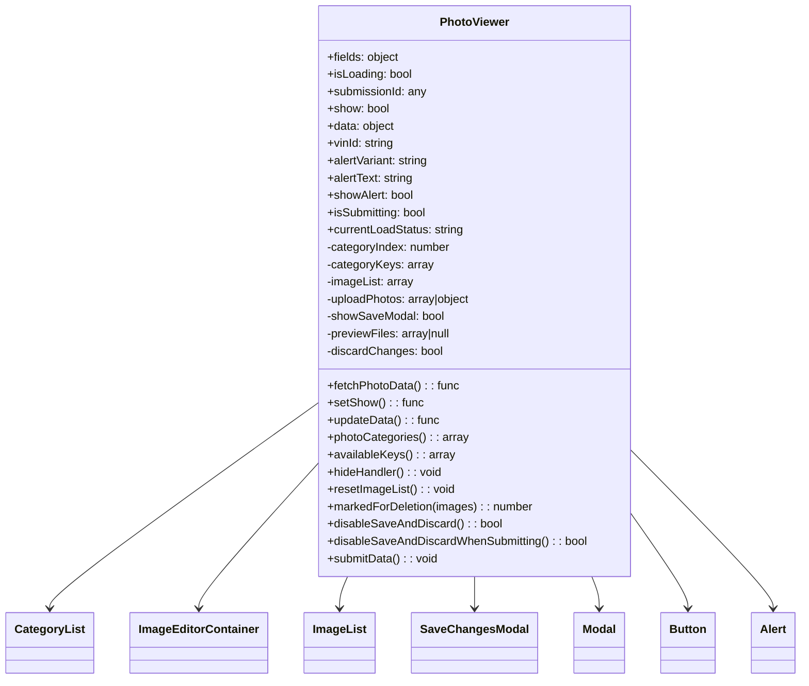
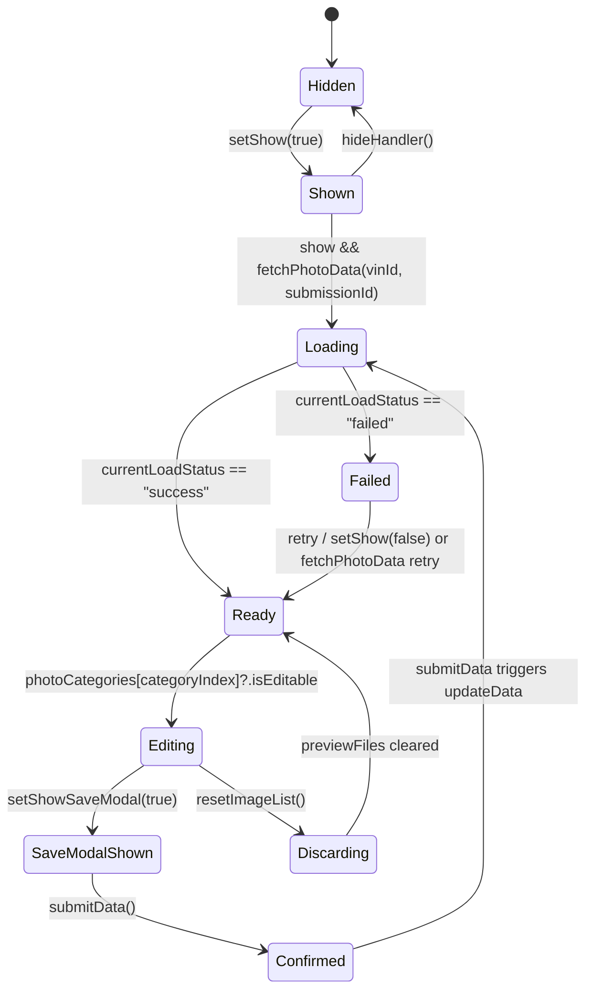

# Diagram: web/portal/src/pages/damageview/details/components/PhotoViewerWidget.js


> Auto-generated by Obscura crawlers

## Diagram 1



### SVG

<svg id="container" width="1076.484375" xmlns="http://www.w3.org/2000/svg" class="classDiagram" height="942" viewBox="0 0 1076.484375 942" role="graphics-document document" aria-roledescription="class"><style>#container{font-family:"trebuchet ms",verdana,arial,sans-serif;font-size:16px;fill:#333;}@keyframes edge-animation-frame{from{stroke-dashoffset:0;}}@keyframes dash{to{stroke-dashoffset:0;}}#container .edge-animation-slow{stroke-dasharray:9,5!important;stroke-dashoffset:900;animation:dash 50s linear infinite;stroke-linecap:round;}#container .edge-animation-fast{stroke-dasharray:9,5!important;stroke-dashoffset:900;animation:dash 20s linear infinite;stroke-linecap:round;}#container .error-icon{fill:#552222;}#container .error-text{fill:#552222;stroke:#552222;}#container .edge-thickness-normal{stroke-width:1px;}#container .edge-thickness-thick{stroke-width:3.5px;}#container .edge-pattern-solid{stroke-dasharray:0;}#container .edge-thickness-invisible{stroke-width:0;fill:none;}#container .edge-pattern-dashed{stroke-dasharray:3;}#container .edge-pattern-dotted{stroke-dasharray:2;}#container .marker{fill:#333333;stroke:#333333;}#container .marker.cross{stroke:#333333;}#container svg{font-family:"trebuchet ms",verdana,arial,sans-serif;font-size:16px;}#container p{margin:0;}#container g.classGroup text{fill:#9370DB;stroke:none;font-family:"trebuchet ms",verdana,arial,sans-serif;font-size:10px;}#container g.classGroup text .title{font-weight:bolder;}#container .nodeLabel,#container .edgeLabel{color:#131300;}#container .edgeLabel .label rect{fill:#ECECFF;}#container .label text{fill:#131300;}#container .labelBkg{background:#ECECFF;}#container .edgeLabel .label span{background:#ECECFF;}#container .classTitle{font-weight:bolder;}#container .node rect,#container .node circle,#container .node ellipse,#container .node polygon,#container .node path{fill:#ECECFF;stroke:#9370DB;stroke-width:1px;}#container .divider{stroke:#9370DB;stroke-width:1;}#container g.clickable{cursor:pointer;}#container g.classGroup rect{fill:#ECECFF;stroke:#9370DB;}#container g.classGroup line{stroke:#9370DB;stroke-width:1;}#container .classLabel .box{stroke:none;stroke-width:0;fill:#ECECFF;opacity:0.5;}#container .classLabel .label{fill:#9370DB;font-size:10px;}#container .relation{stroke:#333333;stroke-width:1;fill:none;}#container .dashed-line{stroke-dasharray:3;}#container .dotted-line{stroke-dasharray:1 2;}#container #compositionStart,#container .composition{fill:#333333!important;stroke:#333333!important;stroke-width:1;}#container #compositionEnd,#container .composition{fill:#333333!important;stroke:#333333!important;stroke-width:1;}#container #dependencyStart,#container .dependency{fill:#333333!important;stroke:#333333!important;stroke-width:1;}#container #dependencyStart,#container .dependency{fill:#333333!important;stroke:#333333!important;stroke-width:1;}#container #extensionStart,#container .extension{fill:transparent!important;stroke:#333333!important;stroke-width:1;}#container #extensionEnd,#container .extension{fill:transparent!important;stroke:#333333!important;stroke-width:1;}#container #aggregationStart,#container .aggregation{fill:transparent!important;stroke:#333333!important;stroke-width:1;}#container #aggregationEnd,#container .aggregation{fill:transparent!important;stroke:#333333!important;stroke-width:1;}#container #lollipopStart,#container .lollipop{fill:#ECECFF!important;stroke:#333333!important;stroke-width:1;}#container #lollipopEnd,#container .lollipop{fill:#ECECFF!important;stroke:#333333!important;stroke-width:1;}#container .edgeTerminals{font-size:11px;line-height:initial;}#container .classTitleText{text-anchor:middle;font-size:18px;fill:#333;}#container .label-icon{display:inline-block;height:1em;overflow:visible;vertical-align:-0.125em;}#container .node .label-icon path{fill:currentColor;stroke:revert;stroke-width:revert;}#container :root{--mermaid-font-family:"trebuchet ms",verdana,arial,sans-serif;}</style><g><defs><marker id="container_class-aggregationStart" class="marker aggregation class" refX="18" refY="7" markerWidth="190" markerHeight="240" orient="auto"><path d="M 18,7 L9,13 L1,7 L9,1 Z"></path></marker></defs><defs><marker id="container_class-aggregationEnd" class="marker aggregation class" refX="1" refY="7" markerWidth="20" markerHeight="28" orient="auto"><path d="M 18,7 L9,13 L1,7 L9,1 Z"></path></marker></defs><defs><marker id="container_class-extensionStart" class="marker extension class" refX="18" refY="7" markerWidth="190" markerHeight="240" orient="auto"><path d="M 1,7 L18,13 V 1 Z"></path></marker></defs><defs><marker id="container_class-extensionEnd" class="marker extension class" refX="1" refY="7" markerWidth="20" markerHeight="28" orient="auto"><path d="M 1,1 V 13 L18,7 Z"></path></marker></defs><defs><marker id="container_class-compositionStart" class="marker composition class" refX="18" refY="7" markerWidth="190" markerHeight="240" orient="auto"><path d="M 18,7 L9,13 L1,7 L9,1 Z"></path></marker></defs><defs><marker id="container_class-compositionEnd" class="marker composition class" refX="1" refY="7" markerWidth="20" markerHeight="28" orient="auto"><path d="M 18,7 L9,13 L1,7 L9,1 Z"></path></marker></defs><defs><marker id="container_class-dependencyStart" class="marker dependency class" refX="6" refY="7" markerWidth="190" markerHeight="240" orient="auto"><path d="M 5,7 L9,13 L1,7 L9,1 Z"></path></marker></defs><defs><marker id="container_class-dependencyEnd" class="marker dependency class" refX="13" refY="7" markerWidth="20" markerHeight="28" orient="auto"><path d="M 18,7 L9,13 L14,7 L9,1 Z"></path></marker></defs><defs><marker id="container_class-lollipopStart" class="marker lollipop class" refX="13" refY="7" markerWidth="190" markerHeight="240" orient="auto"><circle stroke="black" fill="transparent" cx="7" cy="7" r="6"></circle></marker></defs><defs><marker id="container_class-lollipopEnd" class="marker lollipop class" refX="1" refY="7" markerWidth="190" markerHeight="240" orient="auto"><circle stroke="black" fill="transparent" cx="7" cy="7" r="6"></circle></marker></defs><g class="root"><g class="clusters"></g><g class="edgePaths"><path d="M418.613,563.591L359.817,607.159C301.021,650.727,183.428,737.864,124.632,784.598C65.836,831.333,65.836,837.667,65.836,840.833L65.836,844" id="id_PhotoViewer_CategoryList_1" class="edge-thickness-normal edge-pattern-solid relation" style=";;;" data-edge="true" data-et="edge" data-id="id_PhotoViewer_CategoryList_1" data-points="W3sieCI6NDE4LjYxMzI4MTI1LCJ5Ijo1NjMuNTkwNzQxNTgxMDY3OH0seyJ4Ijo2NS44MzU5Mzc1LCJ5Ijo4MjV9LHsieCI6NjUuODM1OTM3NSwieSI6ODUwfV0=" marker-end="url(#container_class-dependencyEnd)"></path><path d="M418.613,649.904L393.054,679.086C367.495,708.269,316.376,766.635,290.817,798.984C265.258,831.333,265.258,837.667,265.258,840.833L265.258,844" id="id_PhotoViewer_ImageEditorContainer_2" class="edge-thickness-normal edge-pattern-solid relation" style=";;;" data-edge="true" data-et="edge" data-id="id_PhotoViewer_ImageEditorContainer_2" data-points="W3sieCI6NDE4LjYxMzI4MTI1LCJ5Ijo2NDkuOTAzNzEyMTAwMzQ1NH0seyJ4IjoyNjUuMjU3ODEyNSwieSI6ODI1fSx7IngiOjI2NS4yNTc4MTI1LCJ5Ijo4NTB9XQ==" marker-end="url(#container_class-dependencyEnd)"></path><path d="M464.894,800L463.115,804.167C461.335,808.333,457.777,816.667,455.998,824C454.219,831.333,454.219,837.667,454.219,840.833L454.219,844" id="id_PhotoViewer_ImageList_3" class="edge-thickness-normal edge-pattern-solid relation" style=";;;" data-edge="true" data-et="edge" data-id="id_PhotoViewer_ImageList_3" data-points="W3sieCI6NDY0Ljg5MzY2ODM0OTE2ODY1LCJ5Ijo4MDB9LHsieCI6NDU0LjIxODc1LCJ5Ijo4MjV9LHsieCI6NDU0LjIxODc1LCJ5Ijo4NTB9XQ==" marker-end="url(#container_class-dependencyEnd)"></path><path d="M633.984,800L633.984,804.167C633.984,808.333,633.984,816.667,633.984,824C633.984,831.333,633.984,837.667,633.984,840.833L633.984,844" id="id_PhotoViewer_SaveChangesModal_4" class="edge-thickness-normal edge-pattern-solid relation" style=";;;" data-edge="true" data-et="edge" data-id="id_PhotoViewer_SaveChangesModal_4" data-points="W3sieCI6NjMzLjk4NDM3NSwieSI6ODAwfSx7IngiOjYzMy45ODQzNzUsInkiOjgyNX0seyJ4Ijo2MzMuOTg0Mzc1LCJ5Ijo4NTB9XQ==" marker-end="url(#container_class-dependencyEnd)"></path><path d="M790.913,800L792.564,804.167C794.216,808.333,797.518,816.667,799.169,824C800.82,831.333,800.82,837.667,800.82,840.833L800.82,844" id="id_PhotoViewer_Modal_5" class="edge-thickness-normal edge-pattern-solid relation" style=";;;" data-edge="true" data-et="edge" data-id="id_PhotoViewer_Modal_5" data-points="W3sieCI6NzkwLjkxMzE5MDMyMDY2NTEsInkiOjgwMH0seyJ4Ijo4MDAuODIwMzEyNSwieSI6ODI1fSx7IngiOjgwMC44MjAzMTI1LCJ5Ijo4NTB9XQ==" marker-end="url(#container_class-dependencyEnd)"></path><path d="M849.355,718.703L861.48,736.419C873.604,754.135,897.853,789.568,909.977,810.45C922.102,831.333,922.102,837.667,922.102,840.833L922.102,844" id="id_PhotoViewer_Button_6" class="edge-thickness-normal edge-pattern-solid relation" style=";;;" data-edge="true" data-et="edge" data-id="id_PhotoViewer_Button_6" data-points="W3sieCI6ODQ5LjM1NTQ2ODc1LCJ5Ijo3MTguNzAyNjA4NTMwNjAwMX0seyJ4Ijo5MjIuMTAxNTYyNSwieSI6ODI1fSx7IngiOjkyMi4xMDE1NjI1LCJ5Ijo4NTB9XQ==" marker-end="url(#container_class-dependencyEnd)"></path><path d="M849.355,628.031L880.915,660.859C912.474,693.687,975.592,759.344,1007.152,795.338C1038.711,831.333,1038.711,837.667,1038.711,840.833L1038.711,844" id="id_PhotoViewer_Alert_7" class="edge-thickness-normal edge-pattern-solid relation" style=";;;" data-edge="true" data-et="edge" data-id="id_PhotoViewer_Alert_7" data-points="W3sieCI6ODQ5LjM1NTQ2ODc1LCJ5Ijo2MjguMDMwODM2NzkxODE1NH0seyJ4IjoxMDM4LjcxMDkzNzUsInkiOjgyNX0seyJ4IjoxMDM4LjcxMDkzNzUsInkiOjg1MH1d" marker-end="url(#container_class-dependencyEnd)"></path></g><g class="edgeLabels"><g class="edgeLabel"><g class="label" data-id="id_PhotoViewer_CategoryList_1" transform="translate(0, 0)"><foreignObject width="0" height="0"><div xmlns="http://www.w3.org/1999/xhtml" class="labelBkg" style="display: table-cell; white-space: nowrap; line-height: 1.5; max-width: 200px; text-align: center;"><span class="edgeLabel"></span></div></foreignObject></g></g><g class="edgeLabel"><g class="label" data-id="id_PhotoViewer_ImageEditorContainer_2" transform="translate(0, 0)"><foreignObject width="0" height="0"><div xmlns="http://www.w3.org/1999/xhtml" class="labelBkg" style="display: table-cell; white-space: nowrap; line-height: 1.5; max-width: 200px; text-align: center;"><span class="edgeLabel"></span></div></foreignObject></g></g><g class="edgeLabel"><g class="label" data-id="id_PhotoViewer_ImageList_3" transform="translate(0, 0)"><foreignObject width="0" height="0"><div xmlns="http://www.w3.org/1999/xhtml" class="labelBkg" style="display: table-cell; white-space: nowrap; line-height: 1.5; max-width: 200px; text-align: center;"><span class="edgeLabel"></span></div></foreignObject></g></g><g class="edgeLabel"><g class="label" data-id="id_PhotoViewer_SaveChangesModal_4" transform="translate(0, 0)"><foreignObject width="0" height="0"><div xmlns="http://www.w3.org/1999/xhtml" class="labelBkg" style="display: table-cell; white-space: nowrap; line-height: 1.5; max-width: 200px; text-align: center;"><span class="edgeLabel"></span></div></foreignObject></g></g><g class="edgeLabel"><g class="label" data-id="id_PhotoViewer_Modal_5" transform="translate(0, 0)"><foreignObject width="0" height="0"><div xmlns="http://www.w3.org/1999/xhtml" class="labelBkg" style="display: table-cell; white-space: nowrap; line-height: 1.5; max-width: 200px; text-align: center;"><span class="edgeLabel"></span></div></foreignObject></g></g><g class="edgeLabel"><g class="label" data-id="id_PhotoViewer_Button_6" transform="translate(0, 0)"><foreignObject width="0" height="0"><div xmlns="http://www.w3.org/1999/xhtml" class="labelBkg" style="display: table-cell; white-space: nowrap; line-height: 1.5; max-width: 200px; text-align: center;"><span class="edgeLabel"></span></div></foreignObject></g></g><g class="edgeLabel"><g class="label" data-id="id_PhotoViewer_Alert_7" transform="translate(0, 0)"><foreignObject width="0" height="0"><div xmlns="http://www.w3.org/1999/xhtml" class="labelBkg" style="display: table-cell; white-space: nowrap; line-height: 1.5; max-width: 200px; text-align: center;"><span class="edgeLabel"></span></div></foreignObject></g></g></g><g class="nodes"><g class="node default" id="classId-PhotoViewer-0" transform="translate(633.984375, 404)"><g class="basic label-container"><path d="M-215.37109375 -396 L215.37109375 -396 L215.37109375 396 L-215.37109375 396" stroke="none" stroke-width="0" fill="#ECECFF" style=""></path><path d="M-215.37109375 -396 C-44.863208828874434 -396, 125.64467609225113 -396, 215.37109375 -396 M-215.37109375 -396 C-98.76206249139766 -396, 17.846968767204686 -396, 215.37109375 -396 M215.37109375 -396 C215.37109375 -168.38306413180842, 215.37109375 59.23387173638315, 215.37109375 396 M215.37109375 -396 C215.37109375 -136.491555163158, 215.37109375 123.01688967368398, 215.37109375 396 M215.37109375 396 C44.1563073291982 396, -127.0584790916036 396, -215.37109375 396 M215.37109375 396 C49.02088396275866 396, -117.32932582448268 396, -215.37109375 396 M-215.37109375 396 C-215.37109375 97.6578301396292, -215.37109375 -200.6843397207416, -215.37109375 -396 M-215.37109375 396 C-215.37109375 145.92671691557243, -215.37109375 -104.14656616885514, -215.37109375 -396" stroke="#9370DB" stroke-width="1.3" fill="none" stroke-dasharray="0 0" style=""></path></g><g class="annotation-group text" transform="translate(0, -372)"></g><g class="label-group text" transform="translate(-46.3984375, -372)"><g class="label" style="font-weight: bolder" transform="translate(0,-12)"><foreignObject width="92.796875" height="24"><div xmlns="http://www.w3.org/1999/xhtml" style="display: table-cell; white-space: nowrap; line-height: 1.5; max-width: 142px; text-align: center;"><span class="nodeLabel markdown-node-label" style=""><p>PhotoViewer</p></span></div></foreignObject></g></g><g class="members-group text" transform="translate(-203.37109375, -324)"><g class="label" style="" transform="translate(0,-12)"><foreignObject width="100.875" height="24"><div xmlns="http://www.w3.org/1999/xhtml" style="display: table-cell; white-space: nowrap; line-height: 1.5; max-width: 158px; text-align: center;"><span class="nodeLabel markdown-node-label" style=""><p>+fields: object</p></span></div></foreignObject></g><g class="label" style="" transform="translate(0,12)"><foreignObject width="118.171875" height="24"><div xmlns="http://www.w3.org/1999/xhtml" style="display: table-cell; white-space: nowrap; line-height: 1.5; max-width: 176px; text-align: center;"><span class="nodeLabel markdown-node-label" style=""><p>+isLoading: bool</p></span></div></foreignObject></g><g class="label" style="" transform="translate(0,36)"><foreignObject width="138.734375" height="24"><div xmlns="http://www.w3.org/1999/xhtml" style="display: table-cell; white-space: nowrap; line-height: 1.5; max-width: 196px; text-align: center;"><span class="nodeLabel markdown-node-label" style=""><p>+submissionId: any</p></span></div></foreignObject></g><g class="label" style="" transform="translate(0,60)"><foreignObject width="86.6875" height="24"><div xmlns="http://www.w3.org/1999/xhtml" style="display: table-cell; white-space: nowrap; line-height: 1.5; max-width: 144px; text-align: center;"><span class="nodeLabel markdown-node-label" style=""><p>+show: bool</p></span></div></foreignObject></g><g class="label" style="" transform="translate(0,84)"><foreignObject width="94.1875" height="24"><div xmlns="http://www.w3.org/1999/xhtml" style="display: table-cell; white-space: nowrap; line-height: 1.5; max-width: 152px; text-align: center;"><span class="nodeLabel markdown-node-label" style=""><p>+data: object</p></span></div></foreignObject></g><g class="label" style="" transform="translate(0,108)"><foreignObject width="93.59375" height="24"><div xmlns="http://www.w3.org/1999/xhtml" style="display: table-cell; white-space: nowrap; line-height: 1.5; max-width: 152px; text-align: center;"><span class="nodeLabel markdown-node-label" style=""><p>+vinId: string</p></span></div></foreignObject></g><g class="label" style="" transform="translate(0,132)"><foreignObject width="142.859375" height="24"><div xmlns="http://www.w3.org/1999/xhtml" style="display: table-cell; white-space: nowrap; line-height: 1.5; max-width: 201px; text-align: center;"><span class="nodeLabel markdown-node-label" style=""><p>+alertVariant: string</p></span></div></foreignObject></g><g class="label" style="" transform="translate(0,156)"><foreignObject width="120.859375" height="24"><div xmlns="http://www.w3.org/1999/xhtml" style="display: table-cell; white-space: nowrap; line-height: 1.5; max-width: 179px; text-align: center;"><span class="nodeLabel markdown-node-label" style=""><p>+alertText: string</p></span></div></foreignObject></g><g class="label" style="" transform="translate(0,180)"><foreignObject width="121.125" height="24"><div xmlns="http://www.w3.org/1999/xhtml" style="display: table-cell; white-space: nowrap; line-height: 1.5; max-width: 179px; text-align: center;"><span class="nodeLabel markdown-node-label" style=""><p>+showAlert: bool</p></span></div></foreignObject></g><g class="label" style="" transform="translate(0,204)"><foreignObject width="140.453125" height="24"><div xmlns="http://www.w3.org/1999/xhtml" style="display: table-cell; white-space: nowrap; line-height: 1.5; max-width: 198px; text-align: center;"><span class="nodeLabel markdown-node-label" style=""><p>+isSubmitting: bool</p></span></div></foreignObject></g><g class="label" style="" transform="translate(0,228)"><foreignObject width="190.921875" height="24"><div xmlns="http://www.w3.org/1999/xhtml" style="display: table-cell; white-space: nowrap; line-height: 1.5; max-width: 249px; text-align: center;"><span class="nodeLabel markdown-node-label" style=""><p>+currentLoadStatus: string</p></span></div></foreignObject></g><g class="label" style="" transform="translate(0,252)"><foreignObject width="173.296875" height="24"><div xmlns="http://www.w3.org/1999/xhtml" style="display: table-cell; white-space: nowrap; line-height: 1.5; max-width: 231px; text-align: center;"><span class="nodeLabel markdown-node-label" style=""><p>-categoryIndex: number</p></span></div></foreignObject></g><g class="label" style="" transform="translate(0,276)"><foreignObject width="146.359375" height="24"><div xmlns="http://www.w3.org/1999/xhtml" style="display: table-cell; white-space: nowrap; line-height: 1.5; max-width: 204px; text-align: center;"><span class="nodeLabel markdown-node-label" style=""><p>-categoryKeys: array</p></span></div></foreignObject></g><g class="label" style="" transform="translate(0,300)"><foreignObject width="120.71875" height="24"><div xmlns="http://www.w3.org/1999/xhtml" style="display: table-cell; white-space: nowrap; line-height: 1.5; max-width: 178px; text-align: center;"><span class="nodeLabel markdown-node-label" style=""><p>-imageList: array</p></span></div></foreignObject></g><g class="label" style="" transform="translate(0,324)"><foreignObject width="204.21875" height="24"><div xmlns="http://www.w3.org/1999/xhtml" style="display: table-cell; white-space: nowrap; line-height: 1.5; max-width: 262px; text-align: center;"><span class="nodeLabel markdown-node-label" style=""><p>-uploadPhotos: array|object</p></span></div></foreignObject></g><g class="label" style="" transform="translate(0,348)"><foreignObject width="163.546875" height="24"><div xmlns="http://www.w3.org/1999/xhtml" style="display: table-cell; white-space: nowrap; line-height: 1.5; max-width: 221px; text-align: center;"><span class="nodeLabel markdown-node-label" style=""><p>-showSaveModal: bool</p></span></div></foreignObject></g><g class="label" style="" transform="translate(0,372)"><foreignObject width="174.921875" height="24"><div xmlns="http://www.w3.org/1999/xhtml" style="display: table-cell; white-space: nowrap; line-height: 1.5; max-width: 233px; text-align: center;"><span class="nodeLabel markdown-node-label" style=""><p>-previewFiles: array|null</p></span></div></foreignObject></g><g class="label" style="" transform="translate(0,396)"><foreignObject width="160.9375" height="24"><div xmlns="http://www.w3.org/1999/xhtml" style="display: table-cell; white-space: nowrap; line-height: 1.5; max-width: 219px; text-align: center;"><span class="nodeLabel markdown-node-label" style=""><p>-discardChanges: bool</p></span></div></foreignObject></g></g><g class="methods-group text" transform="translate(-203.37109375, 132)"><g class="label" style="" transform="translate(0,-12)"><foreignObject width="182.484375" height="24"><div xmlns="http://www.w3.org/1999/xhtml" style="display: table-cell; white-space: nowrap; line-height: 1.5; max-width: 240px; text-align: center;"><span class="nodeLabel markdown-node-label" style=""><p>+fetchPhotoData() : : func</p></span></div></foreignObject></g><g class="label" style="" transform="translate(0,12)"><foreignObject width="131.34375" height="24"><div xmlns="http://www.w3.org/1999/xhtml" style="display: table-cell; white-space: nowrap; line-height: 1.5; max-width: 189px; text-align: center;"><span class="nodeLabel markdown-node-label" style=""><p>+setShow() : : func</p></span></div></foreignObject></g><g class="label" style="" transform="translate(0,36)"><foreignObject width="155.015625" height="24"><div xmlns="http://www.w3.org/1999/xhtml" style="display: table-cell; white-space: nowrap; line-height: 1.5; max-width: 213px; text-align: center;"><span class="nodeLabel markdown-node-label" style=""><p>+updateData() : : func</p></span></div></foreignObject></g><g class="label" style="" transform="translate(0,60)"><foreignObject width="194.75" height="24"><div xmlns="http://www.w3.org/1999/xhtml" style="display: table-cell; white-space: nowrap; line-height: 1.5; max-width: 252px; text-align: center;"><span class="nodeLabel markdown-node-label" style=""><p>+photoCategories() : : array</p></span></div></foreignObject></g><g class="label" style="" transform="translate(0,84)"><foreignObject width="173.875" height="24"><div xmlns="http://www.w3.org/1999/xhtml" style="display: table-cell; white-space: nowrap; line-height: 1.5; max-width: 231px; text-align: center;"><span class="nodeLabel markdown-node-label" style=""><p>+availableKeys() : : array</p></span></div></foreignObject></g><g class="label" style="" transform="translate(0,108)"><foreignObject width="160.203125" height="24"><div xmlns="http://www.w3.org/1999/xhtml" style="display: table-cell; white-space: nowrap; line-height: 1.5; max-width: 218px; text-align: center;"><span class="nodeLabel markdown-node-label" style=""><p>+hideHandler() : : void</p></span></div></foreignObject></g><g class="label" style="" transform="translate(0,132)"><foreignObject width="175.859375" height="24"><div xmlns="http://www.w3.org/1999/xhtml" style="display: table-cell; white-space: nowrap; line-height: 1.5; max-width: 233px; text-align: center;"><span class="nodeLabel markdown-node-label" style=""><p>+resetImageList() : : void</p></span></div></foreignObject></g><g class="label" style="" transform="translate(0,156)"><foreignObject width="285.6875" height="24"><div xmlns="http://www.w3.org/1999/xhtml" style="display: table-cell; white-space: nowrap; line-height: 1.5; max-width: 344px; text-align: center;"><span class="nodeLabel markdown-node-label" style=""><p>+markedForDeletion(images) : : number</p></span></div></foreignObject></g><g class="label" style="" transform="translate(0,180)"><foreignObject width="240.140625" height="24"><div xmlns="http://www.w3.org/1999/xhtml" style="display: table-cell; white-space: nowrap; line-height: 1.5; max-width: 298px; text-align: center;"><span class="nodeLabel markdown-node-label" style=""><p>+disableSaveAndDiscard() : : bool</p></span></div></foreignObject></g><g class="label" style="" transform="translate(0,204)"><foreignObject width="360.34375" height="24"><div xmlns="http://www.w3.org/1999/xhtml" style="display: table-cell; white-space: nowrap; line-height: 1.5; max-width: 418px; text-align: center;"><span class="nodeLabel markdown-node-label" style=""><p>+disableSaveAndDiscardWhenSubmitting() : : bool</p></span></div></foreignObject></g><g class="label" style="" transform="translate(0,228)"><foreignObject width="153.5" height="24"><div xmlns="http://www.w3.org/1999/xhtml" style="display: table-cell; white-space: nowrap; line-height: 1.5; max-width: 211px; text-align: center;"><span class="nodeLabel markdown-node-label" style=""><p>+submitData() : : void</p></span></div></foreignObject></g></g><g class="divider" style=""><path d="M-215.37109375 -348 C-128.52041068799753 -348, -41.66972762599502 -348, 215.37109375 -348 M-215.37109375 -348 C-78.29818767680771 -348, 58.77471839638457 -348, 215.37109375 -348" stroke="#9370DB" stroke-width="1.3" fill="none" stroke-dasharray="0 0" style=""></path></g><g class="divider" style=""><path d="M-215.37109375 108 C-73.42264948698221 108, 68.52579477603558 108, 215.37109375 108 M-215.37109375 108 C-62.831186803933235 108, 89.70872014213353 108, 215.37109375 108" stroke="#9370DB" stroke-width="1.3" fill="none" stroke-dasharray="0 0" style=""></path></g></g><g class="node default" id="classId-CategoryList-1" transform="translate(65.8359375, 892)"><g class="basic label-container"><path d="M-57.8359375 -42 L57.8359375 -42 L57.8359375 42 L-57.8359375 42" stroke="none" stroke-width="0" fill="#ECECFF" style=""></path><path d="M-57.8359375 -42 C-12.989863286898668 -42, 31.856210926202664 -42, 57.8359375 -42 M-57.8359375 -42 C-14.53586971590758 -42, 28.76419806818484 -42, 57.8359375 -42 M57.8359375 -42 C57.8359375 -19.573626717322743, 57.8359375 2.852746565354515, 57.8359375 42 M57.8359375 -42 C57.8359375 -19.698571136366343, 57.8359375 2.6028577272673132, 57.8359375 42 M57.8359375 42 C15.14375592236771 42, -27.54842565526458 42, -57.8359375 42 M57.8359375 42 C31.52694691913493 42, 5.2179563382698575 42, -57.8359375 42 M-57.8359375 42 C-57.8359375 18.706839553816017, -57.8359375 -4.586320892367965, -57.8359375 -42 M-57.8359375 42 C-57.8359375 15.149252677860215, -57.8359375 -11.70149464427957, -57.8359375 -42" stroke="#9370DB" stroke-width="1.3" fill="none" stroke-dasharray="0 0" style=""></path></g><g class="annotation-group text" transform="translate(0, -18)"></g><g class="label-group text" transform="translate(-45.8359375, -18)"><g class="label" style="font-weight: bolder" transform="translate(0,-12)"><foreignObject width="91.671875" height="24"><div xmlns="http://www.w3.org/1999/xhtml" style="display: table-cell; white-space: nowrap; line-height: 1.5; max-width: 139px; text-align: center;"><span class="nodeLabel markdown-node-label" style=""><p>CategoryList</p></span></div></foreignObject></g></g><g class="members-group text" transform="translate(-45.8359375, 30)"></g><g class="methods-group text" transform="translate(-45.8359375, 60)"></g><g class="divider" style=""><path d="M-57.8359375 6 C-17.588042797297263 6, 22.659851905405475 6, 57.8359375 6 M-57.8359375 6 C-20.45730415303857 6, 16.92132919392286 6, 57.8359375 6" stroke="#9370DB" stroke-width="1.3" fill="none" stroke-dasharray="0 0" style=""></path></g><g class="divider" style=""><path d="M-57.8359375 24 C-17.883522391100357 24, 22.068892717799287 24, 57.8359375 24 M-57.8359375 24 C-16.595919944452092 24, 24.644097611095816 24, 57.8359375 24" stroke="#9370DB" stroke-width="1.3" fill="none" stroke-dasharray="0 0" style=""></path></g></g><g class="node default" id="classId-ImageEditorContainer-2" transform="translate(265.2578125, 892)"><g class="basic label-container"><path d="M-91.5859375 -42 L91.5859375 -42 L91.5859375 42 L-91.5859375 42" stroke="none" stroke-width="0" fill="#ECECFF" style=""></path><path d="M-91.5859375 -42 C-48.66397640494924 -42, -5.742015309898477 -42, 91.5859375 -42 M-91.5859375 -42 C-46.123652001783945 -42, -0.6613665035678906 -42, 91.5859375 -42 M91.5859375 -42 C91.5859375 -11.537058038601113, 91.5859375 18.925883922797773, 91.5859375 42 M91.5859375 -42 C91.5859375 -18.252893691726975, 91.5859375 5.494212616546051, 91.5859375 42 M91.5859375 42 C50.98380996604725 42, 10.381682432094493 42, -91.5859375 42 M91.5859375 42 C50.28593970459496 42, 8.985941909189918 42, -91.5859375 42 M-91.5859375 42 C-91.5859375 23.760230769023803, -91.5859375 5.520461538047606, -91.5859375 -42 M-91.5859375 42 C-91.5859375 9.769296281008621, -91.5859375 -22.461407437982757, -91.5859375 -42" stroke="#9370DB" stroke-width="1.3" fill="none" stroke-dasharray="0 0" style=""></path></g><g class="annotation-group text" transform="translate(0, -18)"></g><g class="label-group text" transform="translate(-79.5859375, -18)"><g class="label" style="font-weight: bolder" transform="translate(0,-12)"><foreignObject width="159.171875" height="24"><div xmlns="http://www.w3.org/1999/xhtml" style="display: table-cell; white-space: nowrap; line-height: 1.5; max-width: 208px; text-align: center;"><span class="nodeLabel markdown-node-label" style=""><p>ImageEditorContainer</p></span></div></foreignObject></g></g><g class="members-group text" transform="translate(-79.5859375, 30)"></g><g class="methods-group text" transform="translate(-79.5859375, 60)"></g><g class="divider" style=""><path d="M-91.5859375 6 C-20.376994510386027 6, 50.83194847922795 6, 91.5859375 6 M-91.5859375 6 C-34.65952455068606 6, 22.266888398627884 6, 91.5859375 6" stroke="#9370DB" stroke-width="1.3" fill="none" stroke-dasharray="0 0" style=""></path></g><g class="divider" style=""><path d="M-91.5859375 24 C-43.37867092679758 24, 4.828595646404835 24, 91.5859375 24 M-91.5859375 24 C-44.72088640754681 24, 2.144164684906386 24, 91.5859375 24" stroke="#9370DB" stroke-width="1.3" fill="none" stroke-dasharray="0 0" style=""></path></g></g><g class="node default" id="classId-ImageList-3" transform="translate(454.21875, 892)"><g class="basic label-container"><path d="M-47.375 -42 L47.375 -42 L47.375 42 L-47.375 42" stroke="none" stroke-width="0" fill="#ECECFF" style=""></path><path d="M-47.375 -42 C-19.50539114065265 -42, 8.364217718694697 -42, 47.375 -42 M-47.375 -42 C-13.659161908306807 -42, 20.056676183386386 -42, 47.375 -42 M47.375 -42 C47.375 -17.231024322144833, 47.375 7.537951355710334, 47.375 42 M47.375 -42 C47.375 -17.68104238448988, 47.375 6.637915231020237, 47.375 42 M47.375 42 C20.128219924297568 42, -7.118560151404864 42, -47.375 42 M47.375 42 C17.66856770630706 42, -12.037864587385883 42, -47.375 42 M-47.375 42 C-47.375 14.308172371293473, -47.375 -13.383655257413054, -47.375 -42 M-47.375 42 C-47.375 9.777004286593886, -47.375 -22.445991426812228, -47.375 -42" stroke="#9370DB" stroke-width="1.3" fill="none" stroke-dasharray="0 0" style=""></path></g><g class="annotation-group text" transform="translate(0, -18)"></g><g class="label-group text" transform="translate(-35.375, -18)"><g class="label" style="font-weight: bolder" transform="translate(0,-12)"><foreignObject width="70.75" height="24"><div xmlns="http://www.w3.org/1999/xhtml" style="display: table-cell; white-space: nowrap; line-height: 1.5; max-width: 120px; text-align: center;"><span class="nodeLabel markdown-node-label" style=""><p>ImageList</p></span></div></foreignObject></g></g><g class="members-group text" transform="translate(-35.375, 30)"></g><g class="methods-group text" transform="translate(-35.375, 60)"></g><g class="divider" style=""><path d="M-47.375 6 C-23.360393517088728 6, 0.6542129658225448 6, 47.375 6 M-47.375 6 C-13.481621898229285 6, 20.41175620354143 6, 47.375 6" stroke="#9370DB" stroke-width="1.3" fill="none" stroke-dasharray="0 0" style=""></path></g><g class="divider" style=""><path d="M-47.375 24 C-25.638588231935913 24, -3.9021764638718253 24, 47.375 24 M-47.375 24 C-14.314173574095769 24, 18.746652851808463 24, 47.375 24" stroke="#9370DB" stroke-width="1.3" fill="none" stroke-dasharray="0 0" style=""></path></g></g><g class="node default" id="classId-SaveChangesModal-4" transform="translate(633.984375, 892)"><g class="basic label-container"><path d="M-82.390625 -42 L82.390625 -42 L82.390625 42 L-82.390625 42" stroke="none" stroke-width="0" fill="#ECECFF" style=""></path><path d="M-82.390625 -42 C-29.311163106730362 -42, 23.768298786539276 -42, 82.390625 -42 M-82.390625 -42 C-29.60244852831633 -42, 23.18572794336734 -42, 82.390625 -42 M82.390625 -42 C82.390625 -17.51414836154163, 82.390625 6.971703276916742, 82.390625 42 M82.390625 -42 C82.390625 -16.995988485936728, 82.390625 8.008023028126544, 82.390625 42 M82.390625 42 C19.149922870376173 42, -44.090779259247654 42, -82.390625 42 M82.390625 42 C45.68170915426043 42, 8.972793308520863 42, -82.390625 42 M-82.390625 42 C-82.390625 11.584019278152425, -82.390625 -18.83196144369515, -82.390625 -42 M-82.390625 42 C-82.390625 19.723762450310023, -82.390625 -2.5524750993799543, -82.390625 -42" stroke="#9370DB" stroke-width="1.3" fill="none" stroke-dasharray="0 0" style=""></path></g><g class="annotation-group text" transform="translate(0, -18)"></g><g class="label-group text" transform="translate(-70.390625, -18)"><g class="label" style="font-weight: bolder" transform="translate(0,-12)"><foreignObject width="140.78125" height="24"><div xmlns="http://www.w3.org/1999/xhtml" style="display: table-cell; white-space: nowrap; line-height: 1.5; max-width: 189px; text-align: center;"><span class="nodeLabel markdown-node-label" style=""><p>SaveChangesModal</p></span></div></foreignObject></g></g><g class="members-group text" transform="translate(-70.390625, 30)"></g><g class="methods-group text" transform="translate(-70.390625, 60)"></g><g class="divider" style=""><path d="M-82.390625 6 C-19.56457485773651 6, 43.26147528452698 6, 82.390625 6 M-82.390625 6 C-20.72331339395138 6, 40.94399821209724 6, 82.390625 6" stroke="#9370DB" stroke-width="1.3" fill="none" stroke-dasharray="0 0" style=""></path></g><g class="divider" style=""><path d="M-82.390625 24 C-36.87904820271434 24, 8.632528594571326 24, 82.390625 24 M-82.390625 24 C-29.99484092419923 24, 22.40094315160154 24, 82.390625 24" stroke="#9370DB" stroke-width="1.3" fill="none" stroke-dasharray="0 0" style=""></path></g></g><g class="node default" id="classId-Modal-5" transform="translate(800.8203125, 892)"><g class="basic label-container"><path d="M-34.4453125 -42 L34.4453125 -42 L34.4453125 42 L-34.4453125 42" stroke="none" stroke-width="0" fill="#ECECFF" style=""></path><path d="M-34.4453125 -42 C-20.467160985572978 -42, -6.489009471145955 -42, 34.4453125 -42 M-34.4453125 -42 C-8.50559039218004 -42, 17.43413171563992 -42, 34.4453125 -42 M34.4453125 -42 C34.4453125 -23.70511463178742, 34.4453125 -5.410229263574841, 34.4453125 42 M34.4453125 -42 C34.4453125 -8.412560545082734, 34.4453125 25.174878909834533, 34.4453125 42 M34.4453125 42 C19.426123862981743 42, 4.406935225963487 42, -34.4453125 42 M34.4453125 42 C15.647513906977842 42, -3.1502846860443157 42, -34.4453125 42 M-34.4453125 42 C-34.4453125 20.990888887418244, -34.4453125 -0.018222225163512462, -34.4453125 -42 M-34.4453125 42 C-34.4453125 8.930993486882812, -34.4453125 -24.138013026234376, -34.4453125 -42" stroke="#9370DB" stroke-width="1.3" fill="none" stroke-dasharray="0 0" style=""></path></g><g class="annotation-group text" transform="translate(0, -18)"></g><g class="label-group text" transform="translate(-22.4453125, -18)"><g class="label" style="font-weight: bolder" transform="translate(0,-12)"><foreignObject width="44.890625" height="24"><div xmlns="http://www.w3.org/1999/xhtml" style="display: table-cell; white-space: nowrap; line-height: 1.5; max-width: 95px; text-align: center;"><span class="nodeLabel markdown-node-label" style=""><p>Modal</p></span></div></foreignObject></g></g><g class="members-group text" transform="translate(-22.4453125, 30)"></g><g class="methods-group text" transform="translate(-22.4453125, 60)"></g><g class="divider" style=""><path d="M-34.4453125 6 C-10.837241963917197 6, 12.770828572165605 6, 34.4453125 6 M-34.4453125 6 C-19.287523377818353 6, -4.129734255636709 6, 34.4453125 6" stroke="#9370DB" stroke-width="1.3" fill="none" stroke-dasharray="0 0" style=""></path></g><g class="divider" style=""><path d="M-34.4453125 24 C-16.679219349535142 24, 1.086873800929716 24, 34.4453125 24 M-34.4453125 24 C-8.338361803816014 24, 17.768588892367973 24, 34.4453125 24" stroke="#9370DB" stroke-width="1.3" fill="none" stroke-dasharray="0 0" style=""></path></g></g><g class="node default" id="classId-Button-6" transform="translate(922.1015625, 892)"><g class="basic label-container"><path d="M-36.8359375 -42 L36.8359375 -42 L36.8359375 42 L-36.8359375 42" stroke="none" stroke-width="0" fill="#ECECFF" style=""></path><path d="M-36.8359375 -42 C-21.71295450929844 -42, -6.589971518596883 -42, 36.8359375 -42 M-36.8359375 -42 C-9.598884095685879 -42, 17.638169308628243 -42, 36.8359375 -42 M36.8359375 -42 C36.8359375 -16.58464353557133, 36.8359375 8.830712928857338, 36.8359375 42 M36.8359375 -42 C36.8359375 -11.999680969286132, 36.8359375 18.000638061427736, 36.8359375 42 M36.8359375 42 C18.01716880775217 42, -0.8015998844956584 42, -36.8359375 42 M36.8359375 42 C15.931512497842654 42, -4.972912504314692 42, -36.8359375 42 M-36.8359375 42 C-36.8359375 18.272973206415315, -36.8359375 -5.454053587169369, -36.8359375 -42 M-36.8359375 42 C-36.8359375 21.873292897755462, -36.8359375 1.7465857955109243, -36.8359375 -42" stroke="#9370DB" stroke-width="1.3" fill="none" stroke-dasharray="0 0" style=""></path></g><g class="annotation-group text" transform="translate(0, -18)"></g><g class="label-group text" transform="translate(-24.8359375, -18)"><g class="label" style="font-weight: bolder" transform="translate(0,-12)"><foreignObject width="49.671875" height="24"><div xmlns="http://www.w3.org/1999/xhtml" style="display: table-cell; white-space: nowrap; line-height: 1.5; max-width: 99px; text-align: center;"><span class="nodeLabel markdown-node-label" style=""><p>Button</p></span></div></foreignObject></g></g><g class="members-group text" transform="translate(-24.8359375, 30)"></g><g class="methods-group text" transform="translate(-24.8359375, 60)"></g><g class="divider" style=""><path d="M-36.8359375 6 C-17.61604580288407 6, 1.6038458942318599 6, 36.8359375 6 M-36.8359375 6 C-11.247725741619316 6, 14.340486016761368 6, 36.8359375 6" stroke="#9370DB" stroke-width="1.3" fill="none" stroke-dasharray="0 0" style=""></path></g><g class="divider" style=""><path d="M-36.8359375 24 C-16.15825795958532 24, 4.519421580829359 24, 36.8359375 24 M-36.8359375 24 C-17.248650079032565 24, 2.33863734193487 24, 36.8359375 24" stroke="#9370DB" stroke-width="1.3" fill="none" stroke-dasharray="0 0" style=""></path></g></g><g class="node default" id="classId-Alert-7" transform="translate(1038.7109375, 892)"><g class="basic label-container"><path d="M-29.7734375 -42 L29.7734375 -42 L29.7734375 42 L-29.7734375 42" stroke="none" stroke-width="0" fill="#ECECFF" style=""></path><path d="M-29.7734375 -42 C-13.85504804273057 -42, 2.0633414145388613 -42, 29.7734375 -42 M-29.7734375 -42 C-17.802382272035423 -42, -5.831327044070843 -42, 29.7734375 -42 M29.7734375 -42 C29.7734375 -24.327482581911664, 29.7734375 -6.654965163823327, 29.7734375 42 M29.7734375 -42 C29.7734375 -9.049634889810427, 29.7734375 23.900730220379145, 29.7734375 42 M29.7734375 42 C7.310310361834748 42, -15.152816776330504 42, -29.7734375 42 M29.7734375 42 C10.156369298164996 42, -9.460698903670007 42, -29.7734375 42 M-29.7734375 42 C-29.7734375 11.728482650387345, -29.7734375 -18.54303469922531, -29.7734375 -42 M-29.7734375 42 C-29.7734375 23.500704974053573, -29.7734375 5.0014099481071455, -29.7734375 -42" stroke="#9370DB" stroke-width="1.3" fill="none" stroke-dasharray="0 0" style=""></path></g><g class="annotation-group text" transform="translate(0, -18)"></g><g class="label-group text" transform="translate(-17.7734375, -18)"><g class="label" style="font-weight: bolder" transform="translate(0,-12)"><foreignObject width="35.546875" height="24"><div xmlns="http://www.w3.org/1999/xhtml" style="display: table-cell; white-space: nowrap; line-height: 1.5; max-width: 85px; text-align: center;"><span class="nodeLabel markdown-node-label" style=""><p>Alert</p></span></div></foreignObject></g></g><g class="members-group text" transform="translate(-17.7734375, 30)"></g><g class="methods-group text" transform="translate(-17.7734375, 60)"></g><g class="divider" style=""><path d="M-29.7734375 6 C-10.297868490668137 6, 9.177700518663727 6, 29.7734375 6 M-29.7734375 6 C-6.994312151135645 6, 15.78481319772871 6, 29.7734375 6" stroke="#9370DB" stroke-width="1.3" fill="none" stroke-dasharray="0 0" style=""></path></g><g class="divider" style=""><path d="M-29.7734375 24 C-15.62642195076305 24, -1.4794064015260986 24, 29.7734375 24 M-29.7734375 24 C-17.80518292078959 24, -5.836928341579181 24, 29.7734375 24" stroke="#9370DB" stroke-width="1.3" fill="none" stroke-dasharray="0 0" style=""></path></g></g></g></g></g></svg>

## Diagram 2

```mermaid
flowchart LR
  PhotoViewer[PhotoViewer Component] --> ModalModal[Modal (size: xl, backdrop: static)]
  ModalModal --> ModalHeader[Modal.Header: title, closeButton]
  ModalModal --> ModalBody[Modal.Body]
  ModalBody --> AlertComp[Alert (alertVariant)]
  ModalBody --> Layout[Flex Column]
  Layout --> LeftPane[Left (25%)]
  Layout --> RightPane[Right (75%)]
  LeftPane --> CategoryListComp[CategoryList]
  RightPane --> MaybeEditor{photoCategories[categoryIndex].isEditable?}
  MaybeEditor -->|true| ImageEditor[ImageEditorContainer]
  MaybeEditor -->|false| NoEditor[No Editor]
  RightPane --> Scroll[SimpleBar]
  Scroll --> ImageListComp[ImageList]
  ModalBody --> ActionRow[Action Buttons]
  ActionRow --> DiscardBtn[Button: Discard]
  ActionRow --> SaveBtn[Button: Save Changes]
  PhotoViewer --> SaveChangesModalComp[SaveChangesModal (global)]
```

> SVG rendering failed for this diagram.

## Diagram 3



### SVG

<svg id="container" width="620.8828125" xmlns="http://www.w3.org/2000/svg" class="statediagram" height="1046" viewBox="0 0 620.8828125 1046" role="graphics-document document" aria-roledescription="stateDiagram"><style>#container{font-family:"trebuchet ms",verdana,arial,sans-serif;font-size:16px;fill:#333;}@keyframes edge-animation-frame{from{stroke-dashoffset:0;}}@keyframes dash{to{stroke-dashoffset:0;}}#container .edge-animation-slow{stroke-dasharray:9,5!important;stroke-dashoffset:900;animation:dash 50s linear infinite;stroke-linecap:round;}#container .edge-animation-fast{stroke-dasharray:9,5!important;stroke-dashoffset:900;animation:dash 20s linear infinite;stroke-linecap:round;}#container .error-icon{fill:#552222;}#container .error-text{fill:#552222;stroke:#552222;}#container .edge-thickness-normal{stroke-width:1px;}#container .edge-thickness-thick{stroke-width:3.5px;}#container .edge-pattern-solid{stroke-dasharray:0;}#container .edge-thickness-invisible{stroke-width:0;fill:none;}#container .edge-pattern-dashed{stroke-dasharray:3;}#container .edge-pattern-dotted{stroke-dasharray:2;}#container .marker{fill:#333333;stroke:#333333;}#container .marker.cross{stroke:#333333;}#container svg{font-family:"trebuchet ms",verdana,arial,sans-serif;font-size:16px;}#container p{margin:0;}#container defs #statediagram-barbEnd{fill:#333333;stroke:#333333;}#container g.stateGroup text{fill:#9370DB;stroke:none;font-size:10px;}#container g.stateGroup text{fill:#333;stroke:none;font-size:10px;}#container g.stateGroup .state-title{font-weight:bolder;fill:#131300;}#container g.stateGroup rect{fill:#ECECFF;stroke:#9370DB;}#container g.stateGroup line{stroke:#333333;stroke-width:1;}#container .transition{stroke:#333333;stroke-width:1;fill:none;}#container .stateGroup .composit{fill:white;border-bottom:1px;}#container .stateGroup .alt-composit{fill:#e0e0e0;border-bottom:1px;}#container .state-note{stroke:#aaaa33;fill:#fff5ad;}#container .state-note text{fill:black;stroke:none;font-size:10px;}#container .stateLabel .box{stroke:none;stroke-width:0;fill:#ECECFF;opacity:0.5;}#container .edgeLabel .label rect{fill:#ECECFF;opacity:0.5;}#container .edgeLabel{background-color:rgba(232,232,232, 0.8);text-align:center;}#container .edgeLabel p{background-color:rgba(232,232,232, 0.8);}#container .edgeLabel rect{opacity:0.5;background-color:rgba(232,232,232, 0.8);fill:rgba(232,232,232, 0.8);}#container .edgeLabel .label text{fill:#333;}#container .label div .edgeLabel{color:#333;}#container .stateLabel text{fill:#131300;font-size:10px;font-weight:bold;}#container .node circle.state-start{fill:#333333;stroke:#333333;}#container .node .fork-join{fill:#333333;stroke:#333333;}#container .node circle.state-end{fill:#9370DB;stroke:white;stroke-width:1.5;}#container .end-state-inner{fill:white;stroke-width:1.5;}#container .node rect{fill:#ECECFF;stroke:#9370DB;stroke-width:1px;}#container .node polygon{fill:#ECECFF;stroke:#9370DB;stroke-width:1px;}#container #statediagram-barbEnd{fill:#333333;}#container .statediagram-cluster rect{fill:#ECECFF;stroke:#9370DB;stroke-width:1px;}#container .cluster-label,#container .nodeLabel{color:#131300;}#container .statediagram-cluster rect.outer{rx:5px;ry:5px;}#container .statediagram-state .divider{stroke:#9370DB;}#container .statediagram-state .title-state{rx:5px;ry:5px;}#container .statediagram-cluster.statediagram-cluster .inner{fill:white;}#container .statediagram-cluster.statediagram-cluster-alt .inner{fill:#f0f0f0;}#container .statediagram-cluster .inner{rx:0;ry:0;}#container .statediagram-state rect.basic{rx:5px;ry:5px;}#container .statediagram-state rect.divider{stroke-dasharray:10,10;fill:#f0f0f0;}#container .note-edge{stroke-dasharray:5;}#container .statediagram-note rect{fill:#fff5ad;stroke:#aaaa33;stroke-width:1px;rx:0;ry:0;}#container .statediagram-note rect{fill:#fff5ad;stroke:#aaaa33;stroke-width:1px;rx:0;ry:0;}#container .statediagram-note text{fill:black;}#container .statediagram-note .nodeLabel{color:black;}#container .statediagram .edgeLabel{color:red;}#container #dependencyStart,#container #dependencyEnd{fill:#333333;stroke:#333333;stroke-width:1;}#container .statediagramTitleText{text-anchor:middle;font-size:18px;fill:#333;}#container :root{--mermaid-font-family:"trebuchet ms",verdana,arial,sans-serif;}</style><g><defs><marker id="container_stateDiagram-barbEnd" refX="19" refY="7" markerWidth="20" markerHeight="14" markerUnits="userSpaceOnUse" orient="auto"><path d="M 19,7 L9,13 L14,7 L9,1 Z"></path></marker></defs><g class="root"><g class="clusters"></g><g class="edgePaths"><path d="M352.125,22L352.125,26.167C352.125,30.333,352.125,38.667,352.208,47.083C352.292,55.5,352.458,64,352.542,68.25L352.625,72.5" id="edge0" class="edge-thickness-normal edge-pattern-solid transition" style="fill:none;;;fill:none" data-edge="true" data-et="edge" data-id="edge0" data-points="W3sieCI6MzUyLjEyNSwieSI6MjJ9LHsieCI6MzUyLjEyNSwieSI6NDd9LHsieCI6MzUyLjYyNSwieSI6NzIuNX1d" marker-end="url(#container_stateDiagram-barbEnd)"></path><path d="M331.413,112.5L324.79,118.583C318.166,124.667,304.919,136.833,304.919,149.167C304.919,161.5,318.166,174,324.79,180.25L331.413,186.5" id="edge1" class="edge-thickness-normal edge-pattern-solid transition" style="fill:none;;;fill:none" data-edge="true" data-et="edge" data-id="edge1" data-points="W3sieCI6MzMxLjQxMzM3NzE5Mjk4MjQ3LCJ5IjoxMTIuNX0seyJ4IjoyOTEuNjcxODc1LCJ5IjoxNDl9LHsieCI6MzMxLjQxMzM3NzE5Mjk4MjQ3LCJ5IjoxODYuNX1d" marker-end="url(#container_stateDiagram-barbEnd)"></path><path d="M352.625,226.5L352.542,236.583C352.458,246.667,352.292,266.833,352.292,287.167C352.292,307.5,352.458,328,352.542,338.25L352.625,348.5" id="edge2" class="edge-thickness-normal edge-pattern-solid transition" style="fill:none;;;fill:none" data-edge="true" data-et="edge" data-id="edge2" data-points="W3sieCI6MzUyLjYyNSwieSI6MjI2LjV9LHsieCI6MzUyLjEyNSwieSI6Mjg3fSx7IngiOjM1Mi42MjUsInkiOjM0OC41fV0=" marker-end="url(#container_stateDiagram-barbEnd)"></path><path d="M316.022,383.852L294.622,392.71C273.221,401.568,230.419,419.284,209.018,440.309C187.617,461.333,187.617,485.667,187.617,510C187.617,534.333,187.617,558.667,197.436,579.083C207.255,599.5,226.892,616,236.711,624.25L246.529,632.5" id="edge3" class="edge-thickness-normal edge-pattern-solid transition" style="fill:none;;;fill:none" data-edge="true" data-et="edge" data-id="edge3" data-points="W3sieCI6MzE2LjAyMjM4NTUyMzEwNDQsInkiOjM4My44NTIzNDMyMTQxMzAzN30seyJ4IjoxODcuNjE3MTg3NSwieSI6NDM3fSx7IngiOjE4Ny42MTcxODc1LCJ5Ijo1MTB9LHsieCI6MTg3LjYxNzE4NzUsInkiOjU4M30seyJ4IjoyNDYuNTI5MzgxNzkzNDc4MjUsInkiOjYzMi41fV0=" marker-end="url(#container_stateDiagram-barbEnd)"></path><path d="M364.439,388.5L369.18,396.583C373.92,404.667,383.401,420.833,388.225,437.833C393.049,454.833,393.216,472.667,393.299,481.583L393.383,490.5" id="edge4" class="edge-thickness-normal edge-pattern-solid transition" style="fill:none;;;fill:none" data-edge="true" data-et="edge" data-id="edge4" data-points="W3sieCI6MzY0LjQzODg1ODY5NTY1MjIsInkiOjM4OC41fSx7IngiOjM5Mi44ODI4MTI1LCJ5Ijo0Mzd9LHsieCI6MzkzLjM4MjgxMjUsInkiOjQ5MC41fV0=" marker-end="url(#container_stateDiagram-barbEnd)"></path><path d="M244.848,672.479L234.327,680.566C223.806,688.653,202.764,704.826,192.327,721.163C181.889,737.5,182.056,754,182.139,762.25L182.223,770.5" id="edge5" class="edge-thickness-normal edge-pattern-solid transition" style="fill:none;;;fill:none" data-edge="true" data-et="edge" data-id="edge5" data-points="W3sieCI6MjQ0Ljg0Nzc4MDg5NDUyNzQsInkiOjY3Mi40Nzg4OTczODAwODc5fSx7IngiOjE4MS43MjI2NTYyNSwieSI6NzIxfSx7IngiOjE4Mi4yMjI2NTYyNSwieSI6NzcwLjV9XQ==" marker-end="url(#container_stateDiagram-barbEnd)"></path><path d="M152.956,810.372L143.759,816.476C134.562,822.581,116.168,834.791,107.054,847.145C97.94,859.5,98.107,872,98.19,878.25L98.273,884.5" id="edge6" class="edge-thickness-normal edge-pattern-solid transition" style="fill:none;;;fill:none" data-edge="true" data-et="edge" data-id="edge6" data-points="W3sieCI6MTUyLjk1NTk5MDcyNDk2MTU0LCJ5Ijo4MTAuMzcxNTM2MTQ3Mjg3OX0seyJ4Ijo5Ny43NzM0Mzc1LCJ5Ijo4NDd9LHsieCI6OTguMjczNDM3NSwieSI6ODg0LjV9XQ==" marker-end="url(#container_stateDiagram-barbEnd)"></path><path d="M98.273,924.5L98.19,930.583C98.107,936.667,97.94,948.833,129.061,962.643C160.181,976.452,222.589,991.904,253.792,999.63L284.996,1007.357" id="edge7" class="edge-thickness-normal edge-pattern-solid transition" style="fill:none;;;fill:none" data-edge="true" data-et="edge" data-id="edge7" data-points="W3sieCI6OTguMjczNDM3NSwieSI6OTI0LjV9LHsieCI6OTcuNzczNDM3NSwieSI6OTYxfSx7IngiOjI4NC45OTYwOTM3NSwieSI6MTAwNy4zNTY1MjI1NDQwNTMxfV0=" marker-end="url(#container_stateDiagram-barbEnd)"></path><path d="M375.746,1004.368L398.602,997.14C421.458,989.912,467.171,975.456,490.027,958.728C512.883,942,512.883,923,512.883,904C512.883,885,512.883,866,512.883,847C512.883,828,512.883,809,512.883,788C512.883,767,512.883,744,512.883,721C512.883,698,512.883,675,512.883,652C512.883,629,512.883,606,512.883,582.333C512.883,558.667,512.883,534.333,512.883,510C512.883,485.667,512.883,461.333,492.267,440.366C471.652,419.398,430.421,401.796,409.805,392.995L389.19,384.194" id="edge8" class="edge-thickness-normal edge-pattern-solid transition" style="fill:none;;;fill:none" data-edge="true" data-et="edge" data-id="edge8" data-points="W3sieCI6Mzc1Ljc0NjA5Mzc1LCJ5IjoxMDA0LjM2NzcwODI2NjYzMjV9LHsieCI6NTEyLjg4MjgxMjUsInkiOjk2MX0seyJ4Ijo1MTIuODgyODEyNSwieSI6OTA0fSx7IngiOjUxMi44ODI4MTI1LCJ5Ijo4NDd9LHsieCI6NTEyLjg4MjgxMjUsInkiOjc5MH0seyJ4Ijo1MTIuODgyODEyNSwieSI6NzIxfSx7IngiOjUxMi44ODI4MTI1LCJ5Ijo2NTJ9LHsieCI6NTEyLjg4MjgxMjUsInkiOjU4M30seyJ4Ijo1MTIuODgyODEyNSwieSI6NTEwfSx7IngiOjUxMi44ODI4MTI1LCJ5Ijo0Mzd9LHsieCI6Mzg5LjE5MDAyODcwNzI4ODk1LCJ5IjozODQuMTk0MzM1MTA5MjM3MzN9XQ==" marker-end="url(#container_stateDiagram-barbEnd)"></path><path d="M211.489,810.372L220.52,816.476C229.55,822.581,247.611,834.791,266.261,847.145C284.912,859.5,304.151,872,313.771,878.25L323.391,884.5" id="edge9" class="edge-thickness-normal edge-pattern-solid transition" style="fill:none;;;fill:none" data-edge="true" data-et="edge" data-id="edge9" data-points="W3sieCI6MjExLjQ4OTMyMTc3NTEwMDg4LCJ5Ijo4MTAuMzcxNTM2MTQ3MzMwMX0seyJ4IjoyNjUuNjcxODc1LCJ5Ijo4NDd9LHsieCI6MzIzLjM5MTAzNjE4NDIxMDUsInkiOjg4NC41fV0=" marker-end="url(#container_stateDiagram-barbEnd)"></path><path d="M368.026,884.5L372.169,878.25C376.312,872,384.597,859.5,388.74,843.75C392.883,828,392.883,809,392.883,788C392.883,767,392.883,744,377.427,723.867C361.971,703.734,331.059,686.468,315.603,677.835L300.148,669.202" id="edge10" class="edge-thickness-normal edge-pattern-solid transition" style="fill:none;;;fill:none" data-edge="true" data-et="edge" data-id="edge10" data-points="W3sieCI6MzY4LjAyNjQ1Mjg1MDg3NzIsInkiOjg4NC41fSx7IngiOjM5Mi44ODI4MTI1LCJ5Ijo4NDd9LHsieCI6MzkyLjg4MjgxMjUsInkiOjc5MH0seyJ4IjozOTIuODgyODEyNSwieSI6NzIxfSx7IngiOjMwMC4xNDc1NjMxNzI2NjAzLCJ5Ijo2NjkuMjAyMjgxNzkxMDQ3NH1d" marker-end="url(#container_stateDiagram-barbEnd)"></path><path d="M393.383,530.5L393.299,539.25C393.216,548,393.049,565.5,377.51,583.05C361.971,600.599,331.059,618.198,315.603,626.998L300.148,635.798" id="edge11" class="edge-thickness-normal edge-pattern-solid transition" style="fill:none;;;fill:none" data-edge="true" data-et="edge" data-id="edge11" data-points="W3sieCI6MzkzLjM4MjgxMjUsInkiOjUzMC41fSx7IngiOjM5Mi44ODI4MTI1LCJ5Ijo1ODN9LHsieCI6MzAwLjE0NzU2MzE3MjY1ODM1LCJ5Ijo2MzUuNzk3NzE4MjA4OTUzOH1d" marker-end="url(#container_stateDiagram-barbEnd)"></path><path d="M373.837,186.5L380.294,180.25C386.75,174,399.664,161.5,399.664,149.167C399.664,136.833,386.75,124.667,380.294,118.583L373.837,112.5" id="edge12" class="edge-thickness-normal edge-pattern-solid transition" style="fill:none;;;fill:none" data-edge="true" data-et="edge" data-id="edge12" data-points="W3sieCI6MzczLjgzNjYyMjgwNzAxNzUzLCJ5IjoxODYuNX0seyJ4Ijo0MTIuNTc4MTI1LCJ5IjoxNDl9LHsieCI6MzczLjgzNjYyMjgwNzAxNzUzLCJ5IjoxMTIuNX1d" marker-end="url(#container_stateDiagram-barbEnd)"></path></g><g class="edgeLabels"><g class="edgeLabel"><g class="label" data-id="edge0" transform="translate(0, 0)"><foreignObject width="0" height="0"><div xmlns="http://www.w3.org/1999/xhtml" class="labelBkg" style="display: table-cell; white-space: nowrap; line-height: 1.5; max-width: 200px; text-align: center;"><span class="edgeLabel"></span></div></foreignObject></g></g><g class="edgeLabel" transform="translate(291.671875, 149)"><g class="label" data-id="edge1" transform="translate(-50.6171875, -12)"><foreignObject width="101.234375" height="24"><div xmlns="http://www.w3.org/1999/xhtml" class="labelBkg" style="display: table-cell; white-space: nowrap; line-height: 1.5; max-width: 200px; text-align: center;"><span class="edgeLabel"><p>setShow(true)</p></span></div></foreignObject></g></g><g class="edgeLabel" transform="translate(352.125, 287)"><g class="label" data-id="edge2" transform="translate(-100, -36)"><foreignObject width="200" height="72"><div xmlns="http://www.w3.org/1999/xhtml" class="labelBkg" style="display: table; white-space: break-spaces; line-height: 1.5; max-width: 200px; text-align: center; width: 200px;"><span class="edgeLabel"><p>show &amp;&amp; fetchPhotoData(vinId, submissionId)</p></span></div></foreignObject></g></g><g class="edgeLabel" transform="translate(187.6171875, 510)"><g class="label" data-id="edge3" transform="translate(-100, -24)"><foreignObject width="200" height="48"><div xmlns="http://www.w3.org/1999/xhtml" class="labelBkg" style="display: table; white-space: break-spaces; line-height: 1.5; max-width: 200px; text-align: center; width: 200px;"><span class="edgeLabel"><p>currentLoadStatus == "success"</p></span></div></foreignObject></g></g><g class="edgeLabel" transform="translate(392.8828125, 437)"><g class="label" data-id="edge4" transform="translate(-100, -24)"><foreignObject width="200" height="48"><div xmlns="http://www.w3.org/1999/xhtml" class="labelBkg" style="display: table; white-space: break-spaces; line-height: 1.5; max-width: 200px; text-align: center; width: 200px;"><span class="edgeLabel"><p>currentLoadStatus == "failed"</p></span></div></foreignObject></g></g><g class="edgeLabel" transform="translate(181.72265625, 721)"><g class="label" data-id="edge5" transform="translate(-156.296875, -12)"><foreignObject width="312.59375" height="24"><div xmlns="http://www.w3.org/1999/xhtml" class="labelBkg" style="display: table; white-space: break-spaces; line-height: 1.5; max-width: 200px; text-align: center; width: 200px;"><span class="edgeLabel"><p>photoCategories[categoryIndex]?.isEditable</p></span></div></foreignObject></g></g><g class="edgeLabel" transform="translate(97.7734375, 847)"><g class="label" data-id="edge6" transform="translate(-89.7734375, -12)"><foreignObject width="179.546875" height="24"><div xmlns="http://www.w3.org/1999/xhtml" class="labelBkg" style="display: table-cell; white-space: nowrap; line-height: 1.5; max-width: 200px; text-align: center;"><span class="edgeLabel"><p>setShowSaveModal(true)</p></span></div></foreignObject></g></g><g class="edgeLabel" transform="translate(97.7734375, 961)"><g class="label" data-id="edge7" transform="translate(-46.9375, -12)"><foreignObject width="93.875" height="24"><div xmlns="http://www.w3.org/1999/xhtml" class="labelBkg" style="display: table-cell; white-space: nowrap; line-height: 1.5; max-width: 200px; text-align: center;"><span class="edgeLabel"><p>submitData()</p></span></div></foreignObject></g></g><g class="edgeLabel" transform="translate(512.8828125, 721)"><g class="label" data-id="edge8" transform="translate(-100, -24)"><foreignObject width="200" height="48"><div xmlns="http://www.w3.org/1999/xhtml" class="labelBkg" style="display: table; white-space: break-spaces; line-height: 1.5; max-width: 200px; text-align: center; width: 200px;"><span class="edgeLabel"><p>submitData triggers updateData</p></span></div></foreignObject></g></g><g class="edgeLabel" transform="translate(265.671875, 847)"><g class="label" data-id="edge9" transform="translate(-58.125, -12)"><foreignObject width="116.25" height="24"><div xmlns="http://www.w3.org/1999/xhtml" class="labelBkg" style="display: table-cell; white-space: nowrap; line-height: 1.5; max-width: 200px; text-align: center;"><span class="edgeLabel"><p>resetImageList()</p></span></div></foreignObject></g></g><g class="edgeLabel" transform="translate(392.8828125, 790)"><g class="label" data-id="edge10" transform="translate(-73.3984375, -12)"><foreignObject width="146.796875" height="24"><div xmlns="http://www.w3.org/1999/xhtml" class="labelBkg" style="display: table-cell; white-space: nowrap; line-height: 1.5; max-width: 200px; text-align: center;"><span class="edgeLabel"><p>previewFiles cleared</p></span></div></foreignObject></g></g><g class="edgeLabel" transform="translate(392.8828125, 583)"><g class="label" data-id="edge11" transform="translate(-100, -24)"><foreignObject width="200" height="48"><div xmlns="http://www.w3.org/1999/xhtml" class="labelBkg" style="display: table; white-space: break-spaces; line-height: 1.5; max-width: 200px; text-align: center; width: 200px;"><span class="edgeLabel"><p>retry / setShow(false) or fetchPhotoData retry</p></span></div></foreignObject></g></g><g class="edgeLabel" transform="translate(412.578125, 149)"><g class="label" data-id="edge12" transform="translate(-50.2890625, -12)"><foreignObject width="100.578125" height="24"><div xmlns="http://www.w3.org/1999/xhtml" class="labelBkg" style="display: table-cell; white-space: nowrap; line-height: 1.5; max-width: 200px; text-align: center;"><span class="edgeLabel"><p>hideHandler()</p></span></div></foreignObject></g></g></g><g class="nodes"><g class="node default" id="state-root_start-0" transform="translate(352.125, 15)"><circle class="state-start" r="7" width="14" height="14"></circle></g><g class="node  statediagram-state" id="state-Hidden-12" transform="translate(352.125, 92)"><g class="basic label-container outer-path"><path d="M-29.3125 -20 C-6.733012579296194 -20, 15.846474841407613 -20, 29.3125 -20 C29.3125 -20, 29.3125 -20, 29.3125 -20 C29.400647530814155 -19.996354191157383, 29.48879506162831 -19.992708382314767, 29.725396727361662 -19.982922465033347 C29.848352019267885 -19.96759610388058, 29.971307311174108 -19.952269742727818, 30.13547295140367 -19.931806517013612 C30.26678572766192 -19.904273123220353, 30.398098503920163 -19.876739729427094, 30.539927435703998 -19.847001329696653 C30.649715904639415 -19.814315886337106, 30.75950437357483 -19.78163044297756, 30.935997346023417 -19.729086208503173 C31.07856787184043 -19.673455016699513, 31.221138397657448 -19.61782382489585, 31.320977123264846 -19.578866633275286 C31.408201711460254 -19.536225130442787, 31.49542629965566 -19.49358362761029, 31.69223696518537 -19.397368756032446 C31.81154857524576 -19.32627446787738, 31.930860185306152 -19.255180179722313, 32.047240790612136 -19.185832391312644 C32.166651929552955 -19.100574476829486, 32.286063068493775 -19.01531656234633, 32.38356356344834 -18.94570254698197 C32.473803660924716 -18.869273083107736, 32.5640437584011 -18.7928436192335, 32.698907858128706 -18.678619553365657 C32.77562728434972 -18.601900127144646, 32.85234671057073 -18.525180700923634, 32.99111955336566 -18.386407858128706 C33.057769800605286 -18.30771405991463, 33.124420047844914 -18.22902026170056, 33.25820254698197 -18.07106356344834 C33.31996470569056 -17.984560277981597, 33.38172686439914 -17.898056992514853, 33.498332391312644 -17.734740790612136 C33.574208777361534 -17.607403784785298, 33.650085163410424 -17.48006677895846, 33.70986875603245 -17.37973696518537 C33.74979409691139 -17.2980683750701, 33.789719437790325 -17.216399784954827, 33.89136663327529 -17.008477123264846 C33.93127181298151 -16.906208912409017, 33.971176992687724 -16.803940701553188, 34.041586208503176 -16.623497346023417 C34.083899921570485 -16.481368089230724, 34.126213634637786 -16.339238832438028, 34.15950132969665 -16.227427435703994 C34.179296800560515 -16.133018506096864, 34.199092271424384 -16.038609576489737, 34.24430651701361 -15.82297295140367 C34.25856715285211 -15.708567410204832, 34.272827788690606 -15.594161869005996, 34.29542246503335 -15.412896727361662 C34.30215756978267 -15.250056907981085, 34.308892674532004 -15.087217088600505, 34.3125 -15 C34.3125 -15, 34.3125 -15, 34.3125 -15 C34.3125 -6.975176143851048, 34.3125 1.0496477122979044, 34.3125 15 C34.3125 15, 34.3125 15, 34.3125 15 C34.30595173017349 15.158322567427085, 34.29940346034699 15.31664513485417, 34.29542246503335 15.412896727361662 C34.27890361569811 15.545418721442587, 34.26238476636288 15.677940715523512, 34.24430651701361 15.822972951403669 C34.22663684638911 15.907243474779532, 34.20896717576461 15.991513998155394, 34.15950132969665 16.227427435703994 C34.11519706401904 16.376242840853823, 34.07089279834143 16.525058246003653, 34.041586208503176 16.623497346023417 C33.98263055274774 16.774587742767103, 33.92367489699231 16.92567813951079, 33.89136663327529 17.008477123264846 C33.8308867613771 17.132190678604402, 33.77040688947891 17.255904233943962, 33.70986875603245 17.379736965185366 C33.638954764429634 17.498745998590216, 33.568040772826826 17.617755031995067, 33.498332391312644 17.734740790612133 C33.44903113167359 17.803791501040653, 33.39972987203454 17.872842211469177, 33.25820254698197 18.07106356344834 C33.19273770241211 18.14835775937494, 33.12727285784226 18.225651955301533, 32.99111955336566 18.386407858128706 C32.911249670755204 18.466277740739162, 32.831379788144744 18.54614762334962, 32.698907858128706 18.678619553365657 C32.62684165203986 18.73965651641041, 32.554775445951016 18.800693479455163, 32.38356356344834 18.94570254698197 C32.27678108427431 19.021943771699128, 32.16999860510029 19.098184996416286, 32.047240790612136 19.185832391312644 C31.920596561273264 19.26129597217654, 31.793952331934396 19.336759553040437, 31.69223696518537 19.397368756032446 C31.604106846031932 19.440452945975434, 31.5159767268785 19.48353713591842, 31.320977123264846 19.578866633275286 C31.20712495819528 19.623291885942, 31.093272793125713 19.66771713860871, 30.935997346023417 19.729086208503173 C30.805992624312978 19.767790291082555, 30.675987902602543 19.806494373661934, 30.539927435703998 19.847001329696653 C30.425069409391746 19.87108452524613, 30.31021138307949 19.8951677207956, 30.13547295140367 19.931806517013612 C30.05217445091859 19.942189664270842, 29.968875950433507 19.952572811528075, 29.725396727361662 19.982922465033347 C29.58578786150954 19.988696730437383, 29.44617899565742 19.99447099584142, 29.3125 20 C29.3125 20, 29.3125 20, 29.3125 20 C13.262888207959232 20, -2.7867235840815354 20, -29.3125 20 C-29.3125 20, -29.3125 20, -29.3125 20 C-29.426130409166177 19.99530021151243, -29.53976081833235 19.990600423024855, -29.725396727361662 19.982922465033347 C-29.83658817930543 19.969062465002683, -29.947779631249194 19.95520246497202, -30.13547295140367 19.931806517013612 C-30.284886034729805 19.900477887931906, -30.434299118055943 19.8691492588502, -30.539927435703994 19.847001329696653 C-30.624753409177433 19.821747543226458, -30.709579382650873 19.796493756756266, -30.935997346023417 19.729086208503173 C-31.029182091240354 19.69272540808786, -31.122366836457292 19.656364607672547, -31.320977123264846 19.578866633275286 C-31.44464805315281 19.51840759969061, -31.568318983040776 19.457948566105937, -31.69223696518537 19.397368756032446 C-31.817353078498062 19.322815734677757, -31.94246919181075 19.248262713323072, -32.047240790612136 19.185832391312644 C-32.176833478988996 19.093304990257096, -32.306426167365856 19.00077758920155, -32.38356356344834 18.94570254698197 C-32.456624787497496 18.883822846713095, -32.52968601154665 18.821943146444223, -32.698907858128706 18.67861955336566 C-32.7589402078519 18.618587203642463, -32.818972557575094 18.55855485391927, -32.99111955336566 18.386407858128706 C-33.056066242186404 18.309725447539037, -33.12101293100716 18.233043036949365, -33.25820254698197 18.07106356344834 C-33.316154640726985 17.989896605986992, -33.374106734472 17.908729648525643, -33.498332391312644 17.734740790612133 C-33.580415913226716 17.596986866729612, -33.66249943514079 17.459232942847088, -33.70986875603244 17.37973696518537 C-33.76359983766697 17.26982828097985, -33.817330919301504 17.159919596774337, -33.89136663327528 17.00847712326485 C-33.94445573391926 16.872421418747905, -33.99754483456324 16.736365714230956, -34.041586208503176 16.623497346023417 C-34.073822669470104 16.515216982360485, -34.10605913043704 16.406936618697557, -34.15950132969665 16.227427435703994 C-34.18821960640931 16.090463693681937, -34.21693788312197 15.953499951659875, -34.24430651701361 15.82297295140367 C-34.260426453727376 15.693651222364721, -34.27654639044115 15.56432949332577, -34.29542246503335 15.412896727361664 C-34.30055624804258 15.288773298094139, -34.30569003105181 15.164649868826615, -34.3125 15 C-34.3125 15, -34.3125 15, -34.3125 15 C-34.3125 4.651576307195393, -34.3125 -5.696847385609214, -34.3125 -15 C-34.3125 -15, -34.3125 -15, -34.3125 -15 C-34.30899901364209 -15.08464604596298, -34.305498027284166 -15.169292091925962, -34.29542246503335 -15.41289672736166 C-34.28128963792869 -15.526276926666194, -34.26715681082403 -15.639657125970727, -34.24430651701361 -15.822972951403669 C-34.221867411212784 -15.929989954159815, -34.199428305411956 -16.03700695691596, -34.15950132969665 -16.227427435703994 C-34.11581738344069 -16.374159224645695, -34.07213343718473 -16.520891013587395, -34.041586208503176 -16.623497346023417 C-33.99001968242633 -16.755651026341468, -33.93845315634948 -16.88780470665952, -33.89136663327529 -17.008477123264846 C-33.828445388926 -17.1371845857731, -33.76552414457671 -17.26589204828135, -33.70986875603245 -17.379736965185366 C-33.65473601549142 -17.472261642085478, -33.599603274950404 -17.564786318985593, -33.498332391312644 -17.734740790612133 C-33.419042372372324 -17.84579337177952, -33.339752353432004 -17.956845952946907, -33.25820254698197 -18.07106356344834 C-33.204224252718646 -18.13479561505538, -33.15024595845532 -18.198527666662418, -32.99111955336566 -18.386407858128706 C-32.87873327742803 -18.498794134066326, -32.766347001490416 -18.61118041000395, -32.698907858128706 -18.678619553365657 C-32.629475324509215 -18.73742590961274, -32.560042790889725 -18.79623226585982, -32.38356356344834 -18.945702546981966 C-32.269020713133195 -19.02748457019561, -32.15447786281805 -19.10926659340926, -32.047240790612136 -19.185832391312644 C-31.906900401789855 -19.26945711180443, -31.76656001296757 -19.35308183229622, -31.692236965185366 -19.397368756032446 C-31.608440558465333 -19.43833432306385, -31.524644151745303 -19.479299890095255, -31.32097712326485 -19.578866633275286 C-31.226032885686415 -19.615913989740516, -31.131088648107976 -19.652961346205746, -30.93599734602342 -19.729086208503173 C-30.836071364808696 -19.7588354620524, -30.736145383593975 -19.788584715601623, -30.539927435703994 -19.847001329696653 C-30.427118226287472 -19.87065493351859, -30.31430901687095 -19.89430853734053, -30.135472951403674 -19.931806517013612 C-30.033820297623507 -19.94447750709316, -29.93216764384334 -19.95714849717271, -29.725396727361662 -19.982922465033347 C-29.574265106196403 -19.989173315122443, -29.423133485031148 -19.995424165211542, -29.3125 -20 C-29.3125 -20, -29.3125 -20, -29.3125 -20" stroke="none" stroke-width="0" fill="#ECECFF" style=""></path><path d="M-29.3125 -20 C-6.761644965678627 -20, 15.789210068642745 -20, 29.3125 -20 M-29.3125 -20 C-5.8702729719889355 -20, 17.57195405602213 -20, 29.3125 -20 M29.3125 -20 C29.3125 -20, 29.3125 -20, 29.3125 -20 M29.3125 -20 C29.3125 -20, 29.3125 -20, 29.3125 -20 M29.3125 -20 C29.450031576123067 -19.99431165193469, 29.587563152246133 -19.98862330386938, 29.725396727361662 -19.982922465033347 M29.3125 -20 C29.46661384936638 -19.99362580404011, 29.620727698732757 -19.987251608080225, 29.725396727361662 -19.982922465033347 M29.725396727361662 -19.982922465033347 C29.80885343334988 -19.972519597480716, 29.892310139338104 -19.962116729928084, 30.13547295140367 -19.931806517013612 M29.725396727361662 -19.982922465033347 C29.82007380896411 -19.971120979118975, 29.914750890566562 -19.9593194932046, 30.13547295140367 -19.931806517013612 M30.13547295140367 -19.931806517013612 C30.27173680360411 -19.90323499176429, 30.40800065580455 -19.874663466514967, 30.539927435703998 -19.847001329696653 M30.13547295140367 -19.931806517013612 C30.230467788355448 -19.91188819429857, 30.325462625307228 -19.89196987158353, 30.539927435703998 -19.847001329696653 M30.539927435703998 -19.847001329696653 C30.653355348192093 -19.813232377046422, 30.76678326068019 -19.779463424396194, 30.935997346023417 -19.729086208503173 M30.539927435703998 -19.847001329696653 C30.674468784715017 -19.806946634652096, 30.809010133726037 -19.766891939607543, 30.935997346023417 -19.729086208503173 M30.935997346023417 -19.729086208503173 C31.069870564301006 -19.67684871663243, 31.203743782578595 -19.624611224761686, 31.320977123264846 -19.578866633275286 M30.935997346023417 -19.729086208503173 C31.023357784957742 -19.694998059451628, 31.11071822389207 -19.660909910400083, 31.320977123264846 -19.578866633275286 M31.320977123264846 -19.578866633275286 C31.402046844342298 -19.53923406162921, 31.48311656541975 -19.49960148998313, 31.69223696518537 -19.397368756032446 M31.320977123264846 -19.578866633275286 C31.466592688285058 -19.507679521283944, 31.612208253305266 -19.436492409292597, 31.69223696518537 -19.397368756032446 M31.69223696518537 -19.397368756032446 C31.8341002230484 -19.312836602556136, 31.975963480911425 -19.228304449079825, 32.047240790612136 -19.185832391312644 M31.69223696518537 -19.397368756032446 C31.794850600643077 -19.33622430106971, 31.89746423610078 -19.275079846106973, 32.047240790612136 -19.185832391312644 M32.047240790612136 -19.185832391312644 C32.157099634673706 -19.107394684283808, 32.266958478735276 -19.028956977254968, 32.38356356344834 -18.94570254698197 M32.047240790612136 -19.185832391312644 C32.1603643427077 -19.105063727550256, 32.273487894803274 -19.024295063787868, 32.38356356344834 -18.94570254698197 M32.38356356344834 -18.94570254698197 C32.48373908095043 -18.8608582115909, 32.583914598452516 -18.77601387619983, 32.698907858128706 -18.678619553365657 M32.38356356344834 -18.94570254698197 C32.469278113239604 -18.87310602647752, 32.554992663030866 -18.800509505973068, 32.698907858128706 -18.678619553365657 M32.698907858128706 -18.678619553365657 C32.795321757075406 -18.582205654418953, 32.891735656022114 -18.48579175547225, 32.99111955336566 -18.386407858128706 M32.698907858128706 -18.678619553365657 C32.81325985078036 -18.564267560714004, 32.92761184343201 -18.449915568062348, 32.99111955336566 -18.386407858128706 M32.99111955336566 -18.386407858128706 C33.0923560329165 -18.266878172589294, 33.19359251246733 -18.147348487049882, 33.25820254698197 -18.07106356344834 M32.99111955336566 -18.386407858128706 C33.064299708717456 -18.300004211975313, 33.137479864069256 -18.21360056582192, 33.25820254698197 -18.07106356344834 M33.25820254698197 -18.07106356344834 C33.35159669456445 -17.94025692102884, 33.44499084214693 -17.80945027860934, 33.498332391312644 -17.734740790612136 M33.25820254698197 -18.07106356344834 C33.34173380509366 -17.954070757223334, 33.425265063205345 -17.837077950998328, 33.498332391312644 -17.734740790612136 M33.498332391312644 -17.734740790612136 C33.57330709126103 -17.608917009310254, 33.64828179120941 -17.48309322800837, 33.70986875603245 -17.37973696518537 M33.498332391312644 -17.734740790612136 C33.55800910361857 -17.634590345152986, 33.6176858159245 -17.534439899693833, 33.70986875603245 -17.37973696518537 M33.70986875603245 -17.37973696518537 C33.77808973350205 -17.240188725306297, 33.84631071097164 -17.10064048542722, 33.89136663327529 -17.008477123264846 M33.70986875603245 -17.37973696518537 C33.78141330752618 -17.233390245976643, 33.85295785901992 -17.087043526767918, 33.89136663327529 -17.008477123264846 M33.89136663327529 -17.008477123264846 C33.93895813078187 -16.88651056810135, 33.98654962828845 -16.76454401293785, 34.041586208503176 -16.623497346023417 M33.89136663327529 -17.008477123264846 C33.925076176714434 -16.92208696735857, 33.95878572015358 -16.83569681145229, 34.041586208503176 -16.623497346023417 M34.041586208503176 -16.623497346023417 C34.07423696533133 -16.513825387093153, 34.106887722159485 -16.404153428162893, 34.15950132969665 -16.227427435703994 M34.041586208503176 -16.623497346023417 C34.06731669144215 -16.537070177336595, 34.09304717438113 -16.450643008649774, 34.15950132969665 -16.227427435703994 M34.15950132969665 -16.227427435703994 C34.17988055218767 -16.13023446692674, 34.20025977467869 -16.033041498149487, 34.24430651701361 -15.82297295140367 M34.15950132969665 -16.227427435703994 C34.17943570547739 -16.132356038171302, 34.19937008125812 -16.03728464063861, 34.24430651701361 -15.82297295140367 M34.24430651701361 -15.82297295140367 C34.25806922186194 -15.712562047264157, 34.27183192671027 -15.602151143124642, 34.29542246503335 -15.412896727361662 M34.24430651701361 -15.82297295140367 C34.263456306272175 -15.669344317394557, 34.282606095530745 -15.515715683385446, 34.29542246503335 -15.412896727361662 M34.29542246503335 -15.412896727361662 C34.30141413708411 -15.268031453420557, 34.30740580913486 -15.123166179479451, 34.3125 -15 M34.29542246503335 -15.412896727361662 C34.30093833342475 -15.279535325273113, 34.30645420181616 -15.146173923184564, 34.3125 -15 M34.3125 -15 C34.3125 -15, 34.3125 -15, 34.3125 -15 M34.3125 -15 C34.3125 -15, 34.3125 -15, 34.3125 -15 M34.3125 -15 C34.3125 -7.6933484247688275, 34.3125 -0.38669684953765504, 34.3125 15 M34.3125 -15 C34.3125 -3.1451201627905956, 34.3125 8.709759674418809, 34.3125 15 M34.3125 15 C34.3125 15, 34.3125 15, 34.3125 15 M34.3125 15 C34.3125 15, 34.3125 15, 34.3125 15 M34.3125 15 C34.30577422062558 15.162614352602805, 34.299048441251166 15.32522870520561, 34.29542246503335 15.412896727361662 M34.3125 15 C34.306336968103466 15.149008373027614, 34.30017393620694 15.298016746055229, 34.29542246503335 15.412896727361662 M34.29542246503335 15.412896727361662 C34.28144434216685 15.52503581636137, 34.267466219300346 15.637174905361078, 34.24430651701361 15.822972951403669 M34.29542246503335 15.412896727361662 C34.28095314792121 15.52897640808131, 34.266483830809065 15.645056088800956, 34.24430651701361 15.822972951403669 M34.24430651701361 15.822972951403669 C34.21696330423495 15.953378712812748, 34.18962009145629 16.083784474221826, 34.15950132969665 16.227427435703994 M34.24430651701361 15.822972951403669 C34.21955520679223 15.941017362695762, 34.194803896570846 16.059061773987853, 34.15950132969665 16.227427435703994 M34.15950132969665 16.227427435703994 C34.12590645115842 16.34027064355683, 34.0923115726202 16.453113851409668, 34.041586208503176 16.623497346023417 M34.15950132969665 16.227427435703994 C34.113737791901876 16.381144449491707, 34.0679742541071 16.53486146327942, 34.041586208503176 16.623497346023417 M34.041586208503176 16.623497346023417 C33.99356327405069 16.746569579318916, 33.94554033959821 16.869641812614415, 33.89136663327529 17.008477123264846 M34.041586208503176 16.623497346023417 C34.00233409570046 16.724091889844495, 33.96308198289774 16.824686433665576, 33.89136663327529 17.008477123264846 M33.89136663327529 17.008477123264846 C33.84761383796012 17.09797489656694, 33.803861042644954 17.18747266986903, 33.70986875603245 17.379736965185366 M33.89136663327529 17.008477123264846 C33.84339747333952 17.10659960825118, 33.79542831340376 17.204722093237514, 33.70986875603245 17.379736965185366 M33.70986875603245 17.379736965185366 C33.659645586561325 17.464022318726922, 33.60942241709021 17.548307672268482, 33.498332391312644 17.734740790612133 M33.70986875603245 17.379736965185366 C33.643462791843326 17.4911805524358, 33.577056827654204 17.602624139686235, 33.498332391312644 17.734740790612133 M33.498332391312644 17.734740790612133 C33.41292953051408 17.854354939498872, 33.32752666971551 17.973969088385616, 33.25820254698197 18.07106356344834 M33.498332391312644 17.734740790612133 C33.43313403610308 17.826056768722065, 33.36793568089352 17.917372746831994, 33.25820254698197 18.07106356344834 M33.25820254698197 18.07106356344834 C33.15177333956757 18.19672429119089, 33.04534413215317 18.32238501893344, 32.99111955336566 18.386407858128706 M33.25820254698197 18.07106356344834 C33.194719291245775 18.146018101860108, 33.13123603550958 18.220972640271874, 32.99111955336566 18.386407858128706 M32.99111955336566 18.386407858128706 C32.8820116653424 18.49551574615197, 32.77290377731913 18.604623634175233, 32.698907858128706 18.678619553365657 M32.99111955336566 18.386407858128706 C32.88448866217916 18.493038749315204, 32.77785777099266 18.599669640501702, 32.698907858128706 18.678619553365657 M32.698907858128706 18.678619553365657 C32.6281997990772 18.73850622454649, 32.5574917400257 18.798392895727325, 32.38356356344834 18.94570254698197 M32.698907858128706 18.678619553365657 C32.59413246023583 18.76735978871678, 32.489357062342954 18.856100024067903, 32.38356356344834 18.94570254698197 M32.38356356344834 18.94570254698197 C32.2592370256038 19.034469988826654, 32.134910487759264 19.123237430671338, 32.047240790612136 19.185832391312644 M32.38356356344834 18.94570254698197 C32.28940513746265 19.012930370966927, 32.195246711476955 19.08015819495189, 32.047240790612136 19.185832391312644 M32.047240790612136 19.185832391312644 C31.96935351351493 19.232243134732833, 31.89146623641772 19.278653878153023, 31.69223696518537 19.397368756032446 M32.047240790612136 19.185832391312644 C31.96411796719245 19.23536284318963, 31.88099514377277 19.284893295066613, 31.69223696518537 19.397368756032446 M31.69223696518537 19.397368756032446 C31.58767980607472 19.44848363646486, 31.483122646964077 19.499598516897272, 31.320977123264846 19.578866633275286 M31.69223696518537 19.397368756032446 C31.615179533545128 19.435039838894898, 31.538122101904886 19.47271092175735, 31.320977123264846 19.578866633275286 M31.320977123264846 19.578866633275286 C31.183152781377714 19.632645858362643, 31.045328439490586 19.686425083450004, 30.935997346023417 19.729086208503173 M31.320977123264846 19.578866633275286 C31.179351378698392 19.634129170291, 31.037725634131938 19.689391707306715, 30.935997346023417 19.729086208503173 M30.935997346023417 19.729086208503173 C30.8355648033178 19.758986271942355, 30.735132260612183 19.788886335381537, 30.539927435703998 19.847001329696653 M30.935997346023417 19.729086208503173 C30.81697494023528 19.76452071397199, 30.697952534447143 19.799955219440807, 30.539927435703998 19.847001329696653 M30.539927435703998 19.847001329696653 C30.38470292441844 19.879548487082058, 30.229478413132885 19.91209564446746, 30.13547295140367 19.931806517013612 M30.539927435703998 19.847001329696653 C30.38805608262115 19.878845403742588, 30.23618472953831 19.910689477788527, 30.13547295140367 19.931806517013612 M30.13547295140367 19.931806517013612 C30.03778893692967 19.943982816719544, 29.94010492245567 19.956159116425475, 29.725396727361662 19.982922465033347 M30.13547295140367 19.931806517013612 C29.98567936216298 19.950478268440325, 29.83588577292229 19.969150019867033, 29.725396727361662 19.982922465033347 M29.725396727361662 19.982922465033347 C29.582562089737422 19.988830149344782, 29.439727452113182 19.994737833656217, 29.3125 20 M29.725396727361662 19.982922465033347 C29.60381512569348 19.987951117275415, 29.4822335240253 19.992979769517483, 29.3125 20 M29.3125 20 C29.3125 20, 29.3125 20, 29.3125 20 M29.3125 20 C29.3125 20, 29.3125 20, 29.3125 20 M29.3125 20 C7.614811466373723 20, -14.082877067252554 20, -29.3125 20 M29.3125 20 C8.718621757818294 20, -11.875256484363412 20, -29.3125 20 M-29.3125 20 C-29.3125 20, -29.3125 20, -29.3125 20 M-29.3125 20 C-29.3125 20, -29.3125 20, -29.3125 20 M-29.3125 20 C-29.448883609502815 19.994359132185316, -29.585267219005633 19.988718264370632, -29.725396727361662 19.982922465033347 M-29.3125 20 C-29.44217208545945 19.994636722873096, -29.571844170918897 19.989273445746193, -29.725396727361662 19.982922465033347 M-29.725396727361662 19.982922465033347 C-29.819183694141604 19.97123193181589, -29.91297066092154 19.959541398598436, -30.13547295140367 19.931806517013612 M-29.725396727361662 19.982922465033347 C-29.849423252333157 19.96746257481825, -29.973449777304655 19.95200268460315, -30.13547295140367 19.931806517013612 M-30.13547295140367 19.931806517013612 C-30.2831991338432 19.900831593852416, -30.430925316282732 19.86985667069122, -30.539927435703994 19.847001329696653 M-30.13547295140367 19.931806517013612 C-30.24563835848425 19.90870726024686, -30.35580376556483 19.885608003480108, -30.539927435703994 19.847001329696653 M-30.539927435703994 19.847001329696653 C-30.694066400143544 19.801112171750095, -30.848205364583094 19.755223013803537, -30.935997346023417 19.729086208503173 M-30.539927435703994 19.847001329696653 C-30.69309841963988 19.80140035203198, -30.846269403575768 19.755799374367307, -30.935997346023417 19.729086208503173 M-30.935997346023417 19.729086208503173 C-31.024282581659122 19.69463720265897, -31.112567817294828 19.66018819681477, -31.320977123264846 19.578866633275286 M-30.935997346023417 19.729086208503173 C-31.021445564848623 19.695744210053597, -31.10689378367383 19.66240221160402, -31.320977123264846 19.578866633275286 M-31.320977123264846 19.578866633275286 C-31.445388621987355 19.518045557648232, -31.569800120709868 19.45722448202118, -31.69223696518537 19.397368756032446 M-31.320977123264846 19.578866633275286 C-31.44727440052676 19.51712365669584, -31.573571677788667 19.455380680116395, -31.69223696518537 19.397368756032446 M-31.69223696518537 19.397368756032446 C-31.775003320183764 19.34805071322989, -31.857769675182155 19.29873267042733, -32.047240790612136 19.185832391312644 M-31.69223696518537 19.397368756032446 C-31.82836612836154 19.316253381357203, -31.964495291537713 19.235138006681964, -32.047240790612136 19.185832391312644 M-32.047240790612136 19.185832391312644 C-32.118124862664274 19.13522213663419, -32.18900893471641 19.084611881955738, -32.38356356344834 18.94570254698197 M-32.047240790612136 19.185832391312644 C-32.17515689973463 19.094502044836435, -32.303073008857126 19.003171698360223, -32.38356356344834 18.94570254698197 M-32.38356356344834 18.94570254698197 C-32.459040038763675 18.88177723323796, -32.534516514079 18.817851919493947, -32.698907858128706 18.67861955336566 M-32.38356356344834 18.94570254698197 C-32.48685976070759 18.858215130660884, -32.59015595796683 18.770727714339802, -32.698907858128706 18.67861955336566 M-32.698907858128706 18.67861955336566 C-32.78067805953137 18.596849351962998, -32.86244826093403 18.515079150560332, -32.99111955336566 18.386407858128706 M-32.698907858128706 18.67861955336566 C-32.76769097673521 18.609836434759156, -32.836474095341714 18.541053316152652, -32.99111955336566 18.386407858128706 M-32.99111955336566 18.386407858128706 C-33.082140024308686 18.278940191159847, -33.17316049525171 18.17147252419099, -33.25820254698197 18.07106356344834 M-32.99111955336566 18.386407858128706 C-33.06851832808667 18.295023297498144, -33.14591710280768 18.203638736867585, -33.25820254698197 18.07106356344834 M-33.25820254698197 18.07106356344834 C-33.33233973677688 17.96722796853673, -33.406476926571784 17.86339237362512, -33.498332391312644 17.734740790612133 M-33.25820254698197 18.07106356344834 C-33.35030653868231 17.942063896770993, -33.442410530382645 17.81306423009364, -33.498332391312644 17.734740790612133 M-33.498332391312644 17.734740790612133 C-33.582191610087854 17.594006862892734, -33.66605082886307 17.453272935173334, -33.70986875603244 17.37973696518537 M-33.498332391312644 17.734740790612133 C-33.55783593097762 17.634880966342777, -33.617339470642584 17.53502114207342, -33.70986875603244 17.37973696518537 M-33.70986875603244 17.37973696518537 C-33.78082312108125 17.23459749164572, -33.85177748613005 17.089458018106072, -33.89136663327528 17.00847712326485 M-33.70986875603244 17.37973696518537 C-33.77462006981245 17.247286035823006, -33.83937138359245 17.114835106460642, -33.89136663327528 17.00847712326485 M-33.89136663327528 17.00847712326485 C-33.9266979822077 16.91793063609095, -33.962029331140116 16.82738414891705, -34.041586208503176 16.623497346023417 M-33.89136663327528 17.00847712326485 C-33.94017046413265 16.883403623998905, -33.98897429499001 16.758330124732964, -34.041586208503176 16.623497346023417 M-34.041586208503176 16.623497346023417 C-34.06620212368467 16.540813944440274, -34.09081803886617 16.458130542857134, -34.15950132969665 16.227427435703994 M-34.041586208503176 16.623497346023417 C-34.08040326273125 16.493113159234085, -34.11922031695932 16.36272897244475, -34.15950132969665 16.227427435703994 M-34.15950132969665 16.227427435703994 C-34.18927106430743 16.085449061023258, -34.2190407989182 15.94347068634252, -34.24430651701361 15.82297295140367 M-34.15950132969665 16.227427435703994 C-34.18800656568229 16.091479731498843, -34.21651180166792 15.955532027293696, -34.24430651701361 15.82297295140367 M-34.24430651701361 15.82297295140367 C-34.25693452467681 15.721665122823477, -34.269562532340004 15.620357294243284, -34.29542246503335 15.412896727361664 M-34.24430651701361 15.82297295140367 C-34.25784099992178 15.714392951220551, -34.27137548282995 15.605812951037432, -34.29542246503335 15.412896727361664 M-34.29542246503335 15.412896727361664 C-34.30004261581165 15.301191780482373, -34.304662766589956 15.189486833603082, -34.3125 15 M-34.29542246503335 15.412896727361664 C-34.29902004671184 15.325915221871202, -34.30261762839033 15.23893371638074, -34.3125 15 M-34.3125 15 C-34.3125 15, -34.3125 15, -34.3125 15 M-34.3125 15 C-34.3125 15, -34.3125 15, -34.3125 15 M-34.3125 15 C-34.3125 3.1101998979217402, -34.3125 -8.77960020415652, -34.3125 -15 M-34.3125 15 C-34.3125 4.005179573927354, -34.3125 -6.989640852145293, -34.3125 -15 M-34.3125 -15 C-34.3125 -15, -34.3125 -15, -34.3125 -15 M-34.3125 -15 C-34.3125 -15, -34.3125 -15, -34.3125 -15 M-34.3125 -15 C-34.308255911715314 -15.102612594077666, -34.30401182343063 -15.20522518815533, -34.29542246503335 -15.41289672736166 M-34.3125 -15 C-34.3067626847779 -15.138715492819808, -34.3010253695558 -15.277430985639613, -34.29542246503335 -15.41289672736166 M-34.29542246503335 -15.41289672736166 C-34.278226489395706 -15.550850947744719, -34.26103051375806 -15.688805168127779, -34.24430651701361 -15.822972951403669 M-34.29542246503335 -15.41289672736166 C-34.28020931534264 -15.534943783566947, -34.26499616565193 -15.65699083977223, -34.24430651701361 -15.822972951403669 M-34.24430651701361 -15.822972951403669 C-34.218941573298295 -15.943943915023418, -34.19357662958298 -16.06491487864317, -34.15950132969665 -16.227427435703994 M-34.24430651701361 -15.822972951403669 C-34.221929440188354 -15.929694124410258, -34.19955236336309 -16.036415297416845, -34.15950132969665 -16.227427435703994 M-34.15950132969665 -16.227427435703994 C-34.127703462280856 -16.334234589597852, -34.09590559486505 -16.441041743491713, -34.041586208503176 -16.623497346023417 M-34.15950132969665 -16.227427435703994 C-34.13044904732428 -16.325012332003435, -34.1013967649519 -16.42259722830288, -34.041586208503176 -16.623497346023417 M-34.041586208503176 -16.623497346023417 C-34.010127154009176 -16.704119993058296, -33.97866809951517 -16.78474264009317, -33.89136663327529 -17.008477123264846 M-34.041586208503176 -16.623497346023417 C-33.99072829549451 -16.753835006686725, -33.93987038248585 -16.884172667350033, -33.89136663327529 -17.008477123264846 M-33.89136663327529 -17.008477123264846 C-33.8540566973054 -17.084795817128754, -33.816746761335516 -17.16111451099266, -33.70986875603245 -17.379736965185366 M-33.89136663327529 -17.008477123264846 C-33.83566125661354 -17.122424292497538, -33.77995587995179 -17.236371461730233, -33.70986875603245 -17.379736965185366 M-33.70986875603245 -17.379736965185366 C-33.661182065132195 -17.46144377498071, -33.61249537423195 -17.543150584776054, -33.498332391312644 -17.734740790612133 M-33.70986875603245 -17.379736965185366 C-33.63488399910357 -17.505577624278224, -33.559899242174694 -17.63141828337108, -33.498332391312644 -17.734740790612133 M-33.498332391312644 -17.734740790612133 C-33.43079320092488 -17.829335312378635, -33.36325401053712 -17.92392983414514, -33.25820254698197 -18.07106356344834 M-33.498332391312644 -17.734740790612133 C-33.44931499351117 -17.803393927800297, -33.4002975957097 -17.87204706498846, -33.25820254698197 -18.07106356344834 M-33.25820254698197 -18.07106356344834 C-33.18068222501663 -18.162591634639096, -33.1031619030513 -18.25411970582985, -32.99111955336566 -18.386407858128706 M-33.25820254698197 -18.07106356344834 C-33.17502384270251 -18.169272474013102, -33.09184513842305 -18.267481384577867, -32.99111955336566 -18.386407858128706 M-32.99111955336566 -18.386407858128706 C-32.893891172840945 -18.483636238653414, -32.79666279231624 -18.580864619178126, -32.698907858128706 -18.678619553365657 M-32.99111955336566 -18.386407858128706 C-32.92904807361668 -18.448479337877686, -32.8669765938677 -18.51055081762666, -32.698907858128706 -18.678619553365657 M-32.698907858128706 -18.678619553365657 C-32.579534789586226 -18.779723385086495, -32.46016172104375 -18.880827216807333, -32.38356356344834 -18.945702546981966 M-32.698907858128706 -18.678619553365657 C-32.629180699492856 -18.737675444272764, -32.55945354085701 -18.796731335179867, -32.38356356344834 -18.945702546981966 M-32.38356356344834 -18.945702546981966 C-32.2593810149421 -19.034367182415124, -32.13519846643586 -19.12303181784828, -32.047240790612136 -19.185832391312644 M-32.38356356344834 -18.945702546981966 C-32.291260050963686 -19.01160598818281, -32.198956538479024 -19.077509429383657, -32.047240790612136 -19.185832391312644 M-32.047240790612136 -19.185832391312644 C-31.973525742196628 -19.22975702606331, -31.89981069378112 -19.27368166081398, -31.692236965185366 -19.397368756032446 M-32.047240790612136 -19.185832391312644 C-31.9332530715331 -19.25375432902048, -31.819265352454064 -19.32167626672832, -31.692236965185366 -19.397368756032446 M-31.692236965185366 -19.397368756032446 C-31.588456533723598 -19.448103917455292, -31.484676102261826 -19.498839078878135, -31.32097712326485 -19.578866633275286 M-31.692236965185366 -19.397368756032446 C-31.56649374338958 -19.458840871399282, -31.440750521593788 -19.52031298676612, -31.32097712326485 -19.578866633275286 M-31.32097712326485 -19.578866633275286 C-31.23953712427369 -19.610644619492312, -31.158097125282527 -19.64242260570934, -30.93599734602342 -19.729086208503173 M-31.32097712326485 -19.578866633275286 C-31.22554273726311 -19.61610524624878, -31.13010835126137 -19.653343859222275, -30.93599734602342 -19.729086208503173 M-30.93599734602342 -19.729086208503173 C-30.79993363706966 -19.769594129739545, -30.6638699281159 -19.81010205097592, -30.539927435703994 -19.847001329696653 M-30.93599734602342 -19.729086208503173 C-30.77879077475861 -19.77588863257056, -30.621584203493796 -19.822691056637947, -30.539927435703994 -19.847001329696653 M-30.539927435703994 -19.847001329696653 C-30.381177160180727 -19.88028776210118, -30.22242688465746 -19.913574194505703, -30.135472951403674 -19.931806517013612 M-30.539927435703994 -19.847001329696653 C-30.43003746189884 -19.87004283417873, -30.32014748809369 -19.893084338660806, -30.135472951403674 -19.931806517013612 M-30.135472951403674 -19.931806517013612 C-29.99532361951826 -19.949276113014676, -29.855174287632845 -19.96674570901574, -29.725396727361662 -19.982922465033347 M-30.135472951403674 -19.931806517013612 C-29.992439714299792 -19.94963559142527, -29.84940647719591 -19.96746466583693, -29.725396727361662 -19.982922465033347 M-29.725396727361662 -19.982922465033347 C-29.616290119673863 -19.987435147707746, -29.507183511986064 -19.991947830382145, -29.3125 -20 M-29.725396727361662 -19.982922465033347 C-29.573957352917198 -19.98918604389223, -29.422517978472733 -19.995449622751106, -29.3125 -20 M-29.3125 -20 C-29.3125 -20, -29.3125 -20, -29.3125 -20 M-29.3125 -20 C-29.3125 -20, -29.3125 -20, -29.3125 -20" stroke="#9370DB" stroke-width="1.3" fill="none" stroke-dasharray="0 0" style=""></path></g><g class="label" style="" transform="translate(-26.3125, -12)"><rect></rect><foreignObject width="52.625" height="24"><div xmlns="http://www.w3.org/1999/xhtml" style="display: table-cell; white-space: nowrap; line-height: 1.5; max-width: 200px; text-align: center;"><span class="nodeLabel"><p>Hidden</p></span></div></foreignObject></g></g><g class="node  statediagram-state" id="state-Shown-12" transform="translate(352.125, 206)"><g class="basic label-container outer-path"><path d="M-27.1484375 -20 C-11.02804221565053 -20, 5.092353068698941 -20, 27.1484375 -20 C27.1484375 -20, 27.1484375 -20, 27.1484375 -20 C27.2497645907904 -19.995809080524566, 27.351091681580797 -19.991618161049136, 27.561334227361662 -19.982922465033347 C27.670222228680416 -19.969349589823658, 27.779110229999166 -19.95577671461397, 27.97141045140367 -19.931806517013612 C28.07343305030155 -19.910414627577488, 28.175455649199424 -19.889022738141364, 28.375864935703998 -19.847001329696653 C28.462431257792016 -19.821229418995205, 28.548997579880034 -19.795457508293758, 28.771934846023417 -19.729086208503173 C28.870638859447165 -19.69057178295062, 28.96934287287091 -19.652057357398068, 29.156914623264846 -19.578866633275286 C29.304580988955422 -19.506676945927573, 29.452247354645994 -19.434487258579857, 29.52817446518537 -19.397368756032446 C29.656182087140362 -19.32109276950685, 29.784189709095358 -19.24481678298126, 29.883178290612136 -19.185832391312644 C30.01517807940605 -19.091586353592795, 30.147177868199964 -18.99734031587295, 30.21950106344834 -18.94570254698197 C30.312887847710822 -18.866607975347797, 30.406274631973304 -18.78751340371362, 30.534845358128706 -18.678619553365657 C30.63015999089255 -18.58330492060181, 30.725474623656396 -18.487990287837967, 30.827057053365657 -18.386407858128706 C30.883487965616474 -18.31978000593581, 30.939918877867292 -18.253152153742917, 31.09414004698197 -18.07106356344834 C31.179370169237494 -17.951691349944245, 31.264600291493018 -17.832319136440148, 31.334269891312644 -17.734740790612136 C31.397779377919925 -17.628158119938284, 31.4612888645272 -17.521575449264436, 31.545806256032446 -17.37973696518537 C31.59130522379079 -17.28666733906016, 31.63680419154914 -17.19359771293495, 31.727304133275286 -17.008477123264846 C31.774357322001222 -16.887890135272574, 31.821410510727155 -16.767303147280302, 31.877523708503173 -16.623497346023417 C31.910146658654654 -16.51391878807366, 31.942769608806138 -16.404340230123903, 31.995438829696653 -16.227427435703994 C32.021543587723414 -16.102928135843523, 32.04764834575017 -15.978428835983053, 32.08024401701361 -15.82297295140367 C32.09324396864117 -15.718681213058165, 32.106243920268724 -15.614389474712661, 32.13135996503335 -15.412896727361662 C32.13801287268013 -15.25204425069218, 32.14466578032691 -15.091191774022697, 32.1484375 -15 C32.1484375 -15, 32.1484375 -15, 32.1484375 -15 C32.1484375 -5.915791452512519, 32.1484375 3.168417094974963, 32.1484375 15 C32.1484375 15, 32.1484375 15, 32.1484375 15 C32.14232401333106 15.147810479867454, 32.13621052666212 15.29562095973491, 32.13135996503335 15.412896727361662 C32.11278371869781 15.561924129752944, 32.094207472362285 15.710951532144225, 32.08024401701361 15.822972951403669 C32.04733390622219 15.97992846685655, 32.014423795430766 16.136883982309435, 31.995438829696653 16.227427435703994 C31.961880887500996 16.34014657656914, 31.92832294530534 16.452865717434282, 31.877523708503173 16.623497346023417 C31.82091448959991 16.76857434048388, 31.76430527069665 16.913651334944344, 31.727304133275286 17.008477123264846 C31.66865591214705 17.12844397706918, 31.610007691018815 17.24841083087351, 31.545806256032446 17.379736965185366 C31.468307039783138 17.509797431491112, 31.390807823533834 17.63985789779686, 31.334269891312644 17.734740790612133 C31.240461459878752 17.86612767366785, 31.14665302844486 17.99751455672357, 31.09414004698197 18.07106356344834 C31.02252367591264 18.155620852988342, 30.95090730484331 18.240178142528347, 30.827057053365657 18.386407858128706 C30.713319104368782 18.50014580712558, 30.599581155371908 18.613883756122455, 30.534845358128706 18.678619553365657 C30.44394421684137 18.755608892788363, 30.353043075554034 18.832598232211073, 30.21950106344834 18.94570254698197 C30.138032460038414 19.00387001179468, 30.056563856628483 19.062037476607394, 29.883178290612136 19.185832391312644 C29.75538505781716 19.26198062962738, 29.627591825022186 19.338128867942117, 29.52817446518537 19.397368756032446 C29.40428505697793 19.45793459715925, 29.28039564877049 19.51850043828606, 29.156914623264846 19.578866633275286 C29.012095441086615 19.635375253513853, 28.86727625890838 19.69188387375242, 28.771934846023417 19.729086208503173 C28.668532388080042 19.759870454017463, 28.56512993013667 19.790654699531757, 28.375864935703998 19.847001329696653 C28.273821762534137 19.86839753310396, 28.171778589364276 19.889793736511265, 27.97141045140367 19.931806517013612 C27.882487247939004 19.942890782766074, 27.793564044474337 19.95397504851854, 27.561334227361662 19.982922465033347 C27.462237801744607 19.987021123514754, 27.363141376127555 19.991119781996158, 27.1484375 20 C27.1484375 20, 27.1484375 20, 27.1484375 20 C11.204598946473132 20, -4.739239607053737 20, -27.1484375 20 C-27.1484375 20, -27.1484375 20, -27.1484375 20 C-27.246648450211058 19.995937965052292, -27.34485940042212 19.991875930104584, -27.561334227361662 19.982922465033347 C-27.679466748712024 19.968197261603443, -27.797599270062385 19.95347205817354, -27.97141045140367 19.931806517013612 C-28.09606900674044 19.905668366624987, -28.220727562077208 19.879530216236358, -28.375864935703994 19.847001329696653 C-28.473065959974697 19.81806333097878, -28.570266984245404 19.789125332260912, -28.771934846023417 19.729086208503173 C-28.89182970253586 19.682303090318726, -29.011724559048297 19.635519972134283, -29.156914623264846 19.578866633275286 C-29.231455647660066 19.542425746953583, -29.305996672055286 19.50598486063188, -29.52817446518537 19.397368756032446 C-29.60026832961603 19.354410137257194, -29.672362194046688 19.311451518481945, -29.883178290612133 19.185832391312644 C-29.999844566166978 19.102534271618357, -30.116510841721826 19.01923615192407, -30.21950106344834 18.94570254698197 C-30.29420949049908 18.882427736935693, -30.368917917549826 18.819152926889412, -30.534845358128706 18.67861955336566 C-30.622772455233093 18.590692456261273, -30.71069955233748 18.502765359156886, -30.827057053365657 18.386407858128706 C-30.885913899782402 18.316915710878543, -30.944770746199143 18.24742356362838, -31.094140046981966 18.07106356344834 C-31.160440557968514 17.978203920126596, -31.22674106895506 17.88534427680485, -31.334269891312644 17.734740790612133 C-31.40075657073693 17.623161745719266, -31.467243250161218 17.5115827008264, -31.545806256032446 17.37973696518537 C-31.605631487958046 17.257362497313, -31.665456719883647 17.13498802944063, -31.727304133275286 17.00847712326485 C-31.7622463492253 16.918927898456086, -31.797188565175315 16.829378673647323, -31.877523708503173 16.623497346023417 C-31.9226811658171 16.47181612068478, -31.967838623131026 16.32013489534615, -31.995438829696653 16.227427435703994 C-32.022993665687416 16.096012396916684, -32.05054850167818 15.964597358129371, -32.08024401701361 15.82297295140367 C-32.092444576449054 15.725094313946853, -32.10464513588449 15.627215676490033, -32.13135996503335 15.412896727361664 C-32.13743319059284 15.266059671373325, -32.14350641615232 15.119222615384984, -32.1484375 15 C-32.1484375 15, -32.1484375 15, -32.1484375 15 C-32.1484375 4.485274037166828, -32.1484375 -6.0294519256663435, -32.1484375 -15 C-32.1484375 -15, -32.1484375 -15, -32.1484375 -15 C-32.144821641928864 -15.087423387923995, -32.141205783857735 -15.174846775847989, -32.13135996503335 -15.41289672736166 C-32.11097485538592 -15.576435683690374, -32.09058974573849 -15.739974640019089, -32.08024401701361 -15.822972951403669 C-32.05501303629422 -15.943305016199583, -32.02978205557483 -16.063637080995495, -31.995438829696653 -16.227427435703994 C-31.950007821177326 -16.380027503344557, -31.904576812658004 -16.532627570985117, -31.877523708503173 -16.623497346023417 C-31.83075695380199 -16.743350266522313, -31.78399019910081 -16.863203187021206, -31.72730413327529 -17.008477123264846 C-31.67763014022078 -17.110086900134593, -31.62795614716627 -17.21169667700434, -31.545806256032446 -17.379736965185366 C-31.50163526258517 -17.453865456839523, -31.4574642691379 -17.52799394849368, -31.334269891312644 -17.734740790612133 C-31.24773603917213 -17.855938991432268, -31.161202187031613 -17.977137192252403, -31.09414004698197 -18.07106356344834 C-31.024681192609346 -18.153073477838127, -30.955222338236723 -18.23508339222791, -30.82705705336566 -18.386407858128706 C-30.753093120002518 -18.46037179149185, -30.679129186639376 -18.53433572485499, -30.534845358128706 -18.678619553365657 C-30.420268564860226 -18.775661147145307, -30.305691771591746 -18.87270274092496, -30.21950106344834 -18.945702546981966 C-30.127903316371967 -19.011102081366758, -30.036305569295592 -19.076501615751553, -29.883178290612136 -19.185832391312644 C-29.810408072723202 -19.229194029271298, -29.73763785483427 -19.272555667229952, -29.528174465185366 -19.397368756032446 C-29.44428435067733 -19.43838013400994, -29.360394236169295 -19.479391511987437, -29.15691462326485 -19.578866633275286 C-29.057101672630278 -19.617813767470246, -28.957288721995706 -19.656760901665205, -28.77193484602342 -19.729086208503173 C-28.68930717813726 -19.75368553104417, -28.6066795102511 -19.778284853585166, -28.375864935703994 -19.847001329696653 C-28.224971475148173 -19.878640361241768, -28.07407801459235 -19.910279392786883, -27.971410451403674 -19.931806517013612 C-27.814940584569865 -19.951310465574434, -27.65847071773605 -19.97081441413526, -27.561334227361662 -19.982922465033347 C-27.41822502025359 -19.988841505622634, -27.275115813145522 -19.994760546211925, -27.1484375 -20 C-27.1484375 -20, -27.1484375 -20, -27.1484375 -20" stroke="none" stroke-width="0" fill="#ECECFF" style=""></path><path d="M-27.1484375 -20 C-16.236044920837955 -20, -5.323652341675913 -20, 27.1484375 -20 M-27.1484375 -20 C-13.74488192969131 -20, -0.3413263593826201 -20, 27.1484375 -20 M27.1484375 -20 C27.1484375 -20, 27.1484375 -20, 27.1484375 -20 M27.1484375 -20 C27.1484375 -20, 27.1484375 -20, 27.1484375 -20 M27.1484375 -20 C27.27998704035576 -19.99455907076419, 27.411536580711523 -19.98911814152838, 27.561334227361662 -19.982922465033347 M27.1484375 -20 C27.263083831459493 -19.995258192655562, 27.377730162918986 -19.990516385311125, 27.561334227361662 -19.982922465033347 M27.561334227361662 -19.982922465033347 C27.707816925064034 -19.964663415806495, 27.8542996227664 -19.946404366579642, 27.97141045140367 -19.931806517013612 M27.561334227361662 -19.982922465033347 C27.649161450505343 -19.971974813085424, 27.736988673649023 -19.961027161137505, 27.97141045140367 -19.931806517013612 M27.97141045140367 -19.931806517013612 C28.118801630964544 -19.900901836569407, 28.26619281052542 -19.8699971561252, 28.375864935703998 -19.847001329696653 M27.97141045140367 -19.931806517013612 C28.060051783218988 -19.913220384233735, 28.14869311503431 -19.89463425145386, 28.375864935703998 -19.847001329696653 M28.375864935703998 -19.847001329696653 C28.489874261464518 -19.813059282815594, 28.60388358722504 -19.77911723593453, 28.771934846023417 -19.729086208503173 M28.375864935703998 -19.847001329696653 C28.533110426091596 -19.800187318904396, 28.69035591647919 -19.75337330811214, 28.771934846023417 -19.729086208503173 M28.771934846023417 -19.729086208503173 C28.905167302416444 -19.677098742695645, 29.038399758809472 -19.625111276888116, 29.156914623264846 -19.578866633275286 M28.771934846023417 -19.729086208503173 C28.924728074048563 -19.66946610591986, 29.07752130207371 -19.609846003336546, 29.156914623264846 -19.578866633275286 M29.156914623264846 -19.578866633275286 C29.25276376889968 -19.532008841227885, 29.348612914534517 -19.485151049180487, 29.52817446518537 -19.397368756032446 M29.156914623264846 -19.578866633275286 C29.2892430088268 -19.51417522750884, 29.421571394388756 -19.449483821742394, 29.52817446518537 -19.397368756032446 M29.52817446518537 -19.397368756032446 C29.61606701998567 -19.344996161156768, 29.703959574785976 -19.29262356628109, 29.883178290612136 -19.185832391312644 M29.52817446518537 -19.397368756032446 C29.618230527885935 -19.343706990270473, 29.708286590586496 -19.290045224508496, 29.883178290612136 -19.185832391312644 M29.883178290612136 -19.185832391312644 C29.963994105808474 -19.128131008325997, 30.044809921004813 -19.070429625339347, 30.21950106344834 -18.94570254698197 M29.883178290612136 -19.185832391312644 C30.009127255324934 -19.095906558949153, 30.135076220037732 -19.00598072658566, 30.21950106344834 -18.94570254698197 M30.21950106344834 -18.94570254698197 C30.34042599353797 -18.843284355576547, 30.461350923627602 -18.740866164171123, 30.534845358128706 -18.678619553365657 M30.21950106344834 -18.94570254698197 C30.325507761456 -18.855919453630104, 30.431514459463653 -18.76613636027824, 30.534845358128706 -18.678619553365657 M30.534845358128706 -18.678619553365657 C30.63784849497819 -18.575616416516173, 30.740851631827677 -18.472613279666685, 30.827057053365657 -18.386407858128706 M30.534845358128706 -18.678619553365657 C30.63554042437641 -18.577924487117954, 30.73623549062411 -18.477229420870252, 30.827057053365657 -18.386407858128706 M30.827057053365657 -18.386407858128706 C30.910829813303465 -18.28749754737352, 30.99460257324127 -18.188587236618332, 31.09414004698197 -18.07106356344834 M30.827057053365657 -18.386407858128706 C30.908676749602268 -18.29003966488187, 30.990296445838883 -18.193671471635035, 31.09414004698197 -18.07106356344834 M31.09414004698197 -18.07106356344834 C31.186884098139092 -17.941167437724488, 31.27962814929622 -17.81127131200063, 31.334269891312644 -17.734740790612136 M31.09414004698197 -18.07106356344834 C31.176836100735404 -17.955240533710036, 31.259532154488834 -17.83941750397173, 31.334269891312644 -17.734740790612136 M31.334269891312644 -17.734740790612136 C31.3865267911424 -17.647042397151136, 31.43878369097216 -17.559344003690136, 31.545806256032446 -17.37973696518537 M31.334269891312644 -17.734740790612136 C31.380970715653444 -17.656366694916926, 31.42767153999424 -17.577992599221712, 31.545806256032446 -17.37973696518537 M31.545806256032446 -17.37973696518537 C31.59421170784149 -17.2807220309078, 31.64261715965054 -17.181707096630227, 31.727304133275286 -17.008477123264846 M31.545806256032446 -17.37973696518537 C31.614848814172138 -17.238508155184277, 31.68389137231183 -17.097279345183182, 31.727304133275286 -17.008477123264846 M31.727304133275286 -17.008477123264846 C31.778231079858084 -16.877962544713487, 31.829158026440883 -16.747447966162124, 31.877523708503173 -16.623497346023417 M31.727304133275286 -17.008477123264846 C31.76282224997586 -16.917451991322636, 31.798340366676427 -16.826426859380426, 31.877523708503173 -16.623497346023417 M31.877523708503173 -16.623497346023417 C31.903546989738455 -16.536086685195933, 31.929570270973734 -16.448676024368453, 31.995438829696653 -16.227427435703994 M31.877523708503173 -16.623497346023417 C31.914136201451736 -16.500518150039607, 31.950748694400296 -16.377538954055797, 31.995438829696653 -16.227427435703994 M31.995438829696653 -16.227427435703994 C32.01734425323027 -16.12295568039076, 32.039249676763895 -16.018483925077525, 32.08024401701361 -15.82297295140367 M31.995438829696653 -16.227427435703994 C32.022112748860074 -16.10021368191335, 32.04878666802349 -15.972999928122704, 32.08024401701361 -15.82297295140367 M32.08024401701361 -15.82297295140367 C32.098057014194666 -15.68006869342028, 32.11587001137572 -15.537164435436887, 32.13135996503335 -15.412896727361662 M32.08024401701361 -15.82297295140367 C32.095094309019345 -15.703836910548459, 32.10994460102508 -15.584700869693247, 32.13135996503335 -15.412896727361662 M32.13135996503335 -15.412896727361662 C32.13701613892923 -15.276143050934651, 32.14267231282512 -15.13938937450764, 32.1484375 -15 M32.13135996503335 -15.412896727361662 C32.13689618170539 -15.27904334920637, 32.14243239837743 -15.14518997105108, 32.1484375 -15 M32.1484375 -15 C32.1484375 -15, 32.1484375 -15, 32.1484375 -15 M32.1484375 -15 C32.1484375 -15, 32.1484375 -15, 32.1484375 -15 M32.1484375 -15 C32.1484375 -7.065943300354637, 32.1484375 0.868113399290726, 32.1484375 15 M32.1484375 -15 C32.1484375 -6.301640243935184, 32.1484375 2.396719512129632, 32.1484375 15 M32.1484375 15 C32.1484375 15, 32.1484375 15, 32.1484375 15 M32.1484375 15 C32.1484375 15, 32.1484375 15, 32.1484375 15 M32.1484375 15 C32.1429755078403 15.13205879490338, 32.137513515680595 15.264117589806759, 32.13135996503335 15.412896727361662 M32.1484375 15 C32.14215255219578 15.15195602790851, 32.135867604391564 15.303912055817019, 32.13135996503335 15.412896727361662 M32.13135996503335 15.412896727361662 C32.11851694715764 15.515929469192866, 32.10567392928193 15.618962211024071, 32.08024401701361 15.822972951403669 M32.13135996503335 15.412896727361662 C32.11929104495464 15.509719291862071, 32.10722212487594 15.60654185636248, 32.08024401701361 15.822972951403669 M32.08024401701361 15.822972951403669 C32.05544404917985 15.941249421490108, 32.03064408134609 16.05952589157655, 31.995438829696653 16.227427435703994 M32.08024401701361 15.822972951403669 C32.05759992310531 15.930967587273065, 32.034955829197 16.03896222314246, 31.995438829696653 16.227427435703994 M31.995438829696653 16.227427435703994 C31.962720718522768 16.337325633893506, 31.930002607348882 16.44722383208302, 31.877523708503173 16.623497346023417 M31.995438829696653 16.227427435703994 C31.961648266133484 16.340927937969067, 31.927857702570314 16.45442844023414, 31.877523708503173 16.623497346023417 M31.877523708503173 16.623497346023417 C31.831621264002237 16.741135229315255, 31.7857188195013 16.858773112607093, 31.727304133275286 17.008477123264846 M31.877523708503173 16.623497346023417 C31.82517555174259 16.75765417410735, 31.772827394982002 16.891811002191286, 31.727304133275286 17.008477123264846 M31.727304133275286 17.008477123264846 C31.666057404719346 17.133759308969992, 31.604810676163403 17.25904149467514, 31.545806256032446 17.379736965185366 M31.727304133275286 17.008477123264846 C31.670158173478384 17.12537105239994, 31.61301221368148 17.242264981535033, 31.545806256032446 17.379736965185366 M31.545806256032446 17.379736965185366 C31.464128059337565 17.516810665582224, 31.382449862642684 17.65388436597908, 31.334269891312644 17.734740790612133 M31.545806256032446 17.379736965185366 C31.502957191568928 17.451646973758386, 31.460108127105414 17.523556982331407, 31.334269891312644 17.734740790612133 M31.334269891312644 17.734740790612133 C31.2639952498935 17.833166549925956, 31.193720608474354 17.93159230923978, 31.09414004698197 18.07106356344834 M31.334269891312644 17.734740790612133 C31.245478549537573 17.859100802391914, 31.1566872077625 17.983460814171696, 31.09414004698197 18.07106356344834 M31.09414004698197 18.07106356344834 C31.007307635475374 18.173586397984483, 30.920475223968776 18.27610923252063, 30.827057053365657 18.386407858128706 M31.09414004698197 18.07106356344834 C31.027232851567817 18.150060739798803, 30.960325656153667 18.229057916149266, 30.827057053365657 18.386407858128706 M30.827057053365657 18.386407858128706 C30.71502894617368 18.498435965320684, 30.603000838981696 18.610464072512666, 30.534845358128706 18.678619553365657 M30.827057053365657 18.386407858128706 C30.76498322261185 18.448481688882513, 30.702909391858043 18.51055551963632, 30.534845358128706 18.678619553365657 M30.534845358128706 18.678619553365657 C30.44398567279305 18.755573781388335, 30.353125987457396 18.83252800941101, 30.21950106344834 18.94570254698197 M30.534845358128706 18.678619553365657 C30.40946358678829 18.784812496759344, 30.284081815447877 18.89100544015303, 30.21950106344834 18.94570254698197 M30.21950106344834 18.94570254698197 C30.09349082772753 19.035672126004343, 29.967480592006716 19.125641705026716, 29.883178290612136 19.185832391312644 M30.21950106344834 18.94570254698197 C30.08841965569122 19.03929287324481, 29.957338247934096 19.13288319950765, 29.883178290612136 19.185832391312644 M29.883178290612136 19.185832391312644 C29.75504719268693 19.262181953546435, 29.62691609476172 19.33853151578023, 29.52817446518537 19.397368756032446 M29.883178290612136 19.185832391312644 C29.751500435471844 19.26429536211864, 29.619822580331554 19.34275833292464, 29.52817446518537 19.397368756032446 M29.52817446518537 19.397368756032446 C29.394469694576767 19.462733035447016, 29.260764923968168 19.528097314861586, 29.156914623264846 19.578866633275286 M29.52817446518537 19.397368756032446 C29.42346331443143 19.448558918392003, 29.31875216367749 19.49974908075156, 29.156914623264846 19.578866633275286 M29.156914623264846 19.578866633275286 C29.021306363134922 19.631781140577665, 28.885698103004998 19.684695647880044, 28.771934846023417 19.729086208503173 M29.156914623264846 19.578866633275286 C29.022633799378646 19.631263173348053, 28.888352975492445 19.683659713420823, 28.771934846023417 19.729086208503173 M28.771934846023417 19.729086208503173 C28.620234274707258 19.774249425364154, 28.468533703391095 19.819412642225135, 28.375864935703998 19.847001329696653 M28.771934846023417 19.729086208503173 C28.670578712513453 19.759261236838174, 28.569222579003494 19.789436265173173, 28.375864935703998 19.847001329696653 M28.375864935703998 19.847001329696653 C28.243463378782806 19.874763016787803, 28.111061821861618 19.902524703878957, 27.97141045140367 19.931806517013612 M28.375864935703998 19.847001329696653 C28.227342322049413 19.878143246922694, 28.078819708394825 19.909285164148734, 27.97141045140367 19.931806517013612 M27.97141045140367 19.931806517013612 C27.828498781570524 19.949620438080775, 27.68558711173738 19.967434359147937, 27.561334227361662 19.982922465033347 M27.97141045140367 19.931806517013612 C27.85758329617643 19.945995057115937, 27.743756140949184 19.96018359721826, 27.561334227361662 19.982922465033347 M27.561334227361662 19.982922465033347 C27.477887490226724 19.986373847611215, 27.394440753091786 19.989825230189084, 27.1484375 20 M27.561334227361662 19.982922465033347 C27.418048195821488 19.988848819135246, 27.274762164281313 19.994775173237144, 27.1484375 20 M27.1484375 20 C27.1484375 20, 27.1484375 20, 27.1484375 20 M27.1484375 20 C27.1484375 20, 27.1484375 20, 27.1484375 20 M27.1484375 20 C11.318014799811177 20, -4.512407900377646 20, -27.1484375 20 M27.1484375 20 C7.629371190371387 20, -11.889695119257226 20, -27.1484375 20 M-27.1484375 20 C-27.1484375 20, -27.1484375 20, -27.1484375 20 M-27.1484375 20 C-27.1484375 20, -27.1484375 20, -27.1484375 20 M-27.1484375 20 C-27.235049363683725 19.996417706819724, -27.321661227367446 19.992835413639447, -27.561334227361662 19.982922465033347 M-27.1484375 20 C-27.286653329128573 19.99428335102104, -27.424869158257145 19.98856670204208, -27.561334227361662 19.982922465033347 M-27.561334227361662 19.982922465033347 C-27.67811624358145 19.968365601892412, -27.794898259801236 19.95380873875148, -27.97141045140367 19.931806517013612 M-27.561334227361662 19.982922465033347 C-27.674455181080237 19.968821952857276, -27.78757613479881 19.954721440681205, -27.97141045140367 19.931806517013612 M-27.97141045140367 19.931806517013612 C-28.130480844475898 19.89845296301752, -28.28955123754812 19.86509940902143, -28.375864935703994 19.847001329696653 M-27.97141045140367 19.931806517013612 C-28.086591412834245 19.9076556090904, -28.20177237426482 19.883504701167187, -28.375864935703994 19.847001329696653 M-28.375864935703994 19.847001329696653 C-28.49146583264935 19.81258545154425, -28.607066729594703 19.778169573391846, -28.771934846023417 19.729086208503173 M-28.375864935703994 19.847001329696653 C-28.470899432068503 19.81870833428242, -28.565933928433015 19.79041533886819, -28.771934846023417 19.729086208503173 M-28.771934846023417 19.729086208503173 C-28.89250664134756 19.68203894797474, -29.013078436671698 19.634991687446302, -29.156914623264846 19.578866633275286 M-28.771934846023417 19.729086208503173 C-28.90152728907123 19.678519080310416, -29.03111973211904 19.62795195211766, -29.156914623264846 19.578866633275286 M-29.156914623264846 19.578866633275286 C-29.263762305556686 19.526631984292063, -29.37060998784852 19.474397335308836, -29.52817446518537 19.397368756032446 M-29.156914623264846 19.578866633275286 C-29.26653724674484 19.52527539820799, -29.37615987022483 19.471684163140697, -29.52817446518537 19.397368756032446 M-29.52817446518537 19.397368756032446 C-29.614992036420116 19.34563671232637, -29.701809607654862 19.2939046686203, -29.883178290612133 19.185832391312644 M-29.52817446518537 19.397368756032446 C-29.637411558839688 19.332277576644696, -29.746648652494006 19.267186397256946, -29.883178290612133 19.185832391312644 M-29.883178290612133 19.185832391312644 C-30.01223429552837 19.09368817488289, -30.141290300444606 19.001543958453137, -30.21950106344834 18.94570254698197 M-29.883178290612133 19.185832391312644 C-29.98646912393309 19.11208415381751, -30.08975995725405 19.03833591632237, -30.21950106344834 18.94570254698197 M-30.21950106344834 18.94570254698197 C-30.29092527333483 18.88520932698413, -30.362349483221323 18.824716106986287, -30.534845358128706 18.67861955336566 M-30.21950106344834 18.94570254698197 C-30.323401208948027 18.857703612593912, -30.427301354447714 18.76970467820585, -30.534845358128706 18.67861955336566 M-30.534845358128706 18.67861955336566 C-30.647587715927997 18.56587719556637, -30.760330073727285 18.453134837767077, -30.827057053365657 18.386407858128706 M-30.534845358128706 18.67861955336566 C-30.634499848789464 18.578965062704903, -30.73415433945022 18.47931057204414, -30.827057053365657 18.386407858128706 M-30.827057053365657 18.386407858128706 C-30.900611255762268 18.29956257546403, -30.974165458158883 18.21271729279935, -31.094140046981966 18.07106356344834 M-30.827057053365657 18.386407858128706 C-30.88704186318763 18.31558392700256, -30.947026673009603 18.244759995876414, -31.094140046981966 18.07106356344834 M-31.094140046981966 18.07106356344834 C-31.1558805952327 17.98459054531104, -31.21762114348343 17.89811752717374, -31.334269891312644 17.734740790612133 M-31.094140046981966 18.07106356344834 C-31.151244745334953 17.991083457078872, -31.208349443687936 17.911103350709407, -31.334269891312644 17.734740790612133 M-31.334269891312644 17.734740790612133 C-31.414761490233847 17.5996584582217, -31.49525308915505 17.464576125831268, -31.545806256032446 17.37973696518537 M-31.334269891312644 17.734740790612133 C-31.392013746082426 17.6378340986336, -31.449757600852212 17.540927406655065, -31.545806256032446 17.37973696518537 M-31.545806256032446 17.37973696518537 C-31.595581169191593 17.27792075294203, -31.64535608235074 17.17610454069869, -31.727304133275286 17.00847712326485 M-31.545806256032446 17.37973696518537 C-31.594538711029745 17.280053135194954, -31.64327116602705 17.180369305204536, -31.727304133275286 17.00847712326485 M-31.727304133275286 17.00847712326485 C-31.76380962197107 16.914921573764243, -31.800315110666855 16.82136602426364, -31.877523708503173 16.623497346023417 M-31.727304133275286 17.00847712326485 C-31.759913427844808 16.924906663553923, -31.79252272241433 16.841336203843, -31.877523708503173 16.623497346023417 M-31.877523708503173 16.623497346023417 C-31.91022275586452 16.51366318205144, -31.94292180322587 16.403829018079467, -31.995438829696653 16.227427435703994 M-31.877523708503173 16.623497346023417 C-31.914001252457382 16.500971435721286, -31.950478796411595 16.378445525419156, -31.995438829696653 16.227427435703994 M-31.995438829696653 16.227427435703994 C-32.01677968384155 16.125648235270848, -32.03812053798645 16.023869034837706, -32.08024401701361 15.82297295140367 M-31.995438829696653 16.227427435703994 C-32.019609257145135 16.112153381388712, -32.04377968459361 15.996879327073426, -32.08024401701361 15.82297295140367 M-32.08024401701361 15.82297295140367 C-32.094922129327 15.705218217182255, -32.10960024164039 15.587463482960839, -32.13135996503335 15.412896727361664 M-32.08024401701361 15.82297295140367 C-32.09093731775964 15.737186253467746, -32.10163061850567 15.65139955553182, -32.13135996503335 15.412896727361664 M-32.13135996503335 15.412896727361664 C-32.13506666261779 15.323277042499356, -32.13877336020224 15.233657357637048, -32.1484375 15 M-32.13135996503335 15.412896727361664 C-32.13614635911939 15.297172387880138, -32.140932753205426 15.181448048398613, -32.1484375 15 M-32.1484375 15 C-32.1484375 15, -32.1484375 15, -32.1484375 15 M-32.1484375 15 C-32.1484375 15, -32.1484375 15, -32.1484375 15 M-32.1484375 15 C-32.1484375 4.461904750998039, -32.1484375 -6.076190498003921, -32.1484375 -15 M-32.1484375 15 C-32.1484375 6.251690361166986, -32.1484375 -2.496619277666028, -32.1484375 -15 M-32.1484375 -15 C-32.1484375 -15, -32.1484375 -15, -32.1484375 -15 M-32.1484375 -15 C-32.1484375 -15, -32.1484375 -15, -32.1484375 -15 M-32.1484375 -15 C-32.144270865493105 -15.10073993438566, -32.14010423098621 -15.201479868771319, -32.13135996503335 -15.41289672736166 M-32.1484375 -15 C-32.14474387577404 -15.08930360019642, -32.14105025154808 -15.17860720039284, -32.13135996503335 -15.41289672736166 M-32.13135996503335 -15.41289672736166 C-32.118503760161175 -15.51603526149303, -32.105647555289 -15.619173795624402, -32.08024401701361 -15.822972951403669 M-32.13135996503335 -15.41289672736166 C-32.11196223836275 -15.568514432133705, -32.092564511692146 -15.72413213690575, -32.08024401701361 -15.822972951403669 M-32.08024401701361 -15.822972951403669 C-32.06211169175742 -15.909449975895669, -32.04397936650123 -15.995927000387669, -31.995438829696653 -16.227427435703994 M-32.08024401701361 -15.822972951403669 C-32.05622164668477 -15.937540888936914, -32.032199276355925 -16.052108826470157, -31.995438829696653 -16.227427435703994 M-31.995438829696653 -16.227427435703994 C-31.96748575837821 -16.321320147157703, -31.939532687059767 -16.415212858611408, -31.877523708503173 -16.623497346023417 M-31.995438829696653 -16.227427435703994 C-31.95535611538302 -16.362062899780824, -31.915273401069385 -16.496698363857654, -31.877523708503173 -16.623497346023417 M-31.877523708503173 -16.623497346023417 C-31.834370220328363 -16.734090258029234, -31.791216732153554 -16.84468317003505, -31.72730413327529 -17.008477123264846 M-31.877523708503173 -16.623497346023417 C-31.839430484079887 -16.721121913465026, -31.801337259656602 -16.818746480906636, -31.72730413327529 -17.008477123264846 M-31.72730413327529 -17.008477123264846 C-31.68713126851644 -17.0906520315692, -31.64695840375759 -17.17282693987355, -31.545806256032446 -17.379736965185366 M-31.72730413327529 -17.008477123264846 C-31.665255978558495 -17.13539865238441, -31.603207823841704 -17.262320181503974, -31.545806256032446 -17.379736965185366 M-31.545806256032446 -17.379736965185366 C-31.483342825713816 -17.484564126897087, -31.420879395395183 -17.58939128860881, -31.334269891312644 -17.734740790612133 M-31.545806256032446 -17.379736965185366 C-31.482138041617414 -17.48658601549105, -31.418469827202383 -17.593435065796733, -31.334269891312644 -17.734740790612133 M-31.334269891312644 -17.734740790612133 C-31.253152709335254 -17.848352472839046, -31.172035527357867 -17.96196415506596, -31.09414004698197 -18.07106356344834 M-31.334269891312644 -17.734740790612133 C-31.255608868065597 -17.84491240849795, -31.17694784481855 -17.95508402638377, -31.09414004698197 -18.07106356344834 M-31.09414004698197 -18.07106356344834 C-30.990482637851574 -18.19345163514106, -30.88682522872118 -18.315839706833778, -30.82705705336566 -18.386407858128706 M-31.09414004698197 -18.07106356344834 C-31.015436515493025 -18.163988647483794, -30.936732984004077 -18.256913731519244, -30.82705705336566 -18.386407858128706 M-30.82705705336566 -18.386407858128706 C-30.712177033320465 -18.501287878173898, -30.59729701327527 -18.616167898219093, -30.534845358128706 -18.678619553365657 M-30.82705705336566 -18.386407858128706 C-30.75111673327732 -18.462348178217045, -30.675176413188982 -18.538288498305384, -30.534845358128706 -18.678619553365657 M-30.534845358128706 -18.678619553365657 C-30.463386795628566 -18.739141868543108, -30.39192823312842 -18.79966418372056, -30.21950106344834 -18.945702546981966 M-30.534845358128706 -18.678619553365657 C-30.415699279536195 -18.779531134405634, -30.296553200943688 -18.880442715445607, -30.21950106344834 -18.945702546981966 M-30.21950106344834 -18.945702546981966 C-30.097449295489877 -19.03284583434545, -29.975397527531413 -19.11998912170894, -29.883178290612136 -19.185832391312644 M-30.21950106344834 -18.945702546981966 C-30.117606797616027 -19.018453654455794, -30.015712531783713 -19.09120476192962, -29.883178290612136 -19.185832391312644 M-29.883178290612136 -19.185832391312644 C-29.804812171092365 -19.232528462884495, -29.726446051572598 -19.279224534456347, -29.528174465185366 -19.397368756032446 M-29.883178290612136 -19.185832391312644 C-29.8091962676649 -19.22991610835446, -29.73521424471766 -19.273999825396274, -29.528174465185366 -19.397368756032446 M-29.528174465185366 -19.397368756032446 C-29.446804517356693 -19.43714809959373, -29.365434569528023 -19.476927443155017, -29.15691462326485 -19.578866633275286 M-29.528174465185366 -19.397368756032446 C-29.440207558810833 -19.44037315610978, -29.3522406524363 -19.48337755618711, -29.15691462326485 -19.578866633275286 M-29.15691462326485 -19.578866633275286 C-29.011458447279747 -19.63562380926859, -28.86600227129464 -19.692380985261895, -28.77193484602342 -19.729086208503173 M-29.15691462326485 -19.578866633275286 C-29.01764946347151 -19.633208067254245, -28.878384303678168 -19.687549501233203, -28.77193484602342 -19.729086208503173 M-28.77193484602342 -19.729086208503173 C-28.676710369207562 -19.757435763548322, -28.5814858923917 -19.78578531859347, -28.375864935703994 -19.847001329696653 M-28.77193484602342 -19.729086208503173 C-28.65164218996721 -19.764898883861708, -28.531349533910998 -19.800711559220243, -28.375864935703994 -19.847001329696653 M-28.375864935703994 -19.847001329696653 C-28.231349862282293 -19.87730295410033, -28.086834788860592 -19.90760457850401, -27.971410451403674 -19.931806517013612 M-28.375864935703994 -19.847001329696653 C-28.221757743655544 -19.879314209874426, -28.067650551607095 -19.9116270900522, -27.971410451403674 -19.931806517013612 M-27.971410451403674 -19.931806517013612 C-27.840563257323513 -19.948116602746463, -27.709716063243356 -19.964426688479318, -27.561334227361662 -19.982922465033347 M-27.971410451403674 -19.931806517013612 C-27.882237086626887 -19.94292196534111, -27.7930637218501 -19.954037413668612, -27.561334227361662 -19.982922465033347 M-27.561334227361662 -19.982922465033347 C-27.434080292203554 -19.988185726723973, -27.306826357045445 -19.993448988414595, -27.1484375 -20 M-27.561334227361662 -19.982922465033347 C-27.472725506929088 -19.98658734881968, -27.384116786496513 -19.990252232606014, -27.1484375 -20 M-27.1484375 -20 C-27.1484375 -20, -27.1484375 -20, -27.1484375 -20 M-27.1484375 -20 C-27.1484375 -20, -27.1484375 -20, -27.1484375 -20" stroke="#9370DB" stroke-width="1.3" fill="none" stroke-dasharray="0 0" style=""></path></g><g class="label" style="" transform="translate(-24.1484375, -12)"><rect></rect><foreignObject width="48.296875" height="24"><div xmlns="http://www.w3.org/1999/xhtml" style="display: table-cell; white-space: nowrap; line-height: 1.5; max-width: 200px; text-align: center;"><span class="nodeLabel"><p>Shown</p></span></div></foreignObject></g></g><g class="node  statediagram-state" id="state-Loading-8" transform="translate(352.125, 368)"><g class="basic label-container outer-path"><path d="M-31.6171875 -20 C-15.17743453197707 -20, 1.2623184360458595 -20, 31.6171875 -20 C31.6171875 -20, 31.6171875 -20, 31.6171875 -20 C31.74956090994834 -19.994524995265785, 31.88193431989668 -19.989049990531566, 32.03008422736166 -19.982922465033347 C32.14416007437615 -19.96870292553207, 32.25823592139065 -19.95448338603079, 32.44016045140367 -19.931806517013612 C32.56798178294099 -19.905005202193532, 32.69580311447831 -19.878203887373456, 32.844614935703994 -19.847001329696653 C33.00024182184469 -19.800669198267016, 33.15586870798539 -19.75433706683738, 33.24068484602342 -19.729086208503173 C33.379921652282405 -19.67475583810765, 33.51915845854139 -19.620425467712128, 33.625664623264846 -19.578866633275286 C33.76751591361608 -19.5095197630355, 33.909367203967314 -19.44017289279571, 33.996924465185366 -19.397368756032446 C34.122300030622206 -19.3226611347686, 34.247675596059054 -19.247953513504754, 34.351928290612136 -19.185832391312644 C34.454022381548945 -19.112938611456478, 34.556116472485755 -19.04004483160031, 34.68825106344834 -18.94570254698197 C34.75419889386014 -18.889847583800417, 34.820146724271936 -18.83399262061887, 35.003595358128706 -18.678619553365657 C35.099488937006946 -18.582725974487417, 35.195382515885186 -18.486832395609174, 35.29580705336566 -18.386407858128706 C35.372062788454926 -18.296372881841133, 35.448318523544195 -18.206337905553564, 35.56289004698197 -18.07106356344834 C35.62339054635259 -17.98632734183034, 35.6838910457232 -17.901591120212334, 35.803019891312644 -17.734740790612136 C35.87636254804413 -17.611655931225773, 35.94970520477562 -17.488571071839406, 36.01455625603245 -17.37973696518537 C36.0617790147067 -17.28314126838283, 36.10900177338095 -17.186545571580297, 36.19605413327529 -17.008477123264846 C36.254576338365325 -16.858497565373938, 36.31309854345536 -16.70851800748303, 36.346273708503176 -16.623497346023417 C36.37005479702403 -16.543618077763163, 36.39383588554489 -16.46373880950291, 36.46418882969665 -16.227427435703994 C36.490350855708286 -16.102655012299778, 36.51651288171991 -15.977882588895561, 36.54899401701361 -15.82297295140367 C36.56714062151817 -15.677392338254503, 36.585287226022736 -15.531811725105337, 36.60010996503335 -15.412896727361662 C36.606459739316 -15.259373339711614, 36.612809513598656 -15.105849952061567, 36.6171875 -15 C36.6171875 -15, 36.6171875 -15, 36.6171875 -15 C36.6171875 -8.327199085146823, 36.6171875 -1.6543981702936463, 36.6171875 15 C36.6171875 15, 36.6171875 15, 36.6171875 15 C36.61057868649538 15.159786378603837, 36.60396987299076 15.319572757207673, 36.60010996503335 15.412896727361662 C36.57978055569992 15.575988829521968, 36.5594511463665 15.739080931682272, 36.54899401701361 15.822972951403669 C36.516399898562746 15.978421430280301, 36.48380578011188 16.13386990915693, 36.46418882969665 16.227427435703994 C36.437708524178696 16.31637321403653, 36.41122821866073 16.405318992369068, 36.346273708503176 16.623497346023417 C36.3136405986303 16.707128839126074, 36.281007488757425 16.790760332228732, 36.19605413327529 17.008477123264846 C36.14810963562748 17.106549160734843, 36.100165137979666 17.20462119820484, 36.01455625603245 17.379736965185366 C35.944362862033756 17.497536679774544, 35.874169468035056 17.615336394363723, 35.803019891312644 17.734740790612133 C35.72369420678439 17.845843324543463, 35.64436852225613 17.956945858474796, 35.56289004698197 18.07106356344834 C35.47558846919826 18.17414034156113, 35.388286891414545 18.277217119673917, 35.29580705336566 18.386407858128706 C35.20281261897944 18.479402292514916, 35.10981818459324 18.572396726901125, 35.003595358128706 18.678619553365657 C34.89186836983678 18.773247485451723, 34.78014138154485 18.867875417537793, 34.68825106344834 18.94570254698197 C34.56031218737662 19.037049148747492, 34.432373311304886 19.128395750513015, 34.351928290612136 19.185832391312644 C34.233180977579536 19.2565904314238, 34.11443366454694 19.32734847153495, 33.996924465185366 19.397368756032446 C33.85462706146925 19.466933717807038, 33.71232965775314 19.53649867958163, 33.625664623264846 19.578866633275286 C33.486279746723476 19.633254780874285, 33.346894870182105 19.687642928473284, 33.24068484602342 19.729086208503173 C33.154486638023585 19.75474852689228, 33.068288430023756 19.78041084528138, 32.844614935703994 19.847001329696653 C32.72416539836534 19.87225694181804, 32.603715861026686 19.897512553939432, 32.44016045140367 19.931806517013612 C32.32057409329352 19.946712941006634, 32.20098773518338 19.961619364999656, 32.03008422736166 19.982922465033347 C31.938754947410185 19.986699871993718, 31.847425667458705 19.990477278954092, 31.6171875 20 C31.6171875 20, 31.6171875 20, 31.6171875 20 C8.680176249297073 20, -14.256835001405854 20, -31.6171875 20 C-31.6171875 20, -31.6171875 20, -31.6171875 20 C-31.724494901424194 19.99556173304712, -31.831802302848384 19.991123466094237, -32.03008422736166 19.982922465033347 C-32.17115582876443 19.965337908256835, -32.31222743016719 19.947753351480323, -32.44016045140367 19.931806517013612 C-32.529319766591165 19.913111774541893, -32.61847908177865 19.89441703207017, -32.844614935703994 19.847001329696653 C-32.94550063723208 19.816966355030743, -33.046386338760165 19.78693138036483, -33.24068484602342 19.729086208503173 C-33.34154259992523 19.689731390808248, -33.44240035382705 19.650376573113324, -33.625664623264846 19.578866633275286 C-33.73677064497394 19.524550209002783, -33.84787666668303 19.470233784730283, -33.996924465185366 19.397368756032446 C-34.097902245966125 19.337199058880152, -34.19888002674688 19.27702936172786, -34.351928290612136 19.185832391312644 C-34.43982448607795 19.12307571398011, -34.52772068154377 19.060319036647577, -34.68825106344834 18.94570254698197 C-34.76402626826657 18.881524222255166, -34.8398014730848 18.817345897528362, -35.003595358128706 18.67861955336566 C-35.072747585814064 18.609467325680303, -35.14189981349942 18.540315097994945, -35.29580705336566 18.386407858128706 C-35.377420842372146 18.290046639535298, -35.459034631378636 18.19368542094189, -35.56289004698197 18.07106356344834 C-35.6226933328941 17.987303850036845, -35.68249661880623 17.90354413662535, -35.803019891312644 17.734740790612133 C-35.84921099024611 17.65722212452479, -35.89540208917956 17.579703458437447, -36.01455625603244 17.37973696518537 C-36.08222149700315 17.24132550248442, -36.14988673797386 17.10291403978347, -36.19605413327528 17.00847712326485 C-36.2499624313021 16.870321995783335, -36.303870729328914 16.73216686830182, -36.346273708503176 16.623497346023417 C-36.38158381057975 16.504892803863893, -36.41689391265632 16.386288261704372, -36.46418882969665 16.227427435703994 C-36.49264024207808 16.091736428037933, -36.52109165445951 15.956045420371872, -36.54899401701361 15.82297295140367 C-36.55924026834262 15.740772694568701, -36.56948651967163 15.658572437733731, -36.60010996503335 15.412896727361664 C-36.604254632970466 15.312687895666825, -36.60839930090758 15.212479063971987, -36.6171875 15 C-36.6171875 15, -36.6171875 15, -36.6171875 15 C-36.6171875 4.02719607499745, -36.6171875 -6.9456078500051, -36.6171875 -15 C-36.6171875 -15, -36.6171875 -15, -36.6171875 -15 C-36.612896585414724 -15.103744749643862, -36.60860567082944 -15.207489499287725, -36.60010996503335 -15.41289672736166 C-36.586224595784444 -15.524291703129723, -36.57233922653554 -15.635686678897784, -36.54899401701361 -15.822972951403669 C-36.516045727369544 -15.980110550154125, -36.483097437725476 -16.137248148904582, -36.46418882969665 -16.227427435703994 C-36.43434548369155 -16.327669467906777, -36.40450213768646 -16.427911500109555, -36.346273708503176 -16.623497346023417 C-36.309981706336906 -16.716505776438822, -36.27368970417064 -16.80951420685423, -36.19605413327529 -17.008477123264846 C-36.124836478781376 -17.154155163972636, -36.05361882428747 -17.29983320468042, -36.01455625603245 -17.379736965185366 C-35.93280507147565 -17.516933155019085, -35.85105388691885 -17.654129344852805, -35.803019891312644 -17.734740790612133 C-35.73961383601757 -17.82354649650382, -35.67620778072249 -17.912352202395507, -35.56289004698197 -18.07106356344834 C-35.50684692680597 -18.137233550403693, -35.45080380662997 -18.20340353735904, -35.29580705336566 -18.386407858128706 C-35.22259654150337 -18.459618369990995, -35.14938602964108 -18.532828881853284, -35.003595358128706 -18.678619553365657 C-34.935706022019794 -18.736118887992813, -34.86781668591089 -18.793618222619973, -34.68825106344834 -18.945702546981966 C-34.58272430158776 -19.02104720676997, -34.47719753972718 -19.096391866557973, -34.351928290612136 -19.185832391312644 C-34.258705025616536 -19.241381400005082, -34.165481760620935 -19.296930408697516, -33.996924465185366 -19.397368756032446 C-33.89221022015883 -19.4485604310897, -33.78749597513229 -19.499752106146957, -33.625664623264846 -19.578866633275286 C-33.54089737840533 -19.6119429148589, -33.45613013354583 -19.64501919644251, -33.24068484602342 -19.729086208503173 C-33.160843008837254 -19.752856153310454, -33.08100117165108 -19.77662609811773, -32.844614935703994 -19.847001329696653 C-32.68502839934479 -19.880463107559297, -32.52544186298557 -19.913924885421938, -32.44016045140367 -19.931806517013612 C-32.3184939804417 -19.94697222680321, -32.19682750947974 -19.962137936592814, -32.03008422736166 -19.982922465033347 C-31.9054629674999 -19.988076838468267, -31.780841707638142 -19.993231211903183, -31.6171875 -20 C-31.6171875 -20, -31.6171875 -20, -31.6171875 -20" stroke="none" stroke-width="0" fill="#ECECFF" style=""></path><path d="M-31.6171875 -20 C-11.533033787878331 -20, 8.551119924243338 -20, 31.6171875 -20 M-31.6171875 -20 C-12.253105382788299 -20, 7.110976734423403 -20, 31.6171875 -20 M31.6171875 -20 C31.6171875 -20, 31.6171875 -20, 31.6171875 -20 M31.6171875 -20 C31.6171875 -20, 31.6171875 -20, 31.6171875 -20 M31.6171875 -20 C31.777430858518095 -19.993372285666315, 31.93767421703619 -19.98674457133263, 32.03008422736166 -19.982922465033347 M31.6171875 -20 C31.74918586548238 -19.994540507219636, 31.881184230964763 -19.989081014439275, 32.03008422736166 -19.982922465033347 M32.03008422736166 -19.982922465033347 C32.15194705530181 -19.96773227937194, 32.27380988324196 -19.952542093710534, 32.44016045140367 -19.931806517013612 M32.03008422736166 -19.982922465033347 C32.121335019592806 -19.971548065643713, 32.21258581182395 -19.96017366625408, 32.44016045140367 -19.931806517013612 M32.44016045140367 -19.931806517013612 C32.55355290617858 -19.90803061950032, 32.666945360953484 -19.884254721987027, 32.844614935703994 -19.847001329696653 M32.44016045140367 -19.931806517013612 C32.59216565440582 -19.899934377590927, 32.744170857407966 -19.868062238168243, 32.844614935703994 -19.847001329696653 M32.844614935703994 -19.847001329696653 C32.93208220075608 -19.82096119665357, 33.01954946580817 -19.79492106361049, 33.24068484602342 -19.729086208503173 M32.844614935703994 -19.847001329696653 C32.952665070114485 -19.81483341094789, 33.06071520452497 -19.78266549219913, 33.24068484602342 -19.729086208503173 M33.24068484602342 -19.729086208503173 C33.361073030645 -19.6821105930932, 33.48146121526658 -19.63513497768323, 33.625664623264846 -19.578866633275286 M33.24068484602342 -19.729086208503173 C33.379993398097795 -19.674727842803613, 33.51930195017218 -19.620369477104052, 33.625664623264846 -19.578866633275286 M33.625664623264846 -19.578866633275286 C33.75229973414384 -19.516958499904185, 33.87893484502284 -19.455050366533083, 33.996924465185366 -19.397368756032446 M33.625664623264846 -19.578866633275286 C33.757069502096826 -19.514626702438754, 33.8884743809288 -19.45038677160222, 33.996924465185366 -19.397368756032446 M33.996924465185366 -19.397368756032446 C34.11929542432755 -19.32445149151257, 34.24166638346972 -19.251534226992696, 34.351928290612136 -19.185832391312644 M33.996924465185366 -19.397368756032446 C34.110618776638006 -19.32962165132139, 34.224313088090646 -19.261874546610333, 34.351928290612136 -19.185832391312644 M34.351928290612136 -19.185832391312644 C34.42005230735821 -19.13719277824552, 34.48817632410428 -19.0885531651784, 34.68825106344834 -18.94570254698197 M34.351928290612136 -19.185832391312644 C34.46933092576269 -19.10200852097234, 34.58673356091324 -19.018184650632037, 34.68825106344834 -18.94570254698197 M34.68825106344834 -18.94570254698197 C34.79352271223821 -18.85654200856087, 34.89879436102808 -18.76738147013977, 35.003595358128706 -18.678619553365657 M34.68825106344834 -18.94570254698197 C34.76433884009268 -18.881259487422646, 34.84042661673702 -18.816816427863323, 35.003595358128706 -18.678619553365657 M35.003595358128706 -18.678619553365657 C35.07800212224161 -18.604212789252756, 35.15240888635451 -18.52980602513985, 35.29580705336566 -18.386407858128706 M35.003595358128706 -18.678619553365657 C35.08103064016083 -18.601184271333526, 35.15846592219297 -18.5237489893014, 35.29580705336566 -18.386407858128706 M35.29580705336566 -18.386407858128706 C35.357378100804006 -18.313711059787927, 35.41894914824235 -18.241014261447148, 35.56289004698197 -18.07106356344834 M35.29580705336566 -18.386407858128706 C35.36275550537736 -18.307361970205566, 35.42970395738906 -18.228316082282422, 35.56289004698197 -18.07106356344834 M35.56289004698197 -18.07106356344834 C35.626455339702844 -17.982034831665256, 35.69002063242372 -17.89300609988217, 35.803019891312644 -17.734740790612136 M35.56289004698197 -18.07106356344834 C35.634717787669636 -17.970462553265826, 35.7065455283573 -17.86986154308331, 35.803019891312644 -17.734740790612136 M35.803019891312644 -17.734740790612136 C35.86851162102377 -17.624831486781268, 35.9340033507349 -17.5149221829504, 36.01455625603245 -17.37973696518537 M35.803019891312644 -17.734740790612136 C35.87446376516067 -17.614842500060757, 35.9459076390087 -17.49494420950938, 36.01455625603245 -17.37973696518537 M36.01455625603245 -17.37973696518537 C36.08185993139303 -17.24206509676121, 36.14916360675362 -17.104393228337052, 36.19605413327529 -17.008477123264846 M36.01455625603245 -17.37973696518537 C36.07517324162228 -17.25574293930666, 36.13579022721211 -17.131748913427955, 36.19605413327529 -17.008477123264846 M36.19605413327529 -17.008477123264846 C36.254136138492804 -16.859625700962173, 36.31221814371032 -16.7107742786595, 36.346273708503176 -16.623497346023417 M36.19605413327529 -17.008477123264846 C36.24597556056925 -16.880539469799594, 36.29589698786321 -16.752601816334344, 36.346273708503176 -16.623497346023417 M36.346273708503176 -16.623497346023417 C36.384148032892234 -16.496279732944174, 36.4220223572813 -16.369062119864928, 36.46418882969665 -16.227427435703994 M36.346273708503176 -16.623497346023417 C36.376148523346394 -16.523149611856667, 36.40602333818961 -16.422801877689913, 36.46418882969665 -16.227427435703994 M36.46418882969665 -16.227427435703994 C36.49674164559448 -16.072175937735235, 36.529294461492306 -15.916924439766477, 36.54899401701361 -15.82297295140367 M36.46418882969665 -16.227427435703994 C36.488529633368834 -16.1113408199184, 36.51287043704102 -15.99525420413281, 36.54899401701361 -15.82297295140367 M36.54899401701361 -15.82297295140367 C36.56592029318512 -15.68718238723718, 36.58284656935663 -15.551391823070688, 36.60010996503335 -15.412896727361662 M36.54899401701361 -15.82297295140367 C36.56212415248987 -15.717636816873114, 36.575254287966125 -15.612300682342557, 36.60010996503335 -15.412896727361662 M36.60010996503335 -15.412896727361662 C36.60461288292208 -15.3040262104241, 36.60911580081083 -15.195155693486535, 36.6171875 -15 M36.60010996503335 -15.412896727361662 C36.60661079237977 -15.255721213347321, 36.6131116197262 -15.09854569933298, 36.6171875 -15 M36.6171875 -15 C36.6171875 -15, 36.6171875 -15, 36.6171875 -15 M36.6171875 -15 C36.6171875 -15, 36.6171875 -15, 36.6171875 -15 M36.6171875 -15 C36.6171875 -7.14679063982018, 36.6171875 0.7064187203596397, 36.6171875 15 M36.6171875 -15 C36.6171875 -4.196641680742649, 36.6171875 6.606716638514701, 36.6171875 15 M36.6171875 15 C36.6171875 15, 36.6171875 15, 36.6171875 15 M36.6171875 15 C36.6171875 15, 36.6171875 15, 36.6171875 15 M36.6171875 15 C36.61069949318517 15.156865542139, 36.604211486370346 15.313731084277999, 36.60010996503335 15.412896727361662 M36.6171875 15 C36.613301286111714 15.093959988923173, 36.60941507222342 15.187919977846347, 36.60010996503335 15.412896727361662 M36.60010996503335 15.412896727361662 C36.58278019837088 15.551924282396575, 36.565450431708406 15.690951837431486, 36.54899401701361 15.822972951403669 M36.60010996503335 15.412896727361662 C36.58481298365628 15.535616320861676, 36.56951600227921 15.658335914361691, 36.54899401701361 15.822972951403669 M36.54899401701361 15.822972951403669 C36.52707520992738 15.927508535806131, 36.50515640284116 16.032044120208596, 36.46418882969665 16.227427435703994 M36.54899401701361 15.822972951403669 C36.53175526858438 15.905188312592271, 36.514516520155134 15.987403673780872, 36.46418882969665 16.227427435703994 M36.46418882969665 16.227427435703994 C36.43207839248074 16.335284493049134, 36.39996795526483 16.443141550394277, 36.346273708503176 16.623497346023417 M36.46418882969665 16.227427435703994 C36.42821909491804 16.34824764505273, 36.39224936013943 16.469067854401466, 36.346273708503176 16.623497346023417 M36.346273708503176 16.623497346023417 C36.30580513030802 16.727209423462142, 36.26533655211287 16.830921500900867, 36.19605413327529 17.008477123264846 M36.346273708503176 16.623497346023417 C36.29811012549016 16.746930030687647, 36.249946542477154 16.870362715351874, 36.19605413327529 17.008477123264846 M36.19605413327529 17.008477123264846 C36.12382285302069 17.156228568606316, 36.05159157276609 17.30398001394779, 36.01455625603245 17.379736965185366 M36.19605413327529 17.008477123264846 C36.12849501851672 17.14667150132909, 36.06093590375816 17.284865879393337, 36.01455625603245 17.379736965185366 M36.01455625603245 17.379736965185366 C35.94028848107689 17.50437437327395, 35.86602070612133 17.629011781362532, 35.803019891312644 17.734740790612133 M36.01455625603245 17.379736965185366 C35.93537206452466 17.512625184834153, 35.856187873016864 17.645513404482944, 35.803019891312644 17.734740790612133 M35.803019891312644 17.734740790612133 C35.74852087348708 17.81107141433378, 35.694021855661525 17.887402038055427, 35.56289004698197 18.07106356344834 M35.803019891312644 17.734740790612133 C35.74925864027099 17.810038107661047, 35.69549738922933 17.885335424709957, 35.56289004698197 18.07106356344834 M35.56289004698197 18.07106356344834 C35.46688486779602 18.18441666431836, 35.37087968861007 18.297769765188377, 35.29580705336566 18.386407858128706 M35.56289004698197 18.07106356344834 C35.46536093217062 18.18621597171125, 35.367831817359274 18.301368379974154, 35.29580705336566 18.386407858128706 M35.29580705336566 18.386407858128706 C35.18370097694296 18.4985139345514, 35.07159490052027 18.6106200109741, 35.003595358128706 18.678619553365657 M35.29580705336566 18.386407858128706 C35.23131122392603 18.450903687568335, 35.1668153944864 18.515399517007967, 35.003595358128706 18.678619553365657 M35.003595358128706 18.678619553365657 C34.91052707961604 18.7574443643903, 34.81745880110338 18.836269175414944, 34.68825106344834 18.94570254698197 M35.003595358128706 18.678619553365657 C34.90526928813955 18.761897486615883, 34.80694321815039 18.845175419866113, 34.68825106344834 18.94570254698197 M34.68825106344834 18.94570254698197 C34.610205528131715 19.001425988152015, 34.53215999281509 19.057149429322063, 34.351928290612136 19.185832391312644 M34.68825106344834 18.94570254698197 C34.58828918987132 19.01707395290441, 34.488327316294296 19.08844535882685, 34.351928290612136 19.185832391312644 M34.351928290612136 19.185832391312644 C34.213054695654215 19.268583092372424, 34.07418110069629 19.351333793432204, 33.996924465185366 19.397368756032446 M34.351928290612136 19.185832391312644 C34.26218502506265 19.239307770428912, 34.17244175951317 19.29278314954518, 33.996924465185366 19.397368756032446 M33.996924465185366 19.397368756032446 C33.876792595270466 19.45609764862147, 33.75666072535556 19.514826541210493, 33.625664623264846 19.578866633275286 M33.996924465185366 19.397368756032446 C33.911754783657955 19.439005676208648, 33.82658510213054 19.48064259638485, 33.625664623264846 19.578866633275286 M33.625664623264846 19.578866633275286 C33.49665406319872 19.629206710024025, 33.36764350313259 19.67954678677276, 33.24068484602342 19.729086208503173 M33.625664623264846 19.578866633275286 C33.49963299147442 19.628044328603842, 33.373601359684 19.6772220239324, 33.24068484602342 19.729086208503173 M33.24068484602342 19.729086208503173 C33.12821462174771 19.76257004501939, 33.01574439747199 19.79605388153561, 32.844614935703994 19.847001329696653 M33.24068484602342 19.729086208503173 C33.16093951112693 19.752827423334036, 33.08119417623044 19.7765686381649, 32.844614935703994 19.847001329696653 M32.844614935703994 19.847001329696653 C32.71638944254526 19.87388738829716, 32.58816394938651 19.900773446897666, 32.44016045140367 19.931806517013612 M32.844614935703994 19.847001329696653 C32.69496183867211 19.87838028436026, 32.54530874164022 19.909759239023867, 32.44016045140367 19.931806517013612 M32.44016045140367 19.931806517013612 C32.355531230186564 19.942355538437106, 32.270902008969465 19.9529045598606, 32.03008422736166 19.982922465033347 M32.44016045140367 19.931806517013612 C32.28779954585472 19.950798284084414, 32.135438640305765 19.96979005115522, 32.03008422736166 19.982922465033347 M32.03008422736166 19.982922465033347 C31.884639824589208 19.98893809002975, 31.73919542181675 19.994953715026156, 31.6171875 20 M32.03008422736166 19.982922465033347 C31.94074161691935 19.98661770273501, 31.85139900647704 19.990312940436677, 31.6171875 20 M31.6171875 20 C31.6171875 20, 31.6171875 20, 31.6171875 20 M31.6171875 20 C31.6171875 20, 31.6171875 20, 31.6171875 20 M31.6171875 20 C18.457291802333764 20, 5.297396104667531 20, -31.6171875 20 M31.6171875 20 C7.979113888876032 20, -15.658959722247936 20, -31.6171875 20 M-31.6171875 20 C-31.6171875 20, -31.6171875 20, -31.6171875 20 M-31.6171875 20 C-31.6171875 20, -31.6171875 20, -31.6171875 20 M-31.6171875 20 C-31.737581101587434 19.995020483804733, -31.857974703174865 19.990040967609463, -32.03008422736166 19.982922465033347 M-31.6171875 20 C-31.77023200590306 19.99367003241291, -31.923276511806126 19.987340064825826, -32.03008422736166 19.982922465033347 M-32.03008422736166 19.982922465033347 C-32.148399886814595 19.968174433462764, -32.26671554626753 19.953426401892184, -32.44016045140367 19.931806517013612 M-32.03008422736166 19.982922465033347 C-32.1753714178519 19.964812435625078, -32.32065860834214 19.94670240621681, -32.44016045140367 19.931806517013612 M-32.44016045140367 19.931806517013612 C-32.537585410777396 19.9113786512098, -32.63501037015113 19.89095078540599, -32.844614935703994 19.847001329696653 M-32.44016045140367 19.931806517013612 C-32.541756904918486 19.910503980868, -32.6433533584333 19.88920144472239, -32.844614935703994 19.847001329696653 M-32.844614935703994 19.847001329696653 C-32.9384747200861 19.819058061192152, -33.0323345044682 19.791114792687647, -33.24068484602342 19.729086208503173 M-32.844614935703994 19.847001329696653 C-32.965629649669445 19.81097368838474, -33.0866443636349 19.77494604707282, -33.24068484602342 19.729086208503173 M-33.24068484602342 19.729086208503173 C-33.33803486471021 19.69110011333645, -33.435384883397 19.653114018169727, -33.625664623264846 19.578866633275286 M-33.24068484602342 19.729086208503173 C-33.37833094920902 19.67537653237297, -33.51597705239463 19.62166685624276, -33.625664623264846 19.578866633275286 M-33.625664623264846 19.578866633275286 C-33.73329245460667 19.52625059266141, -33.84092028594849 19.473634552047535, -33.996924465185366 19.397368756032446 M-33.625664623264846 19.578866633275286 C-33.70620577827606 19.53949246183352, -33.78674693328726 19.500118290391757, -33.996924465185366 19.397368756032446 M-33.996924465185366 19.397368756032446 C-34.07598462490474 19.35025912626691, -34.155044784624124 19.303149496501373, -34.351928290612136 19.185832391312644 M-33.996924465185366 19.397368756032446 C-34.10655181568618 19.33204503403895, -34.216179166187 19.26672131204545, -34.351928290612136 19.185832391312644 M-34.351928290612136 19.185832391312644 C-34.442355643269444 19.121268502481332, -34.53278299592676 19.056704613650023, -34.68825106344834 18.94570254698197 M-34.351928290612136 19.185832391312644 C-34.43958876158202 19.123244018035273, -34.52724923255192 19.0606556447579, -34.68825106344834 18.94570254698197 M-34.68825106344834 18.94570254698197 C-34.7936868064872 18.856403027821422, -34.89912254952606 18.767103508660874, -35.003595358128706 18.67861955336566 M-34.68825106344834 18.94570254698197 C-34.75253627058406 18.891255753884113, -34.81682147771977 18.836808960786257, -35.003595358128706 18.67861955336566 M-35.003595358128706 18.67861955336566 C-35.09934761464592 18.582867296848445, -35.19509987116314 18.48711504033123, -35.29580705336566 18.386407858128706 M-35.003595358128706 18.67861955336566 C-35.0746404148651 18.607574496629265, -35.145685471601496 18.53652943989287, -35.29580705336566 18.386407858128706 M-35.29580705336566 18.386407858128706 C-35.35637795109288 18.314891934320443, -35.4169488488201 18.24337601051218, -35.56289004698197 18.07106356344834 M-35.29580705336566 18.386407858128706 C-35.38607550736621 18.279828095886025, -35.47634396136675 18.173248333643343, -35.56289004698197 18.07106356344834 M-35.56289004698197 18.07106356344834 C-35.616981119469386 17.995304302722715, -35.6710721919568 17.919545041997086, -35.803019891312644 17.734740790612133 M-35.56289004698197 18.07106356344834 C-35.63777258490641 17.96618404352878, -35.712655122830846 17.861304523609224, -35.803019891312644 17.734740790612133 M-35.803019891312644 17.734740790612133 C-35.86030641348628 17.638601601759312, -35.91759293565992 17.54246241290649, -36.01455625603244 17.37973696518537 M-35.803019891312644 17.734740790612133 C-35.8705670890727 17.621381966310498, -35.93811428683276 17.508023142008867, -36.01455625603244 17.37973696518537 M-36.01455625603244 17.37973696518537 C-36.06882596486221 17.268726501441748, -36.12309567369197 17.157716037698126, -36.19605413327528 17.00847712326485 M-36.01455625603244 17.37973696518537 C-36.08601261624487 17.233570644125933, -36.1574689764573 17.0874043230665, -36.19605413327528 17.00847712326485 M-36.19605413327528 17.00847712326485 C-36.249918618411115 16.8704342785999, -36.303783103546955 16.732391433934957, -36.346273708503176 16.623497346023417 M-36.19605413327528 17.00847712326485 C-36.229917979642764 16.921691522844178, -36.263781826010245 16.834905922423502, -36.346273708503176 16.623497346023417 M-36.346273708503176 16.623497346023417 C-36.3704262183431 16.542370495544333, -36.39457872818301 16.46124364506525, -36.46418882969665 16.227427435703994 M-36.346273708503176 16.623497346023417 C-36.393199599486316 16.465876056699077, -36.440125490469455 16.308254767374738, -36.46418882969665 16.227427435703994 M-36.46418882969665 16.227427435703994 C-36.492221002584195 16.093735872867487, -36.52025317547173 15.960044310030982, -36.54899401701361 15.82297295140367 M-36.46418882969665 16.227427435703994 C-36.48831914594407 16.112344680478486, -36.512449462191476 15.997261925252982, -36.54899401701361 15.82297295140367 M-36.54899401701361 15.82297295140367 C-36.56648855756945 15.6826235025444, -36.583983098125294 15.542274053685132, -36.60010996503335 15.412896727361664 M-36.54899401701361 15.82297295140367 C-36.56626819040317 15.684391391803105, -36.58354236379272 15.54580983220254, -36.60010996503335 15.412896727361664 M-36.60010996503335 15.412896727361664 C-36.605056058396706 15.293311215345739, -36.61000215176007 15.173725703329815, -36.6171875 15 M-36.60010996503335 15.412896727361664 C-36.60399357669042 15.318999654588582, -36.607877188347494 15.2251025818155, -36.6171875 15 M-36.6171875 15 C-36.6171875 15, -36.6171875 15, -36.6171875 15 M-36.6171875 15 C-36.6171875 15, -36.6171875 15, -36.6171875 15 M-36.6171875 15 C-36.6171875 4.6265564284492005, -36.6171875 -5.746887143101599, -36.6171875 -15 M-36.6171875 15 C-36.6171875 7.62094717909632, -36.6171875 0.24189435819264027, -36.6171875 -15 M-36.6171875 -15 C-36.6171875 -15, -36.6171875 -15, -36.6171875 -15 M-36.6171875 -15 C-36.6171875 -15, -36.6171875 -15, -36.6171875 -15 M-36.6171875 -15 C-36.61169619731301 -15.132767458116048, -36.60620489462602 -15.265534916232095, -36.60010996503335 -15.41289672736166 M-36.6171875 -15 C-36.611414925677785 -15.139567979263257, -36.60564235135558 -15.279135958526513, -36.60010996503335 -15.41289672736166 M-36.60010996503335 -15.41289672736166 C-36.58306493875651 -15.549639960835567, -36.56601991247967 -15.686383194309474, -36.54899401701361 -15.822972951403669 M-36.60010996503335 -15.41289672736166 C-36.58883171406539 -15.50337617164296, -36.57755346309744 -15.593855615924262, -36.54899401701361 -15.822972951403669 M-36.54899401701361 -15.822972951403669 C-36.529812219643155 -15.914455137916928, -36.5106304222727 -16.005937324430185, -36.46418882969665 -16.227427435703994 M-36.54899401701361 -15.822972951403669 C-36.52136480103441 -15.954742724621955, -36.49373558505521 -16.086512497840243, -36.46418882969665 -16.227427435703994 M-36.46418882969665 -16.227427435703994 C-36.41803623120966 -16.38245128132052, -36.37188363272267 -16.537475126937043, -36.346273708503176 -16.623497346023417 M-36.46418882969665 -16.227427435703994 C-36.43924980437286 -16.311196145123734, -36.41431077904906 -16.394964854543478, -36.346273708503176 -16.623497346023417 M-36.346273708503176 -16.623497346023417 C-36.291658976015825 -16.76346290986678, -36.237044243528466 -16.903428473710147, -36.19605413327529 -17.008477123264846 M-36.346273708503176 -16.623497346023417 C-36.29055238826517 -16.76629885122195, -36.23483106802716 -16.90910035642048, -36.19605413327529 -17.008477123264846 M-36.19605413327529 -17.008477123264846 C-36.13144089553844 -17.140645613566576, -36.066827657801596 -17.272814103868306, -36.01455625603245 -17.379736965185366 M-36.19605413327529 -17.008477123264846 C-36.15585072931228 -17.090714500509787, -36.115647325349265 -17.172951877754727, -36.01455625603245 -17.379736965185366 M-36.01455625603245 -17.379736965185366 C-35.96343163264439 -17.46553515359758, -35.912307009256324 -17.551333342009794, -35.803019891312644 -17.734740790612133 M-36.01455625603245 -17.379736965185366 C-35.956794664600004 -17.476673423124492, -35.89903307316755 -17.57360988106362, -35.803019891312644 -17.734740790612133 M-35.803019891312644 -17.734740790612133 C-35.72135675666135 -17.849117127135298, -35.63969362201005 -17.963493463658462, -35.56289004698197 -18.07106356344834 M-35.803019891312644 -17.734740790612133 C-35.74658931138761 -17.81377673537795, -35.690158731462574 -17.89281268014377, -35.56289004698197 -18.07106356344834 M-35.56289004698197 -18.07106356344834 C-35.4903863930507 -18.15666846588384, -35.417882739119435 -18.24227336831934, -35.29580705336566 -18.386407858128706 M-35.56289004698197 -18.07106356344834 C-35.46557338000924 -18.18596513502218, -35.3682567130365 -18.30086670659602, -35.29580705336566 -18.386407858128706 M-35.29580705336566 -18.386407858128706 C-35.20467422381615 -18.47754068767821, -35.11354139426665 -18.56867351722772, -35.003595358128706 -18.678619553365657 M-35.29580705336566 -18.386407858128706 C-35.23654516730536 -18.445669744189008, -35.17728328124505 -18.504931630249306, -35.003595358128706 -18.678619553365657 M-35.003595358128706 -18.678619553365657 C-34.927273467209034 -18.74326089760163, -34.85095157628936 -18.807902241837603, -34.68825106344834 -18.945702546981966 M-35.003595358128706 -18.678619553365657 C-34.905774729093636 -18.76146939996459, -34.807954100058566 -18.844319246563522, -34.68825106344834 -18.945702546981966 M-34.68825106344834 -18.945702546981966 C-34.620785714494076 -18.993871880284864, -34.55332036553981 -19.042041213587762, -34.351928290612136 -19.185832391312644 M-34.68825106344834 -18.945702546981966 C-34.60361953606501 -19.00612829610578, -34.51898800868169 -19.066554045229594, -34.351928290612136 -19.185832391312644 M-34.351928290612136 -19.185832391312644 C-34.24371215696008 -19.25031521058725, -34.13549602330802 -19.314798029861855, -33.996924465185366 -19.397368756032446 M-34.351928290612136 -19.185832391312644 C-34.21227081388392 -19.269050184522374, -34.072613337155694 -19.352267977732104, -33.996924465185366 -19.397368756032446 M-33.996924465185366 -19.397368756032446 C-33.88550009962688 -19.45184080912976, -33.7740757340684 -19.506312862227077, -33.625664623264846 -19.578866633275286 M-33.996924465185366 -19.397368756032446 C-33.87607542207176 -19.45644825323442, -33.75522637895815 -19.51552775043639, -33.625664623264846 -19.578866633275286 M-33.625664623264846 -19.578866633275286 C-33.52672324641841 -19.617473678322778, -33.42778186957198 -19.656080723370273, -33.24068484602342 -19.729086208503173 M-33.625664623264846 -19.578866633275286 C-33.54364135165946 -19.61087221317263, -33.46161808005407 -19.642877793069975, -33.24068484602342 -19.729086208503173 M-33.24068484602342 -19.729086208503173 C-33.09962572300318 -19.771081328942802, -32.95856659998294 -19.813076449382432, -32.844614935703994 -19.847001329696653 M-33.24068484602342 -19.729086208503173 C-33.086112268625975 -19.775104458620454, -32.93153969122854 -19.821122708737732, -32.844614935703994 -19.847001329696653 M-32.844614935703994 -19.847001329696653 C-32.69910260624316 -19.877512056702685, -32.55359027678233 -19.90802278370872, -32.44016045140367 -19.931806517013612 M-32.844614935703994 -19.847001329696653 C-32.738674057508696 -19.869214795905137, -32.6327331793134 -19.891428262113624, -32.44016045140367 -19.931806517013612 M-32.44016045140367 -19.931806517013612 C-32.337092286831414 -19.94465395032939, -32.23402412225915 -19.957501383645166, -32.03008422736166 -19.982922465033347 M-32.44016045140367 -19.931806517013612 C-32.338551861407325 -19.944472014548236, -32.23694327141098 -19.95713751208286, -32.03008422736166 -19.982922465033347 M-32.03008422736166 -19.982922465033347 C-31.88133403448912 -19.989074818519676, -31.732583841616584 -19.995227172006004, -31.6171875 -20 M-32.03008422736166 -19.982922465033347 C-31.93375466701388 -19.98690668512071, -31.837425106666092 -19.990890905208076, -31.6171875 -20 M-31.6171875 -20 C-31.6171875 -20, -31.6171875 -20, -31.6171875 -20 M-31.6171875 -20 C-31.6171875 -20, -31.6171875 -20, -31.6171875 -20" stroke="#9370DB" stroke-width="1.3" fill="none" stroke-dasharray="0 0" style=""></path></g><g class="label" style="" transform="translate(-28.6171875, -12)"><rect></rect><foreignObject width="57.234375" height="24"><div xmlns="http://www.w3.org/1999/xhtml" style="display: table-cell; white-space: nowrap; line-height: 1.5; max-width: 200px; text-align: center;"><span class="nodeLabel"><p>Loading</p></span></div></foreignObject></g></g><g class="node  statediagram-state" id="state-Ready-11" transform="translate(269.87109375, 652)"><g class="basic label-container outer-path"><path d="M-25.078125 -20 C-9.47211300322706 -20, 6.1338989935458805 -20, 25.078125 -20 C25.078125 -20, 25.078125 -20, 25.078125 -20 C25.233478747198046 -19.993574521486455, 25.38883249439609 -19.987149042972913, 25.491021727361662 -19.982922465033347 C25.581517096051062 -19.97164222908999, 25.67201246474046 -19.960361993146638, 25.90109795140367 -19.931806517013612 C26.026141278588014 -19.9055876884526, 26.151184605772357 -19.87936885989158, 26.305552435703998 -19.847001329696653 C26.424407818422132 -19.811616549150198, 26.543263201140263 -19.776231768603747, 26.701622346023417 -19.729086208503173 C26.824695288713514 -19.681062997244055, 26.947768231403614 -19.63303978598494, 27.086602123264846 -19.578866633275286 C27.216391506856453 -19.515416469937726, 27.34618089044806 -19.45196630660017, 27.45786196518537 -19.397368756032446 C27.575712549928244 -19.327145050001555, 27.693563134671123 -19.256921343970664, 27.812865790612136 -19.185832391312644 C27.903208129888593 -19.121329200868594, 27.99355046916505 -19.056826010424544, 28.14918856344834 -18.94570254698197 C28.272020191481918 -18.84166946479405, 28.394851819515495 -18.737636382606137, 28.464532858128706 -18.678619553365657 C28.54512441187709 -18.598027999617273, 28.62571596562547 -18.517436445868892, 28.756744553365657 -18.386407858128706 C28.813914899712092 -18.31890695774885, 28.871085246058527 -18.251406057368992, 29.02382754698197 -18.07106356344834 C29.09859314713596 -17.966347825066705, 29.173358747289956 -17.861632086685066, 29.263957391312644 -17.734740790612136 C29.322156300454726 -17.637070418860823, 29.38035520959681 -17.53940004710951, 29.475493756032446 -17.37973696518537 C29.534865076157555 -17.258290988741418, 29.594236396282668 -17.136845012297467, 29.656991633275286 -17.008477123264846 C29.702140777943065 -16.892769781991415, 29.747289922610847 -16.777062440717984, 29.807211208503173 -16.623497346023417 C29.8335324000803 -16.535086021996978, 29.85985359165743 -16.44667469797054, 29.925126329696653 -16.227427435703994 C29.949568256632592 -16.11085854095899, 29.974010183568527 -15.994289646213987, 30.009931517013612 -15.82297295140367 C30.02897670902917 -15.670183445770723, 30.048021901044727 -15.517393940137778, 30.061047465033347 -15.412896727361662 C30.066300675100635 -15.285885818049435, 30.07155388516792 -15.158874908737207, 30.078125 -15 C30.078125 -15, 30.078125 -15, 30.078125 -15 C30.078125 -5.6464209879650475, 30.078125 3.707158024069905, 30.078125 15 C30.078125 15, 30.078125 15, 30.078125 15 C30.073455703418823 15.1128931828401, 30.06878640683765 15.225786365680202, 30.061047465033347 15.412896727361662 C30.045387454270205 15.538528713678872, 30.029727443507063 15.66416069999608, 30.009931517013612 15.822972951403669 C29.99088092579532 15.913829387083867, 29.971830334577028 16.004685822764063, 29.925126329696653 16.227427435703994 C29.886033762395435 16.358737054592854, 29.846941195094214 16.490046673481718, 29.807211208503173 16.623497346023417 C29.763749355748587 16.73488052871833, 29.720287502994 16.846263711413247, 29.656991633275286 17.008477123264846 C29.584859609848692 17.15602553551946, 29.512727586422102 17.303573947774076, 29.475493756032446 17.379736965185366 C29.397004192865868 17.51145944806494, 29.318514629699287 17.64318193094451, 29.263957391312644 17.734740790612133 C29.206656344945777 17.814995899485577, 29.149355298578907 17.89525100835902, 29.02382754698197 18.07106356344834 C28.945743944086907 18.163256699176102, 28.867660341191844 18.25544983490386, 28.756744553365657 18.386407858128706 C28.693939834536266 18.449212576958097, 28.631135115706876 18.512017295787487, 28.464532858128706 18.678619553365657 C28.399553659692963 18.733654127111784, 28.33457446125722 18.78868870085791, 28.14918856344834 18.94570254698197 C28.07122272668954 19.00136908447546, 27.99325688993074 19.05703562196895, 27.812865790612136 19.185832391312644 C27.711108461605395 19.246466598382966, 27.609351132598658 19.307100805453285, 27.45786196518537 19.397368756032446 C27.358308800228635 19.446037332787164, 27.2587556352719 19.49470590954188, 27.086602123264846 19.578866633275286 C26.950071064804323 19.632141217603625, 26.8135400063438 19.685415801931963, 26.701622346023417 19.729086208503173 C26.60198080510235 19.75875078050799, 26.502339264181284 19.78841535251281, 26.305552435703998 19.847001329696653 C26.203082975864632 19.868486916019123, 26.100613516025263 19.889972502341596, 25.90109795140367 19.931806517013612 C25.754775716307364 19.950045564597477, 25.608453481211054 19.968284612181343, 25.491021727361662 19.982922465033347 C25.390699792931102 19.987071810934214, 25.290377858500538 19.991221156835085, 25.078125 20 C25.078125 20, 25.078125 20, 25.078125 20 C5.948942505925949 20, -13.180239988148102 20, -25.078125 20 C-25.078125 20, -25.078125 20, -25.078125 20 C-25.172542264091106 19.996094873070867, -25.26695952818221 19.99218974614173, -25.491021727361662 19.982922465033347 C-25.64257888337483 19.964030885237698, -25.794136039388 19.945139305442048, -25.90109795140367 19.931806517013612 C-26.05898238648707 19.898701632257932, -26.21686682157047 19.865596747502252, -26.305552435703994 19.847001329696653 C-26.396738812901535 19.819853968995176, -26.487925190099077 19.792706608293702, -26.701622346023417 19.729086208503173 C-26.806351631340135 19.688220714562355, -26.91108091665685 19.647355220621534, -27.086602123264846 19.578866633275286 C-27.186426859475766 19.530065293424244, -27.286251595686682 19.481263953573198, -27.45786196518537 19.397368756032446 C-27.55962952982882 19.336728449846497, -27.661397094472264 19.276088143660548, -27.812865790612133 19.185832391312644 C-27.943826077922697 19.09232854338647, -28.074786365233265 18.998824695460293, -28.14918856344834 18.94570254698197 C-28.267873803429325 18.845181276336117, -28.38655904341031 18.74466000569026, -28.464532858128706 18.67861955336566 C-28.57882896203276 18.564323449461604, -28.693125065936815 18.450027345557547, -28.756744553365657 18.386407858128706 C-28.836036736500283 18.29278775440853, -28.915328919634906 18.19916765068835, -29.023827546981966 18.07106356344834 C-29.07307062794974 18.00209433731886, -29.122313708917513 17.933125111189376, -29.263957391312644 17.734740790612133 C-29.34820520170115 17.593354722021214, -29.432453012089653 17.451968653430296, -29.475493756032446 17.37973696518537 C-29.533020006053746 17.262065139962793, -29.590546256075044 17.144393314740217, -29.656991633275286 17.00847712326485 C-29.706172063325294 16.882438482983996, -29.755352493375305 16.75639984270314, -29.807211208503173 16.623497346023417 C-29.835073356494153 16.52991004064308, -29.86293550448513 16.436322735262745, -29.925126329696653 16.227427435703994 C-29.953872121179263 16.090332469726846, -29.982617912661876 15.953237503749698, -30.009931517013612 15.82297295140367 C-30.025750103711346 15.696068794208271, -30.041568690409083 15.569164637012872, -30.061047465033347 15.412896727361664 C-30.067658186462722 15.253064219390309, -30.074268907892098 15.093231711418953, -30.078125 15 C-30.078125 15, -30.078125 15, -30.078125 15 C-30.078125 3.4412049419198727, -30.078125 -8.117590116160255, -30.078125 -15 C-30.078125 -15, -30.078125 -15, -30.078125 -15 C-30.072372514072672 -15.1390822866547, -30.066620028145344 -15.278164573309402, -30.061047465033347 -15.41289672736166 C-30.040712231322363 -15.576035555423541, -30.020376997611383 -15.739174383485421, -30.009931517013612 -15.822972951403669 C-29.979847122697024 -15.96645200703415, -29.949762728380435 -16.109931062664632, -29.925126329696653 -16.227427435703994 C-29.878612575709337 -16.383664381262044, -29.832098821722017 -16.539901326820093, -29.807211208503173 -16.623497346023417 C-29.764247281245797 -16.733604455032815, -29.72128335398842 -16.84371156404221, -29.65699163327529 -17.008477123264846 C-29.60556815889279 -17.113665521389784, -29.554144684510288 -17.218853919514718, -29.475493756032446 -17.379736965185366 C-29.392613036815632 -17.518828758764517, -29.30973231759882 -17.65792055234367, -29.263957391312644 -17.734740790612133 C-29.174916756463126 -17.859449959067042, -29.085876121613612 -17.984159127521956, -29.02382754698197 -18.07106356344834 C-28.965459247800965 -18.13997888406725, -28.90709094861996 -18.208894204686164, -28.75674455336566 -18.386407858128706 C-28.64363831745445 -18.499514094039917, -28.53053208154324 -18.612620329951127, -28.464532858128706 -18.678619553365657 C-28.393456665340267 -18.73881801791701, -28.322380472551824 -18.799016482468357, -28.14918856344834 -18.945702546981966 C-28.031881531509093 -19.029458157941395, -27.91457449956984 -19.113213768900827, -27.812865790612136 -19.185832391312644 C-27.68761712768003 -19.260464395096893, -27.562368464747927 -19.335096398881138, -27.457861965185366 -19.397368756032446 C-27.313678137104016 -19.467855934484444, -27.16949430902267 -19.538343112936438, -27.08660212326485 -19.578866633275286 C-26.99487313811878 -19.614659394348255, -26.903144152972715 -19.650452155421224, -26.70162234602342 -19.729086208503173 C-26.575392316874193 -19.76666651641746, -26.449162287724963 -19.804246824331745, -26.305552435703994 -19.847001329696653 C-26.16866168847706 -19.875704301010277, -26.031770941250127 -19.9044072723239, -25.901097951403674 -19.931806517013612 C-25.75516220132692 -19.94999738929003, -25.60922645125017 -19.96818826156645, -25.491021727361662 -19.982922465033347 C-25.348319143059538 -19.98882468757898, -25.205616558757416 -19.99472691012461, -25.078125 -20 C-25.078125 -20, -25.078125 -20, -25.078125 -20" stroke="none" stroke-width="0" fill="#ECECFF" style=""></path><path d="M-25.078125 -20 C-6.131786440205815 -20, 12.81455211958837 -20, 25.078125 -20 M-25.078125 -20 C-14.954768183925527 -20, -4.831411367851054 -20, 25.078125 -20 M25.078125 -20 C25.078125 -20, 25.078125 -20, 25.078125 -20 M25.078125 -20 C25.078125 -20, 25.078125 -20, 25.078125 -20 M25.078125 -20 C25.20593124131651 -19.99471389475769, 25.333737482633023 -19.98942778951538, 25.491021727361662 -19.982922465033347 M25.078125 -20 C25.211291970918094 -19.99449217334129, 25.34445894183619 -19.988984346682578, 25.491021727361662 -19.982922465033347 M25.491021727361662 -19.982922465033347 C25.590527364169244 -19.970519100340333, 25.690033000976825 -19.95811573564732, 25.90109795140367 -19.931806517013612 M25.491021727361662 -19.982922465033347 C25.624235770214266 -19.966317351908682, 25.75744981306687 -19.94971223878402, 25.90109795140367 -19.931806517013612 M25.90109795140367 -19.931806517013612 C25.995376871553944 -19.9120383062662, 26.089655791704214 -19.89227009551879, 26.305552435703998 -19.847001329696653 M25.90109795140367 -19.931806517013612 C26.032790685528038 -19.904193454433727, 26.164483419652406 -19.876580391853846, 26.305552435703998 -19.847001329696653 M26.305552435703998 -19.847001329696653 C26.398703524978586 -19.819269048867092, 26.491854614253175 -19.791536768037528, 26.701622346023417 -19.729086208503173 M26.305552435703998 -19.847001329696653 C26.415505151088524 -19.814266988050598, 26.525457866473047 -19.781532646404543, 26.701622346023417 -19.729086208503173 M26.701622346023417 -19.729086208503173 C26.802916151633905 -19.689561242903537, 26.904209957244394 -19.650036277303897, 27.086602123264846 -19.578866633275286 M26.701622346023417 -19.729086208503173 C26.799538938109592 -19.690879035709983, 26.897455530195767 -19.65267186291679, 27.086602123264846 -19.578866633275286 M27.086602123264846 -19.578866633275286 C27.210408695868924 -19.51834128800737, 27.334215268473002 -19.457815942739455, 27.45786196518537 -19.397368756032446 M27.086602123264846 -19.578866633275286 C27.201915880845696 -19.522493172279468, 27.317229638426547 -19.466119711283653, 27.45786196518537 -19.397368756032446 M27.45786196518537 -19.397368756032446 C27.595089549054247 -19.31559886469111, 27.73231713292313 -19.23382897334978, 27.812865790612136 -19.185832391312644 M27.45786196518537 -19.397368756032446 C27.598029910537804 -19.313846789545316, 27.73819785589024 -19.230324823058183, 27.812865790612136 -19.185832391312644 M27.812865790612136 -19.185832391312644 C27.922973303698328 -19.107217138012796, 28.033080816784523 -19.02860188471295, 28.14918856344834 -18.94570254698197 M27.812865790612136 -19.185832391312644 C27.889889657006233 -19.130838407732565, 27.96691352340033 -19.075844424152486, 28.14918856344834 -18.94570254698197 M28.14918856344834 -18.94570254698197 C28.261183303277836 -18.850847840911385, 28.37317804310733 -18.755993134840804, 28.464532858128706 -18.678619553365657 M28.14918856344834 -18.94570254698197 C28.260702487523137 -18.85125507108269, 28.372216411597936 -18.75680759518341, 28.464532858128706 -18.678619553365657 M28.464532858128706 -18.678619553365657 C28.535435901174193 -18.60771651032017, 28.60633894421968 -18.536813467274683, 28.756744553365657 -18.386407858128706 M28.464532858128706 -18.678619553365657 C28.554133415466683 -18.58901899602768, 28.64373397280466 -18.499418438689702, 28.756744553365657 -18.386407858128706 M28.756744553365657 -18.386407858128706 C28.849435218423988 -18.276968196694238, 28.94212588348232 -18.167528535259773, 29.02382754698197 -18.07106356344834 M28.756744553365657 -18.386407858128706 C28.834483253099766 -18.294621948793576, 28.912221952833878 -18.20283603945845, 29.02382754698197 -18.07106356344834 M29.02382754698197 -18.07106356344834 C29.10035483743472 -17.963880424282735, 29.176882127887467 -17.85669728511713, 29.263957391312644 -17.734740790612136 M29.02382754698197 -18.07106356344834 C29.09165471945443 -17.97606569767634, 29.159481891926887 -17.881067831904343, 29.263957391312644 -17.734740790612136 M29.263957391312644 -17.734740790612136 C29.339247133555833 -17.608388300121288, 29.41453687579902 -17.482035809630442, 29.475493756032446 -17.37973696518537 M29.263957391312644 -17.734740790612136 C29.312356302066807 -17.65351693821695, 29.360755212820965 -17.57229308582176, 29.475493756032446 -17.37973696518537 M29.475493756032446 -17.37973696518537 C29.528444283203232 -17.271424930655446, 29.581394810374018 -17.16311289612552, 29.656991633275286 -17.008477123264846 M29.475493756032446 -17.37973696518537 C29.51842358844816 -17.29192258940064, 29.561353420863878 -17.204108213615914, 29.656991633275286 -17.008477123264846 M29.656991633275286 -17.008477123264846 C29.699455531953305 -16.899651477678603, 29.74191943063132 -16.79082583209236, 29.807211208503173 -16.623497346023417 M29.656991633275286 -17.008477123264846 C29.698314472510994 -16.902575762408162, 29.7396373117467 -16.796674401551474, 29.807211208503173 -16.623497346023417 M29.807211208503173 -16.623497346023417 C29.833936313861418 -16.533729299521994, 29.860661419219664 -16.443961253020568, 29.925126329696653 -16.227427435703994 M29.807211208503173 -16.623497346023417 C29.83981356776355 -16.513987951657697, 29.872415927023923 -16.404478557291977, 29.925126329696653 -16.227427435703994 M29.925126329696653 -16.227427435703994 C29.94805203931946 -16.118089712905796, 29.970977748942264 -16.008751990107594, 30.009931517013612 -15.82297295140367 M29.925126329696653 -16.227427435703994 C29.942093698382767 -16.1465063438582, 29.95906106706888 -16.0655852520124, 30.009931517013612 -15.82297295140367 M30.009931517013612 -15.82297295140367 C30.026769743615105 -15.687888762382322, 30.043607970216595 -15.552804573360971, 30.061047465033347 -15.412896727361662 M30.009931517013612 -15.82297295140367 C30.028579158834017 -15.673372780786737, 30.047226800654418 -15.523772610169802, 30.061047465033347 -15.412896727361662 M30.061047465033347 -15.412896727361662 C30.066701240783896 -15.276201032743142, 30.072355016534445 -15.139505338124621, 30.078125 -15 M30.061047465033347 -15.412896727361662 C30.06501833743476 -15.31688988430637, 30.068989209836175 -15.22088304125108, 30.078125 -15 M30.078125 -15 C30.078125 -15, 30.078125 -15, 30.078125 -15 M30.078125 -15 C30.078125 -15, 30.078125 -15, 30.078125 -15 M30.078125 -15 C30.078125 -4.8777264031681415, 30.078125 5.244547193663717, 30.078125 15 M30.078125 -15 C30.078125 -3.9690918185991126, 30.078125 7.061816362801775, 30.078125 15 M30.078125 15 C30.078125 15, 30.078125 15, 30.078125 15 M30.078125 15 C30.078125 15, 30.078125 15, 30.078125 15 M30.078125 15 C30.07353398376289 15.111000538618036, 30.068942967525782 15.222001077236072, 30.061047465033347 15.412896727361662 M30.078125 15 C30.073630616776217 15.10866416776382, 30.069136233552435 15.217328335527638, 30.061047465033347 15.412896727361662 M30.061047465033347 15.412896727361662 C30.046518370646535 15.529455969549526, 30.03198927625972 15.64601521173739, 30.009931517013612 15.822972951403669 M30.061047465033347 15.412896727361662 C30.043178990311944 15.5562460523182, 30.025310515590544 15.699595377274738, 30.009931517013612 15.822972951403669 M30.009931517013612 15.822972951403669 C29.97760357323722 15.977151985048167, 29.945275629460834 16.131331018692666, 29.925126329696653 16.227427435703994 M30.009931517013612 15.822972951403669 C29.986132488708495 15.936475721983252, 29.962333460403375 16.049978492562836, 29.925126329696653 16.227427435703994 M29.925126329696653 16.227427435703994 C29.891319393645116 16.340982932188076, 29.85751245759358 16.45453842867216, 29.807211208503173 16.623497346023417 M29.925126329696653 16.227427435703994 C29.89471602361694 16.329573853227622, 29.864305717537224 16.431720270751253, 29.807211208503173 16.623497346023417 M29.807211208503173 16.623497346023417 C29.75392316569481 16.760062895612236, 29.700635122886446 16.896628445201056, 29.656991633275286 17.008477123264846 M29.807211208503173 16.623497346023417 C29.749178677556294 16.772221976636928, 29.691146146609416 16.920946607250436, 29.656991633275286 17.008477123264846 M29.656991633275286 17.008477123264846 C29.60395477049107 17.116965760114756, 29.550917907706857 17.225454396964665, 29.475493756032446 17.379736965185366 M29.656991633275286 17.008477123264846 C29.591608035542162 17.142221410125657, 29.526224437809038 17.275965696986468, 29.475493756032446 17.379736965185366 M29.475493756032446 17.379736965185366 C29.396550006238378 17.512221671574025, 29.31760625644431 17.644706377962688, 29.263957391312644 17.734740790612133 M29.475493756032446 17.379736965185366 C29.415521837522917 17.48038283057719, 29.355549919013384 17.58102869596902, 29.263957391312644 17.734740790612133 M29.263957391312644 17.734740790612133 C29.203870251115916 17.818898066685378, 29.143783110919184 17.903055342758623, 29.02382754698197 18.07106356344834 M29.263957391312644 17.734740790612133 C29.209811612964614 17.810576671662833, 29.15566583461658 17.886412552713537, 29.02382754698197 18.07106356344834 M29.02382754698197 18.07106356344834 C28.918461248984862 18.195469316413323, 28.813094950987754 18.319875069378305, 28.756744553365657 18.386407858128706 M29.02382754698197 18.07106356344834 C28.97031210729096 18.13424912369451, 28.916796667599954 18.197434683940678, 28.756744553365657 18.386407858128706 M28.756744553365657 18.386407858128706 C28.666657250790973 18.47649516070339, 28.57656994821629 18.566582463278074, 28.464532858128706 18.678619553365657 M28.756744553365657 18.386407858128706 C28.68504033269263 18.458112078801733, 28.613336112019603 18.52981629947476, 28.464532858128706 18.678619553365657 M28.464532858128706 18.678619553365657 C28.39796546096512 18.734999262818516, 28.331398063801537 18.791378972271378, 28.14918856344834 18.94570254698197 M28.464532858128706 18.678619553365657 C28.35168558028113 18.774196322304924, 28.238838302433557 18.869773091244195, 28.14918856344834 18.94570254698197 M28.14918856344834 18.94570254698197 C28.063444534088674 19.006922607249635, 27.97770050472901 19.068142667517304, 27.812865790612136 19.185832391312644 M28.14918856344834 18.94570254698197 C28.046489308051495 19.01902840595772, 27.943790052654652 19.09235426493347, 27.812865790612136 19.185832391312644 M27.812865790612136 19.185832391312644 C27.6980533736927 19.254245742269173, 27.583240956773267 19.3226590932257, 27.45786196518537 19.397368756032446 M27.812865790612136 19.185832391312644 C27.678619900132453 19.265825579038175, 27.544374009652767 19.345818766763706, 27.45786196518537 19.397368756032446 M27.45786196518537 19.397368756032446 C27.34052620061518 19.454730716011717, 27.22319043604499 19.512092675990985, 27.086602123264846 19.578866633275286 M27.45786196518537 19.397368756032446 C27.36669055962849 19.44193974030109, 27.275519154071613 19.486510724569737, 27.086602123264846 19.578866633275286 M27.086602123264846 19.578866633275286 C26.99729500689418 19.6137143782196, 26.90798789052352 19.648562123163916, 26.701622346023417 19.729086208503173 M27.086602123264846 19.578866633275286 C26.937991007114718 19.636854870741107, 26.78937989096459 19.694843108206925, 26.701622346023417 19.729086208503173 M26.701622346023417 19.729086208503173 C26.56811854075135 19.768832013393403, 26.434614735479286 19.80857781828363, 26.305552435703998 19.847001329696653 M26.701622346023417 19.729086208503173 C26.5488600761864 19.774565506708623, 26.396097806349385 19.820044804914073, 26.305552435703998 19.847001329696653 M26.305552435703998 19.847001329696653 C26.171707239236706 19.875065716169015, 26.03786204276941 19.903130102641377, 25.90109795140367 19.931806517013612 M26.305552435703998 19.847001329696653 C26.17319902762776 19.874752921036677, 26.040845619551522 19.902504512376705, 25.90109795140367 19.931806517013612 M25.90109795140367 19.931806517013612 C25.750975106431856 19.950519310124406, 25.60085226146004 19.969232103235203, 25.491021727361662 19.982922465033347 M25.90109795140367 19.931806517013612 C25.755578508976722 19.9499454965956, 25.610059066549773 19.968084476177587, 25.491021727361662 19.982922465033347 M25.491021727361662 19.982922465033347 C25.393930934571106 19.986938169927438, 25.29684014178055 19.990953874821532, 25.078125 20 M25.491021727361662 19.982922465033347 C25.3872092065891 19.987216182653242, 25.283396685816545 19.991509900273137, 25.078125 20 M25.078125 20 C25.078125 20, 25.078125 20, 25.078125 20 M25.078125 20 C25.078125 20, 25.078125 20, 25.078125 20 M25.078125 20 C14.446617425694951 20, 3.815109851389902 20, -25.078125 20 M25.078125 20 C9.898263925574458 20, -5.281597148851084 20, -25.078125 20 M-25.078125 20 C-25.078125 20, -25.078125 20, -25.078125 20 M-25.078125 20 C-25.078125 20, -25.078125 20, -25.078125 20 M-25.078125 20 C-25.176733465051328 19.99592152371688, -25.275341930102655 19.99184304743376, -25.491021727361662 19.982922465033347 M-25.078125 20 C-25.175970281776255 19.99595308921063, -25.27381556355251 19.991906178421257, -25.491021727361662 19.982922465033347 M-25.491021727361662 19.982922465033347 C-25.61555542025431 19.967399356402805, -25.740089113146958 19.951876247772265, -25.90109795140367 19.931806517013612 M-25.491021727361662 19.982922465033347 C-25.594098663487458 19.970073938344562, -25.697175599613253 19.957225411655777, -25.90109795140367 19.931806517013612 M-25.90109795140367 19.931806517013612 C-25.982887590028817 19.914657033218937, -26.064677228653963 19.89750754942426, -26.305552435703994 19.847001329696653 M-25.90109795140367 19.931806517013612 C-26.051841620865737 19.90019889335803, -26.2025852903278 19.868591269702453, -26.305552435703994 19.847001329696653 M-26.305552435703994 19.847001329696653 C-26.445885983482412 19.805222222365682, -26.58621953126083 19.76344311503471, -26.701622346023417 19.729086208503173 M-26.305552435703994 19.847001329696653 C-26.435832213219168 19.808215359456266, -26.566111990734342 19.76942938921588, -26.701622346023417 19.729086208503173 M-26.701622346023417 19.729086208503173 C-26.839170017755603 19.675414940445275, -26.97671768948779 19.62174367238738, -27.086602123264846 19.578866633275286 M-26.701622346023417 19.729086208503173 C-26.8408770481044 19.67474885513624, -26.980131750185382 19.620411501769304, -27.086602123264846 19.578866633275286 M-27.086602123264846 19.578866633275286 C-27.180354979824756 19.53303365451019, -27.274107836384665 19.487200675745093, -27.45786196518537 19.397368756032446 M-27.086602123264846 19.578866633275286 C-27.18950146927141 19.528562208284807, -27.292400815277972 19.47825778329433, -27.45786196518537 19.397368756032446 M-27.45786196518537 19.397368756032446 C-27.531815158495963 19.35330221772532, -27.60576835180656 19.309235679418197, -27.812865790612133 19.185832391312644 M-27.45786196518537 19.397368756032446 C-27.530124442773626 19.354309665623237, -27.602386920361884 19.31125057521403, -27.812865790612133 19.185832391312644 M-27.812865790612133 19.185832391312644 C-27.888589687464915 19.131766568145128, -27.9643135843177 19.077700744977612, -28.14918856344834 18.94570254698197 M-27.812865790612133 19.185832391312644 C-27.9268559112295 19.104445009517914, -28.040846031846865 19.023057627723183, -28.14918856344834 18.94570254698197 M-28.14918856344834 18.94570254698197 C-28.234689872551435 18.873286632127655, -28.320191181654526 18.80087071727334, -28.464532858128706 18.67861955336566 M-28.14918856344834 18.94570254698197 C-28.23078006160656 18.876598073080437, -28.31237155976478 18.8074935991789, -28.464532858128706 18.67861955336566 M-28.464532858128706 18.67861955336566 C-28.549734613888468 18.5934177976059, -28.63493636964823 18.508216041846133, -28.756744553365657 18.386407858128706 M-28.464532858128706 18.67861955336566 C-28.576573231159006 18.56657918033536, -28.688613604189307 18.45453880730506, -28.756744553365657 18.386407858128706 M-28.756744553365657 18.386407858128706 C-28.842961021102937 18.284612267026777, -28.92917748884022 18.182816675924844, -29.023827546981966 18.07106356344834 M-28.756744553365657 18.386407858128706 C-28.84117794310514 18.28671754324059, -28.92561133284463 18.187027228352477, -29.023827546981966 18.07106356344834 M-29.023827546981966 18.07106356344834 C-29.108037364347407 17.953120375856155, -29.192247181712847 17.83517718826397, -29.263957391312644 17.734740790612133 M-29.023827546981966 18.07106356344834 C-29.102040943263702 17.9615188861354, -29.18025433954544 17.85197420882246, -29.263957391312644 17.734740790612133 M-29.263957391312644 17.734740790612133 C-29.322913477032763 17.63579971260621, -29.381869562752883 17.53685863460029, -29.475493756032446 17.37973696518537 M-29.263957391312644 17.734740790612133 C-29.328942641243387 17.62568146952431, -29.39392789117413 17.516622148436486, -29.475493756032446 17.37973696518537 M-29.475493756032446 17.37973696518537 C-29.520882267189588 17.286893281649267, -29.566270778346734 17.194049598113164, -29.656991633275286 17.00847712326485 M-29.475493756032446 17.37973696518537 C-29.529478710691624 17.269308975407633, -29.583463665350806 17.158880985629896, -29.656991633275286 17.00847712326485 M-29.656991633275286 17.00847712326485 C-29.71627593988853 16.856544466557118, -29.775560246501776 16.704611809849386, -29.807211208503173 16.623497346023417 M-29.656991633275286 17.00847712326485 C-29.70686293025932 16.880667942773368, -29.756734227243356 16.752858762281882, -29.807211208503173 16.623497346023417 M-29.807211208503173 16.623497346023417 C-29.841505066729646 16.50830630678445, -29.875798924956115 16.393115267545483, -29.925126329696653 16.227427435703994 M-29.807211208503173 16.623497346023417 C-29.851520593975305 16.474664743786935, -29.895829979447434 16.325832141550453, -29.925126329696653 16.227427435703994 M-29.925126329696653 16.227427435703994 C-29.9545891704961 16.086912704723854, -29.984052011295546 15.946397973743714, -30.009931517013612 15.82297295140367 M-29.925126329696653 16.227427435703994 C-29.94528944377289 16.13126513521743, -29.965452557849126 16.03510283473086, -30.009931517013612 15.82297295140367 M-30.009931517013612 15.82297295140367 C-30.030265842420665 15.659841410183978, -30.050600167827714 15.496709868964285, -30.061047465033347 15.412896727361664 M-30.009931517013612 15.82297295140367 C-30.02590086208176 15.694859339514075, -30.041870207149906 15.566745727624479, -30.061047465033347 15.412896727361664 M-30.061047465033347 15.412896727361664 C-30.066381357580912 15.283935095528411, -30.07171525012848 15.154973463695157, -30.078125 15 M-30.061047465033347 15.412896727361664 C-30.065689275188454 15.300668105032969, -30.07033108534356 15.188439482704272, -30.078125 15 M-30.078125 15 C-30.078125 15, -30.078125 15, -30.078125 15 M-30.078125 15 C-30.078125 15, -30.078125 15, -30.078125 15 M-30.078125 15 C-30.078125 8.702960991158644, -30.078125 2.405921982317288, -30.078125 -15 M-30.078125 15 C-30.078125 5.485103700785125, -30.078125 -4.029792598429751, -30.078125 -15 M-30.078125 -15 C-30.078125 -15, -30.078125 -15, -30.078125 -15 M-30.078125 -15 C-30.078125 -15, -30.078125 -15, -30.078125 -15 M-30.078125 -15 C-30.0727902618037 -15.128982077734573, -30.0674555236074 -15.257964155469145, -30.061047465033347 -15.41289672736166 M-30.078125 -15 C-30.073261612861025 -15.117585859873584, -30.068398225722053 -15.235171719747168, -30.061047465033347 -15.41289672736166 M-30.061047465033347 -15.41289672736166 C-30.045739179195436 -15.535707010573901, -30.030430893357526 -15.658517293786144, -30.009931517013612 -15.822972951403669 M-30.061047465033347 -15.41289672736166 C-30.04594735038513 -15.534036963186908, -30.030847235736914 -15.655177199012156, -30.009931517013612 -15.822972951403669 M-30.009931517013612 -15.822972951403669 C-29.991679723677322 -15.910019745296056, -29.973427930341035 -15.997066539188443, -29.925126329696653 -16.227427435703994 M-30.009931517013612 -15.822972951403669 C-29.97709045640047 -15.979599151455789, -29.94424939578733 -16.13622535150791, -29.925126329696653 -16.227427435703994 M-29.925126329696653 -16.227427435703994 C-29.89499171120213 -16.328647834952463, -29.864857092707606 -16.429868234200935, -29.807211208503173 -16.623497346023417 M-29.925126329696653 -16.227427435703994 C-29.88045923338912 -16.377461567456482, -29.83579213708159 -16.52749569920897, -29.807211208503173 -16.623497346023417 M-29.807211208503173 -16.623497346023417 C-29.74911803652641 -16.772377386277388, -29.69102486454965 -16.92125742653136, -29.65699163327529 -17.008477123264846 M-29.807211208503173 -16.623497346023417 C-29.759305550097245 -16.746269026569983, -29.711399891691315 -16.869040707116547, -29.65699163327529 -17.008477123264846 M-29.65699163327529 -17.008477123264846 C-29.611594772126065 -17.101337886982748, -29.566197910976843 -17.194198650700653, -29.475493756032446 -17.379736965185366 M-29.65699163327529 -17.008477123264846 C-29.620342588443023 -17.083443942699105, -29.583693543610753 -17.158410762133368, -29.475493756032446 -17.379736965185366 M-29.475493756032446 -17.379736965185366 C-29.405225744398503 -17.49766190432396, -29.33495773276456 -17.615586843462555, -29.263957391312644 -17.734740790612133 M-29.475493756032446 -17.379736965185366 C-29.429531938382958 -17.45687084763035, -29.38357012073347 -17.534004730075328, -29.263957391312644 -17.734740790612133 M-29.263957391312644 -17.734740790612133 C-29.194955100236157 -17.83138451239349, -29.125952809159674 -17.92802823417485, -29.02382754698197 -18.07106356344834 M-29.263957391312644 -17.734740790612133 C-29.192674516300777 -17.834578668933972, -29.12139164128891 -17.93441654725581, -29.02382754698197 -18.07106356344834 M-29.02382754698197 -18.07106356344834 C-28.952997078248163 -18.1546929398542, -28.882166609514357 -18.23832231626006, -28.75674455336566 -18.386407858128706 M-29.02382754698197 -18.07106356344834 C-28.962238232311698 -18.1437819298691, -28.900648917641426 -18.21650029628986, -28.75674455336566 -18.386407858128706 M-28.75674455336566 -18.386407858128706 C-28.66219555766012 -18.480956853834243, -28.56764656195458 -18.575505849539784, -28.464532858128706 -18.678619553365657 M-28.75674455336566 -18.386407858128706 C-28.648938745527037 -18.49421366596733, -28.541132937688413 -18.60201947380595, -28.464532858128706 -18.678619553365657 M-28.464532858128706 -18.678619553365657 C-28.376407963608486 -18.7532575317202, -28.288283069088266 -18.827895510074747, -28.14918856344834 -18.945702546981966 M-28.464532858128706 -18.678619553365657 C-28.3647866779236 -18.763100258615054, -28.265040497718495 -18.847580963864456, -28.14918856344834 -18.945702546981966 M-28.14918856344834 -18.945702546981966 C-28.057605113774486 -19.01109187321757, -27.966021664100634 -19.076481199453173, -27.812865790612136 -19.185832391312644 M-28.14918856344834 -18.945702546981966 C-28.031729551311166 -19.02956666971704, -27.914270539173987 -19.11343079245211, -27.812865790612136 -19.185832391312644 M-27.812865790612136 -19.185832391312644 C-27.73104431176048 -19.23458741013947, -27.649222832908826 -19.283342428966293, -27.457861965185366 -19.397368756032446 M-27.812865790612136 -19.185832391312644 C-27.736801134776 -19.231157088194138, -27.660736478939867 -19.276481785075628, -27.457861965185366 -19.397368756032446 M-27.457861965185366 -19.397368756032446 C-27.352924012878237 -19.44866979491516, -27.24798606057111 -19.49997083379787, -27.08660212326485 -19.578866633275286 M-27.457861965185366 -19.397368756032446 C-27.317443429840395 -19.46601519503006, -27.177024894495425 -19.534661634027678, -27.08660212326485 -19.578866633275286 M-27.08660212326485 -19.578866633275286 C-26.94338209660179 -19.634751261095513, -26.800162069938732 -19.69063588891574, -26.70162234602342 -19.729086208503173 M-27.08660212326485 -19.578866633275286 C-26.969388245333626 -19.62460363037111, -26.8521743674024 -19.67034062746693, -26.70162234602342 -19.729086208503173 M-26.70162234602342 -19.729086208503173 C-26.613401280283224 -19.75535075773435, -26.525180214543028 -19.78161530696553, -26.305552435703994 -19.847001329696653 M-26.70162234602342 -19.729086208503173 C-26.597320068859243 -19.760138341806233, -26.493017791695067 -19.791190475109293, -26.305552435703994 -19.847001329696653 M-26.305552435703994 -19.847001329696653 C-26.205769889765534 -19.867923529419357, -26.105987343827074 -19.88884572914206, -25.901097951403674 -19.931806517013612 M-26.305552435703994 -19.847001329696653 C-26.214846774558023 -19.866020306819628, -26.12414111341205 -19.885039283942604, -25.901097951403674 -19.931806517013612 M-25.901097951403674 -19.931806517013612 C-25.774706525960795 -19.947561191765047, -25.64831510051792 -19.96331586651648, -25.491021727361662 -19.982922465033347 M-25.901097951403674 -19.931806517013612 C-25.766226945344734 -19.948618170386553, -25.631355939285797 -19.96542982375949, -25.491021727361662 -19.982922465033347 M-25.491021727361662 -19.982922465033347 C-25.35610807449691 -19.988502534991756, -25.22119442163216 -19.99408260495017, -25.078125 -20 M-25.491021727361662 -19.982922465033347 C-25.327532937873357 -19.98968441138488, -25.164044148385052 -19.99644635773641, -25.078125 -20 M-25.078125 -20 C-25.078125 -20, -25.078125 -20, -25.078125 -20 M-25.078125 -20 C-25.078125 -20, -25.078125 -20, -25.078125 -20" stroke="#9370DB" stroke-width="1.3" fill="none" stroke-dasharray="0 0" style=""></path></g><g class="label" style="" transform="translate(-22.078125, -12)"><rect></rect><foreignObject width="44.15625" height="24"><div xmlns="http://www.w3.org/1999/xhtml" style="display: table-cell; white-space: nowrap; line-height: 1.5; max-width: 200px; text-align: center;"><span class="nodeLabel"><p>Ready</p></span></div></foreignObject></g></g><g class="node  statediagram-state" id="state-Failed-11" transform="translate(392.8828125, 510)"><g class="basic label-container outer-path"><path d="M-24.5078125 -20 C-6.078624380983101 -20, 12.350563738033799 -20, 24.5078125 -20 C24.5078125 -20, 24.5078125 -20, 24.5078125 -20 C24.620770472050978 -19.995328023717242, 24.733728444101953 -19.99065604743448, 24.920709227361662 -19.982922465033347 C25.014070149052007 -19.971285038280925, 25.107431070742354 -19.959647611528506, 25.33078545140367 -19.931806517013612 C25.443570396720045 -19.908158000838462, 25.556355342036415 -19.884509484663315, 25.735239935703998 -19.847001329696653 C25.86044846082958 -19.809725136706547, 25.985656985955163 -19.772448943716444, 26.131309846023417 -19.729086208503173 C26.267138911413326 -19.676085542720987, 26.40296797680324 -19.6230848769388, 26.516289623264846 -19.578866633275286 C26.658489913984596 -19.509349147151713, 26.80069020470435 -19.43983166102814, 26.88754946518537 -19.397368756032446 C26.97159569549347 -19.347288073080914, 27.055641925801567 -19.297207390129383, 27.242553290612136 -19.185832391312644 C27.346611812590922 -19.111536034651078, 27.45067033456971 -19.037239677989508, 27.57887606344834 -18.94570254698197 C27.65044345777507 -18.885088055949314, 27.7220108521018 -18.82447356491666, 27.894220358128706 -18.678619553365657 C27.975561948499205 -18.597277962995157, 28.0569035388697 -18.51593637262466, 28.186432053365657 -18.386407858128706 C28.275821463592937 -18.280865980907908, 28.365210873820217 -18.175324103687114, 28.45351504698197 -18.07106356344834 C28.52253083237814 -17.974400941696317, 28.591546617774313 -17.87773831994429, 28.693644891312644 -17.734740790612136 C28.768016810405253 -17.609928606110532, 28.842388729497863 -17.48511642160893, 28.905181256032446 -17.37973696518537 C28.963888450109266 -17.2596494802866, 29.022595644186087 -17.139561995387837, 29.086679133275286 -17.008477123264846 C29.11983363347872 -16.92350942126259, 29.152988133682154 -16.838541719260334, 29.236898708503173 -16.623497346023417 C29.27786130534556 -16.48590640863046, 29.318823902187948 -16.348315471237505, 29.354813829696653 -16.227427435703994 C29.381238046362963 -16.10140456772932, 29.407662263029277 -15.97538169975464, 29.439619017013612 -15.82297295140367 C29.45798086754652 -15.675665533177721, 29.47634271807943 -15.528358114951773, 29.490734965033347 -15.412896727361662 C29.495131665245115 -15.30659431707977, 29.49952836545688 -15.200291906797876, 29.5078125 -15 C29.5078125 -15, 29.5078125 -15, 29.5078125 -15 C29.5078125 -4.243891547759031, 29.5078125 6.512216904481939, 29.5078125 15 C29.5078125 15, 29.5078125 15, 29.5078125 15 C29.501017437712292 15.164289459005172, 29.494222375424584 15.328578918010344, 29.490734965033347 15.412896727361662 C29.475583302336915 15.53445050592237, 29.46043163964048 15.656004284483078, 29.439619017013612 15.822972951403669 C29.422463195757175 15.9047928147699, 29.405307374500737 15.986612678136131, 29.354813829696653 16.227427435703994 C29.30840174876908 16.383322867474437, 29.261989667841508 16.53921829924488, 29.236898708503173 16.623497346023417 C29.17806393433394 16.774277949811967, 29.11922916016471 16.92505855360052, 29.086679133275286 17.008477123264846 C29.037169796000274 17.10975009135426, 28.987660458725262 17.211023059443676, 28.905181256032446 17.379736965185366 C28.820569537244676 17.52173375086985, 28.735957818456907 17.663730536554333, 28.693644891312644 17.734740790612133 C28.615695987409964 17.843915023299306, 28.537747083507288 17.95308925598648, 28.45351504698197 18.07106356344834 C28.36531341379265 18.175203034970437, 28.27711178060333 18.279342506492533, 28.186432053365657 18.386407858128706 C28.11662695463597 18.456212956858394, 28.04682185590628 18.526018055588082, 27.894220358128706 18.678619553365657 C27.818946413159907 18.742373332656175, 27.743672468191107 18.806127111946697, 27.57887606344834 18.94570254698197 C27.479460529296126 19.016683874052703, 27.380044995143912 19.087665201123436, 27.242553290612136 19.185832391312644 C27.112819617160103 19.263136881287643, 26.983085943708065 19.34044137126264, 26.88754946518537 19.397368756032446 C26.771106187387872 19.454294405814867, 26.654662909590375 19.511220055597285, 26.516289623264846 19.578866633275286 C26.43408128223954 19.610944427484373, 26.351872941214232 19.64302222169346, 26.131309846023417 19.729086208503173 C26.011647580108722 19.7647112085852, 25.891985314194027 19.800336208667225, 25.735239935703998 19.847001329696653 C25.591975886113868 19.877040641987367, 25.44871183652374 19.907079954278082, 25.33078545140367 19.931806517013612 C25.234450668616596 19.943814635165158, 25.138115885829524 19.955822753316706, 24.920709227361662 19.982922465033347 C24.809005157610486 19.987542579533365, 24.697301087859312 19.992162694033382, 24.5078125 20 C24.5078125 20, 24.5078125 20, 24.5078125 20 C13.13458646170954 20, 1.761360423419081 20, -24.5078125 20 C-24.5078125 20, -24.5078125 20, -24.5078125 20 C-24.670701792058182 19.993262849045593, -24.833591084116367 19.98652569809118, -24.920709227361662 19.982922465033347 C-25.005803592268546 19.97231546350939, -25.090897957175432 19.96170846198543, -25.33078545140367 19.931806517013612 C-25.469915553532132 19.902634002353913, -25.60904565566059 19.873461487694215, -25.735239935703994 19.847001329696653 C-25.86730129516309 19.807684959531, -25.99936265462219 19.76836858936535, -26.131309846023417 19.729086208503173 C-26.28475962298157 19.669209919731223, -26.438209399939726 19.609333630959277, -26.516289623264846 19.578866633275286 C-26.62039295937692 19.527973613387925, -26.724496295488994 19.477080593500567, -26.88754946518537 19.397368756032446 C-27.015741841909563 19.32098267956009, -27.14393421863376 19.244596603087736, -27.242553290612133 19.185832391312644 C-27.35163083414498 19.107952522139254, -27.460708377677832 19.030072652965867, -27.57887606344834 18.94570254698197 C-27.665384349591545 18.872433766079617, -27.751892635734745 18.799164985177264, -27.894220358128706 18.67861955336566 C-27.99913181944984 18.573708092044523, -28.104043280770973 18.46879663072339, -28.186432053365657 18.386407858128706 C-28.285585653640478 18.269337423503426, -28.3847392539153 18.152266988878146, -28.453515046981966 18.07106356344834 C-28.51695935224553 17.982204285142544, -28.580403657509088 17.893345006836746, -28.693644891312644 17.734740790612133 C-28.766060504255357 17.61321171144251, -28.83847611719807 17.491682632272887, -28.905181256032446 17.37973696518537 C-28.967955432483546 17.251330334871206, -29.03072960893465 17.122923704557046, -29.086679133275286 17.00847712326485 C-29.139928915176892 16.872009627976464, -29.193178697078494 16.73554213268808, -29.236898708503173 16.623497346023417 C-29.279264843548372 16.48119200691089, -29.32163097859357 16.338886667798366, -29.354813829696653 16.227427435703994 C-29.3812189260951 16.101495756468154, -29.40762402249355 15.975564077232312, -29.439619017013612 15.82297295140367 C-29.451050667999283 15.7312628598886, -29.46248231898495 15.63955276837353, -29.490734965033347 15.412896727361664 C-29.494710729434956 15.316771606646546, -29.49868649383657 15.220646485931427, -29.5078125 15 C-29.5078125 15, -29.5078125 15, -29.5078125 15 C-29.5078125 3.8440259590126153, -29.5078125 -7.311948081974769, -29.5078125 -15 C-29.5078125 -15, -29.5078125 -15, -29.5078125 -15 C-29.504234795765743 -15.086500913198396, -29.500657091531483 -15.173001826396794, -29.490734965033347 -15.41289672736166 C-29.479970042841433 -15.499258006288962, -29.46920512064952 -15.585619285216262, -29.439619017013612 -15.822972951403669 C-29.41278311570228 -15.950959233481477, -29.385947214390946 -16.078945515559287, -29.354813829696653 -16.227427435703994 C-29.32533688356806 -16.326438752416166, -29.29585993743947 -16.425450069128335, -29.236898708503173 -16.623497346023417 C-29.187084361424898 -16.75116057641486, -29.13727001434662 -16.878823806806302, -29.08667913327529 -17.008477123264846 C-29.03469689796857 -17.114808485128805, -28.982714662661845 -17.22113984699276, -28.905181256032446 -17.379736965185366 C-28.842648268492336 -17.484680858976432, -28.780115280952227 -17.5896247527675, -28.693644891312644 -17.734740790612133 C-28.63775102849041 -17.813025016303854, -28.581857165668175 -17.891309241995575, -28.45351504698197 -18.07106356344834 C-28.390536384306056 -18.14542232995962, -28.327557721630143 -18.2197810964709, -28.18643205336566 -18.386407858128706 C-28.11518639193456 -18.457653519559802, -28.043940730503465 -18.5288991809909, -27.894220358128706 -18.678619553365657 C-27.77022811007187 -18.783635630570423, -27.646235862015036 -18.88865170777519, -27.57887606344834 -18.945702546981966 C-27.492552023101425 -19.007336727134838, -27.406227982754512 -19.068970907287706, -27.242553290612136 -19.185832391312644 C-27.158284045351742 -19.23604596233159, -27.074014800091348 -19.286259533350538, -26.887549465185366 -19.397368756032446 C-26.75038523789866 -19.46442426076307, -26.613221010611948 -19.531479765493696, -26.51628962326485 -19.578866633275286 C-26.36357564438541 -19.63845581274599, -26.21086166550597 -19.698044992216687, -26.13130984602342 -19.729086208503173 C-26.04717266606909 -19.754134932258005, -25.96303548611476 -19.779183656012837, -25.735239935703994 -19.847001329696653 C-25.589815310020764 -19.87749366715435, -25.444390684337534 -19.907986004612052, -25.330785451403674 -19.931806517013612 C-25.24147394954135 -19.942939184110866, -25.15216244767903 -19.95407185120812, -24.920709227361662 -19.982922465033347 C-24.792744677808514 -19.98821511795276, -24.664780128255366 -19.993507770872167, -24.5078125 -20 C-24.5078125 -20, -24.5078125 -20, -24.5078125 -20" stroke="none" stroke-width="0" fill="#ECECFF" style=""></path><path d="M-24.5078125 -20 C-13.281229070131003 -20, -2.054645640262006 -20, 24.5078125 -20 M-24.5078125 -20 C-7.82935875150385 -20, 8.8490949969923 -20, 24.5078125 -20 M24.5078125 -20 C24.5078125 -20, 24.5078125 -20, 24.5078125 -20 M24.5078125 -20 C24.5078125 -20, 24.5078125 -20, 24.5078125 -20 M24.5078125 -20 C24.628916656678634 -19.99499109502877, 24.750020813357263 -19.98998219005754, 24.920709227361662 -19.982922465033347 M24.5078125 -20 C24.66319770349583 -19.993573220444354, 24.818582906991658 -19.98714644088871, 24.920709227361662 -19.982922465033347 M24.920709227361662 -19.982922465033347 C25.009522480675173 -19.97185190455293, 25.098335733988687 -19.96078134407252, 25.33078545140367 -19.931806517013612 M24.920709227361662 -19.982922465033347 C25.070313295226825 -19.96427433742146, 25.219917363091984 -19.94562620980957, 25.33078545140367 -19.931806517013612 M25.33078545140367 -19.931806517013612 C25.42249973305856 -19.91257605440955, 25.514214014713453 -19.893345591805485, 25.735239935703998 -19.847001329696653 M25.33078545140367 -19.931806517013612 C25.465086401954885 -19.903646568959026, 25.599387352506103 -19.87548662090444, 25.735239935703998 -19.847001329696653 M25.735239935703998 -19.847001329696653 C25.815730869752944 -19.823038140380646, 25.89622180380189 -19.79907495106464, 26.131309846023417 -19.729086208503173 M25.735239935703998 -19.847001329696653 C25.86233332821429 -19.809163987373285, 25.989426720724587 -19.771326645049914, 26.131309846023417 -19.729086208503173 M26.131309846023417 -19.729086208503173 C26.254504001884406 -19.681015699718007, 26.377698157745392 -19.63294519093284, 26.516289623264846 -19.578866633275286 M26.131309846023417 -19.729086208503173 C26.243009664643903 -19.685500804027033, 26.35470948326439 -19.641915399550896, 26.516289623264846 -19.578866633275286 M26.516289623264846 -19.578866633275286 C26.648789105752712 -19.514091583318574, 26.78128858824058 -19.449316533361863, 26.88754946518537 -19.397368756032446 M26.516289623264846 -19.578866633275286 C26.623511655925583 -19.52644897554824, 26.73073368858632 -19.4740313178212, 26.88754946518537 -19.397368756032446 M26.88754946518537 -19.397368756032446 C26.966235877029746 -19.350481831660872, 27.04492228887412 -19.3035949072893, 27.242553290612136 -19.185832391312644 M26.88754946518537 -19.397368756032446 C26.98370857349094 -19.3400703644413, 27.07986768179651 -19.28277197285015, 27.242553290612136 -19.185832391312644 M27.242553290612136 -19.185832391312644 C27.338164017658954 -19.117567644300475, 27.433774744705772 -19.049302897288307, 27.57887606344834 -18.94570254698197 M27.242553290612136 -19.185832391312644 C27.369606931671736 -19.095117835197392, 27.496660572731333 -19.00440327908214, 27.57887606344834 -18.94570254698197 M27.57887606344834 -18.94570254698197 C27.68300483285752 -18.857509978019923, 27.787133602266696 -18.769317409057876, 27.894220358128706 -18.678619553365657 M27.57887606344834 -18.94570254698197 C27.67024128457396 -18.868320151986108, 27.761606505699582 -18.790937756990246, 27.894220358128706 -18.678619553365657 M27.894220358128706 -18.678619553365657 C27.96505949038465 -18.607780421109712, 28.03589862264059 -18.53694128885377, 28.186432053365657 -18.386407858128706 M27.894220358128706 -18.678619553365657 C27.971731259470914 -18.60110865202345, 28.04924216081312 -18.523597750681244, 28.186432053365657 -18.386407858128706 M28.186432053365657 -18.386407858128706 C28.25070723932874 -18.31051828946491, 28.314982425291824 -18.234628720801112, 28.45351504698197 -18.07106356344834 M28.186432053365657 -18.386407858128706 C28.26793926036619 -18.290172480671938, 28.34944646736672 -18.19393710321517, 28.45351504698197 -18.07106356344834 M28.45351504698197 -18.07106356344834 C28.508690850556345 -17.99378504230773, 28.563866654130717 -17.916506521167122, 28.693644891312644 -17.734740790612136 M28.45351504698197 -18.07106356344834 C28.540852767158405 -17.948739475391708, 28.62819048733484 -17.826415387335075, 28.693644891312644 -17.734740790612136 M28.693644891312644 -17.734740790612136 C28.76268341011243 -17.618879206679814, 28.831721928912216 -17.50301762274749, 28.905181256032446 -17.37973696518537 M28.693644891312644 -17.734740790612136 C28.77546745236465 -17.59742481556381, 28.85729001341666 -17.46010884051548, 28.905181256032446 -17.37973696518537 M28.905181256032446 -17.37973696518537 C28.946255031456 -17.295719214661347, 28.98732880687956 -17.211701464137324, 29.086679133275286 -17.008477123264846 M28.905181256032446 -17.37973696518537 C28.94703372526421 -17.294126371017494, 28.98888619449597 -17.20851577684962, 29.086679133275286 -17.008477123264846 M29.086679133275286 -17.008477123264846 C29.117715274540764 -16.928938309946467, 29.14875141580624 -16.849399496628088, 29.236898708503173 -16.623497346023417 M29.086679133275286 -17.008477123264846 C29.13618582065692 -16.88160235710185, 29.185692508038553 -16.754727590938856, 29.236898708503173 -16.623497346023417 M29.236898708503173 -16.623497346023417 C29.261602560976943 -16.540518568282298, 29.286306413450717 -16.45753979054118, 29.354813829696653 -16.227427435703994 M29.236898708503173 -16.623497346023417 C29.26185779121091 -16.539661265038625, 29.286816873918646 -16.45582518405383, 29.354813829696653 -16.227427435703994 M29.354813829696653 -16.227427435703994 C29.38046989302643 -16.105068058978162, 29.406125956356203 -15.98270868225233, 29.439619017013612 -15.82297295140367 M29.354813829696653 -16.227427435703994 C29.373585211438435 -16.137902611077394, 29.392356593180217 -16.04837778645079, 29.439619017013612 -15.82297295140367 M29.439619017013612 -15.82297295140367 C29.459773219375325 -15.661286442138907, 29.479927421737038 -15.499599932874142, 29.490734965033347 -15.412896727361662 M29.439619017013612 -15.82297295140367 C29.45789557477758 -15.67634979196543, 29.476172132541553 -15.529726632527188, 29.490734965033347 -15.412896727361662 M29.490734965033347 -15.412896727361662 C29.49641675403956 -15.275523734666542, 29.502098543045772 -15.138150741971423, 29.5078125 -15 M29.490734965033347 -15.412896727361662 C29.497437121301296 -15.250853528814185, 29.504139277569248 -15.088810330266707, 29.5078125 -15 M29.5078125 -15 C29.5078125 -15, 29.5078125 -15, 29.5078125 -15 M29.5078125 -15 C29.5078125 -15, 29.5078125 -15, 29.5078125 -15 M29.5078125 -15 C29.5078125 -6.301037127141278, 29.5078125 2.397925745717444, 29.5078125 15 M29.5078125 -15 C29.5078125 -4.644623125535087, 29.5078125 5.710753748929825, 29.5078125 15 M29.5078125 15 C29.5078125 15, 29.5078125 15, 29.5078125 15 M29.5078125 15 C29.5078125 15, 29.5078125 15, 29.5078125 15 M29.5078125 15 C29.501361905606192 15.155960993196167, 29.49491131121238 15.311921986392335, 29.490734965033347 15.412896727361662 M29.5078125 15 C29.503534913960323 15.10342249512239, 29.499257327920642 15.20684499024478, 29.490734965033347 15.412896727361662 M29.490734965033347 15.412896727361662 C29.473080953793804 15.55452552519814, 29.45542694255426 15.696154323034616, 29.439619017013612 15.822972951403669 M29.490734965033347 15.412896727361662 C29.475828349907548 15.532484618829006, 29.460921734781753 15.65207251029635, 29.439619017013612 15.822972951403669 M29.439619017013612 15.822972951403669 C29.406303986141168 15.981859619274617, 29.372988955268728 16.140746287145568, 29.354813829696653 16.227427435703994 M29.439619017013612 15.822972951403669 C29.413531072175402 15.947392065491085, 29.387443127337193 16.071811179578503, 29.354813829696653 16.227427435703994 M29.354813829696653 16.227427435703994 C29.323742126076958 16.331795448402985, 29.292670422457263 16.436163461101977, 29.236898708503173 16.623497346023417 M29.354813829696653 16.227427435703994 C29.324018668628725 16.330866558345726, 29.293223507560793 16.434305680987457, 29.236898708503173 16.623497346023417 M29.236898708503173 16.623497346023417 C29.17846979940035 16.773237806790533, 29.120040890297528 16.92297826755765, 29.086679133275286 17.008477123264846 M29.236898708503173 16.623497346023417 C29.19594156209116 16.728461516493347, 29.154984415679152 16.833425686963277, 29.086679133275286 17.008477123264846 M29.086679133275286 17.008477123264846 C29.04256538956959 17.098713228300866, 28.99845164586389 17.188949333336886, 28.905181256032446 17.379736965185366 M29.086679133275286 17.008477123264846 C29.01910836170449 17.146695345719632, 28.95153759013369 17.284913568174414, 28.905181256032446 17.379736965185366 M28.905181256032446 17.379736965185366 C28.860218942650093 17.455193463040548, 28.81525662926774 17.530649960895726, 28.693644891312644 17.734740790612133 M28.905181256032446 17.379736965185366 C28.840703099733403 17.48794527335472, 28.77622494343436 17.59615358152407, 28.693644891312644 17.734740790612133 M28.693644891312644 17.734740790612133 C28.613613524479355 17.846831694107568, 28.533582157646066 17.958922597603003, 28.45351504698197 18.07106356344834 M28.693644891312644 17.734740790612133 C28.63796526675884 17.81272495693936, 28.582285642205033 17.89070912326659, 28.45351504698197 18.07106356344834 M28.45351504698197 18.07106356344834 C28.37773074800613 18.160541916168597, 28.30194644903029 18.25002026888885, 28.186432053365657 18.386407858128706 M28.45351504698197 18.07106356344834 C28.377207815826065 18.1611593410269, 28.30090058467016 18.251255118605453, 28.186432053365657 18.386407858128706 M28.186432053365657 18.386407858128706 C28.090151066397677 18.482688845096686, 27.993870079429698 18.578969832064665, 27.894220358128706 18.678619553365657 M28.186432053365657 18.386407858128706 C28.117027819844633 18.45581209164973, 28.04762358632361 18.525216325170753, 27.894220358128706 18.678619553365657 M27.894220358128706 18.678619553365657 C27.820136651911476 18.74136525185608, 27.74605294569424 18.804110950346505, 27.57887606344834 18.94570254698197 M27.894220358128706 18.678619553365657 C27.811717806578933 18.74849565012914, 27.72921525502916 18.818371746892623, 27.57887606344834 18.94570254698197 M27.57887606344834 18.94570254698197 C27.49427494254897 19.006106586293516, 27.409673821649598 19.066510625605066, 27.242553290612136 19.185832391312644 M27.57887606344834 18.94570254698197 C27.4875502750499 19.010907906602903, 27.396224486651462 19.07611326622383, 27.242553290612136 19.185832391312644 M27.242553290612136 19.185832391312644 C27.130423084678164 19.252647491431752, 27.018292878744187 19.31946259155086, 26.88754946518537 19.397368756032446 M27.242553290612136 19.185832391312644 C27.15015622386541 19.240889092707, 27.057759157118678 19.295945794101357, 26.88754946518537 19.397368756032446 M26.88754946518537 19.397368756032446 C26.76627526744485 19.45665609866657, 26.645001069704332 19.515943441300692, 26.516289623264846 19.578866633275286 M26.88754946518537 19.397368756032446 C26.765480698066614 19.457044539966134, 26.643411930947863 19.516720323899822, 26.516289623264846 19.578866633275286 M26.516289623264846 19.578866633275286 C26.40099545790512 19.62385455620125, 26.285701292545387 19.668842479127214, 26.131309846023417 19.729086208503173 M26.516289623264846 19.578866633275286 C26.38556641805629 19.629874986232338, 26.254843212847728 19.680883339189386, 26.131309846023417 19.729086208503173 M26.131309846023417 19.729086208503173 C26.037426306299807 19.75703654927926, 25.943542766576194 19.78498689005535, 25.735239935703998 19.847001329696653 M26.131309846023417 19.729086208503173 C26.028250332809783 19.759768354947788, 25.92519081959615 19.790450501392407, 25.735239935703998 19.847001329696653 M25.735239935703998 19.847001329696653 C25.631269021215534 19.868801737952634, 25.527298106727066 19.890602146208618, 25.33078545140367 19.931806517013612 M25.735239935703998 19.847001329696653 C25.634702530497595 19.868081806763534, 25.53416512529119 19.889162283830416, 25.33078545140367 19.931806517013612 M25.33078545140367 19.931806517013612 C25.23592843196659 19.943630432155683, 25.141071412529513 19.95545434729775, 24.920709227361662 19.982922465033347 M25.33078545140367 19.931806517013612 C25.208024929676657 19.947108600088857, 25.085264407949648 19.9624106831641, 24.920709227361662 19.982922465033347 M24.920709227361662 19.982922465033347 C24.764450666908374 19.98938536689995, 24.60819210645509 19.99584826876655, 24.5078125 20 M24.920709227361662 19.982922465033347 C24.798444841697634 19.987979357430376, 24.676180456033606 19.99303624982741, 24.5078125 20 M24.5078125 20 C24.5078125 20, 24.5078125 20, 24.5078125 20 M24.5078125 20 C24.5078125 20, 24.5078125 20, 24.5078125 20 M24.5078125 20 C12.016163121775051 20, -0.47548625644989784 20, -24.5078125 20 M24.5078125 20 C9.568235491960525 20, -5.3713415160789495 20, -24.5078125 20 M-24.5078125 20 C-24.5078125 20, -24.5078125 20, -24.5078125 20 M-24.5078125 20 C-24.5078125 20, -24.5078125 20, -24.5078125 20 M-24.5078125 20 C-24.635416148026714 19.99472227407814, -24.763019796053424 19.989444548156275, -24.920709227361662 19.982922465033347 M-24.5078125 20 C-24.670723318028596 19.99326195872487, -24.83363413605719 19.986523917449738, -24.920709227361662 19.982922465033347 M-24.920709227361662 19.982922465033347 C-25.014899405433464 19.971181671580776, -25.109089583505266 19.959440878128202, -25.33078545140367 19.931806517013612 M-24.920709227361662 19.982922465033347 C-25.043565097723146 19.96760849676321, -25.16642096808463 19.952294528493073, -25.33078545140367 19.931806517013612 M-25.33078545140367 19.931806517013612 C-25.481092044271676 19.900290538682462, -25.631398637139686 19.868774560351312, -25.735239935703994 19.847001329696653 M-25.33078545140367 19.931806517013612 C-25.437492675393656 19.909432364989563, -25.544199899383642 19.887058212965517, -25.735239935703994 19.847001329696653 M-25.735239935703994 19.847001329696653 C-25.825606307311197 19.82009809523664, -25.9159726789184 19.793194860776634, -26.131309846023417 19.729086208503173 M-25.735239935703994 19.847001329696653 C-25.866586487353512 19.80789776703619, -25.997933039003033 19.76879420437573, -26.131309846023417 19.729086208503173 M-26.131309846023417 19.729086208503173 C-26.230037673749422 19.690562490581044, -26.32876550147543 19.652038772658916, -26.516289623264846 19.578866633275286 M-26.131309846023417 19.729086208503173 C-26.252146246697365 19.68193569864685, -26.372982647371312 19.634785188790527, -26.516289623264846 19.578866633275286 M-26.516289623264846 19.578866633275286 C-26.635043481508326 19.520811409542784, -26.753797339751806 19.462756185810285, -26.88754946518537 19.397368756032446 M-26.516289623264846 19.578866633275286 C-26.65956660389345 19.508822785528828, -26.802843584522048 19.438778937782374, -26.88754946518537 19.397368756032446 M-26.88754946518537 19.397368756032446 C-27.000424740536385 19.330109690906045, -27.113300015887397 19.26285062577964, -27.242553290612133 19.185832391312644 M-26.88754946518537 19.397368756032446 C-27.010864071647973 19.323889199758387, -27.134178678110572 19.25040964348433, -27.242553290612133 19.185832391312644 M-27.242553290612133 19.185832391312644 C-27.35367301724578 19.106494431430875, -27.46479274387943 19.0271564715491, -27.57887606344834 18.94570254698197 M-27.242553290612133 19.185832391312644 C-27.349949086503543 19.109153266876035, -27.457344882394953 19.032474142439426, -27.57887606344834 18.94570254698197 M-27.57887606344834 18.94570254698197 C-27.664267384141112 18.873379787559312, -27.749658704833884 18.801057028136654, -27.894220358128706 18.67861955336566 M-27.57887606344834 18.94570254698197 C-27.656031309653248 18.88035538682327, -27.733186555858154 18.81500822666457, -27.894220358128706 18.67861955336566 M-27.894220358128706 18.67861955336566 C-27.956638176039114 18.61620173545525, -28.019055993949525 18.55378391754484, -28.186432053365657 18.386407858128706 M-27.894220358128706 18.67861955336566 C-27.969110069684078 18.60372984181029, -28.04399978123945 18.528840130254917, -28.186432053365657 18.386407858128706 M-28.186432053365657 18.386407858128706 C-28.271294695266807 18.286210726171007, -28.356157337167957 18.18601359421331, -28.453515046981966 18.07106356344834 M-28.186432053365657 18.386407858128706 C-28.259815833731018 18.299763792376105, -28.333199614096376 18.213119726623503, -28.453515046981966 18.07106356344834 M-28.453515046981966 18.07106356344834 C-28.534004591946022 17.95833094155334, -28.614494136910082 17.845598319658333, -28.693644891312644 17.734740790612133 M-28.453515046981966 18.07106356344834 C-28.510432801616037 17.99134528804822, -28.56735055625011 17.911627012648093, -28.693644891312644 17.734740790612133 M-28.693644891312644 17.734740790612133 C-28.754106373250814 17.633273331778508, -28.814567855188983 17.531805872944883, -28.905181256032446 17.37973696518537 M-28.693644891312644 17.734740790612133 C-28.761052528518988 17.62161617913964, -28.82846016572533 17.50849156766715, -28.905181256032446 17.37973696518537 M-28.905181256032446 17.37973696518537 C-28.956219338940183 17.275336897922323, -29.00725742184792 17.170936830659272, -29.086679133275286 17.00847712326485 M-28.905181256032446 17.37973696518537 C-28.954612284554237 17.278624180210947, -29.00404331307603 17.17751139523653, -29.086679133275286 17.00847712326485 M-29.086679133275286 17.00847712326485 C-29.14613105611305 16.856114902988725, -29.20558297895081 16.7037526827126, -29.236898708503173 16.623497346023417 M-29.086679133275286 17.00847712326485 C-29.13964218545923 16.872744453265824, -29.19260523764317 16.737011783266794, -29.236898708503173 16.623497346023417 M-29.236898708503173 16.623497346023417 C-29.270262587511056 16.511430051915504, -29.30362646651894 16.39936275780759, -29.354813829696653 16.227427435703994 M-29.236898708503173 16.623497346023417 C-29.27635340317989 16.49097136272186, -29.31580809785661 16.358445379420306, -29.354813829696653 16.227427435703994 M-29.354813829696653 16.227427435703994 C-29.3857128015765 16.080063481534946, -29.41661177345635 15.932699527365898, -29.439619017013612 15.82297295140367 M-29.354813829696653 16.227427435703994 C-29.384596134861987 16.085389109299502, -29.414378440027324 15.94335078289501, -29.439619017013612 15.82297295140367 M-29.439619017013612 15.82297295140367 C-29.459873684095328 15.660480466809796, -29.480128351177044 15.49798798221592, -29.490734965033347 15.412896727361664 M-29.439619017013612 15.82297295140367 C-29.454161282566595 15.70630804391373, -29.468703548119578 15.58964313642379, -29.490734965033347 15.412896727361664 M-29.490734965033347 15.412896727361664 C-29.495647649570845 15.294118966282369, -29.50056033410834 15.175341205203075, -29.5078125 15 M-29.490734965033347 15.412896727361664 C-29.496367437470937 15.276716099362579, -29.501999909908523 15.140535471363496, -29.5078125 15 M-29.5078125 15 C-29.5078125 15, -29.5078125 15, -29.5078125 15 M-29.5078125 15 C-29.5078125 15, -29.5078125 15, -29.5078125 15 M-29.5078125 15 C-29.5078125 7.555838963025134, -29.5078125 0.11167792605026783, -29.5078125 -15 M-29.5078125 15 C-29.5078125 3.024243083068569, -29.5078125 -8.951513833862862, -29.5078125 -15 M-29.5078125 -15 C-29.5078125 -15, -29.5078125 -15, -29.5078125 -15 M-29.5078125 -15 C-29.5078125 -15, -29.5078125 -15, -29.5078125 -15 M-29.5078125 -15 C-29.50100573337929 -15.164572443686563, -29.494198966758585 -15.329144887373127, -29.490734965033347 -15.41289672736166 M-29.5078125 -15 C-29.502120292352757 -15.137624892210708, -29.49642808470551 -15.275249784421417, -29.490734965033347 -15.41289672736166 M-29.490734965033347 -15.41289672736166 C-29.473982108245107 -15.547296039509522, -29.457229251456866 -15.681695351657384, -29.439619017013612 -15.822972951403669 M-29.490734965033347 -15.41289672736166 C-29.470333067748655 -15.576570362027885, -29.449931170463962 -15.740243996694108, -29.439619017013612 -15.822972951403669 M-29.439619017013612 -15.822972951403669 C-29.41872337644035 -15.922628830950233, -29.397827735867093 -16.022284710496795, -29.354813829696653 -16.227427435703994 M-29.439619017013612 -15.822972951403669 C-29.406288199133545 -15.981934910966435, -29.372957381253475 -16.1408968705292, -29.354813829696653 -16.227427435703994 M-29.354813829696653 -16.227427435703994 C-29.32003364876509 -16.34425200411413, -29.28525346783353 -16.46107657252426, -29.236898708503173 -16.623497346023417 M-29.354813829696653 -16.227427435703994 C-29.315407179008574 -16.359792042092405, -29.27600052832049 -16.492156648480815, -29.236898708503173 -16.623497346023417 M-29.236898708503173 -16.623497346023417 C-29.182911989555375 -16.761853449101125, -29.12892527060758 -16.90020955217883, -29.08667913327529 -17.008477123264846 M-29.236898708503173 -16.623497346023417 C-29.198363829498614 -16.722253777152286, -29.159828950494056 -16.82101020828115, -29.08667913327529 -17.008477123264846 M-29.08667913327529 -17.008477123264846 C-29.039339761909908 -17.105311355139712, -28.992000390544522 -17.202145587014574, -28.905181256032446 -17.379736965185366 M-29.08667913327529 -17.008477123264846 C-29.04268600443833 -17.09846650664339, -28.998692875601375 -17.188455890021935, -28.905181256032446 -17.379736965185366 M-28.905181256032446 -17.379736965185366 C-28.830146390080657 -17.50566171806912, -28.75511152412887 -17.63158647095288, -28.693644891312644 -17.734740790612133 M-28.905181256032446 -17.379736965185366 C-28.859013430604627 -17.457216573290673, -28.812845605176808 -17.534696181395976, -28.693644891312644 -17.734740790612133 M-28.693644891312644 -17.734740790612133 C-28.631609545549257 -17.82162669835571, -28.56957419978587 -17.908512606099293, -28.45351504698197 -18.07106356344834 M-28.693644891312644 -17.734740790612133 C-28.624376079637425 -17.831757797717664, -28.555107267962207 -17.928774804823192, -28.45351504698197 -18.07106356344834 M-28.45351504698197 -18.07106356344834 C-28.395486300789976 -18.139577974610695, -28.337457554597982 -18.20809238577305, -28.18643205336566 -18.386407858128706 M-28.45351504698197 -18.07106356344834 C-28.399613498547932 -18.134705001425967, -28.345711950113895 -18.198346439403593, -28.18643205336566 -18.386407858128706 M-28.18643205336566 -18.386407858128706 C-28.082604347254026 -18.49023556424034, -27.978776641142392 -18.59406327035197, -27.894220358128706 -18.678619553365657 M-28.18643205336566 -18.386407858128706 C-28.109843016582012 -18.46299689491235, -28.033253979798367 -18.539585931696, -27.894220358128706 -18.678619553365657 M-27.894220358128706 -18.678619553365657 C-27.784016508188447 -18.771957453072773, -27.67381265824819 -18.86529535277989, -27.57887606344834 -18.945702546981966 M-27.894220358128706 -18.678619553365657 C-27.8136905259418 -18.746824842057173, -27.7331606937549 -18.815030130748692, -27.57887606344834 -18.945702546981966 M-27.57887606344834 -18.945702546981966 C-27.484948164526276 -19.0127657778071, -27.39102026560421 -19.07982900863223, -27.242553290612136 -19.185832391312644 M-27.57887606344834 -18.945702546981966 C-27.49875338109204 -19.002909042632933, -27.41863069873574 -19.060115538283895, -27.242553290612136 -19.185832391312644 M-27.242553290612136 -19.185832391312644 C-27.147673087764357 -19.24236872066112, -27.052792884916578 -19.298905050009594, -26.887549465185366 -19.397368756032446 M-27.242553290612136 -19.185832391312644 C-27.10370388889601 -19.2685686763294, -26.96485448717989 -19.35130496134616, -26.887549465185366 -19.397368756032446 M-26.887549465185366 -19.397368756032446 C-26.783971038735306 -19.4480051632226, -26.680392612285246 -19.498641570412754, -26.51628962326485 -19.578866633275286 M-26.887549465185366 -19.397368756032446 C-26.808821491205887 -19.43585651728071, -26.73009351722641 -19.47434427852897, -26.51628962326485 -19.578866633275286 M-26.51628962326485 -19.578866633275286 C-26.39613458819027 -19.625751273449712, -26.275979553115693 -19.672635913624138, -26.13130984602342 -19.729086208503173 M-26.51628962326485 -19.578866633275286 C-26.39642772983413 -19.62563688922533, -26.276565836403414 -19.672407145175374, -26.13130984602342 -19.729086208503173 M-26.13130984602342 -19.729086208503173 C-26.020364781112477 -19.762115985403522, -25.909419716201533 -19.795145762303875, -25.735239935703994 -19.847001329696653 M-26.13130984602342 -19.729086208503173 C-25.990600488245267 -19.770977199318622, -25.849891130467114 -19.812868190134076, -25.735239935703994 -19.847001329696653 M-25.735239935703994 -19.847001329696653 C-25.61962181322059 -19.871243900653436, -25.504003690737182 -19.895486471610223, -25.330785451403674 -19.931806517013612 M-25.735239935703994 -19.847001329696653 C-25.641116368695524 -19.866736966315695, -25.546992801687058 -19.886472602934738, -25.330785451403674 -19.931806517013612 M-25.330785451403674 -19.931806517013612 C-25.21450389170804 -19.946300998313866, -25.098222332012412 -19.96079547961412, -24.920709227361662 -19.982922465033347 M-25.330785451403674 -19.931806517013612 C-25.218920024785934 -19.945750527899776, -25.10705459816819 -19.959694538785936, -24.920709227361662 -19.982922465033347 M-24.920709227361662 -19.982922465033347 C-24.773157230312908 -19.989025260773825, -24.625605233264153 -19.9951280565143, -24.5078125 -20 M-24.920709227361662 -19.982922465033347 C-24.8000777518689 -19.987911819766115, -24.67944627637614 -19.992901174498883, -24.5078125 -20 M-24.5078125 -20 C-24.5078125 -20, -24.5078125 -20, -24.5078125 -20 M-24.5078125 -20 C-24.5078125 -20, -24.5078125 -20, -24.5078125 -20" stroke="#9370DB" stroke-width="1.3" fill="none" stroke-dasharray="0 0" style=""></path></g><g class="label" style="" transform="translate(-21.5078125, -12)"><rect></rect><foreignObject width="43.015625" height="24"><div xmlns="http://www.w3.org/1999/xhtml" style="display: table-cell; white-space: nowrap; line-height: 1.5; max-width: 200px; text-align: center;"><span class="nodeLabel"><p>Failed</p></span></div></foreignObject></g></g><g class="node  statediagram-state" id="state-Editing-9" transform="translate(181.72265625, 790)"><g class="basic label-container outer-path"><path d="M-28.15625 -20 C-8.532629077839722 -20, 11.090991844320556 -20, 28.15625 -20 C28.15625 -20, 28.15625 -20, 28.15625 -20 C28.249717106024942 -19.996134171899175, 28.343184212049888 -19.992268343798354, 28.569146727361662 -19.982922465033347 C28.653472506608594 -19.972411267611992, 28.737798285855522 -19.961900070190634, 28.97922295140367 -19.931806517013612 C29.12851251560972 -19.900503787167846, 29.277802079815768 -19.869201057322083, 29.383677435703998 -19.847001329696653 C29.46675596814579 -19.82226777896176, 29.549834500587583 -19.797534228226866, 29.779747346023417 -19.729086208503173 C29.897689446653004 -19.68306505802869, 30.01563154728259 -19.637043907554204, 30.164727123264846 -19.578866633275286 C30.277396892469397 -19.523785739434782, 30.390066661673952 -19.468704845594274, 30.53598696518537 -19.397368756032446 C30.670462200705018 -19.31723890832596, 30.80493743622467 -19.237109060619478, 30.890990790612136 -19.185832391312644 C31.02137337925018 -19.09274101231069, 31.15175596788822 -18.999649633308735, 31.22731356344834 -18.94570254698197 C31.318055361698917 -18.86884816422722, 31.40879715994949 -18.79199378147247, 31.542657858128706 -18.678619553365657 C31.62867993269603 -18.592597478798332, 31.71470200726335 -18.50657540423101, 31.834869553365657 -18.386407858128706 C31.925518533780107 -18.279378809198118, 32.01616751419456 -18.172349760267526, 32.10195254698197 -18.07106356344834 C32.18184076082081 -17.959173158196542, 32.26172897465965 -17.847282752944746, 32.342082391312644 -17.734740790612136 C32.41380368674493 -17.614376926570376, 32.4855249821772 -17.494013062528612, 32.55361875603245 -17.37973696518537 C32.610632164438464 -17.263114174254067, 32.66764557284448 -17.14649138332276, 32.73511663327529 -17.008477123264846 C32.79231198261204 -16.861898005240416, 32.84950733194879 -16.715318887215982, 32.885336208503176 -16.623497346023417 C32.927228939845165 -16.482782141919667, 32.96912167118716 -16.342066937815922, 33.00325132969665 -16.227427435703994 C33.02845685821631 -16.10721675801476, 33.053662386735965 -15.98700608032553, 33.08805651701361 -15.82297295140367 C33.09910734148952 -15.73431802961912, 33.11015816596544 -15.645663107834567, 33.13917246503335 -15.412896727361662 C33.14440770054858 -15.286320402650448, 33.149642936063806 -15.159744077939235, 33.15625 -15 C33.15625 -15, 33.15625 -15, 33.15625 -15 C33.15625 -5.440734519192091, 33.15625 4.118530961615818, 33.15625 15 C33.15625 15, 33.15625 15, 33.15625 15 C33.149658759134944 15.159361511350953, 33.14306751826989 15.318723022701906, 33.13917246503335 15.412896727361662 C33.12791798811994 15.503185444973568, 33.11666351120653 15.593474162585473, 33.08805651701361 15.822972951403669 C33.05767851964875 15.967852264179207, 33.02730052228389 16.112731576954747, 33.00325132969665 16.227427435703994 C32.979461334047485 16.307336622480854, 32.95567133839832 16.38724580925771, 32.885336208503176 16.623497346023417 C32.851764129455965 16.709535210885708, 32.81819205040875 16.795573075748, 32.73511663327529 17.008477123264846 C32.696409251446724 17.087654338321762, 32.65770186961816 17.16683155337868, 32.55361875603245 17.379736965185366 C32.487748457147646 17.490281590063855, 32.42187815826284 17.60082621494234, 32.342082391312644 17.734740790612133 C32.28093126318549 17.820388274502, 32.21978013505833 17.90603575839187, 32.10195254698197 18.07106356344834 C32.03699752936511 18.147755807828993, 31.972042511748256 18.224448052209645, 31.834869553365657 18.386407858128706 C31.718009138060356 18.503268273434006, 31.601148722755056 18.620128688739307, 31.542657858128706 18.678619553365657 C31.47114914031872 18.73918434792366, 31.39964042250873 18.799749142481666, 31.22731356344834 18.94570254698197 C31.118950543393996 19.023072256197363, 31.01058752333965 19.100441965412752, 30.890990790612136 19.185832391312644 C30.76038136654669 19.26365871538602, 30.62977194248124 19.341485039459396, 30.53598696518537 19.397368756032446 C30.390817131872254 19.46833796307011, 30.24564729855914 19.539307170107772, 30.164727123264846 19.578866633275286 C30.019528176091242 19.63552343827488, 29.874329228917638 19.692180243274475, 29.779747346023417 19.729086208503173 C29.66891769146778 19.762081626252076, 29.558088036912142 19.795077044000976, 29.383677435703998 19.847001329696653 C29.29028568307107 19.866583520977326, 29.19689393043814 19.886165712258, 28.97922295140367 19.931806517013612 C28.892127894885512 19.94266290448684, 28.80503283836735 19.953519291960067, 28.569146727361662 19.982922465033347 C28.437045309492262 19.988386220091964, 28.304943891622862 19.99384997515058, 28.15625 20 C28.15625 20, 28.15625 20, 28.15625 20 C14.506020137879725 20, 0.8557902757594498 20, -28.15625 20 C-28.15625 20, -28.15625 20, -28.15625 20 C-28.318188995038522 19.993302153621062, -28.480127990077047 19.98660430724212, -28.569146727361662 19.982922465033347 C-28.70153643004688 19.96642010580339, -28.833926132732092 19.949917746573433, -28.97922295140367 19.931806517013612 C-29.11380220035531 19.903588215920813, -29.248381449306944 19.875369914828013, -29.383677435703994 19.847001329696653 C-29.490038299215126 19.815336328684474, -29.596399162726257 19.783671327672295, -29.779747346023417 19.729086208503173 C-29.923938458590033 19.67282266178755, -30.068129571156653 19.616559115071926, -30.164727123264846 19.578866633275286 C-30.286611178671148 19.519281149395432, -30.408495234077446 19.45969566551558, -30.53598696518537 19.397368756032446 C-30.64675021092531 19.331368187390048, -30.757513456665247 19.26536761874765, -30.890990790612133 19.185832391312644 C-30.972165377318305 19.12787485039152, -31.053339964024477 19.069917309470398, -31.22731356344834 18.94570254698197 C-31.342079900885533 18.84850041748039, -31.456846238322726 18.751298287978813, -31.542657858128706 18.67861955336566 C-31.633859933700528 18.58741747779384, -31.725062009272346 18.496215402222017, -31.834869553365657 18.386407858128706 C-31.90345458874056 18.305429659879973, -31.972039624115464 18.22445146163124, -32.10195254698197 18.07106356344834 C-32.17373212175826 17.970530013822067, -32.24551169653456 17.869996464195793, -32.342082391312644 17.734740790612133 C-32.41125170493029 17.618659704653542, -32.48042101854793 17.50257861869495, -32.55361875603244 17.37973696518537 C-32.625641707811845 17.232411662551154, -32.69766465959124 17.085086359916936, -32.73511663327528 17.00847712326485 C-32.77880726239541 16.896507636993253, -32.82249789151554 16.784538150721655, -32.885336208503176 16.623497346023417 C-32.91728046219509 16.51619848929565, -32.949224715887 16.40889963256788, -33.00325132969665 16.227427435703994 C-33.02562936080854 16.12070171149581, -33.04800739192042 16.013975987287623, -33.08805651701361 15.82297295140367 C-33.107296297954434 15.668622361709794, -33.126536078895256 15.514271772015919, -33.13917246503335 15.412896727361664 C-33.14485221201307 15.275573106315028, -33.1505319589928 15.138249485268389, -33.15625 15 C-33.15625 15, -33.15625 15, -33.15625 15 C-33.15625 6.322885865243574, -33.15625 -2.354228269512852, -33.15625 -15 C-33.15625 -15, -33.15625 -15, -33.15625 -15 C-33.152633896535896 -15.087429320979059, -33.149017793071785 -15.174858641958119, -33.13917246503335 -15.41289672736166 C-33.128541776360805 -15.498181121737344, -33.11791108768826 -15.583465516113028, -33.08805651701361 -15.822972951403669 C-33.059615429710455 -15.958614716513475, -33.03117434240729 -16.094256481623283, -33.00325132969665 -16.227427435703994 C-32.961049910755605 -16.369179503175538, -32.91884849181456 -16.51093157064708, -32.885336208503176 -16.623497346023417 C-32.82632449377078 -16.774731409612336, -32.76731277903838 -16.925965473201252, -32.73511663327529 -17.008477123264846 C-32.6802732805734 -17.120660994304018, -32.625429927871515 -17.23284486534319, -32.55361875603245 -17.379736965185366 C-32.4693659365207 -17.52113144016975, -32.38511311700895 -17.662525915154134, -32.342082391312644 -17.734740790612133 C-32.24729267668299 -17.86750204629636, -32.15250296205334 -18.000263301980585, -32.10195254698197 -18.07106356344834 C-32.017465856032324 -18.170816810956374, -31.932979165082678 -18.270570058464408, -31.83486955336566 -18.386407858128706 C-31.771510913192902 -18.449766498301464, -31.708152273020143 -18.51312513847422, -31.542657858128706 -18.678619553365657 C-31.418266163786686 -18.783973944316497, -31.293874469444663 -18.889328335267336, -31.22731356344834 -18.945702546981966 C-31.114741922637457 -19.026077153661163, -31.00217028182657 -19.10645176034036, -30.890990790612136 -19.185832391312644 C-30.764560590910246 -19.261168438194915, -30.638130391208357 -19.33650448507718, -30.535986965185366 -19.397368756032446 C-30.42913480333695 -19.44960559493744, -30.32228264148853 -19.501842433842437, -30.16472712326485 -19.578866633275286 C-30.070069699939264 -19.61580207447177, -29.975412276613675 -19.652737515668253, -29.77974734602342 -19.729086208503173 C-29.69048113649883 -19.75566191052024, -29.601214926974237 -19.7822376125373, -29.383677435703994 -19.847001329696653 C-29.22803194071905 -19.87963675808132, -29.072386445734104 -19.91227218646598, -28.979222951403674 -19.931806517013612 C-28.881908493616592 -19.943936751526557, -28.78459403582951 -19.956066986039506, -28.569146727361662 -19.982922465033347 C-28.478280501895856 -19.986680719918525, -28.38741427643005 -19.9904389748037, -28.15625 -20 C-28.15625 -20, -28.15625 -20, -28.15625 -20" stroke="none" stroke-width="0" fill="#ECECFF" style=""></path><path d="M-28.15625 -20 C-12.180993251846028 -20, 3.794263496307945 -20, 28.15625 -20 M-28.15625 -20 C-11.773767276952142 -20, 4.608715446095715 -20, 28.15625 -20 M28.15625 -20 C28.15625 -20, 28.15625 -20, 28.15625 -20 M28.15625 -20 C28.15625 -20, 28.15625 -20, 28.15625 -20 M28.15625 -20 C28.25219118536519 -19.996031843220734, 28.348132370730386 -19.992063686441472, 28.569146727361662 -19.982922465033347 M28.15625 -20 C28.310074358190874 -19.9936377774837, 28.463898716381745 -19.987275554967397, 28.569146727361662 -19.982922465033347 M28.569146727361662 -19.982922465033347 C28.714072704638312 -19.9648574608052, 28.85899868191496 -19.946792456577047, 28.97922295140367 -19.931806517013612 M28.569146727361662 -19.982922465033347 C28.71990484252298 -19.96413048557601, 28.870662957684292 -19.945338506118677, 28.97922295140367 -19.931806517013612 M28.97922295140367 -19.931806517013612 C29.087531377885956 -19.90909662813273, 29.19583980436824 -19.886386739251847, 29.383677435703998 -19.847001329696653 M28.97922295140367 -19.931806517013612 C29.090917066089723 -19.90838672396931, 29.20261118077578 -19.884966930925014, 29.383677435703998 -19.847001329696653 M29.383677435703998 -19.847001329696653 C29.48813958787139 -19.81590159954291, 29.592601740038788 -19.78480186938917, 29.779747346023417 -19.729086208503173 M29.383677435703998 -19.847001329696653 C29.529953846721988 -19.803452955322484, 29.676230257739977 -19.759904580948316, 29.779747346023417 -19.729086208503173 M29.779747346023417 -19.729086208503173 C29.878949835004576 -19.690377277184545, 29.97815232398574 -19.651668345865918, 30.164727123264846 -19.578866633275286 M29.779747346023417 -19.729086208503173 C29.881641599451235 -19.68932694743817, 29.98353585287905 -19.649567686373164, 30.164727123264846 -19.578866633275286 M30.164727123264846 -19.578866633275286 C30.25469390268964 -19.534884554837966, 30.34466068211444 -19.490902476400645, 30.53598696518537 -19.397368756032446 M30.164727123264846 -19.578866633275286 C30.250205910595593 -19.5370786004798, 30.33568469792634 -19.495290567684307, 30.53598696518537 -19.397368756032446 M30.53598696518537 -19.397368756032446 C30.648525432908592 -19.33031038469042, 30.761063900631818 -19.263252013348396, 30.890990790612136 -19.185832391312644 M30.53598696518537 -19.397368756032446 C30.65902379763034 -19.324054717146357, 30.78206063007531 -19.250740678260268, 30.890990790612136 -19.185832391312644 M30.890990790612136 -19.185832391312644 C31.021526166134315 -19.092631924572164, 31.15206154165649 -18.999431457831683, 31.22731356344834 -18.94570254698197 M30.890990790612136 -19.185832391312644 C30.99793460133358 -19.10947597808464, 31.104878412055026 -19.033119564856634, 31.22731356344834 -18.94570254698197 M31.22731356344834 -18.94570254698197 C31.344162481601984 -18.846736561588337, 31.46101139975563 -18.7477705761947, 31.542657858128706 -18.678619553365657 M31.22731356344834 -18.94570254698197 C31.308308499612085 -18.87710333531619, 31.38930343577583 -18.808504123650405, 31.542657858128706 -18.678619553365657 M31.542657858128706 -18.678619553365657 C31.62869703837568 -18.592580373118683, 31.714736218622658 -18.506541192871705, 31.834869553365657 -18.386407858128706 M31.542657858128706 -18.678619553365657 C31.62228487965387 -18.598992531840494, 31.701911901179027 -18.519365510315335, 31.834869553365657 -18.386407858128706 M31.834869553365657 -18.386407858128706 C31.90465228816647 -18.30401553883996, 31.97443502296729 -18.22162321955121, 32.10195254698197 -18.07106356344834 M31.834869553365657 -18.386407858128706 C31.931190074883887 -18.27268243327052, 32.02751059640212 -18.158957008412337, 32.10195254698197 -18.07106356344834 M32.10195254698197 -18.07106356344834 C32.16298758439176 -17.985578674724746, 32.224022621801545 -17.90009378600115, 32.342082391312644 -17.734740790612136 M32.10195254698197 -18.07106356344834 C32.18946666539138 -17.948492414294396, 32.27698078380079 -17.825921265140455, 32.342082391312644 -17.734740790612136 M32.342082391312644 -17.734740790612136 C32.42062854817461 -17.602923331257085, 32.49917470503657 -17.471105871902033, 32.55361875603245 -17.37973696518537 M32.342082391312644 -17.734740790612136 C32.410616597594995 -17.61972555228634, 32.47915080387734 -17.504710313960548, 32.55361875603245 -17.37973696518537 M32.55361875603245 -17.37973696518537 C32.62413288307456 -17.235498012881862, 32.694647010116675 -17.091259060578356, 32.73511663327529 -17.008477123264846 M32.55361875603245 -17.37973696518537 C32.62149798681018 -17.240887779337804, 32.689377217587925 -17.10203859349024, 32.73511663327529 -17.008477123264846 M32.73511663327529 -17.008477123264846 C32.77823393611418 -16.89797694632729, 32.82135123895306 -16.787476769389734, 32.885336208503176 -16.623497346023417 M32.73511663327529 -17.008477123264846 C32.771599511941474 -16.914979518304055, 32.808082390607666 -16.821481913343263, 32.885336208503176 -16.623497346023417 M32.885336208503176 -16.623497346023417 C32.91829828335666 -16.512779688279235, 32.95126035821015 -16.402062030535053, 33.00325132969665 -16.227427435703994 M32.885336208503176 -16.623497346023417 C32.93146914799444 -16.468539533809526, 32.97760208748571 -16.313581721595632, 33.00325132969665 -16.227427435703994 M33.00325132969665 -16.227427435703994 C33.02801905625477 -16.109304731311944, 33.05278678281288 -15.991182026919898, 33.08805651701361 -15.82297295140367 M33.00325132969665 -16.227427435703994 C33.020738721297796 -16.14402624085298, 33.03822611289894 -16.060625046001967, 33.08805651701361 -15.82297295140367 M33.08805651701361 -15.82297295140367 C33.09854445458246 -15.738833773655085, 33.1090323921513 -15.654694595906498, 33.13917246503335 -15.412896727361662 M33.08805651701361 -15.82297295140367 C33.108263164407866 -15.660865703372513, 33.12846981180211 -15.498758455341356, 33.13917246503335 -15.412896727361662 M33.13917246503335 -15.412896727361662 C33.14590725743015 -15.250064459968845, 33.15264204982695 -15.087232192576028, 33.15625 -15 M33.13917246503335 -15.412896727361662 C33.14449634764743 -15.284177113406486, 33.14982023026152 -15.155457499451307, 33.15625 -15 M33.15625 -15 C33.15625 -15, 33.15625 -15, 33.15625 -15 M33.15625 -15 C33.15625 -15, 33.15625 -15, 33.15625 -15 M33.15625 -15 C33.15625 -6.916093666383519, 33.15625 1.1678126672329618, 33.15625 15 M33.15625 -15 C33.15625 -3.941562952737627, 33.15625 7.116874094524746, 33.15625 15 M33.15625 15 C33.15625 15, 33.15625 15, 33.15625 15 M33.15625 15 C33.15625 15, 33.15625 15, 33.15625 15 M33.15625 15 C33.15205591515065 15.10140362247574, 33.147861830301295 15.202807244951481, 33.13917246503335 15.412896727361662 M33.15625 15 C33.15253276821863 15.08987437826189, 33.148815536437255 15.179748756523779, 33.13917246503335 15.412896727361662 M33.13917246503335 15.412896727361662 C33.12364502320057 15.537465183244779, 33.10811758136778 15.662033639127893, 33.08805651701361 15.822972951403669 M33.13917246503335 15.412896727361662 C33.12477294087688 15.528416496100116, 33.11037341672041 15.643936264838569, 33.08805651701361 15.822972951403669 M33.08805651701361 15.822972951403669 C33.06703320801792 15.923237709576537, 33.04600989902222 16.023502467749406, 33.00325132969665 16.227427435703994 M33.08805651701361 15.822972951403669 C33.0606567125986 15.953648610702492, 33.03325690818359 16.084324270001318, 33.00325132969665 16.227427435703994 M33.00325132969665 16.227427435703994 C32.96887997426632 16.342878783462112, 32.93450861883599 16.45833013122023, 32.885336208503176 16.623497346023417 M33.00325132969665 16.227427435703994 C32.97828594940761 16.311284669891517, 32.95332056911857 16.395141904079036, 32.885336208503176 16.623497346023417 M32.885336208503176 16.623497346023417 C32.85434116672793 16.702930830375383, 32.823346124952685 16.782364314727346, 32.73511663327529 17.008477123264846 M32.885336208503176 16.623497346023417 C32.85370593739614 16.704558783631654, 32.82207566628911 16.785620221239895, 32.73511663327529 17.008477123264846 M32.73511663327529 17.008477123264846 C32.67034566833917 17.140968249709527, 32.60557470340306 17.273459376154204, 32.55361875603245 17.379736965185366 M32.73511663327529 17.008477123264846 C32.68284197780836 17.1154066401271, 32.63056732234143 17.22233615698936, 32.55361875603245 17.379736965185366 M32.55361875603245 17.379736965185366 C32.47704292899337 17.508247784448518, 32.40046710195429 17.63675860371167, 32.342082391312644 17.734740790612133 M32.55361875603245 17.379736965185366 C32.49588217993315 17.476631441978732, 32.438145603833846 17.5735259187721, 32.342082391312644 17.734740790612133 M32.342082391312644 17.734740790612133 C32.26137722888173 17.847775403559226, 32.1806720664508 17.960810016506322, 32.10195254698197 18.07106356344834 M32.342082391312644 17.734740790612133 C32.25191117555165 17.861033436156802, 32.16173995979065 17.98732608170147, 32.10195254698197 18.07106356344834 M32.10195254698197 18.07106356344834 C32.019521592696044 18.168389607264025, 31.937090638410115 18.265715651079706, 31.834869553365657 18.386407858128706 M32.10195254698197 18.07106356344834 C32.00651602483619 18.183745252219747, 31.911079502690402 18.296426940991154, 31.834869553365657 18.386407858128706 M31.834869553365657 18.386407858128706 C31.727462255167538 18.493815156326825, 31.62005495696942 18.601222454524944, 31.542657858128706 18.678619553365657 M31.834869553365657 18.386407858128706 C31.733569074049367 18.487708337444996, 31.632268594733077 18.589008816761286, 31.542657858128706 18.678619553365657 M31.542657858128706 18.678619553365657 C31.453672555429204 18.753986260275408, 31.3646872527297 18.82935296718516, 31.22731356344834 18.94570254698197 M31.542657858128706 18.678619553365657 C31.437013936545185 18.76809539075949, 31.331370014961664 18.85757122815333, 31.22731356344834 18.94570254698197 M31.22731356344834 18.94570254698197 C31.148795142611394 19.001763621923953, 31.070276721774448 19.057824696865936, 30.890990790612136 19.185832391312644 M31.22731356344834 18.94570254698197 C31.12413187080377 19.01937285953194, 31.020950178159193 19.093043172081916, 30.890990790612136 19.185832391312644 M30.890990790612136 19.185832391312644 C30.81883401596035 19.22882849644305, 30.74667724130856 19.271824601573453, 30.53598696518537 19.397368756032446 M30.890990790612136 19.185832391312644 C30.81157743880264 19.23315247788298, 30.73216408699314 19.28047256445332, 30.53598696518537 19.397368756032446 M30.53598696518537 19.397368756032446 C30.432858519398884 19.44778518108067, 30.329730073612396 19.498201606128887, 30.164727123264846 19.578866633275286 M30.53598696518537 19.397368756032446 C30.447927865940297 19.440418226457847, 30.35986876669522 19.483467696883253, 30.164727123264846 19.578866633275286 M30.164727123264846 19.578866633275286 C30.082128631930196 19.611096664607487, 29.99953014059555 19.643326695939688, 29.779747346023417 19.729086208503173 M30.164727123264846 19.578866633275286 C30.051043785588668 19.62322600928868, 29.937360447912486 19.66758538530207, 29.779747346023417 19.729086208503173 M29.779747346023417 19.729086208503173 C29.66572516184236 19.763032083501887, 29.5517029776613 19.7969779585006, 29.383677435703998 19.847001329696653 M29.779747346023417 19.729086208503173 C29.646041143272925 19.76889226973345, 29.512334940522432 19.808698330963722, 29.383677435703998 19.847001329696653 M29.383677435703998 19.847001329696653 C29.259463179888268 19.873046320272323, 29.135248924072542 19.899091310847993, 28.97922295140367 19.931806517013612 M29.383677435703998 19.847001329696653 C29.237414294897377 19.87766948528684, 29.091151154090756 19.908337640877033, 28.97922295140367 19.931806517013612 M28.97922295140367 19.931806517013612 C28.817726495881644 19.951937029200998, 28.656230040359613 19.972067541388387, 28.569146727361662 19.982922465033347 M28.97922295140367 19.931806517013612 C28.88731168028019 19.94326324501132, 28.795400409156713 19.954719973009023, 28.569146727361662 19.982922465033347 M28.569146727361662 19.982922465033347 C28.485219802015617 19.986393708342536, 28.40129287666957 19.98986495165173, 28.15625 20 M28.569146727361662 19.982922465033347 C28.445551586270962 19.98803439788196, 28.32195644518026 19.99314633073057, 28.15625 20 M28.15625 20 C28.15625 20, 28.15625 20, 28.15625 20 M28.15625 20 C28.15625 20, 28.15625 20, 28.15625 20 M28.15625 20 C14.557737013908277 20, 0.9592240278165534 20, -28.15625 20 M28.15625 20 C12.968244017164507 20, -2.219761965670987 20, -28.15625 20 M-28.15625 20 C-28.15625 20, -28.15625 20, -28.15625 20 M-28.15625 20 C-28.15625 20, -28.15625 20, -28.15625 20 M-28.15625 20 C-28.29575965709287 19.994229837900598, -28.43526931418574 19.988459675801195, -28.569146727361662 19.982922465033347 M-28.15625 20 C-28.279615408535896 19.994897568960138, -28.402980817071793 19.98979513792028, -28.569146727361662 19.982922465033347 M-28.569146727361662 19.982922465033347 C-28.663520536914717 19.97115878194051, -28.757894346467772 19.95939509884767, -28.97922295140367 19.931806517013612 M-28.569146727361662 19.982922465033347 C-28.701851732435372 19.966380803401652, -28.834556737509082 19.949839141769957, -28.97922295140367 19.931806517013612 M-28.97922295140367 19.931806517013612 C-29.10217609130629 19.90602595463788, -29.225129231208907 19.880245392262143, -29.383677435703994 19.847001329696653 M-28.97922295140367 19.931806517013612 C-29.071145830450533 19.91253231613593, -29.1630687094974 19.89325811525825, -29.383677435703994 19.847001329696653 M-29.383677435703994 19.847001329696653 C-29.519531342827097 19.80655586917149, -29.655385249950196 19.76611040864633, -29.779747346023417 19.729086208503173 M-29.383677435703994 19.847001329696653 C-29.46987841511909 19.821338186221475, -29.556079394534184 19.7956750427463, -29.779747346023417 19.729086208503173 M-29.779747346023417 19.729086208503173 C-29.924283895064782 19.672687872056834, -30.068820444106148 19.6162895356105, -30.164727123264846 19.578866633275286 M-29.779747346023417 19.729086208503173 C-29.859356236426876 19.698022723074246, -29.938965126830333 19.66695923764532, -30.164727123264846 19.578866633275286 M-30.164727123264846 19.578866633275286 C-30.285849528621203 19.51965349741603, -30.406971933977562 19.460440361556774, -30.53598696518537 19.397368756032446 M-30.164727123264846 19.578866633275286 C-30.299383482272145 19.51303715063949, -30.434039841279446 19.4472076680037, -30.53598696518537 19.397368756032446 M-30.53598696518537 19.397368756032446 C-30.630120435802684 19.341277382513, -30.72425390642 19.285186008993552, -30.890990790612133 19.185832391312644 M-30.53598696518537 19.397368756032446 C-30.61251925129967 19.3517654119872, -30.68905153741397 19.306162067941955, -30.890990790612133 19.185832391312644 M-30.890990790612133 19.185832391312644 C-30.964876382926168 19.133079092358102, -31.038761975240202 19.080325793403563, -31.22731356344834 18.94570254698197 M-30.890990790612133 19.185832391312644 C-30.979003620163237 19.122992438843823, -31.06701644971434 19.060152486375003, -31.22731356344834 18.94570254698197 M-31.22731356344834 18.94570254698197 C-31.312896360867235 18.87321761504475, -31.398479158286133 18.80073268310753, -31.542657858128706 18.67861955336566 M-31.22731356344834 18.94570254698197 C-31.297360491815223 18.88637582492785, -31.367407420182108 18.82704910287373, -31.542657858128706 18.67861955336566 M-31.542657858128706 18.67861955336566 C-31.659266104418897 18.56201130707547, -31.77587435070909 18.445403060785274, -31.834869553365657 18.386407858128706 M-31.542657858128706 18.67861955336566 C-31.631116445572193 18.59016096592217, -31.719575033015683 18.501702378478683, -31.834869553365657 18.386407858128706 M-31.834869553365657 18.386407858128706 C-31.915053919798403 18.291734355578967, -31.99523828623115 18.197060853029225, -32.10195254698197 18.07106356344834 M-31.834869553365657 18.386407858128706 C-31.89147560880259 18.319573214766724, -31.94808166423952 18.25273857140474, -32.10195254698197 18.07106356344834 M-32.10195254698197 18.07106356344834 C-32.16316406030073 17.985331504835433, -32.22437557361949 17.899599446222524, -32.342082391312644 17.734740790612133 M-32.10195254698197 18.07106356344834 C-32.17277324748616 17.971873000800183, -32.24359394799036 17.872682438152026, -32.342082391312644 17.734740790612133 M-32.342082391312644 17.734740790612133 C-32.42268315616702 17.599475254147386, -32.50328392102139 17.464209717682635, -32.55361875603244 17.37973696518537 M-32.342082391312644 17.734740790612133 C-32.405878426998726 17.627677228535607, -32.4696744626848 17.520613666459084, -32.55361875603244 17.37973696518537 M-32.55361875603244 17.37973696518537 C-32.59085125462539 17.303576672007786, -32.62808375321834 17.2274163788302, -32.73511663327528 17.00847712326485 M-32.55361875603244 17.37973696518537 C-32.59904625951317 17.28681352157652, -32.64447376299391 17.19389007796767, -32.73511663327528 17.00847712326485 M-32.73511663327528 17.00847712326485 C-32.78214244675104 16.887960292026115, -32.8291682602268 16.767443460787376, -32.885336208503176 16.623497346023417 M-32.73511663327528 17.00847712326485 C-32.766365219901566 16.928393859148006, -32.79761380652785 16.848310595031162, -32.885336208503176 16.623497346023417 M-32.885336208503176 16.623497346023417 C-32.92772576693243 16.481113329150748, -32.97011532536168 16.33872931227808, -33.00325132969665 16.227427435703994 M-32.885336208503176 16.623497346023417 C-32.9265955013303 16.48490982438515, -32.96785479415742 16.34632230274688, -33.00325132969665 16.227427435703994 M-33.00325132969665 16.227427435703994 C-33.03394088466845 16.081062236566645, -33.06463043964026 15.934697037429297, -33.08805651701361 15.82297295140367 M-33.00325132969665 16.227427435703994 C-33.03265289286971 16.087204951124846, -33.06205445604278 15.946982466545695, -33.08805651701361 15.82297295140367 M-33.08805651701361 15.82297295140367 C-33.10180481629871 15.712677615481205, -33.11555311558381 15.60238227955874, -33.13917246503335 15.412896727361664 M-33.08805651701361 15.82297295140367 C-33.105870619322786 15.68005982756171, -33.12368472163196 15.537146703719747, -33.13917246503335 15.412896727361664 M-33.13917246503335 15.412896727361664 C-33.14375227946954 15.302167023319539, -33.14833209390573 15.191437319277414, -33.15625 15 M-33.13917246503335 15.412896727361664 C-33.14501605136849 15.27161183592095, -33.15085963770365 15.130326944480236, -33.15625 15 M-33.15625 15 C-33.15625 15, -33.15625 15, -33.15625 15 M-33.15625 15 C-33.15625 15, -33.15625 15, -33.15625 15 M-33.15625 15 C-33.15625 3.5715083896532676, -33.15625 -7.856983220693465, -33.15625 -15 M-33.15625 15 C-33.15625 8.3363720515107, -33.15625 1.672744103021401, -33.15625 -15 M-33.15625 -15 C-33.15625 -15, -33.15625 -15, -33.15625 -15 M-33.15625 -15 C-33.15625 -15, -33.15625 -15, -33.15625 -15 M-33.15625 -15 C-33.15246628085225 -15.091481894571542, -33.148682561704504 -15.182963789143086, -33.13917246503335 -15.41289672736166 M-33.15625 -15 C-33.15088115748177 -15.12980664421567, -33.14551231496354 -15.25961328843134, -33.13917246503335 -15.41289672736166 M-33.13917246503335 -15.41289672736166 C-33.12624954351732 -15.516570493851082, -33.113326622001296 -15.620244260340504, -33.08805651701361 -15.822972951403669 M-33.13917246503335 -15.41289672736166 C-33.127073376711046 -15.509961315729338, -33.11497428838875 -15.607025904097018, -33.08805651701361 -15.822972951403669 M-33.08805651701361 -15.822972951403669 C-33.06862702636085 -15.915636441348093, -33.04919753570809 -16.008299931292516, -33.00325132969665 -16.227427435703994 M-33.08805651701361 -15.822972951403669 C-33.05865140930253 -15.963212340659805, -33.02924630159144 -16.103451729915943, -33.00325132969665 -16.227427435703994 M-33.00325132969665 -16.227427435703994 C-32.96111033116195 -16.368976554608135, -32.91896933262724 -16.510525673512277, -32.885336208503176 -16.623497346023417 M-33.00325132969665 -16.227427435703994 C-32.978754634183666 -16.30971038547964, -32.95425793867067 -16.391993335255286, -32.885336208503176 -16.623497346023417 M-32.885336208503176 -16.623497346023417 C-32.850110901216325 -16.713772071750604, -32.81488559392948 -16.80404679747779, -32.73511663327529 -17.008477123264846 M-32.885336208503176 -16.623497346023417 C-32.8430916339617 -16.731760912019837, -32.800847059420214 -16.840024478016257, -32.73511663327529 -17.008477123264846 M-32.73511663327529 -17.008477123264846 C-32.663448859226534 -17.155075898238596, -32.59178108517778 -17.30167467321235, -32.55361875603245 -17.379736965185366 M-32.73511663327529 -17.008477123264846 C-32.69368815208763 -17.093220436026336, -32.65225967089998 -17.177963748787825, -32.55361875603245 -17.379736965185366 M-32.55361875603245 -17.379736965185366 C-32.488264525044805 -17.489415516384675, -32.42291029405717 -17.599094067583984, -32.342082391312644 -17.734740790612133 M-32.55361875603245 -17.379736965185366 C-32.50712427134193 -17.45776477826726, -32.46062978665141 -17.535792591349153, -32.342082391312644 -17.734740790612133 M-32.342082391312644 -17.734740790612133 C-32.261466842715585 -17.847649891575607, -32.180851294118526 -17.96055899253908, -32.10195254698197 -18.07106356344834 M-32.342082391312644 -17.734740790612133 C-32.286220061318254 -17.812980851830567, -32.23035773132386 -17.891220913048997, -32.10195254698197 -18.07106356344834 M-32.10195254698197 -18.07106356344834 C-32.03287892937894 -18.152618629643765, -31.963805311775904 -18.234173695839186, -31.83486955336566 -18.386407858128706 M-32.10195254698197 -18.07106356344834 C-32.00331817007219 -18.18752095220494, -31.904683793162416 -18.303978340961542, -31.83486955336566 -18.386407858128706 M-31.83486955336566 -18.386407858128706 C-31.73287791679059 -18.488399494703778, -31.630886280215513 -18.59039113127885, -31.542657858128706 -18.678619553365657 M-31.83486955336566 -18.386407858128706 C-31.767622607564466 -18.4536548039299, -31.700375661763267 -18.520901749731095, -31.542657858128706 -18.678619553365657 M-31.542657858128706 -18.678619553365657 C-31.43057651593824 -18.773547607894454, -31.318495173747777 -18.868475662423254, -31.22731356344834 -18.945702546981966 M-31.542657858128706 -18.678619553365657 C-31.42194416747267 -18.780858834097106, -31.301230476816635 -18.883098114828556, -31.22731356344834 -18.945702546981966 M-31.22731356344834 -18.945702546981966 C-31.14805095223791 -19.002294963637837, -31.068788341027478 -19.058887380293708, -30.890990790612136 -19.185832391312644 M-31.22731356344834 -18.945702546981966 C-31.11946681704661 -19.022703643894395, -31.01162007064488 -19.099704740806825, -30.890990790612136 -19.185832391312644 M-30.890990790612136 -19.185832391312644 C-30.759164749536613 -19.264383661770072, -30.627338708461092 -19.342934932227497, -30.535986965185366 -19.397368756032446 M-30.890990790612136 -19.185832391312644 C-30.79074805169329 -19.245564098583564, -30.690505312774444 -19.305295805854485, -30.535986965185366 -19.397368756032446 M-30.535986965185366 -19.397368756032446 C-30.428079345538233 -19.450121576814166, -30.3201717258911 -19.502874397595882, -30.16472712326485 -19.578866633275286 M-30.535986965185366 -19.397368756032446 C-30.413240478331925 -19.457375856955807, -30.290493991478485 -19.517382957879168, -30.16472712326485 -19.578866633275286 M-30.16472712326485 -19.578866633275286 C-30.032717406972814 -19.630376984414866, -29.90070769068078 -19.681887335554446, -29.77974734602342 -19.729086208503173 M-30.16472712326485 -19.578866633275286 C-30.04242479254485 -19.626589150810585, -29.92012246182485 -19.67431166834588, -29.77974734602342 -19.729086208503173 M-29.77974734602342 -19.729086208503173 C-29.69167762693454 -19.75530569988404, -29.603607907845657 -19.781525191264908, -29.383677435703994 -19.847001329696653 M-29.77974734602342 -19.729086208503173 C-29.689870918172275 -19.755843580387236, -29.59999449032113 -19.782600952271302, -29.383677435703994 -19.847001329696653 M-29.383677435703994 -19.847001329696653 C-29.250741913271085 -19.87487497758191, -29.117806390838176 -19.90274862546717, -28.979222951403674 -19.931806517013612 M-29.383677435703994 -19.847001329696653 C-29.270972753317167 -19.870633016505238, -29.158268070930344 -19.894264703313823, -28.979222951403674 -19.931806517013612 M-28.979222951403674 -19.931806517013612 C-28.88379587361562 -19.943701489855027, -28.788368795827573 -19.95559646269644, -28.569146727361662 -19.982922465033347 M-28.979222951403674 -19.931806517013612 C-28.889046725094822 -19.943046971900717, -28.79887049878597 -19.954287426787825, -28.569146727361662 -19.982922465033347 M-28.569146727361662 -19.982922465033347 C-28.41371480738062 -19.98935117679711, -28.258282887399584 -19.99577988856088, -28.15625 -20 M-28.569146727361662 -19.982922465033347 C-28.436176512236297 -19.988422153812273, -28.303206297110933 -19.993921842591202, -28.15625 -20 M-28.15625 -20 C-28.15625 -20, -28.15625 -20, -28.15625 -20 M-28.15625 -20 C-28.15625 -20, -28.15625 -20, -28.15625 -20" stroke="#9370DB" stroke-width="1.3" fill="none" stroke-dasharray="0 0" style=""></path></g><g class="label" style="" transform="translate(-25.15625, -12)"><rect></rect><foreignObject width="50.3125" height="24"><div xmlns="http://www.w3.org/1999/xhtml" style="display: table-cell; white-space: nowrap; line-height: 1.5; max-width: 200px; text-align: center;"><span class="nodeLabel"><p>Editing</p></span></div></foreignObject></g></g><g class="node  statediagram-state" id="state-SaveModalShown-7" transform="translate(97.7734375, 904)"><g class="basic label-container outer-path"><path d="M-66.296875 -20 C-21.125882062229124 -20, 24.045110875541752 -20, 66.296875 -20 C66.296875 -20, 66.296875 -20, 66.296875 -20 C66.43765205329363 -19.994177418005982, 66.57842910658725 -19.98835483601197, 66.70977172736166 -19.982922465033347 C66.81669456217293 -19.969594547573358, 66.9236173969842 -19.95626663011337, 67.11984795140367 -19.931806517013612 C67.20402696075492 -19.914156034862234, 67.28820597010615 -19.896505552710856, 67.524302435704 -19.847001329696653 C67.62393261670009 -19.81734013968803, 67.72356279769618 -19.787678949679407, 67.92037234602341 -19.729086208503173 C68.05728207492899 -19.675663866508668, 68.19419180383456 -19.622241524514163, 68.30535212326485 -19.578866633275286 C68.40811034476751 -19.52863119985081, 68.51086856627015 -19.47839576642633, 68.67661196518537 -19.397368756032446 C68.76469385205276 -19.344883343732484, 68.85277573892014 -19.29239793143252, 69.03161579061214 -19.185832391312644 C69.16333456657101 -19.09178699290058, 69.29505334252987 -18.99774159448852, 69.36793856344833 -18.94570254698197 C69.49350410020776 -18.83935396221769, 69.6190696369672 -18.733005377453413, 69.6832828581287 -18.678619553365657 C69.75257275555742 -18.60932965593694, 69.82186265298614 -18.54003975850822, 69.97549455336566 -18.386407858128706 C70.04011318104389 -18.310112788598072, 70.10473180872214 -18.233817719067435, 70.24257754698196 -18.07106356344834 C70.33582471827307 -17.940462774132982, 70.4290718895642 -17.809861984817626, 70.48270739131264 -17.734740790612136 C70.54403271697703 -17.631823614951877, 70.60535804264143 -17.528906439291617, 70.69424375603245 -17.37973696518537 C70.744254618444 -17.27743811103194, 70.79426548085556 -17.17513925687851, 70.87574163327528 -17.008477123264846 C70.93199036342915 -16.864323982291733, 70.988239093583 -16.720170841318616, 71.02596120850318 -16.623497346023417 C71.06719138314293 -16.485007630652447, 71.10842155778266 -16.346517915281474, 71.14387632969665 -16.227427435703994 C71.17081537945988 -16.098949216101662, 71.1977544292231 -15.970470996499332, 71.22868151701361 -15.82297295140367 C71.24799244098796 -15.668051618767846, 71.2673033649623 -15.513130286132021, 71.27979746503335 -15.412896727361662 C71.28323366760671 -15.3298170088975, 71.28666987018006 -15.246737290433336, 71.296875 -15 C71.296875 -15, 71.296875 -15, 71.296875 -15 C71.296875 -7.683970899326688, 71.296875 -0.3679417986533764, 71.296875 15 C71.296875 15, 71.296875 15, 71.296875 15 C71.29044724096441 15.15540888513764, 71.28401948192881 15.310817770275278, 71.27979746503335 15.412896727361662 C71.26603974790447 15.523267617665233, 71.25228203077559 15.633638507968803, 71.22868151701361 15.822972951403669 C71.2006342162064 15.956736662597459, 71.17258691539917 16.09050037379125, 71.14387632969665 16.227427435703994 C71.11444759246355 16.326276821590668, 71.08501885523046 16.425126207477337, 71.02596120850318 16.623497346023417 C70.97167416269752 16.762623120874327, 70.91738711689187 16.901748895725238, 70.87574163327528 17.008477123264846 C70.8189570532009 17.124631838362316, 70.76217247312653 17.240786553459788, 70.69424375603245 17.379736965185366 C70.64409978884271 17.46388940014856, 70.59395582165295 17.548041835111754, 70.48270739131264 17.734740790612133 C70.39707393409978 17.85467790987216, 70.31144047688693 17.97461502913218, 70.24257754698196 18.07106356344834 C70.14522723708882 18.186004857143267, 70.04787692719566 18.30094615083819, 69.97549455336566 18.386407858128706 C69.88921832215756 18.472684089336813, 69.80294209094944 18.558960320544916, 69.6832828581287 18.678619553365657 C69.57227817530364 18.772635723927422, 69.46127349247857 18.866651894489188, 69.36793856344833 18.94570254698197 C69.27383714861662 19.01288966578537, 69.17973573378491 19.080076784588773, 69.03161579061214 19.185832391312644 C68.93691815427007 19.242259934636373, 68.84222051792801 19.2986874779601, 68.67661196518537 19.397368756032446 C68.53415507149784 19.467011687703014, 68.3916981778103 19.536654619373582, 68.30535212326485 19.578866633275286 C68.18167614683487 19.62712514902988, 68.05800017040488 19.675383664784476, 67.92037234602341 19.729086208503173 C67.83325721228317 19.75502150751259, 67.74614207854293 19.780956806522006, 67.524302435704 19.847001329696653 C67.39990967788978 19.873083748205516, 67.27551692007556 19.899166166714384, 67.11984795140367 19.931806517013612 C66.98530562156222 19.948577200938768, 66.85076329172078 19.96534788486392, 66.70977172736166 19.982922465033347 C66.56384712557164 19.988957951208032, 66.41792252378163 19.994993437382718, 66.296875 20 C66.296875 20, 66.296875 20, 66.296875 20 C18.038148532509823 20, -30.220577934980355 20, -66.296875 20 C-66.296875 20, -66.296875 20, -66.296875 20 C-66.40613046772344 19.995481160428984, -66.51538593544689 19.990962320857967, -66.70977172736166 19.982922465033347 C-66.84461616684992 19.966114123179988, -66.9794606063382 19.94930578132663, -67.11984795140367 19.931806517013612 C-67.20751754822838 19.913424135634944, -67.29518714505308 19.895041754256276, -67.524302435704 19.847001329696653 C-67.62592141919674 19.816748047531284, -67.72754040268948 19.786494765365916, -67.92037234602341 19.729086208503173 C-68.02476410692853 19.68835241699645, -68.12915586783365 19.647618625489727, -68.30535212326485 19.578866633275286 C-68.38538939339936 19.539738796139495, -68.46542666353388 19.500610959003705, -68.67661196518537 19.397368756032446 C-68.78978893139784 19.3299299221725, -68.9029658976103 19.26249108831255, -69.03161579061214 19.185832391312644 C-69.16416551950107 19.09119370391197, -69.29671524839002 18.99655501651129, -69.36793856344833 18.94570254698197 C-69.47146077748886 18.858023704211856, -69.5749829915294 18.77034486144174, -69.6832828581287 18.67861955336566 C-69.74697738727701 18.61492502421735, -69.81067191642533 18.55123049506904, -69.97549455336566 18.386407858128706 C-70.03412612876751 18.317181687863236, -70.09275770416934 18.24795551759777, -70.24257754698196 18.07106356344834 C-70.3165492342098 17.967459769304455, -70.39052092143764 17.863855975160572, -70.48270739131264 17.734740790612133 C-70.53933029214178 17.639715302073874, -70.59595319297094 17.54468981353562, -70.69424375603245 17.37973696518537 C-70.75916704282172 17.246934259409958, -70.82409032961097 17.114131553634547, -70.87574163327528 17.00847712326485 C-70.92979009263698 16.869962793066925, -70.98383855199867 16.731448462869004, -71.02596120850318 16.623497346023417 C-71.06033750930055 16.508029387070234, -71.09471381009791 16.392561428117055, -71.14387632969665 16.227427435703994 C-71.17151799383426 16.095598294495993, -71.19915965797186 15.963769153287991, -71.22868151701361 15.82297295140367 C-71.24330198618094 15.705680657665065, -71.25792245534826 15.588388363926459, -71.27979746503335 15.412896727361664 C-71.28476884215225 15.292699910497841, -71.28974021927114 15.172503093634017, -71.296875 15 C-71.296875 15, -71.296875 15, -71.296875 15 C-71.296875 8.438122491822055, -71.296875 1.87624498364411, -71.296875 -15 C-71.296875 -15, -71.296875 -15, -71.296875 -15 C-71.29212711815522 -15.114793199336894, -71.28737923631044 -15.22958639867379, -71.27979746503335 -15.41289672736166 C-71.2595395406543 -15.575415343529823, -71.23928161627524 -15.737933959697985, -71.22868151701361 -15.822972951403669 C-71.1973842500935 -15.972236461722565, -71.1660869831734 -16.121499972041462, -71.14387632969665 -16.227427435703994 C-71.11751798762465 -16.315963546043044, -71.09115964555264 -16.404499656382097, -71.02596120850318 -16.623497346023417 C-70.9707958729505 -16.764873984589318, -70.91563053739783 -16.90625062315522, -70.87574163327528 -17.008477123264846 C-70.83720163239845 -17.087311955112533, -70.79866163152161 -17.166146786960216, -70.69424375603245 -17.379736965185366 C-70.65140698620155 -17.4516263407026, -70.60857021637067 -17.523515716219833, -70.48270739131264 -17.734740790612133 C-70.42744141744755 -17.81214560310269, -70.37217544358245 -17.88955041559324, -70.24257754698196 -18.07106356344834 C-70.16677193408962 -18.16056708146226, -70.09096632119729 -18.250070599476178, -69.97549455336566 -18.386407858128706 C-69.90708646636114 -18.454815945133237, -69.8386783793566 -18.523224032137772, -69.6832828581287 -18.678619553365657 C-69.56675742641731 -18.77731155971845, -69.45023199470592 -18.87600356607124, -69.36793856344833 -18.945702546981966 C-69.25181185353296 -19.028615424214323, -69.13568514361758 -19.11152830144668, -69.03161579061214 -19.185832391312644 C-68.90923156801468 -19.258757559136413, -68.78684734541721 -19.331682726960178, -68.67661196518537 -19.397368756032446 C-68.59674067469494 -19.436415450664615, -68.51686938420453 -19.475462145296788, -68.30535212326485 -19.578866633275286 C-68.17747392581862 -19.628764860758633, -68.04959572837238 -19.67866308824198, -67.92037234602341 -19.729086208503173 C-67.81397829438019 -19.760761090050366, -67.70758424273698 -19.792435971597563, -67.524302435704 -19.847001329696653 C-67.41879025963725 -19.869124906521474, -67.3132780835705 -19.891248483346292, -67.11984795140367 -19.931806517013612 C-66.99461259485088 -19.94741708792818, -66.86937723829807 -19.963027658842748, -66.70977172736167 -19.982922465033347 C-66.55238733761907 -19.989431931543795, -66.39500294787648 -19.995941398054246, -66.296875 -20 C-66.296875 -20, -66.296875 -20, -66.296875 -20" stroke="none" stroke-width="0" fill="#ECECFF" style=""></path><path d="M-66.296875 -20 C-27.575679739351557 -20, 11.145515521296886 -20, 66.296875 -20 M-66.296875 -20 C-18.878463428321886 -20, 28.539948143356227 -20, 66.296875 -20 M66.296875 -20 C66.296875 -20, 66.296875 -20, 66.296875 -20 M66.296875 -20 C66.296875 -20, 66.296875 -20, 66.296875 -20 M66.296875 -20 C66.40902955577126 -19.99536125326037, 66.5211841115425 -19.99072250652074, 66.70977172736166 -19.982922465033347 M66.296875 -20 C66.45784631117571 -19.993342177321683, 66.61881762235144 -19.986684354643366, 66.70977172736166 -19.982922465033347 M66.70977172736166 -19.982922465033347 C66.79317278863846 -19.97252653358676, 66.87657384991527 -19.962130602140174, 67.11984795140367 -19.931806517013612 M66.70977172736166 -19.982922465033347 C66.80461685988402 -19.971100031593654, 66.89946199240639 -19.959277598153957, 67.11984795140367 -19.931806517013612 M67.11984795140367 -19.931806517013612 C67.24696054974773 -19.90515380791691, 67.37407314809178 -19.87850109882021, 67.524302435704 -19.847001329696653 M67.11984795140367 -19.931806517013612 C67.24173963495114 -19.906248518630914, 67.36363131849863 -19.880690520248212, 67.524302435704 -19.847001329696653 M67.524302435704 -19.847001329696653 C67.65187559024686 -19.809021156027754, 67.77944874478972 -19.77104098235886, 67.92037234602341 -19.729086208503173 M67.524302435704 -19.847001329696653 C67.65381400689392 -19.808444064388357, 67.78332557808385 -19.769886799080062, 67.92037234602341 -19.729086208503173 M67.92037234602341 -19.729086208503173 C68.02599287251438 -19.687872951177017, 68.13161339900533 -19.64665969385086, 68.30535212326485 -19.578866633275286 M67.92037234602341 -19.729086208503173 C68.04429317605243 -19.680732150577757, 68.16821400608146 -19.63237809265234, 68.30535212326485 -19.578866633275286 M68.30535212326485 -19.578866633275286 C68.43004982234122 -19.517905642820867, 68.55474752141758 -19.456944652366445, 68.67661196518537 -19.397368756032446 M68.30535212326485 -19.578866633275286 C68.45322971128344 -19.50657368562351, 68.60110729930204 -19.43428073797174, 68.67661196518537 -19.397368756032446 M68.67661196518537 -19.397368756032446 C68.80813367284082 -19.31899882893172, 68.93965538049628 -19.240628901830988, 69.03161579061214 -19.185832391312644 M68.67661196518537 -19.397368756032446 C68.79981506198331 -19.323955645096174, 68.92301815878123 -19.2505425341599, 69.03161579061214 -19.185832391312644 M69.03161579061214 -19.185832391312644 C69.12438134420269 -19.119599059102942, 69.21714689779324 -19.053365726893237, 69.36793856344833 -18.94570254698197 M69.03161579061214 -19.185832391312644 C69.1568192381842 -19.096438847956644, 69.28202268575626 -19.007045304600645, 69.36793856344833 -18.94570254698197 M69.36793856344833 -18.94570254698197 C69.47480513299622 -18.855191179584995, 69.5816717025441 -18.76467981218802, 69.6832828581287 -18.678619553365657 M69.36793856344833 -18.94570254698197 C69.47931394839078 -18.851372407742417, 69.59068933333323 -18.757042268502868, 69.6832828581287 -18.678619553365657 M69.6832828581287 -18.678619553365657 C69.7470229509194 -18.61487946057497, 69.81076304371008 -18.55113936778428, 69.97549455336566 -18.386407858128706 M69.6832828581287 -18.678619553365657 C69.7449370583202 -18.616965353174166, 69.80659125851169 -18.555311152982675, 69.97549455336566 -18.386407858128706 M69.97549455336566 -18.386407858128706 C70.03698143217207 -18.313810437503864, 70.09846831097848 -18.241213016879026, 70.24257754698196 -18.07106356344834 M69.97549455336566 -18.386407858128706 C70.03655805804986 -18.31431031438538, 70.09762156273406 -18.24221277064206, 70.24257754698196 -18.07106356344834 M70.24257754698196 -18.07106356344834 C70.30757964692602 -17.980022457940205, 70.37258174687008 -17.88898135243207, 70.48270739131264 -17.734740790612136 M70.24257754698196 -18.07106356344834 C70.30172249471981 -17.988225910020084, 70.36086744245766 -17.905388256591827, 70.48270739131264 -17.734740790612136 M70.48270739131264 -17.734740790612136 C70.55578390915696 -17.612102569907346, 70.62886042700126 -17.489464349202557, 70.69424375603245 -17.37973696518537 M70.48270739131264 -17.734740790612136 C70.54055201315974 -17.637664989658095, 70.59839663500682 -17.54058918870405, 70.69424375603245 -17.37973696518537 M70.69424375603245 -17.37973696518537 C70.7311190273188 -17.304307392142885, 70.76799429860513 -17.2288778191004, 70.87574163327528 -17.008477123264846 M70.69424375603245 -17.37973696518537 C70.73737101480253 -17.291518747337975, 70.78049827357262 -17.20330052949058, 70.87574163327528 -17.008477123264846 M70.87574163327528 -17.008477123264846 C70.93359396169717 -16.86021431214341, 70.99144629011906 -16.711951501021975, 71.02596120850318 -16.623497346023417 M70.87574163327528 -17.008477123264846 C70.90749991649163 -16.927087618736895, 70.93925819970796 -16.845698114208943, 71.02596120850318 -16.623497346023417 M71.02596120850318 -16.623497346023417 C71.05802762223806 -16.515788160944417, 71.09009403597294 -16.40807897586542, 71.14387632969665 -16.227427435703994 M71.02596120850318 -16.623497346023417 C71.06149219589526 -16.50415086316776, 71.09702318328733 -16.3848043803121, 71.14387632969665 -16.227427435703994 M71.14387632969665 -16.227427435703994 C71.17294141944949 -16.088809666449038, 71.20200650920232 -15.950191897194081, 71.22868151701361 -15.82297295140367 M71.14387632969665 -16.227427435703994 C71.17246963693455 -16.091059700436578, 71.20106294417243 -15.954691965169161, 71.22868151701361 -15.82297295140367 M71.22868151701361 -15.82297295140367 C71.242481612108 -15.712262085089673, 71.25628170720239 -15.601551218775677, 71.27979746503335 -15.412896727361662 M71.22868151701361 -15.82297295140367 C71.24101236637283 -15.724049066777527, 71.25334321573206 -15.625125182151383, 71.27979746503335 -15.412896727361662 M71.27979746503335 -15.412896727361662 C71.28375695643341 -15.317165051549598, 71.28771644783345 -15.221433375737533, 71.296875 -15 M71.27979746503335 -15.412896727361662 C71.28629969176727 -15.255687379277315, 71.29280191850117 -15.098478031192968, 71.296875 -15 M71.296875 -15 C71.296875 -15, 71.296875 -15, 71.296875 -15 M71.296875 -15 C71.296875 -15, 71.296875 -15, 71.296875 -15 M71.296875 -15 C71.296875 -5.673364446323834, 71.296875 3.6532711073523316, 71.296875 15 M71.296875 -15 C71.296875 -3.4318075407632183, 71.296875 8.136384918473563, 71.296875 15 M71.296875 15 C71.296875 15, 71.296875 15, 71.296875 15 M71.296875 15 C71.296875 15, 71.296875 15, 71.296875 15 M71.296875 15 C71.2928883595638 15.096388078987223, 71.28890171912761 15.192776157974444, 71.27979746503335 15.412896727361662 M71.296875 15 C71.291761526197 15.123632397932804, 71.286648052394 15.247264795865606, 71.27979746503335 15.412896727361662 M71.27979746503335 15.412896727361662 C71.26617664395414 15.52216937304079, 71.25255582287494 15.631442018719918, 71.22868151701361 15.822972951403669 M71.27979746503335 15.412896727361662 C71.26259030687648 15.550940659183858, 71.24538314871961 15.688984591006054, 71.22868151701361 15.822972951403669 M71.22868151701361 15.822972951403669 C71.19801367127437 15.969234614463371, 71.16734582553512 16.11549627752307, 71.14387632969665 16.227427435703994 M71.22868151701361 15.822972951403669 C71.2046652171873 15.937511937382773, 71.180648917361 16.052050923361875, 71.14387632969665 16.227427435703994 M71.14387632969665 16.227427435703994 C71.10031644457455 16.37374251064274, 71.05675655945245 16.520057585581483, 71.02596120850318 16.623497346023417 M71.14387632969665 16.227427435703994 C71.11661040845453 16.31901205073757, 71.08934448721241 16.41059666577115, 71.02596120850318 16.623497346023417 M71.02596120850318 16.623497346023417 C70.977320801712 16.748152025302023, 70.92868039492082 16.872806704580626, 70.87574163327528 17.008477123264846 M71.02596120850318 16.623497346023417 C70.98188840462869 16.73644626224999, 70.93781560075419 16.849395178476563, 70.87574163327528 17.008477123264846 M70.87574163327528 17.008477123264846 C70.82821296735521 17.10569856334027, 70.78068430143513 17.20292000341569, 70.69424375603245 17.379736965185366 M70.87574163327528 17.008477123264846 C70.8272182944282 17.10773319933299, 70.77869495558113 17.206989275401135, 70.69424375603245 17.379736965185366 M70.69424375603245 17.379736965185366 C70.62405787079886 17.497524078440758, 70.55387198556528 17.615311191696154, 70.48270739131264 17.734740790612133 M70.69424375603245 17.379736965185366 C70.63696991764832 17.475854867892902, 70.57969607926417 17.57197277060044, 70.48270739131264 17.734740790612133 M70.48270739131264 17.734740790612133 C70.4091658806011 17.83774208505769, 70.33562436988956 17.940743379503246, 70.24257754698196 18.07106356344834 M70.48270739131264 17.734740790612133 C70.40413246426564 17.844791823267027, 70.32555753721864 17.95484285592192, 70.24257754698196 18.07106356344834 M70.24257754698196 18.07106356344834 C70.16739389472293 18.15983273393014, 70.09221024246392 18.248601904411945, 69.97549455336566 18.386407858128706 M70.24257754698196 18.07106356344834 C70.18130075112481 18.143412939603714, 70.12002395526764 18.215762315759086, 69.97549455336566 18.386407858128706 M69.97549455336566 18.386407858128706 C69.91467236345821 18.44723004803616, 69.85385017355075 18.508052237943613, 69.6832828581287 18.678619553365657 M69.97549455336566 18.386407858128706 C69.88439822159513 18.47750418989924, 69.79330188982459 18.56860052166977, 69.6832828581287 18.678619553365657 M69.6832828581287 18.678619553365657 C69.61617448984765 18.735457441983172, 69.54906612156658 18.792295330600687, 69.36793856344833 18.94570254698197 M69.6832828581287 18.678619553365657 C69.60020936820335 18.748979210266715, 69.51713587827801 18.81933886716777, 69.36793856344833 18.94570254698197 M69.36793856344833 18.94570254698197 C69.3003732850694 18.993943228522717, 69.23280800669046 19.042183910063464, 69.03161579061214 19.185832391312644 M69.36793856344833 18.94570254698197 C69.239562270478 19.037361458410274, 69.11118597750767 19.129020369838575, 69.03161579061214 19.185832391312644 M69.03161579061214 19.185832391312644 C68.91591030065914 19.254777898289532, 68.80020481070612 19.323723405266417, 68.67661196518537 19.397368756032446 M69.03161579061214 19.185832391312644 C68.91668144533293 19.254318395801718, 68.8017471000537 19.322804400290792, 68.67661196518537 19.397368756032446 M68.67661196518537 19.397368756032446 C68.56585464569432 19.451514710178053, 68.45509732620326 19.505660664323663, 68.30535212326485 19.578866633275286 M68.67661196518537 19.397368756032446 C68.60105888883515 19.434304404406898, 68.52550581248494 19.47124005278135, 68.30535212326485 19.578866633275286 M68.30535212326485 19.578866633275286 C68.19616663918063 19.621470941370923, 68.0869811550964 19.66407524946656, 67.92037234602341 19.729086208503173 M68.30535212326485 19.578866633275286 C68.2172262483707 19.61325345636518, 68.12910037347652 19.64764027945507, 67.92037234602341 19.729086208503173 M67.92037234602341 19.729086208503173 C67.76848982919574 19.774303592889837, 67.61660731236809 19.819520977276504, 67.524302435704 19.847001329696653 M67.92037234602341 19.729086208503173 C67.77324577143123 19.77288768753961, 67.62611919683906 19.816689166576044, 67.524302435704 19.847001329696653 M67.524302435704 19.847001329696653 C67.36944756941459 19.87947098067687, 67.21459270312518 19.911940631657092, 67.11984795140367 19.931806517013612 M67.524302435704 19.847001329696653 C67.38460369967139 19.876293074347927, 67.24490496363879 19.905584818999202, 67.11984795140367 19.931806517013612 M67.11984795140367 19.931806517013612 C66.9872273545626 19.948337657170082, 66.85460675772156 19.96486879732655, 66.70977172736166 19.982922465033347 M67.11984795140367 19.931806517013612 C66.97567301088363 19.94977790460768, 66.8314980703636 19.96774929220175, 66.70977172736166 19.982922465033347 M66.70977172736166 19.982922465033347 C66.56454525864798 19.988929076210404, 66.41931878993431 19.994935687387464, 66.296875 20 M66.70977172736166 19.982922465033347 C66.57888703584155 19.98833589591791, 66.44800234432142 19.993749326802472, 66.296875 20 M66.296875 20 C66.296875 20, 66.296875 20, 66.296875 20 M66.296875 20 C66.296875 20, 66.296875 20, 66.296875 20 M66.296875 20 C17.358990145130853 20, -31.578894709738293 20, -66.296875 20 M66.296875 20 C13.539772843143489 20, -39.21732931371302 20, -66.296875 20 M-66.296875 20 C-66.296875 20, -66.296875 20, -66.296875 20 M-66.296875 20 C-66.296875 20, -66.296875 20, -66.296875 20 M-66.296875 20 C-66.43446678926448 19.99430916150074, -66.57205857852894 19.98861832300148, -66.70977172736166 19.982922465033347 M-66.296875 20 C-66.44940507279442 19.993691309523673, -66.60193514558884 19.98738261904735, -66.70977172736166 19.982922465033347 M-66.70977172736166 19.982922465033347 C-66.86486195356387 19.96359048849791, -67.01995217976608 19.94425851196247, -67.11984795140367 19.931806517013612 M-66.70977172736166 19.982922465033347 C-66.86103998944708 19.96406689582824, -67.0123082515325 19.94521132662313, -67.11984795140367 19.931806517013612 M-67.11984795140367 19.931806517013612 C-67.26661027114177 19.901033694608163, -67.41337259087987 19.870260872202714, -67.524302435704 19.847001329696653 M-67.11984795140367 19.931806517013612 C-67.26769817011396 19.90080558618138, -67.41554838882426 19.869804655349153, -67.524302435704 19.847001329696653 M-67.524302435704 19.847001329696653 C-67.64171479713484 19.812046155200907, -67.75912715856568 19.777090980705157, -67.92037234602341 19.729086208503173 M-67.524302435704 19.847001329696653 C-67.67813492000019 19.801203414842046, -67.83196740429639 19.75540549998744, -67.92037234602341 19.729086208503173 M-67.92037234602341 19.729086208503173 C-68.02194247194653 19.68945342238297, -68.12351259786963 19.649820636262767, -68.30535212326485 19.578866633275286 M-67.92037234602341 19.729086208503173 C-68.0156533645351 19.691907439710004, -68.11093438304678 19.654728670916832, -68.30535212326485 19.578866633275286 M-68.30535212326485 19.578866633275286 C-68.45373235105306 19.5063279600133, -68.60211257884126 19.43378928675132, -68.67661196518537 19.397368756032446 M-68.30535212326485 19.578866633275286 C-68.39069463522117 19.537145221450846, -68.47603714717748 19.495423809626406, -68.67661196518537 19.397368756032446 M-68.67661196518537 19.397368756032446 C-68.76100075872645 19.347083949700256, -68.84538955226753 19.29679914336807, -69.03161579061214 19.185832391312644 M-68.67661196518537 19.397368756032446 C-68.78656437669379 19.331851339720927, -68.8965167882022 19.266333923409412, -69.03161579061214 19.185832391312644 M-69.03161579061214 19.185832391312644 C-69.12797063387164 19.11703635553638, -69.22432547713115 19.04824031976012, -69.36793856344833 18.94570254698197 M-69.03161579061214 19.185832391312644 C-69.16461529625535 19.090872569481856, -69.29761480189858 18.995912747651065, -69.36793856344833 18.94570254698197 M-69.36793856344833 18.94570254698197 C-69.45546964714892 18.87156750073695, -69.54300073084951 18.797432454491933, -69.6832828581287 18.67861955336566 M-69.36793856344833 18.94570254698197 C-69.45116785942223 18.87521092908916, -69.53439715539614 18.804719311196347, -69.6832828581287 18.67861955336566 M-69.6832828581287 18.67861955336566 C-69.80015882679656 18.56174358469781, -69.91703479546442 18.44486761602996, -69.97549455336566 18.386407858128706 M-69.6832828581287 18.67861955336566 C-69.75820299910592 18.603699412388455, -69.83312314008312 18.52877927141125, -69.97549455336566 18.386407858128706 M-69.97549455336566 18.386407858128706 C-70.06480648574083 18.280957458835037, -70.154118418116 18.175507059541367, -70.24257754698196 18.07106356344834 M-69.97549455336566 18.386407858128706 C-70.04748050026079 18.30141421123573, -70.11946644715592 18.21642056434276, -70.24257754698196 18.07106356344834 M-70.24257754698196 18.07106356344834 C-70.31253694027787 17.973079336603064, -70.38249633357378 17.875095109757783, -70.48270739131264 17.734740790612133 M-70.24257754698196 18.07106356344834 C-70.2950994931073 17.997502000932602, -70.34762143923263 17.923940438416864, -70.48270739131264 17.734740790612133 M-70.48270739131264 17.734740790612133 C-70.56629387508866 17.594464571278582, -70.64988035886468 17.454188351945035, -70.69424375603245 17.37973696518537 M-70.48270739131264 17.734740790612133 C-70.52971414648218 17.655853276741002, -70.5767209016517 17.57696576286987, -70.69424375603245 17.37973696518537 M-70.69424375603245 17.37973696518537 C-70.75721545219372 17.250926301846203, -70.82018714835499 17.122115638507037, -70.87574163327528 17.00847712326485 M-70.69424375603245 17.37973696518537 C-70.73298404008004 17.300492447563695, -70.77172432412763 17.221247929942024, -70.87574163327528 17.00847712326485 M-70.87574163327528 17.00847712326485 C-70.92197950774475 16.88997960663714, -70.96821738221423 16.771482090009428, -71.02596120850318 16.623497346023417 M-70.87574163327528 17.00847712326485 C-70.90962614168787 16.92163857056078, -70.94351065010044 16.83480001785671, -71.02596120850318 16.623497346023417 M-71.02596120850318 16.623497346023417 C-71.05968273847249 16.51022872351262, -71.0934042684418 16.396960101001817, -71.14387632969665 16.227427435703994 M-71.02596120850318 16.623497346023417 C-71.07286937845042 16.465935580609408, -71.11977754839765 16.3083738151954, -71.14387632969665 16.227427435703994 M-71.14387632969665 16.227427435703994 C-71.16750206183126 16.114751152459586, -71.19112779396588 16.002074869215175, -71.22868151701361 15.82297295140367 M-71.14387632969665 16.227427435703994 C-71.16249379908938 16.138636652729026, -71.1811112684821 16.04984586975406, -71.22868151701361 15.82297295140367 M-71.22868151701361 15.82297295140367 C-71.24635546383236 15.681184220955936, -71.2640294106511 15.539395490508202, -71.27979746503335 15.412896727361664 M-71.22868151701361 15.82297295140367 C-71.24830997910323 15.665504178363337, -71.26793844119285 15.508035405323003, -71.27979746503335 15.412896727361664 M-71.27979746503335 15.412896727361664 C-71.28618287213584 15.25851181755854, -71.29256827923831 15.104126907755418, -71.296875 15 M-71.27979746503335 15.412896727361664 C-71.28427892468089 15.30454502286309, -71.28876038432843 15.196193318364516, -71.296875 15 M-71.296875 15 C-71.296875 15, -71.296875 15, -71.296875 15 M-71.296875 15 C-71.296875 15, -71.296875 15, -71.296875 15 M-71.296875 15 C-71.296875 6.949750785292757, -71.296875 -1.1004984294144862, -71.296875 -15 M-71.296875 15 C-71.296875 4.148765120394428, -71.296875 -6.702469759211144, -71.296875 -15 M-71.296875 -15 C-71.296875 -15, -71.296875 -15, -71.296875 -15 M-71.296875 -15 C-71.296875 -15, -71.296875 -15, -71.296875 -15 M-71.296875 -15 C-71.29125634819691 -15.135846475865108, -71.2856376963938 -15.271692951730216, -71.27979746503335 -15.41289672736166 M-71.296875 -15 C-71.29340390868111 -15.083923250559282, -71.28993281736223 -15.167846501118566, -71.27979746503335 -15.41289672736166 M-71.27979746503335 -15.41289672736166 C-71.26515012368294 -15.530404602416894, -71.25050278233252 -15.64791247747213, -71.22868151701361 -15.822972951403669 M-71.27979746503335 -15.41289672736166 C-71.26913301620185 -15.498451961642452, -71.25846856737034 -15.584007195923244, -71.22868151701361 -15.822972951403669 M-71.22868151701361 -15.822972951403669 C-71.19838039861423 -15.967485611580226, -71.16807928021485 -16.111998271756782, -71.14387632969665 -16.227427435703994 M-71.22868151701361 -15.822972951403669 C-71.20063749048066 -15.956721046867441, -71.17259346394769 -16.090469142331212, -71.14387632969665 -16.227427435703994 M-71.14387632969665 -16.227427435703994 C-71.10043254954404 -16.373352520924804, -71.05698876939144 -16.519277606145614, -71.02596120850318 -16.623497346023417 M-71.14387632969665 -16.227427435703994 C-71.10862697883928 -16.345827918115326, -71.0733776279819 -16.464228400526657, -71.02596120850318 -16.623497346023417 M-71.02596120850318 -16.623497346023417 C-70.97688804719947 -16.749261080067896, -70.92781488589576 -16.875024814112376, -70.87574163327528 -17.008477123264846 M-71.02596120850318 -16.623497346023417 C-70.97950513266737 -16.742554064827537, -70.93304905683155 -16.861610783631658, -70.87574163327528 -17.008477123264846 M-70.87574163327528 -17.008477123264846 C-70.81596868138472 -17.130744650616275, -70.75619572949415 -17.253012177967705, -70.69424375603245 -17.379736965185366 M-70.87574163327528 -17.008477123264846 C-70.83376632577036 -17.094338987136652, -70.79179101826543 -17.180200851008458, -70.69424375603245 -17.379736965185366 M-70.69424375603245 -17.379736965185366 C-70.62929497331282 -17.48873508639643, -70.56434619059321 -17.597733207607494, -70.48270739131264 -17.734740790612133 M-70.69424375603245 -17.379736965185366 C-70.61215205521108 -17.51750461504536, -70.53006035438972 -17.655272264905356, -70.48270739131264 -17.734740790612133 M-70.48270739131264 -17.734740790612133 C-70.39308248385416 -17.860268283771703, -70.30345757639566 -17.985795776931273, -70.24257754698196 -18.07106356344834 M-70.48270739131264 -17.734740790612133 C-70.39348223141035 -17.859708402483687, -70.30425707150806 -17.98467601435524, -70.24257754698196 -18.07106356344834 M-70.24257754698196 -18.07106356344834 C-70.18729607936488 -18.136334268926678, -70.1320146117478 -18.201604974405015, -69.97549455336566 -18.386407858128706 M-70.24257754698196 -18.07106356344834 C-70.18559824319733 -18.13833890030171, -70.1286189394127 -18.205614237155082, -69.97549455336566 -18.386407858128706 M-69.97549455336566 -18.386407858128706 C-69.90856266563581 -18.45333974585855, -69.84163077790598 -18.52027163358839, -69.6832828581287 -18.678619553365657 M-69.97549455336566 -18.386407858128706 C-69.90928751538438 -18.452614896109996, -69.84308047740308 -18.51882193409128, -69.6832828581287 -18.678619553365657 M-69.6832828581287 -18.678619553365657 C-69.60194808720452 -18.747506590391477, -69.52061331628033 -18.8163936274173, -69.36793856344833 -18.945702546981966 M-69.6832828581287 -18.678619553365657 C-69.57543948842263 -18.769958228295433, -69.46759611871654 -18.86129690322521, -69.36793856344833 -18.945702546981966 M-69.36793856344833 -18.945702546981966 C-69.25616691346109 -19.025505971191638, -69.14439526347385 -19.105309395401306, -69.03161579061214 -19.185832391312644 M-69.36793856344833 -18.945702546981966 C-69.2680183990927 -19.017044173092724, -69.16809823473707 -19.088385799203486, -69.03161579061214 -19.185832391312644 M-69.03161579061214 -19.185832391312644 C-68.89335541445104 -19.268217693281585, -68.75509503828992 -19.350602995250526, -68.67661196518537 -19.397368756032446 M-69.03161579061214 -19.185832391312644 C-68.90530096260285 -19.261099691587987, -68.77898613459357 -19.336366991863326, -68.67661196518537 -19.397368756032446 M-68.67661196518537 -19.397368756032446 C-68.56028366067673 -19.454238198798887, -68.4439553561681 -19.511107641565324, -68.30535212326485 -19.578866633275286 M-68.67661196518537 -19.397368756032446 C-68.54577929898511 -19.461328949158997, -68.41494663278485 -19.525289142285548, -68.30535212326485 -19.578866633275286 M-68.30535212326485 -19.578866633275286 C-68.21401808269961 -19.6145052864946, -68.12268404213438 -19.650143939713914, -67.92037234602341 -19.729086208503173 M-68.30535212326485 -19.578866633275286 C-68.19465840677064 -19.622059455483523, -68.08396469027645 -19.665252277691756, -67.92037234602341 -19.729086208503173 M-67.92037234602341 -19.729086208503173 C-67.77375889758946 -19.77273492326351, -67.62714544915549 -19.816383638023847, -67.524302435704 -19.847001329696653 M-67.92037234602341 -19.729086208503173 C-67.79150779493821 -19.767450847580402, -67.66264324385301 -19.805815486657632, -67.524302435704 -19.847001329696653 M-67.524302435704 -19.847001329696653 C-67.39146164777965 -19.87485511384432, -67.2586208598553 -19.902708897991985, -67.11984795140367 -19.931806517013612 M-67.524302435704 -19.847001329696653 C-67.40805631024011 -19.87137557903126, -67.29181018477622 -19.895749828365865, -67.11984795140367 -19.931806517013612 M-67.11984795140367 -19.931806517013612 C-67.02390105957818 -19.94376628460722, -66.9279541677527 -19.955726052200827, -66.70977172736167 -19.982922465033347 M-67.11984795140367 -19.931806517013612 C-66.96359047677264 -19.951283990913968, -66.80733300214159 -19.970761464814327, -66.70977172736167 -19.982922465033347 M-66.70977172736167 -19.982922465033347 C-66.56911245610631 -19.988740175526225, -66.42845318485097 -19.994557886019106, -66.296875 -20 M-66.70977172736167 -19.982922465033347 C-66.58721786647462 -19.987991330214165, -66.46466400558757 -19.993060195394982, -66.296875 -20 M-66.296875 -20 C-66.296875 -20, -66.296875 -20, -66.296875 -20 M-66.296875 -20 C-66.296875 -20, -66.296875 -20, -66.296875 -20" stroke="#9370DB" stroke-width="1.3" fill="none" stroke-dasharray="0 0" style=""></path></g><g class="label" style="" transform="translate(-63.296875, -12)"><rect></rect><foreignObject width="126.59375" height="24"><div xmlns="http://www.w3.org/1999/xhtml" style="display: table-cell; white-space: nowrap; line-height: 1.5; max-width: 200px; text-align: center;"><span class="nodeLabel"><p>SaveModalShown</p></span></div></foreignObject></g></g><g class="node  statediagram-state" id="state-Confirmed-8" transform="translate(329.87109375, 1018)"><g class="basic label-container outer-path"><path d="M-40.375 -20 C-11.619767867698034 -20, 17.135464264603932 -20, 40.375 -20 C40.375 -20, 40.375 -20, 40.375 -20 C40.4976886826626 -19.994925558549298, 40.6203773653252 -19.989851117098596, 40.78789672736166 -19.982922465033347 C40.896713015645624 -19.969358528844126, 41.00552930392958 -19.9557945926549, 41.19797295140367 -19.931806517013612 C41.281210996721214 -19.914353334272263, 41.36444904203876 -19.896900151530915, 41.602427435703994 -19.847001329696653 C41.68514702400078 -19.822374641263735, 41.76786661229756 -19.797747952830818, 41.99849734602342 -19.729086208503173 C42.129300991643966 -19.678046467599966, 42.26010463726451 -19.627006726696756, 42.383477123264846 -19.578866633275286 C42.47776070350884 -19.532774199510786, 42.57204428375284 -19.486681765746287, 42.754736965185366 -19.397368756032446 C42.88247459306774 -19.321253651053834, 43.01021222095011 -19.24513854607522, 43.109740790612136 -19.185832391312644 C43.19830166559039 -19.122601141929856, 43.28686254056865 -19.059369892547068, 43.44606356344834 -18.94570254698197 C43.532908355089575 -18.872148760460995, 43.619753146730815 -18.798594973940023, 43.761407858128706 -18.678619553365657 C43.86111483592725 -18.57891257556711, 43.9608218137258 -18.479205597768562, 44.05361955336566 -18.386407858128706 C44.10867663215375 -18.321402088040116, 44.163733710941855 -18.256396317951527, 44.32070254698197 -18.07106356344834 C44.37230125852065 -17.998795071425473, 44.42389997005933 -17.9265265794026, 44.560832391312644 -17.734740790612136 C44.62688813179674 -17.623884954575093, 44.69294387228083 -17.513029118538046, 44.77236875603245 -17.37973696518537 C44.81651846902534 -17.28942728379639, 44.86066818201823 -17.199117602407405, 44.95386663327529 -17.008477123264846 C44.99380271332547 -16.90612972161436, 45.03373879337565 -16.803782319963876, 45.104086208503176 -16.623497346023417 C45.14608233835106 -16.482434832460623, 45.18807846819894 -16.34137231889783, 45.22200132969665 -16.227427435703994 C45.25445309929201 -16.07265784964946, 45.28690486888737 -15.917888263594927, 45.30680651701361 -15.82297295140367 C45.32561061597915 -15.67211760783605, 45.3444147149447 -15.521262264268428, 45.35792246503335 -15.412896727361662 C45.362860569443335 -15.293504370429835, 45.36779867385332 -15.174112013498005, 45.375 -15 C45.375 -15, 45.375 -15, 45.375 -15 C45.375 -7.578020112560288, 45.375 -0.15604022512057547, 45.375 15 C45.375 15, 45.375 15, 45.375 15 C45.37142920590486 15.086333841438234, 45.36785841180971 15.172667682876469, 45.35792246503335 15.412896727361662 C45.34144277986962 15.545104528002144, 45.32496309470589 15.677312328642625, 45.30680651701361 15.822972951403669 C45.282808772894874 15.937423441155415, 45.25881102877614 16.05187393090716, 45.22200132969665 16.227427435703994 C45.18696259794802 16.34512046099986, 45.151923866199375 16.462813486295726, 45.104086208503176 16.623497346023417 C45.07250423050026 16.70443501901285, 45.040922252497346 16.78537269200228, 44.95386663327529 17.008477123264846 C44.88658609303298 17.14610166804818, 44.819305552790674 17.28372621283151, 44.77236875603245 17.379736965185366 C44.69408625145522 17.51111195891619, 44.61580374687799 17.642486952647012, 44.560832391312644 17.734740790612133 C44.51029414560591 17.805524007824232, 44.45975589989918 17.87630722503633, 44.32070254698197 18.07106356344834 C44.22296851142501 18.186457921178395, 44.125234475868055 18.301852278908452, 44.05361955336566 18.386407858128706 C43.95144662480663 18.488580786687734, 43.8492736962476 18.590753715246763, 43.761407858128706 18.678619553365657 C43.65993024214874 18.764566709912273, 43.55845262616877 18.850513866458893, 43.44606356344834 18.94570254698197 C43.35233014133297 19.012626924035995, 43.25859671921759 19.079551301090024, 43.109740790612136 19.185832391312644 C42.98221251589688 19.261822748880824, 42.85468424118163 19.33781310644901, 42.754736965185366 19.397368756032446 C42.614628125813915 19.46586379389415, 42.474519286442465 19.534358831755856, 42.383477123264846 19.578866633275286 C42.26213835969588 19.626213165741525, 42.14079959612692 19.673559698207765, 41.99849734602342 19.729086208503173 C41.8898310655861 19.761437561871766, 41.78116478514879 19.79378891524036, 41.602427435703994 19.847001329696653 C41.475046880781996 19.873710223379426, 41.34766632586 19.9004191170622, 41.19797295140367 19.931806517013612 C41.06038166774718 19.94895725263547, 40.92279038409069 19.966107988257328, 40.78789672736166 19.982922465033347 C40.68154722151664 19.987321113132012, 40.575197715671614 19.99171976123068, 40.375 20 C40.375 20, 40.375 20, 40.375 20 C22.33121932850517 20, 4.287438657010341 20, -40.375 20 C-40.375 20, -40.375 20, -40.375 20 C-40.46260405681453 19.99637666940828, -40.550208113629054 19.99275333881656, -40.78789672736166 19.982922465033347 C-40.886421353783255 19.97064138315742, -40.98494598020485 19.9583603012815, -41.19797295140367 19.931806517013612 C-41.34078371138098 19.901862249559873, -41.48359447135829 19.871917982106133, -41.602427435703994 19.847001329696653 C-41.739976441163286 19.806051216531795, -41.87752544662258 19.765101103366938, -41.99849734602342 19.729086208503173 C-42.142327805949186 19.6729633888847, -42.28615826587495 19.616840569266227, -42.383477123264846 19.578866633275286 C-42.50706973673407 19.518445886254764, -42.630662350203295 19.45802513923424, -42.754736965185366 19.397368756032446 C-42.864687501483736 19.331852457103583, -42.97463803778211 19.266336158174724, -43.109740790612136 19.185832391312644 C-43.23665753213035 19.09521557959122, -43.363574273648574 19.004598767869794, -43.44606356344834 18.94570254698197 C-43.519214093615254 18.883747208289694, -43.59236462378216 18.82179186959742, -43.761407858128706 18.67861955336566 C-43.85440404827834 18.585623363216023, -43.947400238427974 18.49262717306639, -44.05361955336566 18.386407858128706 C-44.11262077913579 18.31674524249812, -44.17162200490592 18.247082626867535, -44.32070254698197 18.07106356344834 C-44.394922090295914 17.967112625256714, -44.46914163360986 17.86316168706509, -44.560832391312644 17.734740790612133 C-44.632182195775165 17.615000368859125, -44.703532000237686 17.495259947106117, -44.77236875603244 17.37973696518537 C-44.844674770038736 17.2318326495114, -44.91698078404504 17.083928333837427, -44.95386663327528 17.00847712326485 C-45.010197886625924 16.864112493463704, -45.066529139976566 16.719747863662555, -45.104086208503176 16.623497346023417 C-45.13950696133807 16.50452113451832, -45.17492771417297 16.38554492301322, -45.22200132969665 16.227427435703994 C-45.25559806904062 16.0671972385257, -45.28919480838459 15.906967041347407, -45.30680651701361 15.82297295140367 C-45.31963791554958 15.720033425391646, -45.33246931408554 15.617093899379624, -45.35792246503335 15.412896727361664 C-45.36361159890864 15.275346152104953, -45.36930073278393 15.13779557684824, -45.375 15 C-45.375 15, -45.375 15, -45.375 15 C-45.375 5.603329809655701, -45.375 -3.7933403806885977, -45.375 -15 C-45.375 -15, -45.375 -15, -45.375 -15 C-45.36870607951487 -15.152172967331547, -45.362412159029745 -15.304345934663095, -45.35792246503335 -15.41289672736166 C-45.34035610001343 -15.55382238591994, -45.322789734993506 -15.694748044478219, -45.30680651701361 -15.822972951403669 C-45.279094332020385 -15.955138421994283, -45.25138214702716 -16.0873038925849, -45.22200132969665 -16.227427435703994 C-45.19371209280201 -16.322449307423756, -45.165422855907366 -16.417471179143515, -45.104086208503176 -16.623497346023417 C-45.04672246085905 -16.77050803192282, -44.989358713214926 -16.917518717822226, -44.95386663327529 -17.008477123264846 C-44.9068496102422 -17.10465198108693, -44.8598325872091 -17.200826838909013, -44.77236875603245 -17.379736965185366 C-44.69570005020546 -17.50840365516632, -44.61903134437847 -17.63707034514727, -44.560832391312644 -17.734740790612133 C-44.50017906012717 -17.819691066505214, -44.43952572894169 -17.904641342398293, -44.32070254698197 -18.07106356344834 C-44.266598885515194 -18.134943635832794, -44.21249522404841 -18.19882370821725, -44.05361955336566 -18.386407858128706 C-43.99328631685289 -18.446741094641474, -43.93295308034012 -18.507074331154243, -43.761407858128706 -18.678619553365657 C-43.68283549396447 -18.745166951211452, -43.60426312980022 -18.811714349057247, -43.44606356344834 -18.945702546981966 C-43.317160922005165 -19.037737263996615, -43.188258280561996 -19.129771981011267, -43.109740790612136 -19.185832391312644 C-43.020851688249564 -19.23879879964467, -42.931962585886986 -19.291765207976695, -42.754736965185366 -19.397368756032446 C-42.63274285964816 -19.457008040143013, -42.510748754110956 -19.516647324253576, -42.383477123264846 -19.578866633275286 C-42.24113121895763 -19.634410177493844, -42.0987853146504 -19.689953721712406, -41.99849734602342 -19.729086208503173 C-41.8525410153787 -19.772539290821513, -41.706584684733976 -19.815992373139856, -41.602427435703994 -19.847001329696653 C-41.46655154693565 -19.875491507568686, -41.330675658167294 -19.903981685440723, -41.19797295140367 -19.931806517013612 C-41.037612033389664 -19.951795484598236, -40.87725111537565 -19.971784452182863, -40.78789672736166 -19.982922465033347 C-40.67516768870294 -19.987584972560963, -40.562438650044214 -19.99224748008858, -40.375 -20 C-40.375 -20, -40.375 -20, -40.375 -20" stroke="none" stroke-width="0" fill="#ECECFF" style=""></path><path d="M-40.375 -20 C-17.917242300071376 -20, 4.540515399857249 -20, 40.375 -20 M-40.375 -20 C-9.31842870126102 -20, 21.73814259747796 -20, 40.375 -20 M40.375 -20 C40.375 -20, 40.375 -20, 40.375 -20 M40.375 -20 C40.375 -20, 40.375 -20, 40.375 -20 M40.375 -20 C40.51569992521245 -19.994180608047017, 40.656399850424904 -19.988361216094034, 40.78789672736166 -19.982922465033347 M40.375 -20 C40.52365981406091 -19.99385138460897, 40.67231962812182 -19.987702769217943, 40.78789672736166 -19.982922465033347 M40.78789672736166 -19.982922465033347 C40.899105969117876 -19.969060247504874, 41.01031521087408 -19.955198029976405, 41.19797295140367 -19.931806517013612 M40.78789672736166 -19.982922465033347 C40.943307122519805 -19.963550579479172, 41.09871751767795 -19.944178693924997, 41.19797295140367 -19.931806517013612 M41.19797295140367 -19.931806517013612 C41.31521544853755 -19.90722335050936, 41.43245794567143 -19.882640184005105, 41.602427435703994 -19.847001329696653 M41.19797295140367 -19.931806517013612 C41.30379653617425 -19.909617644650023, 41.40962012094482 -19.887428772286437, 41.602427435703994 -19.847001329696653 M41.602427435703994 -19.847001329696653 C41.73471883294124 -19.807616474317197, 41.86701023017849 -19.76823161893774, 41.99849734602342 -19.729086208503173 M41.602427435703994 -19.847001329696653 C41.69328348542223 -19.81995231174665, 41.78413953514046 -19.79290329379665, 41.99849734602342 -19.729086208503173 M41.99849734602342 -19.729086208503173 C42.1346776924315 -19.67594847244235, 42.270858038839584 -19.62281073638153, 42.383477123264846 -19.578866633275286 M41.99849734602342 -19.729086208503173 C42.148645863206525 -19.67049807529274, 42.29879438038964 -19.611909942082306, 42.383477123264846 -19.578866633275286 M42.383477123264846 -19.578866633275286 C42.465521352970576 -19.538757653390515, 42.547565582676306 -19.49864867350574, 42.754736965185366 -19.397368756032446 M42.383477123264846 -19.578866633275286 C42.51717424438386 -19.513506093468305, 42.650871365502866 -19.448145553661327, 42.754736965185366 -19.397368756032446 M42.754736965185366 -19.397368756032446 C42.85937801835617 -19.335016222333426, 42.96401907152698 -19.272663688634406, 43.109740790612136 -19.185832391312644 M42.754736965185366 -19.397368756032446 C42.85958418028641 -19.33489337648743, 42.96443139538746 -19.272417996942412, 43.109740790612136 -19.185832391312644 M43.109740790612136 -19.185832391312644 C43.22852958857154 -19.101018819749616, 43.347318386530944 -19.016205248186587, 43.44606356344834 -18.94570254698197 M43.109740790612136 -19.185832391312644 C43.197955471743306 -19.122848319585735, 43.286170152874476 -19.059864247858826, 43.44606356344834 -18.94570254698197 M43.44606356344834 -18.94570254698197 C43.55379565272043 -18.854458121772073, 43.66152774199252 -18.76321369656218, 43.761407858128706 -18.678619553365657 M43.44606356344834 -18.94570254698197 C43.564225179486556 -18.84562476319325, 43.68238679552477 -18.74554697940453, 43.761407858128706 -18.678619553365657 M43.761407858128706 -18.678619553365657 C43.82754041495152 -18.61248699654284, 43.893672971774336 -18.546354439720023, 44.05361955336566 -18.386407858128706 M43.761407858128706 -18.678619553365657 C43.87615130666178 -18.563876104832584, 43.99089475519485 -18.449132656299508, 44.05361955336566 -18.386407858128706 M44.05361955336566 -18.386407858128706 C44.13095997771605 -18.295092191650546, 44.20830040206645 -18.203776525172383, 44.32070254698197 -18.07106356344834 M44.05361955336566 -18.386407858128706 C44.12717159798338 -18.299565123148756, 44.2007236426011 -18.212722388168803, 44.32070254698197 -18.07106356344834 M44.32070254698197 -18.07106356344834 C44.38707443274617 -17.978103953530617, 44.453446318510366 -17.885144343612897, 44.560832391312644 -17.734740790612136 M44.32070254698197 -18.07106356344834 C44.39321480673113 -17.969503824668543, 44.46572706648029 -17.86794408588874, 44.560832391312644 -17.734740790612136 M44.560832391312644 -17.734740790612136 C44.621960449479005 -17.632154672529257, 44.68308850764537 -17.52956855444638, 44.77236875603245 -17.37973696518537 M44.560832391312644 -17.734740790612136 C44.619156294963766 -17.63686065100874, 44.67748019861489 -17.538980511405338, 44.77236875603245 -17.37973696518537 M44.77236875603245 -17.37973696518537 C44.82845405220105 -17.265012658180048, 44.88453934836966 -17.150288351174723, 44.95386663327529 -17.008477123264846 M44.77236875603245 -17.37973696518537 C44.823112609888675 -17.275938753066924, 44.87385646374489 -17.172140540948483, 44.95386663327529 -17.008477123264846 M44.95386663327529 -17.008477123264846 C44.986210224961525 -16.92558760168509, 45.01855381664775 -16.842698080105336, 45.104086208503176 -16.623497346023417 M44.95386663327529 -17.008477123264846 C44.99595678504376 -16.900609308918405, 45.03804693681223 -16.792741494571963, 45.104086208503176 -16.623497346023417 M45.104086208503176 -16.623497346023417 C45.129612441606845 -16.537756240439723, 45.15513867471052 -16.452015134856033, 45.22200132969665 -16.227427435703994 M45.104086208503176 -16.623497346023417 C45.1300179969604 -16.536394004020128, 45.155949785417626 -16.44929066201684, 45.22200132969665 -16.227427435703994 M45.22200132969665 -16.227427435703994 C45.251719435021855 -16.08569529237692, 45.281437540347056 -15.943963149049841, 45.30680651701361 -15.82297295140367 M45.22200132969665 -16.227427435703994 C45.24749315875948 -16.10585132811351, 45.272984987822305 -15.984275220523022, 45.30680651701361 -15.82297295140367 M45.30680651701361 -15.82297295140367 C45.325725826346634 -15.671193335973834, 45.34464513567965 -15.519413720543996, 45.35792246503335 -15.412896727361662 M45.30680651701361 -15.82297295140367 C45.31967478650771 -15.71973762918958, 45.33254305600182 -15.616502306975491, 45.35792246503335 -15.412896727361662 M45.35792246503335 -15.412896727361662 C45.362951139032866 -15.291314599646876, 45.367979813032385 -15.16973247193209, 45.375 -15 M45.35792246503335 -15.412896727361662 C45.36420103892473 -15.261094806457228, 45.37047961281611 -15.109292885552794, 45.375 -15 M45.375 -15 C45.375 -15, 45.375 -15, 45.375 -15 M45.375 -15 C45.375 -15, 45.375 -15, 45.375 -15 M45.375 -15 C45.375 -5.861650413544385, 45.375 3.276699172911229, 45.375 15 M45.375 -15 C45.375 -7.524218275682645, 45.375 -0.048436551365290015, 45.375 15 M45.375 15 C45.375 15, 45.375 15, 45.375 15 M45.375 15 C45.375 15, 45.375 15, 45.375 15 M45.375 15 C45.36946807388579 15.13374964203107, 45.36393614777158 15.26749928406214, 45.35792246503335 15.412896727361662 M45.375 15 C45.36982967445207 15.125006946394922, 45.36465934890415 15.250013892789847, 45.35792246503335 15.412896727361662 M45.35792246503335 15.412896727361662 C45.34123857198332 15.546742779901571, 45.32455467893329 15.68058883244148, 45.30680651701361 15.822972951403669 M45.35792246503335 15.412896727361662 C45.346352725269064 15.505714632134858, 45.33478298550477 15.598532536908051, 45.30680651701361 15.822972951403669 M45.30680651701361 15.822972951403669 C45.285697994003215 15.92364411384804, 45.264589470992824 16.02431527629241, 45.22200132969665 16.227427435703994 M45.30680651701361 15.822972951403669 C45.280479747812095 15.948531071108038, 45.25415297861058 16.074089190812405, 45.22200132969665 16.227427435703994 M45.22200132969665 16.227427435703994 C45.17530420727655 16.384280304970517, 45.12860708485644 16.54113317423704, 45.104086208503176 16.623497346023417 M45.22200132969665 16.227427435703994 C45.180015742725665 16.368454536367555, 45.13803015575467 16.509481637031115, 45.104086208503176 16.623497346023417 M45.104086208503176 16.623497346023417 C45.068989105876874 16.713443511364357, 45.03389200325057 16.803389676705297, 44.95386663327529 17.008477123264846 M45.104086208503176 16.623497346023417 C45.0740323826367 16.700518700728853, 45.043978556770234 16.77754005543429, 44.95386663327529 17.008477123264846 M44.95386663327529 17.008477123264846 C44.90817908967299 17.10193248744429, 44.86249154607069 17.19538785162374, 44.77236875603245 17.379736965185366 M44.95386663327529 17.008477123264846 C44.91521345254821 17.087543468196582, 44.876560271821134 17.16660981312832, 44.77236875603245 17.379736965185366 M44.77236875603245 17.379736965185366 C44.725758947359644 17.457958316881438, 44.67914913868684 17.536179668577507, 44.560832391312644 17.734740790612133 M44.77236875603245 17.379736965185366 C44.69583301913197 17.508180504514957, 44.619297282231486 17.636624043844552, 44.560832391312644 17.734740790612133 M44.560832391312644 17.734740790612133 C44.46685949652417 17.866358018927915, 44.3728866017357 17.997975247243698, 44.32070254698197 18.07106356344834 M44.560832391312644 17.734740790612133 C44.51000415514254 17.80593016473909, 44.45917591897243 17.877119538866047, 44.32070254698197 18.07106356344834 M44.32070254698197 18.07106356344834 C44.23859405016788 18.16800888244645, 44.1564855533538 18.26495420144456, 44.05361955336566 18.386407858128706 M44.32070254698197 18.07106356344834 C44.21812958430287 18.192171231635495, 44.11555662162377 18.31327889982265, 44.05361955336566 18.386407858128706 M44.05361955336566 18.386407858128706 C43.977429977561414 18.46259743393295, 43.90124040175717 18.53878700973719, 43.761407858128706 18.678619553365657 M44.05361955336566 18.386407858128706 C43.97425541610708 18.465771995387282, 43.894891278848505 18.54513613264586, 43.761407858128706 18.678619553365657 M43.761407858128706 18.678619553365657 C43.685814391266916 18.742643953895072, 43.61022092440513 18.806668354424488, 43.44606356344834 18.94570254698197 M43.761407858128706 18.678619553365657 C43.668235106500504 18.757532848605557, 43.5750623548723 18.836446143845453, 43.44606356344834 18.94570254698197 M43.44606356344834 18.94570254698197 C43.347465758179354 19.016100026852055, 43.248867952910366 19.086497506722143, 43.109740790612136 19.185832391312644 M43.44606356344834 18.94570254698197 C43.34260129991639 19.019573183295158, 43.239139036384444 19.093443819608346, 43.109740790612136 19.185832391312644 M43.109740790612136 19.185832391312644 C42.98957033939767 19.257438437715344, 42.86939988818322 19.329044484118043, 42.754736965185366 19.397368756032446 M43.109740790612136 19.185832391312644 C42.98291902938574 19.26140175822001, 42.856097268159346 19.336971125127377, 42.754736965185366 19.397368756032446 M42.754736965185366 19.397368756032446 C42.67517584897502 19.43626381569888, 42.59561473276467 19.47515887536531, 42.383477123264846 19.578866633275286 M42.754736965185366 19.397368756032446 C42.64582636159012 19.450611905788477, 42.53691575799487 19.503855055544506, 42.383477123264846 19.578866633275286 M42.383477123264846 19.578866633275286 C42.276621680422586 19.620561756457004, 42.169766237580326 19.662256879638726, 41.99849734602342 19.729086208503173 M42.383477123264846 19.578866633275286 C42.2389506110966 19.63526105332158, 42.09442409892834 19.69165547336788, 41.99849734602342 19.729086208503173 M41.99849734602342 19.729086208503173 C41.90299226870296 19.757519301937997, 41.807487191382506 19.78595239537282, 41.602427435703994 19.847001329696653 M41.99849734602342 19.729086208503173 C41.84795874438369 19.773903492003274, 41.69742014274396 19.81872077550338, 41.602427435703994 19.847001329696653 M41.602427435703994 19.847001329696653 C41.4573130381966 19.877428619146272, 41.31219864068922 19.907855908595888, 41.19797295140367 19.931806517013612 M41.602427435703994 19.847001329696653 C41.509804070090354 19.86642240716197, 41.41718070447671 19.88584348462729, 41.19797295140367 19.931806517013612 M41.19797295140367 19.931806517013612 C41.0606743404269 19.94892077102399, 40.92337572945013 19.966035025034362, 40.78789672736166 19.982922465033347 M41.19797295140367 19.931806517013612 C41.08317106520449 19.94611655720488, 40.96836917900531 19.96042659739615, 40.78789672736166 19.982922465033347 M40.78789672736166 19.982922465033347 C40.656818393157515 19.988343905038565, 40.525740058953375 19.993765345043784, 40.375 20 M40.78789672736166 19.982922465033347 C40.656575754742285 19.98835394063765, 40.52525478212291 19.993785416241955, 40.375 20 M40.375 20 C40.375 20, 40.375 20, 40.375 20 M40.375 20 C40.375 20, 40.375 20, 40.375 20 M40.375 20 C22.762382889187645 20, 5.14976577837529 20, -40.375 20 M40.375 20 C14.351323584151505 20, -11.67235283169699 20, -40.375 20 M-40.375 20 C-40.375 20, -40.375 20, -40.375 20 M-40.375 20 C-40.375 20, -40.375 20, -40.375 20 M-40.375 20 C-40.53260783398443 19.99348129176735, -40.69021566796885 19.986962583534698, -40.78789672736166 19.982922465033347 M-40.375 20 C-40.47145286405597 19.99601068003354, -40.56790572811194 19.99202136006708, -40.78789672736166 19.982922465033347 M-40.78789672736166 19.982922465033347 C-40.87873710685857 19.971599223537684, -40.96957748635548 19.96027598204202, -41.19797295140367 19.931806517013612 M-40.78789672736166 19.982922465033347 C-40.88988147012713 19.97021008010495, -40.9918662128926 19.957497695176553, -41.19797295140367 19.931806517013612 M-41.19797295140367 19.931806517013612 C-41.353292329512556 19.899239468147126, -41.50861170762144 19.866672419280643, -41.602427435703994 19.847001329696653 M-41.19797295140367 19.931806517013612 C-41.29247692211275 19.911991118126284, -41.38698089282182 19.892175719238956, -41.602427435703994 19.847001329696653 M-41.602427435703994 19.847001329696653 C-41.68416808154064 19.82266608506146, -41.76590872737729 19.79833084042627, -41.99849734602342 19.729086208503173 M-41.602427435703994 19.847001329696653 C-41.72215422047481 19.81135712151893, -41.84188100524564 19.77571291334121, -41.99849734602342 19.729086208503173 M-41.99849734602342 19.729086208503173 C-42.15120756010077 19.669498498062804, -42.303917774178124 19.609910787622436, -42.383477123264846 19.578866633275286 M-41.99849734602342 19.729086208503173 C-42.12423339807706 19.680023848745808, -42.2499694501307 19.630961488988444, -42.383477123264846 19.578866633275286 M-42.383477123264846 19.578866633275286 C-42.47691476989215 19.533187751256442, -42.570352416519455 19.487508869237598, -42.754736965185366 19.397368756032446 M-42.383477123264846 19.578866633275286 C-42.463036751999425 19.539972300791447, -42.542596380734 19.50107796830761, -42.754736965185366 19.397368756032446 M-42.754736965185366 19.397368756032446 C-42.86352318540039 19.332546238899763, -42.97230940561542 19.267723721767084, -43.109740790612136 19.185832391312644 M-42.754736965185366 19.397368756032446 C-42.85406938830698 19.33817947923889, -42.9534018114286 19.278990202445335, -43.109740790612136 19.185832391312644 M-43.109740790612136 19.185832391312644 C-43.190763976155225 19.127982948744233, -43.27178716169831 19.07013350617582, -43.44606356344834 18.94570254698197 M-43.109740790612136 19.185832391312644 C-43.180244005710975 19.135494063272212, -43.25074722080982 19.08515573523178, -43.44606356344834 18.94570254698197 M-43.44606356344834 18.94570254698197 C-43.56644828492955 18.843741888928975, -43.686833006410765 18.74178123087598, -43.761407858128706 18.67861955336566 M-43.44606356344834 18.94570254698197 C-43.51673960072436 18.88584299686152, -43.58741563800038 18.825983446741073, -43.761407858128706 18.67861955336566 M-43.761407858128706 18.67861955336566 C-43.84612009597372 18.59390731552065, -43.93083233381873 18.509195077675635, -44.05361955336566 18.386407858128706 M-43.761407858128706 18.67861955336566 C-43.86794930305334 18.572078108441026, -43.974490747977974 18.465536663516392, -44.05361955336566 18.386407858128706 M-44.05361955336566 18.386407858128706 C-44.156271879989454 18.26520648510912, -44.258924206613244 18.14400511208953, -44.32070254698197 18.07106356344834 M-44.05361955336566 18.386407858128706 C-44.11070904697716 18.319002420392586, -44.16779854058868 18.25159698265647, -44.32070254698197 18.07106356344834 M-44.32070254698197 18.07106356344834 C-44.369295491772704 18.003004909690205, -44.41788843656344 17.934946255932072, -44.560832391312644 17.734740790612133 M-44.32070254698197 18.07106356344834 C-44.391899657002654 17.971345806470545, -44.463096767023345 17.87162804949275, -44.560832391312644 17.734740790612133 M-44.560832391312644 17.734740790612133 C-44.62547572436646 17.62625528008141, -44.690119057420276 17.517769769550686, -44.77236875603244 17.37973696518537 M-44.560832391312644 17.734740790612133 C-44.62772089434536 17.622487398694687, -44.69460939737807 17.510234006777246, -44.77236875603244 17.37973696518537 M-44.77236875603244 17.37973696518537 C-44.81254812420746 17.297548753930613, -44.852727492382485 17.215360542675857, -44.95386663327528 17.00847712326485 M-44.77236875603244 17.37973696518537 C-44.829298352786516 17.263285613728314, -44.88622794954058 17.146834262271256, -44.95386663327528 17.00847712326485 M-44.95386663327528 17.00847712326485 C-44.99503268836175 16.902977565746767, -45.03619874344822 16.797478008228683, -45.104086208503176 16.623497346023417 M-44.95386663327528 17.00847712326485 C-45.0064856100237 16.873626243034714, -45.05910458677212 16.73877536280458, -45.104086208503176 16.623497346023417 M-45.104086208503176 16.623497346023417 C-45.13865495611344 16.50738296962052, -45.17322370372371 16.391268593217625, -45.22200132969665 16.227427435703994 M-45.104086208503176 16.623497346023417 C-45.1286373494953 16.54103151710709, -45.153188490487416 16.458565688190763, -45.22200132969665 16.227427435703994 M-45.22200132969665 16.227427435703994 C-45.247686192598096 16.104930707522737, -45.27337105549953 15.98243397934148, -45.30680651701361 15.82297295140367 M-45.22200132969665 16.227427435703994 C-45.24225095073957 16.13085256457519, -45.26250057178248 16.034277693446388, -45.30680651701361 15.82297295140367 M-45.30680651701361 15.82297295140367 C-45.326945690114215 15.661407013954276, -45.34708486321482 15.499841076504882, -45.35792246503335 15.412896727361664 M-45.30680651701361 15.82297295140367 C-45.32676160409878 15.66288383872291, -45.34671669118395 15.50279472604215, -45.35792246503335 15.412896727361664 M-45.35792246503335 15.412896727361664 C-45.36266565468658 15.298216974756858, -45.36740884433981 15.183537222152053, -45.375 15 M-45.35792246503335 15.412896727361664 C-45.36347522703837 15.278643319936613, -45.3690279890434 15.144389912511562, -45.375 15 M-45.375 15 C-45.375 15, -45.375 15, -45.375 15 M-45.375 15 C-45.375 15, -45.375 15, -45.375 15 M-45.375 15 C-45.375 3.0213550399914944, -45.375 -8.957289920017011, -45.375 -15 M-45.375 15 C-45.375 8.85757874090761, -45.375 2.71515748181522, -45.375 -15 M-45.375 -15 C-45.375 -15, -45.375 -15, -45.375 -15 M-45.375 -15 C-45.375 -15, -45.375 -15, -45.375 -15 M-45.375 -15 C-45.371015987999435 -15.096324529272733, -45.36703197599888 -15.192649058545467, -45.35792246503335 -15.41289672736166 M-45.375 -15 C-45.370583609018496 -15.106778489200826, -45.366167218036985 -15.213556978401652, -45.35792246503335 -15.41289672736166 M-45.35792246503335 -15.41289672736166 C-45.345013573964486 -15.516457934991923, -45.33210468289562 -15.620019142622185, -45.30680651701361 -15.822972951403669 M-45.35792246503335 -15.41289672736166 C-45.347102919733096 -15.499696218605878, -45.336283374432846 -15.586495709850096, -45.30680651701361 -15.822972951403669 M-45.30680651701361 -15.822972951403669 C-45.27580066369284 -15.970846646538291, -45.24479481037208 -16.118720341672912, -45.22200132969665 -16.227427435703994 M-45.30680651701361 -15.822972951403669 C-45.289358345262364 -15.90618709821358, -45.27191017351111 -15.989401245023492, -45.22200132969665 -16.227427435703994 M-45.22200132969665 -16.227427435703994 C-45.176399929709454 -16.380599838196243, -45.130798529722256 -16.533772240688496, -45.104086208503176 -16.623497346023417 M-45.22200132969665 -16.227427435703994 C-45.186608798346384 -16.34630885291321, -45.15121626699612 -16.465190270122427, -45.104086208503176 -16.623497346023417 M-45.104086208503176 -16.623497346023417 C-45.06828372991551 -16.71525123502532, -45.03248125132784 -16.807005124027224, -44.95386663327529 -17.008477123264846 M-45.104086208503176 -16.623497346023417 C-45.05787200192122 -16.741934207053824, -45.01165779533926 -16.86037106808423, -44.95386663327529 -17.008477123264846 M-44.95386663327529 -17.008477123264846 C-44.891474985641125 -17.13610127837729, -44.82908333800697 -17.263725433489736, -44.77236875603245 -17.379736965185366 M-44.95386663327529 -17.008477123264846 C-44.90761140850219 -17.10309369783934, -44.861356183729086 -17.197710272413836, -44.77236875603245 -17.379736965185366 M-44.77236875603245 -17.379736965185366 C-44.7178457422749 -17.471238388514465, -44.66332272851735 -17.562739811843567, -44.560832391312644 -17.734740790612133 M-44.77236875603245 -17.379736965185366 C-44.726655337518224 -17.4564539800938, -44.680941919004 -17.533170995002234, -44.560832391312644 -17.734740790612133 M-44.560832391312644 -17.734740790612133 C-44.501021774532575 -17.818510771543018, -44.441211157752505 -17.902280752473903, -44.32070254698197 -18.07106356344834 M-44.560832391312644 -17.734740790612133 C-44.47220647596866 -17.858869108259274, -44.38358056062467 -17.982997425906415, -44.32070254698197 -18.07106356344834 M-44.32070254698197 -18.07106356344834 C-44.25491402449187 -18.14873992517322, -44.189125502001765 -18.226416286898104, -44.05361955336566 -18.386407858128706 M-44.32070254698197 -18.07106356344834 C-44.234558636525385 -18.172773486330833, -44.1484147260688 -18.274483409213328, -44.05361955336566 -18.386407858128706 M-44.05361955336566 -18.386407858128706 C-43.96742228526711 -18.47260512622725, -43.88122501716857 -18.558802394325795, -43.761407858128706 -18.678619553365657 M-44.05361955336566 -18.386407858128706 C-43.94053057298203 -18.499496838512336, -43.8274415925984 -18.61258581889597, -43.761407858128706 -18.678619553365657 M-43.761407858128706 -18.678619553365657 C-43.69532846673675 -18.734585943013506, -43.62924907534479 -18.79055233266136, -43.44606356344834 -18.945702546981966 M-43.761407858128706 -18.678619553365657 C-43.696019943073466 -18.73400029243051, -43.630632028018226 -18.789381031495356, -43.44606356344834 -18.945702546981966 M-43.44606356344834 -18.945702546981966 C-43.35373553043222 -19.011623495505773, -43.26140749741609 -19.07754444402958, -43.109740790612136 -19.185832391312644 M-43.44606356344834 -18.945702546981966 C-43.371913792570886 -18.998644465805377, -43.29776402169343 -19.051586384628788, -43.109740790612136 -19.185832391312644 M-43.109740790612136 -19.185832391312644 C-43.02424459534914 -19.236777065842748, -42.93874840008614 -19.287721740372852, -42.754736965185366 -19.397368756032446 M-43.109740790612136 -19.185832391312644 C-43.0105855706665 -19.244916077932295, -42.911430350720856 -19.303999764551946, -42.754736965185366 -19.397368756032446 M-42.754736965185366 -19.397368756032446 C-42.638300974473324 -19.454290843375862, -42.521864983761276 -19.511212930719278, -42.383477123264846 -19.578866633275286 M-42.754736965185366 -19.397368756032446 C-42.6674884054239 -19.4400219778495, -42.58023984566244 -19.482675199666556, -42.383477123264846 -19.578866633275286 M-42.383477123264846 -19.578866633275286 C-42.236685357572604 -19.636144957989497, -42.08989359188037 -19.693423282703712, -41.99849734602342 -19.729086208503173 M-42.383477123264846 -19.578866633275286 C-42.240298612852264 -19.634735061404307, -42.09712010243968 -19.69060348953333, -41.99849734602342 -19.729086208503173 M-41.99849734602342 -19.729086208503173 C-41.8458308935415 -19.774536980646065, -41.69316444105959 -19.819987752788954, -41.602427435703994 -19.847001329696653 M-41.99849734602342 -19.729086208503173 C-41.909703685462325 -19.75552122659841, -41.82091002490124 -19.781956244693653, -41.602427435703994 -19.847001329696653 M-41.602427435703994 -19.847001329696653 C-41.50983208379375 -19.86641653330606, -41.41723673188349 -19.885831736915467, -41.19797295140367 -19.931806517013612 M-41.602427435703994 -19.847001329696653 C-41.491526407622786 -19.870254829967124, -41.38062537954158 -19.89350833023759, -41.19797295140367 -19.931806517013612 M-41.19797295140367 -19.931806517013612 C-41.08401313377118 -19.946011593467507, -40.97005331613869 -19.9602166699214, -40.78789672736166 -19.982922465033347 M-41.19797295140367 -19.931806517013612 C-41.070680950198465 -19.947673448416754, -40.94338894899326 -19.963540379819893, -40.78789672736166 -19.982922465033347 M-40.78789672736166 -19.982922465033347 C-40.70402989461794 -19.98639122289412, -40.620163061874216 -19.989859980754893, -40.375 -20 M-40.78789672736166 -19.982922465033347 C-40.699361525245195 -19.986584308079635, -40.61082632312873 -19.99024615112592, -40.375 -20 M-40.375 -20 C-40.375 -20, -40.375 -20, -40.375 -20 M-40.375 -20 C-40.375 -20, -40.375 -20, -40.375 -20" stroke="#9370DB" stroke-width="1.3" fill="none" stroke-dasharray="0 0" style=""></path></g><g class="label" style="" transform="translate(-37.375, -12)"><rect></rect><foreignObject width="74.75" height="24"><div xmlns="http://www.w3.org/1999/xhtml" style="display: table-cell; white-space: nowrap; line-height: 1.5; max-width: 200px; text-align: center;"><span class="nodeLabel"><p>Confirmed</p></span></div></foreignObject></g></g><g class="node  statediagram-state" id="state-Discarding-10" transform="translate(353.8203125, 904)"><g class="basic label-container outer-path"><path d="M-40.9765625 -20 C-24.02642125631898 -20, -7.076280012637959 -20, 40.9765625 -20 C40.9765625 -20, 40.9765625 -20, 40.9765625 -20 C41.08985398705966 -19.995314229434445, 41.20314547411933 -19.99062845886889, 41.38945922736166 -19.982922465033347 C41.552595547397424 -19.962587543947492, 41.71573186743319 -19.94225262286164, 41.79953545140367 -19.931806517013612 C41.943055437694895 -19.90171354043997, 42.08657542398611 -19.871620563866326, 42.203989935703994 -19.847001329696653 C42.33054289196163 -19.809324882216767, 42.45709584821927 -19.771648434736885, 42.60005984602342 -19.729086208503173 C42.713544196527586 -19.68480447752524, 42.82702854703176 -19.640522746547312, 42.985039623264846 -19.578866633275286 C43.072326106626015 -19.53619487174004, 43.15961258998719 -19.493523110204794, 43.356299465185366 -19.397368756032446 C43.46863415627794 -19.330431809206367, 43.58096884737053 -19.263494862380288, 43.711303290612136 -19.185832391312644 C43.81946875487536 -19.10860373422099, 43.92763421913858 -19.03137507712933, 44.04762606344834 -18.94570254698197 C44.14315363400163 -18.86479482184895, 44.238681204554915 -18.783887096715926, 44.362970358128706 -18.678619553365657 C44.44616281756046 -18.595427093933896, 44.52935527699223 -18.512234634502136, 44.65518205336566 -18.386407858128706 C44.712640481879816 -18.318566819776148, 44.770098910393976 -18.25072578142359, 44.92226504698197 -18.07106356344834 C45.01302182420035 -17.943950788054494, 45.10377860141874 -17.816838012660646, 45.162394891312644 -17.734740790612136 C45.22618090546079 -17.627694046846297, 45.289966919608936 -17.520647303080462, 45.37393125603245 -17.37973696518537 C45.415611563377 -17.29447853378657, 45.45729187072155 -17.209220102387768, 45.55542913327529 -17.008477123264846 C45.60673618622677 -16.87698841557671, 45.65804323917825 -16.745499707888577, 45.705648708503176 -16.623497346023417 C45.744638857103475 -16.492531745486726, 45.783629005703766 -16.361566144950036, 45.82356382969665 -16.227427435703994 C45.85573068570444 -16.074016664856156, 45.88789754171221 -15.920605894008316, 45.90836901701361 -15.82297295140367 C45.91946367676916 -15.73396636234793, 45.93055833652471 -15.64495977329219, 45.95948496503335 -15.412896727361662 C45.965285570050156 -15.272651028387232, 45.971086175066965 -15.132405329412803, 45.9765625 -15 C45.9765625 -15, 45.9765625 -15, 45.9765625 -15 C45.9765625 -6.644029135028184, 45.9765625 1.7119417299436321, 45.9765625 15 C45.9765625 15, 45.9765625 15, 45.9765625 15 C45.97124554258749 15.128552178018374, 45.96592858517497 15.257104356036747, 45.95948496503335 15.412896727361662 C45.94348394346936 15.541264463028858, 45.927482921905366 15.669632198696053, 45.90836901701361 15.822972951403669 C45.87506358833666 15.981813824304437, 45.841758159659705 16.140654697205207, 45.82356382969665 16.227427435703994 C45.79389373017713 16.327087543219672, 45.764223630657604 16.42674765073535, 45.705648708503176 16.623497346023417 C45.66764670143962 16.720888143406924, 45.62964469437606 16.818278940790428, 45.55542913327529 17.008477123264846 C45.497378915455 17.127220741751227, 45.439328697634714 17.24596436023761, 45.37393125603245 17.379736965185366 C45.30588064597589 17.493940624327866, 45.23783003591933 17.608144283470367, 45.162394891312644 17.734740790612133 C45.08657645135519 17.84093112288708, 45.01075801139774 17.947121455162026, 44.92226504698197 18.07106356344834 C44.83798422519331 18.170573741697307, 44.75370340340465 18.27008391994627, 44.65518205336566 18.386407858128706 C44.556708283832265 18.4848816276621, 44.458234514298866 18.583355397195497, 44.362970358128706 18.678619553365657 C44.26928574612474 18.75796637222967, 44.17560113412077 18.837313191093685, 44.04762606344834 18.94570254698197 C43.97662204961872 18.996398438443546, 43.90561803578909 19.047094329905125, 43.711303290612136 19.185832391312644 C43.57134291283055 19.269230674373777, 43.43138253504897 19.35262895743491, 43.356299465185366 19.397368756032446 C43.2319215523931 19.458173412498695, 43.10754363960084 19.518978068964945, 42.985039623264846 19.578866633275286 C42.87042326533047 19.62359007492316, 42.75580690739609 19.66831351657104, 42.60005984602342 19.729086208503173 C42.50381032949586 19.757740931092442, 42.407560812968306 19.786395653681716, 42.203989935703994 19.847001329696653 C42.049916585998496 19.879307113881318, 41.89584323629299 19.911612898065982, 41.79953545140367 19.931806517013612 C41.667302642602856 19.948289319441276, 41.535069833802034 19.964772121868936, 41.38945922736166 19.982922465033347 C41.22883525699483 19.98956592158954, 41.068211286627985 19.996209378145736, 40.9765625 20 C40.9765625 20, 40.9765625 20, 40.9765625 20 C10.41357677644612 20, -20.14940894710776 20, -40.9765625 20 C-40.9765625 20, -40.9765625 20, -40.9765625 20 C-41.12782281247153 19.993743827199104, -41.27908312494306 19.987487654398205, -41.38945922736166 19.982922465033347 C-41.506810105158436 19.96829469337079, -41.62416098295521 19.953666921708233, -41.79953545140367 19.931806517013612 C-41.88619922338674 19.913635034926244, -41.9728629953698 19.89546355283888, -42.203989935703994 19.847001329696653 C-42.330942452131545 19.80920592800027, -42.4578949685591 19.771410526303892, -42.60005984602342 19.729086208503173 C-42.73017768330435 19.678314070844486, -42.860295520585275 19.6275419331858, -42.985039623264846 19.578866633275286 C-43.07825774687414 19.53329506952057, -43.17147587048343 19.487723505765853, -43.356299465185366 19.397368756032446 C-43.436724464708796 19.349445858268382, -43.51714946423223 19.301522960504318, -43.711303290612136 19.185832391312644 C-43.81393809994226 19.11255254594412, -43.91657290927238 19.03927270057559, -44.04762606344834 18.94570254698197 C-44.164502669927565 18.846713110772804, -44.28137927640679 18.747723674563638, -44.362970358128706 18.67861955336566 C-44.47531564943422 18.566274262060144, -44.58766094073973 18.45392897075463, -44.65518205336566 18.386407858128706 C-44.75064858369323 18.273690738764014, -44.8461151140208 18.16097361939932, -44.92226504698197 18.07106356344834 C-45.0103449756542 17.9476999477144, -45.09842490432643 17.82433633198046, -45.162394891312644 17.734740790612133 C-45.23639729464452 17.610548733570834, -45.31039969797639 17.486356676529535, -45.37393125603244 17.37973696518537 C-45.42603540237558 17.273156230310576, -45.478139548718715 17.166575495435783, -45.55542913327528 17.00847712326485 C-45.60475263559281 16.882071820186592, -45.65407613791034 16.755666517108335, -45.705648708503176 16.623497346023417 C-45.737728258335856 16.51574403756971, -45.76980780816854 16.407990729116005, -45.82356382969665 16.227427435703994 C-45.85720392330756 16.066990472545584, -45.890844016918464 15.906553509387175, -45.90836901701361 15.82297295140367 C-45.9263181365544 15.678976655701158, -45.94426725609518 15.534980359998645, -45.95948496503335 15.412896727361664 C-45.96393275876596 15.30535898964007, -45.96838055249857 15.197821251918477, -45.9765625 15 C-45.9765625 15, -45.9765625 15, -45.9765625 15 C-45.9765625 3.69649845996204, -45.9765625 -7.60700308007592, -45.9765625 -15 C-45.9765625 -15, -45.9765625 -15, -45.9765625 -15 C-45.970992342644465 -15.134673988223794, -45.96542218528893 -15.269347976447587, -45.95948496503335 -15.41289672736166 C-45.9407588443412 -15.563126492471882, -45.92203272364905 -15.713356257582104, -45.90836901701361 -15.822972951403669 C-45.88463186872978 -15.936180602629241, -45.86089472044595 -16.049388253854815, -45.82356382969665 -16.227427435703994 C-45.790555987321156 -16.33829882384471, -45.75754814494565 -16.449170211985425, -45.705648708503176 -16.623497346023417 C-45.66350750101278 -16.731496004971337, -45.621366293522385 -16.839494663919254, -45.55542913327529 -17.008477123264846 C-45.4980340828983 -17.125880575325453, -45.440639032521304 -17.243284027386064, -45.37393125603245 -17.379736965185366 C-45.29840498965784 -17.506486394384936, -45.22287872328323 -17.633235823584506, -45.162394891312644 -17.734740790612133 C-45.090979103796144 -17.83476482447922, -45.01956331627965 -17.934788858346305, -44.92226504698197 -18.07106356344834 C-44.86514146878045 -18.138509244783844, -44.808017890578924 -18.205954926119347, -44.65518205336566 -18.386407858128706 C-44.579287719716916 -18.462302191777447, -44.503393386068176 -18.538196525426184, -44.362970358128706 -18.678619553365657 C-44.252770242584674 -18.771954290200508, -44.14257012704064 -18.86528902703536, -44.04762606344834 -18.945702546981966 C-43.929766500178474 -19.029852657728878, -43.811906936908606 -19.11400276847579, -43.711303290612136 -19.185832391312644 C-43.63741245818532 -19.229861770598625, -43.5635216257585 -19.273891149884605, -43.356299465185366 -19.397368756032446 C-43.212026014946076 -19.467899748087703, -43.06775256470679 -19.538430740142957, -42.985039623264846 -19.578866633275286 C-42.85981148799288 -19.627730803289438, -42.73458335272092 -19.676594973303587, -42.60005984602342 -19.729086208503173 C-42.45276259015122 -19.772938501558283, -42.30546533427901 -19.81679079461339, -42.203989935703994 -19.847001329696653 C-42.07439078515738 -19.874175413962867, -41.94479163461076 -19.901349498229077, -41.79953545140367 -19.931806517013612 C-41.696631463682806 -19.944633485706206, -41.59372747596195 -19.957460454398795, -41.38945922736166 -19.982922465033347 C-41.23006234750507 -19.989515168750618, -41.07066546764847 -19.99610787246789, -40.9765625 -20 C-40.9765625 -20, -40.9765625 -20, -40.9765625 -20" stroke="none" stroke-width="0" fill="#ECECFF" style=""></path><path d="M-40.9765625 -20 C-13.003936279244027 -20, 14.968689941511947 -20, 40.9765625 -20 M-40.9765625 -20 C-9.098291064942742 -20, 22.779980370114515 -20, 40.9765625 -20 M40.9765625 -20 C40.9765625 -20, 40.9765625 -20, 40.9765625 -20 M40.9765625 -20 C40.9765625 -20, 40.9765625 -20, 40.9765625 -20 M40.9765625 -20 C41.05921837371001 -19.996581327775345, 41.14187424742002 -19.99316265555069, 41.38945922736166 -19.982922465033347 M40.9765625 -20 C41.067616709862996 -19.996233970022644, 41.15867091972599 -19.992467940045287, 41.38945922736166 -19.982922465033347 M41.38945922736166 -19.982922465033347 C41.4789668381875 -19.971765352979283, 41.56847444901334 -19.960608240925218, 41.79953545140367 -19.931806517013612 M41.38945922736166 -19.982922465033347 C41.479153451215026 -19.97174209168966, 41.56884767506839 -19.960561718345975, 41.79953545140367 -19.931806517013612 M41.79953545140367 -19.931806517013612 C41.90502866939527 -19.909686915279135, 42.01052188738687 -19.887567313544658, 42.203989935703994 -19.847001329696653 M41.79953545140367 -19.931806517013612 C41.92096884111676 -19.90634461274281, 42.04240223082985 -19.880882708472004, 42.203989935703994 -19.847001329696653 M42.203989935703994 -19.847001329696653 C42.32926572777844 -19.809705110468197, 42.454541519852896 -19.772408891239742, 42.60005984602342 -19.729086208503173 M42.203989935703994 -19.847001329696653 C42.346128181554434 -19.804684940470906, 42.48826642740487 -19.76236855124516, 42.60005984602342 -19.729086208503173 M42.60005984602342 -19.729086208503173 C42.67804711425231 -19.698655482010285, 42.75603438248119 -19.6682247555174, 42.985039623264846 -19.578866633275286 M42.60005984602342 -19.729086208503173 C42.75291241533048 -19.669442950879805, 42.905764984637536 -19.609799693256434, 42.985039623264846 -19.578866633275286 M42.985039623264846 -19.578866633275286 C43.10506265816032 -19.520190946885172, 43.225085693055796 -19.461515260495055, 43.356299465185366 -19.397368756032446 M42.985039623264846 -19.578866633275286 C43.07454512047118 -19.535110061973423, 43.1640506176775 -19.49135349067156, 43.356299465185366 -19.397368756032446 M43.356299465185366 -19.397368756032446 C43.47337744155706 -19.327605424663705, 43.59045541792875 -19.25784209329496, 43.711303290612136 -19.185832391312644 M43.356299465185366 -19.397368756032446 C43.438905469292024 -19.348146261622013, 43.52151147339868 -19.298923767211583, 43.711303290612136 -19.185832391312644 M43.711303290612136 -19.185832391312644 C43.825963319726945 -19.103966704044126, 43.940623348841754 -19.022101016775608, 44.04762606344834 -18.94570254698197 M43.711303290612136 -19.185832391312644 C43.82424718518068 -19.105192000559047, 43.937191079749226 -19.02455160980545, 44.04762606344834 -18.94570254698197 M44.04762606344834 -18.94570254698197 C44.154272553067344 -18.855377577776533, 44.260919042686346 -18.765052608571096, 44.362970358128706 -18.678619553365657 M44.04762606344834 -18.94570254698197 C44.12867941299891 -18.877053861701206, 44.209732762549486 -18.808405176420443, 44.362970358128706 -18.678619553365657 M44.362970358128706 -18.678619553365657 C44.435312187727675 -18.606277723766684, 44.50765401732665 -18.533935894167715, 44.65518205336566 -18.386407858128706 M44.362970358128706 -18.678619553365657 C44.43751815780626 -18.604071753688103, 44.51206595748381 -18.52952395401055, 44.65518205336566 -18.386407858128706 M44.65518205336566 -18.386407858128706 C44.755074307027186 -18.268465297097734, 44.85496656068871 -18.150522736066762, 44.92226504698197 -18.07106356344834 M44.65518205336566 -18.386407858128706 C44.74089002630799 -18.28521264569668, 44.82659799925032 -18.18401743326466, 44.92226504698197 -18.07106356344834 M44.92226504698197 -18.07106356344834 C45.01251635242848 -17.944658745319792, 45.10276765787498 -17.818253927191243, 45.162394891312644 -17.734740790612136 M44.92226504698197 -18.07106356344834 C44.97258415314065 -18.000587270269964, 45.02290325929933 -17.930110977091587, 45.162394891312644 -17.734740790612136 M45.162394891312644 -17.734740790612136 C45.21050489087099 -17.65400179376346, 45.258614890429335 -17.57326279691478, 45.37393125603245 -17.37973696518537 M45.162394891312644 -17.734740790612136 C45.23645218706569 -17.610456612201894, 45.31050948281872 -17.48617243379165, 45.37393125603245 -17.37973696518537 M45.37393125603245 -17.37973696518537 C45.43361111442164 -17.25765986363467, 45.49329097281083 -17.135582762083974, 45.55542913327529 -17.008477123264846 M45.37393125603245 -17.37973696518537 C45.42221882170005 -17.280963170864382, 45.47050638736765 -17.1821893765434, 45.55542913327529 -17.008477123264846 M45.55542913327529 -17.008477123264846 C45.595998970577426 -16.90450554097537, 45.636568807879556 -16.800533958685897, 45.705648708503176 -16.623497346023417 M45.55542913327529 -17.008477123264846 C45.609396294958856 -16.87017114115983, 45.66336345664242 -16.731865159054813, 45.705648708503176 -16.623497346023417 M45.705648708503176 -16.623497346023417 C45.73163103567993 -16.536224247453617, 45.75761336285669 -16.448951148883822, 45.82356382969665 -16.227427435703994 M45.705648708503176 -16.623497346023417 C45.75147025394076 -16.469585487998163, 45.79729179937834 -16.315673629972906, 45.82356382969665 -16.227427435703994 M45.82356382969665 -16.227427435703994 C45.84890018365262 -16.10659282289889, 45.874236537608574 -15.985758210093785, 45.90836901701361 -15.82297295140367 M45.82356382969665 -16.227427435703994 C45.85584441799333 -16.073474250698364, 45.88812500629001 -15.919521065692738, 45.90836901701361 -15.82297295140367 M45.90836901701361 -15.82297295140367 C45.91930532337085 -15.735236747935193, 45.930241629728094 -15.647500544466716, 45.95948496503335 -15.412896727361662 M45.90836901701361 -15.82297295140367 C45.92403174063038 -15.697319201296182, 45.939694464247154 -15.571665451188693, 45.95948496503335 -15.412896727361662 M45.95948496503335 -15.412896727361662 C45.966115875296026 -15.252576098404724, 45.9727467855587 -15.092255469447784, 45.9765625 -15 M45.95948496503335 -15.412896727361662 C45.965944843911316 -15.25671125603487, 45.972404722789285 -15.10052578470808, 45.9765625 -15 M45.9765625 -15 C45.9765625 -15, 45.9765625 -15, 45.9765625 -15 M45.9765625 -15 C45.9765625 -15, 45.9765625 -15, 45.9765625 -15 M45.9765625 -15 C45.9765625 -7.661731883892324, 45.9765625 -0.3234637677846486, 45.9765625 15 M45.9765625 -15 C45.9765625 -7.304868311328472, 45.9765625 0.3902633773430555, 45.9765625 15 M45.9765625 15 C45.9765625 15, 45.9765625 15, 45.9765625 15 M45.9765625 15 C45.9765625 15, 45.9765625 15, 45.9765625 15 M45.9765625 15 C45.971719229184856 15.117099492005382, 45.96687595836971 15.234198984010762, 45.95948496503335 15.412896727361662 M45.9765625 15 C45.97252963967751 15.097505572807398, 45.96849677935502 15.195011145614796, 45.95948496503335 15.412896727361662 M45.95948496503335 15.412896727361662 C45.948083279095435 15.50436642514221, 45.93668159315752 15.59583612292276, 45.90836901701361 15.822972951403669 M45.95948496503335 15.412896727361662 C45.948694298947956 15.49946453593459, 45.93790363286256 15.58603234450752, 45.90836901701361 15.822972951403669 M45.90836901701361 15.822972951403669 C45.88784324725054 15.920864836169692, 45.867317477487454 16.018756720935716, 45.82356382969665 16.227427435703994 M45.90836901701361 15.822972951403669 C45.87780053264666 15.968760738349651, 45.8472320482797 16.114548525295636, 45.82356382969665 16.227427435703994 M45.82356382969665 16.227427435703994 C45.79957654330273 16.307999310410878, 45.7755892569088 16.388571185117762, 45.705648708503176 16.623497346023417 M45.82356382969665 16.227427435703994 C45.77809962865818 16.380138995051027, 45.73263542761972 16.532850554398063, 45.705648708503176 16.623497346023417 M45.705648708503176 16.623497346023417 C45.65294213792553 16.75857270999886, 45.60023556734787 16.893648073974305, 45.55542913327529 17.008477123264846 M45.705648708503176 16.623497346023417 C45.672426677828014 16.708638113792393, 45.63920464715285 16.79377888156137, 45.55542913327529 17.008477123264846 M45.55542913327529 17.008477123264846 C45.49199597996933 17.138231712280675, 45.428562826663374 17.2679863012965, 45.37393125603245 17.379736965185366 M45.55542913327529 17.008477123264846 C45.50475389357802 17.112134982877826, 45.45407865388076 17.215792842490806, 45.37393125603245 17.379736965185366 M45.37393125603245 17.379736965185366 C45.30631679693197 17.493208668580795, 45.238702337831484 17.60668037197622, 45.162394891312644 17.734740790612133 M45.37393125603245 17.379736965185366 C45.32249784479162 17.46605336647848, 45.2710644335508 17.552369767771594, 45.162394891312644 17.734740790612133 M45.162394891312644 17.734740790612133 C45.11279767322313 17.804206016641505, 45.06320045513361 17.873671242670877, 44.92226504698197 18.07106356344834 M45.162394891312644 17.734740790612133 C45.074160829189175 17.858320283676317, 44.98592676706571 17.981899776740505, 44.92226504698197 18.07106356344834 M44.92226504698197 18.07106356344834 C44.84220619263865 18.16558887415412, 44.762147338295335 18.260114184859898, 44.65518205336566 18.386407858128706 M44.92226504698197 18.07106356344834 C44.85866503832481 18.146155951773405, 44.795065029667654 18.22124834009847, 44.65518205336566 18.386407858128706 M44.65518205336566 18.386407858128706 C44.54934780770428 18.492242103790087, 44.443513562042895 18.598076349451468, 44.362970358128706 18.678619553365657 M44.65518205336566 18.386407858128706 C44.585625295009756 18.455964616484607, 44.516068536653854 18.525521374840505, 44.362970358128706 18.678619553365657 M44.362970358128706 18.678619553365657 C44.237329670700035 18.785031787500014, 44.111688983271364 18.89144402163437, 44.04762606344834 18.94570254698197 M44.362970358128706 18.678619553365657 C44.253064645135744 18.771704943958973, 44.143158932142775 18.864790334552293, 44.04762606344834 18.94570254698197 M44.04762606344834 18.94570254698197 C43.94600874231475 19.018255919741513, 43.84439142118117 19.090809292501056, 43.711303290612136 19.185832391312644 M44.04762606344834 18.94570254698197 C43.96778939511001 19.002704832549174, 43.88795272677167 19.05970711811638, 43.711303290612136 19.185832391312644 M43.711303290612136 19.185832391312644 C43.57828627536495 19.265093328339002, 43.44526926011777 19.34435426536536, 43.356299465185366 19.397368756032446 M43.711303290612136 19.185832391312644 C43.569343140049554 19.27042228030605, 43.42738298948697 19.355012169299453, 43.356299465185366 19.397368756032446 M43.356299465185366 19.397368756032446 C43.263746421498645 19.442615182025104, 43.17119337781193 19.487861608017766, 42.985039623264846 19.578866633275286 M43.356299465185366 19.397368756032446 C43.20988139553686 19.468948188630726, 43.063463325888364 19.540527621229003, 42.985039623264846 19.578866633275286 M42.985039623264846 19.578866633275286 C42.847423057034746 19.632564784049688, 42.709806490804645 19.68626293482409, 42.60005984602342 19.729086208503173 M42.985039623264846 19.578866633275286 C42.839199908223534 19.635773466672727, 42.693360193182215 19.692680300070172, 42.60005984602342 19.729086208503173 M42.60005984602342 19.729086208503173 C42.50232847203327 19.75818209917348, 42.404597098043126 19.787277989843794, 42.203989935703994 19.847001329696653 M42.60005984602342 19.729086208503173 C42.45913566612584 19.77104115463456, 42.31821148622826 19.812996100765947, 42.203989935703994 19.847001329696653 M42.203989935703994 19.847001329696653 C42.08121123365163 19.872745316301465, 41.95843253159926 19.898489302906277, 41.79953545140367 19.931806517013612 M42.203989935703994 19.847001329696653 C42.061495936988784 19.876879179298175, 41.919001938273574 19.906757028899694, 41.79953545140367 19.931806517013612 M41.79953545140367 19.931806517013612 C41.68692747855658 19.945843086190735, 41.574319505709504 19.95987965536786, 41.38945922736166 19.982922465033347 M41.79953545140367 19.931806517013612 C41.63756462229872 19.951996159806445, 41.47559379319377 19.97218580259928, 41.38945922736166 19.982922465033347 M41.38945922736166 19.982922465033347 C41.300106762609126 19.986618110312296, 41.21075429785659 19.99031375559125, 40.9765625 20 M41.38945922736166 19.982922465033347 C41.23695748510844 19.989229983749823, 41.084455742855226 19.995537502466295, 40.9765625 20 M40.9765625 20 C40.9765625 20, 40.9765625 20, 40.9765625 20 M40.9765625 20 C40.9765625 20, 40.9765625 20, 40.9765625 20 M40.9765625 20 C14.159719575129401 20, -12.657123349741198 20, -40.9765625 20 M40.9765625 20 C12.459851058503727 20, -16.056860382992546 20, -40.9765625 20 M-40.9765625 20 C-40.9765625 20, -40.9765625 20, -40.9765625 20 M-40.9765625 20 C-40.9765625 20, -40.9765625 20, -40.9765625 20 M-40.9765625 20 C-41.10055549750833 19.994871611688232, -41.22454849501666 19.989743223376465, -41.38945922736166 19.982922465033347 M-40.9765625 20 C-41.133907433400495 19.993492165415933, -41.29125236680098 19.986984330831866, -41.38945922736166 19.982922465033347 M-41.38945922736166 19.982922465033347 C-41.5064252913812 19.9683426603581, -41.623391355400734 19.953762855682854, -41.79953545140367 19.931806517013612 M-41.38945922736166 19.982922465033347 C-41.55248907074563 19.962600816248298, -41.7155189141296 19.94227916746325, -41.79953545140367 19.931806517013612 M-41.79953545140367 19.931806517013612 C-41.91144304203654 19.908341962770315, -42.023350632669406 19.884877408527018, -42.203989935703994 19.847001329696653 M-41.79953545140367 19.931806517013612 C-41.91331095752369 19.90795030207936, -42.02708646364372 19.884094087145108, -42.203989935703994 19.847001329696653 M-42.203989935703994 19.847001329696653 C-42.34087521294695 19.806248816983206, -42.4777604901899 19.76549630426976, -42.60005984602342 19.729086208503173 M-42.203989935703994 19.847001329696653 C-42.32936838858574 19.809674547021647, -42.4547468414675 19.77234776434664, -42.60005984602342 19.729086208503173 M-42.60005984602342 19.729086208503173 C-42.71571758280998 19.683956419566233, -42.83137531959654 19.638826630629293, -42.985039623264846 19.578866633275286 M-42.60005984602342 19.729086208503173 C-42.75008165545601 19.670547516810416, -42.9001034648886 19.612008825117655, -42.985039623264846 19.578866633275286 M-42.985039623264846 19.578866633275286 C-43.0640109526444 19.540259902821248, -43.14298228202396 19.50165317236721, -43.356299465185366 19.397368756032446 M-42.985039623264846 19.578866633275286 C-43.11893699198429 19.513408198381633, -43.252834360703744 19.447949763487983, -43.356299465185366 19.397368756032446 M-43.356299465185366 19.397368756032446 C-43.47718570119162 19.325336194471507, -43.59807193719787 19.253303632910566, -43.711303290612136 19.185832391312644 M-43.356299465185366 19.397368756032446 C-43.49607716818742 19.314079323513255, -43.635854871189466 19.230789890994064, -43.711303290612136 19.185832391312644 M-43.711303290612136 19.185832391312644 C-43.78883636492811 19.130474840264384, -43.866369439244075 19.075117289216124, -44.04762606344834 18.94570254698197 M-43.711303290612136 19.185832391312644 C-43.83867311051858 19.094892087839778, -43.96604293042502 19.003951784366915, -44.04762606344834 18.94570254698197 M-44.04762606344834 18.94570254698197 C-44.144058386974166 18.864028535169705, -44.2404907105 18.78235452335744, -44.362970358128706 18.67861955336566 M-44.04762606344834 18.94570254698197 C-44.126704511823995 18.878726517673716, -44.20578296019965 18.811750488365462, -44.362970358128706 18.67861955336566 M-44.362970358128706 18.67861955336566 C-44.4554528794971 18.58613703199726, -44.547935400865505 18.49365451062886, -44.65518205336566 18.386407858128706 M-44.362970358128706 18.67861955336566 C-44.4361323977164 18.60545751377797, -44.509294437304085 18.532295474190278, -44.65518205336566 18.386407858128706 M-44.65518205336566 18.386407858128706 C-44.745492286031094 18.2797787679096, -44.83580251869653 18.1731496776905, -44.92226504698197 18.07106356344834 M-44.65518205336566 18.386407858128706 C-44.7346091557546 18.292628455545973, -44.81403625814354 18.19884905296324, -44.92226504698197 18.07106356344834 M-44.92226504698197 18.07106356344834 C-45.01698228010093 17.93840382443616, -45.1116995132199 17.805744085423978, -45.162394891312644 17.734740790612133 M-44.92226504698197 18.07106356344834 C-44.97170334190561 18.00182092316197, -45.02114163682924 17.932578282875593, -45.162394891312644 17.734740790612133 M-45.162394891312644 17.734740790612133 C-45.21769338133036 17.64193795019925, -45.272991871348076 17.549135109786363, -45.37393125603244 17.37973696518537 M-45.162394891312644 17.734740790612133 C-45.22698228776174 17.62634915381646, -45.29156968421084 17.517957517020786, -45.37393125603244 17.37973696518537 M-45.37393125603244 17.37973696518537 C-45.41794471643885 17.28970599291678, -45.46195817684526 17.19967502064819, -45.55542913327528 17.00847712326485 M-45.37393125603244 17.37973696518537 C-45.422523341767175 17.280340265110862, -45.471115427501914 17.180943565036358, -45.55542913327528 17.00847712326485 M-45.55542913327528 17.00847712326485 C-45.59350296370498 16.910902258369152, -45.631576794134666 16.813327393473454, -45.705648708503176 16.623497346023417 M-45.55542913327528 17.00847712326485 C-45.61024995592321 16.867983395605364, -45.665070778571135 16.72748966794588, -45.705648708503176 16.623497346023417 M-45.705648708503176 16.623497346023417 C-45.748110822860326 16.480869618084995, -45.790572937217476 16.338241890146573, -45.82356382969665 16.227427435703994 M-45.705648708503176 16.623497346023417 C-45.7466473283082 16.485785409631895, -45.787645948113216 16.348073473240376, -45.82356382969665 16.227427435703994 M-45.82356382969665 16.227427435703994 C-45.841576763892014 16.141519813290625, -45.859589698087376 16.055612190877252, -45.90836901701361 15.82297295140367 M-45.82356382969665 16.227427435703994 C-45.84782287366318 16.111730749834628, -45.87208191762972 15.996034063965263, -45.90836901701361 15.82297295140367 M-45.90836901701361 15.82297295140367 C-45.9224095738297 15.7103329878376, -45.93645013064579 15.59769302427153, -45.95948496503335 15.412896727361664 M-45.90836901701361 15.82297295140367 C-45.92629845720054 15.679134532751952, -45.944227897387464 15.535296114100234, -45.95948496503335 15.412896727361664 M-45.95948496503335 15.412896727361664 C-45.96355065812593 15.314597331361986, -45.96761635121852 15.21629793536231, -45.9765625 15 M-45.95948496503335 15.412896727361664 C-45.965093375494085 15.277297864325472, -45.97070178595482 15.14169900128928, -45.9765625 15 M-45.9765625 15 C-45.9765625 15, -45.9765625 15, -45.9765625 15 M-45.9765625 15 C-45.9765625 15, -45.9765625 15, -45.9765625 15 M-45.9765625 15 C-45.9765625 4.44022599222772, -45.9765625 -6.119548015544559, -45.9765625 -15 M-45.9765625 15 C-45.9765625 7.263231607827578, -45.9765625 -0.47353678434484436, -45.9765625 -15 M-45.9765625 -15 C-45.9765625 -15, -45.9765625 -15, -45.9765625 -15 M-45.9765625 -15 C-45.9765625 -15, -45.9765625 -15, -45.9765625 -15 M-45.9765625 -15 C-45.971288922870535 -15.127503339474837, -45.96601534574106 -15.255006678949673, -45.95948496503335 -15.41289672736166 M-45.9765625 -15 C-45.97183537524545 -15.1142913391656, -45.96710825049089 -15.2285826783312, -45.95948496503335 -15.41289672736166 M-45.95948496503335 -15.41289672736166 C-45.94223578901164 -15.551277746297037, -45.924986612989926 -15.689658765232414, -45.90836901701361 -15.822972951403669 M-45.95948496503335 -15.41289672736166 C-45.94122939919841 -15.55935147965247, -45.92297383336348 -15.705806231943278, -45.90836901701361 -15.822972951403669 M-45.90836901701361 -15.822972951403669 C-45.882578255468516 -15.945974733375408, -45.85678749392343 -16.068976515347146, -45.82356382969665 -16.227427435703994 M-45.90836901701361 -15.822972951403669 C-45.88855069756033 -15.917490850930442, -45.86873237810706 -16.012008750457216, -45.82356382969665 -16.227427435703994 M-45.82356382969665 -16.227427435703994 C-45.79572942970039 -16.32092153721306, -45.76789502970412 -16.414415638722122, -45.705648708503176 -16.623497346023417 M-45.82356382969665 -16.227427435703994 C-45.78484268974708 -16.35748945211093, -45.746121549797515 -16.487551468517864, -45.705648708503176 -16.623497346023417 M-45.705648708503176 -16.623497346023417 C-45.66501521779153 -16.72763205802071, -45.62438172707988 -16.831766770018003, -45.55542913327529 -17.008477123264846 M-45.705648708503176 -16.623497346023417 C-45.67388833110817 -16.704892217471343, -45.64212795371315 -16.786287088919266, -45.55542913327529 -17.008477123264846 M-45.55542913327529 -17.008477123264846 C-45.5095171013343 -17.10239168568066, -45.46360506939332 -17.196306248096477, -45.37393125603245 -17.379736965185366 M-45.55542913327529 -17.008477123264846 C-45.501408440358105 -17.11897821681778, -45.44738774744093 -17.229479310370714, -45.37393125603245 -17.379736965185366 M-45.37393125603245 -17.379736965185366 C-45.310925048572294 -17.485475024471835, -45.247918841112146 -17.5912130837583, -45.162394891312644 -17.734740790612133 M-45.37393125603245 -17.379736965185366 C-45.30914702683339 -17.48845892995703, -45.24436279763432 -17.597180894728695, -45.162394891312644 -17.734740790612133 M-45.162394891312644 -17.734740790612133 C-45.08913219400263 -17.837351582591957, -45.01586949669262 -17.939962374571785, -44.92226504698197 -18.07106356344834 M-45.162394891312644 -17.734740790612133 C-45.10279333619579 -17.818217962465244, -45.043191781078924 -17.901695134318352, -44.92226504698197 -18.07106356344834 M-44.92226504698197 -18.07106356344834 C-44.83199585956935 -18.177644191629014, -44.74172667215674 -18.284224819809687, -44.65518205336566 -18.386407858128706 M-44.92226504698197 -18.07106356344834 C-44.85814045104161 -18.146775330808286, -44.79401585510126 -18.222487098168227, -44.65518205336566 -18.386407858128706 M-44.65518205336566 -18.386407858128706 C-44.5931877609413 -18.44840215055306, -44.531193468516946 -18.51039644297742, -44.362970358128706 -18.678619553365657 M-44.65518205336566 -18.386407858128706 C-44.58310349294809 -18.458486418546272, -44.511024932530525 -18.530564978963838, -44.362970358128706 -18.678619553365657 M-44.362970358128706 -18.678619553365657 C-44.272247967203135 -18.755457498954588, -44.18152557627757 -18.83229544454352, -44.04762606344834 -18.945702546981966 M-44.362970358128706 -18.678619553365657 C-44.25256477651811 -18.77212831108203, -44.142159194907514 -18.86563706879841, -44.04762606344834 -18.945702546981966 M-44.04762606344834 -18.945702546981966 C-43.93072609791789 -19.029167518111826, -43.81382613238744 -19.112632489241687, -43.711303290612136 -19.185832391312644 M-44.04762606344834 -18.945702546981966 C-43.94748780250377 -19.01719989106421, -43.847349541559204 -19.08869723514645, -43.711303290612136 -19.185832391312644 M-43.711303290612136 -19.185832391312644 C-43.590617308830964 -19.257745627255776, -43.46993132704979 -19.329658863198905, -43.356299465185366 -19.397368756032446 M-43.711303290612136 -19.185832391312644 C-43.635300788795014 -19.23112005243764, -43.55929828697789 -19.27640771356263, -43.356299465185366 -19.397368756032446 M-43.356299465185366 -19.397368756032446 C-43.21583440516144 -19.466037939559676, -43.07536934513752 -19.534707123086903, -42.985039623264846 -19.578866633275286 M-43.356299465185366 -19.397368756032446 C-43.22973123914861 -19.45924419139661, -43.10316301311185 -19.521119626760775, -42.985039623264846 -19.578866633275286 M-42.985039623264846 -19.578866633275286 C-42.832512581371205 -19.63838286970778, -42.679985539477556 -19.697899106140273, -42.60005984602342 -19.729086208503173 M-42.985039623264846 -19.578866633275286 C-42.90673062210326 -19.60942290034808, -42.82842162094168 -19.639979167420872, -42.60005984602342 -19.729086208503173 M-42.60005984602342 -19.729086208503173 C-42.45843431952382 -19.771249954564627, -42.31680879302422 -19.81341370062608, -42.203989935703994 -19.847001329696653 M-42.60005984602342 -19.729086208503173 C-42.50573677714282 -19.757167402778766, -42.411413708262224 -19.78524859705436, -42.203989935703994 -19.847001329696653 M-42.203989935703994 -19.847001329696653 C-42.063071183501435 -19.876548884837952, -41.922152431298876 -19.906096439979255, -41.79953545140367 -19.931806517013612 M-42.203989935703994 -19.847001329696653 C-42.102268516657674 -19.868330068358787, -42.000547097611346 -19.889658807020925, -41.79953545140367 -19.931806517013612 M-41.79953545140367 -19.931806517013612 C-41.64445320943191 -19.951137498315763, -41.48937096746015 -19.970468479617914, -41.38945922736166 -19.982922465033347 M-41.79953545140367 -19.931806517013612 C-41.63860446435743 -19.951866543629, -41.47767347731119 -19.97192657024439, -41.38945922736166 -19.982922465033347 M-41.38945922736166 -19.982922465033347 C-41.25425160974339 -19.988514693463898, -41.11904399212512 -19.994106921894453, -40.9765625 -20 M-41.38945922736166 -19.982922465033347 C-41.27697418892952 -19.98757488063694, -41.164489150497374 -19.992227296240536, -40.9765625 -20 M-40.9765625 -20 C-40.9765625 -20, -40.9765625 -20, -40.9765625 -20 M-40.9765625 -20 C-40.9765625 -20, -40.9765625 -20, -40.9765625 -20" stroke="#9370DB" stroke-width="1.3" fill="none" stroke-dasharray="0 0" style=""></path></g><g class="label" style="" transform="translate(-37.9765625, -12)"><rect></rect><foreignObject width="75.953125" height="24"><div xmlns="http://www.w3.org/1999/xhtml" style="display: table-cell; white-space: nowrap; line-height: 1.5; max-width: 200px; text-align: center;"><span class="nodeLabel"><p>Discarding</p></span></div></foreignObject></g></g></g></g></g></svg>
