# Diagram: web/portal/src/pages/damageview/details/components/SubmissionDetailsWidget.js


> Auto-generated by Obscura crawlers

## Diagram 1

```mermaid
classDiagram
    class SubmissionDetailsWidget {
        +useEffect(fetchSubmissionDetails)
        +useState(status, rejectedComments, repairLocation, searchText, isEdited, isSaving, selectedAssignee, inProgressStatus, isFormEditable, submissionData)
        +initInputFields(requestData)
        +updateSubmitFieldsData(field, value)
        +checkForSubmissionDataValidity()
        +saveHandler(event)
        +loadAssignees(currentVal, pageNumber)
        +loadStatusOptions(searchText)
        +inProgressStatusHandler(selection)
    }
    class FormattedAddress {
        +address, city, code, country, name, postalCode, state
        +render()
    }
    class AgingContent {
        +submissionDate
        +render()
    }
    class StolenVINContent {
        +stolenInfo
        +render()
    }
    class FieldComponents
    class PanelGroup
    class ListGroup
    class Text
    class Button
    class ExportModal
    class AsyncSelect
    class AsyncPaginate
    class SelectField
    class Loader
    class ExportType
    class Colors

    SubmissionDetailsWidget --> FormattedAddress : uses
    SubmissionDetailsWidget --> AgingContent : uses
    SubmissionDetailsWidget --> StolenVINContent : uses
    SubmissionDetailsWidget --> FieldComponents : renders editable fields
    SubmissionDetailsWidget --> PanelGroup : UI container
    SubmissionDetailsWidget --> ListGroup : displays detail items
    SubmissionDetailsWidget --> Text : renders labels/content
    SubmissionDetailsWidget --> Button : actions (Edit/Save/Download)
    SubmissionDetailsWidget --> ExportModal : exports
    SubmissionDetailsWidget --> AsyncSelect : status selector (shipper)
    SubmissionDetailsWidget --> AsyncPaginate : assignee selector (shipper)
    SubmissionDetailsWidget --> SelectField : in-progress selector
    SubmissionDetailsWidget --> Loader : loading wrapper
    SubmissionDetailsWidget ..> Colors : uses for styling
    SubmissionDetailsWidget ..> ExportType : export type constant
```



### SVG

<svg id="container" width="3016.8359375" xmlns="http://www.w3.org/2000/svg" class="classDiagram" height="576" viewBox="0 0 3016.8359375 576" role="graphics-document document" aria-roledescription="class"><style>#container{font-family:"trebuchet ms",verdana,arial,sans-serif;font-size:16px;fill:#333;}@keyframes edge-animation-frame{from{stroke-dashoffset:0;}}@keyframes dash{to{stroke-dashoffset:0;}}#container .edge-animation-slow{stroke-dasharray:9,5!important;stroke-dashoffset:900;animation:dash 50s linear infinite;stroke-linecap:round;}#container .edge-animation-fast{stroke-dasharray:9,5!important;stroke-dashoffset:900;animation:dash 20s linear infinite;stroke-linecap:round;}#container .error-icon{fill:#552222;}#container .error-text{fill:#552222;stroke:#552222;}#container .edge-thickness-normal{stroke-width:1px;}#container .edge-thickness-thick{stroke-width:3.5px;}#container .edge-pattern-solid{stroke-dasharray:0;}#container .edge-thickness-invisible{stroke-width:0;fill:none;}#container .edge-pattern-dashed{stroke-dasharray:3;}#container .edge-pattern-dotted{stroke-dasharray:2;}#container .marker{fill:#333333;stroke:#333333;}#container .marker.cross{stroke:#333333;}#container svg{font-family:"trebuchet ms",verdana,arial,sans-serif;font-size:16px;}#container p{margin:0;}#container g.classGroup text{fill:#9370DB;stroke:none;font-family:"trebuchet ms",verdana,arial,sans-serif;font-size:10px;}#container g.classGroup text .title{font-weight:bolder;}#container .nodeLabel,#container .edgeLabel{color:#131300;}#container .edgeLabel .label rect{fill:#ECECFF;}#container .label text{fill:#131300;}#container .labelBkg{background:#ECECFF;}#container .edgeLabel .label span{background:#ECECFF;}#container .classTitle{font-weight:bolder;}#container .node rect,#container .node circle,#container .node ellipse,#container .node polygon,#container .node path{fill:#ECECFF;stroke:#9370DB;stroke-width:1px;}#container .divider{stroke:#9370DB;stroke-width:1;}#container g.clickable{cursor:pointer;}#container g.classGroup rect{fill:#ECECFF;stroke:#9370DB;}#container g.classGroup line{stroke:#9370DB;stroke-width:1;}#container .classLabel .box{stroke:none;stroke-width:0;fill:#ECECFF;opacity:0.5;}#container .classLabel .label{fill:#9370DB;font-size:10px;}#container .relation{stroke:#333333;stroke-width:1;fill:none;}#container .dashed-line{stroke-dasharray:3;}#container .dotted-line{stroke-dasharray:1 2;}#container #compositionStart,#container .composition{fill:#333333!important;stroke:#333333!important;stroke-width:1;}#container #compositionEnd,#container .composition{fill:#333333!important;stroke:#333333!important;stroke-width:1;}#container #dependencyStart,#container .dependency{fill:#333333!important;stroke:#333333!important;stroke-width:1;}#container #dependencyStart,#container .dependency{fill:#333333!important;stroke:#333333!important;stroke-width:1;}#container #extensionStart,#container .extension{fill:transparent!important;stroke:#333333!important;stroke-width:1;}#container #extensionEnd,#container .extension{fill:transparent!important;stroke:#333333!important;stroke-width:1;}#container #aggregationStart,#container .aggregation{fill:transparent!important;stroke:#333333!important;stroke-width:1;}#container #aggregationEnd,#container .aggregation{fill:transparent!important;stroke:#333333!important;stroke-width:1;}#container #lollipopStart,#container .lollipop{fill:#ECECFF!important;stroke:#333333!important;stroke-width:1;}#container #lollipopEnd,#container .lollipop{fill:#ECECFF!important;stroke:#333333!important;stroke-width:1;}#container .edgeTerminals{font-size:11px;line-height:initial;}#container .classTitleText{text-anchor:middle;font-size:18px;fill:#333;}#container .label-icon{display:inline-block;height:1em;overflow:visible;vertical-align:-0.125em;}#container .node .label-icon path{fill:currentColor;stroke:revert;stroke-width:revert;}#container :root{--mermaid-font-family:"trebuchet ms",verdana,arial,sans-serif;}</style><g><defs><marker id="container_class-aggregationStart" class="marker aggregation class" refX="18" refY="7" markerWidth="190" markerHeight="240" orient="auto"><path d="M 18,7 L9,13 L1,7 L9,1 Z"></path></marker></defs><defs><marker id="container_class-aggregationEnd" class="marker aggregation class" refX="1" refY="7" markerWidth="20" markerHeight="28" orient="auto"><path d="M 18,7 L9,13 L1,7 L9,1 Z"></path></marker></defs><defs><marker id="container_class-extensionStart" class="marker extension class" refX="18" refY="7" markerWidth="190" markerHeight="240" orient="auto"><path d="M 1,7 L18,13 V 1 Z"></path></marker></defs><defs><marker id="container_class-extensionEnd" class="marker extension class" refX="1" refY="7" markerWidth="20" markerHeight="28" orient="auto"><path d="M 1,1 V 13 L18,7 Z"></path></marker></defs><defs><marker id="container_class-compositionStart" class="marker composition class" refX="18" refY="7" markerWidth="190" markerHeight="240" orient="auto"><path d="M 18,7 L9,13 L1,7 L9,1 Z"></path></marker></defs><defs><marker id="container_class-compositionEnd" class="marker composition class" refX="1" refY="7" markerWidth="20" markerHeight="28" orient="auto"><path d="M 18,7 L9,13 L1,7 L9,1 Z"></path></marker></defs><defs><marker id="container_class-dependencyStart" class="marker dependency class" refX="6" refY="7" markerWidth="190" markerHeight="240" orient="auto"><path d="M 5,7 L9,13 L1,7 L9,1 Z"></path></marker></defs><defs><marker id="container_class-dependencyEnd" class="marker dependency class" refX="13" refY="7" markerWidth="20" markerHeight="28" orient="auto"><path d="M 18,7 L9,13 L14,7 L9,1 Z"></path></marker></defs><defs><marker id="container_class-lollipopStart" class="marker lollipop class" refX="13" refY="7" markerWidth="190" markerHeight="240" orient="auto"><circle stroke="black" fill="transparent" cx="7" cy="7" r="6"></circle></marker></defs><defs><marker id="container_class-lollipopEnd" class="marker lollipop class" refX="1" refY="7" markerWidth="190" markerHeight="240" orient="auto"><circle stroke="black" fill="transparent" cx="7" cy="7" r="6"></circle></marker></defs><g class="root"><g class="clusters"></g><g class="edgePaths"><path d="M1179.895,249.209L1024.308,270.174C868.721,291.139,557.548,333.07,401.962,361.202C246.375,389.333,246.375,403.667,246.375,410.833L246.375,418" id="id_SubmissionDetailsWidget_FormattedAddress_1" class="edge-thickness-normal edge-pattern-solid relation" style=";;;" data-edge="true" data-et="edge" data-id="id_SubmissionDetailsWidget_FormattedAddress_1" data-points="W3sieCI6MTE3OS44OTQ1MzEyNSwieSI6MjQ5LjIwOTA2NzYyNzYxNzl9LHsieCI6MjQ2LjM3NSwieSI6Mzc1fSx7IngiOjI0Ni4zNzUsInkiOjQyNH1d" marker-end="url(#container_class-dependencyEnd)"></path><path d="M1179.895,276.696L1088.773,293.08C997.651,309.464,815.408,342.232,724.286,365.783C633.164,389.333,633.164,403.667,633.164,410.833L633.164,418" id="id_SubmissionDetailsWidget_AgingContent_2" class="edge-thickness-normal edge-pattern-solid relation" style=";;;" data-edge="true" data-et="edge" data-id="id_SubmissionDetailsWidget_AgingContent_2" data-points="W3sieCI6MTE3OS44OTQ1MzEyNSwieSI6Mjc2LjY5NjEwOTM1MTQ2ODV9LHsieCI6NjMzLjE2NDA2MjUsInkiOjM3NX0seyJ4Ijo2MzMuMTY0MDYyNSwieSI6NDI0fV0=" marker-end="url(#container_class-dependencyEnd)"></path><path d="M1179.895,304.443L1127.696,316.203C1075.497,327.962,971.1,351.481,918.902,370.407C866.703,389.333,866.703,403.667,866.703,410.833L866.703,418" id="id_SubmissionDetailsWidget_StolenVINContent_3" class="edge-thickness-normal edge-pattern-solid relation" style=";;;" data-edge="true" data-et="edge" data-id="id_SubmissionDetailsWidget_StolenVINContent_3" data-points="W3sieCI6MTE3OS44OTQ1MzEyNSwieSI6MzA0LjQ0MzE1NDUxMDA2OTM1fSx7IngiOjg2Ni43MDMxMjUsInkiOjM3NX0seyJ4Ijo4NjYuNzAzMTI1LCJ5Ijo0MjR9XQ==" marker-end="url(#container_class-dependencyEnd)"></path><path d="M1245.136,326L1217.151,334.167C1189.166,342.333,1133.196,358.667,1105.211,379C1077.227,399.333,1077.227,423.667,1077.227,435.833L1077.227,448" id="id_SubmissionDetailsWidget_FieldComponents_4" class="edge-thickness-normal edge-pattern-solid relation" style=";;;" data-edge="true" data-et="edge" data-id="id_SubmissionDetailsWidget_FieldComponents_4" data-points="W3sieCI6MTI0NS4xMzU4NTQ4Njc3ODg2LCJ5IjozMjZ9LHsieCI6MTA3Ny4yMjY1NjI1LCJ5IjozNzV9LHsieCI6MTA3Ny4yMjY1NjI1LCJ5Ijo0NTR9XQ==" marker-end="url(#container_class-dependencyEnd)"></path><path d="M1382.523,326L1361.595,334.167C1340.666,342.333,1298.81,358.667,1277.881,379C1256.953,399.333,1256.953,423.667,1256.953,435.833L1256.953,448" id="id_SubmissionDetailsWidget_PanelGroup_5" class="edge-thickness-normal edge-pattern-solid relation" style=";;;" data-edge="true" data-et="edge" data-id="id_SubmissionDetailsWidget_PanelGroup_5" data-points="W3sieCI6MTM4Mi41MjI5ODY3Nzg4NDYyLCJ5IjozMjZ9LHsieCI6MTI1Ni45NTMxMjUsInkiOjM3NX0seyJ4IjoxMjU2Ljk1MzEyNSwieSI6NDU0fV0=" marker-end="url(#container_class-dependencyEnd)"></path><path d="M1498.56,326L1483.592,334.167C1468.623,342.333,1438.687,358.667,1423.718,379C1408.75,399.333,1408.75,423.667,1408.75,435.833L1408.75,448" id="id_SubmissionDetailsWidget_ListGroup_6" class="edge-thickness-normal edge-pattern-solid relation" style=";;;" data-edge="true" data-et="edge" data-id="id_SubmissionDetailsWidget_ListGroup_6" data-points="W3sieCI6MTQ5OC41NjAwMjEwMzM2NTM4LCJ5IjozMjZ9LHsieCI6MTQwOC43NSwieSI6Mzc1fSx7IngiOjE0MDguNzUsInkiOjQ1NH1d" marker-end="url(#container_class-dependencyEnd)"></path><path d="M1634.651,326L1626.673,334.167C1618.695,342.333,1602.738,358.667,1594.76,379C1586.781,399.333,1586.781,423.667,1586.781,435.833L1586.781,448" id="id_SubmissionDetailsWidget_Text_7" class="edge-thickness-normal edge-pattern-solid relation" style=";;;" data-edge="true" data-et="edge" data-id="id_SubmissionDetailsWidget_Text_7" data-points="W3sieCI6MTYzNC42NTEyMTY5NDcxMTU1LCJ5IjozMjZ9LHsieCI6MTU4Ni43ODEyNSwieSI6Mzc1fSx7IngiOjE1ODYuNzgxMjUsInkiOjQ1NH1d" marker-end="url(#container_class-dependencyEnd)"></path><path d="M1789.984,326L1789.984,334.167C1789.984,342.333,1789.984,358.667,1789.984,379C1789.984,399.333,1789.984,423.667,1789.984,435.833L1789.984,448" id="id_SubmissionDetailsWidget_Button_8" class="edge-thickness-normal edge-pattern-solid relation" style=";;;" data-edge="true" data-et="edge" data-id="id_SubmissionDetailsWidget_Button_8" data-points="W3sieCI6MTc4OS45ODQzNzUsInkiOjMyNn0seyJ4IjoxNzg5Ljk4NDM3NSwieSI6Mzc1fSx7IngiOjE3ODkuOTg0Mzc1LCJ5Ijo0NTR9XQ==" marker-end="url(#container_class-dependencyEnd)"></path><path d="M1902.587,326L1908.371,334.167C1914.155,342.333,1925.722,358.667,1931.505,379C1937.289,399.333,1937.289,423.667,1937.289,435.833L1937.289,448" id="id_SubmissionDetailsWidget_ExportModal_9" class="edge-thickness-normal edge-pattern-solid relation" style=";;;" data-edge="true" data-et="edge" data-id="id_SubmissionDetailsWidget_ExportModal_9" data-points="W3sieCI6MTkwMi41ODc0Nzc0NjM5NDI0LCJ5IjozMjZ9LHsieCI6MTkzNy4yODkwNjI1LCJ5IjozNzV9LHsieCI6MTkzNy4yODkwNjI1LCJ5Ijo0NTR9XQ==" marker-end="url(#container_class-dependencyEnd)"></path><path d="M2028.096,326L2040.326,334.167C2052.556,342.333,2077.016,358.667,2089.247,379C2101.477,399.333,2101.477,423.667,2101.477,435.833L2101.477,448" id="id_SubmissionDetailsWidget_AsyncSelect_10" class="edge-thickness-normal edge-pattern-solid relation" style=";;;" data-edge="true" data-et="edge" data-id="id_SubmissionDetailsWidget_AsyncSelect_10" data-points="W3sieCI6MjAyOC4wOTYxOTE0MDYyNSwieSI6MzI2fSx7IngiOjIxMDEuNDc2NTYyNSwieSI6Mzc1fSx7IngiOjIxMDEuNDc2NTYyNSwieSI6NDU0fV0=" marker-end="url(#container_class-dependencyEnd)"></path><path d="M2185.591,326L2205.911,334.167C2226.23,342.333,2266.869,358.667,2287.188,379C2307.508,399.333,2307.508,423.667,2307.508,435.833L2307.508,448" id="id_SubmissionDetailsWidget_AsyncPaginate_11" class="edge-thickness-normal edge-pattern-solid relation" style=";;;" data-edge="true" data-et="edge" data-id="id_SubmissionDetailsWidget_AsyncPaginate_11" data-points="W3sieCI6MjE4NS41OTEyMzM0NzM1NTc2LCJ5IjozMjZ9LHsieCI6MjMwNy41MDc4MTI1LCJ5IjozNzV9LHsieCI6MjMwNy41MDc4MTI1LCJ5Ijo0NTR9XQ==" marker-end="url(#container_class-dependencyEnd)"></path><path d="M2330.903,326L2358.686,334.167C2386.469,342.333,2442.035,358.667,2469.819,379C2497.602,399.333,2497.602,423.667,2497.602,435.833L2497.602,448" id="id_SubmissionDetailsWidget_SelectField_12" class="edge-thickness-normal edge-pattern-solid relation" style=";;;" data-edge="true" data-et="edge" data-id="id_SubmissionDetailsWidget_SelectField_12" data-points="W3sieCI6MjMzMC45MDMyODI3NTI0MDQsInkiOjMyNn0seyJ4IjoyNDk3LjYwMTU2MjUsInkiOjM3NX0seyJ4IjoyNDk3LjYwMTU2MjUsInkiOjQ1NH1d" marker-end="url(#container_class-dependencyEnd)"></path><path d="M2400.074,314.7L2441.587,324.75C2483.099,334.8,2566.124,354.9,2607.636,377.117C2649.148,399.333,2649.148,423.667,2649.148,435.833L2649.148,448" id="id_SubmissionDetailsWidget_Loader_13" class="edge-thickness-normal edge-pattern-solid relation" style=";;;" data-edge="true" data-et="edge" data-id="id_SubmissionDetailsWidget_Loader_13" data-points="W3sieCI6MjQwMC4wNzQyMTg3NSwieSI6MzE0LjcwMDE4MDk1MzUwNjh9LHsieCI6MjY0OS4xNDg0Mzc1LCJ5IjozNzV9LHsieCI6MjY0OS4xNDg0Mzc1LCJ5Ijo0NTR9XQ==" marker-end="url(#container_class-dependencyEnd)"></path><path d="M2400.074,294.75L2463.949,308.125C2527.823,321.5,2655.572,348.25,2719.446,373.792C2783.32,399.333,2783.32,423.667,2783.32,435.833L2783.32,448" id="id_SubmissionDetailsWidget_Colors_14" class="edge-thickness-normal edge-pattern-dashed relation" style=";;;" data-edge="true" data-et="edge" data-id="id_SubmissionDetailsWidget_Colors_14" data-points="W3sieCI6MjQwMC4wNzQyMTg3NSwieSI6Mjk0Ljc1MDAyMTYyODUwODc2fSx7IngiOjI3ODMuMzIwMzEyNSwieSI6Mzc1fSx7IngiOjI3ODMuMzIwMzEyNSwieSI6NDU0fV0=" marker-end="url(#container_class-dependencyEnd)"></path><path d="M2400.074,277.962L2488.997,294.135C2577.919,310.308,2755.764,342.654,2844.687,370.994C2933.609,399.333,2933.609,423.667,2933.609,435.833L2933.609,448" id="id_SubmissionDetailsWidget_ExportType_15" class="edge-thickness-normal edge-pattern-dashed relation" style=";;;" data-edge="true" data-et="edge" data-id="id_SubmissionDetailsWidget_ExportType_15" data-points="W3sieCI6MjQwMC4wNzQyMTg3NSwieSI6Mjc3Ljk2MTc5OTEwMzcyNzJ9LHsieCI6MjkzMy42MDkzNzUsInkiOjM3NX0seyJ4IjoyOTMzLjYwOTM3NSwieSI6NDU0fV0=" marker-end="url(#container_class-dependencyEnd)"></path></g><g class="edgeLabels"><g class="edgeLabel" transform="translate(246.375, 375)"><g class="label" data-id="id_SubmissionDetailsWidget_FormattedAddress_1" transform="translate(-16.4921875, -12)"><foreignObject width="32.984375" height="24"><div xmlns="http://www.w3.org/1999/xhtml" class="labelBkg" style="display: table-cell; white-space: nowrap; line-height: 1.5; max-width: 200px; text-align: center;"><span class="edgeLabel"><p>uses</p></span></div></foreignObject></g></g><g class="edgeLabel" transform="translate(633.1640625, 375)"><g class="label" data-id="id_SubmissionDetailsWidget_AgingContent_2" transform="translate(-16.4921875, -12)"><foreignObject width="32.984375" height="24"><div xmlns="http://www.w3.org/1999/xhtml" class="labelBkg" style="display: table-cell; white-space: nowrap; line-height: 1.5; max-width: 200px; text-align: center;"><span class="edgeLabel"><p>uses</p></span></div></foreignObject></g></g><g class="edgeLabel" transform="translate(866.703125, 375)"><g class="label" data-id="id_SubmissionDetailsWidget_StolenVINContent_3" transform="translate(-16.4921875, -12)"><foreignObject width="32.984375" height="24"><div xmlns="http://www.w3.org/1999/xhtml" class="labelBkg" style="display: table-cell; white-space: nowrap; line-height: 1.5; max-width: 200px; text-align: center;"><span class="edgeLabel"><p>uses</p></span></div></foreignObject></g></g><g class="edgeLabel" transform="translate(1077.2265625, 375)"><g class="label" data-id="id_SubmissionDetailsWidget_FieldComponents_4" transform="translate(-81.7734375, -12)"><foreignObject width="163.546875" height="24"><div xmlns="http://www.w3.org/1999/xhtml" class="labelBkg" style="display: table-cell; white-space: nowrap; line-height: 1.5; max-width: 200px; text-align: center;"><span class="edgeLabel"><p>renders editable fields</p></span></div></foreignObject></g></g><g class="edgeLabel" transform="translate(1256.953125, 375)"><g class="label" data-id="id_SubmissionDetailsWidget_PanelGroup_5" transform="translate(-44.3828125, -12)"><foreignObject width="88.765625" height="24"><div xmlns="http://www.w3.org/1999/xhtml" class="labelBkg" style="display: table-cell; white-space: nowrap; line-height: 1.5; max-width: 200px; text-align: center;"><span class="edgeLabel"><p>UI container</p></span></div></foreignObject></g></g><g class="edgeLabel" transform="translate(1408.75, 375)"><g class="label" data-id="id_SubmissionDetailsWidget_ListGroup_6" transform="translate(-74.828125, -12)"><foreignObject width="149.65625" height="24"><div xmlns="http://www.w3.org/1999/xhtml" class="labelBkg" style="display: table-cell; white-space: nowrap; line-height: 1.5; max-width: 200px; text-align: center;"><span class="edgeLabel"><p>displays detail items</p></span></div></foreignObject></g></g><g class="edgeLabel" transform="translate(1586.78125, 375)"><g class="label" data-id="id_SubmissionDetailsWidget_Text_7" transform="translate(-83.203125, -12)"><foreignObject width="166.40625" height="24"><div xmlns="http://www.w3.org/1999/xhtml" class="labelBkg" style="display: table-cell; white-space: nowrap; line-height: 1.5; max-width: 200px; text-align: center;"><span class="edgeLabel"><p>renders labels/content</p></span></div></foreignObject></g></g><g class="edgeLabel" transform="translate(1789.984375, 375)"><g class="label" data-id="id_SubmissionDetailsWidget_Button_8" transform="translate(-100, -24)"><foreignObject width="200" height="48"><div xmlns="http://www.w3.org/1999/xhtml" class="labelBkg" style="display: table; white-space: break-spaces; line-height: 1.5; max-width: 200px; text-align: center; width: 200px;"><span class="edgeLabel"><p>actions (Edit/Save/Download)</p></span></div></foreignObject></g></g><g class="edgeLabel" transform="translate(1937.2890625, 375)"><g class="label" data-id="id_SubmissionDetailsWidget_ExportModal_9" transform="translate(-27.3046875, -12)"><foreignObject width="54.609375" height="24"><div xmlns="http://www.w3.org/1999/xhtml" class="labelBkg" style="display: table-cell; white-space: nowrap; line-height: 1.5; max-width: 200px; text-align: center;"><span class="edgeLabel"><p>exports</p></span></div></foreignObject></g></g><g class="edgeLabel" transform="translate(2101.4765625, 375)"><g class="label" data-id="id_SubmissionDetailsWidget_AsyncSelect_10" transform="translate(-88.375, -12)"><foreignObject width="176.75" height="24"><div xmlns="http://www.w3.org/1999/xhtml" class="labelBkg" style="display: table-cell; white-space: nowrap; line-height: 1.5; max-width: 200px; text-align: center;"><span class="edgeLabel"><p>status selector (shipper)</p></span></div></foreignObject></g></g><g class="edgeLabel" transform="translate(2307.5078125, 375)"><g class="label" data-id="id_SubmissionDetailsWidget_AsyncPaginate_11" transform="translate(-97.65625, -12)"><foreignObject width="195.3125" height="24"><div xmlns="http://www.w3.org/1999/xhtml" class="labelBkg" style="display: table-cell; white-space: nowrap; line-height: 1.5; max-width: 200px; text-align: center;"><span class="edgeLabel"><p>assignee selector (shipper)</p></span></div></foreignObject></g></g><g class="edgeLabel" transform="translate(2497.6015625, 375)"><g class="label" data-id="id_SubmissionDetailsWidget_SelectField_12" transform="translate(-72.4375, -12)"><foreignObject width="144.875" height="24"><div xmlns="http://www.w3.org/1999/xhtml" class="labelBkg" style="display: table-cell; white-space: nowrap; line-height: 1.5; max-width: 200px; text-align: center;"><span class="edgeLabel"><p>in-progress selector</p></span></div></foreignObject></g></g><g class="edgeLabel" transform="translate(2649.1484375, 375)"><g class="label" data-id="id_SubmissionDetailsWidget_Loader_13" transform="translate(-59.109375, -12)"><foreignObject width="118.21875" height="24"><div xmlns="http://www.w3.org/1999/xhtml" class="labelBkg" style="display: table-cell; white-space: nowrap; line-height: 1.5; max-width: 200px; text-align: center;"><span class="edgeLabel"><p>loading wrapper</p></span></div></foreignObject></g></g><g class="edgeLabel" transform="translate(2783.3203125, 375)"><g class="label" data-id="id_SubmissionDetailsWidget_Colors_14" transform="translate(-55.0625, -12)"><foreignObject width="110.125" height="24"><div xmlns="http://www.w3.org/1999/xhtml" class="labelBkg" style="display: table-cell; white-space: nowrap; line-height: 1.5; max-width: 200px; text-align: center;"><span class="edgeLabel"><p>uses for styling</p></span></div></foreignObject></g></g><g class="edgeLabel" transform="translate(2933.609375, 375)"><g class="label" data-id="id_SubmissionDetailsWidget_ExportType_15" transform="translate(-75.2265625, -12)"><foreignObject width="150.453125" height="24"><div xmlns="http://www.w3.org/1999/xhtml" class="labelBkg" style="display: table-cell; white-space: nowrap; line-height: 1.5; max-width: 200px; text-align: center;"><span class="edgeLabel"><p>export type constant</p></span></div></foreignObject></g></g></g><g class="nodes"><g class="node default" id="classId-SubmissionDetailsWidget-0" transform="translate(1789.984375, 167)"><g class="basic label-container"><path d="M-610.08984375 -159 L610.08984375 -159 L610.08984375 159 L-610.08984375 159" stroke="none" stroke-width="0" fill="#ECECFF" style=""></path><path d="M-610.08984375 -159 C-291.5048120283035 -159, 27.08021969339302 -159, 610.08984375 -159 M-610.08984375 -159 C-122.13739467742897 -159, 365.81505439514206 -159, 610.08984375 -159 M610.08984375 -159 C610.08984375 -76.64715071122652, 610.08984375 5.705698577546968, 610.08984375 159 M610.08984375 -159 C610.08984375 -72.16196223863398, 610.08984375 14.676075522732049, 610.08984375 159 M610.08984375 159 C235.71133260021475 159, -138.6671785495705 159, -610.08984375 159 M610.08984375 159 C326.46377831272036 159, 42.83771287544073 159, -610.08984375 159 M-610.08984375 159 C-610.08984375 35.16604195658505, -610.08984375 -88.6679160868299, -610.08984375 -159 M-610.08984375 159 C-610.08984375 79.12575419887648, -610.08984375 -0.7484916022470429, -610.08984375 -159" stroke="#9370DB" stroke-width="1.3" fill="none" stroke-dasharray="0 0" style=""></path></g><g class="annotation-group text" transform="translate(0, -135)"></g><g class="label-group text" transform="translate(-93.2265625, -135)"><g class="label" style="font-weight: bolder" transform="translate(0,-12)"><foreignObject width="186.453125" height="24"><div xmlns="http://www.w3.org/1999/xhtml" style="display: table-cell; white-space: nowrap; line-height: 1.5; max-width: 234px; text-align: center;"><span class="nodeLabel markdown-node-label" style=""><p>SubmissionDetailsWidget</p></span></div></foreignObject></g></g><g class="members-group text" transform="translate(-598.08984375, -87)"></g><g class="methods-group text" transform="translate(-598.08984375, -57)"><g class="label" style="" transform="translate(0,-12)"><foreignObject width="255.125" height="24"><div xmlns="http://www.w3.org/1999/xhtml" style="display: table-cell; white-space: nowrap; line-height: 1.5; max-width: 312px; text-align: center;"><span class="nodeLabel markdown-node-label" style=""><p>+useEffect(fetchSubmissionDetails)</p></span></div></foreignObject></g><g class="label" style="" transform="translate(0,12)"><foreignObject width="1102.953125" height="24"><div xmlns="http://www.w3.org/1999/xhtml" style="display: table-cell; white-space: nowrap; line-height: 1.5; max-width: 1160px; text-align: center;"><span class="nodeLabel markdown-node-label" style=""><p>+useState(status, rejectedComments, repairLocation, searchText, isEdited, isSaving, selectedAssignee, inProgressStatus, isFormEditable, submissionData)</p></span></div></foreignObject></g><g class="label" style="" transform="translate(0,36)"><foreignObject width="211.875" height="24"><div xmlns="http://www.w3.org/1999/xhtml" style="display: table-cell; white-space: nowrap; line-height: 1.5; max-width: 269px; text-align: center;"><span class="nodeLabel markdown-node-label" style=""><p>+initInputFields(requestData)</p></span></div></foreignObject></g><g class="label" style="" transform="translate(0,60)"><foreignObject width="275.6875" height="24"><div xmlns="http://www.w3.org/1999/xhtml" style="display: table-cell; white-space: nowrap; line-height: 1.5; max-width: 333px; text-align: center;"><span class="nodeLabel markdown-node-label" style=""><p>+updateSubmitFieldsData(field, value)</p></span></div></foreignObject></g><g class="label" style="" transform="translate(0,84)"><foreignObject width="253.40625" height="24"><div xmlns="http://www.w3.org/1999/xhtml" style="display: table-cell; white-space: nowrap; line-height: 1.5; max-width: 311px; text-align: center;"><span class="nodeLabel markdown-node-label" style=""><p>+checkForSubmissionDataValidity()</p></span></div></foreignObject></g><g class="label" style="" transform="translate(0,108)"><foreignObject width="149.03125" height="24"><div xmlns="http://www.w3.org/1999/xhtml" style="display: table-cell; white-space: nowrap; line-height: 1.5; max-width: 206px; text-align: center;"><span class="nodeLabel markdown-node-label" style=""><p>+saveHandler(event)</p></span></div></foreignObject></g><g class="label" style="" transform="translate(0,132)"><foreignObject width="296.703125" height="24"><div xmlns="http://www.w3.org/1999/xhtml" style="display: table-cell; white-space: nowrap; line-height: 1.5; max-width: 354px; text-align: center;"><span class="nodeLabel markdown-node-label" style=""><p>+loadAssignees(currentVal, pageNumber)</p></span></div></foreignObject></g><g class="label" style="" transform="translate(0,156)"><foreignObject width="230.09375" height="24"><div xmlns="http://www.w3.org/1999/xhtml" style="display: table-cell; white-space: nowrap; line-height: 1.5; max-width: 287px; text-align: center;"><span class="nodeLabel markdown-node-label" style=""><p>+loadStatusOptions(searchText)</p></span></div></foreignObject></g><g class="label" style="" transform="translate(0,180)"><foreignObject width="263.640625" height="24"><div xmlns="http://www.w3.org/1999/xhtml" style="display: table-cell; white-space: nowrap; line-height: 1.5; max-width: 321px; text-align: center;"><span class="nodeLabel markdown-node-label" style=""><p>+inProgressStatusHandler(selection)</p></span></div></foreignObject></g></g><g class="divider" style=""><path d="M-610.08984375 -111 C-347.2856331454424 -111, -84.48142254088475 -111, 610.08984375 -111 M-610.08984375 -111 C-210.1090223856388 -111, 189.87179897872238 -111, 610.08984375 -111" stroke="#9370DB" stroke-width="1.3" fill="none" stroke-dasharray="0 0" style=""></path></g><g class="divider" style=""><path d="M-610.08984375 -87 C-164.04688097532528 -87, 281.99608179934944 -87, 610.08984375 -87 M-610.08984375 -87 C-138.45778708257546 -87, 333.17426958484907 -87, 610.08984375 -87" stroke="#9370DB" stroke-width="1.3" fill="none" stroke-dasharray="0 0" style=""></path></g></g><g class="node default" id="classId-FormattedAddress-1" transform="translate(246.375, 496)"><g class="basic label-container"><path d="M-238.375 -72 L238.375 -72 L238.375 72 L-238.375 72" stroke="none" stroke-width="0" fill="#ECECFF" style=""></path><path d="M-238.375 -72 C-64.09333687889603 -72, 110.18832624220795 -72, 238.375 -72 M-238.375 -72 C-70.59294252885871 -72, 97.18911494228257 -72, 238.375 -72 M238.375 -72 C238.375 -15.741577610805095, 238.375 40.51684477838981, 238.375 72 M238.375 -72 C238.375 -17.067777705370773, 238.375 37.864444589258454, 238.375 72 M238.375 72 C80.87850799847354 72, -76.61798400305292 72, -238.375 72 M238.375 72 C142.17886369983867 72, 45.982727399677344 72, -238.375 72 M-238.375 72 C-238.375 40.92833591079354, -238.375 9.856671821587085, -238.375 -72 M-238.375 72 C-238.375 22.515112148467203, -238.375 -26.969775703065594, -238.375 -72" stroke="#9370DB" stroke-width="1.3" fill="none" stroke-dasharray="0 0" style=""></path></g><g class="annotation-group text" transform="translate(0, -48)"></g><g class="label-group text" transform="translate(-67.265625, -48)"><g class="label" style="font-weight: bolder" transform="translate(0,-12)"><foreignObject width="134.53125" height="24"><div xmlns="http://www.w3.org/1999/xhtml" style="display: table-cell; white-space: nowrap; line-height: 1.5; max-width: 182px; text-align: center;"><span class="nodeLabel markdown-node-label" style=""><p>FormattedAddress</p></span></div></foreignObject></g></g><g class="members-group text" transform="translate(-226.375, 0)"><g class="label" style="" transform="translate(0,-12)"><foreignObject width="385.484375" height="24"><div xmlns="http://www.w3.org/1999/xhtml" style="display: table-cell; white-space: nowrap; line-height: 1.5; max-width: 443px; text-align: center;"><span class="nodeLabel markdown-node-label" style=""><p>+address, city, code, country, name, postalCode, state</p></span></div></foreignObject></g></g><g class="methods-group text" transform="translate(-226.375, 48)"><g class="label" style="" transform="translate(0,-12)"><foreignObject width="66.609375" height="24"><div xmlns="http://www.w3.org/1999/xhtml" style="display: table-cell; white-space: nowrap; line-height: 1.5; max-width: 124px; text-align: center;"><span class="nodeLabel markdown-node-label" style=""><p>+render()</p></span></div></foreignObject></g></g><g class="divider" style=""><path d="M-238.375 -24 C-131.23576071626627 -24, -24.09652143253257 -24, 238.375 -24 M-238.375 -24 C-118.86418650803208 -24, 0.6466269839358461 -24, 238.375 -24" stroke="#9370DB" stroke-width="1.3" fill="none" stroke-dasharray="0 0" style=""></path></g><g class="divider" style=""><path d="M-238.375 24 C-91.47470167826722 24, 55.42559664346555 24, 238.375 24 M-238.375 24 C-49.55792611693147 24, 139.25914776613706 24, 238.375 24" stroke="#9370DB" stroke-width="1.3" fill="none" stroke-dasharray="0 0" style=""></path></g></g><g class="node default" id="classId-AgingContent-2" transform="translate(633.1640625, 496)"><g class="basic label-container"><path d="M-98.4140625 -72 L98.4140625 -72 L98.4140625 72 L-98.4140625 72" stroke="none" stroke-width="0" fill="#ECECFF" style=""></path><path d="M-98.4140625 -72 C-33.097455260341064 -72, 32.21915197931787 -72, 98.4140625 -72 M-98.4140625 -72 C-54.506918239773796 -72, -10.599773979547592 -72, 98.4140625 -72 M98.4140625 -72 C98.4140625 -36.81350928285502, 98.4140625 -1.6270185657100456, 98.4140625 72 M98.4140625 -72 C98.4140625 -14.54330884383267, 98.4140625 42.91338231233466, 98.4140625 72 M98.4140625 72 C53.26525029885909 72, 8.116438097718174 72, -98.4140625 72 M98.4140625 72 C41.79340578198697 72, -14.827250936026061 72, -98.4140625 72 M-98.4140625 72 C-98.4140625 34.60336394144104, -98.4140625 -2.7932721171179224, -98.4140625 -72 M-98.4140625 72 C-98.4140625 42.48479228265951, -98.4140625 12.969584565319032, -98.4140625 -72" stroke="#9370DB" stroke-width="1.3" fill="none" stroke-dasharray="0 0" style=""></path></g><g class="annotation-group text" transform="translate(0, -48)"></g><g class="label-group text" transform="translate(-49.203125, -48)"><g class="label" style="font-weight: bolder" transform="translate(0,-12)"><foreignObject width="98.40625" height="24"><div xmlns="http://www.w3.org/1999/xhtml" style="display: table-cell; white-space: nowrap; line-height: 1.5; max-width: 147px; text-align: center;"><span class="nodeLabel markdown-node-label" style=""><p>AgingContent</p></span></div></foreignObject></g></g><g class="members-group text" transform="translate(-86.4140625, 0)"><g class="label" style="" transform="translate(0,-12)"><foreignObject width="123.625" height="24"><div xmlns="http://www.w3.org/1999/xhtml" style="display: table-cell; white-space: nowrap; line-height: 1.5; max-width: 181px; text-align: center;"><span class="nodeLabel markdown-node-label" style=""><p>+submissionDate</p></span></div></foreignObject></g></g><g class="methods-group text" transform="translate(-86.4140625, 48)"><g class="label" style="" transform="translate(0,-12)"><foreignObject width="66.609375" height="24"><div xmlns="http://www.w3.org/1999/xhtml" style="display: table-cell; white-space: nowrap; line-height: 1.5; max-width: 124px; text-align: center;"><span class="nodeLabel markdown-node-label" style=""><p>+render()</p></span></div></foreignObject></g></g><g class="divider" style=""><path d="M-98.4140625 -24 C-23.796659442520436 -24, 50.82074361495913 -24, 98.4140625 -24 M-98.4140625 -24 C-47.55840031534738 -24, 3.2972618693052453 -24, 98.4140625 -24" stroke="#9370DB" stroke-width="1.3" fill="none" stroke-dasharray="0 0" style=""></path></g><g class="divider" style=""><path d="M-98.4140625 24 C-35.80453868460637 24, 26.80498513078726 24, 98.4140625 24 M-98.4140625 24 C-54.74298836276033 24, -11.071914225520658 24, 98.4140625 24" stroke="#9370DB" stroke-width="1.3" fill="none" stroke-dasharray="0 0" style=""></path></g></g><g class="node default" id="classId-StolenVINContent-3" transform="translate(866.703125, 496)"><g class="basic label-container"><path d="M-85.125 -72 L85.125 -72 L85.125 72 L-85.125 72" stroke="none" stroke-width="0" fill="#ECECFF" style=""></path><path d="M-85.125 -72 C-27.633447890408682 -72, 29.858104219182636 -72, 85.125 -72 M-85.125 -72 C-22.77635037475921 -72, 39.57229925048158 -72, 85.125 -72 M85.125 -72 C85.125 -21.351963208502, 85.125 29.296073582996, 85.125 72 M85.125 -72 C85.125 -25.558453520426667, 85.125 20.883092959146666, 85.125 72 M85.125 72 C38.43844262986882 72, -8.248114740262366 72, -85.125 72 M85.125 72 C46.84581499824028 72, 8.566629996480557 72, -85.125 72 M-85.125 72 C-85.125 25.8300504979222, -85.125 -20.339899004155598, -85.125 -72 M-85.125 72 C-85.125 29.67112359721491, -85.125 -12.657752805570183, -85.125 -72" stroke="#9370DB" stroke-width="1.3" fill="none" stroke-dasharray="0 0" style=""></path></g><g class="annotation-group text" transform="translate(0, -48)"></g><g class="label-group text" transform="translate(-64.5625, -48)"><g class="label" style="font-weight: bolder" transform="translate(0,-12)"><foreignObject width="129.125" height="24"><div xmlns="http://www.w3.org/1999/xhtml" style="display: table-cell; white-space: nowrap; line-height: 1.5; max-width: 178px; text-align: center;"><span class="nodeLabel markdown-node-label" style=""><p>StolenVINContent</p></span></div></foreignObject></g></g><g class="members-group text" transform="translate(-73.125, 0)"><g class="label" style="" transform="translate(0,-12)"><foreignObject width="81.6875" height="24"><div xmlns="http://www.w3.org/1999/xhtml" style="display: table-cell; white-space: nowrap; line-height: 1.5; max-width: 139px; text-align: center;"><span class="nodeLabel markdown-node-label" style=""><p>+stolenInfo</p></span></div></foreignObject></g></g><g class="methods-group text" transform="translate(-73.125, 48)"><g class="label" style="" transform="translate(0,-12)"><foreignObject width="66.609375" height="24"><div xmlns="http://www.w3.org/1999/xhtml" style="display: table-cell; white-space: nowrap; line-height: 1.5; max-width: 124px; text-align: center;"><span class="nodeLabel markdown-node-label" style=""><p>+render()</p></span></div></foreignObject></g></g><g class="divider" style=""><path d="M-85.125 -24 C-26.98377197840842 -24, 31.15745604318316 -24, 85.125 -24 M-85.125 -24 C-35.80047987428202 -24, 13.524040251435963 -24, 85.125 -24" stroke="#9370DB" stroke-width="1.3" fill="none" stroke-dasharray="0 0" style=""></path></g><g class="divider" style=""><path d="M-85.125 24 C-22.12459260552079 24, 40.87581478895842 24, 85.125 24 M-85.125 24 C-31.22540676117716 24, 22.674186477645677 24, 85.125 24" stroke="#9370DB" stroke-width="1.3" fill="none" stroke-dasharray="0 0" style=""></path></g></g><g class="node default" id="classId-FieldComponents-4" transform="translate(1077.2265625, 496)"><g class="basic label-container"><path d="M-75.3984375 -42 L75.3984375 -42 L75.3984375 42 L-75.3984375 42" stroke="none" stroke-width="0" fill="#ECECFF" style=""></path><path d="M-75.3984375 -42 C-29.921297725441654 -42, 15.555842049116691 -42, 75.3984375 -42 M-75.3984375 -42 C-26.083555615921263 -42, 23.231326268157474 -42, 75.3984375 -42 M75.3984375 -42 C75.3984375 -11.733748212213158, 75.3984375 18.532503575573685, 75.3984375 42 M75.3984375 -42 C75.3984375 -22.53343028893207, 75.3984375 -3.0668605778641407, 75.3984375 42 M75.3984375 42 C38.696258041547175 42, 1.9940785830943497 42, -75.3984375 42 M75.3984375 42 C38.249714296752494 42, 1.1009910935049874 42, -75.3984375 42 M-75.3984375 42 C-75.3984375 23.260398142337916, -75.3984375 4.520796284675832, -75.3984375 -42 M-75.3984375 42 C-75.3984375 17.612060721885697, -75.3984375 -6.775878556228605, -75.3984375 -42" stroke="#9370DB" stroke-width="1.3" fill="none" stroke-dasharray="0 0" style=""></path></g><g class="annotation-group text" transform="translate(0, -18)"></g><g class="label-group text" transform="translate(-63.3984375, -18)"><g class="label" style="font-weight: bolder" transform="translate(0,-12)"><foreignObject width="126.796875" height="24"><div xmlns="http://www.w3.org/1999/xhtml" style="display: table-cell; white-space: nowrap; line-height: 1.5; max-width: 176px; text-align: center;"><span class="nodeLabel markdown-node-label" style=""><p>FieldComponents</p></span></div></foreignObject></g></g><g class="members-group text" transform="translate(-63.3984375, 30)"></g><g class="methods-group text" transform="translate(-63.3984375, 60)"></g><g class="divider" style=""><path d="M-75.3984375 6 C-43.912222082543295 6, -12.426006665086582 6, 75.3984375 6 M-75.3984375 6 C-43.429845654741776 6, -11.461253809483551 6, 75.3984375 6" stroke="#9370DB" stroke-width="1.3" fill="none" stroke-dasharray="0 0" style=""></path></g><g class="divider" style=""><path d="M-75.3984375 24 C-37.22500810960404 24, 0.9484212807919192 24, 75.3984375 24 M-75.3984375 24 C-29.838981146279657 24, 15.720475207440685 24, 75.3984375 24" stroke="#9370DB" stroke-width="1.3" fill="none" stroke-dasharray="0 0" style=""></path></g></g><g class="node default" id="classId-PanelGroup-5" transform="translate(1256.953125, 496)"><g class="basic label-container"><path d="M-54.328125 -42 L54.328125 -42 L54.328125 42 L-54.328125 42" stroke="none" stroke-width="0" fill="#ECECFF" style=""></path><path d="M-54.328125 -42 C-19.43435465835212 -42, 15.45941568329576 -42, 54.328125 -42 M-54.328125 -42 C-20.00734749896307 -42, 14.313430002073858 -42, 54.328125 -42 M54.328125 -42 C54.328125 -12.788405009099936, 54.328125 16.423189981800128, 54.328125 42 M54.328125 -42 C54.328125 -18.2548610526149, 54.328125 5.490277894770202, 54.328125 42 M54.328125 42 C11.330356367727646 42, -31.66741226454471 42, -54.328125 42 M54.328125 42 C23.20970688267217 42, -7.908711234655662 42, -54.328125 42 M-54.328125 42 C-54.328125 24.8679852358246, -54.328125 7.735970471649203, -54.328125 -42 M-54.328125 42 C-54.328125 19.145779529995483, -54.328125 -3.7084409400090337, -54.328125 -42" stroke="#9370DB" stroke-width="1.3" fill="none" stroke-dasharray="0 0" style=""></path></g><g class="annotation-group text" transform="translate(0, -18)"></g><g class="label-group text" transform="translate(-42.328125, -18)"><g class="label" style="font-weight: bolder" transform="translate(0,-12)"><foreignObject width="84.65625" height="24"><div xmlns="http://www.w3.org/1999/xhtml" style="display: table-cell; white-space: nowrap; line-height: 1.5; max-width: 134px; text-align: center;"><span class="nodeLabel markdown-node-label" style=""><p>PanelGroup</p></span></div></foreignObject></g></g><g class="members-group text" transform="translate(-42.328125, 30)"></g><g class="methods-group text" transform="translate(-42.328125, 60)"></g><g class="divider" style=""><path d="M-54.328125 6 C-10.888169839993779 6, 32.55178532001244 6, 54.328125 6 M-54.328125 6 C-13.696552786620309 6, 26.935019426759382 6, 54.328125 6" stroke="#9370DB" stroke-width="1.3" fill="none" stroke-dasharray="0 0" style=""></path></g><g class="divider" style=""><path d="M-54.328125 24 C-28.80550179085888 24, -3.2828785817177604 24, 54.328125 24 M-54.328125 24 C-11.709073056407114 24, 30.909978887185773 24, 54.328125 24" stroke="#9370DB" stroke-width="1.3" fill="none" stroke-dasharray="0 0" style=""></path></g></g><g class="node default" id="classId-ListGroup-6" transform="translate(1408.75, 496)"><g class="basic label-container"><path d="M-47.46875 -42 L47.46875 -42 L47.46875 42 L-47.46875 42" stroke="none" stroke-width="0" fill="#ECECFF" style=""></path><path d="M-47.46875 -42 C-14.039791090272743 -42, 19.389167819454514 -42, 47.46875 -42 M-47.46875 -42 C-16.662975304137866 -42, 14.142799391724267 -42, 47.46875 -42 M47.46875 -42 C47.46875 -18.562702786280035, 47.46875 4.874594427439931, 47.46875 42 M47.46875 -42 C47.46875 -23.5705696134227, 47.46875 -5.141139226845397, 47.46875 42 M47.46875 42 C19.38437061836912 42, -8.700008763261764 42, -47.46875 42 M47.46875 42 C11.764420152762803 42, -23.939909694474395 42, -47.46875 42 M-47.46875 42 C-47.46875 24.053222242258457, -47.46875 6.1064444845169135, -47.46875 -42 M-47.46875 42 C-47.46875 10.366607169538188, -47.46875 -21.266785660923624, -47.46875 -42" stroke="#9370DB" stroke-width="1.3" fill="none" stroke-dasharray="0 0" style=""></path></g><g class="annotation-group text" transform="translate(0, -18)"></g><g class="label-group text" transform="translate(-35.46875, -18)"><g class="label" style="font-weight: bolder" transform="translate(0,-12)"><foreignObject width="70.9375" height="24"><div xmlns="http://www.w3.org/1999/xhtml" style="display: table-cell; white-space: nowrap; line-height: 1.5; max-width: 120px; text-align: center;"><span class="nodeLabel markdown-node-label" style=""><p>ListGroup</p></span></div></foreignObject></g></g><g class="members-group text" transform="translate(-35.46875, 30)"></g><g class="methods-group text" transform="translate(-35.46875, 60)"></g><g class="divider" style=""><path d="M-47.46875 6 C-23.242691109177287 6, 0.9833677816454269 6, 47.46875 6 M-47.46875 6 C-23.107616296096438 6, 1.2535174078071236 6, 47.46875 6" stroke="#9370DB" stroke-width="1.3" fill="none" stroke-dasharray="0 0" style=""></path></g><g class="divider" style=""><path d="M-47.46875 24 C-24.250209680667247 24, -1.0316693613344938 24, 47.46875 24 M-47.46875 24 C-28.062323922376 24, -8.655897844751998 24, 47.46875 24" stroke="#9370DB" stroke-width="1.3" fill="none" stroke-dasharray="0 0" style=""></path></g></g><g class="node default" id="classId-Text-7" transform="translate(1586.78125, 496)"><g class="basic label-container"><path d="M-27.3828125 -42 L27.3828125 -42 L27.3828125 42 L-27.3828125 42" stroke="none" stroke-width="0" fill="#ECECFF" style=""></path><path d="M-27.3828125 -42 C-13.708305577087854 -42, -0.033798654175708265 -42, 27.3828125 -42 M-27.3828125 -42 C-13.542841026846174 -42, 0.2971304463076514 -42, 27.3828125 -42 M27.3828125 -42 C27.3828125 -19.23156401495676, 27.3828125 3.53687197008648, 27.3828125 42 M27.3828125 -42 C27.3828125 -13.676442213178603, 27.3828125 14.647115573642793, 27.3828125 42 M27.3828125 42 C12.829303608426141 42, -1.7242052831477181 42, -27.3828125 42 M27.3828125 42 C8.280797339050732 42, -10.821217821898536 42, -27.3828125 42 M-27.3828125 42 C-27.3828125 14.336659196463941, -27.3828125 -13.326681607072118, -27.3828125 -42 M-27.3828125 42 C-27.3828125 9.643693616088754, -27.3828125 -22.712612767822492, -27.3828125 -42" stroke="#9370DB" stroke-width="1.3" fill="none" stroke-dasharray="0 0" style=""></path></g><g class="annotation-group text" transform="translate(0, -18)"></g><g class="label-group text" transform="translate(-15.3828125, -18)"><g class="label" style="font-weight: bolder" transform="translate(0,-12)"><foreignObject width="30.765625" height="24"><div xmlns="http://www.w3.org/1999/xhtml" style="display: table-cell; white-space: nowrap; line-height: 1.5; max-width: 80px; text-align: center;"><span class="nodeLabel markdown-node-label" style=""><p>Text</p></span></div></foreignObject></g></g><g class="members-group text" transform="translate(-15.3828125, 30)"></g><g class="methods-group text" transform="translate(-15.3828125, 60)"></g><g class="divider" style=""><path d="M-27.3828125 6 C-15.201504820237588 6, -3.020197140475176 6, 27.3828125 6 M-27.3828125 6 C-13.119031130098092 6, 1.144750239803816 6, 27.3828125 6" stroke="#9370DB" stroke-width="1.3" fill="none" stroke-dasharray="0 0" style=""></path></g><g class="divider" style=""><path d="M-27.3828125 24 C-7.680403821936562 24, 12.022004856126877 24, 27.3828125 24 M-27.3828125 24 C-11.474932522560353 24, 4.432947454879294 24, 27.3828125 24" stroke="#9370DB" stroke-width="1.3" fill="none" stroke-dasharray="0 0" style=""></path></g></g><g class="node default" id="classId-Button-8" transform="translate(1789.984375, 496)"><g class="basic label-container"><path d="M-36.8359375 -42 L36.8359375 -42 L36.8359375 42 L-36.8359375 42" stroke="none" stroke-width="0" fill="#ECECFF" style=""></path><path d="M-36.8359375 -42 C-8.277084345905319 -42, 20.281768808189362 -42, 36.8359375 -42 M-36.8359375 -42 C-21.626866375408984 -42, -6.417795250817967 -42, 36.8359375 -42 M36.8359375 -42 C36.8359375 -24.172655124022015, 36.8359375 -6.345310248044029, 36.8359375 42 M36.8359375 -42 C36.8359375 -19.63843508933409, 36.8359375 2.723129821331817, 36.8359375 42 M36.8359375 42 C11.562804742177097 42, -13.710328015645807 42, -36.8359375 42 M36.8359375 42 C10.540803449236474 42, -15.754330601527052 42, -36.8359375 42 M-36.8359375 42 C-36.8359375 11.696506117847218, -36.8359375 -18.606987764305565, -36.8359375 -42 M-36.8359375 42 C-36.8359375 11.45460810100624, -36.8359375 -19.09078379798752, -36.8359375 -42" stroke="#9370DB" stroke-width="1.3" fill="none" stroke-dasharray="0 0" style=""></path></g><g class="annotation-group text" transform="translate(0, -18)"></g><g class="label-group text" transform="translate(-24.8359375, -18)"><g class="label" style="font-weight: bolder" transform="translate(0,-12)"><foreignObject width="49.671875" height="24"><div xmlns="http://www.w3.org/1999/xhtml" style="display: table-cell; white-space: nowrap; line-height: 1.5; max-width: 99px; text-align: center;"><span class="nodeLabel markdown-node-label" style=""><p>Button</p></span></div></foreignObject></g></g><g class="members-group text" transform="translate(-24.8359375, 30)"></g><g class="methods-group text" transform="translate(-24.8359375, 60)"></g><g class="divider" style=""><path d="M-36.8359375 6 C-18.186779181974554 6, 0.46237913605089176 6, 36.8359375 6 M-36.8359375 6 C-19.038078621293693 6, -1.240219742587385 6, 36.8359375 6" stroke="#9370DB" stroke-width="1.3" fill="none" stroke-dasharray="0 0" style=""></path></g><g class="divider" style=""><path d="M-36.8359375 24 C-10.056365198793682 24, 16.723207102412637 24, 36.8359375 24 M-36.8359375 24 C-18.483337348204934 24, -0.1307371964098678 24, 36.8359375 24" stroke="#9370DB" stroke-width="1.3" fill="none" stroke-dasharray="0 0" style=""></path></g></g><g class="node default" id="classId-ExportModal-9" transform="translate(1937.2890625, 496)"><g class="basic label-container"><path d="M-58.4921875 -42 L58.4921875 -42 L58.4921875 42 L-58.4921875 42" stroke="none" stroke-width="0" fill="#ECECFF" style=""></path><path d="M-58.4921875 -42 C-28.359138987901854 -42, 1.7739095241962914 -42, 58.4921875 -42 M-58.4921875 -42 C-14.474243829283417 -42, 29.543699841433167 -42, 58.4921875 -42 M58.4921875 -42 C58.4921875 -19.283921864174186, 58.4921875 3.4321562716516283, 58.4921875 42 M58.4921875 -42 C58.4921875 -11.20060852364303, 58.4921875 19.59878295271394, 58.4921875 42 M58.4921875 42 C23.23731623524123 42, -12.017555029517538 42, -58.4921875 42 M58.4921875 42 C22.145652629641148 42, -14.200882240717704 42, -58.4921875 42 M-58.4921875 42 C-58.4921875 9.325615085077203, -58.4921875 -23.348769829845594, -58.4921875 -42 M-58.4921875 42 C-58.4921875 15.664503664347404, -58.4921875 -10.670992671305193, -58.4921875 -42" stroke="#9370DB" stroke-width="1.3" fill="none" stroke-dasharray="0 0" style=""></path></g><g class="annotation-group text" transform="translate(0, -18)"></g><g class="label-group text" transform="translate(-46.4921875, -18)"><g class="label" style="font-weight: bolder" transform="translate(0,-12)"><foreignObject width="92.984375" height="24"><div xmlns="http://www.w3.org/1999/xhtml" style="display: table-cell; white-space: nowrap; line-height: 1.5; max-width: 142px; text-align: center;"><span class="nodeLabel markdown-node-label" style=""><p>ExportModal</p></span></div></foreignObject></g></g><g class="members-group text" transform="translate(-46.4921875, 30)"></g><g class="methods-group text" transform="translate(-46.4921875, 60)"></g><g class="divider" style=""><path d="M-58.4921875 6 C-34.841748537777505 6, -11.191309575555017 6, 58.4921875 6 M-58.4921875 6 C-25.73088534726974 6, 7.0304168054605185 6, 58.4921875 6" stroke="#9370DB" stroke-width="1.3" fill="none" stroke-dasharray="0 0" style=""></path></g><g class="divider" style=""><path d="M-58.4921875 24 C-20.894222607098946 24, 16.703742285802107 24, 58.4921875 24 M-58.4921875 24 C-32.88173198284346 24, -7.271276465686924 24, 58.4921875 24" stroke="#9370DB" stroke-width="1.3" fill="none" stroke-dasharray="0 0" style=""></path></g></g><g class="node default" id="classId-AsyncSelect-10" transform="translate(2101.4765625, 496)"><g class="basic label-container"><path d="M-55.6953125 -42 L55.6953125 -42 L55.6953125 42 L-55.6953125 42" stroke="none" stroke-width="0" fill="#ECECFF" style=""></path><path d="M-55.6953125 -42 C-28.793862410845527 -42, -1.8924123216910544 -42, 55.6953125 -42 M-55.6953125 -42 C-25.371881051430456 -42, 4.951550397139087 -42, 55.6953125 -42 M55.6953125 -42 C55.6953125 -19.5873136219182, 55.6953125 2.8253727561636026, 55.6953125 42 M55.6953125 -42 C55.6953125 -21.60370851073323, 55.6953125 -1.207417021466462, 55.6953125 42 M55.6953125 42 C25.447977699521342 42, -4.799357100957316 42, -55.6953125 42 M55.6953125 42 C24.00047090478902 42, -7.694370690421962 42, -55.6953125 42 M-55.6953125 42 C-55.6953125 11.632905321586279, -55.6953125 -18.734189356827443, -55.6953125 -42 M-55.6953125 42 C-55.6953125 9.878422542227561, -55.6953125 -22.243154915544878, -55.6953125 -42" stroke="#9370DB" stroke-width="1.3" fill="none" stroke-dasharray="0 0" style=""></path></g><g class="annotation-group text" transform="translate(0, -18)"></g><g class="label-group text" transform="translate(-43.6953125, -18)"><g class="label" style="font-weight: bolder" transform="translate(0,-12)"><foreignObject width="87.390625" height="24"><div xmlns="http://www.w3.org/1999/xhtml" style="display: table-cell; white-space: nowrap; line-height: 1.5; max-width: 136px; text-align: center;"><span class="nodeLabel markdown-node-label" style=""><p>AsyncSelect</p></span></div></foreignObject></g></g><g class="members-group text" transform="translate(-43.6953125, 30)"></g><g class="methods-group text" transform="translate(-43.6953125, 60)"></g><g class="divider" style=""><path d="M-55.6953125 6 C-16.79424250869983 6, 22.106827482600337 6, 55.6953125 6 M-55.6953125 6 C-15.309719581343295 6, 25.07587333731341 6, 55.6953125 6" stroke="#9370DB" stroke-width="1.3" fill="none" stroke-dasharray="0 0" style=""></path></g><g class="divider" style=""><path d="M-55.6953125 24 C-29.056726147660292 24, -2.4181397953205845 24, 55.6953125 24 M-55.6953125 24 C-23.132063441922163 24, 9.431185616155673 24, 55.6953125 24" stroke="#9370DB" stroke-width="1.3" fill="none" stroke-dasharray="0 0" style=""></path></g></g><g class="node default" id="classId-AsyncPaginate-11" transform="translate(2307.5078125, 496)"><g class="basic label-container"><path d="M-64.7421875 -42 L64.7421875 -42 L64.7421875 42 L-64.7421875 42" stroke="none" stroke-width="0" fill="#ECECFF" style=""></path><path d="M-64.7421875 -42 C-17.96323684470535 -42, 28.8157138105893 -42, 64.7421875 -42 M-64.7421875 -42 C-18.88429103997722 -42, 26.97360542004556 -42, 64.7421875 -42 M64.7421875 -42 C64.7421875 -22.33802776737798, 64.7421875 -2.6760555347559603, 64.7421875 42 M64.7421875 -42 C64.7421875 -18.488028450122673, 64.7421875 5.0239430997546535, 64.7421875 42 M64.7421875 42 C34.71620262687455 42, 4.690217753749103 42, -64.7421875 42 M64.7421875 42 C23.038076110548637 42, -18.666035278902726 42, -64.7421875 42 M-64.7421875 42 C-64.7421875 10.69839211415874, -64.7421875 -20.60321577168252, -64.7421875 -42 M-64.7421875 42 C-64.7421875 16.40099625278514, -64.7421875 -9.198007494429717, -64.7421875 -42" stroke="#9370DB" stroke-width="1.3" fill="none" stroke-dasharray="0 0" style=""></path></g><g class="annotation-group text" transform="translate(0, -18)"></g><g class="label-group text" transform="translate(-52.7421875, -18)"><g class="label" style="font-weight: bolder" transform="translate(0,-12)"><foreignObject width="105.484375" height="24"><div xmlns="http://www.w3.org/1999/xhtml" style="display: table-cell; white-space: nowrap; line-height: 1.5; max-width: 153px; text-align: center;"><span class="nodeLabel markdown-node-label" style=""><p>AsyncPaginate</p></span></div></foreignObject></g></g><g class="members-group text" transform="translate(-52.7421875, 30)"></g><g class="methods-group text" transform="translate(-52.7421875, 60)"></g><g class="divider" style=""><path d="M-64.7421875 6 C-26.50173329391945 6, 11.7387209121611 6, 64.7421875 6 M-64.7421875 6 C-24.14049019000113 6, 16.461207119997738 6, 64.7421875 6" stroke="#9370DB" stroke-width="1.3" fill="none" stroke-dasharray="0 0" style=""></path></g><g class="divider" style=""><path d="M-64.7421875 24 C-24.262351695302215 24, 16.21748410939557 24, 64.7421875 24 M-64.7421875 24 C-20.9504852241948 24, 22.8412170516104 24, 64.7421875 24" stroke="#9370DB" stroke-width="1.3" fill="none" stroke-dasharray="0 0" style=""></path></g></g><g class="node default" id="classId-SelectField-12" transform="translate(2497.6015625, 496)"><g class="basic label-container"><path d="M-52.140625 -42 L52.140625 -42 L52.140625 42 L-52.140625 42" stroke="none" stroke-width="0" fill="#ECECFF" style=""></path><path d="M-52.140625 -42 C-11.965265050251624 -42, 28.210094899496752 -42, 52.140625 -42 M-52.140625 -42 C-27.805311108730887 -42, -3.469997217461774 -42, 52.140625 -42 M52.140625 -42 C52.140625 -15.289514209155158, 52.140625 11.420971581689685, 52.140625 42 M52.140625 -42 C52.140625 -9.232563852494145, 52.140625 23.53487229501171, 52.140625 42 M52.140625 42 C10.545760306562975 42, -31.04910438687405 42, -52.140625 42 M52.140625 42 C28.231894169895774 42, 4.323163339791549 42, -52.140625 42 M-52.140625 42 C-52.140625 25.08156935409766, -52.140625 8.16313870819532, -52.140625 -42 M-52.140625 42 C-52.140625 25.199049262996148, -52.140625 8.398098525992296, -52.140625 -42" stroke="#9370DB" stroke-width="1.3" fill="none" stroke-dasharray="0 0" style=""></path></g><g class="annotation-group text" transform="translate(0, -18)"></g><g class="label-group text" transform="translate(-40.140625, -18)"><g class="label" style="font-weight: bolder" transform="translate(0,-12)"><foreignObject width="80.28125" height="24"><div xmlns="http://www.w3.org/1999/xhtml" style="display: table-cell; white-space: nowrap; line-height: 1.5; max-width: 129px; text-align: center;"><span class="nodeLabel markdown-node-label" style=""><p>SelectField</p></span></div></foreignObject></g></g><g class="members-group text" transform="translate(-40.140625, 30)"></g><g class="methods-group text" transform="translate(-40.140625, 60)"></g><g class="divider" style=""><path d="M-52.140625 6 C-20.66555380949639 6, 10.809517381007218 6, 52.140625 6 M-52.140625 6 C-20.97207924995671 6, 10.19646650008658 6, 52.140625 6" stroke="#9370DB" stroke-width="1.3" fill="none" stroke-dasharray="0 0" style=""></path></g><g class="divider" style=""><path d="M-52.140625 24 C-20.948184680212297 24, 10.244255639575407 24, 52.140625 24 M-52.140625 24 C-15.1855284014161 24, 21.7695681971678 24, 52.140625 24" stroke="#9370DB" stroke-width="1.3" fill="none" stroke-dasharray="0 0" style=""></path></g></g><g class="node default" id="classId-Loader-13" transform="translate(2649.1484375, 496)"><g class="basic label-container"><path d="M-37.3046875 -42 L37.3046875 -42 L37.3046875 42 L-37.3046875 42" stroke="none" stroke-width="0" fill="#ECECFF" style=""></path><path d="M-37.3046875 -42 C-8.124734320724794 -42, 21.05521885855041 -42, 37.3046875 -42 M-37.3046875 -42 C-16.243357212218985 -42, 4.81797307556203 -42, 37.3046875 -42 M37.3046875 -42 C37.3046875 -12.1316229413479, 37.3046875 17.7367541173042, 37.3046875 42 M37.3046875 -42 C37.3046875 -13.37805445500554, 37.3046875 15.24389108998892, 37.3046875 42 M37.3046875 42 C17.59413773236861 42, -2.1164120352627833 42, -37.3046875 42 M37.3046875 42 C14.501063796317666 42, -8.302559907364667 42, -37.3046875 42 M-37.3046875 42 C-37.3046875 18.1826251061645, -37.3046875 -5.634749787670998, -37.3046875 -42 M-37.3046875 42 C-37.3046875 16.959421991983934, -37.3046875 -8.081156016032132, -37.3046875 -42" stroke="#9370DB" stroke-width="1.3" fill="none" stroke-dasharray="0 0" style=""></path></g><g class="annotation-group text" transform="translate(0, -18)"></g><g class="label-group text" transform="translate(-25.3046875, -18)"><g class="label" style="font-weight: bolder" transform="translate(0,-12)"><foreignObject width="50.609375" height="24"><div xmlns="http://www.w3.org/1999/xhtml" style="display: table-cell; white-space: nowrap; line-height: 1.5; max-width: 101px; text-align: center;"><span class="nodeLabel markdown-node-label" style=""><p>Loader</p></span></div></foreignObject></g></g><g class="members-group text" transform="translate(-25.3046875, 30)"></g><g class="methods-group text" transform="translate(-25.3046875, 60)"></g><g class="divider" style=""><path d="M-37.3046875 6 C-8.902817802424611 6, 19.499051895150778 6, 37.3046875 6 M-37.3046875 6 C-20.144059046718507 6, -2.9834305934370136 6, 37.3046875 6" stroke="#9370DB" stroke-width="1.3" fill="none" stroke-dasharray="0 0" style=""></path></g><g class="divider" style=""><path d="M-37.3046875 24 C-10.97586068996468 24, 15.35296612007064 24, 37.3046875 24 M-37.3046875 24 C-9.082585556797717 24, 19.139516386404566 24, 37.3046875 24" stroke="#9370DB" stroke-width="1.3" fill="none" stroke-dasharray="0 0" style=""></path></g></g><g class="node default" id="classId-ExportType-14" transform="translate(2933.609375, 496)"><g class="basic label-container"><path d="M-53.390625 -42 L53.390625 -42 L53.390625 42 L-53.390625 42" stroke="none" stroke-width="0" fill="#ECECFF" style=""></path><path d="M-53.390625 -42 C-29.374044448721587 -42, -5.357463897443175 -42, 53.390625 -42 M-53.390625 -42 C-17.341689852350747 -42, 18.707245295298506 -42, 53.390625 -42 M53.390625 -42 C53.390625 -17.947107553323438, 53.390625 6.105784893353125, 53.390625 42 M53.390625 -42 C53.390625 -13.305437591994732, 53.390625 15.389124816010536, 53.390625 42 M53.390625 42 C30.734200074362395 42, 8.07777514872479 42, -53.390625 42 M53.390625 42 C20.70488220780978 42, -11.980860584380437 42, -53.390625 42 M-53.390625 42 C-53.390625 16.529274580323605, -53.390625 -8.94145083935279, -53.390625 -42 M-53.390625 42 C-53.390625 18.308343912210454, -53.390625 -5.383312175579093, -53.390625 -42" stroke="#9370DB" stroke-width="1.3" fill="none" stroke-dasharray="0 0" style=""></path></g><g class="annotation-group text" transform="translate(0, -18)"></g><g class="label-group text" transform="translate(-41.390625, -18)"><g class="label" style="font-weight: bolder" transform="translate(0,-12)"><foreignObject width="82.78125" height="24"><div xmlns="http://www.w3.org/1999/xhtml" style="display: table-cell; white-space: nowrap; line-height: 1.5; max-width: 131px; text-align: center;"><span class="nodeLabel markdown-node-label" style=""><p>ExportType</p></span></div></foreignObject></g></g><g class="members-group text" transform="translate(-41.390625, 30)"></g><g class="methods-group text" transform="translate(-41.390625, 60)"></g><g class="divider" style=""><path d="M-53.390625 6 C-21.610232278535875 6, 10.17016044292825 6, 53.390625 6 M-53.390625 6 C-29.111734125043846 6, -4.8328432500876914 6, 53.390625 6" stroke="#9370DB" stroke-width="1.3" fill="none" stroke-dasharray="0 0" style=""></path></g><g class="divider" style=""><path d="M-53.390625 24 C-16.762299585268593 24, 19.866025829462814 24, 53.390625 24 M-53.390625 24 C-18.425587191402556 24, 16.539450617194888 24, 53.390625 24" stroke="#9370DB" stroke-width="1.3" fill="none" stroke-dasharray="0 0" style=""></path></g></g><g class="node default" id="classId-Colors-15" transform="translate(2783.3203125, 496)"><g class="basic label-container"><path d="M-35.1015625 -42 L35.1015625 -42 L35.1015625 42 L-35.1015625 42" stroke="none" stroke-width="0" fill="#ECECFF" style=""></path><path d="M-35.1015625 -42 C-19.0934131360284 -42, -3.0852637720567984 -42, 35.1015625 -42 M-35.1015625 -42 C-14.908216944776257 -42, 5.285128610447487 -42, 35.1015625 -42 M35.1015625 -42 C35.1015625 -19.65052611773717, 35.1015625 2.6989477645256628, 35.1015625 42 M35.1015625 -42 C35.1015625 -9.561377242036926, 35.1015625 22.87724551592615, 35.1015625 42 M35.1015625 42 C19.527838108718704 42, 3.9541137174374086 42, -35.1015625 42 M35.1015625 42 C18.260604228897762 42, 1.4196459577955238 42, -35.1015625 42 M-35.1015625 42 C-35.1015625 23.67120848078266, -35.1015625 5.34241696156532, -35.1015625 -42 M-35.1015625 42 C-35.1015625 22.88448984762555, -35.1015625 3.7689796952510974, -35.1015625 -42" stroke="#9370DB" stroke-width="1.3" fill="none" stroke-dasharray="0 0" style=""></path></g><g class="annotation-group text" transform="translate(0, -18)"></g><g class="label-group text" transform="translate(-23.1015625, -18)"><g class="label" style="font-weight: bolder" transform="translate(0,-12)"><foreignObject width="46.203125" height="24"><div xmlns="http://www.w3.org/1999/xhtml" style="display: table-cell; white-space: nowrap; line-height: 1.5; max-width: 95px; text-align: center;"><span class="nodeLabel markdown-node-label" style=""><p>Colors</p></span></div></foreignObject></g></g><g class="members-group text" transform="translate(-23.1015625, 30)"></g><g class="methods-group text" transform="translate(-23.1015625, 60)"></g><g class="divider" style=""><path d="M-35.1015625 6 C-20.532878947515485 6, -5.964195395030973 6, 35.1015625 6 M-35.1015625 6 C-12.924151279401496 6, 9.253259941197008 6, 35.1015625 6" stroke="#9370DB" stroke-width="1.3" fill="none" stroke-dasharray="0 0" style=""></path></g><g class="divider" style=""><path d="M-35.1015625 24 C-11.091443371854261 24, 12.918675756291478 24, 35.1015625 24 M-35.1015625 24 C-8.238079203991695 24, 18.62540409201661 24, 35.1015625 24" stroke="#9370DB" stroke-width="1.3" fill="none" stroke-dasharray="0 0" style=""></path></g></g></g></g></g></svg>

## Diagram 2

```mermaid
flowchart TD
    A[Component Mount] --> B[fetchSubmissionDetails(submissionId)]
    B --> C{isShipper(organization)?}
    C -- true --> D[fetchInProgressStatusOptions(solutionId)]
    C -- false --> E[do not fetch in-progress options]
    B --> F[initInputFields(responseData)]
    F --> G[setSubmissionData & setSelectedAssignee & setStatus & setInProgressStatus]
    G --> H[render DetailElements grid]
    H --> I[User interactions]
    I --> J{Interaction Type}
    J -->|Change assignee/status/in-progress/fields| K[setIsEdited(true) & update local state]
    J -->|Click Download| L[exportPDFEntities(submissionId, locale)]
    J -->|Click Edit/Save| M[if shipper -> submit via saveHandler or carrier -> updateData]
    M --> N[saveSubmissionChanges(payload)]
    N --> O[on success -> setIsEdited(false); fetchHistoryData(submissionId)]
    N --> P[on error -> console.log(error)]
    K --> H
    L --> H
```

> SVG rendering failed for this diagram.
