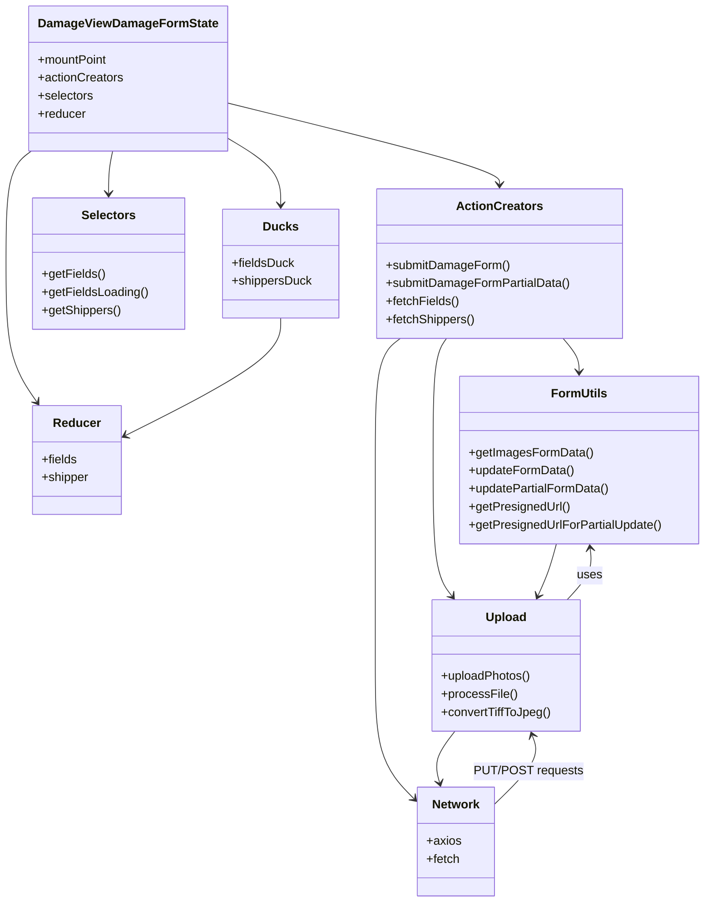

# Diagram: web/portal/src/pages/damageview/redux/DamageViewDamageFormState.js


> Auto-generated by Obscura crawlers

## Diagram 1



### SVG

<svg id="container" width="925.4567260742188" xmlns="http://www.w3.org/2000/svg" class="classDiagram" height="1194" viewBox="-34.69499969482422 0 925.4567260742188 1194" role="graphics-document document" aria-roledescription="class"><style>#container{font-family:"trebuchet ms",verdana,arial,sans-serif;font-size:16px;fill:#333;}@keyframes edge-animation-frame{from{stroke-dashoffset:0;}}@keyframes dash{to{stroke-dashoffset:0;}}#container .edge-animation-slow{stroke-dasharray:9,5!important;stroke-dashoffset:900;animation:dash 50s linear infinite;stroke-linecap:round;}#container .edge-animation-fast{stroke-dasharray:9,5!important;stroke-dashoffset:900;animation:dash 20s linear infinite;stroke-linecap:round;}#container .error-icon{fill:#552222;}#container .error-text{fill:#552222;stroke:#552222;}#container .edge-thickness-normal{stroke-width:1px;}#container .edge-thickness-thick{stroke-width:3.5px;}#container .edge-pattern-solid{stroke-dasharray:0;}#container .edge-thickness-invisible{stroke-width:0;fill:none;}#container .edge-pattern-dashed{stroke-dasharray:3;}#container .edge-pattern-dotted{stroke-dasharray:2;}#container .marker{fill:#333333;stroke:#333333;}#container .marker.cross{stroke:#333333;}#container svg{font-family:"trebuchet ms",verdana,arial,sans-serif;font-size:16px;}#container p{margin:0;}#container g.classGroup text{fill:#9370DB;stroke:none;font-family:"trebuchet ms",verdana,arial,sans-serif;font-size:10px;}#container g.classGroup text .title{font-weight:bolder;}#container .nodeLabel,#container .edgeLabel{color:#131300;}#container .edgeLabel .label rect{fill:#ECECFF;}#container .label text{fill:#131300;}#container .labelBkg{background:#ECECFF;}#container .edgeLabel .label span{background:#ECECFF;}#container .classTitle{font-weight:bolder;}#container .node rect,#container .node circle,#container .node ellipse,#container .node polygon,#container .node path{fill:#ECECFF;stroke:#9370DB;stroke-width:1px;}#container .divider{stroke:#9370DB;stroke-width:1;}#container g.clickable{cursor:pointer;}#container g.classGroup rect{fill:#ECECFF;stroke:#9370DB;}#container g.classGroup line{stroke:#9370DB;stroke-width:1;}#container .classLabel .box{stroke:none;stroke-width:0;fill:#ECECFF;opacity:0.5;}#container .classLabel .label{fill:#9370DB;font-size:10px;}#container .relation{stroke:#333333;stroke-width:1;fill:none;}#container .dashed-line{stroke-dasharray:3;}#container .dotted-line{stroke-dasharray:1 2;}#container #compositionStart,#container .composition{fill:#333333!important;stroke:#333333!important;stroke-width:1;}#container #compositionEnd,#container .composition{fill:#333333!important;stroke:#333333!important;stroke-width:1;}#container #dependencyStart,#container .dependency{fill:#333333!important;stroke:#333333!important;stroke-width:1;}#container #dependencyStart,#container .dependency{fill:#333333!important;stroke:#333333!important;stroke-width:1;}#container #extensionStart,#container .extension{fill:transparent!important;stroke:#333333!important;stroke-width:1;}#container #extensionEnd,#container .extension{fill:transparent!important;stroke:#333333!important;stroke-width:1;}#container #aggregationStart,#container .aggregation{fill:transparent!important;stroke:#333333!important;stroke-width:1;}#container #aggregationEnd,#container .aggregation{fill:transparent!important;stroke:#333333!important;stroke-width:1;}#container #lollipopStart,#container .lollipop{fill:#ECECFF!important;stroke:#333333!important;stroke-width:1;}#container #lollipopEnd,#container .lollipop{fill:#ECECFF!important;stroke:#333333!important;stroke-width:1;}#container .edgeTerminals{font-size:11px;line-height:initial;}#container .classTitleText{text-anchor:middle;font-size:18px;fill:#333;}#container .label-icon{display:inline-block;height:1em;overflow:visible;vertical-align:-0.125em;}#container .node .label-icon path{fill:currentColor;stroke:revert;stroke-width:revert;}#container :root{--mermaid-font-family:"trebuchet ms",verdana,arial,sans-serif;}</style><g><defs><marker id="container_class-aggregationStart" class="marker aggregation class" refX="18" refY="7" markerWidth="190" markerHeight="240" orient="auto"><path d="M 18,7 L9,13 L1,7 L9,1 Z"></path></marker></defs><defs><marker id="container_class-aggregationEnd" class="marker aggregation class" refX="1" refY="7" markerWidth="20" markerHeight="28" orient="auto"><path d="M 18,7 L9,13 L1,7 L9,1 Z"></path></marker></defs><defs><marker id="container_class-extensionStart" class="marker extension class" refX="18" refY="7" markerWidth="190" markerHeight="240" orient="auto"><path d="M 1,7 L18,13 V 1 Z"></path></marker></defs><defs><marker id="container_class-extensionEnd" class="marker extension class" refX="1" refY="7" markerWidth="20" markerHeight="28" orient="auto"><path d="M 1,1 V 13 L18,7 Z"></path></marker></defs><defs><marker id="container_class-compositionStart" class="marker composition class" refX="18" refY="7" markerWidth="190" markerHeight="240" orient="auto"><path d="M 18,7 L9,13 L1,7 L9,1 Z"></path></marker></defs><defs><marker id="container_class-compositionEnd" class="marker composition class" refX="1" refY="7" markerWidth="20" markerHeight="28" orient="auto"><path d="M 18,7 L9,13 L1,7 L9,1 Z"></path></marker></defs><defs><marker id="container_class-dependencyStart" class="marker dependency class" refX="6" refY="7" markerWidth="190" markerHeight="240" orient="auto"><path d="M 5,7 L9,13 L1,7 L9,1 Z"></path></marker></defs><defs><marker id="container_class-dependencyEnd" class="marker dependency class" refX="13" refY="7" markerWidth="20" markerHeight="28" orient="auto"><path d="M 18,7 L9,13 L14,7 L9,1 Z"></path></marker></defs><defs><marker id="container_class-lollipopStart" class="marker lollipop class" refX="13" refY="7" markerWidth="190" markerHeight="240" orient="auto"><circle stroke="black" fill="transparent" cx="7" cy="7" r="6"></circle></marker></defs><defs><marker id="container_class-lollipopEnd" class="marker lollipop class" refX="1" refY="7" markerWidth="190" markerHeight="240" orient="auto"><circle stroke="black" fill="transparent" cx="7" cy="7" r="6"></circle></marker></defs><g class="root"><g class="clusters"></g><g class="edgePaths"><path d="M8.461,198.479L2.602,202.899C-3.258,207.319,-14.977,216.16,-20.836,241.247C-26.695,266.333,-26.695,307.667,-26.695,349C-26.695,390.333,-26.695,431.667,-19.945,462.175C-13.195,492.684,0.305,512.368,7.055,522.21L13.804,532.052" id="id_DamageViewDamageFormState_Reducer_1" class="edge-thickness-normal edge-pattern-solid relation" style=";;;" data-edge="true" data-et="edge" data-id="id_DamageViewDamageFormState_Reducer_1" data-points="W3sieCI6OC40NjA5Mzc1LCJ5IjoxOTguNDc5MTI5MTIxODE1OH0seyJ4IjotMjYuNjk1MzEyNSwieSI6MjI1fSx7IngiOi0yNi42OTUzMTI1LCJ5IjozNDl9LHsieCI6LTI2LjY5NTMxMjUsInkiOjQ3M30seyJ4IjoxNy4xOTgwNjk4NTI5NDExNzQsInkiOjUzN31d" marker-end="url(#container_class-dependencyEnd)"></path><path d="M258.945,135.218L318.977,150.182C379.008,165.146,499.07,195.073,559.102,213.203C619.133,231.333,619.133,237.667,619.133,240.833L619.133,244" id="id_DamageViewDamageFormState_ActionCreators_2" class="edge-thickness-normal edge-pattern-solid relation" style=";;;" data-edge="true" data-et="edge" data-id="id_DamageViewDamageFormState_ActionCreators_2" data-points="W3sieCI6MjU4Ljk0NTMxMjUsInkiOjEzNS4yMTgzMzEwNTMzNTE1Nn0seyJ4Ijo2MTkuMTMyODEyNSwieSI6MjI1fSx7IngiOjYxOS4xMzI4MTI1LCJ5IjoyNTB9XQ==" marker-end="url(#container_class-dependencyEnd)"></path><path d="M112.957,200L112.057,204.167C111.156,208.333,109.356,216.667,108.455,226C107.555,235.333,107.555,245.667,107.555,250.833L107.555,256" id="id_DamageViewDamageFormState_Selectors_3" class="edge-thickness-normal edge-pattern-solid relation" style=";;;" data-edge="true" data-et="edge" data-id="id_DamageViewDamageFormState_Selectors_3" data-points="W3sieCI6MTEyLjk1NzI1NzIzMTQwNDk1LCJ5IjoyMDB9LHsieCI6MTA3LjU1NDY4NzUsInkiOjIyNX0seyJ4IjoxMDcuNTU0Njg3NSwieSI6MjYyfV0=" marker-end="url(#container_class-dependencyEnd)"></path><path d="M258.945,180.152L271.238,187.627C283.531,195.102,308.117,210.051,320.41,225.192C332.703,240.333,332.703,255.667,332.703,263.333L332.703,271" id="id_DamageViewDamageFormState_Ducks_4" class="edge-thickness-normal edge-pattern-solid relation" style=";;;" data-edge="true" data-et="edge" data-id="id_DamageViewDamageFormState_Ducks_4" data-points="W3sieCI6MjU4Ljk0NTMxMjUsInkiOjE4MC4xNTIyODQ4NjE4MDkwNX0seyJ4IjozMzIuNzAzMTI1LCJ5IjoyMjV9LHsieCI6MzMyLjcwMzEyNSwieSI6Mjc3fV0=" marker-end="url(#container_class-dependencyEnd)"></path><path d="M332.703,421L332.703,429.667C332.703,438.333,332.703,455.667,299.002,481.556C265.302,507.445,197.9,541.889,164.2,559.112L130.499,576.334" id="id_Ducks_Reducer_5" class="edge-thickness-normal edge-pattern-solid relation" style=";;;" data-edge="true" data-et="edge" data-id="id_Ducks_Reducer_5" data-points="W3sieCI6MzMyLjcwMzEyNSwieSI6NDIxfSx7IngiOjMzMi43MDMxMjUsInkiOjQ3M30seyJ4IjoxMjUuMTU2MjUsInkiOjU3OS4wNjQzNDk0NTk4NDAzfV0=" marker-end="url(#container_class-dependencyEnd)"></path><path d="M703.843,448L707.408,452.167C710.973,456.333,718.104,464.667,721.669,472C725.234,479.333,725.234,485.667,725.234,488.833L725.234,492" id="id_ActionCreators_FormUtils_6" class="edge-thickness-normal edge-pattern-solid relation" style=";;;" data-edge="true" data-et="edge" data-id="id_ActionCreators_FormUtils_6" data-points="W3sieCI6NzAzLjg0MjkzMDk0NzU4MDYsInkiOjQ0OH0seyJ4Ijo3MjUuMjM0Mzc1LCJ5Ijo0NzN9LHsieCI6NzI1LjIzNDM3NSwieSI6NDk4fV0=" marker-end="url(#container_class-dependencyEnd)"></path><path d="M550.132,448L547.227,452.167C544.323,456.333,538.515,464.667,535.611,491.5C532.707,518.333,532.707,563.667,532.707,611C532.707,658.333,532.707,707.667,536.881,737.71C541.055,767.754,549.403,778.507,553.577,783.884L557.752,789.261" id="id_ActionCreators_Upload_7" class="edge-thickness-normal edge-pattern-solid relation" style=";;;" data-edge="true" data-et="edge" data-id="id_ActionCreators_Upload_7" data-points="W3sieCI6NTUwLjEzMTU4MzkyMTM3MSwieSI6NDQ4fSx7IngiOjUzMi43MDcwMzEyNSwieSI6NDczfSx7IngiOjUzMi43MDcwMzEyNSwieSI6NjA5fSx7IngiOjUzMi43MDcwMzEyNSwieSI6NzU3fSx7IngiOjU2MS40MzA4Njg4MjU2MDQ5LCJ5Ijo3OTR9XQ==" marker-end="url(#container_class-dependencyEnd)"></path><path d="M489.347,448L483.884,452.167C478.422,456.333,467.497,464.667,462.035,491.5C456.572,518.333,456.572,563.667,456.572,611C456.572,658.333,456.572,707.667,456.572,753C456.572,798.333,456.572,839.667,456.572,881C456.572,922.333,456.572,963.667,465.197,993.181C473.823,1022.695,491.073,1040.389,499.698,1049.236L508.323,1058.084" id="id_ActionCreators_Network_8" class="edge-thickness-normal edge-pattern-solid relation" style=";;;" data-edge="true" data-et="edge" data-id="id_ActionCreators_Network_8" data-points="W3sieCI6NDg5LjM0NjU2OTQzMDQ0MzU0LCJ5Ijo0NDh9LHsieCI6NDU2LjU3MjI2NTYyNSwieSI6NDczfSx7IngiOjQ1Ni41NzIyNjU2MjUsInkiOjYwOX0seyJ4Ijo0NTYuNTcyMjY1NjI1LCJ5Ijo3NTd9LHsieCI6NDU2LjU3MjI2NTYyNSwieSI6ODgxfSx7IngiOjQ1Ni41NzIyNjU2MjUsInkiOjEwMDV9LHsieCI6NTEyLjUxMTcxODc1LCJ5IjoxMDYyLjM3OTkxNDM0OTI1NjV9XQ==" marker-end="url(#container_class-dependencyEnd)"></path><path d="M695.138,720L693.466,726.167C691.794,732.333,688.45,744.667,684.398,756.089C680.347,767.511,675.589,778.023,673.209,783.278L670.83,788.534" id="id_FormUtils_Upload_9" class="edge-thickness-normal edge-pattern-solid relation" style=";;;" data-edge="true" data-et="edge" data-id="id_FormUtils_Upload_9" data-points="W3sieCI6Njk1LjEzNzY5NTMxMjUsInkiOjcyMH0seyJ4Ijo2ODUuMTA1NDY4NzUsInkiOjc1N30seyJ4Ijo2NjguMzU1NTc5MDA3MDU2NSwieSI6Nzk0fV0=" marker-end="url(#container_class-dependencyEnd)"></path><path d="M561.431,968L556.644,974.167C551.856,980.333,542.282,992.667,538.932,1004.036C535.583,1015.406,538.46,1025.811,539.898,1031.014L541.336,1036.217" id="id_Upload_Network_10" class="edge-thickness-normal edge-pattern-solid relation" style=";;;" data-edge="true" data-et="edge" data-id="id_Upload_Network_10" data-points="W3sieCI6NTYxLjQzMDg2ODgyNTYwNDksInkiOjk2OH0seyJ4Ijo1MzIuNzA3MDMxMjUsInkiOjEwMDV9LHsieCI6NTQyLjkzNDI3NDY1NTk2MzMsInkiOjEwNDJ9XQ==" marker-end="url(#container_class-dependencyEnd)"></path><path d="M709.312,794L715.007,787.833C720.702,781.667,732.091,769.333,737.148,757.992C742.205,746.652,740.929,736.303,740.291,731.129L739.653,725.955" id="id_Upload_FormUtils_11" class="edge-thickness-normal edge-pattern-solid relation" style=";;;" data-edge="true" data-et="edge" data-id="id_Upload_FormUtils_11" data-points="W3sieCI6NzA5LjMxMjIzMjIzMjg2MjksInkiOjc5NH0seyJ4Ijo3NDMuNDgwNDY4NzUsInkiOjc1N30seyJ4Ijo3MzguOTE4OTQ1MzEyNSwieSI6NzIwfV0=" marker-end="url(#container_class-dependencyEnd)"></path><path d="M613.16,1064.606L623.282,1054.672C633.403,1044.737,653.646,1024.869,661.874,1009.708C670.102,994.547,666.316,984.094,664.422,978.868L662.529,973.641" id="id_Network_Upload_12" class="edge-thickness-normal edge-pattern-solid relation" style=";;;" data-edge="true" data-et="edge" data-id="id_Network_Upload_12" data-points="W3sieCI6NjEzLjE2MDE1NjI1LCJ5IjoxMDY0LjYwNTk5MDI1NjU5OTZ9LHsieCI6NjczLjg4ODY3MTg3NSwieSI6MTAwNX0seyJ4Ijo2NjAuNDg1NzI5NTg2NjkzNSwieSI6OTY4fV0=" marker-end="url(#container_class-dependencyEnd)"></path></g><g class="edgeLabels"><g class="edgeLabel"><g class="label" data-id="id_DamageViewDamageFormState_Reducer_1" transform="translate(0, 0)"><foreignObject width="0" height="0"><div xmlns="http://www.w3.org/1999/xhtml" class="labelBkg" style="display: table-cell; white-space: nowrap; line-height: 1.5; max-width: 200px; text-align: center;"><span class="edgeLabel"></span></div></foreignObject></g></g><g class="edgeLabel"><g class="label" data-id="id_DamageViewDamageFormState_ActionCreators_2" transform="translate(0, 0)"><foreignObject width="0" height="0"><div xmlns="http://www.w3.org/1999/xhtml" class="labelBkg" style="display: table-cell; white-space: nowrap; line-height: 1.5; max-width: 200px; text-align: center;"><span class="edgeLabel"></span></div></foreignObject></g></g><g class="edgeLabel"><g class="label" data-id="id_DamageViewDamageFormState_Selectors_3" transform="translate(0, 0)"><foreignObject width="0" height="0"><div xmlns="http://www.w3.org/1999/xhtml" class="labelBkg" style="display: table-cell; white-space: nowrap; line-height: 1.5; max-width: 200px; text-align: center;"><span class="edgeLabel"></span></div></foreignObject></g></g><g class="edgeLabel"><g class="label" data-id="id_DamageViewDamageFormState_Ducks_4" transform="translate(0, 0)"><foreignObject width="0" height="0"><div xmlns="http://www.w3.org/1999/xhtml" class="labelBkg" style="display: table-cell; white-space: nowrap; line-height: 1.5; max-width: 200px; text-align: center;"><span class="edgeLabel"></span></div></foreignObject></g></g><g class="edgeLabel"><g class="label" data-id="id_Ducks_Reducer_5" transform="translate(0, 0)"><foreignObject width="0" height="0"><div xmlns="http://www.w3.org/1999/xhtml" class="labelBkg" style="display: table-cell; white-space: nowrap; line-height: 1.5; max-width: 200px; text-align: center;"><span class="edgeLabel"></span></div></foreignObject></g></g><g class="edgeLabel"><g class="label" data-id="id_ActionCreators_FormUtils_6" transform="translate(0, 0)"><foreignObject width="0" height="0"><div xmlns="http://www.w3.org/1999/xhtml" class="labelBkg" style="display: table-cell; white-space: nowrap; line-height: 1.5; max-width: 200px; text-align: center;"><span class="edgeLabel"></span></div></foreignObject></g></g><g class="edgeLabel"><g class="label" data-id="id_ActionCreators_Upload_7" transform="translate(0, 0)"><foreignObject width="0" height="0"><div xmlns="http://www.w3.org/1999/xhtml" class="labelBkg" style="display: table-cell; white-space: nowrap; line-height: 1.5; max-width: 200px; text-align: center;"><span class="edgeLabel"></span></div></foreignObject></g></g><g class="edgeLabel"><g class="label" data-id="id_ActionCreators_Network_8" transform="translate(0, 0)"><foreignObject width="0" height="0"><div xmlns="http://www.w3.org/1999/xhtml" class="labelBkg" style="display: table-cell; white-space: nowrap; line-height: 1.5; max-width: 200px; text-align: center;"><span class="edgeLabel"></span></div></foreignObject></g></g><g class="edgeLabel"><g class="label" data-id="id_FormUtils_Upload_9" transform="translate(0, 0)"><foreignObject width="0" height="0"><div xmlns="http://www.w3.org/1999/xhtml" class="labelBkg" style="display: table-cell; white-space: nowrap; line-height: 1.5; max-width: 200px; text-align: center;"><span class="edgeLabel"></span></div></foreignObject></g></g><g class="edgeLabel"><g class="label" data-id="id_Upload_Network_10" transform="translate(0, 0)"><foreignObject width="0" height="0"><div xmlns="http://www.w3.org/1999/xhtml" class="labelBkg" style="display: table-cell; white-space: nowrap; line-height: 1.5; max-width: 200px; text-align: center;"><span class="edgeLabel"></span></div></foreignObject></g></g><g class="edgeLabel" transform="translate(739.04241, 761.80587)"><g class="label" data-id="id_Upload_FormUtils_11" transform="translate(-16.4921875, -12)"><foreignObject width="32.984375" height="24"><div xmlns="http://www.w3.org/1999/xhtml" class="labelBkg" style="display: table-cell; white-space: nowrap; line-height: 1.5; max-width: 200px; text-align: center;"><span class="edgeLabel"><p>uses</p></span></div></foreignObject></g></g><g class="edgeLabel" transform="translate(657.56689, 1021.02009)"><g class="label" data-id="id_Network_Upload_12" transform="translate(-69.8359375, -12)"><foreignObject width="139.671875" height="24"><div xmlns="http://www.w3.org/1999/xhtml" class="labelBkg" style="display: table-cell; white-space: nowrap; line-height: 1.5; max-width: 200px; text-align: center;"><span class="edgeLabel"><p>PUT/POST requests</p></span></div></foreignObject></g></g></g><g class="nodes"><g class="node default" id="classId-DamageViewDamageFormState-0" transform="translate(133.703125, 104)"><g class="basic label-container"><path d="M-125.2421875 -96 L125.2421875 -96 L125.2421875 96 L-125.2421875 96" stroke="none" stroke-width="0" fill="#ECECFF" style=""></path><path d="M-125.2421875 -96 C-62.578495775459245 -96, 0.08519594908150907 -96, 125.2421875 -96 M-125.2421875 -96 C-65.63532852117127 -96, -6.028469542342549 -96, 125.2421875 -96 M125.2421875 -96 C125.2421875 -55.37435139613726, 125.2421875 -14.748702792274514, 125.2421875 96 M125.2421875 -96 C125.2421875 -54.97032128060335, 125.2421875 -13.940642561206701, 125.2421875 96 M125.2421875 96 C52.561512963138355 96, -20.11916157372329 96, -125.2421875 96 M125.2421875 96 C39.26077102844076 96, -46.720645443118485 96, -125.2421875 96 M-125.2421875 96 C-125.2421875 41.64350744803893, -125.2421875 -12.712985103922136, -125.2421875 -96 M-125.2421875 96 C-125.2421875 54.91453968687297, -125.2421875 13.829079373745941, -125.2421875 -96" stroke="#9370DB" stroke-width="1.3" fill="none" stroke-dasharray="0 0" style=""></path></g><g class="annotation-group text" transform="translate(0, -72)"></g><g class="label-group text" transform="translate(-113.2421875, -72)"><g class="label" style="font-weight: bolder" transform="translate(0,-12)"><foreignObject width="226.484375" height="24"><div xmlns="http://www.w3.org/1999/xhtml" style="display: table-cell; white-space: nowrap; line-height: 1.5; max-width: 273px; text-align: center;"><span class="nodeLabel markdown-node-label" style=""><p>DamageViewDamageFormState</p></span></div></foreignObject></g></g><g class="members-group text" transform="translate(-113.2421875, -24)"><g class="label" style="" transform="translate(0,-12)"><foreignObject width="93.34375" height="24"><div xmlns="http://www.w3.org/1999/xhtml" style="display: table-cell; white-space: nowrap; line-height: 1.5; max-width: 151px; text-align: center;"><span class="nodeLabel markdown-node-label" style=""><p>+mountPoint</p></span></div></foreignObject></g><g class="label" style="" transform="translate(0,12)"><foreignObject width="113.078125" height="24"><div xmlns="http://www.w3.org/1999/xhtml" style="display: table-cell; white-space: nowrap; line-height: 1.5; max-width: 170px; text-align: center;"><span class="nodeLabel markdown-node-label" style=""><p>+actionCreators</p></span></div></foreignObject></g><g class="label" style="" transform="translate(0,36)"><foreignObject width="73.453125" height="24"><div xmlns="http://www.w3.org/1999/xhtml" style="display: table-cell; white-space: nowrap; line-height: 1.5; max-width: 131px; text-align: center;"><span class="nodeLabel markdown-node-label" style=""><p>+selectors</p></span></div></foreignObject></g><g class="label" style="" transform="translate(0,60)"><foreignObject width="63.515625" height="24"><div xmlns="http://www.w3.org/1999/xhtml" style="display: table-cell; white-space: nowrap; line-height: 1.5; max-width: 122px; text-align: center;"><span class="nodeLabel markdown-node-label" style=""><p>+reducer</p></span></div></foreignObject></g></g><g class="methods-group text" transform="translate(-113.2421875, 96)"></g><g class="divider" style=""><path d="M-125.2421875 -48 C-35.46481812264179 -48, 54.312551254716425 -48, 125.2421875 -48 M-125.2421875 -48 C-54.463674534884674 -48, 16.31483843023065 -48, 125.2421875 -48" stroke="#9370DB" stroke-width="1.3" fill="none" stroke-dasharray="0 0" style=""></path></g><g class="divider" style=""><path d="M-125.2421875 72 C-52.969611195098494 72, 19.30296510980301 72, 125.2421875 72 M-125.2421875 72 C-31.183510472310786 72, 62.87516655537843 72, 125.2421875 72" stroke="#9370DB" stroke-width="1.3" fill="none" stroke-dasharray="0 0" style=""></path></g></g><g class="node default" id="classId-Ducks-1" transform="translate(332.703125, 349)"><g class="basic label-container"><path d="M-75.8984375 -72 L75.8984375 -72 L75.8984375 72 L-75.8984375 72" stroke="none" stroke-width="0" fill="#ECECFF" style=""></path><path d="M-75.8984375 -72 C-43.88216516439961 -72, -11.865892828799218 -72, 75.8984375 -72 M-75.8984375 -72 C-29.77506754920784 -72, 16.34830240158432 -72, 75.8984375 -72 M75.8984375 -72 C75.8984375 -24.88764626344937, 75.8984375 22.22470747310126, 75.8984375 72 M75.8984375 -72 C75.8984375 -40.61357477782283, 75.8984375 -9.227149555645674, 75.8984375 72 M75.8984375 72 C42.15467706272255 72, 8.410916625445097 72, -75.8984375 72 M75.8984375 72 C16.65935183864277 72, -42.57973382271446 72, -75.8984375 72 M-75.8984375 72 C-75.8984375 40.15038779965626, -75.8984375 8.300775599312523, -75.8984375 -72 M-75.8984375 72 C-75.8984375 41.55097586903963, -75.8984375 11.101951738079272, -75.8984375 -72" stroke="#9370DB" stroke-width="1.3" fill="none" stroke-dasharray="0 0" style=""></path></g><g class="annotation-group text" transform="translate(0, -48)"></g><g class="label-group text" transform="translate(-21.859375, -48)"><g class="label" style="font-weight: bolder" transform="translate(0,-12)"><foreignObject width="43.71875" height="24"><div xmlns="http://www.w3.org/1999/xhtml" style="display: table-cell; white-space: nowrap; line-height: 1.5; max-width: 93px; text-align: center;"><span class="nodeLabel markdown-node-label" style=""><p>Ducks</p></span></div></foreignObject></g></g><g class="members-group text" transform="translate(-63.8984375, 0)"><g class="label" style="" transform="translate(0,-12)"><foreignObject width="82.78125" height="24"><div xmlns="http://www.w3.org/1999/xhtml" style="display: table-cell; white-space: nowrap; line-height: 1.5; max-width: 141px; text-align: center;"><span class="nodeLabel markdown-node-label" style=""><p>+fieldsDuck</p></span></div></foreignObject></g><g class="label" style="" transform="translate(0,12)"><foreignObject width="105.9375" height="24"><div xmlns="http://www.w3.org/1999/xhtml" style="display: table-cell; white-space: nowrap; line-height: 1.5; max-width: 164px; text-align: center;"><span class="nodeLabel markdown-node-label" style=""><p>+shippersDuck</p></span></div></foreignObject></g></g><g class="methods-group text" transform="translate(-63.8984375, 72)"></g><g class="divider" style=""><path d="M-75.8984375 -24 C-19.28850470349827 -24, 37.32142809300346 -24, 75.8984375 -24 M-75.8984375 -24 C-25.91902163268488 -24, 24.060394234630238 -24, 75.8984375 -24" stroke="#9370DB" stroke-width="1.3" fill="none" stroke-dasharray="0 0" style=""></path></g><g class="divider" style=""><path d="M-75.8984375 48 C-39.307888434961356 48, -2.717339369922712 48, 75.8984375 48 M-75.8984375 48 C-31.27465053590651 48, 13.34913642818698 48, 75.8984375 48" stroke="#9370DB" stroke-width="1.3" fill="none" stroke-dasharray="0 0" style=""></path></g></g><g class="node default" id="classId-Reducer-2" transform="translate(66.578125, 609)"><g class="basic label-container"><path d="M-58.578125 -72 L58.578125 -72 L58.578125 72 L-58.578125 72" stroke="none" stroke-width="0" fill="#ECECFF" style=""></path><path d="M-58.578125 -72 C-24.230097294096197 -72, 10.117930411807606 -72, 58.578125 -72 M-58.578125 -72 C-26.396979744444202 -72, 5.7841655111115955 -72, 58.578125 -72 M58.578125 -72 C58.578125 -39.796419064199476, 58.578125 -7.592838128398952, 58.578125 72 M58.578125 -72 C58.578125 -32.587887935566606, 58.578125 6.824224128866788, 58.578125 72 M58.578125 72 C15.549743323233173 72, -27.478638353533654 72, -58.578125 72 M58.578125 72 C14.447396255616304 72, -29.68333248876739 72, -58.578125 72 M-58.578125 72 C-58.578125 24.960401689643774, -58.578125 -22.07919662071245, -58.578125 -72 M-58.578125 72 C-58.578125 19.949215601653613, -58.578125 -32.101568796692774, -58.578125 -72" stroke="#9370DB" stroke-width="1.3" fill="none" stroke-dasharray="0 0" style=""></path></g><g class="annotation-group text" transform="translate(0, -48)"></g><g class="label-group text" transform="translate(-29.90625, -48)"><g class="label" style="font-weight: bolder" transform="translate(0,-12)"><foreignObject width="59.8125" height="24"><div xmlns="http://www.w3.org/1999/xhtml" style="display: table-cell; white-space: nowrap; line-height: 1.5; max-width: 110px; text-align: center;"><span class="nodeLabel markdown-node-label" style=""><p>Reducer</p></span></div></foreignObject></g></g><g class="members-group text" transform="translate(-46.578125, 0)"><g class="label" style="" transform="translate(0,-12)"><foreignObject width="47.3125" height="24"><div xmlns="http://www.w3.org/1999/xhtml" style="display: table-cell; white-space: nowrap; line-height: 1.5; max-width: 105px; text-align: center;"><span class="nodeLabel markdown-node-label" style=""><p>+fields</p></span></div></foreignObject></g><g class="label" style="" transform="translate(0,12)"><foreignObject width="63.25" height="24"><div xmlns="http://www.w3.org/1999/xhtml" style="display: table-cell; white-space: nowrap; line-height: 1.5; max-width: 121px; text-align: center;"><span class="nodeLabel markdown-node-label" style=""><p>+shipper</p></span></div></foreignObject></g></g><g class="methods-group text" transform="translate(-46.578125, 72)"></g><g class="divider" style=""><path d="M-58.578125 -24 C-33.56233018654401 -24, -8.54653537308802 -24, 58.578125 -24 M-58.578125 -24 C-32.295005528606524 -24, -6.01188605721304 -24, 58.578125 -24" stroke="#9370DB" stroke-width="1.3" fill="none" stroke-dasharray="0 0" style=""></path></g><g class="divider" style=""><path d="M-58.578125 48 C-13.837919107505876 48, 30.90228678498825 48, 58.578125 48 M-58.578125 48 C-14.670285428465277 48, 29.237554143069445 48, 58.578125 48" stroke="#9370DB" stroke-width="1.3" fill="none" stroke-dasharray="0 0" style=""></path></g></g><g class="node default" id="classId-Selectors-3" transform="translate(107.5546875, 349)"><g class="basic label-container"><path d="M-99.25 -87 L99.25 -87 L99.25 87 L-99.25 87" stroke="none" stroke-width="0" fill="#ECECFF" style=""></path><path d="M-99.25 -87 C-21.927979707924152 -87, 55.394040584151696 -87, 99.25 -87 M-99.25 -87 C-21.603009137951332 -87, 56.043981724097335 -87, 99.25 -87 M99.25 -87 C99.25 -43.12604342975003, 99.25 0.7479131404999464, 99.25 87 M99.25 -87 C99.25 -41.45222011636229, 99.25 4.095559767275418, 99.25 87 M99.25 87 C49.878011107674936 87, 0.5060222153498728 87, -99.25 87 M99.25 87 C54.733797329324226 87, 10.217594658648451 87, -99.25 87 M-99.25 87 C-99.25 45.06595025612552, -99.25 3.131900512251036, -99.25 -87 M-99.25 87 C-99.25 27.59030104306499, -99.25 -31.81939791387002, -99.25 -87" stroke="#9370DB" stroke-width="1.3" fill="none" stroke-dasharray="0 0" style=""></path></g><g class="annotation-group text" transform="translate(0, -63)"></g><g class="label-group text" transform="translate(-34.171875, -63)"><g class="label" style="font-weight: bolder" transform="translate(0,-12)"><foreignObject width="68.34375" height="24"><div xmlns="http://www.w3.org/1999/xhtml" style="display: table-cell; white-space: nowrap; line-height: 1.5; max-width: 117px; text-align: center;"><span class="nodeLabel markdown-node-label" style=""><p>Selectors</p></span></div></foreignObject></g></g><g class="members-group text" transform="translate(-87.25, -15)"></g><g class="methods-group text" transform="translate(-87.25, 15)"><g class="label" style="" transform="translate(0,-12)"><foreignObject width="83.09375" height="24"><div xmlns="http://www.w3.org/1999/xhtml" style="display: table-cell; white-space: nowrap; line-height: 1.5; max-width: 140px; text-align: center;"><span class="nodeLabel markdown-node-label" style=""><p>+getFields()</p></span></div></foreignObject></g><g class="label" style="" transform="translate(0,12)"><foreignObject width="140.328125" height="24"><div xmlns="http://www.w3.org/1999/xhtml" style="display: table-cell; white-space: nowrap; line-height: 1.5; max-width: 198px; text-align: center;"><span class="nodeLabel markdown-node-label" style=""><p>+getFieldsLoading()</p></span></div></foreignObject></g><g class="label" style="" transform="translate(0,36)"><foreignObject width="104.65625" height="24"><div xmlns="http://www.w3.org/1999/xhtml" style="display: table-cell; white-space: nowrap; line-height: 1.5; max-width: 162px; text-align: center;"><span class="nodeLabel markdown-node-label" style=""><p>+getShippers()</p></span></div></foreignObject></g></g><g class="divider" style=""><path d="M-99.25 -39 C-48.7867439648123 -39, 1.676512070375395 -39, 99.25 -39 M-99.25 -39 C-20.956607625823338 -39, 57.336784748353324 -39, 99.25 -39" stroke="#9370DB" stroke-width="1.3" fill="none" stroke-dasharray="0 0" style=""></path></g><g class="divider" style=""><path d="M-99.25 -15 C-25.821413635336796 -15, 47.60717272932641 -15, 99.25 -15 M-99.25 -15 C-45.5847332721835 -15, 8.080533455633002 -15, 99.25 -15" stroke="#9370DB" stroke-width="1.3" fill="none" stroke-dasharray="0 0" style=""></path></g></g><g class="node default" id="classId-ActionCreators-4" transform="translate(619.1328125, 349)"><g class="basic label-container"><path d="M-160.53125 -99 L160.53125 -99 L160.53125 99 L-160.53125 99" stroke="none" stroke-width="0" fill="#ECECFF" style=""></path><path d="M-160.53125 -99 C-39.41033727916934 -99, 81.71057544166132 -99, 160.53125 -99 M-160.53125 -99 C-76.90025494568643 -99, 6.7307401086271454 -99, 160.53125 -99 M160.53125 -99 C160.53125 -31.005693653305073, 160.53125 36.988612693389854, 160.53125 99 M160.53125 -99 C160.53125 -58.514294794002495, 160.53125 -18.02858958800499, 160.53125 99 M160.53125 99 C80.11541597990023 99, -0.30041804019953133 99, -160.53125 99 M160.53125 99 C47.07588087751708 99, -66.37948824496584 99, -160.53125 99 M-160.53125 99 C-160.53125 54.60469852516963, -160.53125 10.209397050339263, -160.53125 -99 M-160.53125 99 C-160.53125 54.06424662262604, -160.53125 9.128493245252074, -160.53125 -99" stroke="#9370DB" stroke-width="1.3" fill="none" stroke-dasharray="0 0" style=""></path></g><g class="annotation-group text" transform="translate(0, -75)"></g><g class="label-group text" transform="translate(-53.96875, -75)"><g class="label" style="font-weight: bolder" transform="translate(0,-12)"><foreignObject width="107.9375" height="24"><div xmlns="http://www.w3.org/1999/xhtml" style="display: table-cell; white-space: nowrap; line-height: 1.5; max-width: 156px; text-align: center;"><span class="nodeLabel markdown-node-label" style=""><p>ActionCreators</p></span></div></foreignObject></g></g><g class="members-group text" transform="translate(-148.53125, -27)"></g><g class="methods-group text" transform="translate(-148.53125, 3)"><g class="label" style="" transform="translate(0,-12)"><foreignObject width="163.0625" height="24"><div xmlns="http://www.w3.org/1999/xhtml" style="display: table-cell; white-space: nowrap; line-height: 1.5; max-width: 220px; text-align: center;"><span class="nodeLabel markdown-node-label" style=""><p>+submitDamageForm()</p></span></div></foreignObject></g><g class="label" style="" transform="translate(0,12)"><foreignObject width="243.09375" height="24"><div xmlns="http://www.w3.org/1999/xhtml" style="display: table-cell; white-space: nowrap; line-height: 1.5; max-width: 300px; text-align: center;"><span class="nodeLabel markdown-node-label" style=""><p>+submitDamageFormPartialData()</p></span></div></foreignObject></g><g class="label" style="" transform="translate(0,36)"><foreignObject width="96.78125" height="24"><div xmlns="http://www.w3.org/1999/xhtml" style="display: table-cell; white-space: nowrap; line-height: 1.5; max-width: 154px; text-align: center;"><span class="nodeLabel markdown-node-label" style=""><p>+fetchFields()</p></span></div></foreignObject></g><g class="label" style="" transform="translate(0,60)"><foreignObject width="118.34375" height="24"><div xmlns="http://www.w3.org/1999/xhtml" style="display: table-cell; white-space: nowrap; line-height: 1.5; max-width: 176px; text-align: center;"><span class="nodeLabel markdown-node-label" style=""><p>+fetchShippers()</p></span></div></foreignObject></g></g><g class="divider" style=""><path d="M-160.53125 -51 C-88.99289380661396 -51, -17.454537613227927 -51, 160.53125 -51 M-160.53125 -51 C-49.56077676374565 -51, 61.4096964725087 -51, 160.53125 -51" stroke="#9370DB" stroke-width="1.3" fill="none" stroke-dasharray="0 0" style=""></path></g><g class="divider" style=""><path d="M-160.53125 -27 C-78.39196072902445 -27, 3.7473285419511058 -27, 160.53125 -27 M-160.53125 -27 C-40.14899436921203 -27, 80.23326126157593 -27, 160.53125 -27" stroke="#9370DB" stroke-width="1.3" fill="none" stroke-dasharray="0 0" style=""></path></g></g><g class="node default" id="classId-FormUtils-5" transform="translate(725.234375, 609)"><g class="basic label-container"><path d="M-157.52734375 -111 L157.52734375 -111 L157.52734375 111 L-157.52734375 111" stroke="none" stroke-width="0" fill="#ECECFF" style=""></path><path d="M-157.52734375 -111 C-55.15506767844049 -111, 47.21720839311902 -111, 157.52734375 -111 M-157.52734375 -111 C-40.02434815939249 -111, 77.47864743121502 -111, 157.52734375 -111 M157.52734375 -111 C157.52734375 -32.812119483351324, 157.52734375 45.37576103329735, 157.52734375 111 M157.52734375 -111 C157.52734375 -38.11808769379202, 157.52734375 34.76382461241596, 157.52734375 111 M157.52734375 111 C53.0087188259092 111, -51.5099060981816 111, -157.52734375 111 M157.52734375 111 C69.84276377893714 111, -17.84181619212572 111, -157.52734375 111 M-157.52734375 111 C-157.52734375 41.62472548794317, -157.52734375 -27.750549024113667, -157.52734375 -111 M-157.52734375 111 C-157.52734375 41.58416796238913, -157.52734375 -27.831664075221738, -157.52734375 -111" stroke="#9370DB" stroke-width="1.3" fill="none" stroke-dasharray="0 0" style=""></path></g><g class="annotation-group text" transform="translate(0, -87)"></g><g class="label-group text" transform="translate(-35.0546875, -87)"><g class="label" style="font-weight: bolder" transform="translate(0,-12)"><foreignObject width="70.109375" height="24"><div xmlns="http://www.w3.org/1999/xhtml" style="display: table-cell; white-space: nowrap; line-height: 1.5; max-width: 120px; text-align: center;"><span class="nodeLabel markdown-node-label" style=""><p>FormUtils</p></span></div></foreignObject></g></g><g class="members-group text" transform="translate(-145.52734375, -39)"></g><g class="methods-group text" transform="translate(-145.52734375, -9)"><g class="label" style="" transform="translate(0,-12)"><foreignObject width="161.890625" height="24"><div xmlns="http://www.w3.org/1999/xhtml" style="display: table-cell; white-space: nowrap; line-height: 1.5; max-width: 219px; text-align: center;"><span class="nodeLabel markdown-node-label" style=""><p>+getImagesFormData()</p></span></div></foreignObject></g><g class="label" style="" transform="translate(0,12)"><foreignObject width="139.453125" height="24"><div xmlns="http://www.w3.org/1999/xhtml" style="display: table-cell; white-space: nowrap; line-height: 1.5; max-width: 197px; text-align: center;"><span class="nodeLabel markdown-node-label" style=""><p>+updateFormData()</p></span></div></foreignObject></g><g class="label" style="" transform="translate(0,36)"><foreignObject width="186.265625" height="24"><div xmlns="http://www.w3.org/1999/xhtml" style="display: table-cell; white-space: nowrap; line-height: 1.5; max-width: 244px; text-align: center;"><span class="nodeLabel markdown-node-label" style=""><p>+updatePartialFormData()</p></span></div></foreignObject></g><g class="label" style="" transform="translate(0,60)"><foreignObject width="133.734375" height="24"><div xmlns="http://www.w3.org/1999/xhtml" style="display: table-cell; white-space: nowrap; line-height: 1.5; max-width: 191px; text-align: center;"><span class="nodeLabel markdown-node-label" style=""><p>+getPresignedUrl()</p></span></div></foreignObject></g><g class="label" style="" transform="translate(0,84)"><foreignObject width="256" height="24"><div xmlns="http://www.w3.org/1999/xhtml" style="display: table-cell; white-space: nowrap; line-height: 1.5; max-width: 313px; text-align: center;"><span class="nodeLabel markdown-node-label" style=""><p>+getPresignedUrlForPartialUpdate()</p></span></div></foreignObject></g></g><g class="divider" style=""><path d="M-157.52734375 -63 C-64.27181489537325 -63, 28.983713959253492 -63, 157.52734375 -63 M-157.52734375 -63 C-71.14716401680062 -63, 15.233015716398768 -63, 157.52734375 -63" stroke="#9370DB" stroke-width="1.3" fill="none" stroke-dasharray="0 0" style=""></path></g><g class="divider" style=""><path d="M-157.52734375 -39 C-43.52994310797462 -39, 70.46745753405077 -39, 157.52734375 -39 M-157.52734375 -39 C-38.32561393166601 -39, 80.87611588666798 -39, 157.52734375 -39" stroke="#9370DB" stroke-width="1.3" fill="none" stroke-dasharray="0 0" style=""></path></g></g><g class="node default" id="classId-Upload-6" transform="translate(628.970703125, 881)"><g class="basic label-container"><path d="M-97.26953125 -87 L97.26953125 -87 L97.26953125 87 L-97.26953125 87" stroke="none" stroke-width="0" fill="#ECECFF" style=""></path><path d="M-97.26953125 -87 C-28.815185231730027 -87, 39.63916078653995 -87, 97.26953125 -87 M-97.26953125 -87 C-25.59739376784387 -87, 46.07474371431226 -87, 97.26953125 -87 M97.26953125 -87 C97.26953125 -26.749223015574707, 97.26953125 33.50155396885059, 97.26953125 87 M97.26953125 -87 C97.26953125 -42.17388228987118, 97.26953125 2.6522354202576395, 97.26953125 87 M97.26953125 87 C57.33641712023721 87, 17.403302990474415 87, -97.26953125 87 M97.26953125 87 C25.439589115520405 87, -46.39035301895919 87, -97.26953125 87 M-97.26953125 87 C-97.26953125 23.972110678158217, -97.26953125 -39.05577864368357, -97.26953125 -87 M-97.26953125 87 C-97.26953125 31.04605403580795, -97.26953125 -24.907891928384103, -97.26953125 -87" stroke="#9370DB" stroke-width="1.3" fill="none" stroke-dasharray="0 0" style=""></path></g><g class="annotation-group text" transform="translate(0, -63)"></g><g class="label-group text" transform="translate(-26.1015625, -63)"><g class="label" style="font-weight: bolder" transform="translate(0,-12)"><foreignObject width="52.203125" height="24"><div xmlns="http://www.w3.org/1999/xhtml" style="display: table-cell; white-space: nowrap; line-height: 1.5; max-width: 102px; text-align: center;"><span class="nodeLabel markdown-node-label" style=""><p>Upload</p></span></div></foreignObject></g></g><g class="members-group text" transform="translate(-85.26953125, -15)"></g><g class="methods-group text" transform="translate(-85.26953125, 15)"><g class="label" style="" transform="translate(0,-12)"><foreignObject width="119.28125" height="24"><div xmlns="http://www.w3.org/1999/xhtml" style="display: table-cell; white-space: nowrap; line-height: 1.5; max-width: 177px; text-align: center;"><span class="nodeLabel markdown-node-label" style=""><p>+uploadPhotos()</p></span></div></foreignObject></g><g class="label" style="" transform="translate(0,12)"><foreignObject width="98.875" height="24"><div xmlns="http://www.w3.org/1999/xhtml" style="display: table-cell; white-space: nowrap; line-height: 1.5; max-width: 156px; text-align: center;"><span class="nodeLabel markdown-node-label" style=""><p>+processFile()</p></span></div></foreignObject></g><g class="label" style="" transform="translate(0,36)"><foreignObject width="144.4375" height="24"><div xmlns="http://www.w3.org/1999/xhtml" style="display: table-cell; white-space: nowrap; line-height: 1.5; max-width: 202px; text-align: center;"><span class="nodeLabel markdown-node-label" style=""><p>+convertTiffToJpeg()</p></span></div></foreignObject></g></g><g class="divider" style=""><path d="M-97.26953125 -39 C-25.4943352829614 -39, 46.2808606840772 -39, 97.26953125 -39 M-97.26953125 -39 C-56.64715871039629 -39, -16.02478617079258 -39, 97.26953125 -39" stroke="#9370DB" stroke-width="1.3" fill="none" stroke-dasharray="0 0" style=""></path></g><g class="divider" style=""><path d="M-97.26953125 -15 C-30.75115033048378 -15, 35.76723058903244 -15, 97.26953125 -15 M-97.26953125 -15 C-48.52986767084551 -15, 0.2097959083089762 -15, 97.26953125 -15" stroke="#9370DB" stroke-width="1.3" fill="none" stroke-dasharray="0 0" style=""></path></g></g><g class="node default" id="classId-Network-7" transform="translate(562.8359375, 1114)"><g class="basic label-container"><path d="M-50.32421875 -72 L50.32421875 -72 L50.32421875 72 L-50.32421875 72" stroke="none" stroke-width="0" fill="#ECECFF" style=""></path><path d="M-50.32421875 -72 C-26.560332624977917 -72, -2.7964464999558345 -72, 50.32421875 -72 M-50.32421875 -72 C-28.426489358427048 -72, -6.528759966854096 -72, 50.32421875 -72 M50.32421875 -72 C50.32421875 -32.21524736906041, 50.32421875 7.569505261879186, 50.32421875 72 M50.32421875 -72 C50.32421875 -25.855406911273384, 50.32421875 20.28918617745323, 50.32421875 72 M50.32421875 72 C28.329669117878197 72, 6.335119485756394 72, -50.32421875 72 M50.32421875 72 C15.11834480697435 72, -20.0875291360513 72, -50.32421875 72 M-50.32421875 72 C-50.32421875 42.43388758700804, -50.32421875 12.867775174016074, -50.32421875 -72 M-50.32421875 72 C-50.32421875 36.86907884407015, -50.32421875 1.738157688140305, -50.32421875 -72" stroke="#9370DB" stroke-width="1.3" fill="none" stroke-dasharray="0 0" style=""></path></g><g class="annotation-group text" transform="translate(0, -48)"></g><g class="label-group text" transform="translate(-31.1015625, -48)"><g class="label" style="font-weight: bolder" transform="translate(0,-12)"><foreignObject width="62.203125" height="24"><div xmlns="http://www.w3.org/1999/xhtml" style="display: table-cell; white-space: nowrap; line-height: 1.5; max-width: 111px; text-align: center;"><span class="nodeLabel markdown-node-label" style=""><p>Network</p></span></div></foreignObject></g></g><g class="members-group text" transform="translate(-38.32421875, 0)"><g class="label" style="" transform="translate(0,-12)"><foreignObject width="45.546875" height="24"><div xmlns="http://www.w3.org/1999/xhtml" style="display: table-cell; white-space: nowrap; line-height: 1.5; max-width: 103px; text-align: center;"><span class="nodeLabel markdown-node-label" style=""><p>+axios</p></span></div></foreignObject></g><g class="label" style="" transform="translate(0,12)"><foreignObject width="44.234375" height="24"><div xmlns="http://www.w3.org/1999/xhtml" style="display: table-cell; white-space: nowrap; line-height: 1.5; max-width: 102px; text-align: center;"><span class="nodeLabel markdown-node-label" style=""><p>+fetch</p></span></div></foreignObject></g></g><g class="methods-group text" transform="translate(-38.32421875, 72)"></g><g class="divider" style=""><path d="M-50.32421875 -24 C-28.3174157036953 -24, -6.3106126573906 -24, 50.32421875 -24 M-50.32421875 -24 C-25.205365632200024 -24, -0.0865125144000487 -24, 50.32421875 -24" stroke="#9370DB" stroke-width="1.3" fill="none" stroke-dasharray="0 0" style=""></path></g><g class="divider" style=""><path d="M-50.32421875 48 C-10.848195814444928 48, 28.627827121110144 48, 50.32421875 48 M-50.32421875 48 C-14.721017047413973 48, 20.882184655172054 48, 50.32421875 48" stroke="#9370DB" stroke-width="1.3" fill="none" stroke-dasharray="0 0" style=""></path></g></g></g></g></g></svg>

## Diagram 2

```mermaid
flowchart TD
    A[User submits form] --> B[submitDamageForm(formData, fields)]
    B --> C[updateFormData(formData, fields)]
    C --> D[POST to /damageview/submission/solution/:solutionId via axios]
    D --> E{response contains submission_ids?}
    E -- no --> F[resolve null]
    E -- yes --> G[for each submissionId call getPresignedUrl(vinData, submissionId)]
    G --> H[getPresignedUrl -> build imageData & fileData]
    H --> I[PUT to /:submission_id/presigned_url via axios]
    I --> J[uploadPhotos(imagesUrlData, fileData)]
    J --> K[for each file -> processFile(file)]
    K --> L{file.type}
    L -- heic/heif --> M[heic2any -> convert to JPEG File]
    L -- image/tiff --> N[convertTiffToJpeg -> decode UTIF -> canvas -> JPEG File]
    L -- other --> O[resolve original file]
    M --> P[PUT processed file to presigned URL (fetch)]
    N --> P
    O --> P
    P --> Q[Promise.all(promises)]
    Q --> R["success" or throw error]
```

> SVG rendering failed for this diagram.
