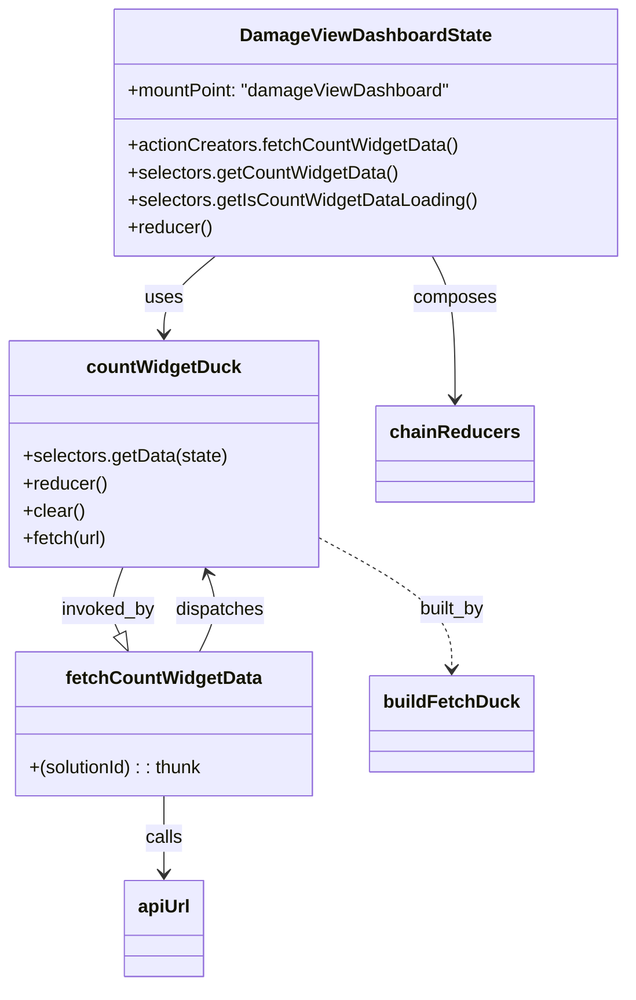

# Diagram: web/portal/src/pages/damageview/redux/DamageViewDashboardState.js


> Auto-generated by Obscura crawlers

## Diagram 1



### SVG

<svg id="container" width="541.806640625" xmlns="http://www.w3.org/2000/svg" class="classDiagram" height="862" viewBox="0 0 541.806640625 862" role="graphics-document document" aria-roledescription="class"><style>#container{font-family:"trebuchet ms",verdana,arial,sans-serif;font-size:16px;fill:#333;}@keyframes edge-animation-frame{from{stroke-dashoffset:0;}}@keyframes dash{to{stroke-dashoffset:0;}}#container .edge-animation-slow{stroke-dasharray:9,5!important;stroke-dashoffset:900;animation:dash 50s linear infinite;stroke-linecap:round;}#container .edge-animation-fast{stroke-dasharray:9,5!important;stroke-dashoffset:900;animation:dash 20s linear infinite;stroke-linecap:round;}#container .error-icon{fill:#552222;}#container .error-text{fill:#552222;stroke:#552222;}#container .edge-thickness-normal{stroke-width:1px;}#container .edge-thickness-thick{stroke-width:3.5px;}#container .edge-pattern-solid{stroke-dasharray:0;}#container .edge-thickness-invisible{stroke-width:0;fill:none;}#container .edge-pattern-dashed{stroke-dasharray:3;}#container .edge-pattern-dotted{stroke-dasharray:2;}#container .marker{fill:#333333;stroke:#333333;}#container .marker.cross{stroke:#333333;}#container svg{font-family:"trebuchet ms",verdana,arial,sans-serif;font-size:16px;}#container p{margin:0;}#container g.classGroup text{fill:#9370DB;stroke:none;font-family:"trebuchet ms",verdana,arial,sans-serif;font-size:10px;}#container g.classGroup text .title{font-weight:bolder;}#container .nodeLabel,#container .edgeLabel{color:#131300;}#container .edgeLabel .label rect{fill:#ECECFF;}#container .label text{fill:#131300;}#container .labelBkg{background:#ECECFF;}#container .edgeLabel .label span{background:#ECECFF;}#container .classTitle{font-weight:bolder;}#container .node rect,#container .node circle,#container .node ellipse,#container .node polygon,#container .node path{fill:#ECECFF;stroke:#9370DB;stroke-width:1px;}#container .divider{stroke:#9370DB;stroke-width:1;}#container g.clickable{cursor:pointer;}#container g.classGroup rect{fill:#ECECFF;stroke:#9370DB;}#container g.classGroup line{stroke:#9370DB;stroke-width:1;}#container .classLabel .box{stroke:none;stroke-width:0;fill:#ECECFF;opacity:0.5;}#container .classLabel .label{fill:#9370DB;font-size:10px;}#container .relation{stroke:#333333;stroke-width:1;fill:none;}#container .dashed-line{stroke-dasharray:3;}#container .dotted-line{stroke-dasharray:1 2;}#container #compositionStart,#container .composition{fill:#333333!important;stroke:#333333!important;stroke-width:1;}#container #compositionEnd,#container .composition{fill:#333333!important;stroke:#333333!important;stroke-width:1;}#container #dependencyStart,#container .dependency{fill:#333333!important;stroke:#333333!important;stroke-width:1;}#container #dependencyStart,#container .dependency{fill:#333333!important;stroke:#333333!important;stroke-width:1;}#container #extensionStart,#container .extension{fill:transparent!important;stroke:#333333!important;stroke-width:1;}#container #extensionEnd,#container .extension{fill:transparent!important;stroke:#333333!important;stroke-width:1;}#container #aggregationStart,#container .aggregation{fill:transparent!important;stroke:#333333!important;stroke-width:1;}#container #aggregationEnd,#container .aggregation{fill:transparent!important;stroke:#333333!important;stroke-width:1;}#container #lollipopStart,#container .lollipop{fill:#ECECFF!important;stroke:#333333!important;stroke-width:1;}#container #lollipopEnd,#container .lollipop{fill:#ECECFF!important;stroke:#333333!important;stroke-width:1;}#container .edgeTerminals{font-size:11px;line-height:initial;}#container .classTitleText{text-anchor:middle;font-size:18px;fill:#333;}#container .label-icon{display:inline-block;height:1em;overflow:visible;vertical-align:-0.125em;}#container .node .label-icon path{fill:currentColor;stroke:revert;stroke-width:revert;}#container :root{--mermaid-font-family:"trebuchet ms",verdana,arial,sans-serif;}</style><g><defs><marker id="container_class-aggregationStart" class="marker aggregation class" refX="18" refY="7" markerWidth="190" markerHeight="240" orient="auto"><path d="M 18,7 L9,13 L1,7 L9,1 Z"></path></marker></defs><defs><marker id="container_class-aggregationEnd" class="marker aggregation class" refX="1" refY="7" markerWidth="20" markerHeight="28" orient="auto"><path d="M 18,7 L9,13 L1,7 L9,1 Z"></path></marker></defs><defs><marker id="container_class-extensionStart" class="marker extension class" refX="18" refY="7" markerWidth="190" markerHeight="240" orient="auto"><path d="M 1,7 L18,13 V 1 Z"></path></marker></defs><defs><marker id="container_class-extensionEnd" class="marker extension class" refX="1" refY="7" markerWidth="20" markerHeight="28" orient="auto"><path d="M 1,1 V 13 L18,7 Z"></path></marker></defs><defs><marker id="container_class-compositionStart" class="marker composition class" refX="18" refY="7" markerWidth="190" markerHeight="240" orient="auto"><path d="M 18,7 L9,13 L1,7 L9,1 Z"></path></marker></defs><defs><marker id="container_class-compositionEnd" class="marker composition class" refX="1" refY="7" markerWidth="20" markerHeight="28" orient="auto"><path d="M 18,7 L9,13 L1,7 L9,1 Z"></path></marker></defs><defs><marker id="container_class-dependencyStart" class="marker dependency class" refX="6" refY="7" markerWidth="190" markerHeight="240" orient="auto"><path d="M 5,7 L9,13 L1,7 L9,1 Z"></path></marker></defs><defs><marker id="container_class-dependencyEnd" class="marker dependency class" refX="13" refY="7" markerWidth="20" markerHeight="28" orient="auto"><path d="M 18,7 L9,13 L14,7 L9,1 Z"></path></marker></defs><defs><marker id="container_class-lollipopStart" class="marker lollipop class" refX="13" refY="7" markerWidth="190" markerHeight="240" orient="auto"><circle stroke="black" fill="transparent" cx="7" cy="7" r="6"></circle></marker></defs><defs><marker id="container_class-lollipopEnd" class="marker lollipop class" refX="1" refY="7" markerWidth="190" markerHeight="240" orient="auto"><circle stroke="black" fill="transparent" cx="7" cy="7" r="6"></circle></marker></defs><g class="root"><g class="clusters"></g><g class="edgePaths"><path d="M186.433,224L178.994,230.167C171.555,236.333,156.678,248.667,149.239,260C141.801,271.333,141.801,281.667,141.801,286.833L141.801,292" id="id_DamageViewDashboardState_countWidgetDuck_1" class="edge-thickness-normal edge-pattern-solid relation" style=";;;" data-edge="true" data-et="edge" data-id="id_DamageViewDashboardState_countWidgetDuck_1" data-points="W3sieCI6MTg2LjQzMjUyOTYzMzYyMDcsInkiOjIyNH0seyJ4IjoxNDEuODAwNzgxMjUsInkiOjI2MX0seyJ4IjoxNDEuODAwNzgxMjUsInkiOjI5OH1d" marker-end="url(#container_class-dependencyEnd)"></path><path d="M372.031,224L375.19,230.167C378.349,236.333,384.667,248.667,387.826,269.5C390.984,290.333,390.984,319.667,390.984,334.333L390.984,349" id="id_DamageViewDashboardState_chainReducers_2" class="edge-thickness-normal edge-pattern-solid relation" style=";;;" data-edge="true" data-et="edge" data-id="id_DamageViewDashboardState_chainReducers_2" data-points="W3sieCI6MzcyLjAzMTM0NDI4ODc5MzEsInkiOjIyNH0seyJ4IjozOTAuOTg0Mzc1LCJ5IjoyNjF9LHsieCI6MzkwLjk4NDM3NSwieSI6MzU1fV0=" marker-end="url(#container_class-dependencyEnd)"></path><path d="M275.602,470.118L294.78,480.598C313.958,491.079,352.315,512.039,371.493,531.186C390.672,550.333,390.672,567.667,390.672,576.333L390.672,585" id="id_countWidgetDuck_buildFetchDuck_3" class="edge-thickness-normal edge-pattern-dashed relation" style=";;;" data-edge="true" data-et="edge" data-id="id_countWidgetDuck_buildFetchDuck_3" data-points="W3sieCI6Mjc1LjYwMTU2MjUsInkiOjQ3MC4xMTc3OTc1NTQ1ODI0fSx7IngiOjM5MC42NzE4NzUsInkiOjUzM30seyJ4IjozOTAuNjcxODc1LCJ5Ijo1OTF9XQ==" marker-end="url(#container_class-dependencyEnd)"></path><path d="M141.801,696L141.801,702.167C141.801,708.333,141.801,720.667,141.801,732C141.801,743.333,141.801,753.667,141.801,758.833L141.801,764" id="id_fetchCountWidgetData_apiUrl_4" class="edge-thickness-normal edge-pattern-solid relation" style=";;;" data-edge="true" data-et="edge" data-id="id_fetchCountWidgetData_apiUrl_4" data-points="W3sieCI6MTQxLjgwMDc4MTI1LCJ5Ijo2OTZ9LHsieCI6MTQxLjgwMDc4MTI1LCJ5Ijo3MzN9LHsieCI6MTQxLjgwMDc4MTI1LCJ5Ijo3NzB9XQ==" marker-end="url(#container_class-dependencyEnd)"></path><path d="M173.5,570L176.603,563.833C179.706,557.667,185.911,545.333,187.08,533.938C188.248,522.542,184.379,512.085,182.445,506.856L180.51,501.627" id="id_fetchCountWidgetData_countWidgetDuck_5" class="edge-thickness-normal edge-pattern-solid relation" style=";;;" data-edge="true" data-et="edge" data-id="id_fetchCountWidgetData_countWidgetDuck_5" data-points="W3sieCI6MTczLjUwMDExNzE4NzUsInkiOjU3MH0seyJ4IjoxOTIuMTE3MTg3NSwieSI6NTMzfSx7IngiOjE3OC40MjgxNjUyMTEzOTcwNywieSI6NDk2fV0=" marker-end="url(#container_class-dependencyEnd)"></path><path d="M105.173,496L102.892,502.167C100.61,508.333,96.047,520.667,95.576,530.432C95.106,540.197,98.727,547.394,100.537,550.992L102.348,554.591" id="id_countWidgetDuck_fetchCountWidgetData_6" class="edge-thickness-normal edge-pattern-solid relation" style=";;;" data-edge="true" data-et="edge" data-id="id_countWidgetDuck_fetchCountWidgetData_6" data-points="W3sieCI6MTA1LjE3MzM5NzI4ODYwMjk0LCJ5Ijo0OTZ9LHsieCI6OTEuNDg0Mzc1LCJ5Ijo1MzN9LHsieCI6MTEwLjEwMTQ0NTMxMjUsInkiOjU3MH1d" marker-end="url(#container_class-extensionEnd)"></path></g><g class="edgeLabels"><g class="edgeLabel" transform="translate(141.80078125, 261)"><g class="label" data-id="id_DamageViewDashboardState_countWidgetDuck_1" transform="translate(-16.4921875, -12)"><foreignObject width="32.984375" height="24"><div xmlns="http://www.w3.org/1999/xhtml" class="labelBkg" style="display: table-cell; white-space: nowrap; line-height: 1.5; max-width: 200px; text-align: center;"><span class="edgeLabel"><p>uses</p></span></div></foreignObject></g></g><g class="edgeLabel" transform="translate(390.984375, 261)"><g class="label" data-id="id_DamageViewDashboardState_chainReducers_2" transform="translate(-36.453125, -12)"><foreignObject width="72.90625" height="24"><div xmlns="http://www.w3.org/1999/xhtml" class="labelBkg" style="display: table-cell; white-space: nowrap; line-height: 1.5; max-width: 200px; text-align: center;"><span class="edgeLabel"><p>composes</p></span></div></foreignObject></g></g><g class="edgeLabel" transform="translate(390.671875, 533)"><g class="label" data-id="id_countWidgetDuck_buildFetchDuck_3" transform="translate(-29.71875, -12)"><foreignObject width="59.4375" height="24"><div xmlns="http://www.w3.org/1999/xhtml" class="labelBkg" style="display: table-cell; white-space: nowrap; line-height: 1.5; max-width: 200px; text-align: center;"><span class="edgeLabel"><p>built_by</p></span></div></foreignObject></g></g><g class="edgeLabel" transform="translate(141.80078125, 733)"><g class="label" data-id="id_fetchCountWidgetData_apiUrl_4" transform="translate(-16.4453125, -12)"><foreignObject width="32.890625" height="24"><div xmlns="http://www.w3.org/1999/xhtml" class="labelBkg" style="display: table-cell; white-space: nowrap; line-height: 1.5; max-width: 200px; text-align: center;"><span class="edgeLabel"><p>calls</p></span></div></foreignObject></g></g><g class="edgeLabel" transform="translate(191.67476, 533.87929)"><g class="label" data-id="id_fetchCountWidgetData_countWidgetDuck_5" transform="translate(-39.1796875, -12)"><foreignObject width="78.359375" height="24"><div xmlns="http://www.w3.org/1999/xhtml" class="labelBkg" style="display: table-cell; white-space: nowrap; line-height: 1.5; max-width: 200px; text-align: center;"><span class="edgeLabel"><p>dispatches</p></span></div></foreignObject></g></g><g class="edgeLabel" transform="translate(91.9268, 533.87929)"><g class="label" data-id="id_countWidgetDuck_fetchCountWidgetData_6" transform="translate(-41.453125, -12)"><foreignObject width="82.90625" height="24"><div xmlns="http://www.w3.org/1999/xhtml" class="labelBkg" style="display: table-cell; white-space: nowrap; line-height: 1.5; max-width: 200px; text-align: center;"><span class="edgeLabel"><p>invoked_by</p></span></div></foreignObject></g></g></g><g class="nodes"><g class="node default" id="classId-DamageViewDashboardState-0" transform="translate(316.708984375, 116)"><g class="basic label-container"><path d="M-217.09765625 -108 L217.09765625 -108 L217.09765625 108 L-217.09765625 108" stroke="none" stroke-width="0" fill="#ECECFF" style=""></path><path d="M-217.09765625 -108 C-55.987358678406764 -108, 105.12293889318647 -108, 217.09765625 -108 M-217.09765625 -108 C-81.37142994882439 -108, 54.35479635235123 -108, 217.09765625 -108 M217.09765625 -108 C217.09765625 -36.957464602525064, 217.09765625 34.08507079494987, 217.09765625 108 M217.09765625 -108 C217.09765625 -23.370022997048878, 217.09765625 61.259954005902244, 217.09765625 108 M217.09765625 108 C98.39864881852989 108, -20.300358612940215 108, -217.09765625 108 M217.09765625 108 C44.520851050581626 108, -128.05595414883675 108, -217.09765625 108 M-217.09765625 108 C-217.09765625 61.38574440789899, -217.09765625 14.77148881579798, -217.09765625 -108 M-217.09765625 108 C-217.09765625 26.889803655763927, -217.09765625 -54.220392688472145, -217.09765625 -108" stroke="#9370DB" stroke-width="1.3" fill="none" stroke-dasharray="0 0" style=""></path></g><g class="annotation-group text" transform="translate(0, -84)"></g><g class="label-group text" transform="translate(-105.1953125, -84)"><g class="label" style="font-weight: bolder" transform="translate(0,-12)"><foreignObject width="210.390625" height="24"><div xmlns="http://www.w3.org/1999/xhtml" style="display: table-cell; white-space: nowrap; line-height: 1.5; max-width: 257px; text-align: center;"><span class="nodeLabel markdown-node-label" style=""><p>DamageViewDashboardState</p></span></div></foreignObject></g></g><g class="members-group text" transform="translate(-205.09765625, -36)"><g class="label" style="" transform="translate(0,-12)"><foreignObject width="283.1875" height="24"><div xmlns="http://www.w3.org/1999/xhtml" style="display: table-cell; white-space: nowrap; line-height: 1.5; max-width: 341px; text-align: center;"><span class="nodeLabel markdown-node-label" style=""><p>+mountPoint: "damageViewDashboard"</p></span></div></foreignObject></g></g><g class="methods-group text" transform="translate(-205.09765625, 12)"><g class="label" style="" transform="translate(0,-12)"><foreignObject width="289.0625" height="24"><div xmlns="http://www.w3.org/1999/xhtml" style="display: table-cell; white-space: nowrap; line-height: 1.5; max-width: 346px; text-align: center;"><span class="nodeLabel markdown-node-label" style=""><p>+actionCreators.fetchCountWidgetData()</p></span></div></foreignObject></g><g class="label" style="" transform="translate(0,12)"><foreignObject width="235.578125" height="24"><div xmlns="http://www.w3.org/1999/xhtml" style="display: table-cell; white-space: nowrap; line-height: 1.5; max-width: 293px; text-align: center;"><span class="nodeLabel markdown-node-label" style=""><p>+selectors.getCountWidgetData()</p></span></div></foreignObject></g><g class="label" style="" transform="translate(0,36)"><foreignObject width="305" height="24"><div xmlns="http://www.w3.org/1999/xhtml" style="display: table-cell; white-space: nowrap; line-height: 1.5; max-width: 362px; text-align: center;"><span class="nodeLabel markdown-node-label" style=""><p>+selectors.getIsCountWidgetDataLoading()</p></span></div></foreignObject></g><g class="label" style="" transform="translate(0,60)"><foreignObject width="73.875" height="24"><div xmlns="http://www.w3.org/1999/xhtml" style="display: table-cell; white-space: nowrap; line-height: 1.5; max-width: 131px; text-align: center;"><span class="nodeLabel markdown-node-label" style=""><p>+reducer()</p></span></div></foreignObject></g></g><g class="divider" style=""><path d="M-217.09765625 -60 C-47.36288867408035 -60, 122.3718789018393 -60, 217.09765625 -60 M-217.09765625 -60 C-48.593305747111 -60, 119.911044755778 -60, 217.09765625 -60" stroke="#9370DB" stroke-width="1.3" fill="none" stroke-dasharray="0 0" style=""></path></g><g class="divider" style=""><path d="M-217.09765625 -12 C-89.72455736698653 -12, 37.64854151602694 -12, 217.09765625 -12 M-217.09765625 -12 C-87.83482113422437 -12, 41.42801398155126 -12, 217.09765625 -12" stroke="#9370DB" stroke-width="1.3" fill="none" stroke-dasharray="0 0" style=""></path></g></g><g class="node default" id="classId-countWidgetDuck-1" transform="translate(141.80078125, 397)"><g class="basic label-container"><path d="M-133.80078125 -99 L133.80078125 -99 L133.80078125 99 L-133.80078125 99" stroke="none" stroke-width="0" fill="#ECECFF" style=""></path><path d="M-133.80078125 -99 C-32.054936866089704 -99, 69.69090751782059 -99, 133.80078125 -99 M-133.80078125 -99 C-36.237592046976744 -99, 61.32559715604651 -99, 133.80078125 -99 M133.80078125 -99 C133.80078125 -25.727243838231956, 133.80078125 47.54551232353609, 133.80078125 99 M133.80078125 -99 C133.80078125 -57.4333800235824, 133.80078125 -15.866760047164803, 133.80078125 99 M133.80078125 99 C69.49092153402557 99, 5.181061818051148 99, -133.80078125 99 M133.80078125 99 C75.43037330074293 99, 17.05996535148587 99, -133.80078125 99 M-133.80078125 99 C-133.80078125 55.42426490105856, -133.80078125 11.848529802117113, -133.80078125 -99 M-133.80078125 99 C-133.80078125 23.378683533367052, -133.80078125 -52.242632933265895, -133.80078125 -99" stroke="#9370DB" stroke-width="1.3" fill="none" stroke-dasharray="0 0" style=""></path></g><g class="annotation-group text" transform="translate(0, -75)"></g><g class="label-group text" transform="translate(-64.2265625, -75)"><g class="label" style="font-weight: bolder" transform="translate(0,-12)"><foreignObject width="128.453125" height="24"><div xmlns="http://www.w3.org/1999/xhtml" style="display: table-cell; white-space: nowrap; line-height: 1.5; max-width: 177px; text-align: center;"><span class="nodeLabel markdown-node-label" style=""><p>countWidgetDuck</p></span></div></foreignObject></g></g><g class="members-group text" transform="translate(-121.80078125, -27)"></g><g class="methods-group text" transform="translate(-121.80078125, 3)"><g class="label" style="" transform="translate(0,-12)"><foreignObject width="179.375" height="24"><div xmlns="http://www.w3.org/1999/xhtml" style="display: table-cell; white-space: nowrap; line-height: 1.5; max-width: 237px; text-align: center;"><span class="nodeLabel markdown-node-label" style=""><p>+selectors.getData(state)</p></span></div></foreignObject></g><g class="label" style="" transform="translate(0,12)"><foreignObject width="73.875" height="24"><div xmlns="http://www.w3.org/1999/xhtml" style="display: table-cell; white-space: nowrap; line-height: 1.5; max-width: 131px; text-align: center;"><span class="nodeLabel markdown-node-label" style=""><p>+reducer()</p></span></div></foreignObject></g><g class="label" style="" transform="translate(0,36)"><foreignObject width="54.0625" height="24"><div xmlns="http://www.w3.org/1999/xhtml" style="display: table-cell; white-space: nowrap; line-height: 1.5; max-width: 111px; text-align: center;"><span class="nodeLabel markdown-node-label" style=""><p>+clear()</p></span></div></foreignObject></g><g class="label" style="" transform="translate(0,60)"><foreignObject width="74.78125" height="24"><div xmlns="http://www.w3.org/1999/xhtml" style="display: table-cell; white-space: nowrap; line-height: 1.5; max-width: 132px; text-align: center;"><span class="nodeLabel markdown-node-label" style=""><p>+fetch(url)</p></span></div></foreignObject></g></g><g class="divider" style=""><path d="M-133.80078125 -51 C-57.29191009527679 -51, 19.21696105944642 -51, 133.80078125 -51 M-133.80078125 -51 C-64.62248703392879 -51, 4.555807182142416 -51, 133.80078125 -51" stroke="#9370DB" stroke-width="1.3" fill="none" stroke-dasharray="0 0" style=""></path></g><g class="divider" style=""><path d="M-133.80078125 -27 C-33.496159502285224 -27, 66.80846224542955 -27, 133.80078125 -27 M-133.80078125 -27 C-78.57161199764214 -27, -23.342442745284274 -27, 133.80078125 -27" stroke="#9370DB" stroke-width="1.3" fill="none" stroke-dasharray="0 0" style=""></path></g></g><g class="node default" id="classId-fetchCountWidgetData-2" transform="translate(141.80078125, 633)"><g class="basic label-container"><path d="M-130.66796875 -63 L130.66796875 -63 L130.66796875 63 L-130.66796875 63" stroke="none" stroke-width="0" fill="#ECECFF" style=""></path><path d="M-130.66796875 -63 C-49.941429023626185 -63, 30.78511070274763 -63, 130.66796875 -63 M-130.66796875 -63 C-37.777727127420974 -63, 55.11251449515805 -63, 130.66796875 -63 M130.66796875 -63 C130.66796875 -13.149612236479847, 130.66796875 36.70077552704031, 130.66796875 63 M130.66796875 -63 C130.66796875 -28.97052412758636, 130.66796875 5.058951744827283, 130.66796875 63 M130.66796875 63 C35.59521996355808 63, -59.47752882288384 63, -130.66796875 63 M130.66796875 63 C46.73606114642806 63, -37.19584645714389 63, -130.66796875 63 M-130.66796875 63 C-130.66796875 22.475102946574715, -130.66796875 -18.04979410685057, -130.66796875 -63 M-130.66796875 63 C-130.66796875 25.07088891011105, -130.66796875 -12.858222179777897, -130.66796875 -63" stroke="#9370DB" stroke-width="1.3" fill="none" stroke-dasharray="0 0" style=""></path></g><g class="annotation-group text" transform="translate(0, -39)"></g><g class="label-group text" transform="translate(-82.4296875, -39)"><g class="label" style="font-weight: bolder" transform="translate(0,-12)"><foreignObject width="164.859375" height="24"><div xmlns="http://www.w3.org/1999/xhtml" style="display: table-cell; white-space: nowrap; line-height: 1.5; max-width: 212px; text-align: center;"><span class="nodeLabel markdown-node-label" style=""><p>fetchCountWidgetData</p></span></div></foreignObject></g></g><g class="members-group text" transform="translate(-118.66796875, 9)"></g><g class="methods-group text" transform="translate(-118.66796875, 39)"><g class="label" style="" transform="translate(0,-12)"><foreignObject width="154.90625" height="24"><div xmlns="http://www.w3.org/1999/xhtml" style="display: table-cell; white-space: nowrap; line-height: 1.5; max-width: 206px; text-align: center;"><span class="nodeLabel markdown-node-label" style=""><p>+(solutionId) : : thunk</p></span></div></foreignObject></g></g><g class="divider" style=""><path d="M-130.66796875 -15 C-70.65613987046663 -15, -10.64431099093325 -15, 130.66796875 -15 M-130.66796875 -15 C-58.530112946936626 -15, 13.607742856126748 -15, 130.66796875 -15" stroke="#9370DB" stroke-width="1.3" fill="none" stroke-dasharray="0 0" style=""></path></g><g class="divider" style=""><path d="M-130.66796875 9 C-32.53284871643258 9, 65.60227131713484 9, 130.66796875 9 M-130.66796875 9 C-52.78893635545056 9, 25.09009603909888 9, 130.66796875 9" stroke="#9370DB" stroke-width="1.3" fill="none" stroke-dasharray="0 0" style=""></path></g></g><g class="node default" id="classId-apiUrl-3" transform="translate(141.80078125, 812)"><g class="basic label-container"><path d="M-34.2109375 -42 L34.2109375 -42 L34.2109375 42 L-34.2109375 42" stroke="none" stroke-width="0" fill="#ECECFF" style=""></path><path d="M-34.2109375 -42 C-9.480148652931796 -42, 15.250640194136409 -42, 34.2109375 -42 M-34.2109375 -42 C-14.552064170197301 -42, 5.1068091596053975 -42, 34.2109375 -42 M34.2109375 -42 C34.2109375 -21.195025714434536, 34.2109375 -0.3900514288690715, 34.2109375 42 M34.2109375 -42 C34.2109375 -15.44886800821077, 34.2109375 11.10226398357846, 34.2109375 42 M34.2109375 42 C20.232768866262493 42, 6.254600232524986 42, -34.2109375 42 M34.2109375 42 C6.938322620717734 42, -20.33429225856453 42, -34.2109375 42 M-34.2109375 42 C-34.2109375 24.306014409325325, -34.2109375 6.61202881865065, -34.2109375 -42 M-34.2109375 42 C-34.2109375 15.788972621035967, -34.2109375 -10.422054757928066, -34.2109375 -42" stroke="#9370DB" stroke-width="1.3" fill="none" stroke-dasharray="0 0" style=""></path></g><g class="annotation-group text" transform="translate(0, -18)"></g><g class="label-group text" transform="translate(-22.2109375, -18)"><g class="label" style="font-weight: bolder" transform="translate(0,-12)"><foreignObject width="44.421875" height="24"><div xmlns="http://www.w3.org/1999/xhtml" style="display: table-cell; white-space: nowrap; line-height: 1.5; max-width: 94px; text-align: center;"><span class="nodeLabel markdown-node-label" style=""><p>apiUrl</p></span></div></foreignObject></g></g><g class="members-group text" transform="translate(-22.2109375, 30)"></g><g class="methods-group text" transform="translate(-22.2109375, 60)"></g><g class="divider" style=""><path d="M-34.2109375 6 C-20.13038357940472 6, -6.04982965880944 6, 34.2109375 6 M-34.2109375 6 C-17.383595886149728 6, -0.556254272299455 6, 34.2109375 6" stroke="#9370DB" stroke-width="1.3" fill="none" stroke-dasharray="0 0" style=""></path></g><g class="divider" style=""><path d="M-34.2109375 24 C-11.992424652598217 24, 10.226088194803566 24, 34.2109375 24 M-34.2109375 24 C-11.907191811506117 24, 10.396553876987767 24, 34.2109375 24" stroke="#9370DB" stroke-width="1.3" fill="none" stroke-dasharray="0 0" style=""></path></g></g><g class="node default" id="classId-buildFetchDuck-4" transform="translate(390.671875, 633)"><g class="basic label-container"><path d="M-68.203125 -42 L68.203125 -42 L68.203125 42 L-68.203125 42" stroke="none" stroke-width="0" fill="#ECECFF" style=""></path><path d="M-68.203125 -42 C-14.748809439774817 -42, 38.705506120450366 -42, 68.203125 -42 M-68.203125 -42 C-32.29771781294131 -42, 3.6076893741173848 -42, 68.203125 -42 M68.203125 -42 C68.203125 -20.21497419845272, 68.203125 1.5700516030945622, 68.203125 42 M68.203125 -42 C68.203125 -14.17372448579307, 68.203125 13.65255102841386, 68.203125 42 M68.203125 42 C24.02551282121464 42, -20.15209935757072 42, -68.203125 42 M68.203125 42 C15.275022772825004 42, -37.65307945434999 42, -68.203125 42 M-68.203125 42 C-68.203125 21.46230443866072, -68.203125 0.9246088773214396, -68.203125 -42 M-68.203125 42 C-68.203125 14.00611617529107, -68.203125 -13.987767649417862, -68.203125 -42" stroke="#9370DB" stroke-width="1.3" fill="none" stroke-dasharray="0 0" style=""></path></g><g class="annotation-group text" transform="translate(0, -18)"></g><g class="label-group text" transform="translate(-56.203125, -18)"><g class="label" style="font-weight: bolder" transform="translate(0,-12)"><foreignObject width="112.40625" height="24"><div xmlns="http://www.w3.org/1999/xhtml" style="display: table-cell; white-space: nowrap; line-height: 1.5; max-width: 162px; text-align: center;"><span class="nodeLabel markdown-node-label" style=""><p>buildFetchDuck</p></span></div></foreignObject></g></g><g class="members-group text" transform="translate(-56.203125, 30)"></g><g class="methods-group text" transform="translate(-56.203125, 60)"></g><g class="divider" style=""><path d="M-68.203125 6 C-40.211342722386036 6, -12.219560444772071 6, 68.203125 6 M-68.203125 6 C-18.851445776366987 6, 30.500233447266027 6, 68.203125 6" stroke="#9370DB" stroke-width="1.3" fill="none" stroke-dasharray="0 0" style=""></path></g><g class="divider" style=""><path d="M-68.203125 24 C-20.855756187361173 24, 26.491612625277654 24, 68.203125 24 M-68.203125 24 C-38.70599265866086 24, -9.208860317321715 24, 68.203125 24" stroke="#9370DB" stroke-width="1.3" fill="none" stroke-dasharray="0 0" style=""></path></g></g><g class="node default" id="classId-chainReducers-5" transform="translate(390.984375, 397)"><g class="basic label-container"><path d="M-65.3828125 -42 L65.3828125 -42 L65.3828125 42 L-65.3828125 42" stroke="none" stroke-width="0" fill="#ECECFF" style=""></path><path d="M-65.3828125 -42 C-36.96760426485545 -42, -8.552396029710906 -42, 65.3828125 -42 M-65.3828125 -42 C-13.556107606590771 -42, 38.27059728681846 -42, 65.3828125 -42 M65.3828125 -42 C65.3828125 -15.093922479369215, 65.3828125 11.812155041261569, 65.3828125 42 M65.3828125 -42 C65.3828125 -17.362301600740004, 65.3828125 7.275396798519992, 65.3828125 42 M65.3828125 42 C25.88640278053431 42, -13.610006938931377 42, -65.3828125 42 M65.3828125 42 C37.20723434963594 42, 9.031656199271886 42, -65.3828125 42 M-65.3828125 42 C-65.3828125 23.32379339505544, -65.3828125 4.6475867901108785, -65.3828125 -42 M-65.3828125 42 C-65.3828125 8.691619825032717, -65.3828125 -24.616760349934566, -65.3828125 -42" stroke="#9370DB" stroke-width="1.3" fill="none" stroke-dasharray="0 0" style=""></path></g><g class="annotation-group text" transform="translate(0, -18)"></g><g class="label-group text" transform="translate(-53.3828125, -18)"><g class="label" style="font-weight: bolder" transform="translate(0,-12)"><foreignObject width="106.765625" height="24"><div xmlns="http://www.w3.org/1999/xhtml" style="display: table-cell; white-space: nowrap; line-height: 1.5; max-width: 156px; text-align: center;"><span class="nodeLabel markdown-node-label" style=""><p>chainReducers</p></span></div></foreignObject></g></g><g class="members-group text" transform="translate(-53.3828125, 30)"></g><g class="methods-group text" transform="translate(-53.3828125, 60)"></g><g class="divider" style=""><path d="M-65.3828125 6 C-19.760690414453045 6, 25.86143167109391 6, 65.3828125 6 M-65.3828125 6 C-31.398463189197543 6, 2.585886121604915 6, 65.3828125 6" stroke="#9370DB" stroke-width="1.3" fill="none" stroke-dasharray="0 0" style=""></path></g><g class="divider" style=""><path d="M-65.3828125 24 C-18.06379252268625 24, 29.2552274546275 24, 65.3828125 24 M-65.3828125 24 C-15.708199368087627 24, 33.96641376382475 24, 65.3828125 24" stroke="#9370DB" stroke-width="1.3" fill="none" stroke-dasharray="0 0" style=""></path></g></g></g></g></g></svg>

## Diagram 2

```mermaid
flowchart TD
A[fetchCountWidgetData(solutionId)] --> B{solutionId present?}
B -- No --> C[return undefined]
B -- Yes --> D[construct url: apiUrl(`/damageview/${solutionId}/counts/vin`)]
D --> E[dispatch(countWidgetDuck.clear())]
E --> F[dispatch(countWidgetDuck.fetch(url))]
F --> G[countWidgetDuck.reducer handles fetch lifecycle]
G --> H[state updates: data, isLoading]
H --> I[getCountWidgetData selector returns data or {}]
H --> J[getIsCountWidgetDataLoading selector returns isLoading]
```

> SVG rendering failed for this diagram.
