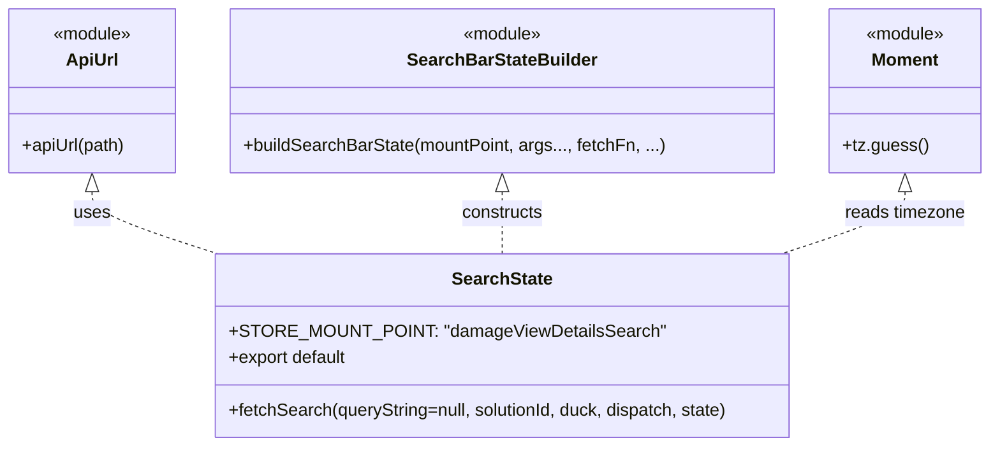

# Diagram: web/portal/src/pages/damageview/redux/DamageViewDetailsSearchState.js


> Auto-generated by Obscura crawlers

## Diagram 1



> SVG rendering failed for this diagram.

## Diagram 2

```mermaid
flowchart LR
  A[call fetchSearch(queryString, solutionId, duck, dispatch, state)] --> B[extract submissionId\nstate.location.payload.submission_id]
  B --> C[call apiUrl("/damageview/submission/{submissionId}/vins?{queryString}")]
  C --> D[build config\nheaders: { "x-time-zone": moment.tz.guess(), accept: "application/json" }]
  D --> E[dispatch(duck.fetch(url, config))]
  E --> F[end]
```

> SVG rendering failed for this diagram.
