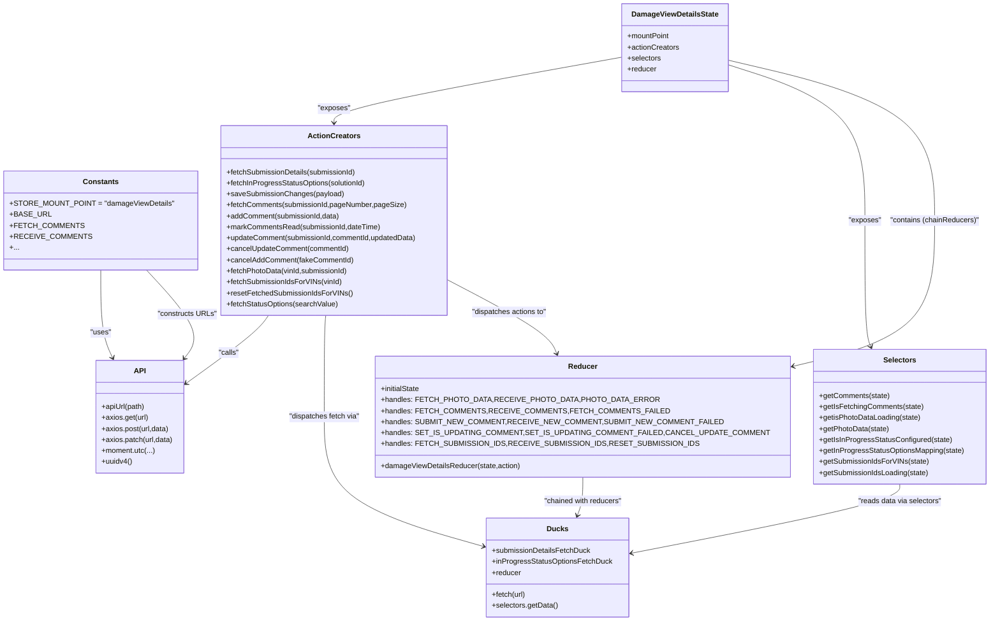

# Diagram: web/portal/src/pages/damageview/redux/DamageViewDetailsState.js

> Auto-generated by Obscura crawlers

## Mermaid

### SVG

<svg id="container" width="2035.97265625" xmlns="http://www.w3.org/2000/svg" class="classDiagram" height="1354" viewBox="0 0 2035.97265625 1354" role="graphics-document document" aria-roledescription="class"><g><defs><marker id="container_class-aggregationStart" class="marker aggregation class" refX="18" refY="7" markerWidth="190" markerHeight="240" orient="auto"><path d="M 18,7 L9,13 L1,7 L9,1 Z"></path></marker></defs><defs><marker id="container_class-aggregationEnd" class="marker aggregation class" refX="1" refY="7" markerWidth="20" markerHeight="28" orient="auto"><path d="M 18,7 L9,13 L1,7 L9,1 Z"></path></marker></defs><defs><marker id="container_class-extensionStart" class="marker extension class" refX="18" refY="7" markerWidth="190" markerHeight="240" orient="auto"><path d="M 1,7 L18,13 V 1 Z"></path></marker></defs><defs><marker id="container_class-extensionEnd" class="marker extension class" refX="1" refY="7" markerWidth="20" markerHeight="28" orient="auto"><path d="M 1,1 V 13 L18,7 Z"></path></marker></defs><defs><marker id="container_class-compositionStart" class="marker composition class" refX="18" refY="7" markerWidth="190" markerHeight="240" orient="auto"><path d="M 18,7 L9,13 L1,7 L9,1 Z"></path></marker></defs><defs><marker id="container_class-compositionEnd" class="marker composition class" refX="1" refY="7" markerWidth="20" markerHeight="28" orient="auto"><path d="M 18,7 L9,13 L1,7 L9,1 Z"></path></marker></defs><defs><marker id="container_class-dependencyStart" class="marker dependency class" refX="6" refY="7" markerWidth="190" markerHeight="240" orient="auto"><path d="M 5,7 L9,13 L1,7 L9,1 Z"></path></marker></defs><defs><marker id="container_class-dependencyEnd" class="marker dependency class" refX="13" refY="7" markerWidth="20" markerHeight="28" orient="auto"><path d="M 18,7 L9,13 L14,7 L9,1 Z"></path></marker></defs><defs><marker id="container_class-lollipopStart" class="marker lollipop class" refX="13" refY="7" markerWidth="190" markerHeight="240" orient="auto"><circle stroke="black" fill="transparent" cx="7" cy="7" r="6"></circle></marker></defs><defs><marker id="container_class-lollipopEnd" class="marker lollipop class" refX="1" refY="7" markerWidth="190" markerHeight="240" orient="auto"><circle stroke="black" fill="transparent" cx="7" cy="7" r="6"></circle></marker></defs><g class="root"><g class="clusters"></g><g class="edgePaths"><path d="M206.191,589L206.191,611.667C206.191,634.333,206.191,679.667,210.874,711.607C215.558,743.548,224.924,762.096,229.607,771.37L234.29,780.644" id="id_Constants_API_1" class="edge-thickness-normal edge-pattern-solid relation" style=";;;" data-edge="true" data-et="edge" data-id="id_Constants_API_1" data-points="W3sieCI6MjA2LjE5MTQwNjI1LCJ5Ijo1ODl9LHsieCI6MjA2LjE5MTQwNjI1LCJ5Ijo3MjV9LHsieCI6MjM2Ljk5NDQzNzgzOTY3MzksInkiOjc4Nn1d" marker-end="url(#container_class-dependencyEnd)"></path><path d="M564.677,688L560.552,694.167C556.427,700.333,548.178,712.667,520.776,736.618C493.374,760.569,446.821,796.138,423.544,813.923L400.268,831.707" id="id_ActionCreators_API_2" class="edge-thickness-normal edge-pattern-solid relation" style=";;;" data-edge="true" data-et="edge" data-id="id_ActionCreators_API_2" data-points="W3sieCI6NTY0LjY3NzIzMDA4NDUyODcsInkiOjY4OH0seyJ4Ijo1MzkuOTI3NzM0Mzc1LCJ5Ijo3MjV9LHsieCI6Mzk1LjUsInkiOjgzNS4zNDk4NTkyODc0MzQ4fV0=" marker-end="url(#container_class-dependencyEnd)"></path><path d="M691.552,688L691.207,694.167C690.861,700.333,690.171,712.667,689.826,749.5C689.48,786.333,689.48,847.667,689.48,909C689.48,970.333,689.48,1031.667,739.317,1078.12C789.153,1124.573,888.826,1156.147,938.662,1171.933L988.499,1187.72" id="id_ActionCreators_Ducks_3" class="edge-thickness-normal edge-pattern-solid relation" style=";;;" data-edge="true" data-et="edge" data-id="id_ActionCreators_Ducks_3" data-points="W3sieCI6NjkxLjU1MTg4NTg4NjI3MDUsInkiOjY4OH0seyJ4Ijo2ODkuNDgwNDY4NzUsInkiOjcyNX0seyJ4Ijo2ODkuNDgwNDY4NzUsInkiOjkwOX0seyJ4Ijo2ODkuNDgwNDY4NzUsInkiOjEwOTN9LHsieCI6OTk0LjIxODc1LCJ5IjoxMTg5LjUzMTc5MjE1NDE1Mn1d" marker-end="url(#container_class-dependencyEnd)"></path><path d="M1202.496,1041L1202.496,1049.667C1202.496,1058.333,1202.496,1075.667,1200.502,1089.566C1198.507,1103.464,1194.519,1113.929,1192.524,1119.161L1190.53,1124.393" id="id_Reducer_Ducks_4" class="edge-thickness-normal edge-pattern-solid relation" style=";;;" data-edge="true" data-et="edge" data-id="id_Reducer_Ducks_4" data-points="W3sieCI6MTIwMi40OTYwOTM3NSwieSI6MTA0MX0seyJ4IjoxMjAyLjQ5NjA5Mzc1LCJ5IjoxMDkzfSx7IngiOjExODguMzkyODM0MDUxNzI0LCJ5IjoxMTMwfV0=" marker-end="url(#container_class-dependencyEnd)"></path><path d="M1296.609,125.458L1197.698,144.048C1098.786,162.639,900.964,199.819,802.052,223.576C703.141,247.333,703.141,257.667,703.141,262.833L703.141,268" id="id_DamageViewDetailsState_ActionCreators_5" class="edge-thickness-normal edge-pattern-solid relation" style=";;;" data-edge="true" data-et="edge" data-id="id_DamageViewDetailsState_ActionCreators_5" data-points="W3sieCI6MTI5Ni42MDkzNzUsInkiOjEyNS40NTc4MTc4OTA3NTY1M30seyJ4Ijo3MDMuMTQwNjI1LCJ5IjoyMzd9LHsieCI6NzAzLjE0MDYyNSwieSI6Mjc0fV0=" marker-end="url(#container_class-dependencyEnd)"></path><path d="M1524.945,147.056L1564.695,162.046C1604.445,177.037,1683.945,207.019,1723.695,262.676C1763.445,318.333,1763.445,399.667,1763.445,481C1763.445,562.333,1763.445,643.667,1765.628,689.577C1767.81,735.487,1772.175,745.974,1774.357,751.217L1776.539,756.461" id="id_DamageViewDetailsState_Selectors_6" class="edge-thickness-normal edge-pattern-solid relation" style=";;;" data-edge="true" data-et="edge" data-id="id_DamageViewDetailsState_Selectors_6" data-points="W3sieCI6MTUyNC45NDUzMTI1LCJ5IjoxNDcuMDU1NjI1MDg5OTk0OH0seyJ4IjoxNzYzLjQ0NTMxMjUsInkiOjIzN30seyJ4IjoxNzYzLjQ0NTMxMjUsInkiOjQ4MX0seyJ4IjoxNzYzLjQ0NTMxMjUsInkiOjcyNX0seyJ4IjoxNzc4Ljg0NDk2MDA4ODMxNTIsInkiOjc2Mn1d" marker-end="url(#container_class-dependencyEnd)"></path><path d="M1524.945,134.019L1590.223,151.182C1655.5,168.346,1786.055,202.673,1851.332,260.503C1916.609,318.333,1916.609,399.667,1916.609,481C1916.609,562.333,1916.609,643.667,1865.157,697.591C1813.704,751.515,1710.798,778.03,1659.345,791.287L1607.892,804.545" id="id_DamageViewDetailsState_Reducer_7" class="edge-thickness-normal edge-pattern-solid relation" style=";;;" data-edge="true" data-et="edge" data-id="id_DamageViewDetailsState_Reducer_7" data-points="W3sieCI6MTUyNC45NDUzMTI1LCJ5IjoxMzQuMDE4NTQxNTQyNzg2MX0seyJ4IjoxOTE2LjYwOTM3NSwieSI6MjM3fSx7IngiOjE5MTYuNjA5Mzc1LCJ5Ijo0ODF9LHsieCI6MTkxNi42MDkzNzUsInkiOjcyNX0seyJ4IjoxNjAyLjA4MjAzMTI1LCJ5Ijo4MDYuMDQxODA3NzQ4OTAxOX1d" marker-end="url(#container_class-dependencyEnd)"></path><path d="M951.898,624.568L980.901,641.307C1009.904,658.046,1067.909,691.523,1100.134,716.005C1132.36,740.487,1138.806,755.974,1142.028,763.717L1145.251,771.461" id="id_ActionCreators_Reducer_8" class="edge-thickness-normal edge-pattern-solid relation" style=";;;" data-edge="true" data-et="edge" data-id="id_ActionCreators_Reducer_8" data-points="W3sieCI6OTUxLjg5ODQzNzUsInkiOjYyNC41Njg0MDA2MjgyOTE2fSx7IngiOjExMjUuOTE0MDYyNSwieSI6NzI1fSx7IngiOjExNDcuNTU2ODEwNDYxOTU2NSwieSI6Nzc3fV0=" marker-end="url(#container_class-dependencyEnd)"></path><path d="M1840.027,1056L1840.027,1062.167C1840.027,1068.333,1840.027,1080.667,1751.041,1105.458C1662.054,1130.249,1484.081,1167.498,1395.094,1186.123L1306.107,1204.747" id="id_Selectors_Ducks_9" class="edge-thickness-normal edge-pattern-solid relation" style=";;;" data-edge="true" data-et="edge" data-id="id_Selectors_Ducks_9" data-points="W3sieCI6MTg0MC4wMjczNDM3NSwieSI6MTA1Nn0seyJ4IjoxODQwLjAyNzM0Mzc1LCJ5IjoxMDkzfSx7IngiOjEzMDAuMjM0Mzc1LCJ5IjoxMjA1Ljk3NjE3MjM1MjkzOH1d" marker-end="url(#container_class-dependencyEnd)"></path><path d="M386.23,781.04L392.59,771.7C398.949,762.36,411.668,743.68,397.758,711.673C383.848,679.667,343.309,634.333,323.039,611.667L302.77,589" id="id_API_Constants_10" class="edge-thickness-normal edge-pattern-solid relation" style=";;;" data-edge="true" data-et="edge" data-id="id_API_Constants_10" data-points="W3sieCI6MzgyLjg1MzI2MDg2OTU2NTI1LCJ5Ijo3ODZ9LHsieCI6NDI0LjM4NjcxODc1LCJ5Ijo3MjV9LHsieCI6MzAyLjc2OTY1OTMyMzc3MDUsInkiOjU4OX1d" marker-start="url(#container_class-dependencyStart)"></path></g><g class="edgeLabels"><g class="edgeLabel" transform="translate(206.19140625, 725)"><g class="label" data-id="id_Constants_API_1" transform="translate(-22.7578125, -12)"><foreignObject width="45.515625" height="24">

"uses"

</foreignObject></g></g><g class="edgeLabel" transform="translate(485.39968, 766.6621)"><g class="label" data-id="id_ActionCreators_API_2" transform="translate(-22.625, -12)"><foreignObject width="45.25" height="24">

"calls"

</foreignObject></g></g><g class="edgeLabel" transform="translate(689.48046875, 909)"><g class="label" data-id="id_ActionCreators_Ducks_3" transform="translate(-78.4296875, -12)"><foreignObject width="156.859375" height="24">

"dispatches fetch via"

</foreignObject></g></g><g class="edgeLabel" transform="translate(1202.49609375, 1093)"><g class="label" data-id="id_Reducer_Ducks_4" transform="translate(-86.3203125, -12)"><foreignObject width="172.640625" height="24">

"chained with reducers"

</foreignObject></g></g><g class="edgeLabel" transform="translate(703.140625, 237)"><g class="label" data-id="id_DamageViewDetailsState_ActionCreators_5" transform="translate(-35.609375, -12)"><foreignObject width="71.21875" height="24">

"exposes"

</foreignObject></g></g><g class="edgeLabel" transform="translate(1763.4453125, 481)"><g class="label" data-id="id_DamageViewDetailsState_Selectors_6" transform="translate(-35.609375, -12)"><foreignObject width="71.21875" height="24">

"exposes"

</foreignObject></g></g><g class="edgeLabel" transform="translate(1916.609375, 481)"><g class="label" data-id="id_DamageViewDetailsState_Reducer_7" transform="translate(-97.5546875, -12)"><foreignObject width="195.109375" height="24">

"contains (chainReducers)"

</foreignObject></g></g><g class="edgeLabel" transform="translate(1063.29752, 688.86141)"><g class="label" data-id="id_ActionCreators_Reducer_8" transform="translate(-83.5, -12)"><foreignObject width="167" height="24">

"dispatches actions to"

</foreignObject></g></g><g class="edgeLabel" transform="translate(1840.02734375, 1093)"><g class="label" data-id="id_Selectors_Ducks_9" transform="translate(-92.21875, -12)"><foreignObject width="184.4375" height="24">

"reads data via selectors"

</foreignObject></g></g><g class="edgeLabel" transform="translate(388.17445, 684.50511)"><g class="label" data-id="id_API_Constants_10" transform="translate(-63.8828125, -12)"><foreignObject width="127.765625" height="24">

"constructs URLs"

</foreignObject></g></g></g><g class="nodes"><g class="node default" id="classId-Constants-0" transform="translate(206.19140625, 481)"><g class="basic label-container"><path d="M-198.19140625 -108 L198.19140625 -108 L198.19140625 108 L-198.19140625 108" stroke="none" stroke-width="0" fill="#ECECFF" style=""></path><path d="M-198.19140625 -108 C-48.011190002013905 -108, 102.16902624597219 -108, 198.19140625 -108 M-198.19140625 -108 C-89.2464426379753 -108, 19.698520974049387 -108, 198.19140625 -108 M198.19140625 -108 C198.19140625 -26.853011450803933, 198.19140625 54.29397709839213, 198.19140625 108 M198.19140625 -108 C198.19140625 -56.64375134282462, 198.19140625 -5.287502685649244, 198.19140625 108 M198.19140625 108 C79.57778868051265 108, -39.03582888897469 108, -198.19140625 108 M198.19140625 108 C68.86732170976055 108, -60.45676283047891 108, -198.19140625 108 M-198.19140625 108 C-198.19140625 45.65611226529032, -198.19140625 -16.687775469419364, -198.19140625 -108 M-198.19140625 108 C-198.19140625 29.85084894420899, -198.19140625 -48.29830211158202, -198.19140625 -108" stroke="#9370DB" stroke-width="1.3" fill="none" stroke-dasharray="0 0" style=""></path></g><g class="annotation-group text" transform="translate(0, -84)"></g><g class="label-group text" transform="translate(-36.5390625, -84)"><g class="label" style="font-weight: bolder" transform="translate(0,-12)"><foreignObject width="73.078125" height="24">

Constants

</foreignObject></g></g><g class="members-group text" transform="translate(-186.19140625, -36)"><g class="label" style="" transform="translate(0,-12)"><foreignObject width="335.84375" height="24">

+STORE_MOUNT_POINT = "damageViewDetails"

</foreignObject></g><g class="label" style="" transform="translate(0,12)"><foreignObject width="80.171875" height="24">

+BASE_URL

</foreignObject></g><g class="label" style="" transform="translate(0,36)"><foreignObject width="140.296875" height="24">

+FETCH_COMMENTS

</foreignObject></g><g class="label" style="" transform="translate(0,60)"><foreignObject width="154.078125" height="24">

+RECEIVE_COMMENTS

</foreignObject></g><g class="label" style="" transform="translate(0,84)"><foreignObject width="18.71875" height="24">

+...

</foreignObject></g></g><g class="methods-group text" transform="translate(-186.19140625, 108)"></g><g class="divider" style=""><path d="M-198.19140625 -60 C-97.49498489603121 -60, 3.201436457937575 -60, 198.19140625 -60 M-198.19140625 -60 C-94.71725951539429 -60, 8.756887219211421 -60, 198.19140625 -60" stroke="#9370DB" stroke-width="1.3" fill="none" stroke-dasharray="0 0" style=""></path></g><g class="divider" style=""><path d="M-198.19140625 84 C-98.17873775711057 84, 1.8339307357788641 84, 198.19140625 84 M-198.19140625 84 C-45.496936346635295 84, 107.19753355672941 84, 198.19140625 84" stroke="#9370DB" stroke-width="1.3" fill="none" stroke-dasharray="0 0" style=""></path></g></g><g class="node default" id="classId-Ducks-1" transform="translate(1147.2265625, 1238)"><g class="basic label-container"><path d="M-153.0078125 -108 L153.0078125 -108 L153.0078125 108 L-153.0078125 108" stroke="none" stroke-width="0" fill="#ECECFF" style=""></path><path d="M-153.0078125 -108 C-45.296278654200236 -108, 62.41525519159953 -108, 153.0078125 -108 M-153.0078125 -108 C-62.24135175213888 -108, 28.525108995722235 -108, 153.0078125 -108 M153.0078125 -108 C153.0078125 -27.20260007776345, 153.0078125 53.5947998444731, 153.0078125 108 M153.0078125 -108 C153.0078125 -42.986694621168695, 153.0078125 22.02661075766261, 153.0078125 108 M153.0078125 108 C78.77263403598599 108, 4.537455571971975 108, -153.0078125 108 M153.0078125 108 C88.65206623234575 108, 24.29631996469149 108, -153.0078125 108 M-153.0078125 108 C-153.0078125 29.68250304789295, -153.0078125 -48.6349939042141, -153.0078125 -108 M-153.0078125 108 C-153.0078125 47.05533808377118, -153.0078125 -13.889323832457634, -153.0078125 -108" stroke="#9370DB" stroke-width="1.3" fill="none" stroke-dasharray="0 0" style=""></path></g><g class="annotation-group text" transform="translate(0, -84)"></g><g class="label-group text" transform="translate(-21.859375, -84)"><g class="label" style="font-weight: bolder" transform="translate(0,-12)"><foreignObject width="43.71875" height="24">

Ducks

</foreignObject></g></g><g class="members-group text" transform="translate(-141.0078125, -36)"><g class="label" style="" transform="translate(0,-12)"><foreignObject width="214.609375" height="24">

+submissionDetailsFetchDuck

</foreignObject></g><g class="label" style="" transform="translate(0,12)"><foreignObject width="260.15625" height="24">

+inProgressStatusOptionsFetchDuck

</foreignObject></g><g class="label" style="" transform="translate(0,36)"><foreignObject width="63.515625" height="24">

+reducer

</foreignObject></g></g><g class="methods-group text" transform="translate(-141.0078125, 60)"><g class="label" style="" transform="translate(0,-12)"><foreignObject width="74.78125" height="24">

+fetch(url)

</foreignObject></g><g class="label" style="" transform="translate(0,12)"><foreignObject width="143.265625" height="24">

+selectors.getData()

</foreignObject></g></g><g class="divider" style=""><path d="M-153.0078125 -60 C-39.82815906484488 -60, 73.35149437031023 -60, 153.0078125 -60 M-153.0078125 -60 C-31.74541198006189 -60, 89.51698853987622 -60, 153.0078125 -60" stroke="#9370DB" stroke-width="1.3" fill="none" stroke-dasharray="0 0" style=""></path></g><g class="divider" style=""><path d="M-153.0078125 36 C-52.458645271133946 36, 48.09052195773211 36, 153.0078125 36 M-153.0078125 36 C-64.22364999433654 36, 24.56051251132692 36, 153.0078125 36" stroke="#9370DB" stroke-width="1.3" fill="none" stroke-dasharray="0 0" style=""></path></g></g><g class="node default" id="classId-API-2" transform="translate(299.10546875, 909)"><g class="basic label-container"><path d="M-96.39453125 -123 L96.39453125 -123 L96.39453125 123 L-96.39453125 123" stroke="none" stroke-width="0" fill="#ECECFF" style=""></path><path d="M-96.39453125 -123 C-37.1622782083888 -123, 22.069974833222403 -123, 96.39453125 -123 M-96.39453125 -123 C-51.62099318012492 -123, -6.8474551102498395 -123, 96.39453125 -123 M96.39453125 -123 C96.39453125 -58.16116058398654, 96.39453125 6.677678832026913, 96.39453125 123 M96.39453125 -123 C96.39453125 -48.280057060142866, 96.39453125 26.439885879714268, 96.39453125 123 M96.39453125 123 C32.153698489047585 123, -32.08713427190483 123, -96.39453125 123 M96.39453125 123 C35.462107971924034 123, -25.47031530615193 123, -96.39453125 123 M-96.39453125 123 C-96.39453125 27.017351557048784, -96.39453125 -68.96529688590243, -96.39453125 -123 M-96.39453125 123 C-96.39453125 63.93832675782982, -96.39453125 4.8766535156596404, -96.39453125 -123" stroke="#9370DB" stroke-width="1.3" fill="none" stroke-dasharray="0 0" style=""></path></g><g class="annotation-group text" transform="translate(0, -99)"></g><g class="label-group text" transform="translate(-11.8671875, -99)"><g class="label" style="font-weight: bolder" transform="translate(0,-12)"><foreignObject width="23.734375" height="24">

API

</foreignObject></g></g><g class="members-group text" transform="translate(-84.39453125, -51)"></g><g class="methods-group text" transform="translate(-84.39453125, -21)"><g class="label" style="" transform="translate(0,-12)"><foreignObject width="95.5" height="24">

+apiUrl(path)

</foreignObject></g><g class="label" style="" transform="translate(0,12)"><foreignObject width="102.328125" height="24">

+axios.get(url)

</foreignObject></g><g class="label" style="" transform="translate(0,36)"><foreignObject width="148.40625" height="24">

+axios.post(url,data)

</foreignObject></g><g class="label" style="" transform="translate(0,60)"><foreignObject width="156.921875" height="24">

+axios.patch(url,data)

</foreignObject></g><g class="label" style="" transform="translate(0,84)"><foreignObject width="116.765625" height="24">

+moment.utc(...)

</foreignObject></g><g class="label" style="" transform="translate(0,108)"><foreignObject width="67.28125" height="24">

+uuidv4()

</foreignObject></g></g><g class="divider" style=""><path d="M-96.39453125 -75 C-55.21912379051534 -75, -14.04371633103068 -75, 96.39453125 -75 M-96.39453125 -75 C-45.387622168611735 -75, 5.619286912776531 -75, 96.39453125 -75" stroke="#9370DB" stroke-width="1.3" fill="none" stroke-dasharray="0 0" style=""></path></g><g class="divider" style=""><path d="M-96.39453125 -51 C-28.457732224955677 -51, 39.479066800088646 -51, 96.39453125 -51 M-96.39453125 -51 C-51.69425195195726 -51, -6.9939726539145255 -51, 96.39453125 -51" stroke="#9370DB" stroke-width="1.3" fill="none" stroke-dasharray="0 0" style=""></path></g></g><g class="node default" id="classId-ActionCreators-3" transform="translate(703.140625, 481)"><g class="basic label-container"><path d="M-248.7578125 -207 L248.7578125 -207 L248.7578125 207 L-248.7578125 207" stroke="none" stroke-width="0" fill="#ECECFF" style=""></path><path d="M-248.7578125 -207 C-54.078768689488385 -207, 140.60027512102323 -207, 248.7578125 -207 M-248.7578125 -207 C-138.50891727164486 -207, -28.260022043289695 -207, 248.7578125 -207 M248.7578125 -207 C248.7578125 -68.09470710471973, 248.7578125 70.81058579056054, 248.7578125 207 M248.7578125 -207 C248.7578125 -72.66736775024228, 248.7578125 61.665264499515445, 248.7578125 207 M248.7578125 207 C147.48641602019643 207, 46.21501954039286 207, -248.7578125 207 M248.7578125 207 C77.16330990601054 207, -94.43119268797892 207, -248.7578125 207 M-248.7578125 207 C-248.7578125 61.17982222335203, -248.7578125 -84.64035555329593, -248.7578125 -207 M-248.7578125 207 C-248.7578125 62.771940276505546, -248.7578125 -81.45611944698891, -248.7578125 -207" stroke="#9370DB" stroke-width="1.3" fill="none" stroke-dasharray="0 0" style=""></path></g><g class="annotation-group text" transform="translate(0, -183)"></g><g class="label-group text" transform="translate(-53.96875, -183)"><g class="label" style="font-weight: bolder" transform="translate(0,-12)"><foreignObject width="107.9375" height="24">

ActionCreators

</foreignObject></g></g><g class="members-group text" transform="translate(-236.7578125, -135)"></g><g class="methods-group text" transform="translate(-236.7578125, -105)"><g class="label" style="" transform="translate(0,-12)"><foreignObject width="285.25" height="24">

+fetchSubmissionDetails(submissionId)

</foreignObject></g><g class="label" style="" transform="translate(0,12)"><foreignObject width="307.046875" height="24">

+fetchInProgressStatusOptions(solutionId)

</foreignObject></g><g class="label" style="" transform="translate(0,36)"><foreignObject width="252.703125" height="24">

+saveSubmissionChanges(payload)

</foreignObject></g><g class="label" style="" transform="translate(0,60)"><foreignObject width="391.09375" height="24">

+fetchComments(submissionId,pageNumber,pageSize)

</foreignObject></g><g class="label" style="" transform="translate(0,84)"><foreignObject width="248.375" height="24">

+addComment(submissionId,data)

</foreignObject></g><g class="label" style="" transform="translate(0,108)"><foreignObject width="336.40625" height="24">

+markCommentsRead(submissionId,dateTime)

</foreignObject></g><g class="label" style="" transform="translate(0,132)"><foreignObject width="419.546875" height="24">

+updateComment(submissionId,commentId,updatedData)

</foreignObject></g><g class="label" style="" transform="translate(0,156)"><foreignObject width="268.828125" height="24">

+cancelUpdateComment(commentId)

</foreignObject></g><g class="label" style="" transform="translate(0,180)"><foreignObject width="276.296875" height="24">

+cancelAddComment(fakeCommentId)

</foreignObject></g><g class="label" style="" transform="translate(0,204)"><foreignObject width="267.15625" height="24">

+fetchPhotoData(vinId,submissionId)

</foreignObject></g><g class="label" style="" transform="translate(0,228)"><foreignObject width="251.015625" height="24">

+fetchSubmissionIdsForVINs(vinId)

</foreignObject></g><g class="label" style="" transform="translate(0,252)"><foreignObject width="271.96875" height="24">

+resetFetchedSubmissionIdsForVINs()

</foreignObject></g><g class="label" style="" transform="translate(0,276)"><foreignObject width="244.28125" height="24">

+fetchStatusOptions(searchValue)

</foreignObject></g></g><g class="divider" style=""><path d="M-248.7578125 -159 C-83.45486825426886 -159, 81.84807599146228 -159, 248.7578125 -159 M-248.7578125 -159 C-77.0450783283946 -159, 94.66765584321081 -159, 248.7578125 -159" stroke="#9370DB" stroke-width="1.3" fill="none" stroke-dasharray="0 0" style=""></path></g><g class="divider" style=""><path d="M-248.7578125 -135 C-120.50724320528957 -135, 7.7433260894208615 -135, 248.7578125 -135 M-248.7578125 -135 C-76.98001936816433 -135, 94.79777376367133 -135, 248.7578125 -135" stroke="#9370DB" stroke-width="1.3" fill="none" stroke-dasharray="0 0" style=""></path></g></g><g class="node default" id="classId-Reducer-4" transform="translate(1202.49609375, 909)"><g class="basic label-container"><path d="M-399.5859375 -132 L399.5859375 -132 L399.5859375 132 L-399.5859375 132" stroke="none" stroke-width="0" fill="#ECECFF" style=""></path><path d="M-399.5859375 -132 C-127.68783505198166 -132, 144.21026739603667 -132, 399.5859375 -132 M-399.5859375 -132 C-155.11141642430036 -132, 89.36310465139928 -132, 399.5859375 -132 M399.5859375 -132 C399.5859375 -26.446510231093114, 399.5859375 79.10697953781377, 399.5859375 132 M399.5859375 -132 C399.5859375 -51.0240317119048, 399.5859375 29.951936576190406, 399.5859375 132 M399.5859375 132 C107.75127915308178 132, -184.08337919383644 132, -399.5859375 132 M399.5859375 132 C202.75887608538622 132, 5.9318146707724395 132, -399.5859375 132 M-399.5859375 132 C-399.5859375 35.27845340760399, -399.5859375 -61.44309318479202, -399.5859375 -132 M-399.5859375 132 C-399.5859375 30.151920886020804, -399.5859375 -71.69615822795839, -399.5859375 -132" stroke="#9370DB" stroke-width="1.3" fill="none" stroke-dasharray="0 0" style=""></path></g><g class="annotation-group text" transform="translate(0, -108)"></g><g class="label-group text" transform="translate(-29.90625, -108)"><g class="label" style="font-weight: bolder" transform="translate(0,-12)"><foreignObject width="59.8125" height="24">

Reducer

</foreignObject></g></g><g class="members-group text" transform="translate(-387.5859375, -60)"><g class="label" style="" transform="translate(0,-12)"><foreignObject width="87.25" height="24">

+initialState

</foreignObject></g><g class="label" style="" transform="translate(0,12)"><foreignObject width="533.8125" height="24">

+handles: FETCH_PHOTO_DATA,RECEIVE_PHOTO_DATA,PHOTO_DATA_ERROR

</foreignObject></g><g class="label" style="" transform="translate(0,36)"><foreignObject width="547.875" height="24">

+handles: FETCH_COMMENTS,RECEIVE_COMMENTS,FETCH_COMMENTS_FAILED

</foreignObject></g><g class="label" style="" transform="translate(0,60)"><foreignObject width="660.0625" height="24">

+handles: SUBMIT_NEW_COMMENT,RECEIVE_NEW_COMMENT,SUBMIT_NEW_COMMENT_FAILED

</foreignObject></g><g class="label" style="" transform="translate(0,84)"><foreignObject width="745.265625" height="24">

+handles: SET_IS_UPDATING_COMMENT,SET_IS_UPDATING_COMMENT_FAILED,CANCEL_UPDATE_COMMENT

</foreignObject></g><g class="label" style="" transform="translate(0,108)"><foreignObject width="616.84375" height="24">

+handles: FETCH_SUBMISSION_IDS,RECEIVE_SUBMISSION_IDS,RESET_SUBMISSION_IDS

</foreignObject></g></g><g class="methods-group text" transform="translate(-387.5859375, 108)"><g class="label" style="" transform="translate(0,-12)"><foreignObject width="303.734375" height="24">

+damageViewDetailsReducer(state,action)

</foreignObject></g></g><g class="divider" style=""><path d="M-399.5859375 -84 C-149.5852160974902 -84, 100.41550530501962 -84, 399.5859375 -84 M-399.5859375 -84 C-118.2377179605038 -84, 163.1105015789924 -84, 399.5859375 -84" stroke="#9370DB" stroke-width="1.3" fill="none" stroke-dasharray="0 0" style=""></path></g><g class="divider" style=""><path d="M-399.5859375 84 C-103.86960775285479 84, 191.84672199429042 84, 399.5859375 84 M-399.5859375 84 C-93.94795356218873 84, 211.69003037562254 84, 399.5859375 84" stroke="#9370DB" stroke-width="1.3" fill="none" stroke-dasharray="0 0" style=""></path></g></g><g class="node default" id="classId-Selectors-5" transform="translate(1840.02734375, 909)"><g class="basic label-container"><path d="M-187.9453125 -147 L187.9453125 -147 L187.9453125 147 L-187.9453125 147" stroke="none" stroke-width="0" fill="#ECECFF" style=""></path><path d="M-187.9453125 -147 C-111.17532969589993 -147, -34.405346891799866 -147, 187.9453125 -147 M-187.9453125 -147 C-88.99448855941915 -147, 9.956335381161693 -147, 187.9453125 -147 M187.9453125 -147 C187.9453125 -85.49802515869227, 187.9453125 -23.996050317384544, 187.9453125 147 M187.9453125 -147 C187.9453125 -34.37198270274958, 187.9453125 78.25603459450085, 187.9453125 147 M187.9453125 147 C112.23160416926973 147, 36.51789583853946 147, -187.9453125 147 M187.9453125 147 C83.88690232375079 147, -20.171507852498422 147, -187.9453125 147 M-187.9453125 147 C-187.9453125 58.04672594360312, -187.9453125 -30.906548112793757, -187.9453125 -147 M-187.9453125 147 C-187.9453125 60.94784800745609, -187.9453125 -25.104303985087824, -187.9453125 -147" stroke="#9370DB" stroke-width="1.3" fill="none" stroke-dasharray="0 0" style=""></path></g><g class="annotation-group text" transform="translate(0, -123)"></g><g class="label-group text" transform="translate(-34.171875, -123)"><g class="label" style="font-weight: bolder" transform="translate(0,-12)"><foreignObject width="68.34375" height="24">

Selectors

</foreignObject></g></g><g class="members-group text" transform="translate(-175.9453125, -75)"></g><g class="methods-group text" transform="translate(-175.9453125, -45)"><g class="label" style="" transform="translate(0,-12)"><foreignObject width="153.765625" height="24">

+getComments(state)

</foreignObject></g><g class="label" style="" transform="translate(0,12)"><foreignObject width="226.75" height="24">

+getIsFetchingComments(state)

</foreignObject></g><g class="label" style="" transform="translate(0,36)"><foreignObject width="222.03125" height="24">

+getisPhotoDataLoading(state)

</foreignObject></g><g class="label" style="" transform="translate(0,60)"><foreignObject width="152.8125" height="24">

+getPhotoData(state)

</foreignObject></g><g class="label" style="" transform="translate(0,84)"><foreignObject width="288.5" height="24">

+getIsInProgressStatusConfigured(state)

</foreignObject></g><g class="label" style="" transform="translate(0,108)"><foreignObject width="317.71875" height="24">

+getInProgressStatusOptionsMapping(state)

</foreignObject></g><g class="label" style="" transform="translate(0,132)"><foreignObject width="237.390625" height="24">

+getSubmissionIdsForVINs(state)

</foreignObject></g><g class="label" style="" transform="translate(0,156)"><foreignObject width="239.78125" height="24">

+getSubmissionIdsLoading(state)

</foreignObject></g></g><g class="divider" style=""><path d="M-187.9453125 -99 C-37.78856427425865 -99, 112.3681839514827 -99, 187.9453125 -99 M-187.9453125 -99 C-56.841219596663564 -99, 74.26287330667287 -99, 187.9453125 -99" stroke="#9370DB" stroke-width="1.3" fill="none" stroke-dasharray="0 0" style=""></path></g><g class="divider" style=""><path d="M-187.9453125 -75 C-40.48417959250395 -75, 106.9769533149921 -75, 187.9453125 -75 M-187.9453125 -75 C-102.32131182282188 -75, -16.697311145643766 -75, 187.9453125 -75" stroke="#9370DB" stroke-width="1.3" fill="none" stroke-dasharray="0 0" style=""></path></g></g><g class="node default" id="classId-DamageViewDetailsState-6" transform="translate(1410.77734375, 104)"><g class="basic label-container"><path d="M-114.16796875 -96 L114.16796875 -96 L114.16796875 96 L-114.16796875 96" stroke="none" stroke-width="0" fill="#ECECFF" style=""></path><path d="M-114.16796875 -96 C-39.68517756263209 -96, 34.79761362473582 -96, 114.16796875 -96 M-114.16796875 -96 C-28.689018931897806 -96, 56.78993088620439 -96, 114.16796875 -96 M114.16796875 -96 C114.16796875 -46.657993677744685, 114.16796875 2.6840126445106307, 114.16796875 96 M114.16796875 -96 C114.16796875 -22.264994132671774, 114.16796875 51.47001173465645, 114.16796875 96 M114.16796875 96 C35.635928336457894 96, -42.89611207708421 96, -114.16796875 96 M114.16796875 96 C24.617105921598124 96, -64.93375690680375 96, -114.16796875 96 M-114.16796875 96 C-114.16796875 25.852973636404045, -114.16796875 -44.29405272719191, -114.16796875 -96 M-114.16796875 96 C-114.16796875 24.929169017354553, -114.16796875 -46.14166196529089, -114.16796875 -96" stroke="#9370DB" stroke-width="1.3" fill="none" stroke-dasharray="0 0" style=""></path></g><g class="annotation-group text" transform="translate(0, -72)"></g><g class="label-group text" transform="translate(-91.2578125, -72)"><g class="label" style="font-weight: bolder" transform="translate(0,-12)"><foreignObject width="182.515625" height="24">

DamageViewDetailsState

</foreignObject></g></g><g class="members-group text" transform="translate(-102.16796875, -24)"><g class="label" style="" transform="translate(0,-12)"><foreignObject width="93.34375" height="24">

+mountPoint

</foreignObject></g><g class="label" style="" transform="translate(0,12)"><foreignObject width="113.078125" height="24">

+actionCreators

</foreignObject></g><g class="label" style="" transform="translate(0,36)"><foreignObject width="73.453125" height="24">

+selectors

</foreignObject></g><g class="label" style="" transform="translate(0,60)"><foreignObject width="63.515625" height="24">

+reducer

</foreignObject></g></g><g class="methods-group text" transform="translate(-102.16796875, 96)"></g><g class="divider" style=""><path d="M-114.16796875 -48 C-29.75619902370883 -48, 54.65557070258234 -48, 114.16796875 -48 M-114.16796875 -48 C-23.938707705953078 -48, 66.29055333809384 -48, 114.16796875 -48" stroke="#9370DB" stroke-width="1.3" fill="none" stroke-dasharray="0 0" style=""></path></g><g class="divider" style=""><path d="M-114.16796875 72 C-26.026923954500106 72, 62.11412084099979 72, 114.16796875 72 M-114.16796875 72 C-49.08632728117237 72, 15.995314187655254 72, 114.16796875 72" stroke="#9370DB" stroke-width="1.3" fill="none" stroke-dasharray="0 0" style=""></path></g></g></g></g></g></svg>
