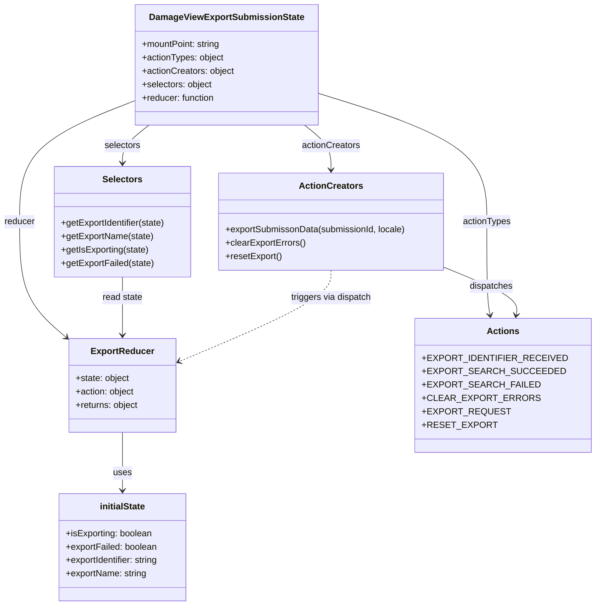

# Diagram: web/portal/src/pages/damageview/redux/DamageViewExportSubmissionState.js


> Auto-generated by Obscura crawlers

## Diagram 1



### SVG

<svg id="container" width="1055.8671875" xmlns="http://www.w3.org/2000/svg" class="classDiagram" height="1084" viewBox="0 0 1055.8671875 1084" role="graphics-document document" aria-roledescription="class"><style>#container{font-family:"trebuchet ms",verdana,arial,sans-serif;font-size:16px;fill:#333;}@keyframes edge-animation-frame{from{stroke-dashoffset:0;}}@keyframes dash{to{stroke-dashoffset:0;}}#container .edge-animation-slow{stroke-dasharray:9,5!important;stroke-dashoffset:900;animation:dash 50s linear infinite;stroke-linecap:round;}#container .edge-animation-fast{stroke-dasharray:9,5!important;stroke-dashoffset:900;animation:dash 20s linear infinite;stroke-linecap:round;}#container .error-icon{fill:#552222;}#container .error-text{fill:#552222;stroke:#552222;}#container .edge-thickness-normal{stroke-width:1px;}#container .edge-thickness-thick{stroke-width:3.5px;}#container .edge-pattern-solid{stroke-dasharray:0;}#container .edge-thickness-invisible{stroke-width:0;fill:none;}#container .edge-pattern-dashed{stroke-dasharray:3;}#container .edge-pattern-dotted{stroke-dasharray:2;}#container .marker{fill:#333333;stroke:#333333;}#container .marker.cross{stroke:#333333;}#container svg{font-family:"trebuchet ms",verdana,arial,sans-serif;font-size:16px;}#container p{margin:0;}#container g.classGroup text{fill:#9370DB;stroke:none;font-family:"trebuchet ms",verdana,arial,sans-serif;font-size:10px;}#container g.classGroup text .title{font-weight:bolder;}#container .nodeLabel,#container .edgeLabel{color:#131300;}#container .edgeLabel .label rect{fill:#ECECFF;}#container .label text{fill:#131300;}#container .labelBkg{background:#ECECFF;}#container .edgeLabel .label span{background:#ECECFF;}#container .classTitle{font-weight:bolder;}#container .node rect,#container .node circle,#container .node ellipse,#container .node polygon,#container .node path{fill:#ECECFF;stroke:#9370DB;stroke-width:1px;}#container .divider{stroke:#9370DB;stroke-width:1;}#container g.clickable{cursor:pointer;}#container g.classGroup rect{fill:#ECECFF;stroke:#9370DB;}#container g.classGroup line{stroke:#9370DB;stroke-width:1;}#container .classLabel .box{stroke:none;stroke-width:0;fill:#ECECFF;opacity:0.5;}#container .classLabel .label{fill:#9370DB;font-size:10px;}#container .relation{stroke:#333333;stroke-width:1;fill:none;}#container .dashed-line{stroke-dasharray:3;}#container .dotted-line{stroke-dasharray:1 2;}#container #compositionStart,#container .composition{fill:#333333!important;stroke:#333333!important;stroke-width:1;}#container #compositionEnd,#container .composition{fill:#333333!important;stroke:#333333!important;stroke-width:1;}#container #dependencyStart,#container .dependency{fill:#333333!important;stroke:#333333!important;stroke-width:1;}#container #dependencyStart,#container .dependency{fill:#333333!important;stroke:#333333!important;stroke-width:1;}#container #extensionStart,#container .extension{fill:transparent!important;stroke:#333333!important;stroke-width:1;}#container #extensionEnd,#container .extension{fill:transparent!important;stroke:#333333!important;stroke-width:1;}#container #aggregationStart,#container .aggregation{fill:transparent!important;stroke:#333333!important;stroke-width:1;}#container #aggregationEnd,#container .aggregation{fill:transparent!important;stroke:#333333!important;stroke-width:1;}#container #lollipopStart,#container .lollipop{fill:#ECECFF!important;stroke:#333333!important;stroke-width:1;}#container #lollipopEnd,#container .lollipop{fill:#ECECFF!important;stroke:#333333!important;stroke-width:1;}#container .edgeTerminals{font-size:11px;line-height:initial;}#container .classTitleText{text-anchor:middle;font-size:18px;fill:#333;}#container .label-icon{display:inline-block;height:1em;overflow:visible;vertical-align:-0.125em;}#container .node .label-icon path{fill:currentColor;stroke:revert;stroke-width:revert;}#container :root{--mermaid-font-family:"trebuchet ms",verdana,arial,sans-serif;}</style><g><defs><marker id="container_class-aggregationStart" class="marker aggregation class" refX="18" refY="7" markerWidth="190" markerHeight="240" orient="auto"><path d="M 18,7 L9,13 L1,7 L9,1 Z"></path></marker></defs><defs><marker id="container_class-aggregationEnd" class="marker aggregation class" refX="1" refY="7" markerWidth="20" markerHeight="28" orient="auto"><path d="M 18,7 L9,13 L1,7 L9,1 Z"></path></marker></defs><defs><marker id="container_class-extensionStart" class="marker extension class" refX="18" refY="7" markerWidth="190" markerHeight="240" orient="auto"><path d="M 1,7 L18,13 V 1 Z"></path></marker></defs><defs><marker id="container_class-extensionEnd" class="marker extension class" refX="1" refY="7" markerWidth="20" markerHeight="28" orient="auto"><path d="M 1,1 V 13 L18,7 Z"></path></marker></defs><defs><marker id="container_class-compositionStart" class="marker composition class" refX="18" refY="7" markerWidth="190" markerHeight="240" orient="auto"><path d="M 18,7 L9,13 L1,7 L9,1 Z"></path></marker></defs><defs><marker id="container_class-compositionEnd" class="marker composition class" refX="1" refY="7" markerWidth="20" markerHeight="28" orient="auto"><path d="M 18,7 L9,13 L1,7 L9,1 Z"></path></marker></defs><defs><marker id="container_class-dependencyStart" class="marker dependency class" refX="6" refY="7" markerWidth="190" markerHeight="240" orient="auto"><path d="M 5,7 L9,13 L1,7 L9,1 Z"></path></marker></defs><defs><marker id="container_class-dependencyEnd" class="marker dependency class" refX="13" refY="7" markerWidth="20" markerHeight="28" orient="auto"><path d="M 18,7 L9,13 L14,7 L9,1 Z"></path></marker></defs><defs><marker id="container_class-lollipopStart" class="marker lollipop class" refX="13" refY="7" markerWidth="190" markerHeight="240" orient="auto"><circle stroke="black" fill="transparent" cx="7" cy="7" r="6"></circle></marker></defs><defs><marker id="container_class-lollipopEnd" class="marker lollipop class" refX="1" refY="7" markerWidth="190" markerHeight="240" orient="auto"><circle stroke="black" fill="transparent" cx="7" cy="7" r="6"></circle></marker></defs><g class="root"><g class="clusters"></g><g class="edgePaths"><path d="M250.082,178.266L214.363,192.055C178.643,205.844,107.204,233.422,71.485,269.878C35.766,306.333,35.766,351.667,35.766,397C35.766,442.333,35.766,487.667,50.214,522.444C64.663,557.222,93.559,581.443,108.008,593.554L122.456,605.665" id="id_DamageViewExportSubmissionState_ExportReducer_1" class="edge-thickness-normal edge-pattern-solid relation" style=";;;" data-edge="true" data-et="edge" data-id="id_DamageViewExportSubmissionState_ExportReducer_1" data-points="W3sieCI6MjUwLjA4MjAzMTI1LCJ5IjoxNzguMjY2MjkzNjY1NTY3OH0seyJ4IjozNS43NjU2MjUsInkiOjI2MX0seyJ4IjozNS43NjU2MjUsInkiOjM5N30seyJ4IjozNS43NjU2MjUsInkiOjUzM30seyJ4IjoxMjcuMDU0Njg3NSwieSI6NjA5LjUxOTA4MjM3NzQ3NjV9XQ==" marker-end="url(#container_class-dependencyEnd)"></path><path d="M551.636,224L559.645,230.167C567.653,236.333,583.67,248.667,591.679,262C599.688,275.333,599.688,289.667,599.688,296.833L599.688,304" id="id_DamageViewExportSubmissionState_ActionCreators_2" class="edge-thickness-normal edge-pattern-solid relation" style=";;;" data-edge="true" data-et="edge" data-id="id_DamageViewExportSubmissionState_ActionCreators_2" data-points="W3sieCI6NTUxLjYzNjM0MTU5NDgyNzYsInkiOjIyNH0seyJ4Ijo1OTkuNjg3NSwieSI6MjYxfSx7IngiOjU5OS42ODc1LCJ5IjozMTB9XQ==" marker-end="url(#container_class-dependencyEnd)"></path><path d="M271.121,224L263.113,230.167C255.104,236.333,239.087,248.667,231.079,260C223.07,271.333,223.07,281.667,223.07,286.833L223.07,292" id="id_DamageViewExportSubmissionState_Selectors_3" class="edge-thickness-normal edge-pattern-solid relation" style=";;;" data-edge="true" data-et="edge" data-id="id_DamageViewExportSubmissionState_Selectors_3" data-points="W3sieCI6MjcxLjEyMTQ3MDkwNTE3MjQsInkiOjIyNH0seyJ4IjoyMjMuMDcwMzEyNSwieSI6MjYxfSx7IngiOjIyMy4wNzAzMTI1LCJ5IjoyOTh9XQ==" marker-end="url(#container_class-dependencyEnd)"></path><path d="M572.676,165.903L623.904,181.753C675.133,197.602,777.59,229.301,828.818,267.817C880.047,306.333,880.047,351.667,880.047,397C880.047,442.333,880.047,487.667,881.024,515.517C882.001,543.368,883.955,553.736,884.932,558.92L885.909,564.104" id="id_DamageViewExportSubmissionState_Actions_4" class="edge-thickness-normal edge-pattern-solid relation" style=";;;" data-edge="true" data-et="edge" data-id="id_DamageViewExportSubmissionState_Actions_4" data-points="W3sieCI6NTcyLjY3NTc4MTI1LCJ5IjoxNjUuOTAzMjMzMDY1Nzg2NX0seyJ4Ijo4ODAuMDQ2ODc1LCJ5IjoyNjF9LHsieCI6ODgwLjA0Njg3NSwieSI6Mzk3fSx7IngiOjg4MC4wNDY4NzUsInkiOjUzM30seyJ4Ijo4ODcuMDIwMjc3NjY3MTk3NCwieSI6NTcwfV0=" marker-end="url(#container_class-dependencyEnd)"></path><path d="M223.07,774L223.07,786.167C223.07,798.333,223.07,822.667,223.07,840C223.07,857.333,223.07,867.667,223.07,872.833L223.07,878" id="id_ExportReducer_initialState_5" class="edge-thickness-normal edge-pattern-solid relation" style=";;;" data-edge="true" data-et="edge" data-id="id_ExportReducer_initialState_5" data-points="W3sieCI6MjIzLjA3MDMxMjUsInkiOjc3NH0seyJ4IjoyMjMuMDcwMzEyNSwieSI6ODQ3fSx7IngiOjIyMy4wNzAzMTI1LCJ5Ijo4ODR9XQ==" marker-end="url(#container_class-dependencyEnd)"></path><path d="M801.766,477.941L824.676,487.117C847.586,496.294,893.406,514.647,915.339,529.007C937.273,543.368,935.318,553.736,934.341,558.92L933.364,564.104" id="id_ActionCreators_Actions_6" class="edge-thickness-normal edge-pattern-solid relation" style=";;;" data-edge="true" data-et="edge" data-id="id_ActionCreators_Actions_6" data-points="W3sieCI6ODAxLjc2NTYyNSwieSI6NDc3Ljk0MDk4MTU2OTY4MzJ9LHsieCI6OTM5LjIyNjU2MjUsInkiOjUzM30seyJ4Ijo5MzIuMjUzMTU5ODMyODAyNiwieSI6NTcwfV0=" marker-end="url(#container_class-dependencyEnd)"></path><path d="M223.07,496L223.07,502.167C223.07,508.333,223.07,520.667,223.07,538C223.07,555.333,223.07,577.667,223.07,588.833L223.07,600" id="id_Selectors_ExportReducer_7" class="edge-thickness-normal edge-pattern-solid relation" style=";;;" data-edge="true" data-et="edge" data-id="id_Selectors_ExportReducer_7" data-points="W3sieCI6MjIzLjA3MDMxMjUsInkiOjQ5Nn0seyJ4IjoyMjMuMDcwMzEyNSwieSI6NTMzfSx7IngiOjIyMy4wNzAzMTI1LCJ5Ijo2MDZ9XQ==" marker-end="url(#container_class-dependencyEnd)"></path><path d="M599.688,484L599.688,492.167C599.688,500.333,599.688,516.667,553.844,543.944C508,571.222,416.312,609.444,370.468,628.555L324.624,647.665" id="id_ActionCreators_ExportReducer_8" class="edge-thickness-normal edge-pattern-dashed relation" style=";;;" data-edge="true" data-et="edge" data-id="id_ActionCreators_ExportReducer_8" data-points="W3sieCI6NTk5LjY4NzUsInkiOjQ4NH0seyJ4Ijo1OTkuNjg3NSwieSI6NTMzfSx7IngiOjMxOS4wODU5Mzc1LCJ5Ijo2NDkuOTc0MDcwMTU1Nzg2NX1d" marker-end="url(#container_class-dependencyEnd)"></path></g><g class="edgeLabels"><g class="edgeLabel" transform="translate(35.765625, 397)"><g class="label" data-id="id_DamageViewExportSubmissionState_ExportReducer_1" transform="translate(-27.765625, -12)"><foreignObject width="55.53125" height="24"><div xmlns="http://www.w3.org/1999/xhtml" class="labelBkg" style="display: table-cell; white-space: nowrap; line-height: 1.5; max-width: 200px; text-align: center;"><span class="edgeLabel"><p>reducer</p></span></div></foreignObject></g></g><g class="edgeLabel" transform="translate(599.6875, 261)"><g class="label" data-id="id_DamageViewExportSubmissionState_ActionCreators_2" transform="translate(-52.671875, -12)"><foreignObject width="105.34375" height="24"><div xmlns="http://www.w3.org/1999/xhtml" class="labelBkg" style="display: table-cell; white-space: nowrap; line-height: 1.5; max-width: 200px; text-align: center;"><span class="edgeLabel"><p>actionCreators</p></span></div></foreignObject></g></g><g class="edgeLabel" transform="translate(223.0703125, 261)"><g class="label" data-id="id_DamageViewExportSubmissionState_Selectors_3" transform="translate(-32.734375, -12)"><foreignObject width="65.46875" height="24"><div xmlns="http://www.w3.org/1999/xhtml" class="labelBkg" style="display: table-cell; white-space: nowrap; line-height: 1.5; max-width: 200px; text-align: center;"><span class="edgeLabel"><p>selectors</p></span></div></foreignObject></g></g><g class="edgeLabel" transform="translate(880.046875, 397)"><g class="label" data-id="id_DamageViewExportSubmissionState_Actions_4" transform="translate(-43.28125, -12)"><foreignObject width="86.5625" height="24"><div xmlns="http://www.w3.org/1999/xhtml" class="labelBkg" style="display: table-cell; white-space: nowrap; line-height: 1.5; max-width: 200px; text-align: center;"><span class="edgeLabel"><p>actionTypes</p></span></div></foreignObject></g></g><g class="edgeLabel" transform="translate(223.0703125, 847)"><g class="label" data-id="id_ExportReducer_initialState_5" transform="translate(-16.4921875, -12)"><foreignObject width="32.984375" height="24"><div xmlns="http://www.w3.org/1999/xhtml" class="labelBkg" style="display: table-cell; white-space: nowrap; line-height: 1.5; max-width: 200px; text-align: center;"><span class="edgeLabel"><p>uses</p></span></div></foreignObject></g></g><g class="edgeLabel" transform="translate(887.97205, 512.47036)"><g class="label" data-id="id_ActionCreators_Actions_6" transform="translate(-39.1796875, -12)"><foreignObject width="78.359375" height="24"><div xmlns="http://www.w3.org/1999/xhtml" class="labelBkg" style="display: table-cell; white-space: nowrap; line-height: 1.5; max-width: 200px; text-align: center;"><span class="edgeLabel"><p>dispatches</p></span></div></foreignObject></g></g><g class="edgeLabel" transform="translate(223.0703125, 533)"><g class="label" data-id="id_Selectors_ExportReducer_7" transform="translate(-36.4375, -12)"><foreignObject width="72.875" height="24"><div xmlns="http://www.w3.org/1999/xhtml" class="labelBkg" style="display: table-cell; white-space: nowrap; line-height: 1.5; max-width: 200px; text-align: center;"><span class="edgeLabel"><p>read state</p></span></div></foreignObject></g></g><g class="edgeLabel" transform="translate(599.6875, 533)"><g class="label" data-id="id_ActionCreators_ExportReducer_8" transform="translate(-73.359375, -12)"><foreignObject width="146.71875" height="24"><div xmlns="http://www.w3.org/1999/xhtml" class="labelBkg" style="display: table-cell; white-space: nowrap; line-height: 1.5; max-width: 200px; text-align: center;"><span class="edgeLabel"><p>triggers via dispatch</p></span></div></foreignObject></g></g></g><g class="nodes"><g class="node default" id="classId-DamageViewExportSubmissionState-0" transform="translate(411.37890625, 116)"><g class="basic label-container"><path d="M-161.296875 -108 L161.296875 -108 L161.296875 108 L-161.296875 108" stroke="none" stroke-width="0" fill="#ECECFF" style=""></path><path d="M-161.296875 -108 C-57.59591625067196 -108, 46.105042498656076 -108, 161.296875 -108 M-161.296875 -108 C-82.04140442566755 -108, -2.785933851335102 -108, 161.296875 -108 M161.296875 -108 C161.296875 -43.566810280196336, 161.296875 20.86637943960733, 161.296875 108 M161.296875 -108 C161.296875 -61.247374949982984, 161.296875 -14.494749899965967, 161.296875 108 M161.296875 108 C48.42157891872779 108, -64.45371716254442 108, -161.296875 108 M161.296875 108 C85.40283152582447 108, 9.508788051648935 108, -161.296875 108 M-161.296875 108 C-161.296875 30.135413272103563, -161.296875 -47.729173455792875, -161.296875 -108 M-161.296875 108 C-161.296875 63.07143649622727, -161.296875 18.142872992454542, -161.296875 -108" stroke="#9370DB" stroke-width="1.3" fill="none" stroke-dasharray="0 0" style=""></path></g><g class="annotation-group text" transform="translate(0, -84)"></g><g class="label-group text" transform="translate(-131.96875, -84)"><g class="label" style="font-weight: bolder" transform="translate(0,-12)"><foreignObject width="263.9375" height="24"><div xmlns="http://www.w3.org/1999/xhtml" style="display: table-cell; white-space: nowrap; line-height: 1.5; max-width: 310px; text-align: center;"><span class="nodeLabel markdown-node-label" style=""><p>DamageViewExportSubmissionState</p></span></div></foreignObject></g></g><g class="members-group text" transform="translate(-149.296875, -36)"><g class="label" style="" transform="translate(0,-12)"><foreignObject width="143.109375" height="24"><div xmlns="http://www.w3.org/1999/xhtml" style="display: table-cell; white-space: nowrap; line-height: 1.5; max-width: 201px; text-align: center;"><span class="nodeLabel markdown-node-label" style=""><p>+mountPoint: string</p></span></div></foreignObject></g><g class="label" style="" transform="translate(0,12)"><foreignObject width="147.859375" height="24"><div xmlns="http://www.w3.org/1999/xhtml" style="display: table-cell; white-space: nowrap; line-height: 1.5; max-width: 205px; text-align: center;"><span class="nodeLabel markdown-node-label" style=""><p>+actionTypes: object</p></span></div></foreignObject></g><g class="label" style="" transform="translate(0,36)"><foreignObject width="166.625" height="24"><div xmlns="http://www.w3.org/1999/xhtml" style="display: table-cell; white-space: nowrap; line-height: 1.5; max-width: 224px; text-align: center;"><span class="nodeLabel markdown-node-label" style=""><p>+actionCreators: object</p></span></div></foreignObject></g><g class="label" style="" transform="translate(0,60)"><foreignObject width="127" height="24"><div xmlns="http://www.w3.org/1999/xhtml" style="display: table-cell; white-space: nowrap; line-height: 1.5; max-width: 185px; text-align: center;"><span class="nodeLabel markdown-node-label" style=""><p>+selectors: object</p></span></div></foreignObject></g><g class="label" style="" transform="translate(0,84)"><foreignObject width="132.453125" height="24"><div xmlns="http://www.w3.org/1999/xhtml" style="display: table-cell; white-space: nowrap; line-height: 1.5; max-width: 190px; text-align: center;"><span class="nodeLabel markdown-node-label" style=""><p>+reducer: function</p></span></div></foreignObject></g></g><g class="methods-group text" transform="translate(-149.296875, 108)"></g><g class="divider" style=""><path d="M-161.296875 -60 C-93.11511749883262 -60, -24.933359997665235 -60, 161.296875 -60 M-161.296875 -60 C-33.275708697434624 -60, 94.74545760513075 -60, 161.296875 -60" stroke="#9370DB" stroke-width="1.3" fill="none" stroke-dasharray="0 0" style=""></path></g><g class="divider" style=""><path d="M-161.296875 84 C-61.50999864175364 84, 38.27687771649272 84, 161.296875 84 M-161.296875 84 C-82.99916140618777 84, -4.701447812375534 84, 161.296875 84" stroke="#9370DB" stroke-width="1.3" fill="none" stroke-dasharray="0 0" style=""></path></g></g><g class="node default" id="classId-ExportReducer-1" transform="translate(223.0703125, 690)"><g class="basic label-container"><path d="M-96.015625 -84 L96.015625 -84 L96.015625 84 L-96.015625 84" stroke="none" stroke-width="0" fill="#ECECFF" style=""></path><path d="M-96.015625 -84 C-33.80514960726357 -84, 28.405325785472854 -84, 96.015625 -84 M-96.015625 -84 C-34.9907566801277 -84, 26.034111639744594 -84, 96.015625 -84 M96.015625 -84 C96.015625 -36.36058919601371, 96.015625 11.278821607972574, 96.015625 84 M96.015625 -84 C96.015625 -29.038097058184313, 96.015625 25.923805883631374, 96.015625 84 M96.015625 84 C33.73984663510547 84, -28.535931729789056 84, -96.015625 84 M96.015625 84 C41.916420272815145 84, -12.18278445436971 84, -96.015625 84 M-96.015625 84 C-96.015625 17.01520598011784, -96.015625 -49.96958803976432, -96.015625 -84 M-96.015625 84 C-96.015625 31.80233107180384, -96.015625 -20.395337856392317, -96.015625 -84" stroke="#9370DB" stroke-width="1.3" fill="none" stroke-dasharray="0 0" style=""></path></g><g class="annotation-group text" transform="translate(0, -60)"></g><g class="label-group text" transform="translate(-53.953125, -60)"><g class="label" style="font-weight: bolder" transform="translate(0,-12)"><foreignObject width="107.90625" height="24"><div xmlns="http://www.w3.org/1999/xhtml" style="display: table-cell; white-space: nowrap; line-height: 1.5; max-width: 157px; text-align: center;"><span class="nodeLabel markdown-node-label" style=""><p>ExportReducer</p></span></div></foreignObject></g></g><g class="members-group text" transform="translate(-84.015625, -12)"><g class="label" style="" transform="translate(0,-12)"><foreignObject width="97.640625" height="24"><div xmlns="http://www.w3.org/1999/xhtml" style="display: table-cell; white-space: nowrap; line-height: 1.5; max-width: 155px; text-align: center;"><span class="nodeLabel markdown-node-label" style=""><p>+state: object</p></span></div></foreignObject></g><g class="label" style="" transform="translate(0,12)"><foreignObject width="106.65625" height="24"><div xmlns="http://www.w3.org/1999/xhtml" style="display: table-cell; white-space: nowrap; line-height: 1.5; max-width: 164px; text-align: center;"><span class="nodeLabel markdown-node-label" style=""><p>+action: object</p></span></div></foreignObject></g><g class="label" style="" transform="translate(0,36)"><foreignObject width="114.078125" height="24"><div xmlns="http://www.w3.org/1999/xhtml" style="display: table-cell; white-space: nowrap; line-height: 1.5; max-width: 172px; text-align: center;"><span class="nodeLabel markdown-node-label" style=""><p>+returns: object</p></span></div></foreignObject></g></g><g class="methods-group text" transform="translate(-84.015625, 84)"></g><g class="divider" style=""><path d="M-96.015625 -36 C-34.21741982085728 -36, 27.58078535828544 -36, 96.015625 -36 M-96.015625 -36 C-39.56477180337519 -36, 16.886081393249626 -36, 96.015625 -36" stroke="#9370DB" stroke-width="1.3" fill="none" stroke-dasharray="0 0" style=""></path></g><g class="divider" style=""><path d="M-96.015625 60 C-23.17599705282855 60, 49.6636308943429 60, 96.015625 60 M-96.015625 60 C-41.11851545304022 60, 13.778594093919565 60, 96.015625 60" stroke="#9370DB" stroke-width="1.3" fill="none" stroke-dasharray="0 0" style=""></path></g></g><g class="node default" id="classId-initialState-2" transform="translate(223.0703125, 980)"><g class="basic label-container"><path d="M-118.1171875 -96 L118.1171875 -96 L118.1171875 96 L-118.1171875 96" stroke="none" stroke-width="0" fill="#ECECFF" style=""></path><path d="M-118.1171875 -96 C-24.96629767504892 -96, 68.18459214990216 -96, 118.1171875 -96 M-118.1171875 -96 C-44.639363483908014 -96, 28.838460532183973 -96, 118.1171875 -96 M118.1171875 -96 C118.1171875 -38.055022573079945, 118.1171875 19.88995485384011, 118.1171875 96 M118.1171875 -96 C118.1171875 -31.808016337403558, 118.1171875 32.383967325192884, 118.1171875 96 M118.1171875 96 C38.55691727249069 96, -41.00335295501861 96, -118.1171875 96 M118.1171875 96 C38.372512538798674 96, -41.37216242240265 96, -118.1171875 96 M-118.1171875 96 C-118.1171875 44.13969542799222, -118.1171875 -7.720609144015555, -118.1171875 -96 M-118.1171875 96 C-118.1171875 53.666241858873406, -118.1171875 11.332483717746811, -118.1171875 -96" stroke="#9370DB" stroke-width="1.3" fill="none" stroke-dasharray="0 0" style=""></path></g><g class="annotation-group text" transform="translate(0, -72)"></g><g class="label-group text" transform="translate(-40.46875, -72)"><g class="label" style="font-weight: bolder" transform="translate(0,-12)"><foreignObject width="80.9375" height="24"><div xmlns="http://www.w3.org/1999/xhtml" style="display: table-cell; white-space: nowrap; line-height: 1.5; max-width: 129px; text-align: center;"><span class="nodeLabel markdown-node-label" style=""><p>initialState</p></span></div></foreignObject></g></g><g class="members-group text" transform="translate(-106.1171875, -24)"><g class="label" style="" transform="translate(0,-12)"><foreignObject width="156.828125" height="24"><div xmlns="http://www.w3.org/1999/xhtml" style="display: table-cell; white-space: nowrap; line-height: 1.5; max-width: 214px; text-align: center;"><span class="nodeLabel markdown-node-label" style=""><p>+isExporting: boolean</p></span></div></foreignObject></g><g class="label" style="" transform="translate(0,12)"><foreignObject width="165.65625" height="24"><div xmlns="http://www.w3.org/1999/xhtml" style="display: table-cell; white-space: nowrap; line-height: 1.5; max-width: 223px; text-align: center;"><span class="nodeLabel markdown-node-label" style=""><p>+exportFailed: boolean</p></span></div></foreignObject></g><g class="label" style="" transform="translate(0,36)"><foreignObject width="171.765625" height="24"><div xmlns="http://www.w3.org/1999/xhtml" style="display: table-cell; white-space: nowrap; line-height: 1.5; max-width: 230px; text-align: center;"><span class="nodeLabel markdown-node-label" style=""><p>+exportIdentifier: string</p></span></div></foreignObject></g><g class="label" style="" transform="translate(0,60)"><foreignObject width="146.90625" height="24"><div xmlns="http://www.w3.org/1999/xhtml" style="display: table-cell; white-space: nowrap; line-height: 1.5; max-width: 205px; text-align: center;"><span class="nodeLabel markdown-node-label" style=""><p>+exportName: string</p></span></div></foreignObject></g></g><g class="methods-group text" transform="translate(-106.1171875, 96)"></g><g class="divider" style=""><path d="M-118.1171875 -48 C-41.986472535951094 -48, 34.14424242809781 -48, 118.1171875 -48 M-118.1171875 -48 C-44.8276330295994 -48, 28.461921440801206 -48, 118.1171875 -48" stroke="#9370DB" stroke-width="1.3" fill="none" stroke-dasharray="0 0" style=""></path></g><g class="divider" style=""><path d="M-118.1171875 72 C-70.66284421522974 72, -23.20850093045948 72, 118.1171875 72 M-118.1171875 72 C-59.7206160458249 72, -1.3240445916497947 72, 118.1171875 72" stroke="#9370DB" stroke-width="1.3" fill="none" stroke-dasharray="0 0" style=""></path></g></g><g class="node default" id="classId-Actions-3" transform="translate(909.63671875, 690)"><g class="basic label-container"><path d="M-138.23046875 -120 L138.23046875 -120 L138.23046875 120 L-138.23046875 120" stroke="none" stroke-width="0" fill="#ECECFF" style=""></path><path d="M-138.23046875 -120 C-58.358276238699446 -120, 21.513916272601108 -120, 138.23046875 -120 M-138.23046875 -120 C-47.433112832535045 -120, 43.36424308492991 -120, 138.23046875 -120 M138.23046875 -120 C138.23046875 -35.79190483488941, 138.23046875 48.416190330221184, 138.23046875 120 M138.23046875 -120 C138.23046875 -54.965164801077094, 138.23046875 10.069670397845812, 138.23046875 120 M138.23046875 120 C37.14014323794555 120, -63.9501822741089 120, -138.23046875 120 M138.23046875 120 C55.68766919609486 120, -26.855130357810282 120, -138.23046875 120 M-138.23046875 120 C-138.23046875 30.42039467114121, -138.23046875 -59.15921065771758, -138.23046875 -120 M-138.23046875 120 C-138.23046875 60.366209299560694, -138.23046875 0.7324185991213881, -138.23046875 -120" stroke="#9370DB" stroke-width="1.3" fill="none" stroke-dasharray="0 0" style=""></path></g><g class="annotation-group text" transform="translate(0, -96)"></g><g class="label-group text" transform="translate(-27.0546875, -96)"><g class="label" style="font-weight: bolder" transform="translate(0,-12)"><foreignObject width="54.109375" height="24"><div xmlns="http://www.w3.org/1999/xhtml" style="display: table-cell; white-space: nowrap; line-height: 1.5; max-width: 103px; text-align: center;"><span class="nodeLabel markdown-node-label" style=""><p>Actions</p></span></div></foreignObject></g></g><g class="members-group text" transform="translate(-126.23046875, -48)"><g class="label" style="" transform="translate(0,-12)"><foreignObject width="225.40625" height="24"><div xmlns="http://www.w3.org/1999/xhtml" style="display: table-cell; white-space: nowrap; line-height: 1.5; max-width: 283px; text-align: center;"><span class="nodeLabel markdown-node-label" style=""><p>+EXPORT_IDENTIFIER_RECEIVED</p></span></div></foreignObject></g><g class="label" style="" transform="translate(0,12)"><foreignObject width="217.421875" height="24"><div xmlns="http://www.w3.org/1999/xhtml" style="display: table-cell; white-space: nowrap; line-height: 1.5; max-width: 275px; text-align: center;"><span class="nodeLabel markdown-node-label" style=""><p>+EXPORT_SEARCH_SUCCEEDED</p></span></div></foreignObject></g><g class="label" style="" transform="translate(0,36)"><foreignObject width="182.3125" height="24"><div xmlns="http://www.w3.org/1999/xhtml" style="display: table-cell; white-space: nowrap; line-height: 1.5; max-width: 240px; text-align: center;"><span class="nodeLabel markdown-node-label" style=""><p>+EXPORT_SEARCH_FAILED</p></span></div></foreignObject></g><g class="label" style="" transform="translate(0,60)"><foreignObject width="180.5" height="24"><div xmlns="http://www.w3.org/1999/xhtml" style="display: table-cell; white-space: nowrap; line-height: 1.5; max-width: 238px; text-align: center;"><span class="nodeLabel markdown-node-label" style=""><p>+CLEAR_EXPORT_ERRORS</p></span></div></foreignObject></g><g class="label" style="" transform="translate(0,84)"><foreignObject width="135.453125" height="24"><div xmlns="http://www.w3.org/1999/xhtml" style="display: table-cell; white-space: nowrap; line-height: 1.5; max-width: 194px; text-align: center;"><span class="nodeLabel markdown-node-label" style=""><p>+EXPORT_REQUEST</p></span></div></foreignObject></g><g class="label" style="" transform="translate(0,108)"><foreignObject width="114.34375" height="24"><div xmlns="http://www.w3.org/1999/xhtml" style="display: table-cell; white-space: nowrap; line-height: 1.5; max-width: 172px; text-align: center;"><span class="nodeLabel markdown-node-label" style=""><p>+RESET_EXPORT</p></span></div></foreignObject></g></g><g class="methods-group text" transform="translate(-126.23046875, 120)"></g><g class="divider" style=""><path d="M-138.23046875 -72 C-50.30558685612834 -72, 37.61929503774331 -72, 138.23046875 -72 M-138.23046875 -72 C-67.12014194521758 -72, 3.9901848595648346 -72, 138.23046875 -72" stroke="#9370DB" stroke-width="1.3" fill="none" stroke-dasharray="0 0" style=""></path></g><g class="divider" style=""><path d="M-138.23046875 96 C-76.53684867052027 96, -14.843228591040557 96, 138.23046875 96 M-138.23046875 96 C-81.83927593766019 96, -25.44808312532038 96, 138.23046875 96" stroke="#9370DB" stroke-width="1.3" fill="none" stroke-dasharray="0 0" style=""></path></g></g><g class="node default" id="classId-ActionCreators-4" transform="translate(599.6875, 397)"><g class="basic label-container"><path d="M-202.078125 -87 L202.078125 -87 L202.078125 87 L-202.078125 87" stroke="none" stroke-width="0" fill="#ECECFF" style=""></path><path d="M-202.078125 -87 C-48.711023518443426 -87, 104.65607796311315 -87, 202.078125 -87 M-202.078125 -87 C-75.17287071910904 -87, 51.732383561781916 -87, 202.078125 -87 M202.078125 -87 C202.078125 -40.844729522171185, 202.078125 5.310540955657629, 202.078125 87 M202.078125 -87 C202.078125 -46.778063250122855, 202.078125 -6.5561265002457105, 202.078125 87 M202.078125 87 C113.60909233001863 87, 25.140059660037252 87, -202.078125 87 M202.078125 87 C52.2675875809268 87, -97.5429498381464 87, -202.078125 87 M-202.078125 87 C-202.078125 49.93153670216942, -202.078125 12.863073404338834, -202.078125 -87 M-202.078125 87 C-202.078125 30.30030592688305, -202.078125 -26.399388146233903, -202.078125 -87" stroke="#9370DB" stroke-width="1.3" fill="none" stroke-dasharray="0 0" style=""></path></g><g class="annotation-group text" transform="translate(0, -63)"></g><g class="label-group text" transform="translate(-53.96875, -63)"><g class="label" style="font-weight: bolder" transform="translate(0,-12)"><foreignObject width="107.9375" height="24"><div xmlns="http://www.w3.org/1999/xhtml" style="display: table-cell; white-space: nowrap; line-height: 1.5; max-width: 156px; text-align: center;"><span class="nodeLabel markdown-node-label" style=""><p>ActionCreators</p></span></div></foreignObject></g></g><g class="members-group text" transform="translate(-190.078125, -15)"></g><g class="methods-group text" transform="translate(-190.078125, 15)"><g class="label" style="" transform="translate(0,-12)"><foreignObject width="326.1875" height="24"><div xmlns="http://www.w3.org/1999/xhtml" style="display: table-cell; white-space: nowrap; line-height: 1.5; max-width: 384px; text-align: center;"><span class="nodeLabel markdown-node-label" style=""><p>+exportSubmissonData(submissionId, locale)</p></span></div></foreignObject></g><g class="label" style="" transform="translate(0,12)"><foreignObject width="144.203125" height="24"><div xmlns="http://www.w3.org/1999/xhtml" style="display: table-cell; white-space: nowrap; line-height: 1.5; max-width: 202px; text-align: center;"><span class="nodeLabel markdown-node-label" style=""><p>+clearExportErrors()</p></span></div></foreignObject></g><g class="label" style="" transform="translate(0,36)"><foreignObject width="101.859375" height="24"><div xmlns="http://www.w3.org/1999/xhtml" style="display: table-cell; white-space: nowrap; line-height: 1.5; max-width: 159px; text-align: center;"><span class="nodeLabel markdown-node-label" style=""><p>+resetExport()</p></span></div></foreignObject></g></g><g class="divider" style=""><path d="M-202.078125 -39 C-106.49487733773843 -39, -10.91162967547686 -39, 202.078125 -39 M-202.078125 -39 C-81.97523546115865 -39, 38.127654077682706 -39, 202.078125 -39" stroke="#9370DB" stroke-width="1.3" fill="none" stroke-dasharray="0 0" style=""></path></g><g class="divider" style=""><path d="M-202.078125 -15 C-67.12568012951888 -15, 67.82676474096223 -15, 202.078125 -15 M-202.078125 -15 C-59.94968006775221 -15, 82.17876486449558 -15, 202.078125 -15" stroke="#9370DB" stroke-width="1.3" fill="none" stroke-dasharray="0 0" style=""></path></g></g><g class="node default" id="classId-Selectors-5" transform="translate(223.0703125, 397)"><g class="basic label-container"><path d="M-124.5390625 -99 L124.5390625 -99 L124.5390625 99 L-124.5390625 99" stroke="none" stroke-width="0" fill="#ECECFF" style=""></path><path d="M-124.5390625 -99 C-48.088596883813906 -99, 28.361868732372187 -99, 124.5390625 -99 M-124.5390625 -99 C-73.91241116064657 -99, -23.28575982129314 -99, 124.5390625 -99 M124.5390625 -99 C124.5390625 -57.16025745325279, 124.5390625 -15.32051490650558, 124.5390625 99 M124.5390625 -99 C124.5390625 -40.669306255498114, 124.5390625 17.661387489003772, 124.5390625 99 M124.5390625 99 C36.78460487099193 99, -50.969852758016145 99, -124.5390625 99 M124.5390625 99 C48.71287804730858 99, -27.113306405382843 99, -124.5390625 99 M-124.5390625 99 C-124.5390625 51.57907739097572, -124.5390625 4.158154781951438, -124.5390625 -99 M-124.5390625 99 C-124.5390625 22.102367794232208, -124.5390625 -54.795264411535584, -124.5390625 -99" stroke="#9370DB" stroke-width="1.3" fill="none" stroke-dasharray="0 0" style=""></path></g><g class="annotation-group text" transform="translate(0, -75)"></g><g class="label-group text" transform="translate(-34.171875, -75)"><g class="label" style="font-weight: bolder" transform="translate(0,-12)"><foreignObject width="68.34375" height="24"><div xmlns="http://www.w3.org/1999/xhtml" style="display: table-cell; white-space: nowrap; line-height: 1.5; max-width: 117px; text-align: center;"><span class="nodeLabel markdown-node-label" style=""><p>Selectors</p></span></div></foreignObject></g></g><g class="members-group text" transform="translate(-112.5390625, -27)"></g><g class="methods-group text" transform="translate(-112.5390625, 3)"><g class="label" style="" transform="translate(0,-12)"><foreignObject width="190.90625" height="24"><div xmlns="http://www.w3.org/1999/xhtml" style="display: table-cell; white-space: nowrap; line-height: 1.5; max-width: 248px; text-align: center;"><span class="nodeLabel markdown-node-label" style=""><p>+getExportIdentifier(state)</p></span></div></foreignObject></g><g class="label" style="" transform="translate(0,12)"><foreignObject width="166.203125" height="24"><div xmlns="http://www.w3.org/1999/xhtml" style="display: table-cell; white-space: nowrap; line-height: 1.5; max-width: 224px; text-align: center;"><span class="nodeLabel markdown-node-label" style=""><p>+getExportName(state)</p></span></div></foreignObject></g><g class="label" style="" transform="translate(0,36)"><foreignObject width="158.53125" height="24"><div xmlns="http://www.w3.org/1999/xhtml" style="display: table-cell; white-space: nowrap; line-height: 1.5; max-width: 216px; text-align: center;"><span class="nodeLabel markdown-node-label" style=""><p>+getIsExporting(state)</p></span></div></foreignObject></g><g class="label" style="" transform="translate(0,60)"><foreignObject width="167.140625" height="24"><div xmlns="http://www.w3.org/1999/xhtml" style="display: table-cell; white-space: nowrap; line-height: 1.5; max-width: 225px; text-align: center;"><span class="nodeLabel markdown-node-label" style=""><p>+getExportFailed(state)</p></span></div></foreignObject></g></g><g class="divider" style=""><path d="M-124.5390625 -51 C-28.049270946666454 -51, 68.44052060666709 -51, 124.5390625 -51 M-124.5390625 -51 C-49.43977713984209 -51, 25.659508220315814 -51, 124.5390625 -51" stroke="#9370DB" stroke-width="1.3" fill="none" stroke-dasharray="0 0" style=""></path></g><g class="divider" style=""><path d="M-124.5390625 -27 C-57.29432662679744 -27, 9.950409246405115 -27, 124.5390625 -27 M-124.5390625 -27 C-51.14714414657135 -27, 22.2447742068573 -27, 124.5390625 -27" stroke="#9370DB" stroke-width="1.3" fill="none" stroke-dasharray="0 0" style=""></path></g></g></g></g></g></svg>

## Diagram 2

```mermaid
flowchart TD
    Start([Start exportSubmissonData]) --> BuildSolutionId{getSolutionId(state) ?}
    BuildSolutionId -- true --> BaseUrlWithSolution[APPLICATION_BASE_URL + "solution_id/{solutionId}/submission/{submissionId}?"]
    BuildSolutionId -- false --> BaseUrlNoSolution[APPLICATION_BASE_URL + "submission/{submissionId}?"]
    BaseUrlWithSolution --> AppendQueryParams[append qs.stringify(queryParams)]
    BaseUrlNoSolution --> AppendQueryParams
    AppendQueryParams --> ConstructUrl[url = base + query string]
    ConstructUrl --> ConfigureAxios[axiosConfig with x-time-zone header]
    ConfigureAxios --> DispatchRequest[dispatch(EXPORT_REQUEST)]
    DispatchRequest --> AxiosGet[fetchRequest = axios.get(url, axiosConfig)]
    AxiosGet -->|then(response)| ExtractIdentifier[identifier = response.data.pdfIdentifier]
    ExtractIdentifier --> DispatchIdentifier[dispatch(EXPORT_IDENTIFIER_RECEIVED, identifier, exportName)]
    DispatchIdentifier --> DispatchSuccess[dispatch(EXPORT_SEARCH_SUCCEEDED)]
    AxiosGet -->|catch(error)| DispatchFailed[dispatch(EXPORT_SEARCH_FAILED)]
    DispatchSuccess --> End([End - success])
    DispatchFailed --> EndFail([End - failure])
```

> SVG rendering failed for this diagram.
