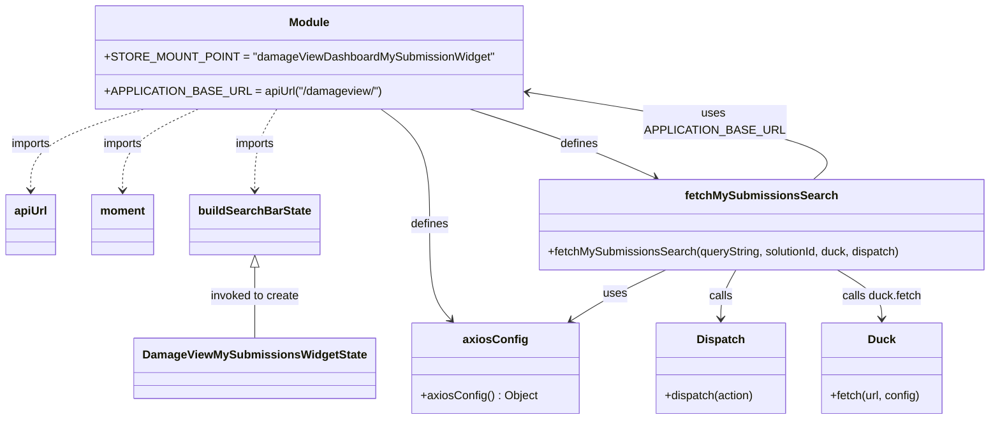

# Diagram: web/portal/src/pages/damageview/redux/DamageViewMySubmissionsState.js

> Auto-generated by Obscura crawlers

## Mermaid

### SVG

<svg id="container" width="1359.375" xmlns="http://www.w3.org/2000/svg" class="classDiagram" height="584" viewBox="0 0 1359.375 584" role="graphics-document document" aria-roledescription="class"><g><defs><marker id="container_class-aggregationStart" class="marker aggregation class" refX="18" refY="7" markerWidth="190" markerHeight="240" orient="auto"><path d="M 18,7 L9,13 L1,7 L9,1 Z"></path></marker></defs><defs><marker id="container_class-aggregationEnd" class="marker aggregation class" refX="1" refY="7" markerWidth="20" markerHeight="28" orient="auto"><path d="M 18,7 L9,13 L1,7 L9,1 Z"></path></marker></defs><defs><marker id="container_class-extensionStart" class="marker extension class" refX="18" refY="7" markerWidth="190" markerHeight="240" orient="auto"><path d="M 1,7 L18,13 V 1 Z"></path></marker></defs><defs><marker id="container_class-extensionEnd" class="marker extension class" refX="1" refY="7" markerWidth="20" markerHeight="28" orient="auto"><path d="M 1,1 V 13 L18,7 Z"></path></marker></defs><defs><marker id="container_class-compositionStart" class="marker composition class" refX="18" refY="7" markerWidth="190" markerHeight="240" orient="auto"><path d="M 18,7 L9,13 L1,7 L9,1 Z"></path></marker></defs><defs><marker id="container_class-compositionEnd" class="marker composition class" refX="1" refY="7" markerWidth="20" markerHeight="28" orient="auto"><path d="M 18,7 L9,13 L1,7 L9,1 Z"></path></marker></defs><defs><marker id="container_class-dependencyStart" class="marker dependency class" refX="6" refY="7" markerWidth="190" markerHeight="240" orient="auto"><path d="M 5,7 L9,13 L1,7 L9,1 Z"></path></marker></defs><defs><marker id="container_class-dependencyEnd" class="marker dependency class" refX="13" refY="7" markerWidth="20" markerHeight="28" orient="auto"><path d="M 18,7 L9,13 L14,7 L9,1 Z"></path></marker></defs><defs><marker id="container_class-lollipopStart" class="marker lollipop class" refX="13" refY="7" markerWidth="190" markerHeight="240" orient="auto"><circle stroke="black" fill="transparent" cx="7" cy="7" r="6"></circle></marker></defs><defs><marker id="container_class-lollipopEnd" class="marker lollipop class" refX="1" refY="7" markerWidth="190" markerHeight="240" orient="auto"><circle stroke="black" fill="transparent" cx="7" cy="7" r="6"></circle></marker></defs><g class="root"><g class="clusters"></g><g class="edgePaths"><path d="M196.317,152L170.632,160.167C144.948,168.333,93.58,184.667,67.895,203.5C42.211,222.333,42.211,243.667,42.211,254.333L42.211,265" id="id_Module_apiUrl_1" class="edge-thickness-normal edge-pattern-dashed relation" style=";;;" data-edge="true" data-et="edge" data-id="id_Module_apiUrl_1" data-points="W3sieCI6MTk2LjMxNjY5Njc5NzUyMDY1LCJ5IjoxNTJ9LHsieCI6NDIuMjEwOTM3NSwieSI6MjAxfSx7IngiOjQyLjIxMDkzNzUsInkiOjI3MX1d" marker-end="url(#container_class-dependencyEnd)"></path><path d="M271.603,152L254.459,160.167C237.314,168.333,203.024,184.667,185.879,203.5C168.734,222.333,168.734,243.667,168.734,254.333L168.734,265" id="id_Module_moment_2" class="edge-thickness-normal edge-pattern-dashed relation" style=";;;" data-edge="true" data-et="edge" data-id="id_Module_moment_2" data-points="W3sieCI6MjcxLjYwMzM3MDM1MTIzOTcsInkiOjE1Mn0seyJ4IjoxNjguNzM0Mzc1LCJ5IjoyMDF9LHsieCI6MTY4LjczNDM3NSwieSI6MjcxfV0=" marker-end="url(#container_class-dependencyEnd)"></path><path d="M378.478,152L373.456,160.167C368.433,168.333,358.389,184.667,353.366,203.5C348.344,222.333,348.344,243.667,348.344,254.333L348.344,265" id="id_Module_buildSearchBarState_3" class="edge-thickness-normal edge-pattern-dashed relation" style=";;;" data-edge="true" data-et="edge" data-id="id_Module_buildSearchBarState_3" data-points="W3sieCI6Mzc4LjQ3ODM3MDM1MTIzOTcsInkiOjE1Mn0seyJ4IjozNDguMzQzNzUsInkiOjIwMX0seyJ4IjozNDguMzQzNzUsInkiOjI3MX1d" marker-end="url(#container_class-dependencyEnd)"></path><path d="M518.871,152L529.773,160.167C540.674,168.333,562.478,184.667,573.38,211.5C584.281,238.333,584.281,275.667,584.281,311C584.281,346.333,584.281,379.667,588.996,401.746C593.711,423.825,603.141,434.651,607.856,440.063L612.571,445.476" id="id_Module_axiosConfig_4" class="edge-thickness-normal edge-pattern-solid relation" style=";;;" data-edge="true" data-et="edge" data-id="id_Module_axiosConfig_4" data-points="W3sieCI6NTE4Ljg3MDkzMjMzNDcxMDcsInkiOjE1Mn0seyJ4Ijo1ODQuMjgxMjUsInkiOjIwMX0seyJ4Ijo1ODQuMjgxMjUsInkiOjMxM30seyJ4Ijo1ODQuMjgxMjUsInkiOjQxM30seyJ4Ijo2MTYuNTExNzE4NzUsInkiOjQ1MH1d" marker-end="url(#container_class-dependencyEnd)"></path><path d="M643.023,152L668.007,160.167C692.991,168.333,742.958,184.667,785.202,200.59C827.446,216.514,861.967,232.027,879.228,239.784L896.488,247.541" id="id_Module_fetchMySubmissionsSearch_5" class="edge-thickness-normal edge-pattern-solid relation" style=";;;" data-edge="true" data-et="edge" data-id="id_Module_fetchMySubmissionsSearch_5" data-points="W3sieCI6NjQzLjAyMzA1MDEwMzMwNTgsInkiOjE1Mn0seyJ4Ijo3OTIuOTI1NzgxMjUsInkiOjIwMX0seyJ4Ijo5MDEuOTYwNjkzMzU5Mzc1LCJ5IjoyNTB9XQ==" marker-end="url(#container_class-dependencyEnd)"></path><path d="M348.344,372.25L348.344,379.042C348.344,385.833,348.344,399.417,348.344,415.875C348.344,432.333,348.344,451.667,348.344,461.333L348.344,471" id="id_buildSearchBarState_DamageViewMySubmissionsWidgetState_6" class="edge-thickness-normal edge-pattern-solid relation" style=";;;" data-edge="true" data-et="edge" data-id="id_buildSearchBarState_DamageViewMySubmissionsWidgetState_6" data-points="W3sieCI6MzQ4LjM0Mzc1LCJ5IjozNTV9LHsieCI6MzQ4LjM0Mzc1LCJ5Ijo0MTN9LHsieCI6MzQ4LjM0Mzc1LCJ5Ijo0NzF9XQ==" marker-start="url(#container_class-extensionStart)"></path><path d="M1113.859,250L1123.155,241.833C1132.451,233.667,1151.043,217.333,1084.264,196.842C1017.486,176.351,865.337,151.701,789.263,139.377L713.188,127.052" id="id_fetchMySubmissionsSearch_Module_7" class="edge-thickness-normal edge-pattern-solid relation" style=";;;" data-edge="true" data-et="edge" data-id="id_fetchMySubmissionsSearch_Module_7" data-points="W3sieCI6MTExMy44NTk0OTcwNzAzMTI1LCJ5IjoyNTB9LHsieCI6MTE2OS42MzQ3NjU2MjUsInkiOjIwMX0seyJ4Ijo3MDcuMjY1NjI1LCJ5IjoxMjYuMDkyNTI1OTA4NjY2NTZ9XQ==" marker-end="url(#container_class-dependencyEnd)"></path><path d="M908.684,376L895.62,382.167C882.557,388.333,856.429,400.667,834.412,412.467C812.395,424.268,794.488,435.536,785.535,441.17L776.582,446.804" id="id_fetchMySubmissionsSearch_axiosConfig_8" class="edge-thickness-normal edge-pattern-solid relation" style=";;;" data-edge="true" data-et="edge" data-id="id_fetchMySubmissionsSearch_axiosConfig_8" data-points="W3sieCI6OTA4LjY4NDQxNDA2MjUsInkiOjM3Nn0seyJ4Ijo4MzAuMzAwNzgxMjUsInkiOjQxM30seyJ4Ijo3NzEuNTA0MDIzNDM3NSwieSI6NDUwfV0=" marker-end="url(#container_class-dependencyEnd)"></path><path d="M1005.4,376L1001.803,382.167C998.206,388.333,991.012,400.667,987.415,412C983.818,423.333,983.818,433.667,983.818,438.833L983.818,444" id="id_fetchMySubmissionsSearch_Dispatch_9" class="edge-thickness-normal edge-pattern-solid relation" style=";;;" data-edge="true" data-et="edge" data-id="id_fetchMySubmissionsSearch_Dispatch_9" data-points="W3sieCI6MTAwNS40MDA0ODgyODEyNSwieSI6Mzc2fSx7IngiOjk4My44MTgzNTkzNzUsInkiOjQxM30seyJ4Ijo5ODMuODE4MzU5Mzc1LCJ5Ijo0NTB9XQ==" marker-end="url(#container_class-dependencyEnd)"></path><path d="M1147.214,376L1157.499,382.167C1167.783,388.333,1188.351,400.667,1198.636,412C1208.92,423.333,1208.92,433.667,1208.92,438.833L1208.92,444" id="id_fetchMySubmissionsSearch_Duck_10" class="edge-thickness-normal edge-pattern-solid relation" style=";;;" data-edge="true" data-et="edge" data-id="id_fetchMySubmissionsSearch_Duck_10" data-points="W3sieCI6MTE0Ny4yMTQ0NzI2NTYyNSwieSI6Mzc2fSx7IngiOjEyMDguOTE5OTIxODc1LCJ5Ijo0MTN9LHsieCI6MTIwOC45MTk5MjE4NzUsInkiOjQ1MH1d" marker-end="url(#container_class-dependencyEnd)"></path></g><g class="edgeLabels"><g class="edgeLabel" transform="translate(42.2109375, 201)"><g class="label" data-id="id_Module_apiUrl_1" transform="translate(-28.25, -12)"><foreignObject width="56.5" height="24">

imports

</foreignObject></g></g><g class="edgeLabel" transform="translate(168.734375, 201)"><g class="label" data-id="id_Module_moment_2" transform="translate(-28.25, -12)"><foreignObject width="56.5" height="24">

imports

</foreignObject></g></g><g class="edgeLabel" transform="translate(348.34375, 201)"><g class="label" data-id="id_Module_buildSearchBarState_3" transform="translate(-28.25, -12)"><foreignObject width="56.5" height="24">

imports

</foreignObject></g></g><g class="edgeLabel" transform="translate(584.28125, 313)"><g class="label" data-id="id_Module_axiosConfig_4" transform="translate(-26.53125, -12)"><foreignObject width="53.0625" height="24">

defines

</foreignObject></g></g><g class="edgeLabel" transform="translate(792.92578125, 201)"><g class="label" data-id="id_Module_fetchMySubmissionsSearch_5" transform="translate(-26.53125, -12)"><foreignObject width="53.0625" height="24">

defines

</foreignObject></g></g><g class="edgeLabel" transform="translate(348.34375, 413)"><g class="label" data-id="id_buildSearchBarState_DamageViewMySubmissionsWidgetState_6" transform="translate(-62.75, -12)"><foreignObject width="125.5" height="24">

invoked to create

</foreignObject></g></g><g class="edgeLabel" transform="translate(975.09345, 169.48276)"><g class="label" data-id="id_fetchMySubmissionsSearch_Module_7" transform="translate(-100, -24)"><foreignObject width="200" height="48">

uses APPLICATION_BASE_URL

</foreignObject></g></g><g class="edgeLabel" transform="translate(838.08135, 409.32728)"><g class="label" data-id="id_fetchMySubmissionsSearch_axiosConfig_8" transform="translate(-16.4921875, -12)"><foreignObject width="32.984375" height="24">

uses

</foreignObject></g></g><g class="edgeLabel" transform="translate(983.818359375, 413)"><g class="label" data-id="id_fetchMySubmissionsSearch_Dispatch_9" transform="translate(-16.4453125, -12)"><foreignObject width="32.890625" height="24">

calls

</foreignObject></g></g><g class="edgeLabel" transform="translate(1208.919921875, 413)"><g class="label" data-id="id_fetchMySubmissionsSearch_Duck_10" transform="translate(-56.0078125, -12)"><foreignObject width="112.015625" height="24">

calls duck.fetch

</foreignObject></g></g></g><g class="nodes"><g class="node default" id="classId-Module-0" transform="translate(422.7578125, 80)"><g class="basic label-container"><path d="M-284.5078125 -72 L284.5078125 -72 L284.5078125 72 L-284.5078125 72" stroke="none" stroke-width="0" fill="#ECECFF" style=""></path><path d="M-284.5078125 -72 C-104.1769585179199 -72, 76.1538954641602 -72, 284.5078125 -72 M-284.5078125 -72 C-98.0311578017359 -72, 88.4454968965282 -72, 284.5078125 -72 M284.5078125 -72 C284.5078125 -37.85062239922934, 284.5078125 -3.7012447984586743, 284.5078125 72 M284.5078125 -72 C284.5078125 -15.80495692116898, 284.5078125 40.39008615766204, 284.5078125 72 M284.5078125 72 C170.61486249747247 72, 56.721912494944945 72, -284.5078125 72 M284.5078125 72 C160.71576828227393 72, 36.923724064547855 72, -284.5078125 72 M-284.5078125 72 C-284.5078125 26.075480896499556, -284.5078125 -19.849038207000888, -284.5078125 -72 M-284.5078125 72 C-284.5078125 17.700618598434957, -284.5078125 -36.598762803130086, -284.5078125 -72" stroke="#9370DB" stroke-width="1.3" fill="none" stroke-dasharray="0 0" style=""></path></g><g class="annotation-group text" transform="translate(0, -48)"></g><g class="label-group text" transform="translate(-27.09375, -48)"><g class="label" style="font-weight: bolder" transform="translate(0,-12)"><foreignObject width="54.1875" height="24">

Module

</foreignObject></g></g><g class="members-group text" transform="translate(-272.5078125, 0)"><g class="label" style="" transform="translate(0,-12)"><foreignObject width="517.921875" height="24">

+STORE_MOUNT_POINT = "damageViewDashboardMySubmissionWidget"

</foreignObject></g></g><g class="methods-group text" transform="translate(-272.5078125, 48)"><g class="label" style="" transform="translate(0,-12)"><foreignObject width="368.953125" height="24">

+APPLICATION_BASE_URL = apiUrl("/damageview/")

</foreignObject></g></g><g class="divider" style=""><path d="M-284.5078125 -24 C-113.50148743194902 -24, 57.50483763610197 -24, 284.5078125 -24 M-284.5078125 -24 C-86.81389352384556 -24, 110.88002545230887 -24, 284.5078125 -24" stroke="#9370DB" stroke-width="1.3" fill="none" stroke-dasharray="0 0" style=""></path></g><g class="divider" style=""><path d="M-284.5078125 24 C-144.9036208949775 24, -5.299429289955015 24, 284.5078125 24 M-284.5078125 24 C-78.65008429443688 24, 127.20764391112624 24, 284.5078125 24" stroke="#9370DB" stroke-width="1.3" fill="none" stroke-dasharray="0 0" style=""></path></g></g><g class="node default" id="classId-apiUrl-1" transform="translate(42.2109375, 313)"><g class="basic label-container"><path d="M-34.2109375 -42 L34.2109375 -42 L34.2109375 42 L-34.2109375 42" stroke="none" stroke-width="0" fill="#ECECFF" style=""></path><path d="M-34.2109375 -42 C-15.426945465542971 -42, 3.3570465689140576 -42, 34.2109375 -42 M-34.2109375 -42 C-9.958549889841393 -42, 14.293837720317214 -42, 34.2109375 -42 M34.2109375 -42 C34.2109375 -20.154279028608023, 34.2109375 1.6914419427839533, 34.2109375 42 M34.2109375 -42 C34.2109375 -12.586885476464687, 34.2109375 16.826229047070626, 34.2109375 42 M34.2109375 42 C8.502212479246332 42, -17.206512541507337 42, -34.2109375 42 M34.2109375 42 C15.508522459125608 42, -3.193892581748784 42, -34.2109375 42 M-34.2109375 42 C-34.2109375 12.792257198214955, -34.2109375 -16.41548560357009, -34.2109375 -42 M-34.2109375 42 C-34.2109375 12.811443261637667, -34.2109375 -16.377113476724666, -34.2109375 -42" stroke="#9370DB" stroke-width="1.3" fill="none" stroke-dasharray="0 0" style=""></path></g><g class="annotation-group text" transform="translate(0, -18)"></g><g class="label-group text" transform="translate(-22.2109375, -18)"><g class="label" style="font-weight: bolder" transform="translate(0,-12)"><foreignObject width="44.421875" height="24">

apiUrl

</foreignObject></g></g><g class="members-group text" transform="translate(-22.2109375, 30)"></g><g class="methods-group text" transform="translate(-22.2109375, 60)"></g><g class="divider" style=""><path d="M-34.2109375 6 C-19.859935796145628 6, -5.508934092291252 6, 34.2109375 6 M-34.2109375 6 C-16.15927560097681 6, 1.8923862980463824 6, 34.2109375 6" stroke="#9370DB" stroke-width="1.3" fill="none" stroke-dasharray="0 0" style=""></path></g><g class="divider" style=""><path d="M-34.2109375 24 C-18.051244416038788 24, -1.8915513320775759 24, 34.2109375 24 M-34.2109375 24 C-9.479574369291068 24, 15.251788761417863 24, 34.2109375 24" stroke="#9370DB" stroke-width="1.3" fill="none" stroke-dasharray="0 0" style=""></path></g></g><g class="node default" id="classId-moment-2" transform="translate(168.734375, 313)"><g class="basic label-container"><path d="M-42.3125 -42 L42.3125 -42 L42.3125 42 L-42.3125 42" stroke="none" stroke-width="0" fill="#ECECFF" style=""></path><path d="M-42.3125 -42 C-11.070914275251479 -42, 20.170671449497043 -42, 42.3125 -42 M-42.3125 -42 C-17.90469667925235 -42, 6.5031066414953 -42, 42.3125 -42 M42.3125 -42 C42.3125 -14.82524025406737, 42.3125 12.349519491865259, 42.3125 42 M42.3125 -42 C42.3125 -11.311791335633366, 42.3125 19.376417328733268, 42.3125 42 M42.3125 42 C18.959964905731166 42, -4.392570188537668 42, -42.3125 42 M42.3125 42 C10.25094386282747 42, -21.81061227434506 42, -42.3125 42 M-42.3125 42 C-42.3125 13.530553242890953, -42.3125 -14.938893514218094, -42.3125 -42 M-42.3125 42 C-42.3125 18.61046272687282, -42.3125 -4.779074546254357, -42.3125 -42" stroke="#9370DB" stroke-width="1.3" fill="none" stroke-dasharray="0 0" style=""></path></g><g class="annotation-group text" transform="translate(0, -18)"></g><g class="label-group text" transform="translate(-30.3125, -18)"><g class="label" style="font-weight: bolder" transform="translate(0,-12)"><foreignObject width="60.625" height="24">

moment

</foreignObject></g></g><g class="members-group text" transform="translate(-30.3125, 30)"></g><g class="methods-group text" transform="translate(-30.3125, 60)"></g><g class="divider" style=""><path d="M-42.3125 6 C-13.792013513938592 6, 14.728472972122816 6, 42.3125 6 M-42.3125 6 C-15.338236953360607 6, 11.636026093278787 6, 42.3125 6" stroke="#9370DB" stroke-width="1.3" fill="none" stroke-dasharray="0 0" style=""></path></g><g class="divider" style=""><path d="M-42.3125 24 C-25.015520993241385 24, -7.718541986482769 24, 42.3125 24 M-42.3125 24 C-17.52030241444614 24, 7.271895171107722 24, 42.3125 24" stroke="#9370DB" stroke-width="1.3" fill="none" stroke-dasharray="0 0" style=""></path></g></g><g class="node default" id="classId-axiosConfig-3" transform="translate(671.390625, 513)"><g class="basic label-container"><path d="M-113.2578125 -63 L113.2578125 -63 L113.2578125 63 L-113.2578125 63" stroke="none" stroke-width="0" fill="#ECECFF" style=""></path><path d="M-113.2578125 -63 C-30.40973260195142 -63, 52.43834729609716 -63, 113.2578125 -63 M-113.2578125 -63 C-64.79630031692051 -63, -16.334788133841002 -63, 113.2578125 -63 M113.2578125 -63 C113.2578125 -37.440448116141845, 113.2578125 -11.880896232283689, 113.2578125 63 M113.2578125 -63 C113.2578125 -20.27181197519709, 113.2578125 22.456376049605822, 113.2578125 63 M113.2578125 63 C24.920812461687987 63, -63.416187576624026 63, -113.2578125 63 M113.2578125 63 C50.41547848987998 63, -12.42685552024004 63, -113.2578125 63 M-113.2578125 63 C-113.2578125 33.5449734732278, -113.2578125 4.089946946455605, -113.2578125 -63 M-113.2578125 63 C-113.2578125 16.650294878023878, -113.2578125 -29.699410243952244, -113.2578125 -63" stroke="#9370DB" stroke-width="1.3" fill="none" stroke-dasharray="0 0" style=""></path></g><g class="annotation-group text" transform="translate(0, -39)"></g><g class="label-group text" transform="translate(-42.203125, -39)"><g class="label" style="font-weight: bolder" transform="translate(0,-12)"><foreignObject width="84.40625" height="24">

axiosConfig

</foreignObject></g></g><g class="members-group text" transform="translate(-101.2578125, 9)"></g><g class="methods-group text" transform="translate(-101.2578125, 39)"><g class="label" style="" transform="translate(0,-12)"><foreignObject width="160.3125" height="24">

+axiosConfig() : Object

</foreignObject></g></g><g class="divider" style=""><path d="M-113.2578125 -15 C-47.90489310859951 -15, 17.44802628280098 -15, 113.2578125 -15 M-113.2578125 -15 C-55.118026504572676 -15, 3.021759490854649 -15, 113.2578125 -15" stroke="#9370DB" stroke-width="1.3" fill="none" stroke-dasharray="0 0" style=""></path></g><g class="divider" style=""><path d="M-113.2578125 9 C-60.53515294735628 9, -7.812493394712561 9, 113.2578125 9 M-113.2578125 9 C-50.753430533832784 9, 11.750951432334432 9, 113.2578125 9" stroke="#9370DB" stroke-width="1.3" fill="none" stroke-dasharray="0 0" style=""></path></g></g><g class="node default" id="classId-fetchMySubmissionsSearch-4" transform="translate(1042.1484375, 313)"><g class="basic label-container"><path d="M-309.2265625 -63 L309.2265625 -63 L309.2265625 63 L-309.2265625 63" stroke="none" stroke-width="0" fill="#ECECFF" style=""></path><path d="M-309.2265625 -63 C-88.38618601966618 -63, 132.45419046066763 -63, 309.2265625 -63 M-309.2265625 -63 C-110.56315223159689 -63, 88.10025803680622 -63, 309.2265625 -63 M309.2265625 -63 C309.2265625 -28.761988643873295, 309.2265625 5.47602271225341, 309.2265625 63 M309.2265625 -63 C309.2265625 -28.806851341660277, 309.2265625 5.386297316679446, 309.2265625 63 M309.2265625 63 C124.41247587551709 63, -60.40161074896582 63, -309.2265625 63 M309.2265625 63 C147.9251863882116 63, -13.376189723576772 63, -309.2265625 63 M-309.2265625 63 C-309.2265625 37.136411482963105, -309.2265625 11.27282296592621, -309.2265625 -63 M-309.2265625 63 C-309.2265625 23.300985893335124, -309.2265625 -16.398028213329752, -309.2265625 -63" stroke="#9370DB" stroke-width="1.3" fill="none" stroke-dasharray="0 0" style=""></path></g><g class="annotation-group text" transform="translate(0, -39)"></g><g class="label-group text" transform="translate(-99.75, -39)"><g class="label" style="font-weight: bolder" transform="translate(0,-12)"><foreignObject width="199.5" height="24">

fetchMySubmissionsSearch

</foreignObject></g></g><g class="members-group text" transform="translate(-297.2265625, 9)"></g><g class="methods-group text" transform="translate(-297.2265625, 39)"><g class="label" style="" transform="translate(0,-12)"><foreignObject width="494.703125" height="24">

+fetchMySubmissionsSearch(queryString, solutionId, duck, dispatch)

</foreignObject></g></g><g class="divider" style=""><path d="M-309.2265625 -15 C-183.7457028903412 -15, -58.26484328068241 -15, 309.2265625 -15 M-309.2265625 -15 C-155.23797580070243 -15, -1.2493891014048586 -15, 309.2265625 -15" stroke="#9370DB" stroke-width="1.3" fill="none" stroke-dasharray="0 0" style=""></path></g><g class="divider" style=""><path d="M-309.2265625 9 C-96.33396077118428 9, 116.55864095763144 9, 309.2265625 9 M-309.2265625 9 C-136.4853639190034 9, 36.25583466199322 9, 309.2265625 9" stroke="#9370DB" stroke-width="1.3" fill="none" stroke-dasharray="0 0" style=""></path></g></g><g class="node default" id="classId-Duck-5" transform="translate(1208.919921875, 513)"><g class="basic label-container"><path d="M-84.26171875 -63 L84.26171875 -63 L84.26171875 63 L-84.26171875 63" stroke="none" stroke-width="0" fill="#ECECFF" style=""></path><path d="M-84.26171875 -63 C-38.24358023968072 -63, 7.774558270638565 -63, 84.26171875 -63 M-84.26171875 -63 C-44.935594723323675 -63, -5.6094706966473495 -63, 84.26171875 -63 M84.26171875 -63 C84.26171875 -30.35798527525241, 84.26171875 2.284029449495179, 84.26171875 63 M84.26171875 -63 C84.26171875 -18.569076794255714, 84.26171875 25.86184641148857, 84.26171875 63 M84.26171875 63 C38.29396210442397 63, -7.673794541152063 63, -84.26171875 63 M84.26171875 63 C44.298624835747525 63, 4.3355309214950495 63, -84.26171875 63 M-84.26171875 63 C-84.26171875 29.551493931595367, -84.26171875 -3.8970121368092663, -84.26171875 -63 M-84.26171875 63 C-84.26171875 15.548726498196025, -84.26171875 -31.90254700360795, -84.26171875 -63" stroke="#9370DB" stroke-width="1.3" fill="none" stroke-dasharray="0 0" style=""></path></g><g class="annotation-group text" transform="translate(0, -39)"></g><g class="label-group text" transform="translate(-18.0390625, -39)"><g class="label" style="font-weight: bolder" transform="translate(0,-12)"><foreignObject width="36.078125" height="24">

Duck

</foreignObject></g></g><g class="members-group text" transform="translate(-72.26171875, 9)"></g><g class="methods-group text" transform="translate(-72.26171875, 39)"><g class="label" style="" transform="translate(0,-12)"><foreignObject width="126.484375" height="24">

+fetch(url, config)

</foreignObject></g></g><g class="divider" style=""><path d="M-84.26171875 -15 C-44.039921168644995 -15, -3.818123587289989 -15, 84.26171875 -15 M-84.26171875 -15 C-27.108599787079697 -15, 30.044519175840605 -15, 84.26171875 -15" stroke="#9370DB" stroke-width="1.3" fill="none" stroke-dasharray="0 0" style=""></path></g><g class="divider" style=""><path d="M-84.26171875 9 C-48.4094191159611 9, -12.5571194819222 9, 84.26171875 9 M-84.26171875 9 C-45.7258945720529 9, -7.190070394105803 9, 84.26171875 9" stroke="#9370DB" stroke-width="1.3" fill="none" stroke-dasharray="0 0" style=""></path></g></g><g class="node default" id="classId-Dispatch-6" transform="translate(983.818359375, 513)"><g class="basic label-container"><path d="M-90.83984375 -63 L90.83984375 -63 L90.83984375 63 L-90.83984375 63" stroke="none" stroke-width="0" fill="#ECECFF" style=""></path><path d="M-90.83984375 -63 C-40.32721107402053 -63, 10.185421601958936 -63, 90.83984375 -63 M-90.83984375 -63 C-23.999517905286808 -63, 42.840807939426384 -63, 90.83984375 -63 M90.83984375 -63 C90.83984375 -29.183692831670662, 90.83984375 4.632614336658676, 90.83984375 63 M90.83984375 -63 C90.83984375 -17.762323863717867, 90.83984375 27.475352272564265, 90.83984375 63 M90.83984375 63 C26.108447331606882 63, -38.622949086786235 63, -90.83984375 63 M90.83984375 63 C22.819102416988883 63, -45.20163891602223 63, -90.83984375 63 M-90.83984375 63 C-90.83984375 35.88917642924231, -90.83984375 8.77835285848463, -90.83984375 -63 M-90.83984375 63 C-90.83984375 34.18832031506872, -90.83984375 5.376640630137437, -90.83984375 -63" stroke="#9370DB" stroke-width="1.3" fill="none" stroke-dasharray="0 0" style=""></path></g><g class="annotation-group text" transform="translate(0, -39)"></g><g class="label-group text" transform="translate(-31.8046875, -39)"><g class="label" style="font-weight: bolder" transform="translate(0,-12)"><foreignObject width="63.609375" height="24">

Dispatch

</foreignObject></g></g><g class="members-group text" transform="translate(-78.83984375, 9)"></g><g class="methods-group text" transform="translate(-78.83984375, 39)"><g class="label" style="" transform="translate(0,-12)"><foreignObject width="125.875" height="24">

+dispatch(action)

</foreignObject></g></g><g class="divider" style=""><path d="M-90.83984375 -15 C-43.66387420064463 -15, 3.5120953487107442 -15, 90.83984375 -15 M-90.83984375 -15 C-28.694368946516654 -15, 33.45110585696669 -15, 90.83984375 -15" stroke="#9370DB" stroke-width="1.3" fill="none" stroke-dasharray="0 0" style=""></path></g><g class="divider" style=""><path d="M-90.83984375 9 C-28.9827056953066 9, 32.8744323593868 9, 90.83984375 9 M-90.83984375 9 C-36.15197822931536 9, 18.535887291369278 9, 90.83984375 9" stroke="#9370DB" stroke-width="1.3" fill="none" stroke-dasharray="0 0" style=""></path></g></g><g class="node default" id="classId-buildSearchBarState-7" transform="translate(348.34375, 313)"><g class="basic label-container"><path d="M-87.296875 -42 L87.296875 -42 L87.296875 42 L-87.296875 42" stroke="none" stroke-width="0" fill="#ECECFF" style=""></path><path d="M-87.296875 -42 C-44.830926415839116 -42, -2.3649778316782317 -42, 87.296875 -42 M-87.296875 -42 C-40.77765133285846 -42, 5.741572334283077 -42, 87.296875 -42 M87.296875 -42 C87.296875 -9.163768488325573, 87.296875 23.672463023348854, 87.296875 42 M87.296875 -42 C87.296875 -19.989408829779016, 87.296875 2.0211823404419675, 87.296875 42 M87.296875 42 C43.28664867885698 42, -0.7235776422860454 42, -87.296875 42 M87.296875 42 C44.53075420076019 42, 1.7646334015203848 42, -87.296875 42 M-87.296875 42 C-87.296875 11.325126765657465, -87.296875 -19.34974646868507, -87.296875 -42 M-87.296875 42 C-87.296875 11.510016564966726, -87.296875 -18.979966870066548, -87.296875 -42" stroke="#9370DB" stroke-width="1.3" fill="none" stroke-dasharray="0 0" style=""></path></g><g class="annotation-group text" transform="translate(0, -18)"></g><g class="label-group text" transform="translate(-75.296875, -18)"><g class="label" style="font-weight: bolder" transform="translate(0,-12)"><foreignObject width="150.59375" height="24">

buildSearchBarState

</foreignObject></g></g><g class="members-group text" transform="translate(-75.296875, 30)"></g><g class="methods-group text" transform="translate(-75.296875, 60)"></g><g class="divider" style=""><path d="M-87.296875 6 C-43.87097357589094 6, -0.4450721517818863 6, 87.296875 6 M-87.296875 6 C-28.750510361135582 6, 29.795854277728836 6, 87.296875 6" stroke="#9370DB" stroke-width="1.3" fill="none" stroke-dasharray="0 0" style=""></path></g><g class="divider" style=""><path d="M-87.296875 24 C-50.94937056838658 24, -14.601866136773154 24, 87.296875 24 M-87.296875 24 C-49.97659555453369 24, -12.656316109067376 24, 87.296875 24" stroke="#9370DB" stroke-width="1.3" fill="none" stroke-dasharray="0 0" style=""></path></g></g><g class="node default" id="classId-DamageViewMySubmissionsWidgetState-8" transform="translate(348.34375, 513)"><g class="basic label-container"><path d="M-159.7890625 -42 L159.7890625 -42 L159.7890625 42 L-159.7890625 42" stroke="none" stroke-width="0" fill="#ECECFF" style=""></path><path d="M-159.7890625 -42 C-44.02960320077298 -42, 71.72985609845404 -42, 159.7890625 -42 M-159.7890625 -42 C-53.45981605098909 -42, 52.86943039802182 -42, 159.7890625 -42 M159.7890625 -42 C159.7890625 -16.58697551231544, 159.7890625 8.826048975369119, 159.7890625 42 M159.7890625 -42 C159.7890625 -12.093491880435934, 159.7890625 17.81301623912813, 159.7890625 42 M159.7890625 42 C67.34488295217545 42, -25.099296595649093 42, -159.7890625 42 M159.7890625 42 C73.8542426679168 42, -12.080577164166414 42, -159.7890625 42 M-159.7890625 42 C-159.7890625 21.316222139849963, -159.7890625 0.632444279699925, -159.7890625 -42 M-159.7890625 42 C-159.7890625 12.821972341647161, -159.7890625 -16.356055316705678, -159.7890625 -42" stroke="#9370DB" stroke-width="1.3" fill="none" stroke-dasharray="0 0" style=""></path></g><g class="annotation-group text" transform="translate(0, -18)"></g><g class="label-group text" transform="translate(-147.7890625, -18)"><g class="label" style="font-weight: bolder" transform="translate(0,-12)"><foreignObject width="295.578125" height="24">

DamageViewMySubmissionsWidgetState

</foreignObject></g></g><g class="members-group text" transform="translate(-147.7890625, 30)"></g><g class="methods-group text" transform="translate(-147.7890625, 60)"></g><g class="divider" style=""><path d="M-159.7890625 6 C-39.98971838647775 6, 79.8096257270445 6, 159.7890625 6 M-159.7890625 6 C-61.86291462057025 6, 36.0632332588595 6, 159.7890625 6" stroke="#9370DB" stroke-width="1.3" fill="none" stroke-dasharray="0 0" style=""></path></g><g class="divider" style=""><path d="M-159.7890625 24 C-76.17154044324766 24, 7.445981613504671 24, 159.7890625 24 M-159.7890625 24 C-45.123053963672305 24, 69.54295457265539 24, 159.7890625 24" stroke="#9370DB" stroke-width="1.3" fill="none" stroke-dasharray="0 0" style=""></path></g></g></g></g></g></svg>
