# Diagram: web/portal/src/pages/damageview/redux/DamageViewSearchFilterLoaders.js

> Auto-generated by Obscura crawlers

## Mermaid

```mermaid
classDiagram
    class BuildAsyncFilterOptionsState {
        <<factory function>>
        +topic
        +getUrl()
        +pageSize
        +getResponseData()
        +transformResult()
        +getAdditionalParams()
    }

    class damageViewAssigneesOptionsState {
        +topic: "damageViewAssigneeFilter"
        +pageSize: 20
        +getUrl -> assigneesUrl(solutionId, state)
    }
    class damageViewPartnersOptionsState {
        +topic: "damageViewPartnerFilter"
        +pageSize: 20
        +getUrl -> partnersUrl(solutionId, state)
    }
    class currentPositionsCodeOptionsState {
        +topic: "damageViewCurrentPositionCodeFilter"
        +getUrl -> currentPositionCodesUrl
    }
    class productTypeOptionsState {
        +topic: "damageViewProductTypeFilter"
        +pageSize: 20
        +getUrl -> productTypesUrl
    }
    class damageAreaOptionsState {
        +topic: "damageViewDamageAreaFilter"
        +pageSize: 20
        +getUrl -> damageAreaUrl
        +getAdditionalParams -> ProfileState.selectors.getUserPreferences(state)
    }
    class lastMilestoneOptionsState {
        +topic: "damageViewLastMilestoneFilter"
        +getUrl -> lastMilestoneUrl
    }
    class stolenVinOptionsState {
        +topic: "damageViewStolenVinFilter"
        +getUrl -> stolenVinUrl
    }

    class DamageViewDomainData {
        <<module>>
        +assigneesUrl()
        +partnersUrl()
        +currentPositionCodesUrl()
        +productTypesUrl()
        +damageAreaUrl()
        +lastMilestoneUrl()
        +stolenVinUrl()
    }

    class ProfileState {
        <<redux state>>
        +selectors.getUserPreferences(state)
    }

    BuildAsyncFilterOptionsState <|-- damageViewAssigneesOptionsState : creates
    BuildAsyncFilterOptionsState <|-- damageViewPartnersOptionsState : creates
    BuildAsyncFilterOptionsState <|-- currentPositionsCodeOptionsState : creates
    BuildAsyncFilterOptionsState <|-- productTypeOptionsState : creates
    BuildAsyncFilterOptionsState <|-- damageAreaOptionsState : creates
    BuildAsyncFilterOptionsState <|-- lastMilestoneOptionsState : creates
    BuildAsyncFilterOptionsState <|-- stolenVinOptionsState : creates

    damageViewAssigneesOptionsState --|> DamageViewDomainData : uses assigneesUrl
    damageViewPartnersOptionsState --|> DamageViewDomainData : uses partnersUrl
    currentPositionsCodeOptionsState --|> DamageViewDomainData : uses currentPositionCodesUrl
    productTypeOptionsState --|> DamageViewDomainData : uses productTypesUrl
    damageAreaOptionsState --|> DamageViewDomainData : uses damageAreaUrl
    lastMilestoneOptionsState --|> DamageViewDomainData : uses lastMilestoneUrl
    stolenVinOptionsState --|> DamageViewDomainData : uses stolenVinUrl

    damageAreaOptionsState ..> ProfileState : calls getUserPreferences()
```

### SVG

<svg id="container" width="3521.9140625" xmlns="http://www.w3.org/2000/svg" class="classDiagram" height="938" viewBox="0 0 3521.9140625 938" role="graphics-document document" aria-roledescription="class"><g><defs><marker id="container_class-aggregationStart" class="marker aggregation class" refX="18" refY="7" markerWidth="190" markerHeight="240" orient="auto"><path d="M 18,7 L9,13 L1,7 L9,1 Z"></path></marker></defs><defs><marker id="container_class-aggregationEnd" class="marker aggregation class" refX="1" refY="7" markerWidth="20" markerHeight="28" orient="auto"><path d="M 18,7 L9,13 L1,7 L9,1 Z"></path></marker></defs><defs><marker id="container_class-extensionStart" class="marker extension class" refX="18" refY="7" markerWidth="190" markerHeight="240" orient="auto"><path d="M 1,7 L18,13 V 1 Z"></path></marker></defs><defs><marker id="container_class-extensionEnd" class="marker extension class" refX="1" refY="7" markerWidth="20" markerHeight="28" orient="auto"><path d="M 1,1 V 13 L18,7 Z"></path></marker></defs><defs><marker id="container_class-compositionStart" class="marker composition class" refX="18" refY="7" markerWidth="190" markerHeight="240" orient="auto"><path d="M 18,7 L9,13 L1,7 L9,1 Z"></path></marker></defs><defs><marker id="container_class-compositionEnd" class="marker composition class" refX="1" refY="7" markerWidth="20" markerHeight="28" orient="auto"><path d="M 18,7 L9,13 L1,7 L9,1 Z"></path></marker></defs><defs><marker id="container_class-dependencyStart" class="marker dependency class" refX="6" refY="7" markerWidth="190" markerHeight="240" orient="auto"><path d="M 5,7 L9,13 L1,7 L9,1 Z"></path></marker></defs><defs><marker id="container_class-dependencyEnd" class="marker dependency class" refX="13" refY="7" markerWidth="20" markerHeight="28" orient="auto"><path d="M 18,7 L9,13 L14,7 L9,1 Z"></path></marker></defs><defs><marker id="container_class-lollipopStart" class="marker lollipop class" refX="13" refY="7" markerWidth="190" markerHeight="240" orient="auto"><circle stroke="black" fill="transparent" cx="7" cy="7" r="6"></circle></marker></defs><defs><marker id="container_class-lollipopEnd" class="marker lollipop class" refX="1" refY="7" markerWidth="190" markerHeight="240" orient="auto"><circle stroke="black" fill="transparent" cx="7" cy="7" r="6"></circle></marker></defs><g class="root"><g class="clusters"></g><g class="edgePaths"><path d="M1383.996,161.399L1192.171,185.999C1000.347,210.599,616.699,259.8,424.875,292.566C233.051,325.333,233.051,341.667,233.051,349.833L233.051,358" id="id_BuildAsyncFilterOptionsState_damageViewAssigneesOptionsState_1" class="edge-thickness-normal edge-pattern-solid relation" style=";;;" data-edge="true" data-et="edge" data-id="id_BuildAsyncFilterOptionsState_damageViewAssigneesOptionsState_1" data-points="W3sieCI6MTQwMS4xMDU0Njg3NSwieSI6MTU5LjIwNDQ3NzE0Mjk3NTcyfSx7IngiOjIzMy4wNTA3ODEyNSwieSI6MzA5fSx7IngiOjIzMy4wNTA3ODEyNSwieSI6MzU4fV0=" marker-start="url(#container_class-extensionStart)"></path><path d="M1384.207,174.145L1274.51,196.621C1164.813,219.097,945.42,264.048,835.724,294.691C726.027,325.333,726.027,341.667,726.027,349.833L726.027,358" id="id_BuildAsyncFilterOptionsState_damageViewPartnersOptionsState_2" class="edge-thickness-normal edge-pattern-solid relation" style=";;;" data-edge="true" data-et="edge" data-id="id_BuildAsyncFilterOptionsState_damageViewPartnersOptionsState_2" data-points="W3sieCI6MTQwMS4xMDU0Njg3NSwieSI6MTcwLjY4MjQ1Mjc4MzcyMzg3fSx7IngiOjcyNi4wMjczNDM3NSwieSI6MzA5fSx7IngiOjcyNi4wMjczNDM3NSwieSI6MzU4fV0=" marker-start="url(#container_class-extensionStart)"></path><path d="M1385.956,229.808L1361.722,243.007C1337.488,256.206,1289.019,282.603,1264.785,305.968C1240.551,329.333,1240.551,349.667,1240.551,359.833L1240.551,370" id="id_BuildAsyncFilterOptionsState_currentPositionsCodeOptionsState_3" class="edge-thickness-normal edge-pattern-solid relation" style=";;;" data-edge="true" data-et="edge" data-id="id_BuildAsyncFilterOptionsState_currentPositionsCodeOptionsState_3" data-points="W3sieCI6MTQwMS4xMDU0Njg3NSwieSI6MjIxLjU1Nzc0MzE0NTU5Nzg0fSx7IngiOjEyNDAuNTUwNzgxMjUsInkiOjMwOX0seyJ4IjoxMjQwLjU1MDc4MTI1LCJ5IjozNzB9XQ==" marker-start="url(#container_class-extensionStart)"></path><path d="M1709.675,283.568L1714.364,287.806C1719.053,292.045,1728.431,300.523,1733.12,312.928C1737.809,325.333,1737.809,341.667,1737.809,349.833L1737.809,358" id="id_BuildAsyncFilterOptionsState_productTypeOptionsState_4" class="edge-thickness-normal edge-pattern-solid relation" style=";;;" data-edge="true" data-et="edge" data-id="id_BuildAsyncFilterOptionsState_productTypeOptionsState_4" data-points="W3sieCI6MTY5Ni44NzgwMjc5MjE1OTc1LCJ5IjoyNzJ9LHsieCI6MTczNy44MDg1OTM3NSwieSI6MzA5fSx7IngiOjE3MzcuODA4NTkzNzUsInkiOjM1OH1d" marker-start="url(#container_class-extensionStart)"></path><path d="M1717.693,163.045L1893.807,187.371C2069.92,211.696,2422.148,260.348,2598.261,290.841C2774.375,321.333,2774.375,333.667,2774.375,339.833L2774.375,346" id="id_BuildAsyncFilterOptionsState_damageAreaOptionsState_5" class="edge-thickness-normal edge-pattern-solid relation" style=";;;" data-edge="true" data-et="edge" data-id="id_BuildAsyncFilterOptionsState_damageAreaOptionsState_5" data-points="W3sieCI6MTcwMC42MDU0Njg3NSwieSI6MTYwLjY4NDM4NTc4NTExNjU4fSx7IngiOjI3NzQuMzc1LCJ5IjozMDl9LHsieCI6Mjc3NC4zNzUsInkiOjM0Nn1d" marker-start="url(#container_class-extensionStart)"></path><path d="M1717.292,183.602L1797.069,204.502C1876.846,225.402,2036.4,267.201,2116.176,298.267C2195.953,329.333,2195.953,349.667,2195.953,359.833L2195.953,370" id="id_BuildAsyncFilterOptionsState_lastMilestoneOptionsState_6" class="edge-thickness-normal edge-pattern-solid relation" style=";;;" data-edge="true" data-et="edge" data-id="id_BuildAsyncFilterOptionsState_lastMilestoneOptionsState_6" data-points="W3sieCI6MTcwMC42MDU0Njg3NSwieSI6MTc5LjIzMDg4MTk1MjIyMzh9LHsieCI6MjE5NS45NTMxMjUsInkiOjMwOX0seyJ4IjoyMTk1Ljk1MzEyNSwieSI6MzcwfV0=" marker-start="url(#container_class-extensionStart)"></path><path d="M1717.778,155.859L1986.417,181.383C2255.057,206.906,2792.335,257.953,3060.974,293.643C3329.613,329.333,3329.613,349.667,3329.613,359.833L3329.613,370" id="id_BuildAsyncFilterOptionsState_stolenVinOptionsState_7" class="edge-thickness-normal edge-pattern-solid relation" style=";;;" data-edge="true" data-et="edge" data-id="id_BuildAsyncFilterOptionsState_stolenVinOptionsState_7" data-points="W3sieCI6MTcwMC42MDU0Njg3NSwieSI6MTU0LjIyNzc2NjA0MTA4Mzc4fSx7IngiOjMzMjkuNjEzMjgxMjUsInkiOjMwOX0seyJ4IjozMzI5LjYxMzI4MTI1LCJ5IjozNzB9XQ==" marker-start="url(#container_class-extensionStart)"></path><path d="M233.051,526L233.051,536.167C233.051,546.333,233.051,566.667,455.119,605.759C677.187,644.85,1121.324,702.701,1343.393,731.626L1565.461,760.551" id="id_damageViewAssigneesOptionsState_DamageViewDomainData_8" class="edge-thickness-normal edge-pattern-solid relation" style=";;;" data-edge="true" data-et="edge" data-id="id_damageViewAssigneesOptionsState_DamageViewDomainData_8" data-points="W3sieCI6MjMzLjA1MDc4MTI1LCJ5Ijo1MjZ9LHsieCI6MjMzLjA1MDc4MTI1LCJ5Ijo1ODd9LHsieCI6MTU4Mi41NjY0MDYyNSwieSI6NzYyLjc3OTE1ODgxMzk3MDN9XQ==" marker-end="url(#container_class-extensionEnd)"></path><path d="M726.027,526L726.027,536.167C726.027,546.333,726.027,566.667,865.961,603.941C1005.895,641.215,1285.763,695.431,1425.697,722.538L1565.631,749.646" id="id_damageViewPartnersOptionsState_DamageViewDomainData_9" class="edge-thickness-normal edge-pattern-solid relation" style=";;;" data-edge="true" data-et="edge" data-id="id_damageViewPartnersOptionsState_DamageViewDomainData_9" data-points="W3sieCI6NzI2LjAyNzM0Mzc1LCJ5Ijo1MjZ9LHsieCI6NzI2LjAyNzM0Mzc1LCJ5Ijo1ODd9LHsieCI6MTU4Mi41NjY0MDYyNSwieSI6NzUyLjkyNjgzMDc3NDkzMjh9XQ==" marker-end="url(#container_class-extensionEnd)"></path><path d="M1240.551,514L1240.551,526.167C1240.551,538.333,1240.551,562.667,1294.879,596.247C1349.207,629.828,1457.862,672.656,1512.19,694.07L1566.518,715.484" id="id_currentPositionsCodeOptionsState_DamageViewDomainData_10" class="edge-thickness-normal edge-pattern-solid relation" style=";;;" data-edge="true" data-et="edge" data-id="id_currentPositionsCodeOptionsState_DamageViewDomainData_10" data-points="W3sieCI6MTI0MC41NTA3ODEyNSwieSI6NTE0fSx7IngiOjEyNDAuNTUwNzgxMjUsInkiOjU4N30seyJ4IjoxNTgyLjU2NjQwNjI1LCJ5Ijo3MjEuODA5NDcwNjkwODE5OX1d" marker-end="url(#container_class-extensionEnd)"></path><path d="M1737.809,526L1737.809,536.167C1737.809,546.333,1737.809,566.667,1737.809,582.125C1737.809,597.583,1737.809,608.167,1737.809,613.458L1737.809,618.75" id="id_productTypeOptionsState_DamageViewDomainData_11" class="edge-thickness-normal edge-pattern-solid relation" style=";;;" data-edge="true" data-et="edge" data-id="id_productTypeOptionsState_DamageViewDomainData_11" data-points="W3sieCI6MTczNy44MDg1OTM3NSwieSI6NTI2fSx7IngiOjE3MzcuODA4NTkzNzUsInkiOjU4N30seyJ4IjoxNzM3LjgwODU5Mzc1LCJ5Ijo2MzZ9XQ==" marker-end="url(#container_class-extensionEnd)"></path><path d="M2453.438,524.782L2413.236,535.152C2373.034,545.522,2292.63,566.261,2201.89,597.51C2111.149,628.759,2010.071,670.518,1959.533,691.397L1908.994,712.277" id="id_damageAreaOptionsState_DamageViewDomainData_12" class="edge-thickness-normal edge-pattern-solid relation" style=";;;" data-edge="true" data-et="edge" data-id="id_damageAreaOptionsState_DamageViewDomainData_12" data-points="W3sieCI6MjQ1My40Mzc1LCJ5Ijo1MjQuNzgyMjk0NDg5NjExNn0seyJ4IjoyMjEyLjIyNjU2MjUsInkiOjU4N30seyJ4IjoxODkzLjA1MDc4MTI1LCJ5Ijo3MTguODYzNTgyODQ0MTA5OX1d" marker-end="url(#container_class-extensionEnd)"></path><path d="M2289.425,514L2305.22,526.167C2321.015,538.333,2352.605,562.667,2289.294,598.82C2225.983,634.974,2067.771,682.948,1988.665,706.934L1909.559,730.921" id="id_lastMilestoneOptionsState_DamageViewDomainData_13" class="edge-thickness-normal edge-pattern-solid relation" style=";;;" data-edge="true" data-et="edge" data-id="id_lastMilestoneOptionsState_DamageViewDomainData_13" data-points="W3sieCI6MjI4OS40MjUxMDc3NTg2MjA1LCJ5Ijo1MTR9LHsieCI6MjM4NC4xOTUzMTI1LCJ5Ijo1ODd9LHsieCI6MTg5My4wNTA3ODEyNSwieSI6NzM1LjkyNjgzNDg2OTMxNTZ9XQ==" marker-end="url(#container_class-extensionEnd)"></path><path d="M3145.313,490.317L3083.847,506.431C3022.382,522.545,2899.452,554.772,2693.567,598.137C2487.682,641.503,2198.842,696.005,2054.422,723.257L1910.002,750.508" id="id_stolenVinOptionsState_DamageViewDomainData_14" class="edge-thickness-normal edge-pattern-solid relation" style=";;;" data-edge="true" data-et="edge" data-id="id_stolenVinOptionsState_DamageViewDomainData_14" data-points="W3sieCI6MzE0NS4zMTI1LCJ5Ijo0OTAuMzE2Nzc3NDkwMTc0Mn0seyJ4IjoyNzc2LjUyMTQ4NDM3NSwieSI6NTg3fSx7IngiOjE4OTMuMDUwNzgxMjUsInkiOjc1My43MDY1NjQ4MDI4MTl9XQ==" marker-end="url(#container_class-extensionEnd)"></path><path d="M2958.178,538L2973.814,546.167C2989.45,554.333,3020.722,570.667,3036.358,598C3051.994,625.333,3051.994,663.667,3051.994,682.833L3051.994,702" id="id_damageAreaOptionsState_ProfileState_15" class="edge-thickness-normal edge-pattern-dashed relation" style=";;;" data-edge="true" data-et="edge" data-id="id_damageAreaOptionsState_ProfileState_15" data-points="W3sieCI6Mjk1OC4xNzgwMTcyNDEzNzksInkiOjUzOH0seyJ4IjozMDUxLjk5NDE0MDYyNSwieSI6NTg3fSx7IngiOjMwNTEuOTk0MTQwNjI1LCJ5Ijo3MDh9XQ==" marker-end="url(#container_class-dependencyEnd)"></path></g><g class="edgeLabels"><g class="edgeLabel" transform="translate(233.05078125, 309)"><g class="label" data-id="id_BuildAsyncFilterOptionsState_damageViewAssigneesOptionsState_1" transform="translate(-26.171875, -12)"><foreignObject width="52.34375" height="24">

creates

</foreignObject></g></g><g class="edgeLabel" transform="translate(726.02734375, 309)"><g class="label" data-id="id_BuildAsyncFilterOptionsState_damageViewPartnersOptionsState_2" transform="translate(-26.171875, -12)"><foreignObject width="52.34375" height="24">

creates

</foreignObject></g></g><g class="edgeLabel" transform="translate(1240.55078125, 309)"><g class="label" data-id="id_BuildAsyncFilterOptionsState_currentPositionsCodeOptionsState_3" transform="translate(-26.171875, -12)"><foreignObject width="52.34375" height="24">

creates

</foreignObject></g></g><g class="edgeLabel" transform="translate(1737.80859375, 309)"><g class="label" data-id="id_BuildAsyncFilterOptionsState_productTypeOptionsState_4" transform="translate(-26.171875, -12)"><foreignObject width="52.34375" height="24">

creates

</foreignObject></g></g><g class="edgeLabel" transform="translate(2774.375, 309)"><g class="label" data-id="id_BuildAsyncFilterOptionsState_damageAreaOptionsState_5" transform="translate(-26.171875, -12)"><foreignObject width="52.34375" height="24">

creates

</foreignObject></g></g><g class="edgeLabel" transform="translate(2195.953125, 309)"><g class="label" data-id="id_BuildAsyncFilterOptionsState_lastMilestoneOptionsState_6" transform="translate(-26.171875, -12)"><foreignObject width="52.34375" height="24">

creates

</foreignObject></g></g><g class="edgeLabel" transform="translate(3329.61328125, 309)"><g class="label" data-id="id_BuildAsyncFilterOptionsState_stolenVinOptionsState_7" transform="translate(-26.171875, -12)"><foreignObject width="52.34375" height="24">

creates

</foreignObject></g></g><g class="edgeLabel" transform="translate(233.05078125, 587)"><g class="label" data-id="id_damageViewAssigneesOptionsState_DamageViewDomainData_8" transform="translate(-64.5625, -12)"><foreignObject width="129.125" height="24">

uses assigneesUrl

</foreignObject></g></g><g class="edgeLabel" transform="translate(726.02734375, 587)"><g class="label" data-id="id_damageViewPartnersOptionsState_DamageViewDomainData_9" transform="translate(-60.09375, -12)"><foreignObject width="120.1875" height="24">

uses partnersUrl

</foreignObject></g></g><g class="edgeLabel" transform="translate(1240.55078125, 587)"><g class="label" data-id="id_currentPositionsCodeOptionsState_DamageViewDomainData_10" transform="translate(-100, -24)"><foreignObject width="200" height="48">

uses currentPositionCodesUrl

</foreignObject></g></g><g class="edgeLabel" transform="translate(1737.80859375, 587)"><g class="label" data-id="id_productTypeOptionsState_DamageViewDomainData_11" transform="translate(-78.3671875, -12)"><foreignObject width="156.734375" height="24">

uses productTypesUrl

</foreignObject></g></g><g class="edgeLabel" transform="translate(2167.75434, 605.37316)"><g class="label" data-id="id_damageAreaOptionsState_DamageViewDomainData_12" transform="translate(-74.0625, -12)"><foreignObject width="148.125" height="24">

uses damageAreaUrl

</foreignObject></g></g><g class="edgeLabel" transform="translate(2195.86249, 644.10704)"><g class="label" data-id="id_lastMilestoneOptionsState_DamageViewDomainData_13" transform="translate(-77.90625, -12)"><foreignObject width="155.8125" height="24">

uses lastMilestoneUrl

</foreignObject></g></g><g class="edgeLabel" transform="translate(2522.10734, 635.0067)"><g class="label" data-id="id_stolenVinOptionsState_DamageViewDomainData_14" transform="translate(-63.2578125, -12)"><foreignObject width="126.515625" height="24">

uses stolenVinUrl

</foreignObject></g></g><g class="edgeLabel" transform="translate(3051.994140625, 587)"><g class="label" data-id="id_damageAreaOptionsState_ProfileState_15" transform="translate(-93.78125, -12)"><foreignObject width="187.5625" height="24">

calls getUserPreferences()

</foreignObject></g></g></g><g class="nodes"><g class="node default" id="classId-BuildAsyncFilterOptionsState-0" transform="translate(1550.85546875, 140)"><g class="basic label-container"><path d="M-149.75 -132 L149.75 -132 L149.75 132 L-149.75 132" stroke="none" stroke-width="0" fill="#ECECFF" style=""></path><path d="M-149.75 -132 C-62.49255623103063 -132, 24.764887537938733 -132, 149.75 -132 M-149.75 -132 C-47.075028845580505 -132, 55.59994230883899 -132, 149.75 -132 M149.75 -132 C149.75 -35.948498636264446, 149.75 60.10300272747111, 149.75 132 M149.75 -132 C149.75 -48.37157091866543, 149.75 35.25685816266915, 149.75 132 M149.75 132 C71.3210898865053 132, -7.107820226989389 132, -149.75 132 M149.75 132 C80.75306416710295 132, 11.756128334205897 132, -149.75 132 M-149.75 132 C-149.75 63.855566262452186, -149.75 -4.288867475095628, -149.75 -132 M-149.75 132 C-149.75 58.22820726228204, -149.75 -15.543585475435918, -149.75 -132" stroke="#9370DB" stroke-width="1.3" fill="none" stroke-dasharray="0 0" style=""></path></g><g class="annotation-group text" transform="translate(-66.75, -108)"><g class="label" style="" transform="translate(0,-12)"><foreignObject width="133.5" height="24">

«factory function»

</foreignObject></g></g><g class="label-group text" transform="translate(-106.90625, -84)"><g class="label" style="font-weight: bolder" transform="translate(0,-12)"><foreignObject width="213.8125" height="24">

BuildAsyncFilterOptionsState

</foreignObject></g></g><g class="members-group text" transform="translate(-137.75, -36)"><g class="label" style="" transform="translate(0,-12)"><foreignObject width="44.453125" height="24">

+topic

</foreignObject></g><g class="label" style="" transform="translate(0,12)"><foreignObject width="71.5" height="24">

+pageSize

</foreignObject></g></g><g class="methods-group text" transform="translate(-137.75, 36)"><g class="label" style="" transform="translate(0,-12)"><foreignObject width="62.375" height="24">

+getUrl()

</foreignObject></g><g class="label" style="" transform="translate(0,12)"><foreignObject width="144.1875" height="24">

+getResponseData()

</foreignObject></g><g class="label" style="" transform="translate(0,36)"><foreignObject width="135.0625" height="24">

+transformResult()

</foreignObject></g><g class="label" style="" transform="translate(0,60)"><foreignObject width="168.59375" height="24">

+getAdditionalParams()

</foreignObject></g></g><g class="divider" style=""><path d="M-149.75 -60 C-36.938910882989376 -60, 75.87217823402125 -60, 149.75 -60 M-149.75 -60 C-87.19468231550059 -60, -24.639364631001158 -60, 149.75 -60" stroke="#9370DB" stroke-width="1.3" fill="none" stroke-dasharray="0 0" style=""></path></g><g class="divider" style=""><path d="M-149.75 12 C-42.26264968237059 12, 65.22470063525881 12, 149.75 12 M-149.75 12 C-85.9463546969414 12, -22.142709393882782 12, 149.75 12" stroke="#9370DB" stroke-width="1.3" fill="none" stroke-dasharray="0 0" style=""></path></g></g><g class="node default" id="classId-damageViewAssigneesOptionsState-1" transform="translate(233.05078125, 442)"><g class="basic label-container"><path d="M-225.05078125 -84 L225.05078125 -84 L225.05078125 84 L-225.05078125 84" stroke="none" stroke-width="0" fill="#ECECFF" style=""></path><path d="M-225.05078125 -84 C-48.89319127472629 -84, 127.26439870054742 -84, 225.05078125 -84 M-225.05078125 -84 C-82.5542761096296 -84, 59.942229030740805 -84, 225.05078125 -84 M225.05078125 -84 C225.05078125 -45.323410290065596, 225.05078125 -6.646820580131191, 225.05078125 84 M225.05078125 -84 C225.05078125 -38.46138380815543, 225.05078125 7.077232383689136, 225.05078125 84 M225.05078125 84 C126.3506038354608 84, 27.650426420921605 84, -225.05078125 84 M225.05078125 84 C131.19786652303839 84, 37.3449517960768 84, -225.05078125 84 M-225.05078125 84 C-225.05078125 50.0781760798093, -225.05078125 16.156352159618606, -225.05078125 -84 M-225.05078125 84 C-225.05078125 21.187620896938213, -225.05078125 -41.62475820612357, -225.05078125 -84" stroke="#9370DB" stroke-width="1.3" fill="none" stroke-dasharray="0 0" style=""></path></g><g class="annotation-group text" transform="translate(0, -60)"></g><g class="label-group text" transform="translate(-130.6015625, -60)"><g class="label" style="font-weight: bolder" transform="translate(0,-12)"><foreignObject width="261.203125" height="24">

damageViewAssigneesOptionsState

</foreignObject></g></g><g class="members-group text" transform="translate(-213.05078125, -12)"><g class="label" style="" transform="translate(0,-12)"><foreignObject width="256.71875" height="24">

+topic: "damageViewAssigneeFilter"

</foreignObject></g><g class="label" style="" transform="translate(0,12)"><foreignObject width="96.421875" height="24">

+pageSize: 20

</foreignObject></g></g><g class="methods-group text" transform="translate(-213.05078125, 60)"><g class="label" style="" transform="translate(0,-12)"><foreignObject width="295.5" height="24">

+getUrl -&gt; assigneesUrl(solutionId, state)

</foreignObject></g></g><g class="divider" style=""><path d="M-225.05078125 -36 C-58.40338275460806 -36, 108.24401574078388 -36, 225.05078125 -36 M-225.05078125 -36 C-82.09690001303869 -36, 60.85698122392262 -36, 225.05078125 -36" stroke="#9370DB" stroke-width="1.3" fill="none" stroke-dasharray="0 0" style=""></path></g><g class="divider" style=""><path d="M-225.05078125 36 C-55.38414539229595 36, 114.2824904654081 36, 225.05078125 36 M-225.05078125 36 C-122.86239844971134 36, -20.67401564942267 36, 225.05078125 36" stroke="#9370DB" stroke-width="1.3" fill="none" stroke-dasharray="0 0" style=""></path></g></g><g class="node default" id="classId-damageViewPartnersOptionsState-2" transform="translate(726.02734375, 442)"><g class="basic label-container"><path d="M-217.92578125 -84 L217.92578125 -84 L217.92578125 84 L-217.92578125 84" stroke="none" stroke-width="0" fill="#ECECFF" style=""></path><path d="M-217.92578125 -84 C-70.32291688136934 -84, 77.27994748726132 -84, 217.92578125 -84 M-217.92578125 -84 C-85.83046054001716 -84, 46.26486016996569 -84, 217.92578125 -84 M217.92578125 -84 C217.92578125 -39.940249120723244, 217.92578125 4.119501758553511, 217.92578125 84 M217.92578125 -84 C217.92578125 -21.66078447100653, 217.92578125 40.67843105798694, 217.92578125 84 M217.92578125 84 C78.15074906951324 84, -61.62428311097352 84, -217.92578125 84 M217.92578125 84 C78.09635209917815 84, -61.733077051643704 84, -217.92578125 84 M-217.92578125 84 C-217.92578125 32.84581917677209, -217.92578125 -18.308361646455822, -217.92578125 -84 M-217.92578125 84 C-217.92578125 19.228821188507865, -217.92578125 -45.54235762298427, -217.92578125 -84" stroke="#9370DB" stroke-width="1.3" fill="none" stroke-dasharray="0 0" style=""></path></g><g class="annotation-group text" transform="translate(0, -60)"></g><g class="label-group text" transform="translate(-125.3046875, -60)"><g class="label" style="font-weight: bolder" transform="translate(0,-12)"><foreignObject width="250.609375" height="24">

damageViewPartnersOptionsState

</foreignObject></g></g><g class="members-group text" transform="translate(-205.92578125, -12)"><g class="label" style="" transform="translate(0,-12)"><foreignObject width="246.453125" height="24">

+topic: "damageViewPartnerFilter"

</foreignObject></g><g class="label" style="" transform="translate(0,12)"><foreignObject width="96.421875" height="24">

+pageSize: 20

</foreignObject></g></g><g class="methods-group text" transform="translate(-205.92578125, 60)"><g class="label" style="" transform="translate(0,-12)"><foreignObject width="286.546875" height="24">

+getUrl -&gt; partnersUrl(solutionId, state)

</foreignObject></g></g><g class="divider" style=""><path d="M-217.92578125 -36 C-108.90078201339382 -36, 0.12421722321235507 -36, 217.92578125 -36 M-217.92578125 -36 C-107.87126338023336 -36, 2.183254489533283 -36, 217.92578125 -36" stroke="#9370DB" stroke-width="1.3" fill="none" stroke-dasharray="0 0" style=""></path></g><g class="divider" style=""><path d="M-217.92578125 36 C-85.28997875002366 36, 47.34582374995267 36, 217.92578125 36 M-217.92578125 36 C-80.66953088488845 36, 56.58671948022311 36, 217.92578125 36" stroke="#9370DB" stroke-width="1.3" fill="none" stroke-dasharray="0 0" style=""></path></g></g><g class="node default" id="classId-currentPositionsCodeOptionsState-3" transform="translate(1240.55078125, 442)"><g class="basic label-container"><path d="M-246.59765625 -72 L246.59765625 -72 L246.59765625 72 L-246.59765625 72" stroke="none" stroke-width="0" fill="#ECECFF" style=""></path><path d="M-246.59765625 -72 C-93.2264498608273 -72, 60.1447565283454 -72, 246.59765625 -72 M-246.59765625 -72 C-76.66671387550241 -72, 93.26422849899518 -72, 246.59765625 -72 M246.59765625 -72 C246.59765625 -18.764923035854167, 246.59765625 34.470153928291666, 246.59765625 72 M246.59765625 -72 C246.59765625 -24.111694600180222, 246.59765625 23.776610799639556, 246.59765625 72 M246.59765625 72 C63.62467984857403 72, -119.34829655285193 72, -246.59765625 72 M246.59765625 72 C135.08979373883108 72, 23.581931227662153 72, -246.59765625 72 M-246.59765625 72 C-246.59765625 35.49391204800733, -246.59765625 -1.0121759039853373, -246.59765625 -72 M-246.59765625 72 C-246.59765625 23.99957754875097, -246.59765625 -24.00084490249806, -246.59765625 -72" stroke="#9370DB" stroke-width="1.3" fill="none" stroke-dasharray="0 0" style=""></path></g><g class="annotation-group text" transform="translate(0, -48)"></g><g class="label-group text" transform="translate(-126.9140625, -48)"><g class="label" style="font-weight: bolder" transform="translate(0,-12)"><foreignObject width="253.828125" height="24">

currentPositionsCodeOptionsState

</foreignObject></g></g><g class="members-group text" transform="translate(-234.59765625, 0)"><g class="label" style="" transform="translate(0,-12)"><foreignObject width="342.28125" height="24">

+topic: "damageViewCurrentPositionCodeFilter"

</foreignObject></g><g class="label" style="" transform="translate(0,12)"><foreignObject width="251.828125" height="24">

+getUrl -&gt; currentPositionCodesUrl

</foreignObject></g></g><g class="methods-group text" transform="translate(-234.59765625, 72)"></g><g class="divider" style=""><path d="M-246.59765625 -24 C-141.3026558105641 -24, -36.00765537112818 -24, 246.59765625 -24 M-246.59765625 -24 C-127.49023256351164 -24, -8.38280887702328 -24, 246.59765625 -24" stroke="#9370DB" stroke-width="1.3" fill="none" stroke-dasharray="0 0" style=""></path></g><g class="divider" style=""><path d="M-246.59765625 48 C-114.51542948936279 48, 17.566797271274424 48, 246.59765625 48 M-246.59765625 48 C-57.83139549474353 48, 130.93486526051294 48, 246.59765625 48" stroke="#9370DB" stroke-width="1.3" fill="none" stroke-dasharray="0 0" style=""></path></g></g><g class="node default" id="classId-productTypeOptionsState-4" transform="translate(1737.80859375, 442)"><g class="basic label-container"><path d="M-200.66015625 -84 L200.66015625 -84 L200.66015625 84 L-200.66015625 84" stroke="none" stroke-width="0" fill="#ECECFF" style=""></path><path d="M-200.66015625 -84 C-43.644375263205006 -84, 113.37140572358999 -84, 200.66015625 -84 M-200.66015625 -84 C-57.98224351985078 -84, 84.69566921029843 -84, 200.66015625 -84 M200.66015625 -84 C200.66015625 -42.24162687485713, 200.66015625 -0.48325374971426527, 200.66015625 84 M200.66015625 -84 C200.66015625 -35.66806756875351, 200.66015625 12.663864862492986, 200.66015625 84 M200.66015625 84 C75.03936007224785 84, -50.58143610550431 84, -200.66015625 84 M200.66015625 84 C77.23299239106267 84, -46.19417146787467 84, -200.66015625 84 M-200.66015625 84 C-200.66015625 46.6998880951828, -200.66015625 9.3997761903656, -200.66015625 -84 M-200.66015625 84 C-200.66015625 44.82252637299722, -200.66015625 5.645052745994434, -200.66015625 -84" stroke="#9370DB" stroke-width="1.3" fill="none" stroke-dasharray="0 0" style=""></path></g><g class="annotation-group text" transform="translate(0, -60)"></g><g class="label-group text" transform="translate(-94.1640625, -60)"><g class="label" style="font-weight: bolder" transform="translate(0,-12)"><foreignObject width="188.328125" height="24">

productTypeOptionsState

</foreignObject></g></g><g class="members-group text" transform="translate(-188.66015625, -12)"><g class="label" style="" transform="translate(0,-12)"><foreignObject width="283.15625" height="24">

+topic: "damageViewProductTypeFilter"

</foreignObject></g><g class="label" style="" transform="translate(0,12)"><foreignObject width="96.421875" height="24">

+pageSize: 20

</foreignObject></g><g class="label" style="" transform="translate(0,36)"><foreignObject width="194.4375" height="24">

+getUrl -&gt; productTypesUrl

</foreignObject></g></g><g class="methods-group text" transform="translate(-188.66015625, 84)"></g><g class="divider" style=""><path d="M-200.66015625 -36 C-63.74795004458002 -36, 73.16425616083995 -36, 200.66015625 -36 M-200.66015625 -36 C-107.95671277213782 -36, -15.25326929427564 -36, 200.66015625 -36" stroke="#9370DB" stroke-width="1.3" fill="none" stroke-dasharray="0 0" style=""></path></g><g class="divider" style=""><path d="M-200.66015625 60 C-56.8047488581451 60, 87.0506585337098 60, 200.66015625 60 M-200.66015625 60 C-91.37953191036202 60, 17.901092429275963 60, 200.66015625 60" stroke="#9370DB" stroke-width="1.3" fill="none" stroke-dasharray="0 0" style=""></path></g></g><g class="node default" id="classId-damageAreaOptionsState-5" transform="translate(2774.375, 442)"><g class="basic label-container"><path d="M-320.9375 -96 L320.9375 -96 L320.9375 96 L-320.9375 96" stroke="none" stroke-width="0" fill="#ECECFF" style=""></path><path d="M-320.9375 -96 C-131.90205143452224 -96, 57.13339713095553 -96, 320.9375 -96 M-320.9375 -96 C-152.83767952757518 -96, 15.262140944849648 -96, 320.9375 -96 M320.9375 -96 C320.9375 -23.42415057533907, 320.9375 49.15169884932186, 320.9375 96 M320.9375 -96 C320.9375 -40.483000130948575, 320.9375 15.03399973810285, 320.9375 96 M320.9375 96 C85.51838257759582 96, -149.90073484480837 96, -320.9375 96 M320.9375 96 C79.4488521790307 96, -162.0397956419386 96, -320.9375 96 M-320.9375 96 C-320.9375 41.27789817852242, -320.9375 -13.44420364295516, -320.9375 -96 M-320.9375 96 C-320.9375 33.911572618095676, -320.9375 -28.17685476380865, -320.9375 -96" stroke="#9370DB" stroke-width="1.3" fill="none" stroke-dasharray="0 0" style=""></path></g><g class="annotation-group text" transform="translate(0, -72)"></g><g class="label-group text" transform="translate(-93.421875, -72)"><g class="label" style="font-weight: bolder" transform="translate(0,-12)"><foreignObject width="186.84375" height="24">

damageAreaOptionsState

</foreignObject></g></g><g class="members-group text" transform="translate(-308.9375, -24)"><g class="label" style="" transform="translate(0,-12)"><foreignObject width="283.125" height="24">

+topic: "damageViewDamageAreaFilter"

</foreignObject></g><g class="label" style="" transform="translate(0,12)"><foreignObject width="96.421875" height="24">

+pageSize: 20

</foreignObject></g><g class="label" style="" transform="translate(0,36)"><foreignObject width="185.828125" height="24">

+getUrl -&gt; damageAreaUrl

</foreignObject></g></g><g class="methods-group text" transform="translate(-308.9375, 72)"><g class="label" style="" transform="translate(0,-12)"><foreignObject width="524.453125" height="24">

+getAdditionalParams -&gt; ProfileState.selectors.getUserPreferences(state)

</foreignObject></g></g><g class="divider" style=""><path d="M-320.9375 -48 C-163.85058952401977 -48, -6.763679048039535 -48, 320.9375 -48 M-320.9375 -48 C-170.85483964804763 -48, -20.77217929609526 -48, 320.9375 -48" stroke="#9370DB" stroke-width="1.3" fill="none" stroke-dasharray="0 0" style=""></path></g><g class="divider" style=""><path d="M-320.9375 48 C-89.22712334811422 48, 142.48325330377156 48, 320.9375 48 M-320.9375 48 C-83.3797568716962 48, 154.1779862566076 48, 320.9375 48" stroke="#9370DB" stroke-width="1.3" fill="none" stroke-dasharray="0 0" style=""></path></g></g><g class="node default" id="classId-lastMilestoneOptionsState-6" transform="translate(2195.953125, 442)"><g class="basic label-container"><path d="M-207.484375 -72 L207.484375 -72 L207.484375 72 L-207.484375 72" stroke="none" stroke-width="0" fill="#ECECFF" style=""></path><path d="M-207.484375 -72 C-58.00990793487904 -72, 91.46455913024192 -72, 207.484375 -72 M-207.484375 -72 C-102.35002634926111 -72, 2.784322301477772 -72, 207.484375 -72 M207.484375 -72 C207.484375 -33.266584670506255, 207.484375 5.46683065898749, 207.484375 72 M207.484375 -72 C207.484375 -32.77259168739312, 207.484375 6.454816625213766, 207.484375 72 M207.484375 72 C85.64221768826849 72, -36.199939623463024 72, -207.484375 72 M207.484375 72 C83.05883449187114 72, -41.36670601625772 72, -207.484375 72 M-207.484375 72 C-207.484375 23.424169626541463, -207.484375 -25.151660746917074, -207.484375 -72 M-207.484375 72 C-207.484375 42.681533512535566, -207.484375 13.363067025071125, -207.484375 -72" stroke="#9370DB" stroke-width="1.3" fill="none" stroke-dasharray="0 0" style=""></path></g><g class="annotation-group text" transform="translate(0, -48)"></g><g class="label-group text" transform="translate(-97.515625, -48)"><g class="label" style="font-weight: bolder" transform="translate(0,-12)"><foreignObject width="195.03125" height="24">

lastMilestoneOptionsState

</foreignObject></g></g><g class="members-group text" transform="translate(-195.484375, 0)"><g class="label" style="" transform="translate(0,-12)"><foreignObject width="293.453125" height="24">

+topic: "damageViewLastMilestoneFilter"

</foreignObject></g><g class="label" style="" transform="translate(0,12)"><foreignObject width="193.53125" height="24">

+getUrl -&gt; lastMilestoneUrl

</foreignObject></g></g><g class="methods-group text" transform="translate(-195.484375, 72)"></g><g class="divider" style=""><path d="M-207.484375 -24 C-69.07581204533076 -24, 69.33275090933847 -24, 207.484375 -24 M-207.484375 -24 C-73.03731114722723 -24, 61.40975270554554 -24, 207.484375 -24" stroke="#9370DB" stroke-width="1.3" fill="none" stroke-dasharray="0 0" style=""></path></g><g class="divider" style=""><path d="M-207.484375 48 C-124.3618027111741 48, -41.239230422348186 48, 207.484375 48 M-207.484375 48 C-46.34022464238038 48, 114.80392571523925 48, 207.484375 48" stroke="#9370DB" stroke-width="1.3" fill="none" stroke-dasharray="0 0" style=""></path></g></g><g class="node default" id="classId-stolenVinOptionsState-7" transform="translate(3329.61328125, 442)"><g class="basic label-container"><path d="M-184.30078125 -72 L184.30078125 -72 L184.30078125 72 L-184.30078125 72" stroke="none" stroke-width="0" fill="#ECECFF" style=""></path><path d="M-184.30078125 -72 C-106.7215108990287 -72, -29.1422405480574 -72, 184.30078125 -72 M-184.30078125 -72 C-99.40971479989653 -72, -14.518648349793068 -72, 184.30078125 -72 M184.30078125 -72 C184.30078125 -21.710417216167436, 184.30078125 28.57916556766513, 184.30078125 72 M184.30078125 -72 C184.30078125 -15.75590702033874, 184.30078125 40.48818595932252, 184.30078125 72 M184.30078125 72 C91.0621668795704 72, -2.1764474908592035 72, -184.30078125 72 M184.30078125 72 C66.85140259728408 72, -50.59797605543184 72, -184.30078125 72 M-184.30078125 72 C-184.30078125 37.21620508556004, -184.30078125 2.4324101711200825, -184.30078125 -72 M-184.30078125 72 C-184.30078125 16.365202746785286, -184.30078125 -39.26959450642943, -184.30078125 -72" stroke="#9370DB" stroke-width="1.3" fill="none" stroke-dasharray="0 0" style=""></path></g><g class="annotation-group text" transform="translate(0, -48)"></g><g class="label-group text" transform="translate(-82.3984375, -48)"><g class="label" style="font-weight: bolder" transform="translate(0,-12)"><foreignObject width="164.796875" height="24">

stolenVinOptionsState

</foreignObject></g></g><g class="members-group text" transform="translate(-172.30078125, 0)"><g class="label" style="" transform="translate(0,-12)"><foreignObject width="262.203125" height="24">

+topic: "damageViewStolenVinFilter"

</foreignObject></g><g class="label" style="" transform="translate(0,12)"><foreignObject width="164.234375" height="24">

+getUrl -&gt; stolenVinUrl

</foreignObject></g></g><g class="methods-group text" transform="translate(-172.30078125, 72)"></g><g class="divider" style=""><path d="M-184.30078125 -24 C-58.003332621046496 -24, 68.29411600790701 -24, 184.30078125 -24 M-184.30078125 -24 C-52.37717230206417 -24, 79.54643664587167 -24, 184.30078125 -24" stroke="#9370DB" stroke-width="1.3" fill="none" stroke-dasharray="0 0" style=""></path></g><g class="divider" style=""><path d="M-184.30078125 48 C-107.49318678552778 48, -30.685592321055566 48, 184.30078125 48 M-184.30078125 48 C-60.8036948690614 48, 62.693391511877195 48, 184.30078125 48" stroke="#9370DB" stroke-width="1.3" fill="none" stroke-dasharray="0 0" style=""></path></g></g><g class="node default" id="classId-DamageViewDomainData-8" transform="translate(1737.80859375, 783)"><g class="basic label-container"><path d="M-155.2421875 -147 L155.2421875 -147 L155.2421875 147 L-155.2421875 147" stroke="none" stroke-width="0" fill="#ECECFF" style=""></path><path d="M-155.2421875 -147 C-35.392597005617716 -147, 84.45699348876457 -147, 155.2421875 -147 M-155.2421875 -147 C-61.25075303238512 -147, 32.74068143522976 -147, 155.2421875 -147 M155.2421875 -147 C155.2421875 -31.58087314685953, 155.2421875 83.83825370628094, 155.2421875 147 M155.2421875 -147 C155.2421875 -57.48971001110567, 155.2421875 32.02057997778866, 155.2421875 147 M155.2421875 147 C64.53529208624782 147, -26.171603327504357 147, -155.2421875 147 M155.2421875 147 C49.281225595231135 147, -56.67973630953773 147, -155.2421875 147 M-155.2421875 147 C-155.2421875 83.44778523816427, -155.2421875 19.89557047632853, -155.2421875 -147 M-155.2421875 147 C-155.2421875 44.13354205122765, -155.2421875 -58.7329158975447, -155.2421875 -147" stroke="#9370DB" stroke-width="1.3" fill="none" stroke-dasharray="0 0" style=""></path></g><g class="annotation-group text" transform="translate(-36.6015625, -123)"><g class="label" style="" transform="translate(0,-12)"><foreignObject width="73.203125" height="24">

«module»

</foreignObject></g></g><g class="label-group text" transform="translate(-91.234375, -99)"><g class="label" style="font-weight: bolder" transform="translate(0,-12)"><foreignObject width="182.46875" height="24">

DamageViewDomainData

</foreignObject></g></g><g class="members-group text" transform="translate(-143.2421875, -51)"></g><g class="methods-group text" transform="translate(-143.2421875, -21)"><g class="label" style="" transform="translate(0,-12)"><foreignObject width="110.03125" height="24">

+assigneesUrl()

</foreignObject></g><g class="label" style="" transform="translate(0,12)"><foreignObject width="101.3125" height="24">

+partnersUrl()

</foreignObject></g><g class="label" style="" transform="translate(0,36)"><foreignObject width="195.25" height="24">

+currentPositionCodesUrl()

</foreignObject></g><g class="label" style="" transform="translate(0,60)"><foreignObject width="137.859375" height="24">

+productTypesUrl()

</foreignObject></g><g class="label" style="" transform="translate(0,84)"><foreignObject width="129.25" height="24">

+damageAreaUrl()

</foreignObject></g><g class="label" style="" transform="translate(0,108)"><foreignObject width="136.953125" height="24">

+lastMilestoneUrl()

</foreignObject></g><g class="label" style="" transform="translate(0,132)"><foreignObject width="107.65625" height="24">

+stolenVinUrl()

</foreignObject></g></g><g class="divider" style=""><path d="M-155.2421875 -75 C-43.99651273533961 -75, 67.24916202932079 -75, 155.2421875 -75 M-155.2421875 -75 C-48.65232181696065 -75, 57.9375438660787 -75, 155.2421875 -75" stroke="#9370DB" stroke-width="1.3" fill="none" stroke-dasharray="0 0" style=""></path></g><g class="divider" style=""><path d="M-155.2421875 -51 C-50.54393358644188 -51, 54.15432032711624 -51, 155.2421875 -51 M-155.2421875 -51 C-33.39965758712283 -51, 88.44287232575434 -51, 155.2421875 -51" stroke="#9370DB" stroke-width="1.3" fill="none" stroke-dasharray="0 0" style=""></path></g></g><g class="node default" id="classId-ProfileState-9" transform="translate(3051.994140625, 783)"><g class="basic label-container"><path d="M-168.6640625 -75 L168.6640625 -75 L168.6640625 75 L-168.6640625 75" stroke="none" stroke-width="0" fill="#ECECFF" style=""></path><path d="M-168.6640625 -75 C-49.33322173554146 -75, 69.99761902891709 -75, 168.6640625 -75 M-168.6640625 -75 C-36.58349421235536 -75, 95.49707407528928 -75, 168.6640625 -75 M168.6640625 -75 C168.6640625 -19.428366934496076, 168.6640625 36.14326613100785, 168.6640625 75 M168.6640625 -75 C168.6640625 -19.009498571788406, 168.6640625 36.98100285642319, 168.6640625 75 M168.6640625 75 C47.10281891030192 75, -74.45842467939616 75, -168.6640625 75 M168.6640625 75 C59.64831425096315 75, -49.36743399807369 75, -168.6640625 75 M-168.6640625 75 C-168.6640625 25.226147794514404, -168.6640625 -24.547704410971193, -168.6640625 -75 M-168.6640625 75 C-168.6640625 35.35608542559789, -168.6640625 -4.287829148804221, -168.6640625 -75" stroke="#9370DB" stroke-width="1.3" fill="none" stroke-dasharray="0 0" style=""></path></g><g class="annotation-group text" transform="translate(-49.671875, -51)"><g class="label" style="" transform="translate(0,-12)"><foreignObject width="99.34375" height="24">

«redux state»

</foreignObject></g></g><g class="label-group text" transform="translate(-43.140625, -27)"><g class="label" style="font-weight: bolder" transform="translate(0,-12)"><foreignObject width="86.28125" height="24">

ProfileState

</foreignObject></g></g><g class="members-group text" transform="translate(-156.6640625, 21)"></g><g class="methods-group text" transform="translate(-156.6640625, 51)"><g class="label" style="" transform="translate(0,-12)"><foreignObject width="263.65625" height="24">

+selectors.getUserPreferences(state)

</foreignObject></g></g><g class="divider" style=""><path d="M-168.6640625 -3 C-43.38880864099784 -3, 81.88644521800433 -3, 168.6640625 -3 M-168.6640625 -3 C-95.45810786678604 -3, -22.252153233572074 -3, 168.6640625 -3" stroke="#9370DB" stroke-width="1.3" fill="none" stroke-dasharray="0 0" style=""></path></g><g class="divider" style=""><path d="M-168.6640625 21 C-41.6995081137957 21, 85.2650462724086 21, 168.6640625 21 M-168.6640625 21 C-101.04209584158002 21, -33.42012918316004 21, 168.6640625 21" stroke="#9370DB" stroke-width="1.3" fill="none" stroke-dasharray="0 0" style=""></path></g></g></g></g></g></svg>
