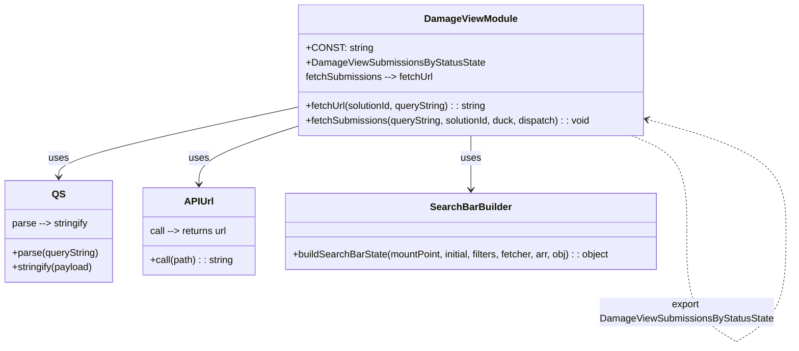

# Diagram: web/portal/src/pages/damageview/redux/DamageViewSubmissionsByStatusState.js


> Auto-generated by Obscura crawlers

## Diagram 1

```mermaid
flowchart LR
  subgraph Imports
    lodash["_ (lodash)"]
    apiUrl["apiUrl (api-url)"]
    qs["qs"]
    sbBuilder["buildSearchBarState (components/search-bar/SearchBarStateBuilder)"]
    filters["SubmissionsByStatusFilters"]
  end

  CONST[/"STORE_MOUNT_POINT = 'damageViewSubmissionsByStatus'/"]
  fetchUrlFunc["fetchUrl(solutionId, queryString)"]
  fetchSubmissionsFunc["fetchSubmissions(queryString = '', solutionId, duck, dispatch)"]
  buildState["buildSearchBarState(...)"]
  exportNode(["export default DamageViewSubmissionsByStatusState"])

  apiUrl --> fetchUrlFunc
  qs --> fetchUrlFunc
  fetchUrlFunc -->|returns URL string| fetchSubmissionsFunc
  filters --> buildState
  sbBuilder --> buildState
  CONST --> buildState
  fetchSubmissionsFunc --> buildState
  buildState --> exportNode
```

> SVG rendering failed for this diagram.

## Diagram 2



### SVG

<svg id="container" width="1313.2449951171875" xmlns="http://www.w3.org/2000/svg" class="classDiagram" height="572.1499633789062" viewBox="0 0 1313.2449951171875 572.1499633789062" role="graphics-document document" aria-roledescription="class"><style>#container{font-family:"trebuchet ms",verdana,arial,sans-serif;font-size:16px;fill:#333;}@keyframes edge-animation-frame{from{stroke-dashoffset:0;}}@keyframes dash{to{stroke-dashoffset:0;}}#container .edge-animation-slow{stroke-dasharray:9,5!important;stroke-dashoffset:900;animation:dash 50s linear infinite;stroke-linecap:round;}#container .edge-animation-fast{stroke-dasharray:9,5!important;stroke-dashoffset:900;animation:dash 20s linear infinite;stroke-linecap:round;}#container .error-icon{fill:#552222;}#container .error-text{fill:#552222;stroke:#552222;}#container .edge-thickness-normal{stroke-width:1px;}#container .edge-thickness-thick{stroke-width:3.5px;}#container .edge-pattern-solid{stroke-dasharray:0;}#container .edge-thickness-invisible{stroke-width:0;fill:none;}#container .edge-pattern-dashed{stroke-dasharray:3;}#container .edge-pattern-dotted{stroke-dasharray:2;}#container .marker{fill:#333333;stroke:#333333;}#container .marker.cross{stroke:#333333;}#container svg{font-family:"trebuchet ms",verdana,arial,sans-serif;font-size:16px;}#container p{margin:0;}#container g.classGroup text{fill:#9370DB;stroke:none;font-family:"trebuchet ms",verdana,arial,sans-serif;font-size:10px;}#container g.classGroup text .title{font-weight:bolder;}#container .nodeLabel,#container .edgeLabel{color:#131300;}#container .edgeLabel .label rect{fill:#ECECFF;}#container .label text{fill:#131300;}#container .labelBkg{background:#ECECFF;}#container .edgeLabel .label span{background:#ECECFF;}#container .classTitle{font-weight:bolder;}#container .node rect,#container .node circle,#container .node ellipse,#container .node polygon,#container .node path{fill:#ECECFF;stroke:#9370DB;stroke-width:1px;}#container .divider{stroke:#9370DB;stroke-width:1;}#container g.clickable{cursor:pointer;}#container g.classGroup rect{fill:#ECECFF;stroke:#9370DB;}#container g.classGroup line{stroke:#9370DB;stroke-width:1;}#container .classLabel .box{stroke:none;stroke-width:0;fill:#ECECFF;opacity:0.5;}#container .classLabel .label{fill:#9370DB;font-size:10px;}#container .relation{stroke:#333333;stroke-width:1;fill:none;}#container .dashed-line{stroke-dasharray:3;}#container .dotted-line{stroke-dasharray:1 2;}#container #compositionStart,#container .composition{fill:#333333!important;stroke:#333333!important;stroke-width:1;}#container #compositionEnd,#container .composition{fill:#333333!important;stroke:#333333!important;stroke-width:1;}#container #dependencyStart,#container .dependency{fill:#333333!important;stroke:#333333!important;stroke-width:1;}#container #dependencyStart,#container .dependency{fill:#333333!important;stroke:#333333!important;stroke-width:1;}#container #extensionStart,#container .extension{fill:transparent!important;stroke:#333333!important;stroke-width:1;}#container #extensionEnd,#container .extension{fill:transparent!important;stroke:#333333!important;stroke-width:1;}#container #aggregationStart,#container .aggregation{fill:transparent!important;stroke:#333333!important;stroke-width:1;}#container #aggregationEnd,#container .aggregation{fill:transparent!important;stroke:#333333!important;stroke-width:1;}#container #lollipopStart,#container .lollipop{fill:#ECECFF!important;stroke:#333333!important;stroke-width:1;}#container #lollipopEnd,#container .lollipop{fill:#ECECFF!important;stroke:#333333!important;stroke-width:1;}#container .edgeTerminals{font-size:11px;line-height:initial;}#container .classTitleText{text-anchor:middle;font-size:18px;fill:#333;}#container .label-icon{display:inline-block;height:1em;overflow:visible;vertical-align:-0.125em;}#container .node .label-icon path{fill:currentColor;stroke:revert;stroke-width:revert;}#container :root{--mermaid-font-family:"trebuchet ms",verdana,arial,sans-serif;}</style><g><defs><marker id="container_class-aggregationStart" class="marker aggregation class" refX="18" refY="7" markerWidth="190" markerHeight="240" orient="auto"><path d="M 18,7 L9,13 L1,7 L9,1 Z"></path></marker></defs><defs><marker id="container_class-aggregationEnd" class="marker aggregation class" refX="1" refY="7" markerWidth="20" markerHeight="28" orient="auto"><path d="M 18,7 L9,13 L1,7 L9,1 Z"></path></marker></defs><defs><marker id="container_class-extensionStart" class="marker extension class" refX="18" refY="7" markerWidth="190" markerHeight="240" orient="auto"><path d="M 1,7 L18,13 V 1 Z"></path></marker></defs><defs><marker id="container_class-extensionEnd" class="marker extension class" refX="1" refY="7" markerWidth="20" markerHeight="28" orient="auto"><path d="M 1,1 V 13 L18,7 Z"></path></marker></defs><defs><marker id="container_class-compositionStart" class="marker composition class" refX="18" refY="7" markerWidth="190" markerHeight="240" orient="auto"><path d="M 18,7 L9,13 L1,7 L9,1 Z"></path></marker></defs><defs><marker id="container_class-compositionEnd" class="marker composition class" refX="1" refY="7" markerWidth="20" markerHeight="28" orient="auto"><path d="M 18,7 L9,13 L1,7 L9,1 Z"></path></marker></defs><defs><marker id="container_class-dependencyStart" class="marker dependency class" refX="6" refY="7" markerWidth="190" markerHeight="240" orient="auto"><path d="M 5,7 L9,13 L1,7 L9,1 Z"></path></marker></defs><defs><marker id="container_class-dependencyEnd" class="marker dependency class" refX="13" refY="7" markerWidth="20" markerHeight="28" orient="auto"><path d="M 18,7 L9,13 L14,7 L9,1 Z"></path></marker></defs><defs><marker id="container_class-lollipopStart" class="marker lollipop class" refX="13" refY="7" markerWidth="190" markerHeight="240" orient="auto"><circle stroke="black" fill="transparent" cx="7" cy="7" r="6"></circle></marker></defs><defs><marker id="container_class-lollipopEnd" class="marker lollipop class" refX="1" refY="7" markerWidth="190" markerHeight="240" orient="auto"><circle stroke="black" fill="transparent" cx="7" cy="7" r="6"></circle></marker></defs><g class="root"><g class="clusters"></g><g class="edgePaths"><path d="M494.75,176.789L428.389,190.824C362.027,204.86,229.305,232.93,162.943,252.132C96.582,271.333,96.582,281.667,96.582,286.833L96.582,292" id="id_DamageViewModule_QS_1" class="edge-thickness-normal edge-pattern-solid relation" style=";;;" data-edge="true" data-et="edge" data-id="id_DamageViewModule_QS_1" data-points="W3sieCI6NDk0Ljc1LCJ5IjoxNzYuNzg5MjYyMjcyNjY1MTN9LHsieCI6OTYuNTgyMDMxMjUsInkiOjI2MX0seyJ4Ijo5Ni41ODIwMzEyNSwieSI6Mjk4fV0=" marker-end="url(#container_class-dependencyEnd)"></path><path d="M494.75,207.762L466.957,216.635C439.164,225.508,383.578,243.254,355.785,259.294C327.992,275.333,327.992,289.667,327.992,296.833L327.992,304" id="id_DamageViewModule_APIUrl_2" class="edge-thickness-normal edge-pattern-solid relation" style=";;;" data-edge="true" data-et="edge" data-id="id_DamageViewModule_APIUrl_2" data-points="W3sieCI6NDk0Ljc1LCJ5IjoyMDcuNzYxODc1Mjc0MTQ0MDJ9LHsieCI6MzI3Ljk5MjE4NzUsInkiOjI2MX0seyJ4IjozMjcuOTkyMTg3NSwieSI6MzEwfV0=" marker-end="url(#container_class-dependencyEnd)"></path><path d="M782.176,224L782.176,230.167C782.176,236.333,782.176,248.667,782.176,263.5C782.176,278.333,782.176,295.667,782.176,304.333L782.176,313" id="id_DamageViewModule_SearchBarBuilder_3" class="edge-thickness-normal edge-pattern-solid relation" style=";;;" data-edge="true" data-et="edge" data-id="id_DamageViewModule_SearchBarBuilder_3" data-points="W3sieCI6NzgyLjE3NTc4MTI1LCJ5IjoyMjR9LHsieCI6NzgyLjE3NTc4MTI1LCJ5IjoyNjF9LHsieCI6NzgyLjE3NTc4MTI1LCJ5IjozMTl9XQ==" marker-end="url(#container_class-dependencyEnd)"></path><path d="M1051.361,224L1066.731,230.167C1082.101,236.333,1112.841,248.667,1128.211,274.992C1143.581,301.317,1143.581,341.633,1143.581,361.792L1143.581,381.95" id="DamageViewModule-cyclic-special-1" class="edge-thickness-normal edge-pattern-dashed relation" style=";;;" data-edge="true" data-et="edge" data-id="DamageViewModule-cyclic-special-1" data-points="W3sieCI6MTA1MS4zNjA1NDQxODE1ODk0LCJ5IjoyMjR9LHsieCI6MTE0My41ODEyNTAwMDA3NDUsInkiOjI2MX0seyJ4IjoxMTQzLjU4MTI1MDAwMDc0NSwieSI6MzgxLjk0OTk5OTk5OTI1NDk0fV0="></path><path d="M1143.581,382.05L1143.581,404.208C1143.581,426.367,1143.581,470.683,1157.045,501.012C1170.509,531.34,1197.436,547.68,1210.9,555.85L1224.363,564.02" id="DamageViewModule-cyclic-special-mid" class="edge-thickness-normal edge-pattern-dashed relation" style=";;;" data-edge="true" data-et="edge" data-id="DamageViewModule-cyclic-special-mid" data-points="W3sieCI6MTE0My41ODEyNTAwMDA3NDUsInkiOjM4Mi4wNTAwMDAwMDA3NDUwNn0seyJ4IjoxMTQzLjU4MTI1MDAwMDc0NSwieSI6NTE1fSx7IngiOjEyMjQuMzYzMjgxMjUsInkiOjU2NC4wMTk2NTkzMDUzNzE1fV0="></path><path d="M1224.463,564.02L1237.927,555.85C1251.391,547.68,1278.318,531.34,1291.782,501.003C1305.245,470.667,1305.245,426.333,1305.245,384C1305.245,341.667,1305.245,301.333,1266.935,270.547C1228.625,239.76,1152.004,218.52,1113.694,207.9L1075.384,197.28" id="DamageViewModule-cyclic-special-2" class="edge-thickness-normal edge-pattern-dashed relation" style=";;;" data-edge="true" data-et="edge" data-id="DamageViewModule-cyclic-special-2" data-points="W3sieCI6MTIyNC40NjMyODEyNTE0OTAxLCJ5Ijo1NjQuMDE5NjU5MzA1MzcxNX0seyJ4IjoxMzA1LjI0NTMxMjUwMDc0NSwieSI6NTE1fSx7IngiOjEzMDUuMjQ1MzEyNTAwNzQ1LCJ5IjozODJ9LHsieCI6MTMwNS4yNDUzMTI1MDA3NDUsInkiOjI2MX0seyJ4IjoxMDY5LjYwMTU2MjUsInkiOjE5NS42NzcyNDMyNTU5NjY1Mn1d" marker-end="url(#container_class-dependencyEnd)"></path></g><g class="edgeLabels"><g class="edgeLabel" transform="translate(96.58203125, 261)"><g class="label" data-id="id_DamageViewModule_QS_1" transform="translate(-16.4921875, -12)"><foreignObject width="32.984375" height="24"><div xmlns="http://www.w3.org/1999/xhtml" class="labelBkg" style="display: table-cell; white-space: nowrap; line-height: 1.5; max-width: 200px; text-align: center;"><span class="edgeLabel"><p>uses</p></span></div></foreignObject></g></g><g class="edgeLabel" transform="translate(327.9921875, 261)"><g class="label" data-id="id_DamageViewModule_APIUrl_2" transform="translate(-16.4921875, -12)"><foreignObject width="32.984375" height="24"><div xmlns="http://www.w3.org/1999/xhtml" class="labelBkg" style="display: table-cell; white-space: nowrap; line-height: 1.5; max-width: 200px; text-align: center;"><span class="edgeLabel"><p>uses</p></span></div></foreignObject></g></g><g class="edgeLabel" transform="translate(782.17578125, 261)"><g class="label" data-id="id_DamageViewModule_SearchBarBuilder_3" transform="translate(-16.4921875, -12)"><foreignObject width="32.984375" height="24"><div xmlns="http://www.w3.org/1999/xhtml" class="labelBkg" style="display: table-cell; white-space: nowrap; line-height: 1.5; max-width: 200px; text-align: center;"><span class="edgeLabel"><p>uses</p></span></div></foreignObject></g></g><g class="edgeLabel"><g class="label" data-id="DamageViewModule-cyclic-special-1" transform="translate(0, 0)"><foreignObject width="0" height="0"><div xmlns="http://www.w3.org/1999/xhtml" class="labelBkg" style="display: table-cell; white-space: nowrap; line-height: 1.5; max-width: 200px; text-align: center;"><span class="edgeLabel"></span></div></foreignObject></g></g><g class="edgeLabel" transform="translate(1143.581250000745, 515)"><g class="label" data-id="DamageViewModule-cyclic-special-mid" transform="translate(-141.6640625, -24)"><foreignObject width="283.328125" height="48"><div xmlns="http://www.w3.org/1999/xhtml" class="labelBkg" style="display: table; white-space: break-spaces; line-height: 1.5; max-width: 200px; text-align: center; width: 200px;"><span class="edgeLabel"><p>export DamageViewSubmissionsByStatusState</p></span></div></foreignObject></g></g><g class="edgeLabel"><g class="label" data-id="DamageViewModule-cyclic-special-2" transform="translate(0, 0)"><foreignObject width="0" height="0"><div xmlns="http://www.w3.org/1999/xhtml" class="labelBkg" style="display: table-cell; white-space: nowrap; line-height: 1.5; max-width: 200px; text-align: center;"><span class="edgeLabel"></span></div></foreignObject></g></g></g><g class="nodes"><g class="node default" id="classId-DamageViewModule-0" transform="translate(782.17578125, 116)"><g class="basic label-container"><path d="M-287.42578125 -108 L287.42578125 -108 L287.42578125 108 L-287.42578125 108" stroke="none" stroke-width="0" fill="#ECECFF" style=""></path><path d="M-287.42578125 -108 C-134.16348186313928 -108, 19.098817523721436 -108, 287.42578125 -108 M-287.42578125 -108 C-157.85144592342303 -108, -28.277110596846057 -108, 287.42578125 -108 M287.42578125 -108 C287.42578125 -61.58369540143431, 287.42578125 -15.167390802868624, 287.42578125 108 M287.42578125 -108 C287.42578125 -56.024729817261694, 287.42578125 -4.049459634523387, 287.42578125 108 M287.42578125 108 C109.99135178420158 108, -67.44307768159683 108, -287.42578125 108 M287.42578125 108 C64.97258783834178 108, -157.48060557331644 108, -287.42578125 108 M-287.42578125 108 C-287.42578125 41.050348769887634, -287.42578125 -25.89930246022473, -287.42578125 -108 M-287.42578125 108 C-287.42578125 44.628304673642695, -287.42578125 -18.74339065271461, -287.42578125 -108" stroke="#9370DB" stroke-width="1.3" fill="none" stroke-dasharray="0 0" style=""></path></g><g class="annotation-group text" transform="translate(0, -84)"></g><g class="label-group text" transform="translate(-73.5390625, -84)"><g class="label" style="font-weight: bolder" transform="translate(0,-12)"><foreignObject width="147.078125" height="24"><div xmlns="http://www.w3.org/1999/xhtml" style="display: table-cell; white-space: nowrap; line-height: 1.5; max-width: 196px; text-align: center;"><span class="nodeLabel markdown-node-label" style=""><p>DamageViewModule</p></span></div></foreignObject></g></g><g class="members-group text" transform="translate(-275.42578125, -36)"><g class="label" style="" transform="translate(0,-12)"><foreignObject width="104.34375" height="24"><div xmlns="http://www.w3.org/1999/xhtml" style="display: table-cell; white-space: nowrap; line-height: 1.5; max-width: 162px; text-align: center;"><span class="nodeLabel markdown-node-label" style=""><p>+CONST: string</p></span></div></foreignObject></g><g class="label" style="" transform="translate(0,12)"><foreignObject width="291.328125" height="24"><div xmlns="http://www.w3.org/1999/xhtml" style="display: table-cell; white-space: nowrap; line-height: 1.5; max-width: 349px; text-align: center;"><span class="nodeLabel markdown-node-label" style=""><p>+DamageViewSubmissionsByStatusState</p></span></div></foreignObject></g><g class="label" style="" transform="translate(0,36)"><foreignObject width="215.046875" height="24"><div xmlns="http://www.w3.org/1999/xhtml" style="display: table-cell; white-space: nowrap; line-height: 1.5; max-width: 287px; text-align: center;"><span class="nodeLabel markdown-node-label" style=""><p>fetchSubmissions --&gt; fetchUrl</p></span></div></foreignObject></g></g><g class="methods-group text" transform="translate(-275.42578125, 60)"><g class="label" style="" transform="translate(0,-12)"><foreignObject width="304.8125" height="24"><div xmlns="http://www.w3.org/1999/xhtml" style="display: table-cell; white-space: nowrap; line-height: 1.5; max-width: 363px; text-align: center;"><span class="nodeLabel markdown-node-label" style=""><p>+fetchUrl(solutionId, queryString) : : string</p></span></div></foreignObject></g><g class="label" style="" transform="translate(0,12)"><foreignObject width="477.3125" height="24"><div xmlns="http://www.w3.org/1999/xhtml" style="display: table-cell; white-space: nowrap; line-height: 1.5; max-width: 535px; text-align: center;"><span class="nodeLabel markdown-node-label" style=""><p>+fetchSubmissions(queryString, solutionId, duck, dispatch) : : void</p></span></div></foreignObject></g></g><g class="divider" style=""><path d="M-287.42578125 -60 C-143.72579813659368 -60, -0.02581502318736284 -60, 287.42578125 -60 M-287.42578125 -60 C-162.414369818382 -60, -37.402958386764 -60, 287.42578125 -60" stroke="#9370DB" stroke-width="1.3" fill="none" stroke-dasharray="0 0" style=""></path></g><g class="divider" style=""><path d="M-287.42578125 36 C-64.92624451652634 36, 157.57329221694732 36, 287.42578125 36 M-287.42578125 36 C-68.40230236454624 36, 150.6211765209075 36, 287.42578125 36" stroke="#9370DB" stroke-width="1.3" fill="none" stroke-dasharray="0 0" style=""></path></g></g><g class="node default" id="classId-QS-1" transform="translate(96.58203125, 382)"><g class="basic label-container"><path d="M-88.58203125 -84 L88.58203125 -84 L88.58203125 84 L-88.58203125 84" stroke="none" stroke-width="0" fill="#ECECFF" style=""></path><path d="M-88.58203125 -84 C-43.52377157319408 -84, 1.5344881036118352 -84, 88.58203125 -84 M-88.58203125 -84 C-36.48903597191938 -84, 15.603959306161244 -84, 88.58203125 -84 M88.58203125 -84 C88.58203125 -33.642752192295035, 88.58203125 16.71449561540993, 88.58203125 84 M88.58203125 -84 C88.58203125 -40.64506303385549, 88.58203125 2.709873932289014, 88.58203125 84 M88.58203125 84 C39.57684922056642 84, -9.428332808867154 84, -88.58203125 84 M88.58203125 84 C35.34703028648637 84, -17.887970677027255 84, -88.58203125 84 M-88.58203125 84 C-88.58203125 35.79655068791327, -88.58203125 -12.406898624173465, -88.58203125 -84 M-88.58203125 84 C-88.58203125 37.27062177201522, -88.58203125 -9.458756455969564, -88.58203125 -84" stroke="#9370DB" stroke-width="1.3" fill="none" stroke-dasharray="0 0" style=""></path></g><g class="annotation-group text" transform="translate(0, -60)"></g><g class="label-group text" transform="translate(-10.1015625, -60)"><g class="label" style="font-weight: bolder" transform="translate(0,-12)"><foreignObject width="20.203125" height="24"><div xmlns="http://www.w3.org/1999/xhtml" style="display: table-cell; white-space: nowrap; line-height: 1.5; max-width: 70px; text-align: center;"><span class="nodeLabel markdown-node-label" style=""><p>QS</p></span></div></foreignObject></g></g><g class="members-group text" transform="translate(-76.58203125, -12)"><g class="label" style="" transform="translate(0,-12)"><foreignObject width="128.9375" height="24"><div xmlns="http://www.w3.org/1999/xhtml" style="display: table-cell; white-space: nowrap; line-height: 1.5; max-width: 200px; text-align: center;"><span class="nodeLabel markdown-node-label" style=""><p>parse --&gt; stringify</p></span></div></foreignObject></g></g><g class="methods-group text" transform="translate(-76.58203125, 36)"><g class="label" style="" transform="translate(0,-12)"><foreignObject width="143.0625" height="24"><div xmlns="http://www.w3.org/1999/xhtml" style="display: table-cell; white-space: nowrap; line-height: 1.5; max-width: 200px; text-align: center;"><span class="nodeLabel markdown-node-label" style=""><p>+parse(queryString)</p></span></div></foreignObject></g><g class="label" style="" transform="translate(0,12)"><foreignObject width="135.484375" height="24"><div xmlns="http://www.w3.org/1999/xhtml" style="display: table-cell; white-space: nowrap; line-height: 1.5; max-width: 193px; text-align: center;"><span class="nodeLabel markdown-node-label" style=""><p>+stringify(payload)</p></span></div></foreignObject></g></g><g class="divider" style=""><path d="M-88.58203125 -36 C-25.793005218643998 -36, 36.996020812712004 -36, 88.58203125 -36 M-88.58203125 -36 C-45.054385608634504 -36, -1.526739967269009 -36, 88.58203125 -36" stroke="#9370DB" stroke-width="1.3" fill="none" stroke-dasharray="0 0" style=""></path></g><g class="divider" style=""><path d="M-88.58203125 12 C-39.92352738563866 12, 8.734976478722686 12, 88.58203125 12 M-88.58203125 12 C-51.97697361596584 12, -15.371915981931679 12, 88.58203125 12" stroke="#9370DB" stroke-width="1.3" fill="none" stroke-dasharray="0 0" style=""></path></g></g><g class="node default" id="classId-APIUrl-2" transform="translate(327.9921875, 382)"><g class="basic label-container"><path d="M-92.828125 -72 L92.828125 -72 L92.828125 72 L-92.828125 72" stroke="none" stroke-width="0" fill="#ECECFF" style=""></path><path d="M-92.828125 -72 C-54.879321977806995 -72, -16.93051895561399 -72, 92.828125 -72 M-92.828125 -72 C-41.5561957752012 -72, 9.715733449597593 -72, 92.828125 -72 M92.828125 -72 C92.828125 -19.965745554477273, 92.828125 32.068508891045454, 92.828125 72 M92.828125 -72 C92.828125 -26.627097728547696, 92.828125 18.745804542904608, 92.828125 72 M92.828125 72 C35.74532058364857 72, -21.33748383270286 72, -92.828125 72 M92.828125 72 C24.333286563962872 72, -44.161551872074256 72, -92.828125 72 M-92.828125 72 C-92.828125 32.68363287302878, -92.828125 -6.632734253942445, -92.828125 -72 M-92.828125 72 C-92.828125 26.320628439405688, -92.828125 -19.358743121188624, -92.828125 -72" stroke="#9370DB" stroke-width="1.3" fill="none" stroke-dasharray="0 0" style=""></path></g><g class="annotation-group text" transform="translate(0, -48)"></g><g class="label-group text" transform="translate(-22.65625, -48)"><g class="label" style="font-weight: bolder" transform="translate(0,-12)"><foreignObject width="45.3125" height="24"><div xmlns="http://www.w3.org/1999/xhtml" style="display: table-cell; white-space: nowrap; line-height: 1.5; max-width: 95px; text-align: center;"><span class="nodeLabel markdown-node-label" style=""><p>APIUrl</p></span></div></foreignObject></g></g><g class="members-group text" transform="translate(-80.828125, 0)"><g class="label" style="" transform="translate(0,-12)"><foreignObject width="131.734375" height="24"><div xmlns="http://www.w3.org/1999/xhtml" style="display: table-cell; white-space: nowrap; line-height: 1.5; max-width: 203px; text-align: center;"><span class="nodeLabel markdown-node-label" style=""><p>call --&gt; returns url</p></span></div></foreignObject></g></g><g class="methods-group text" transform="translate(-80.828125, 48)"><g class="label" style="" transform="translate(0,-12)"><foreignObject width="139" height="24"><div xmlns="http://www.w3.org/1999/xhtml" style="display: table-cell; white-space: nowrap; line-height: 1.5; max-width: 197px; text-align: center;"><span class="nodeLabel markdown-node-label" style=""><p>+call(path) : : string</p></span></div></foreignObject></g></g><g class="divider" style=""><path d="M-92.828125 -24 C-55.35960806638588 -24, -17.891091132771763 -24, 92.828125 -24 M-92.828125 -24 C-28.848856506196242 -24, 35.130411987607516 -24, 92.828125 -24" stroke="#9370DB" stroke-width="1.3" fill="none" stroke-dasharray="0 0" style=""></path></g><g class="divider" style=""><path d="M-92.828125 24 C-46.37580362723711 24, 0.07651774552577706 24, 92.828125 24 M-92.828125 24 C-20.599758086315987 24, 51.628608827368026 24, 92.828125 24" stroke="#9370DB" stroke-width="1.3" fill="none" stroke-dasharray="0 0" style=""></path></g></g><g class="node default" id="classId-SearchBarBuilder-3" transform="translate(782.17578125, 382)"><g class="basic label-container"><path d="M-311.35546875 -63 L311.35546875 -63 L311.35546875 63 L-311.35546875 63" stroke="none" stroke-width="0" fill="#ECECFF" style=""></path><path d="M-311.35546875 -63 C-126.78476260956182 -63, 57.78594353087635 -63, 311.35546875 -63 M-311.35546875 -63 C-153.19863211438587 -63, 4.958204521228254 -63, 311.35546875 -63 M311.35546875 -63 C311.35546875 -21.823371287174908, 311.35546875 19.353257425650185, 311.35546875 63 M311.35546875 -63 C311.35546875 -23.026043206255977, 311.35546875 16.947913587488046, 311.35546875 63 M311.35546875 63 C79.35235906549306 63, -152.65075061901388 63, -311.35546875 63 M311.35546875 63 C131.09379532087678 63, -49.16787810824644 63, -311.35546875 63 M-311.35546875 63 C-311.35546875 12.649449571645782, -311.35546875 -37.701100856708436, -311.35546875 -63 M-311.35546875 63 C-311.35546875 14.225257074857197, -311.35546875 -34.549485850285606, -311.35546875 -63" stroke="#9370DB" stroke-width="1.3" fill="none" stroke-dasharray="0 0" style=""></path></g><g class="annotation-group text" transform="translate(0, -39)"></g><g class="label-group text" transform="translate(-63.7734375, -39)"><g class="label" style="font-weight: bolder" transform="translate(0,-12)"><foreignObject width="127.546875" height="24"><div xmlns="http://www.w3.org/1999/xhtml" style="display: table-cell; white-space: nowrap; line-height: 1.5; max-width: 177px; text-align: center;"><span class="nodeLabel markdown-node-label" style=""><p>SearchBarBuilder</p></span></div></foreignObject></g></g><g class="members-group text" transform="translate(-299.35546875, 9)"></g><g class="methods-group text" transform="translate(-299.35546875, 39)"><g class="label" style="" transform="translate(0,-12)"><foreignObject width="534.9375" height="24"><div xmlns="http://www.w3.org/1999/xhtml" style="display: table-cell; white-space: nowrap; line-height: 1.5; max-width: 593px; text-align: center;"><span class="nodeLabel markdown-node-label" style=""><p>+buildSearchBarState(mountPoint, initial, filters, fetcher, arr, obj) : : object</p></span></div></foreignObject></g></g><g class="divider" style=""><path d="M-311.35546875 -15 C-100.60284922417335 -15, 110.14977030165329 -15, 311.35546875 -15 M-311.35546875 -15 C-141.827109607712 -15, 27.701249534575993 -15, 311.35546875 -15" stroke="#9370DB" stroke-width="1.3" fill="none" stroke-dasharray="0 0" style=""></path></g><g class="divider" style=""><path d="M-311.35546875 9 C-84.8462868699691 9, 141.6628950100618 9, 311.35546875 9 M-311.35546875 9 C-84.63027308938382 9, 142.09492257123236 9, 311.35546875 9" stroke="#9370DB" stroke-width="1.3" fill="none" stroke-dasharray="0 0" style=""></path></g></g><g class="label edgeLabel" id="DamageViewModule---DamageViewModule---1" transform="translate(1143.581250000745, 382)"><rect width="0.1" height="0.1"></rect><g class="label" style="" transform="translate(0, 0)"><rect></rect><foreignObject width="0" height="0"><div xmlns="http://www.w3.org/1999/xhtml" style="display: table-cell; white-space: nowrap; line-height: 1.5; max-width: 10px; text-align: center;"><span class="nodeLabel"></span></div></foreignObject></g></g><g class="label edgeLabel" id="DamageViewModule---DamageViewModule---2" transform="translate(1224.413281250745, 564.0500000007451)"><rect width="0.1" height="0.1"></rect><g class="label" style="" transform="translate(0, 0)"><rect></rect><foreignObject width="0" height="0"><div xmlns="http://www.w3.org/1999/xhtml" style="display: table-cell; white-space: nowrap; line-height: 1.5; max-width: 10px; text-align: center;"><span class="nodeLabel"></span></div></foreignObject></g></g></g></g></g></svg>
