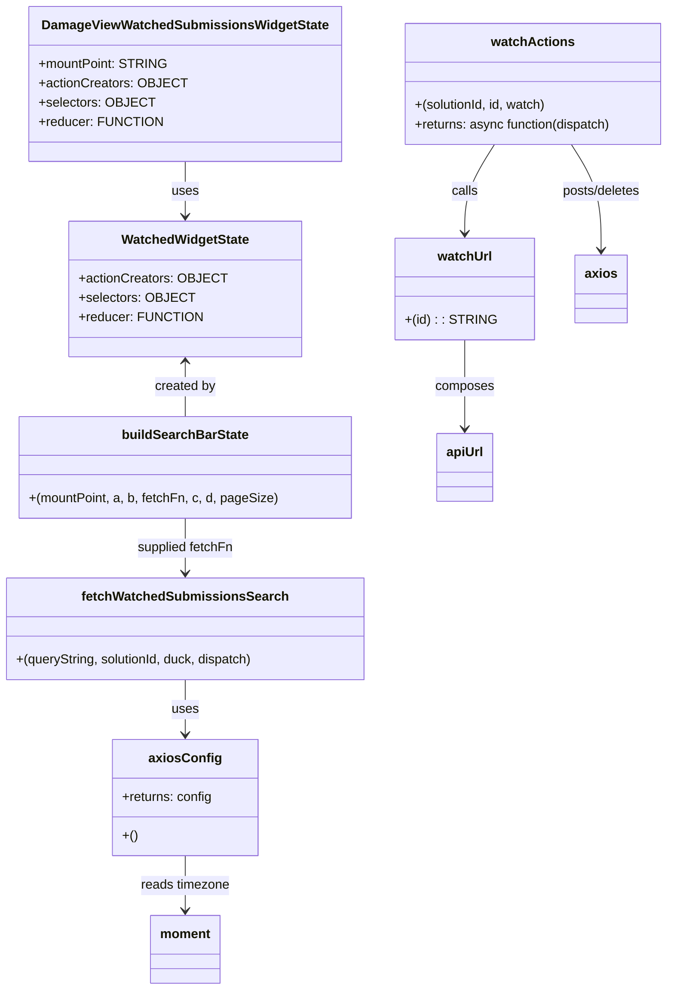

# Diagram: web/portal/src/pages/damageview/redux/DamageViewWatchedSubmissionState.js


> Auto-generated by Obscura crawlers

## Diagram 1



### SVG

<svg id="container" width="817.3046875" xmlns="http://www.w3.org/2000/svg" class="classDiagram" height="1226" viewBox="0 0 817.3046875 1226" role="graphics-document document" aria-roledescription="class"><style>#container{font-family:"trebuchet ms",verdana,arial,sans-serif;font-size:16px;fill:#333;}@keyframes edge-animation-frame{from{stroke-dashoffset:0;}}@keyframes dash{to{stroke-dashoffset:0;}}#container .edge-animation-slow{stroke-dasharray:9,5!important;stroke-dashoffset:900;animation:dash 50s linear infinite;stroke-linecap:round;}#container .edge-animation-fast{stroke-dasharray:9,5!important;stroke-dashoffset:900;animation:dash 20s linear infinite;stroke-linecap:round;}#container .error-icon{fill:#552222;}#container .error-text{fill:#552222;stroke:#552222;}#container .edge-thickness-normal{stroke-width:1px;}#container .edge-thickness-thick{stroke-width:3.5px;}#container .edge-pattern-solid{stroke-dasharray:0;}#container .edge-thickness-invisible{stroke-width:0;fill:none;}#container .edge-pattern-dashed{stroke-dasharray:3;}#container .edge-pattern-dotted{stroke-dasharray:2;}#container .marker{fill:#333333;stroke:#333333;}#container .marker.cross{stroke:#333333;}#container svg{font-family:"trebuchet ms",verdana,arial,sans-serif;font-size:16px;}#container p{margin:0;}#container g.classGroup text{fill:#9370DB;stroke:none;font-family:"trebuchet ms",verdana,arial,sans-serif;font-size:10px;}#container g.classGroup text .title{font-weight:bolder;}#container .nodeLabel,#container .edgeLabel{color:#131300;}#container .edgeLabel .label rect{fill:#ECECFF;}#container .label text{fill:#131300;}#container .labelBkg{background:#ECECFF;}#container .edgeLabel .label span{background:#ECECFF;}#container .classTitle{font-weight:bolder;}#container .node rect,#container .node circle,#container .node ellipse,#container .node polygon,#container .node path{fill:#ECECFF;stroke:#9370DB;stroke-width:1px;}#container .divider{stroke:#9370DB;stroke-width:1;}#container g.clickable{cursor:pointer;}#container g.classGroup rect{fill:#ECECFF;stroke:#9370DB;}#container g.classGroup line{stroke:#9370DB;stroke-width:1;}#container .classLabel .box{stroke:none;stroke-width:0;fill:#ECECFF;opacity:0.5;}#container .classLabel .label{fill:#9370DB;font-size:10px;}#container .relation{stroke:#333333;stroke-width:1;fill:none;}#container .dashed-line{stroke-dasharray:3;}#container .dotted-line{stroke-dasharray:1 2;}#container #compositionStart,#container .composition{fill:#333333!important;stroke:#333333!important;stroke-width:1;}#container #compositionEnd,#container .composition{fill:#333333!important;stroke:#333333!important;stroke-width:1;}#container #dependencyStart,#container .dependency{fill:#333333!important;stroke:#333333!important;stroke-width:1;}#container #dependencyStart,#container .dependency{fill:#333333!important;stroke:#333333!important;stroke-width:1;}#container #extensionStart,#container .extension{fill:transparent!important;stroke:#333333!important;stroke-width:1;}#container #extensionEnd,#container .extension{fill:transparent!important;stroke:#333333!important;stroke-width:1;}#container #aggregationStart,#container .aggregation{fill:transparent!important;stroke:#333333!important;stroke-width:1;}#container #aggregationEnd,#container .aggregation{fill:transparent!important;stroke:#333333!important;stroke-width:1;}#container #lollipopStart,#container .lollipop{fill:#ECECFF!important;stroke:#333333!important;stroke-width:1;}#container #lollipopEnd,#container .lollipop{fill:#ECECFF!important;stroke:#333333!important;stroke-width:1;}#container .edgeTerminals{font-size:11px;line-height:initial;}#container .classTitleText{text-anchor:middle;font-size:18px;fill:#333;}#container .label-icon{display:inline-block;height:1em;overflow:visible;vertical-align:-0.125em;}#container .node .label-icon path{fill:currentColor;stroke:revert;stroke-width:revert;}#container :root{--mermaid-font-family:"trebuchet ms",verdana,arial,sans-serif;}</style><g><defs><marker id="container_class-aggregationStart" class="marker aggregation class" refX="18" refY="7" markerWidth="190" markerHeight="240" orient="auto"><path d="M 18,7 L9,13 L1,7 L9,1 Z"></path></marker></defs><defs><marker id="container_class-aggregationEnd" class="marker aggregation class" refX="1" refY="7" markerWidth="20" markerHeight="28" orient="auto"><path d="M 18,7 L9,13 L1,7 L9,1 Z"></path></marker></defs><defs><marker id="container_class-extensionStart" class="marker extension class" refX="18" refY="7" markerWidth="190" markerHeight="240" orient="auto"><path d="M 1,7 L18,13 V 1 Z"></path></marker></defs><defs><marker id="container_class-extensionEnd" class="marker extension class" refX="1" refY="7" markerWidth="20" markerHeight="28" orient="auto"><path d="M 1,1 V 13 L18,7 Z"></path></marker></defs><defs><marker id="container_class-compositionStart" class="marker composition class" refX="18" refY="7" markerWidth="190" markerHeight="240" orient="auto"><path d="M 18,7 L9,13 L1,7 L9,1 Z"></path></marker></defs><defs><marker id="container_class-compositionEnd" class="marker composition class" refX="1" refY="7" markerWidth="20" markerHeight="28" orient="auto"><path d="M 18,7 L9,13 L1,7 L9,1 Z"></path></marker></defs><defs><marker id="container_class-dependencyStart" class="marker dependency class" refX="6" refY="7" markerWidth="190" markerHeight="240" orient="auto"><path d="M 5,7 L9,13 L1,7 L9,1 Z"></path></marker></defs><defs><marker id="container_class-dependencyEnd" class="marker dependency class" refX="13" refY="7" markerWidth="20" markerHeight="28" orient="auto"><path d="M 18,7 L9,13 L14,7 L9,1 Z"></path></marker></defs><defs><marker id="container_class-lollipopStart" class="marker lollipop class" refX="13" refY="7" markerWidth="190" markerHeight="240" orient="auto"><circle stroke="black" fill="transparent" cx="7" cy="7" r="6"></circle></marker></defs><defs><marker id="container_class-lollipopEnd" class="marker lollipop class" refX="1" refY="7" markerWidth="190" markerHeight="240" orient="auto"><circle stroke="black" fill="transparent" cx="7" cy="7" r="6"></circle></marker></defs><g class="root"><g class="clusters"></g><g class="edgePaths"><path d="M229.516,200L229.516,206.167C229.516,212.333,229.516,224.667,229.516,236C229.516,247.333,229.516,257.667,229.516,262.833L229.516,268" id="id_DamageViewWatchedSubmissionsWidgetState_WatchedWidgetState_1" class="edge-thickness-normal edge-pattern-solid relation" style=";;;" data-edge="true" data-et="edge" data-id="id_DamageViewWatchedSubmissionsWidgetState_WatchedWidgetState_1" data-points="W3sieCI6MjI5LjUxNTYyNSwieSI6MjAwfSx7IngiOjIyOS41MTU2MjUsInkiOjIzN30seyJ4IjoyMjkuNTE1NjI1LCJ5IjoyNzR9XQ==" marker-end="url(#container_class-dependencyEnd)"></path><path d="M229.516,448L229.516,453.167C229.516,458.333,229.516,468.667,229.516,480C229.516,491.333,229.516,503.667,229.516,509.833L229.516,516" id="id_WatchedWidgetState_buildSearchBarState_2" class="edge-thickness-normal edge-pattern-solid relation" style=";;;" data-edge="true" data-et="edge" data-id="id_WatchedWidgetState_buildSearchBarState_2" data-points="W3sieCI6MjI5LjUxNTYyNSwieSI6NDQyfSx7IngiOjIyOS41MTU2MjUsInkiOjQ3OX0seyJ4IjoyMjkuNTE1NjI1LCJ5Ijo1MTZ9XQ==" marker-start="url(#container_class-dependencyStart)"></path><path d="M603.926,179L598.041,188.667C592.155,198.333,580.384,217.667,574.499,236C568.613,254.333,568.613,271.667,568.613,280.333L568.613,289" id="id_watchActions_watchUrl_3" class="edge-thickness-normal edge-pattern-solid relation" style=";;;" data-edge="true" data-et="edge" data-id="id_watchActions_watchUrl_3" data-points="W3sieCI6NjAzLjkyNjM2ODY1NjAxNSwieSI6MTc5fSx7IngiOjU2OC42MTMyODEyNSwieSI6MjM3fSx7IngiOjU2OC42MTMyODEyNSwieSI6Mjk1fV0=" marker-end="url(#container_class-dependencyEnd)"></path><path d="M695.253,179L701.139,188.667C707.024,198.333,718.795,217.667,724.681,239.5C730.566,261.333,730.566,285.667,730.566,297.833L730.566,310" id="id_watchActions_axios_4" class="edge-thickness-normal edge-pattern-solid relation" style=";;;" data-edge="true" data-et="edge" data-id="id_watchActions_axios_4" data-points="W3sieCI6Njk1LjI1MzMxODg0Mzk4NSwieSI6MTc5fSx7IngiOjczMC41NjY0MDYyNSwieSI6MjM3fSx7IngiOjczMC41NjY0MDYyNSwieSI6MzE2fV0=" marker-end="url(#container_class-dependencyEnd)"></path><path d="M229.516,842L229.516,848.167C229.516,854.333,229.516,866.667,229.516,878C229.516,889.333,229.516,899.667,229.516,904.833L229.516,910" id="id_fetchWatchedSubmissionsSearch_axiosConfig_5" class="edge-thickness-normal edge-pattern-solid relation" style=";;;" data-edge="true" data-et="edge" data-id="id_fetchWatchedSubmissionsSearch_axiosConfig_5" data-points="W3sieCI6MjI5LjUxNTYyNSwieSI6ODQyfSx7IngiOjIyOS41MTU2MjUsInkiOjg3OX0seyJ4IjoyMjkuNTE1NjI1LCJ5Ijo5MTZ9XQ==" marker-end="url(#container_class-dependencyEnd)"></path><path d="M229.516,1060L229.516,1066.167C229.516,1072.333,229.516,1084.667,229.516,1096C229.516,1107.333,229.516,1117.667,229.516,1122.833L229.516,1128" id="id_axiosConfig_moment_6" class="edge-thickness-normal edge-pattern-solid relation" style=";;;" data-edge="true" data-et="edge" data-id="id_axiosConfig_moment_6" data-points="W3sieCI6MjI5LjUxNTYyNSwieSI6MTA2MH0seyJ4IjoyMjkuNTE1NjI1LCJ5IjoxMDk3fSx7IngiOjIyOS41MTU2MjUsInkiOjExMzR9XQ==" marker-end="url(#container_class-dependencyEnd)"></path><path d="M568.613,421L568.613,430.667C568.613,440.333,568.613,459.667,568.613,478C568.613,496.333,568.613,513.667,568.613,522.333L568.613,531" id="id_watchUrl_apiUrl_7" class="edge-thickness-normal edge-pattern-solid relation" style=";;;" data-edge="true" data-et="edge" data-id="id_watchUrl_apiUrl_7" data-points="W3sieCI6NTY4LjYxMzI4MTI1LCJ5Ijo0MjF9LHsieCI6NTY4LjYxMzI4MTI1LCJ5Ijo0Nzl9LHsieCI6NTY4LjYxMzI4MTI1LCJ5Ijo1Mzd9XQ==" marker-end="url(#container_class-dependencyEnd)"></path><path d="M229.516,642L229.516,648.167C229.516,654.333,229.516,666.667,229.516,678C229.516,689.333,229.516,699.667,229.516,704.833L229.516,710" id="id_buildSearchBarState_fetchWatchedSubmissionsSearch_8" class="edge-thickness-normal edge-pattern-solid relation" style=";;;" data-edge="true" data-et="edge" data-id="id_buildSearchBarState_fetchWatchedSubmissionsSearch_8" data-points="W3sieCI6MjI5LjUxNTYyNSwieSI6NjQyfSx7IngiOjIyOS41MTU2MjUsInkiOjY3OX0seyJ4IjoyMjkuNTE1NjI1LCJ5Ijo3MTZ9XQ==" marker-end="url(#container_class-dependencyEnd)"></path></g><g class="edgeLabels"><g class="edgeLabel" transform="translate(229.515625, 237)"><g class="label" data-id="id_DamageViewWatchedSubmissionsWidgetState_WatchedWidgetState_1" transform="translate(-16.4921875, -12)"><foreignObject width="32.984375" height="24"><div xmlns="http://www.w3.org/1999/xhtml" class="labelBkg" style="display: table-cell; white-space: nowrap; line-height: 1.5; max-width: 200px; text-align: center;"><span class="edgeLabel"><p>uses</p></span></div></foreignObject></g></g><g class="edgeLabel" transform="translate(229.515625, 479)"><g class="label" data-id="id_WatchedWidgetState_buildSearchBarState_2" transform="translate(-37.9921875, -12)"><foreignObject width="75.984375" height="24"><div xmlns="http://www.w3.org/1999/xhtml" class="labelBkg" style="display: table-cell; white-space: nowrap; line-height: 1.5; max-width: 200px; text-align: center;"><span class="edgeLabel"><p>created by</p></span></div></foreignObject></g></g><g class="edgeLabel" transform="translate(568.61328125, 237)"><g class="label" data-id="id_watchActions_watchUrl_3" transform="translate(-16.4453125, -12)"><foreignObject width="32.890625" height="24"><div xmlns="http://www.w3.org/1999/xhtml" class="labelBkg" style="display: table-cell; white-space: nowrap; line-height: 1.5; max-width: 200px; text-align: center;"><span class="edgeLabel"><p>calls</p></span></div></foreignObject></g></g><g class="edgeLabel" transform="translate(730.56640625, 237)"><g class="label" data-id="id_watchActions_axios_4" transform="translate(-50.21875, -12)"><foreignObject width="100.4375" height="24"><div xmlns="http://www.w3.org/1999/xhtml" class="labelBkg" style="display: table-cell; white-space: nowrap; line-height: 1.5; max-width: 200px; text-align: center;"><span class="edgeLabel"><p>posts/deletes</p></span></div></foreignObject></g></g><g class="edgeLabel" transform="translate(229.515625, 879)"><g class="label" data-id="id_fetchWatchedSubmissionsSearch_axiosConfig_5" transform="translate(-16.4921875, -12)"><foreignObject width="32.984375" height="24"><div xmlns="http://www.w3.org/1999/xhtml" class="labelBkg" style="display: table-cell; white-space: nowrap; line-height: 1.5; max-width: 200px; text-align: center;"><span class="edgeLabel"><p>uses</p></span></div></foreignObject></g></g><g class="edgeLabel" transform="translate(229.515625, 1097)"><g class="label" data-id="id_axiosConfig_moment_6" transform="translate(-55.5859375, -12)"><foreignObject width="111.171875" height="24"><div xmlns="http://www.w3.org/1999/xhtml" class="labelBkg" style="display: table-cell; white-space: nowrap; line-height: 1.5; max-width: 200px; text-align: center;"><span class="edgeLabel"><p>reads timezone</p></span></div></foreignObject></g></g><g class="edgeLabel" transform="translate(568.61328125, 479)"><g class="label" data-id="id_watchUrl_apiUrl_7" transform="translate(-36.453125, -12)"><foreignObject width="72.90625" height="24"><div xmlns="http://www.w3.org/1999/xhtml" class="labelBkg" style="display: table-cell; white-space: nowrap; line-height: 1.5; max-width: 200px; text-align: center;"><span class="edgeLabel"><p>composes</p></span></div></foreignObject></g></g><g class="edgeLabel" transform="translate(229.515625, 679)"><g class="label" data-id="id_buildSearchBarState_fetchWatchedSubmissionsSearch_8" transform="translate(-60.34375, -12)"><foreignObject width="120.6875" height="24"><div xmlns="http://www.w3.org/1999/xhtml" class="labelBkg" style="display: table-cell; white-space: nowrap; line-height: 1.5; max-width: 200px; text-align: center;"><span class="edgeLabel"><p>supplied fetchFn</p></span></div></foreignObject></g></g></g><g class="nodes"><g class="node default" id="classId-DamageViewWatchedSubmissionsWidgetState-0" transform="translate(229.515625, 104)"><g class="basic label-container"><path d="M-182.45703125 -96 L182.45703125 -96 L182.45703125 96 L-182.45703125 96" stroke="none" stroke-width="0" fill="#ECECFF" style=""></path><path d="M-182.45703125 -96 C-42.05460946388553 -96, 98.34781232222895 -96, 182.45703125 -96 M-182.45703125 -96 C-66.04059856145217 -96, 50.37583412709566 -96, 182.45703125 -96 M182.45703125 -96 C182.45703125 -36.69619204462553, 182.45703125 22.607615910748933, 182.45703125 96 M182.45703125 -96 C182.45703125 -31.968413271347174, 182.45703125 32.06317345730565, 182.45703125 96 M182.45703125 96 C59.73713036233835 96, -62.9827705253233 96, -182.45703125 96 M182.45703125 96 C90.32444611420276 96, -1.808139021594485 96, -182.45703125 96 M-182.45703125 96 C-182.45703125 27.53633967951771, -182.45703125 -40.92732064096458, -182.45703125 -96 M-182.45703125 96 C-182.45703125 57.240287096994514, -182.45703125 18.48057419398903, -182.45703125 -96" stroke="#9370DB" stroke-width="1.3" fill="none" stroke-dasharray="0 0" style=""></path></g><g class="annotation-group text" transform="translate(0, -72)"></g><g class="label-group text" transform="translate(-168.8828125, -72)"><g class="label" style="font-weight: bolder" transform="translate(0,-12)"><foreignObject width="337.765625" height="24"><div xmlns="http://www.w3.org/1999/xhtml" style="display: table-cell; white-space: nowrap; line-height: 1.5; max-width: 382px; text-align: center;"><span class="nodeLabel markdown-node-label" style=""><p>DamageViewWatchedSubmissionsWidgetState</p></span></div></foreignObject></g></g><g class="members-group text" transform="translate(-170.45703125, -24)"><g class="label" style="" transform="translate(0,-12)"><foreignObject width="153.546875" height="24"><div xmlns="http://www.w3.org/1999/xhtml" style="display: table-cell; white-space: nowrap; line-height: 1.5; max-width: 211px; text-align: center;"><span class="nodeLabel markdown-node-label" style=""><p>+mountPoint: STRING</p></span></div></foreignObject></g><g class="label" style="" transform="translate(0,12)"><foreignObject width="172.03125" height="24"><div xmlns="http://www.w3.org/1999/xhtml" style="display: table-cell; white-space: nowrap; line-height: 1.5; max-width: 230px; text-align: center;"><span class="nodeLabel markdown-node-label" style=""><p>+actionCreators: OBJECT</p></span></div></foreignObject></g><g class="label" style="" transform="translate(0,36)"><foreignObject width="132.390625" height="24"><div xmlns="http://www.w3.org/1999/xhtml" style="display: table-cell; white-space: nowrap; line-height: 1.5; max-width: 190px; text-align: center;"><span class="nodeLabel markdown-node-label" style=""><p>+selectors: OBJECT</p></span></div></foreignObject></g><g class="label" style="" transform="translate(0,60)"><foreignObject width="144.921875" height="24"><div xmlns="http://www.w3.org/1999/xhtml" style="display: table-cell; white-space: nowrap; line-height: 1.5; max-width: 202px; text-align: center;"><span class="nodeLabel markdown-node-label" style=""><p>+reducer: FUNCTION</p></span></div></foreignObject></g></g><g class="methods-group text" transform="translate(-170.45703125, 96)"></g><g class="divider" style=""><path d="M-182.45703125 -48 C-58.60141308026961 -48, 65.25420508946078 -48, 182.45703125 -48 M-182.45703125 -48 C-105.3517736422352 -48, -28.246516034470403 -48, 182.45703125 -48" stroke="#9370DB" stroke-width="1.3" fill="none" stroke-dasharray="0 0" style=""></path></g><g class="divider" style=""><path d="M-182.45703125 72 C-49.87475588964952 72, 82.70751947070096 72, 182.45703125 72 M-182.45703125 72 C-68.43616915101076 72, 45.58469294797848 72, 182.45703125 72" stroke="#9370DB" stroke-width="1.3" fill="none" stroke-dasharray="0 0" style=""></path></g></g><g class="node default" id="classId-WatchedWidgetState-1" transform="translate(229.515625, 358)"><g class="basic label-container"><path d="M-136.22265625 -84 L136.22265625 -84 L136.22265625 84 L-136.22265625 84" stroke="none" stroke-width="0" fill="#ECECFF" style=""></path><path d="M-136.22265625 -84 C-56.088651562161914 -84, 24.045353125676172 -84, 136.22265625 -84 M-136.22265625 -84 C-62.316094081222914 -84, 11.590468087554171 -84, 136.22265625 -84 M136.22265625 -84 C136.22265625 -24.42105128585721, 136.22265625 35.15789742828558, 136.22265625 84 M136.22265625 -84 C136.22265625 -45.511569997622644, 136.22265625 -7.0231399952452875, 136.22265625 84 M136.22265625 84 C73.2438743277503 84, 10.26509240550061 84, -136.22265625 84 M136.22265625 84 C58.70145352400124 84, -18.819749201997524 84, -136.22265625 84 M-136.22265625 84 C-136.22265625 23.59015752979098, -136.22265625 -36.81968494041804, -136.22265625 -84 M-136.22265625 84 C-136.22265625 27.926388909857053, -136.22265625 -28.147222180285894, -136.22265625 -84" stroke="#9370DB" stroke-width="1.3" fill="none" stroke-dasharray="0 0" style=""></path></g><g class="annotation-group text" transform="translate(0, -60)"></g><g class="label-group text" transform="translate(-76.4140625, -60)"><g class="label" style="font-weight: bolder" transform="translate(0,-12)"><foreignObject width="152.828125" height="24"><div xmlns="http://www.w3.org/1999/xhtml" style="display: table-cell; white-space: nowrap; line-height: 1.5; max-width: 200px; text-align: center;"><span class="nodeLabel markdown-node-label" style=""><p>WatchedWidgetState</p></span></div></foreignObject></g></g><g class="members-group text" transform="translate(-124.22265625, -12)"><g class="label" style="" transform="translate(0,-12)"><foreignObject width="172.03125" height="24"><div xmlns="http://www.w3.org/1999/xhtml" style="display: table-cell; white-space: nowrap; line-height: 1.5; max-width: 230px; text-align: center;"><span class="nodeLabel markdown-node-label" style=""><p>+actionCreators: OBJECT</p></span></div></foreignObject></g><g class="label" style="" transform="translate(0,12)"><foreignObject width="132.390625" height="24"><div xmlns="http://www.w3.org/1999/xhtml" style="display: table-cell; white-space: nowrap; line-height: 1.5; max-width: 190px; text-align: center;"><span class="nodeLabel markdown-node-label" style=""><p>+selectors: OBJECT</p></span></div></foreignObject></g><g class="label" style="" transform="translate(0,36)"><foreignObject width="144.921875" height="24"><div xmlns="http://www.w3.org/1999/xhtml" style="display: table-cell; white-space: nowrap; line-height: 1.5; max-width: 202px; text-align: center;"><span class="nodeLabel markdown-node-label" style=""><p>+reducer: FUNCTION</p></span></div></foreignObject></g></g><g class="methods-group text" transform="translate(-124.22265625, 84)"></g><g class="divider" style=""><path d="M-136.22265625 -36 C-70.89570308168123 -36, -5.568749913362467 -36, 136.22265625 -36 M-136.22265625 -36 C-40.8583841006413 -36, 54.505888048717395 -36, 136.22265625 -36" stroke="#9370DB" stroke-width="1.3" fill="none" stroke-dasharray="0 0" style=""></path></g><g class="divider" style=""><path d="M-136.22265625 60 C-51.505721220711635 60, 33.21121380857673 60, 136.22265625 60 M-136.22265625 60 C-60.699295832116846 60, 14.824064585766308 60, 136.22265625 60" stroke="#9370DB" stroke-width="1.3" fill="none" stroke-dasharray="0 0" style=""></path></g></g><g class="node default" id="classId-buildSearchBarState-2" transform="translate(229.515625, 579)"><g class="basic label-container"><path d="M-201.8125 -63 L201.8125 -63 L201.8125 63 L-201.8125 63" stroke="none" stroke-width="0" fill="#ECECFF" style=""></path><path d="M-201.8125 -63 C-93.18954753299693 -63, 15.433404934006148 -63, 201.8125 -63 M-201.8125 -63 C-109.62822395792043 -63, -17.44394791584085 -63, 201.8125 -63 M201.8125 -63 C201.8125 -18.79688828216316, 201.8125 25.40622343567368, 201.8125 63 M201.8125 -63 C201.8125 -19.65415547049698, 201.8125 23.691689059006038, 201.8125 63 M201.8125 63 C79.49124940358462 63, -42.830001192830764 63, -201.8125 63 M201.8125 63 C70.94897734941694 63, -59.91454530116613 63, -201.8125 63 M-201.8125 63 C-201.8125 27.43499029227825, -201.8125 -8.130019415443499, -201.8125 -63 M-201.8125 63 C-201.8125 24.761286993723687, -201.8125 -13.477426012552627, -201.8125 -63" stroke="#9370DB" stroke-width="1.3" fill="none" stroke-dasharray="0 0" style=""></path></g><g class="annotation-group text" transform="translate(0, -39)"></g><g class="label-group text" transform="translate(-75.296875, -39)"><g class="label" style="font-weight: bolder" transform="translate(0,-12)"><foreignObject width="150.59375" height="24"><div xmlns="http://www.w3.org/1999/xhtml" style="display: table-cell; white-space: nowrap; line-height: 1.5; max-width: 198px; text-align: center;"><span class="nodeLabel markdown-node-label" style=""><p>buildSearchBarState</p></span></div></foreignObject></g></g><g class="members-group text" transform="translate(-189.8125, 9)"></g><g class="methods-group text" transform="translate(-189.8125, 39)"><g class="label" style="" transform="translate(0,-12)"><foreignObject width="304.328125" height="24"><div xmlns="http://www.w3.org/1999/xhtml" style="display: table-cell; white-space: nowrap; line-height: 1.5; max-width: 354px; text-align: center;"><span class="nodeLabel markdown-node-label" style=""><p>+(mountPoint, a, b, fetchFn, c, d, pageSize)</p></span></div></foreignObject></g></g><g class="divider" style=""><path d="M-201.8125 -15 C-52.433411656981946 -15, 96.94567668603611 -15, 201.8125 -15 M-201.8125 -15 C-52.40057994283097 -15, 97.01134011433805 -15, 201.8125 -15" stroke="#9370DB" stroke-width="1.3" fill="none" stroke-dasharray="0 0" style=""></path></g><g class="divider" style=""><path d="M-201.8125 9 C-52.23267389696349 9, 97.34715220607302 9, 201.8125 9 M-201.8125 9 C-50.04742233256482 9, 101.71765533487036 9, 201.8125 9" stroke="#9370DB" stroke-width="1.3" fill="none" stroke-dasharray="0 0" style=""></path></g></g><g class="node default" id="classId-watchActions-3" transform="translate(649.58984375, 104)"><g class="basic label-container"><path d="M-159.71484375 -75 L159.71484375 -75 L159.71484375 75 L-159.71484375 75" stroke="none" stroke-width="0" fill="#ECECFF" style=""></path><path d="M-159.71484375 -75 C-91.15174562860746 -75, -22.588647507214915 -75, 159.71484375 -75 M-159.71484375 -75 C-54.94408665897521 -75, 49.82667043204958 -75, 159.71484375 -75 M159.71484375 -75 C159.71484375 -41.35755586888605, 159.71484375 -7.715111737772105, 159.71484375 75 M159.71484375 -75 C159.71484375 -42.507385469195505, 159.71484375 -10.01477093839101, 159.71484375 75 M159.71484375 75 C74.65723174487954 75, -10.400380260240922 75, -159.71484375 75 M159.71484375 75 C34.641545781249505 75, -90.43175218750099 75, -159.71484375 75 M-159.71484375 75 C-159.71484375 17.599790999866727, -159.71484375 -39.800418000266546, -159.71484375 -75 M-159.71484375 75 C-159.71484375 34.009580503770614, -159.71484375 -6.9808389924587715, -159.71484375 -75" stroke="#9370DB" stroke-width="1.3" fill="none" stroke-dasharray="0 0" style=""></path></g><g class="annotation-group text" transform="translate(0, -51)"></g><g class="label-group text" transform="translate(-48.7109375, -51)"><g class="label" style="font-weight: bolder" transform="translate(0,-12)"><foreignObject width="97.421875" height="24"><div xmlns="http://www.w3.org/1999/xhtml" style="display: table-cell; white-space: nowrap; line-height: 1.5; max-width: 146px; text-align: center;"><span class="nodeLabel markdown-node-label" style=""><p>watchActions</p></span></div></foreignObject></g></g><g class="members-group text" transform="translate(-147.71484375, -3)"></g><g class="methods-group text" transform="translate(-147.71484375, 27)"><g class="label" style="" transform="translate(0,-12)"><foreignObject width="165.25" height="24"><div xmlns="http://www.w3.org/1999/xhtml" style="display: table-cell; white-space: nowrap; line-height: 1.5; max-width: 215px; text-align: center;"><span class="nodeLabel markdown-node-label" style=""><p>+(solutionId, id, watch)</p></span></div></foreignObject></g><g class="label" style="" transform="translate(0,12)"><foreignObject width="246.71875" height="24"><div xmlns="http://www.w3.org/1999/xhtml" style="display: table-cell; white-space: nowrap; line-height: 1.5; max-width: 304px; text-align: center;"><span class="nodeLabel markdown-node-label" style=""><p>+returns: async function(dispatch)</p></span></div></foreignObject></g></g><g class="divider" style=""><path d="M-159.71484375 -27 C-42.30868086218665 -27, 75.0974820256267 -27, 159.71484375 -27 M-159.71484375 -27 C-59.85850473888641 -27, 39.99783427222718 -27, 159.71484375 -27" stroke="#9370DB" stroke-width="1.3" fill="none" stroke-dasharray="0 0" style=""></path></g><g class="divider" style=""><path d="M-159.71484375 -3 C-37.22258413683686 -3, 85.26967547632628 -3, 159.71484375 -3 M-159.71484375 -3 C-51.30852469361392 -3, 57.09779436277216 -3, 159.71484375 -3" stroke="#9370DB" stroke-width="1.3" fill="none" stroke-dasharray="0 0" style=""></path></g></g><g class="node default" id="classId-fetchWatchedSubmissionsSearch-4" transform="translate(229.515625, 779)"><g class="basic label-container"><path d="M-221.515625 -63 L221.515625 -63 L221.515625 63 L-221.515625 63" stroke="none" stroke-width="0" fill="#ECECFF" style=""></path><path d="M-221.515625 -63 C-59.21388377203442 -63, 103.08785745593116 -63, 221.515625 -63 M-221.515625 -63 C-93.972286645127 -63, 33.571051709746 -63, 221.515625 -63 M221.515625 -63 C221.515625 -28.650120529642273, 221.515625 5.699758940715455, 221.515625 63 M221.515625 -63 C221.515625 -36.0823528816279, 221.515625 -9.164705763255789, 221.515625 63 M221.515625 63 C125.8771923316562 63, 30.238759663312408 63, -221.515625 63 M221.515625 63 C89.17764100616827 63, -43.160342987663455 63, -221.515625 63 M-221.515625 63 C-221.515625 35.231025765505386, -221.515625 7.462051531010772, -221.515625 -63 M-221.515625 63 C-221.515625 31.170551271215917, -221.515625 -0.6588974575681661, -221.515625 -63" stroke="#9370DB" stroke-width="1.3" fill="none" stroke-dasharray="0 0" style=""></path></g><g class="annotation-group text" transform="translate(0, -39)"></g><g class="label-group text" transform="translate(-120.84375, -39)"><g class="label" style="font-weight: bolder" transform="translate(0,-12)"><foreignObject width="241.6875" height="24"><div xmlns="http://www.w3.org/1999/xhtml" style="display: table-cell; white-space: nowrap; line-height: 1.5; max-width: 289px; text-align: center;"><span class="nodeLabel markdown-node-label" style=""><p>fetchWatchedSubmissionsSearch</p></span></div></foreignObject></g></g><g class="members-group text" transform="translate(-209.515625, 9)"></g><g class="methods-group text" transform="translate(-209.515625, 39)"><g class="label" style="" transform="translate(0,-12)"><foreignObject width="298.1875" height="24"><div xmlns="http://www.w3.org/1999/xhtml" style="display: table-cell; white-space: nowrap; line-height: 1.5; max-width: 348px; text-align: center;"><span class="nodeLabel markdown-node-label" style=""><p>+(queryString, solutionId, duck, dispatch)</p></span></div></foreignObject></g></g><g class="divider" style=""><path d="M-221.515625 -15 C-93.26783920455412 -15, 34.97994659089176 -15, 221.515625 -15 M-221.515625 -15 C-65.17995133501634 -15, 91.15572232996732 -15, 221.515625 -15" stroke="#9370DB" stroke-width="1.3" fill="none" stroke-dasharray="0 0" style=""></path></g><g class="divider" style=""><path d="M-221.515625 9 C-115.82205419896924 9, -10.128483397938481 9, 221.515625 9 M-221.515625 9 C-129.89053043824066 9, -38.26543587648132 9, 221.515625 9" stroke="#9370DB" stroke-width="1.3" fill="none" stroke-dasharray="0 0" style=""></path></g></g><g class="node default" id="classId-axiosConfig-5" transform="translate(229.515625, 988)"><g class="basic label-container"><path d="M-89.1875 -72 L89.1875 -72 L89.1875 72 L-89.1875 72" stroke="none" stroke-width="0" fill="#ECECFF" style=""></path><path d="M-89.1875 -72 C-31.52740260786809 -72, 26.13269478426382 -72, 89.1875 -72 M-89.1875 -72 C-46.472756649976034 -72, -3.7580132999520686 -72, 89.1875 -72 M89.1875 -72 C89.1875 -28.775426468685673, 89.1875 14.449147062628654, 89.1875 72 M89.1875 -72 C89.1875 -21.696274242797458, 89.1875 28.607451514405085, 89.1875 72 M89.1875 72 C46.409813232825506 72, 3.6321264656510124 72, -89.1875 72 M89.1875 72 C48.84585874104336 72, 8.504217482086716 72, -89.1875 72 M-89.1875 72 C-89.1875 16.27409269352686, -89.1875 -39.45181461294628, -89.1875 -72 M-89.1875 72 C-89.1875 18.215177352869787, -89.1875 -35.569645294260425, -89.1875 -72" stroke="#9370DB" stroke-width="1.3" fill="none" stroke-dasharray="0 0" style=""></path></g><g class="annotation-group text" transform="translate(0, -48)"></g><g class="label-group text" transform="translate(-42.203125, -48)"><g class="label" style="font-weight: bolder" transform="translate(0,-12)"><foreignObject width="84.40625" height="24"><div xmlns="http://www.w3.org/1999/xhtml" style="display: table-cell; white-space: nowrap; line-height: 1.5; max-width: 133px; text-align: center;"><span class="nodeLabel markdown-node-label" style=""><p>axiosConfig</p></span></div></foreignObject></g></g><g class="members-group text" transform="translate(-77.1875, 0)"><g class="label" style="" transform="translate(0,-12)"><foreignObject width="112.171875" height="24"><div xmlns="http://www.w3.org/1999/xhtml" style="display: table-cell; white-space: nowrap; line-height: 1.5; max-width: 170px; text-align: center;"><span class="nodeLabel markdown-node-label" style=""><p>+returns: config</p></span></div></foreignObject></g></g><g class="methods-group text" transform="translate(-77.1875, 48)"><g class="label" style="" transform="translate(0,-12)"><foreignObject width="18.359375" height="24"><div xmlns="http://www.w3.org/1999/xhtml" style="display: table-cell; white-space: nowrap; line-height: 1.5; max-width: 68px; text-align: center;"><span class="nodeLabel markdown-node-label" style=""><p>+()</p></span></div></foreignObject></g></g><g class="divider" style=""><path d="M-89.1875 -24 C-35.336053731055365 -24, 18.51539253788927 -24, 89.1875 -24 M-89.1875 -24 C-21.314475191807787 -24, 46.558549616384425 -24, 89.1875 -24" stroke="#9370DB" stroke-width="1.3" fill="none" stroke-dasharray="0 0" style=""></path></g><g class="divider" style=""><path d="M-89.1875 24 C-26.01550441230559 24, 37.15649117538882 24, 89.1875 24 M-89.1875 24 C-49.794472172540786 24, -10.401444345081572 24, 89.1875 24" stroke="#9370DB" stroke-width="1.3" fill="none" stroke-dasharray="0 0" style=""></path></g></g><g class="node default" id="classId-watchUrl-6" transform="translate(568.61328125, 358)"><g class="basic label-container"><path d="M-80.6796875 -63 L80.6796875 -63 L80.6796875 63 L-80.6796875 63" stroke="none" stroke-width="0" fill="#ECECFF" style=""></path><path d="M-80.6796875 -63 C-41.30884373662572 -63, -1.9379999732514364 -63, 80.6796875 -63 M-80.6796875 -63 C-47.73484375290712 -63, -14.790000005814235 -63, 80.6796875 -63 M80.6796875 -63 C80.6796875 -14.97496172800924, 80.6796875 33.05007654398152, 80.6796875 63 M80.6796875 -63 C80.6796875 -17.047763772281584, 80.6796875 28.90447245543683, 80.6796875 63 M80.6796875 63 C41.69552288424116 63, 2.7113582684823143 63, -80.6796875 63 M80.6796875 63 C36.55638401918321 63, -7.566919461633574 63, -80.6796875 63 M-80.6796875 63 C-80.6796875 30.251985366087965, -80.6796875 -2.4960292678240705, -80.6796875 -63 M-80.6796875 63 C-80.6796875 24.270750471932466, -80.6796875 -14.458499056135068, -80.6796875 -63" stroke="#9370DB" stroke-width="1.3" fill="none" stroke-dasharray="0 0" style=""></path></g><g class="annotation-group text" transform="translate(0, -39)"></g><g class="label-group text" transform="translate(-32.453125, -39)"><g class="label" style="font-weight: bolder" transform="translate(0,-12)"><foreignObject width="64.90625" height="24"><div xmlns="http://www.w3.org/1999/xhtml" style="display: table-cell; white-space: nowrap; line-height: 1.5; max-width: 114px; text-align: center;"><span class="nodeLabel markdown-node-label" style=""><p>watchUrl</p></span></div></foreignObject></g></g><g class="members-group text" transform="translate(-68.6796875, 9)"></g><g class="methods-group text" transform="translate(-68.6796875, 39)"><g class="label" style="" transform="translate(0,-12)"><foreignObject width="104.90625" height="24"><div xmlns="http://www.w3.org/1999/xhtml" style="display: table-cell; white-space: nowrap; line-height: 1.5; max-width: 155px; text-align: center;"><span class="nodeLabel markdown-node-label" style=""><p>+(id) : : STRING</p></span></div></foreignObject></g></g><g class="divider" style=""><path d="M-80.6796875 -15 C-40.816586412848885 -15, -0.9534853256977698 -15, 80.6796875 -15 M-80.6796875 -15 C-21.900747276007102 -15, 36.878192947985795 -15, 80.6796875 -15" stroke="#9370DB" stroke-width="1.3" fill="none" stroke-dasharray="0 0" style=""></path></g><g class="divider" style=""><path d="M-80.6796875 9 C-19.74299889325608 9, 41.19368971348784 9, 80.6796875 9 M-80.6796875 9 C-27.81054574023976 9, 25.05859601952048 9, 80.6796875 9" stroke="#9370DB" stroke-width="1.3" fill="none" stroke-dasharray="0 0" style=""></path></g></g><g class="node default" id="classId-apiUrl-7" transform="translate(568.61328125, 579)"><g class="basic label-container"><path d="M-34.2109375 -42 L34.2109375 -42 L34.2109375 42 L-34.2109375 42" stroke="none" stroke-width="0" fill="#ECECFF" style=""></path><path d="M-34.2109375 -42 C-14.028381601754237 -42, 6.154174296491526 -42, 34.2109375 -42 M-34.2109375 -42 C-10.7286775853822 -42, 12.753582329235599 -42, 34.2109375 -42 M34.2109375 -42 C34.2109375 -15.153759546131962, 34.2109375 11.692480907736076, 34.2109375 42 M34.2109375 -42 C34.2109375 -18.108882712045638, 34.2109375 5.782234575908724, 34.2109375 42 M34.2109375 42 C19.09416934233144 42, 3.9774011846628774 42, -34.2109375 42 M34.2109375 42 C7.558823079544311 42, -19.093291340911378 42, -34.2109375 42 M-34.2109375 42 C-34.2109375 8.92426184503939, -34.2109375 -24.15147630992122, -34.2109375 -42 M-34.2109375 42 C-34.2109375 9.929953939737445, -34.2109375 -22.14009212052511, -34.2109375 -42" stroke="#9370DB" stroke-width="1.3" fill="none" stroke-dasharray="0 0" style=""></path></g><g class="annotation-group text" transform="translate(0, -18)"></g><g class="label-group text" transform="translate(-22.2109375, -18)"><g class="label" style="font-weight: bolder" transform="translate(0,-12)"><foreignObject width="44.421875" height="24"><div xmlns="http://www.w3.org/1999/xhtml" style="display: table-cell; white-space: nowrap; line-height: 1.5; max-width: 94px; text-align: center;"><span class="nodeLabel markdown-node-label" style=""><p>apiUrl</p></span></div></foreignObject></g></g><g class="members-group text" transform="translate(-22.2109375, 30)"></g><g class="methods-group text" transform="translate(-22.2109375, 60)"></g><g class="divider" style=""><path d="M-34.2109375 6 C-10.810045294334362 6, 12.590846911331276 6, 34.2109375 6 M-34.2109375 6 C-14.208550839132968 6, 5.7938358217340635 6, 34.2109375 6" stroke="#9370DB" stroke-width="1.3" fill="none" stroke-dasharray="0 0" style=""></path></g><g class="divider" style=""><path d="M-34.2109375 24 C-17.6181401632051 24, -1.0253428264102027 24, 34.2109375 24 M-34.2109375 24 C-16.41726996754288 24, 1.3763975649142424 24, 34.2109375 24" stroke="#9370DB" stroke-width="1.3" fill="none" stroke-dasharray="0 0" style=""></path></g></g><g class="node default" id="classId-axios-8" transform="translate(730.56640625, 358)"><g class="basic label-container"><path d="M-31.2734375 -42 L31.2734375 -42 L31.2734375 42 L-31.2734375 42" stroke="none" stroke-width="0" fill="#ECECFF" style=""></path><path d="M-31.2734375 -42 C-15.845895393397273 -42, -0.4183532867945452 -42, 31.2734375 -42 M-31.2734375 -42 C-10.363880969039759 -42, 10.545675561920483 -42, 31.2734375 -42 M31.2734375 -42 C31.2734375 -8.701011287710564, 31.2734375 24.597977424578872, 31.2734375 42 M31.2734375 -42 C31.2734375 -10.173155564727352, 31.2734375 21.653688870545295, 31.2734375 42 M31.2734375 42 C7.462942629131273 42, -16.347552241737453 42, -31.2734375 42 M31.2734375 42 C10.190653127432487 42, -10.892131245135026 42, -31.2734375 42 M-31.2734375 42 C-31.2734375 22.853391463488215, -31.2734375 3.7067829269764303, -31.2734375 -42 M-31.2734375 42 C-31.2734375 19.351885070213164, -31.2734375 -3.296229859573671, -31.2734375 -42" stroke="#9370DB" stroke-width="1.3" fill="none" stroke-dasharray="0 0" style=""></path></g><g class="annotation-group text" transform="translate(0, -18)"></g><g class="label-group text" transform="translate(-19.2734375, -18)"><g class="label" style="font-weight: bolder" transform="translate(0,-12)"><foreignObject width="38.546875" height="24"><div xmlns="http://www.w3.org/1999/xhtml" style="display: table-cell; white-space: nowrap; line-height: 1.5; max-width: 88px; text-align: center;"><span class="nodeLabel markdown-node-label" style=""><p>axios</p></span></div></foreignObject></g></g><g class="members-group text" transform="translate(-19.2734375, 30)"></g><g class="methods-group text" transform="translate(-19.2734375, 60)"></g><g class="divider" style=""><path d="M-31.2734375 6 C-15.883231031966714 6, -0.4930245639334281 6, 31.2734375 6 M-31.2734375 6 C-17.04029615738505 6, -2.8071548147700973 6, 31.2734375 6" stroke="#9370DB" stroke-width="1.3" fill="none" stroke-dasharray="0 0" style=""></path></g><g class="divider" style=""><path d="M-31.2734375 24 C-11.393900705758522 24, 8.485636088482956 24, 31.2734375 24 M-31.2734375 24 C-8.716565815661841 24, 13.840305868676317 24, 31.2734375 24" stroke="#9370DB" stroke-width="1.3" fill="none" stroke-dasharray="0 0" style=""></path></g></g><g class="node default" id="classId-moment-9" transform="translate(229.515625, 1176)"><g class="basic label-container"><path d="M-42.3125 -42 L42.3125 -42 L42.3125 42 L-42.3125 42" stroke="none" stroke-width="0" fill="#ECECFF" style=""></path><path d="M-42.3125 -42 C-24.64127750045811 -42, -6.9700550009162185 -42, 42.3125 -42 M-42.3125 -42 C-14.902177090606052 -42, 12.508145818787895 -42, 42.3125 -42 M42.3125 -42 C42.3125 -15.598310802510554, 42.3125 10.803378394978893, 42.3125 42 M42.3125 -42 C42.3125 -16.64440480313524, 42.3125 8.711190393729517, 42.3125 42 M42.3125 42 C23.55345218703619 42, 4.7944043740723785 42, -42.3125 42 M42.3125 42 C20.20047012589596 42, -1.9115597482080773 42, -42.3125 42 M-42.3125 42 C-42.3125 23.022048007809435, -42.3125 4.0440960156188694, -42.3125 -42 M-42.3125 42 C-42.3125 15.232382665104833, -42.3125 -11.535234669790334, -42.3125 -42" stroke="#9370DB" stroke-width="1.3" fill="none" stroke-dasharray="0 0" style=""></path></g><g class="annotation-group text" transform="translate(0, -18)"></g><g class="label-group text" transform="translate(-30.3125, -18)"><g class="label" style="font-weight: bolder" transform="translate(0,-12)"><foreignObject width="60.625" height="24"><div xmlns="http://www.w3.org/1999/xhtml" style="display: table-cell; white-space: nowrap; line-height: 1.5; max-width: 111px; text-align: center;"><span class="nodeLabel markdown-node-label" style=""><p>moment</p></span></div></foreignObject></g></g><g class="members-group text" transform="translate(-30.3125, 30)"></g><g class="methods-group text" transform="translate(-30.3125, 60)"></g><g class="divider" style=""><path d="M-42.3125 6 C-10.542945307077488 6, 21.226609385845023 6, 42.3125 6 M-42.3125 6 C-14.86498664853109 6, 12.58252670293782 6, 42.3125 6" stroke="#9370DB" stroke-width="1.3" fill="none" stroke-dasharray="0 0" style=""></path></g><g class="divider" style=""><path d="M-42.3125 24 C-20.373551591454948 24, 1.5653968170901038 24, 42.3125 24 M-42.3125 24 C-11.505603959458195 24, 19.30129208108361 24, 42.3125 24" stroke="#9370DB" stroke-width="1.3" fill="none" stroke-dasharray="0 0" style=""></path></g></g></g></g></g></svg>

## Diagram 2

```mermaid
flowchart TD
    subgraph Imports
        A_api[apiUrl] --> B_applicationBase[APPLICATION_BASE_URL]
        A_axios[axios]
        A_moment[moment]
        A_builder[buildSearchBarState]
    end
    B_applicationBase --> C_watchUrl[watchUrl(id)]
    C_watchUrl --> D_watchActions[watchActions(solutionId,id,watch)]
    D_watchActions --> E_http[axios.post/delete]
    D_watchActions --> F_dispatch[dispatch -> searchEntities]
    B_applicationBase --> G_fetchSearch[fetchWatchedSubmissionsSearch]
    G_fetchSearch --> H_url_build[submission?watch=true&queryString]
    G_fetchSearch --> I_axiosConfig[axiosConfig()]
    I_axiosConfig --> J_tz[moment.tz.guess()]
    A_builder --> K_WatchedWidgetState[WatchedWidgetState]
    K_WatchedWidgetState --> L_DamageViewState[DamageViewWatchedSubmissionsWidgetState]
    L_DamageViewState --> F_dispatch
    E_http --> F_dispatch
    H_url_build --> F_dispatch
```

> SVG rendering failed for this diagram.
