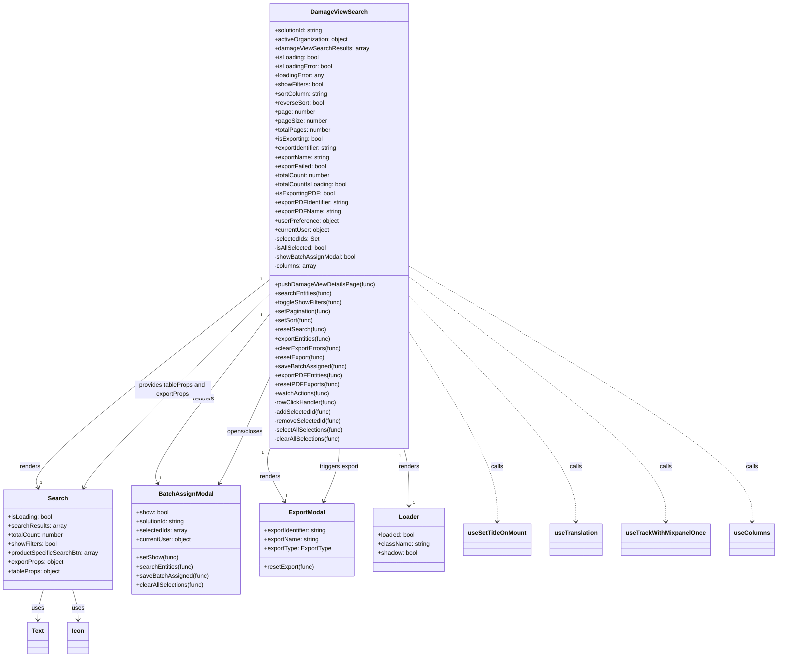
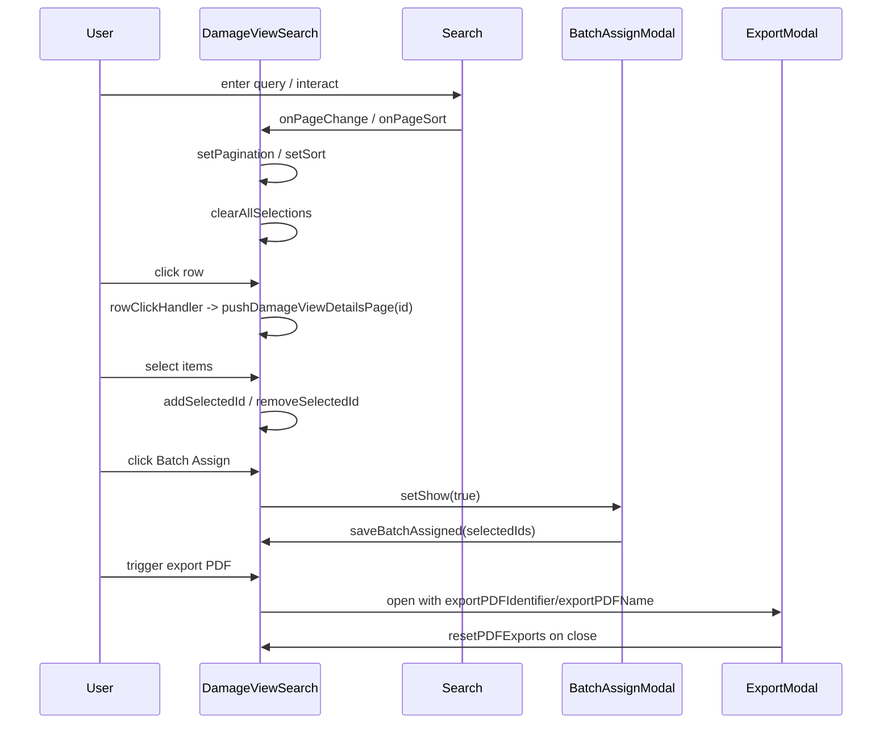

# Diagram: web/portal/src/pages/damageview/search/DamageView.Search.page.js

> Auto-generated by Obscura crawlers

## Diagram 1

### SVG

<svg id="container" width="2008.5625" xmlns="http://www.w3.org/2000/svg" class="classDiagram" height="1736" viewBox="0 0 2008.5625 1736" role="graphics-document document" aria-roledescription="class"><g><defs><marker id="container_class-aggregationStart" class="marker aggregation class" refX="18" refY="7" markerWidth="190" markerHeight="240" orient="auto"><path d="M 18,7 L9,13 L1,7 L9,1 Z"></path></marker></defs><defs><marker id="container_class-aggregationEnd" class="marker aggregation class" refX="1" refY="7" markerWidth="20" markerHeight="28" orient="auto"><path d="M 18,7 L9,13 L1,7 L9,1 Z"></path></marker></defs><defs><marker id="container_class-extensionStart" class="marker extension class" refX="18" refY="7" markerWidth="190" markerHeight="240" orient="auto"><path d="M 1,7 L18,13 V 1 Z"></path></marker></defs><defs><marker id="container_class-extensionEnd" class="marker extension class" refX="1" refY="7" markerWidth="20" markerHeight="28" orient="auto"><path d="M 1,1 V 13 L18,7 Z"></path></marker></defs><defs><marker id="container_class-compositionStart" class="marker composition class" refX="18" refY="7" markerWidth="190" markerHeight="240" orient="auto"><path d="M 18,7 L9,13 L1,7 L9,1 Z"></path></marker></defs><defs><marker id="container_class-compositionEnd" class="marker composition class" refX="1" refY="7" markerWidth="20" markerHeight="28" orient="auto"><path d="M 18,7 L9,13 L1,7 L9,1 Z"></path></marker></defs><defs><marker id="container_class-dependencyStart" class="marker dependency class" refX="6" refY="7" markerWidth="190" markerHeight="240" orient="auto"><path d="M 5,7 L9,13 L1,7 L9,1 Z"></path></marker></defs><defs><marker id="container_class-dependencyEnd" class="marker dependency class" refX="13" refY="7" markerWidth="20" markerHeight="28" orient="auto"><path d="M 18,7 L9,13 L14,7 L9,1 Z"></path></marker></defs><defs><marker id="container_class-lollipopStart" class="marker lollipop class" refX="13" refY="7" markerWidth="190" markerHeight="240" orient="auto"><circle stroke="black" fill="transparent" cx="7" cy="7" r="6"></circle></marker></defs><defs><marker id="container_class-lollipopEnd" class="marker lollipop class" refX="1" refY="7" markerWidth="190" markerHeight="240" orient="auto"><circle stroke="black" fill="transparent" cx="7" cy="7" r="6"></circle></marker></defs><g class="root"><g class="clusters"></g><g class="edgePaths"><path d="M703.441,737.203L599.222,819.836C495.003,902.469,286.564,1067.734,185.878,1159.6C85.193,1251.465,92.261,1269.931,95.795,1279.164L99.329,1288.396" id="id_DamageViewSearch_Search_1" class="edge-thickness-normal edge-pattern-solid relation" style=";;;" data-edge="true" data-et="edge" data-id="id_DamageViewSearch_Search_1" data-points="W3sieCI6NzAzLjQ0MTQwNjI1LCJ5Ijo3MzcuMjAyODIyOTQxMzgyNX0seyJ4Ijo3OC4xMjUsInkiOjEyMzN9LHsieCI6MTAxLjQ3NDA5MzI2NDI0ODcxLCJ5IjoxMjk0fV0=" marker-end="url(#container_class-dependencyEnd)"></path><path d="M703.441,827.99L651.623,895.492C599.805,962.993,496.168,1097.997,447.842,1172.764C399.517,1247.531,406.502,1262.062,409.995,1269.327L413.488,1276.592" id="id_DamageViewSearch_BatchAssignModal_2" class="edge-thickness-normal edge-pattern-solid relation" style=";;;" data-edge="true" data-et="edge" data-id="id_DamageViewSearch_BatchAssignModal_2" data-points="W3sieCI6NzAzLjQ0MTQwNjI1LCJ5Ijo4MjcuOTkwMjQ2MzU3MzYxOX0seyJ4IjozOTIuNTMxMjUsInkiOjEyMzN9LHsieCI6NDE2LjA4NzExMTM5ODk2MzcsInkiOjEyODJ9XQ==" marker-end="url(#container_class-dependencyEnd)"></path><path d="M704.93,1184L702.477,1192.167C700.024,1200.333,695.118,1216.667,701.268,1240.128C707.418,1263.59,724.622,1294.18,733.225,1309.475L741.827,1324.77" id="id_DamageViewSearch_ExportModal_3" class="edge-thickness-normal edge-pattern-solid relation" style=";;;" data-edge="true" data-et="edge" data-id="id_DamageViewSearch_ExportModal_3" data-points="W3sieCI6NzA0LjkyOTY4NzUsInkiOjExODR9LHsieCI6NjkwLjIxMjg5MDYyNSwieSI6MTIzM30seyJ4Ijo3NDQuNzY4NTE5MjY4MTM0NywieSI6MTMzMH1d" marker-end="url(#container_class-dependencyEnd)"></path><path d="M1051.1,1184L1053.455,1192.167C1055.81,1200.333,1060.52,1216.667,1062.875,1242C1065.23,1267.333,1065.23,1301.667,1065.23,1318.833L1065.23,1336" id="id_DamageViewSearch_Loader_4" class="edge-thickness-normal edge-pattern-solid relation" style=";;;" data-edge="true" data-et="edge" data-id="id_DamageViewSearch_Loader_4" data-points="W3sieCI6MTA1MS4wOTk3NTk2MTUzODQ1LCJ5IjoxMTg0fSx7IngiOjEwNjUuMjMwNDY4NzUsInkiOjEyMzN9LHsieCI6MTA2NS4yMzA0Njg3NSwieSI6MTM0Mn1d" marker-end="url(#container_class-dependencyEnd)"></path><path d="M113.827,1558L111.465,1566.167C109.103,1574.333,104.38,1590.667,102.018,1604C99.656,1617.333,99.656,1627.667,99.656,1632.833L99.656,1638" id="id_Search_Text_5" class="edge-thickness-normal edge-pattern-solid relation" style=";;;" data-edge="true" data-et="edge" data-id="id_Search_Text_5" data-points="W3sieCI6MTEzLjgyNjY1NzQ1ODU2MzU1LCJ5IjoxNTU4fSx7IngiOjk5LjY1NjI1LCJ5IjoxNjA3fSx7IngiOjk5LjY1NjI1LCJ5IjoxNjQ0fV0=" marker-end="url(#container_class-dependencyEnd)"></path><path d="M190.173,1558L192.535,1566.167C194.897,1574.333,199.62,1590.667,201.982,1604C204.344,1617.333,204.344,1627.667,204.344,1632.833L204.344,1638" id="id_Search_Icon_6" class="edge-thickness-normal edge-pattern-solid relation" style=";;;" data-edge="true" data-et="edge" data-id="id_Search_Icon_6" data-points="W3sieCI6MTkwLjE3MzM0MjU0MTQzNjQ1LCJ5IjoxNTU4fSx7IngiOjIwNC4zNDM3NSwieSI6MTYwN30seyJ4IjoyMDQuMzQzNzUsInkiOjE2NDR9XQ==" marker-end="url(#container_class-dependencyEnd)"></path><path d="M703.441,990.352L685.178,1030.793C666.915,1071.235,630.388,1152.117,608.022,1199.854C585.655,1247.59,577.449,1262.18,573.347,1269.475L569.244,1276.77" id="id_DamageViewSearch_BatchAssignModal_7" class="edge-thickness-normal edge-pattern-solid relation" style=";;;" data-edge="true" data-et="edge" data-id="id_DamageViewSearch_BatchAssignModal_7" data-points="W3sieCI6NzAzLjQ0MTQwNjI1LCJ5Ijo5OTAuMzUyMDc0NTIxMTcyOX0seyJ4Ijo1OTMuODYxMzI4MTI1LCJ5IjoxMjMzfSx7IngiOjU2Ni4zMDIyOTkyMjI3OTgsInkiOjEyODJ9XQ==" marker-end="url(#container_class-dependencyEnd)"></path><path d="M881.531,1184L881.531,1192.167C881.531,1200.333,881.531,1216.667,874.992,1240.081C868.453,1263.495,855.375,1293.99,848.836,1309.238L842.297,1324.486" id="id_DamageViewSearch_ExportModal_8" class="edge-thickness-normal edge-pattern-solid relation" style=";;;" data-edge="true" data-et="edge" data-id="id_DamageViewSearch_ExportModal_8" data-points="W3sieCI6ODgxLjUzMTI1LCJ5IjoxMTg0fSx7IngiOjg4MS41MzEyNSwieSI6MTIzM30seyJ4Ijo4MzkuOTMyMDU1NTM3NTY0OCwieSI6MTMzMH1d" marker-end="url(#container_class-dependencyEnd)"></path><path d="M703.441,774.16L626.998,850.633C550.555,927.107,397.668,1080.053,316.77,1165.792C235.873,1251.531,226.965,1270.062,222.51,1279.327L218.056,1288.592" id="id_DamageViewSearch_Search_9" class="edge-thickness-normal edge-pattern-solid relation" style=";;;" data-edge="true" data-et="edge" data-id="id_DamageViewSearch_Search_9" data-points="W3sieCI6NzAzLjQ0MTQwNjI1LCJ5Ijo3NzQuMTU5NzY1MTY0ODk5OX0seyJ4IjoyNDQuNzgxMjUsInkiOjEyMzN9LHsieCI6MjE1LjQ1NjYwNjIxNzYxNjU4LCJ5IjoxMjk0fV0=" marker-end="url(#container_class-dependencyEnd)"></path><path d="M1059.621,870.889L1098.721,931.241C1137.82,991.593,1216.02,1112.296,1255.119,1196.815C1294.219,1281.333,1294.219,1329.667,1294.219,1353.833L1294.219,1378" id="id_DamageViewSearch_useSetTitleOnMount_10" class="edge-thickness-normal edge-pattern-dashed relation" style=";;;" data-edge="true" data-et="edge" data-id="id_DamageViewSearch_useSetTitleOnMount_10" data-points="W3sieCI6MTA1OS42MjEwOTM3NSwieSI6ODcwLjg4ODk0MjUyNjEyNDV9LHsieCI6MTI5NC4yMTg3NSwieSI6MTIzM30seyJ4IjoxMjk0LjIxODc1LCJ5IjoxMzg0fV0=" marker-end="url(#container_class-dependencyEnd)"></path><path d="M1059.621,780.332L1132.511,855.776C1205.401,931.221,1351.181,1082.111,1424.071,1181.722C1496.961,1281.333,1496.961,1329.667,1496.961,1353.833L1496.961,1378" id="id_DamageViewSearch_useTranslation_11" class="edge-thickness-normal edge-pattern-dashed relation" style=";;;" data-edge="true" data-et="edge" data-id="id_DamageViewSearch_useTranslation_11" data-points="W3sieCI6MTA1OS42MjEwOTM3NSwieSI6NzgwLjMzMTc0ODY1MTIyMTh9LHsieCI6MTQ5Ni45NjA5Mzc1LCJ5IjoxMjMzfSx7IngiOjE0OTYuOTYwOTM3NSwieSI6MTM4NH1d" marker-end="url(#container_class-dependencyEnd)"></path><path d="M1059.621,730.394L1170.624,814.162C1281.628,897.929,1503.634,1065.465,1614.637,1173.399C1725.641,1281.333,1725.641,1329.667,1725.641,1353.833L1725.641,1378" id="id_DamageViewSearch_useTrackWithMixpanelOnce_12" class="edge-thickness-normal edge-pattern-dashed relation" style=";;;" data-edge="true" data-et="edge" data-id="id_DamageViewSearch_useTrackWithMixpanelOnce_12" data-points="W3sieCI6MTA1OS42MjEwOTM3NSwieSI6NzMwLjM5Mzk5NDIyNDY4Mn0seyJ4IjoxNzI1LjY0MDYyNSwieSI6MTIzM30seyJ4IjoxNzI1LjY0MDYyNSwieSI6MTM4NH1d" marker-end="url(#container_class-dependencyEnd)"></path><path d="M1059.621,702.733L1207.084,791.111C1354.547,879.489,1649.473,1056.244,1796.936,1168.789C1944.398,1281.333,1944.398,1329.667,1944.398,1353.833L1944.398,1378" id="id_DamageViewSearch_useColumns_13" class="edge-thickness-normal edge-pattern-dashed relation" style=";;;" data-edge="true" data-et="edge" data-id="id_DamageViewSearch_useColumns_13" data-points="W3sieCI6MTA1OS42MjEwOTM3NSwieSI6NzAyLjczMzIxMzUyMTc5NzZ9LHsieCI6MTk0NC4zOTg0Mzc1LCJ5IjoxMjMzfSx7IngiOjE5NDQuMzk4NDM3NSwieSI6MTM4NH1d" marker-end="url(#container_class-dependencyEnd)"></path></g><g class="edgeLabels"><g class="edgeLabel" transform="translate(365.19288, 1005.39132)"><g class="label" data-id="id_DamageViewSearch_Search_1" transform="translate(-27.75, -12)"><foreignObject width="55.5" height="24">

renders

</foreignObject></g></g><g class="edgeLabel" transform="translate(531.43323, 1052.05816)"><g class="label" data-id="id_DamageViewSearch_BatchAssignModal_2" transform="translate(-27.75, -12)"><foreignObject width="55.5" height="24">

renders

</foreignObject></g></g><g class="edgeLabel" transform="translate(704.95045, 1259.20341)"><g class="label" data-id="id_DamageViewSearch_ExportModal_3" transform="translate(-27.75, -12)"><foreignObject width="55.5" height="24">

renders

</foreignObject></g></g><g class="edgeLabel" transform="translate(1065.23046875, 1233)"><g class="label" data-id="id_DamageViewSearch_Loader_4" transform="translate(-27.75, -12)"><foreignObject width="55.5" height="24">

renders

</foreignObject></g></g><g class="edgeLabel" transform="translate(99.65625, 1607)"><g class="label" data-id="id_Search_Text_5" transform="translate(-16.4921875, -12)"><foreignObject width="32.984375" height="24">

uses

</foreignObject></g></g><g class="edgeLabel" transform="translate(204.34375, 1607)"><g class="label" data-id="id_Search_Icon_6" transform="translate(-16.4921875, -12)"><foreignObject width="32.984375" height="24">

uses

</foreignObject></g></g><g class="edgeLabel" transform="translate(637.08226, 1137.29401)"><g class="label" data-id="id_DamageViewSearch_BatchAssignModal_7" transform="translate(-48.6015625, -12)"><foreignObject width="97.203125" height="24">

opens/closes

</foreignObject></g></g><g class="edgeLabel" transform="translate(881.53125, 1233)"><g class="label" data-id="id_DamageViewSearch_ExportModal_8" transform="translate(-53.1796875, -12)"><foreignObject width="106.359375" height="24">

triggers export

</foreignObject></g></g><g class="edgeLabel" transform="translate(450.18661, 1027.51399)"><g class="label" data-id="id_DamageViewSearch_Search_9" transform="translate(-100, -24)"><foreignObject width="200" height="48">

provides tableProps and exportProps

</foreignObject></g></g><g class="edgeLabel" transform="translate(1294.21875, 1233)"><g class="label" data-id="id_DamageViewSearch_useSetTitleOnMount_10" transform="translate(-16.4453125, -12)"><foreignObject width="32.890625" height="24">

calls

</foreignObject></g></g><g class="edgeLabel" transform="translate(1496.9609375, 1233)"><g class="label" data-id="id_DamageViewSearch_useTranslation_11" transform="translate(-16.4453125, -12)"><foreignObject width="32.890625" height="24">

calls

</foreignObject></g></g><g class="edgeLabel" transform="translate(1725.640625, 1233)"><g class="label" data-id="id_DamageViewSearch_useTrackWithMixpanelOnce_12" transform="translate(-16.4453125, -12)"><foreignObject width="32.890625" height="24">

calls

</foreignObject></g></g><g class="edgeLabel" transform="translate(1944.3984375, 1233)"><g class="label" data-id="id_DamageViewSearch_useColumns_13" transform="translate(-16.4453125, -12)"><foreignObject width="32.890625" height="24">

calls

</foreignObject></g></g><g class="edgeTerminals" transform="translate(680.4094004528823, 736.3215254793163)"><g class="inner" transform="translate(0, 0)"><foreignObject style="width: 9px; height: 12px;">
1
</foreignObject></g></g><g class="edgeTerminals" transform="translate(680.8867817552692, 832.737771743698)"><g class="inner" transform="translate(0, 0)"><foreignObject style="width: 9px; height: 12px;">
1
</foreignObject></g></g><g class="edgeTerminals" transform="translate(685.5297904307525, 1196.4456444333734)"><g class="inner" transform="translate(0, 0)"><foreignObject style="width: 9px; height: 12px;">
1
</foreignObject></g></g><g class="edgeTerminals" transform="translate(1041.5361752870997, 1204.9711200265826)"><g class="inner" transform="translate(0, 0)"><foreignObject style="width: 9px; height: 12px;">
1
</foreignObject></g></g><g class="edgeTerminals" transform="translate(104.22702946799942, 1267.2941954786254)"><g class="inner" transform="translate(0, 0)"></g><foreignObject style="width: 9px; height: 12px;">
1
</foreignObject></g><g class="edgeTerminals" transform="translate(417.0239191191755, 1254.7288433606707)"><g class="inner" transform="translate(0, 0)"></g><foreignObject style="width: 9px; height: 12px;">
1
</foreignObject></g><g class="edgeTerminals" transform="translate(744.2637991645713, 1302.3937512920006)"><g class="inner" transform="translate(0, 0)"></g><foreignObject style="width: 9px; height: 12px;">
1
</foreignObject></g><g class="edgeTerminals" transform="translate(1075.230469375, 1319.5000005357142)"><g class="inner" transform="translate(0, 0)"></g><foreignObject style="width: 9px; height: 12px;">
1
</foreignObject></g></g><g class="nodes"><g class="node default" id="classId-DamageViewSearch-0" transform="translate(881.53125, 596)"><g class="basic label-container"><path d="M-178.08984375 -588 L178.08984375 -588 L178.08984375 588 L-178.08984375 588" stroke="none" stroke-width="0" fill="#ECECFF" style=""></path><path d="M-178.08984375 -588 C-39.83101495966284 -588, 98.42781383067432 -588, 178.08984375 -588 M-178.08984375 -588 C-45.37471335197293 -588, 87.34041704605414 -588, 178.08984375 -588 M178.08984375 -588 C178.08984375 -302.59900456814216, 178.08984375 -17.198009136284327, 178.08984375 588 M178.08984375 -588 C178.08984375 -305.83019361035014, 178.08984375 -23.660387220700272, 178.08984375 588 M178.08984375 588 C43.958408503525334 588, -90.17302674294933 588, -178.08984375 588 M178.08984375 588 C72.24172568682972 588, -33.60639237634055 588, -178.08984375 588 M-178.08984375 588 C-178.08984375 212.38384554582103, -178.08984375 -163.23230890835794, -178.08984375 -588 M-178.08984375 588 C-178.08984375 166.33833963491844, -178.08984375 -255.32332073016312, -178.08984375 -588" stroke="#9370DB" stroke-width="1.3" fill="none" stroke-dasharray="0 0" style=""></path></g><g class="annotation-group text" transform="translate(0, -564)"></g><g class="label-group text" transform="translate(-71.1640625, -564)"><g class="label" style="font-weight: bolder" transform="translate(0,-12)"><foreignObject width="142.328125" height="24">

DamageViewSearch

</foreignObject></g></g><g class="members-group text" transform="translate(-166.08984375, -516)"><g class="label" style="" transform="translate(0,-12)"><foreignObject width="131.8125" height="24">

+solutionId: string

</foreignObject></g><g class="label" style="" transform="translate(0,12)"><foreignObject width="196.546875" height="24">

+activeOrganization: object

</foreignObject></g><g class="label" style="" transform="translate(0,36)"><foreignObject width="245.40625" height="24">

+damageViewSearchResults: array

</foreignObject></g><g class="label" style="" transform="translate(0,60)"><foreignObject width="118.171875" height="24">

+isLoading: bool

</foreignObject></g><g class="label" style="" transform="translate(0,84)"><foreignObject width="154.125" height="24">

+isLoadingError: bool

</foreignObject></g><g class="label" style="" transform="translate(0,108)"><foreignObject width="132.140625" height="24">

+loadingError: any

</foreignObject></g><g class="label" style="" transform="translate(0,132)"><foreignObject width="130.78125" height="24">

+showFilters: bool

</foreignObject></g><g class="label" style="" transform="translate(0,156)"><foreignObject width="141.546875" height="24">

+sortColumn: string

</foreignObject></g><g class="label" style="" transform="translate(0,180)"><foreignObject width="132.046875" height="24">

+reverseSort: bool

</foreignObject></g><g class="label" style="" transform="translate(0,204)"><foreignObject width="107.546875" height="24">

+page: number

</foreignObject></g><g class="label" style="" transform="translate(0,228)"><foreignObject width="136.375" height="24">

+pageSize: number

</foreignObject></g><g class="label" style="" transform="translate(0,252)"><foreignObject width="147.78125" height="24">

+totalPages: number

</foreignObject></g><g class="label" style="" transform="translate(0,276)"><foreignObject width="130.265625" height="24">

+isExporting: bool

</foreignObject></g><g class="label" style="" transform="translate(0,300)"><foreignObject width="171.765625" height="24">

+exportIdentifier: string

</foreignObject></g><g class="label" style="" transform="translate(0,324)"><foreignObject width="146.90625" height="24">

+exportName: string

</foreignObject></g><g class="label" style="" transform="translate(0,348)"><foreignObject width="139.09375" height="24">

+exportFailed: bool

</foreignObject></g><g class="label" style="" transform="translate(0,372)"><foreignObject width="149.078125" height="24">

+totalCount: number

</foreignObject></g><g class="label" style="" transform="translate(0,396)"><foreignObject width="194.515625" height="24">

+totalCountIsLoading: bool

</foreignObject></g><g class="label" style="" transform="translate(0,420)"><foreignObject width="157.40625" height="24">

+isExportingPDF: bool

</foreignObject></g><g class="label" style="" transform="translate(0,444)"><foreignObject width="199.21875" height="24">

+exportPDFIdentifier: string

</foreignObject></g><g class="label" style="" transform="translate(0,468)"><foreignObject width="174.359375" height="24">

+exportPDFName: string

</foreignObject></g><g class="label" style="" transform="translate(0,492)"><foreignObject width="170.375" height="24">

+userPreference: object

</foreignObject></g><g class="label" style="" transform="translate(0,516)"><foreignObject width="147.125" height="24">

+currentUser: object

</foreignObject></g><g class="label" style="" transform="translate(0,540)"><foreignObject width="120.5" height="24">

-selectedIds: Set

</foreignObject></g><g class="label" style="" transform="translate(0,564)"><foreignObject width="140.1875" height="24">

-isAllSelected: bool

</foreignObject></g><g class="label" style="" transform="translate(0,588)"><foreignObject width="216.984375" height="24">

-showBatchAssignModal: bool

</foreignObject></g><g class="label" style="" transform="translate(0,612)"><foreignObject width="112.59375" height="24">

-columns: array

</foreignObject></g></g><g class="methods-group text" transform="translate(-166.08984375, 156)"><g class="label" style="" transform="translate(0,-12)"><foreignObject width="261.015625" height="24">

+pushDamageViewDetailsPage(func)

</foreignObject></g><g class="label" style="" transform="translate(0,12)"><foreignObject width="152.0625" height="24">

+searchEntities(func)

</foreignObject></g><g class="label" style="" transform="translate(0,36)"><foreignObject width="177.890625" height="24">

+toggleShowFilters(func)

</foreignObject></g><g class="label" style="" transform="translate(0,60)"><foreignObject width="148.90625" height="24">

+setPagination(func)

</foreignObject></g><g class="label" style="" transform="translate(0,84)"><foreignObject width="102.046875" height="24">

+setSort(func)

</foreignObject></g><g class="label" style="" transform="translate(0,108)"><foreignObject width="135.140625" height="24">

+resetSearch(func)

</foreignObject></g><g class="label" style="" transform="translate(0,132)"><foreignObject width="151.734375" height="24">

+exportEntities(func)

</foreignObject></g><g class="label" style="" transform="translate(0,156)"><foreignObject width="175.890625" height="24">

+clearExportErrors(func)

</foreignObject></g><g class="label" style="" transform="translate(0,180)"><foreignObject width="133.5625" height="24">

+resetExport(func)

</foreignObject></g><g class="label" style="" transform="translate(0,204)"><foreignObject width="187.796875" height="24">

+saveBatchAssigned(func)

</foreignObject></g><g class="label" style="" transform="translate(0,228)"><foreignObject width="179.1875" height="24">

+exportPDFEntities(func)

</foreignObject></g><g class="label" style="" transform="translate(0,252)"><foreignObject width="168.484375" height="24">

+resetPDFExports(func)

</foreignObject></g><g class="label" style="" transform="translate(0,276)"><foreignObject width="145.890625" height="24">

+watchActions(func)

</foreignObject></g><g class="label" style="" transform="translate(0,300)"><foreignObject width="166.90625" height="24">

-rowClickHandler(func)

</foreignObject></g><g class="label" style="" transform="translate(0,324)"><foreignObject width="152.640625" height="24">

-addSelectedId(func)

</foreignObject></g><g class="label" style="" transform="translate(0,348)"><foreignObject width="178.984375" height="24">

-removeSelectedId(func)

</foreignObject></g><g class="label" style="" transform="translate(0,372)"><foreignObject width="184.90625" height="24">

-selectAllSelections(func)

</foreignObject></g><g class="label" style="" transform="translate(0,396)"><foreignObject width="177.65625" height="24">

-clearAllSelections(func)

</foreignObject></g></g><g class="divider" style=""><path d="M-178.08984375 -540 C-80.47900127382323 -540, 17.13184120235354 -540, 178.08984375 -540 M-178.08984375 -540 C-64.24209612329972 -540, 49.605651503400566 -540, 178.08984375 -540" stroke="#9370DB" stroke-width="1.3" fill="none" stroke-dasharray="0 0" style=""></path></g><g class="divider" style=""><path d="M-178.08984375 132 C-44.65702779672907 132, 88.77578815654186 132, 178.08984375 132 M-178.08984375 132 C-78.24803634400291 132, 21.593771061994175 132, 178.08984375 132" stroke="#9370DB" stroke-width="1.3" fill="none" stroke-dasharray="0 0" style=""></path></g></g><g class="node default" id="classId-Search-1" transform="translate(152, 1426)"><g class="basic label-container"><path d="M-144 -132 L144 -132 L144 132 L-144 132" stroke="none" stroke-width="0" fill="#ECECFF" style=""></path><path d="M-144 -132 C-78.2990086536036 -132, -12.598017307207186 -132, 144 -132 M-144 -132 C-63.926180211063325 -132, 16.14763957787335 -132, 144 -132 M144 -132 C144 -71.63398707285653, 144 -11.267974145713055, 144 132 M144 -132 C144 -56.99611576516831, 144 18.007768469663375, 144 132 M144 132 C70.80685184533363 132, -2.3862963093327494 132, -144 132 M144 132 C47.32823669924136 132, -49.34352660151728 132, -144 132 M-144 132 C-144 60.35182944912572, -144 -11.296341101748567, -144 -132 M-144 132 C-144 37.82588134039793, -144 -56.348237319204145, -144 -132" stroke="#9370DB" stroke-width="1.3" fill="none" stroke-dasharray="0 0" style=""></path></g><g class="annotation-group text" transform="translate(0, -108)"></g><g class="label-group text" transform="translate(-24.71875, -108)"><g class="label" style="font-weight: bolder" transform="translate(0,-12)"><foreignObject width="49.4375" height="24">

Search

</foreignObject></g></g><g class="members-group text" transform="translate(-132, -60)"><g class="label" style="" transform="translate(0,-12)"><foreignObject width="118.171875" height="24">

+isLoading: bool

</foreignObject></g><g class="label" style="" transform="translate(0,12)"><foreignObject width="153.234375" height="24">

+searchResults: array

</foreignObject></g><g class="label" style="" transform="translate(0,36)"><foreignObject width="149.078125" height="24">

+totalCount: number

</foreignObject></g><g class="label" style="" transform="translate(0,60)"><foreignObject width="130.78125" height="24">

+showFilters: bool

</foreignObject></g><g class="label" style="" transform="translate(0,84)"><foreignObject width="239.28125" height="24">

+productSpecificSearchBtn: array

</foreignObject></g><g class="label" style="" transform="translate(0,108)"><foreignObject width="149.671875" height="24">

+exportProps: object

</foreignObject></g><g class="label" style="" transform="translate(0,132)"><foreignObject width="139.65625" height="24">

+tableProps: object

</foreignObject></g></g><g class="methods-group text" transform="translate(-132, 132)"></g><g class="divider" style=""><path d="M-144 -84 C-76.04723441416375 -84, -8.094468828327507 -84, 144 -84 M-144 -84 C-45.16870148680749 -84, 53.662597026385015 -84, 144 -84" stroke="#9370DB" stroke-width="1.3" fill="none" stroke-dasharray="0 0" style=""></path></g><g class="divider" style=""><path d="M-144 108 C-29.20706689771481 108, 85.58586620457038 108, 144 108 M-144 108 C-65.01649385231224 108, 13.967012295375525 108, 144 108" stroke="#9370DB" stroke-width="1.3" fill="none" stroke-dasharray="0 0" style=""></path></g></g><g class="node default" id="classId-BatchAssignModal-2" transform="translate(485.3125, 1426)"><g class="basic label-container"><path d="M-139.3125 -144 L139.3125 -144 L139.3125 144 L-139.3125 144" stroke="none" stroke-width="0" fill="#ECECFF" style=""></path><path d="M-139.3125 -144 C-70.48216392750322 -144, -1.6518278550064451 -144, 139.3125 -144 M-139.3125 -144 C-75.22541568274228 -144, -11.13833136548456 -144, 139.3125 -144 M139.3125 -144 C139.3125 -41.59927500415779, 139.3125 60.80144999168442, 139.3125 144 M139.3125 -144 C139.3125 -68.75948142123853, 139.3125 6.481037157522934, 139.3125 144 M139.3125 144 C70.08212292055579 144, 0.8517458411115797 144, -139.3125 144 M139.3125 144 C78.2902426335734 144, 17.2679852671468 144, -139.3125 144 M-139.3125 144 C-139.3125 61.86722463967796, -139.3125 -20.265550720644086, -139.3125 -144 M-139.3125 144 C-139.3125 39.72403294139254, -139.3125 -64.55193411721493, -139.3125 -144" stroke="#9370DB" stroke-width="1.3" fill="none" stroke-dasharray="0 0" style=""></path></g><g class="annotation-group text" transform="translate(0, -120)"></g><g class="label-group text" transform="translate(-66.828125, -120)"><g class="label" style="font-weight: bolder" transform="translate(0,-12)"><foreignObject width="133.65625" height="24">

BatchAssignModal

</foreignObject></g></g><g class="members-group text" transform="translate(-127.3125, -72)"><g class="label" style="" transform="translate(0,-12)"><foreignObject width="86.6875" height="24">

+show: bool

</foreignObject></g><g class="label" style="" transform="translate(0,12)"><foreignObject width="131.8125" height="24">

+solutionId: string

</foreignObject></g><g class="label" style="" transform="translate(0,36)"><foreignObject width="135.65625" height="24">

+selectedIds: array

</foreignObject></g><g class="label" style="" transform="translate(0,60)"><foreignObject width="147.125" height="24">

+currentUser: object

</foreignObject></g></g><g class="methods-group text" transform="translate(-127.3125, 48)"><g class="label" style="" transform="translate(0,-12)"><foreignObject width="110.9375" height="24">

+setShow(func)

</foreignObject></g><g class="label" style="" transform="translate(0,12)"><foreignObject width="152.0625" height="24">

+searchEntities(func)

</foreignObject></g><g class="label" style="" transform="translate(0,36)"><foreignObject width="187.796875" height="24">

+saveBatchAssigned(func)

</foreignObject></g><g class="label" style="" transform="translate(0,60)"><foreignObject width="179.1875" height="24">

+clearAllSelections(func)

</foreignObject></g></g><g class="divider" style=""><path d="M-139.3125 -96 C-56.897143894386716 -96, 25.51821221122657 -96, 139.3125 -96 M-139.3125 -96 C-31.838058066602642 -96, 75.63638386679472 -96, 139.3125 -96" stroke="#9370DB" stroke-width="1.3" fill="none" stroke-dasharray="0 0" style=""></path></g><g class="divider" style=""><path d="M-139.3125 24 C-51.01488432371299 24, 37.28273135257402 24, 139.3125 24 M-139.3125 24 C-38.17296553292647 24, 62.96656893414706 24, 139.3125 24" stroke="#9370DB" stroke-width="1.3" fill="none" stroke-dasharray="0 0" style=""></path></g></g><g class="node default" id="classId-ExportModal-3" transform="translate(798.76171875, 1426)"><g class="basic label-container"><path d="M-124.13671875 -96 L124.13671875 -96 L124.13671875 96 L-124.13671875 96" stroke="none" stroke-width="0" fill="#ECECFF" style=""></path><path d="M-124.13671875 -96 C-68.78942163689354 -96, -13.442124523787058 -96, 124.13671875 -96 M-124.13671875 -96 C-27.161328762416986 -96, 69.81406122516603 -96, 124.13671875 -96 M124.13671875 -96 C124.13671875 -54.67106117670728, 124.13671875 -13.342122353414567, 124.13671875 96 M124.13671875 -96 C124.13671875 -57.058654262832555, 124.13671875 -18.11730852566511, 124.13671875 96 M124.13671875 96 C69.6761104747689 96, 15.215502199537823 96, -124.13671875 96 M124.13671875 96 C50.02948573627428 96, -24.077747277451437 96, -124.13671875 96 M-124.13671875 96 C-124.13671875 40.82005621230959, -124.13671875 -14.359887575380824, -124.13671875 -96 M-124.13671875 96 C-124.13671875 52.41271888710874, -124.13671875 8.825437774217477, -124.13671875 -96" stroke="#9370DB" stroke-width="1.3" fill="none" stroke-dasharray="0 0" style=""></path></g><g class="annotation-group text" transform="translate(0, -72)"></g><g class="label-group text" transform="translate(-46.4921875, -72)"><g class="label" style="font-weight: bolder" transform="translate(0,-12)"><foreignObject width="92.984375" height="24">

ExportModal

</foreignObject></g></g><g class="members-group text" transform="translate(-112.13671875, -24)"><g class="label" style="" transform="translate(0,-12)"><foreignObject width="171.765625" height="24">

+exportIdentifier: string

</foreignObject></g><g class="label" style="" transform="translate(0,12)"><foreignObject width="146.90625" height="24">

+exportName: string

</foreignObject></g><g class="label" style="" transform="translate(0,36)"><foreignObject width="177.78125" height="24">

+exportType: ExportType

</foreignObject></g></g><g class="methods-group text" transform="translate(-112.13671875, 72)"><g class="label" style="" transform="translate(0,-12)"><foreignObject width="133.5625" height="24">

+resetExport(func)

</foreignObject></g></g><g class="divider" style=""><path d="M-124.13671875 -48 C-29.535993164832306 -48, 65.06473242033539 -48, 124.13671875 -48 M-124.13671875 -48 C-57.1643750337298 -48, 9.807968682540405 -48, 124.13671875 -48" stroke="#9370DB" stroke-width="1.3" fill="none" stroke-dasharray="0 0" style=""></path></g><g class="divider" style=""><path d="M-124.13671875 48 C-50.517695560561634 48, 23.10132762887673 48, 124.13671875 48 M-124.13671875 48 C-40.3892510155121 48, 43.3582167189758 48, 124.13671875 48" stroke="#9370DB" stroke-width="1.3" fill="none" stroke-dasharray="0 0" style=""></path></g></g><g class="node default" id="classId-Loader-4" transform="translate(1065.23046875, 1426)"><g class="basic label-container"><path d="M-92.33203125 -84 L92.33203125 -84 L92.33203125 84 L-92.33203125 84" stroke="none" stroke-width="0" fill="#ECECFF" style=""></path><path d="M-92.33203125 -84 C-31.323185697497166 -84, 29.685659855005667 -84, 92.33203125 -84 M-92.33203125 -84 C-50.38460856231414 -84, -8.437185874628284 -84, 92.33203125 -84 M92.33203125 -84 C92.33203125 -28.036262001159614, 92.33203125 27.927475997680773, 92.33203125 84 M92.33203125 -84 C92.33203125 -39.56519247541918, 92.33203125 4.869615049161638, 92.33203125 84 M92.33203125 84 C24.547401717417543 84, -43.237227815164914 84, -92.33203125 84 M92.33203125 84 C35.75723446964269 84, -20.81756231071462 84, -92.33203125 84 M-92.33203125 84 C-92.33203125 40.606043880074076, -92.33203125 -2.787912239851849, -92.33203125 -84 M-92.33203125 84 C-92.33203125 35.64832582154747, -92.33203125 -12.703348356905053, -92.33203125 -84" stroke="#9370DB" stroke-width="1.3" fill="none" stroke-dasharray="0 0" style=""></path></g><g class="annotation-group text" transform="translate(0, -60)"></g><g class="label-group text" transform="translate(-25.3046875, -60)"><g class="label" style="font-weight: bolder" transform="translate(0,-12)"><foreignObject width="50.609375" height="24">

Loader

</foreignObject></g></g><g class="members-group text" transform="translate(-80.33203125, -12)"><g class="label" style="" transform="translate(0,-12)"><foreignObject width="99.296875" height="24">

+loaded: bool

</foreignObject></g><g class="label" style="" transform="translate(0,12)"><foreignObject width="135.359375" height="24">

+className: string

</foreignObject></g><g class="label" style="" transform="translate(0,36)"><foreignObject width="104.953125" height="24">

+shadow: bool

</foreignObject></g></g><g class="methods-group text" transform="translate(-80.33203125, 84)"></g><g class="divider" style=""><path d="M-92.33203125 -36 C-52.00444990263184 -36, -11.676868555263681 -36, 92.33203125 -36 M-92.33203125 -36 C-25.801886787731462 -36, 40.728257674537076 -36, 92.33203125 -36" stroke="#9370DB" stroke-width="1.3" fill="none" stroke-dasharray="0 0" style=""></path></g><g class="divider" style=""><path d="M-92.33203125 60 C-44.08449258329743 60, 4.163046083405135 60, 92.33203125 60 M-92.33203125 60 C-33.61723354910211 60, 25.09756415179578 60, 92.33203125 60" stroke="#9370DB" stroke-width="1.3" fill="none" stroke-dasharray="0 0" style=""></path></g></g><g class="node default" id="classId-Text-5" transform="translate(99.65625, 1686)"><g class="basic label-container"><path d="M-27.3828125 -42 L27.3828125 -42 L27.3828125 42 L-27.3828125 42" stroke="none" stroke-width="0" fill="#ECECFF" style=""></path><path d="M-27.3828125 -42 C-11.694047817887268 -42, 3.994716864225463 -42, 27.3828125 -42 M-27.3828125 -42 C-11.812591044546243 -42, 3.757630410907513 -42, 27.3828125 -42 M27.3828125 -42 C27.3828125 -9.349405270675511, 27.3828125 23.301189458648977, 27.3828125 42 M27.3828125 -42 C27.3828125 -18.443847397468428, 27.3828125 5.112305205063144, 27.3828125 42 M27.3828125 42 C7.901489461515599 42, -11.579833576968802 42, -27.3828125 42 M27.3828125 42 C11.895917388972386 42, -3.5909777220552286 42, -27.3828125 42 M-27.3828125 42 C-27.3828125 20.229122597980748, -27.3828125 -1.5417548040385043, -27.3828125 -42 M-27.3828125 42 C-27.3828125 8.868529501848641, -27.3828125 -24.262940996302717, -27.3828125 -42" stroke="#9370DB" stroke-width="1.3" fill="none" stroke-dasharray="0 0" style=""></path></g><g class="annotation-group text" transform="translate(0, -18)"></g><g class="label-group text" transform="translate(-15.3828125, -18)"><g class="label" style="font-weight: bolder" transform="translate(0,-12)"><foreignObject width="30.765625" height="24">

Text

</foreignObject></g></g><g class="members-group text" transform="translate(-15.3828125, 30)"></g><g class="methods-group text" transform="translate(-15.3828125, 60)"></g><g class="divider" style=""><path d="M-27.3828125 6 C-12.041251466963795 6, 3.3003095660724107 6, 27.3828125 6 M-27.3828125 6 C-8.129538626092948 6, 11.123735247814103 6, 27.3828125 6" stroke="#9370DB" stroke-width="1.3" fill="none" stroke-dasharray="0 0" style=""></path></g><g class="divider" style=""><path d="M-27.3828125 24 C-15.017739280785015 24, -2.652666061570031 24, 27.3828125 24 M-27.3828125 24 C-10.762573366021527 24, 5.857665767956945 24, 27.3828125 24" stroke="#9370DB" stroke-width="1.3" fill="none" stroke-dasharray="0 0" style=""></path></g></g><g class="node default" id="classId-Icon-6" transform="translate(204.34375, 1686)"><g class="basic label-container"><path d="M-27.3046875 -42 L27.3046875 -42 L27.3046875 42 L-27.3046875 42" stroke="none" stroke-width="0" fill="#ECECFF" style=""></path><path d="M-27.3046875 -42 C-8.005957340331989 -42, 11.292772819336022 -42, 27.3046875 -42 M-27.3046875 -42 C-12.717784672425074 -42, 1.8691181551498524 -42, 27.3046875 -42 M27.3046875 -42 C27.3046875 -12.2003520739528, 27.3046875 17.5992958520944, 27.3046875 42 M27.3046875 -42 C27.3046875 -12.004256572804309, 27.3046875 17.991486854391383, 27.3046875 42 M27.3046875 42 C8.760719758732346 42, -9.783247982535308 42, -27.3046875 42 M27.3046875 42 C14.653985620373504 42, 2.0032837407470083 42, -27.3046875 42 M-27.3046875 42 C-27.3046875 22.191317680405515, -27.3046875 2.3826353608110296, -27.3046875 -42 M-27.3046875 42 C-27.3046875 15.24613474680568, -27.3046875 -11.50773050638864, -27.3046875 -42" stroke="#9370DB" stroke-width="1.3" fill="none" stroke-dasharray="0 0" style=""></path></g><g class="annotation-group text" transform="translate(0, -18)"></g><g class="label-group text" transform="translate(-15.3046875, -18)"><g class="label" style="font-weight: bolder" transform="translate(0,-12)"><foreignObject width="30.609375" height="24">

Icon

</foreignObject></g></g><g class="members-group text" transform="translate(-15.3046875, 30)"></g><g class="methods-group text" transform="translate(-15.3046875, 60)"></g><g class="divider" style=""><path d="M-27.3046875 6 C-6.143049871159981 6, 15.018587757680038 6, 27.3046875 6 M-27.3046875 6 C-10.75621601799659 6, 5.792255464006821 6, 27.3046875 6" stroke="#9370DB" stroke-width="1.3" fill="none" stroke-dasharray="0 0" style=""></path></g><g class="divider" style=""><path d="M-27.3046875 24 C-13.411805621139216 24, 0.48107625772156837 24, 27.3046875 24 M-27.3046875 24 C-8.136752561090884 24, 11.031182377818233 24, 27.3046875 24" stroke="#9370DB" stroke-width="1.3" fill="none" stroke-dasharray="0 0" style=""></path></g></g><g class="node default" id="classId-useSetTitleOnMount-7" transform="translate(1294.21875, 1426)"><g class="basic label-container"><path d="M-86.65625 -42 L86.65625 -42 L86.65625 42 L-86.65625 42" stroke="none" stroke-width="0" fill="#ECECFF" style=""></path><path d="M-86.65625 -42 C-40.653772885396805 -42, 5.34870422920639 -42, 86.65625 -42 M-86.65625 -42 C-30.263329212597412 -42, 26.129591574805175 -42, 86.65625 -42 M86.65625 -42 C86.65625 -24.536422815966507, 86.65625 -7.0728456319330135, 86.65625 42 M86.65625 -42 C86.65625 -11.751462355235038, 86.65625 18.497075289529924, 86.65625 42 M86.65625 42 C38.947715461231255 42, -8.76081907753749 42, -86.65625 42 M86.65625 42 C21.681279544260804 42, -43.29369091147839 42, -86.65625 42 M-86.65625 42 C-86.65625 16.28689641374639, -86.65625 -9.426207172507219, -86.65625 -42 M-86.65625 42 C-86.65625 24.58290942888586, -86.65625 7.165818857771718, -86.65625 -42" stroke="#9370DB" stroke-width="1.3" fill="none" stroke-dasharray="0 0" style=""></path></g><g class="annotation-group text" transform="translate(0, -18)"></g><g class="label-group text" transform="translate(-74.65625, -18)"><g class="label" style="font-weight: bolder" transform="translate(0,-12)"><foreignObject width="149.3125" height="24">

useSetTitleOnMount

</foreignObject></g></g><g class="members-group text" transform="translate(-74.65625, 30)"></g><g class="methods-group text" transform="translate(-74.65625, 60)"></g><g class="divider" style=""><path d="M-86.65625 6 C-29.604562059182022 6, 27.447125881635955 6, 86.65625 6 M-86.65625 6 C-43.252459127672985 6, 0.15133174465402988 6, 86.65625 6" stroke="#9370DB" stroke-width="1.3" fill="none" stroke-dasharray="0 0" style=""></path></g><g class="divider" style=""><path d="M-86.65625 24 C-23.259303459659108 24, 40.137643080681784 24, 86.65625 24 M-86.65625 24 C-28.02097349170186 24, 30.61430301659628 24, 86.65625 24" stroke="#9370DB" stroke-width="1.3" fill="none" stroke-dasharray="0 0" style=""></path></g></g><g class="node default" id="classId-useTranslation-8" transform="translate(1496.9609375, 1426)"><g class="basic label-container"><path d="M-66.0859375 -42 L66.0859375 -42 L66.0859375 42 L-66.0859375 42" stroke="none" stroke-width="0" fill="#ECECFF" style=""></path><path d="M-66.0859375 -42 C-33.977544320108336 -42, -1.8691511402166725 -42, 66.0859375 -42 M-66.0859375 -42 C-14.864725672557825 -42, 36.35648615488435 -42, 66.0859375 -42 M66.0859375 -42 C66.0859375 -23.69887082266633, 66.0859375 -5.397741645332658, 66.0859375 42 M66.0859375 -42 C66.0859375 -16.332752213361385, 66.0859375 9.33449557327723, 66.0859375 42 M66.0859375 42 C30.955108235277827 42, -4.175721029444347 42, -66.0859375 42 M66.0859375 42 C27.257763131548586 42, -11.570411236902828 42, -66.0859375 42 M-66.0859375 42 C-66.0859375 16.8263384157517, -66.0859375 -8.347323168496601, -66.0859375 -42 M-66.0859375 42 C-66.0859375 16.368834299074837, -66.0859375 -9.262331401850325, -66.0859375 -42" stroke="#9370DB" stroke-width="1.3" fill="none" stroke-dasharray="0 0" style=""></path></g><g class="annotation-group text" transform="translate(0, -18)"></g><g class="label-group text" transform="translate(-54.0859375, -18)"><g class="label" style="font-weight: bolder" transform="translate(0,-12)"><foreignObject width="108.171875" height="24">

useTranslation

</foreignObject></g></g><g class="members-group text" transform="translate(-54.0859375, 30)"></g><g class="methods-group text" transform="translate(-54.0859375, 60)"></g><g class="divider" style=""><path d="M-66.0859375 6 C-14.940382236076417 6, 36.20517302784717 6, 66.0859375 6 M-66.0859375 6 C-19.62896730694503 6, 26.828002886109942 6, 66.0859375 6" stroke="#9370DB" stroke-width="1.3" fill="none" stroke-dasharray="0 0" style=""></path></g><g class="divider" style=""><path d="M-66.0859375 24 C-17.872697009306307 24, 30.340543481387385 24, 66.0859375 24 M-66.0859375 24 C-35.977728394188574 24, -5.869519288377155 24, 66.0859375 24" stroke="#9370DB" stroke-width="1.3" fill="none" stroke-dasharray="0 0" style=""></path></g></g><g class="node default" id="classId-useTrackWithMixpanelOnce-9" transform="translate(1725.640625, 1426)"><g class="basic label-container"><path d="M-112.59375 -42 L112.59375 -42 L112.59375 42 L-112.59375 42" stroke="none" stroke-width="0" fill="#ECECFF" style=""></path><path d="M-112.59375 -42 C-24.90515662083942 -42, 62.78343675832116 -42, 112.59375 -42 M-112.59375 -42 C-62.292625082496706 -42, -11.991500164993411 -42, 112.59375 -42 M112.59375 -42 C112.59375 -20.321367498236402, 112.59375 1.3572650035271963, 112.59375 42 M112.59375 -42 C112.59375 -24.609576205408302, 112.59375 -7.219152410816605, 112.59375 42 M112.59375 42 C47.56872644759852 42, -17.456297104802957 42, -112.59375 42 M112.59375 42 C27.50771270949828 42, -57.57832458100344 42, -112.59375 42 M-112.59375 42 C-112.59375 18.86618816916097, -112.59375 -4.2676236616780585, -112.59375 -42 M-112.59375 42 C-112.59375 13.123750305970312, -112.59375 -15.752499388059377, -112.59375 -42" stroke="#9370DB" stroke-width="1.3" fill="none" stroke-dasharray="0 0" style=""></path></g><g class="annotation-group text" transform="translate(0, -18)"></g><g class="label-group text" transform="translate(-100.59375, -18)"><g class="label" style="font-weight: bolder" transform="translate(0,-12)"><foreignObject width="201.1875" height="24">

useTrackWithMixpanelOnce

</foreignObject></g></g><g class="members-group text" transform="translate(-100.59375, 30)"></g><g class="methods-group text" transform="translate(-100.59375, 60)"></g><g class="divider" style=""><path d="M-112.59375 6 C-29.09256950492704 6, 54.40861099014592 6, 112.59375 6 M-112.59375 6 C-59.138243603530796 6, -5.682737207061592 6, 112.59375 6" stroke="#9370DB" stroke-width="1.3" fill="none" stroke-dasharray="0 0" style=""></path></g><g class="divider" style=""><path d="M-112.59375 24 C-26.244535727465177 24, 60.104678545069646 24, 112.59375 24 M-112.59375 24 C-51.88831449020708 24, 8.81712101958584 24, 112.59375 24" stroke="#9370DB" stroke-width="1.3" fill="none" stroke-dasharray="0 0" style=""></path></g></g><g class="node default" id="classId-useColumns-10" transform="translate(1944.3984375, 1426)"><g class="basic label-container"><path d="M-56.1640625 -42 L56.1640625 -42 L56.1640625 42 L-56.1640625 42" stroke="none" stroke-width="0" fill="#ECECFF" style=""></path><path d="M-56.1640625 -42 C-24.181606843297594 -42, 7.800848813404812 -42, 56.1640625 -42 M-56.1640625 -42 C-22.617860087391215 -42, 10.92834232521757 -42, 56.1640625 -42 M56.1640625 -42 C56.1640625 -19.438833366761024, 56.1640625 3.122333266477952, 56.1640625 42 M56.1640625 -42 C56.1640625 -12.397075964491403, 56.1640625 17.205848071017193, 56.1640625 42 M56.1640625 42 C33.62798267083657 42, 11.091902841673154 42, -56.1640625 42 M56.1640625 42 C20.509372448356856 42, -15.145317603286287 42, -56.1640625 42 M-56.1640625 42 C-56.1640625 25.137323030752178, -56.1640625 8.274646061504356, -56.1640625 -42 M-56.1640625 42 C-56.1640625 16.644538809289113, -56.1640625 -8.710922381421774, -56.1640625 -42" stroke="#9370DB" stroke-width="1.3" fill="none" stroke-dasharray="0 0" style=""></path></g><g class="annotation-group text" transform="translate(0, -18)"></g><g class="label-group text" transform="translate(-44.1640625, -18)"><g class="label" style="font-weight: bolder" transform="translate(0,-12)"><foreignObject width="88.328125" height="24">

useColumns

</foreignObject></g></g><g class="members-group text" transform="translate(-44.1640625, 30)"></g><g class="methods-group text" transform="translate(-44.1640625, 60)"></g><g class="divider" style=""><path d="M-56.1640625 6 C-15.032751303414528 6, 26.098559893170943 6, 56.1640625 6 M-56.1640625 6 C-33.519855413190804 6, -10.875648326381608 6, 56.1640625 6" stroke="#9370DB" stroke-width="1.3" fill="none" stroke-dasharray="0 0" style=""></path></g><g class="divider" style=""><path d="M-56.1640625 24 C-24.018507766449083 24, 8.127046967101833 24, 56.1640625 24 M-56.1640625 24 C-12.515326245335011 24, 31.133410009329978 24, 56.1640625 24" stroke="#9370DB" stroke-width="1.3" fill="none" stroke-dasharray="0 0" style=""></path></g></g></g></g></g></svg>

## Diagram 2

### SVG

<svg id="container" width="1132" xmlns="http://www.w3.org/2000/svg" height="963" viewBox="-50 -10 1132 963" role="graphics-document document" aria-roledescription="sequence"><g><rect x="882" y="877" fill="#eaeaea" stroke="#666" width="150" height="65" name="ExportModal" rx="3" ry="3" class="actor actor-bottom"></rect><text x="957" y="909.5" dominant-baseline="central" alignment-baseline="central" class="actor actor-box" style="text-anchor: middle; font-size: 16px; font-weight: 400;"><tspan x="957" dy="0">ExportModal</tspan></text></g><g><rect x="680" y="877" fill="#eaeaea" stroke="#666" width="152" height="65" name="BatchAssignModal" rx="3" ry="3" class="actor actor-bottom"></rect><text x="756" y="909.5" dominant-baseline="central" alignment-baseline="central" class="actor actor-box" style="text-anchor: middle; font-size: 16px; font-weight: 400;"><tspan x="756" dy="0">BatchAssignModal</tspan></text></g><g><rect x="480" y="877" fill="#eaeaea" stroke="#666" width="150" height="65" name="Search" rx="3" ry="3" class="actor actor-bottom"></rect><text x="555" y="909.5" dominant-baseline="central" alignment-baseline="central" class="actor actor-box" style="text-anchor: middle; font-size: 16px; font-weight: 400;"><tspan x="555" dy="0">Search</tspan></text></g><g><rect x="200" y="877" fill="#eaeaea" stroke="#666" width="160" height="65" name="DamageViewSearch" rx="3" ry="3" class="actor actor-bottom"></rect><text x="280" y="909.5" dominant-baseline="central" alignment-baseline="central" class="actor actor-box" style="text-anchor: middle; font-size: 16px; font-weight: 400;"><tspan x="280" dy="0">DamageViewSearch</tspan></text></g><g><rect x="0" y="877" fill="#eaeaea" stroke="#666" width="150" height="65" name="User" rx="3" ry="3" class="actor actor-bottom"></rect><text x="75" y="909.5" dominant-baseline="central" alignment-baseline="central" class="actor actor-box" style="text-anchor: middle; font-size: 16px; font-weight: 400;"><tspan x="75" dy="0">User</tspan></text></g><g><line id="actor4" x1="957" y1="65" x2="957" y2="877" class="actor-line 200" stroke-width="0.5px" stroke="#999" name="ExportModal"></line><g id="root-4"><rect x="882" y="0" fill="#eaeaea" stroke="#666" width="150" height="65" name="ExportModal" rx="3" ry="3" class="actor actor-top"></rect><text x="957" y="32.5" dominant-baseline="central" alignment-baseline="central" class="actor actor-box" style="text-anchor: middle; font-size: 16px; font-weight: 400;"><tspan x="957" dy="0">ExportModal</tspan></text></g></g><g><line id="actor3" x1="756" y1="65" x2="756" y2="877" class="actor-line 200" stroke-width="0.5px" stroke="#999" name="BatchAssignModal"></line><g id="root-3"><rect x="680" y="0" fill="#eaeaea" stroke="#666" width="152" height="65" name="BatchAssignModal" rx="3" ry="3" class="actor actor-top"></rect><text x="756" y="32.5" dominant-baseline="central" alignment-baseline="central" class="actor actor-box" style="text-anchor: middle; font-size: 16px; font-weight: 400;"><tspan x="756" dy="0">BatchAssignModal</tspan></text></g></g><g><line id="actor2" x1="555" y1="65" x2="555" y2="877" class="actor-line 200" stroke-width="0.5px" stroke="#999" name="Search"></line><g id="root-2"><rect x="480" y="0" fill="#eaeaea" stroke="#666" width="150" height="65" name="Search" rx="3" ry="3" class="actor actor-top"></rect><text x="555" y="32.5" dominant-baseline="central" alignment-baseline="central" class="actor actor-box" style="text-anchor: middle; font-size: 16px; font-weight: 400;"><tspan x="555" dy="0">Search</tspan></text></g></g><g><line id="actor1" x1="280" y1="65" x2="280" y2="877" class="actor-line 200" stroke-width="0.5px" stroke="#999" name="DamageViewSearch"></line><g id="root-1"><rect x="200" y="0" fill="#eaeaea" stroke="#666" width="160" height="65" name="DamageViewSearch" rx="3" ry="3" class="actor actor-top"></rect><text x="280" y="32.5" dominant-baseline="central" alignment-baseline="central" class="actor actor-box" style="text-anchor: middle; font-size: 16px; font-weight: 400;"><tspan x="280" dy="0">DamageViewSearch</tspan></text></g></g><g><line id="actor0" x1="75" y1="65" x2="75" y2="877" class="actor-line 200" stroke-width="0.5px" stroke="#999" name="User"></line><g id="root-0"><rect x="0" y="0" fill="#eaeaea" stroke="#666" width="150" height="65" name="User" rx="3" ry="3" class="actor actor-top"></rect><text x="75" y="32.5" dominant-baseline="central" alignment-baseline="central" class="actor actor-box" style="text-anchor: middle; font-size: 16px; font-weight: 400;"><tspan x="75" dy="0">User</tspan></text></g></g><g></g><defs><symbol id="computer" width="24" height="24"><path transform="scale(.5)" d="M2 2v13h20v-13h-20zm18 11h-16v-9h16v9zm-10.228 6l.466-1h3.524l.467 1h-4.457zm14.228 3h-24l2-6h2.104l-1.33 4h18.45l-1.297-4h2.073l2 6zm-5-10h-14v-7h14v7z"></path></symbol></defs><defs><symbol id="database" fill-rule="evenodd" clip-rule="evenodd"><path transform="scale(.5)" d="M12.258.001l.256.004.255.005.253.008.251.01.249.012.247.015.246.016.242.019.241.02.239.023.236.024.233.027.231.028.229.031.225.032.223.034.22.036.217.038.214.04.211.041.208.043.205.045.201.046.198.048.194.05.191.051.187.053.183.054.18.056.175.057.172.059.168.06.163.061.16.063.155.064.15.066.074.033.073.033.071.034.07.034.069.035.068.035.067.035.066.035.064.036.064.036.062.036.06.036.06.037.058.037.058.037.055.038.055.038.053.038.052.038.051.039.05.039.048.039.047.039.045.04.044.04.043.04.041.04.04.041.039.041.037.041.036.041.034.041.033.042.032.042.03.042.029.042.027.042.026.043.024.043.023.043.021.043.02.043.018.044.017.043.015.044.013.044.012.044.011.045.009.044.007.045.006.045.004.045.002.045.001.045v17l-.001.045-.002.045-.004.045-.006.045-.007.045-.009.044-.011.045-.012.044-.013.044-.015.044-.017.043-.018.044-.02.043-.021.043-.023.043-.024.043-.026.043-.027.042-.029.042-.03.042-.032.042-.033.042-.034.041-.036.041-.037.041-.039.041-.04.041-.041.04-.043.04-.044.04-.045.04-.047.039-.048.039-.05.039-.051.039-.052.038-.053.038-.055.038-.055.038-.058.037-.058.037-.06.037-.06.036-.062.036-.064.036-.064.036-.066.035-.067.035-.068.035-.069.035-.07.034-.071.034-.073.033-.074.033-.15.066-.155.064-.16.063-.163.061-.168.06-.172.059-.175.057-.18.056-.183.054-.187.053-.191.051-.194.05-.198.048-.201.046-.205.045-.208.043-.211.041-.214.04-.217.038-.22.036-.223.034-.225.032-.229.031-.231.028-.233.027-.236.024-.239.023-.241.02-.242.019-.246.016-.247.015-.249.012-.251.01-.253.008-.255.005-.256.004-.258.001-.258-.001-.256-.004-.255-.005-.253-.008-.251-.01-.249-.012-.247-.015-.245-.016-.243-.019-.241-.02-.238-.023-.236-.024-.234-.027-.231-.028-.228-.031-.226-.032-.223-.034-.22-.036-.217-.038-.214-.04-.211-.041-.208-.043-.204-.045-.201-.046-.198-.048-.195-.05-.19-.051-.187-.053-.184-.054-.179-.056-.176-.057-.172-.059-.167-.06-.164-.061-.159-.063-.155-.064-.151-.066-.074-.033-.072-.033-.072-.034-.07-.034-.069-.035-.068-.035-.067-.035-.066-.035-.064-.036-.063-.036-.062-.036-.061-.036-.06-.037-.058-.037-.057-.037-.056-.038-.055-.038-.053-.038-.052-.038-.051-.039-.049-.039-.049-.039-.046-.039-.046-.04-.044-.04-.043-.04-.041-.04-.04-.041-.039-.041-.037-.041-.036-.041-.034-.041-.033-.042-.032-.042-.03-.042-.029-.042-.027-.042-.026-.043-.024-.043-.023-.043-.021-.043-.02-.043-.018-.044-.017-.043-.015-.044-.013-.044-.012-.044-.011-.045-.009-.044-.007-.045-.006-.045-.004-.045-.002-.045-.001-.045v-17l.001-.045.002-.045.004-.045.006-.045.007-.045.009-.044.011-.045.012-.044.013-.044.015-.044.017-.043.018-.044.02-.043.021-.043.023-.043.024-.043.026-.043.027-.042.029-.042.03-.042.032-.042.033-.042.034-.041.036-.041.037-.041.039-.041.04-.041.041-.04.043-.04.044-.04.046-.04.046-.039.049-.039.049-.039.051-.039.052-.038.053-.038.055-.038.056-.038.057-.037.058-.037.06-.037.061-.036.062-.036.063-.036.064-.036.066-.035.067-.035.068-.035.069-.035.07-.034.072-.034.072-.033.074-.033.151-.066.155-.064.159-.063.164-.061.167-.06.172-.059.176-.057.179-.056.184-.054.187-.053.19-.051.195-.05.198-.048.201-.046.204-.045.208-.043.211-.041.214-.04.217-.038.22-.036.223-.034.226-.032.228-.031.231-.028.234-.027.236-.024.238-.023.241-.02.243-.019.245-.016.247-.015.249-.012.251-.01.253-.008.255-.005.256-.004.258-.001.258.001zm-9.258 20.499v.01l.001.021.003.021.004.022.005.021.006.022.007.022.009.023.01.022.011.023.012.023.013.023.015.023.016.024.017.023.018.024.019.024.021.024.022.025.023.024.024.025.052.049.056.05.061.051.066.051.07.051.075.051.079.052.084.052.088.052.092.052.097.052.102.051.105.052.11.052.114.051.119.051.123.051.127.05.131.05.135.05.139.048.144.049.147.047.152.047.155.047.16.045.163.045.167.043.171.043.176.041.178.041.183.039.187.039.19.037.194.035.197.035.202.033.204.031.209.03.212.029.216.027.219.025.222.024.226.021.23.02.233.018.236.016.24.015.243.012.246.01.249.008.253.005.256.004.259.001.26-.001.257-.004.254-.005.25-.008.247-.011.244-.012.241-.014.237-.016.233-.018.231-.021.226-.021.224-.024.22-.026.216-.027.212-.028.21-.031.205-.031.202-.034.198-.034.194-.036.191-.037.187-.039.183-.04.179-.04.175-.042.172-.043.168-.044.163-.045.16-.046.155-.046.152-.047.148-.048.143-.049.139-.049.136-.05.131-.05.126-.05.123-.051.118-.052.114-.051.11-.052.106-.052.101-.052.096-.052.092-.052.088-.053.083-.051.079-.052.074-.052.07-.051.065-.051.06-.051.056-.05.051-.05.023-.024.023-.025.021-.024.02-.024.019-.024.018-.024.017-.024.015-.023.014-.024.013-.023.012-.023.01-.023.01-.022.008-.022.006-.022.006-.022.004-.022.004-.021.001-.021.001-.021v-4.127l-.077.055-.08.053-.083.054-.085.053-.087.052-.09.052-.093.051-.095.05-.097.05-.1.049-.102.049-.105.048-.106.047-.109.047-.111.046-.114.045-.115.045-.118.044-.12.043-.122.042-.124.042-.126.041-.128.04-.13.04-.132.038-.134.038-.135.037-.138.037-.139.035-.142.035-.143.034-.144.033-.147.032-.148.031-.15.03-.151.03-.153.029-.154.027-.156.027-.158.026-.159.025-.161.024-.162.023-.163.022-.165.021-.166.02-.167.019-.169.018-.169.017-.171.016-.173.015-.173.014-.175.013-.175.012-.177.011-.178.01-.179.008-.179.008-.181.006-.182.005-.182.004-.184.003-.184.002h-.37l-.184-.002-.184-.003-.182-.004-.182-.005-.181-.006-.179-.008-.179-.008-.178-.01-.176-.011-.176-.012-.175-.013-.173-.014-.172-.015-.171-.016-.17-.017-.169-.018-.167-.019-.166-.02-.165-.021-.163-.022-.162-.023-.161-.024-.159-.025-.157-.026-.156-.027-.155-.027-.153-.029-.151-.03-.15-.03-.148-.031-.146-.032-.145-.033-.143-.034-.141-.035-.14-.035-.137-.037-.136-.037-.134-.038-.132-.038-.13-.04-.128-.04-.126-.041-.124-.042-.122-.042-.12-.044-.117-.043-.116-.045-.113-.045-.112-.046-.109-.047-.106-.047-.105-.048-.102-.049-.1-.049-.097-.05-.095-.05-.093-.052-.09-.051-.087-.052-.085-.053-.083-.054-.08-.054-.077-.054v4.127zm0-5.654v.011l.001.021.003.021.004.021.005.022.006.022.007.022.009.022.01.022.011.023.012.023.013.023.015.024.016.023.017.024.018.024.019.024.021.024.022.024.023.025.024.024.052.05.056.05.061.05.066.051.07.051.075.052.079.051.084.052.088.052.092.052.097.052.102.052.105.052.11.051.114.051.119.052.123.05.127.051.131.05.135.049.139.049.144.048.147.048.152.047.155.046.16.045.163.045.167.044.171.042.176.042.178.04.183.04.187.038.19.037.194.036.197.034.202.033.204.032.209.03.212.028.216.027.219.025.222.024.226.022.23.02.233.018.236.016.24.014.243.012.246.01.249.008.253.006.256.003.259.001.26-.001.257-.003.254-.006.25-.008.247-.01.244-.012.241-.015.237-.016.233-.018.231-.02.226-.022.224-.024.22-.025.216-.027.212-.029.21-.03.205-.032.202-.033.198-.035.194-.036.191-.037.187-.039.183-.039.179-.041.175-.042.172-.043.168-.044.163-.045.16-.045.155-.047.152-.047.148-.048.143-.048.139-.05.136-.049.131-.05.126-.051.123-.051.118-.051.114-.052.11-.052.106-.052.101-.052.096-.052.092-.052.088-.052.083-.052.079-.052.074-.051.07-.052.065-.051.06-.05.056-.051.051-.049.023-.025.023-.024.021-.025.02-.024.019-.024.018-.024.017-.024.015-.023.014-.023.013-.024.012-.022.01-.023.01-.023.008-.022.006-.022.006-.022.004-.021.004-.022.001-.021.001-.021v-4.139l-.077.054-.08.054-.083.054-.085.052-.087.053-.09.051-.093.051-.095.051-.097.05-.1.049-.102.049-.105.048-.106.047-.109.047-.111.046-.114.045-.115.044-.118.044-.12.044-.122.042-.124.042-.126.041-.128.04-.13.039-.132.039-.134.038-.135.037-.138.036-.139.036-.142.035-.143.033-.144.033-.147.033-.148.031-.15.03-.151.03-.153.028-.154.028-.156.027-.158.026-.159.025-.161.024-.162.023-.163.022-.165.021-.166.02-.167.019-.169.018-.169.017-.171.016-.173.015-.173.014-.175.013-.175.012-.177.011-.178.009-.179.009-.179.007-.181.007-.182.005-.182.004-.184.003-.184.002h-.37l-.184-.002-.184-.003-.182-.004-.182-.005-.181-.007-.179-.007-.179-.009-.178-.009-.176-.011-.176-.012-.175-.013-.173-.014-.172-.015-.171-.016-.17-.017-.169-.018-.167-.019-.166-.02-.165-.021-.163-.022-.162-.023-.161-.024-.159-.025-.157-.026-.156-.027-.155-.028-.153-.028-.151-.03-.15-.03-.148-.031-.146-.033-.145-.033-.143-.033-.141-.035-.14-.036-.137-.036-.136-.037-.134-.038-.132-.039-.13-.039-.128-.04-.126-.041-.124-.042-.122-.043-.12-.043-.117-.044-.116-.044-.113-.046-.112-.046-.109-.046-.106-.047-.105-.048-.102-.049-.1-.049-.097-.05-.095-.051-.093-.051-.09-.051-.087-.053-.085-.052-.083-.054-.08-.054-.077-.054v4.139zm0-5.666v.011l.001.02.003.022.004.021.005.022.006.021.007.022.009.023.01.022.011.023.012.023.013.023.015.023.016.024.017.024.018.023.019.024.021.025.022.024.023.024.024.025.052.05.056.05.061.05.066.051.07.051.075.052.079.051.084.052.088.052.092.052.097.052.102.052.105.051.11.052.114.051.119.051.123.051.127.05.131.05.135.05.139.049.144.048.147.048.152.047.155.046.16.045.163.045.167.043.171.043.176.042.178.04.183.04.187.038.19.037.194.036.197.034.202.033.204.032.209.03.212.028.216.027.219.025.222.024.226.021.23.02.233.018.236.017.24.014.243.012.246.01.249.008.253.006.256.003.259.001.26-.001.257-.003.254-.006.25-.008.247-.01.244-.013.241-.014.237-.016.233-.018.231-.02.226-.022.224-.024.22-.025.216-.027.212-.029.21-.03.205-.032.202-.033.198-.035.194-.036.191-.037.187-.039.183-.039.179-.041.175-.042.172-.043.168-.044.163-.045.16-.045.155-.047.152-.047.148-.048.143-.049.139-.049.136-.049.131-.051.126-.05.123-.051.118-.052.114-.051.11-.052.106-.052.101-.052.096-.052.092-.052.088-.052.083-.052.079-.052.074-.052.07-.051.065-.051.06-.051.056-.05.051-.049.023-.025.023-.025.021-.024.02-.024.019-.024.018-.024.017-.024.015-.023.014-.024.013-.023.012-.023.01-.022.01-.023.008-.022.006-.022.006-.022.004-.022.004-.021.001-.021.001-.021v-4.153l-.077.054-.08.054-.083.053-.085.053-.087.053-.09.051-.093.051-.095.051-.097.05-.1.049-.102.048-.105.048-.106.048-.109.046-.111.046-.114.046-.115.044-.118.044-.12.043-.122.043-.124.042-.126.041-.128.04-.13.039-.132.039-.134.038-.135.037-.138.036-.139.036-.142.034-.143.034-.144.033-.147.032-.148.032-.15.03-.151.03-.153.028-.154.028-.156.027-.158.026-.159.024-.161.024-.162.023-.163.023-.165.021-.166.02-.167.019-.169.018-.169.017-.171.016-.173.015-.173.014-.175.013-.175.012-.177.01-.178.01-.179.009-.179.007-.181.006-.182.006-.182.004-.184.003-.184.001-.185.001-.185-.001-.184-.001-.184-.003-.182-.004-.182-.006-.181-.006-.179-.007-.179-.009-.178-.01-.176-.01-.176-.012-.175-.013-.173-.014-.172-.015-.171-.016-.17-.017-.169-.018-.167-.019-.166-.02-.165-.021-.163-.023-.162-.023-.161-.024-.159-.024-.157-.026-.156-.027-.155-.028-.153-.028-.151-.03-.15-.03-.148-.032-.146-.032-.145-.033-.143-.034-.141-.034-.14-.036-.137-.036-.136-.037-.134-.038-.132-.039-.13-.039-.128-.041-.126-.041-.124-.041-.122-.043-.12-.043-.117-.044-.116-.044-.113-.046-.112-.046-.109-.046-.106-.048-.105-.048-.102-.048-.1-.05-.097-.049-.095-.051-.093-.051-.09-.052-.087-.052-.085-.053-.083-.053-.08-.054-.077-.054v4.153zm8.74-8.179l-.257.004-.254.005-.25.008-.247.011-.244.012-.241.014-.237.016-.233.018-.231.021-.226.022-.224.023-.22.026-.216.027-.212.028-.21.031-.205.032-.202.033-.198.034-.194.036-.191.038-.187.038-.183.04-.179.041-.175.042-.172.043-.168.043-.163.045-.16.046-.155.046-.152.048-.148.048-.143.048-.139.049-.136.05-.131.05-.126.051-.123.051-.118.051-.114.052-.11.052-.106.052-.101.052-.096.052-.092.052-.088.052-.083.052-.079.052-.074.051-.07.052-.065.051-.06.05-.056.05-.051.05-.023.025-.023.024-.021.024-.02.025-.019.024-.018.024-.017.023-.015.024-.014.023-.013.023-.012.023-.01.023-.01.022-.008.022-.006.023-.006.021-.004.022-.004.021-.001.021-.001.021.001.021.001.021.004.021.004.022.006.021.006.023.008.022.01.022.01.023.012.023.013.023.014.023.015.024.017.023.018.024.019.024.02.025.021.024.023.024.023.025.051.05.056.05.06.05.065.051.07.052.074.051.079.052.083.052.088.052.092.052.096.052.101.052.106.052.11.052.114.052.118.051.123.051.126.051.131.05.136.05.139.049.143.048.148.048.152.048.155.046.16.046.163.045.168.043.172.043.175.042.179.041.183.04.187.038.191.038.194.036.198.034.202.033.205.032.21.031.212.028.216.027.22.026.224.023.226.022.231.021.233.018.237.016.241.014.244.012.247.011.25.008.254.005.257.004.26.001.26-.001.257-.004.254-.005.25-.008.247-.011.244-.012.241-.014.237-.016.233-.018.231-.021.226-.022.224-.023.22-.026.216-.027.212-.028.21-.031.205-.032.202-.033.198-.034.194-.036.191-.038.187-.038.183-.04.179-.041.175-.042.172-.043.168-.043.163-.045.16-.046.155-.046.152-.048.148-.048.143-.048.139-.049.136-.05.131-.05.126-.051.123-.051.118-.051.114-.052.11-.052.106-.052.101-.052.096-.052.092-.052.088-.052.083-.052.079-.052.074-.051.07-.052.065-.051.06-.05.056-.05.051-.05.023-.025.023-.024.021-.024.02-.025.019-.024.018-.024.017-.023.015-.024.014-.023.013-.023.012-.023.01-.023.01-.022.008-.022.006-.023.006-.021.004-.022.004-.021.001-.021.001-.021-.001-.021-.001-.021-.004-.021-.004-.022-.006-.021-.006-.023-.008-.022-.01-.022-.01-.023-.012-.023-.013-.023-.014-.023-.015-.024-.017-.023-.018-.024-.019-.024-.02-.025-.021-.024-.023-.024-.023-.025-.051-.05-.056-.05-.06-.05-.065-.051-.07-.052-.074-.051-.079-.052-.083-.052-.088-.052-.092-.052-.096-.052-.101-.052-.106-.052-.11-.052-.114-.052-.118-.051-.123-.051-.126-.051-.131-.05-.136-.05-.139-.049-.143-.048-.148-.048-.152-.048-.155-.046-.16-.046-.163-.045-.168-.043-.172-.043-.175-.042-.179-.041-.183-.04-.187-.038-.191-.038-.194-.036-.198-.034-.202-.033-.205-.032-.21-.031-.212-.028-.216-.027-.22-.026-.224-.023-.226-.022-.231-.021-.233-.018-.237-.016-.241-.014-.244-.012-.247-.011-.25-.008-.254-.005-.257-.004-.26-.001-.26.001z"></path></symbol></defs><defs><symbol id="clock" width="24" height="24"><path transform="scale(.5)" d="M12 2c5.514 0 10 4.486 10 10s-4.486 10-10 10-10-4.486-10-10 4.486-10 10-10zm0-2c-6.627 0-12 5.373-12 12s5.373 12 12 12 12-5.373 12-12-5.373-12-12-12zm5.848 12.459c.202.038.202.333.001.372-1.907.361-6.045 1.111-6.547 1.111-.719 0-1.301-.582-1.301-1.301 0-.512.77-5.447 1.125-7.445.034-.192.312-.181.343.014l.985 6.238 5.394 1.011z"></path></symbol></defs><defs><marker id="arrowhead" refX="7.9" refY="5" markerUnits="userSpaceOnUse" markerWidth="12" markerHeight="12" orient="auto-start-reverse"><path d="M -1 0 L 10 5 L 0 10 z"></path></marker></defs><defs><marker id="crosshead" markerWidth="15" markerHeight="8" orient="auto" refX="4" refY="4.5"><path fill="none" stroke="#000000" stroke-width="1pt" d="M 1,2 L 6,7 M 6,2 L 1,7" style="stroke-dasharray: 0, 0;"></path></marker></defs><defs><marker id="filled-head" refX="15.5" refY="7" markerWidth="20" markerHeight="28" orient="auto"><path d="M 18,7 L9,13 L14,7 L9,1 Z"></path></marker></defs><defs><marker id="sequencenumber" refX="15" refY="15" markerWidth="60" markerHeight="40" orient="auto"><circle cx="15" cy="15" r="6"></circle></marker></defs><text x="314" y="80" text-anchor="middle" dominant-baseline="middle" alignment-baseline="middle" class="messageText" dy="1em" style="font-size: 16px; font-weight: 400;">enter query / interact</text><line x1="76" y1="113" x2="551" y2="113" class="messageLine0" stroke-width="2" stroke="none" marker-end="url(#arrowhead)" style="fill: none;"></line><text x="419" y="128" text-anchor="middle" dominant-baseline="middle" alignment-baseline="middle" class="messageText" dy="1em" style="font-size: 16px; font-weight: 400;">onPageChange / onPageSort</text><line x1="554" y1="161" x2="284" y2="161" class="messageLine0" stroke-width="2" stroke="none" marker-end="url(#arrowhead)" style="fill: none;"></line><text x="281" y="176" text-anchor="middle" dominant-baseline="middle" alignment-baseline="middle" class="messageText" dy="1em" style="font-size: 16px; font-weight: 400;">setPagination / setSort</text><path d="M 281,209 C 341,199 341,239 281,229" class="messageLine0" stroke-width="2" stroke="none" marker-end="url(#arrowhead)" style="fill: none;"></path><text x="281" y="254" text-anchor="middle" dominant-baseline="middle" alignment-baseline="middle" class="messageText" dy="1em" style="font-size: 16px; font-weight: 400;">clearAllSelections</text><path d="M 281,287 C 341,277 341,317 281,307" class="messageLine0" stroke-width="2" stroke="none" marker-end="url(#arrowhead)" style="fill: none;"></path><text x="176" y="332" text-anchor="middle" dominant-baseline="middle" alignment-baseline="middle" class="messageText" dy="1em" style="font-size: 16px; font-weight: 400;">click row</text><line x1="76" y1="365" x2="276" y2="365" class="messageLine0" stroke-width="2" stroke="none" marker-end="url(#arrowhead)" style="fill: none;"></line><text x="281" y="380" text-anchor="middle" dominant-baseline="middle" alignment-baseline="middle" class="messageText" dy="1em" style="font-size: 16px; font-weight: 400;">rowClickHandler -&gt; pushDamageViewDetailsPage(id)</text><path d="M 281,413 C 341,403 341,443 281,433" class="messageLine0" stroke-width="2" stroke="none" marker-end="url(#arrowhead)" style="fill: none;"></path><text x="176" y="458" text-anchor="middle" dominant-baseline="middle" alignment-baseline="middle" class="messageText" dy="1em" style="font-size: 16px; font-weight: 400;">select items</text><line x1="76" y1="491" x2="276" y2="491" class="messageLine0" stroke-width="2" stroke="none" marker-end="url(#arrowhead)" style="fill: none;"></line><text x="281" y="506" text-anchor="middle" dominant-baseline="middle" alignment-baseline="middle" class="messageText" dy="1em" style="font-size: 16px; font-weight: 400;">addSelectedId / removeSelectedId</text><path d="M 281,539 C 341,529 341,569 281,559" class="messageLine0" stroke-width="2" stroke="none" marker-end="url(#arrowhead)" style="fill: none;"></path><text x="176" y="584" text-anchor="middle" dominant-baseline="middle" alignment-baseline="middle" class="messageText" dy="1em" style="font-size: 16px; font-weight: 400;">click Batch Assign</text><line x1="76" y1="617" x2="276" y2="617" class="messageLine0" stroke-width="2" stroke="none" marker-end="url(#arrowhead)" style="fill: none;"></line><text x="517" y="632" text-anchor="middle" dominant-baseline="middle" alignment-baseline="middle" class="messageText" dy="1em" style="font-size: 16px; font-weight: 400;">setShow(true)</text><line x1="281" y1="665" x2="752" y2="665" class="messageLine0" stroke-width="2" stroke="none" marker-end="url(#arrowhead)" style="fill: none;"></line><text x="520" y="680" text-anchor="middle" dominant-baseline="middle" alignment-baseline="middle" class="messageText" dy="1em" style="font-size: 16px; font-weight: 400;">saveBatchAssigned(selectedIds)</text><line x1="755" y1="713" x2="284" y2="713" class="messageLine0" stroke-width="2" stroke="none" marker-end="url(#arrowhead)" style="fill: none;"></line><text x="176" y="728" text-anchor="middle" dominant-baseline="middle" alignment-baseline="middle" class="messageText" dy="1em" style="font-size: 16px; font-weight: 400;">trigger export PDF</text><line x1="76" y1="761" x2="276" y2="761" class="messageLine0" stroke-width="2" stroke="none" marker-end="url(#arrowhead)" style="fill: none;"></line><text x="617" y="776" text-anchor="middle" dominant-baseline="middle" alignment-baseline="middle" class="messageText" dy="1em" style="font-size: 16px; font-weight: 400;">open with exportPDFIdentifier/exportPDFName</text><line x1="281" y1="809" x2="953" y2="809" class="messageLine0" stroke-width="2" stroke="none" marker-end="url(#arrowhead)" style="fill: none;"></line><text x="620" y="824" text-anchor="middle" dominant-baseline="middle" alignment-baseline="middle" class="messageText" dy="1em" style="font-size: 16px; font-weight: 400;">resetPDFExports on close</text><line x1="956" y1="857" x2="284" y2="857" class="messageLine0" stroke-width="2" stroke="none" marker-end="url(#arrowhead)" style="fill: none;"></line></svg>
