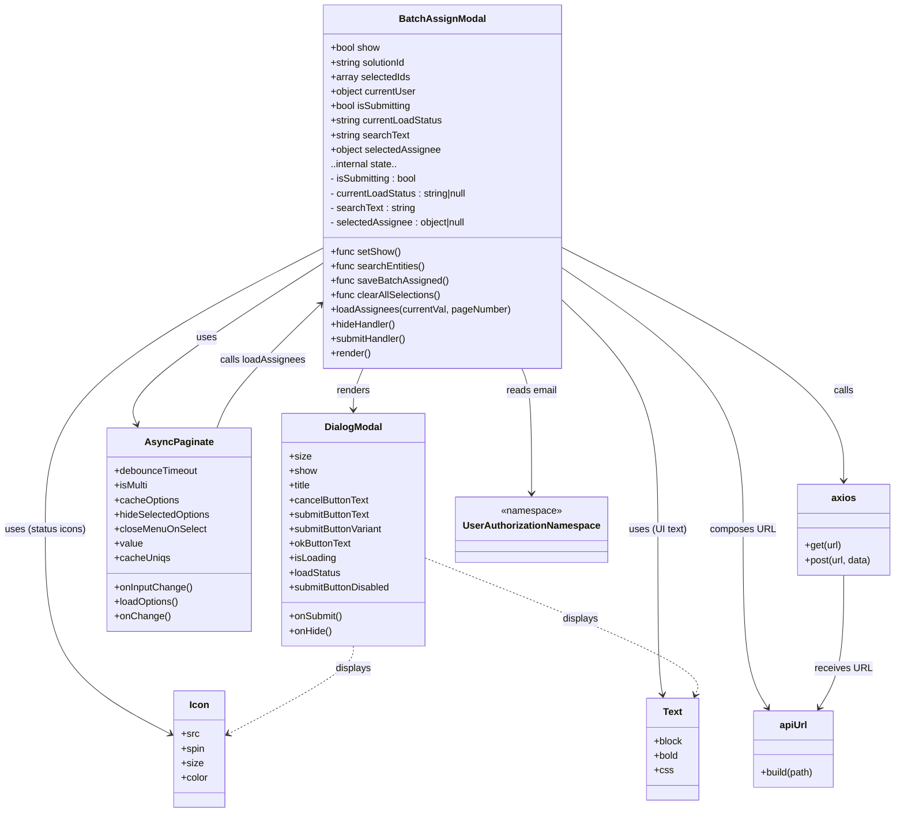

# Diagram: web/portal/src/pages/damageview/search/components/BatchAssign.modal.js

> Auto-generated by Obscura crawlers

## Mermaid

### SVG

<svg id="container" width="1467.515625" xmlns="http://www.w3.org/2000/svg" class="classDiagram" height="1340" viewBox="0 0 1467.515625 1340" role="graphics-document document" aria-roledescription="class"><g><defs><marker id="container_class-aggregationStart" class="marker aggregation class" refX="18" refY="7" markerWidth="190" markerHeight="240" orient="auto"><path d="M 18,7 L9,13 L1,7 L9,1 Z"></path></marker></defs><defs><marker id="container_class-aggregationEnd" class="marker aggregation class" refX="1" refY="7" markerWidth="20" markerHeight="28" orient="auto"><path d="M 18,7 L9,13 L1,7 L9,1 Z"></path></marker></defs><defs><marker id="container_class-extensionStart" class="marker extension class" refX="18" refY="7" markerWidth="190" markerHeight="240" orient="auto"><path d="M 1,7 L18,13 V 1 Z"></path></marker></defs><defs><marker id="container_class-extensionEnd" class="marker extension class" refX="1" refY="7" markerWidth="20" markerHeight="28" orient="auto"><path d="M 1,1 V 13 L18,7 Z"></path></marker></defs><defs><marker id="container_class-compositionStart" class="marker composition class" refX="18" refY="7" markerWidth="190" markerHeight="240" orient="auto"><path d="M 18,7 L9,13 L1,7 L9,1 Z"></path></marker></defs><defs><marker id="container_class-compositionEnd" class="marker composition class" refX="1" refY="7" markerWidth="20" markerHeight="28" orient="auto"><path d="M 18,7 L9,13 L1,7 L9,1 Z"></path></marker></defs><defs><marker id="container_class-dependencyStart" class="marker dependency class" refX="6" refY="7" markerWidth="190" markerHeight="240" orient="auto"><path d="M 5,7 L9,13 L1,7 L9,1 Z"></path></marker></defs><defs><marker id="container_class-dependencyEnd" class="marker dependency class" refX="13" refY="7" markerWidth="20" markerHeight="28" orient="auto"><path d="M 18,7 L9,13 L14,7 L9,1 Z"></path></marker></defs><defs><marker id="container_class-lollipopStart" class="marker lollipop class" refX="13" refY="7" markerWidth="190" markerHeight="240" orient="auto"><circle stroke="black" fill="transparent" cx="7" cy="7" r="6"></circle></marker></defs><defs><marker id="container_class-lollipopEnd" class="marker lollipop class" refX="1" refY="7" markerWidth="190" markerHeight="240" orient="auto"><circle stroke="black" fill="transparent" cx="7" cy="7" r="6"></circle></marker></defs><g class="root"><g class="clusters"></g><g class="edgePaths"><path d="M599.518,608L596.861,614.167C594.205,620.333,588.891,632.667,586.235,644C583.578,655.333,583.578,665.667,583.578,670.833L583.578,676" id="id_BatchAssignModal_DialogModal_1" class="edge-thickness-normal edge-pattern-solid relation" style=";;;" data-edge="true" data-et="edge" data-id="id_BatchAssignModal_DialogModal_1" data-points="W3sieCI6NTk5LjUxNzczNDYwNjgyNDksInkiOjYwOH0seyJ4Ijo1ODMuNTc4MTI1LCJ5Ijo2NDV9LHsieCI6NTgzLjU3ODEyNSwieSI6NjgyfV0=" marker-end="url(#container_class-dependencyEnd)"></path><path d="M534.992,432.318L479.743,467.765C424.494,503.212,313.996,574.106,262.454,618.791C210.911,663.477,218.324,681.954,222.03,691.193L225.737,700.431" id="id_BatchAssignModal_AsyncPaginate_2" class="edge-thickness-normal edge-pattern-solid relation" style=";;;" data-edge="true" data-et="edge" data-id="id_BatchAssignModal_AsyncPaginate_2" data-points="W3sieCI6NTM0Ljk5MjE4NzUsInkiOjQzMi4zMTc1NjYwODUyMzMxfSx7IngiOjIwMy40OTgwNDY4NzUsInkiOjY0NX0seyJ4IjoyMjcuOTcwNzc5ODg1MzcxMTcsInkiOjcwNn1d" marker-end="url(#container_class-dependencyEnd)"></path><path d="M534.992,407.903L458.349,447.419C381.706,486.935,228.419,565.968,151.776,643.65C75.133,721.333,75.133,797.667,75.133,874C75.133,950.333,75.133,1026.667,109.609,1082.87C144.085,1139.073,213.036,1175.146,247.512,1193.183L281.988,1211.219" id="id_BatchAssignModal_Icon_3" class="edge-thickness-normal edge-pattern-solid relation" style=";;;" data-edge="true" data-et="edge" data-id="id_BatchAssignModal_Icon_3" data-points="W3sieCI6NTM0Ljk5MjE4NzUsInkiOjQwNy45MDI4NzMzOTgzNTUzfSx7IngiOjc1LjEzMjgxMjUsInkiOjY0NX0seyJ4Ijo3NS4xMzI4MTI1LCJ5Ijo4NzR9LHsieCI6NzUuMTMyODEyNSwieSI6MTEwM30seyJ4IjoyODcuMzA0Njg3NSwieSI6MTIxNC4wMDA1Njg1MjIzMDN9XQ==" marker-end="url(#container_class-dependencyEnd)"></path><path d="M922.523,495.729L948.202,520.608C973.88,545.486,1025.237,595.243,1050.915,658.288C1076.594,721.333,1076.594,797.667,1076.594,874C1076.594,950.333,1076.594,1026.667,1077.936,1072.017C1079.277,1117.367,1081.961,1131.735,1083.303,1138.918L1084.645,1146.102" id="id_BatchAssignModal_Text_4" class="edge-thickness-normal edge-pattern-solid relation" style=";;;" data-edge="true" data-et="edge" data-id="id_BatchAssignModal_Text_4" data-points="W3sieCI6OTIyLjUyMzQzNzUsInkiOjQ5NS43MjkzNTMzNjc5MjIxNn0seyJ4IjoxMDc2LjU5Mzc1LCJ5Ijo2NDV9LHsieCI6MTA3Ni41OTM3NSwieSI6ODc0fSx7IngiOjEwNzYuNTkzNzUsInkiOjExMDN9LHsieCI6MTA4NS43NDY3MTA1MjYzMTU4LCJ5IjoxMTUyfV0=" marker-end="url(#container_class-dependencyEnd)"></path><path d="M922.523,407.936L999.131,447.446C1075.738,486.957,1228.953,565.979,1305.561,630.156C1382.168,694.333,1382.168,743.667,1382.168,768.333L1382.168,793" id="id_BatchAssignModal_axios_5" class="edge-thickness-normal edge-pattern-solid relation" style=";;;" data-edge="true" data-et="edge" data-id="id_BatchAssignModal_axios_5" data-points="W3sieCI6OTIyLjUyMzQzNzUsInkiOjQwNy45MzU3MjE4NDM5MzE4fSx7IngiOjEzODIuMTY3OTY4NzUsInkiOjY0NX0seyJ4IjoxMzgyLjE2Nzk2ODc1LCJ5Ijo3OTl9XQ==" marker-end="url(#container_class-dependencyEnd)"></path><path d="M922.523,441.709L971.624,475.591C1020.724,509.473,1118.924,577.236,1168.025,649.285C1217.125,721.333,1217.125,797.667,1217.125,874C1217.125,950.333,1217.125,1026.667,1223.837,1075.65C1230.548,1124.634,1243.971,1146.268,1250.683,1157.085L1257.394,1167.902" id="id_BatchAssignModal_apiUrl_6" class="edge-thickness-normal edge-pattern-solid relation" style=";;;" data-edge="true" data-et="edge" data-id="id_BatchAssignModal_apiUrl_6" data-points="W3sieCI6OTIyLjUyMzQzNzUsInkiOjQ0MS43MDg4NTEyNDIxODEzN30seyJ4IjoxMjE3LjEyNSwieSI6NjQ1fSx7IngiOjEyMTcuMTI1LCJ5Ijo4NzR9LHsieCI6MTIxNy4xMjUsInkiOjExMDN9LHsieCI6MTI2MC41NTczNjAxOTczNjgzLCJ5IjoxMTczfV0=" marker-end="url(#container_class-dependencyEnd)"></path><path d="M857.998,608L860.654,614.167C863.311,620.333,868.624,632.667,871.281,667C873.938,701.333,873.938,757.667,873.938,785.833L873.938,814" id="id_BatchAssignModal_UserAuthorizationNamespace_7" class="edge-thickness-normal edge-pattern-solid relation" style=";;;" data-edge="true" data-et="edge" data-id="id_BatchAssignModal_UserAuthorizationNamespace_7" data-points="W3sieCI6ODU3Ljk5Nzg5MDM5MzE3NTEsInkiOjYwOH0seyJ4Ijo4NzMuOTM3NSwieSI6NjQ1fSx7IngiOjg3My45Mzc1LCJ5Ijo4MjB9XQ==" marker-end="url(#container_class-dependencyEnd)"></path><path d="M357.848,706L361.629,695.833C365.41,685.667,372.972,665.333,401.777,630.949C430.582,596.564,480.631,548.128,505.656,523.91L530.681,499.692" id="id_AsyncPaginate_BatchAssignModal_8" class="edge-thickness-normal edge-pattern-solid relation" style=";;;" data-edge="true" data-et="edge" data-id="id_AsyncPaginate_BatchAssignModal_8" data-points="W3sieCI6MzU3Ljg0ODA5OTc1NDM2NjgsInkiOjcwNn0seyJ4IjozODAuNTMzMjAzMTI1LCJ5Ijo2NDV9LHsieCI6NTM0Ljk5MjE4NzUsInkiOjQ5NS41MTk4MTg3MjMzMjMxfV0=" marker-end="url(#container_class-dependencyEnd)"></path><path d="M1382.168,949L1382.168,974.667C1382.168,1000.333,1382.168,1051.667,1375.456,1088.15C1368.745,1124.634,1355.322,1146.268,1348.61,1157.085L1341.899,1167.902" id="id_axios_apiUrl_9" class="edge-thickness-normal edge-pattern-solid relation" style=";;;" data-edge="true" data-et="edge" data-id="id_axios_apiUrl_9" data-points="W3sieCI6MTM4Mi4xNjc5Njg3NSwieSI6OTQ5fSx7IngiOjEzODIuMTY3OTY4NzUsInkiOjExMDN9LHsieCI6MTMzOC43MzU2MDg1NTI2MzE3LCJ5IjoxMTczfV0=" marker-end="url(#container_class-dependencyEnd)"></path><path d="M583.578,1066L583.578,1072.167C583.578,1078.333,583.578,1090.667,549.102,1114.87C514.626,1139.073,445.674,1175.146,411.199,1193.183L376.723,1211.219" id="id_DialogModal_Icon_10" class="edge-thickness-normal edge-pattern-dashed relation" style=";;;" data-edge="true" data-et="edge" data-id="id_DialogModal_Icon_10" data-points="W3sieCI6NTgzLjU3ODEyNSwieSI6MTA2Nn0seyJ4Ijo1ODMuNTc4MTI1LCJ5IjoxMTAzfSx7IngiOjM3MS40MDYyNSwieSI6MTIxNC4wMDA1Njg1MjIzMDN9XQ==" marker-end="url(#container_class-dependencyEnd)"></path><path d="M703.68,921.957L779.246,952.131C854.813,982.305,1005.945,1042.652,1078.481,1080.07C1151.017,1117.488,1144.956,1131.977,1141.925,1139.221L1138.895,1146.465" id="id_DialogModal_Text_11" class="edge-thickness-normal edge-pattern-dashed relation" style=";;;" data-edge="true" data-et="edge" data-id="id_DialogModal_Text_11" data-points="W3sieCI6NzAzLjY3OTY4NzUsInkiOjkyMS45NTY4NTc1NjMyMDg0fSx7IngiOjExNTcuMDc4MTI1LCJ5IjoxMTAzfSx7IngiOjExMzYuNTc4OTQ3MzY4NDIxLCJ5IjoxMTUyfV0=" marker-end="url(#container_class-dependencyEnd)"></path></g><g class="edgeLabels"><g class="edgeLabel" transform="translate(583.578125, 645)"><g class="label" data-id="id_BatchAssignModal_DialogModal_1" transform="translate(-27.75, -12)"><foreignObject width="55.5" height="24">

renders

</foreignObject></g></g><g class="edgeLabel" transform="translate(341.58548, 556.40486)"><g class="label" data-id="id_BatchAssignModal_AsyncPaginate_2" transform="translate(-16.4921875, -12)"><foreignObject width="32.984375" height="24">

uses

</foreignObject></g></g><g class="edgeLabel" transform="translate(75.1328125, 874)"><g class="label" data-id="id_BatchAssignModal_Icon_3" transform="translate(-67.1328125, -12)"><foreignObject width="134.265625" height="24">

uses (status icons)

</foreignObject></g></g><g class="edgeLabel" transform="translate(1076.59375, 874)"><g class="label" data-id="id_BatchAssignModal_Text_4" transform="translate(-47.3984375, -12)"><foreignObject width="94.796875" height="24">

uses (UI text)

</foreignObject></g></g><g class="edgeLabel" transform="translate(1382.16796875, 645)"><g class="label" data-id="id_BatchAssignModal_axios_5" transform="translate(-16.4453125, -12)"><foreignObject width="32.890625" height="24">

calls

</foreignObject></g></g><g class="edgeLabel" transform="translate(1217.125, 874)"><g class="label" data-id="id_BatchAssignModal_apiUrl_6" transform="translate(-52.6953125, -12)"><foreignObject width="105.390625" height="24">

composes URL

</foreignObject></g></g><g class="edgeLabel" transform="translate(873.9375, 645)"><g class="label" data-id="id_BatchAssignModal_UserAuthorizationNamespace_7" transform="translate(-42.2890625, -12)"><foreignObject width="84.578125" height="24">

reads email

</foreignObject></g></g><g class="edgeLabel" transform="translate(434.37909, 592.88977)"><g class="label" data-id="id_AsyncPaginate_BatchAssignModal_8" transform="translate(-70.1328125, -12)"><foreignObject width="140.265625" height="24">

calls loadAssignees

</foreignObject></g></g><g class="edgeLabel" transform="translate(1382.16796875, 1103)"><g class="label" data-id="id_axios_apiUrl_9" transform="translate(-45.734375, -12)"><foreignObject width="91.46875" height="24">

receives URL

</foreignObject></g></g><g class="edgeLabel" transform="translate(583.578125, 1103)"><g class="label" data-id="id_DialogModal_Icon_10" transform="translate(-29.6875, -12)"><foreignObject width="59.375" height="24">

displays

</foreignObject></g></g><g class="edgeLabel" transform="translate(955.04291, 1022.32683)"><g class="label" data-id="id_DialogModal_Text_11" transform="translate(-29.6875, -12)"><foreignObject width="59.375" height="24">

displays

</foreignObject></g></g></g><g class="nodes"><g class="node default" id="classId-BatchAssignModal-0" transform="translate(728.7578125, 308)"><g class="basic label-container"><path d="M-193.765625 -300 L193.765625 -300 L193.765625 300 L-193.765625 300" stroke="none" stroke-width="0" fill="#ECECFF" style=""></path><path d="M-193.765625 -300 C-70.33344683700001 -300, 53.09873132599998 -300, 193.765625 -300 M-193.765625 -300 C-67.46366492425565 -300, 58.838295151488694 -300, 193.765625 -300 M193.765625 -300 C193.765625 -143.73623088962685, 193.765625 12.527538220746294, 193.765625 300 M193.765625 -300 C193.765625 -154.39875503651044, 193.765625 -8.797510073020874, 193.765625 300 M193.765625 300 C104.603309127116 300, 15.440993254232012 300, -193.765625 300 M193.765625 300 C82.46637054804474 300, -28.832883903910528 300, -193.765625 300 M-193.765625 300 C-193.765625 163.7140048704106, -193.765625 27.42800974082121, -193.765625 -300 M-193.765625 300 C-193.765625 77.4468951160271, -193.765625 -145.1062097679458, -193.765625 -300" stroke="#9370DB" stroke-width="1.3" fill="none" stroke-dasharray="0 0" style=""></path></g><g class="annotation-group text" transform="translate(0, -276)"></g><g class="label-group text" transform="translate(-66.828125, -276)"><g class="label" style="font-weight: bolder" transform="translate(0,-12)"><foreignObject width="133.65625" height="24">

BatchAssignModal

</foreignObject></g></g><g class="members-group text" transform="translate(-181.765625, -228)"><g class="label" style="" transform="translate(0,-12)"><foreignObject width="82.78125" height="24">

+bool show

</foreignObject></g><g class="label" style="" transform="translate(0,12)"><foreignObject width="127.96875" height="24">

+string solutionId

</foreignObject></g><g class="label" style="" transform="translate(0,36)"><foreignObject width="131.578125" height="24">

+array selectedIds

</foreignObject></g><g class="label" style="" transform="translate(0,60)"><foreignObject width="143.125" height="24">

+object currentUser

</foreignObject></g><g class="label" style="" transform="translate(0,84)"><foreignObject width="136.609375" height="24">

+bool isSubmitting

</foreignObject></g><g class="label" style="" transform="translate(0,108)"><foreignObject width="187.078125" height="24">

+string currentLoadStatus

</foreignObject></g><g class="label" style="" transform="translate(0,132)"><foreignObject width="130.828125" height="24">

+string searchText

</foreignObject></g><g class="label" style="" transform="translate(0,156)"><foreignObject width="182.296875" height="24">

+object selectedAssignee

</foreignObject></g><g class="label" style="" transform="translate(0,180)"><foreignObject width="112.46875" height="24">

..internal state..

</foreignObject></g><g class="label" style="" transform="translate(0,204)"><foreignObject width="147.40625" height="24">

- isSubmitting : bool

</foreignObject></g><g class="label" style="" transform="translate(0,228)"><foreignObject width="232.375" height="24">

- currentLoadStatus : string|null

</foreignObject></g><g class="label" style="" transform="translate(0,252)"><foreignObject width="141.609375" height="24">

- searchText : string

</foreignObject></g><g class="label" style="" transform="translate(0,276)"><foreignObject width="227.59375" height="24">

- selectedAssignee : object|null

</foreignObject></g></g><g class="methods-group text" transform="translate(-181.765625, 108)"><g class="label" style="" transform="translate(0,-12)"><foreignObject width="114.9375" height="24">

+func setShow()

</foreignObject></g><g class="label" style="" transform="translate(0,12)"><foreignObject width="156.0625" height="24">

+func searchEntities()

</foreignObject></g><g class="label" style="" transform="translate(0,36)"><foreignObject width="191.796875" height="24">

+func saveBatchAssigned()

</foreignObject></g><g class="label" style="" transform="translate(0,60)"><foreignObject width="183.1875" height="24">

+func clearAllSelections()

</foreignObject></g><g class="label" style="" transform="translate(0,84)"><foreignObject width="296.703125" height="24">

+loadAssignees(currentVal, pageNumber)

</foreignObject></g><g class="label" style="" transform="translate(0,108)"><foreignObject width="108.5625" height="24">

+hideHandler()

</foreignObject></g><g class="label" style="" transform="translate(0,132)"><foreignObject width="126.6875" height="24">

+submitHandler()

</foreignObject></g><g class="label" style="" transform="translate(0,156)"><foreignObject width="66.609375" height="24">

+render()

</foreignObject></g></g><g class="divider" style=""><path d="M-193.765625 -252 C-113.71918019434352 -252, -33.672735388687045 -252, 193.765625 -252 M-193.765625 -252 C-73.46266889237835 -252, 46.84028721524331 -252, 193.765625 -252" stroke="#9370DB" stroke-width="1.3" fill="none" stroke-dasharray="0 0" style=""></path></g><g class="divider" style=""><path d="M-193.765625 84 C-52.780807290237306 84, 88.20401041952539 84, 193.765625 84 M-193.765625 84 C-94.00436032127718 84, 5.756904357445649 84, 193.765625 84" stroke="#9370DB" stroke-width="1.3" fill="none" stroke-dasharray="0 0" style=""></path></g></g><g class="node default" id="classId-DialogModal-1" transform="translate(583.578125, 874)"><g class="basic label-container"><path d="M-120.1015625 -192 L120.1015625 -192 L120.1015625 192 L-120.1015625 192" stroke="none" stroke-width="0" fill="#ECECFF" style=""></path><path d="M-120.1015625 -192 C-55.65019237851756 -192, 8.801177742964882 -192, 120.1015625 -192 M-120.1015625 -192 C-32.85140843358529 -192, 54.39874563282942 -192, 120.1015625 -192 M120.1015625 -192 C120.1015625 -64.43708980335187, 120.1015625 63.125820393296266, 120.1015625 192 M120.1015625 -192 C120.1015625 -57.14421398429431, 120.1015625 77.71157203141138, 120.1015625 192 M120.1015625 192 C37.830845773035605 192, -44.43987095392879 192, -120.1015625 192 M120.1015625 192 C68.12968142616063 192, 16.157800352321246 192, -120.1015625 192 M-120.1015625 192 C-120.1015625 46.05347779946095, -120.1015625 -99.8930444010781, -120.1015625 -192 M-120.1015625 192 C-120.1015625 44.55719355579211, -120.1015625 -102.88561288841578, -120.1015625 -192" stroke="#9370DB" stroke-width="1.3" fill="none" stroke-dasharray="0 0" style=""></path></g><g class="annotation-group text" transform="translate(0, -168)"></g><g class="label-group text" transform="translate(-45.625, -168)"><g class="label" style="font-weight: bolder" transform="translate(0,-12)"><foreignObject width="91.25" height="24">

DialogModal

</foreignObject></g></g><g class="members-group text" transform="translate(-108.1015625, -120)"><g class="label" style="" transform="translate(0,-12)"><foreignObject width="35.578125" height="24">

+size

</foreignObject></g><g class="label" style="" transform="translate(0,12)"><foreignObject width="45.65625" height="24">

+show

</foreignObject></g><g class="label" style="" transform="translate(0,36)"><foreignObject width="37.140625" height="24">

+title

</foreignObject></g><g class="label" style="" transform="translate(0,60)"><foreignObject width="132.875" height="24">

+cancelButtonText

</foreignObject></g><g class="label" style="" transform="translate(0,84)"><foreignObject width="136.859375" height="24">

+submitButtonText

</foreignObject></g><g class="label" style="" transform="translate(0,108)"><foreignObject width="158.859375" height="24">

+submitButtonVariant

</foreignObject></g><g class="label" style="" transform="translate(0,132)"><foreignObject width="104.109375" height="24">

+okButtonText

</foreignObject></g><g class="label" style="" transform="translate(0,156)"><foreignObject width="77.203125" height="24">

+isLoading

</foreignObject></g><g class="label" style="" transform="translate(0,180)"><foreignObject width="85.703125" height="24">

+loadStatus

</foreignObject></g><g class="label" style="" transform="translate(0,204)"><foreignObject width="170.578125" height="24">

+submitButtonDisabled

</foreignObject></g></g><g class="methods-group text" transform="translate(-108.1015625, 144)"><g class="label" style="" transform="translate(0,-12)"><foreignObject width="88.609375" height="24">

+onSubmit()

</foreignObject></g><g class="label" style="" transform="translate(0,12)"><foreignObject width="70.765625" height="24">

+onHide()

</foreignObject></g></g><g class="divider" style=""><path d="M-120.1015625 -144 C-35.35458228160499 -144, 49.39239793679002 -144, 120.1015625 -144 M-120.1015625 -144 C-30.925359139111393 -144, 58.250844221777214 -144, 120.1015625 -144" stroke="#9370DB" stroke-width="1.3" fill="none" stroke-dasharray="0 0" style=""></path></g><g class="divider" style=""><path d="M-120.1015625 120 C-47.55747605234504 120, 24.986610395309924 120, 120.1015625 120 M-120.1015625 120 C-27.2594369717703 120, 65.5826885564594 120, 120.1015625 120" stroke="#9370DB" stroke-width="1.3" fill="none" stroke-dasharray="0 0" style=""></path></g></g><g class="node default" id="classId-AsyncPaginate-2" transform="translate(295.37109375, 874)"><g class="basic label-container"><path d="M-118.10546875 -168 L118.10546875 -168 L118.10546875 168 L-118.10546875 168" stroke="none" stroke-width="0" fill="#ECECFF" style=""></path><path d="M-118.10546875 -168 C-38.769047255113605 -168, 40.56737423977279 -168, 118.10546875 -168 M-118.10546875 -168 C-69.88239221188906 -168, -21.65931567377811 -168, 118.10546875 -168 M118.10546875 -168 C118.10546875 -88.54795708304455, 118.10546875 -9.095914166089102, 118.10546875 168 M118.10546875 -168 C118.10546875 -36.67998560161513, 118.10546875 94.64002879676974, 118.10546875 168 M118.10546875 168 C54.3449378148917 168, -9.415593120216599 168, -118.10546875 168 M118.10546875 168 C37.51603442569015 168, -43.0733998986197 168, -118.10546875 168 M-118.10546875 168 C-118.10546875 45.57234100960325, -118.10546875 -76.8553179807935, -118.10546875 -168 M-118.10546875 168 C-118.10546875 53.71586295100951, -118.10546875 -60.568274097980975, -118.10546875 -168" stroke="#9370DB" stroke-width="1.3" fill="none" stroke-dasharray="0 0" style=""></path></g><g class="annotation-group text" transform="translate(0, -144)"></g><g class="label-group text" transform="translate(-52.7421875, -144)"><g class="label" style="font-weight: bolder" transform="translate(0,-12)"><foreignObject width="105.484375" height="24">

AsyncPaginate

</foreignObject></g></g><g class="members-group text" transform="translate(-106.10546875, -96)"><g class="label" style="" transform="translate(0,-12)"><foreignObject width="139.515625" height="24">

+debounceTimeout

</foreignObject></g><g class="label" style="" transform="translate(0,12)"><foreignObject width="56.71875" height="24">

+isMulti

</foreignObject></g><g class="label" style="" transform="translate(0,36)"><foreignObject width="106.984375" height="24">

+cacheOptions

</foreignObject></g><g class="label" style="" transform="translate(0,60)"><foreignObject width="159.46875" height="24">

+hideSelectedOptions

</foreignObject></g><g class="label" style="" transform="translate(0,84)"><foreignObject width="150.28125" height="24">

+closeMenuOnSelect

</foreignObject></g><g class="label" style="" transform="translate(0,108)"><foreignObject width="46.71875" height="24">

+value

</foreignObject></g><g class="label" style="" transform="translate(0,132)"><foreignObject width="91.453125" height="24">

+cacheUniqs

</foreignObject></g></g><g class="methods-group text" transform="translate(-106.10546875, 96)"><g class="label" style="" transform="translate(0,-12)"><foreignObject width="128.8125" height="24">

+onInputChange()

</foreignObject></g><g class="label" style="" transform="translate(0,12)"><foreignObject width="107.484375" height="24">

+loadOptions()

</foreignObject></g><g class="label" style="" transform="translate(0,36)"><foreignObject width="90.125" height="24">

+onChange()

</foreignObject></g></g><g class="divider" style=""><path d="M-118.10546875 -120 C-42.28451430528614 -120, 33.536440139427725 -120, 118.10546875 -120 M-118.10546875 -120 C-46.24309928651658 -120, 25.619270176966836 -120, 118.10546875 -120" stroke="#9370DB" stroke-width="1.3" fill="none" stroke-dasharray="0 0" style=""></path></g><g class="divider" style=""><path d="M-118.10546875 72 C-29.01061566203053 72, 60.08423742593894 72, 118.10546875 72 M-118.10546875 72 C-43.41372342503833 72, 31.278021899923345 72, 118.10546875 72" stroke="#9370DB" stroke-width="1.3" fill="none" stroke-dasharray="0 0" style=""></path></g></g><g class="node default" id="classId-Icon-3" transform="translate(329.35546875, 1236)"><g class="basic label-container"><path d="M-42.05078125 -96 L42.05078125 -96 L42.05078125 96 L-42.05078125 96" stroke="none" stroke-width="0" fill="#ECECFF" style=""></path><path d="M-42.05078125 -96 C-14.811150044630185 -96, 12.42848116073963 -96, 42.05078125 -96 M-42.05078125 -96 C-17.316796742788338 -96, 7.417187764423325 -96, 42.05078125 -96 M42.05078125 -96 C42.05078125 -56.41113941770655, 42.05078125 -16.8222788354131, 42.05078125 96 M42.05078125 -96 C42.05078125 -27.788029841038437, 42.05078125 40.423940317923126, 42.05078125 96 M42.05078125 96 C21.232541910761658 96, 0.41430257152331507 96, -42.05078125 96 M42.05078125 96 C13.72322718614518 96, -14.604326877709639 96, -42.05078125 96 M-42.05078125 96 C-42.05078125 36.51330142913577, -42.05078125 -22.973397141728455, -42.05078125 -96 M-42.05078125 96 C-42.05078125 41.605115504592746, -42.05078125 -12.789768990814508, -42.05078125 -96" stroke="#9370DB" stroke-width="1.3" fill="none" stroke-dasharray="0 0" style=""></path></g><g class="annotation-group text" transform="translate(0, -72)"></g><g class="label-group text" transform="translate(-15.3046875, -72)"><g class="label" style="font-weight: bolder" transform="translate(0,-12)"><foreignObject width="30.609375" height="24">

Icon

</foreignObject></g></g><g class="members-group text" transform="translate(-30.05078125, -24)"><g class="label" style="" transform="translate(0,-12)"><foreignObject width="28.8125" height="24">

+src

</foreignObject></g><g class="label" style="" transform="translate(0,12)"><foreignObject width="38.859375" height="24">

+spin

</foreignObject></g><g class="label" style="" transform="translate(0,36)"><foreignObject width="35.578125" height="24">

+size

</foreignObject></g><g class="label" style="" transform="translate(0,60)"><foreignObject width="44.796875" height="24">

+color

</foreignObject></g></g><g class="methods-group text" transform="translate(-30.05078125, 96)"></g><g class="divider" style=""><path d="M-42.05078125 -48 C-24.329777491868708 -48, -6.608773733737415 -48, 42.05078125 -48 M-42.05078125 -48 C-25.2039235317969 -48, -8.357065813593799 -48, 42.05078125 -48" stroke="#9370DB" stroke-width="1.3" fill="none" stroke-dasharray="0 0" style=""></path></g><g class="divider" style=""><path d="M-42.05078125 72 C-11.772143848531258 72, 18.506493552937485 72, 42.05078125 72 M-42.05078125 72 C-17.86315034868355 72, 6.324480552632899 72, 42.05078125 72" stroke="#9370DB" stroke-width="1.3" fill="none" stroke-dasharray="0 0" style=""></path></g></g><g class="node default" id="classId-Text-4" transform="translate(1101.4375, 1236)"><g class="basic label-container"><path d="M-43.33203125 -84 L43.33203125 -84 L43.33203125 84 L-43.33203125 84" stroke="none" stroke-width="0" fill="#ECECFF" style=""></path><path d="M-43.33203125 -84 C-12.906700543786478 -84, 17.518630162427044 -84, 43.33203125 -84 M-43.33203125 -84 C-12.218834850123685 -84, 18.89436154975263 -84, 43.33203125 -84 M43.33203125 -84 C43.33203125 -41.76506454093543, 43.33203125 0.4698709181291463, 43.33203125 84 M43.33203125 -84 C43.33203125 -45.95546928465443, 43.33203125 -7.910938569308854, 43.33203125 84 M43.33203125 84 C20.163110966538177 84, -3.0058093169236457 84, -43.33203125 84 M43.33203125 84 C23.671092442598784 84, 4.010153635197568 84, -43.33203125 84 M-43.33203125 84 C-43.33203125 24.42364434168192, -43.33203125 -35.15271131663616, -43.33203125 -84 M-43.33203125 84 C-43.33203125 35.07262098614383, -43.33203125 -13.854758027712336, -43.33203125 -84" stroke="#9370DB" stroke-width="1.3" fill="none" stroke-dasharray="0 0" style=""></path></g><g class="annotation-group text" transform="translate(0, -60)"></g><g class="label-group text" transform="translate(-15.3828125, -60)"><g class="label" style="font-weight: bolder" transform="translate(0,-12)"><foreignObject width="30.765625" height="24">

Text

</foreignObject></g></g><g class="members-group text" transform="translate(-31.33203125, -12)"><g class="label" style="" transform="translate(0,-12)"><foreignObject width="47.28125" height="24">

+block

</foreignObject></g><g class="label" style="" transform="translate(0,12)"><foreignObject width="41.015625" height="24">

+bold

</foreignObject></g><g class="label" style="" transform="translate(0,36)"><foreignObject width="30.421875" height="24">

+css

</foreignObject></g></g><g class="methods-group text" transform="translate(-31.33203125, 84)"></g><g class="divider" style=""><path d="M-43.33203125 -36 C-18.790996367912378 -36, 5.750038514175245 -36, 43.33203125 -36 M-43.33203125 -36 C-16.29959884136695 -36, 10.732833567266098 -36, 43.33203125 -36" stroke="#9370DB" stroke-width="1.3" fill="none" stroke-dasharray="0 0" style=""></path></g><g class="divider" style=""><path d="M-43.33203125 60 C-17.38762745753973 60, 8.556776334920542 60, 43.33203125 60 M-43.33203125 60 C-13.858929580676598 60, 15.614172088646804 60, 43.33203125 60" stroke="#9370DB" stroke-width="1.3" fill="none" stroke-dasharray="0 0" style=""></path></g></g><g class="node default" id="classId-axios-5" transform="translate(1382.16796875, 874)"><g class="basic label-container"><path d="M-77.34765625 -75 L77.34765625 -75 L77.34765625 75 L-77.34765625 75" stroke="none" stroke-width="0" fill="#ECECFF" style=""></path><path d="M-77.34765625 -75 C-31.049907569627166 -75, 15.247841110745668 -75, 77.34765625 -75 M-77.34765625 -75 C-32.83740428212248 -75, 11.672847685755045 -75, 77.34765625 -75 M77.34765625 -75 C77.34765625 -18.2368995979633, 77.34765625 38.5262008040734, 77.34765625 75 M77.34765625 -75 C77.34765625 -20.07506476180533, 77.34765625 34.84987047638934, 77.34765625 75 M77.34765625 75 C31.48115075744326 75, -14.38535473511348 75, -77.34765625 75 M77.34765625 75 C42.87456684112713 75, 8.401477432254254 75, -77.34765625 75 M-77.34765625 75 C-77.34765625 44.12257524191686, -77.34765625 13.245150483833733, -77.34765625 -75 M-77.34765625 75 C-77.34765625 20.76075374602427, -77.34765625 -33.47849250795146, -77.34765625 -75" stroke="#9370DB" stroke-width="1.3" fill="none" stroke-dasharray="0 0" style=""></path></g><g class="annotation-group text" transform="translate(0, -51)"></g><g class="label-group text" transform="translate(-19.2734375, -51)"><g class="label" style="font-weight: bolder" transform="translate(0,-12)"><foreignObject width="38.546875" height="24">

axios

</foreignObject></g></g><g class="members-group text" transform="translate(-65.34765625, -3)"></g><g class="methods-group text" transform="translate(-65.34765625, 27)"><g class="label" style="" transform="translate(0,-12)"><foreignObject width="61.09375" height="24">

+get(url)

</foreignObject></g><g class="label" style="" transform="translate(0,12)"><foreignObject width="111.421875" height="24">

+post(url, data)

</foreignObject></g></g><g class="divider" style=""><path d="M-77.34765625 -27 C-16.95041373465493 -27, 43.44682878069014 -27, 77.34765625 -27 M-77.34765625 -27 C-29.44519514373193 -27, 18.45726596253614 -27, 77.34765625 -27" stroke="#9370DB" stroke-width="1.3" fill="none" stroke-dasharray="0 0" style=""></path></g><g class="divider" style=""><path d="M-77.34765625 -3 C-21.491937380655514 -3, 34.36378148868897 -3, 77.34765625 -3 M-77.34765625 -3 C-41.85935842324634 -3, -6.371060596492683 -3, 77.34765625 -3" stroke="#9370DB" stroke-width="1.3" fill="none" stroke-dasharray="0 0" style=""></path></g></g><g class="node default" id="classId-apiUrl-6" transform="translate(1299.646484375, 1236)"><g class="basic label-container"><path d="M-67.63671875 -63 L67.63671875 -63 L67.63671875 63 L-67.63671875 63" stroke="none" stroke-width="0" fill="#ECECFF" style=""></path><path d="M-67.63671875 -63 C-20.248586021832203 -63, 27.139546706335594 -63, 67.63671875 -63 M-67.63671875 -63 C-32.69207276078313 -63, 2.2525732284337465 -63, 67.63671875 -63 M67.63671875 -63 C67.63671875 -28.78211716580435, 67.63671875 5.435765668391298, 67.63671875 63 M67.63671875 -63 C67.63671875 -28.490988396927598, 67.63671875 6.018023206144804, 67.63671875 63 M67.63671875 63 C26.09676452432143 63, -15.443189701357142 63, -67.63671875 63 M67.63671875 63 C34.08922548438955 63, 0.5417322187791029 63, -67.63671875 63 M-67.63671875 63 C-67.63671875 36.68390946330584, -67.63671875 10.367818926611683, -67.63671875 -63 M-67.63671875 63 C-67.63671875 13.801600255432213, -67.63671875 -35.396799489135574, -67.63671875 -63" stroke="#9370DB" stroke-width="1.3" fill="none" stroke-dasharray="0 0" style=""></path></g><g class="annotation-group text" transform="translate(0, -39)"></g><g class="label-group text" transform="translate(-22.2109375, -39)"><g class="label" style="font-weight: bolder" transform="translate(0,-12)"><foreignObject width="44.421875" height="24">

apiUrl

</foreignObject></g></g><g class="members-group text" transform="translate(-55.63671875, 9)"></g><g class="methods-group text" transform="translate(-55.63671875, 39)"><g class="label" style="" transform="translate(0,-12)"><foreignObject width="89.0625" height="24">

+build(path)

</foreignObject></g></g><g class="divider" style=""><path d="M-67.63671875 -15 C-24.724224825580784 -15, 18.188269098838433 -15, 67.63671875 -15 M-67.63671875 -15 C-28.59848818186157 -15, 10.439742386276862 -15, 67.63671875 -15" stroke="#9370DB" stroke-width="1.3" fill="none" stroke-dasharray="0 0" style=""></path></g><g class="divider" style=""><path d="M-67.63671875 9 C-23.58384435747916 9, 20.469030035041683 9, 67.63671875 9 M-67.63671875 9 C-20.71201212574931 9, 26.212694498501378 9, 67.63671875 9" stroke="#9370DB" stroke-width="1.3" fill="none" stroke-dasharray="0 0" style=""></path></g></g><g class="node default" id="classId-UserAuthorizationNamespace-7" transform="translate(873.9375, 874)"><g class="basic label-container"><path d="M-120.2578125 -54 L120.2578125 -54 L120.2578125 54 L-120.2578125 54" stroke="none" stroke-width="0" fill="#ECECFF" style=""></path><path d="M-120.2578125 -54 C-49.34791968742691 -54, 21.56197312514618 -54, 120.2578125 -54 M-120.2578125 -54 C-24.341380165206473 -54, 71.57505216958705 -54, 120.2578125 -54 M120.2578125 -54 C120.2578125 -12.635654342033824, 120.2578125 28.728691315932352, 120.2578125 54 M120.2578125 -54 C120.2578125 -21.12975052570409, 120.2578125 11.74049894859182, 120.2578125 54 M120.2578125 54 C40.427549246107546 54, -39.40271400778491 54, -120.2578125 54 M120.2578125 54 C50.33380919700751 54, -19.590194105984978 54, -120.2578125 54 M-120.2578125 54 C-120.2578125 18.067053170709222, -120.2578125 -17.865893658581555, -120.2578125 -54 M-120.2578125 54 C-120.2578125 31.085720907651133, -120.2578125 8.171441815302266, -120.2578125 -54" stroke="#9370DB" stroke-width="1.3" fill="none" stroke-dasharray="0 0" style=""></path></g><g class="annotation-group text" transform="translate(-50.015625, -30)"><g class="label" style="" transform="translate(0,-12)"><foreignObject width="100.03125" height="24">

«namespace»

</foreignObject></g></g><g class="label-group text" transform="translate(-108.2578125, -6)"><g class="label" style="font-weight: bolder" transform="translate(0,-12)"><foreignObject width="216.515625" height="24">

UserAuthorizationNamespace

</foreignObject></g></g><g class="members-group text" transform="translate(-108.2578125, 42)"></g><g class="methods-group text" transform="translate(-108.2578125, 72)"></g><g class="divider" style=""><path d="M-120.2578125 18 C-55.44385059558036 18, 9.370111308839284 18, 120.2578125 18 M-120.2578125 18 C-35.686515714887435 18, 48.88478107022513 18, 120.2578125 18" stroke="#9370DB" stroke-width="1.3" fill="none" stroke-dasharray="0 0" style=""></path></g><g class="divider" style=""><path d="M-120.2578125 36 C-38.89557600603327 36, 42.46666048793347 36, 120.2578125 36 M-120.2578125 36 C-31.208348000302337 36, 57.841116499395326 36, 120.2578125 36" stroke="#9370DB" stroke-width="1.3" fill="none" stroke-dasharray="0 0" style=""></path></g></g></g></g></g></svg>
