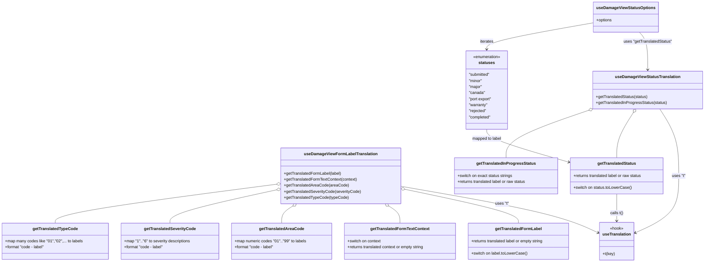

# Diagram: web/portal/src/pages/damageview/utils/translation.utils.js

> Auto-generated by Obscura crawlers

## Mermaid

```mermaid
classDiagram
    class useDamageViewStatusTranslation {
        +getTranslatedStatus(status)
        +getTranslatedInProgressStatus(status)
    }
    class useDamageViewFormLabelTranslation {
        +getTranslatedFormLabel(label)
        +getTranslatedFormTextContext(context)
        +getTranslatedAreaCode(areaCode)
        +getTranslatedSeverityCode(severityCode)
        +getTranslatedTypeCode(typeCode)
    }
    class useDamageViewStatusOptions {
        +options
    }
    class useTranslation <<hook>> {
        +t(key)
    }

    useDamageViewStatusTranslation --> useTranslation : uses "t"
    useDamageViewFormLabelTranslation --> useTranslation : uses "t"
    useDamageViewStatusOptions --> useDamageViewStatusTranslation : uses "getTranslatedStatus"

    %% status translation details
    class getTranslatedStatus {
        +switch on status.toLowerCase()
        +returns translated label or raw status
    }
    class getTranslatedInProgressStatus {
        +switch on exact status strings
        +returns translated label or raw status
    }
    useDamageViewStatusTranslation o-- getTranslatedStatus
    useDamageViewStatusTranslation o-- getTranslatedInProgressStatus

    %% form label translation details
    class getTranslatedFormLabel {
        +switch on label.toLowerCase()
        +returns translated label or empty string
    }
    class getTranslatedFormTextContext {
        +switch on context
        +returns translated context or empty string
    }
    class getTranslatedAreaCode {
        +map numeric codes "01".."99" to labels
        +format "code - label"
    }
    class getTranslatedSeverityCode {
        +map "1".."6" to severity descriptions
        +format "code - label"
    }
    class getTranslatedTypeCode {
        +map many codes like "01","02",... to labels
        +format "code - label"
    }

    useDamageViewFormLabelTranslation o-- getTranslatedFormLabel
    useDamageViewFormLabelTranslation o-- getTranslatedFormTextContext
    useDamageViewFormLabelTranslation o-- getTranslatedAreaCode
    useDamageViewFormLabelTranslation o-- getTranslatedSeverityCode
    useDamageViewFormLabelTranslation o-- getTranslatedTypeCode

    %% option generation flow
    class statuses <<enumeration>> {
        "submitted"
        "minor"
        "major"
        "canada"
        "port export"
        "warranty"
        "rejected"
        "completed"
    }
    useDamageViewStatusOptions --> statuses : iterates
    statuses --> getTranslatedStatus : mapped to label
    getTranslatedStatus --> useTranslation : calls t()
```

> SVG rendering failed for this diagram.
