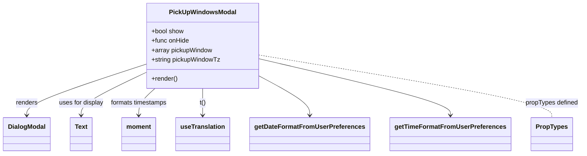
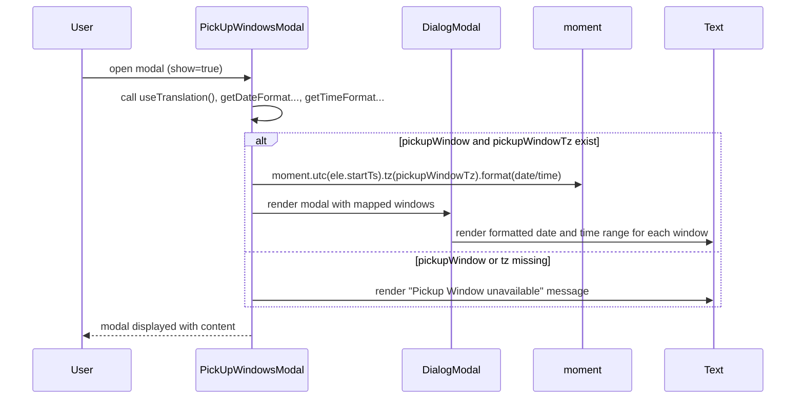

# Diagram: web/portal/src/pages/driveaway/components/modals/PickUpWindowsModal.js

> Auto-generated by Obscura crawlers

## Diagram 1

### SVG

<svg id="container" width="1429.1796875" xmlns="http://www.w3.org/2000/svg" class="classDiagram" height="390" viewBox="0 0 1429.1796875 390" role="graphics-document document" aria-roledescription="class"><g><defs><marker id="container_class-aggregationStart" class="marker aggregation class" refX="18" refY="7" markerWidth="190" markerHeight="240" orient="auto"><path d="M 18,7 L9,13 L1,7 L9,1 Z"></path></marker></defs><defs><marker id="container_class-aggregationEnd" class="marker aggregation class" refX="1" refY="7" markerWidth="20" markerHeight="28" orient="auto"><path d="M 18,7 L9,13 L1,7 L9,1 Z"></path></marker></defs><defs><marker id="container_class-extensionStart" class="marker extension class" refX="18" refY="7" markerWidth="190" markerHeight="240" orient="auto"><path d="M 1,7 L18,13 V 1 Z"></path></marker></defs><defs><marker id="container_class-extensionEnd" class="marker extension class" refX="1" refY="7" markerWidth="20" markerHeight="28" orient="auto"><path d="M 1,1 V 13 L18,7 Z"></path></marker></defs><defs><marker id="container_class-compositionStart" class="marker composition class" refX="18" refY="7" markerWidth="190" markerHeight="240" orient="auto"><path d="M 18,7 L9,13 L1,7 L9,1 Z"></path></marker></defs><defs><marker id="container_class-compositionEnd" class="marker composition class" refX="1" refY="7" markerWidth="20" markerHeight="28" orient="auto"><path d="M 18,7 L9,13 L1,7 L9,1 Z"></path></marker></defs><defs><marker id="container_class-dependencyStart" class="marker dependency class" refX="6" refY="7" markerWidth="190" markerHeight="240" orient="auto"><path d="M 5,7 L9,13 L1,7 L9,1 Z"></path></marker></defs><defs><marker id="container_class-dependencyEnd" class="marker dependency class" refX="13" refY="7" markerWidth="20" markerHeight="28" orient="auto"><path d="M 18,7 L9,13 L14,7 L9,1 Z"></path></marker></defs><defs><marker id="container_class-lollipopStart" class="marker lollipop class" refX="13" refY="7" markerWidth="190" markerHeight="240" orient="auto"><circle stroke="black" fill="transparent" cx="7" cy="7" r="6"></circle></marker></defs><defs><marker id="container_class-lollipopEnd" class="marker lollipop class" refX="1" refY="7" markerWidth="190" markerHeight="240" orient="auto"><circle stroke="black" fill="transparent" cx="7" cy="7" r="6"></circle></marker></defs><g class="root"><g class="clusters"></g><g class="edgePaths"><path d="M369.441,161.655L318.805,178.212C268.169,194.77,166.897,227.885,116.261,249.609C65.625,271.333,65.625,281.667,65.625,286.833L65.625,292" id="id_PickUpWindowsModal_DialogModal_1" class="edge-thickness-normal edge-pattern-solid relation" style=";;;" data-edge="true" data-et="edge" data-id="id_PickUpWindowsModal_DialogModal_1" data-points="W3sieCI6MzY5LjQ0MTQwNjI1LCJ5IjoxNjEuNjU0ODE4NTM0MTc5MDF9LHsieCI6NjUuNjI1LCJ5IjoyNjF9LHsieCI6NjUuNjI1LCJ5IjoyOTh9XQ==" marker-end="url(#container_class-dependencyEnd)"></path><path d="M369.441,181.639L341.307,194.866C313.172,208.093,256.902,234.546,228.768,252.94C200.633,271.333,200.633,281.667,200.633,286.833L200.633,292" id="id_PickUpWindowsModal_Text_2" class="edge-thickness-normal edge-pattern-solid relation" style=";;;" data-edge="true" data-et="edge" data-id="id_PickUpWindowsModal_Text_2" data-points="W3sieCI6MzY5LjQ0MTQwNjI1LCJ5IjoxODEuNjM5MTM3MjYyODQ4Nn0seyJ4IjoyMDAuNjMyODEyNSwieSI6MjYxfSx7IngiOjIwMC42MzI4MTI1LCJ5IjoyOTh9XQ==" marker-end="url(#container_class-dependencyEnd)"></path><path d="M391.083,224L384.346,230.167C377.61,236.333,364.137,248.667,357.401,260C350.664,271.333,350.664,281.667,350.664,286.833L350.664,292" id="id_PickUpWindowsModal_moment_3" class="edge-thickness-normal edge-pattern-solid relation" style=";;;" data-edge="true" data-et="edge" data-id="id_PickUpWindowsModal_moment_3" data-points="W3sieCI6MzkxLjA4Mjk3NDEzNzkzMTA1LCJ5IjoyMjR9LHsieCI6MzUwLjY2NDA2MjUsInkiOjI2MX0seyJ4IjozNTAuNjY0MDYyNSwieSI6Mjk4fV0=" marker-end="url(#container_class-dependencyEnd)"></path><path d="M509.063,224L509.063,230.167C509.063,236.333,509.063,248.667,509.063,260C509.063,271.333,509.063,281.667,509.063,286.833L509.063,292" id="id_PickUpWindowsModal_useTranslation_4" class="edge-thickness-normal edge-pattern-solid relation" style=";;;" data-edge="true" data-et="edge" data-id="id_PickUpWindowsModal_useTranslation_4" data-points="W3sieCI6NTA5LjA2MjUsInkiOjIyNH0seyJ4Ijo1MDkuMDYyNSwieSI6MjYxfSx7IngiOjUwOS4wNjI1LCJ5IjoyOTh9XQ==" marker-end="url(#container_class-dependencyEnd)"></path><path d="M648.684,193.788L668.79,204.99C688.896,216.192,729.108,238.596,749.214,254.965C769.32,271.333,769.32,281.667,769.32,286.833L769.32,292" id="id_PickUpWindowsModal_getDateFormatFromUserPreferences_5" class="edge-thickness-normal edge-pattern-solid relation" style=";;;" data-edge="true" data-et="edge" data-id="id_PickUpWindowsModal_getDateFormatFromUserPreferences_5" data-points="W3sieCI6NjQ4LjY4MzU5Mzc1LCJ5IjoxOTMuNzg4NDc1OTcwMzQxOX0seyJ4Ijo3NjkuMzIwMzEyNSwieSI6MjYxfSx7IngiOjc2OS4zMjAzMTI1LCJ5IjoyOTh9XQ==" marker-end="url(#container_class-dependencyEnd)"></path><path d="M648.684,149.771L725.327,168.309C801.971,186.847,955.259,223.924,1031.903,247.628C1108.547,271.333,1108.547,281.667,1108.547,286.833L1108.547,292" id="id_PickUpWindowsModal_getTimeFormatFromUserPreferences_6" class="edge-thickness-normal edge-pattern-solid relation" style=";;;" data-edge="true" data-et="edge" data-id="id_PickUpWindowsModal_getTimeFormatFromUserPreferences_6" data-points="W3sieCI6NjQ4LjY4MzU5Mzc1LCJ5IjoxNDkuNzcwNzg2MDkyMjE0Njh9LHsieCI6MTEwOC41NDY4NzUsInkiOjI2MX0seyJ4IjoxMTA4LjU0Njg3NSwieSI6Mjk4fV0=" marker-end="url(#container_class-dependencyEnd)"></path><path d="M648.684,139.964L766.213,160.137C883.742,180.31,1118.801,220.655,1236.33,246.994C1353.859,273.333,1353.859,285.667,1353.859,291.833L1353.859,298" id="id_PickUpWindowsModal_PropTypes_7" class="edge-thickness-normal edge-pattern-dashed relation" style=";;;" data-edge="true" data-et="edge" data-id="id_PickUpWindowsModal_PropTypes_7" data-points="W3sieCI6NjQ4LjY4MzU5Mzc1LCJ5IjoxMzkuOTY0NDA5ODk4ODI5MjJ9LHsieCI6MTM1My44NTkzNzUsInkiOjI2MX0seyJ4IjoxMzUzLjg1OTM3NSwieSI6Mjk4fV0="></path></g><g class="edgeLabels"><g class="edgeLabel" transform="translate(65.625, 261)"><g class="label" data-id="id_PickUpWindowsModal_DialogModal_1" transform="translate(-27.75, -12)"><foreignObject width="55.5" height="24">

renders

</foreignObject></g></g><g class="edgeLabel" transform="translate(200.6328125, 261)"><g class="label" data-id="id_PickUpWindowsModal_Text_2" transform="translate(-57.09375, -12)"><foreignObject width="114.1875" height="24">

uses for display

</foreignObject></g></g><g class="edgeLabel" transform="translate(350.6640625, 261)"><g class="label" data-id="id_PickUpWindowsModal_moment_3" transform="translate(-72.9375, -12)"><foreignObject width="145.875" height="24">

formats timestamps

</foreignObject></g></g><g class="edgeLabel" transform="translate(509.0625, 261)"><g class="label" data-id="id_PickUpWindowsModal_useTranslation_4" transform="translate(-8.078125, -12)"><foreignObject width="16.15625" height="24">

t()

</foreignObject></g></g><g class="edgeLabel"><g class="label" data-id="id_PickUpWindowsModal_getDateFormatFromUserPreferences_5" transform="translate(0, 0)"><foreignObject width="0" height="0">

</foreignObject></g></g><g class="edgeLabel"><g class="label" data-id="id_PickUpWindowsModal_getTimeFormatFromUserPreferences_6" transform="translate(0, 0)"><foreignObject width="0" height="0">

</foreignObject></g></g><g class="edgeLabel" transform="translate(1353.859375, 261)"><g class="label" data-id="id_PickUpWindowsModal_PropTypes_7" transform="translate(-67.3203125, -12)"><foreignObject width="134.640625" height="24">

propTypes defined

</foreignObject></g></g></g><g class="nodes"><g class="node default" id="classId-PickUpWindowsModal-0" transform="translate(509.0625, 116)"><g class="basic label-container"><path d="M-139.62109375 -108 L139.62109375 -108 L139.62109375 108 L-139.62109375 108" stroke="none" stroke-width="0" fill="#ECECFF" style=""></path><path d="M-139.62109375 -108 C-38.970943838294005 -108, 61.67920607341199 -108, 139.62109375 -108 M-139.62109375 -108 C-39.56689461276595 -108, 60.4873045244681 -108, 139.62109375 -108 M139.62109375 -108 C139.62109375 -52.707331657673585, 139.62109375 2.5853366846528303, 139.62109375 108 M139.62109375 -108 C139.62109375 -30.987280862648547, 139.62109375 46.02543827470291, 139.62109375 108 M139.62109375 108 C62.54851498915458 108, -14.524063771690834 108, -139.62109375 108 M139.62109375 108 C34.64025825279509 108, -70.34057724440981 108, -139.62109375 108 M-139.62109375 108 C-139.62109375 22.90848632432008, -139.62109375 -62.18302735135984, -139.62109375 -108 M-139.62109375 108 C-139.62109375 38.74255316137052, -139.62109375 -30.514893677258954, -139.62109375 -108" stroke="#9370DB" stroke-width="1.3" fill="none" stroke-dasharray="0 0" style=""></path></g><g class="annotation-group text" transform="translate(0, -84)"></g><g class="label-group text" transform="translate(-80.7109375, -84)"><g class="label" style="font-weight: bolder" transform="translate(0,-12)"><foreignObject width="161.421875" height="24">

PickUpWindowsModal

</foreignObject></g></g><g class="members-group text" transform="translate(-127.62109375, -36)"><g class="label" style="" transform="translate(0,-12)"><foreignObject width="82.78125" height="24">

+bool show

</foreignObject></g><g class="label" style="" transform="translate(0,12)"><foreignObject width="96.09375" height="24">

+func onHide

</foreignObject></g><g class="label" style="" transform="translate(0,36)"><foreignObject width="154.875" height="24">

+array pickupWindow

</foreignObject></g><g class="label" style="" transform="translate(0,60)"><foreignObject width="174.53125" height="24">

+string pickupWindowTz

</foreignObject></g></g><g class="methods-group text" transform="translate(-127.62109375, 84)"><g class="label" style="" transform="translate(0,-12)"><foreignObject width="66.609375" height="24">

+render()

</foreignObject></g></g><g class="divider" style=""><path d="M-139.62109375 -60 C-42.7946655292598 -60, 54.031762691480395 -60, 139.62109375 -60 M-139.62109375 -60 C-60.581187935099294 -60, 18.458717879801412 -60, 139.62109375 -60" stroke="#9370DB" stroke-width="1.3" fill="none" stroke-dasharray="0 0" style=""></path></g><g class="divider" style=""><path d="M-139.62109375 60 C-40.26432518627179 60, 59.09244337745642 60, 139.62109375 60 M-139.62109375 60 C-46.68958148650174 60, 46.241930776996526 60, 139.62109375 60" stroke="#9370DB" stroke-width="1.3" fill="none" stroke-dasharray="0 0" style=""></path></g></g><g class="node default" id="classId-DialogModal-1" transform="translate(65.625, 340)"><g class="basic label-container"><path d="M-57.625 -42 L57.625 -42 L57.625 42 L-57.625 42" stroke="none" stroke-width="0" fill="#ECECFF" style=""></path><path d="M-57.625 -42 C-18.04381505711207 -42, 21.53736988577586 -42, 57.625 -42 M-57.625 -42 C-13.24270203762103 -42, 31.13959592475794 -42, 57.625 -42 M57.625 -42 C57.625 -10.386277089816115, 57.625 21.22744582036777, 57.625 42 M57.625 -42 C57.625 -22.96377697807617, 57.625 -3.9275539561523374, 57.625 42 M57.625 42 C25.03838205380204 42, -7.5482358923959225 42, -57.625 42 M57.625 42 C25.432820547202006 42, -6.759358905595988 42, -57.625 42 M-57.625 42 C-57.625 24.23606697591279, -57.625 6.472133951825583, -57.625 -42 M-57.625 42 C-57.625 24.85139012457477, -57.625 7.702780249149541, -57.625 -42" stroke="#9370DB" stroke-width="1.3" fill="none" stroke-dasharray="0 0" style=""></path></g><g class="annotation-group text" transform="translate(0, -18)"></g><g class="label-group text" transform="translate(-45.625, -18)"><g class="label" style="font-weight: bolder" transform="translate(0,-12)"><foreignObject width="91.25" height="24">

DialogModal

</foreignObject></g></g><g class="members-group text" transform="translate(-45.625, 30)"></g><g class="methods-group text" transform="translate(-45.625, 60)"></g><g class="divider" style=""><path d="M-57.625 6 C-18.41312114311411 6, 20.798757713771778 6, 57.625 6 M-57.625 6 C-24.338658869164775 6, 8.947682261670451 6, 57.625 6" stroke="#9370DB" stroke-width="1.3" fill="none" stroke-dasharray="0 0" style=""></path></g><g class="divider" style=""><path d="M-57.625 24 C-16.60777162234831 24, 24.40945675530338 24, 57.625 24 M-57.625 24 C-15.300652458534337 24, 27.023695082931326 24, 57.625 24" stroke="#9370DB" stroke-width="1.3" fill="none" stroke-dasharray="0 0" style=""></path></g></g><g class="node default" id="classId-Text-2" transform="translate(200.6328125, 340)"><g class="basic label-container"><path d="M-27.3828125 -42 L27.3828125 -42 L27.3828125 42 L-27.3828125 42" stroke="none" stroke-width="0" fill="#ECECFF" style=""></path><path d="M-27.3828125 -42 C-13.476439137995266 -42, 0.4299342240094681 -42, 27.3828125 -42 M-27.3828125 -42 C-15.361923433058966 -42, -3.341034366117931 -42, 27.3828125 -42 M27.3828125 -42 C27.3828125 -8.896716728928219, 27.3828125 24.206566542143563, 27.3828125 42 M27.3828125 -42 C27.3828125 -11.234939462999687, 27.3828125 19.530121074000625, 27.3828125 42 M27.3828125 42 C9.735395080111434 42, -7.912022339777131 42, -27.3828125 42 M27.3828125 42 C15.375546533828333 42, 3.368280567656665 42, -27.3828125 42 M-27.3828125 42 C-27.3828125 20.799508427270577, -27.3828125 -0.40098314545884506, -27.3828125 -42 M-27.3828125 42 C-27.3828125 8.654383052742517, -27.3828125 -24.691233894514966, -27.3828125 -42" stroke="#9370DB" stroke-width="1.3" fill="none" stroke-dasharray="0 0" style=""></path></g><g class="annotation-group text" transform="translate(0, -18)"></g><g class="label-group text" transform="translate(-15.3828125, -18)"><g class="label" style="font-weight: bolder" transform="translate(0,-12)"><foreignObject width="30.765625" height="24">

Text

</foreignObject></g></g><g class="members-group text" transform="translate(-15.3828125, 30)"></g><g class="methods-group text" transform="translate(-15.3828125, 60)"></g><g class="divider" style=""><path d="M-27.3828125 6 C-13.46390758924127 6, 0.4549973215174603 6, 27.3828125 6 M-27.3828125 6 C-15.210200547747329 6, -3.0375885954946575 6, 27.3828125 6" stroke="#9370DB" stroke-width="1.3" fill="none" stroke-dasharray="0 0" style=""></path></g><g class="divider" style=""><path d="M-27.3828125 24 C-15.62436519943977 24, -3.865917898879541 24, 27.3828125 24 M-27.3828125 24 C-10.418893900023175 24, 6.54502469995365 24, 27.3828125 24" stroke="#9370DB" stroke-width="1.3" fill="none" stroke-dasharray="0 0" style=""></path></g></g><g class="node default" id="classId-moment-3" transform="translate(350.6640625, 340)"><g class="basic label-container"><path d="M-42.3125 -42 L42.3125 -42 L42.3125 42 L-42.3125 42" stroke="none" stroke-width="0" fill="#ECECFF" style=""></path><path d="M-42.3125 -42 C-13.40762330322309 -42, 15.49725339355382 -42, 42.3125 -42 M-42.3125 -42 C-21.056974535980448 -42, 0.19855092803910424 -42, 42.3125 -42 M42.3125 -42 C42.3125 -18.033768806318804, 42.3125 5.932462387362392, 42.3125 42 M42.3125 -42 C42.3125 -23.175267316312258, 42.3125 -4.350534632624516, 42.3125 42 M42.3125 42 C20.087751532983432 42, -2.136996934033135 42, -42.3125 42 M42.3125 42 C19.50404021768323 42, -3.304419564633541 42, -42.3125 42 M-42.3125 42 C-42.3125 20.30791116179987, -42.3125 -1.3841776764002631, -42.3125 -42 M-42.3125 42 C-42.3125 11.718789086254336, -42.3125 -18.562421827491328, -42.3125 -42" stroke="#9370DB" stroke-width="1.3" fill="none" stroke-dasharray="0 0" style=""></path></g><g class="annotation-group text" transform="translate(0, -18)"></g><g class="label-group text" transform="translate(-30.3125, -18)"><g class="label" style="font-weight: bolder" transform="translate(0,-12)"><foreignObject width="60.625" height="24">

moment

</foreignObject></g></g><g class="members-group text" transform="translate(-30.3125, 30)"></g><g class="methods-group text" transform="translate(-30.3125, 60)"></g><g class="divider" style=""><path d="M-42.3125 6 C-18.438667132799548 6, 5.435165734400904 6, 42.3125 6 M-42.3125 6 C-13.775306109046017 6, 14.761887781907966 6, 42.3125 6" stroke="#9370DB" stroke-width="1.3" fill="none" stroke-dasharray="0 0" style=""></path></g><g class="divider" style=""><path d="M-42.3125 24 C-18.988977673078978 24, 4.334544653842045 24, 42.3125 24 M-42.3125 24 C-14.606895994153298 24, 13.098708011693404 24, 42.3125 24" stroke="#9370DB" stroke-width="1.3" fill="none" stroke-dasharray="0 0" style=""></path></g></g><g class="node default" id="classId-useTranslation-4" transform="translate(509.0625, 340)"><g class="basic label-container"><path d="M-66.0859375 -42 L66.0859375 -42 L66.0859375 42 L-66.0859375 42" stroke="none" stroke-width="0" fill="#ECECFF" style=""></path><path d="M-66.0859375 -42 C-38.42547490781568 -42, -10.765012315631367 -42, 66.0859375 -42 M-66.0859375 -42 C-16.815622931447606 -42, 32.45469163710479 -42, 66.0859375 -42 M66.0859375 -42 C66.0859375 -23.57115640898585, 66.0859375 -5.1423128179717, 66.0859375 42 M66.0859375 -42 C66.0859375 -21.643416382795873, 66.0859375 -1.2868327655917469, 66.0859375 42 M66.0859375 42 C29.521364289258763 42, -7.043208921482474 42, -66.0859375 42 M66.0859375 42 C37.35385765275904 42, 8.621777805518079 42, -66.0859375 42 M-66.0859375 42 C-66.0859375 12.731718399836957, -66.0859375 -16.536563200326086, -66.0859375 -42 M-66.0859375 42 C-66.0859375 9.087406629695863, -66.0859375 -23.825186740608274, -66.0859375 -42" stroke="#9370DB" stroke-width="1.3" fill="none" stroke-dasharray="0 0" style=""></path></g><g class="annotation-group text" transform="translate(0, -18)"></g><g class="label-group text" transform="translate(-54.0859375, -18)"><g class="label" style="font-weight: bolder" transform="translate(0,-12)"><foreignObject width="108.171875" height="24">

useTranslation

</foreignObject></g></g><g class="members-group text" transform="translate(-54.0859375, 30)"></g><g class="methods-group text" transform="translate(-54.0859375, 60)"></g><g class="divider" style=""><path d="M-66.0859375 6 C-28.18778088310252 6, 9.710375733794962 6, 66.0859375 6 M-66.0859375 6 C-24.464672960990505 6, 17.15659157801899 6, 66.0859375 6" stroke="#9370DB" stroke-width="1.3" fill="none" stroke-dasharray="0 0" style=""></path></g><g class="divider" style=""><path d="M-66.0859375 24 C-31.906153297782865 24, 2.2736309044342704 24, 66.0859375 24 M-66.0859375 24 C-23.70535907293202 24, 18.67521935413596 24, 66.0859375 24" stroke="#9370DB" stroke-width="1.3" fill="none" stroke-dasharray="0 0" style=""></path></g></g><g class="node default" id="classId-PropTypes-5" transform="translate(1353.859375, 340)"><g class="basic label-container"><path d="M-50.2578125 -42 L50.2578125 -42 L50.2578125 42 L-50.2578125 42" stroke="none" stroke-width="0" fill="#ECECFF" style=""></path><path d="M-50.2578125 -42 C-17.807851955581356 -42, 14.642108588837289 -42, 50.2578125 -42 M-50.2578125 -42 C-15.254699716356889 -42, 19.748413067286222 -42, 50.2578125 -42 M50.2578125 -42 C50.2578125 -10.786162935811817, 50.2578125 20.427674128376367, 50.2578125 42 M50.2578125 -42 C50.2578125 -11.444127253347812, 50.2578125 19.111745493304376, 50.2578125 42 M50.2578125 42 C11.576058579703883 42, -27.105695340592234 42, -50.2578125 42 M50.2578125 42 C23.865420720536605 42, -2.52697105892679 42, -50.2578125 42 M-50.2578125 42 C-50.2578125 18.29641102116731, -50.2578125 -5.4071779576653825, -50.2578125 -42 M-50.2578125 42 C-50.2578125 11.728058203107516, -50.2578125 -18.54388359378497, -50.2578125 -42" stroke="#9370DB" stroke-width="1.3" fill="none" stroke-dasharray="0 0" style=""></path></g><g class="annotation-group text" transform="translate(0, -18)"></g><g class="label-group text" transform="translate(-38.2578125, -18)"><g class="label" style="font-weight: bolder" transform="translate(0,-12)"><foreignObject width="76.515625" height="24">

PropTypes

</foreignObject></g></g><g class="members-group text" transform="translate(-38.2578125, 30)"></g><g class="methods-group text" transform="translate(-38.2578125, 60)"></g><g class="divider" style=""><path d="M-50.2578125 6 C-16.42583614606312 6, 17.40614020787376 6, 50.2578125 6 M-50.2578125 6 C-18.477396574191363 6, 13.303019351617273 6, 50.2578125 6" stroke="#9370DB" stroke-width="1.3" fill="none" stroke-dasharray="0 0" style=""></path></g><g class="divider" style=""><path d="M-50.2578125 24 C-27.857141357557403 24, -5.4564702151148055 24, 50.2578125 24 M-50.2578125 24 C-16.682653551909524 24, 16.89250539618095 24, 50.2578125 24" stroke="#9370DB" stroke-width="1.3" fill="none" stroke-dasharray="0 0" style=""></path></g></g><g class="node default" id="classId-getDateFormatFromUserPreferences-6" transform="translate(769.3203125, 340)"><g class="basic label-container"><path d="M-144.171875 -42 L144.171875 -42 L144.171875 42 L-144.171875 42" stroke="none" stroke-width="0" fill="#ECECFF" style=""></path><path d="M-144.171875 -42 C-61.671424091168646 -42, 20.829026817662708 -42, 144.171875 -42 M-144.171875 -42 C-49.326424044203506 -42, 45.51902691159299 -42, 144.171875 -42 M144.171875 -42 C144.171875 -10.943768090553966, 144.171875 20.112463818892067, 144.171875 42 M144.171875 -42 C144.171875 -15.986619745285061, 144.171875 10.026760509429877, 144.171875 42 M144.171875 42 C39.63004211364414 42, -64.91179077271173 42, -144.171875 42 M144.171875 42 C50.59279177122099 42, -42.986291457558025 42, -144.171875 42 M-144.171875 42 C-144.171875 20.330300297612123, -144.171875 -1.3393994047757545, -144.171875 -42 M-144.171875 42 C-144.171875 13.870407531738046, -144.171875 -14.259184936523909, -144.171875 -42" stroke="#9370DB" stroke-width="1.3" fill="none" stroke-dasharray="0 0" style=""></path></g><g class="annotation-group text" transform="translate(0, -18)"></g><g class="label-group text" transform="translate(-132.171875, -18)"><g class="label" style="font-weight: bolder" transform="translate(0,-12)"><foreignObject width="264.34375" height="24">

getDateFormatFromUserPreferences

</foreignObject></g></g><g class="members-group text" transform="translate(-132.171875, 30)"></g><g class="methods-group text" transform="translate(-132.171875, 60)"></g><g class="divider" style=""><path d="M-144.171875 6 C-85.87614340334449 6, -27.580411806688986 6, 144.171875 6 M-144.171875 6 C-29.287809490896578 6, 85.59625601820684 6, 144.171875 6" stroke="#9370DB" stroke-width="1.3" fill="none" stroke-dasharray="0 0" style=""></path></g><g class="divider" style=""><path d="M-144.171875 24 C-43.094488224836724 24, 57.98289855032655 24, 144.171875 24 M-144.171875 24 C-84.23202279273951 24, -24.292170585479028 24, 144.171875 24" stroke="#9370DB" stroke-width="1.3" fill="none" stroke-dasharray="0 0" style=""></path></g></g><g class="node default" id="classId-getTimeFormatFromUserPreferences-7" transform="translate(1108.546875, 340)"><g class="basic label-container"><path d="M-145.0546875 -42 L145.0546875 -42 L145.0546875 42 L-145.0546875 42" stroke="none" stroke-width="0" fill="#ECECFF" style=""></path><path d="M-145.0546875 -42 C-77.83225810774705 -42, -10.609828715494103 -42, 145.0546875 -42 M-145.0546875 -42 C-53.701658812499616 -42, 37.65136987500077 -42, 145.0546875 -42 M145.0546875 -42 C145.0546875 -10.393828473478923, 145.0546875 21.212343053042154, 145.0546875 42 M145.0546875 -42 C145.0546875 -8.781185322458029, 145.0546875 24.437629355083942, 145.0546875 42 M145.0546875 42 C49.785630030502446 42, -45.48342743899511 42, -145.0546875 42 M145.0546875 42 C44.11790626415522 42, -56.81887497168955 42, -145.0546875 42 M-145.0546875 42 C-145.0546875 13.773471803749082, -145.0546875 -14.453056392501836, -145.0546875 -42 M-145.0546875 42 C-145.0546875 9.968601065951347, -145.0546875 -22.062797868097306, -145.0546875 -42" stroke="#9370DB" stroke-width="1.3" fill="none" stroke-dasharray="0 0" style=""></path></g><g class="annotation-group text" transform="translate(0, -18)"></g><g class="label-group text" transform="translate(-133.0546875, -18)"><g class="label" style="font-weight: bolder" transform="translate(0,-12)"><foreignObject width="266.109375" height="24">

getTimeFormatFromUserPreferences

</foreignObject></g></g><g class="members-group text" transform="translate(-133.0546875, 30)"></g><g class="methods-group text" transform="translate(-133.0546875, 60)"></g><g class="divider" style=""><path d="M-145.0546875 6 C-46.66461281648306 6, 51.725461867033886 6, 145.0546875 6 M-145.0546875 6 C-39.71476184953627 6, 65.62516380092745 6, 145.0546875 6" stroke="#9370DB" stroke-width="1.3" fill="none" stroke-dasharray="0 0" style=""></path></g><g class="divider" style=""><path d="M-145.0546875 24 C-73.5982694220785 24, -2.141851344157004 24, 145.0546875 24 M-145.0546875 24 C-49.50337757449232 24, 46.04793235101536 24, 145.0546875 24" stroke="#9370DB" stroke-width="1.3" fill="none" stroke-dasharray="0 0" style=""></path></g></g></g></g></g></svg>

## Diagram 2

### SVG

<svg id="container" width="1271" xmlns="http://www.w3.org/2000/svg" height="637" viewBox="-50 -10 1271 637" role="graphics-document document" aria-roledescription="sequence"><g><rect x="1021" y="551" fill="#eaeaea" stroke="#666" width="150" height="65" name="Text" rx="3" ry="3" class="actor actor-bottom"></rect><text x="1096" y="583.5" dominant-baseline="central" alignment-baseline="central" class="actor actor-box" style="text-anchor: middle; font-size: 16px; font-weight: 400;"><tspan x="1096" dy="0">Text</tspan></text></g><g><rect x="821" y="551" fill="#eaeaea" stroke="#666" width="150" height="65" name="moment" rx="3" ry="3" class="actor actor-bottom"></rect><text x="896" y="583.5" dominant-baseline="central" alignment-baseline="central" class="actor actor-box" style="text-anchor: middle; font-size: 16px; font-weight: 400;"><tspan x="896" dy="0">moment</tspan></text></g><g><rect x="621" y="551" fill="#eaeaea" stroke="#666" width="150" height="65" name="DialogModal" rx="3" ry="3" class="actor actor-bottom"></rect><text x="696" y="583.5" dominant-baseline="central" alignment-baseline="central" class="actor actor-box" style="text-anchor: middle; font-size: 16px; font-weight: 400;"><tspan x="696" dy="0">DialogModal</tspan></text></g><g><rect x="271" y="551" fill="#eaeaea" stroke="#666" width="180" height="65" name="PickUpWindowsModal" rx="3" ry="3" class="actor actor-bottom"></rect><text x="361" y="583.5" dominant-baseline="central" alignment-baseline="central" class="actor actor-box" style="text-anchor: middle; font-size: 16px; font-weight: 400;"><tspan x="361" dy="0">PickUpWindowsModal</tspan></text></g><g><rect x="0" y="551" fill="#eaeaea" stroke="#666" width="150" height="65" name="User" rx="3" ry="3" class="actor actor-bottom"></rect><text x="75" y="583.5" dominant-baseline="central" alignment-baseline="central" class="actor actor-box" style="text-anchor: middle; font-size: 16px; font-weight: 400;"><tspan x="75" dy="0">User</tspan></text></g><g><line id="actor4" x1="1096" y1="65" x2="1096" y2="551" class="actor-line 200" stroke-width="0.5px" stroke="#999" name="Text"></line><g id="root-4"><rect x="1021" y="0" fill="#eaeaea" stroke="#666" width="150" height="65" name="Text" rx="3" ry="3" class="actor actor-top"></rect><text x="1096" y="32.5" dominant-baseline="central" alignment-baseline="central" class="actor actor-box" style="text-anchor: middle; font-size: 16px; font-weight: 400;"><tspan x="1096" dy="0">Text</tspan></text></g></g><g><line id="actor3" x1="896" y1="65" x2="896" y2="551" class="actor-line 200" stroke-width="0.5px" stroke="#999" name="moment"></line><g id="root-3"><rect x="821" y="0" fill="#eaeaea" stroke="#666" width="150" height="65" name="moment" rx="3" ry="3" class="actor actor-top"></rect><text x="896" y="32.5" dominant-baseline="central" alignment-baseline="central" class="actor actor-box" style="text-anchor: middle; font-size: 16px; font-weight: 400;"><tspan x="896" dy="0">moment</tspan></text></g></g><g><line id="actor2" x1="696" y1="65" x2="696" y2="551" class="actor-line 200" stroke-width="0.5px" stroke="#999" name="DialogModal"></line><g id="root-2"><rect x="621" y="0" fill="#eaeaea" stroke="#666" width="150" height="65" name="DialogModal" rx="3" ry="3" class="actor actor-top"></rect><text x="696" y="32.5" dominant-baseline="central" alignment-baseline="central" class="actor actor-box" style="text-anchor: middle; font-size: 16px; font-weight: 400;"><tspan x="696" dy="0">DialogModal</tspan></text></g></g><g><line id="actor1" x1="361" y1="65" x2="361" y2="551" class="actor-line 200" stroke-width="0.5px" stroke="#999" name="PickUpWindowsModal"></line><g id="root-1"><rect x="271" y="0" fill="#eaeaea" stroke="#666" width="180" height="65" name="PickUpWindowsModal" rx="3" ry="3" class="actor actor-top"></rect><text x="361" y="32.5" dominant-baseline="central" alignment-baseline="central" class="actor actor-box" style="text-anchor: middle; font-size: 16px; font-weight: 400;"><tspan x="361" dy="0">PickUpWindowsModal</tspan></text></g></g><g><line id="actor0" x1="75" y1="65" x2="75" y2="551" class="actor-line 200" stroke-width="0.5px" stroke="#999" name="User"></line><g id="root-0"><rect x="0" y="0" fill="#eaeaea" stroke="#666" width="150" height="65" name="User" rx="3" ry="3" class="actor actor-top"></rect><text x="75" y="32.5" dominant-baseline="central" alignment-baseline="central" class="actor actor-box" style="text-anchor: middle; font-size: 16px; font-weight: 400;"><tspan x="75" dy="0">User</tspan></text></g></g><g></g><defs><symbol id="computer" width="24" height="24"><path transform="scale(.5)" d="M2 2v13h20v-13h-20zm18 11h-16v-9h16v9zm-10.228 6l.466-1h3.524l.467 1h-4.457zm14.228 3h-24l2-6h2.104l-1.33 4h18.45l-1.297-4h2.073l2 6zm-5-10h-14v-7h14v7z"></path></symbol></defs><defs><symbol id="database" fill-rule="evenodd" clip-rule="evenodd"><path transform="scale(.5)" d="M12.258.001l.256.004.255.005.253.008.251.01.249.012.247.015.246.016.242.019.241.02.239.023.236.024.233.027.231.028.229.031.225.032.223.034.22.036.217.038.214.04.211.041.208.043.205.045.201.046.198.048.194.05.191.051.187.053.183.054.18.056.175.057.172.059.168.06.163.061.16.063.155.064.15.066.074.033.073.033.071.034.07.034.069.035.068.035.067.035.066.035.064.036.064.036.062.036.06.036.06.037.058.037.058.037.055.038.055.038.053.038.052.038.051.039.05.039.048.039.047.039.045.04.044.04.043.04.041.04.04.041.039.041.037.041.036.041.034.041.033.042.032.042.03.042.029.042.027.042.026.043.024.043.023.043.021.043.02.043.018.044.017.043.015.044.013.044.012.044.011.045.009.044.007.045.006.045.004.045.002.045.001.045v17l-.001.045-.002.045-.004.045-.006.045-.007.045-.009.044-.011.045-.012.044-.013.044-.015.044-.017.043-.018.044-.02.043-.021.043-.023.043-.024.043-.026.043-.027.042-.029.042-.03.042-.032.042-.033.042-.034.041-.036.041-.037.041-.039.041-.04.041-.041.04-.043.04-.044.04-.045.04-.047.039-.048.039-.05.039-.051.039-.052.038-.053.038-.055.038-.055.038-.058.037-.058.037-.06.037-.06.036-.062.036-.064.036-.064.036-.066.035-.067.035-.068.035-.069.035-.07.034-.071.034-.073.033-.074.033-.15.066-.155.064-.16.063-.163.061-.168.06-.172.059-.175.057-.18.056-.183.054-.187.053-.191.051-.194.05-.198.048-.201.046-.205.045-.208.043-.211.041-.214.04-.217.038-.22.036-.223.034-.225.032-.229.031-.231.028-.233.027-.236.024-.239.023-.241.02-.242.019-.246.016-.247.015-.249.012-.251.01-.253.008-.255.005-.256.004-.258.001-.258-.001-.256-.004-.255-.005-.253-.008-.251-.01-.249-.012-.247-.015-.245-.016-.243-.019-.241-.02-.238-.023-.236-.024-.234-.027-.231-.028-.228-.031-.226-.032-.223-.034-.22-.036-.217-.038-.214-.04-.211-.041-.208-.043-.204-.045-.201-.046-.198-.048-.195-.05-.19-.051-.187-.053-.184-.054-.179-.056-.176-.057-.172-.059-.167-.06-.164-.061-.159-.063-.155-.064-.151-.066-.074-.033-.072-.033-.072-.034-.07-.034-.069-.035-.068-.035-.067-.035-.066-.035-.064-.036-.063-.036-.062-.036-.061-.036-.06-.037-.058-.037-.057-.037-.056-.038-.055-.038-.053-.038-.052-.038-.051-.039-.049-.039-.049-.039-.046-.039-.046-.04-.044-.04-.043-.04-.041-.04-.04-.041-.039-.041-.037-.041-.036-.041-.034-.041-.033-.042-.032-.042-.03-.042-.029-.042-.027-.042-.026-.043-.024-.043-.023-.043-.021-.043-.02-.043-.018-.044-.017-.043-.015-.044-.013-.044-.012-.044-.011-.045-.009-.044-.007-.045-.006-.045-.004-.045-.002-.045-.001-.045v-17l.001-.045.002-.045.004-.045.006-.045.007-.045.009-.044.011-.045.012-.044.013-.044.015-.044.017-.043.018-.044.02-.043.021-.043.023-.043.024-.043.026-.043.027-.042.029-.042.03-.042.032-.042.033-.042.034-.041.036-.041.037-.041.039-.041.04-.041.041-.04.043-.04.044-.04.046-.04.046-.039.049-.039.049-.039.051-.039.052-.038.053-.038.055-.038.056-.038.057-.037.058-.037.06-.037.061-.036.062-.036.063-.036.064-.036.066-.035.067-.035.068-.035.069-.035.07-.034.072-.034.072-.033.074-.033.151-.066.155-.064.159-.063.164-.061.167-.06.172-.059.176-.057.179-.056.184-.054.187-.053.19-.051.195-.05.198-.048.201-.046.204-.045.208-.043.211-.041.214-.04.217-.038.22-.036.223-.034.226-.032.228-.031.231-.028.234-.027.236-.024.238-.023.241-.02.243-.019.245-.016.247-.015.249-.012.251-.01.253-.008.255-.005.256-.004.258-.001.258.001zm-9.258 20.499v.01l.001.021.003.021.004.022.005.021.006.022.007.022.009.023.01.022.011.023.012.023.013.023.015.023.016.024.017.023.018.024.019.024.021.024.022.025.023.024.024.025.052.049.056.05.061.051.066.051.07.051.075.051.079.052.084.052.088.052.092.052.097.052.102.051.105.052.11.052.114.051.119.051.123.051.127.05.131.05.135.05.139.048.144.049.147.047.152.047.155.047.16.045.163.045.167.043.171.043.176.041.178.041.183.039.187.039.19.037.194.035.197.035.202.033.204.031.209.03.212.029.216.027.219.025.222.024.226.021.23.02.233.018.236.016.24.015.243.012.246.01.249.008.253.005.256.004.259.001.26-.001.257-.004.254-.005.25-.008.247-.011.244-.012.241-.014.237-.016.233-.018.231-.021.226-.021.224-.024.22-.026.216-.027.212-.028.21-.031.205-.031.202-.034.198-.034.194-.036.191-.037.187-.039.183-.04.179-.04.175-.042.172-.043.168-.044.163-.045.16-.046.155-.046.152-.047.148-.048.143-.049.139-.049.136-.05.131-.05.126-.05.123-.051.118-.052.114-.051.11-.052.106-.052.101-.052.096-.052.092-.052.088-.053.083-.051.079-.052.074-.052.07-.051.065-.051.06-.051.056-.05.051-.05.023-.024.023-.025.021-.024.02-.024.019-.024.018-.024.017-.024.015-.023.014-.024.013-.023.012-.023.01-.023.01-.022.008-.022.006-.022.006-.022.004-.022.004-.021.001-.021.001-.021v-4.127l-.077.055-.08.053-.083.054-.085.053-.087.052-.09.052-.093.051-.095.05-.097.05-.1.049-.102.049-.105.048-.106.047-.109.047-.111.046-.114.045-.115.045-.118.044-.12.043-.122.042-.124.042-.126.041-.128.04-.13.04-.132.038-.134.038-.135.037-.138.037-.139.035-.142.035-.143.034-.144.033-.147.032-.148.031-.15.03-.151.03-.153.029-.154.027-.156.027-.158.026-.159.025-.161.024-.162.023-.163.022-.165.021-.166.02-.167.019-.169.018-.169.017-.171.016-.173.015-.173.014-.175.013-.175.012-.177.011-.178.01-.179.008-.179.008-.181.006-.182.005-.182.004-.184.003-.184.002h-.37l-.184-.002-.184-.003-.182-.004-.182-.005-.181-.006-.179-.008-.179-.008-.178-.01-.176-.011-.176-.012-.175-.013-.173-.014-.172-.015-.171-.016-.17-.017-.169-.018-.167-.019-.166-.02-.165-.021-.163-.022-.162-.023-.161-.024-.159-.025-.157-.026-.156-.027-.155-.027-.153-.029-.151-.03-.15-.03-.148-.031-.146-.032-.145-.033-.143-.034-.141-.035-.14-.035-.137-.037-.136-.037-.134-.038-.132-.038-.13-.04-.128-.04-.126-.041-.124-.042-.122-.042-.12-.044-.117-.043-.116-.045-.113-.045-.112-.046-.109-.047-.106-.047-.105-.048-.102-.049-.1-.049-.097-.05-.095-.05-.093-.052-.09-.051-.087-.052-.085-.053-.083-.054-.08-.054-.077-.054v4.127zm0-5.654v.011l.001.021.003.021.004.021.005.022.006.022.007.022.009.022.01.022.011.023.012.023.013.023.015.024.016.023.017.024.018.024.019.024.021.024.022.024.023.025.024.024.052.05.056.05.061.05.066.051.07.051.075.052.079.051.084.052.088.052.092.052.097.052.102.052.105.052.11.051.114.051.119.052.123.05.127.051.131.05.135.049.139.049.144.048.147.048.152.047.155.046.16.045.163.045.167.044.171.042.176.042.178.04.183.04.187.038.19.037.194.036.197.034.202.033.204.032.209.03.212.028.216.027.219.025.222.024.226.022.23.02.233.018.236.016.24.014.243.012.246.01.249.008.253.006.256.003.259.001.26-.001.257-.003.254-.006.25-.008.247-.01.244-.012.241-.015.237-.016.233-.018.231-.02.226-.022.224-.024.22-.025.216-.027.212-.029.21-.03.205-.032.202-.033.198-.035.194-.036.191-.037.187-.039.183-.039.179-.041.175-.042.172-.043.168-.044.163-.045.16-.045.155-.047.152-.047.148-.048.143-.048.139-.05.136-.049.131-.05.126-.051.123-.051.118-.051.114-.052.11-.052.106-.052.101-.052.096-.052.092-.052.088-.052.083-.052.079-.052.074-.051.07-.052.065-.051.06-.05.056-.051.051-.049.023-.025.023-.024.021-.025.02-.024.019-.024.018-.024.017-.024.015-.023.014-.023.013-.024.012-.022.01-.023.01-.023.008-.022.006-.022.006-.022.004-.021.004-.022.001-.021.001-.021v-4.139l-.077.054-.08.054-.083.054-.085.052-.087.053-.09.051-.093.051-.095.051-.097.05-.1.049-.102.049-.105.048-.106.047-.109.047-.111.046-.114.045-.115.044-.118.044-.12.044-.122.042-.124.042-.126.041-.128.04-.13.039-.132.039-.134.038-.135.037-.138.036-.139.036-.142.035-.143.033-.144.033-.147.033-.148.031-.15.03-.151.03-.153.028-.154.028-.156.027-.158.026-.159.025-.161.024-.162.023-.163.022-.165.021-.166.02-.167.019-.169.018-.169.017-.171.016-.173.015-.173.014-.175.013-.175.012-.177.011-.178.009-.179.009-.179.007-.181.007-.182.005-.182.004-.184.003-.184.002h-.37l-.184-.002-.184-.003-.182-.004-.182-.005-.181-.007-.179-.007-.179-.009-.178-.009-.176-.011-.176-.012-.175-.013-.173-.014-.172-.015-.171-.016-.17-.017-.169-.018-.167-.019-.166-.02-.165-.021-.163-.022-.162-.023-.161-.024-.159-.025-.157-.026-.156-.027-.155-.028-.153-.028-.151-.03-.15-.03-.148-.031-.146-.033-.145-.033-.143-.033-.141-.035-.14-.036-.137-.036-.136-.037-.134-.038-.132-.039-.13-.039-.128-.04-.126-.041-.124-.042-.122-.043-.12-.043-.117-.044-.116-.044-.113-.046-.112-.046-.109-.046-.106-.047-.105-.048-.102-.049-.1-.049-.097-.05-.095-.051-.093-.051-.09-.051-.087-.053-.085-.052-.083-.054-.08-.054-.077-.054v4.139zm0-5.666v.011l.001.02.003.022.004.021.005.022.006.021.007.022.009.023.01.022.011.023.012.023.013.023.015.023.016.024.017.024.018.023.019.024.021.025.022.024.023.024.024.025.052.05.056.05.061.05.066.051.07.051.075.052.079.051.084.052.088.052.092.052.097.052.102.052.105.051.11.052.114.051.119.051.123.051.127.05.131.05.135.05.139.049.144.048.147.048.152.047.155.046.16.045.163.045.167.043.171.043.176.042.178.04.183.04.187.038.19.037.194.036.197.034.202.033.204.032.209.03.212.028.216.027.219.025.222.024.226.021.23.02.233.018.236.017.24.014.243.012.246.01.249.008.253.006.256.003.259.001.26-.001.257-.003.254-.006.25-.008.247-.01.244-.013.241-.014.237-.016.233-.018.231-.02.226-.022.224-.024.22-.025.216-.027.212-.029.21-.03.205-.032.202-.033.198-.035.194-.036.191-.037.187-.039.183-.039.179-.041.175-.042.172-.043.168-.044.163-.045.16-.045.155-.047.152-.047.148-.048.143-.049.139-.049.136-.049.131-.051.126-.05.123-.051.118-.052.114-.051.11-.052.106-.052.101-.052.096-.052.092-.052.088-.052.083-.052.079-.052.074-.052.07-.051.065-.051.06-.051.056-.05.051-.049.023-.025.023-.025.021-.024.02-.024.019-.024.018-.024.017-.024.015-.023.014-.024.013-.023.012-.023.01-.022.01-.023.008-.022.006-.022.006-.022.004-.022.004-.021.001-.021.001-.021v-4.153l-.077.054-.08.054-.083.053-.085.053-.087.053-.09.051-.093.051-.095.051-.097.05-.1.049-.102.048-.105.048-.106.048-.109.046-.111.046-.114.046-.115.044-.118.044-.12.043-.122.043-.124.042-.126.041-.128.04-.13.039-.132.039-.134.038-.135.037-.138.036-.139.036-.142.034-.143.034-.144.033-.147.032-.148.032-.15.03-.151.03-.153.028-.154.028-.156.027-.158.026-.159.024-.161.024-.162.023-.163.023-.165.021-.166.02-.167.019-.169.018-.169.017-.171.016-.173.015-.173.014-.175.013-.175.012-.177.01-.178.01-.179.009-.179.007-.181.006-.182.006-.182.004-.184.003-.184.001-.185.001-.185-.001-.184-.001-.184-.003-.182-.004-.182-.006-.181-.006-.179-.007-.179-.009-.178-.01-.176-.01-.176-.012-.175-.013-.173-.014-.172-.015-.171-.016-.17-.017-.169-.018-.167-.019-.166-.02-.165-.021-.163-.023-.162-.023-.161-.024-.159-.024-.157-.026-.156-.027-.155-.028-.153-.028-.151-.03-.15-.03-.148-.032-.146-.032-.145-.033-.143-.034-.141-.034-.14-.036-.137-.036-.136-.037-.134-.038-.132-.039-.13-.039-.128-.041-.126-.041-.124-.041-.122-.043-.12-.043-.117-.044-.116-.044-.113-.046-.112-.046-.109-.046-.106-.048-.105-.048-.102-.048-.1-.05-.097-.049-.095-.051-.093-.051-.09-.052-.087-.052-.085-.053-.083-.053-.08-.054-.077-.054v4.153zm8.74-8.179l-.257.004-.254.005-.25.008-.247.011-.244.012-.241.014-.237.016-.233.018-.231.021-.226.022-.224.023-.22.026-.216.027-.212.028-.21.031-.205.032-.202.033-.198.034-.194.036-.191.038-.187.038-.183.04-.179.041-.175.042-.172.043-.168.043-.163.045-.16.046-.155.046-.152.048-.148.048-.143.048-.139.049-.136.05-.131.05-.126.051-.123.051-.118.051-.114.052-.11.052-.106.052-.101.052-.096.052-.092.052-.088.052-.083.052-.079.052-.074.051-.07.052-.065.051-.06.05-.056.05-.051.05-.023.025-.023.024-.021.024-.02.025-.019.024-.018.024-.017.023-.015.024-.014.023-.013.023-.012.023-.01.023-.01.022-.008.022-.006.023-.006.021-.004.022-.004.021-.001.021-.001.021.001.021.001.021.004.021.004.022.006.021.006.023.008.022.01.022.01.023.012.023.013.023.014.023.015.024.017.023.018.024.019.024.02.025.021.024.023.024.023.025.051.05.056.05.06.05.065.051.07.052.074.051.079.052.083.052.088.052.092.052.096.052.101.052.106.052.11.052.114.052.118.051.123.051.126.051.131.05.136.05.139.049.143.048.148.048.152.048.155.046.16.046.163.045.168.043.172.043.175.042.179.041.183.04.187.038.191.038.194.036.198.034.202.033.205.032.21.031.212.028.216.027.22.026.224.023.226.022.231.021.233.018.237.016.241.014.244.012.247.011.25.008.254.005.257.004.26.001.26-.001.257-.004.254-.005.25-.008.247-.011.244-.012.241-.014.237-.016.233-.018.231-.021.226-.022.224-.023.22-.026.216-.027.212-.028.21-.031.205-.032.202-.033.198-.034.194-.036.191-.038.187-.038.183-.04.179-.041.175-.042.172-.043.168-.043.163-.045.16-.046.155-.046.152-.048.148-.048.143-.048.139-.049.136-.05.131-.05.126-.051.123-.051.118-.051.114-.052.11-.052.106-.052.101-.052.096-.052.092-.052.088-.052.083-.052.079-.052.074-.051.07-.052.065-.051.06-.05.056-.05.051-.05.023-.025.023-.024.021-.024.02-.025.019-.024.018-.024.017-.023.015-.024.014-.023.013-.023.012-.023.01-.023.01-.022.008-.022.006-.023.006-.021.004-.022.004-.021.001-.021.001-.021-.001-.021-.001-.021-.004-.021-.004-.022-.006-.021-.006-.023-.008-.022-.01-.022-.01-.023-.012-.023-.013-.023-.014-.023-.015-.024-.017-.023-.018-.024-.019-.024-.02-.025-.021-.024-.023-.024-.023-.025-.051-.05-.056-.05-.06-.05-.065-.051-.07-.052-.074-.051-.079-.052-.083-.052-.088-.052-.092-.052-.096-.052-.101-.052-.106-.052-.11-.052-.114-.052-.118-.051-.123-.051-.126-.051-.131-.05-.136-.05-.139-.049-.143-.048-.148-.048-.152-.048-.155-.046-.16-.046-.163-.045-.168-.043-.172-.043-.175-.042-.179-.041-.183-.04-.187-.038-.191-.038-.194-.036-.198-.034-.202-.033-.205-.032-.21-.031-.212-.028-.216-.027-.22-.026-.224-.023-.226-.022-.231-.021-.233-.018-.237-.016-.241-.014-.244-.012-.247-.011-.25-.008-.254-.005-.257-.004-.26-.001-.26.001z"></path></symbol></defs><defs><symbol id="clock" width="24" height="24"><path transform="scale(.5)" d="M12 2c5.514 0 10 4.486 10 10s-4.486 10-10 10-10-4.486-10-10 4.486-10 10-10zm0-2c-6.627 0-12 5.373-12 12s5.373 12 12 12 12-5.373 12-12-5.373-12-12-12zm5.848 12.459c.202.038.202.333.001.372-1.907.361-6.045 1.111-6.547 1.111-.719 0-1.301-.582-1.301-1.301 0-.512.77-5.447 1.125-7.445.034-.192.312-.181.343.014l.985 6.238 5.394 1.011z"></path></symbol></defs><defs><marker id="arrowhead" refX="7.9" refY="5" markerUnits="userSpaceOnUse" markerWidth="12" markerHeight="12" orient="auto-start-reverse"><path d="M -1 0 L 10 5 L 0 10 z"></path></marker></defs><defs><marker id="crosshead" markerWidth="15" markerHeight="8" orient="auto" refX="4" refY="4.5"><path fill="none" stroke="#000000" stroke-width="1pt" d="M 1,2 L 6,7 M 6,2 L 1,7" style="stroke-dasharray: 0, 0;"></path></marker></defs><defs><marker id="filled-head" refX="15.5" refY="7" markerWidth="20" markerHeight="28" orient="auto"><path d="M 18,7 L9,13 L14,7 L9,1 Z"></path></marker></defs><defs><marker id="sequencenumber" refX="15" refY="15" markerWidth="60" markerHeight="40" orient="auto"><circle cx="15" cy="15" r="6"></circle></marker></defs><g><line x1="350" y1="201" x2="1107" y2="201" class="loopLine"></line><line x1="1107" y1="201" x2="1107" y2="483" class="loopLine"></line><line x1="350" y1="483" x2="1107" y2="483" class="loopLine"></line><line x1="350" y1="201" x2="350" y2="483" class="loopLine"></line><line x1="350" y1="395" x2="1107" y2="395" class="loopLine" style="stroke-dasharray: 3, 3;"></line><polygon points="350,201 400,201 400,214 391.6,221 350,221" class="labelBox"></polygon><text x="375" y="214" text-anchor="middle" dominant-baseline="middle" alignment-baseline="middle" class="labelText" style="font-size: 16px; font-weight: 400;">alt</text><text x="753.5" y="219" text-anchor="middle" class="loopText" style="font-size: 16px; font-weight: 400;"><tspan x="753.5">[pickupWindow and pickupWindowTz exist]</tspan></text><text x="728.5" y="413" text-anchor="middle" class="loopText" style="font-size: 16px; font-weight: 400;">[pickupWindow or tz missing]</text></g><text x="217" y="80" text-anchor="middle" dominant-baseline="middle" alignment-baseline="middle" class="messageText" dy="1em" style="font-size: 16px; font-weight: 400;">open modal (show=true)</text><line x1="76" y1="113" x2="357" y2="113" class="messageLine0" stroke-width="2" stroke="none" marker-end="url(#arrowhead)" style="fill: none;"></line><text x="362" y="128" text-anchor="middle" dominant-baseline="middle" alignment-baseline="middle" class="messageText" dy="1em" style="font-size: 16px; font-weight: 400;">call useTranslation(), getDateFormat..., getTimeFormat...</text><path d="M 362,161 C 422,151 422,191 362,181" class="messageLine0" stroke-width="2" stroke="none" marker-end="url(#arrowhead)" style="fill: none;"></path><text x="627" y="251" text-anchor="middle" dominant-baseline="middle" alignment-baseline="middle" class="messageText" dy="1em" style="font-size: 16px; font-weight: 400;">moment.utc(ele.startTs).tz(pickupWindowTz).format(date/time)</text><line x1="362" y1="284" x2="892" y2="284" class="messageLine0" stroke-width="2" stroke="none" marker-end="url(#arrowhead)" style="fill: none;"></line><text x="527" y="299" text-anchor="middle" dominant-baseline="middle" alignment-baseline="middle" class="messageText" dy="1em" style="font-size: 16px; font-weight: 400;">render modal with mapped windows</text><line x1="362" y1="332" x2="692" y2="332" class="messageLine0" stroke-width="2" stroke="none" marker-end="url(#arrowhead)" style="fill: none;"></line><text x="895" y="347" text-anchor="middle" dominant-baseline="middle" alignment-baseline="middle" class="messageText" dy="1em" style="font-size: 16px; font-weight: 400;">render formatted date and time range for each window</text><line x1="697" y1="380" x2="1092" y2="380" class="messageLine0" stroke-width="2" stroke="none" marker-end="url(#arrowhead)" style="fill: none;"></line><text x="727" y="440" text-anchor="middle" dominant-baseline="middle" alignment-baseline="middle" class="messageText" dy="1em" style="font-size: 16px; font-weight: 400;">render "Pickup Window unavailable" message</text><line x1="362" y1="473" x2="1092" y2="473" class="messageLine0" stroke-width="2" stroke="none" marker-end="url(#arrowhead)" style="fill: none;"></line><text x="220" y="498" text-anchor="middle" dominant-baseline="middle" alignment-baseline="middle" class="messageText" dy="1em" style="font-size: 16px; font-weight: 400;">modal displayed with content</text><line x1="360" y1="531" x2="79" y2="531" class="messageLine1" stroke-width="2" stroke="none" marker-end="url(#arrowhead)" style="stroke-dasharray: 3, 3; fill: none;"></line></svg>
