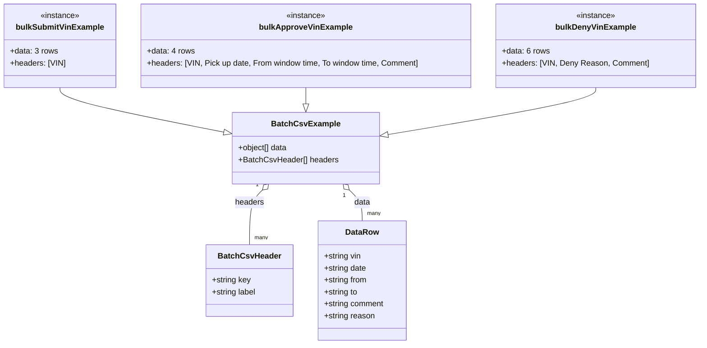

# Diagram: web/portal/src/pages/driveaway/components/search/BulkActionCsvTemplates.ts

> Auto-generated by Obscura crawlers

## Mermaid

### SVG

<svg id="container" width="1382.546875" xmlns="http://www.w3.org/2000/svg" class="classDiagram" height="692" viewBox="0 0 1382.546875 692" role="graphics-document document" aria-roledescription="class"><g><defs><marker id="container_class-aggregationStart" class="marker aggregation class" refX="18" refY="7" markerWidth="190" markerHeight="240" orient="auto"><path d="M 18,7 L9,13 L1,7 L9,1 Z"></path></marker></defs><defs><marker id="container_class-aggregationEnd" class="marker aggregation class" refX="1" refY="7" markerWidth="20" markerHeight="28" orient="auto"><path d="M 18,7 L9,13 L1,7 L9,1 Z"></path></marker></defs><defs><marker id="container_class-extensionStart" class="marker extension class" refX="18" refY="7" markerWidth="190" markerHeight="240" orient="auto"><path d="M 1,7 L18,13 V 1 Z"></path></marker></defs><defs><marker id="container_class-extensionEnd" class="marker extension class" refX="1" refY="7" markerWidth="20" markerHeight="28" orient="auto"><path d="M 1,1 V 13 L18,7 Z"></path></marker></defs><defs><marker id="container_class-compositionStart" class="marker composition class" refX="18" refY="7" markerWidth="190" markerHeight="240" orient="auto"><path d="M 18,7 L9,13 L1,7 L9,1 Z"></path></marker></defs><defs><marker id="container_class-compositionEnd" class="marker composition class" refX="1" refY="7" markerWidth="20" markerHeight="28" orient="auto"><path d="M 18,7 L9,13 L1,7 L9,1 Z"></path></marker></defs><defs><marker id="container_class-dependencyStart" class="marker dependency class" refX="6" refY="7" markerWidth="190" markerHeight="240" orient="auto"><path d="M 5,7 L9,13 L1,7 L9,1 Z"></path></marker></defs><defs><marker id="container_class-dependencyEnd" class="marker dependency class" refX="13" refY="7" markerWidth="20" markerHeight="28" orient="auto"><path d="M 18,7 L9,13 L14,7 L9,1 Z"></path></marker></defs><defs><marker id="container_class-lollipopStart" class="marker lollipop class" refX="13" refY="7" markerWidth="190" markerHeight="240" orient="auto"><circle stroke="black" fill="transparent" cx="7" cy="7" r="6"></circle></marker></defs><defs><marker id="container_class-lollipopEnd" class="marker lollipop class" refX="1" refY="7" markerWidth="190" markerHeight="240" orient="auto"><circle stroke="black" fill="transparent" cx="7" cy="7" r="6"></circle></marker></defs><g class="root"><g class="clusters"></g><g class="edgePaths"><path d="M518.726,381.978L514.404,386.148C510.082,390.319,501.438,398.659,497.117,416.996C492.795,435.333,492.795,463.667,492.795,477.833L492.795,492" id="id_BatchCsvExample_BatchCsvHeader_1" class="edge-thickness-normal edge-pattern-solid relation" style=";;;" data-edge="true" data-et="edge" data-id="id_BatchCsvExample_BatchCsvHeader_1" data-points="W3sieCI6NTMxLjEzODc5NzMwNTA0NTgsInkiOjM3MH0seyJ4Ijo0OTIuNzk0OTIxODc1LCJ5Ijo0MDd9LHsieCI6NDkyLjc5NDkyMTg3NSwieSI6NDkyfV0=" marker-start="url(#container_class-aggregationStart)"></path><path d="M692.782,381.978L697.104,386.148C701.426,390.319,710.069,398.659,714.391,408.996C718.713,419.333,718.713,431.667,718.713,437.833L718.713,444" id="id_BatchCsvExample_DataRow_2" class="edge-thickness-normal edge-pattern-solid relation" style=";;;" data-edge="true" data-et="edge" data-id="id_BatchCsvExample_DataRow_2" data-points="W3sieCI6NjgwLjM2OTAxNTE5NDk1NDIsInkiOjM3MH0seyJ4Ijo3MTguNzEyODkwNjI1LCJ5Ijo0MDd9LHsieCI6NzE4LjcxMjg5MDYyNSwieSI6NDQ0fV0=" marker-start="url(#container_class-aggregationStart)"></path><path d="M116.969,176L116.969,180.167C116.969,184.333,116.969,192.667,171.761,207.707C226.554,222.747,336.139,244.495,390.932,255.368L445.724,266.242" id="id_bulkSubmitVinExample_BatchCsvExample_3" class="edge-thickness-normal edge-pattern-solid relation" style=";;;" data-edge="true" data-et="edge" data-id="id_bulkSubmitVinExample_BatchCsvExample_3" data-points="W3sieCI6MTE2Ljk2ODc1LCJ5IjoxNzZ9LHsieCI6MTE2Ljk2ODc1LCJ5IjoyMDF9LHsieCI6NDYyLjY0NDUzMTI1LCJ5IjoyNjkuNTk5NzczMDM0MjI4N31d" marker-end="url(#container_class-extensionEnd)"></path><path d="M605.754,176L605.754,180.167C605.754,184.333,605.754,192.667,605.754,198.125C605.754,203.583,605.754,206.167,605.754,207.458L605.754,208.75" id="id_bulkApproveVinExample_BatchCsvExample_4" class="edge-thickness-normal edge-pattern-solid relation" style=";;;" data-edge="true" data-et="edge" data-id="id_bulkApproveVinExample_BatchCsvExample_4" data-points="W3sieCI6NjA1Ljc1MzkwNjI1LCJ5IjoxNzZ9LHsieCI6NjA1Ljc1MzkwNjI1LCJ5IjoyMDF9LHsieCI6NjA1Ljc1MzkwNjI1LCJ5IjoyMjZ9XQ==" marker-end="url(#container_class-extensionEnd)"></path><path d="M1180.059,176L1180.059,180.167C1180.059,184.333,1180.059,192.667,1111.028,208.493C1041.997,224.319,903.934,247.637,834.903,259.297L765.872,270.956" id="id_bulkDenyVinExample_BatchCsvExample_5" class="edge-thickness-normal edge-pattern-solid relation" style=";;;" data-edge="true" data-et="edge" data-id="id_bulkDenyVinExample_BatchCsvExample_5" data-points="W3sieCI6MTE4MC4wNTg1OTM3NSwieSI6MTc2fSx7IngiOjExODAuMDU4NTkzNzUsInkiOjIwMX0seyJ4Ijo3NDguODYzMjgxMjUsInkiOjI3My44Mjg4NDE5NDIwMjIzfV0=" marker-end="url(#container_class-extensionEnd)"></path></g><g class="edgeLabels"><g class="edgeLabel" transform="translate(492.794921875, 407)"><g class="label" data-id="id_BatchCsvExample_BatchCsvHeader_1" transform="translate(-29.171875, -12)"><foreignObject width="58.34375" height="24">

headers

</foreignObject></g></g><g class="edgeLabel" transform="translate(718.712890625, 407)"><g class="label" data-id="id_BatchCsvExample_DataRow_2" transform="translate(-16.3203125, -12)"><foreignObject width="32.640625" height="24">

data

</foreignObject></g></g><g class="edgeLabel"><g class="label" data-id="id_bulkSubmitVinExample_BatchCsvExample_3" transform="translate(0, 0)"><foreignObject width="0" height="0">

</foreignObject></g></g><g class="edgeLabel"><g class="label" data-id="id_bulkApproveVinExample_BatchCsvExample_4" transform="translate(0, 0)"><foreignObject width="0" height="0">

</foreignObject></g></g><g class="edgeLabel"><g class="label" data-id="id_bulkDenyVinExample_BatchCsvExample_5" transform="translate(0, 0)"><foreignObject width="0" height="0">

</foreignObject></g></g><g class="edgeTerminals" transform="translate(508.1299545850579, 371.3576492642432)"><g class="inner" transform="translate(0, 0)"><foreignObject style="width: 9px; height: 12px;">
1
</foreignObject></g></g><g class="edgeTerminals" transform="translate(682.5463379946386, 392.9457902191471)"><g class="inner" transform="translate(0, 0)"><foreignObject style="width: 9px; height: 12px;">
1
</foreignObject></g></g><g class="edgeTerminals" transform="translate(502.7949209375, 469.4999991964286)"><g class="inner" transform="translate(0, 0)"></g><foreignObject style="width: 36px; height: 12px;">
many
</foreignObject></g><g class="edgeTerminals" transform="translate(728.7128903125, 421.49999973214284)"><g class="inner" transform="translate(0, 0)"></g><foreignObject style="width: 36px; height: 12px;">
many
</foreignObject></g></g><g class="nodes"><g class="node default" id="classId-BatchCsvHeader-0" transform="translate(492.794921875, 564)"><g class="basic label-container"><path d="M-86.81640625 -72 L86.81640625 -72 L86.81640625 72 L-86.81640625 72" stroke="none" stroke-width="0" fill="#ECECFF" style=""></path><path d="M-86.81640625 -72 C-43.348619576402015 -72, 0.11916709719596952 -72, 86.81640625 -72 M-86.81640625 -72 C-23.829126544796893 -72, 39.158153160406215 -72, 86.81640625 -72 M86.81640625 -72 C86.81640625 -23.84673121664025, 86.81640625 24.3065375667195, 86.81640625 72 M86.81640625 -72 C86.81640625 -42.23878353258012, 86.81640625 -12.477567065160244, 86.81640625 72 M86.81640625 72 C38.335415481988456 72, -10.145575286023089 72, -86.81640625 72 M86.81640625 72 C48.52781874262269 72, 10.239231235245384 72, -86.81640625 72 M-86.81640625 72 C-86.81640625 27.961807521653732, -86.81640625 -16.076384956692536, -86.81640625 -72 M-86.81640625 72 C-86.81640625 17.974440671029654, -86.81640625 -36.05111865794069, -86.81640625 -72" stroke="#9370DB" stroke-width="1.3" fill="none" stroke-dasharray="0 0" style=""></path></g><g class="annotation-group text" transform="translate(0, -48)"></g><g class="label-group text" transform="translate(-59.5390625, -48)"><g class="label" style="font-weight: bolder" transform="translate(0,-12)"><foreignObject width="119.078125" height="24">

BatchCsvHeader

</foreignObject></g></g><g class="members-group text" transform="translate(-74.81640625, 0)"><g class="label" style="" transform="translate(0,-12)"><foreignObject width="78.4375" height="24">

+string key

</foreignObject></g><g class="label" style="" transform="translate(0,12)"><foreignObject width="90.09375" height="24">

+string label

</foreignObject></g></g><g class="methods-group text" transform="translate(-74.81640625, 72)"></g><g class="divider" style=""><path d="M-86.81640625 -24 C-46.097530296779915 -24, -5.37865434355983 -24, 86.81640625 -24 M-86.81640625 -24 C-33.39498584564946 -24, 20.026434558701084 -24, 86.81640625 -24" stroke="#9370DB" stroke-width="1.3" fill="none" stroke-dasharray="0 0" style=""></path></g><g class="divider" style=""><path d="M-86.81640625 48 C-25.704315721297796 48, 35.40777480740441 48, 86.81640625 48 M-86.81640625 48 C-28.41655500427354 48, 29.98329624145292 48, 86.81640625 48" stroke="#9370DB" stroke-width="1.3" fill="none" stroke-dasharray="0 0" style=""></path></g></g><g class="node default" id="classId-BatchCsvExample-1" transform="translate(605.75390625, 298)"><g class="basic label-container"><path d="M-143.109375 -72 L143.109375 -72 L143.109375 72 L-143.109375 72" stroke="none" stroke-width="0" fill="#ECECFF" style=""></path><path d="M-143.109375 -72 C-58.32829541038528 -72, 26.45278417922944 -72, 143.109375 -72 M-143.109375 -72 C-83.40162734255384 -72, -23.693879685107675 -72, 143.109375 -72 M143.109375 -72 C143.109375 -33.117105394742545, 143.109375 5.76578921051491, 143.109375 72 M143.109375 -72 C143.109375 -17.094594888145878, 143.109375 37.810810223708245, 143.109375 72 M143.109375 72 C38.310539478470304 72, -66.48829604305939 72, -143.109375 72 M143.109375 72 C68.78292347453751 72, -5.5435280509249765 72, -143.109375 72 M-143.109375 72 C-143.109375 27.238299734169438, -143.109375 -17.523400531661125, -143.109375 -72 M-143.109375 72 C-143.109375 43.03588492257772, -143.109375 14.071769845155444, -143.109375 -72" stroke="#9370DB" stroke-width="1.3" fill="none" stroke-dasharray="0 0" style=""></path></g><g class="annotation-group text" transform="translate(0, -48)"></g><g class="label-group text" transform="translate(-63.921875, -48)"><g class="label" style="font-weight: bolder" transform="translate(0,-12)"><foreignObject width="127.84375" height="24">

BatchCsvExample

</foreignObject></g></g><g class="members-group text" transform="translate(-131.109375, 0)"><g class="label" style="" transform="translate(0,-12)"><foreignObject width="100.640625" height="24">

+object[] data

</foreignObject></g><g class="label" style="" transform="translate(0,12)"><foreignObject width="198.296875" height="24">

+BatchCsvHeader[] headers

</foreignObject></g></g><g class="methods-group text" transform="translate(-131.109375, 72)"></g><g class="divider" style=""><path d="M-143.109375 -24 C-30.277092215009233 -24, 82.55519056998153 -24, 143.109375 -24 M-143.109375 -24 C-34.9428942531725 -24, 73.223586493655 -24, 143.109375 -24" stroke="#9370DB" stroke-width="1.3" fill="none" stroke-dasharray="0 0" style=""></path></g><g class="divider" style=""><path d="M-143.109375 48 C-44.628916481208066 48, 53.85154203758387 48, 143.109375 48 M-143.109375 48 C-78.70559534651827 48, -14.30181569303653 48, 143.109375 48" stroke="#9370DB" stroke-width="1.3" fill="none" stroke-dasharray="0 0" style=""></path></g></g><g class="node default" id="classId-DataRow-2" transform="translate(718.712890625, 564)"><g class="basic label-container"><path d="M-89.1015625 -120 L89.1015625 -120 L89.1015625 120 L-89.1015625 120" stroke="none" stroke-width="0" fill="#ECECFF" style=""></path><path d="M-89.1015625 -120 C-23.58993020887344 -120, 41.92170208225312 -120, 89.1015625 -120 M-89.1015625 -120 C-41.4092888801896 -120, 6.282984739620801 -120, 89.1015625 -120 M89.1015625 -120 C89.1015625 -54.67531927684395, 89.1015625 10.6493614463121, 89.1015625 120 M89.1015625 -120 C89.1015625 -30.215144240109964, 89.1015625 59.56971151978007, 89.1015625 120 M89.1015625 120 C24.852041048967422 120, -39.397480402065156 120, -89.1015625 120 M89.1015625 120 C48.25603383143866 120, 7.410505162877314 120, -89.1015625 120 M-89.1015625 120 C-89.1015625 68.1513136214822, -89.1015625 16.302627242964405, -89.1015625 -120 M-89.1015625 120 C-89.1015625 65.9704427659278, -89.1015625 11.940885531855585, -89.1015625 -120" stroke="#9370DB" stroke-width="1.3" fill="none" stroke-dasharray="0 0" style=""></path></g><g class="annotation-group text" transform="translate(0, -96)"></g><g class="label-group text" transform="translate(-32.375, -96)"><g class="label" style="font-weight: bolder" transform="translate(0,-12)"><foreignObject width="64.75" height="24">

DataRow

</foreignObject></g></g><g class="members-group text" transform="translate(-77.1015625, -48)"><g class="label" style="" transform="translate(0,-12)"><foreignObject width="75.625" height="24">

+string vin

</foreignObject></g><g class="label" style="" transform="translate(0,12)"><foreignObject width="86.390625" height="24">

+string date

</foreignObject></g><g class="label" style="" transform="translate(0,36)"><foreignObject width="87.96875" height="24">

+string from

</foreignObject></g><g class="label" style="" transform="translate(0,60)"><foreignObject width="68.75" height="24">

+string to

</foreignObject></g><g class="label" style="" transform="translate(0,84)"><foreignObject width="121.828125" height="24">

+string comment

</foreignObject></g><g class="label" style="" transform="translate(0,108)"><foreignObject width="102.859375" height="24">

+string reason

</foreignObject></g></g><g class="methods-group text" transform="translate(-77.1015625, 120)"></g><g class="divider" style=""><path d="M-89.1015625 -72 C-35.97645519525074 -72, 17.148652109498514 -72, 89.1015625 -72 M-89.1015625 -72 C-44.035111787196364 -72, 1.0313389256072725 -72, 89.1015625 -72" stroke="#9370DB" stroke-width="1.3" fill="none" stroke-dasharray="0 0" style=""></path></g><g class="divider" style=""><path d="M-89.1015625 96 C-41.32073456467143 96, 6.460093370657134 96, 89.1015625 96 M-89.1015625 96 C-41.25003018960612 96, 6.601502120787757 96, 89.1015625 96" stroke="#9370DB" stroke-width="1.3" fill="none" stroke-dasharray="0 0" style=""></path></g></g><g class="node default" id="classId-bulkSubmitVinExample-3" transform="translate(116.96875, 92)"><g class="basic label-container"><path d="M-108.96875 -84 L108.96875 -84 L108.96875 84 L-108.96875 84" stroke="none" stroke-width="0" fill="#ECECFF" style=""></path><path d="M-108.96875 -84 C-22.44362565243472 -84, 64.08149869513056 -84, 108.96875 -84 M-108.96875 -84 C-41.14807917245675 -84, 26.672591655086507 -84, 108.96875 -84 M108.96875 -84 C108.96875 -36.466892567747394, 108.96875 11.066214864505213, 108.96875 84 M108.96875 -84 C108.96875 -36.032366260188766, 108.96875 11.935267479622468, 108.96875 84 M108.96875 84 C62.85355125476029 84, 16.73835250952058 84, -108.96875 84 M108.96875 84 C39.86720434973954 84, -29.234341300520924 84, -108.96875 84 M-108.96875 84 C-108.96875 42.12618659156363, -108.96875 0.2523731831272613, -108.96875 -84 M-108.96875 84 C-108.96875 27.9286443930918, -108.96875 -28.142711213816398, -108.96875 -84" stroke="#9370DB" stroke-width="1.3" fill="none" stroke-dasharray="0 0" style=""></path></g><g class="annotation-group text" transform="translate(-39.546875, -60)"><g class="label" style="" transform="translate(0,-12)"><foreignObject width="79.09375" height="24">

«instance»

</foreignObject></g></g><g class="label-group text" transform="translate(-84.46875, -36)"><g class="label" style="font-weight: bolder" transform="translate(0,-12)"><foreignObject width="168.9375" height="24">

bulkSubmitVinExample

</foreignObject></g></g><g class="members-group text" transform="translate(-96.96875, 12)"><g class="label" style="" transform="translate(0,-12)"><foreignObject width="94.921875" height="24">

+data: 3 rows

</foreignObject></g><g class="label" style="" transform="translate(0,12)"><foreignObject width="109.46875" height="24">

+headers: [VIN]

</foreignObject></g></g><g class="methods-group text" transform="translate(-96.96875, 84)"></g><g class="divider" style=""><path d="M-108.96875 -12 C-62.68363961054323 -12, -16.398529221086463 -12, 108.96875 -12 M-108.96875 -12 C-39.69177785300711 -12, 29.58519429398578 -12, 108.96875 -12" stroke="#9370DB" stroke-width="1.3" fill="none" stroke-dasharray="0 0" style=""></path></g><g class="divider" style=""><path d="M-108.96875 60 C-47.745037549655244 60, 13.478674900689512 60, 108.96875 60 M-108.96875 60 C-32.45972522612307 60, 44.04929954775386 60, 108.96875 60" stroke="#9370DB" stroke-width="1.3" fill="none" stroke-dasharray="0 0" style=""></path></g></g><g class="node default" id="classId-bulkApproveVinExample-4" transform="translate(605.75390625, 92)"><g class="basic label-container"><path d="M-329.81640625 -84 L329.81640625 -84 L329.81640625 84 L-329.81640625 84" stroke="none" stroke-width="0" fill="#ECECFF" style=""></path><path d="M-329.81640625 -84 C-172.11771329713574 -84, -14.419020344271473 -84, 329.81640625 -84 M-329.81640625 -84 C-187.08056831928738 -84, -44.34473038857476 -84, 329.81640625 -84 M329.81640625 -84 C329.81640625 -30.26054506446483, 329.81640625 23.478909871070343, 329.81640625 84 M329.81640625 -84 C329.81640625 -38.097704711579034, 329.81640625 7.804590576841932, 329.81640625 84 M329.81640625 84 C144.31812437491283 84, -41.180157500174346 84, -329.81640625 84 M329.81640625 84 C145.22380475289117 84, -39.36879674421766 84, -329.81640625 84 M-329.81640625 84 C-329.81640625 41.61550466927419, -329.81640625 -0.7689906614516246, -329.81640625 -84 M-329.81640625 84 C-329.81640625 21.730876872704357, -329.81640625 -40.538246254591286, -329.81640625 -84" stroke="#9370DB" stroke-width="1.3" fill="none" stroke-dasharray="0 0" style=""></path></g><g class="annotation-group text" transform="translate(-39.546875, -60)"><g class="label" style="" transform="translate(0,-12)"><foreignObject width="79.09375" height="24">

«instance»

</foreignObject></g></g><g class="label-group text" transform="translate(-88.7421875, -36)"><g class="label" style="font-weight: bolder" transform="translate(0,-12)"><foreignObject width="177.484375" height="24">

bulkApproveVinExample

</foreignObject></g></g><g class="members-group text" transform="translate(-317.81640625, 12)"><g class="label" style="" transform="translate(0,-12)"><foreignObject width="95.453125" height="24">

+data: 4 rows

</foreignObject></g><g class="label" style="" transform="translate(0,12)"><foreignObject width="546.890625" height="24">

+headers: [VIN, Pick up date, From window time, To window time, Comment]

</foreignObject></g></g><g class="methods-group text" transform="translate(-317.81640625, 84)"></g><g class="divider" style=""><path d="M-329.81640625 -12 C-164.8755381662691 -12, 0.0653299174617814 -12, 329.81640625 -12 M-329.81640625 -12 C-192.08246561009344 -12, -54.34852497018687 -12, 329.81640625 -12" stroke="#9370DB" stroke-width="1.3" fill="none" stroke-dasharray="0 0" style=""></path></g><g class="divider" style=""><path d="M-329.81640625 60 C-91.60394748181065 60, 146.6085112863787 60, 329.81640625 60 M-329.81640625 60 C-121.76218496086236 60, 86.29203632827529 60, 329.81640625 60" stroke="#9370DB" stroke-width="1.3" fill="none" stroke-dasharray="0 0" style=""></path></g></g><g class="node default" id="classId-bulkDenyVinExample-5" transform="translate(1180.05859375, 92)"><g class="basic label-container"><path d="M-194.48828125 -84 L194.48828125 -84 L194.48828125 84 L-194.48828125 84" stroke="none" stroke-width="0" fill="#ECECFF" style=""></path><path d="M-194.48828125 -84 C-39.24860028167615 -84, 115.9910806866477 -84, 194.48828125 -84 M-194.48828125 -84 C-114.48235566290431 -84, -34.47643007580862 -84, 194.48828125 -84 M194.48828125 -84 C194.48828125 -21.708781470535207, 194.48828125 40.582437058929585, 194.48828125 84 M194.48828125 -84 C194.48828125 -43.07716093897656, 194.48828125 -2.154321877953123, 194.48828125 84 M194.48828125 84 C41.61846534425047 84, -111.25135056149907 84, -194.48828125 84 M194.48828125 84 C66.32221347735225 84, -61.8438542952955 84, -194.48828125 84 M-194.48828125 84 C-194.48828125 48.921829511116954, -194.48828125 13.843659022233908, -194.48828125 -84 M-194.48828125 84 C-194.48828125 19.9085410146797, -194.48828125 -44.1829179706406, -194.48828125 -84" stroke="#9370DB" stroke-width="1.3" fill="none" stroke-dasharray="0 0" style=""></path></g><g class="annotation-group text" transform="translate(-39.546875, -60)"><g class="label" style="" transform="translate(0,-12)"><foreignObject width="79.09375" height="24">

«instance»

</foreignObject></g></g><g class="label-group text" transform="translate(-76.7734375, -36)"><g class="label" style="font-weight: bolder" transform="translate(0,-12)"><foreignObject width="153.546875" height="24">

bulkDenyVinExample

</foreignObject></g></g><g class="members-group text" transform="translate(-182.48828125, 12)"><g class="label" style="" transform="translate(0,-12)"><foreignObject width="95.46875" height="24">

+data: 6 rows

</foreignObject></g><g class="label" style="" transform="translate(0,12)"><foreignObject width="288.203125" height="24">

+headers: [VIN, Deny Reason, Comment]

</foreignObject></g></g><g class="methods-group text" transform="translate(-182.48828125, 84)"></g><g class="divider" style=""><path d="M-194.48828125 -12 C-45.977633039588454 -12, 102.53301517082309 -12, 194.48828125 -12 M-194.48828125 -12 C-63.074487559737406 -12, 68.33930613052519 -12, 194.48828125 -12" stroke="#9370DB" stroke-width="1.3" fill="none" stroke-dasharray="0 0" style=""></path></g><g class="divider" style=""><path d="M-194.48828125 60 C-64.45632615765211 60, 65.57562893469577 60, 194.48828125 60 M-194.48828125 60 C-83.14267810034247 60, 28.20292504931507 60, 194.48828125 60" stroke="#9370DB" stroke-width="1.3" fill="none" stroke-dasharray="0 0" style=""></path></g></g></g></g></g></svg>
