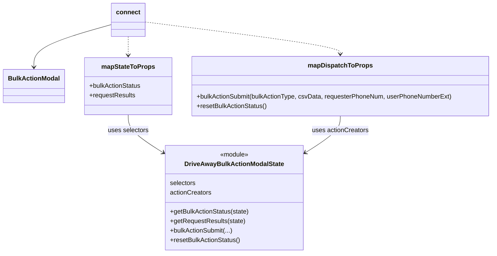

# Diagram: web/portal/src/pages/driveaway/components/search/DriveAway.BulkActionModal.container.js

> Auto-generated by Obscura crawlers

## Mermaid

### SVG

<svg id="container" width="1231.1875" xmlns="http://www.w3.org/2000/svg" class="classDiagram" height="638" viewBox="0 0 1231.1875 638" role="graphics-document document" aria-roledescription="class"><g><defs><marker id="container_class-aggregationStart" class="marker aggregation class" refX="18" refY="7" markerWidth="190" markerHeight="240" orient="auto"><path d="M 18,7 L9,13 L1,7 L9,1 Z"></path></marker></defs><defs><marker id="container_class-aggregationEnd" class="marker aggregation class" refX="1" refY="7" markerWidth="20" markerHeight="28" orient="auto"><path d="M 18,7 L9,13 L1,7 L9,1 Z"></path></marker></defs><defs><marker id="container_class-extensionStart" class="marker extension class" refX="18" refY="7" markerWidth="190" markerHeight="240" orient="auto"><path d="M 1,7 L18,13 V 1 Z"></path></marker></defs><defs><marker id="container_class-extensionEnd" class="marker extension class" refX="1" refY="7" markerWidth="20" markerHeight="28" orient="auto"><path d="M 1,1 V 13 L18,7 Z"></path></marker></defs><defs><marker id="container_class-compositionStart" class="marker composition class" refX="18" refY="7" markerWidth="190" markerHeight="240" orient="auto"><path d="M 18,7 L9,13 L1,7 L9,1 Z"></path></marker></defs><defs><marker id="container_class-compositionEnd" class="marker composition class" refX="1" refY="7" markerWidth="20" markerHeight="28" orient="auto"><path d="M 18,7 L9,13 L1,7 L9,1 Z"></path></marker></defs><defs><marker id="container_class-dependencyStart" class="marker dependency class" refX="6" refY="7" markerWidth="190" markerHeight="240" orient="auto"><path d="M 5,7 L9,13 L1,7 L9,1 Z"></path></marker></defs><defs><marker id="container_class-dependencyEnd" class="marker dependency class" refX="13" refY="7" markerWidth="20" markerHeight="28" orient="auto"><path d="M 18,7 L9,13 L14,7 L9,1 Z"></path></marker></defs><defs><marker id="container_class-lollipopStart" class="marker lollipop class" refX="13" refY="7" markerWidth="190" markerHeight="240" orient="auto"><circle stroke="black" fill="transparent" cx="7" cy="7" r="6"></circle></marker></defs><defs><marker id="container_class-lollipopEnd" class="marker lollipop class" refX="1" refY="7" markerWidth="190" markerHeight="240" orient="auto"><circle stroke="black" fill="transparent" cx="7" cy="7" r="6"></circle></marker></defs><g class="root"><g class="clusters"></g><g class="edgePaths"><path d="M274.879,61.722L242.721,70.935C210.563,80.148,146.246,98.574,114.088,116.454C81.93,134.333,81.93,151.667,81.93,160.333L81.93,169" id="id_connect_BulkActionModal_1" class="edge-thickness-normal edge-pattern-solid relation" style=";;;" data-edge="true" data-et="edge" data-id="id_connect_BulkActionModal_1" data-points="W3sieCI6Mjc0Ljg3ODkwNjI1LCJ5Ijo2MS43MjE1NTg3MzY1NzQ4NTZ9LHsieCI6ODEuOTI5Njg3NSwieSI6MTE3fSx7IngiOjgxLjkyOTY4NzUsInkiOjE3NX1d" marker-end="url(#container_class-dependencyEnd)"></path><path d="M315.793,92L315.793,96.167C315.793,100.333,315.793,108.667,315.793,116.5C315.793,124.333,315.793,131.667,315.793,135.333L315.793,139" id="id_connect_mapStateToProps_2" class="edge-thickness-normal edge-pattern-dashed relation" style=";;;" data-edge="true" data-et="edge" data-id="id_connect_mapStateToProps_2" data-points="W3sieCI6MzE1Ljc5Mjk2ODc1LCJ5Ijo5Mn0seyJ4IjozMTUuNzkyOTY4NzUsInkiOjExN30seyJ4IjozMTUuNzkyOTY4NzUsInkiOjE0NX1d" marker-end="url(#container_class-dependencyEnd)"></path><path d="M356.707,55.137L438.832,65.447C520.957,75.758,685.207,96.379,767.332,109.856C849.457,123.333,849.457,129.667,849.457,132.833L849.457,136" id="id_connect_mapDispatchToProps_3" class="edge-thickness-normal edge-pattern-dashed relation" style=";;;" data-edge="true" data-et="edge" data-id="id_connect_mapDispatchToProps_3" data-points="W3sieCI6MzU2LjcwNzAzMTI1LCJ5Ijo1NS4xMzY2NDM3ODA0NjgxN30seyJ4Ijo4NDkuNDU3MDMxMjUsInkiOjExN30seyJ4Ijo4NDkuNDU3MDMxMjUsInkiOjE0Mn1d" marker-end="url(#container_class-dependencyEnd)"></path><path d="M315.793,289L315.793,295.667C315.793,302.333,315.793,315.667,330.771,331.82C345.749,347.973,375.705,366.946,390.684,376.432L405.662,385.919" id="id_mapStateToProps_DriveAwayBulkActionModalState_4" class="edge-thickness-normal edge-pattern-solid relation" style=";;;" data-edge="true" data-et="edge" data-id="id_mapStateToProps_DriveAwayBulkActionModalState_4" data-points="W3sieCI6MzE1Ljc5Mjk2ODc1LCJ5IjoyODl9LHsieCI6MzE1Ljc5Mjk2ODc1LCJ5IjozMjl9LHsieCI6NDEwLjczMDQ2ODc1LCJ5IjozODkuMTI5MzUzMzc5NDk2MTR9XQ==" marker-end="url(#container_class-dependencyEnd)"></path><path d="M849.457,292L849.457,298.167C849.457,304.333,849.457,316.667,834.479,332.32C819.501,347.973,789.545,366.946,774.566,376.432L759.588,385.919" id="id_mapDispatchToProps_DriveAwayBulkActionModalState_5" class="edge-thickness-normal edge-pattern-solid relation" style=";;;" data-edge="true" data-et="edge" data-id="id_mapDispatchToProps_DriveAwayBulkActionModalState_5" data-points="W3sieCI6ODQ5LjQ1NzAzMTI1LCJ5IjoyOTJ9LHsieCI6ODQ5LjQ1NzAzMTI1LCJ5IjozMjl9LHsieCI6NzU0LjUxOTUzMTI1LCJ5IjozODkuMTI5MzUzMzc5NDk2MTR9XQ==" marker-end="url(#container_class-dependencyEnd)"></path></g><g class="edgeLabels"><g class="edgeLabel"><g class="label" data-id="id_connect_BulkActionModal_1" transform="translate(0, 0)"><foreignObject width="0" height="0">

</foreignObject></g></g><g class="edgeLabel"><g class="label" data-id="id_connect_mapStateToProps_2" transform="translate(0, 0)"><foreignObject width="0" height="0">

</foreignObject></g></g><g class="edgeLabel"><g class="label" data-id="id_connect_mapDispatchToProps_3" transform="translate(0, 0)"><foreignObject width="0" height="0">

</foreignObject></g></g><g class="edgeLabel" transform="translate(315.79296875, 329)"><g class="label" data-id="id_mapStateToProps_DriveAwayBulkActionModalState_4" transform="translate(-51.34375, -12)"><foreignObject width="102.6875" height="24">

uses selectors

</foreignObject></g></g><g class="edgeLabel" transform="translate(849.45703125, 329)"><g class="label" data-id="id_mapDispatchToProps_DriveAwayBulkActionModalState_5" transform="translate(-71.2734375, -12)"><foreignObject width="142.546875" height="24">

uses actionCreators

</foreignObject></g></g></g><g class="nodes"><g class="node default" id="classId-BulkActionModal-0" transform="translate(81.9296875, 217)"><g class="basic label-container"><path d="M-73.9296875 -42 L73.9296875 -42 L73.9296875 42 L-73.9296875 42" stroke="none" stroke-width="0" fill="#ECECFF" style=""></path><path d="M-73.9296875 -42 C-36.80683684316132 -42, 0.31601381367735826 -42, 73.9296875 -42 M-73.9296875 -42 C-20.71637176034966 -42, 32.49694397930068 -42, 73.9296875 -42 M73.9296875 -42 C73.9296875 -14.704476288206127, 73.9296875 12.591047423587746, 73.9296875 42 M73.9296875 -42 C73.9296875 -13.351785524640526, 73.9296875 15.296428950718948, 73.9296875 42 M73.9296875 42 C23.922531567738716 42, -26.08462436452257 42, -73.9296875 42 M73.9296875 42 C27.785896309355998 42, -18.357894881288004 42, -73.9296875 42 M-73.9296875 42 C-73.9296875 20.438673690085842, -73.9296875 -1.1226526198283153, -73.9296875 -42 M-73.9296875 42 C-73.9296875 19.528545786455233, -73.9296875 -2.9429084270895345, -73.9296875 -42" stroke="#9370DB" stroke-width="1.3" fill="none" stroke-dasharray="0 0" style=""></path></g><g class="annotation-group text" transform="translate(0, -18)"></g><g class="label-group text" transform="translate(-61.9296875, -18)"><g class="label" style="font-weight: bolder" transform="translate(0,-12)"><foreignObject width="123.859375" height="24">

BulkActionModal

</foreignObject></g></g><g class="members-group text" transform="translate(-61.9296875, 30)"></g><g class="methods-group text" transform="translate(-61.9296875, 60)"></g><g class="divider" style=""><path d="M-73.9296875 6 C-21.609545816309286 6, 30.71059586738143 6, 73.9296875 6 M-73.9296875 6 C-41.885245810546806 6, -9.840804121093612 6, 73.9296875 6" stroke="#9370DB" stroke-width="1.3" fill="none" stroke-dasharray="0 0" style=""></path></g><g class="divider" style=""><path d="M-73.9296875 24 C-42.49704592385618 24, -11.064404347712362 24, 73.9296875 24 M-73.9296875 24 C-15.768328529740181 24, 42.39303044051964 24, 73.9296875 24" stroke="#9370DB" stroke-width="1.3" fill="none" stroke-dasharray="0 0" style=""></path></g></g><g class="node default" id="classId-connect-1" transform="translate(315.79296875, 50)"><g class="basic label-container"><path d="M-40.9140625 -42 L40.9140625 -42 L40.9140625 42 L-40.9140625 42" stroke="none" stroke-width="0" fill="#ECECFF" style=""></path><path d="M-40.9140625 -42 C-18.412416605415473 -42, 4.0892292891690545 -42, 40.9140625 -42 M-40.9140625 -42 C-20.699050731484466 -42, -0.48403896296893123 -42, 40.9140625 -42 M40.9140625 -42 C40.9140625 -16.869963238979444, 40.9140625 8.260073522041111, 40.9140625 42 M40.9140625 -42 C40.9140625 -21.935165875733798, 40.9140625 -1.870331751467596, 40.9140625 42 M40.9140625 42 C15.902363864306444 42, -9.109334771387111 42, -40.9140625 42 M40.9140625 42 C18.178963123048117 42, -4.556136253903766 42, -40.9140625 42 M-40.9140625 42 C-40.9140625 18.26228626704569, -40.9140625 -5.4754274659086235, -40.9140625 -42 M-40.9140625 42 C-40.9140625 14.635407357920293, -40.9140625 -12.729185284159414, -40.9140625 -42" stroke="#9370DB" stroke-width="1.3" fill="none" stroke-dasharray="0 0" style=""></path></g><g class="annotation-group text" transform="translate(0, -18)"></g><g class="label-group text" transform="translate(-28.9140625, -18)"><g class="label" style="font-weight: bolder" transform="translate(0,-12)"><foreignObject width="57.828125" height="24">

connect

</foreignObject></g></g><g class="members-group text" transform="translate(-28.9140625, 30)"></g><g class="methods-group text" transform="translate(-28.9140625, 60)"></g><g class="divider" style=""><path d="M-40.9140625 6 C-16.736784688078664 6, 7.440493123842671 6, 40.9140625 6 M-40.9140625 6 C-22.972320781108902 6, -5.030579062217804 6, 40.9140625 6" stroke="#9370DB" stroke-width="1.3" fill="none" stroke-dasharray="0 0" style=""></path></g><g class="divider" style=""><path d="M-40.9140625 24 C-20.129015869451916 24, 0.6560307610961686 24, 40.9140625 24 M-40.9140625 24 C-12.338737917735113 24, 16.236586664529774 24, 40.9140625 24" stroke="#9370DB" stroke-width="1.3" fill="none" stroke-dasharray="0 0" style=""></path></g></g><g class="node default" id="classId-mapStateToProps-2" transform="translate(315.79296875, 217)"><g class="basic label-container"><path d="M-109.93359375 -72 L109.93359375 -72 L109.93359375 72 L-109.93359375 72" stroke="none" stroke-width="0" fill="#ECECFF" style=""></path><path d="M-109.93359375 -72 C-62.42046992049336 -72, -14.90734609098672 -72, 109.93359375 -72 M-109.93359375 -72 C-27.58981157624642 -72, 54.75397059750716 -72, 109.93359375 -72 M109.93359375 -72 C109.93359375 -21.36156377105705, 109.93359375 29.2768724578859, 109.93359375 72 M109.93359375 -72 C109.93359375 -41.866536023168024, 109.93359375 -11.733072046336055, 109.93359375 72 M109.93359375 72 C46.9291384173487 72, -16.075316915302594 72, -109.93359375 72 M109.93359375 72 C30.286241918925725 72, -49.36110991214855 72, -109.93359375 72 M-109.93359375 72 C-109.93359375 29.539735807684977, -109.93359375 -12.920528384630046, -109.93359375 -72 M-109.93359375 72 C-109.93359375 29.388063832317613, -109.93359375 -13.223872335364774, -109.93359375 -72" stroke="#9370DB" stroke-width="1.3" fill="none" stroke-dasharray="0 0" style=""></path></g><g class="annotation-group text" transform="translate(0, -48)"></g><g class="label-group text" transform="translate(-64.7109375, -48)"><g class="label" style="font-weight: bolder" transform="translate(0,-12)"><foreignObject width="129.421875" height="24">

mapStateToProps

</foreignObject></g></g><g class="members-group text" transform="translate(-97.93359375, 0)"><g class="label" style="" transform="translate(0,-12)"><foreignObject width="131.15625" height="24">

+bulkActionStatus

</foreignObject></g><g class="label" style="" transform="translate(0,12)"><foreignObject width="116.140625" height="24">

+requestResults

</foreignObject></g></g><g class="methods-group text" transform="translate(-97.93359375, 72)"></g><g class="divider" style=""><path d="M-109.93359375 -24 C-33.6042646543185 -24, 42.725064441363 -24, 109.93359375 -24 M-109.93359375 -24 C-26.473320770708952 -24, 56.986952208582096 -24, 109.93359375 -24" stroke="#9370DB" stroke-width="1.3" fill="none" stroke-dasharray="0 0" style=""></path></g><g class="divider" style=""><path d="M-109.93359375 48 C-25.467260015947645 48, 58.99907371810471 48, 109.93359375 48 M-109.93359375 48 C-55.530226075769505 48, -1.1268584015390104 48, 109.93359375 48" stroke="#9370DB" stroke-width="1.3" fill="none" stroke-dasharray="0 0" style=""></path></g></g><g class="node default" id="classId-mapDispatchToProps-3" transform="translate(849.45703125, 217)"><g class="basic label-container"><path d="M-373.73046875 -75 L373.73046875 -75 L373.73046875 75 L-373.73046875 75" stroke="none" stroke-width="0" fill="#ECECFF" style=""></path><path d="M-373.73046875 -75 C-141.95303249965337 -75, 89.82440375069325 -75, 373.73046875 -75 M-373.73046875 -75 C-184.4561077034162 -75, 4.818253343167612 -75, 373.73046875 -75 M373.73046875 -75 C373.73046875 -15.02299325691446, 373.73046875 44.95401348617108, 373.73046875 75 M373.73046875 -75 C373.73046875 -30.020981596227415, 373.73046875 14.95803680754517, 373.73046875 75 M373.73046875 75 C80.36977250366641 75, -212.99092374266718 75, -373.73046875 75 M373.73046875 75 C151.25322115972625 75, -71.2240264305475 75, -373.73046875 75 M-373.73046875 75 C-373.73046875 32.624706873206236, -373.73046875 -9.750586253587528, -373.73046875 -75 M-373.73046875 75 C-373.73046875 43.94064899426121, -373.73046875 12.881297988522427, -373.73046875 -75" stroke="#9370DB" stroke-width="1.3" fill="none" stroke-dasharray="0 0" style=""></path></g><g class="annotation-group text" transform="translate(0, -51)"></g><g class="label-group text" transform="translate(-77.1953125, -51)"><g class="label" style="font-weight: bolder" transform="translate(0,-12)"><foreignObject width="154.390625" height="24">

mapDispatchToProps

</foreignObject></g></g><g class="members-group text" transform="translate(-361.73046875, -3)"></g><g class="methods-group text" transform="translate(-361.73046875, 27)"><g class="label" style="" transform="translate(0,-12)"><foreignObject width="646.265625" height="24">

+bulkActionSubmit(bulkActionType, csvData, requesterPhoneNum, userPhoneNumberExt)

</foreignObject></g><g class="label" style="" transform="translate(0,12)"><foreignObject width="178.140625" height="24">

+resetBulkActionStatus()

</foreignObject></g></g><g class="divider" style=""><path d="M-373.73046875 -27 C-108.01435680859004 -27, 157.70175513281993 -27, 373.73046875 -27 M-373.73046875 -27 C-111.81120448041474 -27, 150.1080597891705 -27, 373.73046875 -27" stroke="#9370DB" stroke-width="1.3" fill="none" stroke-dasharray="0 0" style=""></path></g><g class="divider" style=""><path d="M-373.73046875 -3 C-184.39658760429475 -3, 4.937293541410497 -3, 373.73046875 -3 M-373.73046875 -3 C-186.24003512919364 -3, 1.2503984916127138 -3, 373.73046875 -3" stroke="#9370DB" stroke-width="1.3" fill="none" stroke-dasharray="0 0" style=""></path></g></g><g class="node default" id="classId-DriveAwayBulkActionModalState-4" transform="translate(582.625, 498)"><g class="basic label-container"><path d="M-171.89453125 -132 L171.89453125 -132 L171.89453125 132 L-171.89453125 132" stroke="none" stroke-width="0" fill="#ECECFF" style=""></path><path d="M-171.89453125 -132 C-92.70859037273861 -132, -13.522649495477225 -132, 171.89453125 -132 M-171.89453125 -132 C-61.81490491427442 -132, 48.264721421451156 -132, 171.89453125 -132 M171.89453125 -132 C171.89453125 -41.63461924986768, 171.89453125 48.730761500264634, 171.89453125 132 M171.89453125 -132 C171.89453125 -65.04980172869975, 171.89453125 1.9003965426005038, 171.89453125 132 M171.89453125 132 C85.92012729608834 132, -0.054276657823322694 132, -171.89453125 132 M171.89453125 132 C91.70545951018022 132, 11.516387770360438 132, -171.89453125 132 M-171.89453125 132 C-171.89453125 74.14662433485768, -171.89453125 16.29324866971534, -171.89453125 -132 M-171.89453125 132 C-171.89453125 49.8677840387722, -171.89453125 -32.2644319224556, -171.89453125 -132" stroke="#9370DB" stroke-width="1.3" fill="none" stroke-dasharray="0 0" style=""></path></g><g class="annotation-group text" transform="translate(-36.6015625, -108)"><g class="label" style="" transform="translate(0,-12)"><foreignObject width="73.203125" height="24">

«module»

</foreignObject></g></g><g class="label-group text" transform="translate(-119.3828125, -84)"><g class="label" style="font-weight: bolder" transform="translate(0,-12)"><foreignObject width="238.765625" height="24">

DriveAwayBulkActionModalState

</foreignObject></g></g><g class="members-group text" transform="translate(-159.89453125, -36)"><g class="label" style="" transform="translate(0,-12)"><foreignObject width="65.46875" height="24">

selectors

</foreignObject></g><g class="label" style="" transform="translate(0,12)"><foreignObject width="105.34375" height="24">

actionCreators

</foreignObject></g></g><g class="methods-group text" transform="translate(-159.89453125, 36)"><g class="label" style="" transform="translate(0,-12)"><foreignObject width="200.40625" height="24">

+getBulkActionStatus(state)

</foreignObject></g><g class="label" style="" transform="translate(0,12)"><foreignObject width="188.90625" height="24">

+getRequestResults(state)

</foreignObject></g><g class="label" style="" transform="translate(0,36)"><foreignObject width="158.9375" height="24">

+bulkActionSubmit(...)

</foreignObject></g><g class="label" style="" transform="translate(0,60)"><foreignObject width="178.140625" height="24">

+resetBulkActionStatus()

</foreignObject></g></g><g class="divider" style=""><path d="M-171.89453125 -60 C-55.80622089539784 -60, 60.282089459204315 -60, 171.89453125 -60 M-171.89453125 -60 C-50.39902223355874 -60, 71.09648678288252 -60, 171.89453125 -60" stroke="#9370DB" stroke-width="1.3" fill="none" stroke-dasharray="0 0" style=""></path></g><g class="divider" style=""><path d="M-171.89453125 12 C-91.3008400649423 12, -10.707148879884613 12, 171.89453125 12 M-171.89453125 12 C-71.47333011643988 12, 28.947871017120235 12, 171.89453125 12" stroke="#9370DB" stroke-width="1.3" fill="none" stroke-dasharray="0 0" style=""></path></g></g></g></g></g></svg>
