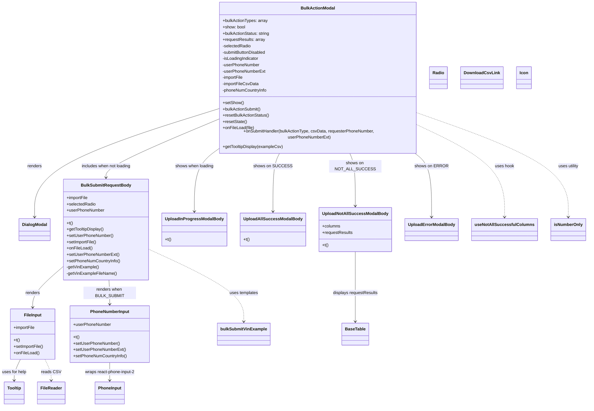
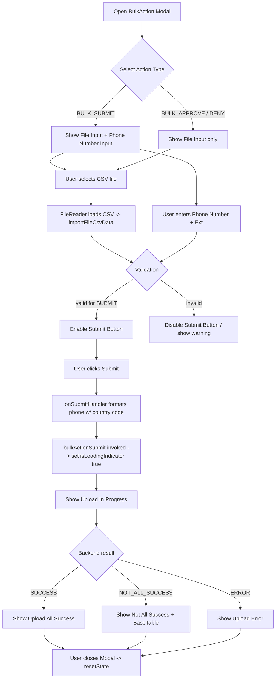

# Diagram: web/portal/src/pages/driveaway/components/search/DriveAway.BulkActionModal.js

> Auto-generated by Obscura crawlers

## Diagram 1

### SVG

<svg id="container" width="2155.658203125" xmlns="http://www.w3.org/2000/svg" class="classDiagram" height="1522" viewBox="0 0 2155.658203125 1522" role="graphics-document document" aria-roledescription="class"><g><defs><marker id="container_class-aggregationStart" class="marker aggregation class" refX="18" refY="7" markerWidth="190" markerHeight="240" orient="auto"><path d="M 18,7 L9,13 L1,7 L9,1 Z"></path></marker></defs><defs><marker id="container_class-aggregationEnd" class="marker aggregation class" refX="1" refY="7" markerWidth="20" markerHeight="28" orient="auto"><path d="M 18,7 L9,13 L1,7 L9,1 Z"></path></marker></defs><defs><marker id="container_class-extensionStart" class="marker extension class" refX="18" refY="7" markerWidth="190" markerHeight="240" orient="auto"><path d="M 1,7 L18,13 V 1 Z"></path></marker></defs><defs><marker id="container_class-extensionEnd" class="marker extension class" refX="1" refY="7" markerWidth="20" markerHeight="28" orient="auto"><path d="M 1,1 V 13 L18,7 Z"></path></marker></defs><defs><marker id="container_class-compositionStart" class="marker composition class" refX="18" refY="7" markerWidth="190" markerHeight="240" orient="auto"><path d="M 18,7 L9,13 L1,7 L9,1 Z"></path></marker></defs><defs><marker id="container_class-compositionEnd" class="marker composition class" refX="1" refY="7" markerWidth="20" markerHeight="28" orient="auto"><path d="M 18,7 L9,13 L1,7 L9,1 Z"></path></marker></defs><defs><marker id="container_class-dependencyStart" class="marker dependency class" refX="6" refY="7" markerWidth="190" markerHeight="240" orient="auto"><path d="M 5,7 L9,13 L1,7 L9,1 Z"></path></marker></defs><defs><marker id="container_class-dependencyEnd" class="marker dependency class" refX="13" refY="7" markerWidth="20" markerHeight="28" orient="auto"><path d="M 18,7 L9,13 L14,7 L9,1 Z"></path></marker></defs><defs><marker id="container_class-lollipopStart" class="marker lollipop class" refX="13" refY="7" markerWidth="190" markerHeight="240" orient="auto"><circle stroke="black" fill="transparent" cx="7" cy="7" r="6"></circle></marker></defs><defs><marker id="container_class-lollipopEnd" class="marker lollipop class" refX="1" refY="7" markerWidth="190" markerHeight="240" orient="auto"><circle stroke="black" fill="transparent" cx="7" cy="7" r="6"></circle></marker></defs><g class="root"><g class="clusters"></g><g class="edgePaths"><path d="M798.129,401.674L687.346,436.228C576.563,470.783,354.997,539.891,244.215,606.612C133.432,673.333,133.432,737.667,133.432,769.833L133.432,802" id="id_BulkActionModal_DialogModal_1" class="edge-thickness-normal edge-pattern-solid relation" style=";;;" data-edge="true" data-et="edge" data-id="id_BulkActionModal_DialogModal_1" data-points="W3sieCI6Nzk4LjEyODkwNjI1LCJ5Ijo0MDEuNjc0MTg4ODc0MzMwNn0seyJ4IjoxMzMuNDMxNjQwNjI1LCJ5Ijo2MDl9LHsieCI6MTMzLjQzMTY0MDYyNSwieSI6ODA4fV0=" marker-end="url(#container_class-dependencyEnd)"></path><path d="M798.129,442.351L731.956,470.126C665.783,497.901,533.438,553.45,467.265,588.392C401.092,623.333,401.092,637.667,401.092,644.833L401.092,652" id="id_BulkActionModal_BulkSubmitRequestBody_2" class="edge-thickness-normal edge-pattern-solid relation" style=";;;" data-edge="true" data-et="edge" data-id="id_BulkActionModal_BulkSubmitRequestBody_2" data-points="W3sieCI6Nzk4LjEyODkwNjI1LCJ5Ijo0NDIuMzUxNDczNzIyNzEwNn0seyJ4Ijo0MDEuMDkxNzk2ODc1LCJ5Ijo2MDl9LHsieCI6NDAxLjA5MTc5Njg3NSwieSI6NjU4fV0=" marker-end="url(#container_class-dependencyEnd)"></path><path d="M798.129,558.624L786.595,567.02C775.061,575.416,751.992,592.208,740.458,629.271C728.924,666.333,728.924,723.667,728.924,752.333L728.924,781" id="id_BulkActionModal_UploadInProgressModalBody_3" class="edge-thickness-normal edge-pattern-solid relation" style=";;;" data-edge="true" data-et="edge" data-id="id_BulkActionModal_UploadInProgressModalBody_3" data-points="W3sieCI6Nzk4LjEyODkwNjI1LCJ5Ijo1NTguNjIzODk4MTYwNTAyMn0seyJ4Ijo3MjguOTIzODI4MTI1LCJ5Ijo2MDl9LHsieCI6NzI4LjkyMzgyODEyNSwieSI6Nzg3fV0=" marker-end="url(#container_class-dependencyEnd)"></path><path d="M1038.223,560L1034.164,568.167C1030.105,576.333,1021.987,592.667,1017.928,629.5C1013.869,666.333,1013.869,723.667,1013.869,752.333L1013.869,781" id="id_BulkActionModal_UploadAllSuccessModalBody_4" class="edge-thickness-normal edge-pattern-solid relation" style=";;;" data-edge="true" data-et="edge" data-id="id_BulkActionModal_UploadAllSuccessModalBody_4" data-points="W3sieCI6MTAzOC4yMjI3ODg0NjE1Mzg2LCJ5Ijo1NjB9LHsieCI6MTAxMy44NjkxNDA2MjUsInkiOjYwOX0seyJ4IjoxMDEzLjg2OTE0MDYyNSwieSI6Nzg3fV0=" marker-end="url(#container_class-dependencyEnd)"></path><path d="M1290.75,560L1294.163,568.167C1297.576,576.333,1304.402,592.667,1307.815,626C1311.229,659.333,1311.229,709.667,1311.229,734.833L1311.229,760" id="id_BulkActionModal_UploadNotAllSuccessModalBody_5" class="edge-thickness-normal edge-pattern-solid relation" style=";;;" data-edge="true" data-et="edge" data-id="id_BulkActionModal_UploadNotAllSuccessModalBody_5" data-points="W3sieCI6MTI5MC43NDk1MTkyMzA3NjkyLCJ5Ijo1NjB9LHsieCI6MTMxMS4yMjg1MTU2MjUsInkiOjYwOX0seyJ4IjoxMzExLjIyODUxNTYyNSwieSI6NzY2fV0=" marker-end="url(#container_class-dependencyEnd)"></path><path d="M1526.398,560L1536.784,568.167C1547.169,576.333,1567.941,592.667,1578.327,633C1588.713,673.333,1588.713,737.667,1588.713,769.833L1588.713,802" id="id_BulkActionModal_UploadErrorModalBody_6" class="edge-thickness-normal edge-pattern-solid relation" style=";;;" data-edge="true" data-et="edge" data-id="id_BulkActionModal_UploadErrorModalBody_6" data-points="W3sieCI6MTUyNi4zOTc3ODg0NjE1Mzg1LCJ5Ijo1NjB9LHsieCI6MTU4OC43MTI4OTA2MjUsInkiOjYwOX0seyJ4IjoxNTg4LjcxMjg5MDYyNSwieSI6ODA4fV0=" marker-end="url(#container_class-dependencyEnd)"></path><path d="M241.057,989.399L221.616,1006.332C202.176,1023.266,163.295,1057.133,143.854,1083.233C124.414,1109.333,124.414,1127.667,124.414,1136.833L124.414,1146" id="id_BulkSubmitRequestBody_FileInput_7" class="edge-thickness-normal edge-pattern-solid relation" style=";;;" data-edge="true" data-et="edge" data-id="id_BulkSubmitRequestBody_FileInput_7" data-points="W3sieCI6MjQxLjA1NjY0MDYyNSwieSI6OTg5LjM5ODU0MTU2ODEzMTl9LHsieCI6MTI0LjQxNDA2MjUsInkiOjEwOTF9LHsieCI6MTI0LjQxNDA2MjUsInkiOjExNTJ9XQ==" marker-end="url(#container_class-dependencyEnd)"></path><path d="M411.329,1042L411.764,1050.167C412.2,1058.333,413.071,1074.667,413.506,1090C413.941,1105.333,413.941,1119.667,413.941,1126.833L413.941,1134" id="id_BulkSubmitRequestBody_PhoneNumberInput_8" class="edge-thickness-normal edge-pattern-solid relation" style=";;;" data-edge="true" data-et="edge" data-id="id_BulkSubmitRequestBody_PhoneNumberInput_8" data-points="W3sieCI6NDExLjMyODgzMDA3MDAyMDczLCJ5IjoxMDQyfSx7IngiOjQxMy45NDE0MDYyNSwieSI6MTA5MX0seyJ4Ijo0MTMuOTQxNDA2MjUsInkiOjExNDB9XQ==" marker-end="url(#container_class-dependencyEnd)"></path><path d="M1311.229,934L1311.229,960.167C1311.229,986.333,1311.229,1038.667,1311.229,1083C1311.229,1127.333,1311.229,1163.667,1311.229,1181.833L1311.229,1200" id="id_UploadNotAllSuccessModalBody_BaseTable_9" class="edge-thickness-normal edge-pattern-solid relation" style=";;;" data-edge="true" data-et="edge" data-id="id_UploadNotAllSuccessModalBody_BaseTable_9" data-points="W3sieCI6MTMxMS4yMjg1MTU2MjUsInkiOjkzNH0seyJ4IjoxMzExLjIyODUxNTYyNSwieSI6MTA5MX0seyJ4IjoxMzExLjIyODUxNTYyNSwieSI6MTIwNn1d" marker-end="url(#container_class-dependencyEnd)"></path><path d="M78.612,1344L74.716,1352.167C70.82,1360.333,63.027,1376.667,59.131,1390C55.234,1403.333,55.234,1413.667,55.234,1418.833L55.234,1424" id="id_FileInput_Tooltip_10" class="edge-thickness-normal edge-pattern-solid relation" style=";;;" data-edge="true" data-et="edge" data-id="id_FileInput_Tooltip_10" data-points="W3sieCI6NzguNjEyMzM4MzYyMDY4OTcsInkiOjEzNDR9LHsieCI6NTUuMjM0Mzc1LCJ5IjoxMzkzfSx7IngiOjU1LjIzNDM3NSwieSI6MTQzMH1d" marker-end="url(#container_class-dependencyEnd)"></path><path d="M413.941,1356L413.941,1362.167C413.941,1368.333,413.941,1380.667,413.941,1392C413.941,1403.333,413.941,1413.667,413.941,1418.833L413.941,1424" id="id_PhoneNumberInput_PhoneInput_11" class="edge-thickness-normal edge-pattern-solid relation" style=";;;" data-edge="true" data-et="edge" data-id="id_PhoneNumberInput_PhoneInput_11" data-points="W3sieCI6NDEzLjk0MTQwNjI1LCJ5IjoxMzU2fSx7IngiOjQxMy45NDE0MDYyNSwieSI6MTM5M30seyJ4Ijo0MTMuOTQxNDA2MjUsInkiOjE0MzB9XQ==" marker-end="url(#container_class-dependencyEnd)"></path><path d="M1552.668,464.932L1602.735,488.943C1652.803,512.954,1752.938,560.977,1803.005,617.155C1853.072,673.333,1853.072,737.667,1853.072,769.833L1853.072,802" id="id_BulkActionModal_useNotAllSuccessfulColumns_12" class="edge-thickness-normal edge-pattern-dashed relation" style=";;;" data-edge="true" data-et="edge" data-id="id_BulkActionModal_useNotAllSuccessfulColumns_12" data-points="W3sieCI6MTU1Mi42Njc5Njg3NSwieSI6NDY0LjkzMTU4MTc4Mzk2MzR9LHsieCI6MTg1My4wNzIyNjU2MjUsInkiOjYwOX0seyJ4IjoxODUzLjA3MjI2NTYyNSwieSI6ODA4fV0=" marker-end="url(#container_class-dependencyEnd)"></path><path d="M1552.668,418.96L1641.208,450.633C1729.748,482.307,1906.828,545.653,1995.368,609.493C2083.908,673.333,2083.908,737.667,2083.908,769.833L2083.908,802" id="id_BulkActionModal_isNumberOnly_13" class="edge-thickness-normal edge-pattern-dashed relation" style=";;;" data-edge="true" data-et="edge" data-id="id_BulkActionModal_isNumberOnly_13" data-points="W3sieCI6MTU1Mi42Njc5Njg3NSwieSI6NDE4Ljk2MDEzMTc0MDQ2NjF9LHsieCI6MjA4My45MDgyMDMxMjUsInkiOjYwOX0seyJ4IjoyMDgzLjkwODIwMzEyNSwieSI6ODA4fV0=" marker-end="url(#container_class-dependencyEnd)"></path><path d="M561.127,926.291L618.711,953.743C676.296,981.194,791.464,1036.097,849.049,1081.715C906.633,1127.333,906.633,1163.667,906.633,1181.833L906.633,1200" id="id_BulkSubmitRequestBody_bulkSubmitVinExample_14" class="edge-thickness-normal edge-pattern-dashed relation" style=";;;" data-edge="true" data-et="edge" data-id="id_BulkSubmitRequestBody_bulkSubmitVinExample_14" data-points="W3sieCI6NTYxLjEyNjk1MzEyNSwieSI6OTI2LjI5MTQ4MDczODg0MzN9LHsieCI6OTA2LjYzMjgxMjUsInkiOjEwOTF9LHsieCI6OTA2LjYzMjgxMjUsInkiOjEyMDZ9XQ==" marker-end="url(#container_class-dependencyEnd)"></path><path d="M170.216,1344L174.112,1352.167C178.008,1360.333,185.801,1376.667,189.697,1390C193.594,1403.333,193.594,1413.667,193.594,1418.833L193.594,1424" id="id_FileInput_FileReader_15" class="edge-thickness-normal edge-pattern-dashed relation" style=";;;" data-edge="true" data-et="edge" data-id="id_FileInput_FileReader_15" data-points="W3sieCI6MTcwLjIxNTc4NjYzNzkzMTA1LCJ5IjoxMzQ0fSx7IngiOjE5My41OTM3NSwieSI6MTM5M30seyJ4IjoxOTMuNTkzNzUsInkiOjE0MzB9XQ==" marker-end="url(#container_class-dependencyEnd)"></path></g><g class="edgeLabels"><g class="edgeLabel" transform="translate(133.431640625, 609)"><g class="label" data-id="id_BulkActionModal_DialogModal_1" transform="translate(-27.75, -12)"><foreignObject width="55.5" height="24">

renders

</foreignObject></g></g><g class="edgeLabel" transform="translate(401.091796875, 609)"><g class="label" data-id="id_BulkActionModal_BulkSubmitRequestBody_2" transform="translate(-95.8671875, -12)"><foreignObject width="191.734375" height="24">

includes when not loading

</foreignObject></g></g><g class="edgeLabel" transform="translate(728.923828125, 609)"><g class="label" data-id="id_BulkActionModal_UploadInProgressModalBody_3" transform="translate(-73.421875, -12)"><foreignObject width="146.84375" height="24">

shows when loading

</foreignObject></g></g><g class="edgeLabel" transform="translate(1013.869140625, 609)"><g class="label" data-id="id_BulkActionModal_UploadAllSuccessModalBody_4" transform="translate(-67.453125, -12)"><foreignObject width="134.90625" height="24">

shows on SUCCESS

</foreignObject></g></g><g class="edgeLabel" transform="translate(1311.228515625, 609)"><g class="label" data-id="id_BulkActionModal_UploadNotAllSuccessModalBody_5" transform="translate(-100, -24)"><foreignObject width="200" height="48">

shows on NOT_ALL_SUCCESS

</foreignObject></g></g><g class="edgeLabel" transform="translate(1588.712890625, 609)"><g class="label" data-id="id_BulkActionModal_UploadErrorModalBody_6" transform="translate(-60.4375, -12)"><foreignObject width="120.875" height="24">

shows on ERROR

</foreignObject></g></g><g class="edgeLabel" transform="translate(124.4140625, 1091)"><g class="label" data-id="id_BulkSubmitRequestBody_FileInput_7" transform="translate(-27.75, -12)"><foreignObject width="55.5" height="24">

renders

</foreignObject></g></g><g class="edgeLabel" transform="translate(413.94140625, 1091)"><g class="label" data-id="id_BulkSubmitRequestBody_PhoneNumberInput_8" transform="translate(-100, -24)"><foreignObject width="200" height="48">

renders when BULK_SUBMIT

</foreignObject></g></g><g class="edgeLabel" transform="translate(1311.228515625, 1091)"><g class="label" data-id="id_UploadNotAllSuccessModalBody_BaseTable_9" transform="translate(-85.875, -12)"><foreignObject width="171.75" height="24">

displays requestResults

</foreignObject></g></g><g class="edgeLabel" transform="translate(55.234375, 1393)"><g class="label" data-id="id_FileInput_Tooltip_10" transform="translate(-47.234375, -12)"><foreignObject width="94.46875" height="24">

uses for help

</foreignObject></g></g><g class="edgeLabel" transform="translate(413.94140625, 1393)"><g class="label" data-id="id_PhoneNumberInput_PhoneInput_11" transform="translate(-96.6015625, -12)"><foreignObject width="193.203125" height="24">

wraps react-phone-input-2

</foreignObject></g></g><g class="edgeLabel" transform="translate(1853.072265625, 609)"><g class="label" data-id="id_BulkActionModal_useNotAllSuccessfulColumns_12" transform="translate(-36.7421875, -12)"><foreignObject width="73.484375" height="24">

uses hook

</foreignObject></g></g><g class="edgeLabel" transform="translate(2083.908203125, 609)"><g class="label" data-id="id_BulkActionModal_isNumberOnly_13" transform="translate(-39.796875, -12)"><foreignObject width="79.59375" height="24">

uses utility

</foreignObject></g></g><g class="edgeLabel" transform="translate(906.6328125, 1091)"><g class="label" data-id="id_BulkSubmitRequestBody_bulkSubmitVinExample_14" transform="translate(-54.8671875, -12)"><foreignObject width="109.734375" height="24">

uses templates

</foreignObject></g></g><g class="edgeLabel" transform="translate(193.59375, 1393)"><g class="label" data-id="id_FileInput_FileReader_15" transform="translate(-35.171875, -12)"><foreignObject width="70.34375" height="24">

reads CSV

</foreignObject></g></g></g><g class="nodes"><g class="node default" id="classId-BulkActionModal-0" transform="translate(1175.3984375, 284)"><g class="basic label-container"><path d="M-377.26953125 -276 L377.26953125 -276 L377.26953125 276 L-377.26953125 276" stroke="none" stroke-width="0" fill="#ECECFF" style=""></path><path d="M-377.26953125 -276 C-103.90144498990492 -276, 169.46664127019017 -276, 377.26953125 -276 M-377.26953125 -276 C-125.49671909200748 -276, 126.27609306598504 -276, 377.26953125 -276 M377.26953125 -276 C377.26953125 -65.93745337222734, 377.26953125 144.12509325554532, 377.26953125 276 M377.26953125 -276 C377.26953125 -84.176855772838, 377.26953125 107.64628845432401, 377.26953125 276 M377.26953125 276 C117.54476957798374 276, -142.1799920940325 276, -377.26953125 276 M377.26953125 276 C107.21975537271055 276, -162.8300205045789 276, -377.26953125 276 M-377.26953125 276 C-377.26953125 106.32909941134966, -377.26953125 -63.34180117730068, -377.26953125 -276 M-377.26953125 276 C-377.26953125 74.50110831908688, -377.26953125 -126.99778336182624, -377.26953125 -276" stroke="#9370DB" stroke-width="1.3" fill="none" stroke-dasharray="0 0" style=""></path></g><g class="annotation-group text" transform="translate(0, -252)"></g><g class="label-group text" transform="translate(-61.9296875, -252)"><g class="label" style="font-weight: bolder" transform="translate(0,-12)"><foreignObject width="123.859375" height="24">

BulkActionModal

</foreignObject></g></g><g class="members-group text" transform="translate(-365.26953125, -204)"><g class="label" style="" transform="translate(0,-12)"><foreignObject width="171.625" height="24">

+bulkActionTypes: array

</foreignObject></g><g class="label" style="" transform="translate(0,12)"><foreignObject width="86.6875" height="24">

+show: bool

</foreignObject></g><g class="label" style="" transform="translate(0,36)"><foreignObject width="180.875" height="24">

+bulkActionStatus: string

</foreignObject></g><g class="label" style="" transform="translate(0,60)"><foreignObject width="161.046875" height="24">

+requestResults: array

</foreignObject></g><g class="label" style="" transform="translate(0,84)"><foreignObject width="109.09375" height="24">

-selectedRadio

</foreignObject></g><g class="label" style="" transform="translate(0,108)"><foreignObject width="169.046875" height="24">

-submitButtonDisabled

</foreignObject></g><g class="label" style="" transform="translate(0,132)"><foreignObject width="141.09375" height="24">

-isLoadingIndicator

</foreignObject></g><g class="label" style="" transform="translate(0,156)"><foreignObject width="142.28125" height="24">

-userPhoneNumber

</foreignObject></g><g class="label" style="" transform="translate(0,180)"><foreignObject width="164.375" height="24">

-userPhoneNumberExt

</foreignObject></g><g class="label" style="" transform="translate(0,204)"><foreignObject width="80.609375" height="24">

-importFile

</foreignObject></g><g class="label" style="" transform="translate(0,228)"><foreignObject width="137.65625" height="24">

-importFileCsvData

</foreignObject></g><g class="label" style="" transform="translate(0,252)"><foreignObject width="171.859375" height="24">

-phoneNumCountryInfo

</foreignObject></g></g><g class="methods-group text" transform="translate(-365.26953125, 108)"><g class="label" style="" transform="translate(0,-12)"><foreignObject width="79.234375" height="24">

+setShow()

</foreignObject></g><g class="label" style="" transform="translate(0,12)"><foreignObject width="147.421875" height="24">

+bulkActionSubmit()

</foreignObject></g><g class="label" style="" transform="translate(0,36)"><foreignObject width="178.140625" height="24">

+resetBulkActionStatus()

</foreignObject></g><g class="label" style="" transform="translate(0,60)"><foreignObject width="92.09375" height="24">

+resetState()

</foreignObject></g><g class="label" style="" transform="translate(0,84)"><foreignObject width="119.765625" height="24">

+onFileLoad(file)

</foreignObject></g><g class="label" style="" transform="translate(0,108)"><foreignObject width="668.609375" height="24">

+onSubmitHandler(bulkActionType, csvData, requesterPhoneNumber, userPhoneNumberExt)

</foreignObject></g><g class="label" style="" transform="translate(0,132)"><foreignObject width="229.390625" height="24">

+getTooltipDisplay(exampleCsv)

</foreignObject></g></g><g class="divider" style=""><path d="M-377.26953125 -228 C-108.75898493235479 -228, 159.75156138529042 -228, 377.26953125 -228 M-377.26953125 -228 C-226.23592511635377 -228, -75.20231898270754 -228, 377.26953125 -228" stroke="#9370DB" stroke-width="1.3" fill="none" stroke-dasharray="0 0" style=""></path></g><g class="divider" style=""><path d="M-377.26953125 84 C-175.75270904914305 84, 25.7641131517139 84, 377.26953125 84 M-377.26953125 84 C-204.0453903815945 84, -30.821249513189002 84, 377.26953125 84" stroke="#9370DB" stroke-width="1.3" fill="none" stroke-dasharray="0 0" style=""></path></g></g><g class="node default" id="classId-BulkSubmitRequestBody-1" transform="translate(401.091796875, 850)"><g class="basic label-container"><path d="M-160.03515625 -192 L160.03515625 -192 L160.03515625 192 L-160.03515625 192" stroke="none" stroke-width="0" fill="#ECECFF" style=""></path><path d="M-160.03515625 -192 C-65.00794994233816 -192, 30.019256365323685 -192, 160.03515625 -192 M-160.03515625 -192 C-50.57130997958377 -192, 58.89253629083245 -192, 160.03515625 -192 M160.03515625 -192 C160.03515625 -70.8555143818142, 160.03515625 50.288971236371594, 160.03515625 192 M160.03515625 -192 C160.03515625 -85.98800913795047, 160.03515625 20.02398172409906, 160.03515625 192 M160.03515625 192 C72.43536806818801 192, -15.164420113623976 192, -160.03515625 192 M160.03515625 192 C76.4404046199438 192, -7.154347010112389 192, -160.03515625 192 M-160.03515625 192 C-160.03515625 78.73059147277496, -160.03515625 -34.53881705445008, -160.03515625 -192 M-160.03515625 192 C-160.03515625 72.88011926016932, -160.03515625 -46.239761479661354, -160.03515625 -192" stroke="#9370DB" stroke-width="1.3" fill="none" stroke-dasharray="0 0" style=""></path></g><g class="annotation-group text" transform="translate(0, -168)"></g><g class="label-group text" transform="translate(-90.8671875, -168)"><g class="label" style="font-weight: bolder" transform="translate(0,-12)"><foreignObject width="181.734375" height="24">

BulkSubmitRequestBody

</foreignObject></g></g><g class="members-group text" transform="translate(-148.03515625, -120)"><g class="label" style="" transform="translate(0,-12)"><foreignObject width="82.15625" height="24">

+importFile

</foreignObject></g><g class="label" style="" transform="translate(0,12)"><foreignObject width="110.625" height="24">

+selectedRadio

</foreignObject></g><g class="label" style="" transform="translate(0,36)"><foreignObject width="143.8125" height="24">

+userPhoneNumber

</foreignObject></g></g><g class="methods-group text" transform="translate(-148.03515625, -24)"><g class="label" style="" transform="translate(0,-12)"><foreignObject width="24.0625" height="24">

+t()

</foreignObject></g><g class="label" style="" transform="translate(0,12)"><foreignObject width="144.21875" height="24">

+getTooltipDisplay()

</foreignObject></g><g class="label" style="" transform="translate(0,36)"><foreignObject width="177.359375" height="24">

+setUserPhoneNumber()

</foreignObject></g><g class="label" style="" transform="translate(0,60)"><foreignObject width="114.703125" height="24">

+setImportFile()

</foreignObject></g><g class="label" style="" transform="translate(0,84)"><foreignObject width="97.234375" height="24">

+onFileLoad()

</foreignObject></g><g class="label" style="" transform="translate(0,108)"><foreignObject width="199.453125" height="24">

+setUserPhoneNumberExt()

</foreignObject></g><g class="label" style="" transform="translate(0,132)"><foreignObject width="205.203125" height="24">

+setPhoneNumCountryInfo()

</foreignObject></g><g class="label" style="" transform="translate(0,156)"><foreignObject width="123.5" height="24">

-getVinExample()

</foreignObject></g><g class="label" style="" transform="translate(0,180)"><foreignObject width="190.703125" height="24">

-getVinExampleFileName()

</foreignObject></g></g><g class="divider" style=""><path d="M-160.03515625 -144 C-75.81105947131253 -144, 8.413037307374935 -144, 160.03515625 -144 M-160.03515625 -144 C-79.25497020293653 -144, 1.525215844126933 -144, 160.03515625 -144" stroke="#9370DB" stroke-width="1.3" fill="none" stroke-dasharray="0 0" style=""></path></g><g class="divider" style=""><path d="M-160.03515625 -48 C-64.60085298469615 -48, 30.833450280607707 -48, 160.03515625 -48 M-160.03515625 -48 C-35.40436238099072 -48, 89.22643148801856 -48, 160.03515625 -48" stroke="#9370DB" stroke-width="1.3" fill="none" stroke-dasharray="0 0" style=""></path></g></g><g class="node default" id="classId-FileInput-2" transform="translate(124.4140625, 1248)"><g class="basic label-container"><path d="M-85.390625 -96 L85.390625 -96 L85.390625 96 L-85.390625 96" stroke="none" stroke-width="0" fill="#ECECFF" style=""></path><path d="M-85.390625 -96 C-35.47490031702387 -96, 14.440824365952267 -96, 85.390625 -96 M-85.390625 -96 C-49.50644030238662 -96, -13.622255604773244 -96, 85.390625 -96 M85.390625 -96 C85.390625 -32.88509811516966, 85.390625 30.229803769660677, 85.390625 96 M85.390625 -96 C85.390625 -41.655934599649996, 85.390625 12.688130800700009, 85.390625 96 M85.390625 96 C48.032129585343654 96, 10.673634170687308 96, -85.390625 96 M85.390625 96 C24.76972269708307 96, -35.85117960583386 96, -85.390625 96 M-85.390625 96 C-85.390625 38.56613828453145, -85.390625 -18.867723430937104, -85.390625 -96 M-85.390625 96 C-85.390625 30.69621400567047, -85.390625 -34.60757198865906, -85.390625 -96" stroke="#9370DB" stroke-width="1.3" fill="none" stroke-dasharray="0 0" style=""></path></g><g class="annotation-group text" transform="translate(0, -72)"></g><g class="label-group text" transform="translate(-32.078125, -72)"><g class="label" style="font-weight: bolder" transform="translate(0,-12)"><foreignObject width="64.15625" height="24">

FileInput

</foreignObject></g></g><g class="members-group text" transform="translate(-73.390625, -24)"><g class="label" style="" transform="translate(0,-12)"><foreignObject width="82.15625" height="24">

+importFile

</foreignObject></g></g><g class="methods-group text" transform="translate(-73.390625, 24)"><g class="label" style="" transform="translate(0,-12)"><foreignObject width="24.0625" height="24">

+t()

</foreignObject></g><g class="label" style="" transform="translate(0,12)"><foreignObject width="114.703125" height="24">

+setImportFile()

</foreignObject></g><g class="label" style="" transform="translate(0,36)"><foreignObject width="97.234375" height="24">

+onFileLoad()

</foreignObject></g></g><g class="divider" style=""><path d="M-85.390625 -48 C-31.91916574113789 -48, 21.552293517724223 -48, 85.390625 -48 M-85.390625 -48 C-27.58105256489 -48, 30.228519870219998 -48, 85.390625 -48" stroke="#9370DB" stroke-width="1.3" fill="none" stroke-dasharray="0 0" style=""></path></g><g class="divider" style=""><path d="M-85.390625 0 C-28.965130356402234 0, 27.46036428719553 0, 85.390625 0 M-85.390625 0 C-24.15798530374208 0, 37.07465439251584 0, 85.390625 0" stroke="#9370DB" stroke-width="1.3" fill="none" stroke-dasharray="0 0" style=""></path></g></g><g class="node default" id="classId-PhoneNumberInput-3" transform="translate(413.94140625, 1248)"><g class="basic label-container"><path d="M-150.3046875 -108 L150.3046875 -108 L150.3046875 108 L-150.3046875 108" stroke="none" stroke-width="0" fill="#ECECFF" style=""></path><path d="M-150.3046875 -108 C-74.77610526467899 -108, 0.7524769706420216 -108, 150.3046875 -108 M-150.3046875 -108 C-31.48693997528747 -108, 87.33080754942506 -108, 150.3046875 -108 M150.3046875 -108 C150.3046875 -64.54089771076976, 150.3046875 -21.08179542153951, 150.3046875 108 M150.3046875 -108 C150.3046875 -37.038594954830884, 150.3046875 33.92281009033823, 150.3046875 108 M150.3046875 108 C81.20188117838121 108, 12.099074856762428 108, -150.3046875 108 M150.3046875 108 C78.09717684626361 108, 5.889666192527216 108, -150.3046875 108 M-150.3046875 108 C-150.3046875 49.10493040307545, -150.3046875 -9.7901391938491, -150.3046875 -108 M-150.3046875 108 C-150.3046875 59.0008877731544, -150.3046875 10.001775546308806, -150.3046875 -108" stroke="#9370DB" stroke-width="1.3" fill="none" stroke-dasharray="0 0" style=""></path></g><g class="annotation-group text" transform="translate(0, -84)"></g><g class="label-group text" transform="translate(-71.40625, -84)"><g class="label" style="font-weight: bolder" transform="translate(0,-12)"><foreignObject width="142.8125" height="24">

PhoneNumberInput

</foreignObject></g></g><g class="members-group text" transform="translate(-138.3046875, -36)"><g class="label" style="" transform="translate(0,-12)"><foreignObject width="143.8125" height="24">

+userPhoneNumber

</foreignObject></g></g><g class="methods-group text" transform="translate(-138.3046875, 12)"><g class="label" style="" transform="translate(0,-12)"><foreignObject width="24.0625" height="24">

+t()

</foreignObject></g><g class="label" style="" transform="translate(0,12)"><foreignObject width="177.359375" height="24">

+setUserPhoneNumber()

</foreignObject></g><g class="label" style="" transform="translate(0,36)"><foreignObject width="199.453125" height="24">

+setUserPhoneNumberExt()

</foreignObject></g><g class="label" style="" transform="translate(0,60)"><foreignObject width="205.203125" height="24">

+setPhoneNumCountryInfo()

</foreignObject></g></g><g class="divider" style=""><path d="M-150.3046875 -60 C-35.24468575457149 -60, 79.81531599085702 -60, 150.3046875 -60 M-150.3046875 -60 C-69.98096967358791 -60, 10.342748152824186 -60, 150.3046875 -60" stroke="#9370DB" stroke-width="1.3" fill="none" stroke-dasharray="0 0" style=""></path></g><g class="divider" style=""><path d="M-150.3046875 -12 C-80.30651691432388 -12, -10.308346328647758 -12, 150.3046875 -12 M-150.3046875 -12 C-84.82309566427303 -12, -19.341503828546053 -12, 150.3046875 -12" stroke="#9370DB" stroke-width="1.3" fill="none" stroke-dasharray="0 0" style=""></path></g></g><g class="node default" id="classId-UploadInProgressModalBody-4" transform="translate(728.923828125, 850)"><g class="basic label-container"><path d="M-117.796875 -63 L117.796875 -63 L117.796875 63 L-117.796875 63" stroke="none" stroke-width="0" fill="#ECECFF" style=""></path><path d="M-117.796875 -63 C-66.92410530459884 -63, -16.051335609197693 -63, 117.796875 -63 M-117.796875 -63 C-44.506362559608846 -63, 28.78414988078231 -63, 117.796875 -63 M117.796875 -63 C117.796875 -22.52118522776525, 117.796875 17.957629544469498, 117.796875 63 M117.796875 -63 C117.796875 -29.69694512508815, 117.796875 3.606109749823702, 117.796875 63 M117.796875 63 C47.34333861215019 63, -23.110197775699618 63, -117.796875 63 M117.796875 63 C32.98599486706816 63, -51.824885265863685 63, -117.796875 63 M-117.796875 63 C-117.796875 16.315935007338766, -117.796875 -30.36812998532247, -117.796875 -63 M-117.796875 63 C-117.796875 21.751855951469878, -117.796875 -19.496288097060244, -117.796875 -63" stroke="#9370DB" stroke-width="1.3" fill="none" stroke-dasharray="0 0" style=""></path></g><g class="annotation-group text" transform="translate(0, -39)"></g><g class="label-group text" transform="translate(-105.796875, -39)"><g class="label" style="font-weight: bolder" transform="translate(0,-12)"><foreignObject width="211.59375" height="24">

UploadInProgressModalBody

</foreignObject></g></g><g class="members-group text" transform="translate(-105.796875, 9)"></g><g class="methods-group text" transform="translate(-105.796875, 39)"><g class="label" style="" transform="translate(0,-12)"><foreignObject width="24.0625" height="24">

+t()

</foreignObject></g></g><g class="divider" style=""><path d="M-117.796875 -15 C-26.547964086013963 -15, 64.70094682797207 -15, 117.796875 -15 M-117.796875 -15 C-51.15198051022759 -15, 15.492913979544824 -15, 117.796875 -15" stroke="#9370DB" stroke-width="1.3" fill="none" stroke-dasharray="0 0" style=""></path></g><g class="divider" style=""><path d="M-117.796875 9 C-28.310163980630108 9, 61.176547038739784 9, 117.796875 9 M-117.796875 9 C-39.76247373466015 9, 38.271927530679704 9, 117.796875 9" stroke="#9370DB" stroke-width="1.3" fill="none" stroke-dasharray="0 0" style=""></path></g></g><g class="node default" id="classId-UploadAllSuccessModalBody-5" transform="translate(1013.869140625, 850)"><g class="basic label-container"><path d="M-117.1484375 -63 L117.1484375 -63 L117.1484375 63 L-117.1484375 63" stroke="none" stroke-width="0" fill="#ECECFF" style=""></path><path d="M-117.1484375 -63 C-43.488532254875125 -63, 30.17137299024975 -63, 117.1484375 -63 M-117.1484375 -63 C-62.19230178785497 -63, -7.236166075709946 -63, 117.1484375 -63 M117.1484375 -63 C117.1484375 -34.71091855683862, 117.1484375 -6.421837113677249, 117.1484375 63 M117.1484375 -63 C117.1484375 -17.198671792457844, 117.1484375 28.60265641508431, 117.1484375 63 M117.1484375 63 C53.089618320987526 63, -10.969200858024948 63, -117.1484375 63 M117.1484375 63 C48.778957845236945 63, -19.59052180952611 63, -117.1484375 63 M-117.1484375 63 C-117.1484375 37.070064513647544, -117.1484375 11.140129027295089, -117.1484375 -63 M-117.1484375 63 C-117.1484375 34.796115192932604, -117.1484375 6.592230385865214, -117.1484375 -63" stroke="#9370DB" stroke-width="1.3" fill="none" stroke-dasharray="0 0" style=""></path></g><g class="annotation-group text" transform="translate(0, -39)"></g><g class="label-group text" transform="translate(-105.1484375, -39)"><g class="label" style="font-weight: bolder" transform="translate(0,-12)"><foreignObject width="210.296875" height="24">

UploadAllSuccessModalBody

</foreignObject></g></g><g class="members-group text" transform="translate(-105.1484375, 9)"></g><g class="methods-group text" transform="translate(-105.1484375, 39)"><g class="label" style="" transform="translate(0,-12)"><foreignObject width="24.0625" height="24">

+t()

</foreignObject></g></g><g class="divider" style=""><path d="M-117.1484375 -15 C-61.12374650875594 -15, -5.099055517511886 -15, 117.1484375 -15 M-117.1484375 -15 C-42.21919931688011 -15, 32.710038866239785 -15, 117.1484375 -15" stroke="#9370DB" stroke-width="1.3" fill="none" stroke-dasharray="0 0" style=""></path></g><g class="divider" style=""><path d="M-117.1484375 9 C-48.53747209022491 9, 20.07349331955018 9, 117.1484375 9 M-117.1484375 9 C-52.145255757825595 9, 12.85792598434881 9, 117.1484375 9" stroke="#9370DB" stroke-width="1.3" fill="none" stroke-dasharray="0 0" style=""></path></g></g><g class="node default" id="classId-UploadNotAllSuccessModalBody-6" transform="translate(1311.228515625, 850)"><g class="basic label-container"><path d="M-130.2109375 -84 L130.2109375 -84 L130.2109375 84 L-130.2109375 84" stroke="none" stroke-width="0" fill="#ECECFF" style=""></path><path d="M-130.2109375 -84 C-49.2300143019995 -84, 31.750908896000993 -84, 130.2109375 -84 M-130.2109375 -84 C-32.75812267512505 -84, 64.6946921497499 -84, 130.2109375 -84 M130.2109375 -84 C130.2109375 -27.707532399663982, 130.2109375 28.584935200672035, 130.2109375 84 M130.2109375 -84 C130.2109375 -45.587914601425425, 130.2109375 -7.175829202850849, 130.2109375 84 M130.2109375 84 C77.07697460095702 84, 23.943011701914017 84, -130.2109375 84 M130.2109375 84 C33.79126443442941 84, -62.628408631141184 84, -130.2109375 84 M-130.2109375 84 C-130.2109375 40.48609751331864, -130.2109375 -3.02780497336272, -130.2109375 -84 M-130.2109375 84 C-130.2109375 21.38939226169976, -130.2109375 -41.22121547660048, -130.2109375 -84" stroke="#9370DB" stroke-width="1.3" fill="none" stroke-dasharray="0 0" style=""></path></g><g class="annotation-group text" transform="translate(0, -60)"></g><g class="label-group text" transform="translate(-118.2109375, -60)"><g class="label" style="font-weight: bolder" transform="translate(0,-12)"><foreignObject width="236.421875" height="24">

UploadNotAllSuccessModalBody

</foreignObject></g></g><g class="members-group text" transform="translate(-118.2109375, -12)"><g class="label" style="" transform="translate(0,-12)"><foreignObject width="69.21875" height="24">

+columns

</foreignObject></g><g class="label" style="" transform="translate(0,12)"><foreignObject width="116.140625" height="24">

+requestResults

</foreignObject></g></g><g class="methods-group text" transform="translate(-118.2109375, 60)"><g class="label" style="" transform="translate(0,-12)"><foreignObject width="24.0625" height="24">

+t()

</foreignObject></g></g><g class="divider" style=""><path d="M-130.2109375 -36 C-26.08930099462303 -36, 78.03233551075394 -36, 130.2109375 -36 M-130.2109375 -36 C-49.67991307413868 -36, 30.851111351722636 -36, 130.2109375 -36" stroke="#9370DB" stroke-width="1.3" fill="none" stroke-dasharray="0 0" style=""></path></g><g class="divider" style=""><path d="M-130.2109375 36 C-30.06551840047024 36, 70.07990069905952 36, 130.2109375 36 M-130.2109375 36 C-27.188396535949806 36, 75.83414442810039 36, 130.2109375 36" stroke="#9370DB" stroke-width="1.3" fill="none" stroke-dasharray="0 0" style=""></path></g></g><g class="node default" id="classId-DialogModal-7" transform="translate(133.431640625, 850)"><g class="basic label-container"><path d="M-57.625 -42 L57.625 -42 L57.625 42 L-57.625 42" stroke="none" stroke-width="0" fill="#ECECFF" style=""></path><path d="M-57.625 -42 C-29.480199096763275 -42, -1.3353981935265509 -42, 57.625 -42 M-57.625 -42 C-24.19409911776942 -42, 9.236801764461163 -42, 57.625 -42 M57.625 -42 C57.625 -10.927416675940115, 57.625 20.14516664811977, 57.625 42 M57.625 -42 C57.625 -11.683895797806834, 57.625 18.632208404386333, 57.625 42 M57.625 42 C19.948304251788855 42, -17.72839149642229 42, -57.625 42 M57.625 42 C24.592993344600515 42, -8.43901331079897 42, -57.625 42 M-57.625 42 C-57.625 19.610461648045323, -57.625 -2.779076703909354, -57.625 -42 M-57.625 42 C-57.625 23.618651935929144, -57.625 5.237303871858288, -57.625 -42" stroke="#9370DB" stroke-width="1.3" fill="none" stroke-dasharray="0 0" style=""></path></g><g class="annotation-group text" transform="translate(0, -18)"></g><g class="label-group text" transform="translate(-45.625, -18)"><g class="label" style="font-weight: bolder" transform="translate(0,-12)"><foreignObject width="91.25" height="24">

DialogModal

</foreignObject></g></g><g class="members-group text" transform="translate(-45.625, 30)"></g><g class="methods-group text" transform="translate(-45.625, 60)"></g><g class="divider" style=""><path d="M-57.625 6 C-17.081606334607052 6, 23.461787330785896 6, 57.625 6 M-57.625 6 C-22.037872725130043 6, 13.549254549739914 6, 57.625 6" stroke="#9370DB" stroke-width="1.3" fill="none" stroke-dasharray="0 0" style=""></path></g><g class="divider" style=""><path d="M-57.625 24 C-13.666015536745903 24, 30.292968926508195 24, 57.625 24 M-57.625 24 C-31.07437473402735 24, -4.523749468054703 24, 57.625 24" stroke="#9370DB" stroke-width="1.3" fill="none" stroke-dasharray="0 0" style=""></path></g></g><g class="node default" id="classId-BaseTable-8" transform="translate(1311.228515625, 1248)"><g class="basic label-container"><path d="M-49.359375 -42 L49.359375 -42 L49.359375 42 L-49.359375 42" stroke="none" stroke-width="0" fill="#ECECFF" style=""></path><path d="M-49.359375 -42 C-22.504899964940897 -42, 4.349575070118206 -42, 49.359375 -42 M-49.359375 -42 C-26.601406308194125 -42, -3.8434376163882504 -42, 49.359375 -42 M49.359375 -42 C49.359375 -12.085572366542003, 49.359375 17.828855266915994, 49.359375 42 M49.359375 -42 C49.359375 -16.9992561069107, 49.359375 8.0014877861786, 49.359375 42 M49.359375 42 C11.806203045147655 42, -25.74696890970469 42, -49.359375 42 M49.359375 42 C27.83398431975928 42, 6.308593639518563 42, -49.359375 42 M-49.359375 42 C-49.359375 14.742200726639311, -49.359375 -12.515598546721378, -49.359375 -42 M-49.359375 42 C-49.359375 19.922940033742496, -49.359375 -2.154119932515009, -49.359375 -42" stroke="#9370DB" stroke-width="1.3" fill="none" stroke-dasharray="0 0" style=""></path></g><g class="annotation-group text" transform="translate(0, -18)"></g><g class="label-group text" transform="translate(-37.359375, -18)"><g class="label" style="font-weight: bolder" transform="translate(0,-12)"><foreignObject width="74.71875" height="24">

BaseTable

</foreignObject></g></g><g class="members-group text" transform="translate(-37.359375, 30)"></g><g class="methods-group text" transform="translate(-37.359375, 60)"></g><g class="divider" style=""><path d="M-49.359375 6 C-10.164412195407884 6, 29.030550609184232 6, 49.359375 6 M-49.359375 6 C-22.172640284722867 6, 5.014094430554266 6, 49.359375 6" stroke="#9370DB" stroke-width="1.3" fill="none" stroke-dasharray="0 0" style=""></path></g><g class="divider" style=""><path d="M-49.359375 24 C-20.509217004901892 24, 8.340940990196216 24, 49.359375 24 M-49.359375 24 C-20.77898926227636 24, 7.801396475447277 24, 49.359375 24" stroke="#9370DB" stroke-width="1.3" fill="none" stroke-dasharray="0 0" style=""></path></g></g><g class="node default" id="classId-PhoneInput-9" transform="translate(413.94140625, 1472)"><g class="basic label-container"><path d="M-54.3671875 -42 L54.3671875 -42 L54.3671875 42 L-54.3671875 42" stroke="none" stroke-width="0" fill="#ECECFF" style=""></path><path d="M-54.3671875 -42 C-21.439475846186312 -42, 11.488235807627376 -42, 54.3671875 -42 M-54.3671875 -42 C-11.451469675582644 -42, 31.464248148834713 -42, 54.3671875 -42 M54.3671875 -42 C54.3671875 -24.035313846865087, 54.3671875 -6.070627693730174, 54.3671875 42 M54.3671875 -42 C54.3671875 -24.801462303741594, 54.3671875 -7.602924607483189, 54.3671875 42 M54.3671875 42 C17.993743138317974 42, -18.37970122336405 42, -54.3671875 42 M54.3671875 42 C14.044363706101727 42, -26.278460087796546 42, -54.3671875 42 M-54.3671875 42 C-54.3671875 17.63637217388978, -54.3671875 -6.7272556522204425, -54.3671875 -42 M-54.3671875 42 C-54.3671875 9.34867466480403, -54.3671875 -23.30265067039194, -54.3671875 -42" stroke="#9370DB" stroke-width="1.3" fill="none" stroke-dasharray="0 0" style=""></path></g><g class="annotation-group text" transform="translate(0, -18)"></g><g class="label-group text" transform="translate(-42.3671875, -18)"><g class="label" style="font-weight: bolder" transform="translate(0,-12)"><foreignObject width="84.734375" height="24">

PhoneInput

</foreignObject></g></g><g class="members-group text" transform="translate(-42.3671875, 30)"></g><g class="methods-group text" transform="translate(-42.3671875, 60)"></g><g class="divider" style=""><path d="M-54.3671875 6 C-30.934700325194605 6, -7.50221315038921 6, 54.3671875 6 M-54.3671875 6 C-13.59073975492602 6, 27.18570799014796 6, 54.3671875 6" stroke="#9370DB" stroke-width="1.3" fill="none" stroke-dasharray="0 0" style=""></path></g><g class="divider" style=""><path d="M-54.3671875 24 C-24.323309249429354 24, 5.720569001141293 24, 54.3671875 24 M-54.3671875 24 C-25.173997597136644 24, 4.019192305726712 24, 54.3671875 24" stroke="#9370DB" stroke-width="1.3" fill="none" stroke-dasharray="0 0" style=""></path></g></g><g class="node default" id="classId-Radio-10" transform="translate(1635.63671875, 284)"><g class="basic label-container"><path d="M-32.96875 -42 L32.96875 -42 L32.96875 42 L-32.96875 42" stroke="none" stroke-width="0" fill="#ECECFF" style=""></path><path d="M-32.96875 -42 C-13.786969328880396 -42, 5.394811342239208 -42, 32.96875 -42 M-32.96875 -42 C-19.49352946728966 -42, -6.018308934579327 -42, 32.96875 -42 M32.96875 -42 C32.96875 -17.643797263440675, 32.96875 6.71240547311865, 32.96875 42 M32.96875 -42 C32.96875 -12.891818570296582, 32.96875 16.216362859406836, 32.96875 42 M32.96875 42 C9.994311954369241 42, -12.980126091261518 42, -32.96875 42 M32.96875 42 C16.186603062432564 42, -0.5955438751348723 42, -32.96875 42 M-32.96875 42 C-32.96875 12.740612561656302, -32.96875 -16.518774876687395, -32.96875 -42 M-32.96875 42 C-32.96875 22.980203603127634, -32.96875 3.960407206255269, -32.96875 -42" stroke="#9370DB" stroke-width="1.3" fill="none" stroke-dasharray="0 0" style=""></path></g><g class="annotation-group text" transform="translate(0, -18)"></g><g class="label-group text" transform="translate(-20.96875, -18)"><g class="label" style="font-weight: bolder" transform="translate(0,-12)"><foreignObject width="41.9375" height="24">

Radio

</foreignObject></g></g><g class="members-group text" transform="translate(-20.96875, 30)"></g><g class="methods-group text" transform="translate(-20.96875, 60)"></g><g class="divider" style=""><path d="M-32.96875 6 C-6.7571197524457105 6, 19.45451049510858 6, 32.96875 6 M-32.96875 6 C-6.615405055701942 6, 19.737939888596117 6, 32.96875 6" stroke="#9370DB" stroke-width="1.3" fill="none" stroke-dasharray="0 0" style=""></path></g><g class="divider" style=""><path d="M-32.96875 24 C-19.12086397218075 24, -5.272977944361497 24, 32.96875 24 M-32.96875 24 C-11.127338611367936 24, 10.714072777264128 24, 32.96875 24" stroke="#9370DB" stroke-width="1.3" fill="none" stroke-dasharray="0 0" style=""></path></g></g><g class="node default" id="classId-Tooltip-11" transform="translate(55.234375, 1472)"><g class="basic label-container"><path d="M-37.7265625 -42 L37.7265625 -42 L37.7265625 42 L-37.7265625 42" stroke="none" stroke-width="0" fill="#ECECFF" style=""></path><path d="M-37.7265625 -42 C-13.387804981185315 -42, 10.95095253762937 -42, 37.7265625 -42 M-37.7265625 -42 C-18.634851322791665 -42, 0.45685985441667043 -42, 37.7265625 -42 M37.7265625 -42 C37.7265625 -16.61571858076023, 37.7265625 8.76856283847954, 37.7265625 42 M37.7265625 -42 C37.7265625 -18.291452185946664, 37.7265625 5.417095628106672, 37.7265625 42 M37.7265625 42 C12.864325966988552 42, -11.997910566022895 42, -37.7265625 42 M37.7265625 42 C10.007474953053709 42, -17.711612593892582 42, -37.7265625 42 M-37.7265625 42 C-37.7265625 23.01438863613241, -37.7265625 4.0287772722648185, -37.7265625 -42 M-37.7265625 42 C-37.7265625 13.979312386945914, -37.7265625 -14.041375226108173, -37.7265625 -42" stroke="#9370DB" stroke-width="1.3" fill="none" stroke-dasharray="0 0" style=""></path></g><g class="annotation-group text" transform="translate(0, -18)"></g><g class="label-group text" transform="translate(-25.7265625, -18)"><g class="label" style="font-weight: bolder" transform="translate(0,-12)"><foreignObject width="51.453125" height="24">

Tooltip

</foreignObject></g></g><g class="members-group text" transform="translate(-25.7265625, 30)"></g><g class="methods-group text" transform="translate(-25.7265625, 60)"></g><g class="divider" style=""><path d="M-37.7265625 6 C-18.633383344131644 6, 0.45979581173671136 6, 37.7265625 6 M-37.7265625 6 C-7.58675117669911 6, 22.55306014660178 6, 37.7265625 6" stroke="#9370DB" stroke-width="1.3" fill="none" stroke-dasharray="0 0" style=""></path></g><g class="divider" style=""><path d="M-37.7265625 24 C-21.663301820974343 24, -5.600041141948687 24, 37.7265625 24 M-37.7265625 24 C-19.888235691737243 24, -2.0499088834744867 24, 37.7265625 24" stroke="#9370DB" stroke-width="1.3" fill="none" stroke-dasharray="0 0" style=""></path></g></g><g class="node default" id="classId-DownloadCsvLink-12" transform="translate(1794.95703125, 284)"><g class="basic label-container"><path d="M-76.3515625 -42 L76.3515625 -42 L76.3515625 42 L-76.3515625 42" stroke="none" stroke-width="0" fill="#ECECFF" style=""></path><path d="M-76.3515625 -42 C-20.57267680498672 -42, 35.20620889002656 -42, 76.3515625 -42 M-76.3515625 -42 C-22.319579297431176 -42, 31.71240390513765 -42, 76.3515625 -42 M76.3515625 -42 C76.3515625 -25.095035077088465, 76.3515625 -8.19007015417693, 76.3515625 42 M76.3515625 -42 C76.3515625 -15.480931605266104, 76.3515625 11.038136789467792, 76.3515625 42 M76.3515625 42 C43.304244356993294 42, 10.256926213986588 42, -76.3515625 42 M76.3515625 42 C29.995614803449918 42, -16.360332893100164 42, -76.3515625 42 M-76.3515625 42 C-76.3515625 22.287950189327965, -76.3515625 2.5759003786559305, -76.3515625 -42 M-76.3515625 42 C-76.3515625 10.842499950738748, -76.3515625 -20.315000098522503, -76.3515625 -42" stroke="#9370DB" stroke-width="1.3" fill="none" stroke-dasharray="0 0" style=""></path></g><g class="annotation-group text" transform="translate(0, -18)"></g><g class="label-group text" transform="translate(-64.3515625, -18)"><g class="label" style="font-weight: bolder" transform="translate(0,-12)"><foreignObject width="128.703125" height="24">

DownloadCsvLink

</foreignObject></g></g><g class="members-group text" transform="translate(-64.3515625, 30)"></g><g class="methods-group text" transform="translate(-64.3515625, 60)"></g><g class="divider" style=""><path d="M-76.3515625 6 C-24.733705977967524 6, 26.88415054406495 6, 76.3515625 6 M-76.3515625 6 C-30.365468654286587 6, 15.620625191426825 6, 76.3515625 6" stroke="#9370DB" stroke-width="1.3" fill="none" stroke-dasharray="0 0" style=""></path></g><g class="divider" style=""><path d="M-76.3515625 24 C-43.73509216075726 24, -11.118621821514523 24, 76.3515625 24 M-76.3515625 24 C-42.161904879883714 24, -7.972247259767428 24, 76.3515625 24" stroke="#9370DB" stroke-width="1.3" fill="none" stroke-dasharray="0 0" style=""></path></g></g><g class="node default" id="classId-Icon-13" transform="translate(1948.61328125, 284)"><g class="basic label-container"><path d="M-27.3046875 -42 L27.3046875 -42 L27.3046875 42 L-27.3046875 42" stroke="none" stroke-width="0" fill="#ECECFF" style=""></path><path d="M-27.3046875 -42 C-6.470110936831514 -42, 14.364465626336973 -42, 27.3046875 -42 M-27.3046875 -42 C-6.0298932633090985 -42, 15.244900973381803 -42, 27.3046875 -42 M27.3046875 -42 C27.3046875 -15.369127914253813, 27.3046875 11.261744171492374, 27.3046875 42 M27.3046875 -42 C27.3046875 -15.819745946586103, 27.3046875 10.360508106827794, 27.3046875 42 M27.3046875 42 C6.547996021304389 42, -14.208695457391222 42, -27.3046875 42 M27.3046875 42 C7.4010644631786064 42, -12.502558573642787 42, -27.3046875 42 M-27.3046875 42 C-27.3046875 9.235398246294693, -27.3046875 -23.529203507410614, -27.3046875 -42 M-27.3046875 42 C-27.3046875 19.825164989138848, -27.3046875 -2.3496700217223037, -27.3046875 -42" stroke="#9370DB" stroke-width="1.3" fill="none" stroke-dasharray="0 0" style=""></path></g><g class="annotation-group text" transform="translate(0, -18)"></g><g class="label-group text" transform="translate(-15.3046875, -18)"><g class="label" style="font-weight: bolder" transform="translate(0,-12)"><foreignObject width="30.609375" height="24">

Icon

</foreignObject></g></g><g class="members-group text" transform="translate(-15.3046875, 30)"></g><g class="methods-group text" transform="translate(-15.3046875, 60)"></g><g class="divider" style=""><path d="M-27.3046875 6 C-12.381750853259689 6, 2.541185793480622 6, 27.3046875 6 M-27.3046875 6 C-10.510511531088849 6, 6.283664437822303 6, 27.3046875 6" stroke="#9370DB" stroke-width="1.3" fill="none" stroke-dasharray="0 0" style=""></path></g><g class="divider" style=""><path d="M-27.3046875 24 C-5.832866361739214 24, 15.638954776521572 24, 27.3046875 24 M-27.3046875 24 C-7.303681121583487 24, 12.697325256833025 24, 27.3046875 24" stroke="#9370DB" stroke-width="1.3" fill="none" stroke-dasharray="0 0" style=""></path></g></g><g class="node default" id="classId-UploadErrorModalBody-14" transform="translate(1588.712890625, 850)"><g class="basic label-container"><path d="M-97.2734375 -42 L97.2734375 -42 L97.2734375 42 L-97.2734375 42" stroke="none" stroke-width="0" fill="#ECECFF" style=""></path><path d="M-97.2734375 -42 C-51.55613803473663 -42, -5.838838569473253 -42, 97.2734375 -42 M-97.2734375 -42 C-39.665249238954125 -42, 17.94293902209175 -42, 97.2734375 -42 M97.2734375 -42 C97.2734375 -22.377089774546832, 97.2734375 -2.7541795490936636, 97.2734375 42 M97.2734375 -42 C97.2734375 -8.536968612156883, 97.2734375 24.926062775686233, 97.2734375 42 M97.2734375 42 C35.29582053038673 42, -26.681796439226545 42, -97.2734375 42 M97.2734375 42 C44.629804463628005 42, -8.01382857274399 42, -97.2734375 42 M-97.2734375 42 C-97.2734375 12.23617763798007, -97.2734375 -17.52764472403986, -97.2734375 -42 M-97.2734375 42 C-97.2734375 9.47427918556096, -97.2734375 -23.05144162887808, -97.2734375 -42" stroke="#9370DB" stroke-width="1.3" fill="none" stroke-dasharray="0 0" style=""></path></g><g class="annotation-group text" transform="translate(0, -18)"></g><g class="label-group text" transform="translate(-85.2734375, -18)"><g class="label" style="font-weight: bolder" transform="translate(0,-12)"><foreignObject width="170.546875" height="24">

UploadErrorModalBody

</foreignObject></g></g><g class="members-group text" transform="translate(-85.2734375, 30)"></g><g class="methods-group text" transform="translate(-85.2734375, 60)"></g><g class="divider" style=""><path d="M-97.2734375 6 C-30.047467502719556 6, 37.17850249456089 6, 97.2734375 6 M-97.2734375 6 C-56.72609546269218 6, -16.178753425384357 6, 97.2734375 6" stroke="#9370DB" stroke-width="1.3" fill="none" stroke-dasharray="0 0" style=""></path></g><g class="divider" style=""><path d="M-97.2734375 24 C-46.37545717485549 24, 4.522523150289018 24, 97.2734375 24 M-97.2734375 24 C-51.53959560948632 24, -5.805753718972639 24, 97.2734375 24" stroke="#9370DB" stroke-width="1.3" fill="none" stroke-dasharray="0 0" style=""></path></g></g><g class="node default" id="classId-useNotAllSuccessfulColumns-15" transform="translate(1853.072265625, 850)"><g class="basic label-container"><path d="M-117.0859375 -42 L117.0859375 -42 L117.0859375 42 L-117.0859375 42" stroke="none" stroke-width="0" fill="#ECECFF" style=""></path><path d="M-117.0859375 -42 C-32.75461938481422 -42, 51.57669873037156 -42, 117.0859375 -42 M-117.0859375 -42 C-39.338054784345616 -42, 38.40982793130877 -42, 117.0859375 -42 M117.0859375 -42 C117.0859375 -9.313450137668063, 117.0859375 23.373099724663874, 117.0859375 42 M117.0859375 -42 C117.0859375 -13.152938382501823, 117.0859375 15.694123234996354, 117.0859375 42 M117.0859375 42 C61.73188254266337 42, 6.377827585326742 42, -117.0859375 42 M117.0859375 42 C45.54870509328519 42, -25.988527313429614 42, -117.0859375 42 M-117.0859375 42 C-117.0859375 21.946234654012986, -117.0859375 1.892469308025973, -117.0859375 -42 M-117.0859375 42 C-117.0859375 13.320340424180248, -117.0859375 -15.359319151639504, -117.0859375 -42" stroke="#9370DB" stroke-width="1.3" fill="none" stroke-dasharray="0 0" style=""></path></g><g class="annotation-group text" transform="translate(0, -18)"></g><g class="label-group text" transform="translate(-105.0859375, -18)"><g class="label" style="font-weight: bolder" transform="translate(0,-12)"><foreignObject width="210.171875" height="24">

useNotAllSuccessfulColumns

</foreignObject></g></g><g class="members-group text" transform="translate(-105.0859375, 30)"></g><g class="methods-group text" transform="translate(-105.0859375, 60)"></g><g class="divider" style=""><path d="M-117.0859375 6 C-38.85732897055074 6, 39.37127955889852 6, 117.0859375 6 M-117.0859375 6 C-26.62079885509094 6, 63.84433978981812 6, 117.0859375 6" stroke="#9370DB" stroke-width="1.3" fill="none" stroke-dasharray="0 0" style=""></path></g><g class="divider" style=""><path d="M-117.0859375 24 C-56.3885549997466 24, 4.308827500506794 24, 117.0859375 24 M-117.0859375 24 C-59.90952946376817 24, -2.7331214275363465 24, 117.0859375 24" stroke="#9370DB" stroke-width="1.3" fill="none" stroke-dasharray="0 0" style=""></path></g></g><g class="node default" id="classId-isNumberOnly-16" transform="translate(2083.908203125, 850)"><g class="basic label-container"><path d="M-63.75 -42 L63.75 -42 L63.75 42 L-63.75 42" stroke="none" stroke-width="0" fill="#ECECFF" style=""></path><path d="M-63.75 -42 C-35.274994951080004 -42, -6.799989902160014 -42, 63.75 -42 M-63.75 -42 C-14.864632910228792 -42, 34.020734179542416 -42, 63.75 -42 M63.75 -42 C63.75 -10.492805750360851, 63.75 21.014388499278297, 63.75 42 M63.75 -42 C63.75 -11.417624274403295, 63.75 19.16475145119341, 63.75 42 M63.75 42 C16.84204494790668 42, -30.065910104186642 42, -63.75 42 M63.75 42 C15.214070898189576 42, -33.32185820362085 42, -63.75 42 M-63.75 42 C-63.75 13.615097487463938, -63.75 -14.769805025072124, -63.75 -42 M-63.75 42 C-63.75 15.63680271567069, -63.75 -10.72639456865862, -63.75 -42" stroke="#9370DB" stroke-width="1.3" fill="none" stroke-dasharray="0 0" style=""></path></g><g class="annotation-group text" transform="translate(0, -18)"></g><g class="label-group text" transform="translate(-51.75, -18)"><g class="label" style="font-weight: bolder" transform="translate(0,-12)"><foreignObject width="103.5" height="24">

isNumberOnly

</foreignObject></g></g><g class="members-group text" transform="translate(-51.75, 30)"></g><g class="methods-group text" transform="translate(-51.75, 60)"></g><g class="divider" style=""><path d="M-63.75 6 C-36.10698239128615 6, -8.463964782572305 6, 63.75 6 M-63.75 6 C-15.130075896593546 6, 33.48984820681291 6, 63.75 6" stroke="#9370DB" stroke-width="1.3" fill="none" stroke-dasharray="0 0" style=""></path></g><g class="divider" style=""><path d="M-63.75 24 C-18.281444313074076 24, 27.18711137385185 24, 63.75 24 M-63.75 24 C-16.786378751052652 24, 30.177242497894696 24, 63.75 24" stroke="#9370DB" stroke-width="1.3" fill="none" stroke-dasharray="0 0" style=""></path></g></g><g class="node default" id="classId-bulkSubmitVinExample-17" transform="translate(906.6328125, 1248)"><g class="basic label-container"><path d="M-96.46875 -42 L96.46875 -42 L96.46875 42 L-96.46875 42" stroke="none" stroke-width="0" fill="#ECECFF" style=""></path><path d="M-96.46875 -42 C-50.287718576683375 -42, -4.1066871533667495 -42, 96.46875 -42 M-96.46875 -42 C-56.41422053981217 -42, -16.35969107962434 -42, 96.46875 -42 M96.46875 -42 C96.46875 -13.117747354404553, 96.46875 15.764505291190893, 96.46875 42 M96.46875 -42 C96.46875 -11.372506664328228, 96.46875 19.254986671343545, 96.46875 42 M96.46875 42 C20.97113891912133 42, -54.52647216175734 42, -96.46875 42 M96.46875 42 C23.363141076688166 42, -49.74246784662367 42, -96.46875 42 M-96.46875 42 C-96.46875 21.600841276713837, -96.46875 1.2016825534276734, -96.46875 -42 M-96.46875 42 C-96.46875 8.541582756412637, -96.46875 -24.916834487174725, -96.46875 -42" stroke="#9370DB" stroke-width="1.3" fill="none" stroke-dasharray="0 0" style=""></path></g><g class="annotation-group text" transform="translate(0, -18)"></g><g class="label-group text" transform="translate(-84.46875, -18)"><g class="label" style="font-weight: bolder" transform="translate(0,-12)"><foreignObject width="168.9375" height="24">

bulkSubmitVinExample

</foreignObject></g></g><g class="members-group text" transform="translate(-84.46875, 30)"></g><g class="methods-group text" transform="translate(-84.46875, 60)"></g><g class="divider" style=""><path d="M-96.46875 6 C-30.224732015095853 6, 36.019285969808294 6, 96.46875 6 M-96.46875 6 C-20.172394351174887 6, 56.123961297650226 6, 96.46875 6" stroke="#9370DB" stroke-width="1.3" fill="none" stroke-dasharray="0 0" style=""></path></g><g class="divider" style=""><path d="M-96.46875 24 C-54.03690510812104 24, -11.60506021624208 24, 96.46875 24 M-96.46875 24 C-52.07572705054754 24, -7.682704101095084 24, 96.46875 24" stroke="#9370DB" stroke-width="1.3" fill="none" stroke-dasharray="0 0" style=""></path></g></g><g class="node default" id="classId-FileReader-18" transform="translate(193.59375, 1472)"><g class="basic label-container"><path d="M-50.6328125 -42 L50.6328125 -42 L50.6328125 42 L-50.6328125 42" stroke="none" stroke-width="0" fill="#ECECFF" style=""></path><path d="M-50.6328125 -42 C-14.963656593267665 -42, 20.70549931346467 -42, 50.6328125 -42 M-50.6328125 -42 C-14.434567200218176 -42, 21.76367809956365 -42, 50.6328125 -42 M50.6328125 -42 C50.6328125 -24.802079890016685, 50.6328125 -7.6041597800333705, 50.6328125 42 M50.6328125 -42 C50.6328125 -11.2729948757632, 50.6328125 19.4540102484736, 50.6328125 42 M50.6328125 42 C15.69033836222367 42, -19.25213577555266 42, -50.6328125 42 M50.6328125 42 C10.650719393211034 42, -29.331373713577932 42, -50.6328125 42 M-50.6328125 42 C-50.6328125 20.005296995506075, -50.6328125 -1.9894060089878494, -50.6328125 -42 M-50.6328125 42 C-50.6328125 12.247988532047213, -50.6328125 -17.504022935905574, -50.6328125 -42" stroke="#9370DB" stroke-width="1.3" fill="none" stroke-dasharray="0 0" style=""></path></g><g class="annotation-group text" transform="translate(0, -18)"></g><g class="label-group text" transform="translate(-38.6328125, -18)"><g class="label" style="font-weight: bolder" transform="translate(0,-12)"><foreignObject width="77.265625" height="24">

FileReader

</foreignObject></g></g><g class="members-group text" transform="translate(-38.6328125, 30)"></g><g class="methods-group text" transform="translate(-38.6328125, 60)"></g><g class="divider" style=""><path d="M-50.6328125 6 C-21.515635482725866 6, 7.601541534548268 6, 50.6328125 6 M-50.6328125 6 C-23.47468693615026 6, 3.6834386276994806 6, 50.6328125 6" stroke="#9370DB" stroke-width="1.3" fill="none" stroke-dasharray="0 0" style=""></path></g><g class="divider" style=""><path d="M-50.6328125 24 C-15.060250286909806 24, 20.512311926180388 24, 50.6328125 24 M-50.6328125 24 C-15.339925824698817 24, 19.952960850602366 24, 50.6328125 24" stroke="#9370DB" stroke-width="1.3" fill="none" stroke-dasharray="0 0" style=""></path></g></g></g></g></g></svg>

## Diagram 2

### SVG

<svg id="container" width="809.890625" xmlns="http://www.w3.org/2000/svg" class="flowchart" height="1999.21875" viewBox="0 0 809.890625 1999.21875" role="graphics-document document" aria-roledescription="flowchart-v2"><g><marker id="container_flowchart-v2-pointEnd" class="marker flowchart-v2" viewBox="0 0 10 10" refX="5" refY="5" markerUnits="userSpaceOnUse" markerWidth="8" markerHeight="8" orient="auto"><path d="M 0 0 L 10 5 L 0 10 z" class="arrowMarkerPath" style="stroke-width: 1; stroke-dasharray: 1, 0;"></path></marker><marker id="container_flowchart-v2-pointStart" class="marker flowchart-v2" viewBox="0 0 10 10" refX="4.5" refY="5" markerUnits="userSpaceOnUse" markerWidth="8" markerHeight="8" orient="auto"><path d="M 0 5 L 10 10 L 10 0 z" class="arrowMarkerPath" style="stroke-width: 1; stroke-dasharray: 1, 0;"></path></marker><marker id="container_flowchart-v2-circleEnd" class="marker flowchart-v2" viewBox="0 0 10 10" refX="11" refY="5" markerUnits="userSpaceOnUse" markerWidth="11" markerHeight="11" orient="auto"><circle cx="5" cy="5" r="5" class="arrowMarkerPath" style="stroke-width: 1; stroke-dasharray: 1, 0;"></circle></marker><marker id="container_flowchart-v2-circleStart" class="marker flowchart-v2" viewBox="0 0 10 10" refX="-1" refY="5" markerUnits="userSpaceOnUse" markerWidth="11" markerHeight="11" orient="auto"><circle cx="5" cy="5" r="5" class="arrowMarkerPath" style="stroke-width: 1; stroke-dasharray: 1, 0;"></circle></marker><marker id="container_flowchart-v2-crossEnd" class="marker cross flowchart-v2" viewBox="0 0 11 11" refX="12" refY="5.2" markerUnits="userSpaceOnUse" markerWidth="11" markerHeight="11" orient="auto"><path d="M 1,1 l 9,9 M 10,1 l -9,9" class="arrowMarkerPath" style="stroke-width: 2; stroke-dasharray: 1, 0;"></path></marker><marker id="container_flowchart-v2-crossStart" class="marker cross flowchart-v2" viewBox="0 0 11 11" refX="-1" refY="5.2" markerUnits="userSpaceOnUse" markerWidth="11" markerHeight="11" orient="auto"><path d="M 1,1 l 9,9 M 10,1 l -9,9" class="arrowMarkerPath" style="stroke-width: 2; stroke-dasharray: 1, 0;"></path></marker><g class="root"><g class="clusters"></g><g class="edgePaths"><path d="M416.133,62L416.133,66.167C416.133,70.333,416.133,78.667,416.133,86.333C416.133,94,416.133,101,416.133,104.5L416.133,108" id="L_A_B_0" class="edge-thickness-normal edge-pattern-solid edge-thickness-normal edge-pattern-solid flowchart-link" style=";" data-edge="true" data-et="edge" data-id="L_A_B_0" data-points="W3sieCI6NDE2LjEzMjgxMjUsInkiOjYyfSx7IngiOjQxNi4xMzI4MTI1LCJ5Ijo4N30seyJ4Ijo0MTYuMTMyODEyNSwieSI6MTEyfV0=" marker-end="url(#container_flowchart-v2-pointEnd)"></path><path d="M368.498,250.599L353.724,264.705C338.95,278.811,309.403,307.023,294.629,326.629C279.855,346.234,279.855,357.234,279.855,362.734L279.855,368.234" id="L_B_C_0" class="edge-thickness-normal edge-pattern-solid edge-thickness-normal edge-pattern-solid flowchart-link" style=";" data-edge="true" data-et="edge" data-id="L_B_C_0" data-points="W3sieCI6MzY4LjQ5NzU4OTI0NTEyODEsInkiOjI1MC41OTkxNTE3NDUxMjgxfSx7IngiOjI3OS44NTU0Njg3NSwieSI6MzM1LjIzNDM3NX0seyJ4IjoyNzkuODU1NDY4NzUsInkiOjM3Mi4yMzQzNzV9XQ==" marker-end="url(#container_flowchart-v2-pointEnd)"></path><path d="M466.053,248.314L482.794,262.801C499.535,277.288,533.018,306.261,549.759,328.248C566.5,350.234,566.5,365.234,566.5,372.734L566.5,380.234" id="L_B_D_0" class="edge-thickness-normal edge-pattern-solid edge-thickness-normal edge-pattern-solid flowchart-link" style=";" data-edge="true" data-et="edge" data-id="L_B_D_0" data-points="W3sieCI6NDY2LjA1Mjc3NTM5Mzc4MDMsInkiOjI0OC4zMTQ0MTIxMDYyMTk3Mn0seyJ4Ijo1NjYuNSwieSI6MzM1LjIzNDM3NX0seyJ4Ijo1NjYuNSwieSI6Mzg0LjIzNDM3NX1d" marker-end="url(#container_flowchart-v2-pointEnd)"></path><path d="M185.402,450.234L175.311,454.401C165.22,458.568,145.038,466.901,145.671,475.005C146.303,483.108,167.751,490.982,178.475,494.919L189.199,498.856" id="L_C_E_0" class="edge-thickness-normal edge-pattern-solid edge-thickness-normal edge-pattern-solid flowchart-link" style=";" data-edge="true" data-et="edge" data-id="L_C_E_0" data-points="W3sieCI6MTg1LjQwMjM0Mzc1LCJ5Ijo0NTAuMjM0Mzc1fSx7IngiOjEyNC44NTU0Njg3NSwieSI6NDc1LjIzNDM3NX0seyJ4IjoxOTIuOTUzODAxMDgxNzMwNzcsInkiOjUwMC4yMzQzNzV9XQ==" marker-end="url(#container_flowchart-v2-pointEnd)"></path><path d="M501.109,438.234L486.174,444.401C471.24,450.568,441.37,462.901,415.444,473.009C389.518,483.118,367.536,491.001,356.545,494.942L345.554,498.884" id="L_D_E_0" class="edge-thickness-normal edge-pattern-solid edge-thickness-normal edge-pattern-solid flowchart-link" style=";" data-edge="true" data-et="edge" data-id="L_D_E_0" data-points="W3sieCI6NTAxLjEwOTM3NSwieSI6NDM4LjIzNDM3NX0seyJ4Ijo0MTEuNSwieSI6NDc1LjIzNDM3NX0seyJ4IjozNDEuNzg4NDYxNTM4NDYxNTUsInkiOjUwMC4yMzQzNzV9XQ==" marker-end="url(#container_flowchart-v2-pointEnd)"></path><path d="M266.5,554.234L266.5,558.401C266.5,562.568,266.5,570.901,266.5,578.568C266.5,586.234,266.5,593.234,266.5,596.734L266.5,600.234" id="L_E_F_0" class="edge-thickness-normal edge-pattern-solid edge-thickness-normal edge-pattern-solid flowchart-link" style=";" data-edge="true" data-et="edge" data-id="L_E_F_0" data-points="W3sieCI6MjY2LjUsInkiOjU1NC4yMzQzNzV9LHsieCI6MjY2LjUsInkiOjU3OS4yMzQzNzV9LHsieCI6MjY2LjUsInkiOjYwNC4yMzQzNzV9XQ==" marker-end="url(#container_flowchart-v2-pointEnd)"></path><path d="M409.855,439.281L437.63,445.274C465.404,451.266,520.952,463.25,548.726,477.909C576.5,492.568,576.5,509.901,576.5,527.234C576.5,544.568,576.5,561.901,576.5,574.068C576.5,586.234,576.5,593.234,576.5,596.734L576.5,600.234" id="L_C_G_0" class="edge-thickness-normal edge-pattern-solid edge-thickness-normal edge-pattern-solid flowchart-link" style=";" data-edge="true" data-et="edge" data-id="L_C_G_0" data-points="W3sieCI6NDA5Ljg1NTQ2ODc1LCJ5Ijo0MzkuMjgxNDExNTE1MTg5NH0seyJ4Ijo1NzYuNSwieSI6NDc1LjIzNDM3NX0seyJ4Ijo1NzYuNSwieSI6NTI3LjIzNDM3NX0seyJ4Ijo1NzYuNSwieSI6NTc5LjIzNDM3NX0seyJ4Ijo1NzYuNSwieSI6NjA0LjIzNDM3NX1d" marker-end="url(#container_flowchart-v2-pointEnd)"></path><path d="M266.5,682.234L266.5,686.401C266.5,690.568,266.5,698.901,286.209,713.786C305.917,728.671,345.335,750.108,365.044,760.827L384.752,771.545" id="L_F_H_0" class="edge-thickness-normal edge-pattern-solid edge-thickness-normal edge-pattern-solid flowchart-link" style=";" data-edge="true" data-et="edge" data-id="L_F_H_0" data-points="W3sieCI6MjY2LjUsInkiOjY4Mi4yMzQzNzV9LHsieCI6MjY2LjUsInkiOjcwNy4yMzQzNzV9LHsieCI6Mzg4LjI2NjE2NDc1NzA3MTEsInkiOjc3My40NTY0OTE0OTI5Mjg5fV0=" marker-end="url(#container_flowchart-v2-pointEnd)"></path><path d="M576.5,682.234L576.5,686.401C576.5,690.568,576.5,698.901,559.186,713.507C541.872,728.113,507.244,748.992,489.93,759.432L472.616,769.871" id="L_G_H_0" class="edge-thickness-normal edge-pattern-solid edge-thickness-normal edge-pattern-solid flowchart-link" style=";" data-edge="true" data-et="edge" data-id="L_G_H_0" data-points="W3sieCI6NTc2LjUsInkiOjY4Mi4yMzQzNzV9LHsieCI6NTc2LjUsInkiOjcwNy4yMzQzNzV9LHsieCI6NDY5LjE5MDQ4NjI2MzkyNDEzLCJ5Ijo3NzEuOTM2NTgwMDEzOTI0MX1d" marker-end="url(#container_flowchart-v2-pointEnd)"></path><path d="M391.365,821.392L372.658,833.912C353.951,846.433,316.538,871.474,297.832,891.495C279.125,911.516,279.125,926.516,279.125,934.016L279.125,941.516" id="L_H_I_0" class="edge-thickness-normal edge-pattern-solid edge-thickness-normal edge-pattern-solid flowchart-link" style=";" data-edge="true" data-et="edge" data-id="L_H_I_0" data-points="W3sieCI6MzkxLjM2NDUxOTE5ODc4MzgsInkiOjgyMS4zOTE4NjI5NDg3ODM4fSx7IngiOjI3OS4xMjUsInkiOjg5Ni41MTU2MjV9LHsieCI6Mjc5LjEyNSwieSI6OTQ1LjUxNTYyNX1d" marker-end="url(#container_flowchart-v2-pointEnd)"></path><path d="M466.384,822.62L483.375,834.936C500.366,847.252,534.347,871.884,551.337,889.7C568.328,907.516,568.328,918.516,568.328,924.016L568.328,929.516" id="L_H_J_0" class="edge-thickness-normal edge-pattern-solid edge-thickness-normal edge-pattern-solid flowchart-link" style=";" data-edge="true" data-et="edge" data-id="L_H_J_0" data-points="W3sieCI6NDY2LjM4NDIxMDQ5NzQ3NTgsInkiOjgyMi42MTk2OTU3NTI1MjQyfSx7IngiOjU2OC4zMjgxMjUsInkiOjg5Ni41MTU2MjV9LHsieCI6NTY4LjMyODEyNSwieSI6OTMzLjUxNTYyNX1d" marker-end="url(#container_flowchart-v2-pointEnd)"></path><path d="M279.125,999.516L279.125,1005.682C279.125,1011.849,279.125,1024.182,279.125,1033.849C279.125,1043.516,279.125,1050.516,279.125,1054.016L279.125,1057.516" id="L_I_K_0" class="edge-thickness-normal edge-pattern-solid edge-thickness-normal edge-pattern-solid flowchart-link" style=";" data-edge="true" data-et="edge" data-id="L_I_K_0" data-points="W3sieCI6Mjc5LjEyNSwieSI6OTk5LjUxNTYyNX0seyJ4IjoyNzkuMTI1LCJ5IjoxMDM2LjUxNTYyNX0seyJ4IjoyNzkuMTI1LCJ5IjoxMDYxLjUxNTYyNX1d" marker-end="url(#container_flowchart-v2-pointEnd)"></path><path d="M279.125,1115.516L279.125,1119.682C279.125,1123.849,279.125,1132.182,279.125,1139.849C279.125,1147.516,279.125,1154.516,279.125,1158.016L279.125,1161.516" id="L_K_L_0" class="edge-thickness-normal edge-pattern-solid edge-thickness-normal edge-pattern-solid flowchart-link" style=";" data-edge="true" data-et="edge" data-id="L_K_L_0" data-points="W3sieCI6Mjc5LjEyNSwieSI6MTExNS41MTU2MjV9LHsieCI6Mjc5LjEyNSwieSI6MTE0MC41MTU2MjV9LHsieCI6Mjc5LjEyNSwieSI6MTE2NS41MTU2MjV9XQ==" marker-end="url(#container_flowchart-v2-pointEnd)"></path><path d="M279.125,1243.516L279.125,1247.682C279.125,1251.849,279.125,1260.182,279.125,1267.849C279.125,1275.516,279.125,1282.516,279.125,1286.016L279.125,1289.516" id="L_L_M_0" class="edge-thickness-normal edge-pattern-solid edge-thickness-normal edge-pattern-solid flowchart-link" style=";" data-edge="true" data-et="edge" data-id="L_L_M_0" data-points="W3sieCI6Mjc5LjEyNSwieSI6MTI0My41MTU2MjV9LHsieCI6Mjc5LjEyNSwieSI6MTI2OC41MTU2MjV9LHsieCI6Mjc5LjEyNSwieSI6MTI5My41MTU2MjV9XQ==" marker-end="url(#container_flowchart-v2-pointEnd)"></path><path d="M279.125,1395.516L279.125,1399.682C279.125,1403.849,279.125,1412.182,279.125,1419.849C279.125,1427.516,279.125,1434.516,279.125,1438.016L279.125,1441.516" id="L_M_N_0" class="edge-thickness-normal edge-pattern-solid edge-thickness-normal edge-pattern-solid flowchart-link" style=";" data-edge="true" data-et="edge" data-id="L_M_N_0" data-points="W3sieCI6Mjc5LjEyNSwieSI6MTM5NS41MTU2MjV9LHsieCI6Mjc5LjEyNSwieSI6MTQyMC41MTU2MjV9LHsieCI6Mjc5LjEyNSwieSI6MTQ0NS41MTU2MjV9XQ==" marker-end="url(#container_flowchart-v2-pointEnd)"></path><path d="M279.125,1499.516L279.125,1503.682C279.125,1507.849,279.125,1516.182,279.125,1523.849C279.125,1531.516,279.125,1538.516,279.125,1542.016L279.125,1545.516" id="L_N_O_0" class="edge-thickness-normal edge-pattern-solid edge-thickness-normal edge-pattern-solid flowchart-link" style=";" data-edge="true" data-et="edge" data-id="L_N_O_0" data-points="W3sieCI6Mjc5LjEyNSwieSI6MTQ5OS41MTU2MjV9LHsieCI6Mjc5LjEyNSwieSI6MTUyNC41MTU2MjV9LHsieCI6Mjc5LjEyNSwieSI6MTU0OS41MTU2MjV9XQ==" marker-end="url(#container_flowchart-v2-pointEnd)"></path><path d="M233.602,1665.696L215.879,1679.45C198.157,1693.203,162.711,1720.711,144.988,1741.965C127.266,1763.219,127.266,1778.219,127.266,1785.719L127.266,1793.219" id="L_O_P_0" class="edge-thickness-normal edge-pattern-solid edge-thickness-normal edge-pattern-solid flowchart-link" style=";" data-edge="true" data-et="edge" data-id="L_O_P_0" data-points="W3sieCI6MjMzLjYwMTkzNzkyOTA2MTgsInkiOjE2NjUuNjk1Njg3OTI5MDYxN30seyJ4IjoxMjcuMjY1NjI1LCJ5IjoxNzQ4LjIxODc1fSx7IngiOjEyNy4yNjU2MjUsInkiOjE3OTcuMjE4NzV9XQ==" marker-end="url(#container_flowchart-v2-pointEnd)"></path><path d="M324.055,1666.289L341.134,1679.944C358.214,1693.599,392.372,1720.909,409.452,1740.064C426.531,1759.219,426.531,1770.219,426.531,1775.719L426.531,1781.219" id="L_O_Q_0" class="edge-thickness-normal edge-pattern-solid edge-thickness-normal edge-pattern-solid flowchart-link" style=";" data-edge="true" data-et="edge" data-id="L_O_Q_0" data-points="W3sieCI6MzI0LjA1NDk3MDI4OTgxMjQsInkiOjE2NjYuMjg4Nzc5NzEwMTg3Nn0seyJ4Ijo0MjYuNTMxMjUsInkiOjE3NDguMjE4NzV9LHsieCI6NDI2LjUzMTI1LCJ5IjoxNzg1LjIxODc1fV0=" marker-end="url(#container_flowchart-v2-pointEnd)"></path><path d="M342.427,1647.917L402.724,1664.634C463.021,1681.351,583.616,1714.785,643.914,1739.002C704.211,1763.219,704.211,1778.219,704.211,1785.719L704.211,1793.219" id="L_O_R_0" class="edge-thickness-normal edge-pattern-solid edge-thickness-normal edge-pattern-solid flowchart-link" style=";" data-edge="true" data-et="edge" data-id="L_O_R_0" data-points="W3sieCI6MzQyLjQyNjY5MTcxMTU3MzMsInkiOjE2NDcuOTE3MDU4Mjg4NDI2N30seyJ4Ijo3MDQuMjEwOTM3NSwieSI6MTc0OC4yMTg3NX0seyJ4Ijo3MDQuMjEwOTM3NSwieSI6MTc5Ny4yMTg3NX1d" marker-end="url(#container_flowchart-v2-pointEnd)"></path><path d="M127.266,1851.219L127.266,1857.385C127.266,1863.552,127.266,1875.885,136.766,1885.965C146.266,1896.044,165.267,1903.87,174.768,1907.783L184.268,1911.695" id="L_P_S_0" class="edge-thickness-normal edge-pattern-solid edge-thickness-normal edge-pattern-solid flowchart-link" style=";" data-edge="true" data-et="edge" data-id="L_P_S_0" data-points="W3sieCI6MTI3LjI2NTYyNSwieSI6MTg1MS4yMTg3NX0seyJ4IjoxMjcuMjY1NjI1LCJ5IjoxODg4LjIxODc1fSx7IngiOjE4Ny45NjY2MTM3Njk1MzEyNSwieSI6MTkxMy4yMTg3NX1d" marker-end="url(#container_flowchart-v2-pointEnd)"></path><path d="M426.531,1863.219L426.531,1867.385C426.531,1871.552,426.531,1879.885,417.774,1887.948C409.016,1896.01,391.501,1903.802,382.744,1907.697L373.986,1911.593" id="L_Q_S_0" class="edge-thickness-normal edge-pattern-solid edge-thickness-normal edge-pattern-solid flowchart-link" style=";" data-edge="true" data-et="edge" data-id="L_Q_S_0" data-points="W3sieCI6NDI2LjUzMTI1LCJ5IjoxODYzLjIxODc1fSx7IngiOjQyNi41MzEyNSwieSI6MTg4OC4yMTg3NX0seyJ4IjozNzAuMzMxNjA0MDAzOTA2MjUsInkiOjE5MTMuMjE4NzV9XQ==" marker-end="url(#container_flowchart-v2-pointEnd)"></path><path d="M704.211,1851.219L704.211,1857.385C704.211,1863.552,704.211,1875.885,656.278,1889.329C608.346,1902.773,512.48,1917.327,464.548,1924.605L416.615,1931.882" id="L_R_S_0" class="edge-thickness-normal edge-pattern-solid edge-thickness-normal edge-pattern-solid flowchart-link" style=";" data-edge="true" data-et="edge" data-id="L_R_S_0" data-points="W3sieCI6NzA0LjIxMDkzNzUsInkiOjE4NTEuMjE4NzV9LHsieCI6NzA0LjIxMDkzNzUsInkiOjE4ODguMjE4NzV9LHsieCI6NDEyLjY2MDE1NjI1LCJ5IjoxOTMyLjQ4MjEwMDUzNzkxMzN9XQ==" marker-end="url(#container_flowchart-v2-pointEnd)"></path></g><g class="edgeLabels"><g class="edgeLabel"><g class="label" data-id="L_A_B_0" transform="translate(0, 0)"><foreignObject width="0" height="0">

</foreignObject></g></g><g class="edgeLabel" transform="translate(279.85546875, 335.234375)"><g class="label" data-id="L_B_C_0" transform="translate(-50.1015625, -12)"><foreignObject width="100.203125" height="24">

BULK_SUBMIT

</foreignObject></g></g><g class="edgeLabel" transform="translate(566.5, 335.234375)"><g class="label" data-id="L_B_D_0" transform="translate(-83.5859375, -12)"><foreignObject width="167.171875" height="24">

BULK_APPROVE / DENY

</foreignObject></g></g><g class="edgeLabel"><g class="label" data-id="L_C_E_0" transform="translate(0, 0)"><foreignObject width="0" height="0">

</foreignObject></g></g><g class="edgeLabel"><g class="label" data-id="L_D_E_0" transform="translate(0, 0)"><foreignObject width="0" height="0">

</foreignObject></g></g><g class="edgeLabel"><g class="label" data-id="L_E_F_0" transform="translate(0, 0)"><foreignObject width="0" height="0">

</foreignObject></g></g><g class="edgeLabel"><g class="label" data-id="L_C_G_0" transform="translate(0, 0)"><foreignObject width="0" height="0">

</foreignObject></g></g><g class="edgeLabel"><g class="label" data-id="L_F_H_0" transform="translate(0, 0)"><foreignObject width="0" height="0">

</foreignObject></g></g><g class="edgeLabel"><g class="label" data-id="L_G_H_0" transform="translate(0, 0)"><foreignObject width="0" height="0">

</foreignObject></g></g><g class="edgeLabel" transform="translate(279.125, 896.515625)"><g class="label" data-id="L_H_I_0" transform="translate(-59.3046875, -12)"><foreignObject width="118.609375" height="24">

valid for SUBMIT

</foreignObject></g></g><g class="edgeLabel" transform="translate(568.328125, 896.515625)"><g class="label" data-id="L_H_J_0" transform="translate(-24.359375, -12)"><foreignObject width="48.71875" height="24">

invalid

</foreignObject></g></g><g class="edgeLabel"><g class="label" data-id="L_I_K_0" transform="translate(0, 0)"><foreignObject width="0" height="0">

</foreignObject></g></g><g class="edgeLabel"><g class="label" data-id="L_K_L_0" transform="translate(0, 0)"><foreignObject width="0" height="0">

</foreignObject></g></g><g class="edgeLabel"><g class="label" data-id="L_L_M_0" transform="translate(0, 0)"><foreignObject width="0" height="0">

</foreignObject></g></g><g class="edgeLabel"><g class="label" data-id="L_M_N_0" transform="translate(0, 0)"><foreignObject width="0" height="0">

</foreignObject></g></g><g class="edgeLabel"><g class="label" data-id="L_N_O_0" transform="translate(0, 0)"><foreignObject width="0" height="0">

</foreignObject></g></g><g class="edgeLabel" transform="translate(127.265625, 1748.21875)"><g class="label" data-id="L_O_P_0" transform="translate(-31.28125, -12)"><foreignObject width="62.5625" height="24">

SUCCESS

</foreignObject></g></g><g class="edgeLabel" transform="translate(426.53125, 1748.21875)"><g class="label" data-id="L_O_Q_0" transform="translate(-66.453125, -12)"><foreignObject width="132.90625" height="24">

NOT_ALL_SUCCESS

</foreignObject></g></g><g class="edgeLabel" transform="translate(704.2109375, 1748.21875)"><g class="label" data-id="L_O_R_0" transform="translate(-24.265625, -12)"><foreignObject width="48.53125" height="24">

ERROR

</foreignObject></g></g><g class="edgeLabel"><g class="label" data-id="L_P_S_0" transform="translate(0, 0)"><foreignObject width="0" height="0">

</foreignObject></g></g><g class="edgeLabel"><g class="label" data-id="L_Q_S_0" transform="translate(0, 0)"><foreignObject width="0" height="0">

</foreignObject></g></g><g class="edgeLabel"><g class="label" data-id="L_R_S_0" transform="translate(0, 0)"><foreignObject width="0" height="0">

</foreignObject></g></g></g><g class="nodes"><g class="node default" id="flowchart-A-0" transform="translate(416.1328125, 35)"><rect class="basic label-container" style="" x="-114.75" y="-27" width="229.5" height="54"></rect><g class="label" style="" transform="translate(-84.75, -12)"><rect></rect><foreignObject width="169.5" height="24">

Open BulkAction Modal

</foreignObject></g></g><g class="node default" id="flowchart-B-1" transform="translate(416.1328125, 205.1171875)"><polygon points="93.1171875,0 186.234375,-93.1171875 93.1171875,-186.234375 0,-93.1171875" class="label-container" transform="translate(-92.6171875, 93.1171875)"></polygon><g class="label" style="" transform="translate(-66.1171875, -12)"><rect></rect><foreignObject width="132.234375" height="24">

Select Action Type

</foreignObject></g></g><g class="node default" id="flowchart-C-3" transform="translate(279.85546875, 411.234375)"><rect class="basic label-container" style="" x="-130" y="-39" width="260" height="78"></rect><g class="label" style="" transform="translate(-100, -24)"><rect></rect><foreignObject width="200" height="48">

Show File Input + Phone Number Input

</foreignObject></g></g><g class="node default" id="flowchart-D-5" transform="translate(566.5, 411.234375)"><rect class="basic label-container" style="" x="-103.2890625" y="-27" width="206.578125" height="54"></rect><g class="label" style="" transform="translate(-73.2890625, -12)"><rect></rect><foreignObject width="146.578125" height="24">

Show File Input only

</foreignObject></g></g><g class="node default" id="flowchart-E-7" transform="translate(266.5, 527.234375)"><rect class="basic label-container" style="" x="-102.3203125" y="-27" width="204.640625" height="54"></rect><g class="label" style="" transform="translate(-72.3203125, -12)"><rect></rect><foreignObject width="144.640625" height="24">

User selects CSV file

</foreignObject></g></g><g class="node default" id="flowchart-F-11" transform="translate(266.5, 643.234375)"><rect class="basic label-container" style="" x="-130" y="-39" width="260" height="78"></rect><g class="label" style="" transform="translate(-100, -24)"><rect></rect><foreignObject width="200" height="48">

FileReader loads CSV -&gt; importFileCsvData

</foreignObject></g></g><g class="node default" id="flowchart-G-13" transform="translate(576.5, 643.234375)"><rect class="basic label-container" style="" x="-130" y="-39" width="260" height="78"></rect><g class="label" style="" transform="translate(-100, -24)"><rect></rect><foreignObject width="200" height="48">

User enters Phone Number + Ext

</foreignObject></g></g><g class="node default" id="flowchart-H-16" transform="translate(429.48828125, 795.875)"><polygon points="63.640625,0 127.28125,-63.640625 63.640625,-127.28125 0,-63.640625" class="label-container" transform="translate(-63.140625, 63.640625)"></polygon><g class="label" style="" transform="translate(-36.640625, -12)"><rect></rect><foreignObject width="73.28125" height="24">

Validation

</foreignObject></g></g><g class="node default" id="flowchart-I-18" transform="translate(279.125, 972.515625)"><rect class="basic label-container" style="" x="-109.203125" y="-27" width="218.40625" height="54"></rect><g class="label" style="" transform="translate(-79.203125, -12)"><rect></rect><foreignObject width="158.40625" height="24">

Enable Submit Button

</foreignObject></g></g><g class="node default" id="flowchart-J-20" transform="translate(568.328125, 972.515625)"><rect class="basic label-container" style="" x="-130" y="-39" width="260" height="78"></rect><g class="label" style="" transform="translate(-100, -24)"><rect></rect><foreignObject width="200" height="48">

Disable Submit Button / show warning

</foreignObject></g></g><g class="node default" id="flowchart-K-22" transform="translate(279.125, 1088.515625)"><rect class="basic label-container" style="" x="-96.4921875" y="-27" width="192.984375" height="54"></rect><g class="label" style="" transform="translate(-66.4921875, -12)"><rect></rect><foreignObject width="132.984375" height="24">

User clicks Submit

</foreignObject></g></g><g class="node default" id="flowchart-L-24" transform="translate(279.125, 1204.515625)"><rect class="basic label-container" style="" x="-130" y="-39" width="260" height="78"></rect><g class="label" style="" transform="translate(-100, -24)"><rect></rect><foreignObject width="200" height="48">

onSubmitHandler formats phone w/ country code

</foreignObject></g></g><g class="node default" id="flowchart-M-26" transform="translate(279.125, 1344.515625)"><rect class="basic label-container" style="" x="-130" y="-51" width="260" height="102"></rect><g class="label" style="" transform="translate(-100, -36)"><rect></rect><foreignObject width="200" height="72">

bulkActionSubmit invoked -&gt; set isLoadingIndicator true

</foreignObject></g></g><g class="node default" id="flowchart-N-28" transform="translate(279.125, 1472.515625)"><rect class="basic label-container" style="" x="-119.71875" y="-27" width="239.4375" height="54"></rect><g class="label" style="" transform="translate(-89.71875, -12)"><rect></rect><foreignObject width="179.4375" height="24">

Show Upload In Progress

</foreignObject></g></g><g class="node default" id="flowchart-O-30" transform="translate(279.125, 1630.3671875)"><polygon points="80.8515625,0 161.703125,-80.8515625 80.8515625,-161.703125 0,-80.8515625" class="label-container" transform="translate(-80.3515625, 80.8515625)"></polygon><g class="label" style="" transform="translate(-53.8515625, -12)"><rect></rect><foreignObject width="107.703125" height="24">

Backend result

</foreignObject></g></g><g class="node default" id="flowchart-P-32" transform="translate(127.265625, 1824.21875)"><rect class="basic label-container" style="" x="-119.265625" y="-27" width="238.53125" height="54"></rect><g class="label" style="" transform="translate(-89.265625, -12)"><rect></rect><foreignObject width="178.53125" height="24">

Show Upload All Success

</foreignObject></g></g><g class="node default" id="flowchart-Q-34" transform="translate(426.53125, 1824.21875)"><rect class="basic label-container" style="" x="-130" y="-39" width="260" height="78"></rect><g class="label" style="" transform="translate(-100, -24)"><rect></rect><foreignObject width="200" height="48">

Show Not All Success + BaseTable

</foreignObject></g></g><g class="node default" id="flowchart-R-36" transform="translate(704.2109375, 1824.21875)"><rect class="basic label-container" style="" x="-97.6796875" y="-27" width="195.359375" height="54"></rect><g class="label" style="" transform="translate(-67.6796875, -12)"><rect></rect><foreignObject width="135.359375" height="24">

Show Upload Error

</foreignObject></g></g><g class="node default" id="flowchart-S-40" transform="translate(282.66015625, 1952.21875)"><rect class="basic label-container" style="" x="-130" y="-39" width="260" height="78"></rect><g class="label" style="" transform="translate(-100, -24)"><rect></rect><foreignObject width="200" height="48">

User closes Modal -&gt; resetState

</foreignObject></g></g></g></g></g></svg>
