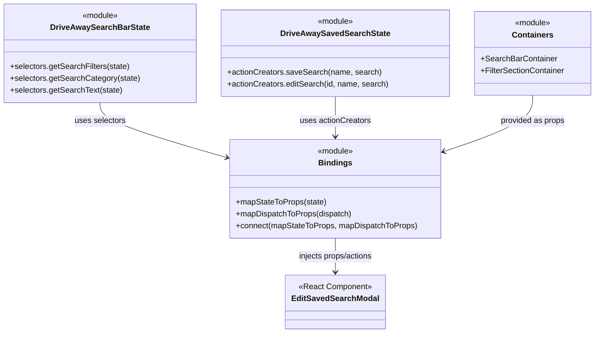

# Diagram: web/portal/src/pages/driveaway/components/search/DriveAway.EditSavedSearchModal.container.js


> Auto-generated by Obscura crawlers

## Diagram 1

```mermaid
flowchart LR
  State((Redux State)) -->|getSearchFilters, getSearchCategory, getSearchText| DriveAwaySearchBarState[DriveAwaySearchBarState.selectors]
  DriveAwaySearchBarState -->|values| mapStateToProps[mapStateToProps]
  mapStateToProps -->|props: searchFilters, searchCategory, searchText, SearchBarContainer, FilterSectionContainer| ConnectedProps[Connected Props]
  ConnectedProps --> EditSavedSearchModal
  DriveAwaySavedSearchState[DriveAwaySavedSearchState.actionCreators] -->|saveSearch, editSearch| mapDispatchToProps[mapDispatchToProps]
  mapDispatchToProps -->|functions: saveSearch(name,search), editSearch(id,name,search)| ConnectedActions[Connected Actions]
  ConnectedActions --> EditSavedSearchModal
  SearchBarContainer --> ConnectedProps
  FilterSectionContainer --> ConnectedProps
  connect[[connect(mapStateToProps, mapDispatchToProps)]] --> EditSavedSearchModal
```

> SVG rendering failed for this diagram.

## Diagram 2



### SVG

<svg id="container" width="1176.390625" xmlns="http://www.w3.org/2000/svg" class="classDiagram" height="668" viewBox="0 0 1176.390625 668" role="graphics-document document" aria-roledescription="class"><style>#container{font-family:"trebuchet ms",verdana,arial,sans-serif;font-size:16px;fill:#333;}@keyframes edge-animation-frame{from{stroke-dashoffset:0;}}@keyframes dash{to{stroke-dashoffset:0;}}#container .edge-animation-slow{stroke-dasharray:9,5!important;stroke-dashoffset:900;animation:dash 50s linear infinite;stroke-linecap:round;}#container .edge-animation-fast{stroke-dasharray:9,5!important;stroke-dashoffset:900;animation:dash 20s linear infinite;stroke-linecap:round;}#container .error-icon{fill:#552222;}#container .error-text{fill:#552222;stroke:#552222;}#container .edge-thickness-normal{stroke-width:1px;}#container .edge-thickness-thick{stroke-width:3.5px;}#container .edge-pattern-solid{stroke-dasharray:0;}#container .edge-thickness-invisible{stroke-width:0;fill:none;}#container .edge-pattern-dashed{stroke-dasharray:3;}#container .edge-pattern-dotted{stroke-dasharray:2;}#container .marker{fill:#333333;stroke:#333333;}#container .marker.cross{stroke:#333333;}#container svg{font-family:"trebuchet ms",verdana,arial,sans-serif;font-size:16px;}#container p{margin:0;}#container g.classGroup text{fill:#9370DB;stroke:none;font-family:"trebuchet ms",verdana,arial,sans-serif;font-size:10px;}#container g.classGroup text .title{font-weight:bolder;}#container .nodeLabel,#container .edgeLabel{color:#131300;}#container .edgeLabel .label rect{fill:#ECECFF;}#container .label text{fill:#131300;}#container .labelBkg{background:#ECECFF;}#container .edgeLabel .label span{background:#ECECFF;}#container .classTitle{font-weight:bolder;}#container .node rect,#container .node circle,#container .node ellipse,#container .node polygon,#container .node path{fill:#ECECFF;stroke:#9370DB;stroke-width:1px;}#container .divider{stroke:#9370DB;stroke-width:1;}#container g.clickable{cursor:pointer;}#container g.classGroup rect{fill:#ECECFF;stroke:#9370DB;}#container g.classGroup line{stroke:#9370DB;stroke-width:1;}#container .classLabel .box{stroke:none;stroke-width:0;fill:#ECECFF;opacity:0.5;}#container .classLabel .label{fill:#9370DB;font-size:10px;}#container .relation{stroke:#333333;stroke-width:1;fill:none;}#container .dashed-line{stroke-dasharray:3;}#container .dotted-line{stroke-dasharray:1 2;}#container #compositionStart,#container .composition{fill:#333333!important;stroke:#333333!important;stroke-width:1;}#container #compositionEnd,#container .composition{fill:#333333!important;stroke:#333333!important;stroke-width:1;}#container #dependencyStart,#container .dependency{fill:#333333!important;stroke:#333333!important;stroke-width:1;}#container #dependencyStart,#container .dependency{fill:#333333!important;stroke:#333333!important;stroke-width:1;}#container #extensionStart,#container .extension{fill:transparent!important;stroke:#333333!important;stroke-width:1;}#container #extensionEnd,#container .extension{fill:transparent!important;stroke:#333333!important;stroke-width:1;}#container #aggregationStart,#container .aggregation{fill:transparent!important;stroke:#333333!important;stroke-width:1;}#container #aggregationEnd,#container .aggregation{fill:transparent!important;stroke:#333333!important;stroke-width:1;}#container #lollipopStart,#container .lollipop{fill:#ECECFF!important;stroke:#333333!important;stroke-width:1;}#container #lollipopEnd,#container .lollipop{fill:#ECECFF!important;stroke:#333333!important;stroke-width:1;}#container .edgeTerminals{font-size:11px;line-height:initial;}#container .classTitleText{text-anchor:middle;font-size:18px;fill:#333;}#container .label-icon{display:inline-block;height:1em;overflow:visible;vertical-align:-0.125em;}#container .node .label-icon path{fill:currentColor;stroke:revert;stroke-width:revert;}#container :root{--mermaid-font-family:"trebuchet ms",verdana,arial,sans-serif;}</style><g><defs><marker id="container_class-aggregationStart" class="marker aggregation class" refX="18" refY="7" markerWidth="190" markerHeight="240" orient="auto"><path d="M 18,7 L9,13 L1,7 L9,1 Z"></path></marker></defs><defs><marker id="container_class-aggregationEnd" class="marker aggregation class" refX="1" refY="7" markerWidth="20" markerHeight="28" orient="auto"><path d="M 18,7 L9,13 L1,7 L9,1 Z"></path></marker></defs><defs><marker id="container_class-extensionStart" class="marker extension class" refX="18" refY="7" markerWidth="190" markerHeight="240" orient="auto"><path d="M 1,7 L18,13 V 1 Z"></path></marker></defs><defs><marker id="container_class-extensionEnd" class="marker extension class" refX="1" refY="7" markerWidth="20" markerHeight="28" orient="auto"><path d="M 1,1 V 13 L18,7 Z"></path></marker></defs><defs><marker id="container_class-compositionStart" class="marker composition class" refX="18" refY="7" markerWidth="190" markerHeight="240" orient="auto"><path d="M 18,7 L9,13 L1,7 L9,1 Z"></path></marker></defs><defs><marker id="container_class-compositionEnd" class="marker composition class" refX="1" refY="7" markerWidth="20" markerHeight="28" orient="auto"><path d="M 18,7 L9,13 L1,7 L9,1 Z"></path></marker></defs><defs><marker id="container_class-dependencyStart" class="marker dependency class" refX="6" refY="7" markerWidth="190" markerHeight="240" orient="auto"><path d="M 5,7 L9,13 L1,7 L9,1 Z"></path></marker></defs><defs><marker id="container_class-dependencyEnd" class="marker dependency class" refX="13" refY="7" markerWidth="20" markerHeight="28" orient="auto"><path d="M 18,7 L9,13 L14,7 L9,1 Z"></path></marker></defs><defs><marker id="container_class-lollipopStart" class="marker lollipop class" refX="13" refY="7" markerWidth="190" markerHeight="240" orient="auto"><circle stroke="black" fill="transparent" cx="7" cy="7" r="6"></circle></marker></defs><defs><marker id="container_class-lollipopEnd" class="marker lollipop class" refX="1" refY="7" markerWidth="190" markerHeight="240" orient="auto"><circle stroke="black" fill="transparent" cx="7" cy="7" r="6"></circle></marker></defs><g class="root"><g class="clusters"></g><g class="edgePaths"><path d="M196.387,206L196.387,212.167C196.387,218.333,196.387,230.667,237.372,248.853C278.357,267.039,360.327,291.078,401.312,303.098L442.297,315.117" id="id_DriveAwaySearchBarState_Bindings_1" class="edge-thickness-normal edge-pattern-solid relation" style=";;;" data-edge="true" data-et="edge" data-id="id_DriveAwaySearchBarState_Bindings_1" data-points="W3sieCI6MTk2LjM4NjcxODc1LCJ5IjoyMDZ9LHsieCI6MTk2LjM4NjcxODc1LCJ5IjoyNDN9LHsieCI6NDQ4LjA1NDY4NzUsInkiOjMxNi44MDU3NTgxODMyNTc4fV0=" marker-end="url(#container_class-dependencyEnd)"></path><path d="M660.129,194L660.129,202.167C660.129,210.333,660.129,226.667,660.129,240C660.129,253.333,660.129,263.667,660.129,268.833L660.129,274" id="id_DriveAwaySavedSearchState_Bindings_2" class="edge-thickness-normal edge-pattern-solid relation" style=";;;" data-edge="true" data-et="edge" data-id="id_DriveAwaySavedSearchState_Bindings_2" data-points="W3sieCI6NjYwLjEyODkwNjI1LCJ5IjoxOTR9LHsieCI6NjYwLjEyODkwNjI1LCJ5IjoyNDN9LHsieCI6NjYwLjEyODkwNjI1LCJ5IjoyODB9XQ==" marker-end="url(#container_class-dependencyEnd)"></path><path d="M1051.938,191L1051.938,199.667C1051.938,208.333,1051.938,225.667,1022.926,244.403C993.915,263.14,935.893,283.28,906.882,293.35L877.871,303.42" id="id_Containers_Bindings_3" class="edge-thickness-normal edge-pattern-solid relation" style=";;;" data-edge="true" data-et="edge" data-id="id_Containers_Bindings_3" data-points="W3sieCI6MTA1MS45Mzc1LCJ5IjoxOTF9LHsieCI6MTA1MS45Mzc1LCJ5IjoyNDN9LHsieCI6ODcyLjIwMzEyNSwieSI6MzA1LjM4NzI4NjUyMTgzODg2fV0=" marker-end="url(#container_class-dependencyEnd)"></path><path d="M660.129,478L660.129,484.167C660.129,490.333,660.129,502.667,660.129,514C660.129,525.333,660.129,535.667,660.129,540.833L660.129,546" id="id_Bindings_EditSavedSearchModal_4" class="edge-thickness-normal edge-pattern-solid relation" style=";;;" data-edge="true" data-et="edge" data-id="id_Bindings_EditSavedSearchModal_4" data-points="W3sieCI6NjYwLjEyODkwNjI1LCJ5Ijo0Nzh9LHsieCI6NjYwLjEyODkwNjI1LCJ5Ijo1MTV9LHsieCI6NjYwLjEyODkwNjI1LCJ5Ijo1NTJ9XQ==" marker-end="url(#container_class-dependencyEnd)"></path></g><g class="edgeLabels"><g class="edgeLabel" transform="translate(196.38671875, 243)"><g class="label" data-id="id_DriveAwaySearchBarState_Bindings_1" transform="translate(-51.34375, -12)"><foreignObject width="102.6875" height="24"><div xmlns="http://www.w3.org/1999/xhtml" class="labelBkg" style="display: table-cell; white-space: nowrap; line-height: 1.5; max-width: 200px; text-align: center;"><span class="edgeLabel"><p>uses selectors</p></span></div></foreignObject></g></g><g class="edgeLabel" transform="translate(660.12890625, 243)"><g class="label" data-id="id_DriveAwaySavedSearchState_Bindings_2" transform="translate(-71.2734375, -12)"><foreignObject width="142.546875" height="24"><div xmlns="http://www.w3.org/1999/xhtml" class="labelBkg" style="display: table-cell; white-space: nowrap; line-height: 1.5; max-width: 200px; text-align: center;"><span class="edgeLabel"><p>uses actionCreators</p></span></div></foreignObject></g></g><g class="edgeLabel" transform="translate(1051.9375, 243)"><g class="label" data-id="id_Containers_Bindings_3" transform="translate(-65.375, -12)"><foreignObject width="130.75" height="24"><div xmlns="http://www.w3.org/1999/xhtml" class="labelBkg" style="display: table-cell; white-space: nowrap; line-height: 1.5; max-width: 200px; text-align: center;"><span class="edgeLabel"><p>provided as props</p></span></div></foreignObject></g></g><g class="edgeLabel" transform="translate(660.12890625, 515)"><g class="label" data-id="id_Bindings_EditSavedSearchModal_4" transform="translate(-77.0546875, -12)"><foreignObject width="154.109375" height="24"><div xmlns="http://www.w3.org/1999/xhtml" class="labelBkg" style="display: table-cell; white-space: nowrap; line-height: 1.5; max-width: 200px; text-align: center;"><span class="edgeLabel"><p>injects props/actions</p></span></div></foreignObject></g></g></g><g class="nodes"><g class="node default" id="classId-DriveAwaySearchBarState-0" transform="translate(196.38671875, 107)"><g class="basic label-container"><path d="M-188.38671875 -99 L188.38671875 -99 L188.38671875 99 L-188.38671875 99" stroke="none" stroke-width="0" fill="#ECECFF" style=""></path><path d="M-188.38671875 -99 C-95.93090613260848 -99, -3.475093515216969 -99, 188.38671875 -99 M-188.38671875 -99 C-110.0772871757446 -99, -31.767855601489202 -99, 188.38671875 -99 M188.38671875 -99 C188.38671875 -23.41033834028498, 188.38671875 52.17932331943004, 188.38671875 99 M188.38671875 -99 C188.38671875 -50.68151110973684, 188.38671875 -2.3630222194736774, 188.38671875 99 M188.38671875 99 C56.30088521046167 99, -75.78494832907666 99, -188.38671875 99 M188.38671875 99 C86.65028577238623 99, -15.086147205227547 99, -188.38671875 99 M-188.38671875 99 C-188.38671875 47.81190370283687, -188.38671875 -3.3761925943262554, -188.38671875 -99 M-188.38671875 99 C-188.38671875 51.23121714628939, -188.38671875 3.462434292578777, -188.38671875 -99" stroke="#9370DB" stroke-width="1.3" fill="none" stroke-dasharray="0 0" style=""></path></g><g class="annotation-group text" transform="translate(-36.6015625, -75)"><g class="label" style="" transform="translate(0,-12)"><foreignObject width="73.203125" height="24"><div xmlns="http://www.w3.org/1999/xhtml" style="display: table-cell; white-space: nowrap; line-height: 1.5; max-width: 123px; text-align: center;"><span class="nodeLabel markdown-node-label" style=""><p>«module»</p></span></div></foreignObject></g></g><g class="label-group text" transform="translate(-94.6953125, -51)"><g class="label" style="font-weight: bolder" transform="translate(0,-12)"><foreignObject width="189.390625" height="24"><div xmlns="http://www.w3.org/1999/xhtml" style="display: table-cell; white-space: nowrap; line-height: 1.5; max-width: 235px; text-align: center;"><span class="nodeLabel markdown-node-label" style=""><p>DriveAwaySearchBarState</p></span></div></foreignObject></g></g><g class="members-group text" transform="translate(-176.38671875, -3)"></g><g class="methods-group text" transform="translate(-176.38671875, 27)"><g class="label" style="" transform="translate(0,-12)"><foreignObject width="239.015625" height="24"><div xmlns="http://www.w3.org/1999/xhtml" style="display: table-cell; white-space: nowrap; line-height: 1.5; max-width: 296px; text-align: center;"><span class="nodeLabel markdown-node-label" style=""><p>+selectors.getSearchFilters(state)</p></span></div></foreignObject></g><g class="label" style="" transform="translate(0,12)"><foreignObject width="258.078125" height="24"><div xmlns="http://www.w3.org/1999/xhtml" style="display: table-cell; white-space: nowrap; line-height: 1.5; max-width: 315px; text-align: center;"><span class="nodeLabel markdown-node-label" style=""><p>+selectors.getSearchCategory(state)</p></span></div></foreignObject></g><g class="label" style="" transform="translate(0,36)"><foreignObject width="224.359375" height="24"><div xmlns="http://www.w3.org/1999/xhtml" style="display: table-cell; white-space: nowrap; line-height: 1.5; max-width: 282px; text-align: center;"><span class="nodeLabel markdown-node-label" style=""><p>+selectors.getSearchText(state)</p></span></div></foreignObject></g></g><g class="divider" style=""><path d="M-188.38671875 -27 C-81.37667413587442 -27, 25.633370478251152 -27, 188.38671875 -27 M-188.38671875 -27 C-84.21731581457891 -27, 19.95208712084218 -27, 188.38671875 -27" stroke="#9370DB" stroke-width="1.3" fill="none" stroke-dasharray="0 0" style=""></path></g><g class="divider" style=""><path d="M-188.38671875 -3 C-98.51970918250193 -3, -8.652699615003854 -3, 188.38671875 -3 M-188.38671875 -3 C-98.58136374343609 -3, -8.776008736872171 -3, 188.38671875 -3" stroke="#9370DB" stroke-width="1.3" fill="none" stroke-dasharray="0 0" style=""></path></g></g><g class="node default" id="classId-DriveAwaySavedSearchState-1" transform="translate(660.12890625, 107)"><g class="basic label-container"><path d="M-225.35546875 -87 L225.35546875 -87 L225.35546875 87 L-225.35546875 87" stroke="none" stroke-width="0" fill="#ECECFF" style=""></path><path d="M-225.35546875 -87 C-93.53938643598707 -87, 38.27669587802586 -87, 225.35546875 -87 M-225.35546875 -87 C-60.90559933963601 -87, 103.54427007072798 -87, 225.35546875 -87 M225.35546875 -87 C225.35546875 -32.71794667221958, 225.35546875 21.564106655560835, 225.35546875 87 M225.35546875 -87 C225.35546875 -28.494806694491217, 225.35546875 30.010386611017566, 225.35546875 87 M225.35546875 87 C74.64895894065086 87, -76.05755086869829 87, -225.35546875 87 M225.35546875 87 C60.3979826443138 87, -104.5595034613724 87, -225.35546875 87 M-225.35546875 87 C-225.35546875 39.5268138879859, -225.35546875 -7.946372224028195, -225.35546875 -87 M-225.35546875 87 C-225.35546875 50.36365109295269, -225.35546875 13.727302185905387, -225.35546875 -87" stroke="#9370DB" stroke-width="1.3" fill="none" stroke-dasharray="0 0" style=""></path></g><g class="annotation-group text" transform="translate(-36.6015625, -63)"><g class="label" style="" transform="translate(0,-12)"><foreignObject width="73.203125" height="24"><div xmlns="http://www.w3.org/1999/xhtml" style="display: table-cell; white-space: nowrap; line-height: 1.5; max-width: 123px; text-align: center;"><span class="nodeLabel markdown-node-label" style=""><p>«module»</p></span></div></foreignObject></g></g><g class="label-group text" transform="translate(-104.2578125, -39)"><g class="label" style="font-weight: bolder" transform="translate(0,-12)"><foreignObject width="208.515625" height="24"><div xmlns="http://www.w3.org/1999/xhtml" style="display: table-cell; white-space: nowrap; line-height: 1.5; max-width: 254px; text-align: center;"><span class="nodeLabel markdown-node-label" style=""><p>DriveAwaySavedSearchState</p></span></div></foreignObject></g></g><g class="members-group text" transform="translate(-213.35546875, 9)"></g><g class="methods-group text" transform="translate(-213.35546875, 39)"><g class="label" style="" transform="translate(0,-12)"><foreignObject width="304.25" height="24"><div xmlns="http://www.w3.org/1999/xhtml" style="display: table-cell; white-space: nowrap; line-height: 1.5; max-width: 362px; text-align: center;"><span class="nodeLabel markdown-node-label" style=""><p>+actionCreators.saveSearch(name, search)</p></span></div></foreignObject></g><g class="label" style="" transform="translate(0,12)"><foreignObject width="322.453125" height="24"><div xmlns="http://www.w3.org/1999/xhtml" style="display: table-cell; white-space: nowrap; line-height: 1.5; max-width: 380px; text-align: center;"><span class="nodeLabel markdown-node-label" style=""><p>+actionCreators.editSearch(id, name, search)</p></span></div></foreignObject></g></g><g class="divider" style=""><path d="M-225.35546875 -15 C-103.09540812862416 -15, 19.164652492751685 -15, 225.35546875 -15 M-225.35546875 -15 C-76.90074862609245 -15, 71.5539714978151 -15, 225.35546875 -15" stroke="#9370DB" stroke-width="1.3" fill="none" stroke-dasharray="0 0" style=""></path></g><g class="divider" style=""><path d="M-225.35546875 9 C-90.67787749643367 9, 43.99971375713267 9, 225.35546875 9 M-225.35546875 9 C-85.18462644887487 9, 54.98621585225027 9, 225.35546875 9" stroke="#9370DB" stroke-width="1.3" fill="none" stroke-dasharray="0 0" style=""></path></g></g><g class="node default" id="classId-Containers-2" transform="translate(1051.9375, 107)"><g class="basic label-container"><path d="M-116.453125 -84 L116.453125 -84 L116.453125 84 L-116.453125 84" stroke="none" stroke-width="0" fill="#ECECFF" style=""></path><path d="M-116.453125 -84 C-69.67744648656046 -84, -22.901767973120897 -84, 116.453125 -84 M-116.453125 -84 C-54.978888100139734 -84, 6.4953487997205315 -84, 116.453125 -84 M116.453125 -84 C116.453125 -23.142894421956846, 116.453125 37.71421115608631, 116.453125 84 M116.453125 -84 C116.453125 -27.677460645982677, 116.453125 28.645078708034646, 116.453125 84 M116.453125 84 C40.224336562586856 84, -36.00445187482629 84, -116.453125 84 M116.453125 84 C64.24654045917204 84, 12.039955918344077 84, -116.453125 84 M-116.453125 84 C-116.453125 43.72499241513359, -116.453125 3.4499848302671836, -116.453125 -84 M-116.453125 84 C-116.453125 38.666386113624085, -116.453125 -6.667227772751829, -116.453125 -84" stroke="#9370DB" stroke-width="1.3" fill="none" stroke-dasharray="0 0" style=""></path></g><g class="annotation-group text" transform="translate(-36.6015625, -60)"><g class="label" style="" transform="translate(0,-12)"><foreignObject width="73.203125" height="24"><div xmlns="http://www.w3.org/1999/xhtml" style="display: table-cell; white-space: nowrap; line-height: 1.5; max-width: 123px; text-align: center;"><span class="nodeLabel markdown-node-label" style=""><p>«module»</p></span></div></foreignObject></g></g><g class="label-group text" transform="translate(-39.375, -36)"><g class="label" style="font-weight: bolder" transform="translate(0,-12)"><foreignObject width="78.75" height="24"><div xmlns="http://www.w3.org/1999/xhtml" style="display: table-cell; white-space: nowrap; line-height: 1.5; max-width: 128px; text-align: center;"><span class="nodeLabel markdown-node-label" style=""><p>Containers</p></span></div></foreignObject></g></g><g class="members-group text" transform="translate(-104.453125, 12)"><g class="label" style="" transform="translate(0,-12)"><foreignObject width="151.171875" height="24"><div xmlns="http://www.w3.org/1999/xhtml" style="display: table-cell; white-space: nowrap; line-height: 1.5; max-width: 209px; text-align: center;"><span class="nodeLabel markdown-node-label" style=""><p>+SearchBarContainer</p></span></div></foreignObject></g><g class="label" style="" transform="translate(0,12)"><foreignObject width="169.53125" height="24"><div xmlns="http://www.w3.org/1999/xhtml" style="display: table-cell; white-space: nowrap; line-height: 1.5; max-width: 228px; text-align: center;"><span class="nodeLabel markdown-node-label" style=""><p>+FilterSectionContainer</p></span></div></foreignObject></g></g><g class="methods-group text" transform="translate(-104.453125, 84)"></g><g class="divider" style=""><path d="M-116.453125 -12 C-31.025527255946955 -12, 54.40207048810609 -12, 116.453125 -12 M-116.453125 -12 C-27.124883337613994 -12, 62.20335832477201 -12, 116.453125 -12" stroke="#9370DB" stroke-width="1.3" fill="none" stroke-dasharray="0 0" style=""></path></g><g class="divider" style=""><path d="M-116.453125 60 C-41.43223460698397 60, 33.588655786032064 60, 116.453125 60 M-116.453125 60 C-54.20374858796699 60, 8.045627824066017 60, 116.453125 60" stroke="#9370DB" stroke-width="1.3" fill="none" stroke-dasharray="0 0" style=""></path></g></g><g class="node default" id="classId-Bindings-3" transform="translate(660.12890625, 379)"><g class="basic label-container"><path d="M-212.07421875 -99 L212.07421875 -99 L212.07421875 99 L-212.07421875 99" stroke="none" stroke-width="0" fill="#ECECFF" style=""></path><path d="M-212.07421875 -99 C-53.438075360533816 -99, 105.19806802893237 -99, 212.07421875 -99 M-212.07421875 -99 C-58.05002209039833 -99, 95.97417456920334 -99, 212.07421875 -99 M212.07421875 -99 C212.07421875 -37.790046353212716, 212.07421875 23.419907293574568, 212.07421875 99 M212.07421875 -99 C212.07421875 -42.4293021334514, 212.07421875 14.141395733097198, 212.07421875 99 M212.07421875 99 C69.36274629892844 99, -73.34872615214312 99, -212.07421875 99 M212.07421875 99 C45.48771149221736 99, -121.09879576556528 99, -212.07421875 99 M-212.07421875 99 C-212.07421875 50.351698416606666, -212.07421875 1.7033968332133327, -212.07421875 -99 M-212.07421875 99 C-212.07421875 44.656418485202785, -212.07421875 -9.68716302959443, -212.07421875 -99" stroke="#9370DB" stroke-width="1.3" fill="none" stroke-dasharray="0 0" style=""></path></g><g class="annotation-group text" transform="translate(-36.6015625, -75)"><g class="label" style="" transform="translate(0,-12)"><foreignObject width="73.203125" height="24"><div xmlns="http://www.w3.org/1999/xhtml" style="display: table-cell; white-space: nowrap; line-height: 1.5; max-width: 123px; text-align: center;"><span class="nodeLabel markdown-node-label" style=""><p>«module»</p></span></div></foreignObject></g></g><g class="label-group text" transform="translate(-31.6875, -51)"><g class="label" style="font-weight: bolder" transform="translate(0,-12)"><foreignObject width="63.375" height="24"><div xmlns="http://www.w3.org/1999/xhtml" style="display: table-cell; white-space: nowrap; line-height: 1.5; max-width: 113px; text-align: center;"><span class="nodeLabel markdown-node-label" style=""><p>Bindings</p></span></div></foreignObject></g></g><g class="members-group text" transform="translate(-200.07421875, -3)"></g><g class="methods-group text" transform="translate(-200.07421875, 27)"><g class="label" style="" transform="translate(0,-12)"><foreignObject width="181.453125" height="24"><div xmlns="http://www.w3.org/1999/xhtml" style="display: table-cell; white-space: nowrap; line-height: 1.5; max-width: 239px; text-align: center;"><span class="nodeLabel markdown-node-label" style=""><p>+mapStateToProps(state)</p></span></div></foreignObject></g><g class="label" style="" transform="translate(0,12)"><foreignObject width="233.0625" height="24"><div xmlns="http://www.w3.org/1999/xhtml" style="display: table-cell; white-space: nowrap; line-height: 1.5; max-width: 290px; text-align: center;"><span class="nodeLabel markdown-node-label" style=""><p>+mapDispatchToProps(dispatch)</p></span></div></foreignObject></g><g class="label" style="" transform="translate(0,36)"><foreignObject width="363.546875" height="24"><div xmlns="http://www.w3.org/1999/xhtml" style="display: table-cell; white-space: nowrap; line-height: 1.5; max-width: 421px; text-align: center;"><span class="nodeLabel markdown-node-label" style=""><p>+connect(mapStateToProps, mapDispatchToProps)</p></span></div></foreignObject></g></g><g class="divider" style=""><path d="M-212.07421875 -27 C-69.56966349306285 -27, 72.9348917638743 -27, 212.07421875 -27 M-212.07421875 -27 C-45.890299505208844 -27, 120.29361973958231 -27, 212.07421875 -27" stroke="#9370DB" stroke-width="1.3" fill="none" stroke-dasharray="0 0" style=""></path></g><g class="divider" style=""><path d="M-212.07421875 -3 C-97.99431769362361 -3, 16.08558336275277 -3, 212.07421875 -3 M-212.07421875 -3 C-75.95742634817108 -3, 60.159366053657834 -3, 212.07421875 -3" stroke="#9370DB" stroke-width="1.3" fill="none" stroke-dasharray="0 0" style=""></path></g></g><g class="node default" id="classId-EditSavedSearchModal-4" transform="translate(660.12890625, 606)"><g class="basic label-container"><path d="M-95.4453125 -54 L95.4453125 -54 L95.4453125 54 L-95.4453125 54" stroke="none" stroke-width="0" fill="#ECECFF" style=""></path><path d="M-95.4453125 -54 C-44.53458544673826 -54, 6.3761416065234755 -54, 95.4453125 -54 M-95.4453125 -54 C-30.55395954354651 -54, 34.33739341290698 -54, 95.4453125 -54 M95.4453125 -54 C95.4453125 -11.614673678453315, 95.4453125 30.77065264309337, 95.4453125 54 M95.4453125 -54 C95.4453125 -32.17280144664363, 95.4453125 -10.345602893287257, 95.4453125 54 M95.4453125 54 C24.289553109587033 54, -46.866206280825935 54, -95.4453125 54 M95.4453125 54 C23.19546684009461 54, -49.05437881981078 54, -95.4453125 54 M-95.4453125 54 C-95.4453125 25.127654192603057, -95.4453125 -3.7446916147938865, -95.4453125 -54 M-95.4453125 54 C-95.4453125 29.347386636343707, -95.4453125 4.694773272687414, -95.4453125 -54" stroke="#9370DB" stroke-width="1.3" fill="none" stroke-dasharray="0 0" style=""></path></g><g class="annotation-group text" transform="translate(-73.2109375, -30)"><g class="label" style="" transform="translate(0,-12)"><foreignObject width="146.421875" height="24"><div xmlns="http://www.w3.org/1999/xhtml" style="display: table-cell; white-space: nowrap; line-height: 1.5; max-width: 196px; text-align: center;"><span class="nodeLabel markdown-node-label" style=""><p>«React Component»</p></span></div></foreignObject></g></g><g class="label-group text" transform="translate(-83.4453125, -6)"><g class="label" style="font-weight: bolder" transform="translate(0,-12)"><foreignObject width="166.890625" height="24"><div xmlns="http://www.w3.org/1999/xhtml" style="display: table-cell; white-space: nowrap; line-height: 1.5; max-width: 215px; text-align: center;"><span class="nodeLabel markdown-node-label" style=""><p>EditSavedSearchModal</p></span></div></foreignObject></g></g><g class="members-group text" transform="translate(-83.4453125, 42)"></g><g class="methods-group text" transform="translate(-83.4453125, 72)"></g><g class="divider" style=""><path d="M-95.4453125 18 C-31.617216061228618 18, 32.210880377542765 18, 95.4453125 18 M-95.4453125 18 C-49.30160943601581 18, -3.1579063720316185 18, 95.4453125 18" stroke="#9370DB" stroke-width="1.3" fill="none" stroke-dasharray="0 0" style=""></path></g><g class="divider" style=""><path d="M-95.4453125 36 C-47.42315996090706 36, 0.5989925781858858 36, 95.4453125 36 M-95.4453125 36 C-26.71164967479649 36, 42.02201315040702 36, 95.4453125 36" stroke="#9370DB" stroke-width="1.3" fill="none" stroke-dasharray="0 0" style=""></path></g></g></g></g></g></svg>
