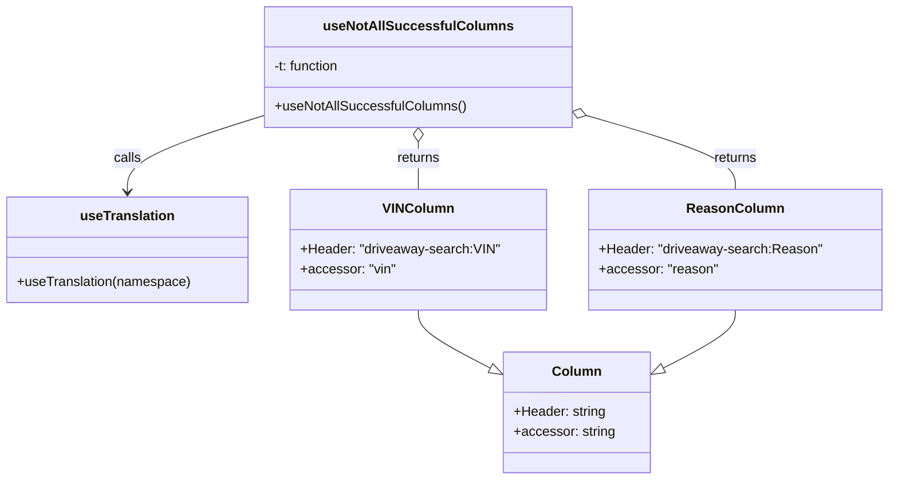

# Diagram: web/portal/src/pages/driveaway/components/search/DriveAway.NotAllSuccessful.columns.js

> Auto-generated by Obscura crawlers

## Mermaid

### SVG

<svg id="container" width="1043.7578125" xmlns="http://www.w3.org/2000/svg" class="classDiagram" height="572" viewBox="0 0 1043.7578125 572" role="graphics-document document" aria-roledescription="class"><g><defs><marker id="container_class-aggregationStart" class="marker aggregation class" refX="18" refY="7" markerWidth="190" markerHeight="240" orient="auto"><path d="M 18,7 L9,13 L1,7 L9,1 Z"></path></marker></defs><defs><marker id="container_class-aggregationEnd" class="marker aggregation class" refX="1" refY="7" markerWidth="20" markerHeight="28" orient="auto"><path d="M 18,7 L9,13 L1,7 L9,1 Z"></path></marker></defs><defs><marker id="container_class-extensionStart" class="marker extension class" refX="18" refY="7" markerWidth="190" markerHeight="240" orient="auto"><path d="M 1,7 L18,13 V 1 Z"></path></marker></defs><defs><marker id="container_class-extensionEnd" class="marker extension class" refX="1" refY="7" markerWidth="20" markerHeight="28" orient="auto"><path d="M 1,1 V 13 L18,7 Z"></path></marker></defs><defs><marker id="container_class-compositionStart" class="marker composition class" refX="18" refY="7" markerWidth="190" markerHeight="240" orient="auto"><path d="M 18,7 L9,13 L1,7 L9,1 Z"></path></marker></defs><defs><marker id="container_class-compositionEnd" class="marker composition class" refX="1" refY="7" markerWidth="20" markerHeight="28" orient="auto"><path d="M 18,7 L9,13 L1,7 L9,1 Z"></path></marker></defs><defs><marker id="container_class-dependencyStart" class="marker dependency class" refX="6" refY="7" markerWidth="190" markerHeight="240" orient="auto"><path d="M 5,7 L9,13 L1,7 L9,1 Z"></path></marker></defs><defs><marker id="container_class-dependencyEnd" class="marker dependency class" refX="13" refY="7" markerWidth="20" markerHeight="28" orient="auto"><path d="M 18,7 L9,13 L14,7 L9,1 Z"></path></marker></defs><defs><marker id="container_class-lollipopStart" class="marker lollipop class" refX="13" refY="7" markerWidth="190" markerHeight="240" orient="auto"><circle stroke="black" fill="transparent" cx="7" cy="7" r="6"></circle></marker></defs><defs><marker id="container_class-lollipopEnd" class="marker lollipop class" refX="1" refY="7" markerWidth="190" markerHeight="240" orient="auto"><circle stroke="black" fill="transparent" cx="7" cy="7" r="6"></circle></marker></defs><g class="root"><g class="clusters"></g><g class="edgePaths"><path d="M315.453,136.57L287.986,145.309C260.52,154.047,205.586,171.523,178.119,186.928C150.652,202.333,150.652,215.667,150.652,222.333L150.652,229" id="id_useNotAllSuccessfulColumns_useTranslation_1" class="edge-thickness-normal edge-pattern-solid relation" style=";;;" data-edge="true" data-et="edge" data-id="id_useNotAllSuccessfulColumns_useTranslation_1" data-points="W3sieCI6MzE1LjQ1MzEyNSwieSI6MTM2LjU3MDM5MTA2MTQ1MjV9LHsieCI6MTUwLjY1MjM0Mzc1LCJ5IjoxODl9LHsieCI6MTUwLjY1MjM0Mzc1LCJ5IjoyMzV9XQ==" marker-end="url(#container_class-dependencyEnd)"></path><path d="M493.27,169.25L493.27,172.542C493.27,175.833,493.27,182.417,493.27,191.875C493.27,201.333,493.27,213.667,493.27,219.833L493.27,226" id="id_useNotAllSuccessfulColumns_VINColumn_2" class="edge-thickness-normal edge-pattern-solid relation" style=";;;" data-edge="true" data-et="edge" data-id="id_useNotAllSuccessfulColumns_VINColumn_2" data-points="W3sieCI6NDkzLjI2OTUzMTI1LCJ5IjoxNTJ9LHsieCI6NDkzLjI2OTUzMTI1LCJ5IjoxODl9LHsieCI6NDkzLjI2OTUzMTI1LCJ5IjoyMjZ9XQ==" marker-start="url(#container_class-aggregationStart)"></path><path d="M687.637,137.07L717.114,145.725C746.59,154.38,805.543,171.69,835.02,186.512C864.496,201.333,864.496,213.667,864.496,219.833L864.496,226" id="id_useNotAllSuccessfulColumns_ReasonColumn_3" class="edge-thickness-normal edge-pattern-solid relation" style=";;;" data-edge="true" data-et="edge" data-id="id_useNotAllSuccessfulColumns_ReasonColumn_3" data-points="W3sieCI6NjcxLjA4NTkzNzUsInkiOjEzMi4yMTA2NzE5NzAwMzE3N30seyJ4Ijo4NjQuNDk2MDkzNzUsInkiOjE4OX0seyJ4Ijo4NjQuNDk2MDkzNzUsInkiOjIyNn1d" marker-start="url(#container_class-aggregationStart)"></path><path d="M493.27,370L493.27,374.167C493.27,378.333,493.27,386.667,507.369,398.201C521.468,409.736,549.666,424.472,563.765,431.84L577.864,439.208" id="id_VINColumn_Column_4" class="edge-thickness-normal edge-pattern-solid relation" style=";;;" data-edge="true" data-et="edge" data-id="id_VINColumn_Column_4" data-points="W3sieCI6NDkzLjI2OTUzMTI1LCJ5IjozNzB9LHsieCI6NDkzLjI2OTUzMTI1LCJ5IjozOTV9LHsieCI6NTkzLjE1MjM0Mzc1LCJ5Ijo0NDcuMTk3OTUwMjA3Mjk0MjR9XQ==" marker-end="url(#container_class-extensionEnd)"></path><path d="M864.496,370L864.496,374.167C864.496,378.333,864.496,386.667,850.397,398.201C836.298,409.736,808.1,424.472,794.001,431.84L779.902,439.208" id="id_ReasonColumn_Column_5" class="edge-thickness-normal edge-pattern-solid relation" style=";;;" data-edge="true" data-et="edge" data-id="id_ReasonColumn_Column_5" data-points="W3sieCI6ODY0LjQ5NjA5Mzc1LCJ5IjozNzB9LHsieCI6ODY0LjQ5NjA5Mzc1LCJ5IjozOTV9LHsieCI6NzY0LjYxMzI4MTI1LCJ5Ijo0NDcuMTk3OTUwMjA3Mjk0MjR9XQ==" marker-end="url(#container_class-extensionEnd)"></path></g><g class="edgeLabels"><g class="edgeLabel" transform="translate(150.65234375, 189)"><g class="label" data-id="id_useNotAllSuccessfulColumns_useTranslation_1" transform="translate(-16.4453125, -12)"><foreignObject width="32.890625" height="24">

calls

</foreignObject></g></g><g class="edgeLabel" transform="translate(493.26953125, 189)"><g class="label" data-id="id_useNotAllSuccessfulColumns_VINColumn_2" transform="translate(-26.265625, -12)"><foreignObject width="52.53125" height="24">

returns

</foreignObject></g></g><g class="edgeLabel" transform="translate(864.49609375, 189)"><g class="label" data-id="id_useNotAllSuccessfulColumns_ReasonColumn_3" transform="translate(-26.265625, -12)"><foreignObject width="52.53125" height="24">

returns

</foreignObject></g></g><g class="edgeLabel"><g class="label" data-id="id_VINColumn_Column_4" transform="translate(0, 0)"><foreignObject width="0" height="0">

</foreignObject></g></g><g class="edgeLabel"><g class="label" data-id="id_ReasonColumn_Column_5" transform="translate(0, 0)"><foreignObject width="0" height="0">

</foreignObject></g></g></g><g class="nodes"><g class="node default" id="classId-useNotAllSuccessfulColumns-0" transform="translate(493.26953125, 80)"><g class="basic label-container"><path d="M-177.81640625 -72 L177.81640625 -72 L177.81640625 72 L-177.81640625 72" stroke="none" stroke-width="0" fill="#ECECFF" style=""></path><path d="M-177.81640625 -72 C-94.53240385851203 -72, -11.248401467024053 -72, 177.81640625 -72 M-177.81640625 -72 C-47.37554936694818 -72, 83.06530751610364 -72, 177.81640625 -72 M177.81640625 -72 C177.81640625 -31.676346426532433, 177.81640625 8.647307146935134, 177.81640625 72 M177.81640625 -72 C177.81640625 -28.05043250931736, 177.81640625 15.899134981365279, 177.81640625 72 M177.81640625 72 C86.09797984790623 72, -5.620446554187538 72, -177.81640625 72 M177.81640625 72 C84.74187566085453 72, -8.332654928290935 72, -177.81640625 72 M-177.81640625 72 C-177.81640625 39.199202243904956, -177.81640625 6.398404487809913, -177.81640625 -72 M-177.81640625 72 C-177.81640625 24.697829262838, -177.81640625 -22.604341474324002, -177.81640625 -72" stroke="#9370DB" stroke-width="1.3" fill="none" stroke-dasharray="0 0" style=""></path></g><g class="annotation-group text" transform="translate(0, -48)"></g><g class="label-group text" transform="translate(-105.0859375, -48)"><g class="label" style="font-weight: bolder" transform="translate(0,-12)"><foreignObject width="210.171875" height="24">

useNotAllSuccessfulColumns

</foreignObject></g></g><g class="members-group text" transform="translate(-165.81640625, 0)"><g class="label" style="" transform="translate(0,-12)"><foreignObject width="81" height="24">

-t: function

</foreignObject></g></g><g class="methods-group text" transform="translate(-165.81640625, 48)"><g class="label" style="" transform="translate(0,-12)"><foreignObject width="226.546875" height="24">

+useNotAllSuccessfulColumns()

</foreignObject></g></g><g class="divider" style=""><path d="M-177.81640625 -24 C-104.70588003342982 -24, -31.595353816859642 -24, 177.81640625 -24 M-177.81640625 -24 C-99.26239422343768 -24, -20.708382196875363 -24, 177.81640625 -24" stroke="#9370DB" stroke-width="1.3" fill="none" stroke-dasharray="0 0" style=""></path></g><g class="divider" style=""><path d="M-177.81640625 24 C-63.5168912879174 24, 50.782623674165194 24, 177.81640625 24 M-177.81640625 24 C-50.521217829891995 24, 76.77397059021601 24, 177.81640625 24" stroke="#9370DB" stroke-width="1.3" fill="none" stroke-dasharray="0 0" style=""></path></g></g><g class="node default" id="classId-useTranslation-1" transform="translate(150.65234375, 298)"><g class="basic label-container"><path d="M-142.65234375 -63 L142.65234375 -63 L142.65234375 63 L-142.65234375 63" stroke="none" stroke-width="0" fill="#ECECFF" style=""></path><path d="M-142.65234375 -63 C-41.14973926009617 -63, 60.35286522980766 -63, 142.65234375 -63 M-142.65234375 -63 C-68.02199596290536 -63, 6.6083518241892705 -63, 142.65234375 -63 M142.65234375 -63 C142.65234375 -34.754063846778145, 142.65234375 -6.50812769355629, 142.65234375 63 M142.65234375 -63 C142.65234375 -16.879884401990807, 142.65234375 29.240231196018385, 142.65234375 63 M142.65234375 63 C77.32688804409462 63, 12.001432338189232 63, -142.65234375 63 M142.65234375 63 C57.331398051744756 63, -27.989547646510488 63, -142.65234375 63 M-142.65234375 63 C-142.65234375 22.25732016774466, -142.65234375 -18.485359664510682, -142.65234375 -63 M-142.65234375 63 C-142.65234375 21.624780564467265, -142.65234375 -19.75043887106547, -142.65234375 -63" stroke="#9370DB" stroke-width="1.3" fill="none" stroke-dasharray="0 0" style=""></path></g><g class="annotation-group text" transform="translate(0, -39)"></g><g class="label-group text" transform="translate(-54.0859375, -39)"><g class="label" style="font-weight: bolder" transform="translate(0,-12)"><foreignObject width="108.171875" height="24">

useTranslation

</foreignObject></g></g><g class="members-group text" transform="translate(-130.65234375, 9)"></g><g class="methods-group text" transform="translate(-130.65234375, 39)"><g class="label" style="" transform="translate(0,-12)"><foreignObject width="207.21875" height="24">

+useTranslation(namespace)

</foreignObject></g></g><g class="divider" style=""><path d="M-142.65234375 -15 C-83.95132879745299 -15, -25.25031384490596 -15, 142.65234375 -15 M-142.65234375 -15 C-73.55135167618985 -15, -4.450359602379706 -15, 142.65234375 -15" stroke="#9370DB" stroke-width="1.3" fill="none" stroke-dasharray="0 0" style=""></path></g><g class="divider" style=""><path d="M-142.65234375 9 C-30.41889389340504 9, 81.81455596318992 9, 142.65234375 9 M-142.65234375 9 C-39.998145923188375 9, 62.65605190362325 9, 142.65234375 9" stroke="#9370DB" stroke-width="1.3" fill="none" stroke-dasharray="0 0" style=""></path></g></g><g class="node default" id="classId-Column-2" transform="translate(678.8828125, 492)"><g class="basic label-container"><path d="M-85.73046875 -72 L85.73046875 -72 L85.73046875 72 L-85.73046875 72" stroke="none" stroke-width="0" fill="#ECECFF" style=""></path><path d="M-85.73046875 -72 C-30.66713827267145 -72, 24.396192204657098 -72, 85.73046875 -72 M-85.73046875 -72 C-33.064293453951535 -72, 19.60188184209693 -72, 85.73046875 -72 M85.73046875 -72 C85.73046875 -17.0634087628941, 85.73046875 37.8731824742118, 85.73046875 72 M85.73046875 -72 C85.73046875 -32.80217885831777, 85.73046875 6.395642283364467, 85.73046875 72 M85.73046875 72 C30.876797202431554 72, -23.976874345136892 72, -85.73046875 72 M85.73046875 72 C17.979945408912286 72, -49.77057793217543 72, -85.73046875 72 M-85.73046875 72 C-85.73046875 17.73237887446522, -85.73046875 -36.53524225106956, -85.73046875 -72 M-85.73046875 72 C-85.73046875 33.64587814656109, -85.73046875 -4.708243706877823, -85.73046875 -72" stroke="#9370DB" stroke-width="1.3" fill="none" stroke-dasharray="0 0" style=""></path></g><g class="annotation-group text" transform="translate(0, -48)"></g><g class="label-group text" transform="translate(-27.4453125, -48)"><g class="label" style="font-weight: bolder" transform="translate(0,-12)"><foreignObject width="54.890625" height="24">

Column

</foreignObject></g></g><g class="members-group text" transform="translate(-73.73046875, 0)"><g class="label" style="" transform="translate(0,-12)"><foreignObject width="110.46875" height="24">

+Header: string

</foreignObject></g><g class="label" style="" transform="translate(0,12)"><foreignObject width="120.015625" height="24">

+accessor: string

</foreignObject></g></g><g class="methods-group text" transform="translate(-73.73046875, 72)"></g><g class="divider" style=""><path d="M-85.73046875 -24 C-31.262930392578866 -24, 23.204607964842268 -24, 85.73046875 -24 M-85.73046875 -24 C-34.4890214882786 -24, 16.752425773442795 -24, 85.73046875 -24" stroke="#9370DB" stroke-width="1.3" fill="none" stroke-dasharray="0 0" style=""></path></g><g class="divider" style=""><path d="M-85.73046875 48 C-43.418970543502475 48, -1.1074723370049497 48, 85.73046875 48 M-85.73046875 48 C-20.49154161782863 48, 44.74738551434274 48, 85.73046875 48" stroke="#9370DB" stroke-width="1.3" fill="none" stroke-dasharray="0 0" style=""></path></g></g><g class="node default" id="classId-VINColumn-3" transform="translate(493.26953125, 298)"><g class="basic label-container"><path d="M-149.96484375 -72 L149.96484375 -72 L149.96484375 72 L-149.96484375 72" stroke="none" stroke-width="0" fill="#ECECFF" style=""></path><path d="M-149.96484375 -72 C-34.68491767819883 -72, 80.59500839360234 -72, 149.96484375 -72 M-149.96484375 -72 C-33.97106508644248 -72, 82.02271357711504 -72, 149.96484375 -72 M149.96484375 -72 C149.96484375 -35.45289363608914, 149.96484375 1.094212727821727, 149.96484375 72 M149.96484375 -72 C149.96484375 -15.570612217968886, 149.96484375 40.85877556406223, 149.96484375 72 M149.96484375 72 C69.92954522383064 72, -10.105753302338712 72, -149.96484375 72 M149.96484375 72 C54.86412953483797 72, -40.23658468032406 72, -149.96484375 72 M-149.96484375 72 C-149.96484375 15.464394829758575, -149.96484375 -41.07121034048285, -149.96484375 -72 M-149.96484375 72 C-149.96484375 40.060994931107466, -149.96484375 8.121989862214932, -149.96484375 -72" stroke="#9370DB" stroke-width="1.3" fill="none" stroke-dasharray="0 0" style=""></path></g><g class="annotation-group text" transform="translate(0, -48)"></g><g class="label-group text" transform="translate(-39.6484375, -48)"><g class="label" style="font-weight: bolder" transform="translate(0,-12)"><foreignObject width="79.296875" height="24">

VINColumn

</foreignObject></g></g><g class="members-group text" transform="translate(-137.96484375, 0)"><g class="label" style="" transform="translate(0,-12)"><foreignObject width="236.28125" height="24">

+Header: "driveaway-search:VIN"

</foreignObject></g><g class="label" style="" transform="translate(0,12)"><foreignObject width="112.75" height="24">

+accessor: "vin"

</foreignObject></g></g><g class="methods-group text" transform="translate(-137.96484375, 72)"></g><g class="divider" style=""><path d="M-149.96484375 -24 C-32.272905950090234 -24, 85.41903184981953 -24, 149.96484375 -24 M-149.96484375 -24 C-64.14565320482522 -24, 21.673537340349554 -24, 149.96484375 -24" stroke="#9370DB" stroke-width="1.3" fill="none" stroke-dasharray="0 0" style=""></path></g><g class="divider" style=""><path d="M-149.96484375 48 C-78.7429131923067 48, -7.520982634613404 48, 149.96484375 48 M-149.96484375 48 C-56.06443692620567 48, 37.835969897588654 48, 149.96484375 48" stroke="#9370DB" stroke-width="1.3" fill="none" stroke-dasharray="0 0" style=""></path></g></g><g class="node default" id="classId-ReasonColumn-4" transform="translate(864.49609375, 298)"><g class="basic label-container"><path d="M-171.26171875 -72 L171.26171875 -72 L171.26171875 72 L-171.26171875 72" stroke="none" stroke-width="0" fill="#ECECFF" style=""></path><path d="M-171.26171875 -72 C-39.980844468054414 -72, 91.30002981389117 -72, 171.26171875 -72 M-171.26171875 -72 C-50.898349046282746 -72, 69.46502065743451 -72, 171.26171875 -72 M171.26171875 -72 C171.26171875 -16.507787761370466, 171.26171875 38.98442447725907, 171.26171875 72 M171.26171875 -72 C171.26171875 -26.195449682535937, 171.26171875 19.609100634928126, 171.26171875 72 M171.26171875 72 C80.50326118877136 72, -10.255196372457277 72, -171.26171875 72 M171.26171875 72 C48.10719898821699 72, -75.04732077356601 72, -171.26171875 72 M-171.26171875 72 C-171.26171875 24.748773481142607, -171.26171875 -22.502453037714787, -171.26171875 -72 M-171.26171875 72 C-171.26171875 20.179407944039745, -171.26171875 -31.64118411192051, -171.26171875 -72" stroke="#9370DB" stroke-width="1.3" fill="none" stroke-dasharray="0 0" style=""></path></g><g class="annotation-group text" transform="translate(0, -48)"></g><g class="label-group text" transform="translate(-54.0546875, -48)"><g class="label" style="font-weight: bolder" transform="translate(0,-12)"><foreignObject width="108.109375" height="24">

ReasonColumn

</foreignObject></g></g><g class="members-group text" transform="translate(-159.26171875, 0)"><g class="label" style="" transform="translate(0,-12)"><foreignObject width="264.46875" height="24">

+Header: "driveaway-search:Reason"

</foreignObject></g><g class="label" style="" transform="translate(0,12)"><foreignObject width="139.96875" height="24">

+accessor: "reason"

</foreignObject></g></g><g class="methods-group text" transform="translate(-159.26171875, 72)"></g><g class="divider" style=""><path d="M-171.26171875 -24 C-76.39739087993294 -24, 18.466936990134116 -24, 171.26171875 -24 M-171.26171875 -24 C-76.82852543000791 -24, 17.60466788998417 -24, 171.26171875 -24" stroke="#9370DB" stroke-width="1.3" fill="none" stroke-dasharray="0 0" style=""></path></g><g class="divider" style=""><path d="M-171.26171875 48 C-61.7778069336636 48, 47.706104882672804 48, 171.26171875 48 M-171.26171875 48 C-101.03355300875961 48, -30.805387267519222 48, 171.26171875 48" stroke="#9370DB" stroke-width="1.3" fill="none" stroke-dasharray="0 0" style=""></path></g></g></g></g></g></svg>
