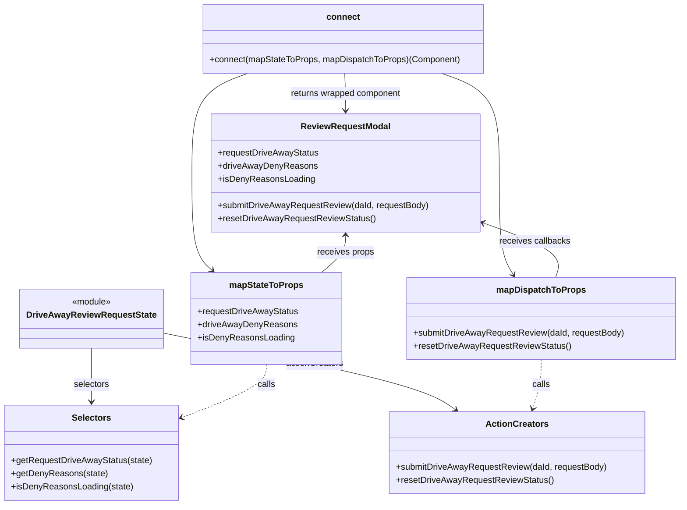

# Diagram: web/portal/src/pages/driveaway/components/search/DriveAway.ReviewRequestModal.container.js


> Auto-generated by Obscura crawlers

## Diagram 1



### SVG

<svg id="container" width="1225.5078125" xmlns="http://www.w3.org/2000/svg" class="classDiagram" height="946" viewBox="0 0 1225.5078125 946" role="graphics-document document" aria-roledescription="class"><style>#container{font-family:"trebuchet ms",verdana,arial,sans-serif;font-size:16px;fill:#333;}@keyframes edge-animation-frame{from{stroke-dashoffset:0;}}@keyframes dash{to{stroke-dashoffset:0;}}#container .edge-animation-slow{stroke-dasharray:9,5!important;stroke-dashoffset:900;animation:dash 50s linear infinite;stroke-linecap:round;}#container .edge-animation-fast{stroke-dasharray:9,5!important;stroke-dashoffset:900;animation:dash 20s linear infinite;stroke-linecap:round;}#container .error-icon{fill:#552222;}#container .error-text{fill:#552222;stroke:#552222;}#container .edge-thickness-normal{stroke-width:1px;}#container .edge-thickness-thick{stroke-width:3.5px;}#container .edge-pattern-solid{stroke-dasharray:0;}#container .edge-thickness-invisible{stroke-width:0;fill:none;}#container .edge-pattern-dashed{stroke-dasharray:3;}#container .edge-pattern-dotted{stroke-dasharray:2;}#container .marker{fill:#333333;stroke:#333333;}#container .marker.cross{stroke:#333333;}#container svg{font-family:"trebuchet ms",verdana,arial,sans-serif;font-size:16px;}#container p{margin:0;}#container g.classGroup text{fill:#9370DB;stroke:none;font-family:"trebuchet ms",verdana,arial,sans-serif;font-size:10px;}#container g.classGroup text .title{font-weight:bolder;}#container .nodeLabel,#container .edgeLabel{color:#131300;}#container .edgeLabel .label rect{fill:#ECECFF;}#container .label text{fill:#131300;}#container .labelBkg{background:#ECECFF;}#container .edgeLabel .label span{background:#ECECFF;}#container .classTitle{font-weight:bolder;}#container .node rect,#container .node circle,#container .node ellipse,#container .node polygon,#container .node path{fill:#ECECFF;stroke:#9370DB;stroke-width:1px;}#container .divider{stroke:#9370DB;stroke-width:1;}#container g.clickable{cursor:pointer;}#container g.classGroup rect{fill:#ECECFF;stroke:#9370DB;}#container g.classGroup line{stroke:#9370DB;stroke-width:1;}#container .classLabel .box{stroke:none;stroke-width:0;fill:#ECECFF;opacity:0.5;}#container .classLabel .label{fill:#9370DB;font-size:10px;}#container .relation{stroke:#333333;stroke-width:1;fill:none;}#container .dashed-line{stroke-dasharray:3;}#container .dotted-line{stroke-dasharray:1 2;}#container #compositionStart,#container .composition{fill:#333333!important;stroke:#333333!important;stroke-width:1;}#container #compositionEnd,#container .composition{fill:#333333!important;stroke:#333333!important;stroke-width:1;}#container #dependencyStart,#container .dependency{fill:#333333!important;stroke:#333333!important;stroke-width:1;}#container #dependencyStart,#container .dependency{fill:#333333!important;stroke:#333333!important;stroke-width:1;}#container #extensionStart,#container .extension{fill:transparent!important;stroke:#333333!important;stroke-width:1;}#container #extensionEnd,#container .extension{fill:transparent!important;stroke:#333333!important;stroke-width:1;}#container #aggregationStart,#container .aggregation{fill:transparent!important;stroke:#333333!important;stroke-width:1;}#container #aggregationEnd,#container .aggregation{fill:transparent!important;stroke:#333333!important;stroke-width:1;}#container #lollipopStart,#container .lollipop{fill:#ECECFF!important;stroke:#333333!important;stroke-width:1;}#container #lollipopEnd,#container .lollipop{fill:#ECECFF!important;stroke:#333333!important;stroke-width:1;}#container .edgeTerminals{font-size:11px;line-height:initial;}#container .classTitleText{text-anchor:middle;font-size:18px;fill:#333;}#container .label-icon{display:inline-block;height:1em;overflow:visible;vertical-align:-0.125em;}#container .node .label-icon path{fill:currentColor;stroke:revert;stroke-width:revert;}#container :root{--mermaid-font-family:"trebuchet ms",verdana,arial,sans-serif;}</style><g><defs><marker id="container_class-aggregationStart" class="marker aggregation class" refX="18" refY="7" markerWidth="190" markerHeight="240" orient="auto"><path d="M 18,7 L9,13 L1,7 L9,1 Z"></path></marker></defs><defs><marker id="container_class-aggregationEnd" class="marker aggregation class" refX="1" refY="7" markerWidth="20" markerHeight="28" orient="auto"><path d="M 18,7 L9,13 L1,7 L9,1 Z"></path></marker></defs><defs><marker id="container_class-extensionStart" class="marker extension class" refX="18" refY="7" markerWidth="190" markerHeight="240" orient="auto"><path d="M 1,7 L18,13 V 1 Z"></path></marker></defs><defs><marker id="container_class-extensionEnd" class="marker extension class" refX="1" refY="7" markerWidth="20" markerHeight="28" orient="auto"><path d="M 1,1 V 13 L18,7 Z"></path></marker></defs><defs><marker id="container_class-compositionStart" class="marker composition class" refX="18" refY="7" markerWidth="190" markerHeight="240" orient="auto"><path d="M 18,7 L9,13 L1,7 L9,1 Z"></path></marker></defs><defs><marker id="container_class-compositionEnd" class="marker composition class" refX="1" refY="7" markerWidth="20" markerHeight="28" orient="auto"><path d="M 18,7 L9,13 L1,7 L9,1 Z"></path></marker></defs><defs><marker id="container_class-dependencyStart" class="marker dependency class" refX="6" refY="7" markerWidth="190" markerHeight="240" orient="auto"><path d="M 5,7 L9,13 L1,7 L9,1 Z"></path></marker></defs><defs><marker id="container_class-dependencyEnd" class="marker dependency class" refX="13" refY="7" markerWidth="20" markerHeight="28" orient="auto"><path d="M 18,7 L9,13 L14,7 L9,1 Z"></path></marker></defs><defs><marker id="container_class-lollipopStart" class="marker lollipop class" refX="13" refY="7" markerWidth="190" markerHeight="240" orient="auto"><circle stroke="black" fill="transparent" cx="7" cy="7" r="6"></circle></marker></defs><defs><marker id="container_class-lollipopEnd" class="marker lollipop class" refX="1" refY="7" markerWidth="190" markerHeight="240" orient="auto"><circle stroke="black" fill="transparent" cx="7" cy="7" r="6"></circle></marker></defs><g class="root"><g class="clusters"></g><g class="edgePaths"><path d="M165.07,660L165.07,671.167C165.07,682.333,165.07,704.667,165.07,721C165.07,737.333,165.07,747.667,165.07,752.833L165.07,758" id="id_DriveAwayReviewRequestState_Selectors_1" class="edge-thickness-normal edge-pattern-solid relation" style=";;;" data-edge="true" data-et="edge" data-id="id_DriveAwayReviewRequestState_Selectors_1" data-points="W3sieCI6MTY1LjA3MDMxMjUsInkiOjY2MH0seyJ4IjoxNjUuMDcwMzEyNSwieSI6NzI3fSx7IngiOjE2NS4wNzAzMTI1LCJ5Ijo3NjR9XQ==" marker-end="url(#container_class-dependencyEnd)"></path><path d="M290.438,631.71L367.881,647.591C445.324,663.473,600.211,695.237,688.347,718.706C776.482,742.176,797.867,757.352,808.559,764.94L819.251,772.528" id="id_DriveAwayReviewRequestState_ActionCreators_2" class="edge-thickness-normal edge-pattern-solid relation" style=";;;" data-edge="true" data-et="edge" data-id="id_DriveAwayReviewRequestState_ActionCreators_2" data-points="W3sieCI6MjkwLjQzNzUsInkiOjYzMS43MDk3MDYyNTAzNzI0fSx7IngiOjc1NS4wOTc2NTYyNSwieSI6NzI3fSx7IngiOjgyNC4xNDQzNzM3Mzk5MTk0LCJ5Ijo3NzZ9XQ==" marker-end="url(#container_class-dependencyEnd)"></path><path d="M476.395,690L476.395,696.167C476.395,702.333,476.395,714.667,451.615,730.703C426.835,746.74,377.275,766.479,352.495,776.349L327.715,786.219" id="id_mapStateToProps_Selectors_3" class="edge-thickness-normal edge-pattern-dashed relation" style=";;;" data-edge="true" data-et="edge" data-id="id_mapStateToProps_Selectors_3" data-points="W3sieCI6NDc2LjM5NDUzMTI1LCJ5Ijo2OTB9LHsieCI6NDc2LjM5NDUzMTI1LCJ5Ijo3Mjd9LHsieCI6MzIyLjE0MDYyNSwieSI6Nzg4LjQzOTExNDY2ODk0MTl9XQ==" marker-end="url(#container_class-dependencyEnd)"></path><path d="M974.387,681L974.387,688.667C974.387,696.333,974.387,711.667,971.79,726.559C969.194,741.451,964.001,755.902,961.404,763.128L958.808,770.353" id="id_mapDispatchToProps_ActionCreators_4" class="edge-thickness-normal edge-pattern-dashed relation" style=";;;" data-edge="true" data-et="edge" data-id="id_mapDispatchToProps_ActionCreators_4" data-points="W3sieCI6OTc0LjM4NjcxODc1LCJ5Ijo2ODF9LHsieCI6OTc0LjM4NjcxODc1LCJ5Ijo3Mjd9LHsieCI6OTU2Ljc3ODg4NzM0ODc5MDQsInkiOjc3Nn1d" marker-end="url(#container_class-dependencyEnd)"></path><path d="M461.647,134L441.672,142.167C421.696,150.333,381.744,166.667,361.769,201C341.793,235.333,341.793,287.667,341.793,338C341.793,388.333,341.793,436.667,347.909,466.331C354.025,495.996,366.258,506.993,372.374,512.491L378.49,517.989" id="id_connect_mapStateToProps_5" class="edge-thickness-normal edge-pattern-solid relation" style=";;;" data-edge="true" data-et="edge" data-id="id_connect_mapStateToProps_5" data-points="W3sieCI6NDYxLjY0NzQ2MDkzNzUsInkiOjEzNH0seyJ4IjozNDEuNzkyOTY4NzUsInkiOjE4M30seyJ4IjozNDEuNzkyOTY4NzUsInkiOjM0MH0seyJ4IjozNDEuNzkyOTY4NzUsInkiOjQ4NX0seyJ4IjozODIuOTUyMTI0MjI1MjA2NiwieSI6NTIyfV0=" marker-end="url(#container_class-dependencyEnd)"></path><path d="M775.188,134L795.857,142.167C816.525,150.333,857.862,166.667,878.531,201C899.199,235.333,899.199,287.667,899.199,338C899.199,388.333,899.199,436.667,903.435,467.651C907.672,498.635,916.144,512.269,920.38,519.086L924.616,525.904" id="id_connect_mapDispatchToProps_6" class="edge-thickness-normal edge-pattern-solid relation" style=";;;" data-edge="true" data-et="edge" data-id="id_connect_mapDispatchToProps_6" data-points="W3sieCI6Nzc1LjE4ODQ3NjU2MjUsInkiOjEzNH0seyJ4Ijo4OTkuMTk5MjE4NzUsInkiOjE4M30seyJ4Ijo4OTkuMTk5MjE4NzUsInkiOjM0MH0seyJ4Ijo4OTkuMTk5MjE4NzUsInkiOjQ4NX0seyJ4Ijo5MjcuNzgyODk2NDM1OTUwNCwieSI6NTMxfV0=" marker-end="url(#container_class-dependencyEnd)"></path><path d="M618.418,134L618.764,142.167C619.111,150.333,619.803,166.667,620.15,182C620.496,197.333,620.496,211.667,620.496,218.833L620.496,226" id="id_connect_ReviewRequestModal_7" class="edge-thickness-normal edge-pattern-solid relation" style=";;;" data-edge="true" data-et="edge" data-id="id_connect_ReviewRequestModal_7" data-points="W3sieCI6NjE4LjQxNzk2ODc1LCJ5IjoxMzR9LHsieCI6NjIwLjQ5NjA5Mzc1LCJ5IjoxODN9LHsieCI6NjIwLjQ5NjA5Mzc1LCJ5IjoyMzJ9XQ==" marker-end="url(#container_class-dependencyEnd)"></path><path d="M620.496,454L620.496,459.167C620.496,464.333,620.496,474.667,613.152,486C605.808,497.333,591.12,509.667,583.776,515.833L576.432,522" id="id_ReviewRequestModal_mapStateToProps_8" class="edge-thickness-normal edge-pattern-solid relation" style=";;;" data-edge="true" data-et="edge" data-id="id_ReviewRequestModal_mapStateToProps_8" data-points="W3sieCI6NjIwLjQ5NjA5Mzc1LCJ5Ijo0NDh9LHsieCI6NjIwLjQ5NjA5Mzc1LCJ5Ijo0ODV9LHsieCI6NTc2LjQzMTk3OTU5NzEwNzQsInkiOjUyMn1d" marker-start="url(#container_class-dependencyStart)"></path><path d="M869.834,431.213L894.339,440.178C918.844,449.142,967.854,467.071,989.667,483.702C1011.481,500.333,1006.098,515.667,1003.407,523.333L1000.715,531" id="id_ReviewRequestModal_mapDispatchToProps_9" class="edge-thickness-normal edge-pattern-solid relation" style=";;;" data-edge="true" data-et="edge" data-id="id_ReviewRequestModal_mapDispatchToProps_9" data-points="W3sieCI6ODY0LjE5OTIxODc1LCJ5Ijo0MjkuMTUyMDY0NjQ5NjUwMTN9LHsieCI6MTAxNi44NjMyODEyNSwieSI6NDg1fSx7IngiOjEwMDAuNzE1MTY2NTgwNTc4NSwieSI6NTMxfV0=" marker-start="url(#container_class-dependencyStart)"></path></g><g class="edgeLabels"><g class="edgeLabel" transform="translate(165.0703125, 727)"><g class="label" data-id="id_DriveAwayReviewRequestState_Selectors_1" transform="translate(-32.734375, -12)"><foreignObject width="65.46875" height="24"><div xmlns="http://www.w3.org/1999/xhtml" class="labelBkg" style="display: table-cell; white-space: nowrap; line-height: 1.5; max-width: 200px; text-align: center;"><span class="edgeLabel"><p>selectors</p></span></div></foreignObject></g></g><g class="edgeLabel" transform="translate(564.23787, 687.85938)"><g class="label" data-id="id_DriveAwayReviewRequestState_ActionCreators_2" transform="translate(-52.671875, -12)"><foreignObject width="105.34375" height="24"><div xmlns="http://www.w3.org/1999/xhtml" class="labelBkg" style="display: table-cell; white-space: nowrap; line-height: 1.5; max-width: 200px; text-align: center;"><span class="edgeLabel"><p>actionCreators</p></span></div></foreignObject></g></g><g class="edgeLabel" transform="translate(476.39453125, 727)"><g class="label" data-id="id_mapStateToProps_Selectors_3" transform="translate(-16.4453125, -12)"><foreignObject width="32.890625" height="24"><div xmlns="http://www.w3.org/1999/xhtml" class="labelBkg" style="display: table-cell; white-space: nowrap; line-height: 1.5; max-width: 200px; text-align: center;"><span class="edgeLabel"><p>calls</p></span></div></foreignObject></g></g><g class="edgeLabel" transform="translate(974.38671875, 727)"><g class="label" data-id="id_mapDispatchToProps_ActionCreators_4" transform="translate(-16.4453125, -12)"><foreignObject width="32.890625" height="24"><div xmlns="http://www.w3.org/1999/xhtml" class="labelBkg" style="display: table-cell; white-space: nowrap; line-height: 1.5; max-width: 200px; text-align: center;"><span class="edgeLabel"><p>calls</p></span></div></foreignObject></g></g><g class="edgeLabel"><g class="label" data-id="id_connect_mapStateToProps_5" transform="translate(0, 0)"><foreignObject width="0" height="0"><div xmlns="http://www.w3.org/1999/xhtml" class="labelBkg" style="display: table-cell; white-space: nowrap; line-height: 1.5; max-width: 200px; text-align: center;"><span class="edgeLabel"></span></div></foreignObject></g></g><g class="edgeLabel"><g class="label" data-id="id_connect_mapDispatchToProps_6" transform="translate(0, 0)"><foreignObject width="0" height="0"><div xmlns="http://www.w3.org/1999/xhtml" class="labelBkg" style="display: table-cell; white-space: nowrap; line-height: 1.5; max-width: 200px; text-align: center;"><span class="edgeLabel"></span></div></foreignObject></g></g><g class="edgeLabel" transform="translate(620.49609375, 183)"><g class="label" data-id="id_connect_ReviewRequestModal_7" transform="translate(-100, -24)"><foreignObject width="200" height="48"><div xmlns="http://www.w3.org/1999/xhtml" class="labelBkg" style="display: table; white-space: break-spaces; line-height: 1.5; max-width: 200px; text-align: center; width: 200px;"><span class="edgeLabel"><p>returns wrapped component</p></span></div></foreignObject></g></g><g class="edgeLabel" transform="translate(620.49609375, 485)"><g class="label" data-id="id_ReviewRequestModal_mapStateToProps_8" transform="translate(-52.375, -12)"><foreignObject width="104.75" height="24"><div xmlns="http://www.w3.org/1999/xhtml" class="labelBkg" style="display: table-cell; white-space: nowrap; line-height: 1.5; max-width: 200px; text-align: center;"><span class="edgeLabel"><p>receives props</p></span></div></foreignObject></g></g><g class="edgeLabel" transform="translate(963.42356, 465.45055)"><g class="label" data-id="id_ReviewRequestModal_mapDispatchToProps_9" transform="translate(-64.953125, -12)"><foreignObject width="129.90625" height="24"><div xmlns="http://www.w3.org/1999/xhtml" class="labelBkg" style="display: table-cell; white-space: nowrap; line-height: 1.5; max-width: 200px; text-align: center;"><span class="edgeLabel"><p>receives callbacks</p></span></div></foreignObject></g></g></g><g class="nodes"><g class="node default" id="classId-ReviewRequestModal-0" transform="translate(620.49609375, 340)"><g class="basic label-container"><path d="M-243.703125 -108 L243.703125 -108 L243.703125 108 L-243.703125 108" stroke="none" stroke-width="0" fill="#ECECFF" style=""></path><path d="M-243.703125 -108 C-144.84030668667953 -108, -45.97748837335905 -108, 243.703125 -108 M-243.703125 -108 C-94.50389146162144 -108, 54.69534207675713 -108, 243.703125 -108 M243.703125 -108 C243.703125 -35.88685626943624, 243.703125 36.22628746112753, 243.703125 108 M243.703125 -108 C243.703125 -61.83410809962796, 243.703125 -15.668216199255923, 243.703125 108 M243.703125 108 C82.06575742257769 108, -79.57161015484462 108, -243.703125 108 M243.703125 108 C76.60218630953875 108, -90.4987523809225 108, -243.703125 108 M-243.703125 108 C-243.703125 38.43015681810948, -243.703125 -31.13968636378104, -243.703125 -108 M-243.703125 108 C-243.703125 39.754071284959664, -243.703125 -28.49185743008067, -243.703125 -108" stroke="#9370DB" stroke-width="1.3" fill="none" stroke-dasharray="0 0" style=""></path></g><g class="annotation-group text" transform="translate(0, -84)"></g><g class="label-group text" transform="translate(-78.359375, -84)"><g class="label" style="font-weight: bolder" transform="translate(0,-12)"><foreignObject width="156.71875" height="24"><div xmlns="http://www.w3.org/1999/xhtml" style="display: table-cell; white-space: nowrap; line-height: 1.5; max-width: 205px; text-align: center;"><span class="nodeLabel markdown-node-label" style=""><p>ReviewRequestModal</p></span></div></foreignObject></g></g><g class="members-group text" transform="translate(-231.703125, -36)"><g class="label" style="" transform="translate(0,-12)"><foreignObject width="183.203125" height="24"><div xmlns="http://www.w3.org/1999/xhtml" style="display: table-cell; white-space: nowrap; line-height: 1.5; max-width: 241px; text-align: center;"><span class="nodeLabel markdown-node-label" style=""><p>+requestDriveAwayStatus</p></span></div></foreignObject></g><g class="label" style="" transform="translate(0,12)"><foreignObject width="177.921875" height="24"><div xmlns="http://www.w3.org/1999/xhtml" style="display: table-cell; white-space: nowrap; line-height: 1.5; max-width: 235px; text-align: center;"><span class="nodeLabel markdown-node-label" style=""><p>+driveAwayDenyReasons</p></span></div></foreignObject></g><g class="label" style="" transform="translate(0,36)"><foreignObject width="173.578125" height="24"><div xmlns="http://www.w3.org/1999/xhtml" style="display: table-cell; white-space: nowrap; line-height: 1.5; max-width: 232px; text-align: center;"><span class="nodeLabel markdown-node-label" style=""><p>+isDenyReasonsLoading</p></span></div></foreignObject></g></g><g class="methods-group text" transform="translate(-231.703125, 60)"><g class="label" style="" transform="translate(0,-12)"><foreignObject width="385.046875" height="24"><div xmlns="http://www.w3.org/1999/xhtml" style="display: table-cell; white-space: nowrap; line-height: 1.5; max-width: 442px; text-align: center;"><span class="nodeLabel markdown-node-label" style=""><p>+submitDriveAwayRequestReview(daId, requestBody)</p></span></div></foreignObject></g><g class="label" style="" transform="translate(0,12)"><foreignObject width="284.375" height="24"><div xmlns="http://www.w3.org/1999/xhtml" style="display: table-cell; white-space: nowrap; line-height: 1.5; max-width: 342px; text-align: center;"><span class="nodeLabel markdown-node-label" style=""><p>+resetDriveAwayRequestReviewStatus()</p></span></div></foreignObject></g></g><g class="divider" style=""><path d="M-243.703125 -60 C-101.04311331006207 -60, 41.61689837987586 -60, 243.703125 -60 M-243.703125 -60 C-56.18557917384922 -60, 131.33196665230156 -60, 243.703125 -60" stroke="#9370DB" stroke-width="1.3" fill="none" stroke-dasharray="0 0" style=""></path></g><g class="divider" style=""><path d="M-243.703125 36 C-120.43810127382035 36, 2.826922452359298 36, 243.703125 36 M-243.703125 36 C-135.60403763130046 36, -27.504950262600886 36, 243.703125 36" stroke="#9370DB" stroke-width="1.3" fill="none" stroke-dasharray="0 0" style=""></path></g></g><g class="node default" id="classId-DriveAwayReviewRequestState-1" transform="translate(165.0703125, 606)"><g class="basic label-container"><path d="M-125.3671875 -54 L125.3671875 -54 L125.3671875 54 L-125.3671875 54" stroke="none" stroke-width="0" fill="#ECECFF" style=""></path><path d="M-125.3671875 -54 C-62.21774209104113 -54, 0.9317033179177372 -54, 125.3671875 -54 M-125.3671875 -54 C-56.49348721056222 -54, 12.380213078875556 -54, 125.3671875 -54 M125.3671875 -54 C125.3671875 -23.337618140599623, 125.3671875 7.324763718800753, 125.3671875 54 M125.3671875 -54 C125.3671875 -25.714888847795287, 125.3671875 2.570222304409427, 125.3671875 54 M125.3671875 54 C58.09801398255668 54, -9.171159534886641 54, -125.3671875 54 M125.3671875 54 C64.91124476195728 54, 4.455302023914555 54, -125.3671875 54 M-125.3671875 54 C-125.3671875 22.10130916565345, -125.3671875 -9.797381668693099, -125.3671875 -54 M-125.3671875 54 C-125.3671875 19.133365595764097, -125.3671875 -15.733268808471806, -125.3671875 -54" stroke="#9370DB" stroke-width="1.3" fill="none" stroke-dasharray="0 0" style=""></path></g><g class="annotation-group text" transform="translate(-36.6015625, -30)"><g class="label" style="" transform="translate(0,-12)"><foreignObject width="73.203125" height="24"><div xmlns="http://www.w3.org/1999/xhtml" style="display: table-cell; white-space: nowrap; line-height: 1.5; max-width: 123px; text-align: center;"><span class="nodeLabel markdown-node-label" style=""><p>«module»</p></span></div></foreignObject></g></g><g class="label-group text" transform="translate(-113.3671875, -6)"><g class="label" style="font-weight: bolder" transform="translate(0,-12)"><foreignObject width="226.734375" height="24"><div xmlns="http://www.w3.org/1999/xhtml" style="display: table-cell; white-space: nowrap; line-height: 1.5; max-width: 271px; text-align: center;"><span class="nodeLabel markdown-node-label" style=""><p>DriveAwayReviewRequestState</p></span></div></foreignObject></g></g><g class="members-group text" transform="translate(-113.3671875, 42)"></g><g class="methods-group text" transform="translate(-113.3671875, 72)"></g><g class="divider" style=""><path d="M-125.3671875 18 C-70.6961213595108 18, -16.025055219021596 18, 125.3671875 18 M-125.3671875 18 C-68.36339381951593 18, -11.359600139031869 18, 125.3671875 18" stroke="#9370DB" stroke-width="1.3" fill="none" stroke-dasharray="0 0" style=""></path></g><g class="divider" style=""><path d="M-125.3671875 36 C-62.66553674745177 36, 0.03611400509646501 36, 125.3671875 36 M-125.3671875 36 C-40.4754637964558 36, 44.4162599070884 36, 125.3671875 36" stroke="#9370DB" stroke-width="1.3" fill="none" stroke-dasharray="0 0" style=""></path></g></g><g class="node default" id="classId-Selectors-2" transform="translate(165.0703125, 851)"><g class="basic label-container"><path d="M-157.0703125 -87 L157.0703125 -87 L157.0703125 87 L-157.0703125 87" stroke="none" stroke-width="0" fill="#ECECFF" style=""></path><path d="M-157.0703125 -87 C-42.06759862347715 -87, 72.9351152530457 -87, 157.0703125 -87 M-157.0703125 -87 C-72.55275079517597 -87, 11.964810909648065 -87, 157.0703125 -87 M157.0703125 -87 C157.0703125 -46.721016051737145, 157.0703125 -6.44203210347429, 157.0703125 87 M157.0703125 -87 C157.0703125 -46.187676569117215, 157.0703125 -5.375353138234431, 157.0703125 87 M157.0703125 87 C79.42748500476458 87, 1.7846575095291541 87, -157.0703125 87 M157.0703125 87 C73.43015844888276 87, -10.209995602234471 87, -157.0703125 87 M-157.0703125 87 C-157.0703125 19.108816555165987, -157.0703125 -48.782366889668026, -157.0703125 -87 M-157.0703125 87 C-157.0703125 36.3278357339754, -157.0703125 -14.344328532049204, -157.0703125 -87" stroke="#9370DB" stroke-width="1.3" fill="none" stroke-dasharray="0 0" style=""></path></g><g class="annotation-group text" transform="translate(0, -63)"></g><g class="label-group text" transform="translate(-34.171875, -63)"><g class="label" style="font-weight: bolder" transform="translate(0,-12)"><foreignObject width="68.34375" height="24"><div xmlns="http://www.w3.org/1999/xhtml" style="display: table-cell; white-space: nowrap; line-height: 1.5; max-width: 117px; text-align: center;"><span class="nodeLabel markdown-node-label" style=""><p>Selectors</p></span></div></foreignObject></g></g><g class="members-group text" transform="translate(-145.0703125, -15)"></g><g class="methods-group text" transform="translate(-145.0703125, 15)"><g class="label" style="" transform="translate(0,-12)"><foreignObject width="255.96875" height="24"><div xmlns="http://www.w3.org/1999/xhtml" style="display: table-cell; white-space: nowrap; line-height: 1.5; max-width: 313px; text-align: center;"><span class="nodeLabel markdown-node-label" style=""><p>+getRequestDriveAwayStatus(state)</p></span></div></foreignObject></g><g class="label" style="" transform="translate(0,12)"><foreignObject width="173.390625" height="24"><div xmlns="http://www.w3.org/1999/xhtml" style="display: table-cell; white-space: nowrap; line-height: 1.5; max-width: 231px; text-align: center;"><span class="nodeLabel markdown-node-label" style=""><p>+getDenyReasons(state)</p></span></div></foreignObject></g><g class="label" style="" transform="translate(0,36)"><foreignObject width="220.046875" height="24"><div xmlns="http://www.w3.org/1999/xhtml" style="display: table-cell; white-space: nowrap; line-height: 1.5; max-width: 277px; text-align: center;"><span class="nodeLabel markdown-node-label" style=""><p>+isDenyReasonsLoading(state)</p></span></div></foreignObject></g></g><g class="divider" style=""><path d="M-157.0703125 -39 C-40.182549529195654 -39, 76.70521344160869 -39, 157.0703125 -39 M-157.0703125 -39 C-39.17860852851754 -39, 78.71309544296491 -39, 157.0703125 -39" stroke="#9370DB" stroke-width="1.3" fill="none" stroke-dasharray="0 0" style=""></path></g><g class="divider" style=""><path d="M-157.0703125 -15 C-54.83191397101106 -15, 47.406484557977876 -15, 157.0703125 -15 M-157.0703125 -15 C-34.437146713155116 -15, 88.19601907368977 -15, 157.0703125 -15" stroke="#9370DB" stroke-width="1.3" fill="none" stroke-dasharray="0 0" style=""></path></g></g><g class="node default" id="classId-ActionCreators-3" transform="translate(929.828125, 851)"><g class="basic label-container"><path d="M-231.5078125 -75 L231.5078125 -75 L231.5078125 75 L-231.5078125 75" stroke="none" stroke-width="0" fill="#ECECFF" style=""></path><path d="M-231.5078125 -75 C-95.27830274522913 -75, 40.95120700954175 -75, 231.5078125 -75 M-231.5078125 -75 C-56.65564076896982 -75, 118.19653096206036 -75, 231.5078125 -75 M231.5078125 -75 C231.5078125 -37.085247394056154, 231.5078125 0.8295052118876924, 231.5078125 75 M231.5078125 -75 C231.5078125 -35.49996709429383, 231.5078125 4.000065811412341, 231.5078125 75 M231.5078125 75 C58.13644591112276 75, -115.23492067775447 75, -231.5078125 75 M231.5078125 75 C107.5327847728108 75, -16.4422429543784 75, -231.5078125 75 M-231.5078125 75 C-231.5078125 43.91215065869628, -231.5078125 12.824301317392553, -231.5078125 -75 M-231.5078125 75 C-231.5078125 24.27740127478222, -231.5078125 -26.445197450435558, -231.5078125 -75" stroke="#9370DB" stroke-width="1.3" fill="none" stroke-dasharray="0 0" style=""></path></g><g class="annotation-group text" transform="translate(0, -51)"></g><g class="label-group text" transform="translate(-53.96875, -51)"><g class="label" style="font-weight: bolder" transform="translate(0,-12)"><foreignObject width="107.9375" height="24"><div xmlns="http://www.w3.org/1999/xhtml" style="display: table-cell; white-space: nowrap; line-height: 1.5; max-width: 156px; text-align: center;"><span class="nodeLabel markdown-node-label" style=""><p>ActionCreators</p></span></div></foreignObject></g></g><g class="members-group text" transform="translate(-219.5078125, -3)"></g><g class="methods-group text" transform="translate(-219.5078125, 27)"><g class="label" style="" transform="translate(0,-12)"><foreignObject width="385.046875" height="24"><div xmlns="http://www.w3.org/1999/xhtml" style="display: table-cell; white-space: nowrap; line-height: 1.5; max-width: 442px; text-align: center;"><span class="nodeLabel markdown-node-label" style=""><p>+submitDriveAwayRequestReview(daId, requestBody)</p></span></div></foreignObject></g><g class="label" style="" transform="translate(0,12)"><foreignObject width="284.375" height="24"><div xmlns="http://www.w3.org/1999/xhtml" style="display: table-cell; white-space: nowrap; line-height: 1.5; max-width: 342px; text-align: center;"><span class="nodeLabel markdown-node-label" style=""><p>+resetDriveAwayRequestReviewStatus()</p></span></div></foreignObject></g></g><g class="divider" style=""><path d="M-231.5078125 -27 C-85.45173945525235 -27, 60.6043335894953 -27, 231.5078125 -27 M-231.5078125 -27 C-103.1931860267108 -27, 25.12144044657839 -27, 231.5078125 -27" stroke="#9370DB" stroke-width="1.3" fill="none" stroke-dasharray="0 0" style=""></path></g><g class="divider" style=""><path d="M-231.5078125 -3 C-130.36690463453687 -3, -29.22599676907373 -3, 231.5078125 -3 M-231.5078125 -3 C-83.34441669647518 -3, 64.81897910704964 -3, 231.5078125 -3" stroke="#9370DB" stroke-width="1.3" fill="none" stroke-dasharray="0 0" style=""></path></g></g><g class="node default" id="classId-mapStateToProps-4" transform="translate(476.39453125, 606)"><g class="basic label-container"><path d="M-135.95703125 -84 L135.95703125 -84 L135.95703125 84 L-135.95703125 84" stroke="none" stroke-width="0" fill="#ECECFF" style=""></path><path d="M-135.95703125 -84 C-44.03518032280982 -84, 47.886670604380356 -84, 135.95703125 -84 M-135.95703125 -84 C-64.32613302689087 -84, 7.304765196218256 -84, 135.95703125 -84 M135.95703125 -84 C135.95703125 -17.468081241262112, 135.95703125 49.063837517475775, 135.95703125 84 M135.95703125 -84 C135.95703125 -39.87936244327828, 135.95703125 4.241275113443436, 135.95703125 84 M135.95703125 84 C31.80038761386656 84, -72.35625602226688 84, -135.95703125 84 M135.95703125 84 C33.33242864630843 84, -69.29217395738314 84, -135.95703125 84 M-135.95703125 84 C-135.95703125 42.51675422399626, -135.95703125 1.0335084479925172, -135.95703125 -84 M-135.95703125 84 C-135.95703125 25.714113093815143, -135.95703125 -32.57177381236971, -135.95703125 -84" stroke="#9370DB" stroke-width="1.3" fill="none" stroke-dasharray="0 0" style=""></path></g><g class="annotation-group text" transform="translate(0, -60)"></g><g class="label-group text" transform="translate(-64.7109375, -60)"><g class="label" style="font-weight: bolder" transform="translate(0,-12)"><foreignObject width="129.421875" height="24"><div xmlns="http://www.w3.org/1999/xhtml" style="display: table-cell; white-space: nowrap; line-height: 1.5; max-width: 177px; text-align: center;"><span class="nodeLabel markdown-node-label" style=""><p>mapStateToProps</p></span></div></foreignObject></g></g><g class="members-group text" transform="translate(-123.95703125, -12)"><g class="label" style="" transform="translate(0,-12)"><foreignObject width="183.203125" height="24"><div xmlns="http://www.w3.org/1999/xhtml" style="display: table-cell; white-space: nowrap; line-height: 1.5; max-width: 241px; text-align: center;"><span class="nodeLabel markdown-node-label" style=""><p>+requestDriveAwayStatus</p></span></div></foreignObject></g><g class="label" style="" transform="translate(0,12)"><foreignObject width="177.921875" height="24"><div xmlns="http://www.w3.org/1999/xhtml" style="display: table-cell; white-space: nowrap; line-height: 1.5; max-width: 235px; text-align: center;"><span class="nodeLabel markdown-node-label" style=""><p>+driveAwayDenyReasons</p></span></div></foreignObject></g><g class="label" style="" transform="translate(0,36)"><foreignObject width="173.578125" height="24"><div xmlns="http://www.w3.org/1999/xhtml" style="display: table-cell; white-space: nowrap; line-height: 1.5; max-width: 232px; text-align: center;"><span class="nodeLabel markdown-node-label" style=""><p>+isDenyReasonsLoading</p></span></div></foreignObject></g></g><g class="methods-group text" transform="translate(-123.95703125, 84)"></g><g class="divider" style=""><path d="M-135.95703125 -36 C-64.44152071125885 -36, 7.073989827482308 -36, 135.95703125 -36 M-135.95703125 -36 C-41.38054554906584 -36, 53.195940151868314 -36, 135.95703125 -36" stroke="#9370DB" stroke-width="1.3" fill="none" stroke-dasharray="0 0" style=""></path></g><g class="divider" style=""><path d="M-135.95703125 60 C-54.53692448797436 60, 26.88318227405128 60, 135.95703125 60 M-135.95703125 60 C-43.634645303542925 60, 48.68774064291415 60, 135.95703125 60" stroke="#9370DB" stroke-width="1.3" fill="none" stroke-dasharray="0 0" style=""></path></g></g><g class="node default" id="classId-mapDispatchToProps-5" transform="translate(974.38671875, 606)"><g class="basic label-container"><path d="M-243.12109375 -75 L243.12109375 -75 L243.12109375 75 L-243.12109375 75" stroke="none" stroke-width="0" fill="#ECECFF" style=""></path><path d="M-243.12109375 -75 C-121.10946117630576 -75, 0.9021713973884857 -75, 243.12109375 -75 M-243.12109375 -75 C-97.68897048366546 -75, 47.743152782669085 -75, 243.12109375 -75 M243.12109375 -75 C243.12109375 -37.511606991058215, 243.12109375 -0.023213982116430998, 243.12109375 75 M243.12109375 -75 C243.12109375 -16.649375600701177, 243.12109375 41.701248798597646, 243.12109375 75 M243.12109375 75 C122.14370866304657 75, 1.1663235760931343 75, -243.12109375 75 M243.12109375 75 C145.16035222374512 75, 47.19961069749024 75, -243.12109375 75 M-243.12109375 75 C-243.12109375 16.7087958782869, -243.12109375 -41.5824082434262, -243.12109375 -75 M-243.12109375 75 C-243.12109375 35.92311865074797, -243.12109375 -3.153762698504053, -243.12109375 -75" stroke="#9370DB" stroke-width="1.3" fill="none" stroke-dasharray="0 0" style=""></path></g><g class="annotation-group text" transform="translate(0, -51)"></g><g class="label-group text" transform="translate(-77.1953125, -51)"><g class="label" style="font-weight: bolder" transform="translate(0,-12)"><foreignObject width="154.390625" height="24"><div xmlns="http://www.w3.org/1999/xhtml" style="display: table-cell; white-space: nowrap; line-height: 1.5; max-width: 203px; text-align: center;"><span class="nodeLabel markdown-node-label" style=""><p>mapDispatchToProps</p></span></div></foreignObject></g></g><g class="members-group text" transform="translate(-231.12109375, -3)"></g><g class="methods-group text" transform="translate(-231.12109375, 27)"><g class="label" style="" transform="translate(0,-12)"><foreignObject width="385.046875" height="24"><div xmlns="http://www.w3.org/1999/xhtml" style="display: table-cell; white-space: nowrap; line-height: 1.5; max-width: 442px; text-align: center;"><span class="nodeLabel markdown-node-label" style=""><p>+submitDriveAwayRequestReview(daId, requestBody)</p></span></div></foreignObject></g><g class="label" style="" transform="translate(0,12)"><foreignObject width="284.375" height="24"><div xmlns="http://www.w3.org/1999/xhtml" style="display: table-cell; white-space: nowrap; line-height: 1.5; max-width: 342px; text-align: center;"><span class="nodeLabel markdown-node-label" style=""><p>+resetDriveAwayRequestReviewStatus()</p></span></div></foreignObject></g></g><g class="divider" style=""><path d="M-243.12109375 -27 C-56.334080696621925 -27, 130.45293235675615 -27, 243.12109375 -27 M-243.12109375 -27 C-76.98014035558705 -27, 89.16081303882589 -27, 243.12109375 -27" stroke="#9370DB" stroke-width="1.3" fill="none" stroke-dasharray="0 0" style=""></path></g><g class="divider" style=""><path d="M-243.12109375 -3 C-49.878269309347814 -3, 143.36455513130437 -3, 243.12109375 -3 M-243.12109375 -3 C-79.75577206652088 -3, 83.60954961695825 -3, 243.12109375 -3" stroke="#9370DB" stroke-width="1.3" fill="none" stroke-dasharray="0 0" style=""></path></g></g><g class="node default" id="classId-connect-6" transform="translate(615.74609375, 71)"><g class="basic label-container"><path d="M-255.30859375 -63 L255.30859375 -63 L255.30859375 63 L-255.30859375 63" stroke="none" stroke-width="0" fill="#ECECFF" style=""></path><path d="M-255.30859375 -63 C-59.6411337282311 -63, 136.0263262935378 -63, 255.30859375 -63 M-255.30859375 -63 C-98.2111909297389 -63, 58.88621189052219 -63, 255.30859375 -63 M255.30859375 -63 C255.30859375 -17.904503071219494, 255.30859375 27.19099385756101, 255.30859375 63 M255.30859375 -63 C255.30859375 -26.113076646227533, 255.30859375 10.773846707544934, 255.30859375 63 M255.30859375 63 C125.49403077400086 63, -4.320532201998276 63, -255.30859375 63 M255.30859375 63 C90.8196339371172 63, -73.6693258757656 63, -255.30859375 63 M-255.30859375 63 C-255.30859375 23.836144004135924, -255.30859375 -15.327711991728151, -255.30859375 -63 M-255.30859375 63 C-255.30859375 30.113896248214004, -255.30859375 -2.772207503571991, -255.30859375 -63" stroke="#9370DB" stroke-width="1.3" fill="none" stroke-dasharray="0 0" style=""></path></g><g class="annotation-group text" transform="translate(0, -39)"></g><g class="label-group text" transform="translate(-28.9140625, -39)"><g class="label" style="font-weight: bolder" transform="translate(0,-12)"><foreignObject width="57.828125" height="24"><div xmlns="http://www.w3.org/1999/xhtml" style="display: table-cell; white-space: nowrap; line-height: 1.5; max-width: 108px; text-align: center;"><span class="nodeLabel markdown-node-label" style=""><p>connect</p></span></div></foreignObject></g></g><g class="members-group text" transform="translate(-243.30859375, 9)"></g><g class="methods-group text" transform="translate(-243.30859375, 39)"><g class="label" style="" transform="translate(0,-12)"><foreignObject width="457.703125" height="24"><div xmlns="http://www.w3.org/1999/xhtml" style="display: table-cell; white-space: nowrap; line-height: 1.5; max-width: 515px; text-align: center;"><span class="nodeLabel markdown-node-label" style=""><p>+connect(mapStateToProps, mapDispatchToProps)(Component)</p></span></div></foreignObject></g></g><g class="divider" style=""><path d="M-255.30859375 -15 C-141.73067483279192 -15, -28.15275591558381 -15, 255.30859375 -15 M-255.30859375 -15 C-144.09519855301505 -15, -32.88180335603013 -15, 255.30859375 -15" stroke="#9370DB" stroke-width="1.3" fill="none" stroke-dasharray="0 0" style=""></path></g><g class="divider" style=""><path d="M-255.30859375 9 C-79.68904807286765 9, 95.9304976042647 9, 255.30859375 9 M-255.30859375 9 C-141.7864791700368 9, -28.264364590073626 9, 255.30859375 9" stroke="#9370DB" stroke-width="1.3" fill="none" stroke-dasharray="0 0" style=""></path></g></g></g></g></g></svg>

## Diagram 2

```mermaid
flowchart LR
  subgraph Redux_State
    State[(state)]
    Dispatch((dispatch))
  end

  subgraph DriveAwayModule[DriveAwayReviewRequestState]
    S1[getRequestDriveAwayStatus(state)]
    S2[getDenyReasons(state)]
    S3[isDenyReasonsLoading(state)]
    A1[submitDriveAwayRequestReview(daId, requestBody)]
    A2[resetDriveAwayRequestReviewStatus()]
  end

  State --> S1
  State --> S2
  State --> S3

  S1 --> MapState[mapStateToProps]
  S2 --> MapState
  S3 --> MapState

  Dispatch --> A1
  Dispatch --> A2

  A1 --> MapDispatch[mapDispatchToProps]
  A2 --> MapDispatch

  MapState --> Connected[connect(...) -> ReviewRequestModal]
  MapDispatch --> Connected

  Connected --> ReviewRequestModalComponent[ReviewRequestModal]
  ReviewRequestModalComponent -->|calls| A1
  ReviewRequestModalComponent -->|calls| A2
```

> SVG rendering failed for this diagram.
