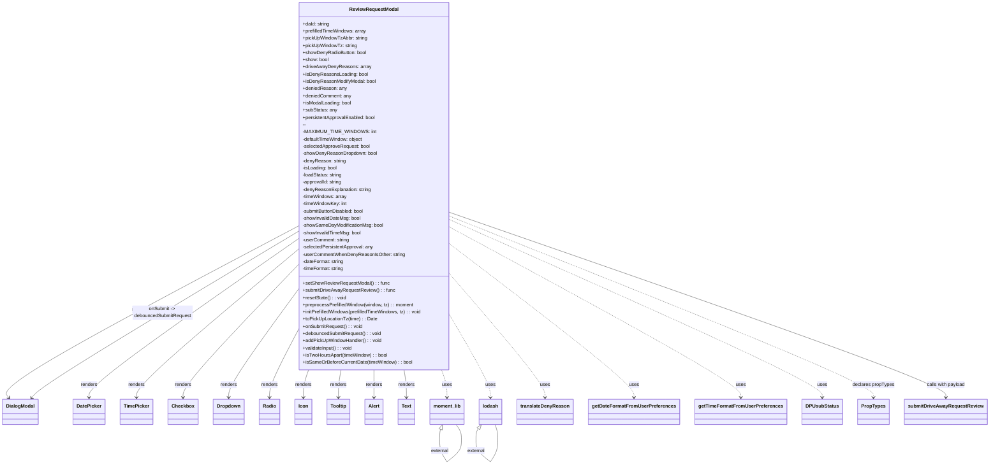

# Diagram: web/portal/src/pages/driveaway/components/search/DriveAway.ReviewRequestModal.js

> Auto-generated by Obscura crawlers

## Mermaid

### SVG

<svg id="container" width="3240.1953125" xmlns="http://www.w3.org/2000/svg" class="classDiagram" height="1546.25" viewBox="0 0 3240.1953125 1546.25" role="graphics-document document" aria-roledescription="class"><g><defs><marker id="container_class-aggregationStart" class="marker aggregation class" refX="18" refY="7" markerWidth="190" markerHeight="240" orient="auto"><path d="M 18,7 L9,13 L1,7 L9,1 Z"></path></marker></defs><defs><marker id="container_class-aggregationEnd" class="marker aggregation class" refX="1" refY="7" markerWidth="20" markerHeight="28" orient="auto"><path d="M 18,7 L9,13 L1,7 L9,1 Z"></path></marker></defs><defs><marker id="container_class-extensionStart" class="marker extension class" refX="18" refY="7" markerWidth="190" markerHeight="240" orient="auto"><path d="M 1,7 L18,13 V 1 Z"></path></marker></defs><defs><marker id="container_class-extensionEnd" class="marker extension class" refX="1" refY="7" markerWidth="20" markerHeight="28" orient="auto"><path d="M 1,1 V 13 L18,7 Z"></path></marker></defs><defs><marker id="container_class-compositionStart" class="marker composition class" refX="18" refY="7" markerWidth="190" markerHeight="240" orient="auto"><path d="M 18,7 L9,13 L1,7 L9,1 Z"></path></marker></defs><defs><marker id="container_class-compositionEnd" class="marker composition class" refX="1" refY="7" markerWidth="20" markerHeight="28" orient="auto"><path d="M 18,7 L9,13 L1,7 L9,1 Z"></path></marker></defs><defs><marker id="container_class-dependencyStart" class="marker dependency class" refX="6" refY="7" markerWidth="190" markerHeight="240" orient="auto"><path d="M 5,7 L9,13 L1,7 L9,1 Z"></path></marker></defs><defs><marker id="container_class-dependencyEnd" class="marker dependency class" refX="13" refY="7" markerWidth="20" markerHeight="28" orient="auto"><path d="M 18,7 L9,13 L14,7 L9,1 Z"></path></marker></defs><defs><marker id="container_class-lollipopStart" class="marker lollipop class" refX="13" refY="7" markerWidth="190" markerHeight="240" orient="auto"><circle stroke="black" fill="transparent" cx="7" cy="7" r="6"></circle></marker></defs><defs><marker id="container_class-lollipopEnd" class="marker lollipop class" refX="1" refY="7" markerWidth="190" markerHeight="240" orient="auto"><circle stroke="black" fill="transparent" cx="7" cy="7" r="6"></circle></marker></defs><g class="root"><g class="clusters"></g><g class="edgePaths"><path d="M1011.883,755.5L849.194,843.083C686.505,930.667,361.128,1105.833,204.438,1200.807C47.749,1295.781,59.748,1310.561,65.748,1317.951L71.747,1325.342" id="id_ReviewRequestModal_DialogModal_1" class="edge-thickness-normal edge-pattern-solid relation" style=";;;" data-edge="true" data-et="edge" data-id="id_ReviewRequestModal_DialogModal_1" data-points="W3sieCI6MTAxMS44ODI4MTI1LCJ5Ijo3NTUuNDk5OTEwOTE5OTQyNX0seyJ4IjozNS43NSwieSI6MTI4MX0seyJ4Ijo3NS41Mjg4NDYxNTM4NDYxNiwieSI6MTMzMH1d" marker-end="url(#container_class-dependencyEnd)"></path><path d="M1011.883,799.561L899.409,879.801C786.935,960.041,561.987,1120.52,449.513,1207.927C337.039,1295.333,337.039,1309.667,337.039,1316.833L337.039,1324" id="id_ReviewRequestModal_DatePicker_2" class="edge-thickness-normal edge-pattern-solid relation" style=";;;" data-edge="true" data-et="edge" data-id="id_ReviewRequestModal_DatePicker_2" data-points="W3sieCI6MTAxMS44ODI4MTI1LCJ5Ijo3OTkuNTYxMzQ2NDA4NDI1Mn0seyJ4IjozMzcuMDM5MDYyNSwieSI6MTI4MX0seyJ4IjozMzcuMDM5MDYyNSwieSI6MTMzMH1d" marker-end="url(#container_class-dependencyEnd)"></path><path d="M1011.883,835.434L925.122,909.695C838.362,983.956,664.841,1132.478,578.081,1213.906C491.32,1295.333,491.32,1309.667,491.32,1316.833L491.32,1324" id="id_ReviewRequestModal_TimePicker_3" class="edge-thickness-normal edge-pattern-solid relation" style=";;;" data-edge="true" data-et="edge" data-id="id_ReviewRequestModal_TimePicker_3" data-points="W3sieCI6MTAxMS44ODI4MTI1LCJ5Ijo4MzUuNDM0MDE1NTE4NjE5M30seyJ4Ijo0OTEuMzIwMzEyNSwieSI6MTI4MX0seyJ4Ijo0OTEuMzIwMzEyNSwieSI6MTMzMH1d" marker-end="url(#container_class-dependencyEnd)"></path><path d="M1011.883,887.289L950.092,952.907C888.302,1018.526,764.721,1149.763,702.931,1222.548C641.141,1295.333,641.141,1309.667,641.141,1316.833L641.141,1324" id="id_ReviewRequestModal_Checkbox_4" class="edge-thickness-normal edge-pattern-solid relation" style=";;;" data-edge="true" data-et="edge" data-id="id_ReviewRequestModal_Checkbox_4" data-points="W3sieCI6MTAxMS44ODI4MTI1LCJ5Ijo4ODcuMjg4ODQ2NzcxNzY0Mn0seyJ4Ijo2NDEuMTQwNjI1LCJ5IjoxMjgxfSx7IngiOjY0MS4xNDA2MjUsInkiOjEzMzB9XQ==" marker-end="url(#container_class-dependencyEnd)"></path><path d="M1011.883,969.897L974.585,1021.748C937.286,1073.598,862.69,1177.299,825.392,1236.316C788.094,1295.333,788.094,1309.667,788.094,1316.833L788.094,1324" id="id_ReviewRequestModal_Dropdown_5" class="edge-thickness-normal edge-pattern-solid relation" style=";;;" data-edge="true" data-et="edge" data-id="id_ReviewRequestModal_Dropdown_5" data-points="W3sieCI6MTAxMS44ODI4MTI1LCJ5Ijo5NjkuODk3MDk1MDY3NTI5OH0seyJ4Ijo3ODguMDkzNzUsInkiOjEyODF9LHsieCI6Nzg4LjA5Mzc1LCJ5IjoxMzMwfV0=" marker-end="url(#container_class-dependencyEnd)"></path><path d="M1011.883,1105.322L996.698,1134.602C981.513,1163.881,951.143,1222.441,935.958,1258.887C920.773,1295.333,920.773,1309.667,920.773,1316.833L920.773,1324" id="id_ReviewRequestModal_Radio_6" class="edge-thickness-normal edge-pattern-solid relation" style=";;;" data-edge="true" data-et="edge" data-id="id_ReviewRequestModal_Radio_6" data-points="W3sieCI6MTAxMS44ODI4MTI1LCJ5IjoxMTA1LjMyMTgzOTYwNDM2Njd9LHsieCI6OTIwLjc3MzQzNzUsInkiOjEyODF9LHsieCI6OTIwLjc3MzQzNzUsInkiOjEzMzB9XQ==" marker-end="url(#container_class-dependencyEnd)"></path><path d="M1048.284,1232L1045.412,1240.167C1042.539,1248.333,1036.793,1264.667,1033.92,1280C1031.047,1295.333,1031.047,1309.667,1031.047,1316.833L1031.047,1324" id="id_ReviewRequestModal_Icon_7" class="edge-thickness-normal edge-pattern-solid relation" style=";;;" data-edge="true" data-et="edge" data-id="id_ReviewRequestModal_Icon_7" data-points="W3sieCI6MTA0OC4yODQ0NDExODc1OTQ0LCJ5IjoxMjMyfSx7IngiOjEwMzEuMDQ2ODc1LCJ5IjoxMjgxfSx7IngiOjEwMzEuMDQ2ODc1LCJ5IjoxMzMwfV0=" marker-end="url(#container_class-dependencyEnd)"></path><path d="M1154.788,1232L1153.337,1240.167C1151.885,1248.333,1148.982,1264.667,1147.53,1280C1146.078,1295.333,1146.078,1309.667,1146.078,1316.833L1146.078,1324" id="id_ReviewRequestModal_Tooltip_8" class="edge-thickness-normal edge-pattern-solid relation" style=";;;" data-edge="true" data-et="edge" data-id="id_ReviewRequestModal_Tooltip_8" data-points="W3sieCI6MTE1NC43ODg0MTI0NDMyNjc4LCJ5IjoxMjMyfSx7IngiOjExNDYuMDc4MTI1LCJ5IjoxMjgxfSx7IngiOjExNDYuMDc4MTI1LCJ5IjoxMzMwfV0=" marker-end="url(#container_class-dependencyEnd)"></path><path d="M1263.578,1232L1263.578,1240.167C1263.578,1248.333,1263.578,1264.667,1263.578,1280C1263.578,1295.333,1263.578,1309.667,1263.578,1316.833L1263.578,1324" id="id_ReviewRequestModal_Alert_9" class="edge-thickness-normal edge-pattern-solid relation" style=";;;" data-edge="true" data-et="edge" data-id="id_ReviewRequestModal_Alert_9" data-points="W3sieCI6MTI2My41NzgxMjUsInkiOjEyMzJ9LHsieCI6MTI2My41NzgxMjUsInkiOjEyODF9LHsieCI6MTI2My41NzgxMjUsInkiOjEzMzB9XQ==" marker-end="url(#container_class-dependencyEnd)"></path><path d="M1362.791,1232L1364.115,1240.167C1365.439,1248.333,1368.087,1264.667,1369.41,1280C1370.734,1295.333,1370.734,1309.667,1370.734,1316.833L1370.734,1324" id="id_ReviewRequestModal_Text_10" class="edge-thickness-normal edge-pattern-solid relation" style=";;;" data-edge="true" data-et="edge" data-id="id_ReviewRequestModal_Text_10" data-points="W3sieCI6MTM2Mi43OTA4NzA4Mzk2MzcsInkiOjEyMzJ9LHsieCI6MTM3MC43MzQzNzUsInkiOjEyODF9LHsieCI6MTM3MC43MzQzNzUsInkiOjEzMzB9XQ==" marker-end="url(#container_class-dependencyEnd)"></path><path d="M1486.105,1232L1489.075,1240.167C1492.044,1248.333,1497.983,1264.667,1500.952,1280C1503.922,1295.333,1503.922,1309.667,1503.922,1316.833L1503.922,1324" id="id_ReviewRequestModal_moment_lib_11" class="edge-thickness-normal edge-pattern-dashed relation" style=";;;" data-edge="true" data-et="edge" data-id="id_ReviewRequestModal_moment_lib_11" data-points="W3sieCI6MTQ4Ni4xMDUxNjczNjAwNjA1LCJ5IjoxMjMyfSx7IngiOjE1MDMuOTIxODc1LCJ5IjoxMjgxfSx7IngiOjE1MDMuOTIxODc1LCJ5IjoxMzMwfV0=" marker-end="url(#container_class-dependencyEnd)"></path><path d="M1515.273,1054.681L1537.115,1092.4C1558.956,1130.12,1602.638,1205.56,1624.479,1250.447C1646.32,1295.333,1646.32,1309.667,1646.32,1316.833L1646.32,1324" id="id_ReviewRequestModal_lodash_12" class="edge-thickness-normal edge-pattern-dashed relation" style=";;;" data-edge="true" data-et="edge" data-id="id_ReviewRequestModal_lodash_12" data-points="W3sieCI6MTUxNS4yNzM0Mzc1LCJ5IjoxMDU0LjY4MDU5NDM5NDg4ODl9LHsieCI6MTY0Ni4zMjAzMTI1LCJ5IjoxMjgxfSx7IngiOjE2NDYuMzIwMzEyNSwieSI6MTMzMH1d" marker-end="url(#container_class-dependencyEnd)"></path><path d="M1515.273,917.493L1566.531,978.077C1617.789,1038.662,1720.305,1159.831,1771.563,1227.582C1822.82,1295.333,1822.82,1309.667,1822.82,1316.833L1822.82,1324" id="id_ReviewRequestModal_translateDenyReason_13" class="edge-thickness-normal edge-pattern-dashed relation" style=";;;" data-edge="true" data-et="edge" data-id="id_ReviewRequestModal_translateDenyReason_13" data-points="W3sieCI6MTUxNS4yNzM0Mzc1LCJ5Ijo5MTcuNDkyOTM4MjY3NDY1N30seyJ4IjoxODIyLjgyMDMxMjUsInkiOjEyODF9LHsieCI6MTgyMi44MjAzMTI1LCJ5IjoxMzMwfV0=" marker-end="url(#container_class-dependencyEnd)"></path><path d="M1515.273,817.28L1613.878,894.567C1712.482,971.854,1909.69,1126.427,2008.294,1210.88C2106.898,1295.333,2106.898,1309.667,2106.898,1316.833L2106.898,1324" id="id_ReviewRequestModal_getDateFormatFromUserPreferences_14" class="edge-thickness-normal edge-pattern-dashed relation" style=";;;" data-edge="true" data-et="edge" data-id="id_ReviewRequestModal_getDateFormatFromUserPreferences_14" data-points="W3sieCI6MTUxNS4yNzM0Mzc1LCJ5Ijo4MTcuMjgwNDM5MTEyNTExfSx7IngiOjIxMDYuODk4NDM3NSwieSI6MTI4MX0seyJ4IjoyMTA2Ljg5ODQzNzUsInkiOjEzMzB9XQ==" marker-end="url(#container_class-dependencyEnd)"></path><path d="M1515.273,760.688L1670.415,847.407C1825.557,934.126,2135.841,1107.563,2290.983,1201.448C2446.125,1295.333,2446.125,1309.667,2446.125,1316.833L2446.125,1324" id="id_ReviewRequestModal_getTimeFormatFromUserPreferences_15" class="edge-thickness-normal edge-pattern-dashed relation" style=";;;" data-edge="true" data-et="edge" data-id="id_ReviewRequestModal_getTimeFormatFromUserPreferences_15" data-points="W3sieCI6MTUxNS4yNzM0Mzc1LCJ5Ijo3NjAuNjg4Mzc3ODM5MTQ0OX0seyJ4IjoyNDQ2LjEyNSwieSI6MTI4MX0seyJ4IjoyNDQ2LjEyNSwieSI6MTMzMH1d" marker-end="url(#container_class-dependencyEnd)"></path><path d="M1515.273,735.417L1713.57,826.347C1911.867,917.278,2308.461,1099.139,2506.758,1197.236C2705.055,1295.333,2705.055,1309.667,2705.055,1316.833L2705.055,1324" id="id_ReviewRequestModal_DPUsubStatus_16" class="edge-thickness-normal edge-pattern-dashed relation" style=";;;" data-edge="true" data-et="edge" data-id="id_ReviewRequestModal_DPUsubStatus_16" data-points="W3sieCI6MTUxNS4yNzM0Mzc1LCJ5Ijo3MzUuNDE2NzkyNjc2Nzh9LHsieCI6MjcwNS4wNTQ2ODc1LCJ5IjoxMjgxfSx7IngiOjI3MDUuMDU0Njg3NSwieSI6MTMzMH1d" marker-end="url(#container_class-dependencyEnd)"></path><path d="M1515.273,723.618L1740.926,816.515C1966.578,909.412,2417.883,1095.206,2643.535,1195.27C2869.188,1295.333,2869.188,1309.667,2869.188,1316.833L2869.188,1324" id="id_ReviewRequestModal_PropTypes_17" class="edge-thickness-normal edge-pattern-dashed relation" style=";;;" data-edge="true" data-et="edge" data-id="id_ReviewRequestModal_PropTypes_17" data-points="W3sieCI6MTUxNS4yNzM0Mzc1LCJ5Ijo3MjMuNjE4MzU0NTk2Njc3N30seyJ4IjoyODY5LjE4NzUsInkiOjEyODF9LHsieCI6Mjg2OS4xODc1LCJ5IjoxMzMwfV0=" marker-end="url(#container_class-dependencyEnd)"></path><path d="M1482.348,1430.174L1481.802,1431.645C1481.256,1433.116,1480.165,1436.058,1479.62,1441.696C1479.074,1447.333,1479.074,1455.667,1479.074,1459.833L1479.074,1464" id="moment_lib-cyclic-special-1" class="edge-thickness-normal edge-pattern-solid relation" style=";;;" data-edge="true" data-et="edge" data-id="moment_lib-cyclic-special-1" data-points="W3sieCI6MTQ4OC4zNDU3MzIyNzYxMTk0LCJ5IjoxNDE0fSx7IngiOjE0NzkuMDc0MjE4NzUsInkiOjE0Mzl9LHsieCI6MTQ3OS4wNzQyMTg3NSwieSI6MTQ2NH1d" marker-start="url(#container_class-extensionStart)"></path><path d="M1479.074,1464.1L1479.074,1470.267C1479.074,1476.433,1479.074,1488.767,1483.21,1501.1C1487.346,1513.433,1495.617,1525.767,1499.753,1531.933L1503.888,1538.1" id="moment_lib-cyclic-special-mid" class="edge-thickness-normal edge-pattern-solid relation" style=";;;" data-edge="true" data-et="edge" data-id="moment_lib-cyclic-special-mid" data-points="W3sieCI6MTQ3OS4wNzQyMTg3NSwieSI6MTQ2NC4xMDAwMDAwMDE0OTAxfSx7IngiOjE0NzkuMDc0MjE4NzUsInkiOjE1MDEuMTAwMDAwMDAxNDkwMX0seyJ4IjoxNTAzLjg4ODM0MjM5OTk3MzIsInkiOjE1MzguMTAwMDAwMDAxNDkwMX1d"></path><path d="M1503.972,1538.11L1511.689,1531.942C1519.406,1525.773,1534.84,1513.437,1542.557,1501.093C1550.273,1488.75,1550.273,1476.4,1550.273,1466.05C1550.273,1455.7,1550.273,1447.35,1547.391,1439.008C1544.508,1430.667,1538.743,1422.333,1535.861,1418.167L1532.978,1414" id="moment_lib-cyclic-special-2" class="edge-thickness-normal edge-pattern-solid relation" style=";;;" data-edge="true" data-et="edge" data-id="moment_lib-cyclic-special-2" data-points="W3sieCI6MTUwMy45NzE4NzUwMDA3NDUsInkiOjE1MzguMTEwMDMzNzExMzk3OH0seyJ4IjoxNTUwLjI3MzQzNzUsInkiOjE1MDEuMTAwMDAwMDAxNDkwMX0seyJ4IjoxNTUwLjI3MzQzNzUsInkiOjE0NjQuMDUwMDAwMDAwNzQ1fSx7IngiOjE1NTAuMjczNDM3NSwieSI6MTQzOX0seyJ4IjoxNTMyLjk3ODA3ODM1ODIwOSwieSI6MTQxNH1d"></path><path d="M1607.45,1428.186L1606.203,1429.988C1604.956,1431.791,1602.462,1435.395,1601.216,1441.364C1599.969,1447.333,1599.969,1455.667,1599.969,1459.833L1599.969,1464" id="lodash-cyclic-special-1" class="edge-thickness-normal edge-pattern-solid relation" style=";;;" data-edge="true" data-et="edge" data-id="lodash-cyclic-special-1" data-points="W3sieCI6MTYxNy4yNjQxMDkxNDE3OTEsInkiOjE0MTR9LHsieCI6MTU5OS45Njg3NSwieSI6MTQzOX0seyJ4IjoxNTk5Ljk2ODc1LCJ5IjoxNDY0fV0=" marker-start="url(#container_class-extensionStart)"></path><path d="M1599.969,1464.1L1599.969,1470.267C1599.969,1476.433,1599.969,1488.767,1607.686,1501.102C1615.403,1513.437,1630.836,1525.773,1638.553,1531.942L1646.27,1538.11" id="lodash-cyclic-special-mid" class="edge-thickness-normal edge-pattern-solid relation" style=";;;" data-edge="true" data-et="edge" data-id="lodash-cyclic-special-mid" data-points="W3sieCI6MTU5OS45Njg3NSwieSI6MTQ2NC4xMDAwMDAwMDE0OTAxfSx7IngiOjE1OTkuOTY4NzUsInkiOjE1MDEuMTAwMDAwMDAxNDkwMX0seyJ4IjoxNjQ2LjI3MDMxMjQ5OTI1NSwieSI6MTUzOC4xMTAwMzM3MTEzOTc4fV0="></path><path d="M1646.354,1538.1L1650.49,1531.933C1654.625,1525.767,1662.897,1513.433,1667.032,1501.092C1671.168,1488.75,1671.168,1476.4,1671.168,1466.05C1671.168,1455.7,1671.168,1447.35,1669.623,1439.008C1668.077,1430.667,1664.987,1422.333,1663.442,1418.167L1661.896,1414" id="lodash-cyclic-special-2" class="edge-thickness-normal edge-pattern-solid relation" style=";;;" data-edge="true" data-et="edge" data-id="lodash-cyclic-special-2" data-points="W3sieCI6MTY0Ni4zNTM4NDUxMDAwMjY4LCJ5IjoxNTM4LjEwMDAwMDAwMTQ5MDF9LHsieCI6MTY3MS4xNjc5Njg3NSwieSI6MTUwMS4xMDAwMDAwMDE0OTAxfSx7IngiOjE2NzEuMTY3OTY4NzUsInkiOjE0NjQuMDUwMDAwMDAwNzQ1fSx7IngiOjE2NzEuMTY3OTY4NzUsInkiOjE0Mzl9LHsieCI6MTY2MS44OTY0NTUyMjM4ODA2LCJ5IjoxNDE0fV0="></path><path d="M147.503,1325.342L153.502,1317.951C159.502,1310.561,171.501,1295.781,315.564,1203.896C459.628,1112.012,735.755,943.024,873.819,858.53L1011.883,774.036" id="id_DialogModal_ReviewRequestModal_20" class="edge-thickness-normal edge-pattern-solid relation" style=";;;" data-edge="true" data-et="edge" data-id="id_DialogModal_ReviewRequestModal_20" data-points="W3sieCI6MTQzLjcyMTE1Mzg0NjE1Mzg0LCJ5IjoxMzMwfSx7IngiOjE4My41LCJ5IjoxMjgxfSx7IngiOjEwMTEuODgyODEyNSwieSI6Nzc0LjAzNTcxMDY2OTA3Nzd9XQ==" marker-start="url(#container_class-dependencyStart)"></path><path d="M1515.273,710.555L1779.531,805.629C2043.789,900.703,2572.305,1090.852,2836.563,1193.092C3100.82,1295.333,3100.82,1309.667,3100.82,1316.833L3100.82,1324" id="id_ReviewRequestModal_submitDriveAwayRequestReview_21" class="edge-thickness-normal edge-pattern-solid relation" style=";;;" data-edge="true" data-et="edge" data-id="id_ReviewRequestModal_submitDriveAwayRequestReview_21" data-points="W3sieCI6MTUxNS4yNzM0Mzc1LCJ5Ijo3MTAuNTU0NTI5MzM0NDcyOX0seyJ4IjozMTAwLjgyMDMxMjUsInkiOjEyODF9LHsieCI6MzEwMC44MjAzMTI1LCJ5IjoxMzMwfV0=" marker-end="url(#container_class-dependencyEnd)"></path></g><g class="edgeLabels"><g class="edgeLabel" transform="translate(35.75, 1281)"><g class="label" data-id="id_ReviewRequestModal_DialogModal_1" transform="translate(-27.75, -12)"><foreignObject width="55.5" height="24">

renders

</foreignObject></g></g><g class="edgeLabel" transform="translate(337.0390625, 1281)"><g class="label" data-id="id_ReviewRequestModal_DatePicker_2" transform="translate(-27.75, -12)"><foreignObject width="55.5" height="24">

renders

</foreignObject></g></g><g class="edgeLabel" transform="translate(491.3203125, 1281)"><g class="label" data-id="id_ReviewRequestModal_TimePicker_3" transform="translate(-27.75, -12)"><foreignObject width="55.5" height="24">

renders

</foreignObject></g></g><g class="edgeLabel" transform="translate(641.140625, 1281)"><g class="label" data-id="id_ReviewRequestModal_Checkbox_4" transform="translate(-27.75, -12)"><foreignObject width="55.5" height="24">

renders

</foreignObject></g></g><g class="edgeLabel" transform="translate(788.09375, 1281)"><g class="label" data-id="id_ReviewRequestModal_Dropdown_5" transform="translate(-27.75, -12)"><foreignObject width="55.5" height="24">

renders

</foreignObject></g></g><g class="edgeLabel" transform="translate(920.7734375, 1281)"><g class="label" data-id="id_ReviewRequestModal_Radio_6" transform="translate(-27.75, -12)"><foreignObject width="55.5" height="24">

renders

</foreignObject></g></g><g class="edgeLabel" transform="translate(1031.046875, 1281)"><g class="label" data-id="id_ReviewRequestModal_Icon_7" transform="translate(-27.75, -12)"><foreignObject width="55.5" height="24">

renders

</foreignObject></g></g><g class="edgeLabel" transform="translate(1146.078125, 1281)"><g class="label" data-id="id_ReviewRequestModal_Tooltip_8" transform="translate(-27.75, -12)"><foreignObject width="55.5" height="24">

renders

</foreignObject></g></g><g class="edgeLabel" transform="translate(1263.578125, 1281)"><g class="label" data-id="id_ReviewRequestModal_Alert_9" transform="translate(-27.75, -12)"><foreignObject width="55.5" height="24">

renders

</foreignObject></g></g><g class="edgeLabel" transform="translate(1370.734375, 1281)"><g class="label" data-id="id_ReviewRequestModal_Text_10" transform="translate(-27.75, -12)"><foreignObject width="55.5" height="24">

renders

</foreignObject></g></g><g class="edgeLabel" transform="translate(1503.921875, 1281)"><g class="label" data-id="id_ReviewRequestModal_moment_lib_11" transform="translate(-16.4921875, -12)"><foreignObject width="32.984375" height="24">

uses

</foreignObject></g></g><g class="edgeLabel" transform="translate(1646.3203125, 1281)"><g class="label" data-id="id_ReviewRequestModal_lodash_12" transform="translate(-16.4921875, -12)"><foreignObject width="32.984375" height="24">

uses

</foreignObject></g></g><g class="edgeLabel" transform="translate(1822.8203125, 1281)"><g class="label" data-id="id_ReviewRequestModal_translateDenyReason_13" transform="translate(-16.4921875, -12)"><foreignObject width="32.984375" height="24">

uses

</foreignObject></g></g><g class="edgeLabel" transform="translate(2106.8984375, 1281)"><g class="label" data-id="id_ReviewRequestModal_getDateFormatFromUserPreferences_14" transform="translate(-16.4921875, -12)"><foreignObject width="32.984375" height="24">

uses

</foreignObject></g></g><g class="edgeLabel" transform="translate(2446.125, 1281)"><g class="label" data-id="id_ReviewRequestModal_getTimeFormatFromUserPreferences_15" transform="translate(-16.4921875, -12)"><foreignObject width="32.984375" height="24">

uses

</foreignObject></g></g><g class="edgeLabel" transform="translate(2705.0546875, 1281)"><g class="label" data-id="id_ReviewRequestModal_DPUsubStatus_16" transform="translate(-16.4921875, -12)"><foreignObject width="32.984375" height="24">

uses

</foreignObject></g></g><g class="edgeLabel" transform="translate(2869.1875, 1281)"><g class="label" data-id="id_ReviewRequestModal_PropTypes_17" transform="translate(-70.3125, -12)"><foreignObject width="140.625" height="24">

declares propTypes

</foreignObject></g></g><g class="edgeLabel"><g class="label" data-id="moment_lib-cyclic-special-1" transform="translate(0, 0)"><foreignObject width="0" height="0">

</foreignObject></g></g><g class="edgeLabel" transform="translate(1479.07421875, 1501.1000000014901)"><g class="label" data-id="moment_lib-cyclic-special-mid" transform="translate(-29.6953125, -12)"><foreignObject width="59.390625" height="24">

external

</foreignObject></g></g><g class="edgeLabel"><g class="label" data-id="moment_lib-cyclic-special-2" transform="translate(0, 0)"><foreignObject width="0" height="0">

</foreignObject></g></g><g class="edgeLabel"><g class="label" data-id="lodash-cyclic-special-1" transform="translate(0, 0)"><foreignObject width="0" height="0">

</foreignObject></g></g><g class="edgeLabel" transform="translate(1599.96875, 1501.1000000014901)"><g class="label" data-id="lodash-cyclic-special-mid" transform="translate(-29.6953125, -12)"><foreignObject width="59.390625" height="24">

external

</foreignObject></g></g><g class="edgeLabel"><g class="label" data-id="lodash-cyclic-special-2" transform="translate(0, 0)"><foreignObject width="0" height="0">

</foreignObject></g></g><g class="edgeLabel" transform="translate(570.77502, 1043.99049)"><g class="label" data-id="id_DialogModal_ReviewRequestModal_20" transform="translate(-100, -24)"><foreignObject width="200" height="48">

onSubmit -&gt; debouncedSubmitRequest

</foreignObject></g></g><g class="edgeLabel" transform="translate(3100.8203125, 1281)"><g class="label" data-id="id_ReviewRequestModal_submitDriveAwayRequestReview_21" transform="translate(-65.125, -12)"><foreignObject width="130.25" height="24">

calls with payload

</foreignObject></g></g></g><g class="nodes"><g class="node default" id="classId-ReviewRequestModal-0" transform="translate(1263.578125, 620)"><g class="basic label-container"><path d="M-251.6953125 -612 L251.6953125 -612 L251.6953125 612 L-251.6953125 612" stroke="none" stroke-width="0" fill="#ECECFF" style=""></path><path d="M-251.6953125 -612 C-92.88702930813352 -612, 65.92125388373296 -612, 251.6953125 -612 M-251.6953125 -612 C-78.00139037436765 -612, 95.69253175126471 -612, 251.6953125 -612 M251.6953125 -612 C251.6953125 -274.7190316120995, 251.6953125 62.56193677580097, 251.6953125 612 M251.6953125 -612 C251.6953125 -135.34917028572994, 251.6953125 341.3016594285401, 251.6953125 612 M251.6953125 612 C114.2044739307101 612, -23.286364638579812 612, -251.6953125 612 M251.6953125 612 C116.10410127907389 612, -19.487109941852225 612, -251.6953125 612 M-251.6953125 612 C-251.6953125 337.52177570238285, -251.6953125 63.04355140476571, -251.6953125 -612 M-251.6953125 612 C-251.6953125 267.1309548952221, -251.6953125 -77.73809020955582, -251.6953125 -612" stroke="#9370DB" stroke-width="1.3" fill="none" stroke-dasharray="0 0" style=""></path></g><g class="annotation-group text" transform="translate(0, -588)"></g><g class="label-group text" transform="translate(-78.359375, -588)"><g class="label" style="font-weight: bolder" transform="translate(0,-12)"><foreignObject width="156.71875" height="24">

ReviewRequestModal

</foreignObject></g></g><g class="members-group text" transform="translate(-239.6953125, -540)"><g class="label" style="" transform="translate(0,-12)"><foreignObject width="90.265625" height="24">

+daId: string

</foreignObject></g><g class="label" style="" transform="translate(0,12)"><foreignObject width="213.78125" height="24">

+prefilledTimeWindows: array

</foreignObject></g><g class="label" style="" transform="translate(0,36)"><foreignObject width="214.28125" height="24">

+pickUpWindowTzAbbr: string

</foreignObject></g><g class="label" style="" transform="translate(0,60)"><foreignObject width="179.921875" height="24">

+pickUpWindowTz: string

</foreignObject></g><g class="label" style="" transform="translate(0,84)"><foreignObject width="213.5" height="24">

+showDenyRadioButton: bool

</foreignObject></g><g class="label" style="" transform="translate(0,108)"><foreignObject width="86.6875" height="24">

+show: bool

</foreignObject></g><g class="label" style="" transform="translate(0,132)"><foreignObject width="222.84375" height="24">

+driveAwayDenyReasons: array

</foreignObject></g><g class="label" style="" transform="translate(0,156)"><foreignObject width="214.53125" height="24">

+isDenyReasonsLoading: bool

</foreignObject></g><g class="label" style="" transform="translate(0,180)"><foreignObject width="243.6875" height="24">

+isDenyReasonModifyModal: bool

</foreignObject></g><g class="label" style="" transform="translate(0,204)"><foreignObject width="145.109375" height="24">

+deniedReason: any

</foreignObject></g><g class="label" style="" transform="translate(0,228)"><foreignObject width="161.71875" height="24">

+deniedComment: any

</foreignObject></g><g class="label" style="" transform="translate(0,252)"><foreignObject width="162.765625" height="24">

+isModalLoading: bool

</foreignObject></g><g class="label" style="" transform="translate(0,276)"><foreignObject width="113.84375" height="24">

+subStatus: any

</foreignObject></g><g class="label" style="" transform="translate(0,300)"><foreignObject width="244.859375" height="24">

+persistentApprovalEnabled: bool

</foreignObject></g><g class="label" style="" transform="translate(0,324)"><foreignObject width="12.90625" height="24">

--

</foreignObject></g><g class="label" style="" transform="translate(0,348)"><foreignObject width="225.5625" height="24">

-MAXIMUM_TIME_WINDOWS: int

</foreignObject></g><g class="label" style="" transform="translate(0,372)"><foreignObject width="204.546875" height="24">

-defaultTimeWindow: object

</foreignObject></g><g class="label" style="" transform="translate(0,396)"><foreignObject width="227.15625" height="24">

-selectedApproveRequest: bool

</foreignObject></g><g class="label" style="" transform="translate(0,420)"><foreignObject width="248.578125" height="24">

-showDenyReasonDropdown: bool

</foreignObject></g><g class="label" style="" transform="translate(0,444)"><foreignObject width="144.328125" height="24">

-denyReason: string

</foreignObject></g><g class="label" style="" transform="translate(0,468)"><foreignObject width="116.625" height="24">

-isLoading: bool

</foreignObject></g><g class="label" style="" transform="translate(0,492)"><foreignObject width="133.875" height="24">

-loadStatus: string

</foreignObject></g><g class="label" style="" transform="translate(0,516)"><foreignObject width="133.75" height="24">

-approvalId: string

</foreignObject></g><g class="label" style="" transform="translate(0,540)"><foreignObject width="230.546875" height="24">

-denyReasonExplanation: string

</foreignObject></g><g class="label" style="" transform="translate(0,564)"><foreignObject width="148.96875" height="24">

-timeWindows: array

</foreignObject></g><g class="label" style="" transform="translate(0,588)"><foreignObject width="150.125" height="24">

-timeWindowKey: int

</foreignObject></g><g class="label" style="" transform="translate(0,612)"><foreignObject width="210.015625" height="24">

-submitButtonDisabled: bool

</foreignObject></g><g class="label" style="" transform="translate(0,636)"><foreignObject width="195.34375" height="24">

-showInvalidDateMsg: bool

</foreignObject></g><g class="label" style="" transform="translate(0,660)"><foreignObject width="269.921875" height="24">

-showSameDayModificationMsg: bool

</foreignObject></g><g class="label" style="" transform="translate(0,684)"><foreignObject width="197.453125" height="24">

-showInvalidTimeMsg: bool

</foreignObject></g><g class="label" style="" transform="translate(0,708)"><foreignObject width="157.1875" height="24">

-userComment: string

</foreignObject></g><g class="label" style="" transform="translate(0,732)"><foreignObject width="237.859375" height="24">

-selectedPersistentApproval: any

</foreignObject></g><g class="label" style="" transform="translate(0,756)"><foreignObject width="340.1875" height="24">

-userCommentWhenDenyReasonIsOther: string

</foreignObject></g><g class="label" style="" transform="translate(0,780)"><foreignObject width="139.765625" height="24">

-dateFormat: string

</foreignObject></g><g class="label" style="" transform="translate(0,804)"><foreignObject width="139.875" height="24">

-timeFormat: string

</foreignObject></g></g><g class="methods-group text" transform="translate(-239.6953125, 324)"><g class="label" style="" transform="translate(0,-12)"><foreignObject width="285.609375" height="24">

+setShowReviewRequestModal() : : func

</foreignObject></g><g class="label" style="" transform="translate(0,12)"><foreignObject width="304.734375" height="24">

+submitDriveAwayRequestReview() : : func

</foreignObject></g><g class="label" style="" transform="translate(0,36)"><foreignObject width="143.71875" height="24">

+resetState() : : void

</foreignObject></g><g class="label" style="" transform="translate(0,60)"><foreignObject width="372.625" height="24">

+preprocessPrefilledWindow(window, tz) : : moment

</foreignObject></g><g class="label" style="" transform="translate(0,84)"><foreignObject width="401.03125" height="24">

+initPrefilledWindows(prefilledTimeWindows, tz) : : void

</foreignObject></g><g class="label" style="" transform="translate(0,108)"><foreignObject width="245.859375" height="24">

+toPickUpLocationTz(time) : : Date

</foreignObject></g><g class="label" style="" transform="translate(0,132)"><foreignObject width="199.25" height="24">

+onSubmitRequest() : : void

</foreignObject></g><g class="label" style="" transform="translate(0,156)"><foreignObject width="261.96875" height="24">

+debouncedSubmitRequest() : : void

</foreignObject></g><g class="label" style="" transform="translate(0,180)"><foreignObject width="262.859375" height="24">

+addPickUpWindowHandler() : : void

</foreignObject></g><g class="label" style="" transform="translate(0,204)"><foreignObject width="166.40625" height="24">

+validateInput() : : void

</foreignObject></g><g class="label" style="" transform="translate(0,228)"><foreignObject width="284.546875" height="24">

+isTwoHoursApart(timeWindow) : : bool

</foreignObject></g><g class="label" style="" transform="translate(0,252)"><foreignObject width="365.1875" height="24">

+isSameOrBeforeCurrentDate(timeWindow) : : bool

</foreignObject></g></g><g class="divider" style=""><path d="M-251.6953125 -564 C-73.78330266570276 -564, 104.12870716859447 -564, 251.6953125 -564 M-251.6953125 -564 C-80.54126177800197 -564, 90.61278894399607 -564, 251.6953125 -564" stroke="#9370DB" stroke-width="1.3" fill="none" stroke-dasharray="0 0" style=""></path></g><g class="divider" style=""><path d="M-251.6953125 300 C-63.47588590568941 300, 124.74354068862118 300, 251.6953125 300 M-251.6953125 300 C-73.72038915605108 300, 104.25453418789783 300, 251.6953125 300" stroke="#9370DB" stroke-width="1.3" fill="none" stroke-dasharray="0 0" style=""></path></g></g><g class="node default" id="classId-DialogModal-1" transform="translate(109.625, 1372)"><g class="basic label-container"><path d="M-57.625 -42 L57.625 -42 L57.625 42 L-57.625 42" stroke="none" stroke-width="0" fill="#ECECFF" style=""></path><path d="M-57.625 -42 C-21.032370634802575 -42, 15.56025873039485 -42, 57.625 -42 M-57.625 -42 C-12.358694983833907 -42, 32.90761003233219 -42, 57.625 -42 M57.625 -42 C57.625 -8.59872632004069, 57.625 24.80254735991862, 57.625 42 M57.625 -42 C57.625 -8.511218254178473, 57.625 24.977563491643053, 57.625 42 M57.625 42 C20.927676806590753 42, -15.769646386818494 42, -57.625 42 M57.625 42 C25.969540934609874 42, -5.6859181307802515 42, -57.625 42 M-57.625 42 C-57.625 22.027914465279405, -57.625 2.0558289305588104, -57.625 -42 M-57.625 42 C-57.625 20.17968162099988, -57.625 -1.640636758000241, -57.625 -42" stroke="#9370DB" stroke-width="1.3" fill="none" stroke-dasharray="0 0" style=""></path></g><g class="annotation-group text" transform="translate(0, -18)"></g><g class="label-group text" transform="translate(-45.625, -18)"><g class="label" style="font-weight: bolder" transform="translate(0,-12)"><foreignObject width="91.25" height="24">

DialogModal

</foreignObject></g></g><g class="members-group text" transform="translate(-45.625, 30)"></g><g class="methods-group text" transform="translate(-45.625, 60)"></g><g class="divider" style=""><path d="M-57.625 6 C-30.860702470461423 6, -4.096404940922845 6, 57.625 6 M-57.625 6 C-30.770159705403906 6, -3.915319410807811 6, 57.625 6" stroke="#9370DB" stroke-width="1.3" fill="none" stroke-dasharray="0 0" style=""></path></g><g class="divider" style=""><path d="M-57.625 24 C-24.310999549934934 24, 9.003000900130132 24, 57.625 24 M-57.625 24 C-11.971809868116068 24, 33.68138026376786 24, 57.625 24" stroke="#9370DB" stroke-width="1.3" fill="none" stroke-dasharray="0 0" style=""></path></g></g><g class="node default" id="classId-DatePicker-2" transform="translate(337.0390625, 1372)"><g class="basic label-container"><path d="M-51.703125 -42 L51.703125 -42 L51.703125 42 L-51.703125 42" stroke="none" stroke-width="0" fill="#ECECFF" style=""></path><path d="M-51.703125 -42 C-25.498153154443745 -42, 0.7068186911125096 -42, 51.703125 -42 M-51.703125 -42 C-26.355663260302034 -42, -1.008201520604068 -42, 51.703125 -42 M51.703125 -42 C51.703125 -18.291535081845478, 51.703125 5.416929836309045, 51.703125 42 M51.703125 -42 C51.703125 -15.635230523401468, 51.703125 10.729538953197064, 51.703125 42 M51.703125 42 C30.273641444549654 42, 8.844157889099307 42, -51.703125 42 M51.703125 42 C18.611193030005495 42, -14.48073893998901 42, -51.703125 42 M-51.703125 42 C-51.703125 16.516238940616674, -51.703125 -8.967522118766652, -51.703125 -42 M-51.703125 42 C-51.703125 11.2668238837574, -51.703125 -19.4663522324852, -51.703125 -42" stroke="#9370DB" stroke-width="1.3" fill="none" stroke-dasharray="0 0" style=""></path></g><g class="annotation-group text" transform="translate(0, -18)"></g><g class="label-group text" transform="translate(-39.703125, -18)"><g class="label" style="font-weight: bolder" transform="translate(0,-12)"><foreignObject width="79.40625" height="24">

DatePicker

</foreignObject></g></g><g class="members-group text" transform="translate(-39.703125, 30)"></g><g class="methods-group text" transform="translate(-39.703125, 60)"></g><g class="divider" style=""><path d="M-51.703125 6 C-13.827194086048344 6, 24.048736827903312 6, 51.703125 6 M-51.703125 6 C-14.613597299430431 6, 22.475930401139138 6, 51.703125 6" stroke="#9370DB" stroke-width="1.3" fill="none" stroke-dasharray="0 0" style=""></path></g><g class="divider" style=""><path d="M-51.703125 24 C-30.286071495232246 24, -8.869017990464492 24, 51.703125 24 M-51.703125 24 C-29.672244649985558 24, -7.641364299971116 24, 51.703125 24" stroke="#9370DB" stroke-width="1.3" fill="none" stroke-dasharray="0 0" style=""></path></g></g><g class="node default" id="classId-TimePicker-3" transform="translate(491.3203125, 1372)"><g class="basic label-container"><path d="M-52.578125 -42 L52.578125 -42 L52.578125 42 L-52.578125 42" stroke="none" stroke-width="0" fill="#ECECFF" style=""></path><path d="M-52.578125 -42 C-12.337390625615669 -42, 27.903343748768663 -42, 52.578125 -42 M-52.578125 -42 C-24.448397303351154 -42, 3.681330393297692 -42, 52.578125 -42 M52.578125 -42 C52.578125 -21.771596335030672, 52.578125 -1.5431926700613445, 52.578125 42 M52.578125 -42 C52.578125 -17.805877897109415, 52.578125 6.38824420578117, 52.578125 42 M52.578125 42 C20.805744898538094 42, -10.966635202923811 42, -52.578125 42 M52.578125 42 C22.66276852952744 42, -7.252587940945119 42, -52.578125 42 M-52.578125 42 C-52.578125 12.406626297725033, -52.578125 -17.186747404549934, -52.578125 -42 M-52.578125 42 C-52.578125 10.464394675144, -52.578125 -21.071210649712, -52.578125 -42" stroke="#9370DB" stroke-width="1.3" fill="none" stroke-dasharray="0 0" style=""></path></g><g class="annotation-group text" transform="translate(0, -18)"></g><g class="label-group text" transform="translate(-40.578125, -18)"><g class="label" style="font-weight: bolder" transform="translate(0,-12)"><foreignObject width="81.15625" height="24">

TimePicker

</foreignObject></g></g><g class="members-group text" transform="translate(-40.578125, 30)"></g><g class="methods-group text" transform="translate(-40.578125, 60)"></g><g class="divider" style=""><path d="M-52.578125 6 C-10.875313366090246 6, 30.827498267819507 6, 52.578125 6 M-52.578125 6 C-10.935192033675968 6, 30.707740932648065 6, 52.578125 6" stroke="#9370DB" stroke-width="1.3" fill="none" stroke-dasharray="0 0" style=""></path></g><g class="divider" style=""><path d="M-52.578125 24 C-22.162840972858465 24, 8.25244305428307 24, 52.578125 24 M-52.578125 24 C-23.749329055000462 24, 5.079466889999075 24, 52.578125 24" stroke="#9370DB" stroke-width="1.3" fill="none" stroke-dasharray="0 0" style=""></path></g></g><g class="node default" id="classId-Checkbox-4" transform="translate(641.140625, 1372)"><g class="basic label-container"><path d="M-47.2421875 -42 L47.2421875 -42 L47.2421875 42 L-47.2421875 42" stroke="none" stroke-width="0" fill="#ECECFF" style=""></path><path d="M-47.2421875 -42 C-25.120899603586974 -42, -2.9996117071739477 -42, 47.2421875 -42 M-47.2421875 -42 C-13.210163339039333 -42, 20.821860821921334 -42, 47.2421875 -42 M47.2421875 -42 C47.2421875 -11.890692939987822, 47.2421875 18.218614120024355, 47.2421875 42 M47.2421875 -42 C47.2421875 -12.53699357304101, 47.2421875 16.92601285391798, 47.2421875 42 M47.2421875 42 C11.40824463249811 42, -24.42569823500378 42, -47.2421875 42 M47.2421875 42 C20.273864614667826 42, -6.694458270664349 42, -47.2421875 42 M-47.2421875 42 C-47.2421875 22.39899404267784, -47.2421875 2.7979880853556836, -47.2421875 -42 M-47.2421875 42 C-47.2421875 18.935816874188397, -47.2421875 -4.128366251623206, -47.2421875 -42" stroke="#9370DB" stroke-width="1.3" fill="none" stroke-dasharray="0 0" style=""></path></g><g class="annotation-group text" transform="translate(0, -18)"></g><g class="label-group text" transform="translate(-35.2421875, -18)"><g class="label" style="font-weight: bolder" transform="translate(0,-12)"><foreignObject width="70.484375" height="24">

Checkbox

</foreignObject></g></g><g class="members-group text" transform="translate(-35.2421875, 30)"></g><g class="methods-group text" transform="translate(-35.2421875, 60)"></g><g class="divider" style=""><path d="M-47.2421875 6 C-20.42134182177853 6, 6.399503856442941 6, 47.2421875 6 M-47.2421875 6 C-23.52750049321498 6, 0.18718651357004035 6, 47.2421875 6" stroke="#9370DB" stroke-width="1.3" fill="none" stroke-dasharray="0 0" style=""></path></g><g class="divider" style=""><path d="M-47.2421875 24 C-19.700371882461248 24, 7.841443735077505 24, 47.2421875 24 M-47.2421875 24 C-10.374518434157835 24, 26.49315063168433 24, 47.2421875 24" stroke="#9370DB" stroke-width="1.3" fill="none" stroke-dasharray="0 0" style=""></path></g></g><g class="node default" id="classId-Dropdown-5" transform="translate(788.09375, 1372)"><g class="basic label-container"><path d="M-49.7109375 -42 L49.7109375 -42 L49.7109375 42 L-49.7109375 42" stroke="none" stroke-width="0" fill="#ECECFF" style=""></path><path d="M-49.7109375 -42 C-28.8298629220961 -42, -7.948788344192202 -42, 49.7109375 -42 M-49.7109375 -42 C-17.736184333185726 -42, 14.238568833628548 -42, 49.7109375 -42 M49.7109375 -42 C49.7109375 -19.300385846992953, 49.7109375 3.399228306014095, 49.7109375 42 M49.7109375 -42 C49.7109375 -23.462377129050978, 49.7109375 -4.924754258101956, 49.7109375 42 M49.7109375 42 C15.137983805434025 42, -19.43496988913195 42, -49.7109375 42 M49.7109375 42 C27.623545170532996 42, 5.5361528410659915 42, -49.7109375 42 M-49.7109375 42 C-49.7109375 20.280779768358304, -49.7109375 -1.438440463283392, -49.7109375 -42 M-49.7109375 42 C-49.7109375 16.973569467879933, -49.7109375 -8.052861064240133, -49.7109375 -42" stroke="#9370DB" stroke-width="1.3" fill="none" stroke-dasharray="0 0" style=""></path></g><g class="annotation-group text" transform="translate(0, -18)"></g><g class="label-group text" transform="translate(-37.7109375, -18)"><g class="label" style="font-weight: bolder" transform="translate(0,-12)"><foreignObject width="75.421875" height="24">

Dropdown

</foreignObject></g></g><g class="members-group text" transform="translate(-37.7109375, 30)"></g><g class="methods-group text" transform="translate(-37.7109375, 60)"></g><g class="divider" style=""><path d="M-49.7109375 6 C-28.26507997028255 6, -6.819222440565099 6, 49.7109375 6 M-49.7109375 6 C-23.769441016440318 6, 2.172055467119364 6, 49.7109375 6" stroke="#9370DB" stroke-width="1.3" fill="none" stroke-dasharray="0 0" style=""></path></g><g class="divider" style=""><path d="M-49.7109375 24 C-13.986550232857333 24, 21.737837034285334 24, 49.7109375 24 M-49.7109375 24 C-21.3187941689028 24, 7.073349162194397 24, 49.7109375 24" stroke="#9370DB" stroke-width="1.3" fill="none" stroke-dasharray="0 0" style=""></path></g></g><g class="node default" id="classId-Radio-6" transform="translate(920.7734375, 1372)"><g class="basic label-container"><path d="M-32.96875 -42 L32.96875 -42 L32.96875 42 L-32.96875 42" stroke="none" stroke-width="0" fill="#ECECFF" style=""></path><path d="M-32.96875 -42 C-8.544175661359784 -42, 15.880398677280432 -42, 32.96875 -42 M-32.96875 -42 C-11.569241681324343 -42, 9.830266637351315 -42, 32.96875 -42 M32.96875 -42 C32.96875 -18.987271127337422, 32.96875 4.025457745325156, 32.96875 42 M32.96875 -42 C32.96875 -13.571720244279536, 32.96875 14.856559511440928, 32.96875 42 M32.96875 42 C9.555789884653798 42, -13.857170230692404 42, -32.96875 42 M32.96875 42 C18.227891884238232 42, 3.487033768476465 42, -32.96875 42 M-32.96875 42 C-32.96875 19.916717196577995, -32.96875 -2.16656560684401, -32.96875 -42 M-32.96875 42 C-32.96875 15.42156479967883, -32.96875 -11.15687040064234, -32.96875 -42" stroke="#9370DB" stroke-width="1.3" fill="none" stroke-dasharray="0 0" style=""></path></g><g class="annotation-group text" transform="translate(0, -18)"></g><g class="label-group text" transform="translate(-20.96875, -18)"><g class="label" style="font-weight: bolder" transform="translate(0,-12)"><foreignObject width="41.9375" height="24">

Radio

</foreignObject></g></g><g class="members-group text" transform="translate(-20.96875, 30)"></g><g class="methods-group text" transform="translate(-20.96875, 60)"></g><g class="divider" style=""><path d="M-32.96875 6 C-9.951670612849462 6, 13.065408774301076 6, 32.96875 6 M-32.96875 6 C-14.228246044204024 6, 4.512257911591952 6, 32.96875 6" stroke="#9370DB" stroke-width="1.3" fill="none" stroke-dasharray="0 0" style=""></path></g><g class="divider" style=""><path d="M-32.96875 24 C-12.431773205910517 24, 8.105203588178966 24, 32.96875 24 M-32.96875 24 C-17.051389769427836 24, -1.1340295388556676 24, 32.96875 24" stroke="#9370DB" stroke-width="1.3" fill="none" stroke-dasharray="0 0" style=""></path></g></g><g class="node default" id="classId-Icon-7" transform="translate(1031.046875, 1372)"><g class="basic label-container"><path d="M-27.3046875 -42 L27.3046875 -42 L27.3046875 42 L-27.3046875 42" stroke="none" stroke-width="0" fill="#ECECFF" style=""></path><path d="M-27.3046875 -42 C-11.570521620238509 -42, 4.163644259522982 -42, 27.3046875 -42 M-27.3046875 -42 C-11.125907595535232 -42, 5.052872308929537 -42, 27.3046875 -42 M27.3046875 -42 C27.3046875 -8.839691209381904, 27.3046875 24.320617581236192, 27.3046875 42 M27.3046875 -42 C27.3046875 -23.69560539275732, 27.3046875 -5.391210785514637, 27.3046875 42 M27.3046875 42 C14.442959084776176 42, 1.581230669552351 42, -27.3046875 42 M27.3046875 42 C9.22726974582234 42, -8.850148008355319 42, -27.3046875 42 M-27.3046875 42 C-27.3046875 24.565823120651146, -27.3046875 7.131646241302292, -27.3046875 -42 M-27.3046875 42 C-27.3046875 23.337147812027556, -27.3046875 4.674295624055112, -27.3046875 -42" stroke="#9370DB" stroke-width="1.3" fill="none" stroke-dasharray="0 0" style=""></path></g><g class="annotation-group text" transform="translate(0, -18)"></g><g class="label-group text" transform="translate(-15.3046875, -18)"><g class="label" style="font-weight: bolder" transform="translate(0,-12)"><foreignObject width="30.609375" height="24">

Icon

</foreignObject></g></g><g class="members-group text" transform="translate(-15.3046875, 30)"></g><g class="methods-group text" transform="translate(-15.3046875, 60)"></g><g class="divider" style=""><path d="M-27.3046875 6 C-14.83777523641856 6, -2.37086297283712 6, 27.3046875 6 M-27.3046875 6 C-12.049701339856679 6, 3.205284820286643 6, 27.3046875 6" stroke="#9370DB" stroke-width="1.3" fill="none" stroke-dasharray="0 0" style=""></path></g><g class="divider" style=""><path d="M-27.3046875 24 C-8.45731323983144 24, 10.390061020337122 24, 27.3046875 24 M-27.3046875 24 C-12.986691586601363 24, 1.331304326797273 24, 27.3046875 24" stroke="#9370DB" stroke-width="1.3" fill="none" stroke-dasharray="0 0" style=""></path></g></g><g class="node default" id="classId-Tooltip-8" transform="translate(1146.078125, 1372)"><g class="basic label-container"><path d="M-37.7265625 -42 L37.7265625 -42 L37.7265625 42 L-37.7265625 42" stroke="none" stroke-width="0" fill="#ECECFF" style=""></path><path d="M-37.7265625 -42 C-22.336632167526385 -42, -6.946701835052771 -42, 37.7265625 -42 M-37.7265625 -42 C-13.946270950675789 -42, 9.834020598648422 -42, 37.7265625 -42 M37.7265625 -42 C37.7265625 -9.132592949162195, 37.7265625 23.73481410167561, 37.7265625 42 M37.7265625 -42 C37.7265625 -12.098578156905383, 37.7265625 17.802843686189235, 37.7265625 42 M37.7265625 42 C11.054540522309836 42, -15.617481455380329 42, -37.7265625 42 M37.7265625 42 C14.871260976262082 42, -7.984040547475836 42, -37.7265625 42 M-37.7265625 42 C-37.7265625 16.90630105763288, -37.7265625 -8.187397884734239, -37.7265625 -42 M-37.7265625 42 C-37.7265625 14.527849643880515, -37.7265625 -12.94430071223897, -37.7265625 -42" stroke="#9370DB" stroke-width="1.3" fill="none" stroke-dasharray="0 0" style=""></path></g><g class="annotation-group text" transform="translate(0, -18)"></g><g class="label-group text" transform="translate(-25.7265625, -18)"><g class="label" style="font-weight: bolder" transform="translate(0,-12)"><foreignObject width="51.453125" height="24">

Tooltip

</foreignObject></g></g><g class="members-group text" transform="translate(-25.7265625, 30)"></g><g class="methods-group text" transform="translate(-25.7265625, 60)"></g><g class="divider" style=""><path d="M-37.7265625 6 C-12.683901303043811 6, 12.358759893912378 6, 37.7265625 6 M-37.7265625 6 C-14.463588100326199 6, 8.799386299347603 6, 37.7265625 6" stroke="#9370DB" stroke-width="1.3" fill="none" stroke-dasharray="0 0" style=""></path></g><g class="divider" style=""><path d="M-37.7265625 24 C-17.841041761201694 24, 2.0444789775966115 24, 37.7265625 24 M-37.7265625 24 C-12.773688314680186 24, 12.179185870639628 24, 37.7265625 24" stroke="#9370DB" stroke-width="1.3" fill="none" stroke-dasharray="0 0" style=""></path></g></g><g class="node default" id="classId-Alert-9" transform="translate(1263.578125, 1372)"><g class="basic label-container"><path d="M-29.7734375 -42 L29.7734375 -42 L29.7734375 42 L-29.7734375 42" stroke="none" stroke-width="0" fill="#ECECFF" style=""></path><path d="M-29.7734375 -42 C-8.90615508084047 -42, 11.96112733831906 -42, 29.7734375 -42 M-29.7734375 -42 C-11.906978786040447 -42, 5.959479927919105 -42, 29.7734375 -42 M29.7734375 -42 C29.7734375 -14.520494855559647, 29.7734375 12.959010288880705, 29.7734375 42 M29.7734375 -42 C29.7734375 -12.624037142096896, 29.7734375 16.75192571580621, 29.7734375 42 M29.7734375 42 C16.83905677281907 42, 3.904676045638144 42, -29.7734375 42 M29.7734375 42 C17.724400770814512 42, 5.675364041629027 42, -29.7734375 42 M-29.7734375 42 C-29.7734375 19.864991070397334, -29.7734375 -2.270017859205332, -29.7734375 -42 M-29.7734375 42 C-29.7734375 23.746372548295017, -29.7734375 5.492745096590035, -29.7734375 -42" stroke="#9370DB" stroke-width="1.3" fill="none" stroke-dasharray="0 0" style=""></path></g><g class="annotation-group text" transform="translate(0, -18)"></g><g class="label-group text" transform="translate(-17.7734375, -18)"><g class="label" style="font-weight: bolder" transform="translate(0,-12)"><foreignObject width="35.546875" height="24">

Alert

</foreignObject></g></g><g class="members-group text" transform="translate(-17.7734375, 30)"></g><g class="methods-group text" transform="translate(-17.7734375, 60)"></g><g class="divider" style=""><path d="M-29.7734375 6 C-16.136492616427347 6, -2.499547732854694 6, 29.7734375 6 M-29.7734375 6 C-15.806480063353698 6, -1.8395226267073959 6, 29.7734375 6" stroke="#9370DB" stroke-width="1.3" fill="none" stroke-dasharray="0 0" style=""></path></g><g class="divider" style=""><path d="M-29.7734375 24 C-12.639520945382326 24, 4.494395609235347 24, 29.7734375 24 M-29.7734375 24 C-16.43775843978961 24, -3.1020793795792194 24, 29.7734375 24" stroke="#9370DB" stroke-width="1.3" fill="none" stroke-dasharray="0 0" style=""></path></g></g><g class="node default" id="classId-Text-10" transform="translate(1370.734375, 1372)"><g class="basic label-container"><path d="M-27.3828125 -42 L27.3828125 -42 L27.3828125 42 L-27.3828125 42" stroke="none" stroke-width="0" fill="#ECECFF" style=""></path><path d="M-27.3828125 -42 C-6.7195364501165535 -42, 13.943739599766893 -42, 27.3828125 -42 M-27.3828125 -42 C-7.813890927047289 -42, 11.755030645905421 -42, 27.3828125 -42 M27.3828125 -42 C27.3828125 -10.920707204646028, 27.3828125 20.158585590707943, 27.3828125 42 M27.3828125 -42 C27.3828125 -25.172547875167727, 27.3828125 -8.345095750335453, 27.3828125 42 M27.3828125 42 C5.8331737399359795 42, -15.716465020128041 42, -27.3828125 42 M27.3828125 42 C11.445619921894858 42, -4.491572656210284 42, -27.3828125 42 M-27.3828125 42 C-27.3828125 24.195138313735775, -27.3828125 6.39027662747155, -27.3828125 -42 M-27.3828125 42 C-27.3828125 18.275297623630795, -27.3828125 -5.44940475273841, -27.3828125 -42" stroke="#9370DB" stroke-width="1.3" fill="none" stroke-dasharray="0 0" style=""></path></g><g class="annotation-group text" transform="translate(0, -18)"></g><g class="label-group text" transform="translate(-15.3828125, -18)"><g class="label" style="font-weight: bolder" transform="translate(0,-12)"><foreignObject width="30.765625" height="24">

Text

</foreignObject></g></g><g class="members-group text" transform="translate(-15.3828125, 30)"></g><g class="methods-group text" transform="translate(-15.3828125, 60)"></g><g class="divider" style=""><path d="M-27.3828125 6 C-14.589625186829172 6, -1.7964378736583448 6, 27.3828125 6 M-27.3828125 6 C-13.35676018243432 6, 0.6692921351313608 6, 27.3828125 6" stroke="#9370DB" stroke-width="1.3" fill="none" stroke-dasharray="0 0" style=""></path></g><g class="divider" style=""><path d="M-27.3828125 24 C-12.846452596050888 24, 1.689907307898224 24, 27.3828125 24 M-27.3828125 24 C-10.723065379779488 24, 5.936681740441024 24, 27.3828125 24" stroke="#9370DB" stroke-width="1.3" fill="none" stroke-dasharray="0 0" style=""></path></g></g><g class="node default" id="classId-moment_lib-11" transform="translate(1503.921875, 1372)"><g class="basic label-container"><path d="M-55.8046875 -42 L55.8046875 -42 L55.8046875 42 L-55.8046875 42" stroke="none" stroke-width="0" fill="#ECECFF" style=""></path><path d="M-55.8046875 -42 C-28.764603890817067 -42, -1.7245202816341347 -42, 55.8046875 -42 M-55.8046875 -42 C-13.968639540347489 -42, 27.867408419305022 -42, 55.8046875 -42 M55.8046875 -42 C55.8046875 -16.944690637236686, 55.8046875 8.110618725526628, 55.8046875 42 M55.8046875 -42 C55.8046875 -16.479772820857264, 55.8046875 9.040454358285473, 55.8046875 42 M55.8046875 42 C11.661494990642034 42, -32.48169751871593 42, -55.8046875 42 M55.8046875 42 C25.732710842446224 42, -4.339265815107552 42, -55.8046875 42 M-55.8046875 42 C-55.8046875 22.913775196009173, -55.8046875 3.8275503920183453, -55.8046875 -42 M-55.8046875 42 C-55.8046875 23.981480476884034, -55.8046875 5.962960953768068, -55.8046875 -42" stroke="#9370DB" stroke-width="1.3" fill="none" stroke-dasharray="0 0" style=""></path></g><g class="annotation-group text" transform="translate(0, -18)"></g><g class="label-group text" transform="translate(-43.8046875, -18)"><g class="label" style="font-weight: bolder" transform="translate(0,-12)"><foreignObject width="87.609375" height="24">

moment_lib

</foreignObject></g></g><g class="members-group text" transform="translate(-43.8046875, 30)"></g><g class="methods-group text" transform="translate(-43.8046875, 60)"></g><g class="divider" style=""><path d="M-55.8046875 6 C-32.87530604774766 6, -9.945924595495306 6, 55.8046875 6 M-55.8046875 6 C-31.637829078845307 6, -7.470970657690614 6, 55.8046875 6" stroke="#9370DB" stroke-width="1.3" fill="none" stroke-dasharray="0 0" style=""></path></g><g class="divider" style=""><path d="M-55.8046875 24 C-13.982686547735533 24, 27.839314404528935 24, 55.8046875 24 M-55.8046875 24 C-17.560428490429835 24, 20.68383051914033 24, 55.8046875 24" stroke="#9370DB" stroke-width="1.3" fill="none" stroke-dasharray="0 0" style=""></path></g></g><g class="node default" id="classId-lodash-12" transform="translate(1646.3203125, 1372)"><g class="basic label-container"><path d="M-36.59375 -42 L36.59375 -42 L36.59375 42 L-36.59375 42" stroke="none" stroke-width="0" fill="#ECECFF" style=""></path><path d="M-36.59375 -42 C-13.38369402999719 -42, 9.826361940005619 -42, 36.59375 -42 M-36.59375 -42 C-14.421898954085663 -42, 7.749952091828675 -42, 36.59375 -42 M36.59375 -42 C36.59375 -14.070344240127923, 36.59375 13.859311519744153, 36.59375 42 M36.59375 -42 C36.59375 -23.38985362195952, 36.59375 -4.779707243919042, 36.59375 42 M36.59375 42 C9.179923555902352 42, -18.233902888195296 42, -36.59375 42 M36.59375 42 C8.677425870425253 42, -19.238898259149494 42, -36.59375 42 M-36.59375 42 C-36.59375 10.8515056278363, -36.59375 -20.2969887443274, -36.59375 -42 M-36.59375 42 C-36.59375 16.47587459713092, -36.59375 -9.048250805738157, -36.59375 -42" stroke="#9370DB" stroke-width="1.3" fill="none" stroke-dasharray="0 0" style=""></path></g><g class="annotation-group text" transform="translate(0, -18)"></g><g class="label-group text" transform="translate(-24.59375, -18)"><g class="label" style="font-weight: bolder" transform="translate(0,-12)"><foreignObject width="49.1875" height="24">

lodash

</foreignObject></g></g><g class="members-group text" transform="translate(-24.59375, 30)"></g><g class="methods-group text" transform="translate(-24.59375, 60)"></g><g class="divider" style=""><path d="M-36.59375 6 C-7.519479757588396 6, 21.554790484823208 6, 36.59375 6 M-36.59375 6 C-11.12266341379993 6, 14.348423172400139 6, 36.59375 6" stroke="#9370DB" stroke-width="1.3" fill="none" stroke-dasharray="0 0" style=""></path></g><g class="divider" style=""><path d="M-36.59375 24 C-13.356706890153589 24, 9.880336219692822 24, 36.59375 24 M-36.59375 24 C-20.559940889733763 24, -4.526131779467526 24, 36.59375 24" stroke="#9370DB" stroke-width="1.3" fill="none" stroke-dasharray="0 0" style=""></path></g></g><g class="node default" id="classId-translateDenyReason-13" transform="translate(1822.8203125, 1372)"><g class="basic label-container"><path d="M-89.90625 -42 L89.90625 -42 L89.90625 42 L-89.90625 42" stroke="none" stroke-width="0" fill="#ECECFF" style=""></path><path d="M-89.90625 -42 C-40.73930202477199 -42, 8.427645950456025 -42, 89.90625 -42 M-89.90625 -42 C-18.687302952744176 -42, 52.53164409451165 -42, 89.90625 -42 M89.90625 -42 C89.90625 -12.270847761380189, 89.90625 17.458304477239622, 89.90625 42 M89.90625 -42 C89.90625 -12.139508599987952, 89.90625 17.720982800024096, 89.90625 42 M89.90625 42 C38.04128132647011 42, -13.823687347059774 42, -89.90625 42 M89.90625 42 C25.152059641597702 42, -39.602130716804595 42, -89.90625 42 M-89.90625 42 C-89.90625 15.668477938534718, -89.90625 -10.663044122930565, -89.90625 -42 M-89.90625 42 C-89.90625 16.123257889379246, -89.90625 -9.753484221241507, -89.90625 -42" stroke="#9370DB" stroke-width="1.3" fill="none" stroke-dasharray="0 0" style=""></path></g><g class="annotation-group text" transform="translate(0, -18)"></g><g class="label-group text" transform="translate(-77.90625, -18)"><g class="label" style="font-weight: bolder" transform="translate(0,-12)"><foreignObject width="155.8125" height="24">

translateDenyReason

</foreignObject></g></g><g class="members-group text" transform="translate(-77.90625, 30)"></g><g class="methods-group text" transform="translate(-77.90625, 60)"></g><g class="divider" style=""><path d="M-89.90625 6 C-34.00729954768988 6, 21.891650904620235 6, 89.90625 6 M-89.90625 6 C-51.92429193623727 6, -13.942333872474535 6, 89.90625 6" stroke="#9370DB" stroke-width="1.3" fill="none" stroke-dasharray="0 0" style=""></path></g><g class="divider" style=""><path d="M-89.90625 24 C-34.850207491932295 24, 20.20583501613541 24, 89.90625 24 M-89.90625 24 C-32.37546851713744 24, 25.155312965725116 24, 89.90625 24" stroke="#9370DB" stroke-width="1.3" fill="none" stroke-dasharray="0 0" style=""></path></g></g><g class="node default" id="classId-getDateFormatFromUserPreferences-14" transform="translate(2106.8984375, 1372)"><g class="basic label-container"><path d="M-144.171875 -42 L144.171875 -42 L144.171875 42 L-144.171875 42" stroke="none" stroke-width="0" fill="#ECECFF" style=""></path><path d="M-144.171875 -42 C-37.62684761229144 -42, 68.91817977541712 -42, 144.171875 -42 M-144.171875 -42 C-76.22431019959936 -42, -8.276745399198717 -42, 144.171875 -42 M144.171875 -42 C144.171875 -23.526888908926857, 144.171875 -5.053777817853714, 144.171875 42 M144.171875 -42 C144.171875 -10.115722856705272, 144.171875 21.768554286589456, 144.171875 42 M144.171875 42 C43.05297957055457 42, -58.06591585889086 42, -144.171875 42 M144.171875 42 C47.218576593289754 42, -49.73472181342049 42, -144.171875 42 M-144.171875 42 C-144.171875 22.34146078640453, -144.171875 2.6829215728090574, -144.171875 -42 M-144.171875 42 C-144.171875 14.005386789877683, -144.171875 -13.989226420244634, -144.171875 -42" stroke="#9370DB" stroke-width="1.3" fill="none" stroke-dasharray="0 0" style=""></path></g><g class="annotation-group text" transform="translate(0, -18)"></g><g class="label-group text" transform="translate(-132.171875, -18)"><g class="label" style="font-weight: bolder" transform="translate(0,-12)"><foreignObject width="264.34375" height="24">

getDateFormatFromUserPreferences

</foreignObject></g></g><g class="members-group text" transform="translate(-132.171875, 30)"></g><g class="methods-group text" transform="translate(-132.171875, 60)"></g><g class="divider" style=""><path d="M-144.171875 6 C-38.03316230622053 6, 68.10555038755894 6, 144.171875 6 M-144.171875 6 C-76.70353976609466 6, -9.235204532189329 6, 144.171875 6" stroke="#9370DB" stroke-width="1.3" fill="none" stroke-dasharray="0 0" style=""></path></g><g class="divider" style=""><path d="M-144.171875 24 C-51.91966857046546 24, 40.33253785906908 24, 144.171875 24 M-144.171875 24 C-65.63763020417912 24, 12.896614591641764 24, 144.171875 24" stroke="#9370DB" stroke-width="1.3" fill="none" stroke-dasharray="0 0" style=""></path></g></g><g class="node default" id="classId-getTimeFormatFromUserPreferences-15" transform="translate(2446.125, 1372)"><g class="basic label-container"><path d="M-145.0546875 -42 L145.0546875 -42 L145.0546875 42 L-145.0546875 42" stroke="none" stroke-width="0" fill="#ECECFF" style=""></path><path d="M-145.0546875 -42 C-54.07874820693546 -42, 36.897191086129084 -42, 145.0546875 -42 M-145.0546875 -42 C-43.02473732246489 -42, 59.005212855070226 -42, 145.0546875 -42 M145.0546875 -42 C145.0546875 -20.782797827504552, 145.0546875 0.4344043449908952, 145.0546875 42 M145.0546875 -42 C145.0546875 -14.605371044095552, 145.0546875 12.789257911808896, 145.0546875 42 M145.0546875 42 C84.01281998399753 42, 22.970952467995062 42, -145.0546875 42 M145.0546875 42 C42.43941129315971 42, -60.175864913680584 42, -145.0546875 42 M-145.0546875 42 C-145.0546875 13.978251975193018, -145.0546875 -14.043496049613964, -145.0546875 -42 M-145.0546875 42 C-145.0546875 14.706999273022099, -145.0546875 -12.586001453955802, -145.0546875 -42" stroke="#9370DB" stroke-width="1.3" fill="none" stroke-dasharray="0 0" style=""></path></g><g class="annotation-group text" transform="translate(0, -18)"></g><g class="label-group text" transform="translate(-133.0546875, -18)"><g class="label" style="font-weight: bolder" transform="translate(0,-12)"><foreignObject width="266.109375" height="24">

getTimeFormatFromUserPreferences

</foreignObject></g></g><g class="members-group text" transform="translate(-133.0546875, 30)"></g><g class="methods-group text" transform="translate(-133.0546875, 60)"></g><g class="divider" style=""><path d="M-145.0546875 6 C-71.21825138852884 6, 2.618184722942317 6, 145.0546875 6 M-145.0546875 6 C-69.09542940797708 6, 6.863828684045842 6, 145.0546875 6" stroke="#9370DB" stroke-width="1.3" fill="none" stroke-dasharray="0 0" style=""></path></g><g class="divider" style=""><path d="M-145.0546875 24 C-46.9910362839651 24, 51.0726149320698 24, 145.0546875 24 M-145.0546875 24 C-74.44622709357152 24, -3.837766687143045 24, 145.0546875 24" stroke="#9370DB" stroke-width="1.3" fill="none" stroke-dasharray="0 0" style=""></path></g></g><g class="node default" id="classId-DPUsubStatus-16" transform="translate(2705.0546875, 1372)"><g class="basic label-container"><path d="M-63.875 -42 L63.875 -42 L63.875 42 L-63.875 42" stroke="none" stroke-width="0" fill="#ECECFF" style=""></path><path d="M-63.875 -42 C-13.23111289215511 -42, 37.41277421568978 -42, 63.875 -42 M-63.875 -42 C-22.485029700450987 -42, 18.904940599098026 -42, 63.875 -42 M63.875 -42 C63.875 -10.466710440892342, 63.875 21.066579118215316, 63.875 42 M63.875 -42 C63.875 -12.278900119992873, 63.875 17.442199760014255, 63.875 42 M63.875 42 C25.514000613142144 42, -12.846998773715711 42, -63.875 42 M63.875 42 C31.046163378821987 42, -1.7826732423560259 42, -63.875 42 M-63.875 42 C-63.875 23.128633550316227, -63.875 4.257267100632454, -63.875 -42 M-63.875 42 C-63.875 13.954167454786418, -63.875 -14.091665090427163, -63.875 -42" stroke="#9370DB" stroke-width="1.3" fill="none" stroke-dasharray="0 0" style=""></path></g><g class="annotation-group text" transform="translate(0, -18)"></g><g class="label-group text" transform="translate(-51.875, -18)"><g class="label" style="font-weight: bolder" transform="translate(0,-12)"><foreignObject width="103.75" height="24">

DPUsubStatus

</foreignObject></g></g><g class="members-group text" transform="translate(-51.875, 30)"></g><g class="methods-group text" transform="translate(-51.875, 60)"></g><g class="divider" style=""><path d="M-63.875 6 C-17.50662131535696 6, 28.86175736928608 6, 63.875 6 M-63.875 6 C-28.36573949079399 6, 7.143521018412017 6, 63.875 6" stroke="#9370DB" stroke-width="1.3" fill="none" stroke-dasharray="0 0" style=""></path></g><g class="divider" style=""><path d="M-63.875 24 C-19.367488506330055 24, 25.14002298733989 24, 63.875 24 M-63.875 24 C-34.74717140890607 24, -5.6193428178121465 24, 63.875 24" stroke="#9370DB" stroke-width="1.3" fill="none" stroke-dasharray="0 0" style=""></path></g></g><g class="node default" id="classId-PropTypes-17" transform="translate(2869.1875, 1372)"><g class="basic label-container"><path d="M-50.2578125 -42 L50.2578125 -42 L50.2578125 42 L-50.2578125 42" stroke="none" stroke-width="0" fill="#ECECFF" style=""></path><path d="M-50.2578125 -42 C-24.02956815072104 -42, 2.1986761985579193 -42, 50.2578125 -42 M-50.2578125 -42 C-29.042331009942394 -42, -7.826849519884789 -42, 50.2578125 -42 M50.2578125 -42 C50.2578125 -11.55949912724924, 50.2578125 18.88100174550152, 50.2578125 42 M50.2578125 -42 C50.2578125 -24.39738616017185, 50.2578125 -6.7947723203436965, 50.2578125 42 M50.2578125 42 C15.557669932321573 42, -19.142472635356853 42, -50.2578125 42 M50.2578125 42 C15.475732639977032 42, -19.306347220045936 42, -50.2578125 42 M-50.2578125 42 C-50.2578125 21.373858168413484, -50.2578125 0.7477163368269686, -50.2578125 -42 M-50.2578125 42 C-50.2578125 24.137372431182325, -50.2578125 6.274744862364649, -50.2578125 -42" stroke="#9370DB" stroke-width="1.3" fill="none" stroke-dasharray="0 0" style=""></path></g><g class="annotation-group text" transform="translate(0, -18)"></g><g class="label-group text" transform="translate(-38.2578125, -18)"><g class="label" style="font-weight: bolder" transform="translate(0,-12)"><foreignObject width="76.515625" height="24">

PropTypes

</foreignObject></g></g><g class="members-group text" transform="translate(-38.2578125, 30)"></g><g class="methods-group text" transform="translate(-38.2578125, 60)"></g><g class="divider" style=""><path d="M-50.2578125 6 C-27.37748984148395 6, -4.4971671829679 6, 50.2578125 6 M-50.2578125 6 C-24.31659804925841 6, 1.6246164014831805 6, 50.2578125 6" stroke="#9370DB" stroke-width="1.3" fill="none" stroke-dasharray="0 0" style=""></path></g><g class="divider" style=""><path d="M-50.2578125 24 C-22.708320484767945 24, 4.841171530464109 24, 50.2578125 24 M-50.2578125 24 C-26.79731685832174 24, -3.3368212166434787 24, 50.2578125 24" stroke="#9370DB" stroke-width="1.3" fill="none" stroke-dasharray="0 0" style=""></path></g></g><g class="node default" id="classId-submitDriveAwayRequestReview-18" transform="translate(3100.8203125, 1372)"><g class="basic label-container"><path d="M-131.375 -42 L131.375 -42 L131.375 42 L-131.375 42" stroke="none" stroke-width="0" fill="#ECECFF" style=""></path><path d="M-131.375 -42 C-62.9826815583115 -42, 5.409636883377004 -42, 131.375 -42 M-131.375 -42 C-44.413775603409675 -42, 42.54744879318065 -42, 131.375 -42 M131.375 -42 C131.375 -13.223664361023793, 131.375 15.552671277952413, 131.375 42 M131.375 -42 C131.375 -12.350593868919432, 131.375 17.298812262161135, 131.375 42 M131.375 42 C45.24522137924052 42, -40.88455724151896 42, -131.375 42 M131.375 42 C64.31258557368987 42, -2.7498288526202543 42, -131.375 42 M-131.375 42 C-131.375 9.681040055465665, -131.375 -22.63791988906867, -131.375 -42 M-131.375 42 C-131.375 9.63823090390212, -131.375 -22.72353819219576, -131.375 -42" stroke="#9370DB" stroke-width="1.3" fill="none" stroke-dasharray="0 0" style=""></path></g><g class="annotation-group text" transform="translate(0, -18)"></g><g class="label-group text" transform="translate(-119.375, -18)"><g class="label" style="font-weight: bolder" transform="translate(0,-12)"><foreignObject width="238.75" height="24">

submitDriveAwayRequestReview

</foreignObject></g></g><g class="members-group text" transform="translate(-119.375, 30)"></g><g class="methods-group text" transform="translate(-119.375, 60)"></g><g class="divider" style=""><path d="M-131.375 6 C-29.999206711876113 6, 71.37658657624777 6, 131.375 6 M-131.375 6 C-67.9705515696252 6, -4.566103139250387 6, 131.375 6" stroke="#9370DB" stroke-width="1.3" fill="none" stroke-dasharray="0 0" style=""></path></g><g class="divider" style=""><path d="M-131.375 24 C-30.41983164670752 24, 70.53533670658496 24, 131.375 24 M-131.375 24 C-34.45861314777241 24, 62.45777370445518 24, 131.375 24" stroke="#9370DB" stroke-width="1.3" fill="none" stroke-dasharray="0 0" style=""></path></g></g><g class="label edgeLabel" id="moment_lib---moment_lib---1" transform="translate(1479.07421875, 1464.050000000745)"><rect width="0.1" height="0.1"></rect><g class="label" style="" transform="translate(0, 0)"><rect></rect><foreignObject width="0" height="0">

</foreignObject></g></g><g class="label edgeLabel" id="moment_lib---moment_lib---2" transform="translate(1503.921875, 1538.1500000022352)"><rect width="0.1" height="0.1"></rect><g class="label" style="" transform="translate(0, 0)"><rect></rect><foreignObject width="0" height="0">

</foreignObject></g></g><g class="label edgeLabel" id="lodash---lodash---1" transform="translate(1599.96875, 1464.050000000745)"><rect width="0.1" height="0.1"></rect><g class="label" style="" transform="translate(0, 0)"><rect></rect><foreignObject width="0" height="0">

</foreignObject></g></g><g class="label edgeLabel" id="lodash---lodash---2" transform="translate(1646.3203125, 1538.1500000022352)"><rect width="0.1" height="0.1"></rect><g class="label" style="" transform="translate(0, 0)"><rect></rect><foreignObject width="0" height="0">

</foreignObject></g></g></g></g></g></svg>
