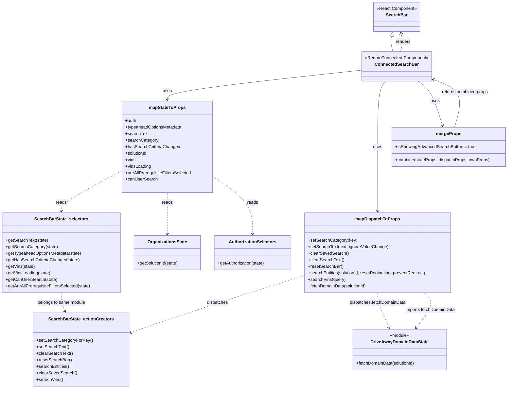

# Diagram: web/portal/src/pages/driveaway/components/search/DriveAway.SearchBar.container.js

> Auto-generated by Obscura crawlers

## Mermaid

### SVG

<svg id="container" width="1864.40234375" xmlns="http://www.w3.org/2000/svg" class="classDiagram" height="1428" viewBox="0 0 1864.40234375 1428" role="graphics-document document" aria-roledescription="class"><g><defs><marker id="container_class-aggregationStart" class="marker aggregation class" refX="18" refY="7" markerWidth="190" markerHeight="240" orient="auto"><path d="M 18,7 L9,13 L1,7 L9,1 Z"></path></marker></defs><defs><marker id="container_class-aggregationEnd" class="marker aggregation class" refX="1" refY="7" markerWidth="20" markerHeight="28" orient="auto"><path d="M 18,7 L9,13 L1,7 L9,1 Z"></path></marker></defs><defs><marker id="container_class-extensionStart" class="marker extension class" refX="18" refY="7" markerWidth="190" markerHeight="240" orient="auto"><path d="M 1,7 L18,13 V 1 Z"></path></marker></defs><defs><marker id="container_class-extensionEnd" class="marker extension class" refX="1" refY="7" markerWidth="20" markerHeight="28" orient="auto"><path d="M 1,1 V 13 L18,7 Z"></path></marker></defs><defs><marker id="container_class-compositionStart" class="marker composition class" refX="18" refY="7" markerWidth="190" markerHeight="240" orient="auto"><path d="M 18,7 L9,13 L1,7 L9,1 Z"></path></marker></defs><defs><marker id="container_class-compositionEnd" class="marker composition class" refX="1" refY="7" markerWidth="20" markerHeight="28" orient="auto"><path d="M 18,7 L9,13 L1,7 L9,1 Z"></path></marker></defs><defs><marker id="container_class-dependencyStart" class="marker dependency class" refX="6" refY="7" markerWidth="190" markerHeight="240" orient="auto"><path d="M 5,7 L9,13 L1,7 L9,1 Z"></path></marker></defs><defs><marker id="container_class-dependencyEnd" class="marker dependency class" refX="13" refY="7" markerWidth="20" markerHeight="28" orient="auto"><path d="M 18,7 L9,13 L14,7 L9,1 Z"></path></marker></defs><defs><marker id="container_class-lollipopStart" class="marker lollipop class" refX="13" refY="7" markerWidth="190" markerHeight="240" orient="auto"><circle stroke="black" fill="transparent" cx="7" cy="7" r="6"></circle></marker></defs><defs><marker id="container_class-lollipopEnd" class="marker lollipop class" refX="1" refY="7" markerWidth="190" markerHeight="240" orient="auto"><circle stroke="black" fill="transparent" cx="7" cy="7" r="6"></circle></marker></defs><g class="root"><g class="clusters"></g><g class="edgePaths"><path d="M1437.994,132.685L1437.106,136.071C1436.217,139.457,1434.441,146.228,1435.17,155.781C1435.9,165.333,1439.136,177.667,1440.754,183.833L1442.371,190" id="id_SearchBar_ConnectedSearchBar_1" class="edge-thickness-normal edge-pattern-solid relation" style=";;;" data-edge="true" data-et="edge" data-id="id_SearchBar_ConnectedSearchBar_1" data-points="W3sieCI6MTQ0Mi4zNzE0ODAwODI0MTc1LCJ5IjoxMTZ9LHsieCI6MTQzMi42NjQwNjI1LCJ5IjoxNTN9LHsieCI6MTQ0Mi4zNzE0ODAwODI0MTc1LCJ5IjoxOTB9XQ==" marker-start="url(#container_class-extensionStart)"></path><path d="M1328.406,257.808L1209.025,270.674C1089.645,283.539,850.883,309.269,731.502,327.301C612.121,345.333,612.121,355.667,612.121,360.833L612.121,366" id="id_ConnectedSearchBar_mapStateToProps_2" class="edge-thickness-normal edge-pattern-solid relation" style=";;;" data-edge="true" data-et="edge" data-id="id_ConnectedSearchBar_mapStateToProps_2" data-points="W3sieCI6MTMyOC40MDYyNSwieSI6MjU3LjgwODQyOTQzNzgwNjJ9LHsieCI6NjEyLjEyMTA5Mzc1LCJ5IjozMzV9LHsieCI6NjEyLjEyMTA5Mzc1LCJ5IjozNzJ9XQ==" marker-end="url(#container_class-dependencyEnd)"></path><path d="M1416.231,298L1411.628,304.167C1407.025,310.333,1397.819,322.667,1393.216,363C1388.613,403.333,1388.613,471.667,1388.613,540C1388.613,608.333,1388.613,676.667,1388.613,716C1388.613,755.333,1388.613,765.667,1388.613,770.833L1388.613,776" id="id_ConnectedSearchBar_mapDispatchToProps_3" class="edge-thickness-normal edge-pattern-solid relation" style=";;;" data-edge="true" data-et="edge" data-id="id_ConnectedSearchBar_mapDispatchToProps_3" data-points="W3sieCI6MTQxNi4yMzE0NTYwNDM5NTYsInkiOjI5OH0seyJ4IjoxMzg4LjYxMzI4MTI1LCJ5IjozMzV9LHsieCI6MTM4OC42MTMyODEyNSwieSI6NTQwfSx7IngiOjEzODguNjEzMjgxMjUsInkiOjc0NX0seyJ4IjoxMzg4LjYxMzI4MTI1LCJ5Ijo3ODJ9XQ==" marker-end="url(#container_class-dependencyEnd)"></path><path d="M1533.575,298L1542.373,304.167C1551.17,310.333,1568.765,322.667,1583.966,350.043C1599.167,377.419,1611.974,419.837,1618.377,441.047L1624.781,462.256" id="id_ConnectedSearchBar_mergeProps_4" class="edge-thickness-normal edge-pattern-solid relation" style=";;;" data-edge="true" data-et="edge" data-id="id_ConnectedSearchBar_mergeProps_4" data-points="W3sieCI6MTUzMy41NzUyOTE4OTU2MDQzLCJ5IjoyOTh9LHsieCI6MTU4Ni4zNTkzNzUsInkiOjMzNX0seyJ4IjoxNjI2LjUxNTMzOTE3NjgyOTIsInkiOjQ2OH1d" marker-end="url(#container_class-dependencyEnd)"></path><path d="M446.141,627.556L409.034,647.13C371.927,666.704,297.714,705.852,260.607,730.593C223.5,755.333,223.5,765.667,223.5,770.833L223.5,776" id="id_mapStateToProps_SearchBarState_selectors_5" class="edge-thickness-normal edge-pattern-dashed relation" style=";;;" data-edge="true" data-et="edge" data-id="id_mapStateToProps_SearchBarState_selectors_5" data-points="W3sieCI6NDQ2LjE0MDYyNSwieSI6NjI3LjU1NTcxMDc5NjM4NTV9LHsieCI6MjIzLjUsInkiOjc0NX0seyJ4IjoyMjMuNSwieSI6NzgyfV0=" marker-end="url(#container_class-dependencyEnd)"></path><path d="M612.121,708L612.121,714.167C612.121,720.333,612.121,732.667,612.121,758C612.121,783.333,612.121,821.667,612.121,840.833L612.121,860" id="id_mapStateToProps_OrganizationsState_6" class="edge-thickness-normal edge-pattern-dashed relation" style=";;;" data-edge="true" data-et="edge" data-id="id_mapStateToProps_OrganizationsState_6" data-points="W3sieCI6NjEyLjEyMTA5Mzc1LCJ5Ijo3MDh9LHsieCI6NjEyLjEyMTA5Mzc1LCJ5Ijo3NDV9LHsieCI6NjEyLjEyMTA5Mzc1LCJ5Ijo4NjZ9XQ==" marker-end="url(#container_class-dependencyEnd)"></path><path d="M778.102,648.146L802.876,664.289C827.651,680.431,877.201,712.715,901.975,748.024C926.75,783.333,926.75,821.667,926.75,840.833L926.75,860" id="id_mapStateToProps_AuthorizationSelectors_7" class="edge-thickness-normal edge-pattern-dashed relation" style=";;;" data-edge="true" data-et="edge" data-id="id_mapStateToProps_AuthorizationSelectors_7" data-points="W3sieCI6Nzc4LjEwMTU2MjUsInkiOjY0OC4xNDY0Mzk4NzgzMjg5fSx7IngiOjkyNi43NSwieSI6NzQ1fSx7IngiOjkyNi43NSwieSI6ODY2fV0=" marker-end="url(#container_class-dependencyEnd)"></path><path d="M1118.258,1013.339L1065.013,1029.949C1011.768,1046.559,905.277,1079.78,797.704,1115.039C690.13,1150.299,581.473,1187.598,527.144,1206.247L472.816,1224.897" id="id_mapDispatchToProps_SearchBarState_actionCreators_8" class="edge-thickness-normal edge-pattern-dashed relation" style=";;;" data-edge="true" data-et="edge" data-id="id_mapDispatchToProps_SearchBarState_actionCreators_8" data-points="W3sieCI6MTExOC4yNTc4MTI1LCJ5IjoxMDEzLjMzOTA5NjE5ODIzMTF9LHsieCI6Nzk4Ljc4NzEwOTM3NSwieSI6MTExM30seyJ4Ijo0NjcuMTQwNjI1LCJ5IjoxMjI2Ljg0NDkxNDg4NzU2Mjd9XQ==" marker-end="url(#container_class-dependencyEnd)"></path><path d="M1388.613,1076L1388.613,1082.167C1388.613,1088.333,1388.613,1100.667,1395.845,1122.096C1403.077,1143.526,1417.541,1174.052,1424.772,1189.315L1432.004,1204.578" id="id_mapDispatchToProps_DriveAwayDomainDataState_9" class="edge-thickness-normal edge-pattern-dashed relation" style=";;;" data-edge="true" data-et="edge" data-id="id_mapDispatchToProps_DriveAwayDomainDataState_9" data-points="W3sieCI6MTM4OC42MTMyODEyNSwieSI6MTA3Nn0seyJ4IjoxMzg4LjYxMzI4MTI1LCJ5IjoxMTEzfSx7IngiOjE0MzQuNTczMjg3NjA5MDExNywieSI6MTIxMH1d" marker-end="url(#container_class-dependencyEnd)"></path><path d="M1561.984,1076L1569.257,1082.167C1576.529,1088.333,1591.075,1100.667,1586.23,1122.215C1581.385,1143.762,1557.148,1174.525,1545.03,1189.906L1532.912,1205.287" id="id_mapDispatchToProps_DriveAwayDomainDataState_10" class="edge-thickness-normal edge-pattern-dashed relation" style=";;;" data-edge="true" data-et="edge" data-id="id_mapDispatchToProps_DriveAwayDomainDataState_10" data-points="W3sieCI6MTU2MS45ODM2NTMxOTI5MzQ4LCJ5IjoxMDc2fSx7IngiOjE2MDUuNjIxMDkzNzUsInkiOjExMTN9LHsieCI6MTUyOS4xOTg3ODcyNDU2Mzk2LCJ5IjoxMjEwfV0=" marker-end="url(#container_class-dependencyEnd)"></path><path d="M223.5,1076L223.5,1082.167C223.5,1088.333,223.5,1100.667,225.765,1112.082C228.03,1123.497,232.56,1133.994,234.825,1139.243L237.09,1144.491" id="id_SearchBarState_selectors_SearchBarState_actionCreators_11" class="edge-thickness-normal edge-pattern-dashed relation" style=";;;" data-edge="true" data-et="edge" data-id="id_SearchBarState_selectors_SearchBarState_actionCreators_11" data-points="W3sieCI6MjIzLjUsInkiOjEwNzZ9LHsieCI6MjIzLjUsInkiOjExMTN9LHsieCI6MjM5LjQ2NzM0MTkzMzEzOTU1LCJ5IjoxMTUwfV0=" marker-end="url(#container_class-dependencyEnd)"></path><path d="M1470.707,190L1472.325,183.833C1473.942,177.667,1477.178,165.333,1477.432,153.967C1477.686,142.601,1474.958,132.202,1473.593,127.003L1472.229,121.804" id="id_ConnectedSearchBar_SearchBar_12" class="edge-thickness-normal edge-pattern-solid relation" style=";;;" data-edge="true" data-et="edge" data-id="id_ConnectedSearchBar_SearchBar_12" data-points="W3sieCI6MTQ3MC43MDY2NDQ5MTc1ODI1LCJ5IjoxOTB9LHsieCI6MTQ4MC40MTQwNjI1LCJ5IjoxNTN9LHsieCI6MTQ3MC43MDY2NDQ5MTc1ODI1LCJ5IjoxMTZ9XQ==" marker-end="url(#container_class-dependencyEnd)"></path><path d="M1669.992,468L1676.685,445.833C1683.378,423.667,1696.763,379.333,1683.484,350C1670.205,320.668,1630.262,306.335,1610.291,299.169L1590.319,292.003" id="id_mergeProps_ConnectedSearchBar_13" class="edge-thickness-normal edge-pattern-solid relation" style=";;;" data-edge="true" data-et="edge" data-id="id_mergeProps_ConnectedSearchBar_13" data-points="W3sieCI6MTY2OS45OTI0NzMzMjMxNzA4LCJ5Ijo0Njh9LHsieCI6MTcxMC4xNDg0Mzc1LCJ5IjozMzV9LHsieCI6MTU4NC42NzE4NzUsInkiOjI4OS45NzY1NTcyMDUzNDc4fV0=" marker-end="url(#container_class-dependencyEnd)"></path></g><g class="edgeLabels"><g class="edgeLabel"><g class="label" data-id="id_SearchBar_ConnectedSearchBar_1" transform="translate(0, 0)"><foreignObject width="0" height="0">

</foreignObject></g></g><g class="edgeLabel" transform="translate(612.12109375, 335)"><g class="label" data-id="id_ConnectedSearchBar_mapStateToProps_2" transform="translate(-16.4921875, -12)"><foreignObject width="32.984375" height="24">

uses

</foreignObject></g></g><g class="edgeLabel" transform="translate(1388.61328125, 540)"><g class="label" data-id="id_ConnectedSearchBar_mapDispatchToProps_3" transform="translate(-16.4921875, -12)"><foreignObject width="32.984375" height="24">

uses

</foreignObject></g></g><g class="edgeLabel" transform="translate(1597.1216, 370.6454)"><g class="label" data-id="id_ConnectedSearchBar_mergeProps_4" transform="translate(-16.4921875, -12)"><foreignObject width="32.984375" height="24">

uses

</foreignObject></g></g><g class="edgeLabel" transform="translate(223.5, 745)"><g class="label" data-id="id_mapStateToProps_SearchBarState_selectors_5" transform="translate(-20.0078125, -12)"><foreignObject width="40.015625" height="24">

reads

</foreignObject></g></g><g class="edgeLabel" transform="translate(612.12109375, 745)"><g class="label" data-id="id_mapStateToProps_OrganizationsState_6" transform="translate(-20.0078125, -12)"><foreignObject width="40.015625" height="24">

reads

</foreignObject></g></g><g class="edgeLabel" transform="translate(926.75, 745)"><g class="label" data-id="id_mapStateToProps_AuthorizationSelectors_7" transform="translate(-20.0078125, -12)"><foreignObject width="40.015625" height="24">

reads

</foreignObject></g></g><g class="edgeLabel" transform="translate(791.22639, 1115.59538)"><g class="label" data-id="id_mapDispatchToProps_SearchBarState_actionCreators_8" transform="translate(-39.1796875, -12)"><foreignObject width="78.359375" height="24">

dispatches

</foreignObject></g></g><g class="edgeLabel" transform="translate(1388.61328125, 1113)"><g class="label" data-id="id_mapDispatchToProps_DriveAwayDomainDataState_9" transform="translate(-103.8125, -12)"><foreignObject width="207.625" height="24">

dispatches.fetchDomainData

</foreignObject></g></g><g class="edgeLabel" transform="translate(1585.11316, 1139.02996)"><g class="label" data-id="id_mapDispatchToProps_DriveAwayDomainDataState_10" transform="translate(-93.1953125, -12)"><foreignObject width="186.390625" height="24">

imports fetchDomainData

</foreignObject></g></g><g class="edgeLabel" transform="translate(223.5, 1113)"><g class="label" data-id="id_SearchBarState_selectors_SearchBarState_actionCreators_11" transform="translate(-89.2734375, -12)"><foreignObject width="178.546875" height="24">

belongs to same module

</foreignObject></g></g><g class="edgeLabel" transform="translate(1480.4140625, 153)"><g class="label" data-id="id_ConnectedSearchBar_SearchBar_12" transform="translate(-27.75, -12)"><foreignObject width="55.5" height="24">

renders

</foreignObject></g></g><g class="edgeLabel" transform="translate(1709.33622, 337.69013)"><g class="label" data-id="id_mergeProps_ConnectedSearchBar_13" transform="translate(-87.296875, -12)"><foreignObject width="174.59375" height="24">

returns combined props

</foreignObject></g></g></g><g class="nodes"><g class="node default" id="classId-SearchBar-0" transform="translate(1456.5390625, 62)"><g class="basic label-container"><path d="M-85.2109375 -54 L85.2109375 -54 L85.2109375 54 L-85.2109375 54" stroke="none" stroke-width="0" fill="#ECECFF" style=""></path><path d="M-85.2109375 -54 C-33.75412576640703 -54, 17.702685967185943 -54, 85.2109375 -54 M-85.2109375 -54 C-27.26703517884181 -54, 30.676867142316382 -54, 85.2109375 -54 M85.2109375 -54 C85.2109375 -31.485100107267805, 85.2109375 -8.970200214535609, 85.2109375 54 M85.2109375 -54 C85.2109375 -24.838139454417302, 85.2109375 4.323721091165396, 85.2109375 54 M85.2109375 54 C39.747830711129545 54, -5.71527607774091 54, -85.2109375 54 M85.2109375 54 C26.43819558590394 54, -32.33454632819212 54, -85.2109375 54 M-85.2109375 54 C-85.2109375 15.848740886173587, -85.2109375 -22.302518227652826, -85.2109375 -54 M-85.2109375 54 C-85.2109375 19.543422251792826, -85.2109375 -14.913155496414348, -85.2109375 -54" stroke="#9370DB" stroke-width="1.3" fill="none" stroke-dasharray="0 0" style=""></path></g><g class="annotation-group text" transform="translate(-73.2109375, -30)"><g class="label" style="" transform="translate(0,-12)"><foreignObject width="146.421875" height="24">

«React Component»

</foreignObject></g></g><g class="label-group text" transform="translate(-37.2421875, -6)"><g class="label" style="font-weight: bolder" transform="translate(0,-12)"><foreignObject width="74.484375" height="24">

SearchBar

</foreignObject></g></g><g class="members-group text" transform="translate(-73.2109375, 42)"></g><g class="methods-group text" transform="translate(-73.2109375, 72)"></g><g class="divider" style=""><path d="M-85.2109375 18 C-27.06188745233804 18, 31.087162595323917 18, 85.2109375 18 M-85.2109375 18 C-27.010931469134277 18, 31.189074561731445 18, 85.2109375 18" stroke="#9370DB" stroke-width="1.3" fill="none" stroke-dasharray="0 0" style=""></path></g><g class="divider" style=""><path d="M-85.2109375 36 C-20.4349981106068 36, 44.3409412787864 36, 85.2109375 36 M-85.2109375 36 C-19.682800954498376 36, 45.84533559100325 36, 85.2109375 36" stroke="#9370DB" stroke-width="1.3" fill="none" stroke-dasharray="0 0" style=""></path></g></g><g class="node default" id="classId-ConnectedSearchBar-1" transform="translate(1456.5390625, 244)"><g class="basic label-container"><path d="M-128.1328125 -54 L128.1328125 -54 L128.1328125 54 L-128.1328125 54" stroke="none" stroke-width="0" fill="#ECECFF" style=""></path><path d="M-128.1328125 -54 C-47.9615732460603 -54, 32.209666007879406 -54, 128.1328125 -54 M-128.1328125 -54 C-45.45633775313114 -54, 37.220136993737725 -54, 128.1328125 -54 M128.1328125 -54 C128.1328125 -14.220322218546002, 128.1328125 25.559355562907996, 128.1328125 54 M128.1328125 -54 C128.1328125 -24.636025187115997, 128.1328125 4.727949625768005, 128.1328125 54 M128.1328125 54 C31.09474380493029 54, -65.94332489013942 54, -128.1328125 54 M128.1328125 54 C38.550104427774826 54, -51.03260364445035 54, -128.1328125 54 M-128.1328125 54 C-128.1328125 11.254677963516272, -128.1328125 -31.490644072967456, -128.1328125 -54 M-128.1328125 54 C-128.1328125 26.62056304257363, -128.1328125 -0.7588739148527424, -128.1328125 -54" stroke="#9370DB" stroke-width="1.3" fill="none" stroke-dasharray="0 0" style=""></path></g><g class="annotation-group text" transform="translate(-116.1328125, -30)"><g class="label" style="" transform="translate(0,-12)"><foreignObject width="232.265625" height="24">

«Redux Connected Component»

</foreignObject></g></g><g class="label-group text" transform="translate(-75.9921875, -6)"><g class="label" style="font-weight: bolder" transform="translate(0,-12)"><foreignObject width="151.984375" height="24">

ConnectedSearchBar

</foreignObject></g></g><g class="members-group text" transform="translate(-116.1328125, 42)"></g><g class="methods-group text" transform="translate(-116.1328125, 72)"></g><g class="divider" style=""><path d="M-128.1328125 18 C-66.61440599104195 18, -5.095999482083897 18, 128.1328125 18 M-128.1328125 18 C-46.94990158083081 18, 34.23300933833838 18, 128.1328125 18" stroke="#9370DB" stroke-width="1.3" fill="none" stroke-dasharray="0 0" style=""></path></g><g class="divider" style=""><path d="M-128.1328125 36 C-50.150416218326086 36, 27.831980063347828 36, 128.1328125 36 M-128.1328125 36 C-35.438073410136155 36, 57.25666567972769 36, 128.1328125 36" stroke="#9370DB" stroke-width="1.3" fill="none" stroke-dasharray="0 0" style=""></path></g></g><g class="node default" id="classId-mapStateToProps-2" transform="translate(612.12109375, 540)"><g class="basic label-container"><path d="M-165.98046875 -168 L165.98046875 -168 L165.98046875 168 L-165.98046875 168" stroke="none" stroke-width="0" fill="#ECECFF" style=""></path><path d="M-165.98046875 -168 C-49.52021235088314 -168, 66.94004404823372 -168, 165.98046875 -168 M-165.98046875 -168 C-43.85082537496636 -168, 78.27881800006728 -168, 165.98046875 -168 M165.98046875 -168 C165.98046875 -50.33706613666821, 165.98046875 67.32586772666357, 165.98046875 168 M165.98046875 -168 C165.98046875 -80.65516287738049, 165.98046875 6.6896742452390185, 165.98046875 168 M165.98046875 168 C34.45855192487045 168, -97.0633649002591 168, -165.98046875 168 M165.98046875 168 C75.14817480845507 168, -15.684119133089865 168, -165.98046875 168 M-165.98046875 168 C-165.98046875 43.406694045609584, -165.98046875 -81.18661190878083, -165.98046875 -168 M-165.98046875 168 C-165.98046875 70.47144114954084, -165.98046875 -27.057117700918326, -165.98046875 -168" stroke="#9370DB" stroke-width="1.3" fill="none" stroke-dasharray="0 0" style=""></path></g><g class="annotation-group text" transform="translate(0, -144)"></g><g class="label-group text" transform="translate(-64.7109375, -144)"><g class="label" style="font-weight: bolder" transform="translate(0,-12)"><foreignObject width="129.421875" height="24">

mapStateToProps

</foreignObject></g></g><g class="members-group text" transform="translate(-153.98046875, -96)"><g class="label" style="" transform="translate(0,-12)"><foreignObject width="40.921875" height="24">

+auth

</foreignObject></g><g class="label" style="" transform="translate(0,12)"><foreignObject width="209.6875" height="24">

+typeaheadOptionsMetadata

</foreignObject></g><g class="label" style="" transform="translate(0,36)"><foreignObject width="84.953125" height="24">

+searchText

</foreignObject></g><g class="label" style="" transform="translate(0,60)"><foreignObject width="118.65625" height="24">

+searchCategory

</foreignObject></g><g class="label" style="" transform="translate(0,84)"><foreignObject width="197.75" height="24">

+hasSearchCriteriaChanged

</foreignObject></g><g class="label" style="" transform="translate(0,108)"><foreignObject width="82.109375" height="24">

+solutionId

</foreignObject></g><g class="label" style="" transform="translate(0,132)"><foreignObject width="37.0625" height="24">

+vins

</foreignObject></g><g class="label" style="" transform="translate(0,156)"><foreignObject width="94.296875" height="24">

+vinsLoading

</foreignObject></g><g class="label" style="" transform="translate(0,180)"><foreignObject width="243.25" height="24">

+areAllPrerequisiteFiltersSelected

</foreignObject></g><g class="label" style="" transform="translate(0,204)"><foreignObject width="115.140625" height="24">

+canUserSearch

</foreignObject></g></g><g class="methods-group text" transform="translate(-153.98046875, 168)"></g><g class="divider" style=""><path d="M-165.98046875 -120 C-51.585693457764236 -120, 62.80908183447153 -120, 165.98046875 -120 M-165.98046875 -120 C-81.5281506287972 -120, 2.924167492405587 -120, 165.98046875 -120" stroke="#9370DB" stroke-width="1.3" fill="none" stroke-dasharray="0 0" style=""></path></g><g class="divider" style=""><path d="M-165.98046875 144 C-65.84313366899814 144, 34.29420141200373 144, 165.98046875 144 M-165.98046875 144 C-37.07505384025944 144, 91.83036106948111 144, 165.98046875 144" stroke="#9370DB" stroke-width="1.3" fill="none" stroke-dasharray="0 0" style=""></path></g></g><g class="node default" id="classId-mapDispatchToProps-3" transform="translate(1388.61328125, 929)"><g class="basic label-container"><path d="M-270.35546875 -147 L270.35546875 -147 L270.35546875 147 L-270.35546875 147" stroke="none" stroke-width="0" fill="#ECECFF" style=""></path><path d="M-270.35546875 -147 C-67.52167801116798 -147, 135.31211272766404 -147, 270.35546875 -147 M-270.35546875 -147 C-76.51573839430057 -147, 117.32399196139886 -147, 270.35546875 -147 M270.35546875 -147 C270.35546875 -30.90040091615174, 270.35546875 85.19919816769652, 270.35546875 147 M270.35546875 -147 C270.35546875 -66.41970136188255, 270.35546875 14.16059727623491, 270.35546875 147 M270.35546875 147 C87.48397799937055 147, -95.3875127512589 147, -270.35546875 147 M270.35546875 147 C118.04055713280115 147, -34.27435448439769 147, -270.35546875 147 M-270.35546875 147 C-270.35546875 53.63956469069447, -270.35546875 -39.72087061861106, -270.35546875 -147 M-270.35546875 147 C-270.35546875 64.11523112074707, -270.35546875 -18.769537758505862, -270.35546875 -147" stroke="#9370DB" stroke-width="1.3" fill="none" stroke-dasharray="0 0" style=""></path></g><g class="annotation-group text" transform="translate(0, -123)"></g><g class="label-group text" transform="translate(-77.1953125, -123)"><g class="label" style="font-weight: bolder" transform="translate(0,-12)"><foreignObject width="154.390625" height="24">

mapDispatchToProps

</foreignObject></g></g><g class="members-group text" transform="translate(-258.35546875, -75)"></g><g class="methods-group text" transform="translate(-258.35546875, -45)"><g class="label" style="" transform="translate(0,-12)"><foreignObject width="176.828125" height="24">

+setSearchCategory(key)

</foreignObject></g><g class="label" style="" transform="translate(0,12)"><foreignObject width="292.859375" height="24">

+setSearchText(text, ignoreValueChange)

</foreignObject></g><g class="label" style="" transform="translate(0,36)"><foreignObject width="146.046875" height="24">

+clearSavedSearch()

</foreignObject></g><g class="label" style="" transform="translate(0,60)"><foreignObject width="132.265625" height="24">

+clearSearchText()

</foreignObject></g><g class="label" style="" transform="translate(0,84)"><foreignObject width="128.0625" height="24">

+resetSearchBar()

</foreignObject></g><g class="label" style="" transform="translate(0,108)"><foreignObject width="439.515625" height="24">

+searchEntities(solutionId, resetPagination, preventRedirect)

</foreignObject></g><g class="label" style="" transform="translate(0,132)"><foreignObject width="137.71875" height="24">

+searchVins(query)

</foreignObject></g><g class="label" style="" transform="translate(0,156)"><foreignObject width="217.875" height="24">

+fetchDomainData(solutionId)

</foreignObject></g></g><g class="divider" style=""><path d="M-270.35546875 -99 C-112.9497574350672 -99, 44.4559538798656 -99, 270.35546875 -99 M-270.35546875 -99 C-113.24514209288921 -99, 43.86518456422158 -99, 270.35546875 -99" stroke="#9370DB" stroke-width="1.3" fill="none" stroke-dasharray="0 0" style=""></path></g><g class="divider" style=""><path d="M-270.35546875 -75 C-155.68232620854914 -75, -41.009183667098284 -75, 270.35546875 -75 M-270.35546875 -75 C-128.33012355660364 -75, 13.695221636792724 -75, 270.35546875 -75" stroke="#9370DB" stroke-width="1.3" fill="none" stroke-dasharray="0 0" style=""></path></g></g><g class="node default" id="classId-mergeProps-4" transform="translate(1648.25390625, 540)"><g class="basic label-container"><path d="M-208.1484375 -72 L208.1484375 -72 L208.1484375 72 L-208.1484375 72" stroke="none" stroke-width="0" fill="#ECECFF" style=""></path><path d="M-208.1484375 -72 C-108.60937076172259 -72, -9.070304023445175 -72, 208.1484375 -72 M-208.1484375 -72 C-72.00904799736031 -72, 64.13034150527938 -72, 208.1484375 -72 M208.1484375 -72 C208.1484375 -41.9167089330939, 208.1484375 -11.833417866187801, 208.1484375 72 M208.1484375 -72 C208.1484375 -29.440252123935743, 208.1484375 13.119495752128515, 208.1484375 72 M208.1484375 72 C84.52232221980816 72, -39.10379306038368 72, -208.1484375 72 M208.1484375 72 C90.83815689916968 72, -26.47212370166065 72, -208.1484375 72 M-208.1484375 72 C-208.1484375 27.24234534307609, -208.1484375 -17.515309313847823, -208.1484375 -72 M-208.1484375 72 C-208.1484375 35.95666934915745, -208.1484375 -0.08666130168509767, -208.1484375 -72" stroke="#9370DB" stroke-width="1.3" fill="none" stroke-dasharray="0 0" style=""></path></g><g class="annotation-group text" transform="translate(0, -48)"></g><g class="label-group text" transform="translate(-43.859375, -48)"><g class="label" style="font-weight: bolder" transform="translate(0,-12)"><foreignObject width="87.71875" height="24">

mergeProps

</foreignObject></g></g><g class="members-group text" transform="translate(-196.1484375, 0)"><g class="label" style="" transform="translate(0,-12)"><foreignObject width="295.390625" height="24">

+isShowingAdvancedSearchButton = true

</foreignObject></g></g><g class="methods-group text" transform="translate(-196.1484375, 48)"><g class="label" style="" transform="translate(0,-12)"><foreignObject width="348.4375" height="24">

+combine(stateProps, dispatchProps, ownProps)

</foreignObject></g></g><g class="divider" style=""><path d="M-208.1484375 -24 C-104.78454707806497 -24, -1.4206566561299496 -24, 208.1484375 -24 M-208.1484375 -24 C-91.78985791588805 -24, 24.5687216682239 -24, 208.1484375 -24" stroke="#9370DB" stroke-width="1.3" fill="none" stroke-dasharray="0 0" style=""></path></g><g class="divider" style=""><path d="M-208.1484375 24 C-80.46027420707163 24, 47.22788908585673 24, 208.1484375 24 M-208.1484375 24 C-113.80602385498166 24, -19.46361020996332 24, 208.1484375 24" stroke="#9370DB" stroke-width="1.3" fill="none" stroke-dasharray="0 0" style=""></path></g></g><g class="node default" id="classId-SearchBarState_selectors-5" transform="translate(223.5, 929)"><g class="basic label-container"><path d="M-215.5 -147 L215.5 -147 L215.5 147 L-215.5 147" stroke="none" stroke-width="0" fill="#ECECFF" style=""></path><path d="M-215.5 -147 C-119.53151149034294 -147, -23.563022980685872 -147, 215.5 -147 M-215.5 -147 C-114.65922638132957 -147, -13.818452762659149 -147, 215.5 -147 M215.5 -147 C215.5 -30.1047100213093, 215.5 86.7905799573814, 215.5 147 M215.5 -147 C215.5 -31.765755218986612, 215.5 83.46848956202678, 215.5 147 M215.5 147 C73.79458604991908 147, -67.91082790016185 147, -215.5 147 M215.5 147 C61.07373606019027 147, -93.35252787961946 147, -215.5 147 M-215.5 147 C-215.5 56.40645817177044, -215.5 -34.18708365645912, -215.5 -147 M-215.5 147 C-215.5 41.925188040081665, -215.5 -63.14962391983667, -215.5 -147" stroke="#9370DB" stroke-width="1.3" fill="none" stroke-dasharray="0 0" style=""></path></g><g class="annotation-group text" transform="translate(0, -123)"></g><g class="label-group text" transform="translate(-94.015625, -123)"><g class="label" style="font-weight: bolder" transform="translate(0,-12)"><foreignObject width="188.03125" height="24">

SearchBarState_selectors

</foreignObject></g></g><g class="members-group text" transform="translate(-203.5, -75)"></g><g class="methods-group text" transform="translate(-203.5, -45)"><g class="label" style="" transform="translate(0,-12)"><foreignObject width="155.21875" height="24">

+getSearchText(state)

</foreignObject></g><g class="label" style="" transform="translate(0,12)"><foreignObject width="188.9375" height="24">

+getSearchCategory(state)

</foreignObject></g><g class="label" style="" transform="translate(0,36)"><foreignObject width="280.734375" height="24">

+getTypeaheadOptionsMetadata(state)

</foreignObject></g><g class="label" style="" transform="translate(0,60)"><foreignObject width="268.28125" height="24">

+getHasSearchCriteriaChanged(state)

</foreignObject></g><g class="label" style="" transform="translate(0,84)"><foreignObject width="107.265625" height="24">

+getVins(state)

</foreignObject></g><g class="label" style="" transform="translate(0,108)"><foreignObject width="164.5" height="24">

+getVinsLoading(state)

</foreignObject></g><g class="label" style="" transform="translate(0,132)"><foreignObject width="185.484375" height="24">

+getCanUserSearch(state)

</foreignObject></g><g class="label" style="" transform="translate(0,156)"><foreignObject width="312.984375" height="24">

+getAreAllPrerequisiteFiltersSelected(state)

</foreignObject></g></g><g class="divider" style=""><path d="M-215.5 -99 C-96.62499935123505 -99, 22.250001297529906 -99, 215.5 -99 M-215.5 -99 C-120.60601545352951 -99, -25.712030907059017 -99, 215.5 -99" stroke="#9370DB" stroke-width="1.3" fill="none" stroke-dasharray="0 0" style=""></path></g><g class="divider" style=""><path d="M-215.5 -75 C-86.84195082473721 -75, 41.81609835052558 -75, 215.5 -75 M-215.5 -75 C-109.17361270145356 -75, -2.847225402907128 -75, 215.5 -75" stroke="#9370DB" stroke-width="1.3" fill="none" stroke-dasharray="0 0" style=""></path></g></g><g class="node default" id="classId-SearchBarState_actionCreators-6" transform="translate(297.7265625, 1285)"><g class="basic label-container"><path d="M-169.4140625 -135 L169.4140625 -135 L169.4140625 135 L-169.4140625 135" stroke="none" stroke-width="0" fill="#ECECFF" style=""></path><path d="M-169.4140625 -135 C-37.058180312637006 -135, 95.29770187472599 -135, 169.4140625 -135 M-169.4140625 -135 C-56.753338276100436 -135, 55.90738594779913 -135, 169.4140625 -135 M169.4140625 -135 C169.4140625 -41.99809742248392, 169.4140625 51.003805155032154, 169.4140625 135 M169.4140625 -135 C169.4140625 -41.98652934035846, 169.4140625 51.02694131928308, 169.4140625 135 M169.4140625 135 C57.262272722596705 135, -54.88951705480659 135, -169.4140625 135 M169.4140625 135 C46.62888226962207 135, -76.15629796075586 135, -169.4140625 135 M-169.4140625 135 C-169.4140625 44.147156900598546, -169.4140625 -46.70568619880291, -169.4140625 -135 M-169.4140625 135 C-169.4140625 47.83381634806287, -169.4140625 -39.332367303874264, -169.4140625 -135" stroke="#9370DB" stroke-width="1.3" fill="none" stroke-dasharray="0 0" style=""></path></g><g class="annotation-group text" transform="translate(0, -111)"></g><g class="label-group text" transform="translate(-114.03125, -111)"><g class="label" style="font-weight: bolder" transform="translate(0,-12)"><foreignObject width="228.0625" height="24">

SearchBarState_actionCreators

</foreignObject></g></g><g class="members-group text" transform="translate(-157.4140625, -63)"></g><g class="methods-group text" transform="translate(-157.4140625, -33)"><g class="label" style="" transform="translate(0,-12)"><foreignObject width="200.796875" height="24">

+setSearchCategoryForKey()

</foreignObject></g><g class="label" style="" transform="translate(0,12)"><foreignObject width="118.53125" height="24">

+setSearchText()

</foreignObject></g><g class="label" style="" transform="translate(0,36)"><foreignObject width="132.265625" height="24">

+clearSearchText()

</foreignObject></g><g class="label" style="" transform="translate(0,60)"><foreignObject width="128.0625" height="24">

+resetSearchBar()

</foreignObject></g><g class="label" style="" transform="translate(0,84)"><foreignObject width="120.359375" height="24">

+searchEntities()

</foreignObject></g><g class="label" style="" transform="translate(0,108)"><foreignObject width="146.046875" height="24">

+clearSavedSearch()

</foreignObject></g><g class="label" style="" transform="translate(0,132)"><foreignObject width="96.078125" height="24">

+searchVins()

</foreignObject></g></g><g class="divider" style=""><path d="M-169.4140625 -87 C-87.29885181654042 -87, -5.18364113308084 -87, 169.4140625 -87 M-169.4140625 -87 C-93.3589957110992 -87, -17.303928922198395 -87, 169.4140625 -87" stroke="#9370DB" stroke-width="1.3" fill="none" stroke-dasharray="0 0" style=""></path></g><g class="divider" style=""><path d="M-169.4140625 -63 C-100.14350523629638 -63, -30.872947972592755 -63, 169.4140625 -63 M-169.4140625 -63 C-43.83134921233514 -63, 81.75136407532972 -63, 169.4140625 -63" stroke="#9370DB" stroke-width="1.3" fill="none" stroke-dasharray="0 0" style=""></path></g></g><g class="node default" id="classId-DriveAwayDomainDataState-7" transform="translate(1470.109375, 1285)"><g class="basic label-container"><path d="M-172.0546875 -75 L172.0546875 -75 L172.0546875 75 L-172.0546875 75" stroke="none" stroke-width="0" fill="#ECECFF" style=""></path><path d="M-172.0546875 -75 C-71.8222395867835 -75, 28.410208326433008 -75, 172.0546875 -75 M-172.0546875 -75 C-45.5375258761248 -75, 80.9796357477504 -75, 172.0546875 -75 M172.0546875 -75 C172.0546875 -25.715332245592954, 172.0546875 23.569335508814092, 172.0546875 75 M172.0546875 -75 C172.0546875 -27.213443020213, 172.0546875 20.573113959574002, 172.0546875 75 M172.0546875 75 C91.17073065655522 75, 10.286773813110443 75, -172.0546875 75 M172.0546875 75 C82.95004095279589 75, -6.154605594408224 75, -172.0546875 75 M-172.0546875 75 C-172.0546875 41.780724893764344, -172.0546875 8.561449787528687, -172.0546875 -75 M-172.0546875 75 C-172.0546875 37.55123515832774, -172.0546875 0.10247031665548434, -172.0546875 -75" stroke="#9370DB" stroke-width="1.3" fill="none" stroke-dasharray="0 0" style=""></path></g><g class="annotation-group text" transform="translate(-36.6015625, -51)"><g class="label" style="" transform="translate(0,-12)"><foreignObject width="73.203125" height="24">

«module»

</foreignObject></g></g><g class="label-group text" transform="translate(-102.234375, -27)"><g class="label" style="font-weight: bolder" transform="translate(0,-12)"><foreignObject width="204.46875" height="24">

DriveAwayDomainDataState

</foreignObject></g></g><g class="members-group text" transform="translate(-160.0546875, 21)"></g><g class="methods-group text" transform="translate(-160.0546875, 51)"><g class="label" style="" transform="translate(0,-12)"><foreignObject width="217.875" height="24">

+fetchDomainData(solutionId)

</foreignObject></g></g><g class="divider" style=""><path d="M-172.0546875 -3 C-100.73077459263335 -3, -29.406861685266705 -3, 172.0546875 -3 M-172.0546875 -3 C-61.2539598852013 -3, 49.546767729597406 -3, 172.0546875 -3" stroke="#9370DB" stroke-width="1.3" fill="none" stroke-dasharray="0 0" style=""></path></g><g class="divider" style=""><path d="M-172.0546875 21 C-71.7932500383439 21, 28.4681874233122 21, 172.0546875 21 M-172.0546875 21 C-88.26655948591215 21, -4.478431471824308 21, 172.0546875 21" stroke="#9370DB" stroke-width="1.3" fill="none" stroke-dasharray="0 0" style=""></path></g></g><g class="node default" id="classId-OrganizationsState-8" transform="translate(612.12109375, 929)"><g class="basic label-container"><path d="M-123.12109375 -63 L123.12109375 -63 L123.12109375 63 L-123.12109375 63" stroke="none" stroke-width="0" fill="#ECECFF" style=""></path><path d="M-123.12109375 -63 C-24.844927577761496 -63, 73.43123859447701 -63, 123.12109375 -63 M-123.12109375 -63 C-67.93715995330948 -63, -12.753226156618965 -63, 123.12109375 -63 M123.12109375 -63 C123.12109375 -32.79066900217413, 123.12109375 -2.581338004348254, 123.12109375 63 M123.12109375 -63 C123.12109375 -13.987157481672803, 123.12109375 35.025685036654394, 123.12109375 63 M123.12109375 63 C53.915587827127155 63, -15.28991809574569 63, -123.12109375 63 M123.12109375 63 C34.26984320759196 63, -54.58140733481608 63, -123.12109375 63 M-123.12109375 63 C-123.12109375 36.87882511094681, -123.12109375 10.757650221893627, -123.12109375 -63 M-123.12109375 63 C-123.12109375 24.73676949017424, -123.12109375 -13.52646101965152, -123.12109375 -63" stroke="#9370DB" stroke-width="1.3" fill="none" stroke-dasharray="0 0" style=""></path></g><g class="annotation-group text" transform="translate(0, -39)"></g><g class="label-group text" transform="translate(-69.8671875, -39)"><g class="label" style="font-weight: bolder" transform="translate(0,-12)"><foreignObject width="139.734375" height="24">

OrganizationsState

</foreignObject></g></g><g class="members-group text" transform="translate(-111.12109375, 9)"></g><g class="methods-group text" transform="translate(-111.12109375, 39)"><g class="label" style="" transform="translate(0,-12)"><foreignObject width="152.375" height="24">

+getSolutionId(state)

</foreignObject></g></g><g class="divider" style=""><path d="M-123.12109375 -15 C-30.39837760028425 -15, 62.3243385494315 -15, 123.12109375 -15 M-123.12109375 -15 C-53.12353041346016 -15, 16.87403292307968 -15, 123.12109375 -15" stroke="#9370DB" stroke-width="1.3" fill="none" stroke-dasharray="0 0" style=""></path></g><g class="divider" style=""><path d="M-123.12109375 9 C-29.411127933468947 9, 64.2988378830621 9, 123.12109375 9 M-123.12109375 9 C-53.18601973438531 9, 16.749054281229377 9, 123.12109375 9" stroke="#9370DB" stroke-width="1.3" fill="none" stroke-dasharray="0 0" style=""></path></g></g><g class="node default" id="classId-AuthorizationSelectors-9" transform="translate(926.75, 929)"><g class="basic label-container"><path d="M-141.5078125 -63 L141.5078125 -63 L141.5078125 63 L-141.5078125 63" stroke="none" stroke-width="0" fill="#ECECFF" style=""></path><path d="M-141.5078125 -63 C-39.42237170177437 -63, 62.66306909645127 -63, 141.5078125 -63 M-141.5078125 -63 C-41.47219747975659 -63, 58.563417540486824 -63, 141.5078125 -63 M141.5078125 -63 C141.5078125 -15.36342757211743, 141.5078125 32.27314485576514, 141.5078125 63 M141.5078125 -63 C141.5078125 -18.0779618161811, 141.5078125 26.844076367637797, 141.5078125 63 M141.5078125 63 C78.54830016232272 63, 15.588787824645436 63, -141.5078125 63 M141.5078125 63 C82.72918812702075 63, 23.950563754041497 63, -141.5078125 63 M-141.5078125 63 C-141.5078125 28.027343949726834, -141.5078125 -6.945312100546332, -141.5078125 -63 M-141.5078125 63 C-141.5078125 37.16579456939802, -141.5078125 11.331589138796033, -141.5078125 -63" stroke="#9370DB" stroke-width="1.3" fill="none" stroke-dasharray="0 0" style=""></path></g><g class="annotation-group text" transform="translate(0, -39)"></g><g class="label-group text" transform="translate(-83.875, -39)"><g class="label" style="font-weight: bolder" transform="translate(0,-12)"><foreignObject width="167.75" height="24">

AuthorizationSelectors

</foreignObject></g></g><g class="members-group text" transform="translate(-129.5078125, 9)"></g><g class="methods-group text" transform="translate(-129.5078125, 39)"><g class="label" style="" transform="translate(0,-12)"><foreignObject width="175.140625" height="24">

+getAuthorization(state)

</foreignObject></g></g><g class="divider" style=""><path d="M-141.5078125 -15 C-70.90545957921782 -15, -0.3031066584356381 -15, 141.5078125 -15 M-141.5078125 -15 C-64.55221712840769 -15, 12.40337824318462 -15, 141.5078125 -15" stroke="#9370DB" stroke-width="1.3" fill="none" stroke-dasharray="0 0" style=""></path></g><g class="divider" style=""><path d="M-141.5078125 9 C-79.86721094840155 9, -18.2266093968031 9, 141.5078125 9 M-141.5078125 9 C-62.175041863937025 9, 17.15772877212595 9, 141.5078125 9" stroke="#9370DB" stroke-width="1.3" fill="none" stroke-dasharray="0 0" style=""></path></g></g></g></g></g></svg>
