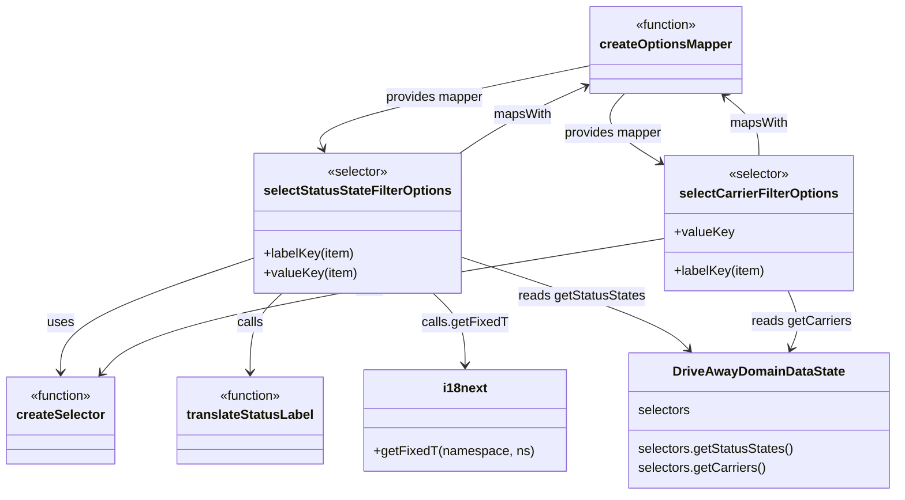

# Diagram: web/portal/src/pages/driveaway/components/search/DriveAway.SearchFilterSelectors.js

> Auto-generated by Obscura crawlers

## Mermaid

### SVG

<svg id="container" width="1089.640625" xmlns="http://www.w3.org/2000/svg" class="classDiagram" height="614" viewBox="0 0 1089.640625 614" role="graphics-document document" aria-roledescription="class"><g><defs><marker id="container_class-aggregationStart" class="marker aggregation class" refX="18" refY="7" markerWidth="190" markerHeight="240" orient="auto"><path d="M 18,7 L9,13 L1,7 L9,1 Z"></path></marker></defs><defs><marker id="container_class-aggregationEnd" class="marker aggregation class" refX="1" refY="7" markerWidth="20" markerHeight="28" orient="auto"><path d="M 18,7 L9,13 L1,7 L9,1 Z"></path></marker></defs><defs><marker id="container_class-extensionStart" class="marker extension class" refX="18" refY="7" markerWidth="190" markerHeight="240" orient="auto"><path d="M 1,7 L18,13 V 1 Z"></path></marker></defs><defs><marker id="container_class-extensionEnd" class="marker extension class" refX="1" refY="7" markerWidth="20" markerHeight="28" orient="auto"><path d="M 1,1 V 13 L18,7 Z"></path></marker></defs><defs><marker id="container_class-compositionStart" class="marker composition class" refX="18" refY="7" markerWidth="190" markerHeight="240" orient="auto"><path d="M 18,7 L9,13 L1,7 L9,1 Z"></path></marker></defs><defs><marker id="container_class-compositionEnd" class="marker composition class" refX="1" refY="7" markerWidth="20" markerHeight="28" orient="auto"><path d="M 18,7 L9,13 L1,7 L9,1 Z"></path></marker></defs><defs><marker id="container_class-dependencyStart" class="marker dependency class" refX="6" refY="7" markerWidth="190" markerHeight="240" orient="auto"><path d="M 5,7 L9,13 L1,7 L9,1 Z"></path></marker></defs><defs><marker id="container_class-dependencyEnd" class="marker dependency class" refX="13" refY="7" markerWidth="20" markerHeight="28" orient="auto"><path d="M 18,7 L9,13 L14,7 L9,1 Z"></path></marker></defs><defs><marker id="container_class-lollipopStart" class="marker lollipop class" refX="13" refY="7" markerWidth="190" markerHeight="240" orient="auto"><circle stroke="black" fill="transparent" cx="7" cy="7" r="6"></circle></marker></defs><defs><marker id="container_class-lollipopEnd" class="marker lollipop class" refX="1" refY="7" markerWidth="190" markerHeight="240" orient="auto"><circle stroke="black" fill="transparent" cx="7" cy="7" r="6"></circle></marker></defs><g class="root"><g class="clusters"></g><g class="edgePaths"><path d="M307.961,320.284L268.848,333.737C229.734,347.189,151.508,374.095,112.395,397.714C73.281,421.333,73.281,441.667,73.281,451.833L73.281,462" id="id_selectStatusStateFilterOptions_createSelector_1" class="edge-thickness-normal edge-pattern-solid relation" style=";;;" data-edge="true" data-et="edge" data-id="id_selectStatusStateFilterOptions_createSelector_1" data-points="W3sieCI6MzA3Ljk2MDkzNzUsInkiOjMyMC4yODQxMjE1NjY3MTU0NH0seyJ4Ijo3My4yODEyNSwieSI6NDAxfSx7IngiOjczLjI4MTI1LCJ5Ijo0Njh9XQ==" marker-end="url(#container_class-dependencyEnd)"></path><path d="M557.86,190L566.653,183.833C575.446,177.667,593.031,165.333,618.905,151.374C644.779,137.415,678.942,121.831,696.023,114.039L713.104,106.246" id="id_selectStatusStateFilterOptions_createOptionsMapper_2" class="edge-thickness-normal edge-pattern-solid relation" style=";;;" data-edge="true" data-et="edge" data-id="id_selectStatusStateFilterOptions_createOptionsMapper_2" data-points="W3sieCI6NTU3Ljg1OTc4NDUyNjIwOTYsInkiOjE5MH0seyJ4Ijo2MTAuNjE3MTg3NSwieSI6MTUzfSx7IngiOjcxOC41NjI1LCJ5IjoxMDMuNzU2MDAyMDM2NTgwMTF9XQ==" marker-end="url(#container_class-dependencyEnd)"></path><path d="M342.366,364L335.884,370.167C329.403,376.333,316.44,388.667,309.958,405C303.477,421.333,303.477,441.667,303.477,451.833L303.477,462" id="id_selectStatusStateFilterOptions_translateStatusLabel_3" class="edge-thickness-normal edge-pattern-solid relation" style=";;;" data-edge="true" data-et="edge" data-id="id_selectStatusStateFilterOptions_translateStatusLabel_3" data-points="W3sieCI6MzQyLjM2NTk1ODkyMTM3MSwieSI6MzY0fSx7IngiOjMwMy40NzY1NjI1LCJ5Ijo0MDF9LHsieCI6MzAzLjQ3NjU2MjUsInkiOjQ2OH1d" marker-end="url(#container_class-dependencyEnd)"></path><path d="M525.251,364L531.733,370.167C538.214,376.333,551.177,388.667,557.659,403.5C564.141,418.333,564.141,435.667,564.141,444.333L564.141,453" id="id_selectStatusStateFilterOptions_i18next_4" class="edge-thickness-normal edge-pattern-solid relation" style=";;;" data-edge="true" data-et="edge" data-id="id_selectStatusStateFilterOptions_i18next_4" data-points="W3sieCI6NTI1LjI1MTIyODU3ODYyOSwieSI6MzY0fSx7IngiOjU2NC4xNDA2MjUsInkiOjQwMX0seyJ4Ijo1NjQuMTQwNjI1LCJ5Ijo0NTl9XQ==" marker-end="url(#container_class-dependencyEnd)"></path><path d="M559.656,318.979L600.638,332.649C641.62,346.319,723.583,373.66,769.819,392.777C816.055,411.894,826.562,422.788,831.816,428.235L837.07,433.682" id="id_selectStatusStateFilterOptions_DriveAwayDomainDataState_5" class="edge-thickness-normal edge-pattern-solid relation" style=";;;" data-edge="true" data-et="edge" data-id="id_selectStatusStateFilterOptions_DriveAwayDomainDataState_5" data-points="W3sieCI6NTU5LjY1NjI1LCJ5IjozMTguOTc4NzUyNjkyNjkxNn0seyJ4Ijo4MDUuNTQ2ODc1LCJ5Ijo0MDF9LHsieCI6ODQxLjIzNTM0MzQ5MTczNTUsInkiOjQzOH1d" marker-end="url(#container_class-dependencyEnd)"></path><path d="M806.449,296.221L701.234,313.684C596.018,331.148,385.587,366.074,271.614,393.939C157.641,421.803,140.126,442.607,131.368,453.008L122.611,463.41" id="id_selectCarrierFilterOptions_createSelector_6" class="edge-thickness-normal edge-pattern-solid relation" style=";;;" data-edge="true" data-et="edge" data-id="id_selectCarrierFilterOptions_createSelector_6" data-points="W3sieCI6ODA2LjQ0OTIxODc1LCJ5IjoyOTYuMjIxMzAzMTYxMTc0OTR9LHsieCI6MTc1LjE1NjI1LCJ5Ijo0MDF9LHsieCI6MTE4Ljc0NjEyNjAzMzA1Nzg1LCJ5Ijo0Njh9XQ==" marker-end="url(#container_class-dependencyEnd)"></path><path d="M922.258,193L922.258,186.333C922.258,179.667,922.258,166.333,915.434,154.13C908.609,141.927,894.961,130.853,888.136,125.317L881.312,119.78" id="id_selectCarrierFilterOptions_createOptionsMapper_7" class="edge-thickness-normal edge-pattern-solid relation" style=";;;" data-edge="true" data-et="edge" data-id="id_selectCarrierFilterOptions_createOptionsMapper_7" data-points="W3sieCI6OTIyLjI1NzgxMjUsInkiOjE5M30seyJ4Ijo5MjIuMjU3ODEyNSwieSI6MTUzfSx7IngiOjg3Ni42NTI2NDQyMzA3NjkzLCJ5IjoxMTZ9XQ==" marker-end="url(#container_class-dependencyEnd)"></path><path d="M958.6,361L961.485,367.667C964.369,374.333,970.138,387.667,970.693,399.586C971.249,411.505,966.591,422.01,964.262,427.262L961.933,432.515" id="id_selectCarrierFilterOptions_DriveAwayDomainDataState_8" class="edge-thickness-normal edge-pattern-solid relation" style=";;;" data-edge="true" data-et="edge" data-id="id_selectCarrierFilterOptions_DriveAwayDomainDataState_8" data-points="W3sieCI6OTU4LjYwMDMwMjQxOTM1NDksInkiOjM2MX0seyJ4Ijo5NzUuOTA2MjUsInkiOjQwMX0seyJ4Ijo5NTkuNTAxMzU1ODg4NDI5OCwieSI6NDM4fV0=" marker-end="url(#container_class-dependencyEnd)"></path><path d="M718.563,81.141L661.292,93.118C604.022,105.094,489.482,129.047,434.71,146.287C379.939,163.527,384.936,174.053,387.435,179.316L389.933,184.58" id="id_createOptionsMapper_selectStatusStateFilterOptions_9" class="edge-thickness-normal edge-pattern-solid relation" style=";;;" data-edge="true" data-et="edge" data-id="id_createOptionsMapper_selectStatusStateFilterOptions_9" data-points="W3sieCI6NzE4LjU2MjUsInkiOjgxLjE0MTIxMzExNjgxNDMzfSx7IngiOjM3NC45NDE0MDYyNSwieSI6MTUzfSx7IngiOjM5Mi41MDY2MTU0MjMzODcxLCJ5IjoxOTB9XQ==" marker-end="url(#container_class-dependencyEnd)"></path><path d="M761.587,116L756.048,122.167C750.509,128.333,739.43,140.667,746.065,154.618C752.699,168.57,777.047,184.14,789.221,191.925L801.394,199.71" id="id_createOptionsMapper_selectCarrierFilterOptions_10" class="edge-thickness-normal edge-pattern-solid relation" style=";;;" data-edge="true" data-et="edge" data-id="id_createOptionsMapper_selectCarrierFilterOptions_10" data-points="W3sieCI6NzYxLjU4NzM5Njk3ODAyMiwieSI6MTE2fSx7IngiOjcyOC4zNTE1NjI1LCJ5IjoxNTN9LHsieCI6ODA2LjQ0OTIxODc1LCJ5IjoyMDIuOTQyMjI0MDEyODkyODR9XQ==" marker-end="url(#container_class-dependencyEnd)"></path></g><g class="edgeLabels"><g class="edgeLabel" transform="translate(73.28125, 401)"><g class="label" data-id="id_selectStatusStateFilterOptions_createSelector_1" transform="translate(-16.4921875, -12)"><foreignObject width="32.984375" height="24">

uses

</foreignObject></g></g><g class="edgeLabel" transform="translate(635.27667, 141.75049)"><g class="label" data-id="id_selectStatusStateFilterOptions_createOptionsMapper_2" transform="translate(-36.140625, -12)"><foreignObject width="72.28125" height="24">

mapsWith

</foreignObject></g></g><g class="edgeLabel" transform="translate(303.4765625, 401)"><g class="label" data-id="id_selectStatusStateFilterOptions_translateStatusLabel_3" transform="translate(-16.4453125, -12)"><foreignObject width="32.890625" height="24">

calls

</foreignObject></g></g><g class="edgeLabel" transform="translate(564.140625, 401)"><g class="label" data-id="id_selectStatusStateFilterOptions_i18next_4" transform="translate(-52.5546875, -12)"><foreignObject width="105.109375" height="24">

calls.getFixedT

</foreignObject></g></g><g class="edgeLabel" transform="translate(706.98427, 368.12267)"><g class="label" data-id="id_selectStatusStateFilterOptions_DriveAwayDomainDataState_5" transform="translate(-78.6328125, -12)"><foreignObject width="157.265625" height="24">

reads getStatusStates

</foreignObject></g></g><g class="edgeLabel" transform="translate(447.60133, 355.78099)"><g class="label" data-id="id_selectCarrierFilterOptions_createSelector_6" transform="translate(-16.4921875, -12)"><foreignObject width="32.984375" height="24">

uses

</foreignObject></g></g><g class="edgeLabel" transform="translate(922.2578125, 153)"><g class="label" data-id="id_selectCarrierFilterOptions_createOptionsMapper_7" transform="translate(-36.140625, -12)"><foreignObject width="72.28125" height="24">

mapsWith

</foreignObject></g></g><g class="edgeLabel" transform="translate(975.28889, 399.57307)"><g class="label" data-id="id_selectCarrierFilterOptions_DriveAwayDomainDataState_8" transform="translate(-61.6484375, -12)"><foreignObject width="123.296875" height="24">

reads getCarriers

</foreignObject></g></g><g class="edgeLabel" transform="translate(526.7067, 121.26251)"><g class="label" data-id="id_createOptionsMapper_selectStatusStateFilterOptions_9" transform="translate(-61.59375, -12)"><foreignObject width="123.1875" height="24">

provides mapper

</foreignObject></g></g><g class="edgeLabel" transform="translate(746.45009, 164.57372)"><g class="label" data-id="id_createOptionsMapper_selectCarrierFilterOptions_10" transform="translate(-61.59375, -12)"><foreignObject width="123.1875" height="24">

provides mapper

</foreignObject></g></g></g><g class="nodes"><g class="node default" id="classId-createSelector-0" transform="translate(73.28125, 522)"><g class="basic label-container"><path d="M-65.28125 -54 L65.28125 -54 L65.28125 54 L-65.28125 54" stroke="none" stroke-width="0" fill="#ECECFF" style=""></path><path d="M-65.28125 -54 C-39.04047572019222 -54, -12.799701440384432 -54, 65.28125 -54 M-65.28125 -54 C-20.721993916215453 -54, 23.837262167569094 -54, 65.28125 -54 M65.28125 -54 C65.28125 -30.22379921136368, 65.28125 -6.44759842272736, 65.28125 54 M65.28125 -54 C65.28125 -27.634991612707523, 65.28125 -1.2699832254150465, 65.28125 54 M65.28125 54 C18.326589463004936 54, -28.628071073990128 54, -65.28125 54 M65.28125 54 C14.954841801821956 54, -35.37156639635609 54, -65.28125 54 M-65.28125 54 C-65.28125 18.278444560531454, -65.28125 -17.44311087893709, -65.28125 -54 M-65.28125 54 C-65.28125 32.35994526044336, -65.28125 10.719890520886722, -65.28125 -54" stroke="#9370DB" stroke-width="1.3" fill="none" stroke-dasharray="0 0" style=""></path></g><g class="annotation-group text" transform="translate(-39.484375, -30)"><g class="label" style="" transform="translate(0,-12)"><foreignObject width="78.96875" height="24">

«function»

</foreignObject></g></g><g class="label-group text" transform="translate(-53.28125, -6)"><g class="label" style="font-weight: bolder" transform="translate(0,-12)"><foreignObject width="106.5625" height="24">

createSelector

</foreignObject></g></g><g class="members-group text" transform="translate(-53.28125, 42)"></g><g class="methods-group text" transform="translate(-53.28125, 72)"></g><g class="divider" style=""><path d="M-65.28125 18 C-38.03840653632223 18, -10.795563072644448 18, 65.28125 18 M-65.28125 18 C-15.834253506541465 18, 33.61274298691707 18, 65.28125 18" stroke="#9370DB" stroke-width="1.3" fill="none" stroke-dasharray="0 0" style=""></path></g><g class="divider" style=""><path d="M-65.28125 36 C-33.985970979073926 36, -2.690691958147845 36, 65.28125 36 M-65.28125 36 C-27.112668374888237 36, 11.055913250223526 36, 65.28125 36" stroke="#9370DB" stroke-width="1.3" fill="none" stroke-dasharray="0 0" style=""></path></g></g><g class="node default" id="classId-i18next-1" transform="translate(564.140625, 522)"><g class="basic label-container"><path d="M-122.2421875 -63 L122.2421875 -63 L122.2421875 63 L-122.2421875 63" stroke="none" stroke-width="0" fill="#ECECFF" style=""></path><path d="M-122.2421875 -63 C-67.77470867678917 -63, -13.307229853578349 -63, 122.2421875 -63 M-122.2421875 -63 C-57.72499084143418 -63, 6.792205817131645 -63, 122.2421875 -63 M122.2421875 -63 C122.2421875 -20.598718146548443, 122.2421875 21.802563706903115, 122.2421875 63 M122.2421875 -63 C122.2421875 -17.28307753925086, 122.2421875 28.433844921498277, 122.2421875 63 M122.2421875 63 C46.25185763061111 63, -29.738472238777774 63, -122.2421875 63 M122.2421875 63 C37.194467151846865 63, -47.85325319630627 63, -122.2421875 63 M-122.2421875 63 C-122.2421875 16.212956636485863, -122.2421875 -30.574086727028273, -122.2421875 -63 M-122.2421875 63 C-122.2421875 18.57951062746121, -122.2421875 -25.840978745077578, -122.2421875 -63" stroke="#9370DB" stroke-width="1.3" fill="none" stroke-dasharray="0 0" style=""></path></g><g class="annotation-group text" transform="translate(0, -39)"></g><g class="label-group text" transform="translate(-26.734375, -39)"><g class="label" style="font-weight: bolder" transform="translate(0,-12)"><foreignObject width="53.46875" height="24">

i18next

</foreignObject></g></g><g class="members-group text" transform="translate(-110.2421875, 9)"></g><g class="methods-group text" transform="translate(-110.2421875, 39)"><g class="label" style="" transform="translate(0,-12)"><foreignObject width="193.75" height="24">

+getFixedT(namespace, ns)

</foreignObject></g></g><g class="divider" style=""><path d="M-122.2421875 -15 C-55.22663746522282 -15, 11.788912569554356 -15, 122.2421875 -15 M-122.2421875 -15 C-63.58651034849826 -15, -4.930833196996517 -15, 122.2421875 -15" stroke="#9370DB" stroke-width="1.3" fill="none" stroke-dasharray="0 0" style=""></path></g><g class="divider" style=""><path d="M-122.2421875 9 C-64.84784322910232 9, -7.453498958204648 9, 122.2421875 9 M-122.2421875 9 C-56.57295514142149 9, 9.096277217157024 9, 122.2421875 9" stroke="#9370DB" stroke-width="1.3" fill="none" stroke-dasharray="0 0" style=""></path></g></g><g class="node default" id="classId-DriveAwayDomainDataState-2" transform="translate(922.2578125, 522)"><g class="basic label-container"><path d="M-159.3828125 -84 L159.3828125 -84 L159.3828125 84 L-159.3828125 84" stroke="none" stroke-width="0" fill="#ECECFF" style=""></path><path d="M-159.3828125 -84 C-94.9933168279725 -84, -30.603821155945013 -84, 159.3828125 -84 M-159.3828125 -84 C-91.04408157595337 -84, -22.70535065190674 -84, 159.3828125 -84 M159.3828125 -84 C159.3828125 -17.785637529544516, 159.3828125 48.42872494091097, 159.3828125 84 M159.3828125 -84 C159.3828125 -35.926061457645964, 159.3828125 12.147877084708071, 159.3828125 84 M159.3828125 84 C61.07127851329628 84, -37.240255473407444 84, -159.3828125 84 M159.3828125 84 C80.88445262884704 84, 2.3860927576940867 84, -159.3828125 84 M-159.3828125 84 C-159.3828125 36.64410696059711, -159.3828125 -10.711786078805787, -159.3828125 -84 M-159.3828125 84 C-159.3828125 37.311455953763335, -159.3828125 -9.377088092473329, -159.3828125 -84" stroke="#9370DB" stroke-width="1.3" fill="none" stroke-dasharray="0 0" style=""></path></g><g class="annotation-group text" transform="translate(0, -60)"></g><g class="label-group text" transform="translate(-102.234375, -60)"><g class="label" style="font-weight: bolder" transform="translate(0,-12)"><foreignObject width="204.46875" height="24">

DriveAwayDomainDataState

</foreignObject></g></g><g class="members-group text" transform="translate(-147.3828125, -12)"><g class="label" style="" transform="translate(0,-12)"><foreignObject width="65.46875" height="24">

selectors

</foreignObject></g></g><g class="methods-group text" transform="translate(-147.3828125, 36)"><g class="label" style="" transform="translate(0,-12)"><foreignObject width="192.53125" height="24">

selectors.getStatusStates()

</foreignObject></g><g class="label" style="" transform="translate(0,12)"><foreignObject width="158.5625" height="24">

selectors.getCarriers()

</foreignObject></g></g><g class="divider" style=""><path d="M-159.3828125 -36 C-89.26556175917138 -36, -19.148311018342753 -36, 159.3828125 -36 M-159.3828125 -36 C-50.672932722446205 -36, 58.03694705510759 -36, 159.3828125 -36" stroke="#9370DB" stroke-width="1.3" fill="none" stroke-dasharray="0 0" style=""></path></g><g class="divider" style=""><path d="M-159.3828125 12 C-68.19070647117084 12, 23.001399557658317 12, 159.3828125 12 M-159.3828125 12 C-68.36939091314608 12, 22.644030673707846 12, 159.3828125 12" stroke="#9370DB" stroke-width="1.3" fill="none" stroke-dasharray="0 0" style=""></path></g></g><g class="node default" id="classId-createOptionsMapper-3" transform="translate(810.09375, 62)"><g class="basic label-container"><path d="M-91.53125 -54 L91.53125 -54 L91.53125 54 L-91.53125 54" stroke="none" stroke-width="0" fill="#ECECFF" style=""></path><path d="M-91.53125 -54 C-42.97353058409825 -54, 5.584188831803502 -54, 91.53125 -54 M-91.53125 -54 C-39.733941650312886 -54, 12.063366699374228 -54, 91.53125 -54 M91.53125 -54 C91.53125 -31.650077688086327, 91.53125 -9.300155376172654, 91.53125 54 M91.53125 -54 C91.53125 -19.512351351774704, 91.53125 14.975297296450591, 91.53125 54 M91.53125 54 C34.36288183819608 54, -22.805486323607838 54, -91.53125 54 M91.53125 54 C46.777589225341245 54, 2.02392845068249 54, -91.53125 54 M-91.53125 54 C-91.53125 19.597513719344036, -91.53125 -14.804972561311928, -91.53125 -54 M-91.53125 54 C-91.53125 26.927852339424362, -91.53125 -0.14429532115127586, -91.53125 -54" stroke="#9370DB" stroke-width="1.3" fill="none" stroke-dasharray="0 0" style=""></path></g><g class="annotation-group text" transform="translate(-39.484375, -30)"><g class="label" style="" transform="translate(0,-12)"><foreignObject width="78.96875" height="24">

«function»

</foreignObject></g></g><g class="label-group text" transform="translate(-79.53125, -6)"><g class="label" style="font-weight: bolder" transform="translate(0,-12)"><foreignObject width="159.0625" height="24">

createOptionsMapper

</foreignObject></g></g><g class="members-group text" transform="translate(-79.53125, 42)"></g><g class="methods-group text" transform="translate(-79.53125, 72)"></g><g class="divider" style=""><path d="M-91.53125 18 C-18.745497682097067 18, 54.040254635805866 18, 91.53125 18 M-91.53125 18 C-50.24176174920953 18, -8.95227349841906 18, 91.53125 18" stroke="#9370DB" stroke-width="1.3" fill="none" stroke-dasharray="0 0" style=""></path></g><g class="divider" style=""><path d="M-91.53125 36 C-28.47154511842374 36, 34.58815976315252 36, 91.53125 36 M-91.53125 36 C-35.46206536091519 36, 20.60711927816962 36, 91.53125 36" stroke="#9370DB" stroke-width="1.3" fill="none" stroke-dasharray="0 0" style=""></path></g></g><g class="node default" id="classId-translateStatusLabel-4" transform="translate(303.4765625, 522)"><g class="basic label-container"><path d="M-88.421875 -54 L88.421875 -54 L88.421875 54 L-88.421875 54" stroke="none" stroke-width="0" fill="#ECECFF" style=""></path><path d="M-88.421875 -54 C-46.17978159183952 -54, -3.937688183679043 -54, 88.421875 -54 M-88.421875 -54 C-21.781037239416918 -54, 44.859800521166164 -54, 88.421875 -54 M88.421875 -54 C88.421875 -15.50438142489054, 88.421875 22.99123715021892, 88.421875 54 M88.421875 -54 C88.421875 -27.898383929097506, 88.421875 -1.796767858195011, 88.421875 54 M88.421875 54 C24.051224801654556 54, -40.31942539669089 54, -88.421875 54 M88.421875 54 C27.345905334648123 54, -33.730064330703755 54, -88.421875 54 M-88.421875 54 C-88.421875 28.587438595170553, -88.421875 3.174877190341107, -88.421875 -54 M-88.421875 54 C-88.421875 23.83419151298546, -88.421875 -6.331616974029082, -88.421875 -54" stroke="#9370DB" stroke-width="1.3" fill="none" stroke-dasharray="0 0" style=""></path></g><g class="annotation-group text" transform="translate(-39.484375, -30)"><g class="label" style="" transform="translate(0,-12)"><foreignObject width="78.96875" height="24">

«function»

</foreignObject></g></g><g class="label-group text" transform="translate(-76.421875, -6)"><g class="label" style="font-weight: bolder" transform="translate(0,-12)"><foreignObject width="152.84375" height="24">

translateStatusLabel

</foreignObject></g></g><g class="members-group text" transform="translate(-76.421875, 42)"></g><g class="methods-group text" transform="translate(-76.421875, 72)"></g><g class="divider" style=""><path d="M-88.421875 18 C-34.24806259902336 18, 19.925749801953273 18, 88.421875 18 M-88.421875 18 C-37.86833897935532 18, 12.685197041289356 18, 88.421875 18" stroke="#9370DB" stroke-width="1.3" fill="none" stroke-dasharray="0 0" style=""></path></g><g class="divider" style=""><path d="M-88.421875 36 C-30.192965439710306 36, 28.035944120579387 36, 88.421875 36 M-88.421875 36 C-42.20529419159698 36, 4.011286616806046 36, 88.421875 36" stroke="#9370DB" stroke-width="1.3" fill="none" stroke-dasharray="0 0" style=""></path></g></g><g class="node default" id="classId-selectStatusStateFilterOptions-5" transform="translate(433.80859375, 277)"><g class="basic label-container"><path d="M-125.84765625 -87 L125.84765625 -87 L125.84765625 87 L-125.84765625 87" stroke="none" stroke-width="0" fill="#ECECFF" style=""></path><path d="M-125.84765625 -87 C-59.74013992544067 -87, 6.367376399118655 -87, 125.84765625 -87 M-125.84765625 -87 C-60.89190560674905 -87, 4.0638450365019025 -87, 125.84765625 -87 M125.84765625 -87 C125.84765625 -22.35091265002299, 125.84765625 42.29817469995402, 125.84765625 87 M125.84765625 -87 C125.84765625 -21.634320338828374, 125.84765625 43.73135932234325, 125.84765625 87 M125.84765625 87 C30.96143366727 87, -63.92478891546 87, -125.84765625 87 M125.84765625 87 C25.585772946104797 87, -74.6761103577904 87, -125.84765625 87 M-125.84765625 87 C-125.84765625 34.24298044672414, -125.84765625 -18.51403910655172, -125.84765625 -87 M-125.84765625 87 C-125.84765625 28.454115866980942, -125.84765625 -30.091768266038116, -125.84765625 -87" stroke="#9370DB" stroke-width="1.3" fill="none" stroke-dasharray="0 0" style=""></path></g><g class="annotation-group text" transform="translate(-38.1640625, -63)"><g class="label" style="" transform="translate(0,-12)"><foreignObject width="76.328125" height="24">

«selector»

</foreignObject></g></g><g class="label-group text" transform="translate(-112.4140625, -39)"><g class="label" style="font-weight: bolder" transform="translate(0,-12)"><foreignObject width="224.828125" height="24">

selectStatusStateFilterOptions

</foreignObject></g></g><g class="members-group text" transform="translate(-113.84765625, 9)"></g><g class="methods-group text" transform="translate(-113.84765625, 39)"><g class="label" style="" transform="translate(0,-12)"><foreignObject width="112.796875" height="24">

+labelKey(item)

</foreignObject></g><g class="label" style="" transform="translate(0,12)"><foreignObject width="115.28125" height="24">

+valueKey(item)

</foreignObject></g></g><g class="divider" style=""><path d="M-125.84765625 -15 C-28.61084137993373 -15, 68.62597349013254 -15, 125.84765625 -15 M-125.84765625 -15 C-26.957080648168926 -15, 71.93349495366215 -15, 125.84765625 -15" stroke="#9370DB" stroke-width="1.3" fill="none" stroke-dasharray="0 0" style=""></path></g><g class="divider" style=""><path d="M-125.84765625 9 C-52.273881367539005 9, 21.29989351492199 9, 125.84765625 9 M-125.84765625 9 C-69.58160368544051 9, -13.315551120881011 9, 125.84765625 9" stroke="#9370DB" stroke-width="1.3" fill="none" stroke-dasharray="0 0" style=""></path></g></g><g class="node default" id="classId-selectCarrierFilterOptions-6" transform="translate(922.2578125, 277)"><g class="basic label-container"><path d="M-115.80859375 -84 L115.80859375 -84 L115.80859375 84 L-115.80859375 84" stroke="none" stroke-width="0" fill="#ECECFF" style=""></path><path d="M-115.80859375 -84 C-57.7037812970306 -84, 0.4010311559387958 -84, 115.80859375 -84 M-115.80859375 -84 C-47.467691536533565 -84, 20.87321067693287 -84, 115.80859375 -84 M115.80859375 -84 C115.80859375 -22.70093091190533, 115.80859375 38.59813817618934, 115.80859375 84 M115.80859375 -84 C115.80859375 -26.522990638352617, 115.80859375 30.954018723294766, 115.80859375 84 M115.80859375 84 C38.17238573722955 84, -39.463822275540906 84, -115.80859375 84 M115.80859375 84 C41.38307063217725 84, -33.0424524856455 84, -115.80859375 84 M-115.80859375 84 C-115.80859375 18.82596775223206, -115.80859375 -46.34806449553588, -115.80859375 -84 M-115.80859375 84 C-115.80859375 36.240884671385274, -115.80859375 -11.518230657229452, -115.80859375 -84" stroke="#9370DB" stroke-width="1.3" fill="none" stroke-dasharray="0 0" style=""></path></g><g class="annotation-group text" transform="translate(-38.1640625, -60)"><g class="label" style="" transform="translate(0,-12)"><foreignObject width="76.328125" height="24">

«selector»

</foreignObject></g></g><g class="label-group text" transform="translate(-94.8203125, -36)"><g class="label" style="font-weight: bolder" transform="translate(0,-12)"><foreignObject width="189.640625" height="24">

selectCarrierFilterOptions

</foreignObject></g></g><g class="members-group text" transform="translate(-103.80859375, 12)"><g class="label" style="" transform="translate(0,-12)"><foreignObject width="72.4375" height="24">

+valueKey

</foreignObject></g></g><g class="methods-group text" transform="translate(-103.80859375, 60)"><g class="label" style="" transform="translate(0,-12)"><foreignObject width="112.796875" height="24">

+labelKey(item)

</foreignObject></g></g><g class="divider" style=""><path d="M-115.80859375 -12 C-31.74615099900049 -12, 52.31629175199902 -12, 115.80859375 -12 M-115.80859375 -12 C-47.998263702092956 -12, 19.812066345814088 -12, 115.80859375 -12" stroke="#9370DB" stroke-width="1.3" fill="none" stroke-dasharray="0 0" style=""></path></g><g class="divider" style=""><path d="M-115.80859375 36 C-37.77039822275546 36, 40.26779730448908 36, 115.80859375 36 M-115.80859375 36 C-67.12719232863559 36, -18.445790907271174 36, 115.80859375 36" stroke="#9370DB" stroke-width="1.3" fill="none" stroke-dasharray="0 0" style=""></path></g></g></g></g></g></svg>
