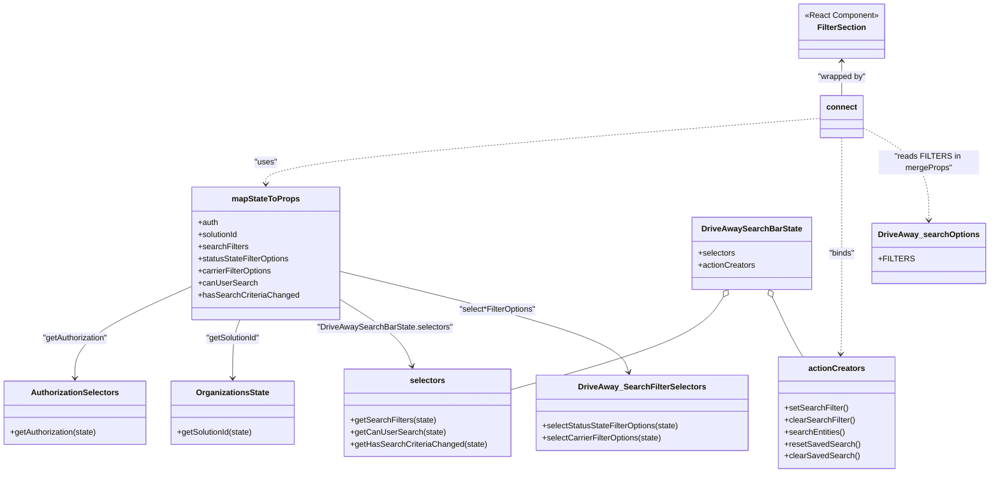

# Diagram: web/portal/src/pages/driveaway/components/search/DriveAway.SearchFilters.container.js


> Auto-generated by Obscura crawlers

## Diagram 1



### SVG

<svg id="container" width="1944.05078125" xmlns="http://www.w3.org/2000/svg" class="classDiagram" height="940" viewBox="0 0 1944.05078125 940" role="graphics-document document" aria-roledescription="class"><style>#container{font-family:"trebuchet ms",verdana,arial,sans-serif;font-size:16px;fill:#333;}@keyframes edge-animation-frame{from{stroke-dashoffset:0;}}@keyframes dash{to{stroke-dashoffset:0;}}#container .edge-animation-slow{stroke-dasharray:9,5!important;stroke-dashoffset:900;animation:dash 50s linear infinite;stroke-linecap:round;}#container .edge-animation-fast{stroke-dasharray:9,5!important;stroke-dashoffset:900;animation:dash 20s linear infinite;stroke-linecap:round;}#container .error-icon{fill:#552222;}#container .error-text{fill:#552222;stroke:#552222;}#container .edge-thickness-normal{stroke-width:1px;}#container .edge-thickness-thick{stroke-width:3.5px;}#container .edge-pattern-solid{stroke-dasharray:0;}#container .edge-thickness-invisible{stroke-width:0;fill:none;}#container .edge-pattern-dashed{stroke-dasharray:3;}#container .edge-pattern-dotted{stroke-dasharray:2;}#container .marker{fill:#333333;stroke:#333333;}#container .marker.cross{stroke:#333333;}#container svg{font-family:"trebuchet ms",verdana,arial,sans-serif;font-size:16px;}#container p{margin:0;}#container g.classGroup text{fill:#9370DB;stroke:none;font-family:"trebuchet ms",verdana,arial,sans-serif;font-size:10px;}#container g.classGroup text .title{font-weight:bolder;}#container .nodeLabel,#container .edgeLabel{color:#131300;}#container .edgeLabel .label rect{fill:#ECECFF;}#container .label text{fill:#131300;}#container .labelBkg{background:#ECECFF;}#container .edgeLabel .label span{background:#ECECFF;}#container .classTitle{font-weight:bolder;}#container .node rect,#container .node circle,#container .node ellipse,#container .node polygon,#container .node path{fill:#ECECFF;stroke:#9370DB;stroke-width:1px;}#container .divider{stroke:#9370DB;stroke-width:1;}#container g.clickable{cursor:pointer;}#container g.classGroup rect{fill:#ECECFF;stroke:#9370DB;}#container g.classGroup line{stroke:#9370DB;stroke-width:1;}#container .classLabel .box{stroke:none;stroke-width:0;fill:#ECECFF;opacity:0.5;}#container .classLabel .label{fill:#9370DB;font-size:10px;}#container .relation{stroke:#333333;stroke-width:1;fill:none;}#container .dashed-line{stroke-dasharray:3;}#container .dotted-line{stroke-dasharray:1 2;}#container #compositionStart,#container .composition{fill:#333333!important;stroke:#333333!important;stroke-width:1;}#container #compositionEnd,#container .composition{fill:#333333!important;stroke:#333333!important;stroke-width:1;}#container #dependencyStart,#container .dependency{fill:#333333!important;stroke:#333333!important;stroke-width:1;}#container #dependencyStart,#container .dependency{fill:#333333!important;stroke:#333333!important;stroke-width:1;}#container #extensionStart,#container .extension{fill:transparent!important;stroke:#333333!important;stroke-width:1;}#container #extensionEnd,#container .extension{fill:transparent!important;stroke:#333333!important;stroke-width:1;}#container #aggregationStart,#container .aggregation{fill:transparent!important;stroke:#333333!important;stroke-width:1;}#container #aggregationEnd,#container .aggregation{fill:transparent!important;stroke:#333333!important;stroke-width:1;}#container #lollipopStart,#container .lollipop{fill:#ECECFF!important;stroke:#333333!important;stroke-width:1;}#container #lollipopEnd,#container .lollipop{fill:#ECECFF!important;stroke:#333333!important;stroke-width:1;}#container .edgeTerminals{font-size:11px;line-height:initial;}#container .classTitleText{text-anchor:middle;font-size:18px;fill:#333;}#container .label-icon{display:inline-block;height:1em;overflow:visible;vertical-align:-0.125em;}#container .node .label-icon path{fill:currentColor;stroke:revert;stroke-width:revert;}#container :root{--mermaid-font-family:"trebuchet ms",verdana,arial,sans-serif;}</style><g><defs><marker id="container_class-aggregationStart" class="marker aggregation class" refX="18" refY="7" markerWidth="190" markerHeight="240" orient="auto"><path d="M 18,7 L9,13 L1,7 L9,1 Z"></path></marker></defs><defs><marker id="container_class-aggregationEnd" class="marker aggregation class" refX="1" refY="7" markerWidth="20" markerHeight="28" orient="auto"><path d="M 18,7 L9,13 L1,7 L9,1 Z"></path></marker></defs><defs><marker id="container_class-extensionStart" class="marker extension class" refX="18" refY="7" markerWidth="190" markerHeight="240" orient="auto"><path d="M 1,7 L18,13 V 1 Z"></path></marker></defs><defs><marker id="container_class-extensionEnd" class="marker extension class" refX="1" refY="7" markerWidth="20" markerHeight="28" orient="auto"><path d="M 1,1 V 13 L18,7 Z"></path></marker></defs><defs><marker id="container_class-compositionStart" class="marker composition class" refX="18" refY="7" markerWidth="190" markerHeight="240" orient="auto"><path d="M 18,7 L9,13 L1,7 L9,1 Z"></path></marker></defs><defs><marker id="container_class-compositionEnd" class="marker composition class" refX="1" refY="7" markerWidth="20" markerHeight="28" orient="auto"><path d="M 18,7 L9,13 L1,7 L9,1 Z"></path></marker></defs><defs><marker id="container_class-dependencyStart" class="marker dependency class" refX="6" refY="7" markerWidth="190" markerHeight="240" orient="auto"><path d="M 5,7 L9,13 L1,7 L9,1 Z"></path></marker></defs><defs><marker id="container_class-dependencyEnd" class="marker dependency class" refX="13" refY="7" markerWidth="20" markerHeight="28" orient="auto"><path d="M 18,7 L9,13 L14,7 L9,1 Z"></path></marker></defs><defs><marker id="container_class-lollipopStart" class="marker lollipop class" refX="13" refY="7" markerWidth="190" markerHeight="240" orient="auto"><circle stroke="black" fill="transparent" cx="7" cy="7" r="6"></circle></marker></defs><defs><marker id="container_class-lollipopEnd" class="marker lollipop class" refX="1" refY="7" markerWidth="190" markerHeight="240" orient="auto"><circle stroke="black" fill="transparent" cx="7" cy="7" r="6"></circle></marker></defs><g class="root"><g class="clusters"></g><g class="edgePaths"><path d="M1660.848,122L1660.848,127.167C1660.848,132.333,1660.848,142.667,1660.848,154C1660.848,165.333,1660.848,177.667,1660.848,183.833L1660.848,190" id="id_FilterSection_connect_1" class="edge-thickness-normal edge-pattern-solid relation" style=";;;" data-edge="true" data-et="edge" data-id="id_FilterSection_connect_1" data-points="W3sieCI6MTY2MC44NDc2NTYyNSwieSI6MTE2fSx7IngiOjE2NjAuODQ3NjU2MjUsInkiOjE1M30seyJ4IjoxNjYwLjg0NzY1NjI1LCJ5IjoxOTB9XQ==" marker-start="url(#container_class-dependencyStart)"></path><path d="M1619.934,235.278L1437.435,249.898C1254.936,264.518,889.939,293.759,707.44,315.546C524.941,337.333,524.941,351.667,524.941,358.833L524.941,366" id="id_connect_mapStateToProps_2" class="edge-thickness-normal edge-pattern-dashed relation" style=";;;" data-edge="true" data-et="edge" data-id="id_connect_mapStateToProps_2" data-points="W3sieCI6MTYxOS45MzM1OTM3NSwieSI6MjM1LjI3NzcxNzQwNjI1NjAyfSx7IngiOjUyNC45NDE0MDYyNSwieSI6MzIzfSx7IngiOjUyNC45NDE0MDYyNSwieSI6MzcyfV0=" marker-end="url(#container_class-dependencyEnd)"></path><path d="M1660.848,274L1660.848,282.167C1660.848,290.333,1660.848,306.667,1660.848,345C1660.848,383.333,1660.848,443.667,1660.848,502C1660.848,560.333,1660.848,616.667,1660.498,650.002C1660.149,683.338,1659.451,693.676,1659.101,698.845L1658.752,704.014" id="id_connect_actionCreators_3" class="edge-thickness-normal edge-pattern-dashed relation" style=";;;" data-edge="true" data-et="edge" data-id="id_connect_actionCreators_3" data-points="W3sieCI6MTY2MC44NDc2NTYyNSwieSI6Mjc0fSx7IngiOjE2NjAuODQ3NjU2MjUsInkiOjMyM30seyJ4IjoxNjYwLjg0NzY1NjI1LCJ5Ijo1MDR9LHsieCI6MTY2MC44NDc2NTYyNSwieSI6NjczfSx7IngiOjE2NTguMzQ3NjU2MjUsInkiOjcxMH1d" marker-end="url(#container_class-dependencyEnd)"></path><path d="M1701.762,254.117L1723,265.597C1744.238,277.078,1786.715,300.039,1807.953,330.686C1829.191,361.333,1829.191,399.667,1829.191,418.833L1829.191,438" id="id_connect_DriveAway_searchOptions_4" class="edge-thickness-normal edge-pattern-dashed relation" style=";;;" data-edge="true" data-et="edge" data-id="id_connect_DriveAway_searchOptions_4" data-points="W3sieCI6MTcwMS43NjE3MTg3NSwieSI6MjU0LjExNjUzMDUzNjQ3NjcyfSx7IngiOjE4MjkuMTkxNDA2MjUsInkiOjMyM30seyJ4IjoxODI5LjE5MTQwNjI1LCJ5Ijo0NDR9XQ==" marker-end="url(#container_class-dependencyEnd)"></path><path d="M381.711,568.475L343.01,585.896C304.31,603.316,226.909,638.158,188.208,668.746C149.508,699.333,149.508,725.667,149.508,738.833L149.508,752" id="id_mapStateToProps_AuthorizationSelectors_5" class="edge-thickness-normal edge-pattern-solid relation" style=";;;" data-edge="true" data-et="edge" data-id="id_mapStateToProps_AuthorizationSelectors_5" data-points="W3sieCI6MzgxLjcxMDkzNzUsInkiOjU2OC40NzQ2NDkxMDM2NDA2fSx7IngiOjE0OS41MDc4MTI1LCJ5Ijo2NzN9LHsieCI6MTQ5LjUwNzgxMjUsInkiOjc1OH1d" marker-end="url(#container_class-dependencyEnd)"></path><path d="M477.449,636L475.23,642.167C473.012,648.333,468.574,660.667,466.355,680C464.137,699.333,464.137,725.667,464.137,738.833L464.137,752" id="id_mapStateToProps_OrganizationsState_6" class="edge-thickness-normal edge-pattern-solid relation" style=";;;" data-edge="true" data-et="edge" data-id="id_mapStateToProps_OrganizationsState_6" data-points="W3sieCI6NDc3LjQ0ODk4NzYxMDk0Njc0LCJ5Ijo2MzZ9LHsieCI6NDY0LjEzNjcxODc1LCJ5Ijo2NzN9LHsieCI6NDY0LjEzNjcxODc1LCJ5Ijo3NTh9XQ==" marker-end="url(#container_class-dependencyEnd)"></path><path d="M668.172,591.962L690.165,605.468C712.158,618.974,756.143,645.987,781.103,668.708C806.062,691.43,811.996,709.859,814.962,719.074L817.929,728.289" id="id_mapStateToProps_selectors_7" class="edge-thickness-normal edge-pattern-solid relation" style=";;;" data-edge="true" data-et="edge" data-id="id_mapStateToProps_selectors_7" data-points="W3sieCI6NjY4LjE3MTg3NSwieSI6NTkxLjk2MTY1OTY2Mzg2NTZ9LHsieCI6ODAwLjEyODkwNjI1LCJ5Ijo2NzN9LHsieCI6ODE5Ljc2Nzc4OTI3MzY0ODYsInkiOjczNH1d" marker-end="url(#container_class-dependencyEnd)"></path><path d="M668.172,538.725L760.478,561.105C852.784,583.484,1037.396,628.242,1133.312,661.836C1229.229,695.43,1236.45,717.859,1240.061,729.074L1243.671,740.289" id="id_mapStateToProps_DriveAway_SearchFilterSelectors_8" class="edge-thickness-normal edge-pattern-solid relation" style=";;;" data-edge="true" data-et="edge" data-id="id_mapStateToProps_DriveAway_SearchFilterSelectors_8" data-points="W3sieCI6NjY4LjE3MTg3NSwieSI6NTM4LjcyNTQ1NjU3MzAyNjV9LHsieCI6MTIyMi4wMDc4MTI1LCJ5Ijo2NzN9LHsieCI6MTI0NS41MTAwODIzNDc5NzMsInkiOjc0Nn1d" marker-end="url(#container_class-dependencyEnd)"></path><path d="M1429.407,590.634L1420.839,604.361C1412.271,618.089,1395.136,645.545,1325.343,676.362C1255.549,707.179,1133.099,741.359,1071.874,758.448L1010.648,775.538" id="id_DriveAwaySearchBarState_selectors_9" class="edge-thickness-normal edge-pattern-solid relation" style=";;;" data-edge="true" data-et="edge" data-id="id_DriveAwaySearchBarState_selectors_9" data-points="W3sieCI6MTQzOC41Mzk4MDIxNDQ5NzA1LCJ5Ijo1NzZ9LHsieCI6MTM3OCwieSI6NjczfSx7IngiOjEwMTAuNjQ4NDM3NSwieSI6Nzc1LjUzODExNDE0NzIxMTF9XQ==" marker-start="url(#container_class-aggregationStart)"></path><path d="M1524.28,591.638L1530.594,605.198C1536.908,618.759,1549.535,645.879,1559.544,665.606C1569.553,685.333,1576.943,697.667,1580.638,703.833L1584.333,710" id="id_DriveAwaySearchBarState_actionCreators_10" class="edge-thickness-normal edge-pattern-solid relation" style=";;;" data-edge="true" data-et="edge" data-id="id_DriveAwaySearchBarState_actionCreators_10" data-points="W3sieCI6MTUxNi45OTkzOTkwMzg0NjE0LCJ5Ijo1NzZ9LHsieCI6MTU2Mi4xNjIxMDkzNzUsInkiOjY3M30seyJ4IjoxNTg0LjMzMzQ5NjA5Mzc1LCJ5Ijo3MTB9XQ==" marker-start="url(#container_class-aggregationStart)"></path></g><g class="edgeLabels"><g class="edgeLabel" transform="translate(1660.84765625, 153)"><g class="label" data-id="id_FilterSection_connect_1" transform="translate(-48.7109375, -12)"><foreignObject width="97.421875" height="24"><div xmlns="http://www.w3.org/1999/xhtml" class="labelBkg" style="display: table-cell; white-space: nowrap; line-height: 1.5; max-width: 200px; text-align: center;"><span class="edgeLabel"><p>"wrapped by"</p></span></div></foreignObject></g></g><g class="edgeLabel" transform="translate(524.94140625, 323)"><g class="label" data-id="id_connect_mapStateToProps_2" transform="translate(-22.7578125, -12)"><foreignObject width="45.515625" height="24"><div xmlns="http://www.w3.org/1999/xhtml" class="labelBkg" style="display: table-cell; white-space: nowrap; line-height: 1.5; max-width: 200px; text-align: center;"><span class="edgeLabel"><p>"uses"</p></span></div></foreignObject></g></g><g class="edgeLabel" transform="translate(1660.84765625, 504)"><g class="label" data-id="id_connect_actionCreators_3" transform="translate(-26.484375, -12)"><foreignObject width="52.96875" height="24"><div xmlns="http://www.w3.org/1999/xhtml" class="labelBkg" style="display: table-cell; white-space: nowrap; line-height: 1.5; max-width: 200px; text-align: center;"><span class="edgeLabel"><p>"binds"</p></span></div></foreignObject></g></g><g class="edgeLabel" transform="translate(1829.19140625, 323)"><g class="label" data-id="id_connect_DriveAway_searchOptions_4" transform="translate(-100, -24)"><foreignObject width="200" height="48"><div xmlns="http://www.w3.org/1999/xhtml" class="labelBkg" style="display: table; white-space: break-spaces; line-height: 1.5; max-width: 200px; text-align: center; width: 200px;"><span class="edgeLabel"><p>"reads FILTERS in mergeProps"</p></span></div></foreignObject></g></g><g class="edgeLabel" transform="translate(149.5078125, 673)"><g class="label" data-id="id_mapStateToProps_AuthorizationSelectors_5" transform="translate(-66.6484375, -12)"><foreignObject width="133.296875" height="24"><div xmlns="http://www.w3.org/1999/xhtml" class="labelBkg" style="display: table-cell; white-space: nowrap; line-height: 1.5; max-width: 200px; text-align: center;"><span class="edgeLabel"><p>"getAuthorization"</p></span></div></foreignObject></g></g><g class="edgeLabel" transform="translate(464.13671875, 673)"><g class="label" data-id="id_mapStateToProps_OrganizationsState_6" transform="translate(-55.3515625, -12)"><foreignObject width="110.703125" height="24"><div xmlns="http://www.w3.org/1999/xhtml" class="labelBkg" style="display: table-cell; white-space: nowrap; line-height: 1.5; max-width: 200px; text-align: center;"><span class="edgeLabel"><p>"getSolutionId"</p></span></div></foreignObject></g></g><g class="edgeLabel" transform="translate(761.4543, 649.24889)"><g class="label" data-id="id_mapStateToProps_selectors_7" transform="translate(-133.3515625, -12)"><foreignObject width="266.703125" height="24"><div xmlns="http://www.w3.org/1999/xhtml" class="labelBkg" style="display: table; white-space: break-spaces; line-height: 1.5; max-width: 200px; text-align: center; width: 200px;"><span class="edgeLabel"><p>"DriveAwaySearchBarState.selectors"</p></span></div></foreignObject></g></g><g class="edgeLabel" transform="translate(982.35526, 614.89753)"><g class="label" data-id="id_mapStateToProps_DriveAway_SearchFilterSelectors_8" transform="translate(-78.1640625, -12)"><foreignObject width="156.328125" height="24"><div xmlns="http://www.w3.org/1999/xhtml" class="labelBkg" style="display: table-cell; white-space: nowrap; line-height: 1.5; max-width: 200px; text-align: center;"><span class="edgeLabel"><p>"select*FilterOptions"</p></span></div></foreignObject></g></g><g class="edgeLabel"><g class="label" data-id="id_DriveAwaySearchBarState_selectors_9" transform="translate(0, 0)"><foreignObject width="0" height="0"><div xmlns="http://www.w3.org/1999/xhtml" class="labelBkg" style="display: table-cell; white-space: nowrap; line-height: 1.5; max-width: 200px; text-align: center;"><span class="edgeLabel"></span></div></foreignObject></g></g><g class="edgeLabel"><g class="label" data-id="id_DriveAwaySearchBarState_actionCreators_10" transform="translate(0, 0)"><foreignObject width="0" height="0"><div xmlns="http://www.w3.org/1999/xhtml" class="labelBkg" style="display: table-cell; white-space: nowrap; line-height: 1.5; max-width: 200px; text-align: center;"><span class="edgeLabel"></span></div></foreignObject></g></g></g><g class="nodes"><g class="node default" id="classId-FilterSection-0" transform="translate(1660.84765625, 62)"><g class="basic label-container"><path d="M-85.2109375 -54 L85.2109375 -54 L85.2109375 54 L-85.2109375 54" stroke="none" stroke-width="0" fill="#ECECFF" style=""></path><path d="M-85.2109375 -54 C-43.983966894929154 -54, -2.756996289858307 -54, 85.2109375 -54 M-85.2109375 -54 C-30.127822284436505 -54, 24.95529293112699 -54, 85.2109375 -54 M85.2109375 -54 C85.2109375 -17.74616343034363, 85.2109375 18.507673139312743, 85.2109375 54 M85.2109375 -54 C85.2109375 -15.295459743629998, 85.2109375 23.409080512740005, 85.2109375 54 M85.2109375 54 C32.536395490362075 54, -20.13814651927585 54, -85.2109375 54 M85.2109375 54 C23.82438309591337 54, -37.56217130817326 54, -85.2109375 54 M-85.2109375 54 C-85.2109375 18.537721045881803, -85.2109375 -16.924557908236395, -85.2109375 -54 M-85.2109375 54 C-85.2109375 13.94776031330644, -85.2109375 -26.10447937338712, -85.2109375 -54" stroke="#9370DB" stroke-width="1.3" fill="none" stroke-dasharray="0 0" style=""></path></g><g class="annotation-group text" transform="translate(-73.2109375, -30)"><g class="label" style="" transform="translate(0,-12)"><foreignObject width="146.421875" height="24"><div xmlns="http://www.w3.org/1999/xhtml" style="display: table-cell; white-space: nowrap; line-height: 1.5; max-width: 196px; text-align: center;"><span class="nodeLabel markdown-node-label" style=""><p>«React Component»</p></span></div></foreignObject></g></g><g class="label-group text" transform="translate(-46.3203125, -6)"><g class="label" style="font-weight: bolder" transform="translate(0,-12)"><foreignObject width="92.640625" height="24"><div xmlns="http://www.w3.org/1999/xhtml" style="display: table-cell; white-space: nowrap; line-height: 1.5; max-width: 141px; text-align: center;"><span class="nodeLabel markdown-node-label" style=""><p>FilterSection</p></span></div></foreignObject></g></g><g class="members-group text" transform="translate(-73.2109375, 42)"></g><g class="methods-group text" transform="translate(-73.2109375, 72)"></g><g class="divider" style=""><path d="M-85.2109375 18 C-29.23736383485626 18, 26.73620983028748 18, 85.2109375 18 M-85.2109375 18 C-50.88525102082914 18, -16.559564541658276 18, 85.2109375 18" stroke="#9370DB" stroke-width="1.3" fill="none" stroke-dasharray="0 0" style=""></path></g><g class="divider" style=""><path d="M-85.2109375 36 C-50.654556911041304 36, -16.098176322082608 36, 85.2109375 36 M-85.2109375 36 C-48.3505939069136 36, -11.490250313827204 36, 85.2109375 36" stroke="#9370DB" stroke-width="1.3" fill="none" stroke-dasharray="0 0" style=""></path></g></g><g class="node default" id="classId-mapStateToProps-1" transform="translate(524.94140625, 504)"><g class="basic label-container"><path d="M-143.23046875 -132 L143.23046875 -132 L143.23046875 132 L-143.23046875 132" stroke="none" stroke-width="0" fill="#ECECFF" style=""></path><path d="M-143.23046875 -132 C-71.9308383352379 -132, -0.6312079204757879 -132, 143.23046875 -132 M-143.23046875 -132 C-61.4515288393371 -132, 20.3274110713258 -132, 143.23046875 -132 M143.23046875 -132 C143.23046875 -27.535305123080818, 143.23046875 76.92938975383836, 143.23046875 132 M143.23046875 -132 C143.23046875 -45.118736107104795, 143.23046875 41.76252778579041, 143.23046875 132 M143.23046875 132 C31.6142761185953 132, -80.0019165128094 132, -143.23046875 132 M143.23046875 132 C65.82487045828057 132, -11.580727833438857 132, -143.23046875 132 M-143.23046875 132 C-143.23046875 54.92868385491873, -143.23046875 -22.14263229016254, -143.23046875 -132 M-143.23046875 132 C-143.23046875 70.98467566378005, -143.23046875 9.96935132756009, -143.23046875 -132" stroke="#9370DB" stroke-width="1.3" fill="none" stroke-dasharray="0 0" style=""></path></g><g class="annotation-group text" transform="translate(0, -108)"></g><g class="label-group text" transform="translate(-64.7109375, -108)"><g class="label" style="font-weight: bolder" transform="translate(0,-12)"><foreignObject width="129.421875" height="24"><div xmlns="http://www.w3.org/1999/xhtml" style="display: table-cell; white-space: nowrap; line-height: 1.5; max-width: 177px; text-align: center;"><span class="nodeLabel markdown-node-label" style=""><p>mapStateToProps</p></span></div></foreignObject></g></g><g class="members-group text" transform="translate(-131.23046875, -60)"><g class="label" style="" transform="translate(0,-12)"><foreignObject width="40.921875" height="24"><div xmlns="http://www.w3.org/1999/xhtml" style="display: table-cell; white-space: nowrap; line-height: 1.5; max-width: 98px; text-align: center;"><span class="nodeLabel markdown-node-label" style=""><p>+auth</p></span></div></foreignObject></g><g class="label" style="" transform="translate(0,12)"><foreignObject width="82.109375" height="24"><div xmlns="http://www.w3.org/1999/xhtml" style="display: table-cell; white-space: nowrap; line-height: 1.5; max-width: 139px; text-align: center;"><span class="nodeLabel markdown-node-label" style=""><p>+solutionId</p></span></div></foreignObject></g><g class="label" style="" transform="translate(0,36)"><foreignObject width="99.609375" height="24"><div xmlns="http://www.w3.org/1999/xhtml" style="display: table-cell; white-space: nowrap; line-height: 1.5; max-width: 157px; text-align: center;"><span class="nodeLabel markdown-node-label" style=""><p>+searchFilters</p></span></div></foreignObject></g><g class="label" style="" transform="translate(0,60)"><foreignObject width="183.71875" height="24"><div xmlns="http://www.w3.org/1999/xhtml" style="display: table-cell; white-space: nowrap; line-height: 1.5; max-width: 241px; text-align: center;"><span class="nodeLabel markdown-node-label" style=""><p>+statusStateFilterOptions</p></span></div></foreignObject></g><g class="label" style="" transform="translate(0,84)"><foreignObject width="149.921875" height="24"><div xmlns="http://www.w3.org/1999/xhtml" style="display: table-cell; white-space: nowrap; line-height: 1.5; max-width: 207px; text-align: center;"><span class="nodeLabel markdown-node-label" style=""><p>+carrierFilterOptions</p></span></div></foreignObject></g><g class="label" style="" transform="translate(0,108)"><foreignObject width="115.140625" height="24"><div xmlns="http://www.w3.org/1999/xhtml" style="display: table-cell; white-space: nowrap; line-height: 1.5; max-width: 173px; text-align: center;"><span class="nodeLabel markdown-node-label" style=""><p>+canUserSearch</p></span></div></foreignObject></g><g class="label" style="" transform="translate(0,132)"><foreignObject width="197.75" height="24"><div xmlns="http://www.w3.org/1999/xhtml" style="display: table-cell; white-space: nowrap; line-height: 1.5; max-width: 255px; text-align: center;"><span class="nodeLabel markdown-node-label" style=""><p>+hasSearchCriteriaChanged</p></span></div></foreignObject></g></g><g class="methods-group text" transform="translate(-131.23046875, 132)"></g><g class="divider" style=""><path d="M-143.23046875 -84 C-33.75901418695382 -84, 75.71244037609236 -84, 143.23046875 -84 M-143.23046875 -84 C-84.99926868649446 -84, -26.76806862298892 -84, 143.23046875 -84" stroke="#9370DB" stroke-width="1.3" fill="none" stroke-dasharray="0 0" style=""></path></g><g class="divider" style=""><path d="M-143.23046875 108 C-78.8896184387468 108, -14.548768127493588 108, 143.23046875 108 M-143.23046875 108 C-83.07462816323553 108, -22.91878757647106 108, 143.23046875 108" stroke="#9370DB" stroke-width="1.3" fill="none" stroke-dasharray="0 0" style=""></path></g></g><g class="node default" id="classId-DriveAwaySearchBarState-2" transform="translate(1483.4765625, 504)"><g class="basic label-container"><path d="M-115.88671875 -72 L115.88671875 -72 L115.88671875 72 L-115.88671875 72" stroke="none" stroke-width="0" fill="#ECECFF" style=""></path><path d="M-115.88671875 -72 C-35.180996740245206 -72, 45.52472526950959 -72, 115.88671875 -72 M-115.88671875 -72 C-31.39386145162176 -72, 53.09899584675648 -72, 115.88671875 -72 M115.88671875 -72 C115.88671875 -42.34679825164171, 115.88671875 -12.693596503283416, 115.88671875 72 M115.88671875 -72 C115.88671875 -17.65681465261322, 115.88671875 36.68637069477356, 115.88671875 72 M115.88671875 72 C36.45878765234896 72, -42.96914344530208 72, -115.88671875 72 M115.88671875 72 C43.58935258551854 72, -28.70801357896292 72, -115.88671875 72 M-115.88671875 72 C-115.88671875 28.622334115730425, -115.88671875 -14.75533176853915, -115.88671875 -72 M-115.88671875 72 C-115.88671875 25.612708784188925, -115.88671875 -20.77458243162215, -115.88671875 -72" stroke="#9370DB" stroke-width="1.3" fill="none" stroke-dasharray="0 0" style=""></path></g><g class="annotation-group text" transform="translate(0, -48)"></g><g class="label-group text" transform="translate(-94.6953125, -48)"><g class="label" style="font-weight: bolder" transform="translate(0,-12)"><foreignObject width="189.390625" height="24"><div xmlns="http://www.w3.org/1999/xhtml" style="display: table-cell; white-space: nowrap; line-height: 1.5; max-width: 235px; text-align: center;"><span class="nodeLabel markdown-node-label" style=""><p>DriveAwaySearchBarState</p></span></div></foreignObject></g></g><g class="members-group text" transform="translate(-103.88671875, 0)"><g class="label" style="" transform="translate(0,-12)"><foreignObject width="73.453125" height="24"><div xmlns="http://www.w3.org/1999/xhtml" style="display: table-cell; white-space: nowrap; line-height: 1.5; max-width: 131px; text-align: center;"><span class="nodeLabel markdown-node-label" style=""><p>+selectors</p></span></div></foreignObject></g><g class="label" style="" transform="translate(0,12)"><foreignObject width="113.078125" height="24"><div xmlns="http://www.w3.org/1999/xhtml" style="display: table-cell; white-space: nowrap; line-height: 1.5; max-width: 170px; text-align: center;"><span class="nodeLabel markdown-node-label" style=""><p>+actionCreators</p></span></div></foreignObject></g></g><g class="methods-group text" transform="translate(-103.88671875, 72)"></g><g class="divider" style=""><path d="M-115.88671875 -24 C-56.17755084227244 -24, 3.531617065455123 -24, 115.88671875 -24 M-115.88671875 -24 C-53.11521367363749 -24, 9.656291402725017 -24, 115.88671875 -24" stroke="#9370DB" stroke-width="1.3" fill="none" stroke-dasharray="0 0" style=""></path></g><g class="divider" style=""><path d="M-115.88671875 48 C-64.74648565812308 48, -13.60625256624617 48, 115.88671875 48 M-115.88671875 48 C-27.775016332772665 48, 60.33668608445467 48, 115.88671875 48" stroke="#9370DB" stroke-width="1.3" fill="none" stroke-dasharray="0 0" style=""></path></g></g><g class="node default" id="classId-selectors-3" transform="translate(847.77734375, 821)"><g class="basic label-container"><path d="M-162.87109375 -87 L162.87109375 -87 L162.87109375 87 L-162.87109375 87" stroke="none" stroke-width="0" fill="#ECECFF" style=""></path><path d="M-162.87109375 -87 C-68.68155736071317 -87, 25.507979028573658 -87, 162.87109375 -87 M-162.87109375 -87 C-45.291811245999455 -87, 72.28747125800109 -87, 162.87109375 -87 M162.87109375 -87 C162.87109375 -34.29751171136937, 162.87109375 18.404976577261266, 162.87109375 87 M162.87109375 -87 C162.87109375 -33.57297728090793, 162.87109375 19.854045438184144, 162.87109375 87 M162.87109375 87 C88.26666106967096 87, 13.66222838934192 87, -162.87109375 87 M162.87109375 87 C79.5574696796687 87, -3.7561543906626014 87, -162.87109375 87 M-162.87109375 87 C-162.87109375 26.400577764724495, -162.87109375 -34.19884447055101, -162.87109375 -87 M-162.87109375 87 C-162.87109375 41.33869487485724, -162.87109375 -4.322610250285521, -162.87109375 -87" stroke="#9370DB" stroke-width="1.3" fill="none" stroke-dasharray="0 0" style=""></path></g><g class="annotation-group text" transform="translate(0, -63)"></g><g class="label-group text" transform="translate(-33.4609375, -63)"><g class="label" style="font-weight: bolder" transform="translate(0,-12)"><foreignObject width="66.921875" height="24"><div xmlns="http://www.w3.org/1999/xhtml" style="display: table-cell; white-space: nowrap; line-height: 1.5; max-width: 115px; text-align: center;"><span class="nodeLabel markdown-node-label" style=""><p>selectors</p></span></div></foreignObject></g></g><g class="members-group text" transform="translate(-150.87109375, -15)"></g><g class="methods-group text" transform="translate(-150.87109375, 15)"><g class="label" style="" transform="translate(0,-12)"><foreignObject width="169.875" height="24"><div xmlns="http://www.w3.org/1999/xhtml" style="display: table-cell; white-space: nowrap; line-height: 1.5; max-width: 227px; text-align: center;"><span class="nodeLabel markdown-node-label" style=""><p>+getSearchFilters(state)</p></span></div></foreignObject></g><g class="label" style="" transform="translate(0,12)"><foreignObject width="185.484375" height="24"><div xmlns="http://www.w3.org/1999/xhtml" style="display: table-cell; white-space: nowrap; line-height: 1.5; max-width: 243px; text-align: center;"><span class="nodeLabel markdown-node-label" style=""><p>+getCanUserSearch(state)</p></span></div></foreignObject></g><g class="label" style="" transform="translate(0,36)"><foreignObject width="268.28125" height="24"><div xmlns="http://www.w3.org/1999/xhtml" style="display: table-cell; white-space: nowrap; line-height: 1.5; max-width: 326px; text-align: center;"><span class="nodeLabel markdown-node-label" style=""><p>+getHasSearchCriteriaChanged(state)</p></span></div></foreignObject></g></g><g class="divider" style=""><path d="M-162.87109375 -39 C-91.74284675177461 -39, -20.614599753549214 -39, 162.87109375 -39 M-162.87109375 -39 C-47.38844147143642 -39, 68.09421080712715 -39, 162.87109375 -39" stroke="#9370DB" stroke-width="1.3" fill="none" stroke-dasharray="0 0" style=""></path></g><g class="divider" style=""><path d="M-162.87109375 -15 C-53.597013102539336 -15, 55.67706754492133 -15, 162.87109375 -15 M-162.87109375 -15 C-45.95544639087689 -15, 70.96020096824623 -15, 162.87109375 -15" stroke="#9370DB" stroke-width="1.3" fill="none" stroke-dasharray="0 0" style=""></path></g></g><g class="node default" id="classId-actionCreators-4" transform="translate(1650.84765625, 821)"><g class="basic label-container"><path d="M-112.18359375 -111 L112.18359375 -111 L112.18359375 111 L-112.18359375 111" stroke="none" stroke-width="0" fill="#ECECFF" style=""></path><path d="M-112.18359375 -111 C-24.880267091702052 -111, 62.423059566595896 -111, 112.18359375 -111 M-112.18359375 -111 C-55.820332496120635 -111, 0.5429287577587303 -111, 112.18359375 -111 M112.18359375 -111 C112.18359375 -36.16309751947463, 112.18359375 38.673804961050735, 112.18359375 111 M112.18359375 -111 C112.18359375 -29.28994881687815, 112.18359375 52.4201023662437, 112.18359375 111 M112.18359375 111 C44.9549897608201 111, -22.273614228359804 111, -112.18359375 111 M112.18359375 111 C54.90548850168657 111, -2.3726167466268606 111, -112.18359375 111 M-112.18359375 111 C-112.18359375 29.317791300126828, -112.18359375 -52.364417399746344, -112.18359375 -111 M-112.18359375 111 C-112.18359375 30.229490359019607, -112.18359375 -50.541019281960786, -112.18359375 -111" stroke="#9370DB" stroke-width="1.3" fill="none" stroke-dasharray="0 0" style=""></path></g><g class="annotation-group text" transform="translate(0, -87)"></g><g class="label-group text" transform="translate(-53.6328125, -87)"><g class="label" style="font-weight: bolder" transform="translate(0,-12)"><foreignObject width="107.265625" height="24"><div xmlns="http://www.w3.org/1999/xhtml" style="display: table-cell; white-space: nowrap; line-height: 1.5; max-width: 155px; text-align: center;"><span class="nodeLabel markdown-node-label" style=""><p>actionCreators</p></span></div></foreignObject></g></g><g class="members-group text" transform="translate(-100.18359375, -39)"></g><g class="methods-group text" transform="translate(-100.18359375, -9)"><g class="label" style="" transform="translate(0,-12)"><foreignObject width="125.953125" height="24"><div xmlns="http://www.w3.org/1999/xhtml" style="display: table-cell; white-space: nowrap; line-height: 1.5; max-width: 183px; text-align: center;"><span class="nodeLabel markdown-node-label" style=""><p>+setSearchFilter()</p></span></div></foreignObject></g><g class="label" style="" transform="translate(0,12)"><foreignObject width="139.6875" height="24"><div xmlns="http://www.w3.org/1999/xhtml" style="display: table-cell; white-space: nowrap; line-height: 1.5; max-width: 197px; text-align: center;"><span class="nodeLabel markdown-node-label" style=""><p>+clearSearchFilter()</p></span></div></foreignObject></g><g class="label" style="" transform="translate(0,36)"><foreignObject width="120.359375" height="24"><div xmlns="http://www.w3.org/1999/xhtml" style="display: table-cell; white-space: nowrap; line-height: 1.5; max-width: 178px; text-align: center;"><span class="nodeLabel markdown-node-label" style=""><p>+searchEntities()</p></span></div></foreignObject></g><g class="label" style="" transform="translate(0,60)"><foreignObject width="146.734375" height="24"><div xmlns="http://www.w3.org/1999/xhtml" style="display: table-cell; white-space: nowrap; line-height: 1.5; max-width: 204px; text-align: center;"><span class="nodeLabel markdown-node-label" style=""><p>+resetSavedSearch()</p></span></div></foreignObject></g><g class="label" style="" transform="translate(0,84)"><foreignObject width="146.046875" height="24"><div xmlns="http://www.w3.org/1999/xhtml" style="display: table-cell; white-space: nowrap; line-height: 1.5; max-width: 203px; text-align: center;"><span class="nodeLabel markdown-node-label" style=""><p>+clearSavedSearch()</p></span></div></foreignObject></g></g><g class="divider" style=""><path d="M-112.18359375 -63 C-44.27776764423932 -63, 23.628058461521363 -63, 112.18359375 -63 M-112.18359375 -63 C-45.90572400346626 -63, 20.372145743067477 -63, 112.18359375 -63" stroke="#9370DB" stroke-width="1.3" fill="none" stroke-dasharray="0 0" style=""></path></g><g class="divider" style=""><path d="M-112.18359375 -39 C-58.5315331345663 -39, -4.879472519132605 -39, 112.18359375 -39 M-112.18359375 -39 C-56.13667482555647 -39, -0.08975590111293741 -39, 112.18359375 -39" stroke="#9370DB" stroke-width="1.3" fill="none" stroke-dasharray="0 0" style=""></path></g></g><g class="node default" id="classId-DriveAway_searchOptions-5" transform="translate(1829.19140625, 504)"><g class="basic label-container"><path d="M-106.859375 -60 L106.859375 -60 L106.859375 60 L-106.859375 60" stroke="none" stroke-width="0" fill="#ECECFF" style=""></path><path d="M-106.859375 -60 C-49.69639145572678 -60, 7.4665920885464345 -60, 106.859375 -60 M-106.859375 -60 C-54.471037520087016 -60, -2.082700040174032 -60, 106.859375 -60 M106.859375 -60 C106.859375 -16.41007680834945, 106.859375 27.179846383301097, 106.859375 60 M106.859375 -60 C106.859375 -22.886224589575434, 106.859375 14.227550820849132, 106.859375 60 M106.859375 60 C35.2901191482233 60, -36.279136703553405 60, -106.859375 60 M106.859375 60 C39.07714894407532 60, -28.705077111849363 60, -106.859375 60 M-106.859375 60 C-106.859375 34.13572050562411, -106.859375 8.271441011248214, -106.859375 -60 M-106.859375 60 C-106.859375 21.205463021536033, -106.859375 -17.589073956927933, -106.859375 -60" stroke="#9370DB" stroke-width="1.3" fill="none" stroke-dasharray="0 0" style=""></path></g><g class="annotation-group text" transform="translate(0, -36)"></g><g class="label-group text" transform="translate(-94.859375, -36)"><g class="label" style="font-weight: bolder" transform="translate(0,-12)"><foreignObject width="189.71875" height="24"><div xmlns="http://www.w3.org/1999/xhtml" style="display: table-cell; white-space: nowrap; line-height: 1.5; max-width: 237px; text-align: center;"><span class="nodeLabel markdown-node-label" style=""><p>DriveAway_searchOptions</p></span></div></foreignObject></g></g><g class="members-group text" transform="translate(-94.859375, 12)"><g class="label" style="" transform="translate(0,-12)"><foreignObject width="62.328125" height="24"><div xmlns="http://www.w3.org/1999/xhtml" style="display: table-cell; white-space: nowrap; line-height: 1.5; max-width: 120px; text-align: center;"><span class="nodeLabel markdown-node-label" style=""><p>+FILTERS</p></span></div></foreignObject></g></g><g class="methods-group text" transform="translate(-94.859375, 60)"></g><g class="divider" style=""><path d="M-106.859375 -12 C-40.365223757995494 -12, 26.12892748400901 -12, 106.859375 -12 M-106.859375 -12 C-28.92058553637918 -12, 49.01820392724164 -12, 106.859375 -12" stroke="#9370DB" stroke-width="1.3" fill="none" stroke-dasharray="0 0" style=""></path></g><g class="divider" style=""><path d="M-106.859375 36 C-47.58780344881992 36, 11.683768102360162 36, 106.859375 36 M-106.859375 36 C-27.57825804110051 36, 51.70285891779898 36, 106.859375 36" stroke="#9370DB" stroke-width="1.3" fill="none" stroke-dasharray="0 0" style=""></path></g></g><g class="node default" id="classId-DriveAway_SearchFilterSelectors-6" transform="translate(1269.65625, 821)"><g class="basic label-container"><path d="M-209.0078125 -75 L209.0078125 -75 L209.0078125 75 L-209.0078125 75" stroke="none" stroke-width="0" fill="#ECECFF" style=""></path><path d="M-209.0078125 -75 C-123.06039948952018 -75, -37.11298647904036 -75, 209.0078125 -75 M-209.0078125 -75 C-68.24703652320073 -75, 72.51373945359853 -75, 209.0078125 -75 M209.0078125 -75 C209.0078125 -28.827764102373962, 209.0078125 17.344471795252076, 209.0078125 75 M209.0078125 -75 C209.0078125 -33.63075442689388, 209.0078125 7.73849114621224, 209.0078125 75 M209.0078125 75 C119.04017970560659 75, 29.07254691121318 75, -209.0078125 75 M209.0078125 75 C98.19102284164205 75, -12.625766816715895 75, -209.0078125 75 M-209.0078125 75 C-209.0078125 42.89301468633456, -209.0078125 10.78602937266912, -209.0078125 -75 M-209.0078125 75 C-209.0078125 15.455758150306004, -209.0078125 -44.08848369938799, -209.0078125 -75" stroke="#9370DB" stroke-width="1.3" fill="none" stroke-dasharray="0 0" style=""></path></g><g class="annotation-group text" transform="translate(0, -51)"></g><g class="label-group text" transform="translate(-119.640625, -51)"><g class="label" style="font-weight: bolder" transform="translate(0,-12)"><foreignObject width="239.28125" height="24"><div xmlns="http://www.w3.org/1999/xhtml" style="display: table-cell; white-space: nowrap; line-height: 1.5; max-width: 284px; text-align: center;"><span class="nodeLabel markdown-node-label" style=""><p>DriveAway_SearchFilterSelectors</p></span></div></foreignObject></g></g><g class="members-group text" transform="translate(-197.0078125, -3)"></g><g class="methods-group text" transform="translate(-197.0078125, 27)"><g class="label" style="" transform="translate(0,-12)"><foreignObject width="274.375" height="24"><div xmlns="http://www.w3.org/1999/xhtml" style="display: table-cell; white-space: nowrap; line-height: 1.5; max-width: 332px; text-align: center;"><span class="nodeLabel markdown-node-label" style=""><p>+selectStatusStateFilterOptions(state)</p></span></div></foreignObject></g><g class="label" style="" transform="translate(0,12)"><foreignObject width="240.640625" height="24"><div xmlns="http://www.w3.org/1999/xhtml" style="display: table-cell; white-space: nowrap; line-height: 1.5; max-width: 298px; text-align: center;"><span class="nodeLabel markdown-node-label" style=""><p>+selectCarrierFilterOptions(state)</p></span></div></foreignObject></g></g><g class="divider" style=""><path d="M-209.0078125 -27 C-50.080248118875375 -27, 108.84731626224925 -27, 209.0078125 -27 M-209.0078125 -27 C-85.03959368068075 -27, 38.928625138638495 -27, 209.0078125 -27" stroke="#9370DB" stroke-width="1.3" fill="none" stroke-dasharray="0 0" style=""></path></g><g class="divider" style=""><path d="M-209.0078125 -3 C-82.80598811242409 -3, 43.39583627515182 -3, 209.0078125 -3 M-209.0078125 -3 C-125.2157803047468 -3, -41.4237481094936 -3, 209.0078125 -3" stroke="#9370DB" stroke-width="1.3" fill="none" stroke-dasharray="0 0" style=""></path></g></g><g class="node default" id="classId-OrganizationsState-7" transform="translate(464.13671875, 821)"><g class="basic label-container"><path d="M-123.12109375 -63 L123.12109375 -63 L123.12109375 63 L-123.12109375 63" stroke="none" stroke-width="0" fill="#ECECFF" style=""></path><path d="M-123.12109375 -63 C-62.3235545990945 -63, -1.5260154481889998 -63, 123.12109375 -63 M-123.12109375 -63 C-48.26530488729907 -63, 26.590483975401867 -63, 123.12109375 -63 M123.12109375 -63 C123.12109375 -33.382223013460774, 123.12109375 -3.76444602692154, 123.12109375 63 M123.12109375 -63 C123.12109375 -20.991798457094937, 123.12109375 21.016403085810126, 123.12109375 63 M123.12109375 63 C53.40459991404937 63, -16.31189392190126 63, -123.12109375 63 M123.12109375 63 C26.960992738929107 63, -69.19910827214179 63, -123.12109375 63 M-123.12109375 63 C-123.12109375 14.977111896357286, -123.12109375 -33.04577620728543, -123.12109375 -63 M-123.12109375 63 C-123.12109375 29.33201525811119, -123.12109375 -4.3359694837776175, -123.12109375 -63" stroke="#9370DB" stroke-width="1.3" fill="none" stroke-dasharray="0 0" style=""></path></g><g class="annotation-group text" transform="translate(0, -39)"></g><g class="label-group text" transform="translate(-69.8671875, -39)"><g class="label" style="font-weight: bolder" transform="translate(0,-12)"><foreignObject width="139.734375" height="24"><div xmlns="http://www.w3.org/1999/xhtml" style="display: table-cell; white-space: nowrap; line-height: 1.5; max-width: 187px; text-align: center;"><span class="nodeLabel markdown-node-label" style=""><p>OrganizationsState</p></span></div></foreignObject></g></g><g class="members-group text" transform="translate(-111.12109375, 9)"></g><g class="methods-group text" transform="translate(-111.12109375, 39)"><g class="label" style="" transform="translate(0,-12)"><foreignObject width="152.375" height="24"><div xmlns="http://www.w3.org/1999/xhtml" style="display: table-cell; white-space: nowrap; line-height: 1.5; max-width: 210px; text-align: center;"><span class="nodeLabel markdown-node-label" style=""><p>+getSolutionId(state)</p></span></div></foreignObject></g></g><g class="divider" style=""><path d="M-123.12109375 -15 C-47.67548359826603 -15, 27.770126553467946 -15, 123.12109375 -15 M-123.12109375 -15 C-33.35993409470092 -15, 56.401225560598164 -15, 123.12109375 -15" stroke="#9370DB" stroke-width="1.3" fill="none" stroke-dasharray="0 0" style=""></path></g><g class="divider" style=""><path d="M-123.12109375 9 C-72.0365476274583 9, -20.952001504916623 9, 123.12109375 9 M-123.12109375 9 C-44.06741817585679 9, 34.986257398286426 9, 123.12109375 9" stroke="#9370DB" stroke-width="1.3" fill="none" stroke-dasharray="0 0" style=""></path></g></g><g class="node default" id="classId-AuthorizationSelectors-8" transform="translate(149.5078125, 821)"><g class="basic label-container"><path d="M-141.5078125 -63 L141.5078125 -63 L141.5078125 63 L-141.5078125 63" stroke="none" stroke-width="0" fill="#ECECFF" style=""></path><path d="M-141.5078125 -63 C-69.67699090401435 -63, 2.153830691971308 -63, 141.5078125 -63 M-141.5078125 -63 C-57.56090309916698 -63, 26.386006301666043 -63, 141.5078125 -63 M141.5078125 -63 C141.5078125 -12.627334676699995, 141.5078125 37.74533064660001, 141.5078125 63 M141.5078125 -63 C141.5078125 -16.695320897225052, 141.5078125 29.609358205549896, 141.5078125 63 M141.5078125 63 C39.428269716720436 63, -62.65127306655913 63, -141.5078125 63 M141.5078125 63 C68.68008976938827 63, -4.147632961223451 63, -141.5078125 63 M-141.5078125 63 C-141.5078125 21.529853500875184, -141.5078125 -19.94029299824963, -141.5078125 -63 M-141.5078125 63 C-141.5078125 23.348407458763717, -141.5078125 -16.303185082472567, -141.5078125 -63" stroke="#9370DB" stroke-width="1.3" fill="none" stroke-dasharray="0 0" style=""></path></g><g class="annotation-group text" transform="translate(0, -39)"></g><g class="label-group text" transform="translate(-83.875, -39)"><g class="label" style="font-weight: bolder" transform="translate(0,-12)"><foreignObject width="167.75" height="24"><div xmlns="http://www.w3.org/1999/xhtml" style="display: table-cell; white-space: nowrap; line-height: 1.5; max-width: 215px; text-align: center;"><span class="nodeLabel markdown-node-label" style=""><p>AuthorizationSelectors</p></span></div></foreignObject></g></g><g class="members-group text" transform="translate(-129.5078125, 9)"></g><g class="methods-group text" transform="translate(-129.5078125, 39)"><g class="label" style="" transform="translate(0,-12)"><foreignObject width="175.140625" height="24"><div xmlns="http://www.w3.org/1999/xhtml" style="display: table-cell; white-space: nowrap; line-height: 1.5; max-width: 233px; text-align: center;"><span class="nodeLabel markdown-node-label" style=""><p>+getAuthorization(state)</p></span></div></foreignObject></g></g><g class="divider" style=""><path d="M-141.5078125 -15 C-40.9341747111574 -15, 59.63946307768521 -15, 141.5078125 -15 M-141.5078125 -15 C-83.24987540655768 -15, -24.991938313115355 -15, 141.5078125 -15" stroke="#9370DB" stroke-width="1.3" fill="none" stroke-dasharray="0 0" style=""></path></g><g class="divider" style=""><path d="M-141.5078125 9 C-84.57087417185032 9, -27.63393584370064 9, 141.5078125 9 M-141.5078125 9 C-31.841033580105815 9, 77.82574533978837 9, 141.5078125 9" stroke="#9370DB" stroke-width="1.3" fill="none" stroke-dasharray="0 0" style=""></path></g></g><g class="node default" id="classId-connect-9" transform="translate(1660.84765625, 232)"><g class="basic label-container"><path d="M-40.9140625 -42 L40.9140625 -42 L40.9140625 42 L-40.9140625 42" stroke="none" stroke-width="0" fill="#ECECFF" style=""></path><path d="M-40.9140625 -42 C-21.366362158238825 -42, -1.8186618164776505 -42, 40.9140625 -42 M-40.9140625 -42 C-13.300913658400766 -42, 14.312235183198467 -42, 40.9140625 -42 M40.9140625 -42 C40.9140625 -10.581380179705135, 40.9140625 20.83723964058973, 40.9140625 42 M40.9140625 -42 C40.9140625 -16.55160991212341, 40.9140625 8.896780175753179, 40.9140625 42 M40.9140625 42 C14.10103036654463 42, -12.712001766910738 42, -40.9140625 42 M40.9140625 42 C17.93606777869057 42, -5.041926942618858 42, -40.9140625 42 M-40.9140625 42 C-40.9140625 17.40098448271551, -40.9140625 -7.198031034568977, -40.9140625 -42 M-40.9140625 42 C-40.9140625 16.34137778081343, -40.9140625 -9.317244438373137, -40.9140625 -42" stroke="#9370DB" stroke-width="1.3" fill="none" stroke-dasharray="0 0" style=""></path></g><g class="annotation-group text" transform="translate(0, -18)"></g><g class="label-group text" transform="translate(-28.9140625, -18)"><g class="label" style="font-weight: bolder" transform="translate(0,-12)"><foreignObject width="57.828125" height="24"><div xmlns="http://www.w3.org/1999/xhtml" style="display: table-cell; white-space: nowrap; line-height: 1.5; max-width: 108px; text-align: center;"><span class="nodeLabel markdown-node-label" style=""><p>connect</p></span></div></foreignObject></g></g><g class="members-group text" transform="translate(-28.9140625, 30)"></g><g class="methods-group text" transform="translate(-28.9140625, 60)"></g><g class="divider" style=""><path d="M-40.9140625 6 C-14.31232464258688 6, 12.28941321482624 6, 40.9140625 6 M-40.9140625 6 C-21.67554395657902 6, -2.4370254131580396 6, 40.9140625 6" stroke="#9370DB" stroke-width="1.3" fill="none" stroke-dasharray="0 0" style=""></path></g><g class="divider" style=""><path d="M-40.9140625 24 C-22.66033824094057 24, -4.4066139818811365 24, 40.9140625 24 M-40.9140625 24 C-18.58396362065191 24, 3.746135258696178 24, 40.9140625 24" stroke="#9370DB" stroke-width="1.3" fill="none" stroke-dasharray="0 0" style=""></path></g></g></g></g></g></svg>

## Diagram 2

```mermaid
flowchart TD
    A[React Component: FilterSection] -->|connect HOC| B[connect(mapStateToProps, actionCreators, mergeProps)]
    subgraph StateSelectors
        S1[getAuthorization(state)]
        S2[getSolutionId(state)]
        S3[getSearchFilters(state)]
        S4[getCanUserSearch(state)]
        S5[getHasSearchCriteriaChanged(state)]
        S6[selectStatusStateFilterOptions(state)]
        S7[selectCarrierFilterOptions(state)]
    end
    subgraph Actions
        AC1[setSearchFilter]
        AC2[clearSearchFilter]
        AC3[searchEntities]
        AC4[resetSavedSearch]
        AC5[clearSavedSearch]
    end
    B --> S1
    B --> S2
    B --> S3
    B --> S4
    B --> S5
    B --> S6
    B --> S7
    B --> AC1
    B --> AC2
    B --> AC3
    B --> AC4
    B --> AC5
    B --> C[FILTERS (mergeProps.filtersMetadata)]
    B --> A
    style C fill:#f9f,stroke:#333,stroke-width:1px
```

> SVG rendering failed for this diagram.
