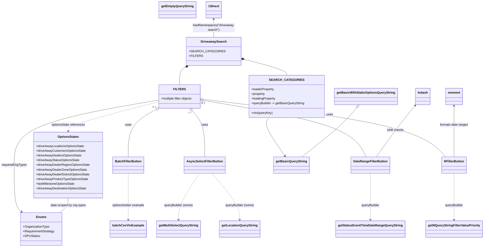

# Diagram: web/portal/src/pages/driveaway/components/search/DriveAway.searchOptions.js

> Auto-generated by Obscura crawlers

## Mermaid

### SVG

<svg id="container" width="2401.630859375" xmlns="http://www.w3.org/2000/svg" class="classDiagram" height="1260" viewBox="0 0 2401.630859375 1260" role="graphics-document document" aria-roledescription="class"><g><defs><marker id="container_class-aggregationStart" class="marker aggregation class" refX="18" refY="7" markerWidth="190" markerHeight="240" orient="auto"><path d="M 18,7 L9,13 L1,7 L9,1 Z"></path></marker></defs><defs><marker id="container_class-aggregationEnd" class="marker aggregation class" refX="1" refY="7" markerWidth="20" markerHeight="28" orient="auto"><path d="M 18,7 L9,13 L1,7 L9,1 Z"></path></marker></defs><defs><marker id="container_class-extensionStart" class="marker extension class" refX="18" refY="7" markerWidth="190" markerHeight="240" orient="auto"><path d="M 1,7 L18,13 V 1 Z"></path></marker></defs><defs><marker id="container_class-extensionEnd" class="marker extension class" refX="1" refY="7" markerWidth="20" markerHeight="28" orient="auto"><path d="M 1,1 V 13 L18,7 Z"></path></marker></defs><defs><marker id="container_class-compositionStart" class="marker composition class" refX="18" refY="7" markerWidth="190" markerHeight="240" orient="auto"><path d="M 18,7 L9,13 L1,7 L9,1 Z"></path></marker></defs><defs><marker id="container_class-compositionEnd" class="marker composition class" refX="1" refY="7" markerWidth="20" markerHeight="28" orient="auto"><path d="M 18,7 L9,13 L1,7 L9,1 Z"></path></marker></defs><defs><marker id="container_class-dependencyStart" class="marker dependency class" refX="6" refY="7" markerWidth="190" markerHeight="240" orient="auto"><path d="M 5,7 L9,13 L1,7 L9,1 Z"></path></marker></defs><defs><marker id="container_class-dependencyEnd" class="marker dependency class" refX="13" refY="7" markerWidth="20" markerHeight="28" orient="auto"><path d="M 18,7 L9,13 L14,7 L9,1 Z"></path></marker></defs><defs><marker id="container_class-lollipopStart" class="marker lollipop class" refX="13" refY="7" markerWidth="190" markerHeight="240" orient="auto"><circle stroke="black" fill="transparent" cx="7" cy="7" r="6"></circle></marker></defs><defs><marker id="container_class-lollipopEnd" class="marker lollipop class" refX="1" refY="7" markerWidth="190" markerHeight="240" orient="auto"><circle stroke="black" fill="transparent" cx="7" cy="7" r="6"></circle></marker></defs><g class="root"><g class="clusters"></g><g class="edgePaths"><path d="M1211.461,299.797L1247.643,309.664C1283.826,319.531,1356.191,339.266,1392.374,353.299C1428.557,367.333,1428.557,375.667,1428.557,379.833L1428.557,384" id="id_DriveawaySearch_SEARCH_CATEGORIES_1" class="edge-thickness-normal edge-pattern-solid relation" style=";;;" data-edge="true" data-et="edge" data-id="id_DriveawaySearch_SEARCH_CATEGORIES_1" data-points="W3sieCI6MTE5NC44MTgzNTkzNzUsInkiOjI5NS4yNTgzMjk4NTU2OTY0fSx7IngiOjE0MjguNTU2NjQwNjI1LCJ5IjozNTl9LHsieCI6MTQyOC41NTY2NDA2MjUsInkiOjM4NH1d" marker-start="url(#container_class-compositionStart)"></path><path d="M935.879,339.261L930.047,342.551C924.214,345.841,912.548,352.42,906.716,367.877C900.883,383.333,900.883,407.667,900.883,419.833L900.883,432" id="id_DriveawaySearch_FILTERS_2" class="edge-thickness-normal edge-pattern-solid relation" style=";;;" data-edge="true" data-et="edge" data-id="id_DriveawaySearch_FILTERS_2" data-points="W3sieCI6OTUwLjkwNDI5Njg3NSwieSI6MzMwLjc4NjY4NTI5MTgxMjl9LHsieCI6OTAwLjg4MjgxMjUsInkiOjM1OX0seyJ4Ijo5MDAuODgyODEyNSwieSI6NDMyfV0=" marker-start="url(#container_class-compositionStart)"></path><path d="M962.967,565.152L973.13,577.127C983.293,589.101,1003.619,613.051,1013.782,652.192C1023.945,691.333,1023.945,745.667,1023.945,772.833L1023.945,800" id="id_FILTERS_AsyncSelectFilterButton_3" class="edge-thickness-normal edge-pattern-solid relation" style=";;;" data-edge="true" data-et="edge" data-id="id_FILTERS_AsyncSelectFilterButton_3" data-points="W3sieCI6OTUxLjgwNTIyNjI5MzEwMzUsInkiOjU1Mn0seyJ4IjoxMDIzLjk0NTMxMjUsInkiOjYzN30seyJ4IjoxMDIzLjk0NTMxMjUsInkiOjgwMH1d" marker-start="url(#container_class-aggregationStart)"></path><path d="M1026.062,507.653L1198.459,529.211C1370.856,550.769,1715.65,593.884,1913.745,642.609C2111.841,691.333,2163.238,745.667,2188.936,772.833L2214.635,800" id="id_FILTERS_NFilterButton_4" class="edge-thickness-normal edge-pattern-solid relation" style=";;;" data-edge="true" data-et="edge" data-id="id_FILTERS_NFilterButton_4" data-points="W3sieCI6MTAwOC45NDUzMTI1LCJ5Ijo1MDUuNTEyOTMxNzI0MjAxODV9LHsieCI6MjA2MC40NDMzNTkzNzUsInkiOjYzN30seyJ4IjoyMjE0LjYzNDg5OTAwOTE0NjUsInkiOjgwMH1d" marker-start="url(#container_class-aggregationStart)"></path><path d="M781.605,560.6L759.465,573.333C737.325,586.067,693.045,611.533,670.906,651.433C648.766,691.333,648.766,745.667,648.766,772.833L648.766,800" id="id_FILTERS_BatchFilterButton_5" class="edge-thickness-normal edge-pattern-solid relation" style=";;;" data-edge="true" data-et="edge" data-id="id_FILTERS_BatchFilterButton_5" data-points="W3sieCI6Nzk2LjU1ODQ1OTA1MTcyNDIsInkiOjU1Mn0seyJ4Ijo2NDguNzY1NjI1LCJ5Ijo2Mzd9LHsieCI6NjQ4Ljc2NTYyNSwieSI6ODAwfV0=" marker-start="url(#container_class-aggregationStart)"></path><path d="M1025.943,513.608L1144.968,534.174C1263.992,554.739,1502.04,595.869,1634.562,643.601C1767.084,691.333,1794.08,745.667,1807.577,772.833L1821.075,800" id="id_FILTERS_DateRangeFilterButton_6" class="edge-thickness-normal edge-pattern-solid relation" style=";;;" data-edge="true" data-et="edge" data-id="id_FILTERS_DateRangeFilterButton_6" data-points="W3sieCI6MTAwOC45NDUzMTI1LCJ5Ijo1MTAuNjcxMzE1MTYyOTI2MjV9LHsieCI6MTc0MC4wODc4OTA2MjUsInkiOjYzN30seyJ4IjoxODIxLjA3NTQwOTY3OTg3OCwieSI6ODAwfV0=" marker-start="url(#container_class-aggregationStart)"></path><path d="M1343.3,600L1338.432,606.167C1333.564,612.333,1323.828,624.667,1336.552,657.168C1349.276,689.67,1384.46,742.341,1402.052,768.676L1419.644,795.011" id="id_SEARCH_CATEGORIES_getBasicQueryString_7" class="edge-thickness-normal edge-pattern-solid relation" style=";;;" data-edge="true" data-et="edge" data-id="id_SEARCH_CATEGORIES_getBasicQueryString_7" data-points="W3sieCI6MTM0My4zMDAwNjczNDkxMzc5LCJ5Ijo2MDB9LHsieCI6MTMxNC4wOTE3OTY4NzUsInkiOjYzN30seyJ4IjoxNDIyLjk3NjkxNTAxNTI0NCwieSI6ODAwfV0=" marker-end="url(#container_class-dependencyEnd)"></path><path d="M1059.252,884L1082.089,911.167C1104.926,938.333,1150.601,992.667,1173.438,1032C1196.275,1071.333,1196.275,1095.667,1196.275,1107.833L1196.275,1120" id="id_AsyncSelectFilterButton_getLocationQueryString_8" class="edge-thickness-normal edge-pattern-dashed relation" style=";;;" data-edge="true" data-et="edge" data-id="id_AsyncSelectFilterButton_getLocationQueryString_8" data-points="W3sieCI6MTA1OS4yNTE5NjI2NTI0MzksInkiOjg4NH0seyJ4IjoxMTk2LjI3NTM5MDYyNSwieSI6MTA0N30seyJ4IjoxMTk2LjI3NTM5MDYyNSwieSI6MTEyNn1d" marker-end="url(#container_class-dependencyEnd)"></path><path d="M997.505,884L980.402,911.167C963.3,938.333,929.095,992.667,911.993,1032C894.891,1071.333,894.891,1095.667,894.891,1107.833L894.891,1120" id="id_AsyncSelectFilterButton_getMultiSelectQueryString_9" class="edge-thickness-normal edge-pattern-dashed relation" style=";;;" data-edge="true" data-et="edge" data-id="id_AsyncSelectFilterButton_getMultiSelectQueryString_9" data-points="W3sieCI6OTk3LjUwNDgzOTkzOTAyNDQsInkiOjg4NH0seyJ4Ijo4OTQuODkwNjI1LCJ5IjoxMDQ3fSx7IngiOjg5NC44OTA2MjUsInkiOjExMjZ9XQ==" marker-end="url(#container_class-dependencyEnd)"></path><path d="M2254.365,884L2254.365,911.167C2254.365,938.333,2254.365,992.667,2254.365,1032C2254.365,1071.333,2254.365,1095.667,2254.365,1107.833L2254.365,1120" id="id_NFilterButton_getNQueryStringFilterValuePriority_10" class="edge-thickness-normal edge-pattern-dashed relation" style=";;;" data-edge="true" data-et="edge" data-id="id_NFilterButton_getNQueryStringFilterValuePriority_10" data-points="W3sieCI6MjI1NC4zNjUyMzQzNzUsInkiOjg4NH0seyJ4IjoyMjU0LjM2NTIzNDM3NSwieSI6MTA0N30seyJ4IjoyMjU0LjM2NTIzNDM3NSwieSI6MTEyNn1d" marker-end="url(#container_class-dependencyEnd)"></path><path d="M1841.943,884L1841.943,911.167C1841.943,938.333,1841.943,992.667,1841.943,1032C1841.943,1071.333,1841.943,1095.667,1841.943,1107.833L1841.943,1120" id="id_DateRangeFilterButton_getStatusEventTimeDateRangeQueryString_11" class="edge-thickness-normal edge-pattern-dashed relation" style=";;;" data-edge="true" data-et="edge" data-id="id_DateRangeFilterButton_getStatusEventTimeDateRangeQueryString_11" data-points="W3sieCI6MTg0MS45NDMzNTkzNzUsInkiOjg4NH0seyJ4IjoxODQxLjk0MzM1OTM3NSwieSI6MTA0N30seyJ4IjoxODQxLjk0MzM1OTM3NSwieSI6MTEyNn1d" marker-end="url(#container_class-dependencyEnd)"></path><path d="M648.766,884L648.766,911.167C648.766,938.333,648.766,992.667,648.766,1032C648.766,1071.333,648.766,1095.667,648.766,1107.833L648.766,1120" id="id_BatchFilterButton_batchCsvVinExample_12" class="edge-thickness-normal edge-pattern-dashed relation" style=";;;" data-edge="true" data-et="edge" data-id="id_BatchFilterButton_batchCsvVinExample_12" data-points="W3sieCI6NjQ4Ljc2NTYyNSwieSI6ODg0fSx7IngiOjY0OC43NjU2MjUsInkiOjEwNDd9LHsieCI6NjQ4Ljc2NTYyNSwieSI6MTEyNn1d" marker-end="url(#container_class-dependencyEnd)"></path><path d="M792.82,520.281L718.49,539.734C644.16,559.188,495.5,598.094,421.17,622.714C346.84,647.333,346.84,657.667,346.84,662.833L346.84,668" id="id_FILTERS_OptionsStates_13" class="edge-thickness-normal edge-pattern-dashed relation" style=";;;" data-edge="true" data-et="edge" data-id="id_FILTERS_OptionsStates_13" data-points="W3sieCI6NzkyLjgyMDMxMjUsInkiOjUyMC4yODEzMTI3OTMwMzQyfSx7IngiOjM0Ni44Mzk4NDM3NSwieSI6NjM3fSx7IngiOjM0Ni44Mzk4NDM3NSwieSI6Njc0fV0=" marker-end="url(#container_class-dependencyEnd)"></path><path d="M792.82,510.908L672.711,531.923C552.602,552.938,312.383,594.969,192.273,650.151C72.164,705.333,72.164,773.667,72.164,842C72.164,910.333,72.164,978.667,78.413,1018.339C84.662,1058.011,97.16,1069.022,103.409,1074.528L109.658,1080.034" id="id_FILTERS_Enums_14" class="edge-thickness-normal edge-pattern-solid relation" style=";;;" data-edge="true" data-et="edge" data-id="id_FILTERS_Enums_14" data-points="W3sieCI6NzkyLjgyMDMxMjUsInkiOjUxMC45MDc1NzU3MDA0NDEyfSx7IngiOjcyLjE2NDA2MjUsInkiOjYzN30seyJ4Ijo3Mi4xNjQwNjI1LCJ5Ijo4NDJ9LHsieCI6NzIuMTY0MDYyNSwieSI6MTA0N30seyJ4IjoxMTQuMTU5OTQ2NDEwMTIzOTYsInkiOjEwODR9XQ==" marker-end="url(#container_class-dependencyEnd)"></path><path d="M1774.217,547.54L1762.447,562.45C1750.676,577.36,1727.136,607.18,1681.896,649.257C1636.656,691.333,1569.717,745.667,1536.247,772.833L1502.778,800" id="id_getBasicWithStaticOptionsQueryString_getBasicQueryString_15" class="edge-thickness-normal edge-pattern-solid relation" style=";;;" data-edge="true" data-et="edge" data-id="id_getBasicWithStaticOptionsQueryString_getBasicQueryString_15" data-points="W3sieCI6MTc4NC45MDUyMTI4MjMyNzU5LCJ5Ijo1MzR9LHsieCI6MTcwMy41OTU3MDMxMjUsInkiOjYzN30seyJ4IjoxNTAyLjc3NzcxNTMyMDEyMTgsInkiOjgwMH1d" marker-start="url(#container_class-extensionStart)"></path><path d="M346.84,1010L346.84,1016.167C346.84,1022.333,346.84,1034.667,339.841,1047C332.841,1059.333,318.843,1071.667,311.843,1077.833L304.844,1084" id="id_OptionsStates_Enums_16" class="edge-thickness-normal edge-pattern-solid relation" style=";;;" data-edge="true" data-et="edge" data-id="id_OptionsStates_Enums_16" data-points="W3sieCI6MzQ2LjgzOTg0Mzc1LCJ5IjoxMDEwfSx7IngiOjM0Ni44Mzk4NDM3NSwieSI6MTA0N30seyJ4IjozMDQuODQzOTU5ODM5ODc2MDUsInkiOjEwODR9XQ=="></path><path d="M1072.861,98L1072.861,105.167C1072.861,112.333,1072.861,126.667,1072.861,142C1072.861,157.333,1072.861,173.667,1072.861,181.833L1072.861,190" id="id_i18next_DriveawaySearch_17" class="edge-thickness-normal edge-pattern-solid relation" style=";;;" data-edge="true" data-et="edge" data-id="id_i18next_DriveawaySearch_17" data-points="W3sieCI6MTA3Mi44NjEzMjgxMjUsInkiOjkyfSx7IngiOjEwNzIuODYxMzI4MTI1LCJ5IjoxNDF9LHsieCI6MTA3Mi44NjEzMjgxMjUsInkiOjE5MH1d" marker-start="url(#container_class-dependencyStart)"></path><path d="M2254.365,540L2254.365,556.167C2254.365,572.333,2254.365,604.667,2254.365,648C2254.365,691.333,2254.365,745.667,2254.365,772.833L2254.365,800" id="id_moment_NFilterButton_18" class="edge-thickness-normal edge-pattern-solid relation" style=";;;" data-edge="true" data-et="edge" data-id="id_moment_NFilterButton_18" data-points="W3sieCI6MjI1NC4zNjUyMzQzNzUsInkiOjUzNH0seyJ4IjoyMjU0LjM2NTIzNDM3NSwieSI6NjM3fSx7IngiOjIyNTQuMzY1MjM0Mzc1LCJ5Ijo4MDB9XQ==" marker-start="url(#container_class-dependencyStart)"></path><path d="M2058.871,538.709L2045.939,555.091C2033.007,571.473,2007.143,604.236,1975.746,647.785C1944.35,691.333,1907.42,745.667,1888.955,772.833L1870.49,800" id="id_lodash_DateRangeFilterButton_19" class="edge-thickness-normal edge-pattern-solid relation" style=";;;" data-edge="true" data-et="edge" data-id="id_lodash_DateRangeFilterButton_19" data-points="W3sieCI6MjA2Mi41ODg4MDY1NzMyNzYsInkiOjUzNH0seyJ4IjoxOTgxLjI3OTI5Njg3NSwieSI6NjM3fSx7IngiOjE4NzAuNDkwMjM0Mzc1LCJ5Ijo4MDB9XQ==" marker-start="url(#container_class-dependencyStart)"></path></g><g class="edgeLabels"><g class="edgeLabel"><g class="label" data-id="id_DriveawaySearch_SEARCH_CATEGORIES_1" transform="translate(0, 0)"><foreignObject width="0" height="0">

</foreignObject></g></g><g class="edgeLabel"><g class="label" data-id="id_DriveawaySearch_FILTERS_2" transform="translate(0, 0)"><foreignObject width="0" height="0">

</foreignObject></g></g><g class="edgeLabel" transform="translate(1023.9453125, 637)"><g class="label" data-id="id_FILTERS_AsyncSelectFilterButton_3" transform="translate(-16.4921875, -12)"><foreignObject width="32.984375" height="24">

uses

</foreignObject></g></g><g class="edgeLabel" transform="translate(1646.01474, 585.17679)"><g class="label" data-id="id_FILTERS_NFilterButton_4" transform="translate(-16.4921875, -12)"><foreignObject width="32.984375" height="24">

uses

</foreignObject></g></g><g class="edgeLabel" transform="translate(648.765625, 637)"><g class="label" data-id="id_FILTERS_BatchFilterButton_5" transform="translate(-16.4921875, -12)"><foreignObject width="32.984375" height="24">

uses

</foreignObject></g></g><g class="edgeLabel" transform="translate(1464.19331, 589.33023)"><g class="label" data-id="id_FILTERS_DateRangeFilterButton_6" transform="translate(-16.4921875, -12)"><foreignObject width="32.984375" height="24">

uses

</foreignObject></g></g><g class="edgeLabel"><g class="label" data-id="id_SEARCH_CATEGORIES_getBasicQueryString_7" transform="translate(0, 0)"><foreignObject width="0" height="0">

</foreignObject></g></g><g class="edgeLabel" transform="translate(1196.275390625, 1047)"><g class="label" data-id="id_AsyncSelectFilterButton_getLocationQueryString_8" transform="translate(-74.0703125, -12)"><foreignObject width="148.140625" height="24">

queryBuilder (some)

</foreignObject></g></g><g class="edgeLabel" transform="translate(894.890625, 1047)"><g class="label" data-id="id_AsyncSelectFilterButton_getMultiSelectQueryString_9" transform="translate(-74.0703125, -12)"><foreignObject width="148.140625" height="24">

queryBuilder (some)

</foreignObject></g></g><g class="edgeLabel" transform="translate(2254.365234375, 1047)"><g class="label" data-id="id_NFilterButton_getNQueryStringFilterValuePriority_10" transform="translate(-47.140625, -12)"><foreignObject width="94.28125" height="24">

queryBuilder

</foreignObject></g></g><g class="edgeLabel" transform="translate(1841.943359375, 1047)"><g class="label" data-id="id_DateRangeFilterButton_getStatusEventTimeDateRangeQueryString_11" transform="translate(-47.140625, -12)"><foreignObject width="94.28125" height="24">

queryBuilder

</foreignObject></g></g><g class="edgeLabel" transform="translate(648.765625, 1047)"><g class="label" data-id="id_BatchFilterButton_batchCsvVinExample_12" transform="translate(-82.96875, -12)"><foreignObject width="165.9375" height="24">

optionsGetter example

</foreignObject></g></g><g class="edgeLabel" transform="translate(346.83984375, 637)"><g class="label" data-id="id_FILTERS_OptionsStates_13" transform="translate(-86.28125, -12)"><foreignObject width="172.5625" height="24">

optionsState references

</foreignObject></g></g><g class="edgeLabel" transform="translate(72.1640625, 842)"><g class="label" data-id="id_FILTERS_Enums_14" transform="translate(-64.1640625, -12)"><foreignObject width="128.328125" height="24">

requiredOrgTypes

</foreignObject></g></g><g class="edgeLabel"><g class="label" data-id="id_getBasicWithStaticOptionsQueryString_getBasicQueryString_15" transform="translate(0, 0)"><foreignObject width="0" height="0">

</foreignObject></g></g><g class="edgeLabel" transform="translate(346.83984375, 1047)"><g class="label" data-id="id_OptionsStates_Enums_16" transform="translate(-90.859375, -12)"><foreignObject width="181.71875" height="24">

data scoped by org types

</foreignObject></g></g><g class="edgeLabel" transform="translate(1072.861328125, 141)"><g class="label" data-id="id_i18next_DriveawaySearch_17" transform="translate(-106.8671875, -24)"><foreignObject width="213.734375" height="48">

loadNamespaces("driveaway-search")

</foreignObject></g></g><g class="edgeLabel" transform="translate(2254.365234375, 637)"><g class="label" data-id="id_moment_NFilterButton_18" transform="translate(-72.6796875, -12)"><foreignObject width="145.359375" height="24">

formats date ranges

</foreignObject></g></g><g class="edgeLabel" transform="translate(1962.76799, 664.23503)"><g class="label" data-id="id_lodash_DateRangeFilterButton_19" transform="translate(-42.671875, -12)"><foreignObject width="85.34375" height="24">

isNil checks

</foreignObject></g></g><g class="edgeTerminals" transform="translate(951.692667929107, 575.0485868812834)"><g class="inner" transform="translate(0, 0)"><foreignObject style="width: 36px; height: 12px;">
1..*
</foreignObject></g></g><g class="edgeTerminals" transform="translate(1024.4488600927264, 522.5684321040152)"><g class="inner" transform="translate(0, 0)"><foreignObject style="width: 36px; height: 12px;">
1..*
</foreignObject></g></g><g class="edgeTerminals" transform="translate(773.9101140715279, 547.7218521003488)"><g class="inner" transform="translate(0, 0)"><foreignObject style="width: 36px; height: 12px;">
0..1
</foreignObject></g></g><g class="edgeTerminals" transform="translate(1023.6358981400506, 528.4318505201632)"><g class="inner" transform="translate(0, 0)"><foreignObject style="width: 36px; height: 12px;">
0..1
</foreignObject></g></g></g><g class="nodes"><g class="node default" id="classId-DriveawaySearch-0" transform="translate(1072.861328125, 262)"><g class="basic label-container"><path d="M-121.95703125 -72 L121.95703125 -72 L121.95703125 72 L-121.95703125 72" stroke="none" stroke-width="0" fill="#ECECFF" style=""></path><path d="M-121.95703125 -72 C-64.98258778648324 -72, -8.008144322966487 -72, 121.95703125 -72 M-121.95703125 -72 C-57.89027031408794 -72, 6.176490621824115 -72, 121.95703125 -72 M121.95703125 -72 C121.95703125 -30.55614832456758, 121.95703125 10.88770335086484, 121.95703125 72 M121.95703125 -72 C121.95703125 -17.78020189319109, 121.95703125 36.43959621361782, 121.95703125 72 M121.95703125 72 C58.45355069791926 72, -5.049929854161476 72, -121.95703125 72 M121.95703125 72 C35.09512981502847 72, -51.76677161994306 72, -121.95703125 72 M-121.95703125 72 C-121.95703125 36.4939382788497, -121.95703125 0.9878765576993942, -121.95703125 -72 M-121.95703125 72 C-121.95703125 37.376421202211155, -121.95703125 2.75284240442231, -121.95703125 -72" stroke="#9370DB" stroke-width="1.3" fill="none" stroke-dasharray="0 0" style=""></path></g><g class="annotation-group text" transform="translate(0, -48)"></g><g class="label-group text" transform="translate(-62.3984375, -48)"><g class="label" style="font-weight: bolder" transform="translate(0,-12)"><foreignObject width="124.796875" height="24">

DriveawaySearch

</foreignObject></g></g><g class="members-group text" transform="translate(-109.95703125, 0)"><g class="label" style="" transform="translate(0,-12)"><foreignObject width="157.515625" height="24">

+SEARCH_CATEGORIES

</foreignObject></g><g class="label" style="" transform="translate(0,12)"><foreignObject width="62.328125" height="24">

+FILTERS

</foreignObject></g></g><g class="methods-group text" transform="translate(-109.95703125, 72)"></g><g class="divider" style=""><path d="M-121.95703125 -24 C-31.78142887266337 -24, 58.39417350467326 -24, 121.95703125 -24 M-121.95703125 -24 C-34.48525978730305 -24, 52.9865116753939 -24, 121.95703125 -24" stroke="#9370DB" stroke-width="1.3" fill="none" stroke-dasharray="0 0" style=""></path></g><g class="divider" style=""><path d="M-121.95703125 48 C-35.92057846668395 48, 50.1158743166321 48, 121.95703125 48 M-121.95703125 48 C-43.91983462651491 48, 34.117361996970175 48, 121.95703125 48" stroke="#9370DB" stroke-width="1.3" fill="none" stroke-dasharray="0 0" style=""></path></g></g><g class="node default" id="classId-SEARCH_CATEGORIES-1" transform="translate(1428.556640625, 492)"><g class="basic label-container"><path d="M-185.89453125 -108 L185.89453125 -108 L185.89453125 108 L-185.89453125 108" stroke="none" stroke-width="0" fill="#ECECFF" style=""></path><path d="M-185.89453125 -108 C-69.0472993422322 -108, 47.79993256553561 -108, 185.89453125 -108 M-185.89453125 -108 C-81.48587230105663 -108, 22.92278664788674 -108, 185.89453125 -108 M185.89453125 -108 C185.89453125 -32.03461865819955, 185.89453125 43.9307626836009, 185.89453125 108 M185.89453125 -108 C185.89453125 -62.31735294981353, 185.89453125 -16.634705899627065, 185.89453125 108 M185.89453125 108 C59.88661830499562 108, -66.12129464000876 108, -185.89453125 108 M185.89453125 108 C55.25095983491852 108, -75.39261158016296 108, -185.89453125 108 M-185.89453125 108 C-185.89453125 39.23798475257661, -185.89453125 -29.524030494846784, -185.89453125 -108 M-185.89453125 108 C-185.89453125 58.90057904666367, -185.89453125 9.801158093327345, -185.89453125 -108" stroke="#9370DB" stroke-width="1.3" fill="none" stroke-dasharray="0 0" style=""></path></g><g class="annotation-group text" transform="translate(0, -84)"></g><g class="label-group text" transform="translate(-76.1171875, -84)"><g class="label" style="font-weight: bolder" transform="translate(0,-12)"><foreignObject width="152.234375" height="24">

SEARCH_CATEGORIES

</foreignObject></g></g><g class="members-group text" transform="translate(-173.89453125, -36)"><g class="label" style="" transform="translate(0,-12)"><foreignObject width="116.9375" height="24">

+loaderProperty

</foreignObject></g><g class="label" style="" transform="translate(0,12)"><foreignObject width="70.5" height="24">

+property

</foreignObject></g><g class="label" style="" transform="translate(0,36)"><foreignObject width="124.25" height="24">

+loadingProperty

</foreignObject></g><g class="label" style="" transform="translate(0,60)"><foreignObject width="271.671875" height="24">

+queryBuilder -&gt; getBasicQueryString

</foreignObject></g></g><g class="methods-group text" transform="translate(-173.89453125, 84)"><g class="label" style="" transform="translate(0,-12)"><foreignObject width="107.34375" height="24">

+vin(queryKey)

</foreignObject></g></g><g class="divider" style=""><path d="M-185.89453125 -60 C-106.39949259540457 -60, -26.904453940809134 -60, 185.89453125 -60 M-185.89453125 -60 C-59.685974304003196 -60, 66.52258264199361 -60, 185.89453125 -60" stroke="#9370DB" stroke-width="1.3" fill="none" stroke-dasharray="0 0" style=""></path></g><g class="divider" style=""><path d="M-185.89453125 60 C-111.33317526321581 60, -36.771819276431614 60, 185.89453125 60 M-185.89453125 60 C-107.42804731598693 60, -28.96156338197386 60, 185.89453125 60" stroke="#9370DB" stroke-width="1.3" fill="none" stroke-dasharray="0 0" style=""></path></g></g><g class="node default" id="classId-FILTERS-2" transform="translate(900.8828125, 492)"><g class="basic label-container"><path d="M-108.0625 -60 L108.0625 -60 L108.0625 60 L-108.0625 60" stroke="none" stroke-width="0" fill="#ECECFF" style=""></path><path d="M-108.0625 -60 C-51.837844458363975 -60, 4.38681108327205 -60, 108.0625 -60 M-108.0625 -60 C-25.185709941594084 -60, 57.69108011681183 -60, 108.0625 -60 M108.0625 -60 C108.0625 -29.218033095063124, 108.0625 1.5639338098737525, 108.0625 60 M108.0625 -60 C108.0625 -30.864939493927558, 108.0625 -1.7298789878551162, 108.0625 60 M108.0625 60 C35.2539996051877 60, -37.5545007896246 60, -108.0625 60 M108.0625 60 C37.698107415383845 60, -32.66628516923231 60, -108.0625 60 M-108.0625 60 C-108.0625 16.729958093402338, -108.0625 -26.540083813195324, -108.0625 -60 M-108.0625 60 C-108.0625 23.808504679298487, -108.0625 -12.382990641403026, -108.0625 -60" stroke="#9370DB" stroke-width="1.3" fill="none" stroke-dasharray="0 0" style=""></path></g><g class="annotation-group text" transform="translate(0, -36)"></g><g class="label-group text" transform="translate(-27.5625, -36)"><g class="label" style="font-weight: bolder" transform="translate(0,-12)"><foreignObject width="55.125" height="24">

FILTERS

</foreignObject></g></g><g class="members-group text" transform="translate(-96.0625, 12)"><g class="label" style="" transform="translate(0,-12)"><foreignObject width="164.5625" height="24">

+multiple filter objects

</foreignObject></g></g><g class="methods-group text" transform="translate(-96.0625, 60)"></g><g class="divider" style=""><path d="M-108.0625 -12 C-27.090468069607823 -12, 53.881563860784354 -12, 108.0625 -12 M-108.0625 -12 C-59.634288744794866 -12, -11.206077489589731 -12, 108.0625 -12" stroke="#9370DB" stroke-width="1.3" fill="none" stroke-dasharray="0 0" style=""></path></g><g class="divider" style=""><path d="M-108.0625 36 C-37.15414383839621 36, 33.75421232320758 36, 108.0625 36 M-108.0625 36 C-35.19366608213414 36, 37.67516783573171 36, 108.0625 36" stroke="#9370DB" stroke-width="1.3" fill="none" stroke-dasharray="0 0" style=""></path></g></g><g class="node default" id="classId-AsyncSelectFilterButton-3" transform="translate(1023.9453125, 842)"><g class="basic label-container"><path d="M-99.390625 -42 L99.390625 -42 L99.390625 42 L-99.390625 42" stroke="none" stroke-width="0" fill="#ECECFF" style=""></path><path d="M-99.390625 -42 C-46.25279343175508 -42, 6.88503813648984 -42, 99.390625 -42 M-99.390625 -42 C-24.21521346913464 -42, 50.96019806173072 -42, 99.390625 -42 M99.390625 -42 C99.390625 -10.324336055631662, 99.390625 21.351327888736677, 99.390625 42 M99.390625 -42 C99.390625 -25.029639474408114, 99.390625 -8.059278948816228, 99.390625 42 M99.390625 42 C54.79277965991537 42, 10.194934319830736 42, -99.390625 42 M99.390625 42 C45.173099558982244 42, -9.044425882035512 42, -99.390625 42 M-99.390625 42 C-99.390625 9.180199620604931, -99.390625 -23.639600758790138, -99.390625 -42 M-99.390625 42 C-99.390625 22.62447561623083, -99.390625 3.248951232461657, -99.390625 -42" stroke="#9370DB" stroke-width="1.3" fill="none" stroke-dasharray="0 0" style=""></path></g><g class="annotation-group text" transform="translate(0, -18)"></g><g class="label-group text" transform="translate(-87.390625, -18)"><g class="label" style="font-weight: bolder" transform="translate(0,-12)"><foreignObject width="174.78125" height="24">

AsyncSelectFilterButton

</foreignObject></g></g><g class="members-group text" transform="translate(-87.390625, 30)"></g><g class="methods-group text" transform="translate(-87.390625, 60)"></g><g class="divider" style=""><path d="M-99.390625 6 C-24.779687612642533 6, 49.831249774714934 6, 99.390625 6 M-99.390625 6 C-29.748024269618725 6, 39.89457646076255 6, 99.390625 6" stroke="#9370DB" stroke-width="1.3" fill="none" stroke-dasharray="0 0" style=""></path></g><g class="divider" style=""><path d="M-99.390625 24 C-53.09337139287014 24, -6.796117785740279 24, 99.390625 24 M-99.390625 24 C-25.720475223502646 24, 47.94967455299471 24, 99.390625 24" stroke="#9370DB" stroke-width="1.3" fill="none" stroke-dasharray="0 0" style=""></path></g></g><g class="node default" id="classId-NFilterButton-4" transform="translate(2254.365234375, 842)"><g class="basic label-container"><path d="M-61.0078125 -42 L61.0078125 -42 L61.0078125 42 L-61.0078125 42" stroke="none" stroke-width="0" fill="#ECECFF" style=""></path><path d="M-61.0078125 -42 C-26.093603414193822 -42, 8.820605671612356 -42, 61.0078125 -42 M-61.0078125 -42 C-15.22148023956359 -42, 30.56485202087282 -42, 61.0078125 -42 M61.0078125 -42 C61.0078125 -21.979941537872207, 61.0078125 -1.9598830757444148, 61.0078125 42 M61.0078125 -42 C61.0078125 -25.085181959184368, 61.0078125 -8.170363918368736, 61.0078125 42 M61.0078125 42 C19.499536407881834 42, -22.008739684236332 42, -61.0078125 42 M61.0078125 42 C28.83189296822708 42, -3.344026563545839 42, -61.0078125 42 M-61.0078125 42 C-61.0078125 13.750033443843787, -61.0078125 -14.499933112312426, -61.0078125 -42 M-61.0078125 42 C-61.0078125 19.151140357768135, -61.0078125 -3.69771928446373, -61.0078125 -42" stroke="#9370DB" stroke-width="1.3" fill="none" stroke-dasharray="0 0" style=""></path></g><g class="annotation-group text" transform="translate(0, -18)"></g><g class="label-group text" transform="translate(-49.0078125, -18)"><g class="label" style="font-weight: bolder" transform="translate(0,-12)"><foreignObject width="98.015625" height="24">

NFilterButton

</foreignObject></g></g><g class="members-group text" transform="translate(-49.0078125, 30)"></g><g class="methods-group text" transform="translate(-49.0078125, 60)"></g><g class="divider" style=""><path d="M-61.0078125 6 C-21.632424363719913 6, 17.742963772560174 6, 61.0078125 6 M-61.0078125 6 C-26.044709892298158 6, 8.918392715403684 6, 61.0078125 6" stroke="#9370DB" stroke-width="1.3" fill="none" stroke-dasharray="0 0" style=""></path></g><g class="divider" style=""><path d="M-61.0078125 24 C-19.291845496243603 24, 22.424121507512794 24, 61.0078125 24 M-61.0078125 24 C-30.888653220781343 24, -0.7694939415626862 24, 61.0078125 24" stroke="#9370DB" stroke-width="1.3" fill="none" stroke-dasharray="0 0" style=""></path></g></g><g class="node default" id="classId-BatchFilterButton-5" transform="translate(648.765625, 842)"><g class="basic label-container"><path d="M-76.4140625 -42 L76.4140625 -42 L76.4140625 42 L-76.4140625 42" stroke="none" stroke-width="0" fill="#ECECFF" style=""></path><path d="M-76.4140625 -42 C-28.69093727827869 -42, 19.032187943442622 -42, 76.4140625 -42 M-76.4140625 -42 C-23.337101630169656 -42, 29.73985923966069 -42, 76.4140625 -42 M76.4140625 -42 C76.4140625 -15.55673957104256, 76.4140625 10.886520857914881, 76.4140625 42 M76.4140625 -42 C76.4140625 -16.068268774963087, 76.4140625 9.863462450073825, 76.4140625 42 M76.4140625 42 C36.08813547118311 42, -4.237791557633784 42, -76.4140625 42 M76.4140625 42 C26.96209401237798 42, -22.489874475244036 42, -76.4140625 42 M-76.4140625 42 C-76.4140625 13.06447357488269, -76.4140625 -15.87105285023462, -76.4140625 -42 M-76.4140625 42 C-76.4140625 23.806988306824472, -76.4140625 5.613976613648944, -76.4140625 -42" stroke="#9370DB" stroke-width="1.3" fill="none" stroke-dasharray="0 0" style=""></path></g><g class="annotation-group text" transform="translate(0, -18)"></g><g class="label-group text" transform="translate(-64.4140625, -18)"><g class="label" style="font-weight: bolder" transform="translate(0,-12)"><foreignObject width="128.828125" height="24">

BatchFilterButton

</foreignObject></g></g><g class="members-group text" transform="translate(-64.4140625, 30)"></g><g class="methods-group text" transform="translate(-64.4140625, 60)"></g><g class="divider" style=""><path d="M-76.4140625 6 C-25.33355154669669 6, 25.74695940660662 6, 76.4140625 6 M-76.4140625 6 C-45.5459145629123 6, -14.677766625824596 6, 76.4140625 6" stroke="#9370DB" stroke-width="1.3" fill="none" stroke-dasharray="0 0" style=""></path></g><g class="divider" style=""><path d="M-76.4140625 24 C-35.86782188374371 24, 4.678418732512583 24, 76.4140625 24 M-76.4140625 24 C-16.04221437421873 24, 44.32963375156254 24, 76.4140625 24" stroke="#9370DB" stroke-width="1.3" fill="none" stroke-dasharray="0 0" style=""></path></g></g><g class="node default" id="classId-DateRangeFilterButton-6" transform="translate(1841.943359375, 842)"><g class="basic label-container"><path d="M-95.078125 -42 L95.078125 -42 L95.078125 42 L-95.078125 42" stroke="none" stroke-width="0" fill="#ECECFF" style=""></path><path d="M-95.078125 -42 C-53.25725410166879 -42, -11.436383203337584 -42, 95.078125 -42 M-95.078125 -42 C-27.626771244873865 -42, 39.82458251025227 -42, 95.078125 -42 M95.078125 -42 C95.078125 -14.046360963912083, 95.078125 13.907278072175835, 95.078125 42 M95.078125 -42 C95.078125 -17.836788323448264, 95.078125 6.326423353103472, 95.078125 42 M95.078125 42 C23.46163534931543 42, -48.15485430136914 42, -95.078125 42 M95.078125 42 C57.00185088008771 42, 18.925576760175417 42, -95.078125 42 M-95.078125 42 C-95.078125 8.419719353254017, -95.078125 -25.160561293491966, -95.078125 -42 M-95.078125 42 C-95.078125 23.960620357852957, -95.078125 5.921240715705913, -95.078125 -42" stroke="#9370DB" stroke-width="1.3" fill="none" stroke-dasharray="0 0" style=""></path></g><g class="annotation-group text" transform="translate(0, -18)"></g><g class="label-group text" transform="translate(-83.078125, -18)"><g class="label" style="font-weight: bolder" transform="translate(0,-12)"><foreignObject width="166.15625" height="24">

DateRangeFilterButton

</foreignObject></g></g><g class="members-group text" transform="translate(-83.078125, 30)"></g><g class="methods-group text" transform="translate(-83.078125, 60)"></g><g class="divider" style=""><path d="M-95.078125 6 C-25.374458517532304 6, 44.32920796493539 6, 95.078125 6 M-95.078125 6 C-55.781086523378136 6, -16.48404804675627 6, 95.078125 6" stroke="#9370DB" stroke-width="1.3" fill="none" stroke-dasharray="0 0" style=""></path></g><g class="divider" style=""><path d="M-95.078125 24 C-49.626266107922994 24, -4.174407215845989 24, 95.078125 24 M-95.078125 24 C-49.86324427306297 24, -4.648363546125935 24, 95.078125 24" stroke="#9370DB" stroke-width="1.3" fill="none" stroke-dasharray="0 0" style=""></path></g></g><g class="node default" id="classId-getBasicQueryString-7" transform="translate(1451.033203125, 842)"><g class="basic label-container"><path d="M-86.9453125 -42 L86.9453125 -42 L86.9453125 42 L-86.9453125 42" stroke="none" stroke-width="0" fill="#ECECFF" style=""></path><path d="M-86.9453125 -42 C-46.0848301677527 -42, -5.224347835505398 -42, 86.9453125 -42 M-86.9453125 -42 C-45.59282010428959 -42, -4.240327708579187 -42, 86.9453125 -42 M86.9453125 -42 C86.9453125 -21.65010701441731, 86.9453125 -1.300214028834617, 86.9453125 42 M86.9453125 -42 C86.9453125 -12.265596696463419, 86.9453125 17.468806607073162, 86.9453125 42 M86.9453125 42 C25.277116197390285 42, -36.39108010521943 42, -86.9453125 42 M86.9453125 42 C34.12955953548361 42, -18.686193429032784 42, -86.9453125 42 M-86.9453125 42 C-86.9453125 17.809499937929523, -86.9453125 -6.381000124140954, -86.9453125 -42 M-86.9453125 42 C-86.9453125 22.477181233459333, -86.9453125 2.954362466918667, -86.9453125 -42" stroke="#9370DB" stroke-width="1.3" fill="none" stroke-dasharray="0 0" style=""></path></g><g class="annotation-group text" transform="translate(0, -18)"></g><g class="label-group text" transform="translate(-74.9453125, -18)"><g class="label" style="font-weight: bolder" transform="translate(0,-12)"><foreignObject width="149.890625" height="24">

getBasicQueryString

</foreignObject></g></g><g class="members-group text" transform="translate(-74.9453125, 30)"></g><g class="methods-group text" transform="translate(-74.9453125, 60)"></g><g class="divider" style=""><path d="M-86.9453125 6 C-41.44325073705866 6, 4.058811025882676 6, 86.9453125 6 M-86.9453125 6 C-38.35832385811338 6, 10.22866478377324 6, 86.9453125 6" stroke="#9370DB" stroke-width="1.3" fill="none" stroke-dasharray="0 0" style=""></path></g><g class="divider" style=""><path d="M-86.9453125 24 C-51.48478866877611 24, -16.024264837552224 24, 86.9453125 24 M-86.9453125 24 C-47.656245113596704 24, -8.367177727193408 24, 86.9453125 24" stroke="#9370DB" stroke-width="1.3" fill="none" stroke-dasharray="0 0" style=""></path></g></g><g class="node default" id="classId-getBasicWithStaticOptionsQueryString-8" transform="translate(1818.060546875, 492)"><g class="basic label-container"><path d="M-153.609375 -42 L153.609375 -42 L153.609375 42 L-153.609375 42" stroke="none" stroke-width="0" fill="#ECECFF" style=""></path><path d="M-153.609375 -42 C-78.10605371732828 -42, -2.6027324346565592 -42, 153.609375 -42 M-153.609375 -42 C-73.46024939480797 -42, 6.688876210384052 -42, 153.609375 -42 M153.609375 -42 C153.609375 -8.998620606788414, 153.609375 24.002758786423172, 153.609375 42 M153.609375 -42 C153.609375 -14.05429401239547, 153.609375 13.89141197520906, 153.609375 42 M153.609375 42 C73.08033397593778 42, -7.448707048124447 42, -153.609375 42 M153.609375 42 C57.64682300368365 42, -38.3157289926327 42, -153.609375 42 M-153.609375 42 C-153.609375 23.108804762810433, -153.609375 4.217609525620865, -153.609375 -42 M-153.609375 42 C-153.609375 15.071190878429412, -153.609375 -11.857618243141175, -153.609375 -42" stroke="#9370DB" stroke-width="1.3" fill="none" stroke-dasharray="0 0" style=""></path></g><g class="annotation-group text" transform="translate(0, -18)"></g><g class="label-group text" transform="translate(-141.609375, -18)"><g class="label" style="font-weight: bolder" transform="translate(0,-12)"><foreignObject width="283.21875" height="24">

getBasicWithStaticOptionsQueryString

</foreignObject></g></g><g class="members-group text" transform="translate(-141.609375, 30)"></g><g class="methods-group text" transform="translate(-141.609375, 60)"></g><g class="divider" style=""><path d="M-153.609375 6 C-47.34811252665227 6, 58.913149946695455 6, 153.609375 6 M-153.609375 6 C-35.50884659806735 6, 82.5916818038653 6, 153.609375 6" stroke="#9370DB" stroke-width="1.3" fill="none" stroke-dasharray="0 0" style=""></path></g><g class="divider" style=""><path d="M-153.609375 24 C-57.27150143858286 24, 39.06637212283428 24, 153.609375 24 M-153.609375 24 C-70.26263983110633 24, 13.084095337787346 24, 153.609375 24" stroke="#9370DB" stroke-width="1.3" fill="none" stroke-dasharray="0 0" style=""></path></g></g><g class="node default" id="classId-getLocationQueryString-9" transform="translate(1196.275390625, 1168)"><g class="basic label-container"><path d="M-99.1015625 -42 L99.1015625 -42 L99.1015625 42 L-99.1015625 42" stroke="none" stroke-width="0" fill="#ECECFF" style=""></path><path d="M-99.1015625 -42 C-51.67028270324929 -42, -4.239002906498584 -42, 99.1015625 -42 M-99.1015625 -42 C-57.05797175826851 -42, -15.014381016537016 -42, 99.1015625 -42 M99.1015625 -42 C99.1015625 -9.711453589116744, 99.1015625 22.577092821766513, 99.1015625 42 M99.1015625 -42 C99.1015625 -10.660250567354584, 99.1015625 20.67949886529083, 99.1015625 42 M99.1015625 42 C30.11819211221878 42, -38.86517827556244 42, -99.1015625 42 M99.1015625 42 C29.773258718584373 42, -39.555045062831255 42, -99.1015625 42 M-99.1015625 42 C-99.1015625 22.281365212816148, -99.1015625 2.562730425632296, -99.1015625 -42 M-99.1015625 42 C-99.1015625 8.740224189836319, -99.1015625 -24.519551620327363, -99.1015625 -42" stroke="#9370DB" stroke-width="1.3" fill="none" stroke-dasharray="0 0" style=""></path></g><g class="annotation-group text" transform="translate(0, -18)"></g><g class="label-group text" transform="translate(-87.1015625, -18)"><g class="label" style="font-weight: bolder" transform="translate(0,-12)"><foreignObject width="174.203125" height="24">

getLocationQueryString

</foreignObject></g></g><g class="members-group text" transform="translate(-87.1015625, 30)"></g><g class="methods-group text" transform="translate(-87.1015625, 60)"></g><g class="divider" style=""><path d="M-99.1015625 6 C-25.50231385484011 6, 48.09693479031978 6, 99.1015625 6 M-99.1015625 6 C-42.772010739175265 6, 13.55754102164947 6, 99.1015625 6" stroke="#9370DB" stroke-width="1.3" fill="none" stroke-dasharray="0 0" style=""></path></g><g class="divider" style=""><path d="M-99.1015625 24 C-59.036566430988756 24, -18.971570361977513 24, 99.1015625 24 M-99.1015625 24 C-25.555801504805586 24, 47.98995949038883 24, 99.1015625 24" stroke="#9370DB" stroke-width="1.3" fill="none" stroke-dasharray="0 0" style=""></path></g></g><g class="node default" id="classId-getMultiSelectQueryString-10" transform="translate(894.890625, 1168)"><g class="basic label-container"><path d="M-109.0078125 -42 L109.0078125 -42 L109.0078125 42 L-109.0078125 42" stroke="none" stroke-width="0" fill="#ECECFF" style=""></path><path d="M-109.0078125 -42 C-44.560828118436675 -42, 19.88615626312665 -42, 109.0078125 -42 M-109.0078125 -42 C-55.29718879826045 -42, -1.5865650965209 -42, 109.0078125 -42 M109.0078125 -42 C109.0078125 -10.600754168487015, 109.0078125 20.79849166302597, 109.0078125 42 M109.0078125 -42 C109.0078125 -20.6839652459931, 109.0078125 0.6320695080137995, 109.0078125 42 M109.0078125 42 C55.70759493369864 42, 2.407377367397274 42, -109.0078125 42 M109.0078125 42 C55.505577149368825 42, 2.003341798737651 42, -109.0078125 42 M-109.0078125 42 C-109.0078125 23.905032226985853, -109.0078125 5.810064453971705, -109.0078125 -42 M-109.0078125 42 C-109.0078125 20.983991059326417, -109.0078125 -0.032017881347165655, -109.0078125 -42" stroke="#9370DB" stroke-width="1.3" fill="none" stroke-dasharray="0 0" style=""></path></g><g class="annotation-group text" transform="translate(0, -18)"></g><g class="label-group text" transform="translate(-97.0078125, -18)"><g class="label" style="font-weight: bolder" transform="translate(0,-12)"><foreignObject width="194.015625" height="24">

getMultiSelectQueryString

</foreignObject></g></g><g class="members-group text" transform="translate(-97.0078125, 30)"></g><g class="methods-group text" transform="translate(-97.0078125, 60)"></g><g class="divider" style=""><path d="M-109.0078125 6 C-22.840963656118944 6, 63.32588518776211 6, 109.0078125 6 M-109.0078125 6 C-65.40397966479762 6, -21.80014682959525 6, 109.0078125 6" stroke="#9370DB" stroke-width="1.3" fill="none" stroke-dasharray="0 0" style=""></path></g><g class="divider" style=""><path d="M-109.0078125 24 C-43.66763283993042 24, 21.67254682013916 24, 109.0078125 24 M-109.0078125 24 C-27.524212816483313 24, 53.95938686703337 24, 109.0078125 24" stroke="#9370DB" stroke-width="1.3" fill="none" stroke-dasharray="0 0" style=""></path></g></g><g class="node default" id="classId-getNQueryStringFilterValuePriority-11" transform="translate(2254.365234375, 1168)"><g class="basic label-container"><path d="M-139.265625 -42 L139.265625 -42 L139.265625 42 L-139.265625 42" stroke="none" stroke-width="0" fill="#ECECFF" style=""></path><path d="M-139.265625 -42 C-66.26911810949751 -42, 6.727388781004976 -42, 139.265625 -42 M-139.265625 -42 C-70.52095406599868 -42, -1.77628313199736 -42, 139.265625 -42 M139.265625 -42 C139.265625 -19.784692427686416, 139.265625 2.4306151446271684, 139.265625 42 M139.265625 -42 C139.265625 -13.808038560165375, 139.265625 14.38392287966925, 139.265625 42 M139.265625 42 C50.056550769468146 42, -39.15252346106371 42, -139.265625 42 M139.265625 42 C38.20013841496548 42, -62.86534817006904 42, -139.265625 42 M-139.265625 42 C-139.265625 23.993459003065677, -139.265625 5.986918006131354, -139.265625 -42 M-139.265625 42 C-139.265625 15.931369450933335, -139.265625 -10.13726109813333, -139.265625 -42" stroke="#9370DB" stroke-width="1.3" fill="none" stroke-dasharray="0 0" style=""></path></g><g class="annotation-group text" transform="translate(0, -18)"></g><g class="label-group text" transform="translate(-127.265625, -18)"><g class="label" style="font-weight: bolder" transform="translate(0,-12)"><foreignObject width="254.53125" height="24">

getNQueryStringFilterValuePriority

</foreignObject></g></g><g class="members-group text" transform="translate(-127.265625, 30)"></g><g class="methods-group text" transform="translate(-127.265625, 60)"></g><g class="divider" style=""><path d="M-139.265625 6 C-62.80274383295394 6, 13.660137334092127 6, 139.265625 6 M-139.265625 6 C-71.52299408735605 6, -3.7803631747121074 6, 139.265625 6" stroke="#9370DB" stroke-width="1.3" fill="none" stroke-dasharray="0 0" style=""></path></g><g class="divider" style=""><path d="M-139.265625 24 C-49.58722510331708 24, 40.09117479336584 24, 139.265625 24 M-139.265625 24 C-69.03415426232591 24, 1.197316475348174 24, 139.265625 24" stroke="#9370DB" stroke-width="1.3" fill="none" stroke-dasharray="0 0" style=""></path></g></g><g class="node default" id="classId-getStatusEventTimeDateRangeQueryString-12" transform="translate(1841.943359375, 1168)"><g class="basic label-container"><path d="M-168.5703125 -42 L168.5703125 -42 L168.5703125 42 L-168.5703125 42" stroke="none" stroke-width="0" fill="#ECECFF" style=""></path><path d="M-168.5703125 -42 C-91.40308799749378 -42, -14.23586349498757 -42, 168.5703125 -42 M-168.5703125 -42 C-36.899318256210364 -42, 94.77167598757927 -42, 168.5703125 -42 M168.5703125 -42 C168.5703125 -18.165529744477123, 168.5703125 5.668940511045754, 168.5703125 42 M168.5703125 -42 C168.5703125 -9.842945804874972, 168.5703125 22.314108390250055, 168.5703125 42 M168.5703125 42 C98.14841999256683 42, 27.72652748513366 42, -168.5703125 42 M168.5703125 42 C96.33436116441555 42, 24.09840982883111 42, -168.5703125 42 M-168.5703125 42 C-168.5703125 13.008561598252427, -168.5703125 -15.982876803495145, -168.5703125 -42 M-168.5703125 42 C-168.5703125 9.76910866159858, -168.5703125 -22.46178267680284, -168.5703125 -42" stroke="#9370DB" stroke-width="1.3" fill="none" stroke-dasharray="0 0" style=""></path></g><g class="annotation-group text" transform="translate(0, -18)"></g><g class="label-group text" transform="translate(-156.5703125, -18)"><g class="label" style="font-weight: bolder" transform="translate(0,-12)"><foreignObject width="313.140625" height="24">

getStatusEventTimeDateRangeQueryString

</foreignObject></g></g><g class="members-group text" transform="translate(-156.5703125, 30)"></g><g class="methods-group text" transform="translate(-156.5703125, 60)"></g><g class="divider" style=""><path d="M-168.5703125 6 C-65.69519518823414 6, 37.179922123531725 6, 168.5703125 6 M-168.5703125 6 C-34.5448873885972 6, 99.4805377228056 6, 168.5703125 6" stroke="#9370DB" stroke-width="1.3" fill="none" stroke-dasharray="0 0" style=""></path></g><g class="divider" style=""><path d="M-168.5703125 24 C-87.25224510739042 24, -5.934177714780844 24, 168.5703125 24 M-168.5703125 24 C-79.21949407043358 24, 10.131324359132833 24, 168.5703125 24" stroke="#9370DB" stroke-width="1.3" fill="none" stroke-dasharray="0 0" style=""></path></g></g><g class="node default" id="classId-getEmptyQueryString-13" transform="translate(893.517578125, 50)"><g class="basic label-container"><path d="M-90.609375 -42 L90.609375 -42 L90.609375 42 L-90.609375 42" stroke="none" stroke-width="0" fill="#ECECFF" style=""></path><path d="M-90.609375 -42 C-27.66924149077139 -42, 35.27089201845722 -42, 90.609375 -42 M-90.609375 -42 C-30.474381430843657 -42, 29.660612138312686 -42, 90.609375 -42 M90.609375 -42 C90.609375 -22.404557274608493, 90.609375 -2.809114549216986, 90.609375 42 M90.609375 -42 C90.609375 -13.291029360343781, 90.609375 15.417941279312437, 90.609375 42 M90.609375 42 C53.44146091178259 42, 16.273546823565184 42, -90.609375 42 M90.609375 42 C39.12343174671854 42, -12.362511506562925 42, -90.609375 42 M-90.609375 42 C-90.609375 19.553572810434616, -90.609375 -2.8928543791307675, -90.609375 -42 M-90.609375 42 C-90.609375 17.29504123659503, -90.609375 -7.4099175268099415, -90.609375 -42" stroke="#9370DB" stroke-width="1.3" fill="none" stroke-dasharray="0 0" style=""></path></g><g class="annotation-group text" transform="translate(0, -18)"></g><g class="label-group text" transform="translate(-78.609375, -18)"><g class="label" style="font-weight: bolder" transform="translate(0,-12)"><foreignObject width="157.21875" height="24">

getEmptyQueryString

</foreignObject></g></g><g class="members-group text" transform="translate(-78.609375, 30)"></g><g class="methods-group text" transform="translate(-78.609375, 60)"></g><g class="divider" style=""><path d="M-90.609375 6 C-33.4398129498076 6, 23.729749100384794 6, 90.609375 6 M-90.609375 6 C-25.614028134569722 6, 39.381318730860556 6, 90.609375 6" stroke="#9370DB" stroke-width="1.3" fill="none" stroke-dasharray="0 0" style=""></path></g><g class="divider" style=""><path d="M-90.609375 24 C-27.94580663272798 24, 34.71776173454404 24, 90.609375 24 M-90.609375 24 C-41.95638831489138 24, 6.696598370217245 24, 90.609375 24" stroke="#9370DB" stroke-width="1.3" fill="none" stroke-dasharray="0 0" style=""></path></g></g><g class="node default" id="classId-batchCsvVinExample-14" transform="translate(648.765625, 1168)"><g class="basic label-container"><path d="M-87.1171875 -42 L87.1171875 -42 L87.1171875 42 L-87.1171875 42" stroke="none" stroke-width="0" fill="#ECECFF" style=""></path><path d="M-87.1171875 -42 C-36.32116766893835 -42, 14.474852162123298 -42, 87.1171875 -42 M-87.1171875 -42 C-40.483427675745986 -42, 6.150332148508028 -42, 87.1171875 -42 M87.1171875 -42 C87.1171875 -20.550570523241255, 87.1171875 0.8988589535174896, 87.1171875 42 M87.1171875 -42 C87.1171875 -19.269790835765413, 87.1171875 3.4604183284691743, 87.1171875 42 M87.1171875 42 C24.52509996829648 42, -38.06698756340704 42, -87.1171875 42 M87.1171875 42 C42.91598615690898 42, -1.2852151861820431 42, -87.1171875 42 M-87.1171875 42 C-87.1171875 24.966666142199262, -87.1171875 7.933332284398524, -87.1171875 -42 M-87.1171875 42 C-87.1171875 10.83955234163231, -87.1171875 -20.32089531673538, -87.1171875 -42" stroke="#9370DB" stroke-width="1.3" fill="none" stroke-dasharray="0 0" style=""></path></g><g class="annotation-group text" transform="translate(0, -18)"></g><g class="label-group text" transform="translate(-75.1171875, -18)"><g class="label" style="font-weight: bolder" transform="translate(0,-12)"><foreignObject width="150.234375" height="24">

batchCsvVinExample

</foreignObject></g></g><g class="members-group text" transform="translate(-75.1171875, 30)"></g><g class="methods-group text" transform="translate(-75.1171875, 60)"></g><g class="divider" style=""><path d="M-87.1171875 6 C-20.928633315606575 6, 45.25992086878685 6, 87.1171875 6 M-87.1171875 6 C-39.407510701155964 6, 8.302166097688072 6, 87.1171875 6" stroke="#9370DB" stroke-width="1.3" fill="none" stroke-dasharray="0 0" style=""></path></g><g class="divider" style=""><path d="M-87.1171875 24 C-41.88820732183235 24, 3.340772856335306 24, 87.1171875 24 M-87.1171875 24 C-44.06274291659862 24, -1.0082983331972457 24, 87.1171875 24" stroke="#9370DB" stroke-width="1.3" fill="none" stroke-dasharray="0 0" style=""></path></g></g><g class="node default" id="classId-OptionsStates-15" transform="translate(346.83984375, 842)"><g class="basic label-container"><path d="M-175.51171875 -168 L175.51171875 -168 L175.51171875 168 L-175.51171875 168" stroke="none" stroke-width="0" fill="#ECECFF" style=""></path><path d="M-175.51171875 -168 C-48.12893596525302 -168, 79.25384681949396 -168, 175.51171875 -168 M-175.51171875 -168 C-40.44502367611565 -168, 94.6216713977687 -168, 175.51171875 -168 M175.51171875 -168 C175.51171875 -91.45923102849491, 175.51171875 -14.918462056989824, 175.51171875 168 M175.51171875 -168 C175.51171875 -68.82753423683722, 175.51171875 30.344931526325553, 175.51171875 168 M175.51171875 168 C50.41549118461381 168, -74.68073638077237 168, -175.51171875 168 M175.51171875 168 C54.540865037162234 168, -66.42998867567553 168, -175.51171875 168 M-175.51171875 168 C-175.51171875 84.2951068409289, -175.51171875 0.5902136818577901, -175.51171875 -168 M-175.51171875 168 C-175.51171875 41.64278219417564, -175.51171875 -84.71443561164872, -175.51171875 -168" stroke="#9370DB" stroke-width="1.3" fill="none" stroke-dasharray="0 0" style=""></path></g><g class="annotation-group text" transform="translate(0, -144)"></g><g class="label-group text" transform="translate(-51.9765625, -144)"><g class="label" style="font-weight: bolder" transform="translate(0,-12)"><foreignObject width="103.953125" height="24">

OptionsStates

</foreignObject></g></g><g class="members-group text" transform="translate(-163.51171875, -96)"><g class="label" style="" transform="translate(0,-12)"><foreignObject width="245.546875" height="24">

+driveAwayLocationsOptionsState

</foreignObject></g><g class="label" style="" transform="translate(0,12)"><foreignObject width="252.15625" height="24">

+driveAwayCustomersOptionsState

</foreignObject></g><g class="label" style="" transform="translate(0,36)"><foreignObject width="230.109375" height="24">

+driveAwayDealersOptionsState

</foreignObject></g><g class="label" style="" transform="translate(0,60)"><foreignObject width="221.609375" height="24">

+driveAwayStatusOptionsState

</foreignObject></g><g class="label" style="" transform="translate(0,84)"><foreignObject width="272.578125" height="24">

+driveAwayDealerRegionOptionsState

</foreignObject></g><g class="label" style="" transform="translate(0,108)"><foreignObject width="258.3125" height="24">

+driveAwayDealerZoneOptionsState

</foreignObject></g><g class="label" style="" transform="translate(0,132)"><foreignObject width="275.046875" height="24">

+driveAwayDealerDistrictOptionsState

</foreignObject></g><g class="label" style="" transform="translate(0,156)"><foreignObject width="266.015625" height="24">

+driveAwayProductTypeOptionsState

</foreignObject></g><g class="label" style="" transform="translate(0,180)"><foreignObject width="199.53125" height="24">

+lastMilestoneOptionsState

</foreignObject></g><g class="label" style="" transform="translate(0,204)"><foreignObject width="259.828125" height="24">

+driveAwayDestinationOptionsState

</foreignObject></g></g><g class="methods-group text" transform="translate(-163.51171875, 168)"></g><g class="divider" style=""><path d="M-175.51171875 -120 C-70.10105422497483 -120, 35.30961030005034 -120, 175.51171875 -120 M-175.51171875 -120 C-97.94423905528505 -120, -20.376759360570105 -120, 175.51171875 -120" stroke="#9370DB" stroke-width="1.3" fill="none" stroke-dasharray="0 0" style=""></path></g><g class="divider" style=""><path d="M-175.51171875 144 C-98.62611537433368 144, -21.74051199866736 144, 175.51171875 144 M-175.51171875 144 C-90.77698738521171 144, -6.042256020423423 144, 175.51171875 144" stroke="#9370DB" stroke-width="1.3" fill="none" stroke-dasharray="0 0" style=""></path></g></g><g class="node default" id="classId-Enums-16" transform="translate(209.501953125, 1168)"><g class="basic label-container"><path d="M-104.37890625 -84 L104.37890625 -84 L104.37890625 84 L-104.37890625 84" stroke="none" stroke-width="0" fill="#ECECFF" style=""></path><path d="M-104.37890625 -84 C-57.962673874257405 -84, -11.54644149851481 -84, 104.37890625 -84 M-104.37890625 -84 C-33.445919470857774 -84, 37.48706730828445 -84, 104.37890625 -84 M104.37890625 -84 C104.37890625 -44.2167359226282, 104.37890625 -4.433471845256406, 104.37890625 84 M104.37890625 -84 C104.37890625 -21.22300055519085, 104.37890625 41.5539988896183, 104.37890625 84 M104.37890625 84 C60.121630916467915 84, 15.86435558293583 84, -104.37890625 84 M104.37890625 84 C35.774523363647404 84, -32.82985952270519 84, -104.37890625 84 M-104.37890625 84 C-104.37890625 44.21897435571859, -104.37890625 4.437948711437187, -104.37890625 -84 M-104.37890625 84 C-104.37890625 26.549521905344314, -104.37890625 -30.900956189311373, -104.37890625 -84" stroke="#9370DB" stroke-width="1.3" fill="none" stroke-dasharray="0 0" style=""></path></g><g class="annotation-group text" transform="translate(0, -60)"></g><g class="label-group text" transform="translate(-23.9453125, -60)"><g class="label" style="font-weight: bolder" transform="translate(0,-12)"><foreignObject width="47.890625" height="24">

Enums

</foreignObject></g></g><g class="members-group text" transform="translate(-92.37890625, -12)"><g class="label" style="" transform="translate(0,-12)"><foreignObject width="133.796875" height="24">

+OrganizationType

</foreignObject></g><g class="label" style="" transform="translate(0,12)"><foreignObject width="160.8125" height="24">

+RequirementStrategy

</foreignObject></g><g class="label" style="" transform="translate(0,36)"><foreignObject width="83.71875" height="24">

+DPUStatus

</foreignObject></g></g><g class="methods-group text" transform="translate(-92.37890625, 84)"></g><g class="divider" style=""><path d="M-104.37890625 -36 C-59.02059774019642 -36, -13.662289230392844 -36, 104.37890625 -36 M-104.37890625 -36 C-62.03452875463863 -36, -19.690151259277258 -36, 104.37890625 -36" stroke="#9370DB" stroke-width="1.3" fill="none" stroke-dasharray="0 0" style=""></path></g><g class="divider" style=""><path d="M-104.37890625 60 C-36.33726518308933 60, 31.704375883821342 60, 104.37890625 60 M-104.37890625 60 C-42.777702273732466 60, 18.82350170253507 60, 104.37890625 60" stroke="#9370DB" stroke-width="1.3" fill="none" stroke-dasharray="0 0" style=""></path></g></g><g class="node default" id="classId-i18next-17" transform="translate(1072.861328125, 50)"><g class="basic label-container"><path d="M-38.734375 -42 L38.734375 -42 L38.734375 42 L-38.734375 42" stroke="none" stroke-width="0" fill="#ECECFF" style=""></path><path d="M-38.734375 -42 C-19.878512404306562 -42, -1.0226498086131244 -42, 38.734375 -42 M-38.734375 -42 C-10.972539377886072 -42, 16.789296244227856 -42, 38.734375 -42 M38.734375 -42 C38.734375 -17.205823922999244, 38.734375 7.588352154001512, 38.734375 42 M38.734375 -42 C38.734375 -13.252115392982692, 38.734375 15.495769214034617, 38.734375 42 M38.734375 42 C11.951808503836542 42, -14.830757992326916 42, -38.734375 42 M38.734375 42 C13.399566803422427 42, -11.935241393155145 42, -38.734375 42 M-38.734375 42 C-38.734375 21.162732785919587, -38.734375 0.32546557183917457, -38.734375 -42 M-38.734375 42 C-38.734375 20.80755085881574, -38.734375 -0.38489828236851764, -38.734375 -42" stroke="#9370DB" stroke-width="1.3" fill="none" stroke-dasharray="0 0" style=""></path></g><g class="annotation-group text" transform="translate(0, -18)"></g><g class="label-group text" transform="translate(-26.734375, -18)"><g class="label" style="font-weight: bolder" transform="translate(0,-12)"><foreignObject width="53.46875" height="24">

i18next

</foreignObject></g></g><g class="members-group text" transform="translate(-26.734375, 30)"></g><g class="methods-group text" transform="translate(-26.734375, 60)"></g><g class="divider" style=""><path d="M-38.734375 6 C-17.3523155043226 6, 4.029743991354799 6, 38.734375 6 M-38.734375 6 C-18.158787142668846 6, 2.4168007146623083 6, 38.734375 6" stroke="#9370DB" stroke-width="1.3" fill="none" stroke-dasharray="0 0" style=""></path></g><g class="divider" style=""><path d="M-38.734375 24 C-21.4114943934316 24, -4.088613786863199 24, 38.734375 24 M-38.734375 24 C-22.232593908943517 24, -5.730812817887035 24, 38.734375 24" stroke="#9370DB" stroke-width="1.3" fill="none" stroke-dasharray="0 0" style=""></path></g></g><g class="node default" id="classId-moment-18" transform="translate(2254.365234375, 492)"><g class="basic label-container"><path d="M-42.3125 -42 L42.3125 -42 L42.3125 42 L-42.3125 42" stroke="none" stroke-width="0" fill="#ECECFF" style=""></path><path d="M-42.3125 -42 C-10.994865364798311 -42, 20.322769270403377 -42, 42.3125 -42 M-42.3125 -42 C-11.720576093958474 -42, 18.87134781208305 -42, 42.3125 -42 M42.3125 -42 C42.3125 -16.282959596715713, 42.3125 9.434080806568574, 42.3125 42 M42.3125 -42 C42.3125 -18.669476950519133, 42.3125 4.661046098961734, 42.3125 42 M42.3125 42 C20.471250924653987 42, -1.3699981506920267 42, -42.3125 42 M42.3125 42 C20.153161361609936 42, -2.0061772767801287 42, -42.3125 42 M-42.3125 42 C-42.3125 19.4599704422063, -42.3125 -3.080059115587403, -42.3125 -42 M-42.3125 42 C-42.3125 22.887219853589222, -42.3125 3.774439707178445, -42.3125 -42" stroke="#9370DB" stroke-width="1.3" fill="none" stroke-dasharray="0 0" style=""></path></g><g class="annotation-group text" transform="translate(0, -18)"></g><g class="label-group text" transform="translate(-30.3125, -18)"><g class="label" style="font-weight: bolder" transform="translate(0,-12)"><foreignObject width="60.625" height="24">

moment

</foreignObject></g></g><g class="members-group text" transform="translate(-30.3125, 30)"></g><g class="methods-group text" transform="translate(-30.3125, 60)"></g><g class="divider" style=""><path d="M-42.3125 6 C-9.284069586841326 6, 23.744360826317347 6, 42.3125 6 M-42.3125 6 C-15.305946699932854 6, 11.700606600134293 6, 42.3125 6" stroke="#9370DB" stroke-width="1.3" fill="none" stroke-dasharray="0 0" style=""></path></g><g class="divider" style=""><path d="M-42.3125 24 C-13.013112597592023 24, 16.286274804815953 24, 42.3125 24 M-42.3125 24 C-15.108410336970532 24, 12.095679326058935 24, 42.3125 24" stroke="#9370DB" stroke-width="1.3" fill="none" stroke-dasharray="0 0" style=""></path></g></g><g class="node default" id="classId-lodash-19" transform="translate(2095.744140625, 492)"><g class="basic label-container"><path d="M-36.59375 -42 L36.59375 -42 L36.59375 42 L-36.59375 42" stroke="none" stroke-width="0" fill="#ECECFF" style=""></path><path d="M-36.59375 -42 C-16.909158872358798 -42, 2.7754322552824036 -42, 36.59375 -42 M-36.59375 -42 C-15.890363250217394 -42, 4.813023499565212 -42, 36.59375 -42 M36.59375 -42 C36.59375 -8.795489038569706, 36.59375 24.40902192286059, 36.59375 42 M36.59375 -42 C36.59375 -19.034507845707054, 36.59375 3.9309843085858915, 36.59375 42 M36.59375 42 C9.446135067893533 42, -17.701479864212935 42, -36.59375 42 M36.59375 42 C19.653895428557288 42, 2.7140408571145755 42, -36.59375 42 M-36.59375 42 C-36.59375 14.12914193986035, -36.59375 -13.7417161202793, -36.59375 -42 M-36.59375 42 C-36.59375 14.748842515951935, -36.59375 -12.50231496809613, -36.59375 -42" stroke="#9370DB" stroke-width="1.3" fill="none" stroke-dasharray="0 0" style=""></path></g><g class="annotation-group text" transform="translate(0, -18)"></g><g class="label-group text" transform="translate(-24.59375, -18)"><g class="label" style="font-weight: bolder" transform="translate(0,-12)"><foreignObject width="49.1875" height="24">

lodash

</foreignObject></g></g><g class="members-group text" transform="translate(-24.59375, 30)"></g><g class="methods-group text" transform="translate(-24.59375, 60)"></g><g class="divider" style=""><path d="M-36.59375 6 C-7.974419058323477 6, 20.644911883353046 6, 36.59375 6 M-36.59375 6 C-14.749795087782623 6, 7.094159824434755 6, 36.59375 6" stroke="#9370DB" stroke-width="1.3" fill="none" stroke-dasharray="0 0" style=""></path></g><g class="divider" style=""><path d="M-36.59375 24 C-21.343019209538987 24, -6.0922884190779705 24, 36.59375 24 M-36.59375 24 C-21.55373613527876 24, -6.513722270557526 24, 36.59375 24" stroke="#9370DB" stroke-width="1.3" fill="none" stroke-dasharray="0 0" style=""></path></g></g></g></g></g></svg>
