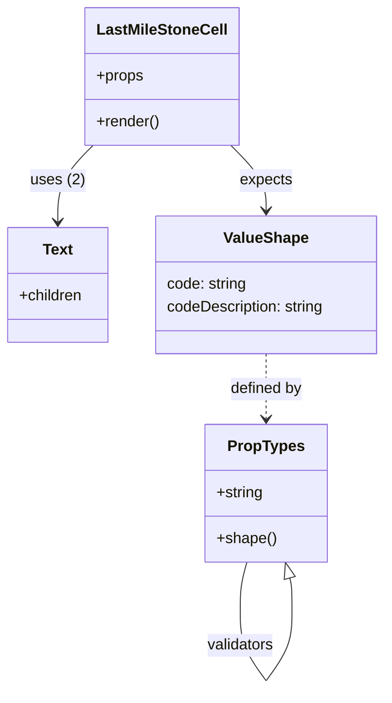

# Diagram: web/portal/src/pages/driveaway/components/table-cells/status-history/LastMilestoneCell.js

> Auto-generated by Obscura crawlers

## Mermaid

### SVG

<svg id="container" width="407.6015625" xmlns="http://www.w3.org/2000/svg" class="classDiagram" height="720.25" viewBox="0 0 407.6015625 720.25" role="graphics-document document" aria-roledescription="class"><g><defs><marker id="container_class-aggregationStart" class="marker aggregation class" refX="18" refY="7" markerWidth="190" markerHeight="240" orient="auto"><path d="M 18,7 L9,13 L1,7 L9,1 Z"></path></marker></defs><defs><marker id="container_class-aggregationEnd" class="marker aggregation class" refX="1" refY="7" markerWidth="20" markerHeight="28" orient="auto"><path d="M 18,7 L9,13 L1,7 L9,1 Z"></path></marker></defs><defs><marker id="container_class-extensionStart" class="marker extension class" refX="18" refY="7" markerWidth="190" markerHeight="240" orient="auto"><path d="M 1,7 L18,13 V 1 Z"></path></marker></defs><defs><marker id="container_class-extensionEnd" class="marker extension class" refX="1" refY="7" markerWidth="20" markerHeight="28" orient="auto"><path d="M 1,1 V 13 L18,7 Z"></path></marker></defs><defs><marker id="container_class-compositionStart" class="marker composition class" refX="18" refY="7" markerWidth="190" markerHeight="240" orient="auto"><path d="M 18,7 L9,13 L1,7 L9,1 Z"></path></marker></defs><defs><marker id="container_class-compositionEnd" class="marker composition class" refX="1" refY="7" markerWidth="20" markerHeight="28" orient="auto"><path d="M 18,7 L9,13 L1,7 L9,1 Z"></path></marker></defs><defs><marker id="container_class-dependencyStart" class="marker dependency class" refX="6" refY="7" markerWidth="190" markerHeight="240" orient="auto"><path d="M 5,7 L9,13 L1,7 L9,1 Z"></path></marker></defs><defs><marker id="container_class-dependencyEnd" class="marker dependency class" refX="13" refY="7" markerWidth="20" markerHeight="28" orient="auto"><path d="M 18,7 L9,13 L14,7 L9,1 Z"></path></marker></defs><defs><marker id="container_class-lollipopStart" class="marker lollipop class" refX="13" refY="7" markerWidth="190" markerHeight="240" orient="auto"><circle stroke="black" fill="transparent" cx="7" cy="7" r="6"></circle></marker></defs><defs><marker id="container_class-lollipopEnd" class="marker lollipop class" refX="1" refY="7" markerWidth="190" markerHeight="240" orient="auto"><circle stroke="black" fill="transparent" cx="7" cy="7" r="6"></circle></marker></defs><g class="root"><g class="clusters"></g><g class="edgePaths"><path d="M98.917,152L92.671,158.167C86.425,164.333,73.933,176.667,67.687,190C61.441,203.333,61.441,217.667,61.441,224.833L61.441,232" id="id_LastMileStoneCell_Text_1" class="edge-thickness-normal edge-pattern-solid relation" style=";;;" data-edge="true" data-et="edge" data-id="id_LastMileStoneCell_Text_1" data-points="W3sieCI6OTguOTE2NzY4MjA1Mjc1MjMsInkiOjE1Mn0seyJ4Ijo2MS40NDE0MDYyNSwieSI6MTg5fSx7IngiOjYxLjQ0MTQwNjI1LCJ5IjoyMzh9XQ==" marker-end="url(#container_class-dependencyEnd)"></path><path d="M244.767,152L251.013,158.167C257.259,164.333,269.75,176.667,275.996,188C282.242,199.333,282.242,209.667,282.242,214.833L282.242,220" id="id_LastMileStoneCell_ValueShape_2" class="edge-thickness-normal edge-pattern-solid relation" style=";;;" data-edge="true" data-et="edge" data-id="id_LastMileStoneCell_ValueShape_2" data-points="W3sieCI6MjQ0Ljc2NjgyNTU0NDcyNDc4LCJ5IjoxNTJ9LHsieCI6MjgyLjI0MjE4NzUsInkiOjE4OX0seyJ4IjoyODIuMjQyMTg3NSwieSI6MjI2fV0=" marker-end="url(#container_class-dependencyEnd)"></path><path d="M282.242,370L282.242,376.167C282.242,382.333,282.242,394.667,282.242,406C282.242,417.333,282.242,427.667,282.242,432.833L282.242,438" id="id_ValueShape_PropTypes_3" class="edge-thickness-normal edge-pattern-dashed relation" style=";;;" data-edge="true" data-et="edge" data-id="id_ValueShape_PropTypes_3" data-points="W3sieCI6MjgyLjI0MjE4NzUsInkiOjM3MH0seyJ4IjoyODIuMjQyMTg3NSwieSI6NDA3fSx7IngiOjI4Mi4yNDIxODc1LCJ5Ijo0NDR9XQ==" marker-end="url(#container_class-dependencyEnd)"></path><path d="M261.473,588L260.271,592.167C259.069,596.333,256.666,604.667,255.464,613C254.262,621.333,254.262,629.667,254.262,633.833L254.262,638" id="PropTypes-cyclic-special-1" class="edge-thickness-normal edge-pattern-solid relation" style=";;;" data-edge="true" data-et="edge" data-id="PropTypes-cyclic-special-1" data-points="W3sieCI6MjYxLjQ3MzE3OTc2ODA0MTIzLCJ5Ijo1ODh9LHsieCI6MjU0LjI2MTcxODc1LCJ5Ijo2MTN9LHsieCI6MjU0LjI2MTcxODc1LCJ5Ijo2Mzh9XQ=="></path><path d="M254.262,638.1L254.262,644.267C254.262,650.433,254.262,662.767,258.919,675.1C263.576,687.433,272.89,699.767,277.547,705.933L282.204,712.1" id="PropTypes-cyclic-special-mid" class="edge-thickness-normal edge-pattern-solid relation" style=";;;" data-edge="true" data-et="edge" data-id="PropTypes-cyclic-special-mid" data-points="W3sieCI6MjU0LjI2MTcxODc1LCJ5Ijo2MzguMTAwMDAwMDAxNDkwMX0seyJ4IjoyNTQuMjYxNzE4NzUsInkiOjY3NS4xMDAwMDAwMDE0OTAxfSx7IngiOjI4Mi4yMDQ0MjcwODI3NzE0LCJ5Ijo3MTIuMTAwMDAwMDAxNDkwMX1d"></path><path d="M282.28,712.1L286.937,705.933C291.594,699.767,300.908,687.433,305.566,675.092C310.223,662.75,310.223,650.4,310.223,640.05C310.223,629.7,310.223,621.35,309.818,615.771C309.412,610.191,308.602,607.383,308.197,605.979L307.792,604.574" id="PropTypes-cyclic-special-2" class="edge-thickness-normal edge-pattern-solid relation" style=";;;" data-edge="true" data-et="edge" data-id="PropTypes-cyclic-special-2" data-points="W3sieCI6MjgyLjI3OTk0NzkxNzIyODYsInkiOjcxMi4xMDAwMDAwMDE0OTAxfSx7IngiOjMxMC4yMjI2NTYyNSwieSI6Njc1LjEwMDAwMDAwMTQ5MDF9LHsieCI6MzEwLjIyMjY1NjI1LCJ5Ijo2MzguMDUwMDAwMDAwNzQ1MX0seyJ4IjozMTAuMjIyNjU2MjUsInkiOjYxM30seyJ4IjozMDMuMDExMTk1MjMxOTU4NzcsInkiOjU4OH1d" marker-end="url(#container_class-extensionEnd)"></path></g><g class="edgeLabels"><g class="edgeLabel" transform="translate(61.44140625, 189)"><g class="label" data-id="id_LastMileStoneCell_Text_1" transform="translate(-27.7578125, -12)"><foreignObject width="55.515625" height="24">

uses (2)

</foreignObject></g></g><g class="edgeLabel" transform="translate(282.2421875, 189)"><g class="label" data-id="id_LastMileStoneCell_ValueShape_2" transform="translate(-27.734375, -12)"><foreignObject width="55.46875" height="24">

expects

</foreignObject></g></g><g class="edgeLabel" transform="translate(282.2421875, 407)"><g class="label" data-id="id_ValueShape_PropTypes_3" transform="translate(-38.359375, -12)"><foreignObject width="76.71875" height="24">

defined by

</foreignObject></g></g><g class="edgeLabel"><g class="label" data-id="PropTypes-cyclic-special-1" transform="translate(0, 0)"><foreignObject width="0" height="0">

</foreignObject></g></g><g class="edgeLabel" transform="translate(254.26171875, 675.1000000014901)"><g class="label" data-id="PropTypes-cyclic-special-mid" transform="translate(-35.9609375, -12)"><foreignObject width="71.921875" height="24">

validators

</foreignObject></g></g><g class="edgeLabel"><g class="label" data-id="PropTypes-cyclic-special-2" transform="translate(0, 0)"><foreignObject width="0" height="0">

</foreignObject></g></g></g><g class="nodes"><g class="node default" id="classId-LastMileStoneCell-0" transform="translate(171.841796875, 80)"><g class="basic label-container"><path d="M-78.01171875 -72 L78.01171875 -72 L78.01171875 72 L-78.01171875 72" stroke="none" stroke-width="0" fill="#ECECFF" style=""></path><path d="M-78.01171875 -72 C-31.10646840855626 -72, 15.79878193288748 -72, 78.01171875 -72 M-78.01171875 -72 C-30.445115027577977 -72, 17.121488694844047 -72, 78.01171875 -72 M78.01171875 -72 C78.01171875 -19.273533295681368, 78.01171875 33.452933408637264, 78.01171875 72 M78.01171875 -72 C78.01171875 -14.93618386137959, 78.01171875 42.12763227724082, 78.01171875 72 M78.01171875 72 C45.65167552012913 72, 13.291632290258264 72, -78.01171875 72 M78.01171875 72 C15.897531260632597 72, -46.216656228734806 72, -78.01171875 72 M-78.01171875 72 C-78.01171875 40.38066433216125, -78.01171875 8.761328664322505, -78.01171875 -72 M-78.01171875 72 C-78.01171875 27.24589816339156, -78.01171875 -17.508203673216883, -78.01171875 -72" stroke="#9370DB" stroke-width="1.3" fill="none" stroke-dasharray="0 0" style=""></path></g><g class="annotation-group text" transform="translate(0, -48)"></g><g class="label-group text" transform="translate(-65.4140625, -48)"><g class="label" style="font-weight: bolder" transform="translate(0,-12)"><foreignObject width="130.828125" height="24">

LastMileStoneCell

</foreignObject></g></g><g class="members-group text" transform="translate(-66.01171875, 0)"><g class="label" style="" transform="translate(0,-12)"><foreignObject width="49.515625" height="24">

+props

</foreignObject></g></g><g class="methods-group text" transform="translate(-66.01171875, 48)"><g class="label" style="" transform="translate(0,-12)"><foreignObject width="66.609375" height="24">

+render()

</foreignObject></g></g><g class="divider" style=""><path d="M-78.01171875 -24 C-35.23195438934651 -24, 7.547809971306975 -24, 78.01171875 -24 M-78.01171875 -24 C-30.124238438927712 -24, 17.763241872144576 -24, 78.01171875 -24" stroke="#9370DB" stroke-width="1.3" fill="none" stroke-dasharray="0 0" style=""></path></g><g class="divider" style=""><path d="M-78.01171875 24 C-20.6239109871822 24, 36.7638967756356 24, 78.01171875 24 M-78.01171875 24 C-26.5147718416547 24, 24.9821750666906 24, 78.01171875 24" stroke="#9370DB" stroke-width="1.3" fill="none" stroke-dasharray="0 0" style=""></path></g></g><g class="node default" id="classId-Text-1" transform="translate(61.44140625, 298)"><g class="basic label-container"><path d="M-53.44140625 -60 L53.44140625 -60 L53.44140625 60 L-53.44140625 60" stroke="none" stroke-width="0" fill="#ECECFF" style=""></path><path d="M-53.44140625 -60 C-26.25763480828285 -60, 0.9261366334342966 -60, 53.44140625 -60 M-53.44140625 -60 C-23.736354198914334 -60, 5.968697852171331 -60, 53.44140625 -60 M53.44140625 -60 C53.44140625 -33.91165677642242, 53.44140625 -7.823313552844844, 53.44140625 60 M53.44140625 -60 C53.44140625 -20.721491693516768, 53.44140625 18.557016612966464, 53.44140625 60 M53.44140625 60 C23.485419911141314 60, -6.4705664277173724 60, -53.44140625 60 M53.44140625 60 C30.431214765740208 60, 7.421023281480416 60, -53.44140625 60 M-53.44140625 60 C-53.44140625 28.460733653194445, -53.44140625 -3.078532693611109, -53.44140625 -60 M-53.44140625 60 C-53.44140625 24.148235760762574, -53.44140625 -11.703528478474851, -53.44140625 -60" stroke="#9370DB" stroke-width="1.3" fill="none" stroke-dasharray="0 0" style=""></path></g><g class="annotation-group text" transform="translate(0, -36)"></g><g class="label-group text" transform="translate(-15.3828125, -36)"><g class="label" style="font-weight: bolder" transform="translate(0,-12)"><foreignObject width="30.765625" height="24">

Text

</foreignObject></g></g><g class="members-group text" transform="translate(-41.44140625, 12)"><g class="label" style="" transform="translate(0,-12)"><foreignObject width="67.5" height="24">

+children

</foreignObject></g></g><g class="methods-group text" transform="translate(-41.44140625, 60)"></g><g class="divider" style=""><path d="M-53.44140625 -12 C-26.2106664965555 -12, 1.020073256888999 -12, 53.44140625 -12 M-53.44140625 -12 C-13.76660684803165 -12, 25.9081925539367 -12, 53.44140625 -12" stroke="#9370DB" stroke-width="1.3" fill="none" stroke-dasharray="0 0" style=""></path></g><g class="divider" style=""><path d="M-53.44140625 36 C-21.929149567103778 36, 9.583107115792444 36, 53.44140625 36 M-53.44140625 36 C-25.866928249833258 36, 1.7075497503334844 36, 53.44140625 36" stroke="#9370DB" stroke-width="1.3" fill="none" stroke-dasharray="0 0" style=""></path></g></g><g class="node default" id="classId-ValueShape-2" transform="translate(282.2421875, 298)"><g class="basic label-container"><path d="M-117.359375 -72 L117.359375 -72 L117.359375 72 L-117.359375 72" stroke="none" stroke-width="0" fill="#ECECFF" style=""></path><path d="M-117.359375 -72 C-57.57450655838427 -72, 2.2103618832314567 -72, 117.359375 -72 M-117.359375 -72 C-56.96090431606996 -72, 3.437566367860086 -72, 117.359375 -72 M117.359375 -72 C117.359375 -27.431959414915653, 117.359375 17.136081170168694, 117.359375 72 M117.359375 -72 C117.359375 -34.100709612564145, 117.359375 3.7985807748717093, 117.359375 72 M117.359375 72 C25.264248559996872 72, -66.83087788000626 72, -117.359375 72 M117.359375 72 C25.564340353406948 72, -66.2306942931861 72, -117.359375 72 M-117.359375 72 C-117.359375 39.33189362230177, -117.359375 6.66378724460354, -117.359375 -72 M-117.359375 72 C-117.359375 14.880491500386455, -117.359375 -42.23901699922709, -117.359375 -72" stroke="#9370DB" stroke-width="1.3" fill="none" stroke-dasharray="0 0" style=""></path></g><g class="annotation-group text" transform="translate(0, -48)"></g><g class="label-group text" transform="translate(-42.6875, -48)"><g class="label" style="font-weight: bolder" transform="translate(0,-12)"><foreignObject width="85.375" height="24">

ValueShape

</foreignObject></g></g><g class="members-group text" transform="translate(-105.359375, 0)"><g class="label" style="" transform="translate(0,-12)"><foreignObject width="84.6875" height="24">

code: string

</foreignObject></g><g class="label" style="" transform="translate(0,12)"><foreignObject width="168.03125" height="24">

codeDescription: string

</foreignObject></g></g><g class="methods-group text" transform="translate(-105.359375, 72)"></g><g class="divider" style=""><path d="M-117.359375 -24 C-59.94129867303993 -24, -2.523222346079862 -24, 117.359375 -24 M-117.359375 -24 C-32.29824696161825 -24, 52.762881076763506 -24, 117.359375 -24" stroke="#9370DB" stroke-width="1.3" fill="none" stroke-dasharray="0 0" style=""></path></g><g class="divider" style=""><path d="M-117.359375 48 C-46.646269741695974 48, 24.06683551660805 48, 117.359375 48 M-117.359375 48 C-33.94354031743565 48, 49.472294365128704 48, 117.359375 48" stroke="#9370DB" stroke-width="1.3" fill="none" stroke-dasharray="0 0" style=""></path></g></g><g class="node default" id="classId-PropTypes-3" transform="translate(282.2421875, 516)"><g class="basic label-container"><path d="M-62.19921875 -72 L62.19921875 -72 L62.19921875 72 L-62.19921875 72" stroke="none" stroke-width="0" fill="#ECECFF" style=""></path><path d="M-62.19921875 -72 C-32.97195072340038 -72, -3.7446826968007656 -72, 62.19921875 -72 M-62.19921875 -72 C-13.028858971754133 -72, 36.141500806491734 -72, 62.19921875 -72 M62.19921875 -72 C62.19921875 -42.10050210224514, 62.19921875 -12.201004204490275, 62.19921875 72 M62.19921875 -72 C62.19921875 -29.980269807094807, 62.19921875 12.039460385810386, 62.19921875 72 M62.19921875 72 C13.174094097200147 72, -35.851030555599706 72, -62.19921875 72 M62.19921875 72 C36.05615097798109 72, 9.913083205962174 72, -62.19921875 72 M-62.19921875 72 C-62.19921875 22.34453340591616, -62.19921875 -27.31093318816768, -62.19921875 -72 M-62.19921875 72 C-62.19921875 42.25542365932308, -62.19921875 12.510847318646157, -62.19921875 -72" stroke="#9370DB" stroke-width="1.3" fill="none" stroke-dasharray="0 0" style=""></path></g><g class="annotation-group text" transform="translate(0, -48)"></g><g class="label-group text" transform="translate(-38.2578125, -48)"><g class="label" style="font-weight: bolder" transform="translate(0,-12)"><foreignObject width="76.515625" height="24">

PropTypes

</foreignObject></g></g><g class="members-group text" transform="translate(-50.19921875, 0)"><g class="label" style="" transform="translate(0,-12)"><foreignObject width="49.625" height="24">

+string

</foreignObject></g></g><g class="methods-group text" transform="translate(-50.19921875, 48)"><g class="label" style="" transform="translate(0,-12)"><foreignObject width="62.140625" height="24">

+shape()

</foreignObject></g></g><g class="divider" style=""><path d="M-62.19921875 -24 C-15.54788266025308 -24, 31.10345342949384 -24, 62.19921875 -24 M-62.19921875 -24 C-16.599624117309844 -24, 28.999970515380312 -24, 62.19921875 -24" stroke="#9370DB" stroke-width="1.3" fill="none" stroke-dasharray="0 0" style=""></path></g><g class="divider" style=""><path d="M-62.19921875 24 C-20.740333539798158 24, 20.718551670403684 24, 62.19921875 24 M-62.19921875 24 C-19.751684785732934 24, 22.695849178534132 24, 62.19921875 24" stroke="#9370DB" stroke-width="1.3" fill="none" stroke-dasharray="0 0" style=""></path></g></g><g class="label edgeLabel" id="PropTypes---PropTypes---1" transform="translate(254.26171875, 638.0500000007451)"><rect width="0.1" height="0.1"></rect><g class="label" style="" transform="translate(0, 0)"><rect></rect><foreignObject width="0" height="0">

</foreignObject></g></g><g class="label edgeLabel" id="PropTypes---PropTypes---2" transform="translate(282.2421875, 712.1500000022352)"><rect width="0.1" height="0.1"></rect><g class="label" style="" transform="translate(0, 0)"><rect></rect><foreignObject width="0" height="0">

</foreignObject></g></g></g></g></g></svg>
