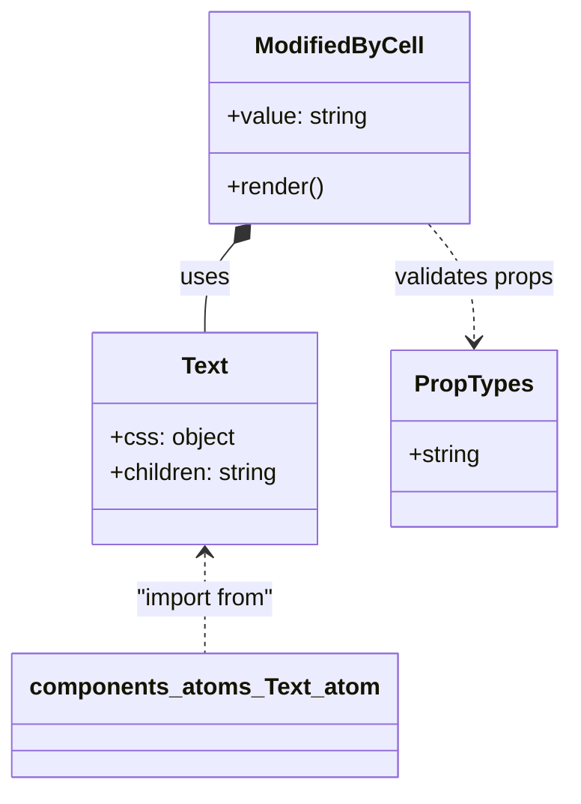

# Diagram: web/portal/src/pages/driveaway/components/table-cells/status-history/ModifiedByCell.js

> Auto-generated by Obscura crawlers

## Mermaid

### SVG

<svg id="container" width="381.53515625" xmlns="http://www.w3.org/2000/svg" class="classDiagram" height="536" viewBox="0 0 381.53515625 536" role="graphics-document document" aria-roledescription="class"><g><defs><marker id="container_class-aggregationStart" class="marker aggregation class" refX="18" refY="7" markerWidth="190" markerHeight="240" orient="auto"><path d="M 18,7 L9,13 L1,7 L9,1 Z"></path></marker></defs><defs><marker id="container_class-aggregationEnd" class="marker aggregation class" refX="1" refY="7" markerWidth="20" markerHeight="28" orient="auto"><path d="M 18,7 L9,13 L1,7 L9,1 Z"></path></marker></defs><defs><marker id="container_class-extensionStart" class="marker extension class" refX="18" refY="7" markerWidth="190" markerHeight="240" orient="auto"><path d="M 1,7 L18,13 V 1 Z"></path></marker></defs><defs><marker id="container_class-extensionEnd" class="marker extension class" refX="1" refY="7" markerWidth="20" markerHeight="28" orient="auto"><path d="M 1,1 V 13 L18,7 Z"></path></marker></defs><defs><marker id="container_class-compositionStart" class="marker composition class" refX="18" refY="7" markerWidth="190" markerHeight="240" orient="auto"><path d="M 18,7 L9,13 L1,7 L9,1 Z"></path></marker></defs><defs><marker id="container_class-compositionEnd" class="marker composition class" refX="1" refY="7" markerWidth="20" markerHeight="28" orient="auto"><path d="M 18,7 L9,13 L1,7 L9,1 Z"></path></marker></defs><defs><marker id="container_class-dependencyStart" class="marker dependency class" refX="6" refY="7" markerWidth="190" markerHeight="240" orient="auto"><path d="M 5,7 L9,13 L1,7 L9,1 Z"></path></marker></defs><defs><marker id="container_class-dependencyEnd" class="marker dependency class" refX="13" refY="7" markerWidth="20" markerHeight="28" orient="auto"><path d="M 18,7 L9,13 L14,7 L9,1 Z"></path></marker></defs><defs><marker id="container_class-lollipopStart" class="marker lollipop class" refX="13" refY="7" markerWidth="190" markerHeight="240" orient="auto"><circle stroke="black" fill="transparent" cx="7" cy="7" r="6"></circle></marker></defs><defs><marker id="container_class-lollipopEnd" class="marker lollipop class" refX="1" refY="7" markerWidth="190" markerHeight="240" orient="auto"><circle stroke="black" fill="transparent" cx="7" cy="7" r="6"></circle></marker></defs><g class="root"><g class="clusters"></g><g class="edgePaths"><path d="M153.494,165.175L150.138,169.146C146.782,173.117,140.071,181.058,136.715,191.196C133.359,201.333,133.359,213.667,133.359,219.833L133.359,226" id="id_ModifiedByCell_Text_1" class="edge-thickness-normal edge-pattern-solid relation" style=";;;" data-edge="true" data-et="edge" data-id="id_ModifiedByCell_Text_1" data-points="W3sieCI6MTY0LjYyODUxMjA0MTI4NDQsInkiOjE1Mn0seyJ4IjoxMzMuMzU5Mzc1LCJ5IjoxODl9LHsieCI6MTMzLjM1OTM3NSwieSI6MjI2fV0=" marker-start="url(#container_class-compositionStart)"></path><path d="M286.325,152L291.536,158.167C296.748,164.333,307.171,176.667,312.382,190C317.594,203.333,317.594,217.667,317.594,224.833L317.594,232" id="id_ModifiedByCell_PropTypes_2" class="edge-thickness-normal edge-pattern-dashed relation" style=";;;" data-edge="true" data-et="edge" data-id="id_ModifiedByCell_PropTypes_2" data-points="W3sieCI6Mjg2LjMyNDYxMjk1ODcxNTYsInkiOjE1Mn0seyJ4IjozMTcuNTkzNzUsInkiOjE4OX0seyJ4IjozMTcuNTkzNzUsInkiOjIzOH1d" marker-end="url(#container_class-dependencyEnd)"></path><path d="M133.359,376L133.359,381.167C133.359,386.333,133.359,396.667,133.359,408C133.359,419.333,133.359,431.667,133.359,437.833L133.359,444" id="id_Text_components_atoms_Text_atom_3" class="edge-thickness-normal edge-pattern-dashed relation" style=";;;" data-edge="true" data-et="edge" data-id="id_Text_components_atoms_Text_atom_3" data-points="W3sieCI6MTMzLjM1OTM3NSwieSI6MzcwfSx7IngiOjEzMy4zNTkzNzUsInkiOjQwN30seyJ4IjoxMzMuMzU5Mzc1LCJ5Ijo0NDR9XQ==" marker-start="url(#container_class-dependencyStart)"></path></g><g class="edgeLabels"><g class="edgeLabel" transform="translate(133.359375, 189)"><g class="label" data-id="id_ModifiedByCell_Text_1" transform="translate(-16.4921875, -12)"><foreignObject width="32.984375" height="24">

uses

</foreignObject></g></g><g class="edgeLabel" transform="translate(317.59375, 189)"><g class="label" data-id="id_ModifiedByCell_PropTypes_2" transform="translate(-55.5625, -12)"><foreignObject width="111.125" height="24">

validates props

</foreignObject></g></g><g class="edgeLabel" transform="translate(133.359375, 407)"><g class="label" data-id="id_Text_components_atoms_Text_atom_3" transform="translate(-49.9921875, -12)"><foreignObject width="99.984375" height="24">

"import from"

</foreignObject></g></g></g><g class="nodes"><g class="node default" id="classId-ModifiedByCell-0" transform="translate(225.4765625, 80)"><g class="basic label-container"><path d="M-87.5703125 -72 L87.5703125 -72 L87.5703125 72 L-87.5703125 72" stroke="none" stroke-width="0" fill="#ECECFF" style=""></path><path d="M-87.5703125 -72 C-46.99205930453456 -72, -6.413806109069114 -72, 87.5703125 -72 M-87.5703125 -72 C-32.33115022442157 -72, 22.90801205115686 -72, 87.5703125 -72 M87.5703125 -72 C87.5703125 -35.926026328401875, 87.5703125 0.14794734319625036, 87.5703125 72 M87.5703125 -72 C87.5703125 -33.02413727517371, 87.5703125 5.951725449652585, 87.5703125 72 M87.5703125 72 C22.46980314803531 72, -42.63070620392938 72, -87.5703125 72 M87.5703125 72 C36.276647496632826 72, -15.017017506734348 72, -87.5703125 72 M-87.5703125 72 C-87.5703125 40.145671679716926, -87.5703125 8.291343359433853, -87.5703125 -72 M-87.5703125 72 C-87.5703125 21.5267771102054, -87.5703125 -28.946445779589197, -87.5703125 -72" stroke="#9370DB" stroke-width="1.3" fill="none" stroke-dasharray="0 0" style=""></path></g><g class="annotation-group text" transform="translate(0, -48)"></g><g class="label-group text" transform="translate(-54.71875, -48)"><g class="label" style="font-weight: bolder" transform="translate(0,-12)"><foreignObject width="109.4375" height="24">

ModifiedByCell

</foreignObject></g></g><g class="members-group text" transform="translate(-75.5703125, 0)"><g class="label" style="" transform="translate(0,-12)"><foreignObject width="96.421875" height="24">

+value: string

</foreignObject></g></g><g class="methods-group text" transform="translate(-75.5703125, 48)"><g class="label" style="" transform="translate(0,-12)"><foreignObject width="66.609375" height="24">

+render()

</foreignObject></g></g><g class="divider" style=""><path d="M-87.5703125 -24 C-34.25514949445028 -24, 19.06001351109944 -24, 87.5703125 -24 M-87.5703125 -24 C-41.61303826986154 -24, 4.344235960276919 -24, 87.5703125 -24" stroke="#9370DB" stroke-width="1.3" fill="none" stroke-dasharray="0 0" style=""></path></g><g class="divider" style=""><path d="M-87.5703125 24 C-43.820116564591395 24, -0.06992062918278918 24, 87.5703125 24 M-87.5703125 24 C-39.04012036747306 24, 9.490071765053884 24, 87.5703125 24" stroke="#9370DB" stroke-width="1.3" fill="none" stroke-dasharray="0 0" style=""></path></g></g><g class="node default" id="classId-Text-1" transform="translate(133.359375, 298)"><g class="basic label-container"><path d="M-78.29296875 -72 L78.29296875 -72 L78.29296875 72 L-78.29296875 72" stroke="none" stroke-width="0" fill="#ECECFF" style=""></path><path d="M-78.29296875 -72 C-28.690170765522538 -72, 20.912627218954924 -72, 78.29296875 -72 M-78.29296875 -72 C-41.37014190074488 -72, -4.447315051489767 -72, 78.29296875 -72 M78.29296875 -72 C78.29296875 -27.20749497640307, 78.29296875 17.58501004719386, 78.29296875 72 M78.29296875 -72 C78.29296875 -15.246535024120789, 78.29296875 41.50692995175842, 78.29296875 72 M78.29296875 72 C33.10557535416008 72, -12.081818041679838 72, -78.29296875 72 M78.29296875 72 C25.556172674464868 72, -27.180623401070264 72, -78.29296875 72 M-78.29296875 72 C-78.29296875 33.741167837984925, -78.29296875 -4.51766432403015, -78.29296875 -72 M-78.29296875 72 C-78.29296875 35.28326181653424, -78.29296875 -1.4334763669315151, -78.29296875 -72" stroke="#9370DB" stroke-width="1.3" fill="none" stroke-dasharray="0 0" style=""></path></g><g class="annotation-group text" transform="translate(0, -48)"></g><g class="label-group text" transform="translate(-15.3828125, -48)"><g class="label" style="font-weight: bolder" transform="translate(0,-12)"><foreignObject width="30.765625" height="24">

Text

</foreignObject></g></g><g class="members-group text" transform="translate(-66.29296875, 0)"><g class="label" style="" transform="translate(0,-12)"><foreignObject width="83.96875" height="24">

+css: object

</foreignObject></g><g class="label" style="" transform="translate(0,12)"><foreignObject width="117.203125" height="24">

+children: string

</foreignObject></g></g><g class="methods-group text" transform="translate(-66.29296875, 72)"></g><g class="divider" style=""><path d="M-78.29296875 -24 C-23.515206261040184 -24, 31.26255622791963 -24, 78.29296875 -24 M-78.29296875 -24 C-36.35481338487309 -24, 5.58334198025382 -24, 78.29296875 -24" stroke="#9370DB" stroke-width="1.3" fill="none" stroke-dasharray="0 0" style=""></path></g><g class="divider" style=""><path d="M-78.29296875 48 C-36.0608092286035 48, 6.171350292792994 48, 78.29296875 48 M-78.29296875 48 C-17.898970873424794 48, 42.49502700315041 48, 78.29296875 48" stroke="#9370DB" stroke-width="1.3" fill="none" stroke-dasharray="0 0" style=""></path></g></g><g class="node default" id="classId-PropTypes-2" transform="translate(317.59375, 298)"><g class="basic label-container"><path d="M-55.94140625 -60 L55.94140625 -60 L55.94140625 60 L-55.94140625 60" stroke="none" stroke-width="0" fill="#ECECFF" style=""></path><path d="M-55.94140625 -60 C-15.19461917194932 -60, 25.55216790610136 -60, 55.94140625 -60 M-55.94140625 -60 C-17.981366319108524 -60, 19.978673611782952 -60, 55.94140625 -60 M55.94140625 -60 C55.94140625 -31.11301060384107, 55.94140625 -2.2260212076821375, 55.94140625 60 M55.94140625 -60 C55.94140625 -15.182502585733545, 55.94140625 29.63499482853291, 55.94140625 60 M55.94140625 60 C12.584361224843093 60, -30.772683800313814 60, -55.94140625 60 M55.94140625 60 C24.02444636557477 60, -7.892513518850457 60, -55.94140625 60 M-55.94140625 60 C-55.94140625 12.098456750700556, -55.94140625 -35.80308649859889, -55.94140625 -60 M-55.94140625 60 C-55.94140625 32.89302849673233, -55.94140625 5.786056993464648, -55.94140625 -60" stroke="#9370DB" stroke-width="1.3" fill="none" stroke-dasharray="0 0" style=""></path></g><g class="annotation-group text" transform="translate(0, -36)"></g><g class="label-group text" transform="translate(-38.2578125, -36)"><g class="label" style="font-weight: bolder" transform="translate(0,-12)"><foreignObject width="76.515625" height="24">

PropTypes

</foreignObject></g></g><g class="members-group text" transform="translate(-43.94140625, 12)"><g class="label" style="" transform="translate(0,-12)"><foreignObject width="49.625" height="24">

+string

</foreignObject></g></g><g class="methods-group text" transform="translate(-43.94140625, 60)"></g><g class="divider" style=""><path d="M-55.94140625 -12 C-24.85511046362619 -12, 6.231185322747621 -12, 55.94140625 -12 M-55.94140625 -12 C-33.30472318775699 -12, -10.66804012551399 -12, 55.94140625 -12" stroke="#9370DB" stroke-width="1.3" fill="none" stroke-dasharray="0 0" style=""></path></g><g class="divider" style=""><path d="M-55.94140625 36 C-15.173738454840176 36, 25.593929340319647 36, 55.94140625 36 M-55.94140625 36 C-24.195965023251173 36, 7.549476203497655 36, 55.94140625 36" stroke="#9370DB" stroke-width="1.3" fill="none" stroke-dasharray="0 0" style=""></path></g></g><g class="node default" id="classId-components_atoms_Text_atom-3" transform="translate(133.359375, 486)"><g class="basic label-container"><path d="M-125.359375 -42 L125.359375 -42 L125.359375 42 L-125.359375 42" stroke="none" stroke-width="0" fill="#ECECFF" style=""></path><path d="M-125.359375 -42 C-45.18208324039378 -42, 34.99520851921244 -42, 125.359375 -42 M-125.359375 -42 C-68.38989669484235 -42, -11.420418389684698 -42, 125.359375 -42 M125.359375 -42 C125.359375 -10.484558924532049, 125.359375 21.030882150935902, 125.359375 42 M125.359375 -42 C125.359375 -24.874440324845022, 125.359375 -7.748880649690044, 125.359375 42 M125.359375 42 C39.460260075608886 42, -46.43885484878223 42, -125.359375 42 M125.359375 42 C30.037913107889267 42, -65.28354878422147 42, -125.359375 42 M-125.359375 42 C-125.359375 11.98598586807508, -125.359375 -18.02802826384984, -125.359375 -42 M-125.359375 42 C-125.359375 17.90749736917159, -125.359375 -6.185005261656819, -125.359375 -42" stroke="#9370DB" stroke-width="1.3" fill="none" stroke-dasharray="0 0" style=""></path></g><g class="annotation-group text" transform="translate(0, -18)"></g><g class="label-group text" transform="translate(-113.359375, -18)"><g class="label" style="font-weight: bolder" transform="translate(0,-12)"><foreignObject width="226.71875" height="24">

components_atoms_Text_atom

</foreignObject></g></g><g class="members-group text" transform="translate(-113.359375, 30)"></g><g class="methods-group text" transform="translate(-113.359375, 60)"></g><g class="divider" style=""><path d="M-125.359375 6 C-75.04493779893997 6, -24.730500597879953 6, 125.359375 6 M-125.359375 6 C-46.98998289186406 6, 31.37940921627188 6, 125.359375 6" stroke="#9370DB" stroke-width="1.3" fill="none" stroke-dasharray="0 0" style=""></path></g><g class="divider" style=""><path d="M-125.359375 24 C-60.49915649517807 24, 4.3610620096438595 24, 125.359375 24 M-125.359375 24 C-55.31011371637727 24, 14.739147567245453 24, 125.359375 24" stroke="#9370DB" stroke-width="1.3" fill="none" stroke-dasharray="0 0" style=""></path></g></g></g></g></g></svg>
