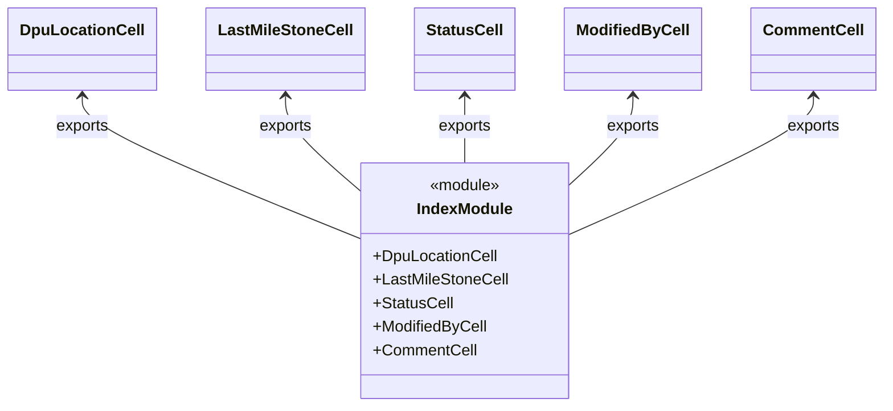

# Diagram: web/portal/src/pages/driveaway/components/table-cells/status-history/index.js

> Auto-generated by Obscura crawlers

## Mermaid

### SVG

<svg id="container" width="866.21875" xmlns="http://www.w3.org/2000/svg" class="classDiagram" height="414" viewBox="0 0 866.21875 414" role="graphics-document document" aria-roledescription="class"><g><defs><marker id="container_class-aggregationStart" class="marker aggregation class" refX="18" refY="7" markerWidth="190" markerHeight="240" orient="auto"><path d="M 18,7 L9,13 L1,7 L9,1 Z"></path></marker></defs><defs><marker id="container_class-aggregationEnd" class="marker aggregation class" refX="1" refY="7" markerWidth="20" markerHeight="28" orient="auto"><path d="M 18,7 L9,13 L1,7 L9,1 Z"></path></marker></defs><defs><marker id="container_class-extensionStart" class="marker extension class" refX="18" refY="7" markerWidth="190" markerHeight="240" orient="auto"><path d="M 1,7 L18,13 V 1 Z"></path></marker></defs><defs><marker id="container_class-extensionEnd" class="marker extension class" refX="1" refY="7" markerWidth="20" markerHeight="28" orient="auto"><path d="M 1,1 V 13 L18,7 Z"></path></marker></defs><defs><marker id="container_class-compositionStart" class="marker composition class" refX="18" refY="7" markerWidth="190" markerHeight="240" orient="auto"><path d="M 18,7 L9,13 L1,7 L9,1 Z"></path></marker></defs><defs><marker id="container_class-compositionEnd" class="marker composition class" refX="1" refY="7" markerWidth="20" markerHeight="28" orient="auto"><path d="M 18,7 L9,13 L1,7 L9,1 Z"></path></marker></defs><defs><marker id="container_class-dependencyStart" class="marker dependency class" refX="6" refY="7" markerWidth="190" markerHeight="240" orient="auto"><path d="M 5,7 L9,13 L1,7 L9,1 Z"></path></marker></defs><defs><marker id="container_class-dependencyEnd" class="marker dependency class" refX="13" refY="7" markerWidth="20" markerHeight="28" orient="auto"><path d="M 18,7 L9,13 L14,7 L9,1 Z"></path></marker></defs><defs><marker id="container_class-lollipopStart" class="marker lollipop class" refX="13" refY="7" markerWidth="190" markerHeight="240" orient="auto"><circle stroke="black" fill="transparent" cx="7" cy="7" r="6"></circle></marker></defs><defs><marker id="container_class-lollipopEnd" class="marker lollipop class" refX="1" refY="7" markerWidth="190" markerHeight="240" orient="auto"><circle stroke="black" fill="transparent" cx="7" cy="7" r="6"></circle></marker></defs><g class="root"><g class="clusters"></g><g class="edgePaths"><path d="M79.516,98L79.516,103.167C79.516,108.333,79.516,118.667,124.791,142.767C170.066,166.866,260.617,204.733,305.893,223.666L351.168,242.599" id="id_DpuLocationCell_IndexModule_1" class="edge-thickness-normal edge-pattern-solid relation" style=";;;" data-edge="true" data-et="edge" data-id="id_DpuLocationCell_IndexModule_1" data-points="W3sieCI6NzkuNTE1NjI1LCJ5Ijo5Mn0seyJ4Ijo3OS41MTU2MjUsInkiOjEyOX0seyJ4IjozNTEuMTY3OTY4NzUsInkiOjI0Mi41OTkyNDg3OTMwNzQ3NH1d" marker-start="url(#container_class-dependencyStart)"></path><path d="M278.445,98L278.445,103.167C278.445,108.333,278.445,118.667,290.566,134.614C302.686,150.562,326.927,172.124,339.048,182.904L351.168,193.685" id="id_LastMileStoneCell_IndexModule_2" class="edge-thickness-normal edge-pattern-solid relation" style=";;;" data-edge="true" data-et="edge" data-id="id_LastMileStoneCell_IndexModule_2" data-points="W3sieCI6Mjc4LjQ0NTMxMjUsInkiOjkyfSx7IngiOjI3OC40NDUzMTI1LCJ5IjoxMjl9LHsieCI6MzUxLjE2Nzk2ODc1LCJ5IjoxOTMuNjg1Mjc4NjI2MTIzMTR9XQ==" marker-start="url(#container_class-dependencyStart)"></path><path d="M454.953,98L454.953,103.167C454.953,108.333,454.953,118.667,454.953,130C454.953,141.333,454.953,153.667,454.953,159.833L454.953,166" id="id_StatusCell_IndexModule_3" class="edge-thickness-normal edge-pattern-solid relation" style=";;;" data-edge="true" data-et="edge" data-id="id_StatusCell_IndexModule_3" data-points="W3sieCI6NDU0Ljk1MzEyNSwieSI6OTJ9LHsieCI6NDU0Ljk1MzEyNSwieSI6MTI5fSx7IngiOjQ1NC45NTMxMjUsInkiOjE2Nn1d" marker-start="url(#container_class-dependencyStart)"></path><path d="M620.766,98L620.766,103.167C620.766,108.333,620.766,118.667,610.428,133.622C600.09,148.577,579.414,168.154,569.076,177.942L558.738,187.731" id="id_ModifiedByCell_IndexModule_4" class="edge-thickness-normal edge-pattern-solid relation" style=";;;" data-edge="true" data-et="edge" data-id="id_ModifiedByCell_IndexModule_4" data-points="W3sieCI6NjIwLjc2NTYyNSwieSI6OTJ9LHsieCI6NjIwLjc2NTYyNSwieSI6MTI5fSx7IngiOjU1OC43MzgyODEyNSwieSI6MTg3LjczMDc1MjkyMTIyMTI3fV0=" marker-start="url(#container_class-dependencyStart)"></path><path d="M797.852,98L797.852,103.167C797.852,108.333,797.852,118.667,757.999,142.08C718.147,165.494,638.443,201.987,598.59,220.234L558.738,238.481" id="id_CommentCell_IndexModule_5" class="edge-thickness-normal edge-pattern-solid relation" style=";;;" data-edge="true" data-et="edge" data-id="id_CommentCell_IndexModule_5" data-points="W3sieCI6Nzk3Ljg1MTU2MjUsInkiOjkyfSx7IngiOjc5Ny44NTE1NjI1LCJ5IjoxMjl9LHsieCI6NTU4LjczODI4MTI1LCJ5IjoyMzguNDgwNzcwNTQ1MjE0Mjh9XQ==" marker-start="url(#container_class-dependencyStart)"></path></g><g class="edgeLabels"><g class="edgeLabel" transform="translate(79.515625, 129)"><g class="label" data-id="id_DpuLocationCell_IndexModule_1" transform="translate(-27.3046875, -12)"><foreignObject width="54.609375" height="24">

exports

</foreignObject></g></g><g class="edgeLabel" transform="translate(278.4453125, 129)"><g class="label" data-id="id_LastMileStoneCell_IndexModule_2" transform="translate(-27.3046875, -12)"><foreignObject width="54.609375" height="24">

exports

</foreignObject></g></g><g class="edgeLabel" transform="translate(454.953125, 129)"><g class="label" data-id="id_StatusCell_IndexModule_3" transform="translate(-27.3046875, -12)"><foreignObject width="54.609375" height="24">

exports

</foreignObject></g></g><g class="edgeLabel" transform="translate(620.765625, 129)"><g class="label" data-id="id_ModifiedByCell_IndexModule_4" transform="translate(-27.3046875, -12)"><foreignObject width="54.609375" height="24">

exports

</foreignObject></g></g><g class="edgeLabel" transform="translate(797.8515625, 129)"><g class="label" data-id="id_CommentCell_IndexModule_5" transform="translate(-27.3046875, -12)"><foreignObject width="54.609375" height="24">

exports

</foreignObject></g></g></g><g class="nodes"><g class="node default" id="classId-DpuLocationCell-0" transform="translate(79.515625, 50)"><g class="basic label-container"><path d="M-71.515625 -42 L71.515625 -42 L71.515625 42 L-71.515625 42" stroke="none" stroke-width="0" fill="#ECECFF" style=""></path><path d="M-71.515625 -42 C-39.69060136923905 -42, -7.865577738478088 -42, 71.515625 -42 M-71.515625 -42 C-38.64877149416409 -42, -5.781917988328175 -42, 71.515625 -42 M71.515625 -42 C71.515625 -16.011913581133054, 71.515625 9.976172837733891, 71.515625 42 M71.515625 -42 C71.515625 -14.09665375563862, 71.515625 13.80669248872276, 71.515625 42 M71.515625 42 C33.69256351179233 42, -4.1304979764153416 42, -71.515625 42 M71.515625 42 C39.58509111407733 42, 7.654557228154658 42, -71.515625 42 M-71.515625 42 C-71.515625 14.318503057214212, -71.515625 -13.362993885571576, -71.515625 -42 M-71.515625 42 C-71.515625 14.156487556661183, -71.515625 -13.687024886677634, -71.515625 -42" stroke="#9370DB" stroke-width="1.3" fill="none" stroke-dasharray="0 0" style=""></path></g><g class="annotation-group text" transform="translate(0, -18)"></g><g class="label-group text" transform="translate(-59.515625, -18)"><g class="label" style="font-weight: bolder" transform="translate(0,-12)"><foreignObject width="119.03125" height="24">

DpuLocationCell

</foreignObject></g></g><g class="members-group text" transform="translate(-59.515625, 30)"></g><g class="methods-group text" transform="translate(-59.515625, 60)"></g><g class="divider" style=""><path d="M-71.515625 6 C-39.02915249696742 6, -6.54267999393484 6, 71.515625 6 M-71.515625 6 C-36.8027619222548 6, -2.089898844509605 6, 71.515625 6" stroke="#9370DB" stroke-width="1.3" fill="none" stroke-dasharray="0 0" style=""></path></g><g class="divider" style=""><path d="M-71.515625 24 C-21.8029124795393 24, 27.909800040921397 24, 71.515625 24 M-71.515625 24 C-42.023819052862564 24, -12.53201310572512 24, 71.515625 24" stroke="#9370DB" stroke-width="1.3" fill="none" stroke-dasharray="0 0" style=""></path></g></g><g class="node default" id="classId-LastMileStoneCell-1" transform="translate(278.4453125, 50)"><g class="basic label-container"><path d="M-77.4140625 -42 L77.4140625 -42 L77.4140625 42 L-77.4140625 42" stroke="none" stroke-width="0" fill="#ECECFF" style=""></path><path d="M-77.4140625 -42 C-35.40033473549188 -42, 6.613393029016237 -42, 77.4140625 -42 M-77.4140625 -42 C-18.087448605703187 -42, 41.239165288593625 -42, 77.4140625 -42 M77.4140625 -42 C77.4140625 -22.109683597109438, 77.4140625 -2.2193671942188757, 77.4140625 42 M77.4140625 -42 C77.4140625 -19.703628376561298, 77.4140625 2.5927432468774043, 77.4140625 42 M77.4140625 42 C32.573307487485785 42, -12.26744752502843 42, -77.4140625 42 M77.4140625 42 C31.133646903945866 42, -15.146768692108267 42, -77.4140625 42 M-77.4140625 42 C-77.4140625 8.972177691294647, -77.4140625 -24.055644617410707, -77.4140625 -42 M-77.4140625 42 C-77.4140625 15.7790983153855, -77.4140625 -10.441803369229, -77.4140625 -42" stroke="#9370DB" stroke-width="1.3" fill="none" stroke-dasharray="0 0" style=""></path></g><g class="annotation-group text" transform="translate(0, -18)"></g><g class="label-group text" transform="translate(-65.4140625, -18)"><g class="label" style="font-weight: bolder" transform="translate(0,-12)"><foreignObject width="130.828125" height="24">

LastMileStoneCell

</foreignObject></g></g><g class="members-group text" transform="translate(-65.4140625, 30)"></g><g class="methods-group text" transform="translate(-65.4140625, 60)"></g><g class="divider" style=""><path d="M-77.4140625 6 C-23.741772471795194 6, 29.93051755640961 6, 77.4140625 6 M-77.4140625 6 C-33.56586573552965 6, 10.282331028940703 6, 77.4140625 6" stroke="#9370DB" stroke-width="1.3" fill="none" stroke-dasharray="0 0" style=""></path></g><g class="divider" style=""><path d="M-77.4140625 24 C-34.139568479267346 24, 9.134925541465307 24, 77.4140625 24 M-77.4140625 24 C-39.304694251766 24, -1.1953260035320028 24, 77.4140625 24" stroke="#9370DB" stroke-width="1.3" fill="none" stroke-dasharray="0 0" style=""></path></g></g><g class="node default" id="classId-StatusCell-2" transform="translate(454.953125, 50)"><g class="basic label-container"><path d="M-49.09375 -42 L49.09375 -42 L49.09375 42 L-49.09375 42" stroke="none" stroke-width="0" fill="#ECECFF" style=""></path><path d="M-49.09375 -42 C-17.355689407466624 -42, 14.382371185066752 -42, 49.09375 -42 M-49.09375 -42 C-26.976568852360625 -42, -4.85938770472125 -42, 49.09375 -42 M49.09375 -42 C49.09375 -23.450729442792273, 49.09375 -4.901458885584546, 49.09375 42 M49.09375 -42 C49.09375 -22.24575459048402, 49.09375 -2.4915091809680376, 49.09375 42 M49.09375 42 C14.785666451948074 42, -19.52241709610385 42, -49.09375 42 M49.09375 42 C11.99341766502966 42, -25.10691466994068 42, -49.09375 42 M-49.09375 42 C-49.09375 11.930803109618797, -49.09375 -18.138393780762406, -49.09375 -42 M-49.09375 42 C-49.09375 11.229703111743731, -49.09375 -19.540593776512537, -49.09375 -42" stroke="#9370DB" stroke-width="1.3" fill="none" stroke-dasharray="0 0" style=""></path></g><g class="annotation-group text" transform="translate(0, -18)"></g><g class="label-group text" transform="translate(-37.09375, -18)"><g class="label" style="font-weight: bolder" transform="translate(0,-12)"><foreignObject width="74.1875" height="24">

StatusCell

</foreignObject></g></g><g class="members-group text" transform="translate(-37.09375, 30)"></g><g class="methods-group text" transform="translate(-37.09375, 60)"></g><g class="divider" style=""><path d="M-49.09375 6 C-22.20529857642915 6, 4.683152847141699 6, 49.09375 6 M-49.09375 6 C-19.32913820023695 6, 10.435473599526098 6, 49.09375 6" stroke="#9370DB" stroke-width="1.3" fill="none" stroke-dasharray="0 0" style=""></path></g><g class="divider" style=""><path d="M-49.09375 24 C-27.71073951734625 24, -6.327729034692503 24, 49.09375 24 M-49.09375 24 C-16.285608631804898 24, 16.522532736390204 24, 49.09375 24" stroke="#9370DB" stroke-width="1.3" fill="none" stroke-dasharray="0 0" style=""></path></g></g><g class="node default" id="classId-ModifiedByCell-3" transform="translate(620.765625, 50)"><g class="basic label-container"><path d="M-66.71875 -42 L66.71875 -42 L66.71875 42 L-66.71875 42" stroke="none" stroke-width="0" fill="#ECECFF" style=""></path><path d="M-66.71875 -42 C-33.96796829401889 -42, -1.2171865880377766 -42, 66.71875 -42 M-66.71875 -42 C-34.47734092188647 -42, -2.2359318437729456 -42, 66.71875 -42 M66.71875 -42 C66.71875 -12.48572135659023, 66.71875 17.02855728681954, 66.71875 42 M66.71875 -42 C66.71875 -11.7648470822974, 66.71875 18.4703058354052, 66.71875 42 M66.71875 42 C26.03826084836787 42, -14.642228303264261 42, -66.71875 42 M66.71875 42 C36.321028949447935 42, 5.923307898895864 42, -66.71875 42 M-66.71875 42 C-66.71875 12.016165332849326, -66.71875 -17.96766933430135, -66.71875 -42 M-66.71875 42 C-66.71875 23.742887759724358, -66.71875 5.485775519448715, -66.71875 -42" stroke="#9370DB" stroke-width="1.3" fill="none" stroke-dasharray="0 0" style=""></path></g><g class="annotation-group text" transform="translate(0, -18)"></g><g class="label-group text" transform="translate(-54.71875, -18)"><g class="label" style="font-weight: bolder" transform="translate(0,-12)"><foreignObject width="109.4375" height="24">

ModifiedByCell

</foreignObject></g></g><g class="members-group text" transform="translate(-54.71875, 30)"></g><g class="methods-group text" transform="translate(-54.71875, 60)"></g><g class="divider" style=""><path d="M-66.71875 6 C-24.38423280508293 6, 17.950284389834138 6, 66.71875 6 M-66.71875 6 C-30.008610158657554 6, 6.7015296826848925 6, 66.71875 6" stroke="#9370DB" stroke-width="1.3" fill="none" stroke-dasharray="0 0" style=""></path></g><g class="divider" style=""><path d="M-66.71875 24 C-14.431734586064891 24, 37.85528082787022 24, 66.71875 24 M-66.71875 24 C-21.45538830169958 24, 23.807973396600843 24, 66.71875 24" stroke="#9370DB" stroke-width="1.3" fill="none" stroke-dasharray="0 0" style=""></path></g></g><g class="node default" id="classId-CommentCell-4" transform="translate(797.8515625, 50)"><g class="basic label-container"><path d="M-60.3671875 -42 L60.3671875 -42 L60.3671875 42 L-60.3671875 42" stroke="none" stroke-width="0" fill="#ECECFF" style=""></path><path d="M-60.3671875 -42 C-21.382531451919903 -42, 17.602124596160195 -42, 60.3671875 -42 M-60.3671875 -42 C-26.67834008557316 -42, 7.010507328853677 -42, 60.3671875 -42 M60.3671875 -42 C60.3671875 -16.130450403130048, 60.3671875 9.739099193739904, 60.3671875 42 M60.3671875 -42 C60.3671875 -23.032766019685198, 60.3671875 -4.065532039370396, 60.3671875 42 M60.3671875 42 C33.364701692417924 42, 6.362215884835848 42, -60.3671875 42 M60.3671875 42 C36.08338381729724 42, 11.799580134594478 42, -60.3671875 42 M-60.3671875 42 C-60.3671875 21.37752889783134, -60.3671875 0.7550577956626796, -60.3671875 -42 M-60.3671875 42 C-60.3671875 9.941143775742447, -60.3671875 -22.117712448515107, -60.3671875 -42" stroke="#9370DB" stroke-width="1.3" fill="none" stroke-dasharray="0 0" style=""></path></g><g class="annotation-group text" transform="translate(0, -18)"></g><g class="label-group text" transform="translate(-48.3671875, -18)"><g class="label" style="font-weight: bolder" transform="translate(0,-12)"><foreignObject width="96.734375" height="24">

CommentCell

</foreignObject></g></g><g class="members-group text" transform="translate(-48.3671875, 30)"></g><g class="methods-group text" transform="translate(-48.3671875, 60)"></g><g class="divider" style=""><path d="M-60.3671875 6 C-18.74390975308284 6, 22.87936799383432 6, 60.3671875 6 M-60.3671875 6 C-35.48691105167492 6, -10.606634603349839 6, 60.3671875 6" stroke="#9370DB" stroke-width="1.3" fill="none" stroke-dasharray="0 0" style=""></path></g><g class="divider" style=""><path d="M-60.3671875 24 C-13.12996120582546 24, 34.10726508834908 24, 60.3671875 24 M-60.3671875 24 C-32.14234201034533 24, -3.917496520690669 24, 60.3671875 24" stroke="#9370DB" stroke-width="1.3" fill="none" stroke-dasharray="0 0" style=""></path></g></g><g class="node default" id="classId-IndexModule-5" transform="translate(454.953125, 286)"><g class="basic label-container"><path d="M-103.78515625 -120 L103.78515625 -120 L103.78515625 120 L-103.78515625 120" stroke="none" stroke-width="0" fill="#ECECFF" style=""></path><path d="M-103.78515625 -120 C-48.462327096569496 -120, 6.860502056861009 -120, 103.78515625 -120 M-103.78515625 -120 C-57.48926118868659 -120, -11.193366127373181 -120, 103.78515625 -120 M103.78515625 -120 C103.78515625 -37.94043530744703, 103.78515625 44.119129385105936, 103.78515625 120 M103.78515625 -120 C103.78515625 -68.8395226248975, 103.78515625 -17.679045249794996, 103.78515625 120 M103.78515625 120 C20.83163620835893 120, -62.12188383328214 120, -103.78515625 120 M103.78515625 120 C21.618641585647694 120, -60.54787307870461 120, -103.78515625 120 M-103.78515625 120 C-103.78515625 65.12174148534851, -103.78515625 10.24348297069703, -103.78515625 -120 M-103.78515625 120 C-103.78515625 61.65149231537577, -103.78515625 3.3029846307515385, -103.78515625 -120" stroke="#9370DB" stroke-width="1.3" fill="none" stroke-dasharray="0 0" style=""></path></g><g class="annotation-group text" transform="translate(-36.6015625, -96)"><g class="label" style="" transform="translate(0,-12)"><foreignObject width="73.203125" height="24">

«module»

</foreignObject></g></g><g class="label-group text" transform="translate(-47.2578125, -72)"><g class="label" style="font-weight: bolder" transform="translate(0,-12)"><foreignObject width="94.515625" height="24">

IndexModule

</foreignObject></g></g><g class="members-group text" transform="translate(-91.78515625, -24)"><g class="label" style="" transform="translate(0,-12)"><foreignObject width="125.953125" height="24">

+DpuLocationCell

</foreignObject></g><g class="label" style="" transform="translate(0,12)"><foreignObject width="136.3125" height="24">

+LastMileStoneCell

</foreignObject></g><g class="label" style="" transform="translate(0,36)"><foreignObject width="79.734375" height="24">

+StatusCell

</foreignObject></g><g class="label" style="" transform="translate(0,60)"><foreignObject width="115.6875" height="24">

+ModifiedByCell

</foreignObject></g><g class="label" style="" transform="translate(0,84)"><foreignObject width="104.015625" height="24">

+CommentCell

</foreignObject></g></g><g class="methods-group text" transform="translate(-91.78515625, 120)"></g><g class="divider" style=""><path d="M-103.78515625 -48 C-30.158131821224544 -48, 43.46889260755091 -48, 103.78515625 -48 M-103.78515625 -48 C-44.56578833876803 -48, 14.65357957246394 -48, 103.78515625 -48" stroke="#9370DB" stroke-width="1.3" fill="none" stroke-dasharray="0 0" style=""></path></g><g class="divider" style=""><path d="M-103.78515625 96 C-59.252030929517765 96, -14.71890560903553 96, 103.78515625 96 M-103.78515625 96 C-48.35053711358403 96, 7.084082022831936 96, 103.78515625 96" stroke="#9370DB" stroke-width="1.3" fill="none" stroke-dasharray="0 0" style=""></path></g></g></g></g></g></svg>
