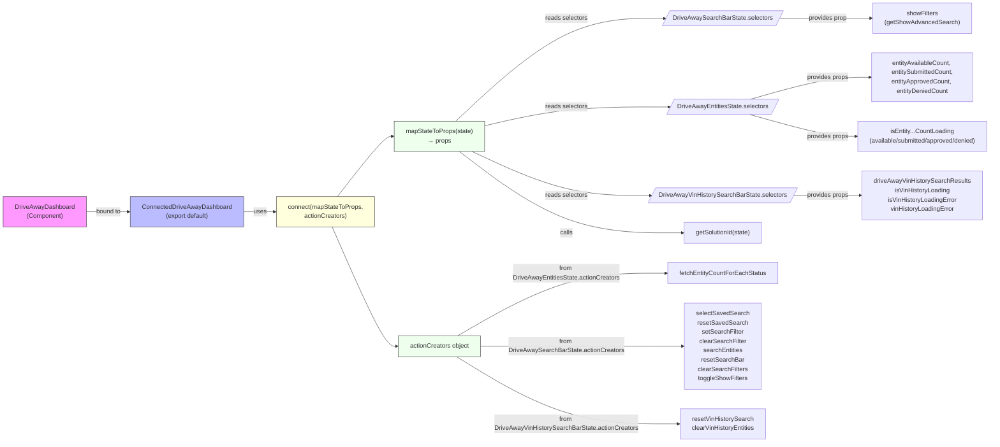

# Diagram: web/portal/src/pages/driveaway/dashboard/DriveAway.Dashboard.page.container.js

> Auto-generated by Obscura crawlers

## Mermaid

### SVG

<svg id="container" width="4169.953125" xmlns="http://www.w3.org/2000/svg" class="flowchart" height="838.5" viewBox="0 0 4169.953125 838.5" role="graphics-document document" aria-roledescription="flowchart-v2"><g><marker id="container_flowchart-v2-pointEnd" class="marker flowchart-v2" viewBox="0 0 10 10" refX="5" refY="5" markerUnits="userSpaceOnUse" markerWidth="8" markerHeight="8" orient="auto"><path d="M 0 0 L 10 5 L 0 10 z" class="arrowMarkerPath" style="stroke-width: 1; stroke-dasharray: 1, 0;"></path></marker><marker id="container_flowchart-v2-pointStart" class="marker flowchart-v2" viewBox="0 0 10 10" refX="4.5" refY="5" markerUnits="userSpaceOnUse" markerWidth="8" markerHeight="8" orient="auto"><path d="M 0 5 L 10 10 L 10 0 z" class="arrowMarkerPath" style="stroke-width: 1; stroke-dasharray: 1, 0;"></path></marker><marker id="container_flowchart-v2-circleEnd" class="marker flowchart-v2" viewBox="0 0 10 10" refX="11" refY="5" markerUnits="userSpaceOnUse" markerWidth="11" markerHeight="11" orient="auto"><circle cx="5" cy="5" r="5" class="arrowMarkerPath" style="stroke-width: 1; stroke-dasharray: 1, 0;"></circle></marker><marker id="container_flowchart-v2-circleStart" class="marker flowchart-v2" viewBox="0 0 10 10" refX="-1" refY="5" markerUnits="userSpaceOnUse" markerWidth="11" markerHeight="11" orient="auto"><circle cx="5" cy="5" r="5" class="arrowMarkerPath" style="stroke-width: 1; stroke-dasharray: 1, 0;"></circle></marker><marker id="container_flowchart-v2-crossEnd" class="marker cross flowchart-v2" viewBox="0 0 11 11" refX="12" refY="5.2" markerUnits="userSpaceOnUse" markerWidth="11" markerHeight="11" orient="auto"><path d="M 1,1 l 9,9 M 10,1 l -9,9" class="arrowMarkerPath" style="stroke-width: 2; stroke-dasharray: 1, 0;"></path></marker><marker id="container_flowchart-v2-crossStart" class="marker cross flowchart-v2" viewBox="0 0 11 11" refX="-1" refY="5.2" markerUnits="userSpaceOnUse" markerWidth="11" markerHeight="11" orient="auto"><path d="M 1,1 l 9,9 M 10,1 l -9,9" class="arrowMarkerPath" style="stroke-width: 2; stroke-dasharray: 1, 0;"></path></marker><g class="root"><g class="clusters"></g><g class="edgePaths"><path d="M332.359,431.25L342.046,431.25C351.732,431.25,371.104,431.25,389.81,431.25C408.516,431.25,426.555,431.25,435.574,431.25L444.594,431.25" id="L_DriveAwayDashboard_Connected_0" class="edge-thickness-normal edge-pattern-solid edge-thickness-normal edge-pattern-solid flowchart-link" style=";" data-edge="true" data-et="edge" data-id="L_DriveAwayDashboard_Connected_0" data-points="W3sieCI6MzMyLjM1OTM3NSwieSI6NDMxLjI1fSx7IngiOjM5MC40NzY1NjI1LCJ5Ijo0MzEuMjV9LHsieCI6NDQ4LjU5Mzc1LCJ5Ijo0MzEuMjV9XQ==" marker-end="url(#container_flowchart-v2-pointEnd)"></path><path d="M812.281,431.25L819.197,431.25C826.112,431.25,839.943,431.25,853.107,431.25C866.271,431.25,878.768,431.25,885.017,431.25L891.266,431.25" id="L_Connected_Connect_0" class="edge-thickness-normal edge-pattern-solid edge-thickness-normal edge-pattern-solid flowchart-link" style=";" data-edge="true" data-et="edge" data-id="L_Connected_Connect_0" data-points="W3sieCI6ODEyLjI4MTI1LCJ5Ijo0MzEuMjV9LHsieCI6ODUzLjc3MzQzNzUsInkiOjQzMS4yNX0seyJ4Ijo4OTUuMjY1NjI1LCJ5Ijo0MzEuMjV9XQ==" marker-end="url(#container_flowchart-v2-pointEnd)"></path><path d="M1123.136,404.25L1152.585,383.375C1182.033,362.5,1240.931,320.75,1273.879,299.875C1306.828,279,1313.828,279,1317.328,279L1320.828,279" id="L_Connect_MapState_0" class="edge-thickness-normal edge-pattern-solid edge-thickness-normal edge-pattern-solid flowchart-link" style=";" data-edge="true" data-et="edge" data-id="L_Connect_MapState_0" data-points="W3sieCI6MTEyMy4xMzYxNjA3MTQyODU4LCJ5Ijo0MDQuMjV9LHsieCI6MTI5OS44MjgxMjUsInkiOjI3OX0seyJ4IjoxMzI0LjgyODEyNSwieSI6Mjc5fV0=" marker-end="url(#container_flowchart-v2-pointEnd)"></path><path d="M1514.738,240L1562.931,205.833C1611.125,171.667,1707.512,103.333,1860.902,69.249C2014.292,35.166,2224.685,35.331,2329.882,35.414L2435.078,35.497" id="L_MapState_DASB_0" class="edge-thickness-normal edge-pattern-solid edge-thickness-normal edge-pattern-solid flowchart-link" style=";" data-edge="true" data-et="edge" data-id="L_MapState_DASB_0" data-points="W3sieCI6MTUxNC43Mzc2NDA4ODExNDc2LCJ5IjoyNDB9LHsieCI6MTgwMy44OTg0Mzc1LCJ5IjozNX0seyJ4IjoyNDM5LjA3ODEyNSwieSI6MzUuNX1d" marker-end="url(#container_flowchart-v2-pointEnd)"></path><path d="M1594.625,258.619L1629.504,253.349C1664.383,248.079,1734.141,237.54,1875.78,232.353C2017.419,227.166,2230.94,227.331,2337.701,227.414L2444.461,227.497" id="L_MapState_DAE_0" class="edge-thickness-normal edge-pattern-solid edge-thickness-normal edge-pattern-solid flowchart-link" style=";" data-edge="true" data-et="edge" data-id="L_MapState_DAE_0" data-points="W3sieCI6MTU5NC42MjUsInkiOjI1OC42MTg1NTkwNDExNzY3NX0seyJ4IjoxODAzLjg5ODQzNzUsInkiOjIyN30seyJ4IjoyNDQ4LjQ2MDkzNzUsInkiOjIyNy41fV0=" marker-end="url(#container_flowchart-v2-pointEnd)"></path><path d="M1575.44,318L1613.516,330.833C1651.592,343.667,1727.745,369.333,1864.804,382.249C2001.862,395.166,2199.826,395.331,2298.807,395.414L2397.789,395.497" id="L_MapState_DAVH_0" class="edge-thickness-normal edge-pattern-solid edge-thickness-normal edge-pattern-solid flowchart-link" style=";" data-edge="true" data-et="edge" data-id="L_MapState_DAVH_0" data-points="W3sieCI6MTU3NS40Mzk1MjA0NzQxMzgsInkiOjMxOH0seyJ4IjoxODAzLjg5ODQzNzUsInkiOjM5NX0seyJ4IjoyNDAxLjc4OTA2MjUsInkiOjM5NS41fV0=" marker-end="url(#container_flowchart-v2-pointEnd)"></path><path d="M1522.892,318L1569.727,346.917C1616.561,375.833,1710.23,433.667,1869.201,462.583C2028.172,491.5,2252.445,491.5,2364.582,491.5L2476.719,491.5" id="L_MapState_Orgs_0" class="edge-thickness-normal edge-pattern-solid edge-thickness-normal edge-pattern-solid flowchart-link" style=";" data-edge="true" data-et="edge" data-id="L_MapState_Orgs_0" data-points="W3sieCI6MTUyMi44OTIyMjQyNjQ3MDU5LCJ5IjozMTh9LHsieCI6MTgwMy44OTg0Mzc1LCJ5Ijo0OTEuNX0seyJ4IjoyNDgwLjcxODc1LCJ5Ijo0OTEuNX1d" marker-end="url(#container_flowchart-v2-pointEnd)"></path><path d="M2727.75,35.5L2811.767,35.417C2895.784,35.333,3063.818,35.167,3202.152,35.083C3340.487,35,3449.122,35,3503.44,35L3557.758,35" id="L_DASB_ShowFilters_0" class="edge-thickness-normal edge-pattern-solid edge-thickness-normal edge-pattern-solid flowchart-link" style=";" data-edge="true" data-et="edge" data-id="L_DASB_ShowFilters_0" data-points="W3sieCI6MjcyNy43NSwieSI6MzUuNX0seyJ4IjozMjMxLjg1MTU2MjUsInkiOjM1fSx7IngiOjM1NjEuNzU3ODEyNSwieSI6MzV9XQ==" marker-end="url(#container_flowchart-v2-pointEnd)"></path><path d="M2725.367,213.5L2809.781,205.084C2894.195,196.667,3063.023,179.833,3197.47,171.417C3331.917,163,3431.982,163,3482.014,163L3532.047,163" id="L_DAE_EntCounts_0" class="edge-thickness-normal edge-pattern-solid edge-thickness-normal edge-pattern-solid flowchart-link" style=";" data-edge="true" data-et="edge" data-id="L_DAE_EntCounts_0" data-points="W3sieCI6MjcyNS4zNjcwODYxOTMxNDE0LCJ5IjoyMTMuNTAwMjAyNjEzNzE2OTR9LHsieCI6MzIzMS44NTE1NjI1LCJ5IjoxNjN9LHsieCI6MzUzNi4wNDY4NzUsInkiOjE2M31d" marker-end="url(#container_flowchart-v2-pointEnd)"></path><path d="M2712.025,240.184L2798.663,248.653C2885.301,257.123,3058.576,274.061,3184.215,282.531C3309.854,291,3387.857,291,3426.858,291L3465.859,291" id="L_DAE_LoadingFlags_0" class="edge-thickness-normal edge-pattern-solid edge-thickness-normal edge-pattern-solid flowchart-link" style=";" data-edge="true" data-et="edge" data-id="L_DAE_LoadingFlags_0" data-points="W3sieCI6MjcxMi4wMjUxOTU3NjA2NywieSI6MjQwLjE4Mzk4MzQ3ODY1OTk0fSx7IngiOjMyMzEuODUxNTYyNSwieSI6MjkxfSx7IngiOjM0NjkuODU5Mzc1LCJ5IjoyOTF9XQ==" marker-end="url(#container_flowchart-v2-pointEnd)"></path><path d="M2765.039,395.5L2842.841,395.417C2920.643,395.333,3076.247,395.167,3166.582,395.083C3256.917,395,3281.982,395,3294.514,395L3307.047,395" id="L_DAVH_VinResults_0" class="edge-thickness-normal edge-pattern-solid edge-thickness-normal edge-pattern-solid flowchart-link" style=";" data-edge="true" data-et="edge" data-id="L_DAVH_VinResults_0" data-points="W3sieCI6Mjc2NS4wMzkwNjI1LCJ5IjozOTUuNX0seyJ4IjozMjMxLjg1MTU2MjUsInkiOjM5NX0seyJ4IjozMzExLjA0Njg3NSwieSI6Mzk1fV0=" marker-end="url(#container_flowchart-v2-pointEnd)"></path><path d="M1106.665,458.25L1138.859,498.458C1171.053,538.667,1235.44,619.083,1275.697,659.292C1315.953,699.5,1332.078,699.5,1340.141,699.5L1348.203,699.5" id="L_Connect_Actions_0" class="edge-thickness-normal edge-pattern-solid edge-thickness-normal edge-pattern-solid flowchart-link" style=";" data-edge="true" data-et="edge" data-id="L_Connect_Actions_0" data-points="W3sieCI6MTEwNi42NjUxMTgyNDMyNDMzLCJ5Ijo0NTguMjV9LHsieCI6MTI5OS44MjgxMjUsInkiOjY5OS41fSx7IngiOjEzNTIuMjAzMTI1LCJ5Ijo2OTkuNX1d" marker-end="url(#container_flowchart-v2-pointEnd)"></path><path d="M1549.079,672.5L1591.549,659.667C1634.019,646.833,1718.959,621.167,1867.004,608.333C2015.049,595.5,2226.201,595.5,2331.776,595.5L2437.352,595.5" id="L_Actions_DAEActions_0" class="edge-thickness-normal edge-pattern-solid edge-thickness-normal edge-pattern-solid flowchart-link" style=";" data-edge="true" data-et="edge" data-id="L_Actions_DAEActions_0" data-points="W3sieCI6MTU0OS4wNzg4NzYyMDE5MjMsInkiOjY3Mi41fSx7IngiOjE4MDMuODk4NDM3NSwieSI6NTk1LjV9LHsieCI6MjQ0MS4zNTE1NjI1LCJ5Ijo1OTUuNX1d" marker-end="url(#container_flowchart-v2-pointEnd)"></path><path d="M1567.25,699.5L1606.691,699.5C1646.133,699.5,1725.016,699.5,1798.669,699.5C1872.323,699.5,1940.747,699.5,1974.96,699.5L2009.172,699.5" id="L_Actions_DASBActions_0" class="edge-thickness-normal edge-pattern-solid edge-thickness-normal edge-pattern-solid flowchart-link" style=";" data-edge="true" data-et="edge" data-id="L_Actions_DASBActions_0" data-points="W3sieCI6MTU2Ny4yNSwieSI6Njk5LjV9LHsieCI6MTgwMy44OTg0Mzc1LCJ5Ijo2OTkuNX0seyJ4IjoyMDEzLjE3MTg3NSwieSI6Njk5LjV9XQ==" marker-end="url(#container_flowchart-v2-pointEnd)"></path><path d="M1549.079,726.5L1591.549,739.333C1634.019,752.167,1718.959,777.833,1857.129,790.667C1995.299,803.5,2186.701,803.5,2282.401,803.5L2378.102,803.5" id="L_Actions_DAVHActions_0" class="edge-thickness-normal edge-pattern-solid edge-thickness-normal edge-pattern-solid flowchart-link" style=";" data-edge="true" data-et="edge" data-id="L_Actions_DAVHActions_0" data-points="W3sieCI6MTU0OS4wNzg4NzYyMDE5MjMsInkiOjcyNi41fSx7IngiOjE4MDMuODk4NDM3NSwieSI6ODAzLjV9LHsieCI6MjM4Mi4xMDE1NjI1LCJ5Ijo4MDMuNX1d" marker-end="url(#container_flowchart-v2-pointEnd)"></path></g><g class="edgeLabels"><g class="edgeLabel" transform="translate(390.4765625, 431.25)"><g class="label" data-id="L_DriveAwayDashboard_Connected_0" transform="translate(-33.1171875, -12)"><foreignObject width="66.234375" height="24">

bound to

</foreignObject></g></g><g class="edgeLabel" transform="translate(853.7734375, 431.25)"><g class="label" data-id="L_Connected_Connect_0" transform="translate(-16.4921875, -12)"><foreignObject width="32.984375" height="24">

uses

</foreignObject></g></g><g class="edgeLabel"><g class="label" data-id="L_Connect_MapState_0" transform="translate(0, 0)"><foreignObject width="0" height="0">

</foreignObject></g></g><g class="edgeLabel" transform="translate(1803.8984375, 35)"><g class="label" data-id="L_MapState_DASB_0" transform="translate(-54.8515625, -12)"><foreignObject width="109.703125" height="24">

reads selectors

</foreignObject></g></g><g class="edgeLabel" transform="translate(1803.8984375, 227)"><g class="label" data-id="L_MapState_DAE_0" transform="translate(-54.8515625, -12)"><foreignObject width="109.703125" height="24">

reads selectors

</foreignObject></g></g><g class="edgeLabel" transform="translate(1803.8984375, 395)"><g class="label" data-id="L_MapState_DAVH_0" transform="translate(-54.8515625, -12)"><foreignObject width="109.703125" height="24">

reads selectors

</foreignObject></g></g><g class="edgeLabel" transform="translate(1803.8984375, 491.5)"><g class="label" data-id="L_MapState_Orgs_0" transform="translate(-16.4453125, -12)"><foreignObject width="32.890625" height="24">

calls

</foreignObject></g></g><g class="edgeLabel" transform="translate(3231.8515625, 35)"><g class="label" data-id="L_DASB_ShowFilters_0" transform="translate(-50.4609375, -12)"><foreignObject width="100.921875" height="24">

provides prop

</foreignObject></g></g><g class="edgeLabel" transform="translate(3231.8515625, 163)"><g class="label" data-id="L_DAE_EntCounts_0" transform="translate(-54.1953125, -12)"><foreignObject width="108.390625" height="24">

provides props

</foreignObject></g></g><g class="edgeLabel" transform="translate(3231.8515625, 291)"><g class="label" data-id="L_DAE_LoadingFlags_0" transform="translate(-54.1953125, -12)"><foreignObject width="108.390625" height="24">

provides props

</foreignObject></g></g><g class="edgeLabel" transform="translate(3231.8515625, 395)"><g class="label" data-id="L_DAVH_VinResults_0" transform="translate(-54.1953125, -12)"><foreignObject width="108.390625" height="24">

provides props

</foreignObject></g></g><g class="edgeLabel"><g class="label" data-id="L_Connect_Actions_0" transform="translate(0, 0)"><foreignObject width="0" height="0">

</foreignObject></g></g><g class="edgeLabel" transform="translate(1803.8984375, 595.5)"><g class="label" data-id="L_Actions_DAEActions_0" transform="translate(-137.6015625, -24)"><foreignObject width="275.203125" height="48">

from DriveAwayEntitiesState.actionCreators

</foreignObject></g></g><g class="edgeLabel" transform="translate(1803.8984375, 699.5)"><g class="label" data-id="L_Actions_DASBActions_0" transform="translate(-146.984375, -24)"><foreignObject width="293.96875" height="48">

from DriveAwaySearchBarState.actionCreators

</foreignObject></g></g><g class="edgeLabel" transform="translate(1803.8984375, 803.5)"><g class="label" data-id="L_Actions_DAVHActions_0" transform="translate(-184.2734375, -24)"><foreignObject width="368.546875" height="48">

from DriveAwayVinHistorySearchBarState.actionCreators

</foreignObject></g></g></g><g class="nodes"><g class="node default" id="flowchart-DriveAwayDashboard-0" transform="translate(170.1796875, 431.25)"><rect class="basic label-container" style="fill:#f9f !important;stroke:#333 !important;stroke-width:1px !important" x="-162.1796875" y="-27" width="324.359375" height="54"></rect><g class="label" style="" transform="translate(-132.1796875, -12)"><rect></rect><foreignObject width="264.359375" height="24">

DriveAwayDashboard\n(Component)

</foreignObject></g></g><g class="node default" id="flowchart-Connect-1" transform="translate(1085.046875, 431.25)"><rect class="basic label-container" style="fill:#ffd !important;stroke:#333 !important" x="-189.78125" y="-27" width="379.5625" height="54"></rect><g class="label" style="" transform="translate(-159.78125, -12)"><rect></rect><foreignObject width="319.5625" height="24">

connect(mapStateToProps,\nactionCreators)

</foreignObject></g></g><g class="node default" id="flowchart-Connected-2" transform="translate(630.4375, 431.25)"><rect class="basic label-container" style="fill:#bbf !important;stroke:#333 !important" x="-181.84375" y="-39" width="363.6875" height="78"></rect><g class="label" style="" transform="translate(-151.84375, -24)"><rect></rect><foreignObject width="303.6875" height="48">

ConnectedDriveAwayDashboard\n(export default)

</foreignObject></g></g><g class="node default" id="flowchart-MapState-7" transform="translate(1459.7265625, 279)"><rect class="basic label-container" style="fill:#efe !important;stroke:#333 !important" x="-134.8984375" y="-39" width="269.796875" height="78"></rect><g class="label" style="" transform="translate(-104.8984375, -24)"><rect></rect><foreignObject width="209.796875" height="48">

mapStateToProps(state)\n→ props

</foreignObject></g></g><g class="node default" id="flowchart-DASB-11" transform="translate(2582.9140625, 35)"><polygon points="-19.5,0 269.171875,0 288.671875,-39 0,-39" class="label-container" transform="translate(-134.5859375,19.5)"></polygon><g class="label" style="" transform="translate(-127.0859375, -12)"><rect></rect><foreignObject width="254.171875" height="24">

DriveAwaySearchBarState.selectors

</foreignObject></g></g><g class="node default" id="flowchart-DAE-13" transform="translate(2582.9140625, 227)"><polygon points="-19.5,0 250.40625,0 269.90625,-39 0,-39" class="label-container" transform="translate(-125.203125,19.5)"></polygon><g class="label" style="" transform="translate(-117.703125, -12)"><rect></rect><foreignObject width="235.40625" height="24">

DriveAwayEntitiesState.selectors

</foreignObject></g></g><g class="node default" id="flowchart-DAVH-15" transform="translate(2582.9140625, 395)"><polygon points="-19.5,0 343.75,0 363.25,-39 0,-39" class="label-container" transform="translate(-171.875,19.5)"></polygon><g class="label" style="" transform="translate(-164.375, -12)"><rect></rect><foreignObject width="328.75" height="24">

DriveAwayVinHistorySearchBarState.selectors

</foreignObject></g></g><g class="node default" id="flowchart-Orgs-17" transform="translate(2582.9140625, 491.5)"><rect class="basic label-container" style="" x="-102.1953125" y="-27" width="204.390625" height="54"></rect><g class="label" style="" transform="translate(-72.1953125, -12)"><rect></rect><foreignObject width="144.390625" height="24">

getSolutionId(state)

</foreignObject></g></g><g class="node default" id="flowchart-ShowFilters-19" transform="translate(3736.5, 35)"><rect class="basic label-container" style="" x="-174.7421875" y="-27" width="349.484375" height="54"></rect><g class="label" style="" transform="translate(-144.7421875, -12)"><rect></rect><foreignObject width="289.484375" height="24">

showFilters\n(getShowAdvancedSearch)

</foreignObject></g></g><g class="node default" id="flowchart-EntCounts-21" transform="translate(3736.5, 163)"><rect class="basic label-container" style="" x="-200.453125" y="-51" width="400.90625" height="102"></rect><g class="label" style="" transform="translate(-170.453125, -36)"><rect></rect><foreignObject width="340.90625" height="72">

entityAvailableCount, entitySubmittedCount,\nentityApprovedCount, entityDeniedCount

</foreignObject></g></g><g class="node default" id="flowchart-LoadingFlags-23" transform="translate(3736.5, 291)"><rect class="basic label-container" style="" x="-266.640625" y="-27" width="533.28125" height="54"></rect><g class="label" style="" transform="translate(-236.640625, -12)"><rect></rect><foreignObject width="473.28125" height="24">

isEntity...CountLoading\n(available/submitted/approved/denied)

</foreignObject></g></g><g class="node default" id="flowchart-VinResults-25" transform="translate(3736.5, 395)"><rect class="basic label-container" style="" x="-425.453125" y="-27" width="850.90625" height="54"></rect><g class="label" style="" transform="translate(-395.453125, -12)"><rect></rect><foreignObject width="790.90625" height="24">

driveAwayVinHistorySearchResults\nisVinHistoryLoading\nisVinHistoryLoadingError\nvinHistoryLoadingError

</foreignObject></g></g><g class="node default" id="flowchart-Actions-26" transform="translate(1459.7265625, 699.5)"><rect class="basic label-container" style="fill:#efe !important;stroke:#333 !important" x="-107.5234375" y="-27" width="215.046875" height="54"></rect><g class="label" style="" transform="translate(-77.5234375, -12)"><rect></rect><foreignObject width="155.046875" height="24">

actionCreators object

</foreignObject></g></g><g class="node default" id="flowchart-DAEActions-30" transform="translate(2582.9140625, 595.5)"><rect class="basic label-container" style="" x="-141.5625" y="-27" width="283.125" height="54"></rect><g class="label" style="" transform="translate(-111.5625, -12)"><rect></rect><foreignObject width="223.125" height="24">

fetchEntityCountForEachStatus

</foreignObject></g></g><g class="node default" id="flowchart-DASBActions-32" transform="translate(2582.9140625, 699.5)"><rect class="basic label-container" style="" x="-569.7421875" y="-27" width="1139.484375" height="54"></rect><g class="label" style="" transform="translate(-539.7421875, -12)"><rect></rect><foreignObject width="1079.484375" height="24">

selectSavedSearch\nresetSavedSearch\nsetSearchFilter\nclearSearchFilter\nsearchEntities\nresetSearchBar\nclearSearchFilters\ntoggleShowFilters

</foreignObject></g></g><g class="node default" id="flowchart-DAVHActions-34" transform="translate(2582.9140625, 803.5)"><rect class="basic label-container" style="" x="-200.8125" y="-27" width="401.625" height="54"></rect><g class="label" style="" transform="translate(-170.8125, -12)"><rect></rect><foreignObject width="341.625" height="24">

resetVinHistorySearch\nclearVinHistoryEntities

</foreignObject></g></g></g></g></g></svg>
