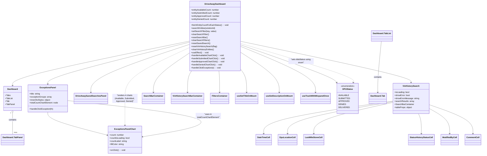

# Diagram: web/portal/src/pages/driveaway/dashboard/DriveAway.Dashboard.page.js

> Auto-generated by Obscura crawlers

## Mermaid

### SVG

<svg id="container" width="3684.24609375" xmlns="http://www.w3.org/2000/svg" class="classDiagram" height="1220" viewBox="0 0 3684.24609375 1220" role="graphics-document document" aria-roledescription="class"><g><defs><marker id="container_class-aggregationStart" class="marker aggregation class" refX="18" refY="7" markerWidth="190" markerHeight="240" orient="auto"><path d="M 18,7 L9,13 L1,7 L9,1 Z"></path></marker></defs><defs><marker id="container_class-aggregationEnd" class="marker aggregation class" refX="1" refY="7" markerWidth="20" markerHeight="28" orient="auto"><path d="M 18,7 L9,13 L1,7 L9,1 Z"></path></marker></defs><defs><marker id="container_class-extensionStart" class="marker extension class" refX="18" refY="7" markerWidth="190" markerHeight="240" orient="auto"><path d="M 1,7 L18,13 V 1 Z"></path></marker></defs><defs><marker id="container_class-extensionEnd" class="marker extension class" refX="1" refY="7" markerWidth="20" markerHeight="28" orient="auto"><path d="M 1,1 V 13 L18,7 Z"></path></marker></defs><defs><marker id="container_class-compositionStart" class="marker composition class" refX="18" refY="7" markerWidth="190" markerHeight="240" orient="auto"><path d="M 18,7 L9,13 L1,7 L9,1 Z"></path></marker></defs><defs><marker id="container_class-compositionEnd" class="marker composition class" refX="1" refY="7" markerWidth="20" markerHeight="28" orient="auto"><path d="M 18,7 L9,13 L1,7 L9,1 Z"></path></marker></defs><defs><marker id="container_class-dependencyStart" class="marker dependency class" refX="6" refY="7" markerWidth="190" markerHeight="240" orient="auto"><path d="M 5,7 L9,13 L1,7 L9,1 Z"></path></marker></defs><defs><marker id="container_class-dependencyEnd" class="marker dependency class" refX="13" refY="7" markerWidth="20" markerHeight="28" orient="auto"><path d="M 18,7 L9,13 L14,7 L9,1 Z"></path></marker></defs><defs><marker id="container_class-lollipopStart" class="marker lollipop class" refX="13" refY="7" markerWidth="190" markerHeight="240" orient="auto"><circle stroke="black" fill="transparent" cx="7" cy="7" r="6"></circle></marker></defs><defs><marker id="container_class-lollipopEnd" class="marker lollipop class" refX="1" refY="7" markerWidth="190" markerHeight="240" orient="auto"><circle stroke="black" fill="transparent" cx="7" cy="7" r="6"></circle></marker></defs><g class="root"><g class="clusters"></g><g class="edgePaths"><path d="M1449.221,325.292L1223.373,372.576C997.525,419.861,545.829,514.431,319.981,572.882C94.133,631.333,94.133,653.667,94.133,664.833L94.133,676" id="id_DriveAwayDashboard_Dashboard_1" class="edge-thickness-normal edge-pattern-solid relation" style=";;;" data-edge="true" data-et="edge" data-id="id_DriveAwayDashboard_Dashboard_1" data-points="W3sieCI6MTQ0OS4yMjA3MDMxMjUsInkiOjMyNS4yOTE1ODUyNTAzMTM2M30seyJ4Ijo5NC4xMzI4MTI1LCJ5Ijo2MDl9LHsieCI6OTQuMTMyODEyNSwieSI6NjgyfV0=" marker-end="url(#container_class-dependencyEnd)"></path><path d="M1449.221,421.16L1404.205,452.467C1359.189,483.773,1269.157,546.387,1224.141,597.86C1179.125,649.333,1179.125,689.667,1179.125,709.833L1179.125,730" id="id_DriveAwayDashboard_SearchBarContainer_2" class="edge-thickness-normal edge-pattern-solid relation" style=";;;" data-edge="true" data-et="edge" data-id="id_DriveAwayDashboard_SearchBarContainer_2" data-points="W3sieCI6MTQ0OS4yMjA3MDMxMjUsInkiOjQyMS4xNTk5NTEwMTcwNjQ2fSx7IngiOjExNzkuMTI1LCJ5Ijo2MDl9LHsieCI6MTE3OS4xMjUsInkiOjczNn1d" marker-end="url(#container_class-dependencyEnd)"></path><path d="M1674.596,560L1675.429,568.167C1676.262,576.333,1677.928,592.667,1678.761,621C1679.594,649.333,1679.594,689.667,1679.594,709.833L1679.594,730" id="id_DriveAwayDashboard_FiltersContainer_3" class="edge-thickness-normal edge-pattern-solid relation" style=";;;" data-edge="true" data-et="edge" data-id="id_DriveAwayDashboard_FiltersContainer_3" data-points="W3sieCI6MTY3NC41OTU2OTExMDU3NjkyLCJ5Ijo1NjB9LHsieCI6MTY3OS41OTM3NSwieSI6NjA5fSx7IngiOjE2NzkuNTkzNzUsInkiOjczNn1d" marker-end="url(#container_class-dependencyEnd)"></path><path d="M1449.221,351.644L1324.163,394.537C1199.105,437.429,948.99,523.215,823.933,586.274C698.875,649.333,698.875,689.667,698.875,709.833L698.875,730" id="id_DriveAwayDashboard_DriveAwaySavedSearchesPanel_4" class="edge-thickness-normal edge-pattern-solid relation" style=";;;" data-edge="true" data-et="edge" data-id="id_DriveAwayDashboard_DriveAwaySavedSearchesPanel_4" data-points="W3sieCI6MTQ0OS4yMjA3MDMxMjUsInkiOjM1MS42NDQwNTE5MDA5Mzg4NX0seyJ4Ijo2OTguODc1LCJ5Ijo2MDl9LHsieCI6Njk4Ljg3NSwieSI6NzM2fV0=" marker-end="url(#container_class-dependencyEnd)"></path><path d="M1449.221,334.131L1268.993,379.943C1088.766,425.754,728.311,517.377,548.083,572.355C367.855,627.333,367.855,645.667,367.855,654.833L367.855,664" id="id_DriveAwayDashboard_ExceptionsPanel_5" class="edge-thickness-normal edge-pattern-solid relation" style=";;;" data-edge="true" data-et="edge" data-id="id_DriveAwayDashboard_ExceptionsPanel_5" data-points="W3sieCI6MTQ0OS4yMjA3MDMxMjUsInkiOjMzNC4xMzEzNzA1MTUyNjI3fSx7IngiOjM2Ny44NTU0Njg3NSwieSI6NjA5fSx7IngiOjM2Ny44NTU0Njg3NSwieSI6NjcwfV0=" marker-end="url(#container_class-dependencyEnd)"></path><path d="M1843.666,326.829L2060.229,373.857C2276.791,420.886,2709.916,514.943,2926.479,569.138C3143.041,623.333,3143.041,637.667,3143.041,644.833L3143.041,652" id="id_DriveAwayDashboard_VinHistorySearch_6" class="edge-thickness-normal edge-pattern-solid relation" style=";;;" data-edge="true" data-et="edge" data-id="id_DriveAwayDashboard_VinHistorySearch_6" data-points="W3sieCI6MTg0My42NjYwMTU2MjUsInkiOjMyNi44Mjg3MjA4NzQ2OTIzNX0seyJ4IjozMTQzLjA0MTAxNTYyNSwieSI6NjA5fSx7IngiOjMxNDMuMDQxMDE1NjI1LCJ5Ijo2NTh9XQ==" marker-end="url(#container_class-dependencyEnd)"></path><path d="M1468.292,560L1463.021,568.167C1457.75,576.333,1447.207,592.667,1441.935,621C1436.664,649.333,1436.664,689.667,1436.664,709.833L1436.664,730" id="id_DriveAwayDashboard_VinHistorySearchBarContainer_7" class="edge-thickness-normal edge-pattern-solid relation" style=";;;" data-edge="true" data-et="edge" data-id="id_DriveAwayDashboard_VinHistorySearchBarContainer_7" data-points="W3sieCI6MTQ2OC4yOTIzMjU3MjExNTQsInkiOjU2MH0seyJ4IjoxNDM2LjY2NDA2MjUsInkiOjYwOX0seyJ4IjoxNDM2LjY2NDA2MjUsInkiOjczNn1d" marker-end="url(#container_class-dependencyEnd)"></path><path d="M1843.666,551.027L1850.802,560.689C1857.939,570.351,1872.212,589.676,1879.348,619.504C1886.484,649.333,1886.484,689.667,1886.484,709.833L1886.484,730" id="id_DriveAwayDashboard_useSetTitleOnMount_8" class="edge-thickness-normal edge-pattern-solid relation" style=";;;" data-edge="true" data-et="edge" data-id="id_DriveAwayDashboard_useSetTitleOnMount_8" data-points="W3sieCI6MTg0My42NjYwMTU2MjUsInkiOjU1MS4wMjY3MTI1NTcyNjE2fSx7IngiOjE4ODYuNDg0Mzc1LCJ5Ijo2MDl9LHsieCI6MTg4Ni40ODQzNzUsInkiOjczNn1d" marker-end="url(#container_class-dependencyEnd)"></path><path d="M1843.666,415.021L1892.331,447.351C1940.996,479.681,2038.326,544.34,2086.991,596.837C2135.656,649.333,2135.656,689.667,2135.656,709.833L2135.656,730" id="id_DriveAwayDashboard_useSetDescriptionOnMount_9" class="edge-thickness-normal edge-pattern-solid relation" style=";;;" data-edge="true" data-et="edge" data-id="id_DriveAwayDashboard_useSetDescriptionOnMount_9" data-points="W3sieCI6MTg0My42NjYwMTU2MjUsInkiOjQxNS4wMjE0MTExNDc1MzA1fSx7IngiOjIxMzUuNjU2MjUsInkiOjYwOX0seyJ4IjoyMTM1LjY1NjI1LCJ5Ijo3MzZ9XQ==" marker-end="url(#container_class-dependencyEnd)"></path><path d="M1843.666,367.862L1938.183,408.051C2032.699,448.241,2221.732,528.621,2316.249,588.977C2410.766,649.333,2410.766,689.667,2410.766,709.833L2410.766,730" id="id_DriveAwayDashboard_useTrackWithMixpanelOnce_10" class="edge-thickness-normal edge-pattern-solid relation" style=";;;" data-edge="true" data-et="edge" data-id="id_DriveAwayDashboard_useTrackWithMixpanelOnce_10" data-points="W3sieCI6MTg0My42NjYwMTU2MjUsInkiOjM2Ny44NjE2OTgzNDg5NzY0Nn0seyJ4IjoyNDEwLjc2NTYyNSwieSI6NjA5fSx7IngiOjI0MTAuNzY1NjI1LCJ5Ijo3MzZ9XQ==" marker-end="url(#container_class-dependencyEnd)"></path><path d="M1843.666,355.544L1960.115,397.787C2076.563,440.029,2309.46,524.515,2430.75,574.09C2552.04,623.664,2561.723,638.329,2566.565,645.661L2571.406,652.993" id="id_DriveAwayDashboard_DPUStatus_11" class="edge-thickness-normal edge-pattern-solid relation" style=";;;" data-edge="true" data-et="edge" data-id="id_DriveAwayDashboard_DPUStatus_11" data-points="W3sieCI6MTg0My42NjYwMTU2MjUsInkiOjM1NS41NDQwOTc3NzAyNTkxfSx7IngiOjI1NDIuMzU3NDIxODc1LCJ5Ijo2MDl9LHsieCI6MjU3NC43MTI0Mzk5MDM4NDYsInkiOjY1OH1d" marker-end="url(#container_class-dependencyEnd)"></path><path d="M367.855,886L367.855,896.167C367.855,906.333,367.855,926.667,443.537,956.924C519.219,987.181,670.583,1027.362,746.265,1047.453L821.947,1067.543" id="id_ExceptionsPanel_ExceptionsPanelChart_12" class="edge-thickness-normal edge-pattern-solid relation" style=";;;" data-edge="true" data-et="edge" data-id="id_ExceptionsPanel_ExceptionsPanelChart_12" data-points="W3sieCI6MzY3Ljg1NTQ2ODc1LCJ5Ijo4ODZ9LHsieCI6MzY3Ljg1NTQ2ODc1LCJ5Ijo5NDd9LHsieCI6ODI3Ljc0NjA5Mzc1LCJ5IjoxMDY5LjA4MjY1MjQ4ODM1OTF9XQ==" marker-end="url(#container_class-dependencyEnd)"></path><path d="M3003.619,799.115L2840.873,823.763C2678.127,848.41,2352.635,897.705,2189.889,940.519C2027.143,983.333,2027.143,1019.667,2027.143,1037.833L2027.143,1056" id="id_VinHistorySearch_DateTimeCell_13" class="edge-thickness-normal edge-pattern-solid relation" style=";;;" data-edge="true" data-et="edge" data-id="id_VinHistorySearch_DateTimeCell_13" data-points="W3sieCI6MzAwMy42MTkxNDA2MjUsInkiOjc5OS4xMTUwOTA4MzkwOH0seyJ4IjoyMDI3LjE0MjU3ODEyNSwieSI6OTQ3fSx7IngiOjIwMjcuMTQyNTc4MTI1LCJ5IjoxMDYyfV0=" marker-end="url(#container_class-dependencyEnd)"></path><path d="M3003.619,803.223L2871.165,827.186C2738.71,851.149,2473.801,899.074,2341.347,941.204C2208.893,983.333,2208.893,1019.667,2208.893,1037.833L2208.893,1056" id="id_VinHistorySearch_DpuLocationCell_14" class="edge-thickness-normal edge-pattern-solid relation" style=";;;" data-edge="true" data-et="edge" data-id="id_VinHistorySearch_DpuLocationCell_14" data-points="W3sieCI6MzAwMy42MTkxNDA2MjUsInkiOjgwMy4yMjMyODk5MjgxNTk4fSx7IngiOjIyMDguODkyNTc4MTI1LCJ5Ijo5NDd9LHsieCI6MjIwOC44OTI1NzgxMjUsInkiOjEwNjJ9XQ==" marker-end="url(#container_class-dependencyEnd)"></path><path d="M3003.619,810.048L2904.32,832.873C2805.02,855.699,2606.421,901.349,2507.122,942.341C2407.822,983.333,2407.822,1019.667,2407.822,1037.833L2407.822,1056" id="id_VinHistorySearch_LastMileStoneCell_15" class="edge-thickness-normal edge-pattern-solid relation" style=";;;" data-edge="true" data-et="edge" data-id="id_VinHistorySearch_LastMileStoneCell_15" data-points="W3sieCI6MzAwMy42MTkxNDA2MjUsInkiOjgxMC4wNDgwMDg2NzA4ODg3fSx7IngiOjI0MDcuODIyMjY1NjI1LCJ5Ijo5NDd9LHsieCI6MjQwNy44MjIyNjU2MjUsInkiOjEwNjJ9XQ==" marker-end="url(#container_class-dependencyEnd)"></path><path d="M3199.88,898L3203.749,906.167C3207.617,914.333,3215.353,930.667,3219.222,957C3223.09,983.333,3223.09,1019.667,3223.09,1037.833L3223.09,1056" id="id_VinHistorySearch_StatusHistoryStatusCell_16" class="edge-thickness-normal edge-pattern-solid relation" style=";;;" data-edge="true" data-et="edge" data-id="id_VinHistorySearch_StatusHistoryStatusCell_16" data-points="W3sieCI6MzE5OS44ODA0MjAyMTA3OTksInkiOjg5OH0seyJ4IjozMjIzLjA4OTg0Mzc1LCJ5Ijo5NDd9LHsieCI6MzIyMy4wODk4NDM3NSwieSI6MTA2Mn1d" marker-end="url(#container_class-dependencyEnd)"></path><path d="M3282.463,857.669L3308.518,872.558C3334.573,887.446,3386.683,917.223,3412.738,950.278C3438.793,983.333,3438.793,1019.667,3438.793,1037.833L3438.793,1056" id="id_VinHistorySearch_ModifiedByCell_17" class="edge-thickness-normal edge-pattern-solid relation" style=";;;" data-edge="true" data-et="edge" data-id="id_VinHistorySearch_ModifiedByCell_17" data-points="W3sieCI6MzI4Mi40NjI4OTA2MjUsInkiOjg1Ny42NjkxMTY3MjQ0NTF9LHsieCI6MzQzOC43OTI5Njg3NSwieSI6OTQ3fSx7IngiOjM0MzguNzkyOTY4NzUsInkiOjEwNjJ9XQ==" marker-end="url(#container_class-dependencyEnd)"></path><path d="M3282.463,827.832L3338.032,847.693C3393.602,867.554,3504.74,907.277,3560.31,945.305C3615.879,983.333,3615.879,1019.667,3615.879,1037.833L3615.879,1056" id="id_VinHistorySearch_CommentCell_18" class="edge-thickness-normal edge-pattern-solid relation" style=";;;" data-edge="true" data-et="edge" data-id="id_VinHistorySearch_CommentCell_18" data-points="W3sieCI6MzI4Mi40NjI4OTA2MjUsInkiOjgyNy44MzE2NTk3MzQwNjkxfSx7IngiOjM2MTUuODc4OTA2MjUsInkiOjk0N30seyJ4IjozNjE1Ljg3ODkwNjI1LCJ5IjoxMDYyfV0=" marker-end="url(#container_class-dependencyEnd)"></path><path d="M1096.731,1080.547L1227.177,1058.289C1357.623,1036.031,1618.516,991.516,1522.972,943.991C1427.428,896.466,975.449,845.932,749.459,820.665L523.469,795.398" id="id_ExceptionsPanelChart_ExceptionsPanel_19" class="edge-thickness-normal edge-pattern-solid relation" style=";;;" data-edge="true" data-et="edge" data-id="id_ExceptionsPanelChart_ExceptionsPanel_19" data-points="W3sieCI6MTA5MC44MTY0MDYyNSwieSI6MTA4MS41NTYzMzY2OTc3NjM4fSx7IngiOjE4NzkuNDA4MjAzMTI1LCJ5Ijo5NDd9LHsieCI6NTIzLjQ2ODc1LCJ5Ijo3OTUuMzk4NDMwMDYwMTQ4N31d" marker-start="url(#container_class-dependencyStart)"></path><path d="M94.133,891.25L94.133,900.542C94.133,909.833,94.133,928.417,94.133,956.875C94.133,985.333,94.133,1023.667,94.133,1042.833L94.133,1062" id="id_Dashboard_Dashboard.TabPanel_20" class="edge-thickness-normal edge-pattern-solid relation" style=";;;" data-edge="true" data-et="edge" data-id="id_Dashboard_Dashboard.TabPanel_20" data-points="W3sieCI6OTQuMTMyODEyNSwieSI6ODc0fSx7IngiOjk0LjEzMjgxMjUsInkiOjk0N30seyJ4Ijo5NC4xMzI4MTI1LCJ5IjoxMDYyfV0=" marker-start="url(#container_class-aggregationStart)"></path><path d="M2920.036,326L2914.641,373.167C2909.246,420.333,2898.456,514.667,2893.061,582C2887.666,649.333,2887.666,689.667,2887.666,709.833L2887.666,730" id="id_Dashboard.TabList_Dashboard.Tab_21" class="edge-thickness-normal edge-pattern-solid relation" style=";;;" data-edge="true" data-et="edge" data-id="id_Dashboard.TabList_Dashboard.Tab_21" data-points="W3sieCI6MjkyMC4wMzU4NDEzNDYxNTQsInkiOjMyNn0seyJ4IjoyODg3LjY2NjAxNTYyNSwieSI6NjA5fSx7IngiOjI4ODcuNjY2MDE1NjI1LCJ5Ijo3MzZ9XQ==" marker-end="url(#container_class-dependencyEnd)"></path><path d="M1449.221,377.278L1367.564,415.899C1285.908,454.519,1122.594,531.759,1040.938,598.546C959.281,665.333,959.281,721.667,959.281,778C959.281,834.333,959.281,890.667,959.281,926C959.281,961.333,959.281,975.667,959.281,982.833L959.281,990" id="id_DriveAwayDashboard_ExceptionsPanelChart_22" class="edge-thickness-normal edge-pattern-dashed relation" style=";;;" data-edge="true" data-et="edge" data-id="id_DriveAwayDashboard_ExceptionsPanelChart_22" data-points="W3sieCI6MTQ0OS4yMjA3MDMxMjUsInkiOjM3Ny4yNzgzNzI2MDkyNjU0fSx7IngiOjk1OS4yODEyNSwieSI6NjA5fSx7IngiOjk1OS4yODEyNSwieSI6Nzc4fSx7IngiOjk1OS4yODEyNSwieSI6OTQ3fSx7IngiOjk1OS4yODEyNSwieSI6OTk2fV0=" marker-end="url(#container_class-dependencyEnd)"></path><path d="M1843.666,344.044L1988.713,388.203C2133.76,432.363,2423.855,520.681,2566.337,572.065C2708.82,623.449,2703.69,637.897,2701.125,645.121L2698.56,652.346" id="id_DriveAwayDashboard_DPUStatus_23" class="edge-thickness-normal edge-pattern-dashed relation" style=";;;" data-edge="true" data-et="edge" data-id="id_DriveAwayDashboard_DPUStatus_23" data-points="W3sieCI6MTg0My42NjYwMTU2MjUsInkiOjM0NC4wNDQwMzg4MzkwNzI1fSx7IngiOjI3MTMuOTQ5MjE4NzUsInkiOjYwOX0seyJ4IjoyNjk2LjU1Mjc2OTA0NTg1OCwieSI6NjU4fV0=" marker-end="url(#container_class-dependencyEnd)"></path></g><g class="edgeLabels"><g class="edgeLabel"><g class="label" data-id="id_DriveAwayDashboard_Dashboard_1" transform="translate(0, 0)"><foreignObject width="0" height="0">

</foreignObject></g></g><g class="edgeLabel"><g class="label" data-id="id_DriveAwayDashboard_SearchBarContainer_2" transform="translate(0, 0)"><foreignObject width="0" height="0">

</foreignObject></g></g><g class="edgeLabel"><g class="label" data-id="id_DriveAwayDashboard_FiltersContainer_3" transform="translate(0, 0)"><foreignObject width="0" height="0">

</foreignObject></g></g><g class="edgeLabel"><g class="label" data-id="id_DriveAwayDashboard_DriveAwaySavedSearchesPanel_4" transform="translate(0, 0)"><foreignObject width="0" height="0">

</foreignObject></g></g><g class="edgeLabel"><g class="label" data-id="id_DriveAwayDashboard_ExceptionsPanel_5" transform="translate(0, 0)"><foreignObject width="0" height="0">

</foreignObject></g></g><g class="edgeLabel"><g class="label" data-id="id_DriveAwayDashboard_VinHistorySearch_6" transform="translate(0, 0)"><foreignObject width="0" height="0">

</foreignObject></g></g><g class="edgeLabel"><g class="label" data-id="id_DriveAwayDashboard_VinHistorySearchBarContainer_7" transform="translate(0, 0)"><foreignObject width="0" height="0">

</foreignObject></g></g><g class="edgeLabel"><g class="label" data-id="id_DriveAwayDashboard_useSetTitleOnMount_8" transform="translate(0, 0)"><foreignObject width="0" height="0">

</foreignObject></g></g><g class="edgeLabel"><g class="label" data-id="id_DriveAwayDashboard_useSetDescriptionOnMount_9" transform="translate(0, 0)"><foreignObject width="0" height="0">

</foreignObject></g></g><g class="edgeLabel"><g class="label" data-id="id_DriveAwayDashboard_useTrackWithMixpanelOnce_10" transform="translate(0, 0)"><foreignObject width="0" height="0">

</foreignObject></g></g><g class="edgeLabel"><g class="label" data-id="id_DriveAwayDashboard_DPUStatus_11" transform="translate(0, 0)"><foreignObject width="0" height="0">

</foreignObject></g></g><g class="edgeLabel"><g class="label" data-id="id_ExceptionsPanel_ExceptionsPanelChart_12" transform="translate(0, 0)"><foreignObject width="0" height="0">

</foreignObject></g></g><g class="edgeLabel"><g class="label" data-id="id_VinHistorySearch_DateTimeCell_13" transform="translate(0, 0)"><foreignObject width="0" height="0">

</foreignObject></g></g><g class="edgeLabel"><g class="label" data-id="id_VinHistorySearch_DpuLocationCell_14" transform="translate(0, 0)"><foreignObject width="0" height="0">

</foreignObject></g></g><g class="edgeLabel"><g class="label" data-id="id_VinHistorySearch_LastMileStoneCell_15" transform="translate(0, 0)"><foreignObject width="0" height="0">

</foreignObject></g></g><g class="edgeLabel"><g class="label" data-id="id_VinHistorySearch_StatusHistoryStatusCell_16" transform="translate(0, 0)"><foreignObject width="0" height="0">

</foreignObject></g></g><g class="edgeLabel"><g class="label" data-id="id_VinHistorySearch_ModifiedByCell_17" transform="translate(0, 0)"><foreignObject width="0" height="0">

</foreignObject></g></g><g class="edgeLabel"><g class="label" data-id="id_VinHistorySearch_CommentCell_18" transform="translate(0, 0)"><foreignObject width="0" height="0">

</foreignObject></g></g><g class="edgeLabel" transform="translate(1598.95612, 915.6439)"><g class="label" data-id="id_ExceptionsPanelChart_ExceptionsPanel_19" transform="translate(-100, -24)"><foreignObject width="200" height="48">

"uses in totalCountChartElement"

</foreignObject></g></g><g class="edgeLabel" transform="translate(94.1328125, 947)"><g class="label" data-id="id_Dashboard_Dashboard.TabPanel_20" transform="translate(-30.890625, -12)"><foreignObject width="61.78125" height="24">

contains

</foreignObject></g></g><g class="edgeLabel" transform="translate(2887.666015625, 609)"><g class="label" data-id="id_Dashboard.TabList_Dashboard.Tab_21" transform="translate(-30.890625, -12)"><foreignObject width="61.78125" height="24">

contains

</foreignObject></g></g><g class="edgeLabel" transform="translate(959.28125, 778)"><g class="label" data-id="id_DriveAwayDashboard_ExceptionsPanelChart_22" transform="translate(-100, -36)"><foreignObject width="200" height="72">

"renders 4 charts (Available, Submitted, Approved, Denied)"

</foreignObject></g></g><g class="edgeLabel" transform="translate(2303.67877, 484.09399)"><g class="label" data-id="id_DriveAwayDashboard_DPUStatus_23" transform="translate(-100, -24)"><foreignObject width="200" height="48">

"sets ddaStatus using enum"

</foreignObject></g></g><g class="edgeTerminals" transform="translate(79.13281125000005, 891.4999989285715)"><g class="inner" transform="translate(0, 0)"><foreignObject style="width: 9px; height: 12px;">
1
</foreignObject></g></g><g class="edgeTerminals" transform="translate(104.13281124999996, 1039.4999989285714)"><g class="inner" transform="translate(0, 0)"></g><foreignObject style="width: 36px; height: 12px;">
many
</foreignObject></g></g><g class="nodes"><g class="node default" id="classId-DriveAwayDashboard-0" transform="translate(1646.443359375, 284)"><g class="basic label-container"><path d="M-197.22265625 -276 L197.22265625 -276 L197.22265625 276 L-197.22265625 276" stroke="none" stroke-width="0" fill="#ECECFF" style=""></path><path d="M-197.22265625 -276 C-43.929651226068415 -276, 109.36335379786317 -276, 197.22265625 -276 M-197.22265625 -276 C-51.37704578748398 -276, 94.46856467503204 -276, 197.22265625 -276 M197.22265625 -276 C197.22265625 -163.25623177630985, 197.22265625 -50.512463552619664, 197.22265625 276 M197.22265625 -276 C197.22265625 -77.54582220114182, 197.22265625 120.90835559771637, 197.22265625 276 M197.22265625 276 C72.48315048807262 276, -52.25635527385475 276, -197.22265625 276 M197.22265625 276 C76.56561311329209 276, -44.091430023415825 276, -197.22265625 276 M-197.22265625 276 C-197.22265625 74.82172498711645, -197.22265625 -126.35655002576709, -197.22265625 -276 M-197.22265625 276 C-197.22265625 152.50996634406062, -197.22265625 29.01993268812123, -197.22265625 -276" stroke="#9370DB" stroke-width="1.3" fill="none" stroke-dasharray="0 0" style=""></path></g><g class="annotation-group text" transform="translate(0, -252)"></g><g class="label-group text" transform="translate(-77.5703125, -252)"><g class="label" style="font-weight: bolder" transform="translate(0,-12)"><foreignObject width="155.140625" height="24">

DriveAwayDashboard

</foreignObject></g></g><g class="members-group text" transform="translate(-185.22265625, -204)"><g class="label" style="" transform="translate(0,-12)"><foreignObject width="223.484375" height="24">

+entityAvailableCount: number

</foreignObject></g><g class="label" style="" transform="translate(0,12)"><foreignObject width="232.703125" height="24">

+entitySubmittedCount: number

</foreignObject></g><g class="label" style="" transform="translate(0,36)"><foreignObject width="226.578125" height="24">

+entityApprovedCount: number

</foreignObject></g><g class="label" style="" transform="translate(0,60)"><foreignObject width="208.53125" height="24">

+entityDeniedCount: number

</foreignObject></g></g><g class="methods-group text" transform="translate(-185.22265625, -84)"><g class="label" style="" transform="translate(0,-12)"><foreignObject width="292.875" height="24">

+fetchEntityCountForEachStatus() : : void

</foreignObject></g><g class="label" style="" transform="translate(0,12)"><foreignObject width="194.46875" height="24">

+searchEntities(solutionId)

</foreignObject></g><g class="label" style="" transform="translate(0,36)"><foreignObject width="196.859375" height="24">

+setSearchFilter(key, value)

</foreignObject></g><g class="label" style="" transform="translate(0,60)"><foreignObject width="139.6875" height="24">

+clearSearchFilter()

</foreignObject></g><g class="label" style="" transform="translate(0,84)"><foreignObject width="128.0625" height="24">

+resetSearchBar()

</foreignObject></g><g class="label" style="" transform="translate(0,108)"><foreignObject width="146.921875" height="24">

+clearSearchFilters()

</foreignObject></g><g class="label" style="" transform="translate(0,132)"><foreignObject width="146.734375" height="24">

+resetSavedSearch()

</foreignObject></g><g class="label" style="" transform="translate(0,156)"><foreignObject width="204.28125" height="24">

+resetVinHistorySearch(flag)

</foreignObject></g><g class="label" style="" transform="translate(0,180)"><foreignObject width="183.171875" height="24">

+clearVinHistoryEntities()

</foreignObject></g><g class="label" style="" transform="translate(0,204)"><foreignObject width="136.4375" height="24">

+useEffect() : : void

</foreignObject></g><g class="label" style="" transform="translate(0,228)"><foreignObject width="259.15625" height="24">

+handleAvailableChartClick() : : void

</foreignObject></g><g class="label" style="" transform="translate(0,252)"><foreignObject width="268.375" height="24">

+handleSubmittedChartClick() : : void

</foreignObject></g><g class="label" style="" transform="translate(0,276)"><foreignObject width="262.265625" height="24">

+handleApprovedChartClick() : : void

</foreignObject></g><g class="label" style="" transform="translate(0,300)"><foreignObject width="244.21875" height="24">

+handleDeniedChartClick() : : void

</foreignObject></g><g class="label" style="" transform="translate(0,324)"><foreignObject width="233.640625" height="24">

+handleClickException(e) : : void

</foreignObject></g></g><g class="divider" style=""><path d="M-197.22265625 -228 C-116.92271775646444 -228, -36.62277926292887 -228, 197.22265625 -228 M-197.22265625 -228 C-91.83653447342479 -228, 13.549587303150417 -228, 197.22265625 -228" stroke="#9370DB" stroke-width="1.3" fill="none" stroke-dasharray="0 0" style=""></path></g><g class="divider" style=""><path d="M-197.22265625 -108 C-113.40539441053818 -108, -29.588132571076358 -108, 197.22265625 -108 M-197.22265625 -108 C-44.6343448377562 -108, 107.9539665744876 -108, 197.22265625 -108" stroke="#9370DB" stroke-width="1.3" fill="none" stroke-dasharray="0 0" style=""></path></g></g><g class="node default" id="classId-Dashboard-1" transform="translate(94.1328125, 778)"><g class="basic label-container"><path d="M-68.109375 -96 L68.109375 -96 L68.109375 96 L-68.109375 96" stroke="none" stroke-width="0" fill="#ECECFF" style=""></path><path d="M-68.109375 -96 C-33.90420401318509 -96, 0.3009669736298264 -96, 68.109375 -96 M-68.109375 -96 C-23.88695296874745 -96, 20.335469062505098 -96, 68.109375 -96 M68.109375 -96 C68.109375 -26.28574351211303, 68.109375 43.42851297577394, 68.109375 96 M68.109375 -96 C68.109375 -30.40464182889434, 68.109375 35.19071634221132, 68.109375 96 M68.109375 96 C38.81299586950679 96, 9.516616739013593 96, -68.109375 96 M68.109375 96 C24.83937849891445 96, -18.4306180021711 96, -68.109375 96 M-68.109375 96 C-68.109375 26.574611234099308, -68.109375 -42.850777531801384, -68.109375 -96 M-68.109375 96 C-68.109375 52.758748240379774, -68.109375 9.517496480759547, -68.109375 -96" stroke="#9370DB" stroke-width="1.3" fill="none" stroke-dasharray="0 0" style=""></path></g><g class="annotation-group text" transform="translate(0, -72)"></g><g class="label-group text" transform="translate(-39.4375, -72)"><g class="label" style="font-weight: bolder" transform="translate(0,-12)"><foreignObject width="78.875" height="24">

Dashboard

</foreignObject></g></g><g class="members-group text" transform="translate(-56.109375, -24)"><g class="label" style="" transform="translate(0,-12)"><foreignObject width="40.34375" height="24">

+Tabs

</foreignObject></g><g class="label" style="" transform="translate(0,12)"><foreignObject width="58.59375" height="24">

+TabList

</foreignObject></g><g class="label" style="" transform="translate(0,36)"><foreignObject width="32.875" height="24">

+Tab

</foreignObject></g><g class="label" style="" transform="translate(0,60)"><foreignObject width="72.78125" height="24">

+TabPanel

</foreignObject></g></g><g class="methods-group text" transform="translate(-56.109375, 96)"></g><g class="divider" style=""><path d="M-68.109375 -48 C-34.80853175571551 -48, -1.507688511431013 -48, 68.109375 -48 M-68.109375 -48 C-34.495441732228194 -48, -0.8815084644563882 -48, 68.109375 -48" stroke="#9370DB" stroke-width="1.3" fill="none" stroke-dasharray="0 0" style=""></path></g><g class="divider" style=""><path d="M-68.109375 72 C-29.057532081211505 72, 9.99431083757699 72, 68.109375 72 M-68.109375 72 C-19.0703962935739 72, 29.9685824128522 72, 68.109375 72" stroke="#9370DB" stroke-width="1.3" fill="none" stroke-dasharray="0 0" style=""></path></g></g><g class="node default" id="classId-ExceptionsPanel-2" transform="translate(367.85546875, 778)"><g class="basic label-container"><path d="M-155.61328125 -108 L155.61328125 -108 L155.61328125 108 L-155.61328125 108" stroke="none" stroke-width="0" fill="#ECECFF" style=""></path><path d="M-155.61328125 -108 C-31.9389732864678 -108, 91.7353346770644 -108, 155.61328125 -108 M-155.61328125 -108 C-81.82898886925591 -108, -8.044696488511818 -108, 155.61328125 -108 M155.61328125 -108 C155.61328125 -26.906698164179573, 155.61328125 54.18660367164085, 155.61328125 108 M155.61328125 -108 C155.61328125 -38.594464240379935, 155.61328125 30.81107151924013, 155.61328125 108 M155.61328125 108 C49.168444093496205 108, -57.27639306300759 108, -155.61328125 108 M155.61328125 108 C61.453502277539954 108, -32.70627669492009 108, -155.61328125 108 M-155.61328125 108 C-155.61328125 30.043460185393215, -155.61328125 -47.91307962921357, -155.61328125 -108 M-155.61328125 108 C-155.61328125 38.629992866685484, -155.61328125 -30.740014266629032, -155.61328125 -108" stroke="#9370DB" stroke-width="1.3" fill="none" stroke-dasharray="0 0" style=""></path></g><g class="annotation-group text" transform="translate(0, -84)"></g><g class="label-group text" transform="translate(-59.7421875, -84)"><g class="label" style="font-weight: bolder" transform="translate(0,-12)"><foreignObject width="119.484375" height="24">

ExceptionsPanel

</foreignObject></g></g><g class="members-group text" transform="translate(-143.61328125, -36)"><g class="label" style="" transform="translate(0,-12)"><foreignObject width="86.859375" height="24">

+title: string

</foreignObject></g><g class="label" style="" transform="translate(0,12)"><foreignObject width="175.078125" height="24">

+exceptionGroups: array

</foreignObject></g><g class="label" style="" transform="translate(0,36)"><foreignObject width="165.484375" height="24">

+innerDivStyles: object

</foreignObject></g><g class="label" style="" transform="translate(0,60)"><foreignObject width="227.484375" height="24">

+totalCountChartElement: node

</foreignObject></g></g><g class="methods-group text" transform="translate(-143.61328125, 84)"><g class="label" style="" transform="translate(0,-12)"><foreignObject width="188.03125" height="24">

+handleClickException(fn)

</foreignObject></g></g><g class="divider" style=""><path d="M-155.61328125 -60 C-62.056967847709046 -60, 31.499345554581907 -60, 155.61328125 -60 M-155.61328125 -60 C-57.52403993447328 -60, 40.56520138105344 -60, 155.61328125 -60" stroke="#9370DB" stroke-width="1.3" fill="none" stroke-dasharray="0 0" style=""></path></g><g class="divider" style=""><path d="M-155.61328125 60 C-58.62419055503888 60, 38.36490013992224 60, 155.61328125 60 M-155.61328125 60 C-93.27894843841565 60, -30.944615626831293 60, 155.61328125 60" stroke="#9370DB" stroke-width="1.3" fill="none" stroke-dasharray="0 0" style=""></path></g></g><g class="node default" id="classId-ExceptionsPanelChart-3" transform="translate(959.28125, 1104)"><g class="basic label-container"><path d="M-131.53515625 -108 L131.53515625 -108 L131.53515625 108 L-131.53515625 108" stroke="none" stroke-width="0" fill="#ECECFF" style=""></path><path d="M-131.53515625 -108 C-49.43561835960598 -108, 32.663919530788036 -108, 131.53515625 -108 M-131.53515625 -108 C-64.46826599686995 -108, 2.598624256260109 -108, 131.53515625 -108 M131.53515625 -108 C131.53515625 -48.2253548629953, 131.53515625 11.549290274009394, 131.53515625 108 M131.53515625 -108 C131.53515625 -49.36089574639542, 131.53515625 9.278208507209158, 131.53515625 108 M131.53515625 108 C34.298760163013114 108, -62.93763592397377 108, -131.53515625 108 M131.53515625 108 C65.45605277522242 108, -0.623050699555165 108, -131.53515625 108 M-131.53515625 108 C-131.53515625 21.95343649760852, -131.53515625 -64.09312700478296, -131.53515625 -108 M-131.53515625 108 C-131.53515625 49.12535735143206, -131.53515625 -9.749285297135884, -131.53515625 -108" stroke="#9370DB" stroke-width="1.3" fill="none" stroke-dasharray="0 0" style=""></path></g><g class="annotation-group text" transform="translate(0, -84)"></g><g class="label-group text" transform="translate(-79.5546875, -84)"><g class="label" style="font-weight: bolder" transform="translate(0,-12)"><foreignObject width="159.109375" height="24">

ExceptionsPanelChart

</foreignObject></g></g><g class="members-group text" transform="translate(-119.53515625, -36)"><g class="label" style="" transform="translate(0,-12)"><foreignObject width="114.078125" height="24">

+count: number

</foreignObject></g><g class="label" style="" transform="translate(0,12)"><foreignObject width="159.515625" height="24">

+countIsLoading: bool

</foreignObject></g><g class="label" style="" transform="translate(0,36)"><foreignObject width="138.421875" height="24">

+countLabel: string

</foreignObject></g><g class="label" style="" transform="translate(0,60)"><foreignObject width="114.3125" height="24">

+fillColor: string

</foreignObject></g></g><g class="methods-group text" transform="translate(-119.53515625, 84)"><g class="label" style="" transform="translate(0,-12)"><foreignObject width="122.546875" height="24">

+onClick() : : void

</foreignObject></g></g><g class="divider" style=""><path d="M-131.53515625 -60 C-26.341510334514396 -60, 78.85213558097121 -60, 131.53515625 -60 M-131.53515625 -60 C-51.80830772945565 -60, 27.918540791088702 -60, 131.53515625 -60" stroke="#9370DB" stroke-width="1.3" fill="none" stroke-dasharray="0 0" style=""></path></g><g class="divider" style=""><path d="M-131.53515625 60 C-63.95018008743858 60, 3.6347960751228356 60, 131.53515625 60 M-131.53515625 60 C-68.01933933026886 60, -4.503522410537727 60, 131.53515625 60" stroke="#9370DB" stroke-width="1.3" fill="none" stroke-dasharray="0 0" style=""></path></g></g><g class="node default" id="classId-DriveAwaySavedSearchesPanel-4" transform="translate(698.875, 778)"><g class="basic label-container"><path d="M-125.40625 -42 L125.40625 -42 L125.40625 42 L-125.40625 42" stroke="none" stroke-width="0" fill="#ECECFF" style=""></path><path d="M-125.40625 -42 C-35.31808201697828 -42, 54.77008596604344 -42, 125.40625 -42 M-125.40625 -42 C-26.741012970899007 -42, 71.92422405820199 -42, 125.40625 -42 M125.40625 -42 C125.40625 -16.234460886527803, 125.40625 9.531078226944395, 125.40625 42 M125.40625 -42 C125.40625 -13.213931978358204, 125.40625 15.572136043283592, 125.40625 42 M125.40625 42 C43.39995267485813 42, -38.606344650283745 42, -125.40625 42 M125.40625 42 C34.399138538117526 42, -56.60797292376495 42, -125.40625 42 M-125.40625 42 C-125.40625 19.46615241091652, -125.40625 -3.0676951781669572, -125.40625 -42 M-125.40625 42 C-125.40625 9.748531616436175, -125.40625 -22.50293676712765, -125.40625 -42" stroke="#9370DB" stroke-width="1.3" fill="none" stroke-dasharray="0 0" style=""></path></g><g class="annotation-group text" transform="translate(0, -18)"></g><g class="label-group text" transform="translate(-113.40625, -18)"><g class="label" style="font-weight: bolder" transform="translate(0,-12)"><foreignObject width="226.8125" height="24">

DriveAwaySavedSearchesPanel

</foreignObject></g></g><g class="members-group text" transform="translate(-113.40625, 30)"></g><g class="methods-group text" transform="translate(-113.40625, 60)"></g><g class="divider" style=""><path d="M-125.40625 6 C-34.67229913402005 6, 56.0616517319599 6, 125.40625 6 M-125.40625 6 C-60.78100321382853 6, 3.844243572342947 6, 125.40625 6" stroke="#9370DB" stroke-width="1.3" fill="none" stroke-dasharray="0 0" style=""></path></g><g class="divider" style=""><path d="M-125.40625 24 C-34.17834276047901 24, 57.049564479041976 24, 125.40625 24 M-125.40625 24 C-64.23093825241384 24, -3.055626504827657 24, 125.40625 24" stroke="#9370DB" stroke-width="1.3" fill="none" stroke-dasharray="0 0" style=""></path></g></g><g class="node default" id="classId-VinHistorySearch-5" transform="translate(3143.041015625, 778)"><g class="basic label-container"><path d="M-139.421875 -120 L139.421875 -120 L139.421875 120 L-139.421875 120" stroke="none" stroke-width="0" fill="#ECECFF" style=""></path><path d="M-139.421875 -120 C-73.75649694654858 -120, -8.09111889309716 -120, 139.421875 -120 M-139.421875 -120 C-77.6422055766644 -120, -15.86253615332879 -120, 139.421875 -120 M139.421875 -120 C139.421875 -52.09364223661922, 139.421875 15.812715526761565, 139.421875 120 M139.421875 -120 C139.421875 -33.7132010154901, 139.421875 52.5735979690198, 139.421875 120 M139.421875 120 C57.599348431437605 120, -24.22317813712479 120, -139.421875 120 M139.421875 120 C53.68122701507234 120, -32.059420969855324 120, -139.421875 120 M-139.421875 120 C-139.421875 41.70295700866987, -139.421875 -36.59408598266026, -139.421875 -120 M-139.421875 120 C-139.421875 40.1509008233397, -139.421875 -39.698198353320606, -139.421875 -120" stroke="#9370DB" stroke-width="1.3" fill="none" stroke-dasharray="0 0" style=""></path></g><g class="annotation-group text" transform="translate(0, -96)"></g><g class="label-group text" transform="translate(-62.5625, -96)"><g class="label" style="font-weight: bolder" transform="translate(0,-12)"><foreignObject width="125.125" height="24">

VinHistorySearch

</foreignObject></g></g><g class="members-group text" transform="translate(-127.421875, -48)"><g class="label" style="" transform="translate(0,-12)"><foreignObject width="118.171875" height="24">

+isLoading: bool

</foreignObject></g><g class="label" style="" transform="translate(0,12)"><foreignObject width="122.5625" height="24">

+showError: bool

</foreignObject></g><g class="label" style="" transform="translate(0,36)"><foreignObject width="192.28125" height="24">

+showErrorMessage: string

</foreignObject></g><g class="label" style="" transform="translate(0,60)"><foreignObject width="153.234375" height="24">

+searchResults: array

</foreignObject></g><g class="label" style="" transform="translate(0,84)"><foreignObject width="151.171875" height="24">

+SearchBarContainer

</foreignObject></g><g class="label" style="" transform="translate(0,108)"><foreignObject width="139.65625" height="24">

+tableProps: object

</foreignObject></g></g><g class="methods-group text" transform="translate(-127.421875, 120)"></g><g class="divider" style=""><path d="M-139.421875 -72 C-64.7374334912535 -72, 9.947008017493005 -72, 139.421875 -72 M-139.421875 -72 C-83.37292715403997 -72, -27.32397930807994 -72, 139.421875 -72" stroke="#9370DB" stroke-width="1.3" fill="none" stroke-dasharray="0 0" style=""></path></g><g class="divider" style=""><path d="M-139.421875 96 C-75.93975128362707 96, -12.45762756725415 96, 139.421875 96 M-139.421875 96 C-48.859785369735505 96, 41.70230426052899 96, 139.421875 96" stroke="#9370DB" stroke-width="1.3" fill="none" stroke-dasharray="0 0" style=""></path></g></g><g class="node default" id="classId-SearchBarContainer-6" transform="translate(1179.125, 778)"><g class="basic label-container"><path d="M-84.84375 -42 L84.84375 -42 L84.84375 42 L-84.84375 42" stroke="none" stroke-width="0" fill="#ECECFF" style=""></path><path d="M-84.84375 -42 C-29.481440293984996 -42, 25.88086941203001 -42, 84.84375 -42 M-84.84375 -42 C-44.575648305787944 -42, -4.307546611575887 -42, 84.84375 -42 M84.84375 -42 C84.84375 -14.058754118426734, 84.84375 13.882491763146533, 84.84375 42 M84.84375 -42 C84.84375 -16.129347422579194, 84.84375 9.741305154841612, 84.84375 42 M84.84375 42 C38.490255265897154 42, -7.863239468205691 42, -84.84375 42 M84.84375 42 C44.36232468669871 42, 3.880899373397426 42, -84.84375 42 M-84.84375 42 C-84.84375 19.162369144952173, -84.84375 -3.675261710095654, -84.84375 -42 M-84.84375 42 C-84.84375 14.114654171773601, -84.84375 -13.770691656452797, -84.84375 -42" stroke="#9370DB" stroke-width="1.3" fill="none" stroke-dasharray="0 0" style=""></path></g><g class="annotation-group text" transform="translate(0, -18)"></g><g class="label-group text" transform="translate(-72.84375, -18)"><g class="label" style="font-weight: bolder" transform="translate(0,-12)"><foreignObject width="145.6875" height="24">

SearchBarContainer

</foreignObject></g></g><g class="members-group text" transform="translate(-72.84375, 30)"></g><g class="methods-group text" transform="translate(-72.84375, 60)"></g><g class="divider" style=""><path d="M-84.84375 6 C-48.20004143681799 6, -11.55633287363598 6, 84.84375 6 M-84.84375 6 C-19.510178352387726 6, 45.82339329522455 6, 84.84375 6" stroke="#9370DB" stroke-width="1.3" fill="none" stroke-dasharray="0 0" style=""></path></g><g class="divider" style=""><path d="M-84.84375 24 C-30.331295389786433 24, 24.181159220427134 24, 84.84375 24 M-84.84375 24 C-22.619428730436823 24, 39.604892539126354 24, 84.84375 24" stroke="#9370DB" stroke-width="1.3" fill="none" stroke-dasharray="0 0" style=""></path></g></g><g class="node default" id="classId-VinHistorySearchBarContainer-7" transform="translate(1436.6640625, 778)"><g class="basic label-container"><path d="M-122.6953125 -42 L122.6953125 -42 L122.6953125 42 L-122.6953125 42" stroke="none" stroke-width="0" fill="#ECECFF" style=""></path><path d="M-122.6953125 -42 C-33.934034052735015 -42, 54.82724439452997 -42, 122.6953125 -42 M-122.6953125 -42 C-48.2851133107165 -42, 26.125085878567006 -42, 122.6953125 -42 M122.6953125 -42 C122.6953125 -23.457534410958637, 122.6953125 -4.915068821917274, 122.6953125 42 M122.6953125 -42 C122.6953125 -18.73281489003813, 122.6953125 4.534370219923737, 122.6953125 42 M122.6953125 42 C41.397243628830964 42, -39.90082524233807 42, -122.6953125 42 M122.6953125 42 C26.445006477247517 42, -69.80529954550497 42, -122.6953125 42 M-122.6953125 42 C-122.6953125 13.005701410596416, -122.6953125 -15.988597178807169, -122.6953125 -42 M-122.6953125 42 C-122.6953125 12.262602573657421, -122.6953125 -17.474794852685157, -122.6953125 -42" stroke="#9370DB" stroke-width="1.3" fill="none" stroke-dasharray="0 0" style=""></path></g><g class="annotation-group text" transform="translate(0, -18)"></g><g class="label-group text" transform="translate(-110.6953125, -18)"><g class="label" style="font-weight: bolder" transform="translate(0,-12)"><foreignObject width="221.390625" height="24">

VinHistorySearchBarContainer

</foreignObject></g></g><g class="members-group text" transform="translate(-110.6953125, 30)"></g><g class="methods-group text" transform="translate(-110.6953125, 60)"></g><g class="divider" style=""><path d="M-122.6953125 6 C-55.17002834403 6, 12.355255811939998 6, 122.6953125 6 M-122.6953125 6 C-29.7981246506494 6, 63.0990631987012 6, 122.6953125 6" stroke="#9370DB" stroke-width="1.3" fill="none" stroke-dasharray="0 0" style=""></path></g><g class="divider" style=""><path d="M-122.6953125 24 C-52.28658795803541 24, 18.122136583929176 24, 122.6953125 24 M-122.6953125 24 C-69.23536114229093 24, -15.775409784581854 24, 122.6953125 24" stroke="#9370DB" stroke-width="1.3" fill="none" stroke-dasharray="0 0" style=""></path></g></g><g class="node default" id="classId-FiltersContainer-8" transform="translate(1679.59375, 778)"><g class="basic label-container"><path d="M-70.234375 -42 L70.234375 -42 L70.234375 42 L-70.234375 42" stroke="none" stroke-width="0" fill="#ECECFF" style=""></path><path d="M-70.234375 -42 C-18.906478914709894 -42, 32.42141717058021 -42, 70.234375 -42 M-70.234375 -42 C-23.094354217947867 -42, 24.045666564104266 -42, 70.234375 -42 M70.234375 -42 C70.234375 -21.948814778821514, 70.234375 -1.8976295576430289, 70.234375 42 M70.234375 -42 C70.234375 -8.483528859479257, 70.234375 25.032942281041485, 70.234375 42 M70.234375 42 C19.41215199797673 42, -31.410071004046543 42, -70.234375 42 M70.234375 42 C28.724563609640498 42, -12.785247780719004 42, -70.234375 42 M-70.234375 42 C-70.234375 14.381916328485186, -70.234375 -13.236167343029628, -70.234375 -42 M-70.234375 42 C-70.234375 19.846526161370377, -70.234375 -2.306947677259245, -70.234375 -42" stroke="#9370DB" stroke-width="1.3" fill="none" stroke-dasharray="0 0" style=""></path></g><g class="annotation-group text" transform="translate(0, -18)"></g><g class="label-group text" transform="translate(-58.234375, -18)"><g class="label" style="font-weight: bolder" transform="translate(0,-12)"><foreignObject width="116.46875" height="24">

FiltersContainer

</foreignObject></g></g><g class="members-group text" transform="translate(-58.234375, 30)"></g><g class="methods-group text" transform="translate(-58.234375, 60)"></g><g class="divider" style=""><path d="M-70.234375 6 C-27.91198427277223 6, 14.41040645445554 6, 70.234375 6 M-70.234375 6 C-26.104339740003567 6, 18.025695519992865 6, 70.234375 6" stroke="#9370DB" stroke-width="1.3" fill="none" stroke-dasharray="0 0" style=""></path></g><g class="divider" style=""><path d="M-70.234375 24 C-34.654126257012074 24, 0.9261224859758528 24, 70.234375 24 M-70.234375 24 C-17.36339727016123 24, 35.50758045967754 24, 70.234375 24" stroke="#9370DB" stroke-width="1.3" fill="none" stroke-dasharray="0 0" style=""></path></g></g><g class="node default" id="classId-DateTimeCell-9" transform="translate(2027.142578125, 1104)"><g class="basic label-container"><path d="M-60.234375 -42 L60.234375 -42 L60.234375 42 L-60.234375 42" stroke="none" stroke-width="0" fill="#ECECFF" style=""></path><path d="M-60.234375 -42 C-14.954882610662686 -42, 30.324609778674628 -42, 60.234375 -42 M-60.234375 -42 C-25.347849135969334 -42, 9.538676728061333 -42, 60.234375 -42 M60.234375 -42 C60.234375 -18.66789955086128, 60.234375 4.664200898277443, 60.234375 42 M60.234375 -42 C60.234375 -9.187519083930816, 60.234375 23.624961832138368, 60.234375 42 M60.234375 42 C28.392888461988825 42, -3.44859807602235 42, -60.234375 42 M60.234375 42 C25.83415310981669 42, -8.56606878036662 42, -60.234375 42 M-60.234375 42 C-60.234375 17.477336898722612, -60.234375 -7.045326202554776, -60.234375 -42 M-60.234375 42 C-60.234375 19.15963879265569, -60.234375 -3.680722414688617, -60.234375 -42" stroke="#9370DB" stroke-width="1.3" fill="none" stroke-dasharray="0 0" style=""></path></g><g class="annotation-group text" transform="translate(0, -18)"></g><g class="label-group text" transform="translate(-48.234375, -18)"><g class="label" style="font-weight: bolder" transform="translate(0,-12)"><foreignObject width="96.46875" height="24">

DateTimeCell

</foreignObject></g></g><g class="members-group text" transform="translate(-48.234375, 30)"></g><g class="methods-group text" transform="translate(-48.234375, 60)"></g><g class="divider" style=""><path d="M-60.234375 6 C-35.91398054085981 6, -11.593586081719614 6, 60.234375 6 M-60.234375 6 C-22.91255577330172 6, 14.409263453396562 6, 60.234375 6" stroke="#9370DB" stroke-width="1.3" fill="none" stroke-dasharray="0 0" style=""></path></g><g class="divider" style=""><path d="M-60.234375 24 C-31.895337411368807 24, -3.556299822737614 24, 60.234375 24 M-60.234375 24 C-16.768293185899395 24, 26.69778862820121 24, 60.234375 24" stroke="#9370DB" stroke-width="1.3" fill="none" stroke-dasharray="0 0" style=""></path></g></g><g class="node default" id="classId-DpuLocationCell-10" transform="translate(2208.892578125, 1104)"><g class="basic label-container"><path d="M-71.515625 -42 L71.515625 -42 L71.515625 42 L-71.515625 42" stroke="none" stroke-width="0" fill="#ECECFF" style=""></path><path d="M-71.515625 -42 C-32.35305888472468 -42, 6.809507230550636 -42, 71.515625 -42 M-71.515625 -42 C-19.319920370982096 -42, 32.87578425803581 -42, 71.515625 -42 M71.515625 -42 C71.515625 -24.86556362430856, 71.515625 -7.7311272486171205, 71.515625 42 M71.515625 -42 C71.515625 -21.64504306603512, 71.515625 -1.2900861320702433, 71.515625 42 M71.515625 42 C34.20546986682918 42, -3.104685266341633 42, -71.515625 42 M71.515625 42 C16.922063320213496 42, -37.67149835957301 42, -71.515625 42 M-71.515625 42 C-71.515625 20.278927090548017, -71.515625 -1.4421458189039669, -71.515625 -42 M-71.515625 42 C-71.515625 9.488796779253931, -71.515625 -23.022406441492137, -71.515625 -42" stroke="#9370DB" stroke-width="1.3" fill="none" stroke-dasharray="0 0" style=""></path></g><g class="annotation-group text" transform="translate(0, -18)"></g><g class="label-group text" transform="translate(-59.515625, -18)"><g class="label" style="font-weight: bolder" transform="translate(0,-12)"><foreignObject width="119.03125" height="24">

DpuLocationCell

</foreignObject></g></g><g class="members-group text" transform="translate(-59.515625, 30)"></g><g class="methods-group text" transform="translate(-59.515625, 60)"></g><g class="divider" style=""><path d="M-71.515625 6 C-35.670890127467814 6, 0.17384474506437186 6, 71.515625 6 M-71.515625 6 C-18.78533198599935 6, 33.9449610280013 6, 71.515625 6" stroke="#9370DB" stroke-width="1.3" fill="none" stroke-dasharray="0 0" style=""></path></g><g class="divider" style=""><path d="M-71.515625 24 C-24.685696996292783 24, 22.144231007414433 24, 71.515625 24 M-71.515625 24 C-19.743970967869977 24, 32.027683064260046 24, 71.515625 24" stroke="#9370DB" stroke-width="1.3" fill="none" stroke-dasharray="0 0" style=""></path></g></g><g class="node default" id="classId-LastMileStoneCell-11" transform="translate(2407.822265625, 1104)"><g class="basic label-container"><path d="M-77.4140625 -42 L77.4140625 -42 L77.4140625 42 L-77.4140625 42" stroke="none" stroke-width="0" fill="#ECECFF" style=""></path><path d="M-77.4140625 -42 C-44.86199232559465 -42, -12.309922151189298 -42, 77.4140625 -42 M-77.4140625 -42 C-19.227542238129445 -42, 38.95897802374111 -42, 77.4140625 -42 M77.4140625 -42 C77.4140625 -23.24952715669283, 77.4140625 -4.499054313385663, 77.4140625 42 M77.4140625 -42 C77.4140625 -22.191879756018103, 77.4140625 -2.3837595120362067, 77.4140625 42 M77.4140625 42 C18.326864836591987 42, -40.760332826816025 42, -77.4140625 42 M77.4140625 42 C31.17097455001771 42, -15.072113399964579 42, -77.4140625 42 M-77.4140625 42 C-77.4140625 18.35985871707279, -77.4140625 -5.280282565854421, -77.4140625 -42 M-77.4140625 42 C-77.4140625 10.209396418098759, -77.4140625 -21.581207163802482, -77.4140625 -42" stroke="#9370DB" stroke-width="1.3" fill="none" stroke-dasharray="0 0" style=""></path></g><g class="annotation-group text" transform="translate(0, -18)"></g><g class="label-group text" transform="translate(-65.4140625, -18)"><g class="label" style="font-weight: bolder" transform="translate(0,-12)"><foreignObject width="130.828125" height="24">

LastMileStoneCell

</foreignObject></g></g><g class="members-group text" transform="translate(-65.4140625, 30)"></g><g class="methods-group text" transform="translate(-65.4140625, 60)"></g><g class="divider" style=""><path d="M-77.4140625 6 C-28.561814950877327 6, 20.290432598245346 6, 77.4140625 6 M-77.4140625 6 C-43.159481978906925 6, -8.90490145781385 6, 77.4140625 6" stroke="#9370DB" stroke-width="1.3" fill="none" stroke-dasharray="0 0" style=""></path></g><g class="divider" style=""><path d="M-77.4140625 24 C-46.156657283434384 24, -14.899252066868769 24, 77.4140625 24 M-77.4140625 24 C-31.88201301575866 24, 13.650036468482682 24, 77.4140625 24" stroke="#9370DB" stroke-width="1.3" fill="none" stroke-dasharray="0 0" style=""></path></g></g><g class="node default" id="classId-StatusHistoryStatusCell-12" transform="translate(3223.08984375, 1104)"><g class="basic label-container"><path d="M-98.984375 -42 L98.984375 -42 L98.984375 42 L-98.984375 42" stroke="none" stroke-width="0" fill="#ECECFF" style=""></path><path d="M-98.984375 -42 C-53.37463771502169 -42, -7.764900430043383 -42, 98.984375 -42 M-98.984375 -42 C-31.517824135586537 -42, 35.94872672882693 -42, 98.984375 -42 M98.984375 -42 C98.984375 -14.244794200192985, 98.984375 13.51041159961403, 98.984375 42 M98.984375 -42 C98.984375 -12.059834856917302, 98.984375 17.880330286165396, 98.984375 42 M98.984375 42 C47.50468577354908 42, -3.975003452901845 42, -98.984375 42 M98.984375 42 C53.174639338444486 42, 7.3649036768889715 42, -98.984375 42 M-98.984375 42 C-98.984375 17.764572229560844, -98.984375 -6.470855540878311, -98.984375 -42 M-98.984375 42 C-98.984375 10.518991105489107, -98.984375 -20.962017789021786, -98.984375 -42" stroke="#9370DB" stroke-width="1.3" fill="none" stroke-dasharray="0 0" style=""></path></g><g class="annotation-group text" transform="translate(0, -18)"></g><g class="label-group text" transform="translate(-86.984375, -18)"><g class="label" style="font-weight: bolder" transform="translate(0,-12)"><foreignObject width="173.96875" height="24">

StatusHistoryStatusCell

</foreignObject></g></g><g class="members-group text" transform="translate(-86.984375, 30)"></g><g class="methods-group text" transform="translate(-86.984375, 60)"></g><g class="divider" style=""><path d="M-98.984375 6 C-32.3238887443473 6, 34.3365975113054 6, 98.984375 6 M-98.984375 6 C-32.9577357499236 6, 33.0689035001528 6, 98.984375 6" stroke="#9370DB" stroke-width="1.3" fill="none" stroke-dasharray="0 0" style=""></path></g><g class="divider" style=""><path d="M-98.984375 24 C-38.401838697834556 24, 22.180697604330888 24, 98.984375 24 M-98.984375 24 C-40.46048578107888 24, 18.06340343784224 24, 98.984375 24" stroke="#9370DB" stroke-width="1.3" fill="none" stroke-dasharray="0 0" style=""></path></g></g><g class="node default" id="classId-ModifiedByCell-13" transform="translate(3438.79296875, 1104)"><g class="basic label-container"><path d="M-66.71875 -42 L66.71875 -42 L66.71875 42 L-66.71875 42" stroke="none" stroke-width="0" fill="#ECECFF" style=""></path><path d="M-66.71875 -42 C-18.616930947682008 -42, 29.484888104635985 -42, 66.71875 -42 M-66.71875 -42 C-25.14805288962377 -42, 16.42264422075246 -42, 66.71875 -42 M66.71875 -42 C66.71875 -15.910632271411703, 66.71875 10.178735457176593, 66.71875 42 M66.71875 -42 C66.71875 -17.79715028836228, 66.71875 6.405699423275443, 66.71875 42 M66.71875 42 C18.19419295475867 42, -30.33036409048266 42, -66.71875 42 M66.71875 42 C25.9541302261621 42, -14.8104895476758 42, -66.71875 42 M-66.71875 42 C-66.71875 21.11163288332563, -66.71875 0.2232657666512594, -66.71875 -42 M-66.71875 42 C-66.71875 14.774851584831374, -66.71875 -12.450296830337251, -66.71875 -42" stroke="#9370DB" stroke-width="1.3" fill="none" stroke-dasharray="0 0" style=""></path></g><g class="annotation-group text" transform="translate(0, -18)"></g><g class="label-group text" transform="translate(-54.71875, -18)"><g class="label" style="font-weight: bolder" transform="translate(0,-12)"><foreignObject width="109.4375" height="24">

ModifiedByCell

</foreignObject></g></g><g class="members-group text" transform="translate(-54.71875, 30)"></g><g class="methods-group text" transform="translate(-54.71875, 60)"></g><g class="divider" style=""><path d="M-66.71875 6 C-21.233288341149013 6, 24.252173317701974 6, 66.71875 6 M-66.71875 6 C-32.26567352851012 6, 2.187402942979759 6, 66.71875 6" stroke="#9370DB" stroke-width="1.3" fill="none" stroke-dasharray="0 0" style=""></path></g><g class="divider" style=""><path d="M-66.71875 24 C-25.592509950720213 24, 15.533730098559573 24, 66.71875 24 M-66.71875 24 C-30.24560419947806 24, 6.227541601043882 24, 66.71875 24" stroke="#9370DB" stroke-width="1.3" fill="none" stroke-dasharray="0 0" style=""></path></g></g><g class="node default" id="classId-CommentCell-14" transform="translate(3615.87890625, 1104)"><g class="basic label-container"><path d="M-60.3671875 -42 L60.3671875 -42 L60.3671875 42 L-60.3671875 42" stroke="none" stroke-width="0" fill="#ECECFF" style=""></path><path d="M-60.3671875 -42 C-28.198857440568432 -42, 3.9694726188631364 -42, 60.3671875 -42 M-60.3671875 -42 C-20.164030022391202 -42, 20.039127455217596 -42, 60.3671875 -42 M60.3671875 -42 C60.3671875 -23.804870247543565, 60.3671875 -5.609740495087131, 60.3671875 42 M60.3671875 -42 C60.3671875 -20.788555632169665, 60.3671875 0.42288873566067053, 60.3671875 42 M60.3671875 42 C25.872522193368113 42, -8.622143113263775 42, -60.3671875 42 M60.3671875 42 C18.06629700811856 42, -24.23459348376288 42, -60.3671875 42 M-60.3671875 42 C-60.3671875 16.094305310159776, -60.3671875 -9.811389379680449, -60.3671875 -42 M-60.3671875 42 C-60.3671875 13.842259930948142, -60.3671875 -14.315480138103716, -60.3671875 -42" stroke="#9370DB" stroke-width="1.3" fill="none" stroke-dasharray="0 0" style=""></path></g><g class="annotation-group text" transform="translate(0, -18)"></g><g class="label-group text" transform="translate(-48.3671875, -18)"><g class="label" style="font-weight: bolder" transform="translate(0,-12)"><foreignObject width="96.734375" height="24">

CommentCell

</foreignObject></g></g><g class="members-group text" transform="translate(-48.3671875, 30)"></g><g class="methods-group text" transform="translate(-48.3671875, 60)"></g><g class="divider" style=""><path d="M-60.3671875 6 C-23.264524976591375 6, 13.83813754681725 6, 60.3671875 6 M-60.3671875 6 C-14.597900034263581 6, 31.171387431472837 6, 60.3671875 6" stroke="#9370DB" stroke-width="1.3" fill="none" stroke-dasharray="0 0" style=""></path></g><g class="divider" style=""><path d="M-60.3671875 24 C-26.615982037218735 24, 7.135223425562529 24, 60.3671875 24 M-60.3671875 24 C-17.858944607715934 24, 24.649298284568133 24, 60.3671875 24" stroke="#9370DB" stroke-width="1.3" fill="none" stroke-dasharray="0 0" style=""></path></g></g><g class="node default" id="classId-useSetTitleOnMount-15" transform="translate(1886.484375, 778)"><g class="basic label-container"><path d="M-86.65625 -42 L86.65625 -42 L86.65625 42 L-86.65625 42" stroke="none" stroke-width="0" fill="#ECECFF" style=""></path><path d="M-86.65625 -42 C-22.676971231592432 -42, 41.302307536815135 -42, 86.65625 -42 M-86.65625 -42 C-22.930006895107987 -42, 40.79623620978403 -42, 86.65625 -42 M86.65625 -42 C86.65625 -12.488895536115571, 86.65625 17.022208927768858, 86.65625 42 M86.65625 -42 C86.65625 -11.825931666614068, 86.65625 18.348136666771865, 86.65625 42 M86.65625 42 C17.53636115847327 42, -51.58352768305346 42, -86.65625 42 M86.65625 42 C27.847431207252406 42, -30.96138758549519 42, -86.65625 42 M-86.65625 42 C-86.65625 24.718583368327508, -86.65625 7.437166736655016, -86.65625 -42 M-86.65625 42 C-86.65625 14.478060593367648, -86.65625 -13.043878813264705, -86.65625 -42" stroke="#9370DB" stroke-width="1.3" fill="none" stroke-dasharray="0 0" style=""></path></g><g class="annotation-group text" transform="translate(0, -18)"></g><g class="label-group text" transform="translate(-74.65625, -18)"><g class="label" style="font-weight: bolder" transform="translate(0,-12)"><foreignObject width="149.3125" height="24">

useSetTitleOnMount

</foreignObject></g></g><g class="members-group text" transform="translate(-74.65625, 30)"></g><g class="methods-group text" transform="translate(-74.65625, 60)"></g><g class="divider" style=""><path d="M-86.65625 6 C-25.29220235883335 6, 36.0718452823333 6, 86.65625 6 M-86.65625 6 C-40.83575969336168 6, 4.984730613276639 6, 86.65625 6" stroke="#9370DB" stroke-width="1.3" fill="none" stroke-dasharray="0 0" style=""></path></g><g class="divider" style=""><path d="M-86.65625 24 C-50.32272768141087 24, -13.989205362821735 24, 86.65625 24 M-86.65625 24 C-19.982306944031393 24, 46.691636111937214 24, 86.65625 24" stroke="#9370DB" stroke-width="1.3" fill="none" stroke-dasharray="0 0" style=""></path></g></g><g class="node default" id="classId-useSetDescriptionOnMount-16" transform="translate(2135.65625, 778)"><g class="basic label-container"><path d="M-112.515625 -42 L112.515625 -42 L112.515625 42 L-112.515625 42" stroke="none" stroke-width="0" fill="#ECECFF" style=""></path><path d="M-112.515625 -42 C-59.75344555026931 -42, -6.991266100538624 -42, 112.515625 -42 M-112.515625 -42 C-55.3137043354903 -42, 1.8882163290194 -42, 112.515625 -42 M112.515625 -42 C112.515625 -10.756991176307537, 112.515625 20.486017647384926, 112.515625 42 M112.515625 -42 C112.515625 -18.952970365017844, 112.515625 4.094059269964312, 112.515625 42 M112.515625 42 C30.006626097303794 42, -52.50237280539241 42, -112.515625 42 M112.515625 42 C38.67676189722168 42, -35.16210120555664 42, -112.515625 42 M-112.515625 42 C-112.515625 16.341388070413938, -112.515625 -9.317223859172124, -112.515625 -42 M-112.515625 42 C-112.515625 14.632197447254821, -112.515625 -12.735605105490357, -112.515625 -42" stroke="#9370DB" stroke-width="1.3" fill="none" stroke-dasharray="0 0" style=""></path></g><g class="annotation-group text" transform="translate(0, -18)"></g><g class="label-group text" transform="translate(-100.515625, -18)"><g class="label" style="font-weight: bolder" transform="translate(0,-12)"><foreignObject width="201.03125" height="24">

useSetDescriptionOnMount

</foreignObject></g></g><g class="members-group text" transform="translate(-100.515625, 30)"></g><g class="methods-group text" transform="translate(-100.515625, 60)"></g><g class="divider" style=""><path d="M-112.515625 6 C-63.08955676143728 6, -13.663488522874559 6, 112.515625 6 M-112.515625 6 C-38.06822842319373 6, 36.37916815361254 6, 112.515625 6" stroke="#9370DB" stroke-width="1.3" fill="none" stroke-dasharray="0 0" style=""></path></g><g class="divider" style=""><path d="M-112.515625 24 C-60.28293126809356 24, -8.050237536187126 24, 112.515625 24 M-112.515625 24 C-54.430526864036416 24, 3.6545712719271677 24, 112.515625 24" stroke="#9370DB" stroke-width="1.3" fill="none" stroke-dasharray="0 0" style=""></path></g></g><g class="node default" id="classId-useTrackWithMixpanelOnce-17" transform="translate(2410.765625, 778)"><g class="basic label-container"><path d="M-112.59375 -42 L112.59375 -42 L112.59375 42 L-112.59375 42" stroke="none" stroke-width="0" fill="#ECECFF" style=""></path><path d="M-112.59375 -42 C-57.833589258184055 -42, -3.0734285163681108 -42, 112.59375 -42 M-112.59375 -42 C-37.42339725690417 -42, 37.746955486191666 -42, 112.59375 -42 M112.59375 -42 C112.59375 -15.913640242829509, 112.59375 10.172719514340983, 112.59375 42 M112.59375 -42 C112.59375 -18.90425447676397, 112.59375 4.191491046472059, 112.59375 42 M112.59375 42 C37.96195220694203 42, -36.66984558611594 42, -112.59375 42 M112.59375 42 C55.34943614234259 42, -1.89487771531482 42, -112.59375 42 M-112.59375 42 C-112.59375 17.861659110845338, -112.59375 -6.2766817783093245, -112.59375 -42 M-112.59375 42 C-112.59375 12.10629582299184, -112.59375 -17.78740835401632, -112.59375 -42" stroke="#9370DB" stroke-width="1.3" fill="none" stroke-dasharray="0 0" style=""></path></g><g class="annotation-group text" transform="translate(0, -18)"></g><g class="label-group text" transform="translate(-100.59375, -18)"><g class="label" style="font-weight: bolder" transform="translate(0,-12)"><foreignObject width="201.1875" height="24">

useTrackWithMixpanelOnce

</foreignObject></g></g><g class="members-group text" transform="translate(-100.59375, 30)"></g><g class="methods-group text" transform="translate(-100.59375, 60)"></g><g class="divider" style=""><path d="M-112.59375 6 C-29.92918851454675 6, 52.7353729709065 6, 112.59375 6 M-112.59375 6 C-60.815481784681246 6, -9.037213569362493 6, 112.59375 6" stroke="#9370DB" stroke-width="1.3" fill="none" stroke-dasharray="0 0" style=""></path></g><g class="divider" style=""><path d="M-112.59375 24 C-59.81071719548143 24, -7.027684390962861 24, 112.59375 24 M-112.59375 24 C-62.58021484933601 24, -12.566679698672019 24, 112.59375 24" stroke="#9370DB" stroke-width="1.3" fill="none" stroke-dasharray="0 0" style=""></path></g></g><g class="node default" id="classId-DPUStatus-18" transform="translate(2653.94921875, 778)"><g class="basic label-container"><path d="M-80.58984375 -120 L80.58984375 -120 L80.58984375 120 L-80.58984375 120" stroke="none" stroke-width="0" fill="#ECECFF" style=""></path><path d="M-80.58984375 -120 C-44.63747840897592 -120, -8.685113067951846 -120, 80.58984375 -120 M-80.58984375 -120 C-36.736958516878424 -120, 7.115926716243152 -120, 80.58984375 -120 M80.58984375 -120 C80.58984375 -26.898589411986208, 80.58984375 66.20282117602758, 80.58984375 120 M80.58984375 -120 C80.58984375 -71.19046637309538, 80.58984375 -22.38093274619075, 80.58984375 120 M80.58984375 120 C26.61261423740512 120, -27.364615275189763 120, -80.58984375 120 M80.58984375 120 C33.539398299359355 120, -13.51104715128129 120, -80.58984375 120 M-80.58984375 120 C-80.58984375 65.64279992042515, -80.58984375 11.28559984085031, -80.58984375 -120 M-80.58984375 120 C-80.58984375 44.079564418927106, -80.58984375 -31.84087116214579, -80.58984375 -120" stroke="#9370DB" stroke-width="1.3" fill="none" stroke-dasharray="0 0" style=""></path></g><g class="annotation-group text" transform="translate(-55.5546875, -96)"><g class="label" style="" transform="translate(0,-12)"><foreignObject width="111.109375" height="24">

«enumeration»

</foreignObject></g></g><g class="label-group text" transform="translate(-38.6484375, -72)"><g class="label" style="font-weight: bolder" transform="translate(0,-12)"><foreignObject width="77.296875" height="24">

DPUStatus

</foreignObject></g></g><g class="members-group text" transform="translate(-68.58984375, -24)"><g class="label" style="" transform="translate(0,-12)"><foreignObject width="74.90625" height="24">

AVAILABLE

</foreignObject></g><g class="label" style="" transform="translate(0,12)"><foreignObject width="81.625" height="24">

SUBMITTED

</foreignObject></g><g class="label" style="" transform="translate(0,36)"><foreignObject width="76.0625" height="24">

APPROVED

</foreignObject></g><g class="label" style="" transform="translate(0,60)"><foreignObject width="53.390625" height="24">

DENIED

</foreignObject></g><g class="label" style="" transform="translate(0,84)"><foreignObject width="77.5625" height="24">

DELIVERED

</foreignObject></g></g><g class="methods-group text" transform="translate(-68.58984375, 120)"></g><g class="divider" style=""><path d="M-80.58984375 -48 C-20.788845282343623 -48, 39.012153185312755 -48, 80.58984375 -48 M-80.58984375 -48 C-26.699369206668464 -48, 27.19110533666307 -48, 80.58984375 -48" stroke="#9370DB" stroke-width="1.3" fill="none" stroke-dasharray="0 0" style=""></path></g><g class="divider" style=""><path d="M-80.58984375 96 C-25.849600212336078 96, 28.890643325327844 96, 80.58984375 96 M-80.58984375 96 C-35.896962809162986 96, 8.795918131674028 96, 80.58984375 96" stroke="#9370DB" stroke-width="1.3" fill="none" stroke-dasharray="0 0" style=""></path></g></g><g class="node default" id="classId-Dashboard.TabPanel-19" transform="translate(94.1328125, 1104)"><g class="basic label-container"><path d="M-86.1328125 -42 L86.1328125 -42 L86.1328125 42 L-86.1328125 42" stroke="none" stroke-width="0" fill="#ECECFF" style=""></path><path d="M-86.1328125 -42 C-36.30775631759049 -42, 13.517299864819023 -42, 86.1328125 -42 M-86.1328125 -42 C-18.338585685962116 -42, 49.45564112807577 -42, 86.1328125 -42 M86.1328125 -42 C86.1328125 -10.916471258632996, 86.1328125 20.16705748273401, 86.1328125 42 M86.1328125 -42 C86.1328125 -10.488759913566167, 86.1328125 21.022480172867667, 86.1328125 42 M86.1328125 42 C32.83766390910519 42, -20.457484681789623 42, -86.1328125 42 M86.1328125 42 C41.02468506632924 42, -4.083442367341519 42, -86.1328125 42 M-86.1328125 42 C-86.1328125 9.770315779744678, -86.1328125 -22.459368440510644, -86.1328125 -42 M-86.1328125 42 C-86.1328125 16.34158654941741, -86.1328125 -9.316826901165179, -86.1328125 -42" stroke="#9370DB" stroke-width="1.3" fill="none" stroke-dasharray="0 0" style=""></path></g><g class="annotation-group text" transform="translate(0, -18)"></g><g class="label-group text" transform="translate(-74.1328125, -18)"><g class="label" style="font-weight: bolder" transform="translate(0,-12)"><foreignObject width="148.265625" height="24">

Dashboard.TabPanel

</foreignObject></g></g><g class="members-group text" transform="translate(-74.1328125, 30)"></g><g class="methods-group text" transform="translate(-74.1328125, 60)"></g><g class="divider" style=""><path d="M-86.1328125 6 C-23.883223636646434 6, 38.36636522670713 6, 86.1328125 6 M-86.1328125 6 C-24.316689044320896 6, 37.49943441135821 6, 86.1328125 6" stroke="#9370DB" stroke-width="1.3" fill="none" stroke-dasharray="0 0" style=""></path></g><g class="divider" style=""><path d="M-86.1328125 24 C-19.72959781053909 24, 46.67361687892182 24, 86.1328125 24 M-86.1328125 24 C-29.611167899980494 24, 26.910476700039013 24, 86.1328125 24" stroke="#9370DB" stroke-width="1.3" fill="none" stroke-dasharray="0 0" style=""></path></g></g><g class="node default" id="classId-Dashboard.TabList-20" transform="translate(2924.83984375, 284)"><g class="basic label-container"><path d="M-79.265625 -42 L79.265625 -42 L79.265625 42 L-79.265625 42" stroke="none" stroke-width="0" fill="#ECECFF" style=""></path><path d="M-79.265625 -42 C-33.26006233602882 -42, 12.745500327942366 -42, 79.265625 -42 M-79.265625 -42 C-38.51531096757612 -42, 2.23500306484776 -42, 79.265625 -42 M79.265625 -42 C79.265625 -23.65517029414935, 79.265625 -5.3103405882987005, 79.265625 42 M79.265625 -42 C79.265625 -23.355672135346385, 79.265625 -4.71134427069277, 79.265625 42 M79.265625 42 C34.080434189574106 42, -11.104756620851788 42, -79.265625 42 M79.265625 42 C21.407686361575507 42, -36.450252276848985 42, -79.265625 42 M-79.265625 42 C-79.265625 10.348690168312402, -79.265625 -21.302619663375197, -79.265625 -42 M-79.265625 42 C-79.265625 12.831114947381444, -79.265625 -16.337770105237112, -79.265625 -42" stroke="#9370DB" stroke-width="1.3" fill="none" stroke-dasharray="0 0" style=""></path></g><g class="annotation-group text" transform="translate(0, -18)"></g><g class="label-group text" transform="translate(-67.265625, -18)"><g class="label" style="font-weight: bolder" transform="translate(0,-12)"><foreignObject width="134.53125" height="24">

Dashboard.TabList

</foreignObject></g></g><g class="members-group text" transform="translate(-67.265625, 30)"></g><g class="methods-group text" transform="translate(-67.265625, 60)"></g><g class="divider" style=""><path d="M-79.265625 6 C-29.63177221486579 6, 20.00208057026842 6, 79.265625 6 M-79.265625 6 C-20.074689189452755 6, 39.11624662109449 6, 79.265625 6" stroke="#9370DB" stroke-width="1.3" fill="none" stroke-dasharray="0 0" style=""></path></g><g class="divider" style=""><path d="M-79.265625 24 C-20.47946863285707 24, 38.30668773428586 24, 79.265625 24 M-79.265625 24 C-21.72888940149241 24, 35.80784619701518 24, 79.265625 24" stroke="#9370DB" stroke-width="1.3" fill="none" stroke-dasharray="0 0" style=""></path></g></g><g class="node default" id="classId-Dashboard.Tab-21" transform="translate(2887.666015625, 778)"><g class="basic label-container"><path d="M-65.953125 -42 L65.953125 -42 L65.953125 42 L-65.953125 42" stroke="none" stroke-width="0" fill="#ECECFF" style=""></path><path d="M-65.953125 -42 C-26.60961662031479 -42, 12.733891759370422 -42, 65.953125 -42 M-65.953125 -42 C-35.0946715935953 -42, -4.236218187190602 -42, 65.953125 -42 M65.953125 -42 C65.953125 -10.823832795230924, 65.953125 20.35233440953815, 65.953125 42 M65.953125 -42 C65.953125 -19.200377876416358, 65.953125 3.5992442471672845, 65.953125 42 M65.953125 42 C38.21394990680815 42, 10.474774813616307 42, -65.953125 42 M65.953125 42 C24.133249967507318 42, -17.686625064985364 42, -65.953125 42 M-65.953125 42 C-65.953125 18.337157438027972, -65.953125 -5.325685123944055, -65.953125 -42 M-65.953125 42 C-65.953125 24.119166840397515, -65.953125 6.23833368079503, -65.953125 -42" stroke="#9370DB" stroke-width="1.3" fill="none" stroke-dasharray="0 0" style=""></path></g><g class="annotation-group text" transform="translate(0, -18)"></g><g class="label-group text" transform="translate(-53.953125, -18)"><g class="label" style="font-weight: bolder" transform="translate(0,-12)"><foreignObject width="107.90625" height="24">

Dashboard.Tab

</foreignObject></g></g><g class="members-group text" transform="translate(-53.953125, 30)"></g><g class="methods-group text" transform="translate(-53.953125, 60)"></g><g class="divider" style=""><path d="M-65.953125 6 C-34.855688888268226 6, -3.7582527765364517 6, 65.953125 6 M-65.953125 6 C-15.3472181574788 6, 35.2586886850424 6, 65.953125 6" stroke="#9370DB" stroke-width="1.3" fill="none" stroke-dasharray="0 0" style=""></path></g><g class="divider" style=""><path d="M-65.953125 24 C-29.588744410099984 24, 6.775636179800031 24, 65.953125 24 M-65.953125 24 C-22.22645637604945 24, 21.500212247901104 24, 65.953125 24" stroke="#9370DB" stroke-width="1.3" fill="none" stroke-dasharray="0 0" style=""></path></g></g></g></g></g></svg>
