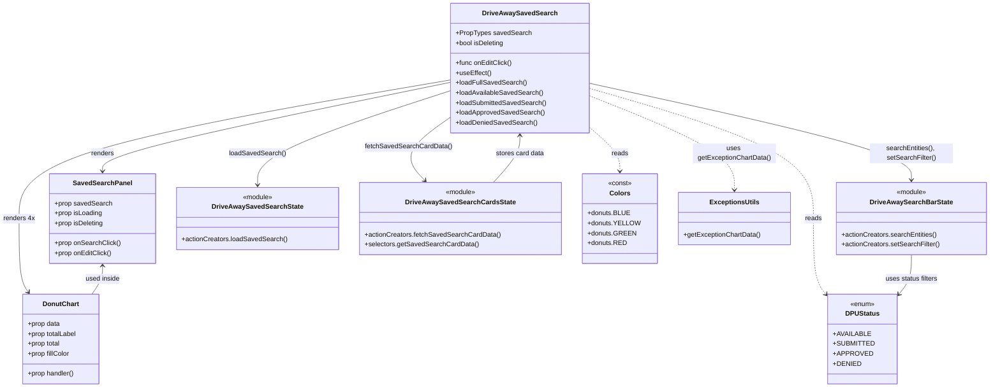

# Diagram: web/portal/src/pages/driveaway/dashboard/components/organisms/DriveAway.SavedSearch.organism.js

> Auto-generated by Obscura crawlers

## Mermaid

### SVG

<svg id="container" width="2324.1171875" xmlns="http://www.w3.org/2000/svg" class="classDiagram" height="932" viewBox="0 0 2324.1171875 932" role="graphics-document document" aria-roledescription="class"><g><defs><marker id="container_class-aggregationStart" class="marker aggregation class" refX="18" refY="7" markerWidth="190" markerHeight="240" orient="auto"><path d="M 18,7 L9,13 L1,7 L9,1 Z"></path></marker></defs><defs><marker id="container_class-aggregationEnd" class="marker aggregation class" refX="1" refY="7" markerWidth="20" markerHeight="28" orient="auto"><path d="M 18,7 L9,13 L1,7 L9,1 Z"></path></marker></defs><defs><marker id="container_class-extensionStart" class="marker extension class" refX="18" refY="7" markerWidth="190" markerHeight="240" orient="auto"><path d="M 1,7 L18,13 V 1 Z"></path></marker></defs><defs><marker id="container_class-extensionEnd" class="marker extension class" refX="1" refY="7" markerWidth="20" markerHeight="28" orient="auto"><path d="M 1,1 V 13 L18,7 Z"></path></marker></defs><defs><marker id="container_class-compositionStart" class="marker composition class" refX="18" refY="7" markerWidth="190" markerHeight="240" orient="auto"><path d="M 18,7 L9,13 L1,7 L9,1 Z"></path></marker></defs><defs><marker id="container_class-compositionEnd" class="marker composition class" refX="1" refY="7" markerWidth="20" markerHeight="28" orient="auto"><path d="M 18,7 L9,13 L1,7 L9,1 Z"></path></marker></defs><defs><marker id="container_class-dependencyStart" class="marker dependency class" refX="6" refY="7" markerWidth="190" markerHeight="240" orient="auto"><path d="M 5,7 L9,13 L1,7 L9,1 Z"></path></marker></defs><defs><marker id="container_class-dependencyEnd" class="marker dependency class" refX="13" refY="7" markerWidth="20" markerHeight="28" orient="auto"><path d="M 18,7 L9,13 L14,7 L9,1 Z"></path></marker></defs><defs><marker id="container_class-lollipopStart" class="marker lollipop class" refX="13" refY="7" markerWidth="190" markerHeight="240" orient="auto"><circle stroke="black" fill="transparent" cx="7" cy="7" r="6"></circle></marker></defs><defs><marker id="container_class-lollipopEnd" class="marker lollipop class" refX="1" refY="7" markerWidth="190" markerHeight="240" orient="auto"><circle stroke="black" fill="transparent" cx="7" cy="7" r="6"></circle></marker></defs><g class="root"><g class="clusters"></g><g class="edgePaths"><path d="M1055.189,198.338L919.873,226.781C784.556,255.225,513.923,312.113,378.606,347.723C243.289,383.333,243.289,397.667,243.289,404.833L243.289,412" id="id_DriveAwaySavedSearch_SavedSearchPanel_1" class="edge-thickness-normal edge-pattern-solid relation" style=";;;" data-edge="true" data-et="edge" data-id="id_DriveAwaySavedSearch_SavedSearchPanel_1" data-points="W3sieCI6MTA1NS4xODk0NTMxMjUsInkiOjE5OC4zMzc1MjM2MDY1ODU2Mn0seyJ4IjoyNDMuMjg5MDYyNSwieSI6MzY5fSx7IngiOjI0My4yODkwNjI1LCJ5Ijo0MTh9XQ==" marker-end="url(#container_class-dependencyEnd)"></path><path d="M1055.189,192.558L886.978,221.965C718.767,251.372,382.344,310.186,214.133,365.76C45.922,421.333,45.922,473.667,45.922,524C45.922,574.333,45.922,622.667,49.556,652.173C53.19,681.68,60.459,692.36,64.093,697.7L67.727,703.04" id="id_DriveAwaySavedSearch_DonutChart_2" class="edge-thickness-normal edge-pattern-solid relation" style=";;;" data-edge="true" data-et="edge" data-id="id_DriveAwaySavedSearch_DonutChart_2" data-points="W3sieCI6MTA1NS4xODk0NTMxMjUsInkiOjE5Mi41NTgwODcwODc3NDIzNH0seyJ4Ijo0NS45MjE4NzUsInkiOjM2OX0seyJ4Ijo0NS45MjE4NzUsInkiOjUyNn0seyJ4Ijo0NS45MjE4NzUsInkiOjY3MX0seyJ4Ijo3MS4xMDMyMDU4MTg5NjU1MiwieSI6NzA4fV0=" marker-end="url(#container_class-dependencyEnd)"></path><path d="M1055.189,284.149L1035.962,298.291C1016.735,312.433,978.281,340.716,968.982,365.785C959.684,390.853,979.542,412.706,989.471,423.633L999.4,434.559" id="id_DriveAwaySavedSearch_DriveAwaySavedSearchCardsState_3" class="edge-thickness-normal edge-pattern-solid relation" style=";;;" data-edge="true" data-et="edge" data-id="id_DriveAwaySavedSearch_DriveAwaySavedSearchCardsState_3" data-points="W3sieCI6MTA1NS4xODk0NTMxMjUsInkiOjI4NC4xNDkzMzAwODE4NDc3fSx7IngiOjkzOS44MjYxNzE4NzUsInkiOjM2OX0seyJ4IjoxMDAzLjQzNTIyMzQyNzU0NzcsInkiOjQzOX1d" marker-end="url(#container_class-dependencyEnd)"></path><path d="M1055.189,218.807L980.58,243.84C905.971,268.872,756.753,318.936,682.144,356.635C607.535,394.333,607.535,419.667,607.535,432.333L607.535,445" id="id_DriveAwaySavedSearch_DriveAwaySavedSearchState_4" class="edge-thickness-normal edge-pattern-solid relation" style=";;;" data-edge="true" data-et="edge" data-id="id_DriveAwaySavedSearch_DriveAwaySavedSearchState_4" data-points="W3sieCI6MTA1NS4xODk0NTMxMjUsInkiOjIxOC44MDc0MjM2NzQzMDk2M30seyJ4Ijo2MDcuNTM1MTU2MjUsInkiOjM2OX0seyJ4Ijo2MDcuNTM1MTU2MjUsInkiOjQ1MX1d" marker-end="url(#container_class-dependencyEnd)"></path><path d="M1381.9,200.37L1508.132,228.475C1634.365,256.58,1886.829,312.79,2013.061,351.562C2139.293,390.333,2139.293,411.667,2139.293,422.333L2139.293,433" id="id_DriveAwaySavedSearch_DriveAwaySearchBarState_5" class="edge-thickness-normal edge-pattern-solid relation" style=";;;" data-edge="true" data-et="edge" data-id="id_DriveAwaySavedSearch_DriveAwaySearchBarState_5" data-points="W3sieCI6MTM4MS45MDAzOTA2MjUsInkiOjIwMC4zNzAyODc0MDY0MjY5NH0seyJ4IjoyMTM5LjI5Mjk2ODc1LCJ5IjozNjl9LHsieCI6MjEzOS4yOTI5Njg3NSwieSI6NDM5fV0=" marker-end="url(#container_class-dependencyEnd)"></path><path d="M1381.9,212.61L1469.494,238.675C1557.087,264.74,1732.274,316.87,1819.868,369.102C1907.461,421.333,1907.461,473.667,1907.461,524C1907.461,574.333,1907.461,622.667,1913.521,654.414C1919.581,686.161,1931.702,701.323,1937.762,708.903L1943.822,716.484" id="id_DriveAwaySavedSearch_DPUStatus_6" class="edge-thickness-normal edge-pattern-dashed relation" style=";;;" data-edge="true" data-et="edge" data-id="id_DriveAwaySavedSearch_DPUStatus_6" data-points="W3sieCI6MTM4MS45MDAzOTA2MjUsInkiOjIxMi42MDk1MTE2NTkyMjQ2fSx7IngiOjE5MDcuNDYwOTM3NSwieSI6MzY5fSx7IngiOjE5MDcuNDYwOTM3NSwieSI6NTI2fSx7IngiOjE5MDcuNDYwOTM3NSwieSI6NjcxfSx7IngiOjE5NDcuNTY4MzU5Mzc1LCJ5Ijo3MjEuMTcwNjAxMDIxMDc4N31d" marker-end="url(#container_class-dependencyEnd)"></path><path d="M1381.9,306.821L1393.754,317.184C1405.607,327.547,1429.313,348.274,1441.166,365.803C1453.02,383.333,1453.02,397.667,1453.02,404.833L1453.02,412" id="id_DriveAwaySavedSearch_Colors_7" class="edge-thickness-normal edge-pattern-dashed relation" style=";;;" data-edge="true" data-et="edge" data-id="id_DriveAwaySavedSearch_Colors_7" data-points="W3sieCI6MTM4MS45MDAzOTA2MjUsInkiOjMwNi44MjA4ODQ0NTc0Mzg5fSx7IngiOjE0NTMuMDE5NTMxMjUsInkiOjM2OX0seyJ4IjoxNDUzLjAxOTUzMTI1LCJ5Ijo0MTh9XQ==" marker-end="url(#container_class-dependencyEnd)"></path><path d="M1381.9,230.725L1438.321,253.771C1494.741,276.817,1607.581,322.908,1664.002,360.621C1720.422,398.333,1720.422,427.667,1720.422,442.333L1720.422,457" id="id_DriveAwaySavedSearch_ExceptionsUtils_8" class="edge-thickness-normal edge-pattern-dashed relation" style=";;;" data-edge="true" data-et="edge" data-id="id_DriveAwaySavedSearch_ExceptionsUtils_8" data-points="W3sieCI6MTM4MS45MDAzOTA2MjUsInkiOjIzMC43MjUyNjE4MTAxNTc5N30seyJ4IjoxNzIwLjQyMTg3NSwieSI6MzY5fSx7IngiOjE3MjAuNDIxODc1LCJ5Ijo0NjN9XQ==" marker-end="url(#container_class-dependencyEnd)"></path><path d="M243.289,640L243.289,645.167C243.289,650.333,243.289,660.667,239.092,672C234.895,683.333,226.502,695.667,222.305,701.833L218.108,708" id="id_SavedSearchPanel_DonutChart_9" class="edge-thickness-normal edge-pattern-solid relation" style=";;;" data-edge="true" data-et="edge" data-id="id_SavedSearchPanel_DonutChart_9" data-points="W3sieCI6MjQzLjI4OTA2MjUsInkiOjYzNH0seyJ4IjoyNDMuMjg5MDYyNSwieSI6NjcxfSx7IngiOjIxOC4xMDc3MzE2ODEwMzQ0NywieSI6NzA4fV0=" marker-start="url(#container_class-dependencyStart)"></path><path d="M1157.884,439L1167.995,427.333C1178.105,415.667,1198.325,392.333,1208.435,373.5C1218.545,354.667,1218.545,340.333,1218.545,333.167L1218.545,326" id="id_DriveAwaySavedSearchCardsState_DriveAwaySavedSearch_10" class="edge-thickness-normal edge-pattern-solid relation" style=";;;" data-edge="true" data-et="edge" data-id="id_DriveAwaySavedSearchCardsState_DriveAwaySavedSearch_10" data-points="W3sieCI6MTE1Ny44ODQ0NjcwNTgxMjExLCJ5Ijo0Mzl9LHsieCI6MTIxOC41NDQ5MjE4NzUsInkiOjM2OX0seyJ4IjoxMjE4LjU0NDkyMTg3NSwieSI6MzIwfV0=" marker-end="url(#container_class-dependencyEnd)"></path><path d="M2139.293,613L2139.293,622.667C2139.293,632.333,2139.293,651.667,2133.233,668.914C2127.173,686.161,2115.052,701.323,2108.992,708.903L2102.932,716.484" id="id_DriveAwaySearchBarState_DPUStatus_11" class="edge-thickness-normal edge-pattern-solid relation" style=";;;" data-edge="true" data-et="edge" data-id="id_DriveAwaySearchBarState_DPUStatus_11" data-points="W3sieCI6MjEzOS4yOTI5Njg3NSwieSI6NjEzfSx7IngiOjIxMzkuMjkyOTY4NzUsInkiOjY3MX0seyJ4IjoyMDk5LjE4NTU0Njg3NSwieSI6NzIxLjE3MDYwMTAyMTA3ODd9XQ==" marker-end="url(#container_class-dependencyEnd)"></path></g><g class="edgeLabels"><g class="edgeLabel" transform="translate(243.2890625, 369)"><g class="label" data-id="id_DriveAwaySavedSearch_SavedSearchPanel_1" transform="translate(-27.75, -12)"><foreignObject width="55.5" height="24">

renders

</foreignObject></g></g><g class="edgeLabel" transform="translate(45.921875, 526)"><g class="label" data-id="id_DriveAwaySavedSearch_DonutChart_2" transform="translate(-37.921875, -12)"><foreignObject width="75.84375" height="24">

renders 4x

</foreignObject></g></g><g class="edgeLabel" transform="translate(959.41091, 354.59526)"><g class="label" data-id="id_DriveAwaySavedSearch_DriveAwaySavedSearchCardsState_3" transform="translate(-102.4140625, -12)"><foreignObject width="204.828125" height="24">

fetchSavedSearchCardData()

</foreignObject></g></g><g class="edgeLabel" transform="translate(607.53515625, 369)"><g class="label" data-id="id_DriveAwaySavedSearch_DriveAwaySavedSearchState_4" transform="translate(-67.2109375, -12)"><foreignObject width="134.421875" height="24">

loadSavedSearch()

</foreignObject></g></g><g class="edgeLabel" transform="translate(2139.29296875, 369)"><g class="label" data-id="id_DriveAwaySavedSearch_DriveAwaySearchBarState_5" transform="translate(-100, -24)"><foreignObject width="200" height="48">

searchEntities(), setSearchFilter()

</foreignObject></g></g><g class="edgeLabel" transform="translate(1907.4609375, 526)"><g class="label" data-id="id_DriveAwaySavedSearch_DPUStatus_6" transform="translate(-20.0078125, -12)"><foreignObject width="40.015625" height="24">

reads

</foreignObject></g></g><g class="edgeLabel" transform="translate(1453.01953125, 369)"><g class="label" data-id="id_DriveAwaySavedSearch_Colors_7" transform="translate(-20.0078125, -12)"><foreignObject width="40.015625" height="24">

reads

</foreignObject></g></g><g class="edgeLabel" transform="translate(1720.421875, 369)"><g class="label" data-id="id_DriveAwaySavedSearch_ExceptionsUtils_8" transform="translate(-100, -24)"><foreignObject width="200" height="48">

uses getExceptionChartData()

</foreignObject></g></g><g class="edgeLabel" transform="translate(243.2890625, 671)"><g class="label" data-id="id_SavedSearchPanel_DonutChart_9" transform="translate(-41.7421875, -12)"><foreignObject width="83.484375" height="24">

used inside

</foreignObject></g></g><g class="edgeLabel" transform="translate(1218.544921875, 369)"><g class="label" data-id="id_DriveAwaySavedSearchCardsState_DriveAwaySavedSearch_10" transform="translate(-58.4140625, -12)"><foreignObject width="116.828125" height="24">

stores card data

</foreignObject></g></g><g class="edgeLabel" transform="translate(2139.29296875, 671)"><g class="label" data-id="id_DriveAwaySearchBarState_DPUStatus_11" transform="translate(-63.7109375, -12)"><foreignObject width="127.421875" height="24">

uses status filters

</foreignObject></g></g></g><g class="nodes"><g class="node default" id="classId-DriveAwaySavedSearch-0" transform="translate(1218.544921875, 164)"><g class="basic label-container"><path d="M-163.35546875 -156 L163.35546875 -156 L163.35546875 156 L-163.35546875 156" stroke="none" stroke-width="0" fill="#ECECFF" style=""></path><path d="M-163.35546875 -156 C-85.7456641858634 -156, -8.135859621726809 -156, 163.35546875 -156 M-163.35546875 -156 C-91.83322059458631 -156, -20.310972439172616 -156, 163.35546875 -156 M163.35546875 -156 C163.35546875 -71.81688846341991, 163.35546875 12.366223073160171, 163.35546875 156 M163.35546875 -156 C163.35546875 -66.55726675393176, 163.35546875 22.885466492136487, 163.35546875 156 M163.35546875 156 C92.29696590656307 156, 21.238463063126147 156, -163.35546875 156 M163.35546875 156 C75.10805157376376 156, -13.13936560247248 156, -163.35546875 156 M-163.35546875 156 C-163.35546875 39.405752509870254, -163.35546875 -77.18849498025949, -163.35546875 -156 M-163.35546875 156 C-163.35546875 73.75418363607373, -163.35546875 -8.491632727852533, -163.35546875 -156" stroke="#9370DB" stroke-width="1.3" fill="none" stroke-dasharray="0 0" style=""></path></g><g class="annotation-group text" transform="translate(0, -132)"></g><g class="label-group text" transform="translate(-84.9453125, -132)"><g class="label" style="font-weight: bolder" transform="translate(0,-12)"><foreignObject width="169.890625" height="24">

DriveAwaySavedSearch

</foreignObject></g></g><g class="members-group text" transform="translate(-151.35546875, -84)"><g class="label" style="" transform="translate(0,-12)"><foreignObject width="177.53125" height="24">

+PropTypes savedSearch

</foreignObject></g><g class="label" style="" transform="translate(0,12)"><foreignObject width="117.4375" height="24">

+bool isDeleting

</foreignObject></g></g><g class="methods-group text" transform="translate(-151.35546875, -12)"><g class="label" style="" transform="translate(0,-12)"><foreignObject width="134.71875" height="24">

+func onEditClick()

</foreignObject></g><g class="label" style="" transform="translate(0,12)"><foreignObject width="84.8125" height="24">

+useEffect()

</foreignObject></g><g class="label" style="" transform="translate(0,36)"><foreignObject width="168.359375" height="24">

+loadFullSavedSearch()

</foreignObject></g><g class="label" style="" transform="translate(0,60)"><foreignObject width="208.546875" height="24">

+loadAvailableSavedSearch()

</foreignObject></g><g class="label" style="" transform="translate(0,84)"><foreignObject width="217.765625" height="24">

+loadSubmittedSavedSearch()

</foreignObject></g><g class="label" style="" transform="translate(0,108)"><foreignObject width="211.65625" height="24">

+loadApprovedSavedSearch()

</foreignObject></g><g class="label" style="" transform="translate(0,132)"><foreignObject width="193.609375" height="24">

+loadDeniedSavedSearch()

</foreignObject></g></g><g class="divider" style=""><path d="M-163.35546875 -108 C-92.12096207831728 -108, -20.886455406634553 -108, 163.35546875 -108 M-163.35546875 -108 C-87.00006263531897 -108, -10.644656520637938 -108, 163.35546875 -108" stroke="#9370DB" stroke-width="1.3" fill="none" stroke-dasharray="0 0" style=""></path></g><g class="divider" style=""><path d="M-163.35546875 -36 C-73.95029105397184 -36, 15.454886642056323 -36, 163.35546875 -36 M-163.35546875 -36 C-40.28509202893707 -36, 82.78528469212586 -36, 163.35546875 -36" stroke="#9370DB" stroke-width="1.3" fill="none" stroke-dasharray="0 0" style=""></path></g></g><g class="node default" id="classId-SavedSearchPanel-1" transform="translate(243.2890625, 526)"><g class="basic label-container"><path d="M-124.4453125 -108 L124.4453125 -108 L124.4453125 108 L-124.4453125 108" stroke="none" stroke-width="0" fill="#ECECFF" style=""></path><path d="M-124.4453125 -108 C-49.29466350014637 -108, 25.85598549970726 -108, 124.4453125 -108 M-124.4453125 -108 C-42.615513846364195 -108, 39.21428480727161 -108, 124.4453125 -108 M124.4453125 -108 C124.4453125 -22.856106821778027, 124.4453125 62.287786356443945, 124.4453125 108 M124.4453125 -108 C124.4453125 -36.56494672336319, 124.4453125 34.870106553273615, 124.4453125 108 M124.4453125 108 C46.41563660928182 108, -31.614039281436362 108, -124.4453125 108 M124.4453125 108 C45.25223308975815 108, -33.9408463204837 108, -124.4453125 108 M-124.4453125 108 C-124.4453125 61.19732694028088, -124.4453125 14.394653880561762, -124.4453125 -108 M-124.4453125 108 C-124.4453125 34.556318154365826, -124.4453125 -38.88736369126835, -124.4453125 -108" stroke="#9370DB" stroke-width="1.3" fill="none" stroke-dasharray="0 0" style=""></path></g><g class="annotation-group text" transform="translate(0, -84)"></g><g class="label-group text" transform="translate(-66.984375, -84)"><g class="label" style="font-weight: bolder" transform="translate(0,-12)"><foreignObject width="133.96875" height="24">

SavedSearchPanel

</foreignObject></g></g><g class="members-group text" transform="translate(-112.4453125, -36)"><g class="label" style="" transform="translate(0,-12)"><foreignObject width="136.859375" height="24">

+prop savedSearch

</foreignObject></g><g class="label" style="" transform="translate(0,12)"><foreignObject width="115.5" height="24">

+prop isLoading

</foreignObject></g><g class="label" style="" transform="translate(0,36)"><foreignObject width="118.59375" height="24">

+prop isDeleting

</foreignObject></g></g><g class="methods-group text" transform="translate(-112.4453125, 60)"><g class="label" style="" transform="translate(0,-12)"><foreignObject width="157.90625" height="24">

+prop onSearchClick()

</foreignObject></g><g class="label" style="" transform="translate(0,12)"><foreignObject width="137.296875" height="24">

+prop onEditClick()

</foreignObject></g></g><g class="divider" style=""><path d="M-124.4453125 -60 C-50.39929245804734 -60, 23.646727583905317 -60, 124.4453125 -60 M-124.4453125 -60 C-63.34156291045632 -60, -2.237813320912636 -60, 124.4453125 -60" stroke="#9370DB" stroke-width="1.3" fill="none" stroke-dasharray="0 0" style=""></path></g><g class="divider" style=""><path d="M-124.4453125 36 C-33.95624089670241 36, 56.53283070659518 36, 124.4453125 36 M-124.4453125 36 C-65.50137543906229 36, -6.557438378124573 36, 124.4453125 36" stroke="#9370DB" stroke-width="1.3" fill="none" stroke-dasharray="0 0" style=""></path></g></g><g class="node default" id="classId-DonutChart-2" transform="translate(144.60546875, 816)"><g class="basic label-container"><path d="M-92.73046875 -108 L92.73046875 -108 L92.73046875 108 L-92.73046875 108" stroke="none" stroke-width="0" fill="#ECECFF" style=""></path><path d="M-92.73046875 -108 C-32.02892135056449 -108, 28.672626048871024 -108, 92.73046875 -108 M-92.73046875 -108 C-36.662029342786994 -108, 19.406410064426012 -108, 92.73046875 -108 M92.73046875 -108 C92.73046875 -44.999113845779526, 92.73046875 18.001772308440948, 92.73046875 108 M92.73046875 -108 C92.73046875 -33.677781745657086, 92.73046875 40.64443650868583, 92.73046875 108 M92.73046875 108 C37.0044752493782 108, -18.721518251243594 108, -92.73046875 108 M92.73046875 108 C34.12836655061478 108, -24.473735648770443 108, -92.73046875 108 M-92.73046875 108 C-92.73046875 26.18590334657931, -92.73046875 -55.62819330684138, -92.73046875 -108 M-92.73046875 108 C-92.73046875 51.21594924162898, -92.73046875 -5.568101516742047, -92.73046875 -108" stroke="#9370DB" stroke-width="1.3" fill="none" stroke-dasharray="0 0" style=""></path></g><g class="annotation-group text" transform="translate(0, -84)"></g><g class="label-group text" transform="translate(-41.9765625, -84)"><g class="label" style="font-weight: bolder" transform="translate(0,-12)"><foreignObject width="83.953125" height="24">

DonutChart

</foreignObject></g></g><g class="members-group text" transform="translate(-80.73046875, -36)"><g class="label" style="" transform="translate(0,-12)"><foreignObject width="78.921875" height="24">

+prop data

</foreignObject></g><g class="label" style="" transform="translate(0,12)"><foreignObject width="119.484375" height="24">

+prop totalLabel

</foreignObject></g><g class="label" style="" transform="translate(0,36)"><foreignObject width="80.0625" height="24">

+prop total

</foreignObject></g><g class="label" style="" transform="translate(0,60)"><foreignObject width="102.96875" height="24">

+prop fillColor

</foreignObject></g></g><g class="methods-group text" transform="translate(-80.73046875, 84)"><g class="label" style="" transform="translate(0,-12)"><foreignObject width="113.171875" height="24">

+prop handler()

</foreignObject></g></g><g class="divider" style=""><path d="M-92.73046875 -60 C-54.23881231931333 -60, -15.747155888626665 -60, 92.73046875 -60 M-92.73046875 -60 C-47.17211833049419 -60, -1.6137679109883862 -60, 92.73046875 -60" stroke="#9370DB" stroke-width="1.3" fill="none" stroke-dasharray="0 0" style=""></path></g><g class="divider" style=""><path d="M-92.73046875 60 C-48.306920607223915 60, -3.883372464447831 60, 92.73046875 60 M-92.73046875 60 C-36.034731989812805 60, 20.66100477037439 60, 92.73046875 60" stroke="#9370DB" stroke-width="1.3" fill="none" stroke-dasharray="0 0" style=""></path></g></g><g class="node default" id="classId-DriveAwaySearchBarState-3" transform="translate(2139.29296875, 526)"><g class="basic label-container"><path d="M-176.82421875 -87 L176.82421875 -87 L176.82421875 87 L-176.82421875 87" stroke="none" stroke-width="0" fill="#ECECFF" style=""></path><path d="M-176.82421875 -87 C-50.98973607604701 -87, 74.84474659790598 -87, 176.82421875 -87 M-176.82421875 -87 C-80.57363862535519 -87, 15.676941499289626 -87, 176.82421875 -87 M176.82421875 -87 C176.82421875 -42.928005335777776, 176.82421875 1.143989328444448, 176.82421875 87 M176.82421875 -87 C176.82421875 -17.695921203722264, 176.82421875 51.60815759255547, 176.82421875 87 M176.82421875 87 C40.14859163342143 87, -96.52703548315714 87, -176.82421875 87 M176.82421875 87 C54.9071272926581 87, -67.0099641646838 87, -176.82421875 87 M-176.82421875 87 C-176.82421875 28.609936277136185, -176.82421875 -29.78012744572763, -176.82421875 -87 M-176.82421875 87 C-176.82421875 32.44539691800093, -176.82421875 -22.109206163998138, -176.82421875 -87" stroke="#9370DB" stroke-width="1.3" fill="none" stroke-dasharray="0 0" style=""></path></g><g class="annotation-group text" transform="translate(-36.6015625, -63)"><g class="label" style="" transform="translate(0,-12)"><foreignObject width="73.203125" height="24">

«module»

</foreignObject></g></g><g class="label-group text" transform="translate(-94.6953125, -39)"><g class="label" style="font-weight: bolder" transform="translate(0,-12)"><foreignObject width="189.390625" height="24">

DriveAwaySearchBarState

</foreignObject></g></g><g class="members-group text" transform="translate(-164.82421875, 9)"></g><g class="methods-group text" transform="translate(-164.82421875, 39)"><g class="label" style="" transform="translate(0,-12)"><foreignObject width="229.359375" height="24">

+actionCreators.searchEntities()

</foreignObject></g><g class="label" style="" transform="translate(0,12)"><foreignObject width="234.953125" height="24">

+actionCreators.setSearchFilter()

</foreignObject></g></g><g class="divider" style=""><path d="M-176.82421875 -15 C-41.07012153993492 -15, 94.68397567013017 -15, 176.82421875 -15 M-176.82421875 -15 C-65.12657463808372 -15, 46.57106947383255 -15, 176.82421875 -15" stroke="#9370DB" stroke-width="1.3" fill="none" stroke-dasharray="0 0" style=""></path></g><g class="divider" style=""><path d="M-176.82421875 9 C-49.64474452866159 9, 77.53472969267682 9, 176.82421875 9 M-176.82421875 9 C-75.6132998727702 9, 25.597619004459602 9, 176.82421875 9" stroke="#9370DB" stroke-width="1.3" fill="none" stroke-dasharray="0 0" style=""></path></g></g><g class="node default" id="classId-DriveAwaySavedSearchState-4" transform="translate(607.53515625, 526)"><g class="basic label-container"><path d="M-189.80078125 -75 L189.80078125 -75 L189.80078125 75 L-189.80078125 75" stroke="none" stroke-width="0" fill="#ECECFF" style=""></path><path d="M-189.80078125 -75 C-52.86165439051115 -75, 84.0774724689777 -75, 189.80078125 -75 M-189.80078125 -75 C-59.286249703864144 -75, 71.22828184227171 -75, 189.80078125 -75 M189.80078125 -75 C189.80078125 -41.06289597574532, 189.80078125 -7.1257919514906405, 189.80078125 75 M189.80078125 -75 C189.80078125 -29.273196561456565, 189.80078125 16.45360687708687, 189.80078125 75 M189.80078125 75 C97.24406579797365 75, 4.687350345947294 75, -189.80078125 75 M189.80078125 75 C64.89112665669246 75, -60.01852793661507 75, -189.80078125 75 M-189.80078125 75 C-189.80078125 31.126894033978935, -189.80078125 -12.74621193204213, -189.80078125 -75 M-189.80078125 75 C-189.80078125 30.062123714118584, -189.80078125 -14.875752571762831, -189.80078125 -75" stroke="#9370DB" stroke-width="1.3" fill="none" stroke-dasharray="0 0" style=""></path></g><g class="annotation-group text" transform="translate(-36.6015625, -51)"><g class="label" style="" transform="translate(0,-12)"><foreignObject width="73.203125" height="24">

«module»

</foreignObject></g></g><g class="label-group text" transform="translate(-104.2578125, -27)"><g class="label" style="font-weight: bolder" transform="translate(0,-12)"><foreignObject width="208.515625" height="24">

DriveAwaySavedSearchState

</foreignObject></g></g><g class="members-group text" transform="translate(-177.80078125, 21)"></g><g class="methods-group text" transform="translate(-177.80078125, 51)"><g class="label" style="" transform="translate(0,-12)"><foreignObject width="251.34375" height="24">

+actionCreators.loadSavedSearch()

</foreignObject></g></g><g class="divider" style=""><path d="M-189.80078125 -3 C-70.20102311005256 -3, 49.39873502989488 -3, 189.80078125 -3 M-189.80078125 -3 C-108.29036085486554 -3, -26.77994045973108 -3, 189.80078125 -3" stroke="#9370DB" stroke-width="1.3" fill="none" stroke-dasharray="0 0" style=""></path></g><g class="divider" style=""><path d="M-189.80078125 21 C-46.50066103216233 21, 96.79945918567535 21, 189.80078125 21 M-189.80078125 21 C-56.404105139180956 21, 76.99257097163809 21, 189.80078125 21" stroke="#9370DB" stroke-width="1.3" fill="none" stroke-dasharray="0 0" style=""></path></g></g><g class="node default" id="classId-DriveAwaySavedSearchCardsState-5" transform="translate(1082.4921875, 526)"><g class="basic label-container"><path d="M-235.15625 -87 L235.15625 -87 L235.15625 87 L-235.15625 87" stroke="none" stroke-width="0" fill="#ECECFF" style=""></path><path d="M-235.15625 -87 C-55.73285731059201 -87, 123.69053537881598 -87, 235.15625 -87 M-235.15625 -87 C-135.33213683552287 -87, -35.50802367104578 -87, 235.15625 -87 M235.15625 -87 C235.15625 -24.688367596926696, 235.15625 37.62326480614661, 235.15625 87 M235.15625 -87 C235.15625 -47.77412673436792, 235.15625 -8.548253468735837, 235.15625 87 M235.15625 87 C101.87018209274561 87, -31.415885814508783 87, -235.15625 87 M235.15625 87 C129.13109663848314 87, 23.105943276966286 87, -235.15625 87 M-235.15625 87 C-235.15625 17.70264075644245, -235.15625 -51.5947184871151, -235.15625 -87 M-235.15625 87 C-235.15625 42.55976339264162, -235.15625 -1.8804732147167584, -235.15625 -87" stroke="#9370DB" stroke-width="1.3" fill="none" stroke-dasharray="0 0" style=""></path></g><g class="annotation-group text" transform="translate(-36.6015625, -63)"><g class="label" style="" transform="translate(0,-12)"><foreignObject width="73.203125" height="24">

«module»

</foreignObject></g></g><g class="label-group text" transform="translate(-124.796875, -39)"><g class="label" style="font-weight: bolder" transform="translate(0,-12)"><foreignObject width="249.59375" height="24">

DriveAwaySavedSearchCardsState

</foreignObject></g></g><g class="members-group text" transform="translate(-223.15625, 9)"></g><g class="methods-group text" transform="translate(-223.15625, 39)"><g class="label" style="" transform="translate(0,-12)"><foreignObject width="321.515625" height="24">

+actionCreators.fetchSavedSearchCardData()

</foreignObject></g><g class="label" style="" transform="translate(0,12)"><foreignObject width="268.03125" height="24">

+selectors.getSavedSearchCardData()

</foreignObject></g></g><g class="divider" style=""><path d="M-235.15625 -15 C-60.39133663003409 -15, 114.37357673993182 -15, 235.15625 -15 M-235.15625 -15 C-107.86468946768726 -15, 19.426871064625487 -15, 235.15625 -15" stroke="#9370DB" stroke-width="1.3" fill="none" stroke-dasharray="0 0" style=""></path></g><g class="divider" style=""><path d="M-235.15625 9 C-75.51923783704257 9, 84.11777432591487 9, 235.15625 9 M-235.15625 9 C-124.45055784209039 9, -13.74486568418078 9, 235.15625 9" stroke="#9370DB" stroke-width="1.3" fill="none" stroke-dasharray="0 0" style=""></path></g></g><g class="node default" id="classId-DPUStatus-6" transform="translate(2023.376953125, 816)"><g class="basic label-container"><path d="M-75.80859375 -108 L75.80859375 -108 L75.80859375 108 L-75.80859375 108" stroke="none" stroke-width="0" fill="#ECECFF" style=""></path><path d="M-75.80859375 -108 C-41.24237180814873 -108, -6.6761498662974645 -108, 75.80859375 -108 M-75.80859375 -108 C-18.51888586412094 -108, 38.77082202175812 -108, 75.80859375 -108 M75.80859375 -108 C75.80859375 -36.294915651035765, 75.80859375 35.41016869792847, 75.80859375 108 M75.80859375 -108 C75.80859375 -27.420338633904976, 75.80859375 53.15932273219005, 75.80859375 108 M75.80859375 108 C28.084141703681873 108, -19.640310342636255 108, -75.80859375 108 M75.80859375 108 C21.40463667573559 108, -32.99932039852882 108, -75.80859375 108 M-75.80859375 108 C-75.80859375 57.90967087187376, -75.80859375 7.819341743747515, -75.80859375 -108 M-75.80859375 108 C-75.80859375 58.28444895134538, -75.80859375 8.568897902690765, -75.80859375 -108" stroke="#9370DB" stroke-width="1.3" fill="none" stroke-dasharray="0 0" style=""></path></g><g class="annotation-group text" transform="translate(-29.53125, -84)"><g class="label" style="" transform="translate(0,-12)"><foreignObject width="59.0625" height="24">

«enum»

</foreignObject></g></g><g class="label-group text" transform="translate(-38.6484375, -60)"><g class="label" style="font-weight: bolder" transform="translate(0,-12)"><foreignObject width="77.296875" height="24">

DPUStatus

</foreignObject></g></g><g class="members-group text" transform="translate(-63.80859375, -12)"><g class="label" style="" transform="translate(0,-12)"><foreignObject width="82.734375" height="24">

+AVAILABLE

</foreignObject></g><g class="label" style="" transform="translate(0,12)"><foreignObject width="88.96875" height="24">

+SUBMITTED

</foreignObject></g><g class="label" style="" transform="translate(0,36)"><foreignObject width="83.875" height="24">

+APPROVED

</foreignObject></g><g class="label" style="" transform="translate(0,60)"><foreignObject width="61.375" height="24">

+DENIED

</foreignObject></g></g><g class="methods-group text" transform="translate(-63.80859375, 108)"></g><g class="divider" style=""><path d="M-75.80859375 -36 C-15.353915549402082 -36, 45.100762651195836 -36, 75.80859375 -36 M-75.80859375 -36 C-17.601584656294037 -36, 40.605424437411926 -36, 75.80859375 -36" stroke="#9370DB" stroke-width="1.3" fill="none" stroke-dasharray="0 0" style=""></path></g><g class="divider" style=""><path d="M-75.80859375 84 C-40.163663865389616 84, -4.518733980779231 84, 75.80859375 84 M-75.80859375 84 C-26.480211269753383 84, 22.848171210493234 84, 75.80859375 84" stroke="#9370DB" stroke-width="1.3" fill="none" stroke-dasharray="0 0" style=""></path></g></g><g class="node default" id="classId-Colors-7" transform="translate(1453.01953125, 526)"><g class="basic label-container"><path d="M-85.37109375 -108 L85.37109375 -108 L85.37109375 108 L-85.37109375 108" stroke="none" stroke-width="0" fill="#ECECFF" style=""></path><path d="M-85.37109375 -108 C-20.785763418018718 -108, 43.799566913962565 -108, 85.37109375 -108 M-85.37109375 -108 C-32.701852887187684 -108, 19.967387975624632 -108, 85.37109375 -108 M85.37109375 -108 C85.37109375 -26.274833156689624, 85.37109375 55.45033368662075, 85.37109375 108 M85.37109375 -108 C85.37109375 -37.94038698724769, 85.37109375 32.11922602550462, 85.37109375 108 M85.37109375 108 C17.11417518753946 108, -51.14274337492108 108, -85.37109375 108 M85.37109375 108 C45.46535527940617 108, 5.559616808812336 108, -85.37109375 108 M-85.37109375 108 C-85.37109375 36.08265349626568, -85.37109375 -35.834693007468644, -85.37109375 -108 M-85.37109375 108 C-85.37109375 54.65714964534873, -85.37109375 1.3142992906974627, -85.37109375 -108" stroke="#9370DB" stroke-width="1.3" fill="none" stroke-dasharray="0 0" style=""></path></g><g class="annotation-group text" transform="translate(-28.6171875, -84)"><g class="label" style="" transform="translate(0,-12)"><foreignObject width="57.234375" height="24">

«const»

</foreignObject></g></g><g class="label-group text" transform="translate(-23.1015625, -60)"><g class="label" style="font-weight: bolder" transform="translate(0,-12)"><foreignObject width="46.203125" height="24">

Colors

</foreignObject></g></g><g class="members-group text" transform="translate(-73.37109375, -12)"><g class="label" style="" transform="translate(0,-12)"><foreignObject width="99.125" height="24">

+donuts.BLUE

</foreignObject></g><g class="label" style="" transform="translate(0,12)"><foreignObject width="118.125" height="24">

+donuts.YELLOW

</foreignObject></g><g class="label" style="" transform="translate(0,36)"><foreignObject width="110.1875" height="24">

+donuts.GREEN

</foreignObject></g><g class="label" style="" transform="translate(0,60)"><foreignObject width="91.21875" height="24">

+donuts.RED

</foreignObject></g></g><g class="methods-group text" transform="translate(-73.37109375, 108)"></g><g class="divider" style=""><path d="M-85.37109375 -36 C-39.50233285417415 -36, 6.366428041651702 -36, 85.37109375 -36 M-85.37109375 -36 C-24.065521863156306 -36, 37.24005002368739 -36, 85.37109375 -36" stroke="#9370DB" stroke-width="1.3" fill="none" stroke-dasharray="0 0" style=""></path></g><g class="divider" style=""><path d="M-85.37109375 84 C-29.945168699027533 84, 25.480756351944933 84, 85.37109375 84 M-85.37109375 84 C-49.05483326226537 84, -12.738572774530738 84, 85.37109375 84" stroke="#9370DB" stroke-width="1.3" fill="none" stroke-dasharray="0 0" style=""></path></g></g><g class="node default" id="classId-ExceptionsUtils-8" transform="translate(1720.421875, 526)"><g class="basic label-container"><path d="M-132.03125 -63 L132.03125 -63 L132.03125 63 L-132.03125 63" stroke="none" stroke-width="0" fill="#ECECFF" style=""></path><path d="M-132.03125 -63 C-44.03067453013189 -63, 43.96990093973622 -63, 132.03125 -63 M-132.03125 -63 C-43.77927895520045 -63, 44.47269208959909 -63, 132.03125 -63 M132.03125 -63 C132.03125 -27.798659767707775, 132.03125 7.402680464584449, 132.03125 63 M132.03125 -63 C132.03125 -33.37652917749137, 132.03125 -3.753058354982741, 132.03125 63 M132.03125 63 C67.77529079838445 63, 3.519331596768893 63, -132.03125 63 M132.03125 63 C71.59780810397118 63, 11.164366207942365 63, -132.03125 63 M-132.03125 63 C-132.03125 26.00302648562237, -132.03125 -10.993947028755258, -132.03125 -63 M-132.03125 63 C-132.03125 13.040835342262021, -132.03125 -36.91832931547596, -132.03125 -63" stroke="#9370DB" stroke-width="1.3" fill="none" stroke-dasharray="0 0" style=""></path></g><g class="annotation-group text" transform="translate(0, -39)"></g><g class="label-group text" transform="translate(-56.359375, -39)"><g class="label" style="font-weight: bolder" transform="translate(0,-12)"><foreignObject width="112.71875" height="24">

ExceptionsUtils

</foreignObject></g></g><g class="members-group text" transform="translate(-120.03125, 9)"></g><g class="methods-group text" transform="translate(-120.03125, 39)"><g class="label" style="" transform="translate(0,-12)"><foreignObject width="183.703125" height="24">

+getExceptionChartData()

</foreignObject></g></g><g class="divider" style=""><path d="M-132.03125 -15 C-48.50949513745206 -15, 35.01225972509587 -15, 132.03125 -15 M-132.03125 -15 C-66.98614548882824 -15, -1.9410409776564848 -15, 132.03125 -15" stroke="#9370DB" stroke-width="1.3" fill="none" stroke-dasharray="0 0" style=""></path></g><g class="divider" style=""><path d="M-132.03125 9 C-57.147382637065974 9, 17.736484725868053 9, 132.03125 9 M-132.03125 9 C-33.99234467298413 9, 64.04656065403174 9, 132.03125 9" stroke="#9370DB" stroke-width="1.3" fill="none" stroke-dasharray="0 0" style=""></path></g></g></g></g></g></svg>
