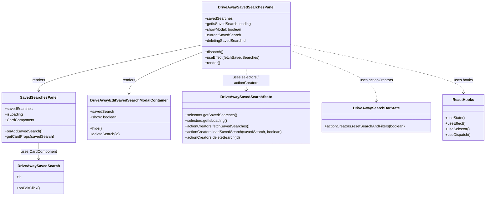

# Diagram: web/portal/src/pages/driveaway/dashboard/components/organisms/DriveAway.SavedSearchesPanel.organism.js


> Auto-generated by Obscura crawlers

## Diagram 1



### SVG

<svg id="container" width="2033.5" xmlns="http://www.w3.org/2000/svg" class="classDiagram" height="842" viewBox="0 0 2033.5 842" role="graphics-document document" aria-roledescription="class"><style>#container{font-family:"trebuchet ms",verdana,arial,sans-serif;font-size:16px;fill:#333;}@keyframes edge-animation-frame{from{stroke-dashoffset:0;}}@keyframes dash{to{stroke-dashoffset:0;}}#container .edge-animation-slow{stroke-dasharray:9,5!important;stroke-dashoffset:900;animation:dash 50s linear infinite;stroke-linecap:round;}#container .edge-animation-fast{stroke-dasharray:9,5!important;stroke-dashoffset:900;animation:dash 20s linear infinite;stroke-linecap:round;}#container .error-icon{fill:#552222;}#container .error-text{fill:#552222;stroke:#552222;}#container .edge-thickness-normal{stroke-width:1px;}#container .edge-thickness-thick{stroke-width:3.5px;}#container .edge-pattern-solid{stroke-dasharray:0;}#container .edge-thickness-invisible{stroke-width:0;fill:none;}#container .edge-pattern-dashed{stroke-dasharray:3;}#container .edge-pattern-dotted{stroke-dasharray:2;}#container .marker{fill:#333333;stroke:#333333;}#container .marker.cross{stroke:#333333;}#container svg{font-family:"trebuchet ms",verdana,arial,sans-serif;font-size:16px;}#container p{margin:0;}#container g.classGroup text{fill:#9370DB;stroke:none;font-family:"trebuchet ms",verdana,arial,sans-serif;font-size:10px;}#container g.classGroup text .title{font-weight:bolder;}#container .nodeLabel,#container .edgeLabel{color:#131300;}#container .edgeLabel .label rect{fill:#ECECFF;}#container .label text{fill:#131300;}#container .labelBkg{background:#ECECFF;}#container .edgeLabel .label span{background:#ECECFF;}#container .classTitle{font-weight:bolder;}#container .node rect,#container .node circle,#container .node ellipse,#container .node polygon,#container .node path{fill:#ECECFF;stroke:#9370DB;stroke-width:1px;}#container .divider{stroke:#9370DB;stroke-width:1;}#container g.clickable{cursor:pointer;}#container g.classGroup rect{fill:#ECECFF;stroke:#9370DB;}#container g.classGroup line{stroke:#9370DB;stroke-width:1;}#container .classLabel .box{stroke:none;stroke-width:0;fill:#ECECFF;opacity:0.5;}#container .classLabel .label{fill:#9370DB;font-size:10px;}#container .relation{stroke:#333333;stroke-width:1;fill:none;}#container .dashed-line{stroke-dasharray:3;}#container .dotted-line{stroke-dasharray:1 2;}#container #compositionStart,#container .composition{fill:#333333!important;stroke:#333333!important;stroke-width:1;}#container #compositionEnd,#container .composition{fill:#333333!important;stroke:#333333!important;stroke-width:1;}#container #dependencyStart,#container .dependency{fill:#333333!important;stroke:#333333!important;stroke-width:1;}#container #dependencyStart,#container .dependency{fill:#333333!important;stroke:#333333!important;stroke-width:1;}#container #extensionStart,#container .extension{fill:transparent!important;stroke:#333333!important;stroke-width:1;}#container #extensionEnd,#container .extension{fill:transparent!important;stroke:#333333!important;stroke-width:1;}#container #aggregationStart,#container .aggregation{fill:transparent!important;stroke:#333333!important;stroke-width:1;}#container #aggregationEnd,#container .aggregation{fill:transparent!important;stroke:#333333!important;stroke-width:1;}#container #lollipopStart,#container .lollipop{fill:#ECECFF!important;stroke:#333333!important;stroke-width:1;}#container #lollipopEnd,#container .lollipop{fill:#ECECFF!important;stroke:#333333!important;stroke-width:1;}#container .edgeTerminals{font-size:11px;line-height:initial;}#container .classTitleText{text-anchor:middle;font-size:18px;fill:#333;}#container .label-icon{display:inline-block;height:1em;overflow:visible;vertical-align:-0.125em;}#container .node .label-icon path{fill:currentColor;stroke:revert;stroke-width:revert;}#container :root{--mermaid-font-family:"trebuchet ms",verdana,arial,sans-serif;}</style><g><defs><marker id="container_class-aggregationStart" class="marker aggregation class" refX="18" refY="7" markerWidth="190" markerHeight="240" orient="auto"><path d="M 18,7 L9,13 L1,7 L9,1 Z"></path></marker></defs><defs><marker id="container_class-aggregationEnd" class="marker aggregation class" refX="1" refY="7" markerWidth="20" markerHeight="28" orient="auto"><path d="M 18,7 L9,13 L1,7 L9,1 Z"></path></marker></defs><defs><marker id="container_class-extensionStart" class="marker extension class" refX="18" refY="7" markerWidth="190" markerHeight="240" orient="auto"><path d="M 1,7 L18,13 V 1 Z"></path></marker></defs><defs><marker id="container_class-extensionEnd" class="marker extension class" refX="1" refY="7" markerWidth="20" markerHeight="28" orient="auto"><path d="M 1,1 V 13 L18,7 Z"></path></marker></defs><defs><marker id="container_class-compositionStart" class="marker composition class" refX="18" refY="7" markerWidth="190" markerHeight="240" orient="auto"><path d="M 18,7 L9,13 L1,7 L9,1 Z"></path></marker></defs><defs><marker id="container_class-compositionEnd" class="marker composition class" refX="1" refY="7" markerWidth="20" markerHeight="28" orient="auto"><path d="M 18,7 L9,13 L1,7 L9,1 Z"></path></marker></defs><defs><marker id="container_class-dependencyStart" class="marker dependency class" refX="6" refY="7" markerWidth="190" markerHeight="240" orient="auto"><path d="M 5,7 L9,13 L1,7 L9,1 Z"></path></marker></defs><defs><marker id="container_class-dependencyEnd" class="marker dependency class" refX="13" refY="7" markerWidth="20" markerHeight="28" orient="auto"><path d="M 18,7 L9,13 L14,7 L9,1 Z"></path></marker></defs><defs><marker id="container_class-lollipopStart" class="marker lollipop class" refX="13" refY="7" markerWidth="190" markerHeight="240" orient="auto"><circle stroke="black" fill="transparent" cx="7" cy="7" r="6"></circle></marker></defs><defs><marker id="container_class-lollipopEnd" class="marker lollipop class" refX="1" refY="7" markerWidth="190" markerHeight="240" orient="auto"><circle stroke="black" fill="transparent" cx="7" cy="7" r="6"></circle></marker></defs><g class="root"><g class="clusters"></g><g class="edgePaths"><path d="M836.285,193.192L723.614,218.494C610.943,243.795,385.6,294.397,272.929,327.365C160.258,360.333,160.258,375.667,160.258,383.333L160.258,391" id="id_DriveAwaySavedSearchesPanel_SavedSearchesPanel_1" class="edge-thickness-normal edge-pattern-solid relation" style=";;;" data-edge="true" data-et="edge" data-id="id_DriveAwaySavedSearchesPanel_SavedSearchesPanel_1" data-points="W3sieCI6ODM2LjI4NTE1NjI1LCJ5IjoxOTMuMTkyNDIwNzkyMzcxN30seyJ4IjoxNjAuMjU3ODEyNSwieSI6MzQ1fSx7IngiOjE2MC4yNTc4MTI1LCJ5IjozOTd9XQ==" marker-end="url(#container_class-dependencyEnd)"></path><path d="M836.285,224.544L785.52,244.62C734.755,264.696,633.225,304.848,582.46,334.591C531.695,364.333,531.695,383.667,531.695,393.333L531.695,403" id="id_DriveAwaySavedSearchesPanel_DriveAwayEditSavedSearchModalContainer_2" class="edge-thickness-normal edge-pattern-solid relation" style=";;;" data-edge="true" data-et="edge" data-id="id_DriveAwaySavedSearchesPanel_DriveAwayEditSavedSearchModalContainer_2" data-points="W3sieCI6ODM2LjI4NTE1NjI1LCJ5IjoyMjQuNTQzOTYyODYwNjg3NTR9LHsieCI6NTMxLjY5NTMxMjUsInkiOjM0NX0seyJ4Ijo1MzEuNjk1MzEyNSwieSI6NDA5fV0=" marker-end="url(#container_class-dependencyEnd)"></path><path d="M160.258,613L160.258,619.667C160.258,626.333,160.258,639.667,160.258,651.5C160.258,663.333,160.258,673.667,160.258,678.833L160.258,684" id="id_SavedSearchesPanel_DriveAwaySavedSearch_3" class="edge-thickness-normal edge-pattern-solid relation" style=";;;" data-edge="true" data-et="edge" data-id="id_SavedSearchesPanel_DriveAwaySavedSearch_3" data-points="W3sieCI6MTYwLjI1NzgxMjUsInkiOjYxM30seyJ4IjoxNjAuMjU3ODEyNSwieSI6NjUzfSx7IngiOjE2MC4yNTc4MTI1LCJ5Ijo2OTB9XQ==" marker-end="url(#container_class-dependencyEnd)"></path><path d="M1019.723,296L1019.723,304.167C1019.723,312.333,1019.723,328.667,1019.723,344C1019.723,359.333,1019.723,373.667,1019.723,380.833L1019.723,388" id="id_DriveAwaySavedSearchesPanel_DriveAwaySavedSearchState_4" class="edge-thickness-normal edge-pattern-dashed relation" style=";;;" data-edge="true" data-et="edge" data-id="id_DriveAwaySavedSearchesPanel_DriveAwaySavedSearchState_4" data-points="W3sieCI6MTAxOS43MjI2NTYyNSwieSI6Mjk2fSx7IngiOjEwMTkuNzIyNjU2MjUsInkiOjM0NX0seyJ4IjoxMDE5LjcyMjY1NjI1LCJ5IjozOTR9XQ==" marker-end="url(#container_class-dependencyEnd)"></path><path d="M1203.16,216.342L1264.294,237.785C1325.428,259.228,1447.697,302.114,1508.831,338.724C1569.965,375.333,1569.965,405.667,1569.965,420.833L1569.965,436" id="id_DriveAwaySavedSearchesPanel_DriveAwaySearchBarState_5" class="edge-thickness-normal edge-pattern-dashed relation" style=";;;" data-edge="true" data-et="edge" data-id="id_DriveAwaySavedSearchesPanel_DriveAwaySearchBarState_5" data-points="W3sieCI6MTIwMy4xNjAxNTYyNSwieSI6MjE2LjM0MTU1NDE0NTE5MTc2fSx7IngiOjE1NjkuOTY0ODQzNzUsInkiOjM0NX0seyJ4IjoxNTY5Ljk2NDg0Mzc1LCJ5Ijo0NDJ9XQ==" marker-end="url(#container_class-dependencyEnd)"></path><path d="M1203.16,190.536L1325.705,216.28C1448.25,242.024,1693.34,293.512,1815.885,328.423C1938.43,363.333,1938.43,381.667,1938.43,390.833L1938.43,400" id="id_DriveAwaySavedSearchesPanel_ReactHooks_6" class="edge-thickness-normal edge-pattern-dashed relation" style=";;;" data-edge="true" data-et="edge" data-id="id_DriveAwaySavedSearchesPanel_ReactHooks_6" data-points="W3sieCI6MTIwMy4xNjAxNTYyNSwieSI6MTkwLjUzNjE1NjAyNzcwNTM3fSx7IngiOjE5MzguNDI5Njg3NSwieSI6MzQ1fSx7IngiOjE5MzguNDI5Njg3NSwieSI6NDA2fV0=" marker-end="url(#container_class-dependencyEnd)"></path></g><g class="edgeLabels"><g class="edgeLabel" transform="translate(160.2578125, 345)"><g class="label" data-id="id_DriveAwaySavedSearchesPanel_SavedSearchesPanel_1" transform="translate(-27.75, -12)"><foreignObject width="55.5" height="24"><div xmlns="http://www.w3.org/1999/xhtml" class="labelBkg" style="display: table-cell; white-space: nowrap; line-height: 1.5; max-width: 200px; text-align: center;"><span class="edgeLabel"><p>renders</p></span></div></foreignObject></g></g><g class="edgeLabel" transform="translate(531.6953125, 345)"><g class="label" data-id="id_DriveAwaySavedSearchesPanel_DriveAwayEditSavedSearchModalContainer_2" transform="translate(-27.75, -12)"><foreignObject width="55.5" height="24"><div xmlns="http://www.w3.org/1999/xhtml" class="labelBkg" style="display: table-cell; white-space: nowrap; line-height: 1.5; max-width: 200px; text-align: center;"><span class="edgeLabel"><p>renders</p></span></div></foreignObject></g></g><g class="edgeLabel" transform="translate(160.2578125, 653)"><g class="label" data-id="id_SavedSearchesPanel_DriveAwaySavedSearch_3" transform="translate(-76.890625, -12)"><foreignObject width="153.78125" height="24"><div xmlns="http://www.w3.org/1999/xhtml" class="labelBkg" style="display: table-cell; white-space: nowrap; line-height: 1.5; max-width: 200px; text-align: center;"><span class="edgeLabel"><p>uses CardComponent</p></span></div></foreignObject></g></g><g class="edgeLabel" transform="translate(1019.72265625, 345)"><g class="label" data-id="id_DriveAwaySavedSearchesPanel_DriveAwaySavedSearchState_4" transform="translate(-100, -24)"><foreignObject width="200" height="48"><div xmlns="http://www.w3.org/1999/xhtml" class="labelBkg" style="display: table; white-space: break-spaces; line-height: 1.5; max-width: 200px; text-align: center; width: 200px;"><span class="edgeLabel"><p>uses selectors / actionCreators</p></span></div></foreignObject></g></g><g class="edgeLabel" transform="translate(1569.96484375, 345)"><g class="label" data-id="id_DriveAwaySavedSearchesPanel_DriveAwaySearchBarState_5" transform="translate(-71.2734375, -12)"><foreignObject width="142.546875" height="24"><div xmlns="http://www.w3.org/1999/xhtml" class="labelBkg" style="display: table-cell; white-space: nowrap; line-height: 1.5; max-width: 200px; text-align: center;"><span class="edgeLabel"><p>uses actionCreators</p></span></div></foreignObject></g></g><g class="edgeLabel" transform="translate(1938.4296875, 345)"><g class="label" data-id="id_DriveAwaySavedSearchesPanel_ReactHooks_6" transform="translate(-40.4375, -12)"><foreignObject width="80.875" height="24"><div xmlns="http://www.w3.org/1999/xhtml" class="labelBkg" style="display: table-cell; white-space: nowrap; line-height: 1.5; max-width: 200px; text-align: center;"><span class="edgeLabel"><p>uses hooks</p></span></div></foreignObject></g></g></g><g class="nodes"><g class="node default" id="classId-DriveAwaySavedSearchesPanel-0" transform="translate(1019.72265625, 152)"><g class="basic label-container"><path d="M-183.4375 -144 L183.4375 -144 L183.4375 144 L-183.4375 144" stroke="none" stroke-width="0" fill="#ECECFF" style=""></path><path d="M-183.4375 -144 C-106.97794275575997 -144, -30.518385511519938 -144, 183.4375 -144 M-183.4375 -144 C-100.97915625807272 -144, -18.52081251614544 -144, 183.4375 -144 M183.4375 -144 C183.4375 -32.42761539573675, 183.4375 79.1447692085265, 183.4375 144 M183.4375 -144 C183.4375 -72.72948709892317, 183.4375 -1.458974197846345, 183.4375 144 M183.4375 144 C79.1081262013589 144, -25.2212475972822 144, -183.4375 144 M183.4375 144 C47.68477129386886 144, -88.06795741226227 144, -183.4375 144 M-183.4375 144 C-183.4375 65.85410957780259, -183.4375 -12.291780844394822, -183.4375 -144 M-183.4375 144 C-183.4375 50.0218355933348, -183.4375 -43.9563288133304, -183.4375 -144" stroke="#9370DB" stroke-width="1.3" fill="none" stroke-dasharray="0 0" style=""></path></g><g class="annotation-group text" transform="translate(0, -120)"></g><g class="label-group text" transform="translate(-113.40625, -120)"><g class="label" style="font-weight: bolder" transform="translate(0,-12)"><foreignObject width="226.8125" height="24"><div xmlns="http://www.w3.org/1999/xhtml" style="display: table-cell; white-space: nowrap; line-height: 1.5; max-width: 273px; text-align: center;"><span class="nodeLabel markdown-node-label" style=""><p>DriveAwaySavedSearchesPanel</p></span></div></foreignObject></g></g><g class="members-group text" transform="translate(-171.4375, -72)"><g class="label" style="" transform="translate(0,-12)"><foreignObject width="114.765625" height="24"><div xmlns="http://www.w3.org/1999/xhtml" style="display: table-cell; white-space: nowrap; line-height: 1.5; max-width: 172px; text-align: center;"><span class="nodeLabel markdown-node-label" style=""><p>+savedSearches</p></span></div></foreignObject></g><g class="label" style="" transform="translate(0,12)"><foreignObject width="191.953125" height="24"><div xmlns="http://www.w3.org/1999/xhtml" style="display: table-cell; white-space: nowrap; line-height: 1.5; max-width: 250px; text-align: center;"><span class="nodeLabel markdown-node-label" style=""><p>+getIsSavedSearchLoading</p></span></div></foreignObject></g><g class="label" style="" transform="translate(0,36)"><foreignObject width="157.921875" height="24"><div xmlns="http://www.w3.org/1999/xhtml" style="display: table-cell; white-space: nowrap; line-height: 1.5; max-width: 215px; text-align: center;"><span class="nodeLabel markdown-node-label" style=""><p>+showModal: boolean</p></span></div></foreignObject></g><g class="label" style="" transform="translate(0,60)"><foreignObject width="152.515625" height="24"><div xmlns="http://www.w3.org/1999/xhtml" style="display: table-cell; white-space: nowrap; line-height: 1.5; max-width: 210px; text-align: center;"><span class="nodeLabel markdown-node-label" style=""><p>+currentSavedSearch</p></span></div></foreignObject></g><g class="label" style="" transform="translate(0,84)"><foreignObject width="173.859375" height="24"><div xmlns="http://www.w3.org/1999/xhtml" style="display: table-cell; white-space: nowrap; line-height: 1.5; max-width: 231px; text-align: center;"><span class="nodeLabel markdown-node-label" style=""><p>+deletingSavedSearchId</p></span></div></foreignObject></g></g><g class="methods-group text" transform="translate(-171.4375, 72)"><g class="label" style="" transform="translate(0,-12)"><foreignObject width="80.515625" height="24"><div xmlns="http://www.w3.org/1999/xhtml" style="display: table-cell; white-space: nowrap; line-height: 1.5; max-width: 138px; text-align: center;"><span class="nodeLabel markdown-node-label" style=""><p>+dispatch()</p></span></div></foreignObject></g><g class="label" style="" transform="translate(0,12)"><foreignObject width="229.46875" height="24"><div xmlns="http://www.w3.org/1999/xhtml" style="display: table-cell; white-space: nowrap; line-height: 1.5; max-width: 287px; text-align: center;"><span class="nodeLabel markdown-node-label" style=""><p>+useEffect(fetchSavedSearches)</p></span></div></foreignObject></g><g class="label" style="" transform="translate(0,36)"><foreignObject width="66.609375" height="24"><div xmlns="http://www.w3.org/1999/xhtml" style="display: table-cell; white-space: nowrap; line-height: 1.5; max-width: 124px; text-align: center;"><span class="nodeLabel markdown-node-label" style=""><p>+render()</p></span></div></foreignObject></g></g><g class="divider" style=""><path d="M-183.4375 -96 C-90.04695832358195 -96, 3.343583352836106 -96, 183.4375 -96 M-183.4375 -96 C-71.14922152342167 -96, 41.139056953156654 -96, 183.4375 -96" stroke="#9370DB" stroke-width="1.3" fill="none" stroke-dasharray="0 0" style=""></path></g><g class="divider" style=""><path d="M-183.4375 48 C-49.17262212959059 48, 85.09225574081881 48, 183.4375 48 M-183.4375 48 C-55.272585979475764 48, 72.89232804104847 48, 183.4375 48" stroke="#9370DB" stroke-width="1.3" fill="none" stroke-dasharray="0 0" style=""></path></g></g><g class="node default" id="classId-SavedSearchesPanel-1" transform="translate(160.2578125, 505)"><g class="basic label-container"><path d="M-152.2578125 -108 L152.2578125 -108 L152.2578125 108 L-152.2578125 108" stroke="none" stroke-width="0" fill="#ECECFF" style=""></path><path d="M-152.2578125 -108 C-52.1245060615162 -108, 48.0088003769676 -108, 152.2578125 -108 M-152.2578125 -108 C-32.861718061472416 -108, 86.53437637705517 -108, 152.2578125 -108 M152.2578125 -108 C152.2578125 -30.348726900543113, 152.2578125 47.302546198913774, 152.2578125 108 M152.2578125 -108 C152.2578125 -39.881961791691765, 152.2578125 28.23607641661647, 152.2578125 108 M152.2578125 108 C48.47643729812411 108, -55.30493790375178 108, -152.2578125 108 M152.2578125 108 C70.69598433252938 108, -10.865843834941245 108, -152.2578125 108 M-152.2578125 108 C-152.2578125 48.24655023071151, -152.2578125 -11.506899538576974, -152.2578125 -108 M-152.2578125 108 C-152.2578125 60.87617398084676, -152.2578125 13.752347961693516, -152.2578125 -108" stroke="#9370DB" stroke-width="1.3" fill="none" stroke-dasharray="0 0" style=""></path></g><g class="annotation-group text" transform="translate(0, -84)"></g><g class="label-group text" transform="translate(-75.265625, -84)"><g class="label" style="font-weight: bolder" transform="translate(0,-12)"><foreignObject width="150.53125" height="24"><div xmlns="http://www.w3.org/1999/xhtml" style="display: table-cell; white-space: nowrap; line-height: 1.5; max-width: 198px; text-align: center;"><span class="nodeLabel markdown-node-label" style=""><p>SavedSearchesPanel</p></span></div></foreignObject></g></g><g class="members-group text" transform="translate(-140.2578125, -36)"><g class="label" style="" transform="translate(0,-12)"><foreignObject width="114.765625" height="24"><div xmlns="http://www.w3.org/1999/xhtml" style="display: table-cell; white-space: nowrap; line-height: 1.5; max-width: 172px; text-align: center;"><span class="nodeLabel markdown-node-label" style=""><p>+savedSearches</p></span></div></foreignObject></g><g class="label" style="" transform="translate(0,12)"><foreignObject width="77.203125" height="24"><div xmlns="http://www.w3.org/1999/xhtml" style="display: table-cell; white-space: nowrap; line-height: 1.5; max-width: 135px; text-align: center;"><span class="nodeLabel markdown-node-label" style=""><p>+isLoading</p></span></div></foreignObject></g><g class="label" style="" transform="translate(0,36)"><foreignObject width="124.546875" height="24"><div xmlns="http://www.w3.org/1999/xhtml" style="display: table-cell; white-space: nowrap; line-height: 1.5; max-width: 182px; text-align: center;"><span class="nodeLabel markdown-node-label" style=""><p>+CardComponent</p></span></div></foreignObject></g></g><g class="methods-group text" transform="translate(-140.2578125, 60)"><g class="label" style="" transform="translate(0,-12)"><foreignObject width="157.375" height="24"><div xmlns="http://www.w3.org/1999/xhtml" style="display: table-cell; white-space: nowrap; line-height: 1.5; max-width: 215px; text-align: center;"><span class="nodeLabel markdown-node-label" style=""><p>+onAddSavedSearch()</p></span></div></foreignObject></g><g class="label" style="" transform="translate(0,12)"><foreignObject width="205.25" height="24"><div xmlns="http://www.w3.org/1999/xhtml" style="display: table-cell; white-space: nowrap; line-height: 1.5; max-width: 263px; text-align: center;"><span class="nodeLabel markdown-node-label" style=""><p>+getCardProps(savedSearch)</p></span></div></foreignObject></g></g><g class="divider" style=""><path d="M-152.2578125 -60 C-71.98661601822323 -60, 8.284580463553539 -60, 152.2578125 -60 M-152.2578125 -60 C-35.64006028140348 -60, 80.97769193719304 -60, 152.2578125 -60" stroke="#9370DB" stroke-width="1.3" fill="none" stroke-dasharray="0 0" style=""></path></g><g class="divider" style=""><path d="M-152.2578125 36 C-77.1370405629979 36, -2.0162686259957923 36, 152.2578125 36 M-152.2578125 36 C-45.72937704595242 36, 60.79905840809516 36, 152.2578125 36" stroke="#9370DB" stroke-width="1.3" fill="none" stroke-dasharray="0 0" style=""></path></g></g><g class="node default" id="classId-DriveAwaySavedSearch-2" transform="translate(160.2578125, 762)"><g class="basic label-container"><path d="M-103.98046875 -72 L103.98046875 -72 L103.98046875 72 L-103.98046875 72" stroke="none" stroke-width="0" fill="#ECECFF" style=""></path><path d="M-103.98046875 -72 C-50.93228838647333 -72, 2.1158919770533373 -72, 103.98046875 -72 M-103.98046875 -72 C-61.16128070904098 -72, -18.34209266808196 -72, 103.98046875 -72 M103.98046875 -72 C103.98046875 -42.95707150422328, 103.98046875 -13.914143008446551, 103.98046875 72 M103.98046875 -72 C103.98046875 -40.42416957930179, 103.98046875 -8.848339158603586, 103.98046875 72 M103.98046875 72 C57.936268427195586 72, 11.892068104391171 72, -103.98046875 72 M103.98046875 72 C31.665461872836886 72, -40.64954500432623 72, -103.98046875 72 M-103.98046875 72 C-103.98046875 36.350206300876074, -103.98046875 0.7004126017521486, -103.98046875 -72 M-103.98046875 72 C-103.98046875 33.613643400478196, -103.98046875 -4.772713199043608, -103.98046875 -72" stroke="#9370DB" stroke-width="1.3" fill="none" stroke-dasharray="0 0" style=""></path></g><g class="annotation-group text" transform="translate(0, -48)"></g><g class="label-group text" transform="translate(-84.9453125, -48)"><g class="label" style="font-weight: bolder" transform="translate(0,-12)"><foreignObject width="169.890625" height="24"><div xmlns="http://www.w3.org/1999/xhtml" style="display: table-cell; white-space: nowrap; line-height: 1.5; max-width: 216px; text-align: center;"><span class="nodeLabel markdown-node-label" style=""><p>DriveAwaySavedSearch</p></span></div></foreignObject></g></g><g class="members-group text" transform="translate(-91.98046875, 0)"><g class="label" style="" transform="translate(0,-12)"><foreignObject width="22.078125" height="24"><div xmlns="http://www.w3.org/1999/xhtml" style="display: table-cell; white-space: nowrap; line-height: 1.5; max-width: 79px; text-align: center;"><span class="nodeLabel markdown-node-label" style=""><p>+id</p></span></div></foreignObject></g></g><g class="methods-group text" transform="translate(-91.98046875, 48)"><g class="label" style="" transform="translate(0,-12)"><foreignObject width="99.015625" height="24"><div xmlns="http://www.w3.org/1999/xhtml" style="display: table-cell; white-space: nowrap; line-height: 1.5; max-width: 156px; text-align: center;"><span class="nodeLabel markdown-node-label" style=""><p>+onEditClick()</p></span></div></foreignObject></g></g><g class="divider" style=""><path d="M-103.98046875 -24 C-42.47952075077943 -24, 19.021427248441142 -24, 103.98046875 -24 M-103.98046875 -24 C-27.95898546494078 -24, 48.06249782011844 -24, 103.98046875 -24" stroke="#9370DB" stroke-width="1.3" fill="none" stroke-dasharray="0 0" style=""></path></g><g class="divider" style=""><path d="M-103.98046875 24 C-21.33086189112366 24, 61.31874496775268 24, 103.98046875 24 M-103.98046875 24 C-31.279113009877776 24, 41.42224273024445 24, 103.98046875 24" stroke="#9370DB" stroke-width="1.3" fill="none" stroke-dasharray="0 0" style=""></path></g></g><g class="node default" id="classId-DriveAwayEditSavedSearchModalContainer-3" transform="translate(531.6953125, 505)"><g class="basic label-container"><path d="M-169.1796875 -96 L169.1796875 -96 L169.1796875 96 L-169.1796875 96" stroke="none" stroke-width="0" fill="#ECECFF" style=""></path><path d="M-169.1796875 -96 C-47.39401314965754 -96, 74.39166120068492 -96, 169.1796875 -96 M-169.1796875 -96 C-48.993880519080506 -96, 71.19192646183899 -96, 169.1796875 -96 M169.1796875 -96 C169.1796875 -49.79276306243445, 169.1796875 -3.585526124868906, 169.1796875 96 M169.1796875 -96 C169.1796875 -24.448286152980714, 169.1796875 47.10342769403857, 169.1796875 96 M169.1796875 96 C78.23800136515189 96, -12.703684769696224 96, -169.1796875 96 M169.1796875 96 C64.99103940806354 96, -39.197608683872915 96, -169.1796875 96 M-169.1796875 96 C-169.1796875 21.756901968982575, -169.1796875 -52.48619606203485, -169.1796875 -96 M-169.1796875 96 C-169.1796875 35.0176046517169, -169.1796875 -25.964790696566197, -169.1796875 -96" stroke="#9370DB" stroke-width="1.3" fill="none" stroke-dasharray="0 0" style=""></path></g><g class="annotation-group text" transform="translate(0, -72)"></g><g class="label-group text" transform="translate(-157.1796875, -72)"><g class="label" style="font-weight: bolder" transform="translate(0,-12)"><foreignObject width="314.359375" height="24"><div xmlns="http://www.w3.org/1999/xhtml" style="display: table-cell; white-space: nowrap; line-height: 1.5; max-width: 360px; text-align: center;"><span class="nodeLabel markdown-node-label" style=""><p>DriveAwayEditSavedSearchModalContainer</p></span></div></foreignObject></g></g><g class="members-group text" transform="translate(-157.1796875, -24)"><g class="label" style="" transform="translate(0,-12)"><foreignObject width="98.5625" height="24"><div xmlns="http://www.w3.org/1999/xhtml" style="display: table-cell; white-space: nowrap; line-height: 1.5; max-width: 156px; text-align: center;"><span class="nodeLabel markdown-node-label" style=""><p>+savedSearch</p></span></div></foreignObject></g><g class="label" style="" transform="translate(0,12)"><foreignObject width="113.234375" height="24"><div xmlns="http://www.w3.org/1999/xhtml" style="display: table-cell; white-space: nowrap; line-height: 1.5; max-width: 171px; text-align: center;"><span class="nodeLabel markdown-node-label" style=""><p>+show: boolean</p></span></div></foreignObject></g></g><g class="methods-group text" transform="translate(-157.1796875, 48)"><g class="label" style="" transform="translate(0,-12)"><foreignObject width="50.53125" height="24"><div xmlns="http://www.w3.org/1999/xhtml" style="display: table-cell; white-space: nowrap; line-height: 1.5; max-width: 108px; text-align: center;"><span class="nodeLabel markdown-node-label" style=""><p>+hide()</p></span></div></foreignObject></g><g class="label" style="" transform="translate(0,12)"><foreignObject width="127.015625" height="24"><div xmlns="http://www.w3.org/1999/xhtml" style="display: table-cell; white-space: nowrap; line-height: 1.5; max-width: 184px; text-align: center;"><span class="nodeLabel markdown-node-label" style=""><p>+deleteSearch(id)</p></span></div></foreignObject></g></g><g class="divider" style=""><path d="M-169.1796875 -48 C-83.95136863454731 -48, 1.2769502309053848 -48, 169.1796875 -48 M-169.1796875 -48 C-98.77929581437701 -48, -28.378904128754016 -48, 169.1796875 -48" stroke="#9370DB" stroke-width="1.3" fill="none" stroke-dasharray="0 0" style=""></path></g><g class="divider" style=""><path d="M-169.1796875 24 C-37.80857163682978 24, 93.56254422634044 24, 169.1796875 24 M-169.1796875 24 C-64.9804966095494 24, 39.21869428090119 24, 169.1796875 24" stroke="#9370DB" stroke-width="1.3" fill="none" stroke-dasharray="0 0" style=""></path></g></g><g class="node default" id="classId-DriveAwaySavedSearchState-4" transform="translate(1019.72265625, 505)"><g class="basic label-container"><path d="M-268.84765625 -111 L268.84765625 -111 L268.84765625 111 L-268.84765625 111" stroke="none" stroke-width="0" fill="#ECECFF" style=""></path><path d="M-268.84765625 -111 C-114.39003764834058 -111, 40.06758095331884 -111, 268.84765625 -111 M-268.84765625 -111 C-155.04788109653725 -111, -41.248105943074535 -111, 268.84765625 -111 M268.84765625 -111 C268.84765625 -27.87253221902509, 268.84765625 55.25493556194982, 268.84765625 111 M268.84765625 -111 C268.84765625 -61.18387840840802, 268.84765625 -11.36775681681604, 268.84765625 111 M268.84765625 111 C102.54851693514382 111, -63.750622379712354 111, -268.84765625 111 M268.84765625 111 C109.27870406034728 111, -50.29024812930544 111, -268.84765625 111 M-268.84765625 111 C-268.84765625 66.25911802798163, -268.84765625 21.518236055963257, -268.84765625 -111 M-268.84765625 111 C-268.84765625 62.245062426181555, -268.84765625 13.49012485236311, -268.84765625 -111" stroke="#9370DB" stroke-width="1.3" fill="none" stroke-dasharray="0 0" style=""></path></g><g class="annotation-group text" transform="translate(0, -87)"></g><g class="label-group text" transform="translate(-104.2578125, -87)"><g class="label" style="font-weight: bolder" transform="translate(0,-12)"><foreignObject width="208.515625" height="24"><div xmlns="http://www.w3.org/1999/xhtml" style="display: table-cell; white-space: nowrap; line-height: 1.5; max-width: 254px; text-align: center;"><span class="nodeLabel markdown-node-label" style=""><p>DriveAwaySavedSearchState</p></span></div></foreignObject></g></g><g class="members-group text" transform="translate(-256.84765625, -39)"></g><g class="methods-group text" transform="translate(-256.84765625, -9)"><g class="label" style="" transform="translate(0,-12)"><foreignObject width="218.234375" height="24"><div xmlns="http://www.w3.org/1999/xhtml" style="display: table-cell; white-space: nowrap; line-height: 1.5; max-width: 276px; text-align: center;"><span class="nodeLabel markdown-node-label" style=""><p>+selectors.getSavedSearches()</p></span></div></foreignObject></g><g class="label" style="" transform="translate(0,12)"><foreignObject width="179.484375" height="24"><div xmlns="http://www.w3.org/1999/xhtml" style="display: table-cell; white-space: nowrap; line-height: 1.5; max-width: 237px; text-align: center;"><span class="nodeLabel markdown-node-label" style=""><p>+selectors.getIsLoading()</p></span></div></foreignObject></g><g class="label" style="" transform="translate(0,36)"><foreignObject width="271.71875" height="24"><div xmlns="http://www.w3.org/1999/xhtml" style="display: table-cell; white-space: nowrap; line-height: 1.5; max-width: 329px; text-align: center;"><span class="nodeLabel markdown-node-label" style=""><p>+actionCreators.fetchSavedSearches()</p></span></div></foreignObject></g><g class="label" style="" transform="translate(0,60)"><foreignObject width="409.4375" height="24"><div xmlns="http://www.w3.org/1999/xhtml" style="display: table-cell; white-space: nowrap; line-height: 1.5; max-width: 467px; text-align: center;"><span class="nodeLabel markdown-node-label" style=""><p>+actionCreators.loadSavedSearch(savedSearch, boolean)</p></span></div></foreignObject></g><g class="label" style="" transform="translate(0,84)"><foreignObject width="235.78125" height="24"><div xmlns="http://www.w3.org/1999/xhtml" style="display: table-cell; white-space: nowrap; line-height: 1.5; max-width: 293px; text-align: center;"><span class="nodeLabel markdown-node-label" style=""><p>+actionCreators.deleteSearch(id)</p></span></div></foreignObject></g></g><g class="divider" style=""><path d="M-268.84765625 -63 C-113.78550516273646 -63, 41.27664592452709 -63, 268.84765625 -63 M-268.84765625 -63 C-143.51915692138056 -63, -18.190657592761113 -63, 268.84765625 -63" stroke="#9370DB" stroke-width="1.3" fill="none" stroke-dasharray="0 0" style=""></path></g><g class="divider" style=""><path d="M-268.84765625 -39 C-87.76992454649135 -39, 93.3078071570173 -39, 268.84765625 -39 M-268.84765625 -39 C-70.20826521261756 -39, 128.43112582476488 -39, 268.84765625 -39" stroke="#9370DB" stroke-width="1.3" fill="none" stroke-dasharray="0 0" style=""></path></g></g><g class="node default" id="classId-DriveAwaySearchBarState-5" transform="translate(1569.96484375, 505)"><g class="basic label-container"><path d="M-231.39453125 -63 L231.39453125 -63 L231.39453125 63 L-231.39453125 63" stroke="none" stroke-width="0" fill="#ECECFF" style=""></path><path d="M-231.39453125 -63 C-111.50097874916064 -63, 8.392573751678725 -63, 231.39453125 -63 M-231.39453125 -63 C-48.64780687049438 -63, 134.09891750901124 -63, 231.39453125 -63 M231.39453125 -63 C231.39453125 -37.13334458356315, 231.39453125 -11.266689167126302, 231.39453125 63 M231.39453125 -63 C231.39453125 -20.546627628911892, 231.39453125 21.906744742176215, 231.39453125 63 M231.39453125 63 C56.78006342556776 63, -117.83440439886448 63, -231.39453125 63 M231.39453125 63 C85.72621042864043 63, -59.942110392719144 63, -231.39453125 63 M-231.39453125 63 C-231.39453125 36.80867892417835, -231.39453125 10.617357848356711, -231.39453125 -63 M-231.39453125 63 C-231.39453125 26.86544592854962, -231.39453125 -9.269108142900762, -231.39453125 -63" stroke="#9370DB" stroke-width="1.3" fill="none" stroke-dasharray="0 0" style=""></path></g><g class="annotation-group text" transform="translate(0, -39)"></g><g class="label-group text" transform="translate(-94.6953125, -39)"><g class="label" style="font-weight: bolder" transform="translate(0,-12)"><foreignObject width="189.390625" height="24"><div xmlns="http://www.w3.org/1999/xhtml" style="display: table-cell; white-space: nowrap; line-height: 1.5; max-width: 235px; text-align: center;"><span class="nodeLabel markdown-node-label" style=""><p>DriveAwaySearchBarState</p></span></div></foreignObject></g></g><g class="members-group text" transform="translate(-219.39453125, 9)"></g><g class="methods-group text" transform="translate(-219.39453125, 39)"><g class="label" style="" transform="translate(0,-12)"><foreignObject width="344.09375" height="24"><div xmlns="http://www.w3.org/1999/xhtml" style="display: table-cell; white-space: nowrap; line-height: 1.5; max-width: 401px; text-align: center;"><span class="nodeLabel markdown-node-label" style=""><p>+actionCreators.resetSearchAndFilters(boolean)</p></span></div></foreignObject></g></g><g class="divider" style=""><path d="M-231.39453125 -15 C-53.8223241492135 -15, 123.749882951573 -15, 231.39453125 -15 M-231.39453125 -15 C-73.76089131691052 -15, 83.87274861617897 -15, 231.39453125 -15" stroke="#9370DB" stroke-width="1.3" fill="none" stroke-dasharray="0 0" style=""></path></g><g class="divider" style=""><path d="M-231.39453125 9 C-48.04635801469104 9, 135.30181522061793 9, 231.39453125 9 M-231.39453125 9 C-70.25558992876066 9, 90.88335139247869 9, 231.39453125 9" stroke="#9370DB" stroke-width="1.3" fill="none" stroke-dasharray="0 0" style=""></path></g></g><g class="node default" id="classId-ReactHooks-6" transform="translate(1938.4296875, 505)"><g class="basic label-container"><path d="M-87.0703125 -99 L87.0703125 -99 L87.0703125 99 L-87.0703125 99" stroke="none" stroke-width="0" fill="#ECECFF" style=""></path><path d="M-87.0703125 -99 C-40.12089322960102 -99, 6.8285260407979536 -99, 87.0703125 -99 M-87.0703125 -99 C-24.263735479753016 -99, 38.54284154049397 -99, 87.0703125 -99 M87.0703125 -99 C87.0703125 -38.412627830432726, 87.0703125 22.17474433913455, 87.0703125 99 M87.0703125 -99 C87.0703125 -32.758316447223706, 87.0703125 33.48336710555259, 87.0703125 99 M87.0703125 99 C38.82078750727284 99, -9.42873748545432 99, -87.0703125 99 M87.0703125 99 C17.702811113736303 99, -51.664690272527395 99, -87.0703125 99 M-87.0703125 99 C-87.0703125 29.544201876558574, -87.0703125 -39.91159624688285, -87.0703125 -99 M-87.0703125 99 C-87.0703125 43.24615609939238, -87.0703125 -12.50768780121524, -87.0703125 -99" stroke="#9370DB" stroke-width="1.3" fill="none" stroke-dasharray="0 0" style=""></path></g><g class="annotation-group text" transform="translate(0, -75)"></g><g class="label-group text" transform="translate(-43.375, -75)"><g class="label" style="font-weight: bolder" transform="translate(0,-12)"><foreignObject width="86.75" height="24"><div xmlns="http://www.w3.org/1999/xhtml" style="display: table-cell; white-space: nowrap; line-height: 1.5; max-width: 135px; text-align: center;"><span class="nodeLabel markdown-node-label" style=""><p>ReactHooks</p></span></div></foreignObject></g></g><g class="members-group text" transform="translate(-75.0703125, -27)"></g><g class="methods-group text" transform="translate(-75.0703125, 3)"><g class="label" style="" transform="translate(0,-12)"><foreignObject width="81.203125" height="24"><div xmlns="http://www.w3.org/1999/xhtml" style="display: table-cell; white-space: nowrap; line-height: 1.5; max-width: 139px; text-align: center;"><span class="nodeLabel markdown-node-label" style=""><p>+useState()</p></span></div></foreignObject></g><g class="label" style="" transform="translate(0,12)"><foreignObject width="84.8125" height="24"><div xmlns="http://www.w3.org/1999/xhtml" style="display: table-cell; white-space: nowrap; line-height: 1.5; max-width: 142px; text-align: center;"><span class="nodeLabel markdown-node-label" style=""><p>+useEffect()</p></span></div></foreignObject></g><g class="label" style="" transform="translate(0,36)"><foreignObject width="103.34375" height="24"><div xmlns="http://www.w3.org/1999/xhtml" style="display: table-cell; white-space: nowrap; line-height: 1.5; max-width: 161px; text-align: center;"><span class="nodeLabel markdown-node-label" style=""><p>+useSelector()</p></span></div></foreignObject></g><g class="label" style="" transform="translate(0,60)"><foreignObject width="106.765625" height="24"><div xmlns="http://www.w3.org/1999/xhtml" style="display: table-cell; white-space: nowrap; line-height: 1.5; max-width: 164px; text-align: center;"><span class="nodeLabel markdown-node-label" style=""><p>+useDispatch()</p></span></div></foreignObject></g></g><g class="divider" style=""><path d="M-87.0703125 -51 C-29.34242151954284 -51, 28.385469460914322 -51, 87.0703125 -51 M-87.0703125 -51 C-22.29167423771574 -51, 42.48696402456852 -51, 87.0703125 -51" stroke="#9370DB" stroke-width="1.3" fill="none" stroke-dasharray="0 0" style=""></path></g><g class="divider" style=""><path d="M-87.0703125 -27 C-38.54818030754642 -27, 9.973951884907166 -27, 87.0703125 -27 M-87.0703125 -27 C-49.23527440414437 -27, -11.40023630828874 -27, 87.0703125 -27" stroke="#9370DB" stroke-width="1.3" fill="none" stroke-dasharray="0 0" style=""></path></g></g></g></g></g></svg>

## Diagram 2

```mermaid
graph TD
  A[Mount DriveAwaySavedSearchesPanel] --> B[dispatch fetchSavedSearches]
  B --> C[DriveAwaySavedSearchState.fetchSavedSearches]
  A --> D[Render SavedSearchesPanel with props]
  D --> E[User clicks "Add"] 
  E --> F[setShowModal(true)]
  F --> G[DriveAwayEditSavedSearchModalContainer show=true]
  D --> H[User clicks "Edit" on a card]
  H --> I[dispatch loadSavedSearch(savedSearch, true)]
  I --> J[setCurrentSavedSearch and setShowModal(true)]
  G --> K[User hides modal]
  K --> L[dispatch resetSearchAndFilters(true)]
  K --> M[setShowModal(false), clear currentSavedSearch]
  G --> N[User deletes saved search]
  N --> O[dispatch deleteSearch(id)]
  O --> P[setDeletingSavedSearchId(id)]
```

> SVG rendering failed for this diagram.
