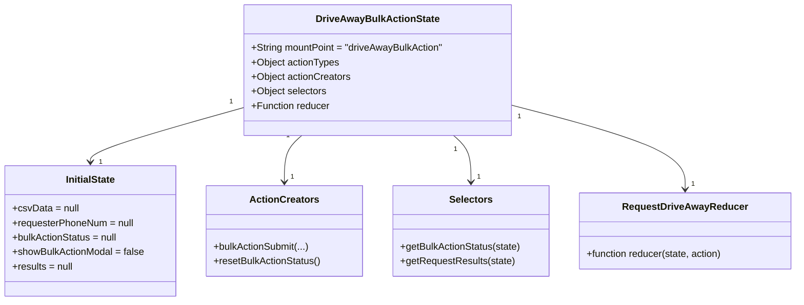
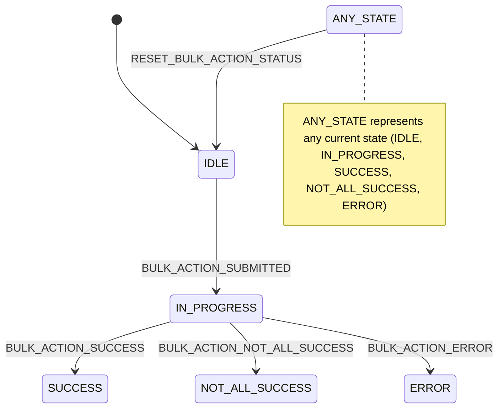

# Diagram: web/portal/src/pages/driveaway/redux/DriveAwayBulkActionModalState.js


> Auto-generated by Obscura crawlers

## Diagram 1

```mermaid
flowchart LR
  subgraph Actions
    BA[bulkActionSubmit(bulkActionType, csvData, requesterPhoneNum, requesterPhoneNumberExt)]
    RESET[resetBulkActionStatus()]
  end
  subgraph Dispatches
    SUB[BULK_ACTION_SUBMITTED]
    NOTALL[BULK_ACTION_NOT_ALL_SUCCESS]
    SUC[BULK_ACTION_SUCCESS]
    ERR[BULK_ACTION_ERROR]
    RST[RESET_BULK_ACTION_STATUS]
  end
  subgraph HTTP
    REQ[axios.request(POST/PATCH)]
    RESP[response.data.status]
  end
  BA -->|dispatch payload: postData| SUB
  SUB --> REQ
  REQ --> RESP
  RESP -->|missing or undefined| ERR
  RESP -->|FAILED with vins_and_reasons| NOTALL
  RESP -->|status != FAILED| SUC
  REQ -.catch.-> ERR
  RESET -->|dispatch| RST
```

> SVG rendering failed for this diagram.

## Diagram 2



### SVG

<svg id="container" width="1314.125" xmlns="http://www.w3.org/2000/svg" class="classDiagram" height="498" viewBox="0 0 1314.125 498" role="graphics-document document" aria-roledescription="class"><style>#container{font-family:"trebuchet ms",verdana,arial,sans-serif;font-size:16px;fill:#333;}@keyframes edge-animation-frame{from{stroke-dashoffset:0;}}@keyframes dash{to{stroke-dashoffset:0;}}#container .edge-animation-slow{stroke-dasharray:9,5!important;stroke-dashoffset:900;animation:dash 50s linear infinite;stroke-linecap:round;}#container .edge-animation-fast{stroke-dasharray:9,5!important;stroke-dashoffset:900;animation:dash 20s linear infinite;stroke-linecap:round;}#container .error-icon{fill:#552222;}#container .error-text{fill:#552222;stroke:#552222;}#container .edge-thickness-normal{stroke-width:1px;}#container .edge-thickness-thick{stroke-width:3.5px;}#container .edge-pattern-solid{stroke-dasharray:0;}#container .edge-thickness-invisible{stroke-width:0;fill:none;}#container .edge-pattern-dashed{stroke-dasharray:3;}#container .edge-pattern-dotted{stroke-dasharray:2;}#container .marker{fill:#333333;stroke:#333333;}#container .marker.cross{stroke:#333333;}#container svg{font-family:"trebuchet ms",verdana,arial,sans-serif;font-size:16px;}#container p{margin:0;}#container g.classGroup text{fill:#9370DB;stroke:none;font-family:"trebuchet ms",verdana,arial,sans-serif;font-size:10px;}#container g.classGroup text .title{font-weight:bolder;}#container .nodeLabel,#container .edgeLabel{color:#131300;}#container .edgeLabel .label rect{fill:#ECECFF;}#container .label text{fill:#131300;}#container .labelBkg{background:#ECECFF;}#container .edgeLabel .label span{background:#ECECFF;}#container .classTitle{font-weight:bolder;}#container .node rect,#container .node circle,#container .node ellipse,#container .node polygon,#container .node path{fill:#ECECFF;stroke:#9370DB;stroke-width:1px;}#container .divider{stroke:#9370DB;stroke-width:1;}#container g.clickable{cursor:pointer;}#container g.classGroup rect{fill:#ECECFF;stroke:#9370DB;}#container g.classGroup line{stroke:#9370DB;stroke-width:1;}#container .classLabel .box{stroke:none;stroke-width:0;fill:#ECECFF;opacity:0.5;}#container .classLabel .label{fill:#9370DB;font-size:10px;}#container .relation{stroke:#333333;stroke-width:1;fill:none;}#container .dashed-line{stroke-dasharray:3;}#container .dotted-line{stroke-dasharray:1 2;}#container #compositionStart,#container .composition{fill:#333333!important;stroke:#333333!important;stroke-width:1;}#container #compositionEnd,#container .composition{fill:#333333!important;stroke:#333333!important;stroke-width:1;}#container #dependencyStart,#container .dependency{fill:#333333!important;stroke:#333333!important;stroke-width:1;}#container #dependencyStart,#container .dependency{fill:#333333!important;stroke:#333333!important;stroke-width:1;}#container #extensionStart,#container .extension{fill:transparent!important;stroke:#333333!important;stroke-width:1;}#container #extensionEnd,#container .extension{fill:transparent!important;stroke:#333333!important;stroke-width:1;}#container #aggregationStart,#container .aggregation{fill:transparent!important;stroke:#333333!important;stroke-width:1;}#container #aggregationEnd,#container .aggregation{fill:transparent!important;stroke:#333333!important;stroke-width:1;}#container #lollipopStart,#container .lollipop{fill:#ECECFF!important;stroke:#333333!important;stroke-width:1;}#container #lollipopEnd,#container .lollipop{fill:#ECECFF!important;stroke:#333333!important;stroke-width:1;}#container .edgeTerminals{font-size:11px;line-height:initial;}#container .classTitleText{text-anchor:middle;font-size:18px;fill:#333;}#container .label-icon{display:inline-block;height:1em;overflow:visible;vertical-align:-0.125em;}#container .node .label-icon path{fill:currentColor;stroke:revert;stroke-width:revert;}#container :root{--mermaid-font-family:"trebuchet ms",verdana,arial,sans-serif;}</style><g><defs><marker id="container_class-aggregationStart" class="marker aggregation class" refX="18" refY="7" markerWidth="190" markerHeight="240" orient="auto"><path d="M 18,7 L9,13 L1,7 L9,1 Z"></path></marker></defs><defs><marker id="container_class-aggregationEnd" class="marker aggregation class" refX="1" refY="7" markerWidth="20" markerHeight="28" orient="auto"><path d="M 18,7 L9,13 L1,7 L9,1 Z"></path></marker></defs><defs><marker id="container_class-extensionStart" class="marker extension class" refX="18" refY="7" markerWidth="190" markerHeight="240" orient="auto"><path d="M 1,7 L18,13 V 1 Z"></path></marker></defs><defs><marker id="container_class-extensionEnd" class="marker extension class" refX="1" refY="7" markerWidth="20" markerHeight="28" orient="auto"><path d="M 1,1 V 13 L18,7 Z"></path></marker></defs><defs><marker id="container_class-compositionStart" class="marker composition class" refX="18" refY="7" markerWidth="190" markerHeight="240" orient="auto"><path d="M 18,7 L9,13 L1,7 L9,1 Z"></path></marker></defs><defs><marker id="container_class-compositionEnd" class="marker composition class" refX="1" refY="7" markerWidth="20" markerHeight="28" orient="auto"><path d="M 18,7 L9,13 L1,7 L9,1 Z"></path></marker></defs><defs><marker id="container_class-dependencyStart" class="marker dependency class" refX="6" refY="7" markerWidth="190" markerHeight="240" orient="auto"><path d="M 5,7 L9,13 L1,7 L9,1 Z"></path></marker></defs><defs><marker id="container_class-dependencyEnd" class="marker dependency class" refX="13" refY="7" markerWidth="20" markerHeight="28" orient="auto"><path d="M 18,7 L9,13 L14,7 L9,1 Z"></path></marker></defs><defs><marker id="container_class-lollipopStart" class="marker lollipop class" refX="13" refY="7" markerWidth="190" markerHeight="240" orient="auto"><circle stroke="black" fill="transparent" cx="7" cy="7" r="6"></circle></marker></defs><defs><marker id="container_class-lollipopEnd" class="marker lollipop class" refX="1" refY="7" markerWidth="190" markerHeight="240" orient="auto"><circle stroke="black" fill="transparent" cx="7" cy="7" r="6"></circle></marker></defs><g class="root"><g class="clusters"></g><g class="edgePaths"><path d="M402.688,177.941L360.528,189.784C318.368,201.627,234.049,225.314,191.89,240.324C149.73,255.333,149.73,261.667,149.73,264.833L149.73,268" id="id_DriveAwayBulkActionState_InitialState_1" class="edge-thickness-normal edge-pattern-solid relation" style=";;;" data-edge="true" data-et="edge" data-id="id_DriveAwayBulkActionState_InitialState_1" data-points="W3sieCI6NDAyLjY4NzUsInkiOjE3Ny45NDEyMDcwNDU5MTM5Nn0seyJ4IjoxNDkuNzMwNDY4NzUsInkiOjI0OX0seyJ4IjoxNDkuNzMwNDY4NzUsInkiOjI3NH1d" marker-end="url(#container_class-dependencyEnd)"></path><path d="M498.401,224L493.587,228.167C488.773,232.333,479.144,240.667,474.33,253.5C469.516,266.333,469.516,283.667,469.516,292.333L469.516,301" id="id_DriveAwayBulkActionState_ActionCreators_2" class="edge-thickness-normal edge-pattern-solid relation" style=";;;" data-edge="true" data-et="edge" data-id="id_DriveAwayBulkActionState_ActionCreators_2" data-points="W3sieCI6NDk4LjQwMTMxNTc4OTQ3MzcsInkiOjIyNH0seyJ4Ijo0NjkuNTE1NjI1LCJ5IjoyNDl9LHsieCI6NDY5LjUxNTYyNSwieSI6MzA3fV0=" marker-end="url(#container_class-dependencyEnd)"></path><path d="M747.974,224L752.788,228.167C757.602,232.333,767.231,240.667,772.045,253.5C776.859,266.333,776.859,283.667,776.859,292.333L776.859,301" id="id_DriveAwayBulkActionState_Selectors_3" class="edge-thickness-normal edge-pattern-solid relation" style=";;;" data-edge="true" data-et="edge" data-id="id_DriveAwayBulkActionState_Selectors_3" data-points="W3sieCI6NzQ3Ljk3MzY4NDIxMDUyNjQsInkiOjIyNH0seyJ4Ijo3NzYuODU5Mzc1LCJ5IjoyNDl9LHsieCI6Nzc2Ljg1OTM3NSwieSI6MzA3fV0=" marker-end="url(#container_class-dependencyEnd)"></path><path d="M843.688,173.735L891.596,186.279C939.504,198.823,1035.32,223.912,1083.229,247.123C1131.137,270.333,1131.137,291.667,1131.137,302.333L1131.137,313" id="id_DriveAwayBulkActionState_RequestDriveAwayReducer_4" class="edge-thickness-normal edge-pattern-solid relation" style=";;;" data-edge="true" data-et="edge" data-id="id_DriveAwayBulkActionState_RequestDriveAwayReducer_4" data-points="W3sieCI6ODQzLjY4NzUsInkiOjE3My43MzUxMDIwODc4OTk0fSx7IngiOjExMzEuMTM2NzE4NzUsInkiOjI0OX0seyJ4IjoxMTMxLjEzNjcxODc1LCJ5IjozMTl9XQ==" marker-end="url(#container_class-dependencyEnd)"></path></g><g class="edgeLabels"><g class="edgeLabel"><g class="label" data-id="id_DriveAwayBulkActionState_InitialState_1" transform="translate(0, 0)"><foreignObject width="0" height="0"><div xmlns="http://www.w3.org/1999/xhtml" class="labelBkg" style="display: table-cell; white-space: nowrap; line-height: 1.5; max-width: 200px; text-align: center;"><span class="edgeLabel"></span></div></foreignObject></g></g><g class="edgeLabel"><g class="label" data-id="id_DriveAwayBulkActionState_ActionCreators_2" transform="translate(0, 0)"><foreignObject width="0" height="0"><div xmlns="http://www.w3.org/1999/xhtml" class="labelBkg" style="display: table-cell; white-space: nowrap; line-height: 1.5; max-width: 200px; text-align: center;"><span class="edgeLabel"></span></div></foreignObject></g></g><g class="edgeLabel"><g class="label" data-id="id_DriveAwayBulkActionState_Selectors_3" transform="translate(0, 0)"><foreignObject width="0" height="0"><div xmlns="http://www.w3.org/1999/xhtml" class="labelBkg" style="display: table-cell; white-space: nowrap; line-height: 1.5; max-width: 200px; text-align: center;"><span class="edgeLabel"></span></div></foreignObject></g></g><g class="edgeLabel"><g class="label" data-id="id_DriveAwayBulkActionState_RequestDriveAwayReducer_4" transform="translate(0, 0)"><foreignObject width="0" height="0"><div xmlns="http://www.w3.org/1999/xhtml" class="labelBkg" style="display: table-cell; white-space: nowrap; line-height: 1.5; max-width: 200px; text-align: center;"><span class="edgeLabel"></span></div></foreignObject></g></g><g class="edgeTerminals" transform="translate(381.7829598800586, 168.23294934584032)"><g class="inner" transform="translate(0, 0)"><foreignObject style="width: 9px; height: 12px;"><div xmlns="http://www.w3.org/1999/xhtml" style="display: inline-block; padding-right: 1px; white-space: nowrap;"><span class="edgeLabel">1</span></div></foreignObject></g></g><g class="edgeTerminals" transform="translate(475.35271865025857, 224.1103289950136)"><g class="inner" transform="translate(0, 0)"><foreignObject style="width: 9px; height: 12px;"><div xmlns="http://www.w3.org/1999/xhtml" style="display: inline-block; padding-right: 1px; white-space: nowrap;"><span class="edgeLabel">1</span></div></foreignObject></g></g><g class="edgeTerminals" transform="translate(751.3897328607848, 246.79431100498635)"><g class="inner" transform="translate(0, 0)"><foreignObject style="width: 9px; height: 12px;"><div xmlns="http://www.w3.org/1999/xhtml" style="display: inline-block; padding-right: 1px; white-space: nowrap;"><span class="edgeLabel">1</span></div></foreignObject></g></g><g class="edgeTerminals" transform="translate(856.8173217737354, 192.67864470089276)"><g class="inner" transform="translate(0, 0)"><foreignObject style="width: 9px; height: 12px;"><div xmlns="http://www.w3.org/1999/xhtml" style="display: inline-block; padding-right: 1px; white-space: nowrap;"><span class="edgeLabel">1</span></div></foreignObject></g></g><g class="edgeTerminals" transform="translate(163.7130200872768, 260.07149415194397)"><g class="inner" transform="translate(0, 0)"></g><foreignObject style="width: 9px; height: 12px;"><div xmlns="http://www.w3.org/1999/xhtml" style="display: inline-block; padding-right: 1px; white-space: nowrap;"><span class="edgeLabel">1</span></div></foreignObject></g><g class="edgeTerminals" transform="translate(479.5156274999998, 284.5000021428571)"><g class="inner" transform="translate(0, 0)"></g><foreignObject style="width: 9px; height: 12px;"><div xmlns="http://www.w3.org/1999/xhtml" style="display: inline-block; padding-right: 1px; white-space: nowrap;"><span class="edgeLabel">1</span></div></foreignObject></g><g class="edgeTerminals" transform="translate(786.8593774999998, 284.5000021428571)"><g class="inner" transform="translate(0, 0)"></g><foreignObject style="width: 9px; height: 12px;"><div xmlns="http://www.w3.org/1999/xhtml" style="display: inline-block; padding-right: 1px; white-space: nowrap;"><span class="edgeLabel">1</span></div></foreignObject></g><g class="edgeTerminals" transform="translate(1141.136719375, 296.50000053571426)"><g class="inner" transform="translate(0, 0)"></g><foreignObject style="width: 9px; height: 12px;"><div xmlns="http://www.w3.org/1999/xhtml" style="display: inline-block; padding-right: 1px; white-space: nowrap;"><span class="edgeLabel">1</span></div></foreignObject></g></g><g class="nodes"><g class="node default" id="classId-DriveAwayBulkActionState-0" transform="translate(623.1875, 116)"><g class="basic label-container"><path d="M-220.5 -108 L220.5 -108 L220.5 108 L-220.5 108" stroke="none" stroke-width="0" fill="#ECECFF" style=""></path><path d="M-220.5 -108 C-126.6661983335184 -108, -32.83239666703679 -108, 220.5 -108 M-220.5 -108 C-73.05753225416333 -108, 74.38493549167333 -108, 220.5 -108 M220.5 -108 C220.5 -63.083054882689375, 220.5 -18.16610976537875, 220.5 108 M220.5 -108 C220.5 -52.558854120890025, 220.5 2.8822917582199494, 220.5 108 M220.5 108 C71.08733022099469 108, -78.32533955801063 108, -220.5 108 M220.5 108 C125.80601431905869 108, 31.11202863811738 108, -220.5 108 M-220.5 108 C-220.5 54.471487071068324, -220.5 0.9429741421366487, -220.5 -108 M-220.5 108 C-220.5 34.6010212211218, -220.5 -38.797957557756405, -220.5 -108" stroke="#9370DB" stroke-width="1.3" fill="none" stroke-dasharray="0 0" style=""></path></g><g class="annotation-group text" transform="translate(0, -84)"></g><g class="label-group text" transform="translate(-96.9375, -84)"><g class="label" style="font-weight: bolder" transform="translate(0,-12)"><foreignObject width="193.875" height="24"><div xmlns="http://www.w3.org/1999/xhtml" style="display: table-cell; white-space: nowrap; line-height: 1.5; max-width: 239px; text-align: center;"><span class="nodeLabel markdown-node-label" style=""><p>DriveAwayBulkActionState</p></span></div></foreignObject></g></g><g class="members-group text" transform="translate(-208.5, -36)"><g class="label" style="" transform="translate(0,-12)"><foreignObject width="320.0625" height="24"><div xmlns="http://www.w3.org/1999/xhtml" style="display: table-cell; white-space: nowrap; line-height: 1.5; max-width: 377px; text-align: center;"><span class="nodeLabel markdown-node-label" style=""><p>+String mountPoint = "driveAwayBulkAction"</p></span></div></foreignObject></g><g class="label" style="" transform="translate(0,12)"><foreignObject width="145.984375" height="24"><div xmlns="http://www.w3.org/1999/xhtml" style="display: table-cell; white-space: nowrap; line-height: 1.5; max-width: 203px; text-align: center;"><span class="nodeLabel markdown-node-label" style=""><p>+Object actionTypes</p></span></div></foreignObject></g><g class="label" style="" transform="translate(0,36)"><foreignObject width="164.765625" height="24"><div xmlns="http://www.w3.org/1999/xhtml" style="display: table-cell; white-space: nowrap; line-height: 1.5; max-width: 222px; text-align: center;"><span class="nodeLabel markdown-node-label" style=""><p>+Object actionCreators</p></span></div></foreignObject></g><g class="label" style="" transform="translate(0,60)"><foreignObject width="124.890625" height="24"><div xmlns="http://www.w3.org/1999/xhtml" style="display: table-cell; white-space: nowrap; line-height: 1.5; max-width: 182px; text-align: center;"><span class="nodeLabel markdown-node-label" style=""><p>+Object selectors</p></span></div></foreignObject></g><g class="label" style="" transform="translate(0,84)"><foreignObject width="130.359375" height="24"><div xmlns="http://www.w3.org/1999/xhtml" style="display: table-cell; white-space: nowrap; line-height: 1.5; max-width: 189px; text-align: center;"><span class="nodeLabel markdown-node-label" style=""><p>+Function reducer</p></span></div></foreignObject></g></g><g class="methods-group text" transform="translate(-208.5, 108)"></g><g class="divider" style=""><path d="M-220.5 -60 C-49.52322716844978 -60, 121.45354566310044 -60, 220.5 -60 M-220.5 -60 C-78.94640360773937 -60, 62.60719278452126 -60, 220.5 -60" stroke="#9370DB" stroke-width="1.3" fill="none" stroke-dasharray="0 0" style=""></path></g><g class="divider" style=""><path d="M-220.5 84 C-104.21073682467244 84, 12.078526350655125 84, 220.5 84 M-220.5 84 C-124.35664650104633 84, -28.213293002092655 84, 220.5 84" stroke="#9370DB" stroke-width="1.3" fill="none" stroke-dasharray="0 0" style=""></path></g></g><g class="node default" id="classId-InitialState-1" transform="translate(149.73046875, 382)"><g class="basic label-container"><path d="M-141.73046875 -108 L141.73046875 -108 L141.73046875 108 L-141.73046875 108" stroke="none" stroke-width="0" fill="#ECECFF" style=""></path><path d="M-141.73046875 -108 C-84.68455612243667 -108, -27.638643494873364 -108, 141.73046875 -108 M-141.73046875 -108 C-62.32281665231423 -108, 17.08483544537154 -108, 141.73046875 -108 M141.73046875 -108 C141.73046875 -51.01304756784803, 141.73046875 5.973904864303947, 141.73046875 108 M141.73046875 -108 C141.73046875 -43.73715161367427, 141.73046875 20.525696772651457, 141.73046875 108 M141.73046875 108 C72.88616744656993 108, 4.041866143139856 108, -141.73046875 108 M141.73046875 108 C65.65400042547893 108, -10.422467899042147 108, -141.73046875 108 M-141.73046875 108 C-141.73046875 63.889612689135404, -141.73046875 19.77922537827081, -141.73046875 -108 M-141.73046875 108 C-141.73046875 21.960108555068018, -141.73046875 -64.07978288986396, -141.73046875 -108" stroke="#9370DB" stroke-width="1.3" fill="none" stroke-dasharray="0 0" style=""></path></g><g class="annotation-group text" transform="translate(0, -84)"></g><g class="label-group text" transform="translate(-40.5546875, -84)"><g class="label" style="font-weight: bolder" transform="translate(0,-12)"><foreignObject width="81.109375" height="24"><div xmlns="http://www.w3.org/1999/xhtml" style="display: table-cell; white-space: nowrap; line-height: 1.5; max-width: 129px; text-align: center;"><span class="nodeLabel markdown-node-label" style=""><p>InitialState</p></span></div></foreignObject></g></g><g class="members-group text" transform="translate(-129.73046875, -36)"><g class="label" style="" transform="translate(0,-12)"><foreignObject width="108.46875" height="24"><div xmlns="http://www.w3.org/1999/xhtml" style="display: table-cell; white-space: nowrap; line-height: 1.5; max-width: 166px; text-align: center;"><span class="nodeLabel markdown-node-label" style=""><p>+csvData = null</p></span></div></foreignObject></g><g class="label" style="" transform="translate(0,12)"><foreignObject width="202.203125" height="24"><div xmlns="http://www.w3.org/1999/xhtml" style="display: table-cell; white-space: nowrap; line-height: 1.5; max-width: 260px; text-align: center;"><span class="nodeLabel markdown-node-label" style=""><p>+requesterPhoneNum = null</p></span></div></foreignObject></g><g class="label" style="" transform="translate(0,36)"><foreignObject width="175.703125" height="24"><div xmlns="http://www.w3.org/1999/xhtml" style="display: table-cell; white-space: nowrap; line-height: 1.5; max-width: 233px; text-align: center;"><span class="nodeLabel markdown-node-label" style=""><p>+bulkActionStatus = null</p></span></div></foreignObject></g><g class="label" style="" transform="translate(0,60)"><foreignObject width="218.90625" height="24"><div xmlns="http://www.w3.org/1999/xhtml" style="display: table-cell; white-space: nowrap; line-height: 1.5; max-width: 276px; text-align: center;"><span class="nodeLabel markdown-node-label" style=""><p>+showBulkActionModal = false</p></span></div></foreignObject></g><g class="label" style="" transform="translate(0,84)"><foreignObject width="101.671875" height="24"><div xmlns="http://www.w3.org/1999/xhtml" style="display: table-cell; white-space: nowrap; line-height: 1.5; max-width: 159px; text-align: center;"><span class="nodeLabel markdown-node-label" style=""><p>+results = null</p></span></div></foreignObject></g></g><g class="methods-group text" transform="translate(-129.73046875, 108)"></g><g class="divider" style=""><path d="M-141.73046875 -60 C-34.51269048005986 -60, 72.70508778988028 -60, 141.73046875 -60 M-141.73046875 -60 C-34.21960566581353 -60, 73.29125741837294 -60, 141.73046875 -60" stroke="#9370DB" stroke-width="1.3" fill="none" stroke-dasharray="0 0" style=""></path></g><g class="divider" style=""><path d="M-141.73046875 84 C-48.7160941974099 84, 44.2982803551802 84, 141.73046875 84 M-141.73046875 84 C-44.16459919659994 84, 53.401270356800126 84, 141.73046875 84" stroke="#9370DB" stroke-width="1.3" fill="none" stroke-dasharray="0 0" style=""></path></g></g><g class="node default" id="classId-RequestDriveAwayReducer-2" transform="translate(1131.13671875, 382)"><g class="basic label-container"><path d="M-174.98828125 -63 L174.98828125 -63 L174.98828125 63 L-174.98828125 63" stroke="none" stroke-width="0" fill="#ECECFF" style=""></path><path d="M-174.98828125 -63 C-55.63237495767086 -63, 63.723531334658276 -63, 174.98828125 -63 M-174.98828125 -63 C-54.297269717472304 -63, 66.39374181505539 -63, 174.98828125 -63 M174.98828125 -63 C174.98828125 -37.20479409169887, 174.98828125 -11.409588183397737, 174.98828125 63 M174.98828125 -63 C174.98828125 -22.172959933195166, 174.98828125 18.654080133609668, 174.98828125 63 M174.98828125 63 C101.79835262186768 63, 28.608423993735357 63, -174.98828125 63 M174.98828125 63 C77.17845737904071 63, -20.631366491918584 63, -174.98828125 63 M-174.98828125 63 C-174.98828125 35.83870622150445, -174.98828125 8.677412443008897, -174.98828125 -63 M-174.98828125 63 C-174.98828125 23.351173391227043, -174.98828125 -16.297653217545914, -174.98828125 -63" stroke="#9370DB" stroke-width="1.3" fill="none" stroke-dasharray="0 0" style=""></path></g><g class="annotation-group text" transform="translate(0, -39)"></g><g class="label-group text" transform="translate(-98.0234375, -39)"><g class="label" style="font-weight: bolder" transform="translate(0,-12)"><foreignObject width="196.046875" height="24"><div xmlns="http://www.w3.org/1999/xhtml" style="display: table-cell; white-space: nowrap; line-height: 1.5; max-width: 243px; text-align: center;"><span class="nodeLabel markdown-node-label" style=""><p>RequestDriveAwayReducer</p></span></div></foreignObject></g></g><g class="members-group text" transform="translate(-162.98828125, 9)"></g><g class="methods-group text" transform="translate(-162.98828125, 39)"><g class="label" style="" transform="translate(0,-12)"><foreignObject width="227.953125" height="24"><div xmlns="http://www.w3.org/1999/xhtml" style="display: table-cell; white-space: nowrap; line-height: 1.5; max-width: 285px; text-align: center;"><span class="nodeLabel markdown-node-label" style=""><p>+function reducer(state, action)</p></span></div></foreignObject></g></g><g class="divider" style=""><path d="M-174.98828125 -15 C-79.48359087220881 -15, 16.021099505582384 -15, 174.98828125 -15 M-174.98828125 -15 C-84.91924914968659 -15, 5.149782950626815 -15, 174.98828125 -15" stroke="#9370DB" stroke-width="1.3" fill="none" stroke-dasharray="0 0" style=""></path></g><g class="divider" style=""><path d="M-174.98828125 9 C-78.92241983828337 9, 17.14344157343325 9, 174.98828125 9 M-174.98828125 9 C-40.36367613320306 9, 94.26092898359389 9, 174.98828125 9" stroke="#9370DB" stroke-width="1.3" fill="none" stroke-dasharray="0 0" style=""></path></g></g><g class="node default" id="classId-ActionCreators-3" transform="translate(469.515625, 382)"><g class="basic label-container"><path d="M-128.0546875 -75 L128.0546875 -75 L128.0546875 75 L-128.0546875 75" stroke="none" stroke-width="0" fill="#ECECFF" style=""></path><path d="M-128.0546875 -75 C-50.03582709027938 -75, 27.983033319441233 -75, 128.0546875 -75 M-128.0546875 -75 C-52.130665051115926 -75, 23.793357397768148 -75, 128.0546875 -75 M128.0546875 -75 C128.0546875 -42.37164640871084, 128.0546875 -9.743292817421676, 128.0546875 75 M128.0546875 -75 C128.0546875 -40.1780187879048, 128.0546875 -5.356037575809594, 128.0546875 75 M128.0546875 75 C44.08253095949112 75, -39.889625581017754 75, -128.0546875 75 M128.0546875 75 C56.88220845883339 75, -14.290270582333221 75, -128.0546875 75 M-128.0546875 75 C-128.0546875 42.08857083252535, -128.0546875 9.177141665050698, -128.0546875 -75 M-128.0546875 75 C-128.0546875 17.599271684165586, -128.0546875 -39.80145663166883, -128.0546875 -75" stroke="#9370DB" stroke-width="1.3" fill="none" stroke-dasharray="0 0" style=""></path></g><g class="annotation-group text" transform="translate(0, -51)"></g><g class="label-group text" transform="translate(-53.96875, -51)"><g class="label" style="font-weight: bolder" transform="translate(0,-12)"><foreignObject width="107.9375" height="24"><div xmlns="http://www.w3.org/1999/xhtml" style="display: table-cell; white-space: nowrap; line-height: 1.5; max-width: 156px; text-align: center;"><span class="nodeLabel markdown-node-label" style=""><p>ActionCreators</p></span></div></foreignObject></g></g><g class="members-group text" transform="translate(-116.0546875, -3)"></g><g class="methods-group text" transform="translate(-116.0546875, 27)"><g class="label" style="" transform="translate(0,-12)"><foreignObject width="158.9375" height="24"><div xmlns="http://www.w3.org/1999/xhtml" style="display: table-cell; white-space: nowrap; line-height: 1.5; max-width: 216px; text-align: center;"><span class="nodeLabel markdown-node-label" style=""><p>+bulkActionSubmit(...)</p></span></div></foreignObject></g><g class="label" style="" transform="translate(0,12)"><foreignObject width="178.140625" height="24"><div xmlns="http://www.w3.org/1999/xhtml" style="display: table-cell; white-space: nowrap; line-height: 1.5; max-width: 236px; text-align: center;"><span class="nodeLabel markdown-node-label" style=""><p>+resetBulkActionStatus()</p></span></div></foreignObject></g></g><g class="divider" style=""><path d="M-128.0546875 -27 C-35.87440745033433 -27, 56.30587259933134 -27, 128.0546875 -27 M-128.0546875 -27 C-52.72615342364148 -27, 22.602380652717045 -27, 128.0546875 -27" stroke="#9370DB" stroke-width="1.3" fill="none" stroke-dasharray="0 0" style=""></path></g><g class="divider" style=""><path d="M-128.0546875 -3 C-72.74651593660919 -3, -17.43834437321837 -3, 128.0546875 -3 M-128.0546875 -3 C-74.58827801072523 -3, -21.121868521450466 -3, 128.0546875 -3" stroke="#9370DB" stroke-width="1.3" fill="none" stroke-dasharray="0 0" style=""></path></g></g><g class="node default" id="classId-Selectors-4" transform="translate(776.859375, 382)"><g class="basic label-container"><path d="M-129.2890625 -75 L129.2890625 -75 L129.2890625 75 L-129.2890625 75" stroke="none" stroke-width="0" fill="#ECECFF" style=""></path><path d="M-129.2890625 -75 C-32.57271906406099 -75, 64.14362437187802 -75, 129.2890625 -75 M-129.2890625 -75 C-50.73834156351177 -75, 27.812379372976466 -75, 129.2890625 -75 M129.2890625 -75 C129.2890625 -24.073696533915495, 129.2890625 26.85260693216901, 129.2890625 75 M129.2890625 -75 C129.2890625 -24.941559388509518, 129.2890625 25.116881222980965, 129.2890625 75 M129.2890625 75 C35.50869583833675 75, -58.2716708233265 75, -129.2890625 75 M129.2890625 75 C69.58226862215976 75, 9.875474744319519 75, -129.2890625 75 M-129.2890625 75 C-129.2890625 23.206053253920274, -129.2890625 -28.587893492159452, -129.2890625 -75 M-129.2890625 75 C-129.2890625 16.12614488316961, -129.2890625 -42.74771023366078, -129.2890625 -75" stroke="#9370DB" stroke-width="1.3" fill="none" stroke-dasharray="0 0" style=""></path></g><g class="annotation-group text" transform="translate(0, -51)"></g><g class="label-group text" transform="translate(-34.171875, -51)"><g class="label" style="font-weight: bolder" transform="translate(0,-12)"><foreignObject width="68.34375" height="24"><div xmlns="http://www.w3.org/1999/xhtml" style="display: table-cell; white-space: nowrap; line-height: 1.5; max-width: 117px; text-align: center;"><span class="nodeLabel markdown-node-label" style=""><p>Selectors</p></span></div></foreignObject></g></g><g class="members-group text" transform="translate(-117.2890625, -3)"></g><g class="methods-group text" transform="translate(-117.2890625, 27)"><g class="label" style="" transform="translate(0,-12)"><foreignObject width="200.40625" height="24"><div xmlns="http://www.w3.org/1999/xhtml" style="display: table-cell; white-space: nowrap; line-height: 1.5; max-width: 258px; text-align: center;"><span class="nodeLabel markdown-node-label" style=""><p>+getBulkActionStatus(state)</p></span></div></foreignObject></g><g class="label" style="" transform="translate(0,12)"><foreignObject width="188.90625" height="24"><div xmlns="http://www.w3.org/1999/xhtml" style="display: table-cell; white-space: nowrap; line-height: 1.5; max-width: 246px; text-align: center;"><span class="nodeLabel markdown-node-label" style=""><p>+getRequestResults(state)</p></span></div></foreignObject></g></g><g class="divider" style=""><path d="M-129.2890625 -27 C-64.90970880951208 -27, -0.5303551190241649 -27, 129.2890625 -27 M-129.2890625 -27 C-35.656404647978164 -27, 57.97625320404367 -27, 129.2890625 -27" stroke="#9370DB" stroke-width="1.3" fill="none" stroke-dasharray="0 0" style=""></path></g><g class="divider" style=""><path d="M-129.2890625 -3 C-76.02822355234413 -3, -22.76738460468826 -3, 129.2890625 -3 M-129.2890625 -3 C-64.6669785353103 -3, -0.044894570620613194 -3, 129.2890625 -3" stroke="#9370DB" stroke-width="1.3" fill="none" stroke-dasharray="0 0" style=""></path></g></g></g></g></g></svg>

## Diagram 3



### SVG

<svg id="container" width="621.15625" xmlns="http://www.w3.org/2000/svg" class="statediagram" height="534" viewBox="0 0 621.15625 534" role="graphics-document document" aria-roledescription="stateDiagram"><style>#container{font-family:"trebuchet ms",verdana,arial,sans-serif;font-size:16px;fill:#333;}@keyframes edge-animation-frame{from{stroke-dashoffset:0;}}@keyframes dash{to{stroke-dashoffset:0;}}#container .edge-animation-slow{stroke-dasharray:9,5!important;stroke-dashoffset:900;animation:dash 50s linear infinite;stroke-linecap:round;}#container .edge-animation-fast{stroke-dasharray:9,5!important;stroke-dashoffset:900;animation:dash 20s linear infinite;stroke-linecap:round;}#container .error-icon{fill:#552222;}#container .error-text{fill:#552222;stroke:#552222;}#container .edge-thickness-normal{stroke-width:1px;}#container .edge-thickness-thick{stroke-width:3.5px;}#container .edge-pattern-solid{stroke-dasharray:0;}#container .edge-thickness-invisible{stroke-width:0;fill:none;}#container .edge-pattern-dashed{stroke-dasharray:3;}#container .edge-pattern-dotted{stroke-dasharray:2;}#container .marker{fill:#333333;stroke:#333333;}#container .marker.cross{stroke:#333333;}#container svg{font-family:"trebuchet ms",verdana,arial,sans-serif;font-size:16px;}#container p{margin:0;}#container defs #statediagram-barbEnd{fill:#333333;stroke:#333333;}#container g.stateGroup text{fill:#9370DB;stroke:none;font-size:10px;}#container g.stateGroup text{fill:#333;stroke:none;font-size:10px;}#container g.stateGroup .state-title{font-weight:bolder;fill:#131300;}#container g.stateGroup rect{fill:#ECECFF;stroke:#9370DB;}#container g.stateGroup line{stroke:#333333;stroke-width:1;}#container .transition{stroke:#333333;stroke-width:1;fill:none;}#container .stateGroup .composit{fill:white;border-bottom:1px;}#container .stateGroup .alt-composit{fill:#e0e0e0;border-bottom:1px;}#container .state-note{stroke:#aaaa33;fill:#fff5ad;}#container .state-note text{fill:black;stroke:none;font-size:10px;}#container .stateLabel .box{stroke:none;stroke-width:0;fill:#ECECFF;opacity:0.5;}#container .edgeLabel .label rect{fill:#ECECFF;opacity:0.5;}#container .edgeLabel{background-color:rgba(232,232,232, 0.8);text-align:center;}#container .edgeLabel p{background-color:rgba(232,232,232, 0.8);}#container .edgeLabel rect{opacity:0.5;background-color:rgba(232,232,232, 0.8);fill:rgba(232,232,232, 0.8);}#container .edgeLabel .label text{fill:#333;}#container .label div .edgeLabel{color:#333;}#container .stateLabel text{fill:#131300;font-size:10px;font-weight:bold;}#container .node circle.state-start{fill:#333333;stroke:#333333;}#container .node .fork-join{fill:#333333;stroke:#333333;}#container .node circle.state-end{fill:#9370DB;stroke:white;stroke-width:1.5;}#container .end-state-inner{fill:white;stroke-width:1.5;}#container .node rect{fill:#ECECFF;stroke:#9370DB;stroke-width:1px;}#container .node polygon{fill:#ECECFF;stroke:#9370DB;stroke-width:1px;}#container #statediagram-barbEnd{fill:#333333;}#container .statediagram-cluster rect{fill:#ECECFF;stroke:#9370DB;stroke-width:1px;}#container .cluster-label,#container .nodeLabel{color:#131300;}#container .statediagram-cluster rect.outer{rx:5px;ry:5px;}#container .statediagram-state .divider{stroke:#9370DB;}#container .statediagram-state .title-state{rx:5px;ry:5px;}#container .statediagram-cluster.statediagram-cluster .inner{fill:white;}#container .statediagram-cluster.statediagram-cluster-alt .inner{fill:#f0f0f0;}#container .statediagram-cluster .inner{rx:0;ry:0;}#container .statediagram-state rect.basic{rx:5px;ry:5px;}#container .statediagram-state rect.divider{stroke-dasharray:10,10;fill:#f0f0f0;}#container .note-edge{stroke-dasharray:5;}#container .statediagram-note rect{fill:#fff5ad;stroke:#aaaa33;stroke-width:1px;rx:0;ry:0;}#container .statediagram-note rect{fill:#fff5ad;stroke:#aaaa33;stroke-width:1px;rx:0;ry:0;}#container .statediagram-note text{fill:black;}#container .statediagram-note .nodeLabel{color:black;}#container .statediagram .edgeLabel{color:red;}#container #dependencyStart,#container #dependencyEnd{fill:#333333;stroke:#333333;stroke-width:1;}#container .statediagramTitleText{text-anchor:middle;font-size:18px;fill:#333;}#container :root{--mermaid-font-family:"trebuchet ms",verdana,arial,sans-serif;}</style><g><defs><marker id="container_stateDiagram-barbEnd" refX="19" refY="7" markerWidth="20" markerHeight="14" markerUnits="userSpaceOnUse" orient="auto"><path d="M 19,7 L9,13 L14,7 L9,1 Z"></path></marker></defs><g class="root"><g class="clusters"><g class="note-cluster" id="ANY_STATE----parent"><rect x="306.87890625" y="122" width="300" height="176" fill="none"></rect></g></g><g class="edgePaths"><path d="M142.652,35L142.652,43.333C142.652,51.667,142.652,68.333,142.652,82.833C142.652,97.333,142.652,109.667,156.599,127.486C170.546,145.306,198.439,168.612,212.386,180.266L226.333,191.919" id="edge0" class="edge-thickness-normal edge-pattern-solid transition" style="fill:none;;;fill:none" data-edge="true" data-et="edge" data-id="edge0" data-points="W3sieCI6MTQyLjY1MjM0Mzc1LCJ5IjozNX0seyJ4IjoxNDIuNjUyMzQzNzUsInkiOjg1fSx7IngiOjE0Mi42NTIzNDM3NSwieSI6MTIyfSx7IngiOjIyNi4zMzI3MTUxNjQzMDE1NiwieSI6MTkxLjkxODY2MzY3NDIwMTEzfV0=" marker-end="url(#container_stateDiagram-barbEnd)"></path><path d="M248.598,230.5L248.514,241.75C248.431,253,248.264,275.5,248.181,292.917C248.098,310.333,248.098,322.667,248.181,335.083C248.264,347.5,248.431,360,248.514,366.25L248.598,372.5" id="edge1" class="edge-thickness-normal edge-pattern-solid transition" style="fill:none;;;fill:none" data-edge="true" data-et="edge" data-id="edge1" data-points="W3sieCI6MjQ4LjU5NzY1NjI1LCJ5IjoyMzAuNX0seyJ4IjoyNDguMDk3NjU2MjUsInkiOjI5OH0seyJ4IjoyNDguMDk3NjU2MjUsInkiOjMzNX0seyJ4IjoyNDguNTk3NjU2MjUsInkiOjM3Mi41fV0=" marker-end="url(#container_stateDiagram-barbEnd)"></path><path d="M194.594,412.309L177.612,418.424C160.63,424.539,126.667,436.77,109.768,449.135C92.87,461.5,93.036,474,93.12,480.25L93.203,486.5" id="edge2" class="edge-thickness-normal edge-pattern-solid transition" style="fill:none;;;fill:none" data-edge="true" data-et="edge" data-id="edge2" data-points="W3sieCI6MTk0LjU5NDA0Nzg1NzQzMTMsInkiOjQxMi4zMDg5NzA0NTQ4NDkzfSx7IngiOjkyLjcwMzEyNSwieSI6NDQ5fSx7IngiOjkzLjIwMzEyNSwieSI6NDg2LjV9XQ==" marker-end="url(#container_stateDiagram-barbEnd)"></path><path d="M272.927,412.5L280.346,418.583C287.764,424.667,302.601,436.833,310.102,449.167C317.604,461.5,317.771,474,317.854,480.25L317.938,486.5" id="edge3" class="edge-thickness-normal edge-pattern-solid transition" style="fill:none;;;fill:none" data-edge="true" data-et="edge" data-id="edge3" data-points="W3sieCI6MjcyLjkyNzQyNTk4Njg0MjEsInkiOjQxMi41fSx7IngiOjMxNy40Mzc1LCJ5Ijo0NDl9LHsieCI6MzE3LjkzNzUsInkiOjQ4Ni41fV0=" marker-end="url(#container_stateDiagram-barbEnd)"></path><path d="M306.246,403.941L344.424,411.451C382.602,418.961,458.957,433.98,497.218,447.74C535.479,461.5,535.646,474,535.729,480.25L535.813,486.5" id="edge4" class="edge-thickness-normal edge-pattern-solid transition" style="fill:none;;;fill:none" data-edge="true" data-et="edge" data-id="edge4" data-points="W3sieCI6MzA2LjI0NjA5Mzc1LCJ5Ijo0MDMuOTQwNzc2ODU3NDgwOX0seyJ4Ijo1MzUuMzEyNSwieSI6NDQ5fSx7IngiOjUzNS44MTI1LCJ5Ijo0ODYuNX1d" marker-end="url(#container_stateDiagram-barbEnd)"></path><path d="M411.051,42.443L387.124,49.536C363.197,56.629,315.342,70.814,291.415,84.074C267.488,97.333,267.488,109.667,265.074,127.25C262.66,144.833,257.833,167.667,255.419,179.083L253.005,190.5" id="edge5" class="edge-thickness-normal edge-pattern-solid transition" style="fill:none;;;fill:none" data-edge="true" data-et="edge" data-id="edge5" data-points="W3sieCI6NDExLjA1MDc4MTI1LCJ5Ijo0Mi40NDMxNTY1MDUyMzg4NH0seyJ4IjoyNjcuNDg4MjgxMjUsInkiOjg1fSx7IngiOjI2Ny40ODgyODEyNSwieSI6MTIyfSx7IngiOjI1My4wMDQ2MTY0NzcyNzI3MiwieSI6MTkwLjV9XQ==" marker-end="url(#container_stateDiagram-barbEnd)"></path><path d="M457.379,48.5L457.296,54.583C457.212,60.667,457.046,72.833,456.962,85.083C456.879,97.333,456.879,109.667,456.879,120C456.879,130.333,456.879,138.667,456.879,142.833L456.879,147" id="ANY_STATE-ANY_STATE----note-6" class="edge-thickness-normal edge-pattern-solid transition note-edge" style="fill:none;;;fill:none" data-edge="true" data-et="edge" data-id="ANY_STATE-ANY_STATE----note-6" data-points="W3sieCI6NDU3LjM3ODkwNjI1LCJ5Ijo0OC41fSx7IngiOjQ1Ni44Nzg5MDYyNSwieSI6ODV9LHsieCI6NDU2Ljg3ODkwNjI1LCJ5IjoxMjJ9LHsieCI6NDU2Ljg3ODkwNjI1LCJ5IjoxNDd9XQ=="></path></g><g class="edgeLabels"><g class="edgeLabel"><g class="label" data-id="edge0" transform="translate(0, 0)"><foreignObject width="0" height="0"><div xmlns="http://www.w3.org/1999/xhtml" class="labelBkg" style="display: table-cell; white-space: nowrap; line-height: 1.5; max-width: 200px; text-align: center;"><span class="edgeLabel"></span></div></foreignObject></g></g><g class="edgeLabel" transform="translate(248.09765625, 335)"><g class="label" data-id="edge1" transform="translate(-94.2265625, -12)"><foreignObject width="188.453125" height="24"><div xmlns="http://www.w3.org/1999/xhtml" class="labelBkg" style="display: table-cell; white-space: nowrap; line-height: 1.5; max-width: 200px; text-align: center;"><span class="edgeLabel"><p>BULK_ACTION_SUBMITTED</p></span></div></foreignObject></g></g><g class="edgeLabel" transform="translate(92.703125, 449)"><g class="label" data-id="edge2" transform="translate(-84.703125, -12)"><foreignObject width="169.40625" height="24"><div xmlns="http://www.w3.org/1999/xhtml" class="labelBkg" style="display: table-cell; white-space: nowrap; line-height: 1.5; max-width: 200px; text-align: center;"><span class="edgeLabel"><p>BULK_ACTION_SUCCESS</p></span></div></foreignObject></g></g><g class="edgeLabel" transform="translate(317.4375, 449)"><g class="label" data-id="edge3" transform="translate(-120.03125, -12)"><foreignObject width="240.0625" height="24"><div xmlns="http://www.w3.org/1999/xhtml" class="labelBkg" style="display: table; white-space: break-spaces; line-height: 1.5; max-width: 200px; text-align: center; width: 200px;"><span class="edgeLabel"><p>BULK_ACTION_NOT_ALL_SUCCESS</p></span></div></foreignObject></g></g><g class="edgeLabel" transform="translate(535.3125, 449)"><g class="label" data-id="edge4" transform="translate(-77.84375, -12)"><foreignObject width="155.6875" height="24"><div xmlns="http://www.w3.org/1999/xhtml" class="labelBkg" style="display: table-cell; white-space: nowrap; line-height: 1.5; max-width: 200px; text-align: center;"><span class="edgeLabel"><p>BULK_ACTION_ERROR</p></span></div></foreignObject></g></g><g class="edgeLabel" transform="translate(267.48828125, 85)"><g class="label" data-id="edge5" transform="translate(-104.8359375, -12)"><foreignObject width="209.671875" height="24"><div xmlns="http://www.w3.org/1999/xhtml" class="labelBkg" style="display: table; white-space: break-spaces; line-height: 1.5; max-width: 200px; text-align: center; width: 200px;"><span class="edgeLabel"><p>RESET_BULK_ACTION_STATUS</p></span></div></foreignObject></g></g><g class="edgeLabel"><g class="label" data-id="ANY_STATE-ANY_STATE----note-6" transform="translate(0, 0)"><foreignObject width="0" height="0"><div xmlns="http://www.w3.org/1999/xhtml" class="labelBkg" style="display: table-cell; white-space: nowrap; line-height: 1.5; max-width: 200px; text-align: center;"><span class="edgeLabel"></span></div></foreignObject></g></g></g><g class="nodes"><g class="node default" id="state-root_start-0" transform="translate(142.65234375, 28)"><circle class="state-start" r="7" width="14" height="14"></circle></g><g class="node  statediagram-state" id="state-IDLE-5" transform="translate(248.09765625, 210)"><g class="basic label-container outer-path"><path d="M-18.78125 -20 C-4.8288645870766675 -20, 9.123520825846665 -20, 18.78125 -20 C18.78125 -20, 18.78125 -20, 18.78125 -20 C18.901933558737312 -19.995008491088303, 19.02261711747462 -19.990016982176606, 19.194146727361662 -19.982922465033347 C19.350965443633914 -19.96337503243537, 19.50778415990617 -19.943827599837395, 19.60422295140367 -19.931806517013612 C19.738574104728116 -19.903636042544427, 19.87292525805256 -19.875465568075246, 20.008677435703998 -19.847001329696653 C20.12960949170693 -19.810998296726382, 20.250541547709858 -19.77499526375611, 20.404747346023417 -19.729086208503173 C20.507015785553115 -19.689180939568136, 20.609284225082817 -19.649275670633095, 20.789727123264846 -19.578866633275286 C20.886894139889705 -19.531364573358967, 20.984061156514564 -19.48386251344265, 21.16098696518537 -19.397368756032446 C21.29939357306561 -19.31489631887212, 21.437800180945853 -19.23242388171179, 21.515990790612136 -19.185832391312644 C21.595520575154875 -19.12904921656402, 21.675050359697615 -19.072266041815396, 21.85231356344834 -18.94570254698197 C21.97245060173035 -18.843951665897915, 22.09258764001236 -18.74220078481386, 22.167657858128706 -18.678619553365657 C22.24843938971479 -18.597838021779573, 22.329220921300873 -18.51705649019349, 22.459869553365657 -18.386407858128706 C22.5328900621304 -18.30019270634447, 22.60591057089514 -18.21397755456023, 22.72695254698197 -18.07106356344834 C22.800750959679014 -17.967702455384646, 22.874549372376062 -17.864341347320952, 22.967082391312644 -17.734740790612136 C23.028466653334636 -17.631724706981924, 23.089850915356624 -17.528708623351715, 23.178618756032446 -17.37973696518537 C23.226508879384077 -17.28177615211596, 23.27439900273571 -17.183815339046546, 23.360116633275286 -17.008477123264846 C23.40512426845718 -16.893132439722756, 23.45013190363907 -16.77778775618066, 23.510336208503173 -16.623497346023417 C23.535021187336593 -16.54058196372273, 23.559706166170013 -16.45766658142204, 23.628251329696653 -16.227427435703994 C23.656677126896472 -16.091858592440804, 23.68510292409629 -15.956289749177614, 23.713056517013612 -15.82297295140367 C23.730406229593846 -15.683785380816692, 23.747755942174084 -15.544597810229716, 23.764172465033347 -15.412896727361662 C23.76884519340566 -15.29992057146182, 23.77351792177797 -15.18694441556198, 23.78125 -15 C23.78125 -15, 23.78125 -15, 23.78125 -15 C23.78125 -3.5284397317495806, 23.78125 7.943120536500839, 23.78125 15 C23.78125 15, 23.78125 15, 23.78125 15 C23.777570362020626 15.088965443931249, 23.773890724041248 15.1779308878625, 23.764172465033347 15.412896727361662 C23.746514739998897 15.554555319011058, 23.728857014964447 15.696213910660454, 23.713056517013612 15.822972951403669 C23.686027901344733 15.951878330397182, 23.65899928567585 16.080783709390698, 23.628251329696653 16.227427435703994 C23.583267725192282 16.378524699749175, 23.538284120687912 16.529621963794355, 23.510336208503173 16.623497346023417 C23.458742130222625 16.755721636588014, 23.407148051942077 16.88794592715261, 23.360116633275286 17.008477123264846 C23.30313872001207 17.12502730772106, 23.246160806748847 17.24157749217727, 23.178618756032446 17.379736965185366 C23.129315992456316 17.462477678333293, 23.08001322888019 17.545218391481225, 22.967082391312644 17.734740790612133 C22.907684250414686 17.817933063125363, 22.84828610951673 17.90112533563859, 22.72695254698197 18.07106356344834 C22.644427395142564 18.168500826105255, 22.561902243303155 18.26593808876217, 22.459869553365657 18.386407858128706 C22.370347672011704 18.47592973948266, 22.28082579065775 18.565451620836612, 22.167657858128706 18.678619553365657 C22.051264119699177 18.777200021198325, 21.934870381269644 18.875780489030994, 21.85231356344834 18.94570254698197 C21.75823893474691 19.012870540855946, 21.66416430604548 19.080038534729923, 21.515990790612136 19.185832391312644 C21.433448498927067 19.235016921360202, 21.350906207241994 19.284201451407764, 21.16098696518537 19.397368756032446 C21.02796686334016 19.462398321284216, 20.894946761494953 19.527427886535982, 20.789727123264846 19.578866633275286 C20.64946626953085 19.633596588235513, 20.509205415796853 19.68832654319574, 20.404747346023417 19.729086208503173 C20.25494966925632 19.77368290911153, 20.105151992489226 19.818279609719887, 20.008677435703998 19.847001329696653 C19.924143319974085 19.864726269825702, 19.839609204244173 19.882451209954752, 19.60422295140367 19.931806517013612 C19.46501942508947 19.949158218473173, 19.32581589877527 19.966509919932733, 19.194146727361662 19.982922465033347 C19.042074602206732 19.989212214655197, 18.890002477051805 19.99550196427705, 18.78125 20 C18.78125 20, 18.78125 20, 18.78125 20 C5.065050172282982 20, -8.651149655434036 20, -18.78125 20 C-18.78125 20, -18.78125 20, -18.78125 20 C-18.9208768048054 19.994224992635367, -19.060503609610798 19.988449985270734, -19.194146727361662 19.982922465033347 C-19.3046116943121 19.969153021262663, -19.415076661262535 19.955383577491983, -19.60422295140367 19.931806517013612 C-19.738224101307434 19.903709430544325, -19.8722252512112 19.87561234407504, -20.008677435703994 19.847001329696653 C-20.09191079313048 19.822221685566735, -20.175144150556967 19.797442041436813, -20.404747346023417 19.729086208503173 C-20.52245516032575 19.683156476837265, -20.640162974628087 19.637226745171358, -20.789727123264846 19.578866633275286 C-20.865201454265303 19.541969481156585, -20.940675785265764 19.505072329037883, -21.16098696518537 19.397368756032446 C-21.29152817231855 19.319583080427705, -21.42206937945173 19.241797404822968, -21.515990790612133 19.185832391312644 C-21.61567971912269 19.11465586442194, -21.715368647633245 19.04347933753124, -21.85231356344834 18.94570254698197 C-21.93429190613149 18.876270432480858, -22.016270248814646 18.806838317979743, -22.167657858128706 18.67861955336566 C-22.25524098940143 18.591036422092937, -22.34282412067415 18.503453290820215, -22.459869553365657 18.386407858128706 C-22.564317711946526 18.263086150324035, -22.668765870527395 18.13976444251937, -22.726952546981966 18.07106356344834 C-22.805832280156423 17.96058562324995, -22.88471201333088 17.850107683051558, -22.967082391312644 17.734740790612133 C-23.02037361516546 17.64530657747113, -23.073664839018278 17.555872364330124, -23.178618756032446 17.37973696518537 C-23.24475327947408 17.24445663523651, -23.31088780291571 17.10917630528765, -23.360116633275286 17.00847712326485 C-23.41117653496429 16.877621809978404, -23.462236436653292 16.746766496691954, -23.510336208503173 16.623497346023417 C-23.543624318275878 16.511684556290156, -23.576912428048583 16.399871766556895, -23.628251329696653 16.227427435703994 C-23.653143497295424 16.108711244775122, -23.6780356648942 15.98999505384625, -23.713056517013612 15.82297295140367 C-23.732806281769484 15.664531031209233, -23.752556046525356 15.506089111014795, -23.764172465033347 15.412896727361664 C-23.768101875679605 15.3178923371222, -23.772031286325863 15.222887946882738, -23.78125 15 C-23.78125 15, -23.78125 15, -23.78125 15 C-23.78125 3.3882607108577236, -23.78125 -8.223478578284553, -23.78125 -15 C-23.78125 -15, -23.78125 -15, -23.78125 -15 C-23.77543667269664 -15.140553295503512, -23.76962334539328 -15.281106591007022, -23.764172465033347 -15.41289672736166 C-23.7483965914093 -15.539458220150859, -23.732620717785256 -15.66601971294006, -23.713056517013612 -15.822972951403669 C-23.687572849536043 -15.944510134609216, -23.66208918205847 -16.06604731781476, -23.628251329696653 -16.227427435703994 C-23.58483949508472 -16.37324521774517, -23.541427660472788 -16.519062999786346, -23.510336208503173 -16.623497346023417 C-23.460734043739762 -16.75061679974536, -23.41113187897635 -16.877736253467305, -23.36011663327529 -17.008477123264846 C-23.318803628395955 -17.0929842254622, -23.27749062351662 -17.17749132765955, -23.178618756032446 -17.379736965185366 C-23.132837522334007 -17.456567788657395, -23.08705628863557 -17.533398612129428, -22.967082391312644 -17.734740790612133 C-22.910941408749867 -17.813371129035463, -22.85480042618709 -17.892001467458794, -22.72695254698197 -18.07106356344834 C-22.65025012707363 -18.1616259395052, -22.573547707165293 -18.252188315562062, -22.45986955336566 -18.386407858128706 C-22.347625368373492 -18.49865204312087, -22.235381183381328 -18.610896228113038, -22.167657858128706 -18.678619553365657 C-22.082441221348542 -18.750794363061292, -21.997224584568375 -18.82296917275693, -21.85231356344834 -18.945702546981966 C-21.739856260700908 -19.02599551785296, -21.627398957953474 -19.10628848872395, -21.515990790612136 -19.185832391312644 C-21.411124266579087 -19.24831927648377, -21.306257742546038 -19.310806161654895, -21.160986965185366 -19.397368756032446 C-21.070811613991207 -19.441452798994657, -20.98063626279705 -19.485536841956865, -20.78972712326485 -19.578866633275286 C-20.656551238469554 -19.63083202477688, -20.523375353674254 -19.682797416278476, -20.40474734602342 -19.729086208503173 C-20.319772644822578 -19.75438427313625, -20.234797943621736 -19.779682337769323, -20.008677435703994 -19.847001329696653 C-19.88590016219434 -19.87274501676756, -19.763122888684684 -19.898488703838463, -19.604222951403674 -19.931806517013612 C-19.513382268445884 -19.943129796335633, -19.42254158548809 -19.954453075657657, -19.194146727361662 -19.982922465033347 C-19.111495692154037 -19.986340937136063, -19.02884465694641 -19.98975940923878, -18.78125 -20 C-18.78125 -20, -18.78125 -20, -18.78125 -20" stroke="none" stroke-width="0" fill="#ECECFF" style=""></path><path d="M-18.78125 -20 C-8.270844867861229 -20, 2.239560264277543 -20, 18.78125 -20 M-18.78125 -20 C-4.634670892164955 -20, 9.51190821567009 -20, 18.78125 -20 M18.78125 -20 C18.78125 -20, 18.78125 -20, 18.78125 -20 M18.78125 -20 C18.78125 -20, 18.78125 -20, 18.78125 -20 M18.78125 -20 C18.920562404834886 -19.994237996314336, 19.059874809669775 -19.988475992628672, 19.194146727361662 -19.982922465033347 M18.78125 -20 C18.945127844480535 -19.99322196221496, 19.10900568896107 -19.986443924429924, 19.194146727361662 -19.982922465033347 M19.194146727361662 -19.982922465033347 C19.31681737921714 -19.967631584225906, 19.439488031072624 -19.952340703418464, 19.60422295140367 -19.931806517013612 M19.194146727361662 -19.982922465033347 C19.31356957595528 -19.968036422480306, 19.4329924245489 -19.953150379927262, 19.60422295140367 -19.931806517013612 M19.60422295140367 -19.931806517013612 C19.75623264184382 -19.899933436674125, 19.908242332283965 -19.86806035633464, 20.008677435703998 -19.847001329696653 M19.60422295140367 -19.931806517013612 C19.725374274635662 -19.906403755864456, 19.84652559786765 -19.8810009947153, 20.008677435703998 -19.847001329696653 M20.008677435703998 -19.847001329696653 C20.1248100394122 -19.812427155582483, 20.240942643120402 -19.777852981468314, 20.404747346023417 -19.729086208503173 M20.008677435703998 -19.847001329696653 C20.10608191782644 -19.818002758951923, 20.20348639994888 -19.789004188207198, 20.404747346023417 -19.729086208503173 M20.404747346023417 -19.729086208503173 C20.499786292751658 -19.69200189641301, 20.5948252394799 -19.65491758432285, 20.789727123264846 -19.578866633275286 M20.404747346023417 -19.729086208503173 C20.551961709066727 -19.671642985790875, 20.69917607211004 -19.614199763078577, 20.789727123264846 -19.578866633275286 M20.789727123264846 -19.578866633275286 C20.876866283450184 -19.53626689365209, 20.96400544363552 -19.493667154028895, 21.16098696518537 -19.397368756032446 M20.789727123264846 -19.578866633275286 C20.921056817213916 -19.51466345808832, 21.052386511162986 -19.450460282901357, 21.16098696518537 -19.397368756032446 M21.16098696518537 -19.397368756032446 C21.248207932361463 -19.345396340519468, 21.33542889953756 -19.29342392500649, 21.515990790612136 -19.185832391312644 M21.16098696518537 -19.397368756032446 C21.255172578136364 -19.341246312426076, 21.349358191087358 -19.285123868819703, 21.515990790612136 -19.185832391312644 M21.515990790612136 -19.185832391312644 C21.63163326491 -19.103265251665864, 21.74727573920786 -19.02069811201908, 21.85231356344834 -18.94570254698197 M21.515990790612136 -19.185832391312644 C21.633033807014765 -19.102265283823186, 21.75007682341739 -19.01869817633373, 21.85231356344834 -18.94570254698197 M21.85231356344834 -18.94570254698197 C21.975990526239297 -18.840953502775974, 22.099667489030253 -18.73620445856998, 22.167657858128706 -18.678619553365657 M21.85231356344834 -18.94570254698197 C21.9262378089067 -18.883091904865047, 22.000162054365056 -18.820481262748128, 22.167657858128706 -18.678619553365657 M22.167657858128706 -18.678619553365657 C22.263640252062476 -18.582637159431886, 22.359622645996247 -18.486654765498116, 22.459869553365657 -18.386407858128706 M22.167657858128706 -18.678619553365657 C22.27358994442625 -18.572687467068114, 22.37952203072379 -18.46675538077057, 22.459869553365657 -18.386407858128706 M22.459869553365657 -18.386407858128706 C22.52836049418893 -18.30554075710715, 22.596851435012205 -18.224673656085592, 22.72695254698197 -18.07106356344834 M22.459869553365657 -18.386407858128706 C22.544941683635624 -18.28596338372133, 22.630013813905588 -18.185518909313956, 22.72695254698197 -18.07106356344834 M22.72695254698197 -18.07106356344834 C22.816625545167916 -17.945468715034153, 22.906298543353866 -17.81987386661996, 22.967082391312644 -17.734740790612136 M22.72695254698197 -18.07106356344834 C22.789493545038148 -17.983469445604197, 22.852034543094323 -17.895875327760052, 22.967082391312644 -17.734740790612136 M22.967082391312644 -17.734740790612136 C23.047822995493462 -17.599240573477246, 23.12856359967428 -17.463740356342356, 23.178618756032446 -17.37973696518537 M22.967082391312644 -17.734740790612136 C23.01573121624479 -17.65309752811065, 23.064380041176936 -17.571454265609162, 23.178618756032446 -17.37973696518537 M23.178618756032446 -17.37973696518537 C23.21587514139482 -17.303527810839952, 23.253131526757194 -17.227318656494536, 23.360116633275286 -17.008477123264846 M23.178618756032446 -17.37973696518537 C23.22955034939418 -17.275554725770313, 23.280481942755916 -17.171372486355256, 23.360116633275286 -17.008477123264846 M23.360116633275286 -17.008477123264846 C23.40880939123903 -16.883688279429318, 23.45750214920277 -16.758899435593786, 23.510336208503173 -16.623497346023417 M23.360116633275286 -17.008477123264846 C23.401992193926326 -16.901159258819813, 23.443867754577365 -16.79384139437478, 23.510336208503173 -16.623497346023417 M23.510336208503173 -16.623497346023417 C23.54759100456813 -16.49836069190249, 23.584845800633087 -16.37322403778156, 23.628251329696653 -16.227427435703994 M23.510336208503173 -16.623497346023417 C23.53400378530061 -16.543999356921088, 23.55767136209805 -16.46450136781876, 23.628251329696653 -16.227427435703994 M23.628251329696653 -16.227427435703994 C23.649462199607658 -16.12626815850844, 23.670673069518664 -16.02510888131289, 23.713056517013612 -15.82297295140367 M23.628251329696653 -16.227427435703994 C23.650274223773746 -16.12239543767939, 23.67229711785084 -16.017363439654787, 23.713056517013612 -15.82297295140367 M23.713056517013612 -15.82297295140367 C23.724398326769617 -15.731983608571772, 23.73574013652562 -15.640994265739874, 23.764172465033347 -15.412896727361662 M23.713056517013612 -15.82297295140367 C23.726418698983988 -15.715775230542498, 23.739780880954363 -15.608577509681323, 23.764172465033347 -15.412896727361662 M23.764172465033347 -15.412896727361662 C23.770867823801687 -15.251017877202166, 23.77756318257003 -15.08913902704267, 23.78125 -15 M23.764172465033347 -15.412896727361662 C23.767600998877352 -15.330002421678625, 23.771029532721357 -15.247108115995585, 23.78125 -15 M23.78125 -15 C23.78125 -15, 23.78125 -15, 23.78125 -15 M23.78125 -15 C23.78125 -15, 23.78125 -15, 23.78125 -15 M23.78125 -15 C23.78125 -8.976752473568759, 23.78125 -2.9535049471375174, 23.78125 15 M23.78125 -15 C23.78125 -3.6407678452156222, 23.78125 7.7184643095687555, 23.78125 15 M23.78125 15 C23.78125 15, 23.78125 15, 23.78125 15 M23.78125 15 C23.78125 15, 23.78125 15, 23.78125 15 M23.78125 15 C23.77488932063689 15.153787048186542, 23.768528641273786 15.307574096373084, 23.764172465033347 15.412896727361662 M23.78125 15 C23.77646020908049 15.115806467342859, 23.77167041816098 15.231612934685717, 23.764172465033347 15.412896727361662 M23.764172465033347 15.412896727361662 C23.753837005875848 15.495812651437086, 23.74350154671835 15.57872857551251, 23.713056517013612 15.822972951403669 M23.764172465033347 15.412896727361662 C23.74514687154973 15.565529004335351, 23.72612127806611 15.71816128130904, 23.713056517013612 15.822972951403669 M23.713056517013612 15.822972951403669 C23.68997305752035 15.933063017832266, 23.666889598027094 16.043153084260865, 23.628251329696653 16.227427435703994 M23.713056517013612 15.822972951403669 C23.68516442831512 15.955996422107704, 23.657272339616625 16.089019892811738, 23.628251329696653 16.227427435703994 M23.628251329696653 16.227427435703994 C23.59646059391215 16.33421063487059, 23.564669858127644 16.440993834037187, 23.510336208503173 16.623497346023417 M23.628251329696653 16.227427435703994 C23.602259905039777 16.314731092170852, 23.576268480382897 16.402034748637707, 23.510336208503173 16.623497346023417 M23.510336208503173 16.623497346023417 C23.480045175674356 16.701126610073455, 23.449754142845542 16.778755874123494, 23.360116633275286 17.008477123264846 M23.510336208503173 16.623497346023417 C23.465014063482304 16.739648049204202, 23.419691918461435 16.855798752384988, 23.360116633275286 17.008477123264846 M23.360116633275286 17.008477123264846 C23.303512065514052 17.12426361729032, 23.246907497752822 17.240050111315796, 23.178618756032446 17.379736965185366 M23.360116633275286 17.008477123264846 C23.297036445616236 17.137509709509814, 23.233956257957185 17.266542295754785, 23.178618756032446 17.379736965185366 M23.178618756032446 17.379736965185366 C23.10191041203008 17.50847017660773, 23.025202068027713 17.63720338803009, 22.967082391312644 17.734740790612133 M23.178618756032446 17.379736965185366 C23.13041160849413 17.460638997380556, 23.08220446095581 17.54154102957575, 22.967082391312644 17.734740790612133 M22.967082391312644 17.734740790612133 C22.892288617080002 17.839495989246117, 22.81749484284736 17.9442511878801, 22.72695254698197 18.07106356344834 M22.967082391312644 17.734740790612133 C22.898149466780875 17.831287358502745, 22.829216542249103 17.92783392639336, 22.72695254698197 18.07106356344834 M22.72695254698197 18.07106356344834 C22.623103417003264 18.19367799951891, 22.519254287024562 18.31629243558948, 22.459869553365657 18.386407858128706 M22.72695254698197 18.07106356344834 C22.634020224508046 18.180788549254245, 22.541087902034118 18.29051353506015, 22.459869553365657 18.386407858128706 M22.459869553365657 18.386407858128706 C22.349129545241496 18.497147866252867, 22.238389537117335 18.607887874377028, 22.167657858128706 18.678619553365657 M22.459869553365657 18.386407858128706 C22.34473165657724 18.501545754917124, 22.22959375978882 18.616683651705543, 22.167657858128706 18.678619553365657 M22.167657858128706 18.678619553365657 C22.050931450922526 18.77748177727969, 21.934205043716346 18.876344001193722, 21.85231356344834 18.94570254698197 M22.167657858128706 18.678619553365657 C22.096686802252215 18.73872897149487, 22.025715746375727 18.79883838962408, 21.85231356344834 18.94570254698197 M21.85231356344834 18.94570254698197 C21.75602035047978 19.014454579576274, 21.65972713751122 19.083206612170578, 21.515990790612136 19.185832391312644 M21.85231356344834 18.94570254698197 C21.739890625277567 19.025970982016826, 21.62746768710679 19.10623941705168, 21.515990790612136 19.185832391312644 M21.515990790612136 19.185832391312644 C21.38411822636603 19.264411383562557, 21.252245662119925 19.34299037581247, 21.16098696518537 19.397368756032446 M21.515990790612136 19.185832391312644 C21.417427690336698 19.244563251192012, 21.31886459006126 19.30329411107138, 21.16098696518537 19.397368756032446 M21.16098696518537 19.397368756032446 C21.02588177735383 19.463417657710234, 20.89077658952229 19.529466559388023, 20.789727123264846 19.578866633275286 M21.16098696518537 19.397368756032446 C21.024633951946658 19.464027682380287, 20.888280938707943 19.53068660872813, 20.789727123264846 19.578866633275286 M20.789727123264846 19.578866633275286 C20.712690050911014 19.608926592187196, 20.63565297855718 19.6389865510991, 20.404747346023417 19.729086208503173 M20.789727123264846 19.578866633275286 C20.645912343383127 19.634983334521586, 20.502097563501408 19.69110003576788, 20.404747346023417 19.729086208503173 M20.404747346023417 19.729086208503173 C20.317369623658873 19.755099683533164, 20.229991901294326 19.78111315856316, 20.008677435703998 19.847001329696653 M20.404747346023417 19.729086208503173 C20.325434381123742 19.75269870120886, 20.246121416224064 19.776311193914548, 20.008677435703998 19.847001329696653 M20.008677435703998 19.847001329696653 C19.89484733227139 19.87086899248351, 19.781017228838778 19.89473665527036, 19.60422295140367 19.931806517013612 M20.008677435703998 19.847001329696653 C19.90957816440759 19.867780261792817, 19.810478893111185 19.888559193888984, 19.60422295140367 19.931806517013612 M19.60422295140367 19.931806517013612 C19.477321867202743 19.947624720662986, 19.35042078300182 19.96344292431236, 19.194146727361662 19.982922465033347 M19.60422295140367 19.931806517013612 C19.520862429706263 19.942197395206897, 19.43750190800886 19.95258827340018, 19.194146727361662 19.982922465033347 M19.194146727361662 19.982922465033347 C19.08679598319791 19.987362524655197, 18.979445239034156 19.99180258427705, 18.78125 20 M19.194146727361662 19.982922465033347 C19.07843238475795 19.98770844564546, 18.96271804215424 19.992494426257576, 18.78125 20 M18.78125 20 C18.78125 20, 18.78125 20, 18.78125 20 M18.78125 20 C18.78125 20, 18.78125 20, 18.78125 20 M18.78125 20 C10.371232989470572 20, 1.9612159789411443 20, -18.78125 20 M18.78125 20 C4.946678284300351 20, -8.887893431399299 20, -18.78125 20 M-18.78125 20 C-18.78125 20, -18.78125 20, -18.78125 20 M-18.78125 20 C-18.78125 20, -18.78125 20, -18.78125 20 M-18.78125 20 C-18.869757552624804 19.99633930054515, -18.958265105249605 19.992678601090297, -19.194146727361662 19.982922465033347 M-18.78125 20 C-18.884831139501433 19.99571585238027, -18.988412279002866 19.991431704760537, -19.194146727361662 19.982922465033347 M-19.194146727361662 19.982922465033347 C-19.316450127176456 19.96767736214504, -19.43875352699125 19.952432259256728, -19.60422295140367 19.931806517013612 M-19.194146727361662 19.982922465033347 C-19.355472259632936 19.962813258406946, -19.51679779190421 19.94270405178055, -19.60422295140367 19.931806517013612 M-19.60422295140367 19.931806517013612 C-19.726173832972812 19.90623610611106, -19.848124714541957 19.880665695208506, -20.008677435703994 19.847001329696653 M-19.60422295140367 19.931806517013612 C-19.707731820390922 19.910102989511337, -19.811240689378174 19.888399462009062, -20.008677435703994 19.847001329696653 M-20.008677435703994 19.847001329696653 C-20.109974160758288 19.816843988025212, -20.211270885812578 19.786686646353772, -20.404747346023417 19.729086208503173 M-20.008677435703994 19.847001329696653 C-20.14978842325597 19.804990768516927, -20.290899410807945 19.7629802073372, -20.404747346023417 19.729086208503173 M-20.404747346023417 19.729086208503173 C-20.52004337128303 19.684097559842023, -20.635339396542644 19.63910891118087, -20.789727123264846 19.578866633275286 M-20.404747346023417 19.729086208503173 C-20.510504302855452 19.687819715892733, -20.616261259687484 19.646553223282293, -20.789727123264846 19.578866633275286 M-20.789727123264846 19.578866633275286 C-20.930379638349173 19.51010580855313, -21.0710321534335 19.441344983830977, -21.16098696518537 19.397368756032446 M-20.789727123264846 19.578866633275286 C-20.902164139417422 19.523899525468405, -21.014601155569995 19.468932417661524, -21.16098696518537 19.397368756032446 M-21.16098696518537 19.397368756032446 C-21.27923264817387 19.3269096225481, -21.397478331162368 19.256450489063756, -21.515990790612133 19.185832391312644 M-21.16098696518537 19.397368756032446 C-21.289177551961888 19.320983746137397, -21.41736813873841 19.24459873624235, -21.515990790612133 19.185832391312644 M-21.515990790612133 19.185832391312644 C-21.632587925721673 19.102583636947468, -21.74918506083121 19.019334882582296, -21.85231356344834 18.94570254698197 M-21.515990790612133 19.185832391312644 C-21.636691125803214 19.09965400839889, -21.7573914609943 19.013475625485132, -21.85231356344834 18.94570254698197 M-21.85231356344834 18.94570254698197 C-21.941381680509615 18.87026569988567, -22.030449797570892 18.79482885278937, -22.167657858128706 18.67861955336566 M-21.85231356344834 18.94570254698197 C-21.952899402061895 18.8605106873368, -22.053485240675453 18.775318827691628, -22.167657858128706 18.67861955336566 M-22.167657858128706 18.67861955336566 C-22.22683019406496 18.619447217429403, -22.286002530001216 18.56027488149315, -22.459869553365657 18.386407858128706 M-22.167657858128706 18.67861955336566 C-22.276130544317056 18.57014686717731, -22.3846032305054 18.46167418098896, -22.459869553365657 18.386407858128706 M-22.459869553365657 18.386407858128706 C-22.550694336458 18.279171239368555, -22.641519119550345 18.1719346206084, -22.726952546981966 18.07106356344834 M-22.459869553365657 18.386407858128706 C-22.524645724549202 18.309926777332844, -22.589421895732745 18.233445696536986, -22.726952546981966 18.07106356344834 M-22.726952546981966 18.07106356344834 C-22.820324063578695 17.940288617696538, -22.91369558017542 17.809513671944732, -22.967082391312644 17.734740790612133 M-22.726952546981966 18.07106356344834 C-22.782185956778154 17.993704359774053, -22.837419366574338 17.916345156099766, -22.967082391312644 17.734740790612133 M-22.967082391312644 17.734740790612133 C-23.013244748571502 17.657270359278407, -23.05940710583036 17.579799927944677, -23.178618756032446 17.37973696518537 M-22.967082391312644 17.734740790612133 C-23.03221411232469 17.625435659333487, -23.09734583333674 17.51613052805484, -23.178618756032446 17.37973696518537 M-23.178618756032446 17.37973696518537 C-23.216837049677693 17.301560195998025, -23.25505534332294 17.223383426810685, -23.360116633275286 17.00847712326485 M-23.178618756032446 17.37973696518537 C-23.24745384712226 17.23893253581788, -23.31628893821207 17.098128106450392, -23.360116633275286 17.00847712326485 M-23.360116633275286 17.00847712326485 C-23.40269838452734 16.899349447416363, -23.445280135779395 16.79022177156788, -23.510336208503173 16.623497346023417 M-23.360116633275286 17.00847712326485 C-23.40757104391328 16.886861891635927, -23.455025454551272 16.765246660007, -23.510336208503173 16.623497346023417 M-23.510336208503173 16.623497346023417 C-23.53452455162538 16.542250133670823, -23.55871289474759 16.461002921318233, -23.628251329696653 16.227427435703994 M-23.510336208503173 16.623497346023417 C-23.550809072707263 16.48755139156537, -23.59128193691135 16.351605437107324, -23.628251329696653 16.227427435703994 M-23.628251329696653 16.227427435703994 C-23.646348336212203 16.141118854009928, -23.664445342727753 16.054810272315866, -23.713056517013612 15.82297295140367 M-23.628251329696653 16.227427435703994 C-23.649231754385315 16.127367202169697, -23.670212179073978 16.027306968635404, -23.713056517013612 15.82297295140367 M-23.713056517013612 15.82297295140367 C-23.724467186178185 15.73143118594538, -23.735877855342757 15.63988942048709, -23.764172465033347 15.412896727361664 M-23.713056517013612 15.82297295140367 C-23.72926086346525 15.692974047668374, -23.745465209916887 15.562975143933077, -23.764172465033347 15.412896727361664 M-23.764172465033347 15.412896727361664 C-23.768492368228813 15.308451097742994, -23.77281227142428 15.204005468124324, -23.78125 15 M-23.764172465033347 15.412896727361664 C-23.76894116428873 15.297600209441239, -23.773709863544113 15.182303691520813, -23.78125 15 M-23.78125 15 C-23.78125 15, -23.78125 15, -23.78125 15 M-23.78125 15 C-23.78125 15, -23.78125 15, -23.78125 15 M-23.78125 15 C-23.78125 8.038761286036907, -23.78125 1.0775225720738142, -23.78125 -15 M-23.78125 15 C-23.78125 7.256740920373771, -23.78125 -0.48651815925245856, -23.78125 -15 M-23.78125 -15 C-23.78125 -15, -23.78125 -15, -23.78125 -15 M-23.78125 -15 C-23.78125 -15, -23.78125 -15, -23.78125 -15 M-23.78125 -15 C-23.77582942405154 -15.1310574432378, -23.770408848103084 -15.262114886475603, -23.764172465033347 -15.41289672736166 M-23.78125 -15 C-23.777590515498847 -15.08847817775264, -23.773931030997694 -15.176956355505279, -23.764172465033347 -15.41289672736166 M-23.764172465033347 -15.41289672736166 C-23.75231762488928 -15.508001841738578, -23.74046278474521 -15.603106956115495, -23.713056517013612 -15.822972951403669 M-23.764172465033347 -15.41289672736166 C-23.75212537698467 -15.509544145028569, -23.740078288935994 -15.606191562695475, -23.713056517013612 -15.822972951403669 M-23.713056517013612 -15.822972951403669 C-23.695621990595388 -15.906122020636285, -23.678187464177167 -15.9892710898689, -23.628251329696653 -16.227427435703994 M-23.713056517013612 -15.822972951403669 C-23.687211009389852 -15.946235829396949, -23.661365501766095 -16.06949870739023, -23.628251329696653 -16.227427435703994 M-23.628251329696653 -16.227427435703994 C-23.596546345383516 -16.33392260075563, -23.564841361070375 -16.440417765807265, -23.510336208503173 -16.623497346023417 M-23.628251329696653 -16.227427435703994 C-23.586336082067188 -16.36821827068417, -23.544420834437723 -16.509009105664347, -23.510336208503173 -16.623497346023417 M-23.510336208503173 -16.623497346023417 C-23.474163234844735 -16.716200732516555, -23.437990261186297 -16.808904119009696, -23.36011663327529 -17.008477123264846 M-23.510336208503173 -16.623497346023417 C-23.4599579968944 -16.75260563735992, -23.409579785285626 -16.881713928696424, -23.36011663327529 -17.008477123264846 M-23.36011663327529 -17.008477123264846 C-23.2984840292801 -17.13454862979706, -23.236851425284907 -17.260620136329276, -23.178618756032446 -17.379736965185366 M-23.36011663327529 -17.008477123264846 C-23.301266280029804 -17.128857444923664, -23.242415926784318 -17.249237766582482, -23.178618756032446 -17.379736965185366 M-23.178618756032446 -17.379736965185366 C-23.110270760285545 -17.494439701911233, -23.041922764538644 -17.6091424386371, -22.967082391312644 -17.734740790612133 M-23.178618756032446 -17.379736965185366 C-23.11313133469336 -17.489639038635023, -23.04764391335428 -17.59954111208468, -22.967082391312644 -17.734740790612133 M-22.967082391312644 -17.734740790612133 C-22.905310857481407 -17.821257206755135, -22.84353932365017 -17.90777362289814, -22.72695254698197 -18.07106356344834 M-22.967082391312644 -17.734740790612133 C-22.88808952468699 -17.845377184067818, -22.809096658061335 -17.956013577523503, -22.72695254698197 -18.07106356344834 M-22.72695254698197 -18.07106356344834 C-22.643820398961463 -18.169217505142026, -22.56068825094096 -18.26737144683571, -22.45986955336566 -18.386407858128706 M-22.72695254698197 -18.07106356344834 C-22.656645915934703 -18.154074445866424, -22.586339284887437 -18.237085328284504, -22.45986955336566 -18.386407858128706 M-22.45986955336566 -18.386407858128706 C-22.389119393700515 -18.45715801779385, -22.31836923403537 -18.527908177458997, -22.167657858128706 -18.678619553365657 M-22.45986955336566 -18.386407858128706 C-22.386999900633363 -18.459277510861003, -22.314130247901065 -18.532147163593297, -22.167657858128706 -18.678619553365657 M-22.167657858128706 -18.678619553365657 C-22.071485009757648 -18.760073800932066, -21.97531216138659 -18.84152804849848, -21.85231356344834 -18.945702546981966 M-22.167657858128706 -18.678619553365657 C-22.07591726602837 -18.75631987135976, -21.98417667392803 -18.834020189353865, -21.85231356344834 -18.945702546981966 M-21.85231356344834 -18.945702546981966 C-21.75059114951856 -19.01833095455577, -21.648868735588778 -19.09095936212957, -21.515990790612136 -19.185832391312644 M-21.85231356344834 -18.945702546981966 C-21.757861893110086 -19.01313974341036, -21.663410222771834 -19.080576939838757, -21.515990790612136 -19.185832391312644 M-21.515990790612136 -19.185832391312644 C-21.432623131187867 -19.235508733781934, -21.3492554717636 -19.285185076251224, -21.160986965185366 -19.397368756032446 M-21.515990790612136 -19.185832391312644 C-21.39634965941278 -19.257123031447158, -21.27670852821343 -19.328413671581675, -21.160986965185366 -19.397368756032446 M-21.160986965185366 -19.397368756032446 C-21.044514981229977 -19.454308439400332, -20.928042997274588 -19.511248122768215, -20.78972712326485 -19.578866633275286 M-21.160986965185366 -19.397368756032446 C-21.016380019065195 -19.468062784289344, -20.87177307294502 -19.538756812546243, -20.78972712326485 -19.578866633275286 M-20.78972712326485 -19.578866633275286 C-20.643173692490446 -19.636051959415973, -20.496620261716046 -19.69323728555666, -20.40474734602342 -19.729086208503173 M-20.78972712326485 -19.578866633275286 C-20.67538088428995 -19.623484674178105, -20.56103464531505 -19.66810271508092, -20.40474734602342 -19.729086208503173 M-20.40474734602342 -19.729086208503173 C-20.30629713026181 -19.75839610764116, -20.2078469145002 -19.78770600677915, -20.008677435703994 -19.847001329696653 M-20.40474734602342 -19.729086208503173 C-20.25165456978625 -19.774663902727138, -20.09856179354908 -19.820241596951103, -20.008677435703994 -19.847001329696653 M-20.008677435703994 -19.847001329696653 C-19.927208465955154 -19.864083576298572, -19.845739496206317 -19.881165822900492, -19.604222951403674 -19.931806517013612 M-20.008677435703994 -19.847001329696653 C-19.86737456809492 -19.876629425369128, -19.726071700485846 -19.9062575210416, -19.604222951403674 -19.931806517013612 M-19.604222951403674 -19.931806517013612 C-19.47534451698628 -19.947871197110427, -19.346466082568888 -19.96393587720724, -19.194146727361662 -19.982922465033347 M-19.604222951403674 -19.931806517013612 C-19.499354013529484 -19.944878416487388, -19.394485075655293 -19.95795031596116, -19.194146727361662 -19.982922465033347 M-19.194146727361662 -19.982922465033347 C-19.092260123191448 -19.987136526153346, -18.990373519021237 -19.99135058727335, -18.78125 -20 M-19.194146727361662 -19.982922465033347 C-19.037974618013113 -19.98938179125581, -18.881802508664567 -19.99584111747827, -18.78125 -20 M-18.78125 -20 C-18.78125 -20, -18.78125 -20, -18.78125 -20 M-18.78125 -20 C-18.78125 -20, -18.78125 -20, -18.78125 -20" stroke="#9370DB" stroke-width="1.3" fill="none" stroke-dasharray="0 0" style=""></path></g><g class="label" style="" transform="translate(-15.78125, -12)"><rect></rect><foreignObject width="31.5625" height="24"><div xmlns="http://www.w3.org/1999/xhtml" style="display: table-cell; white-space: nowrap; line-height: 1.5; max-width: 200px; text-align: center;"><span class="nodeLabel"><p>IDLE</p></span></div></foreignObject></g></g><g class="node  statediagram-state" id="state-IN_PROGRESS-4" transform="translate(248.09765625, 392)"><g class="basic label-container outer-path"><path d="M-52.6484375 -20 C-24.896861939922264 -20, 2.854713620155472 -20, 52.6484375 -20 C52.6484375 -20, 52.6484375 -20, 52.6484375 -20 C52.73895162209135 -19.996256308218115, 52.8294657441827 -19.99251261643623, 53.06133422736166 -19.982922465033347 C53.181262043807195 -19.967973478303207, 53.30118986025273 -19.953024491573064, 53.47141045140367 -19.931806517013612 C53.60755638892011 -19.90325971587356, 53.74370232643654 -19.874712914733504, 53.875864935703994 -19.847001329696653 C53.96493506375797 -19.82048400366264, 54.05400519181194 -19.793966677628624, 54.27193484602342 -19.729086208503173 C54.3616423735543 -19.69408222263931, 54.45134990108517 -19.659078236775443, 54.656914623264846 -19.578866633275286 C54.78835082513206 -19.514611389539905, 54.91978702699929 -19.450356145804523, 55.028174465185366 -19.397368756032446 C55.10789257913721 -19.349867070642386, 55.18761069308904 -19.302365385252322, 55.383178290612136 -19.185832391312644 C55.51521891933888 -19.091557194441215, 55.64725954806563 -18.99728199756979, 55.71950106344834 -18.94570254698197 C55.81824354793767 -18.862071928640667, 55.91698603242699 -18.77844131029936, 56.034845358128706 -18.678619553365657 C56.11494050891431 -18.598524402580058, 56.195035659699904 -18.518429251794455, 56.32705705336566 -18.386407858128706 C56.390480080637204 -18.31152443133077, 56.45390310790876 -18.236641004532835, 56.59414004698197 -18.07106356344834 C56.679781541676796 -17.951115186994407, 56.76542303637162 -17.83116681054047, 56.834269891312644 -17.734740790612136 C56.91478125463981 -17.599625289268776, 56.995292617966975 -17.464509787925415, 57.04580625603245 -17.37973696518537 C57.11051027000897 -17.247382789117474, 57.1752142839855 -17.11502861304958, 57.22730413327529 -17.008477123264846 C57.26608139413548 -16.909099520676477, 57.30485865499568 -16.80972191808811, 57.377523708503176 -16.623497346023417 C57.40506399702883 -16.53099114752975, 57.43260428555449 -16.438484949036084, 57.49543882969665 -16.227427435703994 C57.52451474474856 -16.08875803823041, 57.553590659800456 -15.950088640756825, 57.58024401701361 -15.82297295140367 C57.59834074352847 -15.677792482993535, 57.61643747004332 -15.532612014583401, 57.63135996503335 -15.412896727361662 C57.63569890615546 -15.307990803114672, 57.64003784727758 -15.203084878867683, 57.6484375 -15 C57.6484375 -15, 57.6484375 -15, 57.6484375 -15 C57.6484375 -3.8728029017794388, 57.6484375 7.2543941964411225, 57.6484375 15 C57.6484375 15, 57.6484375 15, 57.6484375 15 C57.64306426559118 15.129912830339999, 57.637691031182364 15.259825660679997, 57.63135996503335 15.412896727361662 C57.613208798239185 15.558513941348071, 57.595057631445016 15.704131155334478, 57.58024401701361 15.822972951403669 C57.56112274158993 15.914166495517264, 57.54200146616624 16.005360039630858, 57.49543882969665 16.227427435703994 C57.4487023367473 16.384412548247116, 57.40196584379795 16.54139766079024, 57.377523708503176 16.623497346023417 C57.31980955493882 16.77140604533358, 57.262095401374474 16.919314744643746, 57.22730413327529 17.008477123264846 C57.17786066342692 17.10961535737955, 57.12841719357855 17.210753591494257, 57.04580625603245 17.379736965185366 C56.97104194423274 17.50520766961698, 56.896277632433026 17.630678374048593, 56.834269891312644 17.734740790612133 C56.768268937233586 17.82718087838039, 56.70226798315452 17.919620966148646, 56.59414004698197 18.07106356344834 C56.5226071141425 18.1555223376565, 56.45107418130304 18.239981111864658, 56.32705705336566 18.386407858128706 C56.26694722293295 18.446517688561414, 56.20683739250024 18.506627518994122, 56.034845358128706 18.678619553365657 C55.94652310705266 18.75342468419649, 55.85820085597662 18.82822981502732, 55.71950106344834 18.94570254698197 C55.62224292652755 19.01514352203618, 55.52498478960675 19.084584497090393, 55.383178290612136 19.185832391312644 C55.28309994139486 19.245466143583148, 55.18302159217759 19.30509989585365, 55.028174465185366 19.397368756032446 C54.884330110959 19.46768997582934, 54.740485756732625 19.538011195626236, 54.656914623264846 19.578866633275286 C54.54178683617015 19.62378963520078, 54.42665904907545 19.66871263712627, 54.27193484602342 19.729086208503173 C54.18117003751691 19.75610806276753, 54.090405229010386 19.78312991703189, 53.875864935703994 19.847001329696653 C53.73808059496421 19.875891667866583, 53.600296254224425 19.904782006036516, 53.47141045140367 19.931806517013612 C53.379242621179216 19.943295225069903, 53.287074790954755 19.954783933126194, 53.06133422736166 19.982922465033347 C52.89656948589069 19.98973718514925, 52.73180474441971 19.996551905265154, 52.6484375 20 C52.6484375 20, 52.6484375 20, 52.6484375 20 C15.96801612638491 20, -20.71240524723018 20, -52.6484375 20 C-52.6484375 20, -52.6484375 20, -52.6484375 20 C-52.74445328111302 19.996028757917784, -52.840469062226035 19.99205751583557, -53.06133422736166 19.982922465033347 C-53.176490589744986 19.968568239431804, -53.29164695212831 19.954214013830263, -53.47141045140367 19.931806517013612 C-53.61673984237621 19.90133414817486, -53.76206923334875 19.870861779336114, -53.875864935703994 19.847001329696653 C-53.99546316719745 19.811395393487807, -54.1150613986909 19.775789457278965, -54.27193484602342 19.729086208503173 C-54.40958547101247 19.675374767959788, -54.54723609600152 19.621663327416407, -54.656914623264846 19.578866633275286 C-54.765144183073815 19.525956425538734, -54.87337374288278 19.47304621780218, -55.028174465185366 19.397368756032446 C-55.11029319695048 19.348436612915087, -55.192411928715586 19.299504469797732, -55.383178290612136 19.185832391312644 C-55.45150071079241 19.13705112091626, -55.51982313097268 19.08826985051988, -55.71950106344834 18.94570254698197 C-55.79068007847892 18.885416996433804, -55.86185909350951 18.825131445885642, -56.034845358128706 18.67861955336566 C-56.1390421008009 18.574422810693466, -56.24323884347309 18.470226068021272, -56.32705705336566 18.386407858128706 C-56.4033916247781 18.296279799970254, -56.47972619619054 18.2061517418118, -56.59414004698197 18.07106356344834 C-56.66794075548129 17.967699239913497, -56.74174146398061 17.86433491637865, -56.834269891312644 17.734740790612133 C-56.892851182357646 17.636428699227928, -56.951432473402654 17.538116607843726, -57.04580625603244 17.37973696518537 C-57.10345933515386 17.261805706891863, -57.16111241427527 17.143874448598357, -57.22730413327528 17.00847712326485 C-57.27057382590338 16.897586404768298, -57.31384351853146 16.786695686271745, -57.377523708503176 16.623497346023417 C-57.42272713971248 16.47166169709234, -57.46793057092178 16.31982604816126, -57.49543882969665 16.227427435703994 C-57.51936648555552 16.113311212191118, -57.543294141414385 15.99919498867824, -57.58024401701361 15.82297295140367 C-57.596578112359815 15.691933140890363, -57.612912207706025 15.560893330377056, -57.63135996503335 15.412896727361664 C-57.63781403694386 15.25685165556353, -57.64426810885437 15.100806583765396, -57.6484375 15 C-57.6484375 15, -57.6484375 15, -57.6484375 15 C-57.6484375 5.355773279287497, -57.6484375 -4.2884534414250055, -57.6484375 -15 C-57.6484375 -15, -57.6484375 -15, -57.6484375 -15 C-57.64467744759764 -15.090909685424457, -57.640917395195274 -15.181819370848913, -57.63135996503335 -15.41289672736166 C-57.612342799259395 -15.565461393276719, -57.59332563348545 -15.718026059191777, -57.58024401701361 -15.822972951403669 C-57.55920052125139 -15.923333984680733, -57.53815702548917 -16.023695017957795, -57.49543882969665 -16.227427435703994 C-57.46667496958182 -16.324043538717888, -57.437911109466974 -16.420659641731785, -57.377523708503176 -16.623497346023417 C-57.3419844487264 -16.714576663026104, -57.30644518894962 -16.805655980028792, -57.22730413327529 -17.008477123264846 C-57.18227862566436 -17.100578271178872, -57.13725311805343 -17.192679419092897, -57.04580625603245 -17.379736965185366 C-56.98511120336773 -17.481596406274818, -56.92441615070301 -17.58345584736427, -56.834269891312644 -17.734740790612133 C-56.759256288320834 -17.839803878580064, -56.68424268532903 -17.94486696654799, -56.59414004698197 -18.07106356344834 C-56.502692964411835 -18.179034929813522, -56.4112458818417 -18.287006296178703, -56.32705705336566 -18.386407858128706 C-56.22488299570619 -18.488581915788174, -56.12270893804672 -18.590755973447646, -56.034845358128706 -18.678619553365657 C-55.96808401921369 -18.735163523103015, -55.901322680298684 -18.79170749284037, -55.71950106344834 -18.945702546981966 C-55.6376099274688 -19.004171694250818, -55.55571879148926 -19.06264084151967, -55.383178290612136 -19.185832391312644 C-55.27941802956922 -19.247660086822712, -55.175657768526314 -19.309487782332777, -55.028174465185366 -19.397368756032446 C-54.921708475058864 -19.44941680708628, -54.815242484932355 -19.501464858140114, -54.656914623264846 -19.578866633275286 C-54.5133750729817 -19.634875939598963, -54.36983552269856 -19.69088524592264, -54.27193484602342 -19.729086208503173 C-54.170405817315014 -19.759312709968917, -54.06887678860661 -19.789539211434665, -53.875864935703994 -19.847001329696653 C-53.776594923286396 -19.867816062441168, -53.6773249108688 -19.88863079518568, -53.47141045140367 -19.931806517013612 C-53.38789247312597 -19.942217022149162, -53.30437449484827 -19.95262752728471, -53.06133422736166 -19.982922465033347 C-52.97107406572739 -19.98665565293303, -52.88081390409312 -19.99038884083271, -52.6484375 -20 C-52.6484375 -20, -52.6484375 -20, -52.6484375 -20" stroke="none" stroke-width="0" fill="#ECECFF" style=""></path><path d="M-52.6484375 -20 C-13.12708851735293 -20, 26.39426046529414 -20, 52.6484375 -20 M-52.6484375 -20 C-26.39811397548473 -20, -0.14779045096945964 -20, 52.6484375 -20 M52.6484375 -20 C52.6484375 -20, 52.6484375 -20, 52.6484375 -20 M52.6484375 -20 C52.6484375 -20, 52.6484375 -20, 52.6484375 -20 M52.6484375 -20 C52.80944189726677 -19.993340808870833, 52.970446294533545 -19.98668161774167, 53.06133422736166 -19.982922465033347 M52.6484375 -20 C52.74835002385399 -19.995867587445836, 52.848262547707975 -19.99173517489167, 53.06133422736166 -19.982922465033347 M53.06133422736166 -19.982922465033347 C53.14383416764556 -19.972638858201385, 53.22633410792945 -19.962355251369427, 53.47141045140367 -19.931806517013612 M53.06133422736166 -19.982922465033347 C53.16598057286778 -19.96987831166932, 53.27062691837389 -19.956834158305288, 53.47141045140367 -19.931806517013612 M53.47141045140367 -19.931806517013612 C53.59812400089891 -19.905237479661658, 53.72483755039416 -19.878668442309703, 53.875864935703994 -19.847001329696653 M53.47141045140367 -19.931806517013612 C53.607019727935075 -19.903372241848984, 53.74262900446648 -19.874937966684357, 53.875864935703994 -19.847001329696653 M53.875864935703994 -19.847001329696653 C53.98327960563879 -19.81502259691914, 54.09069427557359 -19.78304386414162, 54.27193484602342 -19.729086208503173 M53.875864935703994 -19.847001329696653 C54.030918887331055 -19.800839768261987, 54.18597283895811 -19.75467820682732, 54.27193484602342 -19.729086208503173 M54.27193484602342 -19.729086208503173 C54.41042147494903 -19.675048558211476, 54.548908103874645 -19.621010907919782, 54.656914623264846 -19.578866633275286 M54.27193484602342 -19.729086208503173 C54.4057564304543 -19.676868864221934, 54.53957801488518 -19.6246515199407, 54.656914623264846 -19.578866633275286 M54.656914623264846 -19.578866633275286 C54.79427566307321 -19.51171491276568, 54.931636702881576 -19.444563192256073, 55.028174465185366 -19.397368756032446 M54.656914623264846 -19.578866633275286 C54.77763602263638 -19.51984953729643, 54.89835742200791 -19.46083244131757, 55.028174465185366 -19.397368756032446 M55.028174465185366 -19.397368756032446 C55.144033700849825 -19.32833163649659, 55.259892936514284 -19.259294516960733, 55.383178290612136 -19.185832391312644 M55.028174465185366 -19.397368756032446 C55.10879364194022 -19.349330153752817, 55.18941281869506 -19.301291551473188, 55.383178290612136 -19.185832391312644 M55.383178290612136 -19.185832391312644 C55.46869721590941 -19.124773052256344, 55.55421614120668 -19.06371371320005, 55.71950106344834 -18.94570254698197 M55.383178290612136 -19.185832391312644 C55.48676562528846 -19.111872455918764, 55.59035295996479 -19.037912520524888, 55.71950106344834 -18.94570254698197 M55.71950106344834 -18.94570254698197 C55.812410298445194 -18.867012438943984, 55.90531953344204 -18.788322330906, 56.034845358128706 -18.678619553365657 M55.71950106344834 -18.94570254698197 C55.78953827410976 -18.88638405540454, 55.85957548477118 -18.82706556382711, 56.034845358128706 -18.678619553365657 M56.034845358128706 -18.678619553365657 C56.10501315224766 -18.6084517592467, 56.175180946366616 -18.538283965127746, 56.32705705336566 -18.386407858128706 M56.034845358128706 -18.678619553365657 C56.12793192694211 -18.585532984552255, 56.22101849575551 -18.492446415738854, 56.32705705336566 -18.386407858128706 M56.32705705336566 -18.386407858128706 C56.42877666644355 -18.26630773791181, 56.530496279521444 -18.146207617694913, 56.59414004698197 -18.07106356344834 M56.32705705336566 -18.386407858128706 C56.41989817961477 -18.27679054750197, 56.51273930586389 -18.167173236875236, 56.59414004698197 -18.07106356344834 M56.59414004698197 -18.07106356344834 C56.671152834855604 -17.963200442836648, 56.74816562272923 -17.85533732222496, 56.834269891312644 -17.734740790612136 M56.59414004698197 -18.07106356344834 C56.64845942042158 -17.994984547344124, 56.7027787938612 -17.918905531239908, 56.834269891312644 -17.734740790612136 M56.834269891312644 -17.734740790612136 C56.89710170539535 -17.629295401175625, 56.95993351947806 -17.523850011739114, 57.04580625603245 -17.37973696518537 M56.834269891312644 -17.734740790612136 C56.9148404711729 -17.59952591110368, 56.995411051033166 -17.464311031595226, 57.04580625603245 -17.37973696518537 M57.04580625603245 -17.37973696518537 C57.1122178290831 -17.24388992120321, 57.178629402133744 -17.108042877221045, 57.22730413327529 -17.008477123264846 M57.04580625603245 -17.37973696518537 C57.093054382814685 -17.28308937708855, 57.140302509596914 -17.186441788991733, 57.22730413327529 -17.008477123264846 M57.22730413327529 -17.008477123264846 C57.26548292108622 -16.910633275653773, 57.30366170889714 -16.8127894280427, 57.377523708503176 -16.623497346023417 M57.22730413327529 -17.008477123264846 C57.281764313153246 -16.868907643813596, 57.3362244930312 -16.729338164362346, 57.377523708503176 -16.623497346023417 M57.377523708503176 -16.623497346023417 C57.40575760061943 -16.528661374137297, 57.433991492735686 -16.43382540225118, 57.49543882969665 -16.227427435703994 M57.377523708503176 -16.623497346023417 C57.41888749655804 -16.48455883110232, 57.46025128461291 -16.345620316181222, 57.49543882969665 -16.227427435703994 M57.49543882969665 -16.227427435703994 C57.51967691235027 -16.111830718919936, 57.54391499500389 -15.996234002135877, 57.58024401701361 -15.82297295140367 M57.49543882969665 -16.227427435703994 C57.51807664143292 -16.11946276088689, 57.54071445316919 -16.011498086069782, 57.58024401701361 -15.82297295140367 M57.58024401701361 -15.82297295140367 C57.59659112135195 -15.691828776624828, 57.612938225690286 -15.560684601845987, 57.63135996503335 -15.412896727361662 M57.58024401701361 -15.82297295140367 C57.59518631021955 -15.703098833563697, 57.61012860342549 -15.583224715723723, 57.63135996503335 -15.412896727361662 M57.63135996503335 -15.412896727361662 C57.63756841438543 -15.2627902615005, 57.64377686373751 -15.112683795639338, 57.6484375 -15 M57.63135996503335 -15.412896727361662 C57.63668274878766 -15.284203681386279, 57.64200553254197 -15.155510635410893, 57.6484375 -15 M57.6484375 -15 C57.6484375 -15, 57.6484375 -15, 57.6484375 -15 M57.6484375 -15 C57.6484375 -15, 57.6484375 -15, 57.6484375 -15 M57.6484375 -15 C57.6484375 -8.006653674811181, 57.6484375 -1.0133073496223624, 57.6484375 15 M57.6484375 -15 C57.6484375 -5.0181956436550195, 57.6484375 4.963608712689961, 57.6484375 15 M57.6484375 15 C57.6484375 15, 57.6484375 15, 57.6484375 15 M57.6484375 15 C57.6484375 15, 57.6484375 15, 57.6484375 15 M57.6484375 15 C57.64281643184495 15.135904897868986, 57.6371953636899 15.27180979573797, 57.63135996503335 15.412896727361662 M57.6484375 15 C57.643511994053796 15.119087754161194, 57.63858648810759 15.238175508322387, 57.63135996503335 15.412896727361662 M57.63135996503335 15.412896727361662 C57.61850702010268 15.51600910870594, 57.605654075172026 15.61912149005022, 57.58024401701361 15.822972951403669 M57.63135996503335 15.412896727361662 C57.612043827168264 15.567859888286092, 57.59272768930319 15.72282304921052, 57.58024401701361 15.822972951403669 M57.58024401701361 15.822972951403669 C57.55999292582697 15.919554833969434, 57.53974183464032 16.0161367165352, 57.49543882969665 16.227427435703994 M57.58024401701361 15.822972951403669 C57.55700592858008 15.933800477064107, 57.53376784014655 16.044628002724544, 57.49543882969665 16.227427435703994 M57.49543882969665 16.227427435703994 C57.46567549238731 16.32740072343505, 57.43591215507797 16.42737401116611, 57.377523708503176 16.623497346023417 M57.49543882969665 16.227427435703994 C57.45227671129432 16.37240643578286, 57.40911459289199 16.517385435861726, 57.377523708503176 16.623497346023417 M57.377523708503176 16.623497346023417 C57.33133822957333 16.74186058439116, 57.28515275064349 16.860223822758897, 57.22730413327529 17.008477123264846 M57.377523708503176 16.623497346023417 C57.32416520162923 16.76024347953568, 57.27080669475528 16.89698961304795, 57.22730413327529 17.008477123264846 M57.22730413327529 17.008477123264846 C57.176376933187896 17.112650376093594, 57.12544973310051 17.21682362892234, 57.04580625603245 17.379736965185366 M57.22730413327529 17.008477123264846 C57.18318535982671 17.098723516804373, 57.139066586378135 17.1889699103439, 57.04580625603245 17.379736965185366 M57.04580625603245 17.379736965185366 C56.96582000989669 17.513971206174308, 56.88583376376092 17.64820544716325, 56.834269891312644 17.734740790612133 M57.04580625603245 17.379736965185366 C56.96742960341393 17.511269959715992, 56.88905295079541 17.642802954246623, 56.834269891312644 17.734740790612133 M56.834269891312644 17.734740790612133 C56.77632402779163 17.815899022101835, 56.71837816427062 17.897057253591537, 56.59414004698197 18.07106356344834 M56.834269891312644 17.734740790612133 C56.74632161771527 17.8579200119408, 56.6583733441179 17.981099233269465, 56.59414004698197 18.07106356344834 M56.59414004698197 18.07106356344834 C56.49719464346534 18.185526785087877, 56.400249239948714 18.29999000672741, 56.32705705336566 18.386407858128706 M56.59414004698197 18.07106356344834 C56.52276579954297 18.155334978158216, 56.45139155210396 18.239606392868087, 56.32705705336566 18.386407858128706 M56.32705705336566 18.386407858128706 C56.26034969846728 18.45311521302708, 56.19364234356891 18.519822567925452, 56.034845358128706 18.678619553365657 M56.32705705336566 18.386407858128706 C56.212349206936004 18.501115704558355, 56.09764136050636 18.615823550988008, 56.034845358128706 18.678619553365657 M56.034845358128706 18.678619553365657 C55.92698475992475 18.769972820088807, 55.819124161720794 18.861326086811953, 55.71950106344834 18.94570254698197 M56.034845358128706 18.678619553365657 C55.96859875400987 18.734727564969003, 55.90235214989102 18.79083557657235, 55.71950106344834 18.94570254698197 M55.71950106344834 18.94570254698197 C55.64052410446495 19.002091011867833, 55.56154714548156 19.0584794767537, 55.383178290612136 19.185832391312644 M55.71950106344834 18.94570254698197 C55.64199924416785 19.00103778236382, 55.564497424887364 19.05637301774567, 55.383178290612136 19.185832391312644 M55.383178290612136 19.185832391312644 C55.247675324071906 19.266574633783442, 55.112172357531676 19.34731687625424, 55.028174465185366 19.397368756032446 M55.383178290612136 19.185832391312644 C55.298552360192744 19.23625850055366, 55.21392642977335 19.286684609794676, 55.028174465185366 19.397368756032446 M55.028174465185366 19.397368756032446 C54.88494065894406 19.467391497107077, 54.741706852702755 19.537414238181707, 54.656914623264846 19.578866633275286 M55.028174465185366 19.397368756032446 C54.88705665351093 19.466357050396766, 54.7459388418365 19.53534534476109, 54.656914623264846 19.578866633275286 M54.656914623264846 19.578866633275286 C54.55813203813873 19.61741171760124, 54.459349453012614 19.655956801927193, 54.27193484602342 19.729086208503173 M54.656914623264846 19.578866633275286 C54.57527024211475 19.610724369658204, 54.49362586096465 19.64258210604112, 54.27193484602342 19.729086208503173 M54.27193484602342 19.729086208503173 C54.12460315244675 19.772948754107112, 53.977271458870085 19.81681129971105, 53.875864935703994 19.847001329696653 M54.27193484602342 19.729086208503173 C54.123976667106305 19.77313526687397, 53.97601848818919 19.817184325244774, 53.875864935703994 19.847001329696653 M53.875864935703994 19.847001329696653 C53.71537523857656 19.8806524804581, 53.55488554144913 19.91430363121955, 53.47141045140367 19.931806517013612 M53.875864935703994 19.847001329696653 C53.717720926658444 19.880160641388706, 53.559576917612894 19.91331995308076, 53.47141045140367 19.931806517013612 M53.47141045140367 19.931806517013612 C53.31294814220321 19.951558823256434, 53.15448583300275 19.971311129499256, 53.06133422736166 19.982922465033347 M53.47141045140367 19.931806517013612 C53.383800054454625 19.94272714160456, 53.29618965750558 19.953647766195505, 53.06133422736166 19.982922465033347 M53.06133422736166 19.982922465033347 C52.9255135249774 19.98854005083739, 52.78969282259313 19.994157636641432, 52.6484375 20 M53.06133422736166 19.982922465033347 C52.97693918883822 19.98641306964677, 52.892544150314784 19.989903674260194, 52.6484375 20 M52.6484375 20 C52.6484375 20, 52.6484375 20, 52.6484375 20 M52.6484375 20 C52.6484375 20, 52.6484375 20, 52.6484375 20 M52.6484375 20 C15.012613351688927 20, -22.623210796622146 20, -52.6484375 20 M52.6484375 20 C24.839649761758622 20, -2.969137976482756 20, -52.6484375 20 M-52.6484375 20 C-52.6484375 20, -52.6484375 20, -52.6484375 20 M-52.6484375 20 C-52.6484375 20, -52.6484375 20, -52.6484375 20 M-52.6484375 20 C-52.76787031950379 19.995060222045655, -52.887303139007585 19.99012044409131, -53.06133422736166 19.982922465033347 M-52.6484375 20 C-52.763753883427405 19.99523047910117, -52.879070266854804 19.99046095820234, -53.06133422736166 19.982922465033347 M-53.06133422736166 19.982922465033347 C-53.15605640859984 19.971115357455243, -53.25077858983801 19.95930824987714, -53.47141045140367 19.931806517013612 M-53.06133422736166 19.982922465033347 C-53.21695689890537 19.963524119255304, -53.37257957044909 19.944125773477264, -53.47141045140367 19.931806517013612 M-53.47141045140367 19.931806517013612 C-53.56438097996276 19.91231264713342, -53.65735150852186 19.89281877725323, -53.875864935703994 19.847001329696653 M-53.47141045140367 19.931806517013612 C-53.61324728470509 19.902066460509158, -53.75508411800651 19.872326404004706, -53.875864935703994 19.847001329696653 M-53.875864935703994 19.847001329696653 C-53.97372876506035 19.817866005355285, -54.071592594416714 19.788730681013917, -54.27193484602342 19.729086208503173 M-53.875864935703994 19.847001329696653 C-53.99619213826999 19.81117836939654, -54.11651934083599 19.775355409096427, -54.27193484602342 19.729086208503173 M-54.27193484602342 19.729086208503173 C-54.3673045793405 19.691872823085518, -54.462674312657576 19.654659437667863, -54.656914623264846 19.578866633275286 M-54.27193484602342 19.729086208503173 C-54.35788783186514 19.69554724935256, -54.443840817706864 19.66200829020195, -54.656914623264846 19.578866633275286 M-54.656914623264846 19.578866633275286 C-54.73438041872751 19.540995913504815, -54.811846214190176 19.50312519373434, -55.028174465185366 19.397368756032446 M-54.656914623264846 19.578866633275286 C-54.75611884094321 19.53036864645016, -54.85532305862157 19.481870659625038, -55.028174465185366 19.397368756032446 M-55.028174465185366 19.397368756032446 C-55.10399307429355 19.352190671177794, -55.17981168340174 19.30701258632314, -55.383178290612136 19.185832391312644 M-55.028174465185366 19.397368756032446 C-55.13378856551555 19.33443641207772, -55.23940266584574 19.271504068123, -55.383178290612136 19.185832391312644 M-55.383178290612136 19.185832391312644 C-55.50651484138971 19.097771786647836, -55.62985139216728 19.00971118198303, -55.71950106344834 18.94570254698197 M-55.383178290612136 19.185832391312644 C-55.48941866014673 19.10997822543848, -55.595659029681336 19.034124059564313, -55.71950106344834 18.94570254698197 M-55.71950106344834 18.94570254698197 C-55.84157826200438 18.84230843396753, -55.963655460560425 18.738914320953093, -56.034845358128706 18.67861955336566 M-55.71950106344834 18.94570254698197 C-55.80871047579874 18.870146028880235, -55.89791988814914 18.7945895107785, -56.034845358128706 18.67861955336566 M-56.034845358128706 18.67861955336566 C-56.094286409212465 18.619178502281898, -56.15372746029623 18.559737451198135, -56.32705705336566 18.386407858128706 M-56.034845358128706 18.67861955336566 C-56.10011885845249 18.613346053041877, -56.16539235877627 18.548072552718093, -56.32705705336566 18.386407858128706 M-56.32705705336566 18.386407858128706 C-56.42119805019086 18.275255793212896, -56.515339047016056 18.164103728297086, -56.59414004698197 18.07106356344834 M-56.32705705336566 18.386407858128706 C-56.42347151126621 18.2725715227935, -56.51988596916675 18.15873518745829, -56.59414004698197 18.07106356344834 M-56.59414004698197 18.07106356344834 C-56.64392901676435 18.001329772463112, -56.693717986546744 17.931595981477884, -56.834269891312644 17.734740790612133 M-56.59414004698197 18.07106356344834 C-56.644540796597404 18.00047292149405, -56.69494154621283 17.929882279539765, -56.834269891312644 17.734740790612133 M-56.834269891312644 17.734740790612133 C-56.87766006160667 17.661922689286143, -56.92105023190069 17.58910458796015, -57.04580625603244 17.37973696518537 M-56.834269891312644 17.734740790612133 C-56.8984236651528 17.627076866449567, -56.962577438992945 17.519412942287005, -57.04580625603244 17.37973696518537 M-57.04580625603244 17.37973696518537 C-57.091811131458236 17.28563248838589, -57.13781600688403 17.191528011586414, -57.22730413327528 17.00847712326485 M-57.04580625603244 17.37973696518537 C-57.08860521034535 17.292190304838957, -57.13140416465826 17.204643644492542, -57.22730413327528 17.00847712326485 M-57.22730413327528 17.00847712326485 C-57.27330087244801 16.890597583439988, -57.31929761162075 16.77271804361513, -57.377523708503176 16.623497346023417 M-57.22730413327528 17.00847712326485 C-57.261587996052306 16.920615113038487, -57.29587185882932 16.832753102812124, -57.377523708503176 16.623497346023417 M-57.377523708503176 16.623497346023417 C-57.40498079669854 16.531270612512902, -57.43243788489391 16.43904387900239, -57.49543882969665 16.227427435703994 M-57.377523708503176 16.623497346023417 C-57.40689085782575 16.524854830281576, -57.43625800714832 16.426212314539736, -57.49543882969665 16.227427435703994 M-57.49543882969665 16.227427435703994 C-57.52379533284409 16.092189070930473, -57.55215183599153 15.956950706156956, -57.58024401701361 15.82297295140367 M-57.49543882969665 16.227427435703994 C-57.518042117950515 16.119627410924377, -57.54064540620438 16.01182738614476, -57.58024401701361 15.82297295140367 M-57.58024401701361 15.82297295140367 C-57.597371313972346 15.68556970374849, -57.614498610931086 15.54816645609331, -57.63135996503335 15.412896727361664 M-57.58024401701361 15.82297295140367 C-57.59132726746525 15.73405789316068, -57.602410517916894 15.645142834917687, -57.63135996503335 15.412896727361664 M-57.63135996503335 15.412896727361664 C-57.63517270267853 15.320713230208227, -57.63898544032372 15.22852973305479, -57.6484375 15 M-57.63135996503335 15.412896727361664 C-57.63760656472628 15.261867871300927, -57.64385316441921 15.110839015240188, -57.6484375 15 M-57.6484375 15 C-57.6484375 15, -57.6484375 15, -57.6484375 15 M-57.6484375 15 C-57.6484375 15, -57.6484375 15, -57.6484375 15 M-57.6484375 15 C-57.6484375 5.3490386054834556, -57.6484375 -4.301922789033089, -57.6484375 -15 M-57.6484375 15 C-57.6484375 3.6676929787408987, -57.6484375 -7.6646140425182026, -57.6484375 -15 M-57.6484375 -15 C-57.6484375 -15, -57.6484375 -15, -57.6484375 -15 M-57.6484375 -15 C-57.6484375 -15, -57.6484375 -15, -57.6484375 -15 M-57.6484375 -15 C-57.64246586530621 -15.14438081531558, -57.63649423061242 -15.288761630631162, -57.63135996503335 -15.41289672736166 M-57.6484375 -15 C-57.64364287121404 -15.115923436169377, -57.63884824242808 -15.231846872338755, -57.63135996503335 -15.41289672736166 M-57.63135996503335 -15.41289672736166 C-57.61686120921296 -15.52921257927217, -57.60236245339259 -15.645528431182676, -57.58024401701361 -15.822972951403669 M-57.63135996503335 -15.41289672736166 C-57.61657519337441 -15.531507133117627, -57.601790421715464 -15.650117538873591, -57.58024401701361 -15.822972951403669 M-57.58024401701361 -15.822972951403669 C-57.546849798901356 -15.982237280538683, -57.5134555807891 -16.1415016096737, -57.49543882969665 -16.227427435703994 M-57.58024401701361 -15.822972951403669 C-57.55766490062951 -15.930657695250268, -57.5350857842454 -16.03834243909687, -57.49543882969665 -16.227427435703994 M-57.49543882969665 -16.227427435703994 C-57.45247678870851 -16.37173438759521, -57.40951474772036 -16.51604133948643, -57.377523708503176 -16.623497346023417 M-57.49543882969665 -16.227427435703994 C-57.47134163853405 -16.308368474021407, -57.44724444737144 -16.389309512338816, -57.377523708503176 -16.623497346023417 M-57.377523708503176 -16.623497346023417 C-57.319205087265544 -16.772955163215563, -57.26088646602791 -16.922412980407707, -57.22730413327529 -17.008477123264846 M-57.377523708503176 -16.623497346023417 C-57.3270223332495 -16.752921278730266, -57.27652095799583 -16.882345211437112, -57.22730413327529 -17.008477123264846 M-57.22730413327529 -17.008477123264846 C-57.17297931988845 -17.119600305181603, -57.118654506501606 -17.23072348709836, -57.04580625603245 -17.379736965185366 M-57.22730413327529 -17.008477123264846 C-57.15911674140576 -17.14795666270091, -57.09092934953623 -17.28743620213697, -57.04580625603245 -17.379736965185366 M-57.04580625603245 -17.379736965185366 C-56.972958246134134 -17.501991700076378, -56.900110236235825 -17.624246434967386, -56.834269891312644 -17.734740790612133 M-57.04580625603245 -17.379736965185366 C-56.986979173067006 -17.478461548635078, -56.92815209010157 -17.57718613208479, -56.834269891312644 -17.734740790612133 M-56.834269891312644 -17.734740790612133 C-56.74234481502774 -17.86348987065878, -56.65041973874283 -17.992238950705428, -56.59414004698197 -18.07106356344834 M-56.834269891312644 -17.734740790612133 C-56.76644210685667 -17.829739513520373, -56.6986143224007 -17.924738236428613, -56.59414004698197 -18.07106356344834 M-56.59414004698197 -18.07106356344834 C-56.53929749473617 -18.135816042527065, -56.484454942490366 -18.200568521605792, -56.32705705336566 -18.386407858128706 M-56.59414004698197 -18.07106356344834 C-56.49559705732026 -18.187413051485038, -56.39705406765855 -18.303762539521735, -56.32705705336566 -18.386407858128706 M-56.32705705336566 -18.386407858128706 C-56.258834012839834 -18.454630898654525, -56.19061097231402 -18.522853939180344, -56.034845358128706 -18.678619553365657 M-56.32705705336566 -18.386407858128706 C-56.26525402025053 -18.448210891243832, -56.203450987135405 -18.510013924358958, -56.034845358128706 -18.678619553365657 M-56.034845358128706 -18.678619553365657 C-55.94487659664586 -18.75481920737603, -55.854907835163026 -18.831018861386404, -55.71950106344834 -18.945702546981966 M-56.034845358128706 -18.678619553365657 C-55.93600463968628 -18.762333371621185, -55.83716392124386 -18.846047189876714, -55.71950106344834 -18.945702546981966 M-55.71950106344834 -18.945702546981966 C-55.63209946622029 -19.008106087960282, -55.54469786899223 -19.0705096289386, -55.383178290612136 -19.185832391312644 M-55.71950106344834 -18.945702546981966 C-55.59723483071416 -19.03299895925214, -55.47496859797998 -19.120295371522314, -55.383178290612136 -19.185832391312644 M-55.383178290612136 -19.185832391312644 C-55.27938063914742 -19.247682366678134, -55.175582987682695 -19.30953234204362, -55.028174465185366 -19.397368756032446 M-55.383178290612136 -19.185832391312644 C-55.30284454575599 -19.23370091309764, -55.22251080089984 -19.281569434882634, -55.028174465185366 -19.397368756032446 M-55.028174465185366 -19.397368756032446 C-54.93786923643033 -19.44151629226524, -54.847564007675295 -19.485663828498037, -54.656914623264846 -19.578866633275286 M-55.028174465185366 -19.397368756032446 C-54.93548204077617 -19.442683321108305, -54.84278961636698 -19.487997886184168, -54.656914623264846 -19.578866633275286 M-54.656914623264846 -19.578866633275286 C-54.50903020633092 -19.63657131182703, -54.36114578939699 -19.69427599037877, -54.27193484602342 -19.729086208503173 M-54.656914623264846 -19.578866633275286 C-54.56090857675987 -19.61632830886933, -54.46490253025489 -19.65378998446338, -54.27193484602342 -19.729086208503173 M-54.27193484602342 -19.729086208503173 C-54.18415278291786 -19.75522006098734, -54.096370719812306 -19.78135391347151, -53.875864935703994 -19.847001329696653 M-54.27193484602342 -19.729086208503173 C-54.160864207102684 -19.76215337040601, -54.049793568181954 -19.795220532308853, -53.875864935703994 -19.847001329696653 M-53.875864935703994 -19.847001329696653 C-53.766590355737456 -19.86991379965993, -53.65731577577092 -19.89282626962321, -53.47141045140367 -19.931806517013612 M-53.875864935703994 -19.847001329696653 C-53.73223186480936 -19.877118017618166, -53.58859879391472 -19.907234705539683, -53.47141045140367 -19.931806517013612 M-53.47141045140367 -19.931806517013612 C-53.34891477580497 -19.94707558705339, -53.22641910020627 -19.96234465709317, -53.06133422736166 -19.982922465033347 M-53.47141045140367 -19.931806517013612 C-53.358820399568295 -19.945840852338957, -53.246230347732926 -19.9598751876643, -53.06133422736166 -19.982922465033347 M-53.06133422736166 -19.982922465033347 C-52.90478030056911 -19.989397583342107, -52.748226373776546 -19.995872701650867, -52.6484375 -20 M-53.06133422736166 -19.982922465033347 C-52.91133854136242 -19.989126332496447, -52.761342855363175 -19.995330199959547, -52.6484375 -20 M-52.6484375 -20 C-52.6484375 -20, -52.6484375 -20, -52.6484375 -20 M-52.6484375 -20 C-52.6484375 -20, -52.6484375 -20, -52.6484375 -20" stroke="#9370DB" stroke-width="1.3" fill="none" stroke-dasharray="0 0" style=""></path></g><g class="label" style="" transform="translate(-49.6484375, -12)"><rect></rect><foreignObject width="99.296875" height="24"><div xmlns="http://www.w3.org/1999/xhtml" style="display: table-cell; white-space: nowrap; line-height: 1.5; max-width: 200px; text-align: center;"><span class="nodeLabel"><p>IN_PROGRESS</p></span></div></foreignObject></g></g><g class="node  statediagram-state" id="state-SUCCESS-2" transform="translate(92.703125, 506)"><g class="basic label-container outer-path"><path d="M-34.28125 -20 C-8.930760410863364 -20, 16.419729178273272 -20, 34.28125 -20 C34.28125 -20, 34.28125 -20, 34.28125 -20 C34.42144849964573 -19.994201347161866, 34.561646999291455 -19.98840269432373, 34.69414672736166 -19.982922465033347 C34.837994996080994 -19.964991797036774, 34.981843264800325 -19.947061129040197, 35.10422295140367 -19.931806517013612 C35.2540980098689 -19.900381021931583, 35.40397306833413 -19.868955526849554, 35.508677435703994 -19.847001329696653 C35.616472656996805 -19.81490930187114, 35.724267878289616 -19.782817274045627, 35.90474734602342 -19.729086208503173 C35.99982766754336 -19.69198575191919, 36.0949079890633 -19.65488529533521, 36.289727123264846 -19.578866633275286 C36.42967078392323 -19.510452346365884, 36.56961444458162 -19.442038059456483, 36.660986965185366 -19.397368756032446 C36.76967695090103 -19.332603582214674, 36.87836693661669 -19.267838408396905, 37.015990790612136 -19.185832391312644 C37.09960364338512 -19.12613396188099, 37.18321649615811 -19.066435532449333, 37.35231356344834 -18.94570254698197 C37.46157414218198 -18.853163557234236, 37.57083472091563 -18.760624567486506, 37.667657858128706 -18.678619553365657 C37.75957942180967 -18.586697989684694, 37.85150098549063 -18.494776426003735, 37.95986955336566 -18.386407858128706 C38.03110243411232 -18.302303354757083, 38.10233531485898 -18.21819885138546, 38.22695254698197 -18.07106356344834 C38.28157900501199 -17.994554448614707, 38.33620546304201 -17.918045333781073, 38.467082391312644 -17.734740790612136 C38.51727764551672 -17.65050228493336, 38.5674728997208 -17.566263779254584, 38.67861875603245 -17.37973696518537 C38.731038783624044 -17.272510084889213, 38.78345881121564 -17.165283204593052, 38.86011663327529 -17.008477123264846 C38.899737895171555 -16.90693653139652, 38.93935915706782 -16.8053959395282, 39.010336208503176 -16.623497346023417 C39.05480803912787 -16.47411910013787, 39.099279869752564 -16.32474085425232, 39.12825132969665 -16.227427435703994 C39.158368381809204 -16.083792627902643, 39.18848543392176 -15.940157820101291, 39.21305651701361 -15.82297295140367 C39.227611900197566 -15.70620280809622, 39.24216728338152 -15.589432664788768, 39.26417246503335 -15.412896727361662 C39.27070804476258 -15.254880978198873, 39.2772436244918 -15.096865229036084, 39.28125 -15 C39.28125 -15, 39.28125 -15, 39.28125 -15 C39.28125 -4.61475121593214, 39.28125 5.7704975681357205, 39.28125 15 C39.28125 15, 39.28125 15, 39.28125 15 C39.276903717241105 15.10508342865881, 39.27255743448221 15.21016685731762, 39.26417246503335 15.412896727361662 C39.25296857973462 15.502779575198664, 39.24176469443589 15.592662423035666, 39.21305651701361 15.822972951403669 C39.195135370954205 15.908442816123593, 39.1772142248948 15.993912680843517, 39.12825132969665 16.227427435703994 C39.089163898070325 16.35871980416498, 39.050076466444 16.490012172625967, 39.010336208503176 16.623497346023417 C38.9664051815103 16.736082919242154, 38.92247415451741 16.84866849246089, 38.86011663327529 17.008477123264846 C38.82194142286847 17.0865657642794, 38.78376621246164 17.16465440529395, 38.67861875603245 17.379736965185366 C38.6041868227279 17.5046498665299, 38.529754889423344 17.62956276787443, 38.467082391312644 17.734740790612133 C38.394482674160614 17.83642302110603, 38.32188295700858 17.93810525159992, 38.22695254698197 18.07106356344834 C38.14654906205626 18.16599577871385, 38.066145577130555 18.26092799397936, 37.95986955336566 18.386407858128706 C37.86905551652286 18.477221894971503, 37.77824147968006 18.568035931814297, 37.667657858128706 18.678619553365657 C37.581106326062915 18.75192496169607, 37.494554793997125 18.82523037002648, 37.35231356344834 18.94570254698197 C37.23481991594667 19.029591398891977, 37.117326268445 19.113480250801985, 37.015990790612136 19.185832391312644 C36.891746582593754 19.259865869881793, 36.76750237457538 19.33389934845094, 36.660986965185366 19.397368756032446 C36.547315798603194 19.452939203220208, 36.43364463202103 19.50850965040797, 36.289727123264846 19.578866633275286 C36.146391456559215 19.63479638398015, 36.00305578985358 19.690726134685008, 35.90474734602342 19.729086208503173 C35.79378600821614 19.762120830054666, 35.68282467040886 19.79515545160616, 35.508677435703994 19.847001329696653 C35.354983279182925 19.879227605431584, 35.201289122661855 19.911453881166512, 35.10422295140367 19.931806517013612 C34.940828347102155 19.952173633199617, 34.77743374280064 19.972540749385622, 34.69414672736166 19.982922465033347 C34.54911772079978 19.988920909115397, 34.40408871423789 19.994919353197442, 34.28125 20 C34.28125 20, 34.28125 20, 34.28125 20 C11.423003948793355 20, -11.43524210241329 20, -34.28125 20 C-34.28125 20, -34.28125 20, -34.28125 20 C-34.40093756298755 19.995049685777232, -34.5206251259751 19.99009937155446, -34.69414672736166 19.982922465033347 C-34.809149609375204 19.968587370739947, -34.924152491388746 19.954252276446546, -35.10422295140367 19.931806517013612 C-35.24056602214671 19.90321838138264, -35.376909092889754 19.874630245751664, -35.508677435703994 19.847001329696653 C-35.66611150819591 19.800131175579427, -35.82354558068783 19.7532610214622, -35.90474734602342 19.729086208503173 C-35.99286539928753 19.694702437422798, -36.08098345255164 19.660318666342423, -36.289727123264846 19.578866633275286 C-36.38887251705348 19.530397403697545, -36.48801791084211 19.4819281741198, -36.660986965185366 19.397368756032446 C-36.73334595051411 19.35425215949196, -36.80570493584285 19.311135562951474, -37.015990790612136 19.185832391312644 C-37.14469857383448 19.09393680039356, -37.27340635705682 19.00204120947448, -37.35231356344834 18.94570254698197 C-37.47552362073582 18.841348951565465, -37.5987336780233 18.736995356148963, -37.667657858128706 18.67861955336566 C-37.73782055577468 18.608456855719687, -37.80798325342065 18.53829415807371, -37.95986955336566 18.386407858128706 C-38.04344491286287 18.28773061763332, -38.12702027236007 18.18905337713793, -38.22695254698197 18.07106356344834 C-38.287578413333435 17.986151754448684, -38.34820427968491 17.90123994544903, -38.467082391312644 17.734740790612133 C-38.522246143463114 17.642164069516205, -38.577409895613584 17.54958734842028, -38.67861875603244 17.37973696518537 C-38.715588577552346 17.304113986548845, -38.75255839907225 17.228491007912325, -38.86011663327528 17.00847712326485 C-38.9116903797232 16.876304938721628, -38.96326412617112 16.744132754178406, -39.010336208503176 16.623497346023417 C-39.04707219016505 16.50010335876336, -39.08380817182693 16.376709371503306, -39.12825132969665 16.227427435703994 C-39.16008783706563 16.075592169758327, -39.191924344434604 15.923756903812658, -39.21305651701361 15.82297295140367 C-39.22985328125812 15.688221392949687, -39.24665004550263 15.553469834495706, -39.26417246503335 15.412896727361664 C-39.26855752240587 15.306875814979138, -39.2729425797784 15.20085490259661, -39.28125 15 C-39.28125 15, -39.28125 15, -39.28125 15 C-39.28125 4.987766849166814, -39.28125 -5.024466301666372, -39.28125 -15 C-39.28125 -15, -39.28125 -15, -39.28125 -15 C-39.27709492171343 -15.100460530738554, -39.27293984342686 -15.200921061477107, -39.26417246503335 -15.41289672736166 C-39.24967300578804 -15.529218222478406, -39.23517354654274 -15.64553971759515, -39.21305651701361 -15.822972951403669 C-39.185284648634536 -15.955423065113516, -39.15751278025546 -16.087873178823365, -39.12825132969665 -16.227427435703994 C-39.086654741585676 -16.367147912229445, -39.0450581534747 -16.506868388754892, -39.010336208503176 -16.623497346023417 C-38.95645228306248 -16.761590011919875, -38.90256835762179 -16.89968267781633, -38.86011663327529 -17.008477123264846 C-38.81468581261533 -17.101407352272258, -38.76925499195537 -17.19433758127967, -38.67861875603245 -17.379736965185366 C-38.599162707253264 -17.513081420202678, -38.519706658474085 -17.64642587521999, -38.467082391312644 -17.734740790612133 C-38.41456225196738 -17.80829982257493, -38.36204211262212 -17.881858854537732, -38.22695254698197 -18.07106356344834 C-38.13764577335135 -18.17650787182383, -38.04833899972073 -18.281952180199315, -37.95986955336566 -18.386407858128706 C-37.84807317707491 -18.498204234419454, -37.73627680078416 -18.6100006107102, -37.667657858128706 -18.678619553365657 C-37.54394538953188 -18.78339866945525, -37.42023292093506 -18.888177785544837, -37.35231356344834 -18.945702546981966 C-37.25475333608989 -19.01535921046297, -37.15719310873144 -19.085015873943977, -37.015990790612136 -19.185832391312644 C-36.886406139271614 -19.263048083383296, -36.7568214879311 -19.340263775453945, -36.660986965185366 -19.397368756032446 C-36.54535635579221 -19.45389711644059, -36.42972574639905 -19.510425476848738, -36.289727123264846 -19.578866633275286 C-36.20123393059303 -19.61339678420678, -36.11274073792121 -19.64792693513828, -35.90474734602342 -19.729086208503173 C-35.78754978779554 -19.76397743331466, -35.670352229567655 -19.798868658126146, -35.508677435703994 -19.847001329696653 C-35.3633891896639 -19.877465071350297, -35.2181009436238 -19.90792881300394, -35.10422295140367 -19.931806517013612 C-34.97513598534595 -19.947897190552286, -34.84604901928822 -19.96398786409096, -34.69414672736166 -19.982922465033347 C-34.549707590712565 -19.988896511915335, -34.40526845406347 -19.994870558797324, -34.28125 -20 C-34.28125 -20, -34.28125 -20, -34.28125 -20" stroke="none" stroke-width="0" fill="#ECECFF" style=""></path><path d="M-34.28125 -20 C-7.069597638554697 -20, 20.142054722890606 -20, 34.28125 -20 M-34.28125 -20 C-14.600343507854856 -20, 5.080562984290289 -20, 34.28125 -20 M34.28125 -20 C34.28125 -20, 34.28125 -20, 34.28125 -20 M34.28125 -20 C34.28125 -20, 34.28125 -20, 34.28125 -20 M34.28125 -20 C34.40491347855672 -19.994885240692884, 34.528576957113444 -19.98977048138577, 34.69414672736166 -19.982922465033347 M34.28125 -20 C34.38328731780413 -19.99577970531799, 34.48532463560826 -19.991559410635983, 34.69414672736166 -19.982922465033347 M34.69414672736166 -19.982922465033347 C34.81585375229123 -19.967751700196956, 34.9375607772208 -19.952580935360565, 35.10422295140367 -19.931806517013612 M34.69414672736166 -19.982922465033347 C34.84586943789616 -19.964010248888133, 34.99759214843067 -19.945098032742923, 35.10422295140367 -19.931806517013612 M35.10422295140367 -19.931806517013612 C35.25770207144201 -19.89962532968765, 35.41118119148035 -19.86744414236169, 35.508677435703994 -19.847001329696653 M35.10422295140367 -19.931806517013612 C35.24981938150805 -19.90127815595701, 35.39541581161242 -19.87074979490041, 35.508677435703994 -19.847001329696653 M35.508677435703994 -19.847001329696653 C35.66626102845694 -19.800086661469063, 35.82384462120987 -19.753171993241473, 35.90474734602342 -19.729086208503173 M35.508677435703994 -19.847001329696653 C35.622187259384276 -19.81320799102794, 35.735697083064565 -19.779414652359225, 35.90474734602342 -19.729086208503173 M35.90474734602342 -19.729086208503173 C35.98681276247864 -19.697064183634392, 36.06887817893386 -19.66504215876561, 36.289727123264846 -19.578866633275286 M35.90474734602342 -19.729086208503173 C36.04334553612959 -19.67500502690374, 36.181943726235765 -19.620923845304304, 36.289727123264846 -19.578866633275286 M36.289727123264846 -19.578866633275286 C36.43797839806876 -19.50639100128594, 36.58622967287266 -19.433915369296596, 36.660986965185366 -19.397368756032446 M36.289727123264846 -19.578866633275286 C36.42018454578099 -19.515089885607757, 36.55064196829713 -19.451313137940225, 36.660986965185366 -19.397368756032446 M36.660986965185366 -19.397368756032446 C36.7343269508696 -19.35366761016002, 36.80766693655383 -19.30996646428759, 37.015990790612136 -19.185832391312644 M36.660986965185366 -19.397368756032446 C36.77464449920499 -19.329643565914775, 36.888302033224605 -19.26191837579711, 37.015990790612136 -19.185832391312644 M37.015990790612136 -19.185832391312644 C37.088890852112094 -19.13378274783457, 37.16179091361205 -19.0817331043565, 37.35231356344834 -18.94570254698197 M37.015990790612136 -19.185832391312644 C37.13703594228806 -19.09940781416075, 37.25808109396398 -19.01298323700885, 37.35231356344834 -18.94570254698197 M37.35231356344834 -18.94570254698197 C37.46386588864631 -18.851222546990428, 37.57541821384427 -18.756742546998886, 37.667657858128706 -18.678619553365657 M37.35231356344834 -18.94570254698197 C37.419839299807144 -18.88851116563437, 37.48736503616595 -18.831319784286766, 37.667657858128706 -18.678619553365657 M37.667657858128706 -18.678619553365657 C37.76301460464113 -18.583262806853234, 37.85837135115355 -18.487906060340812, 37.95986955336566 -18.386407858128706 M37.667657858128706 -18.678619553365657 C37.73171545187464 -18.614561959619717, 37.795773045620585 -18.55050436587378, 37.95986955336566 -18.386407858128706 M37.95986955336566 -18.386407858128706 C38.02372352459171 -18.311015616765157, 38.08757749581776 -18.23562337540161, 38.22695254698197 -18.07106356344834 M37.95986955336566 -18.386407858128706 C38.02880064833311 -18.305021068091133, 38.097731743300564 -18.22363427805356, 38.22695254698197 -18.07106356344834 M38.22695254698197 -18.07106356344834 C38.27915894744179 -17.997943950135028, 38.33136534790162 -17.924824336821715, 38.467082391312644 -17.734740790612136 M38.22695254698197 -18.07106356344834 C38.29825481645484 -17.971198521493754, 38.36955708592772 -17.871333479539164, 38.467082391312644 -17.734740790612136 M38.467082391312644 -17.734740790612136 C38.533912837596496 -17.622584830490716, 38.60074328388034 -17.5104288703693, 38.67861875603245 -17.37973696518537 M38.467082391312644 -17.734740790612136 C38.52789591143912 -17.632682535469286, 38.58870943156558 -17.53062428032644, 38.67861875603245 -17.37973696518537 M38.67861875603245 -17.37973696518537 C38.74067252652478 -17.252803948813323, 38.802726297017124 -17.125870932441273, 38.86011663327529 -17.008477123264846 M38.67861875603245 -17.37973696518537 C38.74277644346815 -17.248500317918708, 38.80693413090386 -17.117263670652047, 38.86011663327529 -17.008477123264846 M38.86011663327529 -17.008477123264846 C38.89220818120242 -16.92623353448104, 38.92429972912956 -16.843989945697235, 39.010336208503176 -16.623497346023417 M38.86011663327529 -17.008477123264846 C38.89068918121818 -16.93012639780912, 38.92126172916107 -16.85177567235339, 39.010336208503176 -16.623497346023417 M39.010336208503176 -16.623497346023417 C39.04893775796212 -16.493837026993514, 39.08753930742107 -16.364176707963615, 39.12825132969665 -16.227427435703994 M39.010336208503176 -16.623497346023417 C39.03916521696021 -16.526662413585537, 39.067994225417245 -16.429827481147658, 39.12825132969665 -16.227427435703994 M39.12825132969665 -16.227427435703994 C39.1467891169921 -16.139016674076533, 39.16532690428756 -16.050605912449072, 39.21305651701361 -15.82297295140367 M39.12825132969665 -16.227427435703994 C39.160762877763766 -16.072372753044757, 39.19327442583087 -15.917318070385521, 39.21305651701361 -15.82297295140367 M39.21305651701361 -15.82297295140367 C39.22515757398041 -15.725892569642053, 39.23725863094722 -15.628812187880436, 39.26417246503335 -15.412896727361662 M39.21305651701361 -15.82297295140367 C39.22678067246615 -15.712871308684068, 39.24050482791869 -15.602769665964468, 39.26417246503335 -15.412896727361662 M39.26417246503335 -15.412896727361662 C39.267714796138826 -15.327251057565753, 39.2712571272443 -15.241605387769845, 39.28125 -15 M39.26417246503335 -15.412896727361662 C39.26914364852666 -15.292704591932917, 39.27411483201996 -15.17251245650417, 39.28125 -15 M39.28125 -15 C39.28125 -15, 39.28125 -15, 39.28125 -15 M39.28125 -15 C39.28125 -15, 39.28125 -15, 39.28125 -15 M39.28125 -15 C39.28125 -3.9760000646492575, 39.28125 7.047999870701485, 39.28125 15 M39.28125 -15 C39.28125 -7.4278219276891875, 39.28125 0.14435614462162505, 39.28125 15 M39.28125 15 C39.28125 15, 39.28125 15, 39.28125 15 M39.28125 15 C39.28125 15, 39.28125 15, 39.28125 15 M39.28125 15 C39.27772464811013 15.085235150211485, 39.27419929622027 15.17047030042297, 39.26417246503335 15.412896727361662 M39.28125 15 C39.27449859955562 15.163233812961634, 39.26774719911124 15.326467625923268, 39.26417246503335 15.412896727361662 M39.26417246503335 15.412896727361662 C39.24391007988457 15.575451129926753, 39.22364769473579 15.738005532491844, 39.21305651701361 15.822972951403669 M39.26417246503335 15.412896727361662 C39.2447789338559 15.568480773910462, 39.225385402678455 15.724064820459262, 39.21305651701361 15.822972951403669 M39.21305651701361 15.822972951403669 C39.195682887767475 15.905831588705054, 39.17830925852134 15.988690226006439, 39.12825132969665 16.227427435703994 M39.21305651701361 15.822972951403669 C39.194254516439166 15.912643803939249, 39.17545251586473 16.002314656474827, 39.12825132969665 16.227427435703994 M39.12825132969665 16.227427435703994 C39.09942175092909 16.324264283781172, 39.07059217216153 16.421101131858354, 39.010336208503176 16.623497346023417 M39.12825132969665 16.227427435703994 C39.0999506649459 16.322487692915768, 39.071650000195156 16.417547950127545, 39.010336208503176 16.623497346023417 M39.010336208503176 16.623497346023417 C38.96495005861496 16.739812079621256, 38.919563908726744 16.856126813219095, 38.86011663327529 17.008477123264846 M39.010336208503176 16.623497346023417 C38.97384157793597 16.71702506852535, 38.93734694736876 16.81055279102728, 38.86011663327529 17.008477123264846 M38.86011663327529 17.008477123264846 C38.81389489552088 17.10302519904776, 38.76767315776647 17.197573274830674, 38.67861875603245 17.379736965185366 M38.86011663327529 17.008477123264846 C38.820038263411966 17.090458739170916, 38.77995989354864 17.172440355076986, 38.67861875603245 17.379736965185366 M38.67861875603245 17.379736965185366 C38.62594028305282 17.468142849677996, 38.573261810073184 17.556548734170626, 38.467082391312644 17.734740790612133 M38.67861875603245 17.379736965185366 C38.62191822564865 17.474892732925998, 38.56521769526485 17.57004850066663, 38.467082391312644 17.734740790612133 M38.467082391312644 17.734740790612133 C38.393715355139335 17.837497718262497, 38.32034831896603 17.940254645912866, 38.22695254698197 18.07106356344834 M38.467082391312644 17.734740790612133 C38.39358171319282 17.83768489545468, 38.320081035072995 17.94062900029722, 38.22695254698197 18.07106356344834 M38.22695254698197 18.07106356344834 C38.170143198630875 18.138138234300513, 38.11333385027978 18.20521290515269, 37.95986955336566 18.386407858128706 M38.22695254698197 18.07106356344834 C38.151766975426234 18.159835000039482, 38.076581403870506 18.248606436630624, 37.95986955336566 18.386407858128706 M37.95986955336566 18.386407858128706 C37.86706448724681 18.479212924247555, 37.77425942112796 18.572017990366405, 37.667657858128706 18.678619553365657 M37.95986955336566 18.386407858128706 C37.8554354309651 18.490841980529265, 37.75100130856454 18.595276102929823, 37.667657858128706 18.678619553365657 M37.667657858128706 18.678619553365657 C37.58039973133004 18.752523416907444, 37.49314160453138 18.82642728044923, 37.35231356344834 18.94570254698197 M37.667657858128706 18.678619553365657 C37.56022135114816 18.769613633144804, 37.45278484416762 18.86060771292395, 37.35231356344834 18.94570254698197 M37.35231356344834 18.94570254698197 C37.23729689470271 19.027822870052606, 37.12228022595708 19.109943193123243, 37.015990790612136 19.185832391312644 M37.35231356344834 18.94570254698197 C37.282594086258975 18.995481296910544, 37.212874609069615 19.045260046839118, 37.015990790612136 19.185832391312644 M37.015990790612136 19.185832391312644 C36.94463331267677 19.228352218978937, 36.873275834741406 19.270872046645227, 36.660986965185366 19.397368756032446 M37.015990790612136 19.185832391312644 C36.93121464886922 19.236348007074554, 36.84643850712631 19.286863622836464, 36.660986965185366 19.397368756032446 M36.660986965185366 19.397368756032446 C36.54840482813474 19.45240680912337, 36.43582269108413 19.507444862214296, 36.289727123264846 19.578866633275286 M36.660986965185366 19.397368756032446 C36.53105856673493 19.460886879593367, 36.401130168284496 19.524405003154293, 36.289727123264846 19.578866633275286 M36.289727123264846 19.578866633275286 C36.2023769454781 19.61295077841462, 36.11502676769135 19.647034923553957, 35.90474734602342 19.729086208503173 M36.289727123264846 19.578866633275286 C36.14577656718349 19.635036314559084, 36.00182601110214 19.691205995842886, 35.90474734602342 19.729086208503173 M35.90474734602342 19.729086208503173 C35.81882106533685 19.75466757062354, 35.732894784650284 19.780248932743902, 35.508677435703994 19.847001329696653 M35.90474734602342 19.729086208503173 C35.81521288159904 19.755741773464116, 35.72567841717466 19.782397338425056, 35.508677435703994 19.847001329696653 M35.508677435703994 19.847001329696653 C35.37595355279137 19.874830601441065, 35.243229669878744 19.902659873185474, 35.10422295140367 19.931806517013612 M35.508677435703994 19.847001329696653 C35.383309261725586 19.873288271467658, 35.25794108774718 19.89957521323866, 35.10422295140367 19.931806517013612 M35.10422295140367 19.931806517013612 C34.99351178519297 19.94560664949008, 34.88280061898227 19.959406781966553, 34.69414672736166 19.982922465033347 M35.10422295140367 19.931806517013612 C34.98977177758058 19.94607284095279, 34.87532060375749 19.96033916489197, 34.69414672736166 19.982922465033347 M34.69414672736166 19.982922465033347 C34.55314324821264 19.988754412070016, 34.41213976906362 19.994586359106684, 34.28125 20 M34.69414672736166 19.982922465033347 C34.588056773827184 19.98731037796904, 34.481966820292705 19.991698290904733, 34.28125 20 M34.28125 20 C34.28125 20, 34.28125 20, 34.28125 20 M34.28125 20 C34.28125 20, 34.28125 20, 34.28125 20 M34.28125 20 C20.109860611209655 20, 5.938471222419306 20, -34.28125 20 M34.28125 20 C11.191051447251372 20, -11.899147105497256 20, -34.28125 20 M-34.28125 20 C-34.28125 20, -34.28125 20, -34.28125 20 M-34.28125 20 C-34.28125 20, -34.28125 20, -34.28125 20 M-34.28125 20 C-34.38761514605041 19.995600705017655, -34.493980292100815 19.99120141003531, -34.69414672736166 19.982922465033347 M-34.28125 20 C-34.36732686808911 19.996439834401198, -34.45340373617822 19.99287966880239, -34.69414672736166 19.982922465033347 M-34.69414672736166 19.982922465033347 C-34.8140454293514 19.967977107416335, -34.93394413134114 19.953031749799326, -35.10422295140367 19.931806517013612 M-34.69414672736166 19.982922465033347 C-34.80736184441186 19.96881021541023, -34.92057696146205 19.954697965787116, -35.10422295140367 19.931806517013612 M-35.10422295140367 19.931806517013612 C-35.263694088838484 19.89836893576092, -35.4231652262733 19.864931354508226, -35.508677435703994 19.847001329696653 M-35.10422295140367 19.931806517013612 C-35.20958690708544 19.90971401873533, -35.31495086276721 19.88762152045705, -35.508677435703994 19.847001329696653 M-35.508677435703994 19.847001329696653 C-35.639005134406545 19.808201092700653, -35.7693328331091 19.76940085570465, -35.90474734602342 19.729086208503173 M-35.508677435703994 19.847001329696653 C-35.597563489573666 19.82053880492167, -35.686449543443345 19.794076280146687, -35.90474734602342 19.729086208503173 M-35.90474734602342 19.729086208503173 C-36.03478086748543 19.67834697097912, -36.16481438894745 19.627607733455065, -36.289727123264846 19.578866633275286 M-35.90474734602342 19.729086208503173 C-36.017523895539 19.68508066232802, -36.13030044505459 19.641075116152866, -36.289727123264846 19.578866633275286 M-36.289727123264846 19.578866633275286 C-36.429718988363625 19.51042878065094, -36.5697108534624 19.4419909280266, -36.660986965185366 19.397368756032446 M-36.289727123264846 19.578866633275286 C-36.40240516254013 19.52378169644356, -36.5150832018154 19.468696759611834, -36.660986965185366 19.397368756032446 M-36.660986965185366 19.397368756032446 C-36.74057495117294 19.349944610078687, -36.82016293716051 19.302520464124928, -37.015990790612136 19.185832391312644 M-36.660986965185366 19.397368756032446 C-36.795321002333395 19.317323044293236, -36.92965503948142 19.237277332554026, -37.015990790612136 19.185832391312644 M-37.015990790612136 19.185832391312644 C-37.099686836195225 19.126074563356262, -37.18338288177831 19.066316735399877, -37.35231356344834 18.94570254698197 M-37.015990790612136 19.185832391312644 C-37.11059906584366 19.1182833811396, -37.20520734107517 19.05073437096656, -37.35231356344834 18.94570254698197 M-37.35231356344834 18.94570254698197 C-37.41766484762811 18.890352832686062, -37.48301613180788 18.83500311839015, -37.667657858128706 18.67861955336566 M-37.35231356344834 18.94570254698197 C-37.473373956089695 18.843169624647697, -37.59443434873105 18.74063670231342, -37.667657858128706 18.67861955336566 M-37.667657858128706 18.67861955336566 C-37.78312134473696 18.5631560667574, -37.89858483134522 18.44769258014914, -37.95986955336566 18.386407858128706 M-37.667657858128706 18.67861955336566 C-37.741069888294945 18.605207523199418, -37.81448191846119 18.531795493033176, -37.95986955336566 18.386407858128706 M-37.95986955336566 18.386407858128706 C-38.02388220164758 18.310828267119316, -38.0878948499295 18.235248676109922, -38.22695254698197 18.07106356344834 M-37.95986955336566 18.386407858128706 C-38.03786475956289 18.294319092184853, -38.11585996576012 18.202230326240997, -38.22695254698197 18.07106356344834 M-38.22695254698197 18.07106356344834 C-38.30033777535085 17.968281156042742, -38.37372300371972 17.865498748637144, -38.467082391312644 17.734740790612133 M-38.22695254698197 18.07106356344834 C-38.282079254668076 17.993853805377654, -38.33720596235418 17.91664404730697, -38.467082391312644 17.734740790612133 M-38.467082391312644 17.734740790612133 C-38.529216617094974 17.630466105397247, -38.59135084287731 17.526191420182357, -38.67861875603244 17.37973696518537 M-38.467082391312644 17.734740790612133 C-38.522422471028406 17.641868153680225, -38.57776255074417 17.54899551674832, -38.67861875603244 17.37973696518537 M-38.67861875603244 17.37973696518537 C-38.746658239037345 17.24055997816774, -38.81469772204225 17.101382991150118, -38.86011663327528 17.00847712326485 M-38.67861875603244 17.37973696518537 C-38.73214811091161 17.270240919653347, -38.785677465790776 17.160744874121328, -38.86011663327528 17.00847712326485 M-38.86011663327528 17.00847712326485 C-38.9195057562479 16.856275845249797, -38.978894879220526 16.70407456723475, -39.010336208503176 16.623497346023417 M-38.86011663327528 17.00847712326485 C-38.8962721262566 16.91581853590774, -38.93242761923792 16.82315994855063, -39.010336208503176 16.623497346023417 M-39.010336208503176 16.623497346023417 C-39.04955904682783 16.491750154480187, -39.08878188515249 16.360002962936953, -39.12825132969665 16.227427435703994 M-39.010336208503176 16.623497346023417 C-39.04297966871174 16.513849896006338, -39.07562312892029 16.404202445989256, -39.12825132969665 16.227427435703994 M-39.12825132969665 16.227427435703994 C-39.14931970724274 16.12694773575828, -39.17038808478883 16.026468035812563, -39.21305651701361 15.82297295140367 M-39.12825132969665 16.227427435703994 C-39.159688402048616 16.077497162706628, -39.19112547440058 15.927566889709261, -39.21305651701361 15.82297295140367 M-39.21305651701361 15.82297295140367 C-39.22613317932727 15.718065803783366, -39.239209841640935 15.613158656163064, -39.26417246503335 15.412896727361664 M-39.21305651701361 15.82297295140367 C-39.232980239579106 15.663135459680682, -39.25290396214459 15.50329796795769, -39.26417246503335 15.412896727361664 M-39.26417246503335 15.412896727361664 C-39.27008739724555 15.269886851653455, -39.27600232945775 15.126876975945244, -39.28125 15 M-39.26417246503335 15.412896727361664 C-39.26856407463508 15.30671739668271, -39.27295568423681 15.200538066003759, -39.28125 15 M-39.28125 15 C-39.28125 15, -39.28125 15, -39.28125 15 M-39.28125 15 C-39.28125 15, -39.28125 15, -39.28125 15 M-39.28125 15 C-39.28125 5.678897077167029, -39.28125 -3.6422058456659414, -39.28125 -15 M-39.28125 15 C-39.28125 6.906266844147375, -39.28125 -1.1874663117052506, -39.28125 -15 M-39.28125 -15 C-39.28125 -15, -39.28125 -15, -39.28125 -15 M-39.28125 -15 C-39.28125 -15, -39.28125 -15, -39.28125 -15 M-39.28125 -15 C-39.27762624348564 -15.087614354674503, -39.274002486971284 -15.175228709349009, -39.26417246503335 -15.41289672736166 M-39.28125 -15 C-39.27493298081594 -15.15273144238165, -39.26861596163187 -15.305462884763301, -39.26417246503335 -15.41289672736166 M-39.26417246503335 -15.41289672736166 C-39.25129358945771 -15.516217136560101, -39.238414713882065 -15.61953754575854, -39.21305651701361 -15.822972951403669 M-39.26417246503335 -15.41289672736166 C-39.25289279767117 -15.503387534624883, -39.241613130309 -15.593878341888106, -39.21305651701361 -15.822972951403669 M-39.21305651701361 -15.822972951403669 C-39.18921385826944 -15.936683805088615, -39.16537119952527 -16.050394658773563, -39.12825132969665 -16.227427435703994 M-39.21305651701361 -15.822972951403669 C-39.19503794385258 -15.90890746727749, -39.17701937069155 -15.994841983151312, -39.12825132969665 -16.227427435703994 M-39.12825132969665 -16.227427435703994 C-39.09272667580597 -16.34675264470347, -39.057202021915295 -16.466077853702952, -39.010336208503176 -16.623497346023417 M-39.12825132969665 -16.227427435703994 C-39.09418424679801 -16.341856750044197, -39.060117163899356 -16.4562860643844, -39.010336208503176 -16.623497346023417 M-39.010336208503176 -16.623497346023417 C-38.975434219366775 -16.712943478344265, -38.94053223023037 -16.802389610665116, -38.86011663327529 -17.008477123264846 M-39.010336208503176 -16.623497346023417 C-38.969506752108366 -16.728134275024967, -38.928677295713555 -16.832771204026518, -38.86011663327529 -17.008477123264846 M-38.86011663327529 -17.008477123264846 C-38.79673041768397 -17.138135699650768, -38.73334420209265 -17.267794276036685, -38.67861875603245 -17.379736965185366 M-38.86011663327529 -17.008477123264846 C-38.81147455816789 -17.107976078235527, -38.76283248306049 -17.207475033206208, -38.67861875603245 -17.379736965185366 M-38.67861875603245 -17.379736965185366 C-38.61412230843097 -17.487975970120942, -38.5496258608295 -17.59621497505652, -38.467082391312644 -17.734740790612133 M-38.67861875603245 -17.379736965185366 C-38.60736510217204 -17.499316025407868, -38.53611144831164 -17.618895085630374, -38.467082391312644 -17.734740790612133 M-38.467082391312644 -17.734740790612133 C-38.39951116413265 -17.829380182697967, -38.33193993695265 -17.924019574783806, -38.22695254698197 -18.07106356344834 M-38.467082391312644 -17.734740790612133 C-38.402350353337525 -17.82540365079852, -38.337618315362405 -17.91606651098491, -38.22695254698197 -18.07106356344834 M-38.22695254698197 -18.07106356344834 C-38.135341519280736 -18.179228499464042, -38.043730491579495 -18.28739343547974, -37.95986955336566 -18.386407858128706 M-38.22695254698197 -18.07106356344834 C-38.13541902065712 -18.17913699376185, -38.04388549433227 -18.28721042407536, -37.95986955336566 -18.386407858128706 M-37.95986955336566 -18.386407858128706 C-37.86137855385072 -18.484898857643643, -37.762887554335784 -18.583389857158576, -37.667657858128706 -18.678619553365657 M-37.95986955336566 -18.386407858128706 C-37.864638522508 -18.481638888986364, -37.76940749165034 -18.57686991984402, -37.667657858128706 -18.678619553365657 M-37.667657858128706 -18.678619553365657 C-37.56937851988982 -18.761857906842383, -37.47109918165092 -18.84509626031911, -37.35231356344834 -18.945702546981966 M-37.667657858128706 -18.678619553365657 C-37.60286705676455 -18.73349456293156, -37.53807625540039 -18.788369572497466, -37.35231356344834 -18.945702546981966 M-37.35231356344834 -18.945702546981966 C-37.23588797437538 -19.028828819831215, -37.11946238530241 -19.111955092680464, -37.015990790612136 -19.185832391312644 M-37.35231356344834 -18.945702546981966 C-37.26145496868644 -19.01057433675787, -37.17059637392454 -19.075446126533777, -37.015990790612136 -19.185832391312644 M-37.015990790612136 -19.185832391312644 C-36.88024592973124 -19.26671877152452, -36.74450106885034 -19.3476051517364, -36.660986965185366 -19.397368756032446 M-37.015990790612136 -19.185832391312644 C-36.93604378449736 -19.233470466827523, -36.85609677838258 -19.281108542342405, -36.660986965185366 -19.397368756032446 M-36.660986965185366 -19.397368756032446 C-36.57803131567386 -19.437923301909944, -36.49507566616236 -19.478477847787445, -36.289727123264846 -19.578866633275286 M-36.660986965185366 -19.397368756032446 C-36.52061713610547 -19.465991383987976, -36.38024730702557 -19.53461401194351, -36.289727123264846 -19.578866633275286 M-36.289727123264846 -19.578866633275286 C-36.19577783390124 -19.61552575974237, -36.10182854453763 -19.652184886209454, -35.90474734602342 -19.729086208503173 M-36.289727123264846 -19.578866633275286 C-36.14654761257865 -19.634735451712285, -36.003368101892455 -19.69060427014928, -35.90474734602342 -19.729086208503173 M-35.90474734602342 -19.729086208503173 C-35.7476384067836 -19.775859566257367, -35.59052946754378 -19.82263292401156, -35.508677435703994 -19.847001329696653 M-35.90474734602342 -19.729086208503173 C-35.805082477123 -19.758757725548353, -35.70541760822258 -19.78842924259353, -35.508677435703994 -19.847001329696653 M-35.508677435703994 -19.847001329696653 C-35.34916360660363 -19.88044786245028, -35.18964977750327 -19.913894395203904, -35.10422295140367 -19.931806517013612 M-35.508677435703994 -19.847001329696653 C-35.427332865323216 -19.86405749249404, -35.34598829494244 -19.881113655291426, -35.10422295140367 -19.931806517013612 M-35.10422295140367 -19.931806517013612 C-34.95554028322642 -19.95033979227418, -34.80685761504917 -19.968873067534744, -34.69414672736166 -19.982922465033347 M-35.10422295140367 -19.931806517013612 C-35.00078720308937 -19.94469976959505, -34.89735145477507 -19.95759302217649, -34.69414672736166 -19.982922465033347 M-34.69414672736166 -19.982922465033347 C-34.59445181972292 -19.987045876914273, -34.49475691208418 -19.991169288795195, -34.28125 -20 M-34.69414672736166 -19.982922465033347 C-34.60677416676171 -19.986536220870807, -34.51940160616176 -19.99014997670827, -34.28125 -20 M-34.28125 -20 C-34.28125 -20, -34.28125 -20, -34.28125 -20 M-34.28125 -20 C-34.28125 -20, -34.28125 -20, -34.28125 -20" stroke="#9370DB" stroke-width="1.3" fill="none" stroke-dasharray="0 0" style=""></path></g><g class="label" style="" transform="translate(-31.28125, -12)"><rect></rect><foreignObject width="62.5625" height="24"><div xmlns="http://www.w3.org/1999/xhtml" style="display: table-cell; white-space: nowrap; line-height: 1.5; max-width: 200px; text-align: center;"><span class="nodeLabel"><p>SUCCESS</p></span></div></foreignObject></g></g><g class="node  statediagram-state" id="state-NOT_ALL_SUCCESS-3" transform="translate(317.4375, 506)"><g class="basic label-container outer-path"><path d="M-69.453125 -20 C-30.48192900860925 -20, 8.489266982781501 -20, 69.453125 -20 C69.453125 -20, 69.453125 -20, 69.453125 -20 C69.54574291881828 -19.996169294541847, 69.63836083763655 -19.992338589083694, 69.86602172736166 -19.982922465033347 C69.99238596489728 -19.967171179251018, 70.11875020243289 -19.95141989346869, 70.27609795140367 -19.931806517013612 C70.40112368644282 -19.905591377137544, 70.52614942148197 -19.87937623726148, 70.680552435704 -19.847001329696653 C70.83708500933345 -19.800399563419184, 70.9936175829629 -19.75379779714171, 71.07662234602341 -19.729086208503173 C71.21607709797945 -19.674670795432764, 71.3555318499355 -19.620255382362355, 71.46160212326485 -19.578866633275286 C71.60000289171796 -19.51120662040378, 71.73840366017106 -19.44354660753227, 71.83286196518537 -19.397368756032446 C71.91030894540894 -19.35122037260214, 71.9877559256325 -19.305071989171836, 72.18786579061214 -19.185832391312644 C72.26079090187832 -19.13376486264525, 72.33371601314451 -19.081697333977857, 72.52418856344833 -18.94570254698197 C72.60865595595408 -18.874162314816786, 72.69312334845984 -18.802622082651606, 72.8395328581287 -18.678619553365657 C72.92394530085599 -18.594207110638372, 73.00835774358328 -18.50979466791109, 73.13174455336566 -18.386407858128706 C73.23470213432319 -18.264846071998328, 73.33765971528071 -18.14328428586795, 73.39882754698196 -18.07106356344834 C73.45007871093134 -17.99928184211095, 73.50132987488071 -17.927500120773562, 73.63895739131264 -17.734740790612136 C73.7096771332119 -17.616057750272073, 73.78039687511117 -17.49737470993201, 73.85049375603245 -17.37973696518537 C73.88902207281158 -17.300926033541533, 73.92755038959072 -17.222115101897696, 74.03199163327528 -17.008477123264846 C74.08689129306657 -16.86778135332262, 74.14179095285787 -16.727085583380394, 74.18221120850318 -16.623497346023417 C74.22351505631892 -16.484760166816475, 74.26481890413466 -16.34602298760953, 74.30012632969665 -16.227427435703994 C74.33374416343493 -16.067096634746175, 74.36736199717319 -15.906765833788354, 74.38493151701361 -15.82297295140367 C74.39834246809947 -15.715383981715071, 74.41175341918533 -15.607795012026473, 74.43604746503335 -15.412896727361662 C74.44246733923501 -15.257678479932354, 74.44888721343666 -15.102460232503047, 74.453125 -15 C74.453125 -15, 74.453125 -15, 74.453125 -15 C74.453125 -6.0514505017974365, 74.453125 2.897098996405127, 74.453125 15 C74.453125 15, 74.453125 15, 74.453125 15 C74.44856766134404 15.110186289777825, 74.44401032268807 15.220372579555653, 74.43604746503335 15.412896727361662 C74.41794705640652 15.558106735409298, 74.39984664777968 15.703316743456936, 74.38493151701361 15.822972951403669 C74.363005088225 15.927544885371592, 74.34107865943639 16.032116819339514, 74.30012632969665 16.227427435703994 C74.2683587024841 16.334133014545717, 74.23659107527152 16.440838593387436, 74.18221120850318 16.623497346023417 C74.12990914840162 16.757536038494866, 74.07760708830007 16.89157473096632, 74.03199163327528 17.008477123264846 C73.96714756600313 17.14111778292795, 73.90230349873099 17.273758442591053, 73.85049375603245 17.379736965185366 C73.7986578304005 17.466728872786007, 73.74682190476854 17.553720780386644, 73.63895739131264 17.734740790612133 C73.56968130034228 17.831767993004853, 73.50040520937192 17.928795195397573, 73.39882754698196 18.07106356344834 C73.34224202661906 18.137873961094243, 73.28565650625615 18.204684358740142, 73.13174455336566 18.386407858128706 C73.03612446458733 18.482027946907042, 72.94050437580898 18.577648035685378, 72.8395328581287 18.678619553365657 C72.7633213827042 18.743167380447556, 72.6871099072797 18.807715207529455, 72.52418856344833 18.94570254698197 C72.39284140624571 19.03948261470193, 72.26149424904308 19.13326268242189, 72.18786579061214 19.185832391312644 C72.08174599719032 19.249066062945, 71.97562620376851 19.312299734577362, 71.83286196518537 19.397368756032446 C71.75347128912237 19.436180492588086, 71.67408061305939 19.474992229143723, 71.46160212326485 19.578866633275286 C71.3438019842111 19.624832390170987, 71.22600184515734 19.670798147066687, 71.07662234602341 19.729086208503173 C70.96632328080108 19.7619236629635, 70.85602421557873 19.79476111742383, 70.680552435704 19.847001329696653 C70.53063848309168 19.878434980023727, 70.38072453047936 19.9098686303508, 70.27609795140367 19.931806517013612 C70.17974293598851 19.943817157159618, 70.08338792057337 19.955827797305624, 69.86602172736166 19.982922465033347 C69.77671939871155 19.986616036667762, 69.68741707006144 19.990309608302177, 69.453125 20 C69.453125 20, 69.453125 20, 69.453125 20 C36.85441785501856 20, 4.255710710037121 20, -69.453125 20 C-69.453125 20, -69.453125 20, -69.453125 20 C-69.60296513894437 19.99380256601068, -69.75280527788873 19.987605132021358, -69.86602172736166 19.982922465033347 C-70.02270420748506 19.963392014253614, -70.17938668760846 19.943861563473885, -70.27609795140367 19.931806517013612 C-70.37323157401788 19.911439738104427, -70.4703651966321 19.89107295919524, -70.680552435704 19.847001329696653 C-70.79233349543502 19.8137226663549, -70.90411455516603 19.780444003013145, -71.07662234602341 19.729086208503173 C-71.17490828705573 19.690734915303974, -71.27319422808804 19.65238362210478, -71.46160212326485 19.578866633275286 C-71.60829480057504 19.50715295317151, -71.75498747788521 19.435439273067733, -71.83286196518537 19.397368756032446 C-71.90978870601452 19.351530367994854, -71.98671544684368 19.305691979957267, -72.18786579061214 19.185832391312644 C-72.31008299990421 19.09857098110737, -72.43230020919628 19.011309570902093, -72.52418856344833 18.94570254698197 C-72.61338362925805 18.870158179780375, -72.70257869506776 18.79461381257878, -72.8395328581287 18.67861955336566 C-72.91895767698595 18.59919473450842, -72.99838249584319 18.519769915651178, -73.13174455336566 18.386407858128706 C-73.21720904913553 18.285500118650987, -73.3026735449054 18.184592379173267, -73.39882754698196 18.07106356344834 C-73.47052851960102 17.970640102992977, -73.54222949222009 17.87021664253761, -73.63895739131264 17.734740790612133 C-73.69889365687007 17.634154758594132, -73.75882992242748 17.533568726576128, -73.85049375603245 17.37973696518537 C-73.90911942332859 17.25981624598197, -73.96774509062473 17.13989552677857, -74.03199163327528 17.00847712326485 C-74.07496954770001 16.898334168217684, -74.11794746212472 16.788191213170517, -74.18221120850318 16.623497346023417 C-74.21948162062148 16.498308238503906, -74.2567520327398 16.373119130984396, -74.30012632969665 16.227427435703994 C-74.33186195033723 16.07607332062894, -74.36359757097779 15.924719205553888, -74.38493151701361 15.82297295140367 C-74.4042903533841 15.667667242946646, -74.4236491897546 15.51236153448962, -74.43604746503335 15.412896727361664 C-74.44265367402708 15.253173320025358, -74.44925988302082 15.093449912689051, -74.453125 15 C-74.453125 15, -74.453125 15, -74.453125 15 C-74.453125 8.985554066882504, -74.453125 2.9711081337650054, -74.453125 -15 C-74.453125 -15, -74.453125 -15, -74.453125 -15 C-74.44792181600062 -15.125801390505325, -74.44271863200123 -15.25160278101065, -74.43604746503335 -15.41289672736166 C-74.41936042004659 -15.546768066223494, -74.4026733750598 -15.680639405085326, -74.38493151701361 -15.822972951403669 C-74.36685415049563 -15.90918786565431, -74.34877678397764 -15.995402779904952, -74.30012632969665 -16.227427435703994 C-74.26797467300055 -16.335422946842492, -74.23582301630444 -16.443418457980986, -74.18221120850318 -16.623497346023417 C-74.12255025781553 -16.776395258768122, -74.06288930712789 -16.92929317151283, -74.03199163327528 -17.008477123264846 C-73.99336156771959 -17.087496185357782, -73.9547315021639 -17.166515247450718, -73.85049375603245 -17.379736965185366 C-73.80380234626053 -17.458095261195414, -73.75711093648859 -17.536453557205466, -73.63895739131264 -17.734740790612133 C-73.57053939816183 -17.8305661522306, -73.502121405011 -17.92639151384906, -73.39882754698196 -18.07106356344834 C-73.33050155287509 -18.151735912249855, -73.26217555876822 -18.23240826105137, -73.13174455336566 -18.386407858128706 C-73.03931226430396 -18.478840147190404, -72.94687997524227 -18.571272436252098, -72.8395328581287 -18.678619553365657 C-72.74081161249671 -18.762232183312385, -72.64209036686474 -18.845844813259117, -72.52418856344833 -18.945702546981966 C-72.4081403080051 -19.028559408797868, -72.29209205256187 -19.11141627061377, -72.18786579061214 -19.185832391312644 C-72.0925639608252 -19.24261995578477, -71.99726213103826 -19.2994075202569, -71.83286196518537 -19.397368756032446 C-71.68900505882876 -19.467696112191906, -71.54514815247214 -19.538023468351362, -71.46160212326485 -19.578866633275286 C-71.30790482675849 -19.638839504474646, -71.15420753025214 -19.69881237567401, -71.07662234602341 -19.729086208503173 C-70.9754149405334 -19.759216958588198, -70.87420753504338 -19.789347708673226, -70.680552435704 -19.847001329696653 C-70.54824836798984 -19.874742575450686, -70.41594430027567 -19.902483821204715, -70.27609795140367 -19.931806517013612 C-70.1445944266884 -19.948198414274813, -70.01309090197313 -19.964590311536014, -69.86602172736167 -19.982922465033347 C-69.70213643949681 -19.98970081067904, -69.53825115163195 -19.996479156324728, -69.453125 -20 C-69.453125 -20, -69.453125 -20, -69.453125 -20" stroke="none" stroke-width="0" fill="#ECECFF" style=""></path><path d="M-69.453125 -20 C-36.46476916817647 -20, -3.476413336352934 -20, 69.453125 -20 M-69.453125 -20 C-40.06643925413567 -20, -10.679753508271354 -20, 69.453125 -20 M69.453125 -20 C69.453125 -20, 69.453125 -20, 69.453125 -20 M69.453125 -20 C69.453125 -20, 69.453125 -20, 69.453125 -20 M69.453125 -20 C69.53735913834221 -19.9965160502673, 69.62159327668444 -19.993032100534595, 69.86602172736166 -19.982922465033347 M69.453125 -20 C69.6066099479241 -19.993651815596174, 69.7600948958482 -19.987303631192344, 69.86602172736166 -19.982922465033347 M69.86602172736166 -19.982922465033347 C70.01356756484485 -19.964530895571016, 70.16111340232804 -19.946139326108685, 70.27609795140367 -19.931806517013612 M69.86602172736166 -19.982922465033347 C70.02827247510109 -19.962697930419115, 70.19052322284053 -19.94247339580488, 70.27609795140367 -19.931806517013612 M70.27609795140367 -19.931806517013612 C70.40059615720827 -19.905701988386244, 70.52509436301288 -19.879597459758877, 70.680552435704 -19.847001329696653 M70.27609795140367 -19.931806517013612 C70.42327436507247 -19.900946868241483, 70.57045077874128 -19.87008721946935, 70.680552435704 -19.847001329696653 M70.680552435704 -19.847001329696653 C70.83013091689656 -19.80246988643823, 70.97970939808911 -19.757938443179807, 71.07662234602341 -19.729086208503173 M70.680552435704 -19.847001329696653 C70.82529952887433 -19.80390825297235, 70.97004662204466 -19.76081517624804, 71.07662234602341 -19.729086208503173 M71.07662234602341 -19.729086208503173 C71.22423953844935 -19.671485801278013, 71.37185673087531 -19.61388539405285, 71.46160212326485 -19.578866633275286 M71.07662234602341 -19.729086208503173 C71.17061064362605 -19.69241186097399, 71.26459894122868 -19.655737513444805, 71.46160212326485 -19.578866633275286 M71.46160212326485 -19.578866633275286 C71.58258437330088 -19.51972201517705, 71.7035666233369 -19.46057739707881, 71.83286196518537 -19.397368756032446 M71.46160212326485 -19.578866633275286 C71.5502664558911 -19.535521282279145, 71.63893078851734 -19.492175931283004, 71.83286196518537 -19.397368756032446 M71.83286196518537 -19.397368756032446 C71.9397639940002 -19.333668973278062, 72.04666602281503 -19.26996919052368, 72.18786579061214 -19.185832391312644 M71.83286196518537 -19.397368756032446 C71.91710738403687 -19.347169382471556, 72.00135280288836 -19.296970008910666, 72.18786579061214 -19.185832391312644 M72.18786579061214 -19.185832391312644 C72.29493320976088 -19.109387723363866, 72.40200062890962 -19.032943055415092, 72.52418856344833 -18.94570254698197 M72.18786579061214 -19.185832391312644 C72.29344641451179 -19.11044927476791, 72.39902703841145 -19.035066158223174, 72.52418856344833 -18.94570254698197 M72.52418856344833 -18.94570254698197 C72.63284164200907 -18.85367808363456, 72.74149472056979 -18.761653620287152, 72.8395328581287 -18.678619553365657 M72.52418856344833 -18.94570254698197 C72.62217911316336 -18.862708784908286, 72.72016966287838 -18.779715022834605, 72.8395328581287 -18.678619553365657 M72.8395328581287 -18.678619553365657 C72.90943390296984 -18.60871850852453, 72.97933494781097 -18.5388174636834, 73.13174455336566 -18.386407858128706 M72.8395328581287 -18.678619553365657 C72.95150790439216 -18.566644507102204, 73.06348295065561 -18.45466946083875, 73.13174455336566 -18.386407858128706 M73.13174455336566 -18.386407858128706 C73.1863722749287 -18.32190902915782, 73.24099999649174 -18.257410200186932, 73.39882754698196 -18.07106356344834 M73.13174455336566 -18.386407858128706 C73.22780927987691 -18.272984449864566, 73.32387400638815 -18.159561041600426, 73.39882754698196 -18.07106356344834 M73.39882754698196 -18.07106356344834 C73.48642565086526 -17.94837478531941, 73.57402375474854 -17.825686007190473, 73.63895739131264 -17.734740790612136 M73.39882754698196 -18.07106356344834 C73.46697253927165 -17.975620563326263, 73.53511753156133 -17.88017756320418, 73.63895739131264 -17.734740790612136 M73.63895739131264 -17.734740790612136 C73.69634733540545 -17.63842803738429, 73.75373727949825 -17.542115284156445, 73.85049375603245 -17.37973696518537 M73.63895739131264 -17.734740790612136 C73.69815808864902 -17.635389201346683, 73.75735878598542 -17.53603761208123, 73.85049375603245 -17.37973696518537 M73.85049375603245 -17.37973696518537 C73.90798645530296 -17.262133769120467, 73.96547915457346 -17.144530573055565, 74.03199163327528 -17.008477123264846 M73.85049375603245 -17.37973696518537 C73.90872827195285 -17.26061635890963, 73.96696278787324 -17.141495752633894, 74.03199163327528 -17.008477123264846 M74.03199163327528 -17.008477123264846 C74.06754257253674 -16.917367874308205, 74.10309351179819 -16.826258625351564, 74.18221120850318 -16.623497346023417 M74.03199163327528 -17.008477123264846 C74.06846787436645 -16.91499652895096, 74.10494411545761 -16.821515934637077, 74.18221120850318 -16.623497346023417 M74.18221120850318 -16.623497346023417 C74.22101566473327 -16.49315547516334, 74.25982012096338 -16.362813604303266, 74.30012632969665 -16.227427435703994 M74.18221120850318 -16.623497346023417 C74.22600153127992 -16.476408244646954, 74.26979185405668 -16.329319143270492, 74.30012632969665 -16.227427435703994 M74.30012632969665 -16.227427435703994 C74.3178508742831 -16.142895206403242, 74.33557541886955 -16.058362977102487, 74.38493151701361 -15.82297295140367 M74.30012632969665 -16.227427435703994 C74.32349810271964 -16.115962339001044, 74.34686987574263 -16.004497242298097, 74.38493151701361 -15.82297295140367 M74.38493151701361 -15.82297295140367 C74.39621723546531 -15.732433599448607, 74.40750295391702 -15.641894247493545, 74.43604746503335 -15.412896727361662 M74.38493151701361 -15.82297295140367 C74.39616909119307 -15.732819835489162, 74.40740666537253 -15.642666719574652, 74.43604746503335 -15.412896727361662 M74.43604746503335 -15.412896727361662 C74.44276845820642 -15.25039809443835, 74.44948945137949 -15.087899461515038, 74.453125 -15 M74.43604746503335 -15.412896727361662 C74.44040028690338 -15.307655197572064, 74.44475310877343 -15.202413667782466, 74.453125 -15 M74.453125 -15 C74.453125 -15, 74.453125 -15, 74.453125 -15 M74.453125 -15 C74.453125 -15, 74.453125 -15, 74.453125 -15 M74.453125 -15 C74.453125 -8.004518283890956, 74.453125 -1.009036567781914, 74.453125 15 M74.453125 -15 C74.453125 -5.610418770283175, 74.453125 3.7791624594336497, 74.453125 15 M74.453125 15 C74.453125 15, 74.453125 15, 74.453125 15 M74.453125 15 C74.453125 15, 74.453125 15, 74.453125 15 M74.453125 15 C74.44654604360052 15.15906450035696, 74.43996708720105 15.31812900071392, 74.43604746503335 15.412896727361662 M74.453125 15 C74.44712105773577 15.14516194035103, 74.44111711547153 15.29032388070206, 74.43604746503335 15.412896727361662 M74.43604746503335 15.412896727361662 C74.41921425819373 15.547940645487614, 74.40238105135411 15.682984563613568, 74.38493151701361 15.822972951403669 M74.43604746503335 15.412896727361662 C74.41700602193224 15.565656157436248, 74.39796457883112 15.718415587510831, 74.38493151701361 15.822972951403669 M74.38493151701361 15.822972951403669 C74.36109694396266 15.936645242649345, 74.33726237091173 16.05031753389502, 74.30012632969665 16.227427435703994 M74.38493151701361 15.822972951403669 C74.3576541078452 15.953064881004876, 74.3303766986768 16.083156810606084, 74.30012632969665 16.227427435703994 M74.30012632969665 16.227427435703994 C74.26252152055083 16.353739763039204, 74.22491671140503 16.480052090374414, 74.18221120850318 16.623497346023417 M74.30012632969665 16.227427435703994 C74.2748828007032 16.312218954920418, 74.24963927170974 16.39701047413684, 74.18221120850318 16.623497346023417 M74.18221120850318 16.623497346023417 C74.15184642262345 16.70131562294388, 74.12148163674374 16.779133899864345, 74.03199163327528 17.008477123264846 M74.18221120850318 16.623497346023417 C74.1427330688512 16.724671147014828, 74.10325492919924 16.825844948006235, 74.03199163327528 17.008477123264846 M74.03199163327528 17.008477123264846 C73.96531667811567 17.1448629239621, 73.89864172295606 17.281248724659353, 73.85049375603245 17.379736965185366 M74.03199163327528 17.008477123264846 C73.95985200235974 17.156041096886845, 73.8877123714442 17.30360507050884, 73.85049375603245 17.379736965185366 M73.85049375603245 17.379736965185366 C73.80673083146334 17.453180628900004, 73.76296790689422 17.526624292614642, 73.63895739131264 17.734740790612133 M73.85049375603245 17.379736965185366 C73.78151269791336 17.49550211765313, 73.71253163979426 17.61126727012089, 73.63895739131264 17.734740790612133 M73.63895739131264 17.734740790612133 C73.57404665933939 17.825653927314995, 73.50913592736615 17.91656706401786, 73.39882754698196 18.07106356344834 M73.63895739131264 17.734740790612133 C73.5645074267508 17.83901445384126, 73.49005746218894 17.943288117070384, 73.39882754698196 18.07106356344834 M73.39882754698196 18.07106356344834 C73.29372691382201 18.195155646532825, 73.18862628066205 18.319247729617306, 73.13174455336566 18.386407858128706 M73.39882754698196 18.07106356344834 C73.32634182146268 18.15664729784782, 73.25385609594339 18.242231032247297, 73.13174455336566 18.386407858128706 M73.13174455336566 18.386407858128706 C73.0493051530313 18.468847258463075, 72.96686575269692 18.55128665879744, 72.8395328581287 18.678619553365657 M73.13174455336566 18.386407858128706 C73.05035432831188 18.46779808318248, 72.96896410325812 18.549188308236257, 72.8395328581287 18.678619553365657 M72.8395328581287 18.678619553365657 C72.73281117402772 18.769008209048675, 72.62608948992671 18.859396864731693, 72.52418856344833 18.94570254698197 M72.8395328581287 18.678619553365657 C72.71965956247844 18.780147055835233, 72.59978626682816 18.881674558304805, 72.52418856344833 18.94570254698197 M72.52418856344833 18.94570254698197 C72.43197447601167 19.01154213992575, 72.33976038857502 19.077381732869537, 72.18786579061214 19.185832391312644 M72.52418856344833 18.94570254698197 C72.45345959816417 18.996202057556676, 72.38273063288 19.046701568131386, 72.18786579061214 19.185832391312644 M72.18786579061214 19.185832391312644 C72.1001900401659 19.23807579883419, 72.01251428971966 19.290319206355736, 71.83286196518537 19.397368756032446 M72.18786579061214 19.185832391312644 C72.04650996783825 19.270062179106112, 71.90515414506434 19.35429196689958, 71.83286196518537 19.397368756032446 M71.83286196518537 19.397368756032446 C71.72325413080817 19.45095276114794, 71.61364629643099 19.504536766263428, 71.46160212326485 19.578866633275286 M71.83286196518537 19.397368756032446 C71.68882952579493 19.467781925063182, 71.54479708640449 19.53819509409392, 71.46160212326485 19.578866633275286 M71.46160212326485 19.578866633275286 C71.33433953907233 19.628524647721623, 71.20707695487981 19.678182662167963, 71.07662234602341 19.729086208503173 M71.46160212326485 19.578866633275286 C71.35531943973496 19.620338265079802, 71.24903675620504 19.66180989688432, 71.07662234602341 19.729086208503173 M71.07662234602341 19.729086208503173 C70.97440588014982 19.759517368880225, 70.8721894142762 19.789948529257277, 70.680552435704 19.847001329696653 M71.07662234602341 19.729086208503173 C70.93859751607465 19.770177980756188, 70.80057268612589 19.811269753009203, 70.680552435704 19.847001329696653 M70.680552435704 19.847001329696653 C70.58908807536476 19.86617938931148, 70.49762371502551 19.885357448926303, 70.27609795140367 19.931806517013612 M70.680552435704 19.847001329696653 C70.54989514978661 19.874397281618705, 70.41923786386923 19.901793233540754, 70.27609795140367 19.931806517013612 M70.27609795140367 19.931806517013612 C70.12556908668316 19.950569920433303, 69.97504022196264 19.969333323852993, 69.86602172736166 19.982922465033347 M70.27609795140367 19.931806517013612 C70.16618251120296 19.945507462346377, 70.05626707100224 19.959208407679142, 69.86602172736166 19.982922465033347 M69.86602172736166 19.982922465033347 C69.78338802572264 19.986340220214363, 69.70075432408365 19.989757975395374, 69.453125 20 M69.86602172736166 19.982922465033347 C69.75625210674649 19.987462570125267, 69.64648248613132 19.992002675217186, 69.453125 20 M69.453125 20 C69.453125 20, 69.453125 20, 69.453125 20 M69.453125 20 C69.453125 20, 69.453125 20, 69.453125 20 M69.453125 20 C22.940427097970613 20, -23.572270804058775 20, -69.453125 20 M69.453125 20 C25.989551028984074 20, -17.47402294203185 20, -69.453125 20 M-69.453125 20 C-69.453125 20, -69.453125 20, -69.453125 20 M-69.453125 20 C-69.453125 20, -69.453125 20, -69.453125 20 M-69.453125 20 C-69.60278211971172 19.993810135742134, -69.75243923942344 19.98762027148427, -69.86602172736166 19.982922465033347 M-69.453125 20 C-69.58705833188523 19.994460476417224, -69.72099166377046 19.98892095283445, -69.86602172736166 19.982922465033347 M-69.86602172736166 19.982922465033347 C-70.02473311975675 19.963139110602693, -70.18344451215185 19.94335575617204, -70.27609795140367 19.931806517013612 M-69.86602172736166 19.982922465033347 C-69.9930560192423 19.967087657064013, -70.12009031112295 19.95125284909468, -70.27609795140367 19.931806517013612 M-70.27609795140367 19.931806517013612 C-70.37346781619138 19.91139020332968, -70.47083768097907 19.89097388964575, -70.680552435704 19.847001329696653 M-70.27609795140367 19.931806517013612 C-70.42617398692985 19.90033888147336, -70.57625002245602 19.868871245933104, -70.680552435704 19.847001329696653 M-70.680552435704 19.847001329696653 C-70.79182305015493 19.813874632498994, -70.90309366460588 19.780747935301335, -71.07662234602341 19.729086208503173 M-70.680552435704 19.847001329696653 C-70.81902341017496 19.805776734464576, -70.95749438464593 19.764552139232496, -71.07662234602341 19.729086208503173 M-71.07662234602341 19.729086208503173 C-71.21867528416652 19.673656980036586, -71.36072822230963 19.61822775157, -71.46160212326485 19.578866633275286 M-71.07662234602341 19.729086208503173 C-71.1557309240158 19.698217945582844, -71.23483950200819 19.667349682662515, -71.46160212326485 19.578866633275286 M-71.46160212326485 19.578866633275286 C-71.58362464366685 19.519213457983774, -71.70564716406885 19.459560282692262, -71.83286196518537 19.397368756032446 M-71.46160212326485 19.578866633275286 C-71.56890897385406 19.526407510589653, -71.67621582444328 19.47394838790402, -71.83286196518537 19.397368756032446 M-71.83286196518537 19.397368756032446 C-71.92546120795546 19.342191583877064, -72.01806045072556 19.28701441172168, -72.18786579061214 19.185832391312644 M-71.83286196518537 19.397368756032446 C-71.94104061999353 19.33290826930139, -72.04921927480169 19.268447782570338, -72.18786579061214 19.185832391312644 M-72.18786579061214 19.185832391312644 C-72.29461851310211 19.10961241245954, -72.40137123559208 19.033392433606437, -72.52418856344833 18.94570254698197 M-72.18786579061214 19.185832391312644 C-72.28357140046553 19.117499899278688, -72.37927701031893 19.049167407244727, -72.52418856344833 18.94570254698197 M-72.52418856344833 18.94570254698197 C-72.6480461044046 18.840800560871568, -72.77190364536087 18.735898574761165, -72.8395328581287 18.67861955336566 M-72.52418856344833 18.94570254698197 C-72.6021986492325 18.879631374631696, -72.68020873501668 18.813560202281423, -72.8395328581287 18.67861955336566 M-72.8395328581287 18.67861955336566 C-72.9273301032945 18.590822308199872, -73.01512734846028 18.503025063034084, -73.13174455336566 18.386407858128706 M-72.8395328581287 18.67861955336566 C-72.92606974593265 18.592082665561716, -73.0126066337366 18.505545777757774, -73.13174455336566 18.386407858128706 M-73.13174455336566 18.386407858128706 C-73.18902646805888 18.318775229250708, -73.24630838275212 18.251142600372706, -73.39882754698196 18.07106356344834 M-73.13174455336566 18.386407858128706 C-73.23526303241276 18.26418382087537, -73.33878151145986 18.14195978362203, -73.39882754698196 18.07106356344834 M-73.39882754698196 18.07106356344834 C-73.46893613895148 17.972870370858928, -73.53904473092098 17.874677178269515, -73.63895739131264 17.734740790612133 M-73.39882754698196 18.07106356344834 C-73.4861307203447 17.948787861214836, -73.57343389370745 17.82651215898133, -73.63895739131264 17.734740790612133 M-73.63895739131264 17.734740790612133 C-73.69818082441856 17.63535104580229, -73.75740425752446 17.53596130099245, -73.85049375603245 17.37973696518537 M-73.63895739131264 17.734740790612133 C-73.70734260049574 17.619975601682267, -73.77572780967883 17.505210412752398, -73.85049375603245 17.37973696518537 M-73.85049375603245 17.37973696518537 C-73.90791062437911 17.262288883754447, -73.96532749272579 17.144840802323525, -74.03199163327528 17.00847712326485 M-73.85049375603245 17.37973696518537 C-73.91424370561464 17.24933435902894, -73.97799365519683 17.118931752872513, -74.03199163327528 17.00847712326485 M-74.03199163327528 17.00847712326485 C-74.06442435539552 16.925359179959262, -74.09685707751575 16.84224123665367, -74.18221120850318 16.623497346023417 M-74.03199163327528 17.00847712326485 C-74.09126214194144 16.85657982766495, -74.15053265060759 16.704682532065053, -74.18221120850318 16.623497346023417 M-74.18221120850318 16.623497346023417 C-74.22526812042958 16.478871728267904, -74.26832503235599 16.334246110512396, -74.30012632969665 16.227427435703994 M-74.18221120850318 16.623497346023417 C-74.2085061308245 16.535174258871816, -74.23480105314583 16.446851171720215, -74.30012632969665 16.227427435703994 M-74.30012632969665 16.227427435703994 C-74.33105056628183 16.079942988630094, -74.36197480286701 15.932458541556192, -74.38493151701361 15.82297295140367 M-74.30012632969665 16.227427435703994 C-74.31993876095284 16.13293761827685, -74.33975119220902 16.0384478008497, -74.38493151701361 15.82297295140367 M-74.38493151701361 15.82297295140367 C-74.39860493606196 15.713278340028678, -74.4122783551103 15.603583728653684, -74.43604746503335 15.412896727361664 M-74.38493151701361 15.82297295140367 C-74.40076836866099 15.695922264174627, -74.41660522030838 15.568871576945584, -74.43604746503335 15.412896727361664 M-74.43604746503335 15.412896727361664 C-74.44004241197703 15.316307815539659, -74.44403735892072 15.219718903717652, -74.453125 15 M-74.43604746503335 15.412896727361664 C-74.4407627455369 15.298891755782801, -74.44547802604046 15.18488678420394, -74.453125 15 M-74.453125 15 C-74.453125 15, -74.453125 15, -74.453125 15 M-74.453125 15 C-74.453125 15, -74.453125 15, -74.453125 15 M-74.453125 15 C-74.453125 7.955764283330017, -74.453125 0.9115285666600332, -74.453125 -15 M-74.453125 15 C-74.453125 6.54844038330816, -74.453125 -1.9031192333836806, -74.453125 -15 M-74.453125 -15 C-74.453125 -15, -74.453125 -15, -74.453125 -15 M-74.453125 -15 C-74.453125 -15, -74.453125 -15, -74.453125 -15 M-74.453125 -15 C-74.44824769763859 -15.117922298933005, -74.4433703952772 -15.235844597866008, -74.43604746503335 -15.41289672736166 M-74.453125 -15 C-74.44653739306156 -15.159273651106025, -74.43994978612311 -15.318547302212048, -74.43604746503335 -15.41289672736166 M-74.43604746503335 -15.41289672736166 C-74.41664508896946 -15.568551731757777, -74.39724271290557 -15.724206736153894, -74.38493151701361 -15.822972951403669 M-74.43604746503335 -15.41289672736166 C-74.4190545255581 -15.549222095966721, -74.40206158608284 -15.685547464571782, -74.38493151701361 -15.822972951403669 M-74.38493151701361 -15.822972951403669 C-74.35261969925006 -15.977075076566393, -74.3203078814865 -16.131177201729116, -74.30012632969665 -16.227427435703994 M-74.38493151701361 -15.822972951403669 C-74.36793655809839 -15.904025627085767, -74.35094159918317 -15.985078302767867, -74.30012632969665 -16.227427435703994 M-74.30012632969665 -16.227427435703994 C-74.26755402994448 -16.336835861961497, -74.2349817301923 -16.446244288218995, -74.18221120850318 -16.623497346023417 M-74.30012632969665 -16.227427435703994 C-74.27331188241405 -16.31749557643937, -74.24649743513146 -16.40756371717475, -74.18221120850318 -16.623497346023417 M-74.18221120850318 -16.623497346023417 C-74.14212132154957 -16.726238920985416, -74.10203143459594 -16.828980495947416, -74.03199163327528 -17.008477123264846 M-74.18221120850318 -16.623497346023417 C-74.1259068094632 -16.767793154124583, -74.06960241042323 -16.912088962225745, -74.03199163327528 -17.008477123264846 M-74.03199163327528 -17.008477123264846 C-73.98586994504737 -17.10282054447023, -73.93974825681944 -17.197163965675617, -73.85049375603245 -17.379736965185366 M-74.03199163327528 -17.008477123264846 C-73.97812549926235 -17.118662061525875, -73.92425936524943 -17.228846999786906, -73.85049375603245 -17.379736965185366 M-73.85049375603245 -17.379736965185366 C-73.76869717670014 -17.51700933728203, -73.68690059736784 -17.654281709378694, -73.63895739131264 -17.734740790612133 M-73.85049375603245 -17.379736965185366 C-73.77225808884072 -17.511033355641313, -73.69402242164897 -17.64232974609726, -73.63895739131264 -17.734740790612133 M-73.63895739131264 -17.734740790612133 C-73.55288074017137 -17.85529864159054, -73.4668040890301 -17.975856492568944, -73.39882754698196 -18.07106356344834 M-73.63895739131264 -17.734740790612133 C-73.54927430912113 -17.86034976255488, -73.45959122692962 -17.985958734497622, -73.39882754698196 -18.07106356344834 M-73.39882754698196 -18.07106356344834 C-73.33159767340949 -18.150441725180418, -73.26436779983702 -18.229819886912498, -73.13174455336566 -18.386407858128706 M-73.39882754698196 -18.07106356344834 C-73.33976667227613 -18.14079660644423, -73.28070579757029 -18.21052964944012, -73.13174455336566 -18.386407858128706 M-73.13174455336566 -18.386407858128706 C-73.06027615017024 -18.457876261324127, -72.98880774697481 -18.52934466451955, -72.8395328581287 -18.678619553365657 M-73.13174455336566 -18.386407858128706 C-73.01851968818788 -18.499632723306494, -72.90529482301008 -18.61285758848428, -72.8395328581287 -18.678619553365657 M-72.8395328581287 -18.678619553365657 C-72.75260517908235 -18.75224354193774, -72.66567750003598 -18.825867530509825, -72.52418856344833 -18.945702546981966 M-72.8395328581287 -18.678619553365657 C-72.72746869681788 -18.773533056431674, -72.61540453550705 -18.86844655949769, -72.52418856344833 -18.945702546981966 M-72.52418856344833 -18.945702546981966 C-72.40603200111268 -19.030064710986036, -72.28787543877701 -19.114426874990105, -72.18786579061214 -19.185832391312644 M-72.52418856344833 -18.945702546981966 C-72.39219434145303 -19.039944610084, -72.26020011945774 -19.134186673186036, -72.18786579061214 -19.185832391312644 M-72.18786579061214 -19.185832391312644 C-72.06869813775249 -19.256840899595105, -71.94953048489285 -19.32784940787756, -71.83286196518537 -19.397368756032446 M-72.18786579061214 -19.185832391312644 C-72.07914604721543 -19.25061529685954, -71.97042630381873 -19.31539820240643, -71.83286196518537 -19.397368756032446 M-71.83286196518537 -19.397368756032446 C-71.74904855408144 -19.438342636000595, -71.6652351429775 -19.479316515968748, -71.46160212326485 -19.578866633275286 M-71.83286196518537 -19.397368756032446 C-71.71292211527222 -19.456003775762706, -71.59298226535907 -19.514638795492964, -71.46160212326485 -19.578866633275286 M-71.46160212326485 -19.578866633275286 C-71.38036128564764 -19.610566906483047, -71.29912044803042 -19.642267179690805, -71.07662234602341 -19.729086208503173 M-71.46160212326485 -19.578866633275286 C-71.37138612990282 -19.614069023122138, -71.28117013654078 -19.64927141296899, -71.07662234602341 -19.729086208503173 M-71.07662234602341 -19.729086208503173 C-70.9486966998507 -19.767171323477054, -70.82077105367799 -19.805256438450936, -70.680552435704 -19.847001329696653 M-71.07662234602341 -19.729086208503173 C-70.94359746446906 -19.76868943162502, -70.81057258291472 -19.808292654746865, -70.680552435704 -19.847001329696653 M-70.680552435704 -19.847001329696653 C-70.53156444568356 -19.878240826085275, -70.3825764556631 -19.909480322473893, -70.27609795140367 -19.931806517013612 M-70.680552435704 -19.847001329696653 C-70.5924067324453 -19.865483540096598, -70.5042610291866 -19.88396575049654, -70.27609795140367 -19.931806517013612 M-70.27609795140367 -19.931806517013612 C-70.18234576414923 -19.943492714967736, -70.08859357689481 -19.95517891292186, -69.86602172736167 -19.982922465033347 M-70.27609795140367 -19.931806517013612 C-70.12097458388325 -19.951142624610057, -69.96585121636282 -19.9704787322065, -69.86602172736167 -19.982922465033347 M-69.86602172736167 -19.982922465033347 C-69.71495272946 -19.989170725005103, -69.5638837315583 -19.99541898497686, -69.453125 -20 M-69.86602172736167 -19.982922465033347 C-69.77811240699977 -19.98655842141878, -69.69020308663787 -19.990194377804215, -69.453125 -20 M-69.453125 -20 C-69.453125 -20, -69.453125 -20, -69.453125 -20 M-69.453125 -20 C-69.453125 -20, -69.453125 -20, -69.453125 -20" stroke="#9370DB" stroke-width="1.3" fill="none" stroke-dasharray="0 0" style=""></path></g><g class="label" style="" transform="translate(-66.453125, -12)"><rect></rect><foreignObject width="132.90625" height="24"><div xmlns="http://www.w3.org/1999/xhtml" style="display: table-cell; white-space: nowrap; line-height: 1.5; max-width: 200px; text-align: center;"><span class="nodeLabel"><p>NOT_ALL_SUCCESS</p></span></div></foreignObject></g></g><g class="node  statediagram-state" id="state-ERROR-4" transform="translate(535.3125, 506)"><g class="basic label-container outer-path"><path d="M-27.265625 -20 C-6.708351851716877 -20, 13.848921296566246 -20, 27.265625 -20 C27.265625 -20, 27.265625 -20, 27.265625 -20 C27.372819222564665 -19.995566414159374, 27.48001344512933 -19.99113282831875, 27.678521727361662 -19.982922465033347 C27.840886870513177 -19.962683671045866, 28.003252013664696 -19.94244487705839, 28.08859795140367 -19.931806517013612 C28.216528265624632 -19.904982350927792, 28.344458579845597 -19.878158184841975, 28.493052435703998 -19.847001329696653 C28.651423814618568 -19.79985212736712, 28.809795193533137 -19.75270292503759, 28.889122346023417 -19.729086208503173 C29.029883057303127 -19.674161208523362, 29.170643768582842 -19.619236208543548, 29.274102123264846 -19.578866633275286 C29.40537405492349 -19.514691696351427, 29.536645986582133 -19.450516759427572, 29.64536196518537 -19.397368756032446 C29.776253191990087 -19.31937451397407, 29.907144418794804 -19.24138027191569, 30.000365790612136 -19.185832391312644 C30.095488566854925 -19.11791603447823, 30.190611343097718 -19.049999677643818, 30.33668856344834 -18.94570254698197 C30.43084044381695 -18.865959972000738, 30.52499232418556 -18.786217397019502, 30.652032858128706 -18.678619553365657 C30.74831395945443 -18.582338452039934, 30.844595060780147 -18.486057350714216, 30.944244553365657 -18.386407858128706 C31.00532110786306 -18.314294906500045, 31.066397662360465 -18.242181954871384, 31.21132754698197 -18.07106356344834 C31.306856367582967 -17.93726712544267, 31.402385188183967 -17.803470687437002, 31.451457391312644 -17.734740790612136 C31.53420522741938 -17.59587200366579, 31.61695306352612 -17.45700321671944, 31.662993756032446 -17.37973696518537 C31.70695493220713 -17.28981294202219, 31.75091610838181 -17.199888918859013, 31.844491633275286 -17.008477123264846 C31.89071329161959 -16.89002116500425, 31.93693494996389 -16.771565206743652, 31.994711208503173 -16.623497346023417 C32.03594244615549 -16.48500406005617, 32.0771736838078 -16.346510774088923, 32.11262632969665 -16.227427435703994 C32.134487813932004 -16.123165236513266, 32.15634929816735 -16.018903037322538, 32.19743151701361 -15.82297295140367 C32.217493667797974 -15.662024923272863, 32.23755581858234 -15.501076895142056, 32.24854746503335 -15.412896727361662 C32.2530920901699 -15.303017822143081, 32.257636715306454 -15.193138916924498, 32.265625 -15 C32.265625 -15, 32.265625 -15, 32.265625 -15 C32.265625 -6.624809898569902, 32.265625 1.750380202860196, 32.265625 15 C32.265625 15, 32.265625 15, 32.265625 15 C32.26088916162985 15.114502014966934, 32.256153323259696 15.22900402993387, 32.24854746503335 15.412896727361662 C32.231592259441854 15.548919376968627, 32.21463705385036 15.684942026575591, 32.19743151701361 15.822972951403669 C32.1677072957796 15.964734262837354, 32.13798307454559 16.106495574271037, 32.11262632969665 16.227427435703994 C32.079533992968734 16.338582635371562, 32.046441656240816 16.449737835039134, 31.994711208503173 16.623497346023417 C31.9637079258458 16.70295194994625, 31.93270464318843 16.782406553869084, 31.844491633275286 17.008477123264846 C31.80819050691267 17.08273226409434, 31.771889380550057 17.156987404923832, 31.662993756032446 17.379736965185366 C31.598832948274776 17.48741269378463, 31.534672140517102 17.5950884223839, 31.451457391312644 17.734740790612133 C31.359151225639742 17.864023619556285, 31.266845059966844 17.993306448500437, 31.21132754698197 18.07106356344834 C31.1114853029032 18.188947078276527, 31.01164305882443 18.30683059310471, 30.944244553365657 18.386407858128706 C30.829568863907838 18.501083547586525, 30.71489317445002 18.615759237044344, 30.652032858128706 18.678619553365657 C30.541950689307175 18.77185439442226, 30.431868520485644 18.865089235478866, 30.33668856344834 18.94570254698197 C30.224631793102233 19.02570954321506, 30.112575022756122 19.105716539448153, 30.000365790612136 19.185832391312644 C29.916899608642787 19.235567440476164, 29.833433426673437 19.285302489639683, 29.64536196518537 19.397368756032446 C29.535891003121634 19.45088584835118, 29.426420041057902 19.504402940669912, 29.274102123264846 19.578866633275286 C29.16744964631487 19.620482558920077, 29.060797169364893 19.66209848456487, 28.889122346023417 19.729086208503173 C28.809514659846695 19.752786443534635, 28.729906973669973 19.776486678566098, 28.493052435703998 19.847001329696653 C28.387889069629203 19.869051768757263, 28.282725703554405 19.891102207817873, 28.08859795140367 19.931806517013612 C27.967648081686814 19.946882902551163, 27.846698211969958 19.961959288088714, 27.678521727361662 19.982922465033347 C27.582379948896925 19.986898918404577, 27.486238170432184 19.99087537177581, 27.265625 20 C27.265625 20, 27.265625 20, 27.265625 20 C14.63020719821764 20, 1.99478939643528 20, -27.265625 20 C-27.265625 20, -27.265625 20, -27.265625 20 C-27.394493679940773 19.994669951971144, -27.523362359881546 19.989339903942287, -27.678521727361662 19.982922465033347 C-27.76201639555426 19.972514865496876, -27.845511063746855 19.9621072659604, -28.08859795140367 19.931806517013612 C-28.18870365567483 19.91081655811404, -28.28880935994599 19.889826599214466, -28.493052435703994 19.847001329696653 C-28.59377002524158 19.817016404138784, -28.69448761477916 19.787031478580918, -28.889122346023417 19.729086208503173 C-28.989850272249033 19.689782049724702, -29.09057819847465 19.650477890946227, -29.274102123264846 19.578866633275286 C-29.370151471343128 19.531910968217122, -29.466200819421413 19.48495530315896, -29.64536196518537 19.397368756032446 C-29.740664607306634 19.340580707514125, -29.835967249427902 19.283792658995804, -30.000365790612133 19.185832391312644 C-30.12990905972668 19.093340274932192, -30.259452328841224 19.000848158551744, -30.33668856344834 18.94570254698197 C-30.413022163290734 18.88105128579432, -30.489355763133126 18.816400024606672, -30.652032858128706 18.67861955336566 C-30.768506875038682 18.56214553645568, -30.884980891948658 18.445671519545705, -30.944244553365657 18.386407858128706 C-31.02133951117571 18.29538201344707, -31.098434468985765 18.204356168765436, -31.211327546981966 18.07106356344834 C-31.273453028946744 17.984051412099895, -31.335578510911525 17.897039260751445, -31.451457391312644 17.734740790612133 C-31.524566253695575 17.61204828876775, -31.597675116078502 17.489355786923362, -31.662993756032446 17.37973696518537 C-31.712121763122056 17.279244020457675, -31.761249770211666 17.178751075729977, -31.844491633275286 17.00847712326485 C-31.89778791049539 16.87189047068734, -31.951084187715487 16.73530381810983, -31.994711208503173 16.623497346023417 C-32.04140997701073 16.46663894764662, -32.088108745518284 16.309780549269817, -32.11262632969665 16.227427435703994 C-32.14604658882791 16.06803891125447, -32.17946684795917 15.908650386804942, -32.19743151701361 15.82297295140367 C-32.21744485711299 15.662416505590482, -32.23745819721236 15.501860059777293, -32.24854746503335 15.412896727361664 C-32.254534328772394 15.268147707679473, -32.26052119251143 15.123398687997282, -32.265625 15 C-32.265625 15, -32.265625 15, -32.265625 15 C-32.265625 4.45950743071853, -32.265625 -6.080985138562941, -32.265625 -15 C-32.265625 -15, -32.265625 -15, -32.265625 -15 C-32.259770997798036 -15.141536723881844, -32.25391699559608 -15.283073447763686, -32.24854746503335 -15.41289672736166 C-32.23427802034068 -15.527372937339887, -32.22000857564802 -15.641849147318112, -32.19743151701361 -15.822972951403669 C-32.16367740428182 -15.983953696684353, -32.12992329155003 -16.144934441965038, -32.11262632969665 -16.227427435703994 C-32.08081566861634 -16.334277562759443, -32.049005007536024 -16.441127689814888, -31.994711208503173 -16.623497346023417 C-31.960161416370166 -16.712040874780733, -31.925611624237163 -16.800584403538053, -31.84449163327529 -17.008477123264846 C-31.807107404211454 -17.084947786081415, -31.769723175147615 -17.161418448897987, -31.662993756032446 -17.379736965185366 C-31.604374975425568 -17.478111972172268, -31.545756194818686 -17.57648697915917, -31.451457391312644 -17.734740790612133 C-31.36161249627635 -17.860576395544992, -31.271767601240057 -17.986412000477856, -31.21132754698197 -18.07106356344834 C-31.105736531087153 -18.19573464033379, -31.000145515192337 -18.320405717219234, -30.94424455336566 -18.386407858128706 C-30.8760716567025 -18.454580754791866, -30.807898760039336 -18.522753651455027, -30.652032858128706 -18.678619553365657 C-30.585171747286374 -18.735248025614958, -30.518310636444042 -18.791876497864255, -30.33668856344834 -18.945702546981966 C-30.23115262348642 -19.021053759808375, -30.1256166835245 -19.09640497263478, -30.000365790612136 -19.185832391312644 C-29.872549042344186 -19.261994641807846, -29.744732294076236 -19.338156892303047, -29.645361965185366 -19.397368756032446 C-29.504528676756355 -19.466217955457754, -29.363695388327343 -19.535067154883063, -29.27410212326485 -19.578866633275286 C-29.1417214719119 -19.63052172372478, -29.009340820558947 -19.68217681417427, -28.88912234602342 -19.729086208503173 C-28.796010116705048 -19.756806920222516, -28.702897887386673 -19.78452763194186, -28.493052435703994 -19.847001329696653 C-28.334357334134644 -19.8802761933396, -28.175662232565298 -19.913551056982552, -28.088597951403674 -19.931806517013612 C-27.95792713420077 -19.948094617391643, -27.827256316997868 -19.964382717769674, -27.678521727361662 -19.982922465033347 C-27.549314784784382 -19.98826650370834, -27.420107842207102 -19.99361054238333, -27.265625 -20 C-27.265625 -20, -27.265625 -20, -27.265625 -20" stroke="none" stroke-width="0" fill="#ECECFF" style=""></path><path d="M-27.265625 -20 C-8.62173320422865 -20, 10.022158591542699 -20, 27.265625 -20 M-27.265625 -20 C-13.923840748309317 -20, -0.5820564966186339 -20, 27.265625 -20 M27.265625 -20 C27.265625 -20, 27.265625 -20, 27.265625 -20 M27.265625 -20 C27.265625 -20, 27.265625 -20, 27.265625 -20 M27.265625 -20 C27.361519419722423 -19.996033777462028, 27.457413839444847 -19.992067554924056, 27.678521727361662 -19.982922465033347 M27.265625 -20 C27.413979640306717 -19.99386400668881, 27.562334280613438 -19.98772801337762, 27.678521727361662 -19.982922465033347 M27.678521727361662 -19.982922465033347 C27.761515066335996 -19.972577356118762, 27.844508405310325 -19.962232247204177, 28.08859795140367 -19.931806517013612 M27.678521727361662 -19.982922465033347 C27.83802745425704 -19.96304009691049, 27.99753318115242 -19.943157728787632, 28.08859795140367 -19.931806517013612 M28.08859795140367 -19.931806517013612 C28.227312939502877 -19.90272104261277, 28.366027927602083 -19.873635568211927, 28.493052435703998 -19.847001329696653 M28.08859795140367 -19.931806517013612 C28.19820075319489 -19.908825226170844, 28.30780355498611 -19.885843935328076, 28.493052435703998 -19.847001329696653 M28.493052435703998 -19.847001329696653 C28.602854925243914 -19.814311712222295, 28.71265741478383 -19.781622094747938, 28.889122346023417 -19.729086208503173 M28.493052435703998 -19.847001329696653 C28.606472702529206 -19.813234653258885, 28.71989296935441 -19.77946797682112, 28.889122346023417 -19.729086208503173 M28.889122346023417 -19.729086208503173 C29.004990625586277 -19.683874265519986, 29.120858905149138 -19.638662322536803, 29.274102123264846 -19.578866633275286 M28.889122346023417 -19.729086208503173 C29.02125820096215 -19.677526637910915, 29.15339405590089 -19.62596706731866, 29.274102123264846 -19.578866633275286 M29.274102123264846 -19.578866633275286 C29.397707836255147 -19.518439482289132, 29.521313549245445 -19.458012331302978, 29.64536196518537 -19.397368756032446 M29.274102123264846 -19.578866633275286 C29.420713816925513 -19.507192543665333, 29.56732551058618 -19.43551845405538, 29.64536196518537 -19.397368756032446 M29.64536196518537 -19.397368756032446 C29.77931203023467 -19.31755184200216, 29.913262095283972 -19.23773492797188, 30.000365790612136 -19.185832391312644 M29.64536196518537 -19.397368756032446 C29.737700879648386 -19.342346705877922, 29.830039794111403 -19.2873246557234, 30.000365790612136 -19.185832391312644 M30.000365790612136 -19.185832391312644 C30.105393583285576 -19.110843988676734, 30.21042137595901 -19.035855586040825, 30.33668856344834 -18.94570254698197 M30.000365790612136 -19.185832391312644 C30.08342014473451 -19.126532722253053, 30.16647449885689 -19.067233053193462, 30.33668856344834 -18.94570254698197 M30.33668856344834 -18.94570254698197 C30.404201344810048 -18.888522137957207, 30.471714126171758 -18.831341728932443, 30.652032858128706 -18.678619553365657 M30.33668856344834 -18.94570254698197 C30.413989577049268 -18.880231928136503, 30.4912905906502 -18.814761309291033, 30.652032858128706 -18.678619553365657 M30.652032858128706 -18.678619553365657 C30.762795920363356 -18.567856491131007, 30.873558982598002 -18.45709342889636, 30.944244553365657 -18.386407858128706 M30.652032858128706 -18.678619553365657 C30.742325667912027 -18.588326743582336, 30.832618477695352 -18.49803393379901, 30.944244553365657 -18.386407858128706 M30.944244553365657 -18.386407858128706 C31.02826890056647 -18.287200498853394, 31.112293247767287 -18.187993139578086, 31.21132754698197 -18.07106356344834 M30.944244553365657 -18.386407858128706 C31.024091607003882 -18.29213262004289, 31.103938660642104 -18.197857381957068, 31.21132754698197 -18.07106356344834 M31.21132754698197 -18.07106356344834 C31.304118959427775 -17.94110110411244, 31.39691037187358 -17.81113864477654, 31.451457391312644 -17.734740790612136 M31.21132754698197 -18.07106356344834 C31.264670416627048 -17.996352226004724, 31.318013286272123 -17.921640888561104, 31.451457391312644 -17.734740790612136 M31.451457391312644 -17.734740790612136 C31.495432390801415 -17.660941219260266, 31.539407390290187 -17.587141647908396, 31.662993756032446 -17.37973696518537 M31.451457391312644 -17.734740790612136 C31.511056971890106 -17.634719788895218, 31.57065655246757 -17.534698787178296, 31.662993756032446 -17.37973696518537 M31.662993756032446 -17.37973696518537 C31.722711717001808 -17.257581923561176, 31.782429677971173 -17.135426881936983, 31.844491633275286 -17.008477123264846 M31.662993756032446 -17.37973696518537 C31.73103989280235 -17.240546367673883, 31.799086029572255 -17.1013557701624, 31.844491633275286 -17.008477123264846 M31.844491633275286 -17.008477123264846 C31.902410792671333 -16.860043039035308, 31.960329952067383 -16.71160895480577, 31.994711208503173 -16.623497346023417 M31.844491633275286 -17.008477123264846 C31.903612314628273 -16.856963802160678, 31.962732995981263 -16.705450481056506, 31.994711208503173 -16.623497346023417 M31.994711208503173 -16.623497346023417 C32.02940014059492 -16.506979277063362, 32.06408907268667 -16.39046120810331, 32.11262632969665 -16.227427435703994 M31.994711208503173 -16.623497346023417 C32.03573594919116 -16.485697671132634, 32.076760689879144 -16.347897996241855, 32.11262632969665 -16.227427435703994 M32.11262632969665 -16.227427435703994 C32.135733663956245 -16.117223505293605, 32.15884099821584 -16.007019574883216, 32.19743151701361 -15.82297295140367 M32.11262632969665 -16.227427435703994 C32.139768704439355 -16.09797951480952, 32.166911079182064 -15.968531593915046, 32.19743151701361 -15.82297295140367 M32.19743151701361 -15.82297295140367 C32.21242708417868 -15.70267144475756, 32.227422651343744 -15.582369938111448, 32.24854746503335 -15.412896727361662 M32.19743151701361 -15.82297295140367 C32.207685690692905 -15.740709137741211, 32.2179398643722 -15.658445324078752, 32.24854746503335 -15.412896727361662 M32.24854746503335 -15.412896727361662 C32.253498146052664 -15.293200296051294, 32.25844882707197 -15.173503864740926, 32.265625 -15 M32.24854746503335 -15.412896727361662 C32.25293006368392 -15.306935261395106, 32.25731266233449 -15.20097379542855, 32.265625 -15 M32.265625 -15 C32.265625 -15, 32.265625 -15, 32.265625 -15 M32.265625 -15 C32.265625 -15, 32.265625 -15, 32.265625 -15 M32.265625 -15 C32.265625 -8.73291305722476, 32.265625 -2.46582611444952, 32.265625 15 M32.265625 -15 C32.265625 -3.1104834470820784, 32.265625 8.779033105835843, 32.265625 15 M32.265625 15 C32.265625 15, 32.265625 15, 32.265625 15 M32.265625 15 C32.265625 15, 32.265625 15, 32.265625 15 M32.265625 15 C32.260952883766116 15.112961355757237, 32.25628076753223 15.225922711514475, 32.24854746503335 15.412896727361662 M32.265625 15 C32.260436032456255 15.125457668298198, 32.25524706491252 15.250915336596396, 32.24854746503335 15.412896727361662 M32.24854746503335 15.412896727361662 C32.23312040684957 15.53665985830537, 32.2176933486658 15.66042298924908, 32.19743151701361 15.822972951403669 M32.24854746503335 15.412896727361662 C32.23233202506997 15.542984628476072, 32.2161165851066 15.673072529590481, 32.19743151701361 15.822972951403669 M32.19743151701361 15.822972951403669 C32.175325386107794 15.928401924067483, 32.15321925520197 16.033830896731295, 32.11262632969665 16.227427435703994 M32.19743151701361 15.822972951403669 C32.17519308515121 15.929032896262251, 32.152954653288795 16.035092841120832, 32.11262632969665 16.227427435703994 M32.11262632969665 16.227427435703994 C32.07868547565204 16.341432754797527, 32.04474462160742 16.45543807389106, 31.994711208503173 16.623497346023417 M32.11262632969665 16.227427435703994 C32.08195108123205 16.330463779011186, 32.05127583276745 16.433500122318378, 31.994711208503173 16.623497346023417 M31.994711208503173 16.623497346023417 C31.95900631438723 16.715001147457627, 31.92330142027129 16.806504948891835, 31.844491633275286 17.008477123264846 M31.994711208503173 16.623497346023417 C31.94615275667828 16.747941992723934, 31.897594304853385 16.872386639424448, 31.844491633275286 17.008477123264846 M31.844491633275286 17.008477123264846 C31.79200181229398 17.115846768221534, 31.739511991312675 17.22321641317822, 31.662993756032446 17.379736965185366 M31.844491633275286 17.008477123264846 C31.785553012336177 17.129037999376862, 31.726614391397064 17.249598875488875, 31.662993756032446 17.379736965185366 M31.662993756032446 17.379736965185366 C31.614921430856196 17.460412736262995, 31.566849105679943 17.541088507340625, 31.451457391312644 17.734740790612133 M31.662993756032446 17.379736965185366 C31.58761560847729 17.506237818932703, 31.512237460922137 17.63273867268004, 31.451457391312644 17.734740790612133 M31.451457391312644 17.734740790612133 C31.382721358941748 17.831011593873495, 31.313985326570847 17.927282397134856, 31.21132754698197 18.07106356344834 M31.451457391312644 17.734740790612133 C31.359567602937776 17.86344044686565, 31.26767781456291 17.992140103119162, 31.21132754698197 18.07106356344834 M31.21132754698197 18.07106356344834 C31.122622448195255 18.175797475678014, 31.03391734940854 18.280531387907686, 30.944244553365657 18.386407858128706 M31.21132754698197 18.07106356344834 C31.118357365905904 18.18083324882133, 31.025387184829835 18.290602934194315, 30.944244553365657 18.386407858128706 M30.944244553365657 18.386407858128706 C30.845399871664235 18.485252539830128, 30.74655518996281 18.584097221531554, 30.652032858128706 18.678619553365657 M30.944244553365657 18.386407858128706 C30.87111936194453 18.459533049549833, 30.797994170523403 18.53265824097096, 30.652032858128706 18.678619553365657 M30.652032858128706 18.678619553365657 C30.57488474065093 18.743960675800462, 30.497736623173154 18.809301798235268, 30.33668856344834 18.94570254698197 M30.652032858128706 18.678619553365657 C30.561746835295157 18.75508791403328, 30.471460812461608 18.8315562747009, 30.33668856344834 18.94570254698197 M30.33668856344834 18.94570254698197 C30.245510766336192 19.010802242855423, 30.154332969224047 19.07590193872888, 30.000365790612136 19.185832391312644 M30.33668856344834 18.94570254698197 C30.210334781879567 19.03591741302519, 30.083981000310793 19.126132279068404, 30.000365790612136 19.185832391312644 M30.000365790612136 19.185832391312644 C29.890241870754878 19.251452004417644, 29.780117950897615 19.317071617522647, 29.64536196518537 19.397368756032446 M30.000365790612136 19.185832391312644 C29.86364640893766 19.26729945987561, 29.726927027263187 19.348766528438574, 29.64536196518537 19.397368756032446 M29.64536196518537 19.397368756032446 C29.529606644672896 19.4539580839918, 29.41385132416042 19.510547411951155, 29.274102123264846 19.578866633275286 M29.64536196518537 19.397368756032446 C29.536043291621592 19.450811399040077, 29.426724618057815 19.504254042047712, 29.274102123264846 19.578866633275286 M29.274102123264846 19.578866633275286 C29.163294375828965 19.62210395049504, 29.052486628393083 19.66534126771479, 28.889122346023417 19.729086208503173 M29.274102123264846 19.578866633275286 C29.124748191588207 19.63714471825898, 28.975394259911564 19.695422803242675, 28.889122346023417 19.729086208503173 M28.889122346023417 19.729086208503173 C28.74976668053376 19.77057418766311, 28.610411015044104 19.81206216682305, 28.493052435703998 19.847001329696653 M28.889122346023417 19.729086208503173 C28.74329478606165 19.77250095412819, 28.597467226099884 19.81591569975321, 28.493052435703998 19.847001329696653 M28.493052435703998 19.847001329696653 C28.343175007247623 19.878427321713566, 28.19329757879125 19.90985331373048, 28.08859795140367 19.931806517013612 M28.493052435703998 19.847001329696653 C28.353615848652986 19.876238107486753, 28.214179261601974 19.905474885276856, 28.08859795140367 19.931806517013612 M28.08859795140367 19.931806517013612 C27.92962037053368 19.95162305180306, 27.770642789663686 19.971439586592506, 27.678521727361662 19.982922465033347 M28.08859795140367 19.931806517013612 C27.937865359485485 19.95059531500201, 27.7871327675673 19.969384112990408, 27.678521727361662 19.982922465033347 M27.678521727361662 19.982922465033347 C27.54691747892033 19.988365657012313, 27.415313230479 19.993808848991282, 27.265625 20 M27.678521727361662 19.982922465033347 C27.588946169570626 19.986627337508622, 27.49937061177959 19.9903322099839, 27.265625 20 M27.265625 20 C27.265625 20, 27.265625 20, 27.265625 20 M27.265625 20 C27.265625 20, 27.265625 20, 27.265625 20 M27.265625 20 C14.243593061399531 20, 1.2215611227990628 20, -27.265625 20 M27.265625 20 C10.265253696214806 20, -6.735117607570388 20, -27.265625 20 M-27.265625 20 C-27.265625 20, -27.265625 20, -27.265625 20 M-27.265625 20 C-27.265625 20, -27.265625 20, -27.265625 20 M-27.265625 20 C-27.3694548888965 19.995705564029187, -27.473284777792994 19.99141112805837, -27.678521727361662 19.982922465033347 M-27.265625 20 C-27.4092199816036 19.994060867628956, -27.552814963207197 19.988121735257913, -27.678521727361662 19.982922465033347 M-27.678521727361662 19.982922465033347 C-27.77563304986043 19.970817551307682, -27.872744372359197 19.958712637582018, -28.08859795140367 19.931806517013612 M-27.678521727361662 19.982922465033347 C-27.823796126920445 19.964814030013024, -27.969070526479232 19.946705594992697, -28.08859795140367 19.931806517013612 M-28.08859795140367 19.931806517013612 C-28.1803976842952 19.912558137169388, -28.27219741718673 19.89330975732516, -28.493052435703994 19.847001329696653 M-28.08859795140367 19.931806517013612 C-28.239101393133506 19.900249263816566, -28.38960483486334 19.868692010619522, -28.493052435703994 19.847001329696653 M-28.493052435703994 19.847001329696653 C-28.58182992742037 19.820571125275045, -28.670607419136747 19.79414092085344, -28.889122346023417 19.729086208503173 M-28.493052435703994 19.847001329696653 C-28.585781764456303 19.819394612414847, -28.678511093208616 19.79178789513304, -28.889122346023417 19.729086208503173 M-28.889122346023417 19.729086208503173 C-29.025246874070607 19.675970252834357, -29.161371402117798 19.622854297165546, -29.274102123264846 19.578866633275286 M-28.889122346023417 19.729086208503173 C-29.022069774542377 19.677209960917228, -29.155017203061337 19.625333713331283, -29.274102123264846 19.578866633275286 M-29.274102123264846 19.578866633275286 C-29.409235298932067 19.512804049178364, -29.54436847459929 19.44674146508144, -29.64536196518537 19.397368756032446 M-29.274102123264846 19.578866633275286 C-29.349491138188707 19.54201118964495, -29.424880153112568 19.505155746014612, -29.64536196518537 19.397368756032446 M-29.64536196518537 19.397368756032446 C-29.771940931497113 19.32194406349177, -29.89851989780886 19.2465193709511, -30.000365790612133 19.185832391312644 M-29.64536196518537 19.397368756032446 C-29.7680272244996 19.32427612667401, -29.890692483813837 19.251183497315576, -30.000365790612133 19.185832391312644 M-30.000365790612133 19.185832391312644 C-30.088279230766382 19.123063401509224, -30.17619267092063 19.060294411705804, -30.33668856344834 18.94570254698197 M-30.000365790612133 19.185832391312644 C-30.070562689886557 19.135712768567167, -30.140759589160982 19.08559314582169, -30.33668856344834 18.94570254698197 M-30.33668856344834 18.94570254698197 C-30.450107042099475 18.849641995639963, -30.56352552075061 18.753581444297957, -30.652032858128706 18.67861955336566 M-30.33668856344834 18.94570254698197 C-30.44840509322547 18.851083472806092, -30.560121623002605 18.75646439863021, -30.652032858128706 18.67861955336566 M-30.652032858128706 18.67861955336566 C-30.722827296186864 18.607825115307502, -30.79362173424502 18.537030677249344, -30.944244553365657 18.386407858128706 M-30.652032858128706 18.67861955336566 C-30.716442024601854 18.614210386892513, -30.780851191075 18.54980122041936, -30.944244553365657 18.386407858128706 M-30.944244553365657 18.386407858128706 C-31.035715048020275 18.278408849167608, -31.127185542674894 18.17040984020651, -31.211327546981966 18.07106356344834 M-30.944244553365657 18.386407858128706 C-31.03303488951172 18.281573306339023, -31.12182522565778 18.17673875454934, -31.211327546981966 18.07106356344834 M-31.211327546981966 18.07106356344834 C-31.272212127384986 17.985789402874136, -31.33309670778801 17.90051524229993, -31.451457391312644 17.734740790612133 M-31.211327546981966 18.07106356344834 C-31.28975550938707 17.961218367581495, -31.36818347179217 17.851373171714652, -31.451457391312644 17.734740790612133 M-31.451457391312644 17.734740790612133 C-31.51638396205601 17.625779945906935, -31.581310532799378 17.516819101201737, -31.662993756032446 17.37973696518537 M-31.451457391312644 17.734740790612133 C-31.511832883105413 17.63341764186253, -31.57220837489818 17.532094493112925, -31.662993756032446 17.37973696518537 M-31.662993756032446 17.37973696518537 C-31.72189498854719 17.2592525683178, -31.780796221061934 17.13876817145023, -31.844491633275286 17.00847712326485 M-31.662993756032446 17.37973696518537 C-31.716763469744862 17.269749257801475, -31.770533183457278 17.159761550417585, -31.844491633275286 17.00847712326485 M-31.844491633275286 17.00847712326485 C-31.89843976030569 16.87021992279514, -31.952387887336087 16.73196272232543, -31.994711208503173 16.623497346023417 M-31.844491633275286 17.00847712326485 C-31.891722642926364 16.887434419297833, -31.938953652577442 16.76639171533082, -31.994711208503173 16.623497346023417 M-31.994711208503173 16.623497346023417 C-32.03302991150714 16.49478709148842, -32.07134861451111 16.36607683695342, -32.11262632969665 16.227427435703994 M-31.994711208503173 16.623497346023417 C-32.02855275770421 16.509825586019602, -32.062394306905254 16.396153826015784, -32.11262632969665 16.227427435703994 M-32.11262632969665 16.227427435703994 C-32.1311140691325 16.139255363263924, -32.14960180856835 16.05108329082385, -32.19743151701361 15.82297295140367 M-32.11262632969665 16.227427435703994 C-32.140519007941194 16.09440115332592, -32.16841168618574 15.961374870947843, -32.19743151701361 15.82297295140367 M-32.19743151701361 15.82297295140367 C-32.21414960511146 15.688852570075325, -32.230867693209305 15.554732188746977, -32.24854746503335 15.412896727361664 M-32.19743151701361 15.82297295140367 C-32.211728314134525 15.708277307355834, -32.22602511125544 15.593581663307997, -32.24854746503335 15.412896727361664 M-32.24854746503335 15.412896727361664 C-32.254793770376445 15.261874988023823, -32.26104007571954 15.11085324868598, -32.265625 15 M-32.24854746503335 15.412896727361664 C-32.253333052049996 15.297191901018843, -32.25811863906665 15.181487074676022, -32.265625 15 M-32.265625 15 C-32.265625 15, -32.265625 15, -32.265625 15 M-32.265625 15 C-32.265625 15, -32.265625 15, -32.265625 15 M-32.265625 15 C-32.265625 4.55352895849135, -32.265625 -5.892942083017299, -32.265625 -15 M-32.265625 15 C-32.265625 5.6017073155800965, -32.265625 -3.796585368839807, -32.265625 -15 M-32.265625 -15 C-32.265625 -15, -32.265625 -15, -32.265625 -15 M-32.265625 -15 C-32.265625 -15, -32.265625 -15, -32.265625 -15 M-32.265625 -15 C-32.259706069522764 -15.143106544844095, -32.25378713904553 -15.286213089688191, -32.24854746503335 -15.41289672736166 M-32.265625 -15 C-32.26014187580378 -15.132569720440173, -32.254658751607565 -15.265139440880347, -32.24854746503335 -15.41289672736166 M-32.24854746503335 -15.41289672736166 C-32.232492137132986 -15.541700134051741, -32.21643680923263 -15.670503540741821, -32.19743151701361 -15.822972951403669 M-32.24854746503335 -15.41289672736166 C-32.23273192531377 -15.539776440262324, -32.2169163855942 -15.666656153162986, -32.19743151701361 -15.822972951403669 M-32.19743151701361 -15.822972951403669 C-32.17480889390574 -15.930865188330358, -32.15218627079788 -16.038757425257046, -32.11262632969665 -16.227427435703994 M-32.19743151701361 -15.822972951403669 C-32.16968702795771 -15.955292487133743, -32.1419425389018 -16.087612022863816, -32.11262632969665 -16.227427435703994 M-32.11262632969665 -16.227427435703994 C-32.08872368324778 -16.30771500984699, -32.06482103679891 -16.388002583989984, -31.994711208503173 -16.623497346023417 M-32.11262632969665 -16.227427435703994 C-32.07248206104647 -16.362269657152655, -32.032337792396284 -16.497111878601313, -31.994711208503173 -16.623497346023417 M-31.994711208503173 -16.623497346023417 C-31.949328973113676 -16.73980204762081, -31.903946737724183 -16.8561067492182, -31.84449163327529 -17.008477123264846 M-31.994711208503173 -16.623497346023417 C-31.934986121879714 -16.77655962508487, -31.87526103525626 -16.92962190414633, -31.84449163327529 -17.008477123264846 M-31.84449163327529 -17.008477123264846 C-31.780308195572253 -17.139766443545227, -31.716124757869217 -17.271055763825608, -31.662993756032446 -17.379736965185366 M-31.84449163327529 -17.008477123264846 C-31.781852702070154 -17.136607105006583, -31.719213770865014 -17.26473708674832, -31.662993756032446 -17.379736965185366 M-31.662993756032446 -17.379736965185366 C-31.58104242257158 -17.517269048219728, -31.49909108911072 -17.65480113125409, -31.451457391312644 -17.734740790612133 M-31.662993756032446 -17.379736965185366 C-31.597005058035357 -17.490480289412048, -31.531016360038265 -17.601223613638727, -31.451457391312644 -17.734740790612133 M-31.451457391312644 -17.734740790612133 C-31.367478256578224 -17.852360887076994, -31.2834991218438 -17.969980983541856, -31.21132754698197 -18.07106356344834 M-31.451457391312644 -17.734740790612133 C-31.37405263431665 -17.843152898137408, -31.296647877320662 -17.951565005662683, -31.21132754698197 -18.07106356344834 M-31.21132754698197 -18.07106356344834 C-31.123015309471057 -18.17533362524618, -31.03470307196014 -18.279603687044016, -30.94424455336566 -18.386407858128706 M-31.21132754698197 -18.07106356344834 C-31.137996846860737 -18.157644957475128, -31.064666146739505 -18.24422635150191, -30.94424455336566 -18.386407858128706 M-30.94424455336566 -18.386407858128706 C-30.853196187798073 -18.477456223696294, -30.76214782223048 -18.56850458926388, -30.652032858128706 -18.678619553365657 M-30.94424455336566 -18.386407858128706 C-30.8632047287895 -18.467447682704865, -30.782164904213342 -18.54848750728102, -30.652032858128706 -18.678619553365657 M-30.652032858128706 -18.678619553365657 C-30.527043715961398 -18.784479956812675, -30.40205457379409 -18.890340360259696, -30.33668856344834 -18.945702546981966 M-30.652032858128706 -18.678619553365657 C-30.536918532734873 -18.776116413632213, -30.421804207341037 -18.87361327389877, -30.33668856344834 -18.945702546981966 M-30.33668856344834 -18.945702546981966 C-30.23563358684976 -19.017854413460764, -30.134578610251186 -19.090006279939562, -30.000365790612136 -19.185832391312644 M-30.33668856344834 -18.945702546981966 C-30.256013893540192 -19.003303154169835, -30.175339223632044 -19.0609037613577, -30.000365790612136 -19.185832391312644 M-30.000365790612136 -19.185832391312644 C-29.873410071160826 -19.261481579996264, -29.746454351709517 -19.337130768679888, -29.645361965185366 -19.397368756032446 M-30.000365790612136 -19.185832391312644 C-29.862411065440423 -19.268035564823975, -29.72445634026871 -19.35023873833531, -29.645361965185366 -19.397368756032446 M-29.645361965185366 -19.397368756032446 C-29.524561744721296 -19.45642438529544, -29.403761524257227 -19.515480014558435, -29.27410212326485 -19.578866633275286 M-29.645361965185366 -19.397368756032446 C-29.532512685873037 -19.45253740701721, -29.41966340656071 -19.507706058001975, -29.27410212326485 -19.578866633275286 M-29.27410212326485 -19.578866633275286 C-29.18547230846882 -19.613450094325078, -29.09684249367279 -19.648033555374866, -28.88912234602342 -19.729086208503173 M-29.27410212326485 -19.578866633275286 C-29.120392400118632 -19.63884435336457, -28.966682676972415 -19.69882207345385, -28.88912234602342 -19.729086208503173 M-28.88912234602342 -19.729086208503173 C-28.77736445961881 -19.762357972846743, -28.6656065732142 -19.795629737190314, -28.493052435703994 -19.847001329696653 M-28.88912234602342 -19.729086208503173 C-28.745507963940558 -19.771842062525938, -28.60189358185769 -19.814597916548706, -28.493052435703994 -19.847001329696653 M-28.493052435703994 -19.847001329696653 C-28.358734984685793 -19.87516473753534, -28.22441753366759 -19.903328145374022, -28.088597951403674 -19.931806517013612 M-28.493052435703994 -19.847001329696653 C-28.361885798221632 -19.874504081410905, -28.23071916073927 -19.902006833125157, -28.088597951403674 -19.931806517013612 M-28.088597951403674 -19.931806517013612 C-27.963437462963025 -19.947407755627733, -27.838276974522376 -19.963008994241854, -27.678521727361662 -19.982922465033347 M-28.088597951403674 -19.931806517013612 C-27.94482774783177 -19.949727454199707, -27.801057544259862 -19.967648391385804, -27.678521727361662 -19.982922465033347 M-27.678521727361662 -19.982922465033347 C-27.572623749968045 -19.98730243777712, -27.466725772574428 -19.991682410520895, -27.265625 -20 M-27.678521727361662 -19.982922465033347 C-27.593670765121875 -19.986431926791166, -27.508819802882087 -19.989941388548985, -27.265625 -20 M-27.265625 -20 C-27.265625 -20, -27.265625 -20, -27.265625 -20 M-27.265625 -20 C-27.265625 -20, -27.265625 -20, -27.265625 -20" stroke="#9370DB" stroke-width="1.3" fill="none" stroke-dasharray="0 0" style=""></path></g><g class="label" style="" transform="translate(-24.265625, -12)"><rect></rect><foreignObject width="48.53125" height="24"><div xmlns="http://www.w3.org/1999/xhtml" style="display: table-cell; white-space: nowrap; line-height: 1.5; max-width: 200px; text-align: center;"><span class="nodeLabel"><p>ERROR</p></span></div></foreignObject></g></g><g class="node  statediagram-state" id="state-ANY_STATE-6" transform="translate(456.87890625, 28)"><g class="basic label-container outer-path"><path d="M-41.328125 -20 C-20.804582950995943 -20, -0.28104090199188647 -20, 41.328125 -20 C41.328125 -20, 41.328125 -20, 41.328125 -20 C41.48098915337969 -19.99367749184846, 41.633853306759384 -19.987354983696914, 41.74102172736166 -19.982922465033347 C41.88913163484025 -19.964460584319415, 42.03724154231883 -19.945998703605483, 42.15109795140367 -19.931806517013612 C42.26094099174723 -19.908774853443568, 42.3707840320908 -19.885743189873526, 42.555552435703994 -19.847001329696653 C42.64304811538591 -19.82095273725175, 42.730543795067824 -19.79490414480685, 42.95162234602342 -19.729086208503173 C43.067536483848976 -19.683856371570357, 43.18345062167454 -19.638626534637538, 43.336602123264846 -19.578866633275286 C43.41466267378334 -19.540705155475198, 43.492723224301834 -19.50254367767511, 43.707861965185366 -19.397368756032446 C43.816813615998036 -19.332447663659913, 43.92576526681071 -19.26752657128738, 44.062865790612136 -19.185832391312644 C44.16297816829133 -19.114353527526674, 44.26309054597052 -19.042874663740708, 44.39918856344834 -18.94570254698197 C44.49072009014805 -18.868179298349837, 44.58225161684777 -18.7906560497177, 44.714532858128706 -18.678619553365657 C44.77454259204126 -18.618609819453102, 44.834552325953815 -18.558600085540547, 45.00674455336566 -18.386407858128706 C45.07149786433381 -18.309953768338158, 45.13625117530196 -18.233499678547613, 45.27382754698197 -18.07106356344834 C45.35774587026619 -17.953528638718826, 45.44166419355042 -17.83599371398931, 45.513957391312644 -17.734740790612136 C45.5822690227893 -17.620099081005957, 45.650580654265944 -17.505457371399782, 45.72549375603245 -17.37973696518537 C45.775596197460025 -17.277250783160518, 45.8256986388876 -17.174764601135664, 45.90699163327529 -17.008477123264846 C45.94670960429355 -16.906688687157928, 45.986427575311815 -16.804900251051013, 46.057211208503176 -16.623497346023417 C46.09562707183936 -16.494460735685387, 46.134042935175536 -16.365424125347353, 46.17512632969665 -16.227427435703994 C46.19568657816431 -16.129371114455683, 46.21624682663198 -16.031314793207375, 46.25993151701361 -15.82297295140367 C46.27634762973414 -15.691275158861817, 46.292763742454675 -15.559577366319964, 46.31104746503335 -15.412896727361662 C46.31754124137752 -15.255891690864155, 46.32403501772169 -15.098886654366648, 46.328125 -15 C46.328125 -15, 46.328125 -15, 46.328125 -15 C46.328125 -4.6697468956324695, 46.328125 5.660506208735061, 46.328125 15 C46.328125 15, 46.328125 15, 46.328125 15 C46.324082153475366 15.097747016914626, 46.32003930695074 15.19549403382925, 46.31104746503335 15.412896727361662 C46.29756437443743 15.521064434196616, 46.284081283841516 15.629232141031567, 46.25993151701361 15.822972951403669 C46.23437688186299 15.944848594961867, 46.208822246712366 16.066724238520067, 46.17512632969665 16.227427435703994 C46.14146279680734 16.340501249457088, 46.10779926391803 16.45357506321018, 46.057211208503176 16.623497346023417 C45.99779287313537 16.775773488991167, 45.93837453776756 16.928049631958913, 45.90699163327529 17.008477123264846 C45.84519028877963 17.1348937940077, 45.78338894428397 17.26131046475055, 45.72549375603245 17.379736965185366 C45.64574505333891 17.513572556841336, 45.56599635064537 17.647408148497306, 45.513957391312644 17.734740790612133 C45.44068422045934 17.83736625170205, 45.36741104960603 17.93999171279197, 45.27382754698197 18.07106356344834 C45.21403278807519 18.14166310188294, 45.1542380291684 18.21226264031754, 45.00674455336566 18.386407858128706 C44.93839340446502 18.454759007029345, 44.87004225556438 18.52311015592998, 44.714532858128706 18.678619553365657 C44.6413967761221 18.740562655090365, 44.568260694115494 18.802505756815076, 44.39918856344834 18.94570254698197 C44.283110596758355 19.02858062222031, 44.16703263006838 19.11145869745865, 44.062865790612136 19.185832391312644 C43.951148208222115 19.252401621167166, 43.839430625832094 19.318970851021692, 43.707861965185366 19.397368756032446 C43.566084074158226 19.466679743529177, 43.424306183131094 19.53599073102591, 43.336602123264846 19.578866633275286 C43.24137933555241 19.616022680340084, 43.14615654783998 19.653178727404878, 42.95162234602342 19.729086208503173 C42.806997231096645 19.77214297073098, 42.66237211616987 19.81519973295878, 42.555552435703994 19.847001329696653 C42.434917723277835 19.872295768950863, 42.314283010851675 19.897590208205077, 42.15109795140367 19.931806517013612 C42.031845475283376 19.946671322660002, 41.91259299916308 19.961536128306392, 41.74102172736166 19.982922465033347 C41.6239713605206 19.987763704016665, 41.506920993679536 19.992604942999982, 41.328125 20 C41.328125 20, 41.328125 20, 41.328125 20 C24.23271859159322 20, 7.137312183186438 20, -41.328125 20 C-41.328125 20, -41.328125 20, -41.328125 20 C-41.42010720864082 19.996195587709277, -41.51208941728164 19.992391175418557, -41.74102172736166 19.982922465033347 C-41.840105247187275 19.970571717167264, -41.939188767012894 19.95822096930118, -42.15109795140367 19.931806517013612 C-42.285373628578824 19.90365186822872, -42.41964930575397 19.87549721944383, -42.555552435703994 19.847001329696653 C-42.652339301756676 19.8181866312225, -42.74912616780936 19.789371932748345, -42.95162234602342 19.729086208503173 C-43.10509910580122 19.669199391002326, -43.25857586557902 19.60931257350148, -43.336602123264846 19.578866633275286 C-43.4735785392922 19.511902943874645, -43.61055495531954 19.444939254474008, -43.707861965185366 19.397368756032446 C-43.80526270128575 19.339330514864372, -43.90266343738614 19.281292273696295, -44.062865790612136 19.185832391312644 C-44.14938871507609 19.124056210629565, -44.23591163954004 19.062280029946486, -44.39918856344834 18.94570254698197 C-44.52423498543389 18.839793630003584, -44.64928140741945 18.7338847130252, -44.714532858128706 18.67861955336566 C-44.79429319466106 18.59885921683331, -44.874053531193404 18.51909888030096, -45.00674455336566 18.386407858128706 C-45.096044375483885 18.280971757388393, -45.185344197602106 18.17553565664808, -45.27382754698197 18.07106356344834 C-45.35136369083419 17.962467437181353, -45.42889983468641 17.85387131091436, -45.513957391312644 17.734740790612133 C-45.55665105202211 17.663091583189047, -45.599344712731586 17.59144237576596, -45.72549375603244 17.37973696518537 C-45.79528923465098 17.23696803172828, -45.865084713269525 17.09419909827119, -45.90699163327528 17.00847712326485 C-45.942826845438475 16.916639345298456, -45.97866205760167 16.82480156733206, -46.057211208503176 16.623497346023417 C-46.096970627492574 16.489947811798338, -46.136730046481965 16.35639827757326, -46.17512632969665 16.227427435703994 C-46.20604028667353 16.07999201433015, -46.2369542436504 15.932556592956303, -46.25993151701361 15.82297295140367 C-46.27755593017504 15.681581603298296, -46.29518034333647 15.54019025519292, -46.31104746503335 15.412896727361664 C-46.316724763951875 15.275632294977834, -46.322402062870395 15.138367862594002, -46.328125 15 C-46.328125 15, -46.328125 15, -46.328125 15 C-46.328125 3.6116354747239203, -46.328125 -7.776729050552159, -46.328125 -15 C-46.328125 -15, -46.328125 -15, -46.328125 -15 C-46.323133053476326 -15.120694139219383, -46.31814110695265 -15.241388278438768, -46.31104746503335 -15.41289672736166 C-46.29996203493812 -15.50182927173272, -46.28887660484288 -15.590761816103782, -46.25993151701361 -15.822972951403669 C-46.24178847384844 -15.909501091947526, -46.22364543068326 -15.99602923249138, -46.17512632969665 -16.227427435703994 C-46.13062643416141 -16.376899949962365, -46.086126538626154 -16.52637246422074, -46.057211208503176 -16.623497346023417 C-46.02642496227541 -16.702395733246824, -45.995638716047644 -16.781294120470232, -45.90699163327529 -17.008477123264846 C-45.84915228804641 -17.126789394971077, -45.79131294281754 -17.245101666677304, -45.72549375603245 -17.379736965185366 C-45.67209608746408 -17.469349815608275, -45.61869841889571 -17.558962666031185, -45.513957391312644 -17.734740790612133 C-45.43564948397434 -17.844417838895865, -45.35734157663603 -17.954094887179597, -45.27382754698197 -18.07106356344834 C-45.20930457256434 -18.147245695387586, -45.14478159814671 -18.223427827326834, -45.00674455336566 -18.386407858128706 C-44.912744147187055 -18.48040826430731, -44.81874374100845 -18.574408670485912, -44.714532858128706 -18.678619553365657 C-44.605308041228305 -18.77112825438567, -44.496083224327904 -18.86363695540568, -44.39918856344834 -18.945702546981966 C-44.28118207485254 -19.029957560395285, -44.16317558625674 -19.114212573808608, -44.062865790612136 -19.185832391312644 C-43.9917883955505 -19.228185325811356, -43.92071100048886 -19.27053826031007, -43.707861965185366 -19.397368756032446 C-43.6193033947818 -19.44066240302847, -43.530744824378246 -19.483956050024496, -43.336602123264846 -19.578866633275286 C-43.21075237219794 -19.627973358525303, -43.08490262113102 -19.677080083775316, -42.95162234602342 -19.729086208503173 C-42.81265818429804 -19.770457631942495, -42.673694022572654 -19.811829055381814, -42.555552435703994 -19.847001329696653 C-42.45778963425095 -19.86750003353523, -42.3600268327979 -19.887998737373806, -42.15109795140367 -19.931806517013612 C-42.022048110795296 -19.94789256286985, -41.89299827018692 -19.963978608726087, -41.74102172736166 -19.982922465033347 C-41.58306802628583 -19.989455478434714, -41.42511432520999 -19.995988491836084, -41.328125 -20 C-41.328125 -20, -41.328125 -20, -41.328125 -20" stroke="none" stroke-width="0" fill="#ECECFF" style=""></path><path d="M-41.328125 -20 C-8.97498024601422 -20, 23.37816450797156 -20, 41.328125 -20 M-41.328125 -20 C-23.100563001023676 -20, -4.873001002047353 -20, 41.328125 -20 M41.328125 -20 C41.328125 -20, 41.328125 -20, 41.328125 -20 M41.328125 -20 C41.328125 -20, 41.328125 -20, 41.328125 -20 M41.328125 -20 C41.41582169456441 -19.996372837882603, 41.50351838912881 -19.992745675765207, 41.74102172736166 -19.982922465033347 M41.328125 -20 C41.477013432365105 -19.993841928885967, 41.62590186473021 -19.98768385777193, 41.74102172736166 -19.982922465033347 M41.74102172736166 -19.982922465033347 C41.827957922073985 -19.972085879663567, 41.91489411678631 -19.961249294293786, 42.15109795140367 -19.931806517013612 M41.74102172736166 -19.982922465033347 C41.89716695185802 -19.963458983097688, 42.053312176354375 -19.943995501162025, 42.15109795140367 -19.931806517013612 M42.15109795140367 -19.931806517013612 C42.27274541856131 -19.906299725423, 42.394392885718936 -19.88079293383239, 42.555552435703994 -19.847001329696653 M42.15109795140367 -19.931806517013612 C42.26978707033673 -19.906920025815435, 42.38847618926979 -19.88203353461726, 42.555552435703994 -19.847001329696653 M42.555552435703994 -19.847001329696653 C42.66527171657762 -19.814336484515557, 42.77499099745124 -19.78167163933446, 42.95162234602342 -19.729086208503173 M42.555552435703994 -19.847001329696653 C42.645951711213215 -19.820088299320588, 42.73635098672243 -19.793175268944523, 42.95162234602342 -19.729086208503173 M42.95162234602342 -19.729086208503173 C43.063780947172376 -19.685321786528913, 43.17593954832134 -19.641557364554654, 43.336602123264846 -19.578866633275286 M42.95162234602342 -19.729086208503173 C43.076171411378105 -19.680487012392987, 43.20072047673279 -19.631887816282806, 43.336602123264846 -19.578866633275286 M43.336602123264846 -19.578866633275286 C43.436087491962994 -19.530231200091805, 43.53557286066114 -19.481595766908324, 43.707861965185366 -19.397368756032446 M43.336602123264846 -19.578866633275286 C43.4418831434157 -19.527397878743436, 43.547164163566556 -19.475929124211582, 43.707861965185366 -19.397368756032446 M43.707861965185366 -19.397368756032446 C43.81307618790999 -19.33467468741155, 43.91829041063461 -19.271980618790653, 44.062865790612136 -19.185832391312644 M43.707861965185366 -19.397368756032446 C43.84414074352054 -19.31616423007326, 43.980419521855715 -19.234959704114075, 44.062865790612136 -19.185832391312644 M44.062865790612136 -19.185832391312644 C44.176427144526684 -19.104751143059612, 44.289988498441225 -19.02366989480658, 44.39918856344834 -18.94570254698197 M44.062865790612136 -19.185832391312644 C44.17126356747181 -19.108437866215226, 44.27966134433149 -19.031043341117808, 44.39918856344834 -18.94570254698197 M44.39918856344834 -18.94570254698197 C44.48248317666237 -18.8751556082087, 44.5657777898764 -18.80460866943543, 44.714532858128706 -18.678619553365657 M44.39918856344834 -18.94570254698197 C44.46552558817906 -18.889517953026846, 44.53186261290979 -18.833333359071723, 44.714532858128706 -18.678619553365657 M44.714532858128706 -18.678619553365657 C44.82537994572209 -18.567772465772276, 44.93622703331547 -18.456925378178894, 45.00674455336566 -18.386407858128706 M44.714532858128706 -18.678619553365657 C44.80377975756183 -18.589372653932532, 44.893026656994955 -18.500125754499408, 45.00674455336566 -18.386407858128706 M45.00674455336566 -18.386407858128706 C45.1008753526625 -18.27526783341188, 45.19500615195933 -18.164127808695053, 45.27382754698197 -18.07106356344834 M45.00674455336566 -18.386407858128706 C45.07085840989495 -18.310708770767445, 45.13497226642425 -18.235009683406183, 45.27382754698197 -18.07106356344834 M45.27382754698197 -18.07106356344834 C45.35065234802008 -17.963463734781712, 45.42747714905818 -17.85586390611508, 45.513957391312644 -17.734740790612136 M45.27382754698197 -18.07106356344834 C45.3408043172132 -17.977256760122547, 45.407781087444434 -17.883449956796756, 45.513957391312644 -17.734740790612136 M45.513957391312644 -17.734740790612136 C45.560975899128024 -17.655833553256386, 45.607994406943405 -17.576926315900636, 45.72549375603245 -17.37973696518537 M45.513957391312644 -17.734740790612136 C45.57862405675474 -17.62621612328155, 45.643290722196845 -17.517691455950967, 45.72549375603245 -17.37973696518537 M45.72549375603245 -17.37973696518537 C45.78606199882286 -17.255842644296514, 45.84663024161326 -17.131948323407663, 45.90699163327529 -17.008477123264846 M45.72549375603245 -17.37973696518537 C45.76340064340297 -17.302197187714324, 45.80130753077348 -17.22465741024328, 45.90699163327529 -17.008477123264846 M45.90699163327529 -17.008477123264846 C45.938378351891416 -16.92803985719719, 45.96976507050754 -16.847602591129537, 46.057211208503176 -16.623497346023417 M45.90699163327529 -17.008477123264846 C45.96193906445131 -16.86765892575603, 46.01688649562732 -16.726840728247215, 46.057211208503176 -16.623497346023417 M46.057211208503176 -16.623497346023417 C46.092733044567 -16.504181601937503, 46.12825488063083 -16.38486585785159, 46.17512632969665 -16.227427435703994 M46.057211208503176 -16.623497346023417 C46.09765273155103 -16.487656664653443, 46.13809425459889 -16.35181598328347, 46.17512632969665 -16.227427435703994 M46.17512632969665 -16.227427435703994 C46.19495004415396 -16.132883806223163, 46.214773758611265 -16.03834017674233, 46.25993151701361 -15.82297295140367 M46.17512632969665 -16.227427435703994 C46.193973066869845 -16.137543224545563, 46.21281980404304 -16.04765901338713, 46.25993151701361 -15.82297295140367 M46.25993151701361 -15.82297295140367 C46.27447309018242 -15.706313598545908, 46.28901466335122 -15.589654245688145, 46.31104746503335 -15.412896727361662 M46.25993151701361 -15.82297295140367 C46.27026916828903 -15.740039441125212, 46.280606819564454 -15.657105930846756, 46.31104746503335 -15.412896727361662 M46.31104746503335 -15.412896727361662 C46.31475365857736 -15.323289229073351, 46.31845985212138 -15.23368173078504, 46.328125 -15 M46.31104746503335 -15.412896727361662 C46.31585055969083 -15.296768605290364, 46.32065365434832 -15.180640483219065, 46.328125 -15 M46.328125 -15 C46.328125 -15, 46.328125 -15, 46.328125 -15 M46.328125 -15 C46.328125 -15, 46.328125 -15, 46.328125 -15 M46.328125 -15 C46.328125 -6.7090129360574124, 46.328125 1.581974127885175, 46.328125 15 M46.328125 -15 C46.328125 -3.14999642897825, 46.328125 8.7000071420435, 46.328125 15 M46.328125 15 C46.328125 15, 46.328125 15, 46.328125 15 M46.328125 15 C46.328125 15, 46.328125 15, 46.328125 15 M46.328125 15 C46.32400764217059 15.099548534168312, 46.31989028434119 15.199097068336624, 46.31104746503335 15.412896727361662 M46.328125 15 C46.32330288702152 15.116587942678535, 46.31848077404304 15.23317588535707, 46.31104746503335 15.412896727361662 M46.31104746503335 15.412896727361662 C46.29253785358522 15.561389553283623, 46.274028242137106 15.709882379205583, 46.25993151701361 15.822972951403669 M46.31104746503335 15.412896727361662 C46.29553727760563 15.537326760275977, 46.28002709017791 15.661756793190293, 46.25993151701361 15.822972951403669 M46.25993151701361 15.822972951403669 C46.23691351804112 15.932750822293203, 46.21389551906863 16.042528693182735, 46.17512632969665 16.227427435703994 M46.25993151701361 15.822972951403669 C46.22724635342624 15.978855644446908, 46.19456118983886 16.134738337490145, 46.17512632969665 16.227427435703994 M46.17512632969665 16.227427435703994 C46.13195157411103 16.372448883333277, 46.08877681852541 16.51747033096256, 46.057211208503176 16.623497346023417 M46.17512632969665 16.227427435703994 C46.143449831530475 16.33382691747466, 46.1117733333643 16.440226399245322, 46.057211208503176 16.623497346023417 M46.057211208503176 16.623497346023417 C46.0089756392076 16.747114515718867, 45.96074006991203 16.87073168541432, 45.90699163327529 17.008477123264846 M46.057211208503176 16.623497346023417 C46.006882571639984 16.752478588175542, 45.956553934776785 16.881459830327668, 45.90699163327529 17.008477123264846 M45.90699163327529 17.008477123264846 C45.85014771720321 17.124753212085583, 45.79330380113113 17.24102930090632, 45.72549375603245 17.379736965185366 M45.90699163327529 17.008477123264846 C45.86708676403399 17.090103837976002, 45.8271818947927 17.171730552687162, 45.72549375603245 17.379736965185366 M45.72549375603245 17.379736965185366 C45.64478233701139 17.515188203302515, 45.564070917990335 17.650639441419663, 45.513957391312644 17.734740790612133 M45.72549375603245 17.379736965185366 C45.66647138894758 17.478789277673698, 45.607449021862706 17.57784159016203, 45.513957391312644 17.734740790612133 M45.513957391312644 17.734740790612133 C45.44814526987722 17.82691640180736, 45.382333148441795 17.919092013002587, 45.27382754698197 18.07106356344834 M45.513957391312644 17.734740790612133 C45.427437677562516 17.855919189384455, 45.34091796381239 17.97709758815678, 45.27382754698197 18.07106356344834 M45.27382754698197 18.07106356344834 C45.170074561421586 18.193564482018704, 45.0663215758612 18.316065400589068, 45.00674455336566 18.386407858128706 M45.27382754698197 18.07106356344834 C45.170416641980516 18.193160588265982, 45.06700573697907 18.31525761308362, 45.00674455336566 18.386407858128706 M45.00674455336566 18.386407858128706 C44.90675678684185 18.48639562465252, 44.80676902031803 18.586383391176334, 44.714532858128706 18.678619553365657 M45.00674455336566 18.386407858128706 C44.901126178365345 18.492026233129017, 44.795507803365034 18.597644608129325, 44.714532858128706 18.678619553365657 M44.714532858128706 18.678619553365657 C44.607591600678944 18.769194178188744, 44.50065034322918 18.859768803011832, 44.39918856344834 18.94570254698197 M44.714532858128706 18.678619553365657 C44.64056040674912 18.741271023815198, 44.56658795536952 18.80392249426474, 44.39918856344834 18.94570254698197 M44.39918856344834 18.94570254698197 C44.30967569827641 19.00961350429855, 44.220162833104474 19.073524461615133, 44.062865790612136 19.185832391312644 M44.39918856344834 18.94570254698197 C44.318471988298135 19.003333073937583, 44.23775541314794 19.060963600893196, 44.062865790612136 19.185832391312644 M44.062865790612136 19.185832391312644 C43.95364181768392 19.250915752444634, 43.84441784475571 19.315999113576623, 43.707861965185366 19.397368756032446 M44.062865790612136 19.185832391312644 C43.92486313318191 19.26806412625062, 43.78686047575168 19.3502958611886, 43.707861965185366 19.397368756032446 M43.707861965185366 19.397368756032446 C43.56606102728226 19.466691010460295, 43.42426008937915 19.536013264888147, 43.336602123264846 19.578866633275286 M43.707861965185366 19.397368756032446 C43.5613635852162 19.46898744995413, 43.41486520524703 19.540606143875817, 43.336602123264846 19.578866633275286 M43.336602123264846 19.578866633275286 C43.222440284853185 19.62341272085505, 43.108278446441524 19.66795880843481, 42.95162234602342 19.729086208503173 M43.336602123264846 19.578866633275286 C43.21387481833084 19.626754976263467, 43.09114751339682 19.674643319251647, 42.95162234602342 19.729086208503173 M42.95162234602342 19.729086208503173 C42.84357649597001 19.761252851743567, 42.735530645916604 19.79341949498396, 42.555552435703994 19.847001329696653 M42.95162234602342 19.729086208503173 C42.79757827416746 19.77494711570358, 42.64353420231151 19.820808022903986, 42.555552435703994 19.847001329696653 M42.555552435703994 19.847001329696653 C42.407122610489694 19.87812379123271, 42.25869278527539 19.909246252768767, 42.15109795140367 19.931806517013612 M42.555552435703994 19.847001329696653 C42.46253521553006 19.866504989778946, 42.36951799535613 19.886008649861243, 42.15109795140367 19.931806517013612 M42.15109795140367 19.931806517013612 C42.04826642498249 19.94462445341462, 41.945434898561295 19.957442389815625, 41.74102172736166 19.982922465033347 M42.15109795140367 19.931806517013612 C42.02561878248464 19.947447479107936, 41.90013961356562 19.96308844120226, 41.74102172736166 19.982922465033347 M41.74102172736166 19.982922465033347 C41.59518294783372 19.988954401573015, 41.44934416830577 19.994986338112685, 41.328125 20 M41.74102172736166 19.982922465033347 C41.58460121918566 19.989392065107307, 41.428180711009645 19.99586166518127, 41.328125 20 M41.328125 20 C41.328125 20, 41.328125 20, 41.328125 20 M41.328125 20 C41.328125 20, 41.328125 20, 41.328125 20 M41.328125 20 C21.196759750886013 20, 1.065394501772026 20, -41.328125 20 M41.328125 20 C23.442842951176804 20, 5.5575609023536074 20, -41.328125 20 M-41.328125 20 C-41.328125 20, -41.328125 20, -41.328125 20 M-41.328125 20 C-41.328125 20, -41.328125 20, -41.328125 20 M-41.328125 20 C-41.47610012052695 19.993879703743012, -41.62407524105391 19.987759407486028, -41.74102172736166 19.982922465033347 M-41.328125 20 C-41.48565780412501 19.993484395025288, -41.643190608250016 19.98696879005058, -41.74102172736166 19.982922465033347 M-41.74102172736166 19.982922465033347 C-41.90226413249251 19.962823620194197, -42.06350653762336 19.942724775355043, -42.15109795140367 19.931806517013612 M-41.74102172736166 19.982922465033347 C-41.844266662657176 19.970052997269896, -41.94751159795269 19.957183529506445, -42.15109795140367 19.931806517013612 M-42.15109795140367 19.931806517013612 C-42.249347157886156 19.91120582476538, -42.347596364368634 19.89060513251714, -42.555552435703994 19.847001329696653 M-42.15109795140367 19.931806517013612 C-42.245610013973774 19.911989421441447, -42.340122076543885 19.892172325869282, -42.555552435703994 19.847001329696653 M-42.555552435703994 19.847001329696653 C-42.692953625477415 19.80609522316815, -42.830354815250836 19.765189116639647, -42.95162234602342 19.729086208503173 M-42.555552435703994 19.847001329696653 C-42.653496542391196 19.817842105758398, -42.7514406490784 19.788682881820144, -42.95162234602342 19.729086208503173 M-42.95162234602342 19.729086208503173 C-43.03612166014382 19.696114473818383, -43.12062097426422 19.66314273913359, -43.336602123264846 19.578866633275286 M-42.95162234602342 19.729086208503173 C-43.05718841641485 19.687894200012988, -43.16275448680629 19.646702191522802, -43.336602123264846 19.578866633275286 M-43.336602123264846 19.578866633275286 C-43.44638002754328 19.525199486051296, -43.556157931821716 19.47153233882731, -43.707861965185366 19.397368756032446 M-43.336602123264846 19.578866633275286 C-43.44524699297592 19.525753392899276, -43.553891862686996 19.47264015252326, -43.707861965185366 19.397368756032446 M-43.707861965185366 19.397368756032446 C-43.79413893609681 19.345958840199277, -43.880415907008256 19.29454892436611, -44.062865790612136 19.185832391312644 M-43.707861965185366 19.397368756032446 C-43.78826158972663 19.349460978475822, -43.8686612142679 19.301553200919194, -44.062865790612136 19.185832391312644 M-44.062865790612136 19.185832391312644 C-44.17760087835747 19.10391311321199, -44.29233596610279 19.02199383511134, -44.39918856344834 18.94570254698197 M-44.062865790612136 19.185832391312644 C-44.16351767058239 19.113968330294636, -44.264169550552644 19.042104269276628, -44.39918856344834 18.94570254698197 M-44.39918856344834 18.94570254698197 C-44.497551141631675 18.862393692868554, -44.595913719815016 18.779084838755143, -44.714532858128706 18.67861955336566 M-44.39918856344834 18.94570254698197 C-44.52415140310208 18.839864420627578, -44.64911424275583 18.73402629427319, -44.714532858128706 18.67861955336566 M-44.714532858128706 18.67861955336566 C-44.79736663502502 18.595785776469345, -44.88020041192134 18.51295199957303, -45.00674455336566 18.386407858128706 M-44.714532858128706 18.67861955336566 C-44.799797014585565 18.5933553969088, -44.88506117104242 18.508091240451943, -45.00674455336566 18.386407858128706 M-45.00674455336566 18.386407858128706 C-45.07444000227254 18.306479992638035, -45.14213545117941 18.22655212714736, -45.27382754698197 18.07106356344834 M-45.00674455336566 18.386407858128706 C-45.0733777594398 18.307734180380702, -45.140010965513945 18.2290605026327, -45.27382754698197 18.07106356344834 M-45.27382754698197 18.07106356344834 C-45.36920898945062 17.93747354136013, -45.46459043191927 17.80388351927192, -45.513957391312644 17.734740790612133 M-45.27382754698197 18.07106356344834 C-45.36927349951459 17.937383189393877, -45.46471945204721 17.803702815339417, -45.513957391312644 17.734740790612133 M-45.513957391312644 17.734740790612133 C-45.58424937716944 17.61677561753628, -45.65454136302624 17.498810444460428, -45.72549375603244 17.37973696518537 M-45.513957391312644 17.734740790612133 C-45.58353643293575 17.617972092339144, -45.65311547455886 17.501203394066156, -45.72549375603244 17.37973696518537 M-45.72549375603244 17.37973696518537 C-45.769559022493404 17.2896000219384, -45.81362428895437 17.199463078691434, -45.90699163327528 17.00847712326485 M-45.72549375603244 17.37973696518537 C-45.76798543757338 17.292818841340225, -45.81047711911431 17.205900717495076, -45.90699163327528 17.00847712326485 M-45.90699163327528 17.00847712326485 C-45.94717370102769 16.90549930916204, -45.98735576878009 16.80252149505923, -46.057211208503176 16.623497346023417 M-45.90699163327528 17.00847712326485 C-45.96007703376883 16.872430901420753, -46.013162434262384 16.736384679576656, -46.057211208503176 16.623497346023417 M-46.057211208503176 16.623497346023417 C-46.10143272732885 16.47495988264979, -46.14565424615452 16.326422419276167, -46.17512632969665 16.227427435703994 M-46.057211208503176 16.623497346023417 C-46.09205161013661 16.506470499841384, -46.12689201177003 16.389443653659352, -46.17512632969665 16.227427435703994 M-46.17512632969665 16.227427435703994 C-46.201599351967594 16.10117180312758, -46.228072374238536 15.974916170551166, -46.25993151701361 15.82297295140367 M-46.17512632969665 16.227427435703994 C-46.19762766089656 16.12011366641163, -46.22012899209646 16.012799897119265, -46.25993151701361 15.82297295140367 M-46.25993151701361 15.82297295140367 C-46.27476196533447 15.703996105940117, -46.28959241365533 15.585019260476562, -46.31104746503335 15.412896727361664 M-46.25993151701361 15.82297295140367 C-46.2703482428023 15.739405068114962, -46.28076496859098 15.655837184826254, -46.31104746503335 15.412896727361664 M-46.31104746503335 15.412896727361664 C-46.31637652863558 15.284051848662212, -46.32170559223781 15.15520696996276, -46.328125 15 M-46.31104746503335 15.412896727361664 C-46.3170112386594 15.268705975140644, -46.32297501228545 15.124515222919625, -46.328125 15 M-46.328125 15 C-46.328125 15, -46.328125 15, -46.328125 15 M-46.328125 15 C-46.328125 15, -46.328125 15, -46.328125 15 M-46.328125 15 C-46.328125 6.299056876162879, -46.328125 -2.4018862476742413, -46.328125 -15 M-46.328125 15 C-46.328125 7.09078704513677, -46.328125 -0.8184259097264608, -46.328125 -15 M-46.328125 -15 C-46.328125 -15, -46.328125 -15, -46.328125 -15 M-46.328125 -15 C-46.328125 -15, -46.328125 -15, -46.328125 -15 M-46.328125 -15 C-46.32188072681741 -15.150972606226741, -46.315636453634816 -15.301945212453482, -46.31104746503335 -15.41289672736166 M-46.328125 -15 C-46.32437083385907 -15.090767368744245, -46.32061666771815 -15.181534737488489, -46.31104746503335 -15.41289672736166 M-46.31104746503335 -15.41289672736166 C-46.29588577680618 -15.534530935454555, -46.280724088579014 -15.65616514354745, -46.25993151701361 -15.822972951403669 M-46.31104746503335 -15.41289672736166 C-46.30048554810397 -15.497629402404153, -46.28992363117459 -15.582362077446643, -46.25993151701361 -15.822972951403669 M-46.25993151701361 -15.822972951403669 C-46.22647866347381 -15.982516925715586, -46.193025809934014 -16.142060900027506, -46.17512632969665 -16.227427435703994 M-46.25993151701361 -15.822972951403669 C-46.23137840668883 -15.959148978801801, -46.20282529636406 -16.095325006199932, -46.17512632969665 -16.227427435703994 M-46.17512632969665 -16.227427435703994 C-46.15057608300485 -16.309890260718507, -46.12602583631304 -16.39235308573302, -46.057211208503176 -16.623497346023417 M-46.17512632969665 -16.227427435703994 C-46.14481815710913 -16.329230792874696, -46.114509984521604 -16.431034150045395, -46.057211208503176 -16.623497346023417 M-46.057211208503176 -16.623497346023417 C-46.0250621351742 -16.705888359777322, -45.99291306184523 -16.78827937353123, -45.90699163327529 -17.008477123264846 M-46.057211208503176 -16.623497346023417 C-45.999927726695574 -16.770302328213308, -45.94264424488798 -16.917107310403196, -45.90699163327529 -17.008477123264846 M-45.90699163327529 -17.008477123264846 C-45.83925180219346 -17.1470411624768, -45.77151197111163 -17.285605201688753, -45.72549375603245 -17.379736965185366 M-45.90699163327529 -17.008477123264846 C-45.84268263658931 -17.14002327854996, -45.77837363990332 -17.27156943383508, -45.72549375603245 -17.379736965185366 M-45.72549375603245 -17.379736965185366 C-45.64775557318389 -17.51019846918974, -45.57001739033533 -17.640659973194115, -45.513957391312644 -17.734740790612133 M-45.72549375603245 -17.379736965185366 C-45.64144940817952 -17.520781579584455, -45.55740506032658 -17.66182619398354, -45.513957391312644 -17.734740790612133 M-45.513957391312644 -17.734740790612133 C-45.46419009008198 -17.80444423290239, -45.41442278885132 -17.874147675192646, -45.27382754698197 -18.07106356344834 M-45.513957391312644 -17.734740790612133 C-45.46280752927067 -17.806380629800376, -45.41165766722869 -17.87802046898862, -45.27382754698197 -18.07106356344834 M-45.27382754698197 -18.07106356344834 C-45.189314245562294 -18.170848229878967, -45.10480094414262 -18.270632896309593, -45.00674455336566 -18.386407858128706 M-45.27382754698197 -18.07106356344834 C-45.16901642712672 -18.194813818819878, -45.064205307271465 -18.318564074191418, -45.00674455336566 -18.386407858128706 M-45.00674455336566 -18.386407858128706 C-44.89940223459495 -18.49375017689941, -44.79205991582425 -18.601092495670116, -44.714532858128706 -18.678619553365657 M-45.00674455336566 -18.386407858128706 C-44.91212094517342 -18.481031466320946, -44.81749733698118 -18.575655074513183, -44.714532858128706 -18.678619553365657 M-44.714532858128706 -18.678619553365657 C-44.64159611327636 -18.740393825132774, -44.56865936842401 -18.802168096899887, -44.39918856344834 -18.945702546981966 M-44.714532858128706 -18.678619553365657 C-44.62542755866022 -18.754087892354452, -44.53632225919174 -18.829556231343243, -44.39918856344834 -18.945702546981966 M-44.39918856344834 -18.945702546981966 C-44.264912980419865 -19.041573470553775, -44.13063739739139 -19.137444394125584, -44.062865790612136 -19.185832391312644 M-44.39918856344834 -18.945702546981966 C-44.300176773325305 -19.016395606356586, -44.20116498320227 -19.08708866573121, -44.062865790612136 -19.185832391312644 M-44.062865790612136 -19.185832391312644 C-43.930854691414744 -19.264493932475787, -43.79884359221735 -19.343155473638934, -43.707861965185366 -19.397368756032446 M-44.062865790612136 -19.185832391312644 C-43.93050016215586 -19.264705186060226, -43.79813453369959 -19.343577980807808, -43.707861965185366 -19.397368756032446 M-43.707861965185366 -19.397368756032446 C-43.570051611997485 -19.464740132468688, -43.432241258809604 -19.532111508904926, -43.336602123264846 -19.578866633275286 M-43.707861965185366 -19.397368756032446 C-43.60979543446169 -19.44531056159602, -43.511728903738 -19.4932523671596, -43.336602123264846 -19.578866633275286 M-43.336602123264846 -19.578866633275286 C-43.20773730379418 -19.629149841867207, -43.07887248432352 -19.679433050459124, -42.95162234602342 -19.729086208503173 M-43.336602123264846 -19.578866633275286 C-43.248670830427194 -19.613177530211118, -43.16073953758955 -19.647488427146953, -42.95162234602342 -19.729086208503173 M-42.95162234602342 -19.729086208503173 C-42.85592617619449 -19.757576192642667, -42.760230006365546 -19.78606617678216, -42.555552435703994 -19.847001329696653 M-42.95162234602342 -19.729086208503173 C-42.839380212980714 -19.762502139317185, -42.727138079938 -19.795918070131197, -42.555552435703994 -19.847001329696653 M-42.555552435703994 -19.847001329696653 C-42.39823756007763 -19.879986790392724, -42.24092268445126 -19.912972251088796, -42.15109795140367 -19.931806517013612 M-42.555552435703994 -19.847001329696653 C-42.41338768729899 -19.876810142767948, -42.271222938893985 -19.90661895583924, -42.15109795140367 -19.931806517013612 M-42.15109795140367 -19.931806517013612 C-42.05359591252625 -19.943960133485085, -41.956093873648825 -19.956113749956558, -41.74102172736166 -19.982922465033347 M-42.15109795140367 -19.931806517013612 C-42.0509727151136 -19.944287114701574, -41.95084747882353 -19.956767712389535, -41.74102172736166 -19.982922465033347 M-41.74102172736166 -19.982922465033347 C-41.603969863250235 -19.98859097206309, -41.466917999138815 -19.994259479092836, -41.328125 -20 M-41.74102172736166 -19.982922465033347 C-41.59488414019194 -19.988966760348497, -41.44874655302222 -19.99501105566365, -41.328125 -20 M-41.328125 -20 C-41.328125 -20, -41.328125 -20, -41.328125 -20 M-41.328125 -20 C-41.328125 -20, -41.328125 -20, -41.328125 -20" stroke="#9370DB" stroke-width="1.3" fill="none" stroke-dasharray="0 0" style=""></path></g><g class="label" style="" transform="translate(-38.328125, -12)"><rect></rect><foreignObject width="76.65625" height="24"><div xmlns="http://www.w3.org/1999/xhtml" style="display: table-cell; white-space: nowrap; line-height: 1.5; max-width: 200px; text-align: center;"><span class="nodeLabel"><p>ANY_STATE</p></span></div></foreignObject></g></g><g class="node statediagram-note" id="state-ANY_STATE----note-6" transform="translate(456.87890625, 210)"><g class="basic label-container"><path d="M-115 -63 L115 -63 L115 63 L-115 63" stroke="none" stroke-width="0" fill="#fff5ad" style=""></path><path d="M-115 -63 C-54.317156875636115 -63, 6.365686248727769 -63, 115 -63 M-115 -63 C-43.18855089581976 -63, 28.622898208360482 -63, 115 -63 M115 -63 C115 -31.17879861786905, 115 0.6424027642619023, 115 63 M115 -63 C115 -35.756573210640134, 115 -8.513146421280268, 115 63 M115 63 C53.68917045784861 63, -7.621659084302777 63, -115 63 M115 63 C59.581181395574625 63, 4.162362791149249 63, -115 63 M-115 63 C-115 28.25662680357859, -115 -6.486746392842818, -115 -63 M-115 63 C-115 18.60051201803651, -115 -25.798975963926978, -115 -63" stroke="#aaaa33" stroke-width="1.3" fill="none" stroke-dasharray="0 0" style=""></path></g><g class="label" style="" transform="translate(-100, -48)"><rect></rect><foreignObject width="200" height="96"><div xmlns="http://www.w3.org/1999/xhtml" style="display: table; white-space: break-spaces; line-height: 1.5; max-width: 200px; text-align: center; width: 200px;"><span class="nodeLabel"><p>ANY_STATE represents any current state (IDLE, IN_PROGRESS, SUCCESS, NOT_ALL_SUCCESS, ERROR)</p></span></div></foreignObject></g></g></g></g></g></svg>
