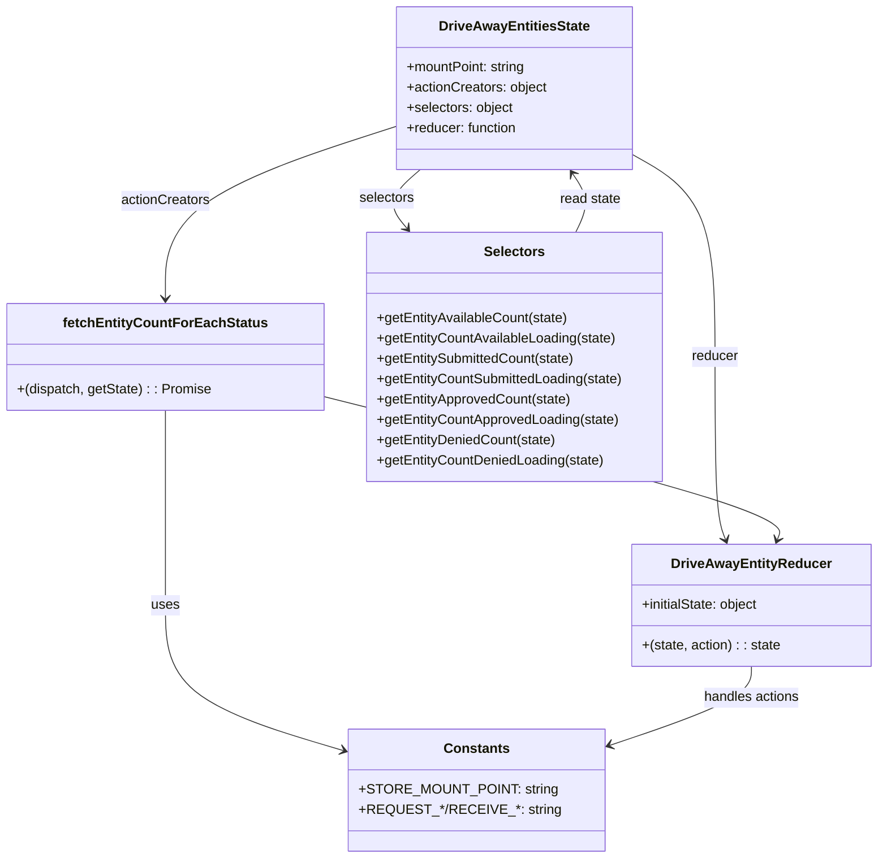

# Diagram: web/portal/src/pages/driveaway/redux/DriveAwayEntitiesState.js


> Auto-generated by Obscura crawlers

## Diagram 1



### SVG

<svg id="container" width="1027.78515625" xmlns="http://www.w3.org/2000/svg" class="classDiagram" height="1012" viewBox="0 0 1027.78515625 1012" role="graphics-document document" aria-roledescription="class"><style>#container{font-family:"trebuchet ms",verdana,arial,sans-serif;font-size:16px;fill:#333;}@keyframes edge-animation-frame{from{stroke-dashoffset:0;}}@keyframes dash{to{stroke-dashoffset:0;}}#container .edge-animation-slow{stroke-dasharray:9,5!important;stroke-dashoffset:900;animation:dash 50s linear infinite;stroke-linecap:round;}#container .edge-animation-fast{stroke-dasharray:9,5!important;stroke-dashoffset:900;animation:dash 20s linear infinite;stroke-linecap:round;}#container .error-icon{fill:#552222;}#container .error-text{fill:#552222;stroke:#552222;}#container .edge-thickness-normal{stroke-width:1px;}#container .edge-thickness-thick{stroke-width:3.5px;}#container .edge-pattern-solid{stroke-dasharray:0;}#container .edge-thickness-invisible{stroke-width:0;fill:none;}#container .edge-pattern-dashed{stroke-dasharray:3;}#container .edge-pattern-dotted{stroke-dasharray:2;}#container .marker{fill:#333333;stroke:#333333;}#container .marker.cross{stroke:#333333;}#container svg{font-family:"trebuchet ms",verdana,arial,sans-serif;font-size:16px;}#container p{margin:0;}#container g.classGroup text{fill:#9370DB;stroke:none;font-family:"trebuchet ms",verdana,arial,sans-serif;font-size:10px;}#container g.classGroup text .title{font-weight:bolder;}#container .nodeLabel,#container .edgeLabel{color:#131300;}#container .edgeLabel .label rect{fill:#ECECFF;}#container .label text{fill:#131300;}#container .labelBkg{background:#ECECFF;}#container .edgeLabel .label span{background:#ECECFF;}#container .classTitle{font-weight:bolder;}#container .node rect,#container .node circle,#container .node ellipse,#container .node polygon,#container .node path{fill:#ECECFF;stroke:#9370DB;stroke-width:1px;}#container .divider{stroke:#9370DB;stroke-width:1;}#container g.clickable{cursor:pointer;}#container g.classGroup rect{fill:#ECECFF;stroke:#9370DB;}#container g.classGroup line{stroke:#9370DB;stroke-width:1;}#container .classLabel .box{stroke:none;stroke-width:0;fill:#ECECFF;opacity:0.5;}#container .classLabel .label{fill:#9370DB;font-size:10px;}#container .relation{stroke:#333333;stroke-width:1;fill:none;}#container .dashed-line{stroke-dasharray:3;}#container .dotted-line{stroke-dasharray:1 2;}#container #compositionStart,#container .composition{fill:#333333!important;stroke:#333333!important;stroke-width:1;}#container #compositionEnd,#container .composition{fill:#333333!important;stroke:#333333!important;stroke-width:1;}#container #dependencyStart,#container .dependency{fill:#333333!important;stroke:#333333!important;stroke-width:1;}#container #dependencyStart,#container .dependency{fill:#333333!important;stroke:#333333!important;stroke-width:1;}#container #extensionStart,#container .extension{fill:transparent!important;stroke:#333333!important;stroke-width:1;}#container #extensionEnd,#container .extension{fill:transparent!important;stroke:#333333!important;stroke-width:1;}#container #aggregationStart,#container .aggregation{fill:transparent!important;stroke:#333333!important;stroke-width:1;}#container #aggregationEnd,#container .aggregation{fill:transparent!important;stroke:#333333!important;stroke-width:1;}#container #lollipopStart,#container .lollipop{fill:#ECECFF!important;stroke:#333333!important;stroke-width:1;}#container #lollipopEnd,#container .lollipop{fill:#ECECFF!important;stroke:#333333!important;stroke-width:1;}#container .edgeTerminals{font-size:11px;line-height:initial;}#container .classTitleText{text-anchor:middle;font-size:18px;fill:#333;}#container .label-icon{display:inline-block;height:1em;overflow:visible;vertical-align:-0.125em;}#container .node .label-icon path{fill:currentColor;stroke:revert;stroke-width:revert;}#container :root{--mermaid-font-family:"trebuchet ms",verdana,arial,sans-serif;}</style><g><defs><marker id="container_class-aggregationStart" class="marker aggregation class" refX="18" refY="7" markerWidth="190" markerHeight="240" orient="auto"><path d="M 18,7 L9,13 L1,7 L9,1 Z"></path></marker></defs><defs><marker id="container_class-aggregationEnd" class="marker aggregation class" refX="1" refY="7" markerWidth="20" markerHeight="28" orient="auto"><path d="M 18,7 L9,13 L1,7 L9,1 Z"></path></marker></defs><defs><marker id="container_class-extensionStart" class="marker extension class" refX="18" refY="7" markerWidth="190" markerHeight="240" orient="auto"><path d="M 1,7 L18,13 V 1 Z"></path></marker></defs><defs><marker id="container_class-extensionEnd" class="marker extension class" refX="1" refY="7" markerWidth="20" markerHeight="28" orient="auto"><path d="M 1,1 V 13 L18,7 Z"></path></marker></defs><defs><marker id="container_class-compositionStart" class="marker composition class" refX="18" refY="7" markerWidth="190" markerHeight="240" orient="auto"><path d="M 18,7 L9,13 L1,7 L9,1 Z"></path></marker></defs><defs><marker id="container_class-compositionEnd" class="marker composition class" refX="1" refY="7" markerWidth="20" markerHeight="28" orient="auto"><path d="M 18,7 L9,13 L1,7 L9,1 Z"></path></marker></defs><defs><marker id="container_class-dependencyStart" class="marker dependency class" refX="6" refY="7" markerWidth="190" markerHeight="240" orient="auto"><path d="M 5,7 L9,13 L1,7 L9,1 Z"></path></marker></defs><defs><marker id="container_class-dependencyEnd" class="marker dependency class" refX="13" refY="7" markerWidth="20" markerHeight="28" orient="auto"><path d="M 18,7 L9,13 L14,7 L9,1 Z"></path></marker></defs><defs><marker id="container_class-lollipopStart" class="marker lollipop class" refX="13" refY="7" markerWidth="190" markerHeight="240" orient="auto"><circle stroke="black" fill="transparent" cx="7" cy="7" r="6"></circle></marker></defs><defs><marker id="container_class-lollipopEnd" class="marker lollipop class" refX="1" refY="7" markerWidth="190" markerHeight="240" orient="auto"><circle stroke="black" fill="transparent" cx="7" cy="7" r="6"></circle></marker></defs><g class="root"><g class="clusters"></g><g class="edgePaths"><path d="M736.348,180.834L753.148,190.195C769.948,199.556,803.548,218.278,820.348,258.306C837.148,298.333,837.148,359.667,837.148,421C837.148,482.333,837.148,543.667,839.256,579.572C841.365,615.478,845.581,625.956,847.689,631.195L849.797,636.434" id="id_DriveAwayEntitiesState_DriveAwayEntityReducer_1" class="edge-thickness-normal edge-pattern-solid relation" style=";;;" data-edge="true" data-et="edge" data-id="id_DriveAwayEntitiesState_DriveAwayEntityReducer_1" data-points="W3sieCI6NzM2LjM0NzY1NjI1LCJ5IjoxODAuODM0MjM4ODYzNjE0MDV9LHsieCI6ODM3LjE0ODQzNzUsInkiOjIzN30seyJ4Ijo4MzcuMTQ4NDM3NSwieSI6NDIxfSx7IngiOjgzNy4xNDg0Mzc1LCJ5Ijo2MDV9LHsieCI6ODUyLjAzNjQ4MjIyNDc3MDcsInkiOjY0Mn1d" marker-end="url(#container_class-dependencyEnd)"></path><path d="M460.559,148.93L415.509,163.608C370.46,178.287,280.361,207.643,235.311,241.488C190.262,275.333,190.262,313.667,190.262,332.833L190.262,352" id="id_DriveAwayEntitiesState_fetchEntityCountForEachStatus_2" class="edge-thickness-normal edge-pattern-solid relation" style=";;;" data-edge="true" data-et="edge" data-id="id_DriveAwayEntitiesState_fetchEntityCountForEachStatus_2" data-points="W3sieCI6NDYwLjU1ODU5Mzc1LCJ5IjoxNDguOTI5ODM1MzA2Mjc2NzR9LHsieCI6MTkwLjI2MTcxODc1LCJ5IjoyMzd9LHsieCI6MTkwLjI2MTcxODc1LCJ5IjozNTh9XQ==" marker-end="url(#container_class-dependencyEnd)"></path><path d="M489.177,200L482.158,206.167C475.138,212.333,461.099,224.667,458.518,236.228C455.938,247.789,464.814,258.578,469.253,263.972L473.691,269.367" id="id_DriveAwayEntitiesState_Selectors_3" class="edge-thickness-normal edge-pattern-solid relation" style=";;;" data-edge="true" data-et="edge" data-id="id_DriveAwayEntitiesState_Selectors_3" data-points="W3sieCI6NDg5LjE3NzI3OTEzNTMzODQsInkiOjIwMH0seyJ4Ijo0NDcuMDYwNTQ2ODc1LCJ5IjoyMzd9LHsieCI6NDc3LjUwMzYxOTY1MDEzNTksInkiOjI3NH1d" marker-end="url(#container_class-dependencyEnd)"></path><path d="M190.262,484L190.262,504.167C190.262,524.333,190.262,564.667,190.262,603C190.262,641.333,190.262,677.667,190.262,714C190.262,750.333,190.262,786.667,227.551,815.899C264.84,845.132,339.418,867.263,376.707,878.329L413.996,889.395" id="id_fetchEntityCountForEachStatus_Constants_4" class="edge-thickness-normal edge-pattern-solid relation" style=";;;" data-edge="true" data-et="edge" data-id="id_fetchEntityCountForEachStatus_Constants_4" data-points="W3sieCI6MTkwLjI2MTcxODc1LCJ5Ijo0ODR9LHsieCI6MTkwLjI2MTcxODc1LCJ5Ijo2MDV9LHsieCI6MTkwLjI2MTcxODc1LCJ5Ijo3MTR9LHsieCI6MTkwLjI2MTcxODc1LCJ5Ijo4MjN9LHsieCI6NDE5Ljc0ODA0Njg3NSwieSI6ODkxLjEwMTg4ODIzNzIwMjJ9XQ==" marker-end="url(#container_class-dependencyEnd)"></path><path d="M881.008,786L881.008,792.167C881.008,798.333,881.008,810.667,851.018,826.94C821.027,843.213,761.047,863.427,731.057,873.533L701.067,883.64" id="id_DriveAwayEntityReducer_Constants_5" class="edge-thickness-normal edge-pattern-solid relation" style=";;;" data-edge="true" data-et="edge" data-id="id_DriveAwayEntityReducer_Constants_5" data-points="W3sieCI6ODgxLjAwNzgxMjUsInkiOjc4Nn0seyJ4Ijo4ODEuMDA3ODEyNSwieSI6ODIzfSx7IngiOjY5NS4zODA4NTkzNzUsInkiOjg4NS41NTYwNDY2ODk5NzU1fV0=" marker-end="url(#container_class-dependencyEnd)"></path><path d="M372.523,466.652L464.581,489.71C556.638,512.768,740.753,558.884,830.702,587.181C920.651,615.478,916.435,625.956,914.327,631.195L912.219,636.434" id="id_fetchEntityCountForEachStatus_DriveAwayEntityReducer_6" class="edge-thickness-normal edge-pattern-solid relation" style=";;;" data-edge="true" data-et="edge" data-id="id_fetchEntityCountForEachStatus_DriveAwayEntityReducer_6" data-points="W3sieCI6MzcyLjUyMzQzNzUsInkiOjQ2Ni42NTE5MjgzODQxNzczfSx7IngiOjkyNC44NjcxODc1LCJ5Ijo2MDV9LHsieCI6OTA5Ljk3OTE0Mjc3NTIyOTMsInkiOjY0Mn1d" marker-end="url(#container_class-dependencyEnd)"></path><path d="M671.257,274L674.311,267.833C677.365,261.667,683.474,249.333,682.868,237.825C682.262,226.317,674.942,215.633,671.282,210.291L667.622,204.95" id="id_Selectors_DriveAwayEntitiesState_7" class="edge-thickness-normal edge-pattern-solid relation" style=";;;" data-edge="true" data-et="edge" data-id="id_Selectors_DriveAwayEntitiesState_7" data-points="W3sieCI6NjcxLjI1NzE5Njg0MTAzMjYsInkiOjI3NH0seyJ4Ijo2ODkuNTgyMDMxMjUsInkiOjIzN30seyJ4Ijo2NjQuMjMwMzgwNjM5MDk3OCwieSI6MjAwfV0=" marker-end="url(#container_class-dependencyEnd)"></path></g><g class="edgeLabels"><g class="edgeLabel" transform="translate(837.1484375, 421)"><g class="label" data-id="id_DriveAwayEntitiesState_DriveAwayEntityReducer_1" transform="translate(-27.765625, -12)"><foreignObject width="55.53125" height="24"><div xmlns="http://www.w3.org/1999/xhtml" class="labelBkg" style="display: table-cell; white-space: nowrap; line-height: 1.5; max-width: 200px; text-align: center;"><span class="edgeLabel"><p>reducer</p></span></div></foreignObject></g></g><g class="edgeLabel" transform="translate(190.26171875, 237)"><g class="label" data-id="id_DriveAwayEntitiesState_fetchEntityCountForEachStatus_2" transform="translate(-52.671875, -12)"><foreignObject width="105.34375" height="24"><div xmlns="http://www.w3.org/1999/xhtml" class="labelBkg" style="display: table-cell; white-space: nowrap; line-height: 1.5; max-width: 200px; text-align: center;"><span class="edgeLabel"><p>actionCreators</p></span></div></foreignObject></g></g><g class="edgeLabel" transform="translate(450.12067, 234.31165)"><g class="label" data-id="id_DriveAwayEntitiesState_Selectors_3" transform="translate(-32.734375, -12)"><foreignObject width="65.46875" height="24"><div xmlns="http://www.w3.org/1999/xhtml" class="labelBkg" style="display: table-cell; white-space: nowrap; line-height: 1.5; max-width: 200px; text-align: center;"><span class="edgeLabel"><p>selectors</p></span></div></foreignObject></g></g><g class="edgeLabel" transform="translate(190.26171875, 714)"><g class="label" data-id="id_fetchEntityCountForEachStatus_Constants_4" transform="translate(-16.4921875, -12)"><foreignObject width="32.984375" height="24"><div xmlns="http://www.w3.org/1999/xhtml" class="labelBkg" style="display: table-cell; white-space: nowrap; line-height: 1.5; max-width: 200px; text-align: center;"><span class="edgeLabel"><p>uses</p></span></div></foreignObject></g></g><g class="edgeLabel" transform="translate(881.0078125, 823)"><g class="label" data-id="id_DriveAwayEntityReducer_Constants_5" transform="translate(-57.453125, -12)"><foreignObject width="114.90625" height="24"><div xmlns="http://www.w3.org/1999/xhtml" class="labelBkg" style="display: table-cell; white-space: nowrap; line-height: 1.5; max-width: 200px; text-align: center;"><span class="edgeLabel"><p>handles actions</p></span></div></foreignObject></g></g><g class="edgeLabel" transform="translate(668.03925, 540.67113)"><g class="label" data-id="id_fetchEntityCountForEachStatus_DriveAwayEntityReducer_6" transform="translate(-67.71875, -12)"><foreignObject width="135.4375" height="24"><div xmlns="http://www.w3.org/1999/xhtml" class="labelBkg" style="display: table-cell; white-space: nowrap; line-height: 1.5; max-width: 200px; text-align: center;"><span class="edgeLabel"><p>dispatches actions</p></span></div></foreignObject></g></g><g class="edgeLabel" transform="translate(688.57513, 235.53045)"><g class="label" data-id="id_Selectors_DriveAwayEntitiesState_7" transform="translate(-36.4375, -12)"><foreignObject width="72.875" height="24"><div xmlns="http://www.w3.org/1999/xhtml" class="labelBkg" style="display: table-cell; white-space: nowrap; line-height: 1.5; max-width: 200px; text-align: center;"><span class="edgeLabel"><p>read state</p></span></div></foreignObject></g></g></g><g class="nodes"><g class="node default" id="classId-DriveAwayEntitiesState-0" transform="translate(598.453125, 104)"><g class="basic label-container"><path d="M-137.89453125 -96 L137.89453125 -96 L137.89453125 96 L-137.89453125 96" stroke="none" stroke-width="0" fill="#ECECFF" style=""></path><path d="M-137.89453125 -96 C-51.48374332873428 -96, 34.927044592531445 -96, 137.89453125 -96 M-137.89453125 -96 C-50.190233356595684 -96, 37.51406453680863 -96, 137.89453125 -96 M137.89453125 -96 C137.89453125 -52.54721792648907, 137.89453125 -9.094435852978137, 137.89453125 96 M137.89453125 -96 C137.89453125 -41.807128668073666, 137.89453125 12.385742663852668, 137.89453125 96 M137.89453125 96 C47.51296849814317 96, -42.86859425371367 96, -137.89453125 96 M137.89453125 96 C64.48753297941013 96, -8.919465291179733 96, -137.89453125 96 M-137.89453125 96 C-137.89453125 25.508156396606665, -137.89453125 -44.98368720678667, -137.89453125 -96 M-137.89453125 96 C-137.89453125 33.31398922012079, -137.89453125 -29.372021559758423, -137.89453125 -96" stroke="#9370DB" stroke-width="1.3" fill="none" stroke-dasharray="0 0" style=""></path></g><g class="annotation-group text" transform="translate(0, -72)"></g><g class="label-group text" transform="translate(-85.1640625, -72)"><g class="label" style="font-weight: bolder" transform="translate(0,-12)"><foreignObject width="170.328125" height="24"><div xmlns="http://www.w3.org/1999/xhtml" style="display: table-cell; white-space: nowrap; line-height: 1.5; max-width: 216px; text-align: center;"><span class="nodeLabel markdown-node-label" style=""><p>DriveAwayEntitiesState</p></span></div></foreignObject></g></g><g class="members-group text" transform="translate(-125.89453125, -24)"><g class="label" style="" transform="translate(0,-12)"><foreignObject width="143.109375" height="24"><div xmlns="http://www.w3.org/1999/xhtml" style="display: table-cell; white-space: nowrap; line-height: 1.5; max-width: 201px; text-align: center;"><span class="nodeLabel markdown-node-label" style=""><p>+mountPoint: string</p></span></div></foreignObject></g><g class="label" style="" transform="translate(0,12)"><foreignObject width="166.625" height="24"><div xmlns="http://www.w3.org/1999/xhtml" style="display: table-cell; white-space: nowrap; line-height: 1.5; max-width: 224px; text-align: center;"><span class="nodeLabel markdown-node-label" style=""><p>+actionCreators: object</p></span></div></foreignObject></g><g class="label" style="" transform="translate(0,36)"><foreignObject width="127" height="24"><div xmlns="http://www.w3.org/1999/xhtml" style="display: table-cell; white-space: nowrap; line-height: 1.5; max-width: 185px; text-align: center;"><span class="nodeLabel markdown-node-label" style=""><p>+selectors: object</p></span></div></foreignObject></g><g class="label" style="" transform="translate(0,60)"><foreignObject width="132.453125" height="24"><div xmlns="http://www.w3.org/1999/xhtml" style="display: table-cell; white-space: nowrap; line-height: 1.5; max-width: 190px; text-align: center;"><span class="nodeLabel markdown-node-label" style=""><p>+reducer: function</p></span></div></foreignObject></g></g><g class="methods-group text" transform="translate(-125.89453125, 96)"></g><g class="divider" style=""><path d="M-137.89453125 -48 C-51.84965866141292 -48, 34.195213927174166 -48, 137.89453125 -48 M-137.89453125 -48 C-44.58173519323863 -48, 48.73106086352274 -48, 137.89453125 -48" stroke="#9370DB" stroke-width="1.3" fill="none" stroke-dasharray="0 0" style=""></path></g><g class="divider" style=""><path d="M-137.89453125 72 C-44.81732599026455 72, 48.2598792694709 72, 137.89453125 72 M-137.89453125 72 C-60.90134049901542 72, 16.091850251969163 72, 137.89453125 72" stroke="#9370DB" stroke-width="1.3" fill="none" stroke-dasharray="0 0" style=""></path></g></g><g class="node default" id="classId-DriveAwayEntityReducer-1" transform="translate(881.0078125, 714)"><g class="basic label-container"><path d="M-138.77734375 -72 L138.77734375 -72 L138.77734375 72 L-138.77734375 72" stroke="none" stroke-width="0" fill="#ECECFF" style=""></path><path d="M-138.77734375 -72 C-61.60188321542948 -72, 15.573577319141037 -72, 138.77734375 -72 M-138.77734375 -72 C-30.221143742518535 -72, 78.33505626496293 -72, 138.77734375 -72 M138.77734375 -72 C138.77734375 -20.404285606389422, 138.77734375 31.191428787221156, 138.77734375 72 M138.77734375 -72 C138.77734375 -24.653505140193133, 138.77734375 22.692989719613735, 138.77734375 72 M138.77734375 72 C55.65459097534412 72, -27.46816179931176 72, -138.77734375 72 M138.77734375 72 C42.30612536727294 72, -54.16509301545412 72, -138.77734375 72 M-138.77734375 72 C-138.77734375 31.569650941600543, -138.77734375 -8.860698116798915, -138.77734375 -72 M-138.77734375 72 C-138.77734375 28.047603272430507, -138.77734375 -15.904793455138986, -138.77734375 -72" stroke="#9370DB" stroke-width="1.3" fill="none" stroke-dasharray="0 0" style=""></path></g><g class="annotation-group text" transform="translate(0, -48)"></g><g class="label-group text" transform="translate(-89.3203125, -48)"><g class="label" style="font-weight: bolder" transform="translate(0,-12)"><foreignObject width="178.640625" height="24"><div xmlns="http://www.w3.org/1999/xhtml" style="display: table-cell; white-space: nowrap; line-height: 1.5; max-width: 226px; text-align: center;"><span class="nodeLabel markdown-node-label" style=""><p>DriveAwayEntityReducer</p></span></div></foreignObject></g></g><g class="members-group text" transform="translate(-126.77734375, 0)"><g class="label" style="" transform="translate(0,-12)"><foreignObject width="140.8125" height="24"><div xmlns="http://www.w3.org/1999/xhtml" style="display: table-cell; white-space: nowrap; line-height: 1.5; max-width: 198px; text-align: center;"><span class="nodeLabel markdown-node-label" style=""><p>+initialState: object</p></span></div></foreignObject></g></g><g class="methods-group text" transform="translate(-126.77734375, 48)"><g class="label" style="" transform="translate(0,-12)"><foreignObject width="164.234375" height="24"><div xmlns="http://www.w3.org/1999/xhtml" style="display: table-cell; white-space: nowrap; line-height: 1.5; max-width: 214px; text-align: center;"><span class="nodeLabel markdown-node-label" style=""><p>+(state, action) : : state</p></span></div></foreignObject></g></g><g class="divider" style=""><path d="M-138.77734375 -24 C-79.87152398974376 -24, -20.965704229487514 -24, 138.77734375 -24 M-138.77734375 -24 C-29.687662210067927 -24, 79.40201932986415 -24, 138.77734375 -24" stroke="#9370DB" stroke-width="1.3" fill="none" stroke-dasharray="0 0" style=""></path></g><g class="divider" style=""><path d="M-138.77734375 24 C-51.617059343558836 24, 35.54322506288233 24, 138.77734375 24 M-138.77734375 24 C-40.54139249830531 24, 57.69455875338937 24, 138.77734375 24" stroke="#9370DB" stroke-width="1.3" fill="none" stroke-dasharray="0 0" style=""></path></g></g><g class="node default" id="classId-fetchEntityCountForEachStatus-2" transform="translate(190.26171875, 421)"><g class="basic label-container"><path d="M-182.26171875 -63 L182.26171875 -63 L182.26171875 63 L-182.26171875 63" stroke="none" stroke-width="0" fill="#ECECFF" style=""></path><path d="M-182.26171875 -63 C-104.77461971599143 -63, -27.28752068198287 -63, 182.26171875 -63 M-182.26171875 -63 C-37.639494445231776 -63, 106.98272985953645 -63, 182.26171875 -63 M182.26171875 -63 C182.26171875 -25.270981963296187, 182.26171875 12.458036073407627, 182.26171875 63 M182.26171875 -63 C182.26171875 -21.8978368356898, 182.26171875 19.204326328620397, 182.26171875 63 M182.26171875 63 C81.1086680239852 63, -20.044382702029594 63, -182.26171875 63 M182.26171875 63 C86.90935877839935 63, -8.443001193201297 63, -182.26171875 63 M-182.26171875 63 C-182.26171875 32.14689252803693, -182.26171875 1.293785056073851, -182.26171875 -63 M-182.26171875 63 C-182.26171875 32.9435342002556, -182.26171875 2.887068400511204, -182.26171875 -63" stroke="#9370DB" stroke-width="1.3" fill="none" stroke-dasharray="0 0" style=""></path></g><g class="annotation-group text" transform="translate(0, -39)"></g><g class="label-group text" transform="translate(-113.1796875, -39)"><g class="label" style="font-weight: bolder" transform="translate(0,-12)"><foreignObject width="226.359375" height="24"><div xmlns="http://www.w3.org/1999/xhtml" style="display: table-cell; white-space: nowrap; line-height: 1.5; max-width: 273px; text-align: center;"><span class="nodeLabel markdown-node-label" style=""><p>fetchEntityCountForEachStatus</p></span></div></foreignObject></g></g><g class="members-group text" transform="translate(-170.26171875, 9)"></g><g class="methods-group text" transform="translate(-170.26171875, 39)"><g class="label" style="" transform="translate(0,-12)"><foreignObject width="227.34375" height="24"><div xmlns="http://www.w3.org/1999/xhtml" style="display: table-cell; white-space: nowrap; line-height: 1.5; max-width: 277px; text-align: center;"><span class="nodeLabel markdown-node-label" style=""><p>+(dispatch, getState) : : Promise</p></span></div></foreignObject></g></g><g class="divider" style=""><path d="M-182.26171875 -15 C-56.75476360523386 -15, 68.75219153953228 -15, 182.26171875 -15 M-182.26171875 -15 C-78.66271686387007 -15, 24.936285022259852 -15, 182.26171875 -15" stroke="#9370DB" stroke-width="1.3" fill="none" stroke-dasharray="0 0" style=""></path></g><g class="divider" style=""><path d="M-182.26171875 9 C-41.167462330482266 9, 99.92679408903547 9, 182.26171875 9 M-182.26171875 9 C-83.57082468232255 9, 15.120069385354896 9, 182.26171875 9" stroke="#9370DB" stroke-width="1.3" fill="none" stroke-dasharray="0 0" style=""></path></g></g><g class="node default" id="classId-Selectors-3" transform="translate(598.453125, 421)"><g class="basic label-container"><path d="M-175.9296875 -147 L175.9296875 -147 L175.9296875 147 L-175.9296875 147" stroke="none" stroke-width="0" fill="#ECECFF" style=""></path><path d="M-175.9296875 -147 C-44.64407186178843 -147, 86.64154377642313 -147, 175.9296875 -147 M-175.9296875 -147 C-97.63834945571892 -147, -19.347011411437848 -147, 175.9296875 -147 M175.9296875 -147 C175.9296875 -60.01278024551772, 175.9296875 26.974439508964565, 175.9296875 147 M175.9296875 -147 C175.9296875 -34.22722581619601, 175.9296875 78.54554836760798, 175.9296875 147 M175.9296875 147 C57.08578286913121 147, -61.758121761737584 147, -175.9296875 147 M175.9296875 147 C53.540066420001835 147, -68.84955465999633 147, -175.9296875 147 M-175.9296875 147 C-175.9296875 74.39219598115078, -175.9296875 1.7843919623015552, -175.9296875 -147 M-175.9296875 147 C-175.9296875 70.96364639073552, -175.9296875 -5.0727072185289614, -175.9296875 -147" stroke="#9370DB" stroke-width="1.3" fill="none" stroke-dasharray="0 0" style=""></path></g><g class="annotation-group text" transform="translate(0, -123)"></g><g class="label-group text" transform="translate(-34.171875, -123)"><g class="label" style="font-weight: bolder" transform="translate(0,-12)"><foreignObject width="68.34375" height="24"><div xmlns="http://www.w3.org/1999/xhtml" style="display: table-cell; white-space: nowrap; line-height: 1.5; max-width: 117px; text-align: center;"><span class="nodeLabel markdown-node-label" style=""><p>Selectors</p></span></div></foreignObject></g></g><g class="members-group text" transform="translate(-163.9296875, -75)"></g><g class="methods-group text" transform="translate(-163.9296875, -45)"><g class="label" style="" transform="translate(0,-12)"><foreignObject width="227.234375" height="24"><div xmlns="http://www.w3.org/1999/xhtml" style="display: table-cell; white-space: nowrap; line-height: 1.5; max-width: 285px; text-align: center;"><span class="nodeLabel markdown-node-label" style=""><p>+getEntityAvailableCount(state)</p></span></div></foreignObject></g><g class="label" style="" transform="translate(0,12)"><foreignObject width="284.46875" height="24"><div xmlns="http://www.w3.org/1999/xhtml" style="display: table-cell; white-space: nowrap; line-height: 1.5; max-width: 342px; text-align: center;"><span class="nodeLabel markdown-node-label" style=""><p>+getEntityCountAvailableLoading(state)</p></span></div></foreignObject></g><g class="label" style="" transform="translate(0,36)"><foreignObject width="236.453125" height="24"><div xmlns="http://www.w3.org/1999/xhtml" style="display: table-cell; white-space: nowrap; line-height: 1.5; max-width: 294px; text-align: center;"><span class="nodeLabel markdown-node-label" style=""><p>+getEntitySubmittedCount(state)</p></span></div></foreignObject></g><g class="label" style="" transform="translate(0,60)"><foreignObject width="293.6875" height="24"><div xmlns="http://www.w3.org/1999/xhtml" style="display: table-cell; white-space: nowrap; line-height: 1.5; max-width: 351px; text-align: center;"><span class="nodeLabel markdown-node-label" style=""><p>+getEntityCountSubmittedLoading(state)</p></span></div></foreignObject></g><g class="label" style="" transform="translate(0,84)"><foreignObject width="230.34375" height="24"><div xmlns="http://www.w3.org/1999/xhtml" style="display: table-cell; white-space: nowrap; line-height: 1.5; max-width: 288px; text-align: center;"><span class="nodeLabel markdown-node-label" style=""><p>+getEntityApprovedCount(state)</p></span></div></foreignObject></g><g class="label" style="" transform="translate(0,108)"><foreignObject width="287.578125" height="24"><div xmlns="http://www.w3.org/1999/xhtml" style="display: table-cell; white-space: nowrap; line-height: 1.5; max-width: 345px; text-align: center;"><span class="nodeLabel markdown-node-label" style=""><p>+getEntityCountApprovedLoading(state)</p></span></div></foreignObject></g><g class="label" style="" transform="translate(0,132)"><foreignObject width="212.296875" height="24"><div xmlns="http://www.w3.org/1999/xhtml" style="display: table-cell; white-space: nowrap; line-height: 1.5; max-width: 270px; text-align: center;"><span class="nodeLabel markdown-node-label" style=""><p>+getEntityDeniedCount(state)</p></span></div></foreignObject></g><g class="label" style="" transform="translate(0,156)"><foreignObject width="269.53125" height="24"><div xmlns="http://www.w3.org/1999/xhtml" style="display: table-cell; white-space: nowrap; line-height: 1.5; max-width: 327px; text-align: center;"><span class="nodeLabel markdown-node-label" style=""><p>+getEntityCountDeniedLoading(state)</p></span></div></foreignObject></g></g><g class="divider" style=""><path d="M-175.9296875 -99 C-97.61049333772279 -99, -19.291299175445573 -99, 175.9296875 -99 M-175.9296875 -99 C-53.7942619003945 -99, 68.341163699211 -99, 175.9296875 -99" stroke="#9370DB" stroke-width="1.3" fill="none" stroke-dasharray="0 0" style=""></path></g><g class="divider" style=""><path d="M-175.9296875 -75 C-76.76743095575007 -75, 22.394825588499856 -75, 175.9296875 -75 M-175.9296875 -75 C-80.9086539773736 -75, 14.112379545252793 -75, 175.9296875 -75" stroke="#9370DB" stroke-width="1.3" fill="none" stroke-dasharray="0 0" style=""></path></g></g><g class="node default" id="classId-Constants-4" transform="translate(557.564453125, 932)"><g class="basic label-container"><path d="M-137.81640625 -72 L137.81640625 -72 L137.81640625 72 L-137.81640625 72" stroke="none" stroke-width="0" fill="#ECECFF" style=""></path><path d="M-137.81640625 -72 C-79.17689388899436 -72, -20.5373815279887 -72, 137.81640625 -72 M-137.81640625 -72 C-68.77682800611969 -72, 0.26275023776062767 -72, 137.81640625 -72 M137.81640625 -72 C137.81640625 -38.09607785168872, 137.81640625 -4.192155703377438, 137.81640625 72 M137.81640625 -72 C137.81640625 -19.48876666520414, 137.81640625 33.02246666959172, 137.81640625 72 M137.81640625 72 C32.48575115343755 72, -72.8449039431249 72, -137.81640625 72 M137.81640625 72 C64.58291787395173 72, -8.650570502096542 72, -137.81640625 72 M-137.81640625 72 C-137.81640625 25.396751674676494, -137.81640625 -21.20649665064701, -137.81640625 -72 M-137.81640625 72 C-137.81640625 42.03213884037162, -137.81640625 12.064277680743245, -137.81640625 -72" stroke="#9370DB" stroke-width="1.3" fill="none" stroke-dasharray="0 0" style=""></path></g><g class="annotation-group text" transform="translate(0, -48)"></g><g class="label-group text" transform="translate(-36.5390625, -48)"><g class="label" style="font-weight: bolder" transform="translate(0,-12)"><foreignObject width="73.078125" height="24"><div xmlns="http://www.w3.org/1999/xhtml" style="display: table-cell; white-space: nowrap; line-height: 1.5; max-width: 122px; text-align: center;"><span class="nodeLabel markdown-node-label" style=""><p>Constants</p></span></div></foreignObject></g></g><g class="members-group text" transform="translate(-125.81640625, 0)"><g class="label" style="" transform="translate(0,-12)"><foreignObject width="215.09375" height="24"><div xmlns="http://www.w3.org/1999/xhtml" style="display: table-cell; white-space: nowrap; line-height: 1.5; max-width: 273px; text-align: center;"><span class="nodeLabel markdown-node-label" style=""><p>+STORE_MOUNT_POINT: string</p></span></div></foreignObject></g><g class="label" style="" transform="translate(0,12)"><foreignObject width="213.90625" height="24"><div xmlns="http://www.w3.org/1999/xhtml" style="display: table-cell; white-space: nowrap; line-height: 1.5; max-width: 272px; text-align: center;"><span class="nodeLabel markdown-node-label" style=""><p>+REQUEST_*/RECEIVE_*: string</p></span></div></foreignObject></g></g><g class="methods-group text" transform="translate(-125.81640625, 72)"></g><g class="divider" style=""><path d="M-137.81640625 -24 C-55.47116467374512 -24, 26.874076902509756 -24, 137.81640625 -24 M-137.81640625 -24 C-36.492202243836545 -24, 64.83200176232691 -24, 137.81640625 -24" stroke="#9370DB" stroke-width="1.3" fill="none" stroke-dasharray="0 0" style=""></path></g><g class="divider" style=""><path d="M-137.81640625 48 C-28.053310496883284 48, 81.70978525623343 48, 137.81640625 48 M-137.81640625 48 C-42.497844107969186 48, 52.82071803406163 48, 137.81640625 48" stroke="#9370DB" stroke-width="1.3" fill="none" stroke-dasharray="0 0" style=""></path></g></g></g></g></g></svg>

## Diagram 2

```mermaid
flowchart TD
    A[fetchEntityCountForEachStatus] --> B[getState()]
    B --> C[getSolutionId(state)]
    B --> D[isShipper(state.organizations.activeOrganization)]
    C & D --> E{solutionId && isShipperRole}
    E -->|true| F[getEntitySolutionUrl(solutionId)]
    E -->|false| G[getEntityInternalUrl()]
    F --> H[create config headers (Accept, x-time-zone)]
    G --> H
    H --> I[dispatch REQUEST_* actions]
    I --> J[axios.get(countUrl, config)]
    J --> K{Promise.all resolves}
    K -->|success| L[dispatch RECEIVE_* with responses[0].data.data.*]
    K -->|error| M[catch -> console.log(err)]
    L --> N[store counts in reducer state]
    M --> N
```

> SVG rendering failed for this diagram.
