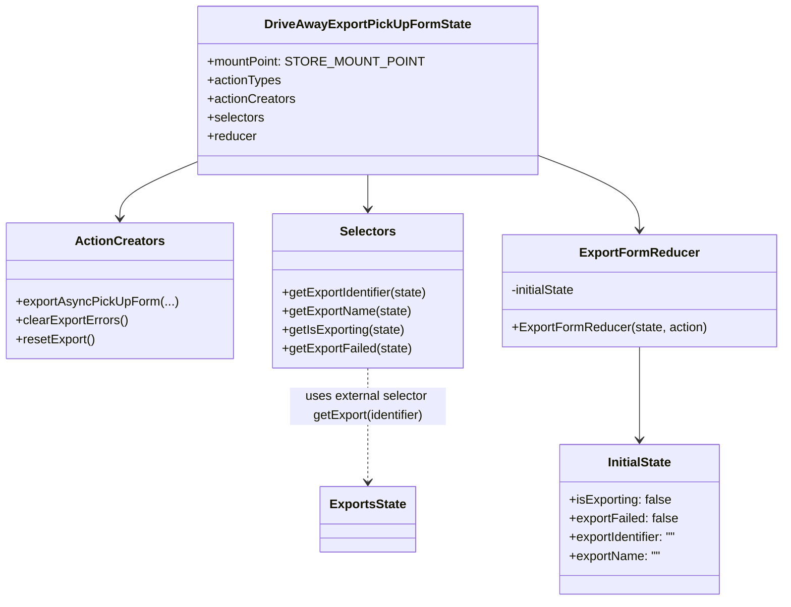

# Diagram: web/portal/src/pages/driveaway/redux/DriveAwayExportPickUpFormState.js


> Auto-generated by Obscura crawlers

## Diagram 1

```mermaid
flowchart LR
  A[exportAsyncPickUpForm(approvalId, solutionId, locale, fileName)] --> B[build baseUrl & queryParams]
  B --> C[axios.get(url, axiosConfig) : fetchRequest]
  A --> D[dispatch EXPORT_REQUEST]
  C -->|then response| E[dispatch EXPORT_IDENTIFIER_RECEIVED(identifier, exportName)]
  E --> F[dispatch EXPORT_SEARCH_SUCCEEDED]
  C -->|catch error| G[dispatch EXPORT_SEARCH_FAILED]
  H[clearExportErrors()] --> I[dispatch CLEAR_EXPORT_ERRORS]
  J[resetExport()] --> K[dispatch RESET_EXPORT]
  L[Reducers] --> M[ExportFormReducer]
  M --> N{action.type}
  N -->|RESET_EXPORT| O[reset to initialState values]
  N -->|EXPORT_REQUEST| P[isExporting = true, exportFailed = false]
  N -->|EXPORT_IDENTIFIER_RECEIVED| Q[set exportIdentifier, exportName, isExporting = false]
  N -->|EXPORT_SEARCH_FAILED| R[isExporting=false, exportFailed=true, clear names]
  N -->|CLEAR_EXPORT_ERRORS| S[exportFailed=false]
```

> SVG rendering failed for this diagram.

## Diagram 2



### SVG

<svg id="container" width="994.4453125" xmlns="http://www.w3.org/2000/svg" class="classDiagram" height="770" viewBox="0 0 994.4453125 770" role="graphics-document document" aria-roledescription="class"><style>#container{font-family:"trebuchet ms",verdana,arial,sans-serif;font-size:16px;fill:#333;}@keyframes edge-animation-frame{from{stroke-dashoffset:0;}}@keyframes dash{to{stroke-dashoffset:0;}}#container .edge-animation-slow{stroke-dasharray:9,5!important;stroke-dashoffset:900;animation:dash 50s linear infinite;stroke-linecap:round;}#container .edge-animation-fast{stroke-dasharray:9,5!important;stroke-dashoffset:900;animation:dash 20s linear infinite;stroke-linecap:round;}#container .error-icon{fill:#552222;}#container .error-text{fill:#552222;stroke:#552222;}#container .edge-thickness-normal{stroke-width:1px;}#container .edge-thickness-thick{stroke-width:3.5px;}#container .edge-pattern-solid{stroke-dasharray:0;}#container .edge-thickness-invisible{stroke-width:0;fill:none;}#container .edge-pattern-dashed{stroke-dasharray:3;}#container .edge-pattern-dotted{stroke-dasharray:2;}#container .marker{fill:#333333;stroke:#333333;}#container .marker.cross{stroke:#333333;}#container svg{font-family:"trebuchet ms",verdana,arial,sans-serif;font-size:16px;}#container p{margin:0;}#container g.classGroup text{fill:#9370DB;stroke:none;font-family:"trebuchet ms",verdana,arial,sans-serif;font-size:10px;}#container g.classGroup text .title{font-weight:bolder;}#container .nodeLabel,#container .edgeLabel{color:#131300;}#container .edgeLabel .label rect{fill:#ECECFF;}#container .label text{fill:#131300;}#container .labelBkg{background:#ECECFF;}#container .edgeLabel .label span{background:#ECECFF;}#container .classTitle{font-weight:bolder;}#container .node rect,#container .node circle,#container .node ellipse,#container .node polygon,#container .node path{fill:#ECECFF;stroke:#9370DB;stroke-width:1px;}#container .divider{stroke:#9370DB;stroke-width:1;}#container g.clickable{cursor:pointer;}#container g.classGroup rect{fill:#ECECFF;stroke:#9370DB;}#container g.classGroup line{stroke:#9370DB;stroke-width:1;}#container .classLabel .box{stroke:none;stroke-width:0;fill:#ECECFF;opacity:0.5;}#container .classLabel .label{fill:#9370DB;font-size:10px;}#container .relation{stroke:#333333;stroke-width:1;fill:none;}#container .dashed-line{stroke-dasharray:3;}#container .dotted-line{stroke-dasharray:1 2;}#container #compositionStart,#container .composition{fill:#333333!important;stroke:#333333!important;stroke-width:1;}#container #compositionEnd,#container .composition{fill:#333333!important;stroke:#333333!important;stroke-width:1;}#container #dependencyStart,#container .dependency{fill:#333333!important;stroke:#333333!important;stroke-width:1;}#container #dependencyStart,#container .dependency{fill:#333333!important;stroke:#333333!important;stroke-width:1;}#container #extensionStart,#container .extension{fill:transparent!important;stroke:#333333!important;stroke-width:1;}#container #extensionEnd,#container .extension{fill:transparent!important;stroke:#333333!important;stroke-width:1;}#container #aggregationStart,#container .aggregation{fill:transparent!important;stroke:#333333!important;stroke-width:1;}#container #aggregationEnd,#container .aggregation{fill:transparent!important;stroke:#333333!important;stroke-width:1;}#container #lollipopStart,#container .lollipop{fill:#ECECFF!important;stroke:#333333!important;stroke-width:1;}#container #lollipopEnd,#container .lollipop{fill:#ECECFF!important;stroke:#333333!important;stroke-width:1;}#container .edgeTerminals{font-size:11px;line-height:initial;}#container .classTitleText{text-anchor:middle;font-size:18px;fill:#333;}#container .label-icon{display:inline-block;height:1em;overflow:visible;vertical-align:-0.125em;}#container .node .label-icon path{fill:currentColor;stroke:revert;stroke-width:revert;}#container :root{--mermaid-font-family:"trebuchet ms",verdana,arial,sans-serif;}</style><g><defs><marker id="container_class-aggregationStart" class="marker aggregation class" refX="18" refY="7" markerWidth="190" markerHeight="240" orient="auto"><path d="M 18,7 L9,13 L1,7 L9,1 Z"></path></marker></defs><defs><marker id="container_class-aggregationEnd" class="marker aggregation class" refX="1" refY="7" markerWidth="20" markerHeight="28" orient="auto"><path d="M 18,7 L9,13 L1,7 L9,1 Z"></path></marker></defs><defs><marker id="container_class-extensionStart" class="marker extension class" refX="18" refY="7" markerWidth="190" markerHeight="240" orient="auto"><path d="M 1,7 L18,13 V 1 Z"></path></marker></defs><defs><marker id="container_class-extensionEnd" class="marker extension class" refX="1" refY="7" markerWidth="20" markerHeight="28" orient="auto"><path d="M 1,1 V 13 L18,7 Z"></path></marker></defs><defs><marker id="container_class-compositionStart" class="marker composition class" refX="18" refY="7" markerWidth="190" markerHeight="240" orient="auto"><path d="M 18,7 L9,13 L1,7 L9,1 Z"></path></marker></defs><defs><marker id="container_class-compositionEnd" class="marker composition class" refX="1" refY="7" markerWidth="20" markerHeight="28" orient="auto"><path d="M 18,7 L9,13 L1,7 L9,1 Z"></path></marker></defs><defs><marker id="container_class-dependencyStart" class="marker dependency class" refX="6" refY="7" markerWidth="190" markerHeight="240" orient="auto"><path d="M 5,7 L9,13 L1,7 L9,1 Z"></path></marker></defs><defs><marker id="container_class-dependencyEnd" class="marker dependency class" refX="13" refY="7" markerWidth="20" markerHeight="28" orient="auto"><path d="M 18,7 L9,13 L14,7 L9,1 Z"></path></marker></defs><defs><marker id="container_class-lollipopStart" class="marker lollipop class" refX="13" refY="7" markerWidth="190" markerHeight="240" orient="auto"><circle stroke="black" fill="transparent" cx="7" cy="7" r="6"></circle></marker></defs><defs><marker id="container_class-lollipopEnd" class="marker lollipop class" refX="1" refY="7" markerWidth="190" markerHeight="240" orient="auto"><circle stroke="black" fill="transparent" cx="7" cy="7" r="6"></circle></marker></defs><g class="root"><g class="clusters"></g><g class="edgePaths"><path d="M260.453,202.169L241.921,209.974C223.388,217.78,186.323,233.39,167.79,246.362C149.258,259.333,149.258,269.667,149.258,274.833L149.258,280" id="id_DriveAwayExportPickUpFormState_ActionCreators_1" class="edge-thickness-normal edge-pattern-solid relation" style=";;;" data-edge="true" data-et="edge" data-id="id_DriveAwayExportPickUpFormState_ActionCreators_1" data-points="W3sieCI6MjYwLjQ1MzEyNSwieSI6MjAyLjE2OTMzODQ3OTA0NjA4fSx7IngiOjE0OS4yNTc4MTI1LCJ5IjoyNDl9LHsieCI6MTQ5LjI1NzgxMjUsInkiOjI4Nn1d" marker-end="url(#container_class-dependencyEnd)"></path><path d="M465.055,224L465.055,228.167C465.055,232.333,465.055,240.667,465.055,248C465.055,255.333,465.055,261.667,465.055,264.833L465.055,268" id="id_DriveAwayExportPickUpFormState_Selectors_2" class="edge-thickness-normal edge-pattern-solid relation" style=";;;" data-edge="true" data-et="edge" data-id="id_DriveAwayExportPickUpFormState_Selectors_2" data-points="W3sieCI6NDY1LjA1NDY4NzUsInkiOjIyNH0seyJ4Ijo0NjUuMDU0Njg3NSwieSI6MjQ5fSx7IngiOjQ2NS4wNTQ2ODc1LCJ5IjoyNzR9XQ==" marker-end="url(#container_class-dependencyEnd)"></path><path d="M669.656,194.203L693.55,203.336C717.444,212.469,765.232,230.734,789.126,247.534C813.02,264.333,813.02,279.667,813.02,287.333L813.02,295" id="id_DriveAwayExportPickUpFormState_ExportFormReducer_3" class="edge-thickness-normal edge-pattern-solid relation" style=";;;" data-edge="true" data-et="edge" data-id="id_DriveAwayExportPickUpFormState_ExportFormReducer_3" data-points="W3sieCI6NjY5LjY1NjI1LCJ5IjoxOTQuMjAzMzI1MTM4MzYwMzN9LHsieCI6ODEzLjAxOTUzMTI1LCJ5IjoyNDl9LHsieCI6ODEzLjAxOTUzMTI1LCJ5IjozMDF9XQ==" marker-end="url(#container_class-dependencyEnd)"></path><path d="M813.02,445L813.02,457.667C813.02,470.333,813.02,495.667,813.02,515.5C813.02,535.333,813.02,549.667,813.02,556.833L813.02,564" id="id_ExportFormReducer_InitialState_4" class="edge-thickness-normal edge-pattern-solid relation" style=";;;" data-edge="true" data-et="edge" data-id="id_ExportFormReducer_InitialState_4" data-points="W3sieCI6ODEzLjAxOTUzMTI1LCJ5Ijo0NDV9LHsieCI6ODEzLjAxOTUzMTI1LCJ5Ijo1MjF9LHsieCI6ODEzLjAxOTUzMTI1LCJ5Ijo1NzB9XQ==" marker-end="url(#container_class-dependencyEnd)"></path><path d="M465.055,472L465.055,480.167C465.055,488.333,465.055,504.667,465.055,529C465.055,553.333,465.055,585.667,465.055,601.833L465.055,618" id="id_Selectors_ExportsState_5" class="edge-thickness-normal edge-pattern-dashed relation" style=";;;" data-edge="true" data-et="edge" data-id="id_Selectors_ExportsState_5" data-points="W3sieCI6NDY1LjA1NDY4NzUsInkiOjQ3Mn0seyJ4Ijo0NjUuMDU0Njg3NSwieSI6NTIxfSx7IngiOjQ2NS4wNTQ2ODc1LCJ5Ijo2MjR9XQ==" marker-end="url(#container_class-dependencyEnd)"></path></g><g class="edgeLabels"><g class="edgeLabel"><g class="label" data-id="id_DriveAwayExportPickUpFormState_ActionCreators_1" transform="translate(0, 0)"><foreignObject width="0" height="0"><div xmlns="http://www.w3.org/1999/xhtml" class="labelBkg" style="display: table-cell; white-space: nowrap; line-height: 1.5; max-width: 200px; text-align: center;"><span class="edgeLabel"></span></div></foreignObject></g></g><g class="edgeLabel"><g class="label" data-id="id_DriveAwayExportPickUpFormState_Selectors_2" transform="translate(0, 0)"><foreignObject width="0" height="0"><div xmlns="http://www.w3.org/1999/xhtml" class="labelBkg" style="display: table-cell; white-space: nowrap; line-height: 1.5; max-width: 200px; text-align: center;"><span class="edgeLabel"></span></div></foreignObject></g></g><g class="edgeLabel"><g class="label" data-id="id_DriveAwayExportPickUpFormState_ExportFormReducer_3" transform="translate(0, 0)"><foreignObject width="0" height="0"><div xmlns="http://www.w3.org/1999/xhtml" class="labelBkg" style="display: table-cell; white-space: nowrap; line-height: 1.5; max-width: 200px; text-align: center;"><span class="edgeLabel"></span></div></foreignObject></g></g><g class="edgeLabel"><g class="label" data-id="id_ExportFormReducer_InitialState_4" transform="translate(0, 0)"><foreignObject width="0" height="0"><div xmlns="http://www.w3.org/1999/xhtml" class="labelBkg" style="display: table-cell; white-space: nowrap; line-height: 1.5; max-width: 200px; text-align: center;"><span class="edgeLabel"></span></div></foreignObject></g></g><g class="edgeLabel" transform="translate(465.0546875, 521)"><g class="label" data-id="id_Selectors_ExportsState_5" transform="translate(-100, -24)"><foreignObject width="200" height="48"><div xmlns="http://www.w3.org/1999/xhtml" class="labelBkg" style="display: table; white-space: break-spaces; line-height: 1.5; max-width: 200px; text-align: center; width: 200px;"><span class="edgeLabel"><p>uses external selector getExport(identifier)</p></span></div></foreignObject></g></g></g><g class="nodes"><g class="node default" id="classId-DriveAwayExportPickUpFormState-0" transform="translate(465.0546875, 116)"><g class="basic label-container"><path d="M-204.6015625 -108 L204.6015625 -108 L204.6015625 108 L-204.6015625 108" stroke="none" stroke-width="0" fill="#ECECFF" style=""></path><path d="M-204.6015625 -108 C-78.45643495217283 -108, 47.688692595654345 -108, 204.6015625 -108 M-204.6015625 -108 C-70.67116235815922 -108, 63.259237783681556 -108, 204.6015625 -108 M204.6015625 -108 C204.6015625 -55.335098265202525, 204.6015625 -2.6701965304050503, 204.6015625 108 M204.6015625 -108 C204.6015625 -40.18786549650986, 204.6015625 27.624269006980285, 204.6015625 108 M204.6015625 108 C113.88763927673867 108, 23.173716053477335 108, -204.6015625 108 M204.6015625 108 C50.19068734891289 108, -104.22018780217422 108, -204.6015625 108 M-204.6015625 108 C-204.6015625 44.48503435629509, -204.6015625 -19.029931287409823, -204.6015625 -108 M-204.6015625 108 C-204.6015625 25.19559307444257, -204.6015625 -57.60881385111486, -204.6015625 -108" stroke="#9370DB" stroke-width="1.3" fill="none" stroke-dasharray="0 0" style=""></path></g><g class="annotation-group text" transform="translate(0, -84)"></g><g class="label-group text" transform="translate(-125.046875, -84)"><g class="label" style="font-weight: bolder" transform="translate(0,-12)"><foreignObject width="250.09375" height="24"><div xmlns="http://www.w3.org/1999/xhtml" style="display: table-cell; white-space: nowrap; line-height: 1.5; max-width: 295px; text-align: center;"><span class="nodeLabel markdown-node-label" style=""><p>DriveAwayExportPickUpFormState</p></span></div></foreignObject></g></g><g class="members-group text" transform="translate(-192.6015625, -36)"><g class="label" style="" transform="translate(0,-12)"><foreignObject width="260.15625" height="24"><div xmlns="http://www.w3.org/1999/xhtml" style="display: table-cell; white-space: nowrap; line-height: 1.5; max-width: 318px; text-align: center;"><span class="nodeLabel markdown-node-label" style=""><p>+mountPoint: STORE_MOUNT_POINT</p></span></div></foreignObject></g><g class="label" style="" transform="translate(0,12)"><foreignObject width="94.3125" height="24"><div xmlns="http://www.w3.org/1999/xhtml" style="display: table-cell; white-space: nowrap; line-height: 1.5; max-width: 152px; text-align: center;"><span class="nodeLabel markdown-node-label" style=""><p>+actionTypes</p></span></div></foreignObject></g><g class="label" style="" transform="translate(0,36)"><foreignObject width="113.078125" height="24"><div xmlns="http://www.w3.org/1999/xhtml" style="display: table-cell; white-space: nowrap; line-height: 1.5; max-width: 170px; text-align: center;"><span class="nodeLabel markdown-node-label" style=""><p>+actionCreators</p></span></div></foreignObject></g><g class="label" style="" transform="translate(0,60)"><foreignObject width="73.453125" height="24"><div xmlns="http://www.w3.org/1999/xhtml" style="display: table-cell; white-space: nowrap; line-height: 1.5; max-width: 131px; text-align: center;"><span class="nodeLabel markdown-node-label" style=""><p>+selectors</p></span></div></foreignObject></g><g class="label" style="" transform="translate(0,84)"><foreignObject width="63.515625" height="24"><div xmlns="http://www.w3.org/1999/xhtml" style="display: table-cell; white-space: nowrap; line-height: 1.5; max-width: 122px; text-align: center;"><span class="nodeLabel markdown-node-label" style=""><p>+reducer</p></span></div></foreignObject></g></g><g class="methods-group text" transform="translate(-192.6015625, 108)"></g><g class="divider" style=""><path d="M-204.6015625 -60 C-65.91278460006407 -60, 72.77599329987186 -60, 204.6015625 -60 M-204.6015625 -60 C-80.66314915537721 -60, 43.275264189245576 -60, 204.6015625 -60" stroke="#9370DB" stroke-width="1.3" fill="none" stroke-dasharray="0 0" style=""></path></g><g class="divider" style=""><path d="M-204.6015625 84 C-84.28765884393073 84, 36.02624481213854 84, 204.6015625 84 M-204.6015625 84 C-79.38914322933586 84, 45.823276041328285 84, 204.6015625 84" stroke="#9370DB" stroke-width="1.3" fill="none" stroke-dasharray="0 0" style=""></path></g></g><g class="node default" id="classId-ActionCreators-1" transform="translate(149.2578125, 373)"><g class="basic label-container"><path d="M-141.2578125 -87 L141.2578125 -87 L141.2578125 87 L-141.2578125 87" stroke="none" stroke-width="0" fill="#ECECFF" style=""></path><path d="M-141.2578125 -87 C-68.66739273064951 -87, 3.9230270387009796 -87, 141.2578125 -87 M-141.2578125 -87 C-58.86022324504705 -87, 23.537366009905895 -87, 141.2578125 -87 M141.2578125 -87 C141.2578125 -40.452322096705274, 141.2578125 6.095355806589453, 141.2578125 87 M141.2578125 -87 C141.2578125 -17.443624622837604, 141.2578125 52.11275075432479, 141.2578125 87 M141.2578125 87 C32.7682895330811 87, -75.7212334338378 87, -141.2578125 87 M141.2578125 87 C75.40469352711652 87, 9.551574554233042 87, -141.2578125 87 M-141.2578125 87 C-141.2578125 23.323333100362873, -141.2578125 -40.35333379927425, -141.2578125 -87 M-141.2578125 87 C-141.2578125 28.2544506241278, -141.2578125 -30.491098751744403, -141.2578125 -87" stroke="#9370DB" stroke-width="1.3" fill="none" stroke-dasharray="0 0" style=""></path></g><g class="annotation-group text" transform="translate(0, -63)"></g><g class="label-group text" transform="translate(-53.96875, -63)"><g class="label" style="font-weight: bolder" transform="translate(0,-12)"><foreignObject width="107.9375" height="24"><div xmlns="http://www.w3.org/1999/xhtml" style="display: table-cell; white-space: nowrap; line-height: 1.5; max-width: 156px; text-align: center;"><span class="nodeLabel markdown-node-label" style=""><p>ActionCreators</p></span></div></foreignObject></g></g><g class="members-group text" transform="translate(-129.2578125, -15)"></g><g class="methods-group text" transform="translate(-129.2578125, 15)"><g class="label" style="" transform="translate(0,-12)"><foreignObject width="204.546875" height="24"><div xmlns="http://www.w3.org/1999/xhtml" style="display: table-cell; white-space: nowrap; line-height: 1.5; max-width: 262px; text-align: center;"><span class="nodeLabel markdown-node-label" style=""><p>+exportAsyncPickUpForm(...)</p></span></div></foreignObject></g><g class="label" style="" transform="translate(0,12)"><foreignObject width="144.203125" height="24"><div xmlns="http://www.w3.org/1999/xhtml" style="display: table-cell; white-space: nowrap; line-height: 1.5; max-width: 202px; text-align: center;"><span class="nodeLabel markdown-node-label" style=""><p>+clearExportErrors()</p></span></div></foreignObject></g><g class="label" style="" transform="translate(0,36)"><foreignObject width="101.859375" height="24"><div xmlns="http://www.w3.org/1999/xhtml" style="display: table-cell; white-space: nowrap; line-height: 1.5; max-width: 159px; text-align: center;"><span class="nodeLabel markdown-node-label" style=""><p>+resetExport()</p></span></div></foreignObject></g></g><g class="divider" style=""><path d="M-141.2578125 -39 C-47.847994924805135 -39, 45.56182265038973 -39, 141.2578125 -39 M-141.2578125 -39 C-55.1821947659561 -39, 30.893422968087805 -39, 141.2578125 -39" stroke="#9370DB" stroke-width="1.3" fill="none" stroke-dasharray="0 0" style=""></path></g><g class="divider" style=""><path d="M-141.2578125 -15 C-71.15556945119846 -15, -1.0533264023969195 -15, 141.2578125 -15 M-141.2578125 -15 C-68.30099901265491 -15, 4.655814474690175 -15, 141.2578125 -15" stroke="#9370DB" stroke-width="1.3" fill="none" stroke-dasharray="0 0" style=""></path></g></g><g class="node default" id="classId-Selectors-2" transform="translate(465.0546875, 373)"><g class="basic label-container"><path d="M-124.5390625 -99 L124.5390625 -99 L124.5390625 99 L-124.5390625 99" stroke="none" stroke-width="0" fill="#ECECFF" style=""></path><path d="M-124.5390625 -99 C-55.243753830980125 -99, 14.051554838039749 -99, 124.5390625 -99 M-124.5390625 -99 C-70.43197034031343 -99, -16.324878180626868 -99, 124.5390625 -99 M124.5390625 -99 C124.5390625 -43.82212312607284, 124.5390625 11.355753747854322, 124.5390625 99 M124.5390625 -99 C124.5390625 -44.06889619859786, 124.5390625 10.862207602804276, 124.5390625 99 M124.5390625 99 C32.54762412310221 99, -59.44381425379558 99, -124.5390625 99 M124.5390625 99 C30.896376189228903 99, -62.746310121542194 99, -124.5390625 99 M-124.5390625 99 C-124.5390625 54.385925519145964, -124.5390625 9.771851038291928, -124.5390625 -99 M-124.5390625 99 C-124.5390625 32.17173060522168, -124.5390625 -34.656538789556635, -124.5390625 -99" stroke="#9370DB" stroke-width="1.3" fill="none" stroke-dasharray="0 0" style=""></path></g><g class="annotation-group text" transform="translate(0, -75)"></g><g class="label-group text" transform="translate(-34.171875, -75)"><g class="label" style="font-weight: bolder" transform="translate(0,-12)"><foreignObject width="68.34375" height="24"><div xmlns="http://www.w3.org/1999/xhtml" style="display: table-cell; white-space: nowrap; line-height: 1.5; max-width: 117px; text-align: center;"><span class="nodeLabel markdown-node-label" style=""><p>Selectors</p></span></div></foreignObject></g></g><g class="members-group text" transform="translate(-112.5390625, -27)"></g><g class="methods-group text" transform="translate(-112.5390625, 3)"><g class="label" style="" transform="translate(0,-12)"><foreignObject width="190.90625" height="24"><div xmlns="http://www.w3.org/1999/xhtml" style="display: table-cell; white-space: nowrap; line-height: 1.5; max-width: 248px; text-align: center;"><span class="nodeLabel markdown-node-label" style=""><p>+getExportIdentifier(state)</p></span></div></foreignObject></g><g class="label" style="" transform="translate(0,12)"><foreignObject width="166.203125" height="24"><div xmlns="http://www.w3.org/1999/xhtml" style="display: table-cell; white-space: nowrap; line-height: 1.5; max-width: 224px; text-align: center;"><span class="nodeLabel markdown-node-label" style=""><p>+getExportName(state)</p></span></div></foreignObject></g><g class="label" style="" transform="translate(0,36)"><foreignObject width="158.53125" height="24"><div xmlns="http://www.w3.org/1999/xhtml" style="display: table-cell; white-space: nowrap; line-height: 1.5; max-width: 216px; text-align: center;"><span class="nodeLabel markdown-node-label" style=""><p>+getIsExporting(state)</p></span></div></foreignObject></g><g class="label" style="" transform="translate(0,60)"><foreignObject width="167.140625" height="24"><div xmlns="http://www.w3.org/1999/xhtml" style="display: table-cell; white-space: nowrap; line-height: 1.5; max-width: 225px; text-align: center;"><span class="nodeLabel markdown-node-label" style=""><p>+getExportFailed(state)</p></span></div></foreignObject></g></g><g class="divider" style=""><path d="M-124.5390625 -51 C-52.95295553090831 -51, 18.633151438183376 -51, 124.5390625 -51 M-124.5390625 -51 C-39.29266885144877 -51, 45.95372479710247 -51, 124.5390625 -51" stroke="#9370DB" stroke-width="1.3" fill="none" stroke-dasharray="0 0" style=""></path></g><g class="divider" style=""><path d="M-124.5390625 -27 C-35.83461356353918 -27, 52.86983537292164 -27, 124.5390625 -27 M-124.5390625 -27 C-33.540863190144734 -27, 57.45733611971053 -27, 124.5390625 -27" stroke="#9370DB" stroke-width="1.3" fill="none" stroke-dasharray="0 0" style=""></path></g></g><g class="node default" id="classId-ExportFormReducer-3" transform="translate(813.01953125, 373)"><g class="basic label-container"><path d="M-173.42578125 -72 L173.42578125 -72 L173.42578125 72 L-173.42578125 72" stroke="none" stroke-width="0" fill="#ECECFF" style=""></path><path d="M-173.42578125 -72 C-38.694005738783574 -72, 96.03776977243285 -72, 173.42578125 -72 M-173.42578125 -72 C-98.82121211492372 -72, -24.21664297984745 -72, 173.42578125 -72 M173.42578125 -72 C173.42578125 -36.9010946317312, 173.42578125 -1.8021892634623953, 173.42578125 72 M173.42578125 -72 C173.42578125 -30.993097805758957, 173.42578125 10.013804388482086, 173.42578125 72 M173.42578125 72 C77.86704538562316 72, -17.691690478753685 72, -173.42578125 72 M173.42578125 72 C100.58231732592697 72, 27.73885340185393 72, -173.42578125 72 M-173.42578125 72 C-173.42578125 28.371533123077334, -173.42578125 -15.256933753845331, -173.42578125 -72 M-173.42578125 72 C-173.42578125 39.201638321340646, -173.42578125 6.403276642681291, -173.42578125 -72" stroke="#9370DB" stroke-width="1.3" fill="none" stroke-dasharray="0 0" style=""></path></g><g class="annotation-group text" transform="translate(0, -48)"></g><g class="label-group text" transform="translate(-72.2109375, -48)"><g class="label" style="font-weight: bolder" transform="translate(0,-12)"><foreignObject width="144.421875" height="24"><div xmlns="http://www.w3.org/1999/xhtml" style="display: table-cell; white-space: nowrap; line-height: 1.5; max-width: 194px; text-align: center;"><span class="nodeLabel markdown-node-label" style=""><p>ExportFormReducer</p></span></div></foreignObject></g></g><g class="members-group text" transform="translate(-161.42578125, 0)"><g class="label" style="" transform="translate(0,-12)"><foreignObject width="85.71875" height="24"><div xmlns="http://www.w3.org/1999/xhtml" style="display: table-cell; white-space: nowrap; line-height: 1.5; max-width: 143px; text-align: center;"><span class="nodeLabel markdown-node-label" style=""><p>-initialState</p></span></div></foreignObject></g></g><g class="methods-group text" transform="translate(-161.42578125, 48)"><g class="label" style="" transform="translate(0,-12)"><foreignObject width="250.640625" height="24"><div xmlns="http://www.w3.org/1999/xhtml" style="display: table-cell; white-space: nowrap; line-height: 1.5; max-width: 308px; text-align: center;"><span class="nodeLabel markdown-node-label" style=""><p>+ExportFormReducer(state, action)</p></span></div></foreignObject></g></g><g class="divider" style=""><path d="M-173.42578125 -24 C-66.17252020896646 -24, 41.08074083206708 -24, 173.42578125 -24 M-173.42578125 -24 C-45.905399780726 -24, 81.614981688548 -24, 173.42578125 -24" stroke="#9370DB" stroke-width="1.3" fill="none" stroke-dasharray="0 0" style=""></path></g><g class="divider" style=""><path d="M-173.42578125 24 C-76.19564073612312 24, 21.03449977775375 24, 173.42578125 24 M-173.42578125 24 C-47.69457519024979 24, 78.03663086950041 24, 173.42578125 24" stroke="#9370DB" stroke-width="1.3" fill="none" stroke-dasharray="0 0" style=""></path></g></g><g class="node default" id="classId-InitialState-4" transform="translate(813.01953125, 666)"><g class="basic label-container"><path d="M-103.73046875 -96 L103.73046875 -96 L103.73046875 96 L-103.73046875 96" stroke="none" stroke-width="0" fill="#ECECFF" style=""></path><path d="M-103.73046875 -96 C-40.27734610078016 -96, 23.175776548439686 -96, 103.73046875 -96 M-103.73046875 -96 C-33.89899485163231 -96, 35.93247904673538 -96, 103.73046875 -96 M103.73046875 -96 C103.73046875 -37.821186582601385, 103.73046875 20.35762683479723, 103.73046875 96 M103.73046875 -96 C103.73046875 -25.099306234988234, 103.73046875 45.80138753002353, 103.73046875 96 M103.73046875 96 C27.505311016414566 96, -48.71984671717087 96, -103.73046875 96 M103.73046875 96 C37.82316590877852 96, -28.08413693244296 96, -103.73046875 96 M-103.73046875 96 C-103.73046875 43.81023032545398, -103.73046875 -8.379539349092042, -103.73046875 -96 M-103.73046875 96 C-103.73046875 53.42109992755165, -103.73046875 10.842199855103303, -103.73046875 -96" stroke="#9370DB" stroke-width="1.3" fill="none" stroke-dasharray="0 0" style=""></path></g><g class="annotation-group text" transform="translate(0, -72)"></g><g class="label-group text" transform="translate(-40.5546875, -72)"><g class="label" style="font-weight: bolder" transform="translate(0,-12)"><foreignObject width="81.109375" height="24"><div xmlns="http://www.w3.org/1999/xhtml" style="display: table-cell; white-space: nowrap; line-height: 1.5; max-width: 129px; text-align: center;"><span class="nodeLabel markdown-node-label" style=""><p>InitialState</p></span></div></foreignObject></g></g><g class="members-group text" transform="translate(-91.73046875, -24)"><g class="label" style="" transform="translate(0,-12)"><foreignObject width="131.8125" height="24"><div xmlns="http://www.w3.org/1999/xhtml" style="display: table-cell; white-space: nowrap; line-height: 1.5; max-width: 189px; text-align: center;"><span class="nodeLabel markdown-node-label" style=""><p>+isExporting: false</p></span></div></foreignObject></g><g class="label" style="" transform="translate(0,12)"><foreignObject width="140.640625" height="24"><div xmlns="http://www.w3.org/1999/xhtml" style="display: table-cell; white-space: nowrap; line-height: 1.5; max-width: 198px; text-align: center;"><span class="nodeLabel markdown-node-label" style=""><p>+exportFailed: false</p></span></div></foreignObject></g><g class="label" style="" transform="translate(0,36)"><foreignObject width="142.90625" height="24"><div xmlns="http://www.w3.org/1999/xhtml" style="display: table-cell; white-space: nowrap; line-height: 1.5; max-width: 200px; text-align: center;"><span class="nodeLabel markdown-node-label" style=""><p>+exportIdentifier: ""</p></span></div></foreignObject></g><g class="label" style="" transform="translate(0,60)"><foreignObject width="118.046875" height="24"><div xmlns="http://www.w3.org/1999/xhtml" style="display: table-cell; white-space: nowrap; line-height: 1.5; max-width: 175px; text-align: center;"><span class="nodeLabel markdown-node-label" style=""><p>+exportName: ""</p></span></div></foreignObject></g></g><g class="methods-group text" transform="translate(-91.73046875, 96)"></g><g class="divider" style=""><path d="M-103.73046875 -48 C-59.17622269565897 -48, -14.621976641317943 -48, 103.73046875 -48 M-103.73046875 -48 C-53.955540404077695 -48, -4.18061205815539 -48, 103.73046875 -48" stroke="#9370DB" stroke-width="1.3" fill="none" stroke-dasharray="0 0" style=""></path></g><g class="divider" style=""><path d="M-103.73046875 72 C-42.20621983525678 72, 19.318029079486436 72, 103.73046875 72 M-103.73046875 72 C-45.94587092220711 72, 11.838726905585773 72, 103.73046875 72" stroke="#9370DB" stroke-width="1.3" fill="none" stroke-dasharray="0 0" style=""></path></g></g><g class="node default" id="classId-ExportsState-5" transform="translate(465.0546875, 666)"><g class="basic label-container"><path d="M-59.2265625 -42 L59.2265625 -42 L59.2265625 42 L-59.2265625 42" stroke="none" stroke-width="0" fill="#ECECFF" style=""></path><path d="M-59.2265625 -42 C-23.609979168033114 -42, 12.006604163933773 -42, 59.2265625 -42 M-59.2265625 -42 C-26.66995142971558 -42, 5.886659640568837 -42, 59.2265625 -42 M59.2265625 -42 C59.2265625 -20.565185858217408, 59.2265625 0.8696282835651843, 59.2265625 42 M59.2265625 -42 C59.2265625 -10.512383232800204, 59.2265625 20.975233534399592, 59.2265625 42 M59.2265625 42 C26.502715407180418 42, -6.221131685639165 42, -59.2265625 42 M59.2265625 42 C27.02470441182173 42, -5.177153676356539 42, -59.2265625 42 M-59.2265625 42 C-59.2265625 8.874572998287896, -59.2265625 -24.25085400342421, -59.2265625 -42 M-59.2265625 42 C-59.2265625 15.658484689197767, -59.2265625 -10.683030621604466, -59.2265625 -42" stroke="#9370DB" stroke-width="1.3" fill="none" stroke-dasharray="0 0" style=""></path></g><g class="annotation-group text" transform="translate(0, -18)"></g><g class="label-group text" transform="translate(-47.2265625, -18)"><g class="label" style="font-weight: bolder" transform="translate(0,-12)"><foreignObject width="94.453125" height="24"><div xmlns="http://www.w3.org/1999/xhtml" style="display: table-cell; white-space: nowrap; line-height: 1.5; max-width: 142px; text-align: center;"><span class="nodeLabel markdown-node-label" style=""><p>ExportsState</p></span></div></foreignObject></g></g><g class="members-group text" transform="translate(-47.2265625, 30)"></g><g class="methods-group text" transform="translate(-47.2265625, 60)"></g><g class="divider" style=""><path d="M-59.2265625 6 C-14.553009426222516 6, 30.120543647554967 6, 59.2265625 6 M-59.2265625 6 C-29.786619129685207 6, -0.34667575937041306 6, 59.2265625 6" stroke="#9370DB" stroke-width="1.3" fill="none" stroke-dasharray="0 0" style=""></path></g><g class="divider" style=""><path d="M-59.2265625 24 C-19.54682870044868 24, 20.132905099102643 24, 59.2265625 24 M-59.2265625 24 C-28.78738263734746 24, 1.6517972253050814 24, 59.2265625 24" stroke="#9370DB" stroke-width="1.3" fill="none" stroke-dasharray="0 0" style=""></path></g></g></g></g></g></svg>
