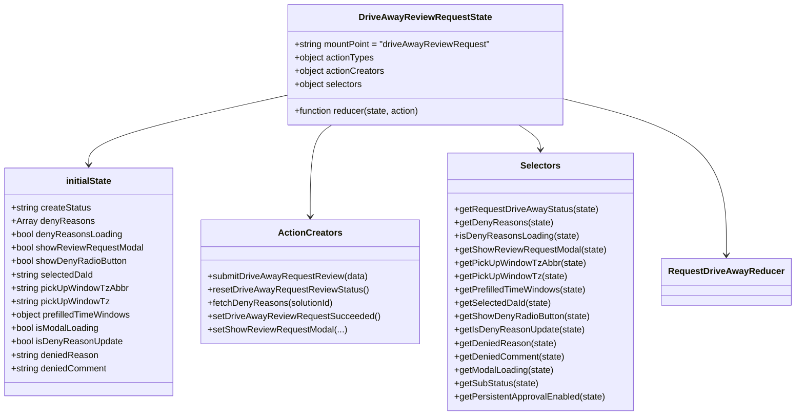

# Diagram: web/portal/src/pages/driveaway/redux/DriveAwayReviewRequest.js


> Auto-generated by Obscura crawlers

## Diagram 1

```mermaid
flowchart TD
    A[submitDriveAwayRequestReview(data)] --> B[setIsLoading(true)]
    B --> C[dispatch DRIVE_AWAY_REVIEW_REQUEST]
    C --> D[axios.patch(DRIVE_AWAY_REQUEST_URL/daId, payload)]
    D -->|resolved| E[dispatch DRIVE_AWAY_REVIEW_REQUEST_SUCCEEDED]
    E --> F[setLoadStatus("success")]
    E --> G{payload.status == "approved"}
    G -->|yes| H[setApprovalId(responses[0].data.approval_id)]
    G -->|no| I[skip setApprovalId]
    H --> J[setIsLoading(false)]
    I --> J
    D -->|rejected| K[dispatch DRIVE_AWAY_REVIEW_REQUEST_FAILED]
    K --> L[setLoadStatus("failed")]
    L --> M[setIsLoading(false)]
```

> SVG rendering failed for this diagram.

## Diagram 2



### SVG

<svg id="container" width="1398.234375" xmlns="http://www.w3.org/2000/svg" class="classDiagram" height="744" viewBox="0 0 1398.234375 744" role="graphics-document document" aria-roledescription="class"><style>#container{font-family:"trebuchet ms",verdana,arial,sans-serif;font-size:16px;fill:#333;}@keyframes edge-animation-frame{from{stroke-dashoffset:0;}}@keyframes dash{to{stroke-dashoffset:0;}}#container .edge-animation-slow{stroke-dasharray:9,5!important;stroke-dashoffset:900;animation:dash 50s linear infinite;stroke-linecap:round;}#container .edge-animation-fast{stroke-dasharray:9,5!important;stroke-dashoffset:900;animation:dash 20s linear infinite;stroke-linecap:round;}#container .error-icon{fill:#552222;}#container .error-text{fill:#552222;stroke:#552222;}#container .edge-thickness-normal{stroke-width:1px;}#container .edge-thickness-thick{stroke-width:3.5px;}#container .edge-pattern-solid{stroke-dasharray:0;}#container .edge-thickness-invisible{stroke-width:0;fill:none;}#container .edge-pattern-dashed{stroke-dasharray:3;}#container .edge-pattern-dotted{stroke-dasharray:2;}#container .marker{fill:#333333;stroke:#333333;}#container .marker.cross{stroke:#333333;}#container svg{font-family:"trebuchet ms",verdana,arial,sans-serif;font-size:16px;}#container p{margin:0;}#container g.classGroup text{fill:#9370DB;stroke:none;font-family:"trebuchet ms",verdana,arial,sans-serif;font-size:10px;}#container g.classGroup text .title{font-weight:bolder;}#container .nodeLabel,#container .edgeLabel{color:#131300;}#container .edgeLabel .label rect{fill:#ECECFF;}#container .label text{fill:#131300;}#container .labelBkg{background:#ECECFF;}#container .edgeLabel .label span{background:#ECECFF;}#container .classTitle{font-weight:bolder;}#container .node rect,#container .node circle,#container .node ellipse,#container .node polygon,#container .node path{fill:#ECECFF;stroke:#9370DB;stroke-width:1px;}#container .divider{stroke:#9370DB;stroke-width:1;}#container g.clickable{cursor:pointer;}#container g.classGroup rect{fill:#ECECFF;stroke:#9370DB;}#container g.classGroup line{stroke:#9370DB;stroke-width:1;}#container .classLabel .box{stroke:none;stroke-width:0;fill:#ECECFF;opacity:0.5;}#container .classLabel .label{fill:#9370DB;font-size:10px;}#container .relation{stroke:#333333;stroke-width:1;fill:none;}#container .dashed-line{stroke-dasharray:3;}#container .dotted-line{stroke-dasharray:1 2;}#container #compositionStart,#container .composition{fill:#333333!important;stroke:#333333!important;stroke-width:1;}#container #compositionEnd,#container .composition{fill:#333333!important;stroke:#333333!important;stroke-width:1;}#container #dependencyStart,#container .dependency{fill:#333333!important;stroke:#333333!important;stroke-width:1;}#container #dependencyStart,#container .dependency{fill:#333333!important;stroke:#333333!important;stroke-width:1;}#container #extensionStart,#container .extension{fill:transparent!important;stroke:#333333!important;stroke-width:1;}#container #extensionEnd,#container .extension{fill:transparent!important;stroke:#333333!important;stroke-width:1;}#container #aggregationStart,#container .aggregation{fill:transparent!important;stroke:#333333!important;stroke-width:1;}#container #aggregationEnd,#container .aggregation{fill:transparent!important;stroke:#333333!important;stroke-width:1;}#container #lollipopStart,#container .lollipop{fill:#ECECFF!important;stroke:#333333!important;stroke-width:1;}#container #lollipopEnd,#container .lollipop{fill:#ECECFF!important;stroke:#333333!important;stroke-width:1;}#container .edgeTerminals{font-size:11px;line-height:initial;}#container .classTitleText{text-anchor:middle;font-size:18px;fill:#333;}#container .label-icon{display:inline-block;height:1em;overflow:visible;vertical-align:-0.125em;}#container .node .label-icon path{fill:currentColor;stroke:revert;stroke-width:revert;}#container :root{--mermaid-font-family:"trebuchet ms",verdana,arial,sans-serif;}</style><g><defs><marker id="container_class-aggregationStart" class="marker aggregation class" refX="18" refY="7" markerWidth="190" markerHeight="240" orient="auto"><path d="M 18,7 L9,13 L1,7 L9,1 Z"></path></marker></defs><defs><marker id="container_class-aggregationEnd" class="marker aggregation class" refX="1" refY="7" markerWidth="20" markerHeight="28" orient="auto"><path d="M 18,7 L9,13 L1,7 L9,1 Z"></path></marker></defs><defs><marker id="container_class-extensionStart" class="marker extension class" refX="18" refY="7" markerWidth="190" markerHeight="240" orient="auto"><path d="M 1,7 L18,13 V 1 Z"></path></marker></defs><defs><marker id="container_class-extensionEnd" class="marker extension class" refX="1" refY="7" markerWidth="20" markerHeight="28" orient="auto"><path d="M 1,1 V 13 L18,7 Z"></path></marker></defs><defs><marker id="container_class-compositionStart" class="marker composition class" refX="18" refY="7" markerWidth="190" markerHeight="240" orient="auto"><path d="M 18,7 L9,13 L1,7 L9,1 Z"></path></marker></defs><defs><marker id="container_class-compositionEnd" class="marker composition class" refX="1" refY="7" markerWidth="20" markerHeight="28" orient="auto"><path d="M 18,7 L9,13 L1,7 L9,1 Z"></path></marker></defs><defs><marker id="container_class-dependencyStart" class="marker dependency class" refX="6" refY="7" markerWidth="190" markerHeight="240" orient="auto"><path d="M 5,7 L9,13 L1,7 L9,1 Z"></path></marker></defs><defs><marker id="container_class-dependencyEnd" class="marker dependency class" refX="13" refY="7" markerWidth="20" markerHeight="28" orient="auto"><path d="M 18,7 L9,13 L14,7 L9,1 Z"></path></marker></defs><defs><marker id="container_class-lollipopStart" class="marker lollipop class" refX="13" refY="7" markerWidth="190" markerHeight="240" orient="auto"><circle stroke="black" fill="transparent" cx="7" cy="7" r="6"></circle></marker></defs><defs><marker id="container_class-lollipopEnd" class="marker lollipop class" refX="1" refY="7" markerWidth="190" markerHeight="240" orient="auto"><circle stroke="black" fill="transparent" cx="7" cy="7" r="6"></circle></marker></defs><g class="root"><g class="clusters"></g><g class="edgePaths"><path d="M507.984,170.748L449.78,183.79C391.576,196.832,275.167,222.916,216.962,243.625C158.758,264.333,158.758,279.667,158.758,287.333L158.758,295" id="id_DriveAwayReviewRequestState_initialState_1" class="edge-thickness-normal edge-pattern-solid relation" style=";;;" data-edge="true" data-et="edge" data-id="id_DriveAwayReviewRequestState_initialState_1" data-points="W3sieCI6NTA3Ljk4NDM3NSwieSI6MTcwLjc0ODAyNDAzNDA2MzZ9LHsieCI6MTU4Ljc1NzgxMjUsInkiOjI0OX0seyJ4IjoxNTguNzU3ODEyNSwieSI6MzAxfV0=" marker-end="url(#container_class-dependencyEnd)"></path><path d="M587.744,224L581.395,228.167C575.045,232.333,562.347,240.667,555.998,268C549.648,295.333,549.648,341.667,549.648,364.833L549.648,388" id="id_DriveAwayReviewRequestState_ActionCreators_2" class="edge-thickness-normal edge-pattern-solid relation" style=";;;" data-edge="true" data-et="edge" data-id="id_DriveAwayReviewRequestState_ActionCreators_2" data-points="W3sieCI6NTg3Ljc0MzkyMDM0Nzc0NDQsInkiOjIyNH0seyJ4Ijo1NDkuNjQ4NDM3NSwieSI6MjQ5fSx7IngiOjU0OS42NDg0Mzc1LCJ5IjozOTR9XQ==" marker-end="url(#container_class-dependencyEnd)"></path><path d="M916.889,224L923.238,228.167C929.587,232.333,942.286,240.667,948.635,248C954.984,255.333,954.984,261.667,954.984,264.833L954.984,268" id="id_DriveAwayReviewRequestState_Selectors_3" class="edge-thickness-normal edge-pattern-solid relation" style=";;;" data-edge="true" data-et="edge" data-id="id_DriveAwayReviewRequestState_Selectors_3" data-points="W3sieCI6OTE2Ljg4ODg5MjE1MjI1NTYsInkiOjIyNH0seyJ4Ijo5NTQuOTg0Mzc1LCJ5IjoyNDl9LHsieCI6OTU0Ljk4NDM3NSwieSI6Mjc0fV0=" marker-end="url(#container_class-dependencyEnd)"></path><path d="M996.648,177.558L1043.909,189.465C1091.169,201.372,1185.69,225.186,1232.951,271.76C1280.211,318.333,1280.211,387.667,1280.211,422.333L1280.211,457" id="id_DriveAwayReviewRequestState_RequestDriveAwayReducer_4" class="edge-thickness-normal edge-pattern-solid relation" style=";;;" data-edge="true" data-et="edge" data-id="id_DriveAwayReviewRequestState_RequestDriveAwayReducer_4" data-points="W3sieCI6OTk2LjY0ODQzNzUsInkiOjE3Ny41NTgwNTQxODA0NDg1OH0seyJ4IjoxMjgwLjIxMDkzNzUsInkiOjI0OX0seyJ4IjoxMjgwLjIxMDkzNzUsInkiOjQ2M31d" marker-end="url(#container_class-dependencyEnd)"></path></g><g class="edgeLabels"><g class="edgeLabel"><g class="label" data-id="id_DriveAwayReviewRequestState_initialState_1" transform="translate(0, 0)"><foreignObject width="0" height="0"><div xmlns="http://www.w3.org/1999/xhtml" class="labelBkg" style="display: table-cell; white-space: nowrap; line-height: 1.5; max-width: 200px; text-align: center;"><span class="edgeLabel"></span></div></foreignObject></g></g><g class="edgeLabel"><g class="label" data-id="id_DriveAwayReviewRequestState_ActionCreators_2" transform="translate(0, 0)"><foreignObject width="0" height="0"><div xmlns="http://www.w3.org/1999/xhtml" class="labelBkg" style="display: table-cell; white-space: nowrap; line-height: 1.5; max-width: 200px; text-align: center;"><span class="edgeLabel"></span></div></foreignObject></g></g><g class="edgeLabel"><g class="label" data-id="id_DriveAwayReviewRequestState_Selectors_3" transform="translate(0, 0)"><foreignObject width="0" height="0"><div xmlns="http://www.w3.org/1999/xhtml" class="labelBkg" style="display: table-cell; white-space: nowrap; line-height: 1.5; max-width: 200px; text-align: center;"><span class="edgeLabel"></span></div></foreignObject></g></g><g class="edgeLabel"><g class="label" data-id="id_DriveAwayReviewRequestState_RequestDriveAwayReducer_4" transform="translate(0, 0)"><foreignObject width="0" height="0"><div xmlns="http://www.w3.org/1999/xhtml" class="labelBkg" style="display: table-cell; white-space: nowrap; line-height: 1.5; max-width: 200px; text-align: center;"><span class="edgeLabel"></span></div></foreignObject></g></g></g><g class="nodes"><g class="node default" id="classId-DriveAwayReviewRequestState-0" transform="translate(752.31640625, 116)"><g class="basic label-container"><path d="M-244.33203125 -108 L244.33203125 -108 L244.33203125 108 L-244.33203125 108" stroke="none" stroke-width="0" fill="#ECECFF" style=""></path><path d="M-244.33203125 -108 C-115.35771344577535 -108, 13.616604358449308 -108, 244.33203125 -108 M-244.33203125 -108 C-139.6664774575387 -108, -35.00092366507735 -108, 244.33203125 -108 M244.33203125 -108 C244.33203125 -56.90332424157944, 244.33203125 -5.806648483158881, 244.33203125 108 M244.33203125 -108 C244.33203125 -35.82778134923173, 244.33203125 36.344437301536544, 244.33203125 108 M244.33203125 108 C115.23648262738527 108, -13.859065995229457 108, -244.33203125 108 M244.33203125 108 C146.5328628977233 108, 48.73369454544664 108, -244.33203125 108 M-244.33203125 108 C-244.33203125 61.32408221780871, -244.33203125 14.648164435617417, -244.33203125 -108 M-244.33203125 108 C-244.33203125 32.91782283232014, -244.33203125 -42.16435433535972, -244.33203125 -108" stroke="#9370DB" stroke-width="1.3" fill="none" stroke-dasharray="0 0" style=""></path></g><g class="annotation-group text" transform="translate(0, -84)"></g><g class="label-group text" transform="translate(-113.3671875, -84)"><g class="label" style="font-weight: bolder" transform="translate(0,-12)"><foreignObject width="226.734375" height="24"><div xmlns="http://www.w3.org/1999/xhtml" style="display: table-cell; white-space: nowrap; line-height: 1.5; max-width: 271px; text-align: center;"><span class="nodeLabel markdown-node-label" style=""><p>DriveAwayReviewRequestState</p></span></div></foreignObject></g></g><g class="members-group text" transform="translate(-232.33203125, -36)"><g class="label" style="" transform="translate(0,-12)"><foreignObject width="351.296875" height="24"><div xmlns="http://www.w3.org/1999/xhtml" style="display: table-cell; white-space: nowrap; line-height: 1.5; max-width: 409px; text-align: center;"><span class="nodeLabel markdown-node-label" style=""><p>+string mountPoint = "driveAwayReviewRequest"</p></span></div></foreignObject></g><g class="label" style="" transform="translate(0,12)"><foreignObject width="144.265625" height="24"><div xmlns="http://www.w3.org/1999/xhtml" style="display: table-cell; white-space: nowrap; line-height: 1.5; max-width: 202px; text-align: center;"><span class="nodeLabel markdown-node-label" style=""><p>+object actionTypes</p></span></div></foreignObject></g><g class="label" style="" transform="translate(0,36)"><foreignObject width="163.03125" height="24"><div xmlns="http://www.w3.org/1999/xhtml" style="display: table-cell; white-space: nowrap; line-height: 1.5; max-width: 220px; text-align: center;"><span class="nodeLabel markdown-node-label" style=""><p>+object actionCreators</p></span></div></foreignObject></g><g class="label" style="" transform="translate(0,60)"><foreignObject width="123.15625" height="24"><div xmlns="http://www.w3.org/1999/xhtml" style="display: table-cell; white-space: nowrap; line-height: 1.5; max-width: 181px; text-align: center;"><span class="nodeLabel markdown-node-label" style=""><p>+object selectors</p></span></div></foreignObject></g></g><g class="methods-group text" transform="translate(-232.33203125, 84)"><g class="label" style="" transform="translate(0,-12)"><foreignObject width="227.953125" height="24"><div xmlns="http://www.w3.org/1999/xhtml" style="display: table-cell; white-space: nowrap; line-height: 1.5; max-width: 285px; text-align: center;"><span class="nodeLabel markdown-node-label" style=""><p>+function reducer(state, action)</p></span></div></foreignObject></g></g><g class="divider" style=""><path d="M-244.33203125 -60 C-67.30163683037748 -60, 109.72875758924505 -60, 244.33203125 -60 M-244.33203125 -60 C-142.99867982027467 -60, -41.66532839054938 -60, 244.33203125 -60" stroke="#9370DB" stroke-width="1.3" fill="none" stroke-dasharray="0 0" style=""></path></g><g class="divider" style=""><path d="M-244.33203125 60 C-101.89636764887143 60, 40.539295952257135 60, 244.33203125 60 M-244.33203125 60 C-74.33115484646862 60, 95.66972155706276 60, 244.33203125 60" stroke="#9370DB" stroke-width="1.3" fill="none" stroke-dasharray="0 0" style=""></path></g></g><g class="node default" id="classId-initialState-1" transform="translate(158.7578125, 505)"><g class="basic label-container"><path d="M-150.7578125 -204 L150.7578125 -204 L150.7578125 204 L-150.7578125 204" stroke="none" stroke-width="0" fill="#ECECFF" style=""></path><path d="M-150.7578125 -204 C-79.58901925550049 -204, -8.420226011000977 -204, 150.7578125 -204 M-150.7578125 -204 C-41.01224044228512 -204, 68.73333161542976 -204, 150.7578125 -204 M150.7578125 -204 C150.7578125 -61.0254666709244, 150.7578125 81.9490666581512, 150.7578125 204 M150.7578125 -204 C150.7578125 -119.16895174672382, 150.7578125 -34.33790349344764, 150.7578125 204 M150.7578125 204 C62.42779735445666 204, -25.902217791086684 204, -150.7578125 204 M150.7578125 204 C40.405983669147844 204, -69.94584516170431 204, -150.7578125 204 M-150.7578125 204 C-150.7578125 82.35248823715528, -150.7578125 -39.29502352568943, -150.7578125 -204 M-150.7578125 204 C-150.7578125 85.78754263025019, -150.7578125 -32.42491473949963, -150.7578125 -204" stroke="#9370DB" stroke-width="1.3" fill="none" stroke-dasharray="0 0" style=""></path></g><g class="annotation-group text" transform="translate(0, -180)"></g><g class="label-group text" transform="translate(-40.46875, -180)"><g class="label" style="font-weight: bolder" transform="translate(0,-12)"><foreignObject width="80.9375" height="24"><div xmlns="http://www.w3.org/1999/xhtml" style="display: table-cell; white-space: nowrap; line-height: 1.5; max-width: 129px; text-align: center;"><span class="nodeLabel markdown-node-label" style=""><p>initialState</p></span></div></foreignObject></g></g><g class="members-group text" transform="translate(-138.7578125, -132)"><g class="label" style="" transform="translate(0,-12)"><foreignObject width="144.375" height="24"><div xmlns="http://www.w3.org/1999/xhtml" style="display: table-cell; white-space: nowrap; line-height: 1.5; max-width: 202px; text-align: center;"><span class="nodeLabel markdown-node-label" style=""><p>+string createStatus</p></span></div></foreignObject></g><g class="label" style="" transform="translate(0,12)"><foreignObject width="145" height="24"><div xmlns="http://www.w3.org/1999/xhtml" style="display: table-cell; white-space: nowrap; line-height: 1.5; max-width: 202px; text-align: center;"><span class="nodeLabel markdown-node-label" style=""><p>+Array denyReasons</p></span></div></foreignObject></g><g class="label" style="" transform="translate(0,36)"><foreignObject width="197.96875" height="24"><div xmlns="http://www.w3.org/1999/xhtml" style="display: table-cell; white-space: nowrap; line-height: 1.5; max-width: 256px; text-align: center;"><span class="nodeLabel markdown-node-label" style=""><p>+bool denyReasonsLoading</p></span></div></foreignObject></g><g class="label" style="" transform="translate(0,60)"><foreignObject width="237.046875" height="24"><div xmlns="http://www.w3.org/1999/xhtml" style="display: table-cell; white-space: nowrap; line-height: 1.5; max-width: 295px; text-align: center;"><span class="nodeLabel markdown-node-label" style=""><p>+bool showReviewRequestModal</p></span></div></foreignObject></g><g class="label" style="" transform="translate(0,84)"><foreignObject width="209.65625" height="24"><div xmlns="http://www.w3.org/1999/xhtml" style="display: table-cell; white-space: nowrap; line-height: 1.5; max-width: 267px; text-align: center;"><span class="nodeLabel markdown-node-label" style=""><p>+bool showDenyRadioButton</p></span></div></foreignObject></g><g class="label" style="" transform="translate(0,108)"><foreignObject width="147.984375" height="24"><div xmlns="http://www.w3.org/1999/xhtml" style="display: table-cell; white-space: nowrap; line-height: 1.5; max-width: 205px; text-align: center;"><span class="nodeLabel markdown-node-label" style=""><p>+string selectedDaId</p></span></div></foreignObject></g><g class="label" style="" transform="translate(0,132)"><foreignObject width="210.28125" height="24"><div xmlns="http://www.w3.org/1999/xhtml" style="display: table-cell; white-space: nowrap; line-height: 1.5; max-width: 268px; text-align: center;"><span class="nodeLabel markdown-node-label" style=""><p>+string pickUpWindowTzAbbr</p></span></div></foreignObject></g><g class="label" style="" transform="translate(0,156)"><foreignObject width="175.921875" height="24"><div xmlns="http://www.w3.org/1999/xhtml" style="display: table-cell; white-space: nowrap; line-height: 1.5; max-width: 233px; text-align: center;"><span class="nodeLabel markdown-node-label" style=""><p>+string pickUpWindowTz</p></span></div></foreignObject></g><g class="label" style="" transform="translate(0,180)"><foreignObject width="218.578125" height="24"><div xmlns="http://www.w3.org/1999/xhtml" style="display: table-cell; white-space: nowrap; line-height: 1.5; max-width: 276px; text-align: center;"><span class="nodeLabel markdown-node-label" style=""><p>+object prefilledTimeWindows</p></span></div></foreignObject></g><g class="label" style="" transform="translate(0,204)"><foreignObject width="158.921875" height="24"><div xmlns="http://www.w3.org/1999/xhtml" style="display: table-cell; white-space: nowrap; line-height: 1.5; max-width: 217px; text-align: center;"><span class="nodeLabel markdown-node-label" style=""><p>+bool isModalLoading</p></span></div></foreignObject></g><g class="label" style="" transform="translate(0,228)"><foreignObject width="198.609375" height="24"><div xmlns="http://www.w3.org/1999/xhtml" style="display: table-cell; white-space: nowrap; line-height: 1.5; max-width: 256px; text-align: center;"><span class="nodeLabel markdown-node-label" style=""><p>+bool isDenyReasonUpdate</p></span></div></foreignObject></g><g class="label" style="" transform="translate(0,252)"><foreignObject width="157.0625" height="24"><div xmlns="http://www.w3.org/1999/xhtml" style="display: table-cell; white-space: nowrap; line-height: 1.5; max-width: 214px; text-align: center;"><span class="nodeLabel markdown-node-label" style=""><p>+string deniedReason</p></span></div></foreignObject></g><g class="label" style="" transform="translate(0,276)"><foreignObject width="173.609375" height="24"><div xmlns="http://www.w3.org/1999/xhtml" style="display: table-cell; white-space: nowrap; line-height: 1.5; max-width: 231px; text-align: center;"><span class="nodeLabel markdown-node-label" style=""><p>+string deniedComment</p></span></div></foreignObject></g></g><g class="methods-group text" transform="translate(-138.7578125, 204)"></g><g class="divider" style=""><path d="M-150.7578125 -156 C-43.06160558382457 -156, 64.63460133235085 -156, 150.7578125 -156 M-150.7578125 -156 C-38.53389037183641 -156, 73.69003175632719 -156, 150.7578125 -156" stroke="#9370DB" stroke-width="1.3" fill="none" stroke-dasharray="0 0" style=""></path></g><g class="divider" style=""><path d="M-150.7578125 180 C-81.83530485522525 180, -12.912797210450492 180, 150.7578125 180 M-150.7578125 180 C-67.7246978584839 180, 15.308416783032186 180, 150.7578125 180" stroke="#9370DB" stroke-width="1.3" fill="none" stroke-dasharray="0 0" style=""></path></g></g><g class="node default" id="classId-ActionCreators-2" transform="translate(549.6484375, 505)"><g class="basic label-container"><path d="M-190.1328125 -111 L190.1328125 -111 L190.1328125 111 L-190.1328125 111" stroke="none" stroke-width="0" fill="#ECECFF" style=""></path><path d="M-190.1328125 -111 C-55.58996765219317 -111, 78.95287719561367 -111, 190.1328125 -111 M-190.1328125 -111 C-100.19033282201059 -111, -10.247853144021178 -111, 190.1328125 -111 M190.1328125 -111 C190.1328125 -29.9522317827941, 190.1328125 51.0955364344118, 190.1328125 111 M190.1328125 -111 C190.1328125 -59.56661612963982, 190.1328125 -8.133232259279637, 190.1328125 111 M190.1328125 111 C39.11599325263933 111, -111.90082599472134 111, -190.1328125 111 M190.1328125 111 C100.46689159310925 111, 10.800970686218506 111, -190.1328125 111 M-190.1328125 111 C-190.1328125 52.878854234995934, -190.1328125 -5.242291530008131, -190.1328125 -111 M-190.1328125 111 C-190.1328125 26.744619315700945, -190.1328125 -57.51076136859811, -190.1328125 -111" stroke="#9370DB" stroke-width="1.3" fill="none" stroke-dasharray="0 0" style=""></path></g><g class="annotation-group text" transform="translate(0, -87)"></g><g class="label-group text" transform="translate(-53.96875, -87)"><g class="label" style="font-weight: bolder" transform="translate(0,-12)"><foreignObject width="107.9375" height="24"><div xmlns="http://www.w3.org/1999/xhtml" style="display: table-cell; white-space: nowrap; line-height: 1.5; max-width: 156px; text-align: center;"><span class="nodeLabel markdown-node-label" style=""><p>ActionCreators</p></span></div></foreignObject></g></g><g class="members-group text" transform="translate(-178.1328125, -39)"></g><g class="methods-group text" transform="translate(-178.1328125, -9)"><g class="label" style="" transform="translate(0,-12)"><foreignObject width="285.265625" height="24"><div xmlns="http://www.w3.org/1999/xhtml" style="display: table-cell; white-space: nowrap; line-height: 1.5; max-width: 343px; text-align: center;"><span class="nodeLabel markdown-node-label" style=""><p>+submitDriveAwayRequestReview(data)</p></span></div></foreignObject></g><g class="label" style="" transform="translate(0,12)"><foreignObject width="284.375" height="24"><div xmlns="http://www.w3.org/1999/xhtml" style="display: table-cell; white-space: nowrap; line-height: 1.5; max-width: 342px; text-align: center;"><span class="nodeLabel markdown-node-label" style=""><p>+resetDriveAwayRequestReviewStatus()</p></span></div></foreignObject></g><g class="label" style="" transform="translate(0,36)"><foreignObject width="225.078125" height="24"><div xmlns="http://www.w3.org/1999/xhtml" style="display: table-cell; white-space: nowrap; line-height: 1.5; max-width: 282px; text-align: center;"><span class="nodeLabel markdown-node-label" style=""><p>+fetchDenyReasons(solutionId)</p></span></div></foreignObject></g><g class="label" style="" transform="translate(0,60)"><foreignObject width="302.296875" height="24"><div xmlns="http://www.w3.org/1999/xhtml" style="display: table-cell; white-space: nowrap; line-height: 1.5; max-width: 360px; text-align: center;"><span class="nodeLabel markdown-node-label" style=""><p>+setDriveAwayReviewRequestSucceeded()</p></span></div></foreignObject></g><g class="label" style="" transform="translate(0,84)"><foreignObject width="245.03125" height="24"><div xmlns="http://www.w3.org/1999/xhtml" style="display: table-cell; white-space: nowrap; line-height: 1.5; max-width: 302px; text-align: center;"><span class="nodeLabel markdown-node-label" style=""><p>+setShowReviewRequestModal(...)</p></span></div></foreignObject></g></g><g class="divider" style=""><path d="M-190.1328125 -63 C-111.67748868121295 -63, -33.2221648624259 -63, 190.1328125 -63 M-190.1328125 -63 C-69.84776383046248 -63, 50.43728483907503 -63, 190.1328125 -63" stroke="#9370DB" stroke-width="1.3" fill="none" stroke-dasharray="0 0" style=""></path></g><g class="divider" style=""><path d="M-190.1328125 -39 C-75.30784817717779 -39, 39.51711614564442 -39, 190.1328125 -39 M-190.1328125 -39 C-81.82203817957745 -39, 26.488736140845106 -39, 190.1328125 -39" stroke="#9370DB" stroke-width="1.3" fill="none" stroke-dasharray="0 0" style=""></path></g></g><g class="node default" id="classId-Selectors-3" transform="translate(954.984375, 505)"><g class="basic label-container"><path d="M-165.203125 -231 L165.203125 -231 L165.203125 231 L-165.203125 231" stroke="none" stroke-width="0" fill="#ECECFF" style=""></path><path d="M-165.203125 -231 C-75.0039926841885 -231, 15.195139631622993 -231, 165.203125 -231 M-165.203125 -231 C-63.683394817293134 -231, 37.83633536541373 -231, 165.203125 -231 M165.203125 -231 C165.203125 -115.028050431878, 165.203125 0.9438991362439992, 165.203125 231 M165.203125 -231 C165.203125 -124.89456616188929, 165.203125 -18.789132323778574, 165.203125 231 M165.203125 231 C66.16279332264203 231, -32.87753835471594 231, -165.203125 231 M165.203125 231 C34.651484231856784 231, -95.90015653628643 231, -165.203125 231 M-165.203125 231 C-165.203125 110.20017662237977, -165.203125 -10.599646755240457, -165.203125 -231 M-165.203125 231 C-165.203125 81.78738613543888, -165.203125 -67.42522772912224, -165.203125 -231" stroke="#9370DB" stroke-width="1.3" fill="none" stroke-dasharray="0 0" style=""></path></g><g class="annotation-group text" transform="translate(0, -207)"></g><g class="label-group text" transform="translate(-34.171875, -207)"><g class="label" style="font-weight: bolder" transform="translate(0,-12)"><foreignObject width="68.34375" height="24"><div xmlns="http://www.w3.org/1999/xhtml" style="display: table-cell; white-space: nowrap; line-height: 1.5; max-width: 117px; text-align: center;"><span class="nodeLabel markdown-node-label" style=""><p>Selectors</p></span></div></foreignObject></g></g><g class="members-group text" transform="translate(-153.203125, -159)"></g><g class="methods-group text" transform="translate(-153.203125, -129)"><g class="label" style="" transform="translate(0,-12)"><foreignObject width="255.96875" height="24"><div xmlns="http://www.w3.org/1999/xhtml" style="display: table-cell; white-space: nowrap; line-height: 1.5; max-width: 313px; text-align: center;"><span class="nodeLabel markdown-node-label" style=""><p>+getRequestDriveAwayStatus(state)</p></span></div></foreignObject></g><g class="label" style="" transform="translate(0,12)"><foreignObject width="173.390625" height="24"><div xmlns="http://www.w3.org/1999/xhtml" style="display: table-cell; white-space: nowrap; line-height: 1.5; max-width: 231px; text-align: center;"><span class="nodeLabel markdown-node-label" style=""><p>+getDenyReasons(state)</p></span></div></foreignObject></g><g class="label" style="" transform="translate(0,36)"><foreignObject width="220.046875" height="24"><div xmlns="http://www.w3.org/1999/xhtml" style="display: table-cell; white-space: nowrap; line-height: 1.5; max-width: 277px; text-align: center;"><span class="nodeLabel markdown-node-label" style=""><p>+isDenyReasonsLoading(state)</p></span></div></foreignObject></g><g class="label" style="" transform="translate(0,60)"><foreignObject width="270.203125" height="24"><div xmlns="http://www.w3.org/1999/xhtml" style="display: table-cell; white-space: nowrap; line-height: 1.5; max-width: 328px; text-align: center;"><span class="nodeLabel markdown-node-label" style=""><p>+getShowReviewRequestModal(state)</p></span></div></foreignObject></g><g class="label" style="" transform="translate(0,84)"><foreignObject width="233.21875" height="24"><div xmlns="http://www.w3.org/1999/xhtml" style="display: table-cell; white-space: nowrap; line-height: 1.5; max-width: 291px; text-align: center;"><span class="nodeLabel markdown-node-label" style=""><p>+getPickUpWindowTzAbbr(state)</p></span></div></foreignObject></g><g class="label" style="" transform="translate(0,108)"><foreignObject width="198.875" height="24"><div xmlns="http://www.w3.org/1999/xhtml" style="display: table-cell; white-space: nowrap; line-height: 1.5; max-width: 256px; text-align: center;"><span class="nodeLabel markdown-node-label" style=""><p>+getPickUpWindowTz(state)</p></span></div></foreignObject></g><g class="label" style="" transform="translate(0,132)"><foreignObject width="237.375" height="24"><div xmlns="http://www.w3.org/1999/xhtml" style="display: table-cell; white-space: nowrap; line-height: 1.5; max-width: 295px; text-align: center;"><span class="nodeLabel markdown-node-label" style=""><p>+getPrefilledTimeWindows(state)</p></span></div></foreignObject></g><g class="label" style="" transform="translate(0,156)"><foreignObject width="172.390625" height="24"><div xmlns="http://www.w3.org/1999/xhtml" style="display: table-cell; white-space: nowrap; line-height: 1.5; max-width: 230px; text-align: center;"><span class="nodeLabel markdown-node-label" style=""><p>+getSelectedDaId(state)</p></span></div></foreignObject></g><g class="label" style="" transform="translate(0,180)"><foreignObject width="242.8125" height="24"><div xmlns="http://www.w3.org/1999/xhtml" style="display: table-cell; white-space: nowrap; line-height: 1.5; max-width: 300px; text-align: center;"><span class="nodeLabel markdown-node-label" style=""><p>+getShowDenyRadioButton(state)</p></span></div></foreignObject></g><g class="label" style="" transform="translate(0,204)"><foreignObject width="230.734375" height="24"><div xmlns="http://www.w3.org/1999/xhtml" style="display: table-cell; white-space: nowrap; line-height: 1.5; max-width: 288px; text-align: center;"><span class="nodeLabel markdown-node-label" style=""><p>+getIsDenyReasonUpdate(state)</p></span></div></foreignObject></g><g class="label" style="" transform="translate(0,228)"><foreignObject width="180.953125" height="24"><div xmlns="http://www.w3.org/1999/xhtml" style="display: table-cell; white-space: nowrap; line-height: 1.5; max-width: 238px; text-align: center;"><span class="nodeLabel markdown-node-label" style=""><p>+getDeniedReason(state)</p></span></div></foreignObject></g><g class="label" style="" transform="translate(0,252)"><foreignObject width="197.5" height="24"><div xmlns="http://www.w3.org/1999/xhtml" style="display: table-cell; white-space: nowrap; line-height: 1.5; max-width: 255px; text-align: center;"><span class="nodeLabel markdown-node-label" style=""><p>+getDeniedComment(state)</p></span></div></foreignObject></g><g class="label" style="" transform="translate(0,276)"><foreignObject width="178.84375" height="24"><div xmlns="http://www.w3.org/1999/xhtml" style="display: table-cell; white-space: nowrap; line-height: 1.5; max-width: 236px; text-align: center;"><span class="nodeLabel markdown-node-label" style=""><p>+getModalLoading(state)</p></span></div></foreignObject></g><g class="label" style="" transform="translate(0,300)"><foreignObject width="150.203125" height="24"><div xmlns="http://www.w3.org/1999/xhtml" style="display: table-cell; white-space: nowrap; line-height: 1.5; max-width: 208px; text-align: center;"><span class="nodeLabel markdown-node-label" style=""><p>+getSubStatus(state)</p></span></div></foreignObject></g><g class="label" style="" transform="translate(0,324)"><foreignObject width="272.234375" height="24"><div xmlns="http://www.w3.org/1999/xhtml" style="display: table-cell; white-space: nowrap; line-height: 1.5; max-width: 330px; text-align: center;"><span class="nodeLabel markdown-node-label" style=""><p>+getPersistentApprovalEnabled(state)</p></span></div></foreignObject></g></g><g class="divider" style=""><path d="M-165.203125 -183 C-84.40786238053808 -183, -3.6125997610761544 -183, 165.203125 -183 M-165.203125 -183 C-43.91856366409631 -183, 77.36599767180738 -183, 165.203125 -183" stroke="#9370DB" stroke-width="1.3" fill="none" stroke-dasharray="0 0" style=""></path></g><g class="divider" style=""><path d="M-165.203125 -159 C-56.41687980124331 -159, 52.36936539751338 -159, 165.203125 -159 M-165.203125 -159 C-72.22618328842474 -159, 20.75075842315053 -159, 165.203125 -159" stroke="#9370DB" stroke-width="1.3" fill="none" stroke-dasharray="0 0" style=""></path></g></g><g class="node default" id="classId-RequestDriveAwayReducer-4" transform="translate(1280.2109375, 505)"><g class="basic label-container"><path d="M-110.0234375 -42 L110.0234375 -42 L110.0234375 42 L-110.0234375 42" stroke="none" stroke-width="0" fill="#ECECFF" style=""></path><path d="M-110.0234375 -42 C-58.28027928536336 -42, -6.537121070726727 -42, 110.0234375 -42 M-110.0234375 -42 C-30.580117708906258 -42, 48.863202082187485 -42, 110.0234375 -42 M110.0234375 -42 C110.0234375 -11.667253560065632, 110.0234375 18.665492879868737, 110.0234375 42 M110.0234375 -42 C110.0234375 -20.9016901597464, 110.0234375 0.19661968050719736, 110.0234375 42 M110.0234375 42 C54.63590689282642 42, -0.7516237143471614 42, -110.0234375 42 M110.0234375 42 C29.799217854968333 42, -50.425001790063334 42, -110.0234375 42 M-110.0234375 42 C-110.0234375 13.876740995053417, -110.0234375 -14.246518009893165, -110.0234375 -42 M-110.0234375 42 C-110.0234375 23.42153373212664, -110.0234375 4.843067464253281, -110.0234375 -42" stroke="#9370DB" stroke-width="1.3" fill="none" stroke-dasharray="0 0" style=""></path></g><g class="annotation-group text" transform="translate(0, -18)"></g><g class="label-group text" transform="translate(-98.0234375, -18)"><g class="label" style="font-weight: bolder" transform="translate(0,-12)"><foreignObject width="196.046875" height="24"><div xmlns="http://www.w3.org/1999/xhtml" style="display: table-cell; white-space: nowrap; line-height: 1.5; max-width: 243px; text-align: center;"><span class="nodeLabel markdown-node-label" style=""><p>RequestDriveAwayReducer</p></span></div></foreignObject></g></g><g class="members-group text" transform="translate(-98.0234375, 30)"></g><g class="methods-group text" transform="translate(-98.0234375, 60)"></g><g class="divider" style=""><path d="M-110.0234375 6 C-46.2295612868397 6, 17.564314926320606 6, 110.0234375 6 M-110.0234375 6 C-40.35159516637694 6, 29.320247167246123 6, 110.0234375 6" stroke="#9370DB" stroke-width="1.3" fill="none" stroke-dasharray="0 0" style=""></path></g><g class="divider" style=""><path d="M-110.0234375 24 C-33.03299196655398 24, 43.95745356689204 24, 110.0234375 24 M-110.0234375 24 C-59.2417783244449 24, -8.460119148889802 24, 110.0234375 24" stroke="#9370DB" stroke-width="1.3" fill="none" stroke-dasharray="0 0" style=""></path></g></g></g></g></g></svg>

## Diagram 3

```mermaid
flowchart TB
    A[setShowReviewRequestModal(showModal,...)] --> B{showModal === true}
    B -->|false| C[dispatch HIDE_REVIEW_REQUEST_MODAL]
    B -->|true & !isDenyReasonUpdate| D[dispatch SHOW_REVIEW_REQUEST_MODAL with payload & flags]
    B -->|true & isDenyReasonUpdate| E[dispatch SHOW_REVIEW_REQUEST_MODAL isModalLoading:true]
    E --> F[axios.get(commentUrl)]
    F -->|resolved with data| G[deniedComment = res.data.data[0].text]
    F -->|rejected| H[log error]
    G --> I[dispatch SHOW_REVIEW_REQUEST_MODAL with payload, deniedComment, isModalLoading:false]
    H --> I
```

> SVG rendering failed for this diagram.
