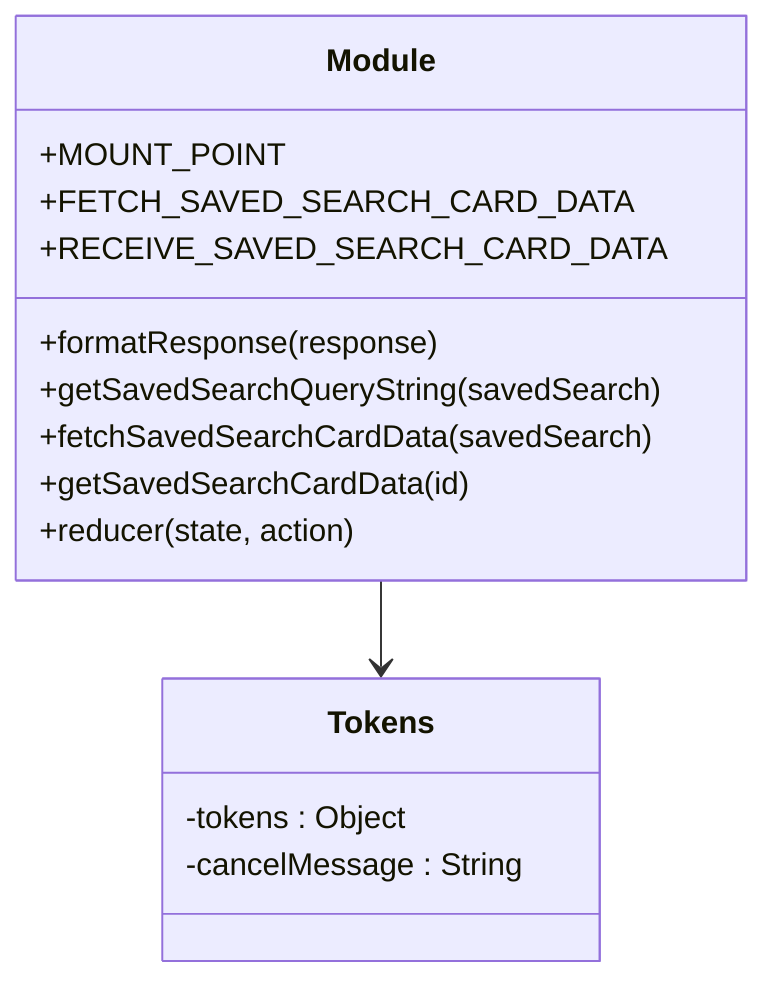

# Diagram: web/portal/src/pages/driveaway/redux/DriveAwaySavedSearchCardsState.js


> Auto-generated by Obscura crawlers

## Diagram 1



### SVG

<svg id="container" width="376.59375" xmlns="http://www.w3.org/2000/svg" class="classDiagram" height="498" viewBox="0 0 376.59375 498" role="graphics-document document" aria-roledescription="class"><style>#container{font-family:"trebuchet ms",verdana,arial,sans-serif;font-size:16px;fill:#333;}@keyframes edge-animation-frame{from{stroke-dashoffset:0;}}@keyframes dash{to{stroke-dashoffset:0;}}#container .edge-animation-slow{stroke-dasharray:9,5!important;stroke-dashoffset:900;animation:dash 50s linear infinite;stroke-linecap:round;}#container .edge-animation-fast{stroke-dasharray:9,5!important;stroke-dashoffset:900;animation:dash 20s linear infinite;stroke-linecap:round;}#container .error-icon{fill:#552222;}#container .error-text{fill:#552222;stroke:#552222;}#container .edge-thickness-normal{stroke-width:1px;}#container .edge-thickness-thick{stroke-width:3.5px;}#container .edge-pattern-solid{stroke-dasharray:0;}#container .edge-thickness-invisible{stroke-width:0;fill:none;}#container .edge-pattern-dashed{stroke-dasharray:3;}#container .edge-pattern-dotted{stroke-dasharray:2;}#container .marker{fill:#333333;stroke:#333333;}#container .marker.cross{stroke:#333333;}#container svg{font-family:"trebuchet ms",verdana,arial,sans-serif;font-size:16px;}#container p{margin:0;}#container g.classGroup text{fill:#9370DB;stroke:none;font-family:"trebuchet ms",verdana,arial,sans-serif;font-size:10px;}#container g.classGroup text .title{font-weight:bolder;}#container .nodeLabel,#container .edgeLabel{color:#131300;}#container .edgeLabel .label rect{fill:#ECECFF;}#container .label text{fill:#131300;}#container .labelBkg{background:#ECECFF;}#container .edgeLabel .label span{background:#ECECFF;}#container .classTitle{font-weight:bolder;}#container .node rect,#container .node circle,#container .node ellipse,#container .node polygon,#container .node path{fill:#ECECFF;stroke:#9370DB;stroke-width:1px;}#container .divider{stroke:#9370DB;stroke-width:1;}#container g.clickable{cursor:pointer;}#container g.classGroup rect{fill:#ECECFF;stroke:#9370DB;}#container g.classGroup line{stroke:#9370DB;stroke-width:1;}#container .classLabel .box{stroke:none;stroke-width:0;fill:#ECECFF;opacity:0.5;}#container .classLabel .label{fill:#9370DB;font-size:10px;}#container .relation{stroke:#333333;stroke-width:1;fill:none;}#container .dashed-line{stroke-dasharray:3;}#container .dotted-line{stroke-dasharray:1 2;}#container #compositionStart,#container .composition{fill:#333333!important;stroke:#333333!important;stroke-width:1;}#container #compositionEnd,#container .composition{fill:#333333!important;stroke:#333333!important;stroke-width:1;}#container #dependencyStart,#container .dependency{fill:#333333!important;stroke:#333333!important;stroke-width:1;}#container #dependencyStart,#container .dependency{fill:#333333!important;stroke:#333333!important;stroke-width:1;}#container #extensionStart,#container .extension{fill:transparent!important;stroke:#333333!important;stroke-width:1;}#container #extensionEnd,#container .extension{fill:transparent!important;stroke:#333333!important;stroke-width:1;}#container #aggregationStart,#container .aggregation{fill:transparent!important;stroke:#333333!important;stroke-width:1;}#container #aggregationEnd,#container .aggregation{fill:transparent!important;stroke:#333333!important;stroke-width:1;}#container #lollipopStart,#container .lollipop{fill:#ECECFF!important;stroke:#333333!important;stroke-width:1;}#container #lollipopEnd,#container .lollipop{fill:#ECECFF!important;stroke:#333333!important;stroke-width:1;}#container .edgeTerminals{font-size:11px;line-height:initial;}#container .classTitleText{text-anchor:middle;font-size:18px;fill:#333;}#container .label-icon{display:inline-block;height:1em;overflow:visible;vertical-align:-0.125em;}#container .node .label-icon path{fill:currentColor;stroke:revert;stroke-width:revert;}#container :root{--mermaid-font-family:"trebuchet ms",verdana,arial,sans-serif;}</style><g><defs><marker id="container_class-aggregationStart" class="marker aggregation class" refX="18" refY="7" markerWidth="190" markerHeight="240" orient="auto"><path d="M 18,7 L9,13 L1,7 L9,1 Z"></path></marker></defs><defs><marker id="container_class-aggregationEnd" class="marker aggregation class" refX="1" refY="7" markerWidth="20" markerHeight="28" orient="auto"><path d="M 18,7 L9,13 L1,7 L9,1 Z"></path></marker></defs><defs><marker id="container_class-extensionStart" class="marker extension class" refX="18" refY="7" markerWidth="190" markerHeight="240" orient="auto"><path d="M 1,7 L18,13 V 1 Z"></path></marker></defs><defs><marker id="container_class-extensionEnd" class="marker extension class" refX="1" refY="7" markerWidth="20" markerHeight="28" orient="auto"><path d="M 1,1 V 13 L18,7 Z"></path></marker></defs><defs><marker id="container_class-compositionStart" class="marker composition class" refX="18" refY="7" markerWidth="190" markerHeight="240" orient="auto"><path d="M 18,7 L9,13 L1,7 L9,1 Z"></path></marker></defs><defs><marker id="container_class-compositionEnd" class="marker composition class" refX="1" refY="7" markerWidth="20" markerHeight="28" orient="auto"><path d="M 18,7 L9,13 L1,7 L9,1 Z"></path></marker></defs><defs><marker id="container_class-dependencyStart" class="marker dependency class" refX="6" refY="7" markerWidth="190" markerHeight="240" orient="auto"><path d="M 5,7 L9,13 L1,7 L9,1 Z"></path></marker></defs><defs><marker id="container_class-dependencyEnd" class="marker dependency class" refX="13" refY="7" markerWidth="20" markerHeight="28" orient="auto"><path d="M 18,7 L9,13 L14,7 L9,1 Z"></path></marker></defs><defs><marker id="container_class-lollipopStart" class="marker lollipop class" refX="13" refY="7" markerWidth="190" markerHeight="240" orient="auto"><circle stroke="black" fill="transparent" cx="7" cy="7" r="6"></circle></marker></defs><defs><marker id="container_class-lollipopEnd" class="marker lollipop class" refX="1" refY="7" markerWidth="190" markerHeight="240" orient="auto"><circle stroke="black" fill="transparent" cx="7" cy="7" r="6"></circle></marker></defs><g class="root"><g class="clusters"></g><g class="edgePaths"><path d="M188.297,296L188.297,300.167C188.297,304.333,188.297,312.667,188.297,320C188.297,327.333,188.297,333.667,188.297,336.833L188.297,340" id="id_Module_Tokens_1" class="edge-thickness-normal edge-pattern-solid relation" style=";;;" data-edge="true" data-et="edge" data-id="id_Module_Tokens_1" data-points="W3sieCI6MTg4LjI5Njg3NSwieSI6Mjk2fSx7IngiOjE4OC4yOTY4NzUsInkiOjMyMX0seyJ4IjoxODguMjk2ODc1LCJ5IjozNDZ9XQ==" marker-end="url(#container_class-dependencyEnd)"></path></g><g class="edgeLabels"><g class="edgeLabel"><g class="label" data-id="id_Module_Tokens_1" transform="translate(0, 0)"><foreignObject width="0" height="0"><div xmlns="http://www.w3.org/1999/xhtml" class="labelBkg" style="display: table-cell; white-space: nowrap; line-height: 1.5; max-width: 200px; text-align: center;"><span class="edgeLabel"></span></div></foreignObject></g></g></g><g class="nodes"><g class="node default" id="classId-Module-0" transform="translate(188.296875, 152)"><g class="basic label-container"><path d="M-180.296875 -144 L180.296875 -144 L180.296875 144 L-180.296875 144" stroke="none" stroke-width="0" fill="#ECECFF" style=""></path><path d="M-180.296875 -144 C-75.73851803557457 -144, 28.819838928850857 -144, 180.296875 -144 M-180.296875 -144 C-67.5510942560056 -144, 45.194686487988804 -144, 180.296875 -144 M180.296875 -144 C180.296875 -39.99195956035483, 180.296875 64.01608087929034, 180.296875 144 M180.296875 -144 C180.296875 -68.45663593077934, 180.296875 7.086728138441316, 180.296875 144 M180.296875 144 C93.44694256316168 144, 6.597010126323369 144, -180.296875 144 M180.296875 144 C100.63908137331934 144, 20.981287746638685 144, -180.296875 144 M-180.296875 144 C-180.296875 83.24505615391647, -180.296875 22.49011230783293, -180.296875 -144 M-180.296875 144 C-180.296875 37.63899165318898, -180.296875 -68.72201669362204, -180.296875 -144" stroke="#9370DB" stroke-width="1.3" fill="none" stroke-dasharray="0 0" style=""></path></g><g class="annotation-group text" transform="translate(0, -120)"></g><g class="label-group text" transform="translate(-27.09375, -120)"><g class="label" style="font-weight: bolder" transform="translate(0,-12)"><foreignObject width="54.1875" height="24"><div xmlns="http://www.w3.org/1999/xhtml" style="display: table-cell; white-space: nowrap; line-height: 1.5; max-width: 104px; text-align: center;"><span class="nodeLabel markdown-node-label" style=""><p>Module</p></span></div></foreignObject></g></g><g class="members-group text" transform="translate(-168.296875, -72)"><g class="label" style="" transform="translate(0,-12)"><foreignObject width="112.953125" height="24"><div xmlns="http://www.w3.org/1999/xhtml" style="display: table-cell; white-space: nowrap; line-height: 1.5; max-width: 171px; text-align: center;"><span class="nodeLabel markdown-node-label" style=""><p>+MOUNT_POINT</p></span></div></foreignObject></g><g class="label" style="" transform="translate(0,12)"><foreignObject width="257.109375" height="24"><div xmlns="http://www.w3.org/1999/xhtml" style="display: table-cell; white-space: nowrap; line-height: 1.5; max-width: 315px; text-align: center;"><span class="nodeLabel markdown-node-label" style=""><p>+FETCH_SAVED_SEARCH_CARD_DATA</p></span></div></foreignObject></g><g class="label" style="" transform="translate(0,36)"><foreignObject width="270.890625" height="24"><div xmlns="http://www.w3.org/1999/xhtml" style="display: table-cell; white-space: nowrap; line-height: 1.5; max-width: 329px; text-align: center;"><span class="nodeLabel markdown-node-label" style=""><p>+RECEIVE_SAVED_SEARCH_CARD_DATA</p></span></div></foreignObject></g></g><g class="methods-group text" transform="translate(-168.296875, 24)"><g class="label" style="" transform="translate(0,-12)"><foreignObject width="203.390625" height="24"><div xmlns="http://www.w3.org/1999/xhtml" style="display: table-cell; white-space: nowrap; line-height: 1.5; max-width: 261px; text-align: center;"><span class="nodeLabel markdown-node-label" style=""><p>+formatResponse(response)</p></span></div></foreignObject></g><g class="label" style="" transform="translate(0,12)"><foreignObject width="309.5" height="24"><div xmlns="http://www.w3.org/1999/xhtml" style="display: table-cell; white-space: nowrap; line-height: 1.5; max-width: 367px; text-align: center;"><span class="nodeLabel markdown-node-label" style=""><p>+getSavedSearchQueryString(savedSearch)</p></span></div></foreignObject></g><g class="label" style="" transform="translate(0,36)"><foreignObject width="303.140625" height="24"><div xmlns="http://www.w3.org/1999/xhtml" style="display: table-cell; white-space: nowrap; line-height: 1.5; max-width: 361px; text-align: center;"><span class="nodeLabel markdown-node-label" style=""><p>+fetchSavedSearchCardData(savedSearch)</p></span></div></foreignObject></g><g class="label" style="" transform="translate(0,60)"><foreignObject width="212.96875" height="24"><div xmlns="http://www.w3.org/1999/xhtml" style="display: table-cell; white-space: nowrap; line-height: 1.5; max-width: 270px; text-align: center;"><span class="nodeLabel markdown-node-label" style=""><p>+getSavedSearchCardData(id)</p></span></div></foreignObject></g><g class="label" style="" transform="translate(0,84)"><foreignObject width="163.25" height="24"><div xmlns="http://www.w3.org/1999/xhtml" style="display: table-cell; white-space: nowrap; line-height: 1.5; max-width: 221px; text-align: center;"><span class="nodeLabel markdown-node-label" style=""><p>+reducer(state, action)</p></span></div></foreignObject></g></g><g class="divider" style=""><path d="M-180.296875 -96 C-79.86365181368929 -96, 20.569571372621425 -96, 180.296875 -96 M-180.296875 -96 C-68.75283458981286 -96, 42.79120582037427 -96, 180.296875 -96" stroke="#9370DB" stroke-width="1.3" fill="none" stroke-dasharray="0 0" style=""></path></g><g class="divider" style=""><path d="M-180.296875 0 C-45.67323662992388 0, 88.95040174015224 0, 180.296875 0 M-180.296875 0 C-79.83737570742282 0, 20.622123585154355 0, 180.296875 0" stroke="#9370DB" stroke-width="1.3" fill="none" stroke-dasharray="0 0" style=""></path></g></g><g class="node default" id="classId-Tokens-1" transform="translate(188.296875, 418)"><g class="basic label-container"><path d="M-109.421875 -72 L109.421875 -72 L109.421875 72 L-109.421875 72" stroke="none" stroke-width="0" fill="#ECECFF" style=""></path><path d="M-109.421875 -72 C-52.88565361922091 -72, 3.650567761558179 -72, 109.421875 -72 M-109.421875 -72 C-59.09843264710895 -72, -8.7749902942179 -72, 109.421875 -72 M109.421875 -72 C109.421875 -15.139918844535089, 109.421875 41.72016231092982, 109.421875 72 M109.421875 -72 C109.421875 -23.09005671882381, 109.421875 25.81988656235238, 109.421875 72 M109.421875 72 C37.307363758620596 72, -34.80714748275881 72, -109.421875 72 M109.421875 72 C56.62191113017601 72, 3.821947260352019 72, -109.421875 72 M-109.421875 72 C-109.421875 38.981060766068566, -109.421875 5.962121532137132, -109.421875 -72 M-109.421875 72 C-109.421875 15.144614081316, -109.421875 -41.710771837368, -109.421875 -72" stroke="#9370DB" stroke-width="1.3" fill="none" stroke-dasharray="0 0" style=""></path></g><g class="annotation-group text" transform="translate(0, -48)"></g><g class="label-group text" transform="translate(-25.765625, -48)"><g class="label" style="font-weight: bolder" transform="translate(0,-12)"><foreignObject width="51.53125" height="24"><div xmlns="http://www.w3.org/1999/xhtml" style="display: table-cell; white-space: nowrap; line-height: 1.5; max-width: 100px; text-align: center;"><span class="nodeLabel markdown-node-label" style=""><p>Tokens</p></span></div></foreignObject></g></g><g class="members-group text" transform="translate(-97.421875, 0)"><g class="label" style="" transform="translate(0,-12)"><foreignObject width="114.390625" height="24"><div xmlns="http://www.w3.org/1999/xhtml" style="display: table-cell; white-space: nowrap; line-height: 1.5; max-width: 172px; text-align: center;"><span class="nodeLabel markdown-node-label" style=""><p>-tokens : Object</p></span></div></foreignObject></g><g class="label" style="" transform="translate(0,12)"><foreignObject width="169.078125" height="24"><div xmlns="http://www.w3.org/1999/xhtml" style="display: table-cell; white-space: nowrap; line-height: 1.5; max-width: 227px; text-align: center;"><span class="nodeLabel markdown-node-label" style=""><p>-cancelMessage : String</p></span></div></foreignObject></g></g><g class="methods-group text" transform="translate(-97.421875, 72)"></g><g class="divider" style=""><path d="M-109.421875 -24 C-43.2691815791875 -24, 22.883511841624994 -24, 109.421875 -24 M-109.421875 -24 C-24.953663622527912 -24, 59.514547754944175 -24, 109.421875 -24" stroke="#9370DB" stroke-width="1.3" fill="none" stroke-dasharray="0 0" style=""></path></g><g class="divider" style=""><path d="M-109.421875 48 C-52.01353378227125 48, 5.394807435457494 48, 109.421875 48 M-109.421875 48 C-36.55803877002485 48, 36.3057974599503 48, 109.421875 48" stroke="#9370DB" stroke-width="1.3" fill="none" stroke-dasharray="0 0" style=""></path></g></g></g></g></g></svg>

## Diagram 2

```mermaid
flowchart TD
    A[fetchSavedSearchCardData(savedSearch) entry] --> B{tokens[savedSearch.id] exists?}
    B -- yes --> C[call tokens[savedSearch.id].cancelRequest("CANCELED")]
    B -- no --> D[create tokens[savedSearch.id] = {}]
    C --> D
    D --> E[getState() -> solutionId, isShipperRole]
    E --> F[dispatch(FETCH_SAVED_SEARCH_CARD_DATA)]
    F --> G[clone savedSearch and detect isBatch]
    G --> H[getSavedSearchQueryString(clonedSavedSearch) -> params]
    H --> I{isBatch?}
    I -- true --> J[append batchType and prepare POST body]
    I -- false --> K[prepare GET with query string]
    J --> L[build targetUrl (apiUrl with /batch-search)]
    K --> L
    L --> M[axios request with CancelToken & headers]
    M --> N[.then -> formatResponse(response) -> dispatch(RECEIVE_SAVED_SEARCH_CARD_DATA)]
    M --> O[.catch -> if error.message != \"CANCELED\" then console.log(error)]
    N --> P[update state: isLoading=false, data=formatted]
    O --> P
```

> SVG rendering failed for this diagram.
