# Diagram: web/portal/src/pages/driveaway/redux/DriveAwaySearchFilterLoaders.js

> Auto-generated by Obscura crawlers

## Mermaid

```mermaid
classDiagram
    class Builder {
        <<factory>>
        +buildAsyncFilterOptionsState(config)
    }
    class DriveAwayLocationsOptionsState {
        +topic: "driveAwayLocationsFilter"
        +pageSize: 20
        +getResponseData(data)
        +transformResult(option)
    }
    class DriveAwayDealerRegionOptionsState {
        +topic: "driveAwayDealerRegionFilter"
        +pageSize: 20
    }
    class DriveAwayDealerZoneOptionsState {
        +topic: "driveAwayDealerZoneFilter"
        +pageSize: 20
    }
    class DriveAwayDealerDistrictOptionsState {
        +topic: "driveAwayDealerDistrictFilter"
        +pageSize: 20
    }
    class DriveAwayCustomersOptionsState {
        +topic: "driveAwayCustomerFilter"
        +pageSize: 20
        +getResponseData(data)
        +transformResult(ddaShipper)
    }
    class DriveAwayDealersOptionsState {
        +topic: "driveAwayDealerFilter"
        +pageSize: 20
    }
    class DriveAwayStatusOptionsState {
        +topic: "driveAwayStatusFilter"
        +pageSize: 20
    }
    class DriveAwayProductTypeOptionsState {
        +topic: "driveAwayProductTypeFilter"
        +pageSize: 20
    }
    class LastMilestoneOptionsState {
        +topic: "lastMilestone"
    }
    class DriveAwayDestinationOptionsState {
        +topic: "destination"
        +additionalParams
        +additionalQueryOnlyParams
        +additionalQueryOnlyHeaders
    }

    class DomainUrls {
        +locationsUrl(solutionId?)
        +customersUrl(solutionId)
        +dealersUrl(solutionId, state)
        +statusUrl()
        +ddaProductTypeUrl(solutionId, state)
        +ddaDealerRegionUrl()
        +ddaDealerZoneUrl()
        +ddaDealerDistrictUrl()
        +lastMilestoneUrl()
        +destinationUrl()
    }

    class Utils {
        +isShipper(organization)
    }

    Builder <|-- DriveAwayLocationsOptionsState : creates
    Builder <|-- DriveAwayDealerRegionOptionsState : creates
    Builder <|-- DriveAwayDealerZoneOptionsState : creates
    Builder <|-- DriveAwayDealerDistrictOptionsState : creates
    Builder <|-- DriveAwayCustomersOptionsState : creates
    Builder <|-- DriveAwayDealersOptionsState : creates
    Builder <|-- DriveAwayStatusOptionsState : creates
    Builder <|-- DriveAwayProductTypeOptionsState : creates
    Builder <|-- LastMilestoneOptionsState : creates
    Builder <|-- DriveAwayDestinationOptionsState : creates

    DriveAwayLocationsOptionsState --> DomainUrls : uses locationsUrl
    DriveAwayLocationsOptionsState --> Utils : calls isShipper

    DriveAwayCustomersOptionsState --> DomainUrls : uses customersUrl
    DriveAwayDealersOptionsState --> DomainUrls : uses dealersUrl
    DriveAwayStatusOptionsState --> DomainUrls : uses statusUrl
    DriveAwayProductTypeOptionsState --> DomainUrls : uses ddaProductTypeUrl
    DriveAwayDealerRegionOptionsState --> DomainUrls : uses ddaDealerRegionUrl
    DriveAwayDealerZoneOptionsState --> DomainUrls : uses ddaDealerZoneUrl
    DriveAwayDealerDistrictOptionsState --> DomainUrls : uses ddaDealerDistrictUrl
    LastMilestoneOptionsState --> DomainUrls : uses lastMilestoneUrl
    DriveAwayDestinationOptionsState --> DomainUrls : uses destinationUrl

    DomainUrls ..> DriveAwayLocationsOptionsState : returns data shape driveawayLocations
    DomainUrls ..> DriveAwayCustomersOptionsState : returns data shape ddaShipper
    DomainUrls ..> DriveAwayDealersOptionsState : returns data shape dealers
    DomainUrls ..> DriveAwayDealerRegionOptionsState : returns data shape ddaDealerRegion
    DomainUrls ..> DriveAwayDealerZoneOptionsState : returns data shape ddaDealerZone
    DomainUrls ..> DriveAwayDealerDistrictOptionsState : returns data shape ddaDealerDistrict
    DomainUrls ..> DriveAwayProductTypeOptionsState : returns data shape productTypes
    DomainUrls ..> LastMilestoneOptionsState : returns data shape lastMilestone
    DomainUrls ..> DriveAwayDestinationOptionsState : returns data shape ddaDestinationLocations
```

### SVG

<svg id="container" width="4114.453125" xmlns="http://www.w3.org/2000/svg" class="classDiagram" height="1162" viewBox="0 0 4114.453125 1162" role="graphics-document document" aria-roledescription="class"><g><defs><marker id="container_class-aggregationStart" class="marker aggregation class" refX="18" refY="7" markerWidth="190" markerHeight="240" orient="auto"><path d="M 18,7 L9,13 L1,7 L9,1 Z"></path></marker></defs><defs><marker id="container_class-aggregationEnd" class="marker aggregation class" refX="1" refY="7" markerWidth="20" markerHeight="28" orient="auto"><path d="M 18,7 L9,13 L1,7 L9,1 Z"></path></marker></defs><defs><marker id="container_class-extensionStart" class="marker extension class" refX="18" refY="7" markerWidth="190" markerHeight="240" orient="auto"><path d="M 1,7 L18,13 V 1 Z"></path></marker></defs><defs><marker id="container_class-extensionEnd" class="marker extension class" refX="1" refY="7" markerWidth="20" markerHeight="28" orient="auto"><path d="M 1,1 V 13 L18,7 Z"></path></marker></defs><defs><marker id="container_class-compositionStart" class="marker composition class" refX="18" refY="7" markerWidth="190" markerHeight="240" orient="auto"><path d="M 18,7 L9,13 L1,7 L9,1 Z"></path></marker></defs><defs><marker id="container_class-compositionEnd" class="marker composition class" refX="1" refY="7" markerWidth="20" markerHeight="28" orient="auto"><path d="M 18,7 L9,13 L1,7 L9,1 Z"></path></marker></defs><defs><marker id="container_class-dependencyStart" class="marker dependency class" refX="6" refY="7" markerWidth="190" markerHeight="240" orient="auto"><path d="M 5,7 L9,13 L1,7 L9,1 Z"></path></marker></defs><defs><marker id="container_class-dependencyEnd" class="marker dependency class" refX="13" refY="7" markerWidth="20" markerHeight="28" orient="auto"><path d="M 18,7 L9,13 L14,7 L9,1 Z"></path></marker></defs><defs><marker id="container_class-lollipopStart" class="marker lollipop class" refX="13" refY="7" markerWidth="190" markerHeight="240" orient="auto"><circle stroke="black" fill="transparent" cx="7" cy="7" r="6"></circle></marker></defs><defs><marker id="container_class-lollipopEnd" class="marker lollipop class" refX="1" refY="7" markerWidth="190" markerHeight="240" orient="auto"><circle stroke="black" fill="transparent" cx="7" cy="7" r="6"></circle></marker></defs><g class="root"><g class="clusters"></g><g class="edgePaths"><path d="M1803.164,166.456L1794.706,171.214C1786.248,175.971,1769.332,185.485,1760.874,196.409C1752.416,207.333,1752.416,219.667,1752.416,225.833L1752.416,232" id="id_Builder_DriveAwayLocationsOptionsState_1" class="edge-thickness-normal edge-pattern-solid relation" style=";;;" data-edge="true" data-et="edge" data-id="id_Builder_DriveAwayLocationsOptionsState_1" data-points="W3sieCI6MTgxOC4xOTkwMjY5MjUyMjMzLCJ5IjoxNTh9LHsieCI6MTc1Mi40MTYwMTU2MjUsInkiOjE5NX0seyJ4IjoxNzUyLjQxNjAxNTYyNSwieSI6MjMyfV0=" marker-start="url(#container_class-extensionStart)"></path><path d="M1769.256,104.154L1638.78,119.295C1508.304,134.436,1247.352,164.718,1116.876,202.026C986.4,239.333,986.4,283.667,986.4,330C986.4,376.333,986.4,424.667,986.4,485.5C986.4,546.333,986.4,619.667,986.4,693C986.4,766.333,986.4,839.667,994.086,888.5C1001.772,937.333,1017.143,961.667,1024.828,973.833L1032.514,986" id="id_Builder_DriveAwayDealerRegionOptionsState_2" class="edge-thickness-normal edge-pattern-solid relation" style=";;;" data-edge="true" data-et="edge" data-id="id_Builder_DriveAwayDealerRegionOptionsState_2" data-points="W3sieCI6MTc4Ni4zOTA2MjUsInkiOjEwMi4xNjUxMDg3ODIwOTc4Nn0seyJ4Ijo5ODYuNDAwMzkwNjI1LCJ5IjoxOTV9LHsieCI6OTg2LjQwMDM5MDYyNSwieSI6MzI4fSx7IngiOjk4Ni40MDAzOTA2MjUsInkiOjQ3M30seyJ4Ijo5ODYuNDAwMzkwNjI1LCJ5Ijo2OTN9LHsieCI6OTg2LjQwMDM5MDYyNSwieSI6OTEzfSx7IngiOjEwMzIuNTE0MDg5NDM5NjU1MiwieSI6OTg2fV0=" marker-start="url(#container_class-extensionStart)"></path><path d="M1769.553,123.541L1716.089,135.451C1662.625,147.361,1555.697,171.18,1502.233,205.257C1448.77,239.333,1448.77,283.667,1448.77,330C1448.77,376.333,1448.77,424.667,1448.77,485.5C1448.77,546.333,1448.77,619.667,1448.77,693C1448.77,766.333,1448.77,839.667,1478.383,888.5C1507.996,937.333,1567.221,961.667,1596.834,973.833L1626.447,986" id="id_Builder_DriveAwayDealerZoneOptionsState_3" class="edge-thickness-normal edge-pattern-solid relation" style=";;;" data-edge="true" data-et="edge" data-id="id_Builder_DriveAwayDealerZoneOptionsState_3" data-points="W3sieCI6MTc4Ni4zOTA2MjUsInkiOjExOS43OTAwNTUxNjI3NjkwMn0seyJ4IjoxNDQ4Ljc2OTUzMTI1LCJ5IjoxOTV9LHsieCI6MTQ0OC43Njk1MzEyNSwieSI6MzI4fSx7IngiOjE0NDguNzY5NTMxMjUsInkiOjQ3M30seyJ4IjoxNDQ4Ljc2OTUzMTI1LCJ5Ijo2OTN9LHsieCI6MTQ0OC43Njk1MzEyNSwieSI6OTEzfSx7IngiOjE2MjYuNDQ3NDQwNzMyNzU4NywieSI6OTg2fV0=" marker-start="url(#container_class-extensionStart)"></path><path d="M2133.556,122.329L2189.61,134.441C2245.664,146.552,2357.771,170.776,2413.825,205.055C2469.879,239.333,2469.879,283.667,2469.879,330C2469.879,376.333,2469.879,424.667,2469.879,485.5C2469.879,546.333,2469.879,619.667,2469.879,693C2469.879,766.333,2469.879,839.667,2479.94,888.5C2490.001,937.333,2510.123,961.667,2520.184,973.833L2530.246,986" id="id_Builder_DriveAwayDealerDistrictOptionsState_4" class="edge-thickness-normal edge-pattern-solid relation" style=";;;" data-edge="true" data-et="edge" data-id="id_Builder_DriveAwayDealerDistrictOptionsState_4" data-points="W3sieCI6MjExNi42OTUzMTI1LCJ5IjoxMTguNjg1NDcxODM3NDYwNjN9LHsieCI6MjQ2OS44Nzg5MDYyNSwieSI6MTk1fSx7IngiOjI0NjkuODc4OTA2MjUsInkiOjMyOH0seyJ4IjoyNDY5Ljg3ODkwNjI1LCJ5Ijo0NzN9LHsieCI6MjQ2OS44Nzg5MDYyNSwieSI6NjkzfSx7IngiOjI0NjkuODc4OTA2MjUsInkiOjkxM30seyJ4IjoyNTMwLjI0NTUwMTA3NzU4NiwieSI6OTg2fV0=" marker-start="url(#container_class-extensionStart)"></path><path d="M1769.174,94.305L1498.45,111.088C1227.726,127.87,686.279,161.435,415.556,200.384C144.832,239.333,144.832,283.667,144.832,330C144.832,376.333,144.832,424.667,144.832,485.5C144.832,546.333,144.832,619.667,144.832,693C144.832,766.333,144.832,839.667,148.211,884.5C151.591,929.333,158.349,945.667,161.729,953.833L165.108,962" id="id_Builder_DriveAwayCustomersOptionsState_5" class="edge-thickness-normal edge-pattern-solid relation" style=";;;" data-edge="true" data-et="edge" data-id="id_Builder_DriveAwayCustomersOptionsState_5" data-points="W3sieCI6MTc4Ni4zOTA2MjUsInkiOjkzLjIzNzk3NTYwMzExMTY2fSx7IngiOjE0NC44MzIwMzEyNSwieSI6MTk1fSx7IngiOjE0NC44MzIwMzEyNSwieSI6MzI4fSx7IngiOjE0NC44MzIwMzEyNSwieSI6NDczfSx7IngiOjE0NC44MzIwMzEyNSwieSI6NjkzfSx7IngiOjE0NC44MzIwMzEyNSwieSI6OTEzfSx7IngiOjE2NS4xMDc4OTMzMTg5NjU1MiwieSI6OTYyfV0=" marker-start="url(#container_class-extensionStart)"></path><path d="M1769.196,97.626L1566.865,113.855C1364.535,130.084,959.874,162.542,757.543,200.938C555.213,239.333,555.213,283.667,555.213,330C555.213,376.333,555.213,424.667,555.213,485.5C555.213,546.333,555.213,619.667,555.213,693C555.213,766.333,555.213,839.667,561.649,888.5C568.086,937.333,580.959,961.667,587.395,973.833L593.832,986" id="id_Builder_DriveAwayDealersOptionsState_6" class="edge-thickness-normal edge-pattern-solid relation" style=";;;" data-edge="true" data-et="edge" data-id="id_Builder_DriveAwayDealersOptionsState_6" data-points="W3sieCI6MTc4Ni4zOTA2MjUsInkiOjk2LjI0NjkxMjU5NTkzNzE4fSx7IngiOjU1NS4yMTI4OTA2MjUsInkiOjE5NX0seyJ4Ijo1NTUuMjEyODkwNjI1LCJ5IjozMjh9LHsieCI6NTU1LjIxMjg5MDYyNSwieSI6NDczfSx7IngiOjU1NS4yMTI4OTA2MjUsInkiOjY5M30seyJ4Ijo1NTUuMjEyODkwNjI1LCJ5Ijo5MTN9LHsieCI6NTkzLjgzMTg5NjU1MTcyNDIsInkiOjk4Nn1d" marker-start="url(#container_class-extensionStart)"></path><path d="M2116.877,165.718L2126.632,170.599C2136.386,175.479,2155.895,185.239,2165.65,200.286C2175.404,215.333,2175.404,235.667,2175.404,245.833L2175.404,256" id="id_Builder_DriveAwayStatusOptionsState_7" class="edge-thickness-normal edge-pattern-solid relation" style=";;;" data-edge="true" data-et="edge" data-id="id_Builder_DriveAwayStatusOptionsState_7" data-points="W3sieCI6MjEwMS40NTAxMDgxMTk0MiwieSI6MTU4fSx7IngiOjIxNzUuNDA0Mjk2ODc1LCJ5IjoxOTV9LHsieCI6MjE3NS40MDQyOTY4NzUsInkiOjI1Nn1d" marker-start="url(#container_class-extensionStart)"></path><path d="M2133.834,103.823L2266.864,119.019C2399.894,134.215,2665.954,164.608,2798.984,201.971C2932.014,239.333,2932.014,283.667,2932.014,330C2932.014,376.333,2932.014,424.667,2932.014,485.5C2932.014,546.333,2932.014,619.667,2932.014,693C2932.014,766.333,2932.014,839.667,2943.477,888.5C2954.941,937.333,2977.867,961.667,2989.331,973.833L3000.794,986" id="id_Builder_DriveAwayProductTypeOptionsState_8" class="edge-thickness-normal edge-pattern-solid relation" style=";;;" data-edge="true" data-et="edge" data-id="id_Builder_DriveAwayProductTypeOptionsState_8" data-points="W3sieCI6MjExNi42OTUzMTI1LCJ5IjoxMDEuODY1NDkyMjk5ODE2MTR9LHsieCI6MjkzMi4wMTM2NzE4NzUsInkiOjE5NX0seyJ4IjoyOTMyLjAxMzY3MTg3NSwieSI6MzI4fSx7IngiOjI5MzIuMDEzNjcxODc1LCJ5Ijo0NzN9LHsieCI6MjkzMi4wMTM2NzE4NzUsInkiOjY5M30seyJ4IjoyOTMyLjAxMzY3MTg3NSwieSI6OTEzfSx7IngiOjMwMDAuNzk0MzQyNjcyNDEzNywieSI6OTg2fV0=" marker-start="url(#container_class-extensionStart)"></path><path d="M2133.893,97.222L2342.836,113.519C2551.779,129.815,2969.665,162.407,3178.608,200.87C3387.551,239.333,3387.551,283.667,3387.551,330C3387.551,376.333,3387.551,424.667,3387.551,485.5C3387.551,546.333,3387.551,619.667,3387.551,693C3387.551,766.333,3387.551,839.667,3399.045,890.5C3410.539,941.333,3433.527,969.667,3445.021,983.833L3456.515,998" id="id_Builder_LastMilestoneOptionsState_9" class="edge-thickness-normal edge-pattern-solid relation" style=";;;" data-edge="true" data-et="edge" data-id="id_Builder_LastMilestoneOptionsState_9" data-points="W3sieCI6MjExNi42OTUzMTI1LCJ5Ijo5NS44ODA4OTI2NjU3NTYzfSx7IngiOjMzODcuNTUwNzgxMjUsInkiOjE5NX0seyJ4IjozMzg3LjU1MDc4MTI1LCJ5IjozMjh9LHsieCI6MzM4Ny41NTA3ODEyNSwieSI6NDczfSx7IngiOjMzODcuNTUwNzgxMjUsInkiOjY5M30seyJ4IjozMzg3LjU1MDc4MTI1LCJ5Ijo5MTN9LHsieCI6MzQ1Ni41MTQ4MTY4MTAzNDQ3LCJ5Ijo5OTh9XQ==" marker-start="url(#container_class-extensionStart)"></path><path d="M2133.914,94.03L2412.155,110.858C2690.397,127.687,3246.88,161.343,3525.122,200.338C3803.363,239.333,3803.363,283.667,3803.363,330C3803.363,376.333,3803.363,424.667,3803.363,485.5C3803.363,546.333,3803.363,619.667,3803.363,693C3803.363,766.333,3803.363,839.667,3809.989,884.5C3816.615,929.333,3829.867,945.667,3836.493,953.833L3843.119,962" id="id_Builder_DriveAwayDestinationOptionsState_10" class="edge-thickness-normal edge-pattern-solid relation" style=";;;" data-edge="true" data-et="edge" data-id="id_Builder_DriveAwayDestinationOptionsState_10" data-points="W3sieCI6MjExNi42OTUzMTI1LCJ5Ijo5Mi45ODg1ODM4NjgwNjl9LHsieCI6MzgwMy4zNjMyODEyNSwieSI6MTk1fSx7IngiOjM4MDMuMzYzMjgxMjUsInkiOjMyOH0seyJ4IjozODAzLjM2MzI4MTI1LCJ5Ijo0NzN9LHsieCI6MzgwMy4zNjMyODEyNSwieSI6NjkzfSx7IngiOjM4MDMuMzYzMjgxMjUsInkiOjkxM30seyJ4IjozODQzLjExOTAxOTM5NjU1MTcsInkiOjk2Mn1d" marker-start="url(#container_class-extensionStart)"></path><path d="M1703.929,424L1699.804,432.167C1695.679,440.333,1687.429,456.667,1701.422,478.832C1715.415,500.997,1751.65,528.995,1769.767,542.994L1787.885,556.992" id="id_DriveAwayLocationsOptionsState_DomainUrls_11" class="edge-thickness-normal edge-pattern-solid relation" style=";;;" data-edge="true" data-et="edge" data-id="id_DriveAwayLocationsOptionsState_DomainUrls_11" data-points="W3sieCI6MTcwMy45Mjg1MTU2MjUsInkiOjQyNH0seyJ4IjoxNjc5LjE3OTY4NzUsInkiOjQ3M30seyJ4IjoxNzkyLjYzMjgxMjUsInkiOjU2MC42NjA3NTM3MjgxNjk0fV0=" marker-end="url(#container_class-dependencyEnd)"></path><path d="M1557.006,348.325L1357.234,369.105C1157.463,389.884,757.92,431.442,558.148,477.388C358.377,523.333,358.377,573.667,358.377,598.833L358.377,624" id="id_DriveAwayLocationsOptionsState_Utils_12" class="edge-thickness-normal edge-pattern-solid relation" style=";;;" data-edge="true" data-et="edge" data-id="id_DriveAwayLocationsOptionsState_Utils_12" data-points="W3sieCI6MTU1Ny4wMDU4NTkzNzUsInkiOjM0OC4zMjU0NTA5OTk1MTI0NH0seyJ4IjozNTguMzc2OTUzMTI1LCJ5Ijo0NzN9LHsieCI6MzU4LjM3Njk1MzEyNSwieSI6NjMwfV0=" marker-end="url(#container_class-dependencyEnd)"></path><path d="M379.317,962L394.16,953.833C409.004,945.667,438.69,929.333,673.254,888.845C907.817,848.356,1347.257,783.713,1566.977,751.391L1786.697,719.069" id="id_DriveAwayCustomersOptionsState_DomainUrls_13" class="edge-thickness-normal edge-pattern-solid relation" style=";;;" data-edge="true" data-et="edge" data-id="id_DriveAwayCustomersOptionsState_DomainUrls_13" data-points="W3sieCI6Mzc5LjMxNjk0NTA0MzEwMzUsInkiOjk2Mn0seyJ4Ijo0NjguMzc2OTUzMTI1LCJ5Ijo5MTN9LHsieCI6MTc5Mi42MzI4MTI1LCJ5Ijo3MTguMTk1NzA2NDg1MzI4MX1d" marker-end="url(#container_class-dependencyEnd)"></path><path d="M770.178,986L793.54,973.833C816.903,961.667,863.628,937.333,1033.059,894.665C1202.489,851.997,1494.624,790.995,1640.692,760.493L1786.759,729.992" id="id_DriveAwayDealersOptionsState_DomainUrls_14" class="edge-thickness-normal edge-pattern-solid relation" style=";;;" data-edge="true" data-et="edge" data-id="id_DriveAwayDealersOptionsState_DomainUrls_14" data-points="W3sieCI6NzcwLjE3NzU4NjIwNjg5NjUsInkiOjk4Nn0seyJ4Ijo5MTAuMzUzNTE1NjI1LCJ5Ijo5MTN9LHsieCI6MTc5Mi42MzI4MTI1LCJ5Ijo3MjguNzY1NTMzNzg1Mjk5NX1d" marker-end="url(#container_class-dependencyEnd)"></path><path d="M2139.039,400L2132.894,412.167C2126.748,424.333,2114.458,448.667,2103.713,468.153C2092.968,487.64,2083.767,502.28,2079.167,509.6L2074.567,516.92" id="id_DriveAwayStatusOptionsState_DomainUrls_15" class="edge-thickness-normal edge-pattern-solid relation" style=";;;" data-edge="true" data-et="edge" data-id="id_DriveAwayStatusOptionsState_DomainUrls_15" data-points="W3sieCI6MjEzOS4wMzg2NzE4NzUsInkiOjQwMH0seyJ4IjoyMTAyLjE2Nzk2ODc1LCJ5Ijo0NzN9LHsieCI6MjA3MS4zNzQxODMyMzg2MzYzLCJ5Ijo1MjJ9XQ==" marker-end="url(#container_class-dependencyEnd)"></path><path d="M3173.225,986L3190.899,973.833C3208.573,961.667,3243.921,937.333,3071.901,893.439C2899.881,849.546,2520.493,786.091,2330.799,754.364L2141.105,722.637" id="id_DriveAwayProductTypeOptionsState_DomainUrls_16" class="edge-thickness-normal edge-pattern-solid relation" style=";;;" data-edge="true" data-et="edge" data-id="id_DriveAwayProductTypeOptionsState_DomainUrls_16" data-points="W3sieCI6MzE3My4yMjQ4MzgzNjIwNjksInkiOjk4Nn0seyJ4IjozMjc5LjI2OTUzMTI1LCJ5Ijo5MTN9LHsieCI6MjEzNS4xODc1LCJ5Ijo3MjEuNjQ2OTM1ODQyMTUzNH1d" marker-end="url(#container_class-dependencyEnd)"></path><path d="M1206.704,986L1228.453,973.833C1250.202,961.667,1293.701,937.333,1390.412,898.852C1487.123,860.371,1637.047,807.742,1712.009,781.427L1786.971,755.112" id="id_DriveAwayDealerRegionOptionsState_DomainUrls_17" class="edge-thickness-normal edge-pattern-solid relation" style=";;;" data-edge="true" data-et="edge" data-id="id_DriveAwayDealerRegionOptionsState_DomainUrls_17" data-points="W3sieCI6MTIwNi43MDM4NTIzNzA2ODk3LCJ5Ijo5ODZ9LHsieCI6MTMzNy4xOTkyMTg3NSwieSI6OTEzfSx7IngiOjE3OTIuNjMyODEyNSwieSI6NzUzLjEyNTAzMjcyMjkyMX1d" marker-end="url(#container_class-dependencyEnd)"></path><path d="M1918.689,986L1938.46,973.833C1958.23,961.667,1997.771,937.333,2015.134,917.949C2032.496,898.564,2027.679,884.128,2025.271,876.91L2022.863,869.692" id="id_DriveAwayDealerZoneOptionsState_DomainUrls_18" class="edge-thickness-normal edge-pattern-solid relation" style=";;;" data-edge="true" data-et="edge" data-id="id_DriveAwayDealerZoneOptionsState_DomainUrls_18" data-points="W3sieCI6MTkxOC42ODk0NjY1OTQ4Mjc1LCJ5Ijo5ODZ9LHsieCI6MjAzNy4zMTI1LCJ5Ijo5MTN9LHsieCI6MjAyMC45NjM3OTYxNjQ3NzI3LCJ5Ijo4NjR9XQ==" marker-end="url(#container_class-dependencyEnd)"></path><path d="M2703.706,986L2722.956,973.833C2742.207,961.667,2780.708,937.333,2686.923,896.092C2593.139,854.85,2367.069,796.7,2254.033,767.626L2140.998,738.551" id="id_DriveAwayDealerDistrictOptionsState_DomainUrls_19" class="edge-thickness-normal edge-pattern-solid relation" style=";;;" data-edge="true" data-et="edge" data-id="id_DriveAwayDealerDistrictOptionsState_DomainUrls_19" data-points="W3sieCI6MjcwMy43MDU5NTM2NjM3OTMsInkiOjk4Nn0seyJ4IjoyODE5LjIwODk4NDM3NSwieSI6OTEzfSx7IngiOjIxMzUuMTg3NSwieSI6NzM3LjA1NTk2NTQ1NDMyNTR9XQ==" marker-end="url(#container_class-dependencyEnd)"></path><path d="M3588.062,998L3607.628,983.833C3627.194,969.667,3666.325,941.333,3425.172,894.231C3184.018,847.129,2662.579,781.259,2401.86,748.324L2141.14,715.388" id="id_LastMilestoneOptionsState_DomainUrls_20" class="edge-thickness-normal edge-pattern-solid relation" style=";;;" data-edge="true" data-et="edge" data-id="id_LastMilestoneOptionsState_DomainUrls_20" data-points="W3sieCI6MzU4OC4wNjIyMzA2MDM0NDg0LCJ5Ijo5OTh9LHsieCI6MzcwNS40NTcwMzEyNSwieSI6OTEzfSx7IngiOjIxMzUuMTg3NSwieSI6NzE0LjYzNjUyMTA1MjU4NDR9XQ==" marker-end="url(#container_class-dependencyEnd)"></path><path d="M4048.96,962L4059.845,953.833C4070.73,945.667,4092.5,929.333,3774.532,887.522C3456.565,845.711,2798.861,778.423,2470.009,744.778L2141.156,711.134" id="id_DriveAwayDestinationOptionsState_DomainUrls_21" class="edge-thickness-normal edge-pattern-solid relation" style=";;;" data-edge="true" data-et="edge" data-id="id_DriveAwayDestinationOptionsState_DomainUrls_21" data-points="W3sieCI6NDA0OC45NjAzOTg3MDY4OTY3LCJ5Ijo5NjJ9LHsieCI6NDExNC4yNjk1MzEyNSwieSI6OTEzfSx7IngiOjIxMzUuMTg3NSwieSI6NzEwLjUyMzEyNDc2ODM4OX1d" marker-end="url(#container_class-dependencyEnd)"></path><path d="M2135.188,577.904L2161.206,560.42C2187.225,542.936,2239.262,507.968,2209,475.341C2178.739,442.713,2066.18,412.426,2009.9,397.283L1953.62,382.139" id="id_DomainUrls_DriveAwayLocationsOptionsState_22" class="edge-thickness-normal edge-pattern-dashed relation" style=";;;" data-edge="true" data-et="edge" data-id="id_DomainUrls_DriveAwayLocationsOptionsState_22" data-points="W3sieCI6MjEzNS4xODc1LCJ5Ijo1NzcuOTA0MzM4OTAzMzcyNX0seyJ4IjoyMjkxLjI5ODgyODEyNSwieSI6NDczfSx7IngiOjE5NDcuODI2MTcxODc1LCJ5IjozODAuNTgwMDI2Njc1NTU4NTR9XQ==" marker-end="url(#container_class-dependencyEnd)"></path><path d="M1792.633,715.177L1537.999,748.148C1283.366,781.118,774.099,847.059,516.469,887.272C258.838,927.485,252.844,941.971,249.847,949.213L246.85,956.456" id="id_DomainUrls_DriveAwayCustomersOptionsState_23" class="edge-thickness-normal edge-pattern-dashed relation" style=";;;" data-edge="true" data-et="edge" data-id="id_DomainUrls_DriveAwayCustomersOptionsState_23" data-points="W3sieCI6MTc5Mi42MzI4MTI1LCJ5Ijo3MTUuMTc3MzI5NjE4MDgzNH0seyJ4IjoyNjQuODMyMDMxMjUsInkiOjkxM30seyJ4IjoyNDQuNTU2MTY5MTgxMDM0NDgsInkiOjk2Mn1d" marker-end="url(#container_class-dependencyEnd)"></path><path d="M1792.633,722.212L1606.191,754.01C1419.749,785.808,1046.866,849.404,857.174,892.408C667.481,935.413,660.98,957.825,657.729,969.031L654.479,980.238" id="id_DomainUrls_DriveAwayDealersOptionsState_24" class="edge-thickness-normal edge-pattern-dashed relation" style=";;;" data-edge="true" data-et="edge" data-id="id_DomainUrls_DriveAwayDealersOptionsState_24" data-points="W3sieCI6MTc5Mi42MzI4MTI1LCJ5Ijo3MjIuMjExNzI2MDY4NzE0NX0seyJ4Ijo2NzMuOTgyNDIxODc1LCJ5Ijo5MTN9LHsieCI6NjUyLjgwNzExMjA2ODk2NTUsInkiOjk4Nn1d" marker-end="url(#container_class-dependencyEnd)"></path><path d="M1792.633,736.942L1678.261,766.285C1563.889,795.628,1335.145,854.314,1218.581,894.842C1102.018,935.371,1097.636,957.741,1095.445,968.927L1093.254,980.112" id="id_DomainUrls_DriveAwayDealerRegionOptionsState_25" class="edge-thickness-normal edge-pattern-dashed relation" style=";;;" data-edge="true" data-et="edge" data-id="id_DomainUrls_DriveAwayDealerRegionOptionsState_25" data-points="W3sieCI6MTc5Mi42MzI4MTI1LCJ5Ijo3MzYuOTQyMzc0OTI3Mzk5Mn0seyJ4IjoxMTA2LjQwMDM5MDYyNSwieSI6OTEzfSx7IngiOjEwOTIuMTAwMjk2MzM2MjA2OCwieSI6OTg2fV0=" marker-end="url(#container_class-dependencyEnd)"></path><path d="M1792.633,791.826L1757.632,812.022C1722.63,832.218,1652.628,872.609,1635.174,904.419C1617.72,936.229,1652.815,959.459,1670.363,971.074L1687.91,982.688" id="id_DomainUrls_DriveAwayDealerZoneOptionsState_26" class="edge-thickness-normal edge-pattern-dashed relation" style=";;;" data-edge="true" data-et="edge" data-id="id_DomainUrls_DriveAwayDealerZoneOptionsState_26" data-points="W3sieCI6MTc5Mi42MzI4MTI1LCJ5Ijo3OTEuODI2MzM3NzM1MjQ5OH0seyJ4IjoxNTgyLjYyNSwieSI6OTEzfSx7IngiOjE2OTIuOTEzNjA0NTI1ODYyLCJ5Ijo5ODZ9XQ==" marker-end="url(#container_class-dependencyEnd)"></path><path d="M2135.188,753.196L2210.969,779.83C2286.751,806.464,2438.315,859.732,2514.09,897.533C2589.864,935.333,2589.85,957.667,2589.843,968.833L2589.836,980" id="id_DomainUrls_DriveAwayDealerDistrictOptionsState_27" class="edge-thickness-normal edge-pattern-dashed relation" style=";;;" data-edge="true" data-et="edge" data-id="id_DomainUrls_DriveAwayDealerDistrictOptionsState_27" data-points="W3sieCI6MjEzNS4xODc1LCJ5Ijo3NTMuMTk2MzIwNzAyOTEwNX0seyJ4IjoyNTg5Ljg3ODkwNjI1LCJ5Ijo5MTN9LHsieCI6MjU4OS44MzE3MDc5NzQxMzc4LCJ5Ijo5ODZ9XQ==" marker-end="url(#container_class-dependencyEnd)"></path><path d="M2135.188,727.109L2290.762,758.091C2446.336,789.073,2757.484,851.036,2913.059,893.185C3068.633,935.333,3068.633,957.667,3068.633,968.833L3068.633,980" id="id_DomainUrls_DriveAwayProductTypeOptionsState_28" class="edge-thickness-normal edge-pattern-dashed relation" style=";;;" data-edge="true" data-et="edge" data-id="id_DomainUrls_DriveAwayProductTypeOptionsState_28" data-points="W3sieCI6MjEzNS4xODc1LCJ5Ijo3MjcuMTA5MDI3NjQ3NjM1fSx7IngiOjMwNjguNjMyODEyNSwieSI6OTEzfSx7IngiOjMwNjguNjMyODEyNSwieSI6OTg2fV0=" marker-end="url(#container_class-dependencyEnd)"></path><path d="M2135.188,717.41L2363.915,750.009C2592.642,782.607,3050.096,847.803,3278.61,893.569C3507.123,939.334,3506.695,965.667,3506.481,978.834L3506.267,992.001" id="id_DomainUrls_LastMilestoneOptionsState_29" class="edge-thickness-normal edge-pattern-dashed relation" style=";;;" data-edge="true" data-et="edge" data-id="id_DomainUrls_LastMilestoneOptionsState_29" data-points="W3sieCI6MjEzNS4xODc1LCJ5Ijo3MTcuNDEwNDg0NTQ4NTAwNH0seyJ4IjozNTA3LjU1MDc4MTI1LCJ5Ijo5MTN9LHsieCI6MzUwNi4xNjk5ODkyMjQxMzgsInkiOjk5OH1d" marker-end="url(#container_class-dependencyEnd)"></path><path d="M2135.188,712.23L2433.217,745.692C2731.246,779.154,3327.305,846.077,3625.218,886.705C3923.13,927.334,3922.898,941.667,3922.781,948.834L3922.665,956.001" id="id_DomainUrls_DriveAwayDestinationOptionsState_30" class="edge-thickness-normal edge-pattern-dashed relation" style=";;;" data-edge="true" data-et="edge" data-id="id_DomainUrls_DriveAwayDestinationOptionsState_30" data-points="W3sieCI6MjEzNS4xODc1LCJ5Ijo3MTIuMjMwMzczNTg5NTY5OH0seyJ4IjozOTIzLjM2MzI4MTI1LCJ5Ijo5MTN9LHsieCI6MzkyMi41NjcyOTUyNTg2MjA2LCJ5Ijo5NjJ9XQ==" marker-end="url(#container_class-dependencyEnd)"></path></g><g class="edgeLabels"><g class="edgeLabel" transform="translate(1752.416015625, 195)"><g class="label" data-id="id_Builder_DriveAwayLocationsOptionsState_1" transform="translate(-26.171875, -12)"><foreignObject width="52.34375" height="24">

creates

</foreignObject></g></g><g class="edgeLabel" transform="translate(986.400390625, 473)"><g class="label" data-id="id_Builder_DriveAwayDealerRegionOptionsState_2" transform="translate(-26.171875, -12)"><foreignObject width="52.34375" height="24">

creates

</foreignObject></g></g><g class="edgeLabel" transform="translate(1448.76953125, 473)"><g class="label" data-id="id_Builder_DriveAwayDealerZoneOptionsState_3" transform="translate(-26.171875, -12)"><foreignObject width="52.34375" height="24">

creates

</foreignObject></g></g><g class="edgeLabel" transform="translate(2469.87890625, 473)"><g class="label" data-id="id_Builder_DriveAwayDealerDistrictOptionsState_4" transform="translate(-26.171875, -12)"><foreignObject width="52.34375" height="24">

creates

</foreignObject></g></g><g class="edgeLabel" transform="translate(144.83203125, 473)"><g class="label" data-id="id_Builder_DriveAwayCustomersOptionsState_5" transform="translate(-26.171875, -12)"><foreignObject width="52.34375" height="24">

creates

</foreignObject></g></g><g class="edgeLabel" transform="translate(555.212890625, 473)"><g class="label" data-id="id_Builder_DriveAwayDealersOptionsState_6" transform="translate(-26.171875, -12)"><foreignObject width="52.34375" height="24">

creates

</foreignObject></g></g><g class="edgeLabel" transform="translate(2175.404296875, 195)"><g class="label" data-id="id_Builder_DriveAwayStatusOptionsState_7" transform="translate(-26.171875, -12)"><foreignObject width="52.34375" height="24">

creates

</foreignObject></g></g><g class="edgeLabel" transform="translate(2932.013671875, 473)"><g class="label" data-id="id_Builder_DriveAwayProductTypeOptionsState_8" transform="translate(-26.171875, -12)"><foreignObject width="52.34375" height="24">

creates

</foreignObject></g></g><g class="edgeLabel" transform="translate(3387.55078125, 473)"><g class="label" data-id="id_Builder_LastMilestoneOptionsState_9" transform="translate(-26.171875, -12)"><foreignObject width="52.34375" height="24">

creates

</foreignObject></g></g><g class="edgeLabel" transform="translate(3803.36328125, 473)"><g class="label" data-id="id_Builder_DriveAwayDestinationOptionsState_10" transform="translate(-26.171875, -12)"><foreignObject width="52.34375" height="24">

creates

</foreignObject></g></g><g class="edgeLabel" transform="translate(1714.1866, 500.04846)"><g class="label" data-id="id_DriveAwayLocationsOptionsState_DomainUrls_11" transform="translate(-62.6484375, -12)"><foreignObject width="125.296875" height="24">

uses locationsUrl

</foreignObject></g></g><g class="edgeLabel" transform="translate(358.376953125, 473)"><g class="label" data-id="id_DriveAwayLocationsOptionsState_Utils_12" transform="translate(-52.8125, -12)"><foreignObject width="105.625" height="24">

calls isShipper

</foreignObject></g></g><g class="edgeLabel" transform="translate(1080.22113, 822.99483)"><g class="label" data-id="id_DriveAwayCustomersOptionsState_DomainUrls_13" transform="translate(-66.8359375, -12)"><foreignObject width="133.671875" height="24">

uses customersUrl

</foreignObject></g></g><g class="edgeLabel" transform="translate(1274.13905, 837.03558)"><g class="label" data-id="id_DriveAwayDealersOptionsState_DomainUrls_14" transform="translate(-56.046875, -12)"><foreignObject width="112.09375" height="24">

uses dealersUrl

</foreignObject></g></g><g class="edgeLabel" transform="translate(2107.55775, 462.32881)"><g class="label" data-id="id_DriveAwayStatusOptionsState_DomainUrls_15" transform="translate(-51.5390625, -12)"><foreignObject width="103.078125" height="24">

uses statusUrl

</foreignObject></g></g><g class="edgeLabel" transform="translate(2770.71757, 827.94231)"><g class="label" data-id="id_DriveAwayProductTypeOptionsState_DomainUrls_16" transform="translate(-88.28125, -12)"><foreignObject width="176.5625" height="24">

uses ddaProductTypeUrl

</foreignObject></g></g><g class="edgeLabel" transform="translate(1494.37319, 857.8258)"><g class="label" data-id="id_DriveAwayDealerRegionOptionsState_DomainUrls_17" transform="translate(-91.5703125, -12)"><foreignObject width="183.140625" height="24">

uses ddaDealerRegionUrl

</foreignObject></g></g><g class="edgeLabel" transform="translate(1999.99726, 935.96361)"><g class="label" data-id="id_DriveAwayDealerZoneOptionsState_DomainUrls_18" transform="translate(-84.4375, -12)"><foreignObject width="168.875" height="24">

uses ddaDealerZoneUrl

</foreignObject></g></g><g class="edgeLabel" transform="translate(2543.36349, 842.04701)"><g class="label" data-id="id_DriveAwayDealerDistrictOptionsState_DomainUrls_19" transform="translate(-92.8046875, -12)"><foreignObject width="185.609375" height="24">

uses ddaDealerDistrictUrl

</foreignObject></g></g><g class="edgeLabel" transform="translate(2992.21904, 822.90058)"><g class="label" data-id="id_LastMilestoneOptionsState_DomainUrls_20" transform="translate(-77.90625, -12)"><foreignObject width="155.8125" height="24">

uses lastMilestoneUrl

</foreignObject></g></g><g class="edgeLabel" transform="translate(3165.34018, 815.91648)"><g class="label" data-id="id_DriveAwayDestinationOptionsState_DomainUrls_21" transform="translate(-70.90625, -12)"><foreignObject width="141.8125" height="24">

uses destinationUrl

</foreignObject></g></g><g class="edgeLabel" transform="translate(2210.37458, 451.22529)"><g class="label" data-id="id_DomainUrls_DriveAwayLocationsOptionsState_22" transform="translate(-100, -24)"><foreignObject width="200" height="48">

returns data shape driveawayLocations

</foreignObject></g></g><g class="edgeLabel" transform="translate(1002.43726, 817.49341)"><g class="label" data-id="id_DomainUrls_DriveAwayCustomersOptionsState_23" transform="translate(-100, -24)"><foreignObject width="200" height="48">

returns data shape ddaShipper

</foreignObject></g></g><g class="edgeLabel" transform="translate(1195.844, 823.99537)"><g class="label" data-id="id_DomainUrls_DriveAwayDealersOptionsState_24" transform="translate(-97.5390625, -12)"><foreignObject width="195.078125" height="24">

returns data shape dealers

</foreignObject></g></g><g class="edgeLabel" transform="translate(1413.48966, 834.21415)"><g class="label" data-id="id_DomainUrls_DriveAwayDealerRegionOptionsState_25" transform="translate(-100, -24)"><foreignObject width="200" height="48">

returns data shape ddaDealerRegion

</foreignObject></g></g><g class="edgeLabel" transform="translate(1630.35008, 885.46282)"><g class="label" data-id="id_DomainUrls_DriveAwayDealerZoneOptionsState_26" transform="translate(-100, -24)"><foreignObject width="200" height="48">

returns data shape ddaDealerZone

</foreignObject></g></g><g class="edgeLabel" transform="translate(2589.87890625, 913)"><g class="label" data-id="id_DomainUrls_DriveAwayDealerDistrictOptionsState_27" transform="translate(-100, -24)"><foreignObject width="200" height="48">

returns data shape ddaDealerDistrict

</foreignObject></g></g><g class="edgeLabel" transform="translate(3068.6328125, 913)"><g class="label" data-id="id_DomainUrls_DriveAwayProductTypeOptionsState_28" transform="translate(-100, -24)"><foreignObject width="200" height="48">

returns data shape productTypes

</foreignObject></g></g><g class="edgeLabel" transform="translate(2863.44953, 821.20255)"><g class="label" data-id="id_DomainUrls_LastMilestoneOptionsState_29" transform="translate(-100, -24)"><foreignObject width="200" height="48">

returns data shape lastMilestone

</foreignObject></g></g><g class="edgeLabel" transform="translate(3923.36328125, 913)"><g class="label" data-id="id_DomainUrls_DriveAwayDestinationOptionsState_30" transform="translate(-100, -24)"><foreignObject width="200" height="48">

returns data shape ddaDestinationLocations

</foreignObject></g></g></g><g class="nodes"><g class="node default" id="classId-Builder-0" transform="translate(1951.54296875, 83)"><g class="basic label-container"><path d="M-165.15234375 -75 L165.15234375 -75 L165.15234375 75 L-165.15234375 75" stroke="none" stroke-width="0" fill="#ECECFF" style=""></path><path d="M-165.15234375 -75 C-94.41022043345563 -75, -23.66809711691127 -75, 165.15234375 -75 M-165.15234375 -75 C-73.33921855036071 -75, 18.473906649278575 -75, 165.15234375 -75 M165.15234375 -75 C165.15234375 -17.333805674208456, 165.15234375 40.33238865158309, 165.15234375 75 M165.15234375 -75 C165.15234375 -41.39464778577645, 165.15234375 -7.789295571552898, 165.15234375 75 M165.15234375 75 C67.14858363442701 75, -30.855176481145975 75, -165.15234375 75 M165.15234375 75 C33.46777654586856 75, -98.21679065826288 75, -165.15234375 75 M-165.15234375 75 C-165.15234375 25.308540995840957, -165.15234375 -24.382918008318086, -165.15234375 -75 M-165.15234375 75 C-165.15234375 18.010517863580247, -165.15234375 -38.978964272839505, -165.15234375 -75" stroke="#9370DB" stroke-width="1.3" fill="none" stroke-dasharray="0 0" style=""></path></g><g class="annotation-group text" transform="translate(-34.2734375, -51)"><g class="label" style="" transform="translate(0,-12)"><foreignObject width="68.546875" height="24">

«factory»

</foreignObject></g></g><g class="label-group text" transform="translate(-26.53125, -27)"><g class="label" style="font-weight: bolder" transform="translate(0,-12)"><foreignObject width="53.0625" height="24">

Builder

</foreignObject></g></g><g class="members-group text" transform="translate(-153.15234375, 21)"></g><g class="methods-group text" transform="translate(-153.15234375, 51)"><g class="label" style="" transform="translate(0,-12)"><foreignObject width="272.03125" height="24">

+buildAsyncFilterOptionsState(config)

</foreignObject></g></g><g class="divider" style=""><path d="M-165.15234375 -3 C-90.75925276162245 -3, -16.366161773244897 -3, 165.15234375 -3 M-165.15234375 -3 C-76.15832071582075 -3, 12.8357023183585 -3, 165.15234375 -3" stroke="#9370DB" stroke-width="1.3" fill="none" stroke-dasharray="0 0" style=""></path></g><g class="divider" style=""><path d="M-165.15234375 21 C-92.72045050004068 21, -20.288557250081368 21, 165.15234375 21 M-165.15234375 21 C-60.42074037772801 21, 44.31086299454398 21, 165.15234375 21" stroke="#9370DB" stroke-width="1.3" fill="none" stroke-dasharray="0 0" style=""></path></g></g><g class="node default" id="classId-DriveAwayLocationsOptionsState-1" transform="translate(1752.416015625, 328)"><g class="basic label-container"><path d="M-195.41015625 -96 L195.41015625 -96 L195.41015625 96 L-195.41015625 96" stroke="none" stroke-width="0" fill="#ECECFF" style=""></path><path d="M-195.41015625 -96 C-84.85888699420822 -96, 25.69238226158356 -96, 195.41015625 -96 M-195.41015625 -96 C-59.81247498601232 -96, 75.78520627797536 -96, 195.41015625 -96 M195.41015625 -96 C195.41015625 -38.60316725834187, 195.41015625 18.79366548331626, 195.41015625 96 M195.41015625 -96 C195.41015625 -27.546784713999898, 195.41015625 40.906430572000204, 195.41015625 96 M195.41015625 96 C109.03110226970028 96, 22.652048289400568 96, -195.41015625 96 M195.41015625 96 C77.83495565128446 96, -39.74024494743108 96, -195.41015625 96 M-195.41015625 96 C-195.41015625 22.741647965919057, -195.41015625 -50.516704068161886, -195.41015625 -96 M-195.41015625 96 C-195.41015625 28.95090826639631, -195.41015625 -38.09818346720738, -195.41015625 -96" stroke="#9370DB" stroke-width="1.3" fill="none" stroke-dasharray="0 0" style=""></path></g><g class="annotation-group text" transform="translate(0, -72)"></g><g class="label-group text" transform="translate(-121.4609375, -72)"><g class="label" style="font-weight: bolder" transform="translate(0,-12)"><foreignObject width="242.921875" height="24">

DriveAwayLocationsOptionsState

</foreignObject></g></g><g class="members-group text" transform="translate(-183.41015625, -24)"><g class="label" style="" transform="translate(0,-12)"><foreignObject width="245.359375" height="24">

+topic: "driveAwayLocationsFilter"

</foreignObject></g><g class="label" style="" transform="translate(0,12)"><foreignObject width="96.421875" height="24">

+pageSize: 20

</foreignObject></g></g><g class="methods-group text" transform="translate(-183.41015625, 48)"><g class="label" style="" transform="translate(0,-12)"><foreignObject width="176.828125" height="24">

+getResponseData(data)

</foreignObject></g><g class="label" style="" transform="translate(0,12)"><foreignObject width="182.921875" height="24">

+transformResult(option)

</foreignObject></g></g><g class="divider" style=""><path d="M-195.41015625 -48 C-46.94721629367447 -48, 101.51572366265106 -48, 195.41015625 -48 M-195.41015625 -48 C-94.3654752609264 -48, 6.6792057281471955 -48, 195.41015625 -48" stroke="#9370DB" stroke-width="1.3" fill="none" stroke-dasharray="0 0" style=""></path></g><g class="divider" style=""><path d="M-195.41015625 24 C-71.48902264871964 24, 52.43211095256072 24, 195.41015625 24 M-195.41015625 24 C-74.6712731832349 24, 46.067609883530196 24, 195.41015625 24" stroke="#9370DB" stroke-width="1.3" fill="none" stroke-dasharray="0 0" style=""></path></g></g><g class="node default" id="classId-DriveAwayDealerRegionOptionsState-2" transform="translate(1077.99609375, 1058)"><g class="basic label-container"><path d="M-215.81640625 -72 L215.81640625 -72 L215.81640625 72 L-215.81640625 72" stroke="none" stroke-width="0" fill="#ECECFF" style=""></path><path d="M-215.81640625 -72 C-110.93066094944534 -72, -6.0449156488906794 -72, 215.81640625 -72 M-215.81640625 -72 C-129.1625008327957 -72, -42.5085954155914 -72, 215.81640625 -72 M215.81640625 -72 C215.81640625 -31.317451393828875, 215.81640625 9.36509721234225, 215.81640625 72 M215.81640625 -72 C215.81640625 -41.83440801348699, 215.81640625 -11.668816026973985, 215.81640625 72 M215.81640625 72 C73.40413459059715 72, -69.0081370688057 72, -215.81640625 72 M215.81640625 72 C116.11709254278466 72, 16.417778835569322 72, -215.81640625 72 M-215.81640625 72 C-215.81640625 27.11418164776547, -215.81640625 -17.77163670446906, -215.81640625 -72 M-215.81640625 72 C-215.81640625 19.236840028731194, -215.81640625 -33.52631994253761, -215.81640625 -72" stroke="#9370DB" stroke-width="1.3" fill="none" stroke-dasharray="0 0" style=""></path></g><g class="annotation-group text" transform="translate(0, -48)"></g><g class="label-group text" transform="translate(-135.2421875, -48)"><g class="label" style="font-weight: bolder" transform="translate(0,-12)"><foreignObject width="270.484375" height="24">

DriveAwayDealerRegionOptionsState

</foreignObject></g></g><g class="members-group text" transform="translate(-203.81640625, 0)"><g class="label" style="" transform="translate(0,-12)"><foreignObject width="272.390625" height="24">

+topic: "driveAwayDealerRegionFilter"

</foreignObject></g><g class="label" style="" transform="translate(0,12)"><foreignObject width="96.421875" height="24">

+pageSize: 20

</foreignObject></g></g><g class="methods-group text" transform="translate(-203.81640625, 72)"></g><g class="divider" style=""><path d="M-215.81640625 -24 C-81.78281638567537 -24, 52.25077347864925 -24, 215.81640625 -24 M-215.81640625 -24 C-89.04276889175064 -24, 37.73086846649872 -24, 215.81640625 -24" stroke="#9370DB" stroke-width="1.3" fill="none" stroke-dasharray="0 0" style=""></path></g><g class="divider" style=""><path d="M-215.81640625 48 C-96.08812599927738 48, 23.64015425144524 48, 215.81640625 48 M-215.81640625 48 C-82.09615839493117 48, 51.62408946013767 48, 215.81640625 48" stroke="#9370DB" stroke-width="1.3" fill="none" stroke-dasharray="0 0" style=""></path></g></g><g class="node default" id="classId-DriveAwayDealerZoneOptionsState-3" transform="translate(1801.69140625, 1058)"><g class="basic label-container"><path d="M-205.03515625 -72 L205.03515625 -72 L205.03515625 72 L-205.03515625 72" stroke="none" stroke-width="0" fill="#ECECFF" style=""></path><path d="M-205.03515625 -72 C-51.6741439283027 -72, 101.6868683933946 -72, 205.03515625 -72 M-205.03515625 -72 C-62.823034084960284 -72, 79.38908808007943 -72, 205.03515625 -72 M205.03515625 -72 C205.03515625 -23.905238242155548, 205.03515625 24.189523515688904, 205.03515625 72 M205.03515625 -72 C205.03515625 -36.5888347539171, 205.03515625 -1.1776695078341959, 205.03515625 72 M205.03515625 72 C113.61404495537101 72, 22.192933660742028 72, -205.03515625 72 M205.03515625 72 C110.81565348254007 72, 16.596150715080142 72, -205.03515625 72 M-205.03515625 72 C-205.03515625 41.58658495665508, -205.03515625 11.173169913310161, -205.03515625 -72 M-205.03515625 72 C-205.03515625 39.229116723989236, -205.03515625 6.458233447978472, -205.03515625 -72" stroke="#9370DB" stroke-width="1.3" fill="none" stroke-dasharray="0 0" style=""></path></g><g class="annotation-group text" transform="translate(0, -48)"></g><g class="label-group text" transform="translate(-127.9453125, -48)"><g class="label" style="font-weight: bolder" transform="translate(0,-12)"><foreignObject width="255.890625" height="24">

DriveAwayDealerZoneOptionsState

</foreignObject></g></g><g class="members-group text" transform="translate(-193.03515625, 0)"><g class="label" style="" transform="translate(0,-12)"><foreignObject width="258.125" height="24">

+topic: "driveAwayDealerZoneFilter"

</foreignObject></g><g class="label" style="" transform="translate(0,12)"><foreignObject width="96.421875" height="24">

+pageSize: 20

</foreignObject></g></g><g class="methods-group text" transform="translate(-193.03515625, 72)"></g><g class="divider" style=""><path d="M-205.03515625 -24 C-84.5014852015228 -24, 36.032185846954405 -24, 205.03515625 -24 M-205.03515625 -24 C-45.04164807824026 -24, 114.95186009351949 -24, 205.03515625 -24" stroke="#9370DB" stroke-width="1.3" fill="none" stroke-dasharray="0 0" style=""></path></g><g class="divider" style=""><path d="M-205.03515625 48 C-91.30069269757475 48, 22.433770854850508 48, 205.03515625 48 M-205.03515625 48 C-87.1500450776408 48, 30.735066094718405 48, 205.03515625 48" stroke="#9370DB" stroke-width="1.3" fill="none" stroke-dasharray="0 0" style=""></path></g></g><g class="node default" id="classId-DriveAwayDealerDistrictOptionsState-4" transform="translate(2589.78515625, 1058)"><g class="basic label-container"><path d="M-217.859375 -72 L217.859375 -72 L217.859375 72 L-217.859375 72" stroke="none" stroke-width="0" fill="#ECECFF" style=""></path><path d="M-217.859375 -72 C-94.89884407733952 -72, 28.061686845320963 -72, 217.859375 -72 M-217.859375 -72 C-121.86268659323031 -72, -25.865998186460615 -72, 217.859375 -72 M217.859375 -72 C217.859375 -17.78928844150319, 217.859375 36.42142311699362, 217.859375 72 M217.859375 -72 C217.859375 -20.466625340931195, 217.859375 31.06674931813761, 217.859375 72 M217.859375 72 C47.929991903409245 72, -121.99939119318151 72, -217.859375 72 M217.859375 72 C95.46316805529945 72, -26.933038889401104 72, -217.859375 72 M-217.859375 72 C-217.859375 37.778200390244336, -217.859375 3.556400780488673, -217.859375 -72 M-217.859375 72 C-217.859375 38.36119644582851, -217.859375 4.722392891657023, -217.859375 -72" stroke="#9370DB" stroke-width="1.3" fill="none" stroke-dasharray="0 0" style=""></path></g><g class="annotation-group text" transform="translate(0, -48)"></g><g class="label-group text" transform="translate(-136.859375, -48)"><g class="label" style="font-weight: bolder" transform="translate(0,-12)"><foreignObject width="273.71875" height="24">

DriveAwayDealerDistrictOptionsState

</foreignObject></g></g><g class="members-group text" transform="translate(-205.859375, 0)"><g class="label" style="" transform="translate(0,-12)"><foreignObject width="274.859375" height="24">

+topic: "driveAwayDealerDistrictFilter"

</foreignObject></g><g class="label" style="" transform="translate(0,12)"><foreignObject width="96.421875" height="24">

+pageSize: 20

</foreignObject></g></g><g class="methods-group text" transform="translate(-205.859375, 72)"></g><g class="divider" style=""><path d="M-217.859375 -24 C-101.98596576178682 -24, 13.88744347642637 -24, 217.859375 -24 M-217.859375 -24 C-76.78060049244743 -24, 64.29817401510513 -24, 217.859375 -24" stroke="#9370DB" stroke-width="1.3" fill="none" stroke-dasharray="0 0" style=""></path></g><g class="divider" style=""><path d="M-217.859375 48 C-121.98797651938592 48, -26.11657803877185 48, 217.859375 48 M-217.859375 48 C-86.89470338139006 48, 44.06996823721988 48, 217.859375 48" stroke="#9370DB" stroke-width="1.3" fill="none" stroke-dasharray="0 0" style=""></path></g></g><g class="node default" id="classId-DriveAwayCustomersOptionsState-5" transform="translate(204.83203125, 1058)"><g class="basic label-container"><path d="M-196.83203125 -96 L196.83203125 -96 L196.83203125 96 L-196.83203125 96" stroke="none" stroke-width="0" fill="#ECECFF" style=""></path><path d="M-196.83203125 -96 C-63.92845415960082 -96, 68.97512293079836 -96, 196.83203125 -96 M-196.83203125 -96 C-78.77361646242471 -96, 39.284798325150575 -96, 196.83203125 -96 M196.83203125 -96 C196.83203125 -38.47329819786099, 196.83203125 19.053403604278017, 196.83203125 96 M196.83203125 -96 C196.83203125 -19.63457326350698, 196.83203125 56.73085347298604, 196.83203125 96 M196.83203125 96 C81.64116991005977 96, -33.549691429880454 96, -196.83203125 96 M196.83203125 96 C47.19185444292654 96, -102.44832236414692 96, -196.83203125 96 M-196.83203125 96 C-196.83203125 25.48929366933318, -196.83203125 -45.02141266133364, -196.83203125 -96 M-196.83203125 96 C-196.83203125 33.659015773296936, -196.83203125 -28.681968453406128, -196.83203125 -96" stroke="#9370DB" stroke-width="1.3" fill="none" stroke-dasharray="0 0" style=""></path></g><g class="annotation-group text" transform="translate(0, -72)"></g><g class="label-group text" transform="translate(-124.9296875, -72)"><g class="label" style="font-weight: bolder" transform="translate(0,-12)"><foreignObject width="249.859375" height="24">

DriveAwayCustomersOptionsState

</foreignObject></g></g><g class="members-group text" transform="translate(-184.83203125, -24)"><g class="label" style="" transform="translate(0,-12)"><foreignObject width="244.734375" height="24">

+topic: "driveAwayCustomerFilter"

</foreignObject></g><g class="label" style="" transform="translate(0,12)"><foreignObject width="96.421875" height="24">

+pageSize: 20

</foreignObject></g></g><g class="methods-group text" transform="translate(-184.83203125, 48)"><g class="label" style="" transform="translate(0,-12)"><foreignObject width="176.828125" height="24">

+getResponseData(data)

</foreignObject></g><g class="label" style="" transform="translate(0,12)"><foreignObject width="219.421875" height="24">

+transformResult(ddaShipper)

</foreignObject></g></g><g class="divider" style=""><path d="M-196.83203125 -48 C-100.3225381354103 -48, -3.8130450208205957 -48, 196.83203125 -48 M-196.83203125 -48 C-43.2828389832992 -48, 110.2663532834016 -48, 196.83203125 -48" stroke="#9370DB" stroke-width="1.3" fill="none" stroke-dasharray="0 0" style=""></path></g><g class="divider" style=""><path d="M-196.83203125 24 C-49.27080123378525 24, 98.2904287824295 24, 196.83203125 24 M-196.83203125 24 C-83.18609038962356 24, 30.459850470752883 24, 196.83203125 24" stroke="#9370DB" stroke-width="1.3" fill="none" stroke-dasharray="0 0" style=""></path></g></g><g class="node default" id="classId-DriveAwayDealersOptionsState-6" transform="translate(631.921875, 1058)"><g class="basic label-container"><path d="M-180.2578125 -72 L180.2578125 -72 L180.2578125 72 L-180.2578125 72" stroke="none" stroke-width="0" fill="#ECECFF" style=""></path><path d="M-180.2578125 -72 C-89.4713116975035 -72, 1.31518910499301 -72, 180.2578125 -72 M-180.2578125 -72 C-60.5855036056264 -72, 59.0868052887472 -72, 180.2578125 -72 M180.2578125 -72 C180.2578125 -24.057118336197405, 180.2578125 23.88576332760519, 180.2578125 72 M180.2578125 -72 C180.2578125 -32.34974497339853, 180.2578125 7.300510053202942, 180.2578125 72 M180.2578125 72 C59.558102054843545 72, -61.14160839031291 72, -180.2578125 72 M180.2578125 72 C77.11601494370176 72, -26.025782612596487 72, -180.2578125 72 M-180.2578125 72 C-180.2578125 38.64245027156646, -180.2578125 5.28490054313292, -180.2578125 -72 M-180.2578125 72 C-180.2578125 15.52972990020303, -180.2578125 -40.94054019959394, -180.2578125 -72" stroke="#9370DB" stroke-width="1.3" fill="none" stroke-dasharray="0 0" style=""></path></g><g class="annotation-group text" transform="translate(0, -48)"></g><g class="label-group text" transform="translate(-113.828125, -48)"><g class="label" style="font-weight: bolder" transform="translate(0,-12)"><foreignObject width="227.65625" height="24">

DriveAwayDealersOptionsState

</foreignObject></g></g><g class="members-group text" transform="translate(-168.2578125, 0)"><g class="label" style="" transform="translate(0,-12)"><foreignObject width="222.6875" height="24">

+topic: "driveAwayDealerFilter"

</foreignObject></g><g class="label" style="" transform="translate(0,12)"><foreignObject width="96.421875" height="24">

+pageSize: 20

</foreignObject></g></g><g class="methods-group text" transform="translate(-168.2578125, 72)"></g><g class="divider" style=""><path d="M-180.2578125 -24 C-83.00652502918292 -24, 14.244762441634151 -24, 180.2578125 -24 M-180.2578125 -24 C-97.41178245519106 -24, -14.565752410382117 -24, 180.2578125 -24" stroke="#9370DB" stroke-width="1.3" fill="none" stroke-dasharray="0 0" style=""></path></g><g class="divider" style=""><path d="M-180.2578125 48 C-55.10526740722304 48, 70.04727768555392 48, 180.2578125 48 M-180.2578125 48 C-43.01662711860283 48, 94.22455826279435 48, 180.2578125 48" stroke="#9370DB" stroke-width="1.3" fill="none" stroke-dasharray="0 0" style=""></path></g></g><g class="node default" id="classId-DriveAwayStatusOptionsState-7" transform="translate(2175.404296875, 328)"><g class="basic label-container"><path d="M-177.578125 -72 L177.578125 -72 L177.578125 72 L-177.578125 72" stroke="none" stroke-width="0" fill="#ECECFF" style=""></path><path d="M-177.578125 -72 C-58.283275709684986 -72, 61.01157358063003 -72, 177.578125 -72 M-177.578125 -72 C-98.78322149889483 -72, -19.988317997789665 -72, 177.578125 -72 M177.578125 -72 C177.578125 -16.411759099627396, 177.578125 39.17648180074521, 177.578125 72 M177.578125 -72 C177.578125 -41.0089394195566, 177.578125 -10.017878839113195, 177.578125 72 M177.578125 72 C106.46729386010848 72, 35.35646272021697 72, -177.578125 72 M177.578125 72 C80.35800912794393 72, -16.86210674411214 72, -177.578125 72 M-177.578125 72 C-177.578125 27.65102014196433, -177.578125 -16.697959716071338, -177.578125 -72 M-177.578125 72 C-177.578125 19.99311771575715, -177.578125 -32.0137645684857, -177.578125 -72" stroke="#9370DB" stroke-width="1.3" fill="none" stroke-dasharray="0 0" style=""></path></g><g class="annotation-group text" transform="translate(0, -48)"></g><g class="label-group text" transform="translate(-109.734375, -48)"><g class="label" style="font-weight: bolder" transform="translate(0,-12)"><foreignObject width="219.46875" height="24">

DriveAwayStatusOptionsState

</foreignObject></g></g><g class="members-group text" transform="translate(-165.578125, 0)"><g class="label" style="" transform="translate(0,-12)"><foreignObject width="221.421875" height="24">

+topic: "driveAwayStatusFilter"

</foreignObject></g><g class="label" style="" transform="translate(0,12)"><foreignObject width="96.421875" height="24">

+pageSize: 20

</foreignObject></g></g><g class="methods-group text" transform="translate(-165.578125, 72)"></g><g class="divider" style=""><path d="M-177.578125 -24 C-73.65697779379047 -24, 30.26416941241905 -24, 177.578125 -24 M-177.578125 -24 C-101.53088524732614 -24, -25.48364549465228 -24, 177.578125 -24" stroke="#9370DB" stroke-width="1.3" fill="none" stroke-dasharray="0 0" style=""></path></g><g class="divider" style=""><path d="M-177.578125 48 C-52.21493206242357 48, 73.14826087515286 48, 177.578125 48 M-177.578125 48 C-72.1712536077282 48, 33.23561778454359 48, 177.578125 48" stroke="#9370DB" stroke-width="1.3" fill="none" stroke-dasharray="0 0" style=""></path></g></g><g class="node default" id="classId-DriveAwayProductTypeOptionsState-8" transform="translate(3068.6328125, 1058)"><g class="basic label-container"><path d="M-210.98828125 -72 L210.98828125 -72 L210.98828125 72 L-210.98828125 72" stroke="none" stroke-width="0" fill="#ECECFF" style=""></path><path d="M-210.98828125 -72 C-81.0228968709296 -72, 48.9424875081408 -72, 210.98828125 -72 M-210.98828125 -72 C-102.31387676620837 -72, 6.360527717583267 -72, 210.98828125 -72 M210.98828125 -72 C210.98828125 -37.69763302630902, 210.98828125 -3.395266052618041, 210.98828125 72 M210.98828125 -72 C210.98828125 -22.010661913408086, 210.98828125 27.97867617318383, 210.98828125 72 M210.98828125 72 C96.53990339612253 72, -17.90847445775495 72, -210.98828125 72 M210.98828125 72 C113.22601940538772 72, 15.463757560775434 72, -210.98828125 72 M-210.98828125 72 C-210.98828125 37.22657854371807, -210.98828125 2.4531570874361392, -210.98828125 -72 M-210.98828125 72 C-210.98828125 20.166659392011944, -210.98828125 -31.666681215976112, -210.98828125 -72" stroke="#9370DB" stroke-width="1.3" fill="none" stroke-dasharray="0 0" style=""></path></g><g class="annotation-group text" transform="translate(0, -48)"></g><g class="label-group text" transform="translate(-132.1640625, -48)"><g class="label" style="font-weight: bolder" transform="translate(0,-12)"><foreignObject width="264.328125" height="24">

DriveAwayProductTypeOptionsState

</foreignObject></g></g><g class="members-group text" transform="translate(-198.98828125, 0)"><g class="label" style="" transform="translate(0,-12)"><foreignObject width="265.8125" height="24">

+topic: "driveAwayProductTypeFilter"

</foreignObject></g><g class="label" style="" transform="translate(0,12)"><foreignObject width="96.421875" height="24">

+pageSize: 20

</foreignObject></g></g><g class="methods-group text" transform="translate(-198.98828125, 72)"></g><g class="divider" style=""><path d="M-210.98828125 -24 C-60.58982420504236 -24, 89.80863283991528 -24, 210.98828125 -24 M-210.98828125 -24 C-47.42091588250628 -24, 116.14644948498744 -24, 210.98828125 -24" stroke="#9370DB" stroke-width="1.3" fill="none" stroke-dasharray="0 0" style=""></path></g><g class="divider" style=""><path d="M-210.98828125 48 C-61.386822508990775 48, 88.21463623201845 48, 210.98828125 48 M-210.98828125 48 C-94.37307434935202 48, 22.242132551295953 48, 210.98828125 48" stroke="#9370DB" stroke-width="1.3" fill="none" stroke-dasharray="0 0" style=""></path></g></g><g class="node default" id="classId-LastMilestoneOptionsState-9" transform="translate(3505.1953125, 1058)"><g class="basic label-container"><path d="M-142.7734375 -60 L142.7734375 -60 L142.7734375 60 L-142.7734375 60" stroke="none" stroke-width="0" fill="#ECECFF" style=""></path><path d="M-142.7734375 -60 C-39.084173936126874 -60, 64.60508962774625 -60, 142.7734375 -60 M-142.7734375 -60 C-33.91906939647214 -60, 74.93529870705572 -60, 142.7734375 -60 M142.7734375 -60 C142.7734375 -15.568661764785091, 142.7734375 28.862676470429818, 142.7734375 60 M142.7734375 -60 C142.7734375 -30.427381590365677, 142.7734375 -0.8547631807313536, 142.7734375 60 M142.7734375 60 C50.03273868731576 60, -42.70796012536849 60, -142.7734375 60 M142.7734375 60 C72.51766710222547 60, 2.2618967044509475 60, -142.7734375 60 M-142.7734375 60 C-142.7734375 24.14286222157517, -142.7734375 -11.714275556849657, -142.7734375 -60 M-142.7734375 60 C-142.7734375 30.035766355886064, -142.7734375 0.07153271177212872, -142.7734375 -60" stroke="#9370DB" stroke-width="1.3" fill="none" stroke-dasharray="0 0" style=""></path></g><g class="annotation-group text" transform="translate(0, -36)"></g><g class="label-group text" transform="translate(-99.203125, -36)"><g class="label" style="font-weight: bolder" transform="translate(0,-12)"><foreignObject width="198.40625" height="24">

LastMilestoneOptionsState

</foreignObject></g></g><g class="members-group text" transform="translate(-130.7734375, 12)"><g class="label" style="" transform="translate(0,-12)"><foreignObject width="162.34375" height="24">

+topic: "lastMilestone"

</foreignObject></g></g><g class="methods-group text" transform="translate(-130.7734375, 60)"></g><g class="divider" style=""><path d="M-142.7734375 -12 C-53.140375885320296 -12, 36.49268572935941 -12, 142.7734375 -12 M-142.7734375 -12 C-59.21938683844928 -12, 24.334663823101437 -12, 142.7734375 -12" stroke="#9370DB" stroke-width="1.3" fill="none" stroke-dasharray="0 0" style=""></path></g><g class="divider" style=""><path d="M-142.7734375 36 C-63.267932644108825 36, 16.23757221178235 36, 142.7734375 36 M-142.7734375 36 C-60.19202079347477 36, 22.389395913050464 36, 142.7734375 36" stroke="#9370DB" stroke-width="1.3" fill="none" stroke-dasharray="0 0" style=""></path></g></g><g class="node default" id="classId-DriveAwayDestinationOptionsState-10" transform="translate(3921.0078125, 1058)"><g class="basic label-container"><path d="M-185.4453125 -96 L185.4453125 -96 L185.4453125 96 L-185.4453125 96" stroke="none" stroke-width="0" fill="#ECECFF" style=""></path><path d="M-185.4453125 -96 C-40.829094890769085 -96, 103.78712271846183 -96, 185.4453125 -96 M-185.4453125 -96 C-94.75608502553516 -96, -4.0668575510703135 -96, 185.4453125 -96 M185.4453125 -96 C185.4453125 -26.64394276381927, 185.4453125 42.71211447236146, 185.4453125 96 M185.4453125 -96 C185.4453125 -22.944863816873493, 185.4453125 50.110272366253014, 185.4453125 96 M185.4453125 96 C90.79164180343226 96, -3.862028893135488 96, -185.4453125 96 M185.4453125 96 C47.62135826672676 96, -90.20259596654648 96, -185.4453125 96 M-185.4453125 96 C-185.4453125 19.61009619792216, -185.4453125 -56.77980760415568, -185.4453125 -96 M-185.4453125 96 C-185.4453125 57.392038619623165, -185.4453125 18.78407723924633, -185.4453125 -96" stroke="#9370DB" stroke-width="1.3" fill="none" stroke-dasharray="0 0" style=""></path></g><g class="annotation-group text" transform="translate(0, -72)"></g><g class="label-group text" transform="translate(-128.71875, -72)"><g class="label" style="font-weight: bolder" transform="translate(0,-12)"><foreignObject width="257.4375" height="24">

DriveAwayDestinationOptionsState

</foreignObject></g></g><g class="members-group text" transform="translate(-173.4453125, -24)"><g class="label" style="" transform="translate(0,-12)"><foreignObject width="148.1875" height="24">

+topic: "destination"

</foreignObject></g><g class="label" style="" transform="translate(0,12)"><foreignObject width="134.96875" height="24">

+additionalParams

</foreignObject></g><g class="label" style="" transform="translate(0,36)"><foreignObject width="210.953125" height="24">

+additionalQueryOnlyParams

</foreignObject></g><g class="label" style="" transform="translate(0,60)"><foreignObject width="218.171875" height="24">

+additionalQueryOnlyHeaders

</foreignObject></g></g><g class="methods-group text" transform="translate(-173.4453125, 96)"></g><g class="divider" style=""><path d="M-185.4453125 -48 C-56.01225874861774 -48, 73.42079500276452 -48, 185.4453125 -48 M-185.4453125 -48 C-70.72080483886275 -48, 44.003702822274505 -48, 185.4453125 -48" stroke="#9370DB" stroke-width="1.3" fill="none" stroke-dasharray="0 0" style=""></path></g><g class="divider" style=""><path d="M-185.4453125 72 C-72.58602483030484 72, 40.27326283939033 72, 185.4453125 72 M-185.4453125 72 C-75.04677134884878 72, 35.35176980230244 72, 185.4453125 72" stroke="#9370DB" stroke-width="1.3" fill="none" stroke-dasharray="0 0" style=""></path></g></g><g class="node default" id="classId-DomainUrls-11" transform="translate(1963.91015625, 693)"><g class="basic label-container"><path d="M-171.27734375 -171 L171.27734375 -171 L171.27734375 171 L-171.27734375 171" stroke="none" stroke-width="0" fill="#ECECFF" style=""></path><path d="M-171.27734375 -171 C-66.6491324903918 -171, 37.979078769216386 -171, 171.27734375 -171 M-171.27734375 -171 C-79.43254220213178 -171, 12.41225934573643 -171, 171.27734375 -171 M171.27734375 -171 C171.27734375 -102.19944383825128, 171.27734375 -33.39888767650257, 171.27734375 171 M171.27734375 -171 C171.27734375 -43.60796310055947, 171.27734375 83.78407379888105, 171.27734375 171 M171.27734375 171 C72.59501518533712 171, -26.087313379325764 171, -171.27734375 171 M171.27734375 171 C79.53659368134635 171, -12.204156387307307 171, -171.27734375 171 M-171.27734375 171 C-171.27734375 93.69240543837996, -171.27734375 16.38481087675993, -171.27734375 -171 M-171.27734375 171 C-171.27734375 60.547054813935176, -171.27734375 -49.90589037212965, -171.27734375 -171" stroke="#9370DB" stroke-width="1.3" fill="none" stroke-dasharray="0 0" style=""></path></g><g class="annotation-group text" transform="translate(0, -147)"></g><g class="label-group text" transform="translate(-42.5546875, -147)"><g class="label" style="font-weight: bolder" transform="translate(0,-12)"><foreignObject width="85.109375" height="24">

DomainUrls

</foreignObject></g></g><g class="members-group text" transform="translate(-159.27734375, -99)"></g><g class="methods-group text" transform="translate(-159.27734375, -69)"><g class="label" style="" transform="translate(0,-12)"><foreignObject width="187.890625" height="24">

+locationsUrl(solutionId?)

</foreignObject></g><g class="label" style="" transform="translate(0,12)"><foreignObject width="188.921875" height="24">

+customersUrl(solutionId)

</foreignObject></g><g class="label" style="" transform="translate(0,36)"><foreignObject width="211.515625" height="24">

+dealersUrl(solutionId, state)

</foreignObject></g><g class="label" style="" transform="translate(0,60)"><foreignObject width="84.21875" height="24">

+statusUrl()

</foreignObject></g><g class="label" style="" transform="translate(0,84)"><foreignObject width="276" height="24">

+ddaProductTypeUrl(solutionId, state)

</foreignObject></g><g class="label" style="" transform="translate(0,108)"><foreignObject width="164.28125" height="24">

+ddaDealerRegionUrl()

</foreignObject></g><g class="label" style="" transform="translate(0,132)"><foreignObject width="150.015625" height="24">

+ddaDealerZoneUrl()

</foreignObject></g><g class="label" style="" transform="translate(0,156)"><foreignObject width="166.75" height="24">

+ddaDealerDistrictUrl()

</foreignObject></g><g class="label" style="" transform="translate(0,180)"><foreignObject width="136.953125" height="24">

+lastMilestoneUrl()

</foreignObject></g><g class="label" style="" transform="translate(0,204)"><foreignObject width="122.953125" height="24">

+destinationUrl()

</foreignObject></g></g><g class="divider" style=""><path d="M-171.27734375 -123 C-63.5836790837147 -123, 44.1099855825706 -123, 171.27734375 -123 M-171.27734375 -123 C-77.62876397089885 -123, 16.01981580820231 -123, 171.27734375 -123" stroke="#9370DB" stroke-width="1.3" fill="none" stroke-dasharray="0 0" style=""></path></g><g class="divider" style=""><path d="M-171.27734375 -99 C-91.95834821823438 -99, -12.639352686468754 -99, 171.27734375 -99 M-171.27734375 -99 C-38.05300714417737 -99, 95.17132946164526 -99, 171.27734375 -99" stroke="#9370DB" stroke-width="1.3" fill="none" stroke-dasharray="0 0" style=""></path></g></g><g class="node default" id="classId-Utils-12" transform="translate(358.376953125, 693)"><g class="basic label-container"><path d="M-109 -63 L109 -63 L109 63 L-109 63" stroke="none" stroke-width="0" fill="#ECECFF" style=""></path><path d="M-109 -63 C-33.86170508249947 -63, 41.27658983500106 -63, 109 -63 M-109 -63 C-59.74731052881206 -63, -10.494621057624116 -63, 109 -63 M109 -63 C109 -32.12174908210221, 109 -1.243498164204425, 109 63 M109 -63 C109 -16.355191602335665, 109 30.28961679532867, 109 63 M109 63 C46.1778511875507 63, -16.6442976248986 63, -109 63 M109 63 C44.20804636172356 63, -20.58390727655288 63, -109 63 M-109 63 C-109 20.967418961996962, -109 -21.065162076006075, -109 -63 M-109 63 C-109 27.650780012222903, -109 -7.698439975554194, -109 -63" stroke="#9370DB" stroke-width="1.3" fill="none" stroke-dasharray="0 0" style=""></path></g><g class="annotation-group text" transform="translate(0, -39)"></g><g class="label-group text" transform="translate(-16.796875, -39)"><g class="label" style="font-weight: bolder" transform="translate(0,-12)"><foreignObject width="33.59375" height="24">

Utils

</foreignObject></g></g><g class="members-group text" transform="translate(-97, 9)"></g><g class="methods-group text" transform="translate(-97, 39)"><g class="label" style="" transform="translate(0,-12)"><foreignObject width="177.203125" height="24">

+isShipper(organization)

</foreignObject></g></g><g class="divider" style=""><path d="M-109 -15 C-60.23677070446251 -15, -11.473541408925016 -15, 109 -15 M-109 -15 C-65.24860226590204 -15, -21.497204531804073 -15, 109 -15" stroke="#9370DB" stroke-width="1.3" fill="none" stroke-dasharray="0 0" style=""></path></g><g class="divider" style=""><path d="M-109 9 C-33.325196813280385 9, 42.34960637343923 9, 109 9 M-109 9 C-32.28833928478288 9, 44.42332143043424 9, 109 9" stroke="#9370DB" stroke-width="1.3" fill="none" stroke-dasharray="0 0" style=""></path></g></g></g></g></g></svg>
