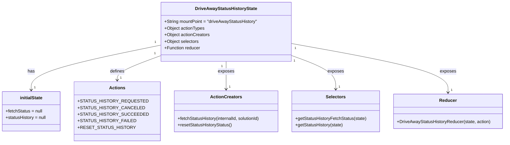

# Diagram: web/portal/src/pages/driveaway/redux/DriveAwayStatusHistoryState.js


> Auto-generated by Obscura crawlers

## Diagram 1

```mermaid
flowchart LR
  A[fetchStatusHistory(internalId, solutionId)] --> B{dispatch STATUS_HISTORY_REQUESTED}
  B --> C[Promise.all( axios.get(DRIVE_AWAY_URL, params) )]
  C --> D{HTTP response}
  D -->|success| E[dispatch STATUS_HISTORY_SUCCEEDED\npayload: response[0].data || []]
  D -->|error| F[dispatch STATUS_HISTORY_FAILED\nerror: err]
  E --> G[DriveAwayStatusHistoryReducer: case STATUS_HISTORY_SUCCEEDED\n- fetchStatus = "SUCCESS"\n- statusHistory = action.payload]
  F --> H[DriveAwayStatusHistoryReducer: case STATUS_HISTORY_FAILED\n- fetchStatus = "FAILED"]
  B --> I[DriveAwayStatusHistoryReducer: case STATUS_HISTORY_REQUESTED\n- fetchStatus = "IN_PROGRESS"]
  J[resetStatusHistoryStatus()] --> K[dispatch RESET_STATUS_HISTORY]
  K --> L[DriveAwayStatusHistoryReducer: case RESET_STATUS_HISTORY\n- fetchStatus = null]
  G --> M[getStatusHistory(state) -> state[driveAwayStatusHistory].statusHistory]
  H --> N[getStatusHistoryFetchStatus(state) -> state[driveAwayStatusHistory].fetchStatus]
```

> SVG rendering failed for this diagram.

## Diagram 2



### SVG

<svg id="container" width="1791.5234375" xmlns="http://www.w3.org/2000/svg" class="classDiagram" height="522" viewBox="0 0 1791.5234375 522" role="graphics-document document" aria-roledescription="class"><style>#container{font-family:"trebuchet ms",verdana,arial,sans-serif;font-size:16px;fill:#333;}@keyframes edge-animation-frame{from{stroke-dashoffset:0;}}@keyframes dash{to{stroke-dashoffset:0;}}#container .edge-animation-slow{stroke-dasharray:9,5!important;stroke-dashoffset:900;animation:dash 50s linear infinite;stroke-linecap:round;}#container .edge-animation-fast{stroke-dasharray:9,5!important;stroke-dashoffset:900;animation:dash 20s linear infinite;stroke-linecap:round;}#container .error-icon{fill:#552222;}#container .error-text{fill:#552222;stroke:#552222;}#container .edge-thickness-normal{stroke-width:1px;}#container .edge-thickness-thick{stroke-width:3.5px;}#container .edge-pattern-solid{stroke-dasharray:0;}#container .edge-thickness-invisible{stroke-width:0;fill:none;}#container .edge-pattern-dashed{stroke-dasharray:3;}#container .edge-pattern-dotted{stroke-dasharray:2;}#container .marker{fill:#333333;stroke:#333333;}#container .marker.cross{stroke:#333333;}#container svg{font-family:"trebuchet ms",verdana,arial,sans-serif;font-size:16px;}#container p{margin:0;}#container g.classGroup text{fill:#9370DB;stroke:none;font-family:"trebuchet ms",verdana,arial,sans-serif;font-size:10px;}#container g.classGroup text .title{font-weight:bolder;}#container .nodeLabel,#container .edgeLabel{color:#131300;}#container .edgeLabel .label rect{fill:#ECECFF;}#container .label text{fill:#131300;}#container .labelBkg{background:#ECECFF;}#container .edgeLabel .label span{background:#ECECFF;}#container .classTitle{font-weight:bolder;}#container .node rect,#container .node circle,#container .node ellipse,#container .node polygon,#container .node path{fill:#ECECFF;stroke:#9370DB;stroke-width:1px;}#container .divider{stroke:#9370DB;stroke-width:1;}#container g.clickable{cursor:pointer;}#container g.classGroup rect{fill:#ECECFF;stroke:#9370DB;}#container g.classGroup line{stroke:#9370DB;stroke-width:1;}#container .classLabel .box{stroke:none;stroke-width:0;fill:#ECECFF;opacity:0.5;}#container .classLabel .label{fill:#9370DB;font-size:10px;}#container .relation{stroke:#333333;stroke-width:1;fill:none;}#container .dashed-line{stroke-dasharray:3;}#container .dotted-line{stroke-dasharray:1 2;}#container #compositionStart,#container .composition{fill:#333333!important;stroke:#333333!important;stroke-width:1;}#container #compositionEnd,#container .composition{fill:#333333!important;stroke:#333333!important;stroke-width:1;}#container #dependencyStart,#container .dependency{fill:#333333!important;stroke:#333333!important;stroke-width:1;}#container #dependencyStart,#container .dependency{fill:#333333!important;stroke:#333333!important;stroke-width:1;}#container #extensionStart,#container .extension{fill:transparent!important;stroke:#333333!important;stroke-width:1;}#container #extensionEnd,#container .extension{fill:transparent!important;stroke:#333333!important;stroke-width:1;}#container #aggregationStart,#container .aggregation{fill:transparent!important;stroke:#333333!important;stroke-width:1;}#container #aggregationEnd,#container .aggregation{fill:transparent!important;stroke:#333333!important;stroke-width:1;}#container #lollipopStart,#container .lollipop{fill:#ECECFF!important;stroke:#333333!important;stroke-width:1;}#container #lollipopEnd,#container .lollipop{fill:#ECECFF!important;stroke:#333333!important;stroke-width:1;}#container .edgeTerminals{font-size:11px;line-height:initial;}#container .classTitleText{text-anchor:middle;font-size:18px;fill:#333;}#container .label-icon{display:inline-block;height:1em;overflow:visible;vertical-align:-0.125em;}#container .node .label-icon path{fill:currentColor;stroke:revert;stroke-width:revert;}#container :root{--mermaid-font-family:"trebuchet ms",verdana,arial,sans-serif;}</style><g><defs><marker id="container_class-aggregationStart" class="marker aggregation class" refX="18" refY="7" markerWidth="190" markerHeight="240" orient="auto"><path d="M 18,7 L9,13 L1,7 L9,1 Z"></path></marker></defs><defs><marker id="container_class-aggregationEnd" class="marker aggregation class" refX="1" refY="7" markerWidth="20" markerHeight="28" orient="auto"><path d="M 18,7 L9,13 L1,7 L9,1 Z"></path></marker></defs><defs><marker id="container_class-extensionStart" class="marker extension class" refX="18" refY="7" markerWidth="190" markerHeight="240" orient="auto"><path d="M 1,7 L18,13 V 1 Z"></path></marker></defs><defs><marker id="container_class-extensionEnd" class="marker extension class" refX="1" refY="7" markerWidth="20" markerHeight="28" orient="auto"><path d="M 1,1 V 13 L18,7 Z"></path></marker></defs><defs><marker id="container_class-compositionStart" class="marker composition class" refX="18" refY="7" markerWidth="190" markerHeight="240" orient="auto"><path d="M 18,7 L9,13 L1,7 L9,1 Z"></path></marker></defs><defs><marker id="container_class-compositionEnd" class="marker composition class" refX="1" refY="7" markerWidth="20" markerHeight="28" orient="auto"><path d="M 18,7 L9,13 L1,7 L9,1 Z"></path></marker></defs><defs><marker id="container_class-dependencyStart" class="marker dependency class" refX="6" refY="7" markerWidth="190" markerHeight="240" orient="auto"><path d="M 5,7 L9,13 L1,7 L9,1 Z"></path></marker></defs><defs><marker id="container_class-dependencyEnd" class="marker dependency class" refX="13" refY="7" markerWidth="20" markerHeight="28" orient="auto"><path d="M 18,7 L9,13 L14,7 L9,1 Z"></path></marker></defs><defs><marker id="container_class-lollipopStart" class="marker lollipop class" refX="13" refY="7" markerWidth="190" markerHeight="240" orient="auto"><circle stroke="black" fill="transparent" cx="7" cy="7" r="6"></circle></marker></defs><defs><marker id="container_class-lollipopEnd" class="marker lollipop class" refX="1" refY="7" markerWidth="190" markerHeight="240" orient="auto"><circle stroke="black" fill="transparent" cx="7" cy="7" r="6"></circle></marker></defs><g class="root"><g class="clusters"></g><g class="edgePaths"><path d="M546.668,167.17L474.657,182.809C402.646,198.447,258.624,229.723,186.613,256.528C114.602,283.333,114.602,305.667,114.602,316.833L114.602,328" id="id_DriveAwayStatusHistoryState_initialState_1" class="edge-thickness-normal edge-pattern-solid relation" style=";;;" data-edge="true" data-et="edge" data-id="id_DriveAwayStatusHistoryState_initialState_1" data-points="W3sieCI6NTQ2LjY2Nzk2ODc1LCJ5IjoxNjcuMTcwMzMyODg0ODA2NjR9LHsieCI6MTE0LjYwMTU2MjUsInkiOjI2MX0seyJ4IjoxMTQuNjAxNTYyNSwieSI6MzM0fV0=" marker-end="url(#container_class-dependencyEnd)"></path><path d="M546.668,206.77L523.206,215.809C499.743,224.847,452.819,242.923,429.357,257.128C405.895,271.333,405.895,281.667,405.895,286.833L405.895,292" id="id_DriveAwayStatusHistoryState_Actions_2" class="edge-thickness-normal edge-pattern-solid relation" style=";;;" data-edge="true" data-et="edge" data-id="id_DriveAwayStatusHistoryState_Actions_2" data-points="W3sieCI6NTQ2LjY2Nzk2ODc1LCJ5IjoyMDYuNzcwNDAwMjczOTc1NDR9LHsieCI6NDA1Ljg5NDUzMTI1LCJ5IjoyNjF9LHsieCI6NDA1Ljg5NDUzMTI1LCJ5IjoyOTh9XQ==" marker-end="url(#container_class-dependencyEnd)"></path><path d="M782.297,224L782.297,230.167C782.297,236.333,782.297,248.667,782.297,265.5C782.297,282.333,782.297,303.667,782.297,314.333L782.297,325" id="id_DriveAwayStatusHistoryState_ActionCreators_3" class="edge-thickness-normal edge-pattern-solid relation" style=";;;" data-edge="true" data-et="edge" data-id="id_DriveAwayStatusHistoryState_ActionCreators_3" data-points="W3sieCI6NzgyLjI5Njg3NSwieSI6MjI0fSx7IngiOjc4Mi4yOTY4NzUsInkiOjI2MX0seyJ4Ijo3ODIuMjk2ODc1LCJ5IjozMzF9XQ==" marker-end="url(#container_class-dependencyEnd)"></path><path d="M1017.926,201.385L1045.344,211.321C1072.763,221.257,1127.6,241.128,1155.019,261.731C1182.438,282.333,1182.438,303.667,1182.438,314.333L1182.438,325" id="id_DriveAwayStatusHistoryState_Selectors_4" class="edge-thickness-normal edge-pattern-solid relation" style=";;;" data-edge="true" data-et="edge" data-id="id_DriveAwayStatusHistoryState_Selectors_4" data-points="W3sieCI6MTAxNy45MjU3ODEyNSwieSI6MjAxLjM4NTQ2MDE4OTc3NzA0fSx7IngiOjExODIuNDM3NSwieSI6MjYxfSx7IngiOjExODIuNDM3NSwieSI6MzMxfV0=" marker-end="url(#container_class-dependencyEnd)"></path><path d="M1017.926,158.448L1112.804,175.54C1207.682,192.632,1397.439,226.816,1492.317,256.575C1587.195,286.333,1587.195,311.667,1587.195,324.333L1587.195,337" id="id_DriveAwayStatusHistoryState_Reducer_5" class="edge-thickness-normal edge-pattern-solid relation" style=";;;" data-edge="true" data-et="edge" data-id="id_DriveAwayStatusHistoryState_Reducer_5" data-points="W3sieCI6MTAxNy45MjU3ODEyNSwieSI6MTU4LjQ0NzgyOTIwOTgxODh9LHsieCI6MTU4Ny4xOTUzMTI1LCJ5IjoyNjF9LHsieCI6MTU4Ny4xOTUzMTI1LCJ5IjozNDN9XQ==" marker-end="url(#container_class-dependencyEnd)"></path></g><g class="edgeLabels"><g class="edgeLabel" transform="translate(114.6015625, 261)"><g class="label" data-id="id_DriveAwayStatusHistoryState_initialState_1" transform="translate(-12.703125, -12)"><foreignObject width="25.40625" height="24"><div xmlns="http://www.w3.org/1999/xhtml" class="labelBkg" style="display: table-cell; white-space: nowrap; line-height: 1.5; max-width: 200px; text-align: center;"><span class="edgeLabel"><p>has</p></span></div></foreignObject></g></g><g class="edgeLabel" transform="translate(405.89453125, 261)"><g class="label" data-id="id_DriveAwayStatusHistoryState_Actions_2" transform="translate(-26.53125, -12)"><foreignObject width="53.0625" height="24"><div xmlns="http://www.w3.org/1999/xhtml" class="labelBkg" style="display: table-cell; white-space: nowrap; line-height: 1.5; max-width: 200px; text-align: center;"><span class="edgeLabel"><p>defines</p></span></div></foreignObject></g></g><g class="edgeLabel" transform="translate(782.296875, 261)"><g class="label" data-id="id_DriveAwayStatusHistoryState_ActionCreators_3" transform="translate(-29.4296875, -12)"><foreignObject width="58.859375" height="24"><div xmlns="http://www.w3.org/1999/xhtml" class="labelBkg" style="display: table-cell; white-space: nowrap; line-height: 1.5; max-width: 200px; text-align: center;"><span class="edgeLabel"><p>exposes</p></span></div></foreignObject></g></g><g class="edgeLabel" transform="translate(1182.4375, 261)"><g class="label" data-id="id_DriveAwayStatusHistoryState_Selectors_4" transform="translate(-29.4296875, -12)"><foreignObject width="58.859375" height="24"><div xmlns="http://www.w3.org/1999/xhtml" class="labelBkg" style="display: table-cell; white-space: nowrap; line-height: 1.5; max-width: 200px; text-align: center;"><span class="edgeLabel"><p>exposes</p></span></div></foreignObject></g></g><g class="edgeLabel" transform="translate(1587.1953125, 261)"><g class="label" data-id="id_DriveAwayStatusHistoryState_Reducer_5" transform="translate(-29.4296875, -12)"><foreignObject width="58.859375" height="24"><div xmlns="http://www.w3.org/1999/xhtml" class="labelBkg" style="display: table-cell; white-space: nowrap; line-height: 1.5; max-width: 200px; text-align: center;"><span class="edgeLabel"><p>exposes</p></span></div></foreignObject></g></g><g class="edgeTerminals" transform="translate(526.383302060562, 156.22582278746884)"><g class="inner" transform="translate(0, 0)"><foreignObject style="width: 9px; height: 12px;"><div xmlns="http://www.w3.org/1999/xhtml" style="display: inline-block; padding-right: 1px; white-space: nowrap;"><span class="edgeLabel">1</span></div></foreignObject></g></g><g class="edgeTerminals" transform="translate(524.9456329712176, 199.0639018608198)"><g class="inner" transform="translate(0, 0)"><foreignObject style="width: 9px; height: 12px;"><div xmlns="http://www.w3.org/1999/xhtml" style="display: inline-block; padding-right: 1px; white-space: nowrap;"><span class="edgeLabel">1</span></div></foreignObject></g></g><g class="edgeTerminals" transform="translate(767.2968775, 241.50000214285714)"><g class="inner" transform="translate(0, 0)"><foreignObject style="width: 9px; height: 12px;"><div xmlns="http://www.w3.org/1999/xhtml" style="display: inline-block; padding-right: 1px; white-space: nowrap;"><span class="edgeLabel">1</span></div></foreignObject></g></g><g class="edgeTerminals" transform="translate(1029.2684347023917, 221.45021195879727)"><g class="inner" transform="translate(0, 0)"><foreignObject style="width: 9px; height: 12px;"><div xmlns="http://www.w3.org/1999/xhtml" style="display: inline-block; padding-right: 1px; white-space: nowrap;"><span class="edgeLabel">1</span></div></foreignObject></g></g><g class="edgeTerminals" transform="translate(1032.4891478312493, 176.3128308024709)"><g class="inner" transform="translate(0, 0)"><foreignObject style="width: 9px; height: 12px;"><div xmlns="http://www.w3.org/1999/xhtml" style="display: inline-block; padding-right: 1px; white-space: nowrap;"><span class="edgeLabel">1</span></div></foreignObject></g></g><g class="edgeTerminals" transform="translate(124.60156124999997, 311.4999989285714)"><g class="inner" transform="translate(0, 0)"></g><foreignObject style="width: 9px; height: 12px;"><div xmlns="http://www.w3.org/1999/xhtml" style="display: inline-block; padding-right: 1px; white-space: nowrap;"><span class="edgeLabel">1</span></div></foreignObject></g><g class="edgeTerminals" transform="translate(415.894530625, 275.4999994642857)"><g class="inner" transform="translate(0, 0)"></g><foreignObject style="width: 9px; height: 12px;"><div xmlns="http://www.w3.org/1999/xhtml" style="display: inline-block; padding-right: 1px; white-space: nowrap;"><span class="edgeLabel">1</span></div></foreignObject></g><g class="edgeTerminals" transform="translate(792.2968774999998, 308.5000021428571)"><g class="inner" transform="translate(0, 0)"></g><foreignObject style="width: 9px; height: 12px;"><div xmlns="http://www.w3.org/1999/xhtml" style="display: inline-block; padding-right: 1px; white-space: nowrap;"><span class="edgeLabel">1</span></div></foreignObject></g><g class="edgeTerminals" transform="translate(1192.4375, 308.5)"><g class="inner" transform="translate(0, 0)"></g><foreignObject style="width: 9px; height: 12px;"><div xmlns="http://www.w3.org/1999/xhtml" style="display: inline-block; padding-right: 1px; white-space: nowrap;"><span class="edgeLabel">1</span></div></foreignObject></g><g class="edgeTerminals" transform="translate(1597.19531125, 320.4999989285715)"><g class="inner" transform="translate(0, 0)"></g><foreignObject style="width: 9px; height: 12px;"><div xmlns="http://www.w3.org/1999/xhtml" style="display: inline-block; padding-right: 1px; white-space: nowrap;"><span class="edgeLabel">1</span></div></foreignObject></g></g><g class="nodes"><g class="node default" id="classId-DriveAwayStatusHistoryState-0" transform="translate(782.296875, 116)"><g class="basic label-container"><path d="M-235.62890625 -108 L235.62890625 -108 L235.62890625 108 L-235.62890625 108" stroke="none" stroke-width="0" fill="#ECECFF" style=""></path><path d="M-235.62890625 -108 C-132.24415943963143 -108, -28.859412629262863 -108, 235.62890625 -108 M-235.62890625 -108 C-119.80288340818177 -108, -3.9768605663635412 -108, 235.62890625 -108 M235.62890625 -108 C235.62890625 -61.05145919041678, 235.62890625 -14.102918380833557, 235.62890625 108 M235.62890625 -108 C235.62890625 -24.214524230418945, 235.62890625 59.57095153916211, 235.62890625 108 M235.62890625 108 C112.773759740281 108, -10.081386769438012 108, -235.62890625 108 M235.62890625 108 C110.46802368934438 108, -14.692858871311245 108, -235.62890625 108 M-235.62890625 108 C-235.62890625 55.660550818510714, -235.62890625 3.321101637021428, -235.62890625 -108 M-235.62890625 108 C-235.62890625 29.374904662222477, -235.62890625 -49.25019067555505, -235.62890625 -108" stroke="#9370DB" stroke-width="1.3" fill="none" stroke-dasharray="0 0" style=""></path></g><g class="annotation-group text" transform="translate(0, -84)"></g><g class="label-group text" transform="translate(-107.3515625, -84)"><g class="label" style="font-weight: bolder" transform="translate(0,-12)"><foreignObject width="214.703125" height="24"><div xmlns="http://www.w3.org/1999/xhtml" style="display: table-cell; white-space: nowrap; line-height: 1.5; max-width: 259px; text-align: center;"><span class="nodeLabel markdown-node-label" style=""><p>DriveAwayStatusHistoryState</p></span></div></foreignObject></g></g><g class="members-group text" transform="translate(-223.62890625, -36)"><g class="label" style="" transform="translate(0,-12)"><foreignObject width="339.90625" height="24"><div xmlns="http://www.w3.org/1999/xhtml" style="display: table-cell; white-space: nowrap; line-height: 1.5; max-width: 397px; text-align: center;"><span class="nodeLabel markdown-node-label" style=""><p>+String mountPoint = "driveAwayStatusHistory"</p></span></div></foreignObject></g><g class="label" style="" transform="translate(0,12)"><foreignObject width="145.984375" height="24"><div xmlns="http://www.w3.org/1999/xhtml" style="display: table-cell; white-space: nowrap; line-height: 1.5; max-width: 203px; text-align: center;"><span class="nodeLabel markdown-node-label" style=""><p>+Object actionTypes</p></span></div></foreignObject></g><g class="label" style="" transform="translate(0,36)"><foreignObject width="164.765625" height="24"><div xmlns="http://www.w3.org/1999/xhtml" style="display: table-cell; white-space: nowrap; line-height: 1.5; max-width: 222px; text-align: center;"><span class="nodeLabel markdown-node-label" style=""><p>+Object actionCreators</p></span></div></foreignObject></g><g class="label" style="" transform="translate(0,60)"><foreignObject width="124.890625" height="24"><div xmlns="http://www.w3.org/1999/xhtml" style="display: table-cell; white-space: nowrap; line-height: 1.5; max-width: 182px; text-align: center;"><span class="nodeLabel markdown-node-label" style=""><p>+Object selectors</p></span></div></foreignObject></g><g class="label" style="" transform="translate(0,84)"><foreignObject width="130.359375" height="24"><div xmlns="http://www.w3.org/1999/xhtml" style="display: table-cell; white-space: nowrap; line-height: 1.5; max-width: 189px; text-align: center;"><span class="nodeLabel markdown-node-label" style=""><p>+Function reducer</p></span></div></foreignObject></g></g><g class="methods-group text" transform="translate(-223.62890625, 108)"></g><g class="divider" style=""><path d="M-235.62890625 -60 C-66.90463993444436 -60, 101.81962638111128 -60, 235.62890625 -60 M-235.62890625 -60 C-139.16400351643674 -60, -42.69910078287347 -60, 235.62890625 -60" stroke="#9370DB" stroke-width="1.3" fill="none" stroke-dasharray="0 0" style=""></path></g><g class="divider" style=""><path d="M-235.62890625 84 C-122.21178824861403 84, -8.794670247228055 84, 235.62890625 84 M-235.62890625 84 C-131.71340755207967 84, -27.797908854159346 84, 235.62890625 84" stroke="#9370DB" stroke-width="1.3" fill="none" stroke-dasharray="0 0" style=""></path></g></g><g class="node default" id="classId-initialState-1" transform="translate(114.6015625, 406)"><g class="basic label-container"><path d="M-106.6015625 -72 L106.6015625 -72 L106.6015625 72 L-106.6015625 72" stroke="none" stroke-width="0" fill="#ECECFF" style=""></path><path d="M-106.6015625 -72 C-52.478260925143665 -72, 1.6450406497126693 -72, 106.6015625 -72 M-106.6015625 -72 C-46.764052875347986 -72, 13.073456749304029 -72, 106.6015625 -72 M106.6015625 -72 C106.6015625 -15.408457990097766, 106.6015625 41.18308401980447, 106.6015625 72 M106.6015625 -72 C106.6015625 -37.54942086891044, 106.6015625 -3.0988417378208766, 106.6015625 72 M106.6015625 72 C36.59805976561519 72, -33.40544296876962 72, -106.6015625 72 M106.6015625 72 C56.2865429948503 72, 5.971523489700601 72, -106.6015625 72 M-106.6015625 72 C-106.6015625 24.784038689447883, -106.6015625 -22.431922621104235, -106.6015625 -72 M-106.6015625 72 C-106.6015625 27.830730378521658, -106.6015625 -16.338539242956685, -106.6015625 -72" stroke="#9370DB" stroke-width="1.3" fill="none" stroke-dasharray="0 0" style=""></path></g><g class="annotation-group text" transform="translate(0, -48)"></g><g class="label-group text" transform="translate(-40.46875, -48)"><g class="label" style="font-weight: bolder" transform="translate(0,-12)"><foreignObject width="80.9375" height="24"><div xmlns="http://www.w3.org/1999/xhtml" style="display: table-cell; white-space: nowrap; line-height: 1.5; max-width: 129px; text-align: center;"><span class="nodeLabel markdown-node-label" style=""><p>initialState</p></span></div></foreignObject></g></g><g class="members-group text" transform="translate(-94.6015625, 0)"><g class="label" style="" transform="translate(0,-12)"><foreignObject width="134.421875" height="24"><div xmlns="http://www.w3.org/1999/xhtml" style="display: table-cell; white-space: nowrap; line-height: 1.5; max-width: 192px; text-align: center;"><span class="nodeLabel markdown-node-label" style=""><p>+fetchStatus = null</p></span></div></foreignObject></g><g class="label" style="" transform="translate(0,12)"><foreignObject width="148.734375" height="24"><div xmlns="http://www.w3.org/1999/xhtml" style="display: table-cell; white-space: nowrap; line-height: 1.5; max-width: 206px; text-align: center;"><span class="nodeLabel markdown-node-label" style=""><p>+statusHistory = null</p></span></div></foreignObject></g></g><g class="methods-group text" transform="translate(-94.6015625, 72)"></g><g class="divider" style=""><path d="M-106.6015625 -24 C-59.76167253270064 -24, -12.921782565401287 -24, 106.6015625 -24 M-106.6015625 -24 C-50.24741693032371 -24, 6.106728639352582 -24, 106.6015625 -24" stroke="#9370DB" stroke-width="1.3" fill="none" stroke-dasharray="0 0" style=""></path></g><g class="divider" style=""><path d="M-106.6015625 48 C-39.39669610241556 48, 27.80817029516888 48, 106.6015625 48 M-106.6015625 48 C-53.8029798543086 48, -1.0043972086172062 48, 106.6015625 48" stroke="#9370DB" stroke-width="1.3" fill="none" stroke-dasharray="0 0" style=""></path></g></g><g class="node default" id="classId-Actions-2" transform="translate(405.89453125, 406)"><g class="basic label-container"><path d="M-134.69140625 -108 L134.69140625 -108 L134.69140625 108 L-134.69140625 108" stroke="none" stroke-width="0" fill="#ECECFF" style=""></path><path d="M-134.69140625 -108 C-33.04994613192014 -108, 68.59151398615973 -108, 134.69140625 -108 M-134.69140625 -108 C-33.36480046415625 -108, 67.9618053216875 -108, 134.69140625 -108 M134.69140625 -108 C134.69140625 -35.50895264076365, 134.69140625 36.982094718472695, 134.69140625 108 M134.69140625 -108 C134.69140625 -64.47049601955901, 134.69140625 -20.940992039118015, 134.69140625 108 M134.69140625 108 C58.52692133759771 108, -17.637563574804574 108, -134.69140625 108 M134.69140625 108 C30.836026837667248 108, -73.0193525746655 108, -134.69140625 108 M-134.69140625 108 C-134.69140625 44.42022355279106, -134.69140625 -19.159552894417885, -134.69140625 -108 M-134.69140625 108 C-134.69140625 26.636400233065103, -134.69140625 -54.72719953386979, -134.69140625 -108" stroke="#9370DB" stroke-width="1.3" fill="none" stroke-dasharray="0 0" style=""></path></g><g class="annotation-group text" transform="translate(0, -84)"></g><g class="label-group text" transform="translate(-27.0546875, -84)"><g class="label" style="font-weight: bolder" transform="translate(0,-12)"><foreignObject width="54.109375" height="24"><div xmlns="http://www.w3.org/1999/xhtml" style="display: table-cell; white-space: nowrap; line-height: 1.5; max-width: 103px; text-align: center;"><span class="nodeLabel markdown-node-label" style=""><p>Actions</p></span></div></foreignObject></g></g><g class="members-group text" transform="translate(-122.69140625, -36)"><g class="label" style="" transform="translate(0,-12)"><foreignObject width="218.328125" height="24"><div xmlns="http://www.w3.org/1999/xhtml" style="display: table-cell; white-space: nowrap; line-height: 1.5; max-width: 276px; text-align: center;"><span class="nodeLabel markdown-node-label" style=""><p>+STATUS_HISTORY_REQUESTED</p></span></div></foreignObject></g><g class="label" style="" transform="translate(0,12)"><foreignObject width="207.5" height="24"><div xmlns="http://www.w3.org/1999/xhtml" style="display: table-cell; white-space: nowrap; line-height: 1.5; max-width: 265px; text-align: center;"><span class="nodeLabel markdown-node-label" style=""><p>+STATUS_HISTORY_CANCELED</p></span></div></foreignObject></g><g class="label" style="" transform="translate(0,36)"><foreignObject width="217.609375" height="24"><div xmlns="http://www.w3.org/1999/xhtml" style="display: table-cell; white-space: nowrap; line-height: 1.5; max-width: 275px; text-align: center;"><span class="nodeLabel markdown-node-label" style=""><p>+STATUS_HISTORY_SUCCEEDED</p></span></div></foreignObject></g><g class="label" style="" transform="translate(0,60)"><foreignObject width="182.5" height="24"><div xmlns="http://www.w3.org/1999/xhtml" style="display: table-cell; white-space: nowrap; line-height: 1.5; max-width: 240px; text-align: center;"><span class="nodeLabel markdown-node-label" style=""><p>+STATUS_HISTORY_FAILED</p></span></div></foreignObject></g><g class="label" style="" transform="translate(0,84)"><foreignObject width="179.15625" height="24"><div xmlns="http://www.w3.org/1999/xhtml" style="display: table-cell; white-space: nowrap; line-height: 1.5; max-width: 237px; text-align: center;"><span class="nodeLabel markdown-node-label" style=""><p>+RESET_STATUS_HISTORY</p></span></div></foreignObject></g></g><g class="methods-group text" transform="translate(-122.69140625, 108)"></g><g class="divider" style=""><path d="M-134.69140625 -60 C-41.14507118378147 -60, 52.401263882437064 -60, 134.69140625 -60 M-134.69140625 -60 C-71.7947501684832 -60, -8.89809408696641 -60, 134.69140625 -60" stroke="#9370DB" stroke-width="1.3" fill="none" stroke-dasharray="0 0" style=""></path></g><g class="divider" style=""><path d="M-134.69140625 84 C-73.18677049144847 84, -11.682134732896941 84, 134.69140625 84 M-134.69140625 84 C-58.60193966405751 84, 17.487526921884978 84, 134.69140625 84" stroke="#9370DB" stroke-width="1.3" fill="none" stroke-dasharray="0 0" style=""></path></g></g><g class="node default" id="classId-ActionCreators-3" transform="translate(782.296875, 406)"><g class="basic label-container"><path d="M-191.7109375 -75 L191.7109375 -75 L191.7109375 75 L-191.7109375 75" stroke="none" stroke-width="0" fill="#ECECFF" style=""></path><path d="M-191.7109375 -75 C-113.36338518967831 -75, -35.01583287935662 -75, 191.7109375 -75 M-191.7109375 -75 C-55.00234222433173 -75, 81.70625305133655 -75, 191.7109375 -75 M191.7109375 -75 C191.7109375 -35.60576367187993, 191.7109375 3.7884726562401454, 191.7109375 75 M191.7109375 -75 C191.7109375 -43.6341322843005, 191.7109375 -12.268264568600998, 191.7109375 75 M191.7109375 75 C62.87858528392536 75, -65.95376693214928 75, -191.7109375 75 M191.7109375 75 C58.52852538615991 75, -74.65388672768017 75, -191.7109375 75 M-191.7109375 75 C-191.7109375 19.906772873403696, -191.7109375 -35.18645425319261, -191.7109375 -75 M-191.7109375 75 C-191.7109375 40.176448902360114, -191.7109375 5.352897804720229, -191.7109375 -75" stroke="#9370DB" stroke-width="1.3" fill="none" stroke-dasharray="0 0" style=""></path></g><g class="annotation-group text" transform="translate(0, -51)"></g><g class="label-group text" transform="translate(-53.96875, -51)"><g class="label" style="font-weight: bolder" transform="translate(0,-12)"><foreignObject width="107.9375" height="24"><div xmlns="http://www.w3.org/1999/xhtml" style="display: table-cell; white-space: nowrap; line-height: 1.5; max-width: 156px; text-align: center;"><span class="nodeLabel markdown-node-label" style=""><p>ActionCreators</p></span></div></foreignObject></g></g><g class="members-group text" transform="translate(-179.7109375, -3)"></g><g class="methods-group text" transform="translate(-179.7109375, 27)"><g class="label" style="" transform="translate(0,-12)"><foreignObject width="305.453125" height="24"><div xmlns="http://www.w3.org/1999/xhtml" style="display: table-cell; white-space: nowrap; line-height: 1.5; max-width: 363px; text-align: center;"><span class="nodeLabel markdown-node-label" style=""><p>+fetchStatusHistory(internalId, solutionId)</p></span></div></foreignObject></g><g class="label" style="" transform="translate(0,12)"><foreignObject width="197.828125" height="24"><div xmlns="http://www.w3.org/1999/xhtml" style="display: table-cell; white-space: nowrap; line-height: 1.5; max-width: 255px; text-align: center;"><span class="nodeLabel markdown-node-label" style=""><p>+resetStatusHistoryStatus()</p></span></div></foreignObject></g></g><g class="divider" style=""><path d="M-191.7109375 -27 C-51.26471852166355 -27, 89.1815004566729 -27, 191.7109375 -27 M-191.7109375 -27 C-94.36223646483597 -27, 2.986464570328053 -27, 191.7109375 -27" stroke="#9370DB" stroke-width="1.3" fill="none" stroke-dasharray="0 0" style=""></path></g><g class="divider" style=""><path d="M-191.7109375 -3 C-107.32378988278137 -3, -22.93664226556274 -3, 191.7109375 -3 M-191.7109375 -3 C-114.82615588426381 -3, -37.941374268527625 -3, 191.7109375 -3" stroke="#9370DB" stroke-width="1.3" fill="none" stroke-dasharray="0 0" style=""></path></g></g><g class="node default" id="classId-Selectors-4" transform="translate(1182.4375, 406)"><g class="basic label-container"><path d="M-158.4296875 -75 L158.4296875 -75 L158.4296875 75 L-158.4296875 75" stroke="none" stroke-width="0" fill="#ECECFF" style=""></path><path d="M-158.4296875 -75 C-36.18616928808353 -75, 86.05734892383293 -75, 158.4296875 -75 M-158.4296875 -75 C-67.09871089110938 -75, 24.232265717781246 -75, 158.4296875 -75 M158.4296875 -75 C158.4296875 -31.832378961314994, 158.4296875 11.335242077370012, 158.4296875 75 M158.4296875 -75 C158.4296875 -23.83339954867099, 158.4296875 27.33320090265802, 158.4296875 75 M158.4296875 75 C68.50137508742858 75, -21.42693732514283 75, -158.4296875 75 M158.4296875 75 C74.42845370072114 75, -9.572780098557729 75, -158.4296875 75 M-158.4296875 75 C-158.4296875 27.10075883449177, -158.4296875 -20.79848233101646, -158.4296875 -75 M-158.4296875 75 C-158.4296875 22.9342234437686, -158.4296875 -29.131553112462797, -158.4296875 -75" stroke="#9370DB" stroke-width="1.3" fill="none" stroke-dasharray="0 0" style=""></path></g><g class="annotation-group text" transform="translate(0, -51)"></g><g class="label-group text" transform="translate(-34.171875, -51)"><g class="label" style="font-weight: bolder" transform="translate(0,-12)"><foreignObject width="68.34375" height="24"><div xmlns="http://www.w3.org/1999/xhtml" style="display: table-cell; white-space: nowrap; line-height: 1.5; max-width: 117px; text-align: center;"><span class="nodeLabel markdown-node-label" style=""><p>Selectors</p></span></div></foreignObject></g></g><g class="members-group text" transform="translate(-146.4296875, -3)"></g><g class="methods-group text" transform="translate(-146.4296875, 27)"><g class="label" style="" transform="translate(0,-12)"><foreignObject width="258.6875" height="24"><div xmlns="http://www.w3.org/1999/xhtml" style="display: table-cell; white-space: nowrap; line-height: 1.5; max-width: 316px; text-align: center;"><span class="nodeLabel markdown-node-label" style=""><p>+getStatusHistoryFetchStatus(state)</p></span></div></foreignObject></g><g class="label" style="" transform="translate(0,12)"><foreignObject width="174.453125" height="24"><div xmlns="http://www.w3.org/1999/xhtml" style="display: table-cell; white-space: nowrap; line-height: 1.5; max-width: 232px; text-align: center;"><span class="nodeLabel markdown-node-label" style=""><p>+getStatusHistory(state)</p></span></div></foreignObject></g></g><g class="divider" style=""><path d="M-158.4296875 -27 C-60.904377058992665 -27, 36.62093338201467 -27, 158.4296875 -27 M-158.4296875 -27 C-53.41111212905797 -27, 51.60746324188406 -27, 158.4296875 -27" stroke="#9370DB" stroke-width="1.3" fill="none" stroke-dasharray="0 0" style=""></path></g><g class="divider" style=""><path d="M-158.4296875 -3 C-84.6597444287986 -3, -10.889801357597207 -3, 158.4296875 -3 M-158.4296875 -3 C-73.57840646770782 -3, 11.272874564584356 -3, 158.4296875 -3" stroke="#9370DB" stroke-width="1.3" fill="none" stroke-dasharray="0 0" style=""></path></g></g><g class="node default" id="classId-Reducer-5" transform="translate(1587.1953125, 406)"><g class="basic label-container"><path d="M-196.328125 -63 L196.328125 -63 L196.328125 63 L-196.328125 63" stroke="none" stroke-width="0" fill="#ECECFF" style=""></path><path d="M-196.328125 -63 C-42.32462877855579 -63, 111.67886744288842 -63, 196.328125 -63 M-196.328125 -63 C-100.94857010686952 -63, -5.56901521373905 -63, 196.328125 -63 M196.328125 -63 C196.328125 -13.159829292666586, 196.328125 36.68034141466683, 196.328125 63 M196.328125 -63 C196.328125 -37.631422822780344, 196.328125 -12.262845645560688, 196.328125 63 M196.328125 63 C88.06011692872232 63, -20.207891142555354 63, -196.328125 63 M196.328125 63 C112.3077313412104 63, 28.287337682420798 63, -196.328125 63 M-196.328125 63 C-196.328125 22.491795317300742, -196.328125 -18.016409365398516, -196.328125 -63 M-196.328125 63 C-196.328125 15.368205628271731, -196.328125 -32.26358874345654, -196.328125 -63" stroke="#9370DB" stroke-width="1.3" fill="none" stroke-dasharray="0 0" style=""></path></g><g class="annotation-group text" transform="translate(0, -39)"></g><g class="label-group text" transform="translate(-29.90625, -39)"><g class="label" style="font-weight: bolder" transform="translate(0,-12)"><foreignObject width="59.8125" height="24"><div xmlns="http://www.w3.org/1999/xhtml" style="display: table-cell; white-space: nowrap; line-height: 1.5; max-width: 110px; text-align: center;"><span class="nodeLabel markdown-node-label" style=""><p>Reducer</p></span></div></foreignObject></g></g><g class="members-group text" transform="translate(-184.328125, 9)"></g><g class="methods-group text" transform="translate(-184.328125, 39)"><g class="label" style="" transform="translate(0,-12)"><foreignObject width="338.75" height="24"><div xmlns="http://www.w3.org/1999/xhtml" style="display: table-cell; white-space: nowrap; line-height: 1.5; max-width: 396px; text-align: center;"><span class="nodeLabel markdown-node-label" style=""><p>+DriveAwayStatusHistoryReducer(state, action)</p></span></div></foreignObject></g></g><g class="divider" style=""><path d="M-196.328125 -15 C-86.34274234967937 -15, 23.64264030064126 -15, 196.328125 -15 M-196.328125 -15 C-41.159585221981956 -15, 114.00895455603609 -15, 196.328125 -15" stroke="#9370DB" stroke-width="1.3" fill="none" stroke-dasharray="0 0" style=""></path></g><g class="divider" style=""><path d="M-196.328125 9 C-96.95801557381378 9, 2.4120938523724362 9, 196.328125 9 M-196.328125 9 C-87.17923735982853 9, 21.969650280342933 9, 196.328125 9" stroke="#9370DB" stroke-width="1.3" fill="none" stroke-dasharray="0 0" style=""></path></g></g></g></g></g></svg>
