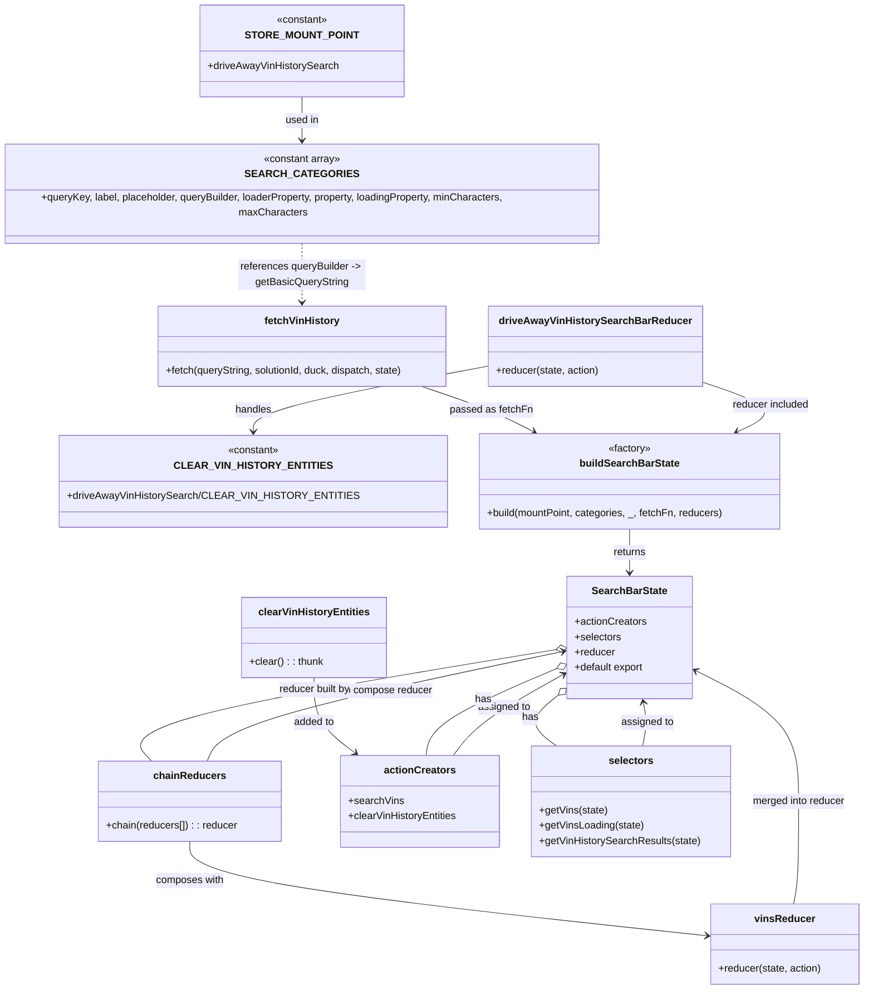

# Diagram: web/portal/src/pages/driveaway/redux/DriveAwayVinHistorySearchBarState.js

> Auto-generated by Obscura crawlers

## Mermaid

### SVG

<svg id="container" width="1348.52734375" xmlns="http://www.w3.org/2000/svg" class="classDiagram" height="1540" viewBox="0 0 1348.52734375 1540" role="graphics-document document" aria-roledescription="class"><g><defs><marker id="container_class-aggregationStart" class="marker aggregation class" refX="18" refY="7" markerWidth="190" markerHeight="240" orient="auto"><path d="M 18,7 L9,13 L1,7 L9,1 Z"></path></marker></defs><defs><marker id="container_class-aggregationEnd" class="marker aggregation class" refX="1" refY="7" markerWidth="20" markerHeight="28" orient="auto"><path d="M 18,7 L9,13 L1,7 L9,1 Z"></path></marker></defs><defs><marker id="container_class-extensionStart" class="marker extension class" refX="18" refY="7" markerWidth="190" markerHeight="240" orient="auto"><path d="M 1,7 L18,13 V 1 Z"></path></marker></defs><defs><marker id="container_class-extensionEnd" class="marker extension class" refX="1" refY="7" markerWidth="20" markerHeight="28" orient="auto"><path d="M 1,1 V 13 L18,7 Z"></path></marker></defs><defs><marker id="container_class-compositionStart" class="marker composition class" refX="18" refY="7" markerWidth="190" markerHeight="240" orient="auto"><path d="M 18,7 L9,13 L1,7 L9,1 Z"></path></marker></defs><defs><marker id="container_class-compositionEnd" class="marker composition class" refX="1" refY="7" markerWidth="20" markerHeight="28" orient="auto"><path d="M 18,7 L9,13 L1,7 L9,1 Z"></path></marker></defs><defs><marker id="container_class-dependencyStart" class="marker dependency class" refX="6" refY="7" markerWidth="190" markerHeight="240" orient="auto"><path d="M 5,7 L9,13 L1,7 L9,1 Z"></path></marker></defs><defs><marker id="container_class-dependencyEnd" class="marker dependency class" refX="13" refY="7" markerWidth="20" markerHeight="28" orient="auto"><path d="M 18,7 L9,13 L14,7 L9,1 Z"></path></marker></defs><defs><marker id="container_class-lollipopStart" class="marker lollipop class" refX="13" refY="7" markerWidth="190" markerHeight="240" orient="auto"><circle stroke="black" fill="transparent" cx="7" cy="7" r="6"></circle></marker></defs><defs><marker id="container_class-lollipopEnd" class="marker lollipop class" refX="1" refY="7" markerWidth="190" markerHeight="240" orient="auto"><circle stroke="black" fill="transparent" cx="7" cy="7" r="6"></circle></marker></defs><g class="root"><g class="clusters"></g><g class="edgePaths"><path d="M483.371,152L483.371,158.167C483.371,164.333,483.371,176.667,483.371,188C483.371,199.333,483.371,209.667,483.371,214.833L483.371,220" id="id_STORE_MOUNT_POINT_SEARCH_CATEGORIES_1" class="edge-thickness-normal edge-pattern-solid relation" style=";;;" data-edge="true" data-et="edge" data-id="id_STORE_MOUNT_POINT_SEARCH_CATEGORIES_1" data-points="W3sieCI6NDgzLjM3MTA5Mzc1LCJ5IjoxNTJ9LHsieCI6NDgzLjM3MTA5Mzc1LCJ5IjoxODl9LHsieCI6NDgzLjM3MTA5Mzc1LCJ5IjoyMjZ9XQ==" marker-end="url(#container_class-dependencyEnd)"></path><path d="M483.371,370L483.371,378.167C483.371,386.333,483.371,402.667,483.371,418C483.371,433.333,483.371,447.667,483.371,454.833L483.371,462" id="id_SEARCH_CATEGORIES_fetchVinHistory_2" class="edge-thickness-normal edge-pattern-dashed relation" style=";;;" data-edge="true" data-et="edge" data-id="id_SEARCH_CATEGORIES_fetchVinHistory_2" data-points="W3sieCI6NDgzLjM3MTA5Mzc1LCJ5IjozNzB9LHsieCI6NDgzLjM3MTA5Mzc1LCJ5Ijo0MTl9LHsieCI6NDgzLjM3MTA5Mzc1LCJ5Ijo0Njh9XQ==" marker-end="url(#container_class-dependencyEnd)"></path><path d="M971.984,818L971.984,824.167C971.984,830.333,971.984,842.667,971.984,854C971.984,865.333,971.984,875.667,971.984,880.833L971.984,886" id="id_buildSearchBarState_SearchBarState_3" class="edge-thickness-normal edge-pattern-solid relation" style=";;;" data-edge="true" data-et="edge" data-id="id_buildSearchBarState_SearchBarState_3" data-points="W3sieCI6OTcxLjk4NDM3NSwieSI6ODE4fSx7IngiOjk3MS45ODQzNzUsInkiOjg1NX0seyJ4Ijo5NzEuOTg0Mzc1LCJ5Ijo4OTJ9XQ==" marker-end="url(#container_class-dependencyEnd)"></path><path d="M670.672,594L689.005,600.167C707.339,606.333,744.006,618.667,772.011,630.495C800.015,642.323,819.356,653.646,829.026,659.307L838.697,664.969" id="id_fetchVinHistory_buildSearchBarState_4" class="edge-thickness-normal edge-pattern-solid relation" style=";;;" data-edge="true" data-et="edge" data-id="id_fetchVinHistory_buildSearchBarState_4" data-points="W3sieCI6NjcwLjY3MTgxNjQwNjI1LCJ5Ijo1OTR9LHsieCI6NzgwLjY3MzgyODEyNSwieSI6NjMxfSx7IngiOjg0My44NzQ2MzM3ODkwNjI1LCJ5Ijo2Njh9XQ==" marker-end="url(#container_class-dependencyEnd)"></path><path d="M1097.176,586.495L1119.228,593.913C1141.281,601.33,1185.385,616.165,1194.177,629.35C1202.968,642.536,1176.446,654.071,1163.185,659.839L1149.923,665.607" id="id_driveAwayVinHistorySearchBarReducer_buildSearchBarState_5" class="edge-thickness-normal edge-pattern-solid relation" style=";;;" data-edge="true" data-et="edge" data-id="id_driveAwayVinHistorySearchBarReducer_buildSearchBarState_5" data-points="W3sieCI6MTA5Ny4xNzU3ODEyNSwieSI6NTg2LjQ5NTA0MzMyNTczNDZ9LHsieCI6MTIyOS40OTAyMzQzNzUsInkiOjYzMX0seyJ4IjoxMTQ0LjQyMTMzNDQwMjkwMTcsInkiOjY2OH1d" marker-end="url(#container_class-dependencyEnd)"></path><path d="M1246.739,1406L1248.913,1399.833C1251.087,1393.667,1255.435,1381.333,1257.609,1354.5C1259.783,1327.667,1259.783,1286.333,1259.783,1245C1259.783,1203.667,1259.783,1162.333,1228.861,1127.376C1197.938,1092.42,1136.093,1063.839,1105.17,1049.549L1074.247,1035.259" id="id_vinsReducer_SearchBarState_6" class="edge-thickness-normal edge-pattern-solid relation" style=";;;" data-edge="true" data-et="edge" data-id="id_vinsReducer_SearchBarState_6" data-points="W3sieCI6MTI0Ni43Mzg1MzUxNTYyNSwieSI6MTQwNn0seyJ4IjoxMjU5Ljc4MzIwMzEyNSwieSI6MTM2OX0seyJ4IjoxMjU5Ljc4MzIwMzEyNSwieSI6MTI0NX0seyJ4IjoxMjU5Ljc4MzIwMzEyNSwieSI6MTEyMX0seyJ4IjoxMDY4LjgwMDc4MTI1LCJ5IjoxMDMyLjc0MTYwNjg4OTU3ODJ9XQ==" marker-end="url(#container_class-dependencyEnd)"></path><path d="M327.561,1182L331.231,1171.833C334.901,1161.667,342.24,1141.333,432.53,1112.657C522.82,1083.981,696.06,1046.962,782.68,1028.452L869.3,1009.942" id="id_chainReducers_SearchBarState_7" class="edge-thickness-normal edge-pattern-solid relation" style=";;;" data-edge="true" data-et="edge" data-id="id_chainReducers_SearchBarState_7" data-points="W3sieCI6MzI3LjU2MTE2MTE2NDMxNDUsInkiOjExODJ9LHsieCI6MzQ5LjU4MDA3ODEyNSwieSI6MTEyMX0seyJ4Ijo4NzUuMTY3OTY4NzUsInkiOjEwMDguNjg4NDUyOTgxMjg3OX1d" marker-end="url(#container_class-dependencyEnd)"></path><path d="M304.82,1308L304.82,1318.167C304.82,1328.333,304.82,1348.667,437.777,1373.29C570.734,1397.913,836.648,1426.826,969.605,1441.282L1102.562,1455.739" id="id_chainReducers_vinsReducer_8" class="edge-thickness-normal edge-pattern-solid relation" style=";;;" data-edge="true" data-et="edge" data-id="id_chainReducers_vinsReducer_8" data-points="W3sieCI6MzA0LjgyMDMxMjUsInkiOjEzMDh9LHsieCI6MzA0LjgyMDMxMjUsInkiOjEzNjl9LHsieCI6MTEwOC41MjczNDM3NSwieSI6MTQ1Ni4zODcyODc5MDE2MzN9XQ==" marker-end="url(#container_class-dependencyEnd)"></path><path d="M494.018,1051L494.018,1062.667C494.018,1074.333,494.018,1097.667,505.171,1117.413C516.324,1137.16,538.63,1153.32,549.783,1161.4L560.936,1169.48" id="id_clearVinHistoryEntities_actionCreators_9" class="edge-thickness-normal edge-pattern-solid relation" style=";;;" data-edge="true" data-et="edge" data-id="id_clearVinHistoryEntities_actionCreators_9" data-points="W3sieCI6NDk0LjAxNzU3ODEyNSwieSI6MTA1MX0seyJ4Ijo0OTQuMDE3NTc4MTI1LCJ5IjoxMTIxfSx7IngiOjU2NS43OTQ0MTc4NDI3NDIsInkiOjExNzN9XQ==" marker-end="url(#container_class-dependencyEnd)"></path><path d="M712.703,1173L718.424,1164.333C724.145,1155.667,735.586,1138.333,761.803,1117.549C788.019,1096.765,829.011,1072.529,849.507,1060.411L870.003,1048.294" id="id_actionCreators_SearchBarState_10" class="edge-thickness-normal edge-pattern-solid relation" style=";;;" data-edge="true" data-et="edge" data-id="id_actionCreators_SearchBarState_10" data-points="W3sieCI6NzEyLjcwMzMxNDAxMjA5NjgsInkiOjExNzN9LHsieCI6NzQ3LjAyNzM0Mzc1LCJ5IjoxMTIxfSx7IngiOjg3NS4xNjc5Njg3NSwieSI6MTA0NS4yNDAxODQ3NTc1MDU5fV0=" marker-end="url(#container_class-dependencyEnd)"></path><path d="M1008.258,1158L1009.147,1151.833C1010.036,1145.667,1011.814,1133.333,1011.072,1121.954C1010.331,1110.575,1007.069,1100.151,1005.439,1094.939L1003.808,1089.726" id="id_selectors_SearchBarState_11" class="edge-thickness-normal edge-pattern-solid relation" style=";;;" data-edge="true" data-et="edge" data-id="id_selectors_SearchBarState_11" data-points="W3sieCI6MTAwOC4yNTgxMjc1MjAxNjEzLCJ5IjoxMTU4fSx7IngiOjEwMTMuNTkxNzk2ODc1LCJ5IjoxMTIxfSx7IngiOjEwMDIuMDE2Nzk5ODEyMDMwMSwieSI6MTA4NH1d" marker-end="url(#container_class-dependencyEnd)"></path><path d="M767.199,562.334L706.938,573.778C646.677,585.222,526.155,608.111,465.894,625.222C405.633,642.333,405.633,653.667,405.633,659.333L405.633,665" id="id_driveAwayVinHistorySearchBarReducer_CLEAR_VIN_HISTORY_ENTITIES_12" class="edge-thickness-normal edge-pattern-solid relation" style=";;;" data-edge="true" data-et="edge" data-id="id_driveAwayVinHistorySearchBarReducer_CLEAR_VIN_HISTORY_ENTITIES_12" data-points="W3sieCI6NzY3LjE5OTIxODc1LCJ5Ijo1NjIuMzMzNTUwOTQyODkyM30seyJ4Ijo0MDUuNjMyODEyNSwieSI6NjMxfSx7IngiOjQwNS42MzI4MTI1LCJ5Ijo2NzF9XQ==" marker-end="url(#container_class-dependencyEnd)"></path><path d="M859.406,1038.054L828.313,1051.878C797.22,1065.703,735.034,1093.351,703.405,1115.842C671.776,1138.333,670.703,1155.667,670.167,1164.333L669.631,1173" id="id_SearchBarState_actionCreators_13" class="edge-thickness-normal edge-pattern-solid relation" style=";;;" data-edge="true" data-et="edge" data-id="id_SearchBarState_actionCreators_13" data-points="W3sieCI6ODc1LjE2Nzk2ODc1LCJ5IjoxMDMxLjA0NTgwODkwMzIyNH0seyJ4Ijo2NzIuODQ3NjU2MjUsInkiOjExMjF9LHsieCI6NjY5LjYzMTIzNzM5OTE5MzUsInkiOjExNzN9XQ==" marker-start="url(#container_class-aggregationStart)"></path><path d="M862.232,1084.812L855.394,1090.844C848.557,1096.875,834.882,1108.937,836.723,1121.135C838.564,1133.333,855.921,1145.667,864.6,1151.833L873.278,1158" id="id_SearchBarState_selectors_14" class="edge-thickness-normal edge-pattern-solid relation" style=";;;" data-edge="true" data-et="edge" data-id="id_SearchBarState_selectors_14" data-points="W3sieCI6ODc1LjE2Nzk2ODc1LCJ5IjoxMDczLjQwMTMwNTczMzMwOX0seyJ4Ijo4MjEuMjA3MDMxMjUsInkiOjExMjF9LHsieCI6ODczLjI3ODQ5MzU3MzU4ODcsInkiOjExNTh9XQ==" marker-start="url(#container_class-aggregationStart)"></path><path d="M858.155,1007.078L744.866,1026.065C631.577,1045.052,404.998,1083.026,302.073,1112.18C199.147,1141.333,219.874,1161.667,230.237,1171.833L240.601,1182" id="id_SearchBarState_chainReducers_15" class="edge-thickness-normal edge-pattern-solid relation" style=";;;" data-edge="true" data-et="edge" data-id="id_SearchBarState_chainReducers_15" data-points="W3sieCI6ODc1LjE2Nzk2ODc1LCJ5IjoxMDA0LjIyNjI1ODU5ODgzNTl9LHsieCI6MTc4LjQxOTkyMTg3NSwieSI6MTEyMX0seyJ4IjoyNDAuNjAwNzU5MTk4NTg4NzIsInkiOjExODJ9XQ==" marker-start="url(#container_class-aggregationStart)"></path></g><g class="edgeLabels"><g class="edgeLabel" transform="translate(483.37109375, 189)"><g class="label" data-id="id_STORE_MOUNT_POINT_SEARCH_CATEGORIES_1" transform="translate(-26.6015625, -12)"><foreignObject width="53.203125" height="24">

used in

</foreignObject></g></g><g class="edgeLabel" transform="translate(483.37109375, 419)"><g class="label" data-id="id_SEARCH_CATEGORIES_fetchVinHistory_2" transform="translate(-100, -24)"><foreignObject width="200" height="48">

references queryBuilder -&gt; getBasicQueryString

</foreignObject></g></g><g class="edgeLabel" transform="translate(971.984375, 855)"><g class="label" data-id="id_buildSearchBarState_SearchBarState_3" transform="translate(-26.265625, -12)"><foreignObject width="52.53125" height="24">

returns

</foreignObject></g></g><g class="edgeLabel" transform="translate(760.37954, 624.17386)"><g class="label" data-id="id_fetchVinHistory_buildSearchBarState_4" transform="translate(-64.3046875, -12)"><foreignObject width="128.609375" height="24">

passed as fetchFn

</foreignObject></g></g><g class="edgeLabel" transform="translate(1207.29622, 623.53488)"><g class="label" data-id="id_driveAwayVinHistorySearchBarReducer_buildSearchBarState_5" transform="translate(-61.578125, -12)"><foreignObject width="123.15625" height="24">

reducer included

</foreignObject></g></g><g class="edgeLabel" transform="translate(1259.783203125, 1245)"><g class="label" data-id="id_vinsReducer_SearchBarState_6" transform="translate(-73.75, -12)"><foreignObject width="147.5" height="24">

merged into reducer

</foreignObject></g></g><g class="edgeLabel" transform="translate(580.66373, 1071.62032)"><g class="label" data-id="id_chainReducers_SearchBarState_7" transform="translate(-91.8125, -12)"><foreignObject width="183.625" height="24">

used to compose reducer

</foreignObject></g></g><g class="edgeLabel" transform="translate(304.8203125, 1369)"><g class="label" data-id="id_chainReducers_vinsReducer_8" transform="translate(-54.140625, -12)"><foreignObject width="108.28125" height="24">

composes with

</foreignObject></g></g><g class="edgeLabel" transform="translate(494.017578125, 1121)"><g class="label" data-id="id_clearVinHistoryEntities_actionCreators_9" transform="translate(-32.625, -12)"><foreignObject width="65.25" height="24">

added to

</foreignObject></g></g><g class="edgeLabel" transform="translate(784.28056, 1098.975)"><g class="label" data-id="id_actionCreators_SearchBarState_10" transform="translate(-41.4765625, -12)"><foreignObject width="82.953125" height="24">

assigned to

</foreignObject></g></g><g class="edgeLabel" transform="translate(1013.38491, 1120.33869)"><g class="label" data-id="id_selectors_SearchBarState_11" transform="translate(-41.4765625, -12)"><foreignObject width="82.953125" height="24">

assigned to

</foreignObject></g></g><g class="edgeLabel" transform="translate(405.6328125, 631)"><g class="label" data-id="id_driveAwayVinHistorySearchBarReducer_CLEAR_VIN_HISTORY_ENTITIES_12" transform="translate(-28.9140625, -12)"><foreignObject width="57.828125" height="24">

handles

</foreignObject></g></g><g class="edgeLabel" transform="translate(750.20479, 1086.60603)"><g class="label" data-id="id_SearchBarState_actionCreators_13" transform="translate(-12.703125, -12)"><foreignObject width="25.40625" height="24">

has

</foreignObject></g></g><g class="edgeLabel" transform="translate(821.20703125, 1121)"><g class="label" data-id="id_SearchBarState_selectors_14" transform="translate(-12.703125, -12)"><foreignObject width="25.40625" height="24">

has

</foreignObject></g></g><g class="edgeLabel" transform="translate(483.84003, 1069.81213)"><g class="label" data-id="id_SearchBarState_chainReducers_15" transform="translate(-57.5546875, -12)"><foreignObject width="115.109375" height="24">

reducer built by

</foreignObject></g></g></g><g class="nodes"><g class="node default" id="classId-STORE_MOUNT_POINT-0" transform="translate(483.37109375, 80)"><g class="basic label-container"><path d="M-154.375 -72 L154.375 -72 L154.375 72 L-154.375 72" stroke="none" stroke-width="0" fill="#ECECFF" style=""></path><path d="M-154.375 -72 C-31.95447107684437 -72, 90.46605784631126 -72, 154.375 -72 M-154.375 -72 C-38.604239536297456 -72, 77.16652092740509 -72, 154.375 -72 M154.375 -72 C154.375 -37.86404631106643, 154.375 -3.7280926221328627, 154.375 72 M154.375 -72 C154.375 -39.84375967399956, 154.375 -7.687519347999114, 154.375 72 M154.375 72 C85.67235480018505 72, 16.969709600370095 72, -154.375 72 M154.375 72 C82.50760344115741 72, 10.640206882314828 72, -154.375 72 M-154.375 72 C-154.375 31.81839815648945, -154.375 -8.363203687021098, -154.375 -72 M-154.375 72 C-154.375 26.968054759928272, -154.375 -18.063890480143456, -154.375 -72" stroke="#9370DB" stroke-width="1.3" fill="none" stroke-dasharray="0 0" style=""></path></g><g class="annotation-group text" transform="translate(-40.4921875, -48)"><g class="label" style="" transform="translate(0,-12)"><foreignObject width="80.984375" height="24">

«constant»

</foreignObject></g></g><g class="label-group text" transform="translate(-79.90625, -24)"><g class="label" style="font-weight: bolder" transform="translate(0,-12)"><foreignObject width="159.8125" height="24">

STORE_MOUNT_POINT

</foreignObject></g></g><g class="members-group text" transform="translate(-142.375, 24)"><g class="label" style="" transform="translate(0,-12)"><foreignObject width="204.84375" height="24">

+driveAwayVinHistorySearch

</foreignObject></g></g><g class="methods-group text" transform="translate(-142.375, 72)"></g><g class="divider" style=""><path d="M-154.375 0 C-49.430321245919146 0, 55.51435750816171 0, 154.375 0 M-154.375 0 C-81.6861586370059 0, -8.997317274011806 0, 154.375 0" stroke="#9370DB" stroke-width="1.3" fill="none" stroke-dasharray="0 0" style=""></path></g><g class="divider" style=""><path d="M-154.375 48 C-50.936565020844085 48, 52.50186995831183 48, 154.375 48 M-154.375 48 C-50.52050882987551 48, 53.33398234024898 48, 154.375 48" stroke="#9370DB" stroke-width="1.3" fill="none" stroke-dasharray="0 0" style=""></path></g></g><g class="node default" id="classId-CLEAR_VIN_HISTORY_ENTITIES-1" transform="translate(405.6328125, 743)"><g class="basic label-container"><path d="M-280.4296875 -72 L280.4296875 -72 L280.4296875 72 L-280.4296875 72" stroke="none" stroke-width="0" fill="#ECECFF" style=""></path><path d="M-280.4296875 -72 C-163.77171346007577 -72, -47.11373942015152 -72, 280.4296875 -72 M-280.4296875 -72 C-79.67398896129873 -72, 121.08170957740253 -72, 280.4296875 -72 M280.4296875 -72 C280.4296875 -24.383746119008684, 280.4296875 23.23250776198263, 280.4296875 72 M280.4296875 -72 C280.4296875 -42.57491318755358, 280.4296875 -13.149826375107146, 280.4296875 72 M280.4296875 72 C135.12491840978012 72, -10.179850680439756 72, -280.4296875 72 M280.4296875 72 C146.42669884437393 72, 12.423710188747862 72, -280.4296875 72 M-280.4296875 72 C-280.4296875 41.59803970596067, -280.4296875 11.196079411921339, -280.4296875 -72 M-280.4296875 72 C-280.4296875 38.84853003446863, -280.4296875 5.697060068937262, -280.4296875 -72" stroke="#9370DB" stroke-width="1.3" fill="none" stroke-dasharray="0 0" style=""></path></g><g class="annotation-group text" transform="translate(-40.4921875, -48)"><g class="label" style="" transform="translate(0,-12)"><foreignObject width="80.984375" height="24">

«constant»

</foreignObject></g></g><g class="label-group text" transform="translate(-108.84375, -24)"><g class="label" style="font-weight: bolder" transform="translate(0,-12)"><foreignObject width="217.6875" height="24">

CLEAR_VIN_HISTORY_ENTITIES

</foreignObject></g></g><g class="members-group text" transform="translate(-268.4296875, 24)"><g class="label" style="" transform="translate(0,-12)"><foreignObject width="428.015625" height="24">

+driveAwayVinHistorySearch/CLEAR_VIN_HISTORY_ENTITIES

</foreignObject></g></g><g class="methods-group text" transform="translate(-268.4296875, 72)"></g><g class="divider" style=""><path d="M-280.4296875 0 C-130.40015760512978 0, 19.629372289740445 0, 280.4296875 0 M-280.4296875 0 C-121.55061156957402 0, 37.32846436085197 0, 280.4296875 0" stroke="#9370DB" stroke-width="1.3" fill="none" stroke-dasharray="0 0" style=""></path></g><g class="divider" style=""><path d="M-280.4296875 48 C-78.71667137513353 48, 122.99634474973294 48, 280.4296875 48 M-280.4296875 48 C-167.65436027363626 48, -54.879033047272486 48, 280.4296875 48" stroke="#9370DB" stroke-width="1.3" fill="none" stroke-dasharray="0 0" style=""></path></g></g><g class="node default" id="classId-SEARCH_CATEGORIES-2" transform="translate(483.37109375, 298)"><g class="basic label-container"><path d="M-475.37109375 -72 L475.37109375 -72 L475.37109375 72 L-475.37109375 72" stroke="none" stroke-width="0" fill="#ECECFF" style=""></path><path d="M-475.37109375 -72 C-205.53940723965331 -72, 64.29227927069337 -72, 475.37109375 -72 M-475.37109375 -72 C-238.41046115190616 -72, -1.4498285538123241 -72, 475.37109375 -72 M475.37109375 -72 C475.37109375 -32.74716926399603, 475.37109375 6.505661472007944, 475.37109375 72 M475.37109375 -72 C475.37109375 -36.25421060914347, 475.37109375 -0.5084212182869408, 475.37109375 72 M475.37109375 72 C110.10643608452892 72, -255.15822158094215 72, -475.37109375 72 M475.37109375 72 C113.13787334624806 72, -249.0953470575039 72, -475.37109375 72 M-475.37109375 72 C-475.37109375 18.886346545535652, -475.37109375 -34.227306908928696, -475.37109375 -72 M-475.37109375 72 C-475.37109375 15.023723167607002, -475.37109375 -41.952553664785995, -475.37109375 -72" stroke="#9370DB" stroke-width="1.3" fill="none" stroke-dasharray="0 0" style=""></path></g><g class="annotation-group text" transform="translate(-61.03125, -48)"><g class="label" style="" transform="translate(0,-12)"><foreignObject width="122.0625" height="24">

«constant array»

</foreignObject></g></g><g class="label-group text" transform="translate(-76.1171875, -24)"><g class="label" style="font-weight: bolder" transform="translate(0,-12)"><foreignObject width="152.234375" height="24">

SEARCH_CATEGORIES

</foreignObject></g></g><g class="members-group text" transform="translate(-463.37109375, 24)"><g class="label" style="" transform="translate(0,-12)"><foreignObject width="850.625" height="24">

+queryKey, label, placeholder, queryBuilder, loaderProperty, property, loadingProperty, minCharacters, maxCharacters

</foreignObject></g></g><g class="methods-group text" transform="translate(-463.37109375, 72)"></g><g class="divider" style=""><path d="M-475.37109375 0 C-101.5908864982718 0, 272.1893207534564 0, 475.37109375 0 M-475.37109375 0 C-205.51058112105363 0, 64.34993150789273 0, 475.37109375 0" stroke="#9370DB" stroke-width="1.3" fill="none" stroke-dasharray="0 0" style=""></path></g><g class="divider" style=""><path d="M-475.37109375 48 C-279.6627506859219 48, -83.95440762184376 48, 475.37109375 48 M-475.37109375 48 C-171.5964454198372 48, 132.17820291032558 48, 475.37109375 48" stroke="#9370DB" stroke-width="1.3" fill="none" stroke-dasharray="0 0" style=""></path></g></g><g class="node default" id="classId-buildSearchBarState-3" transform="translate(971.984375, 743)"><g class="basic label-container"><path d="M-235.921875 -75 L235.921875 -75 L235.921875 75 L-235.921875 75" stroke="none" stroke-width="0" fill="#ECECFF" style=""></path><path d="M-235.921875 -75 C-85.36679544515076 -75, 65.18828410969849 -75, 235.921875 -75 M-235.921875 -75 C-84.77274452283689 -75, 66.37638595432622 -75, 235.921875 -75 M235.921875 -75 C235.921875 -28.699602850634037, 235.921875 17.600794298731927, 235.921875 75 M235.921875 -75 C235.921875 -19.772003709805198, 235.921875 35.455992580389605, 235.921875 75 M235.921875 75 C61.16278525967326 75, -113.59630448065349 75, -235.921875 75 M235.921875 75 C54.94913708698783 75, -126.02360082602434 75, -235.921875 75 M-235.921875 75 C-235.921875 33.386352765490976, -235.921875 -8.227294469018048, -235.921875 -75 M-235.921875 75 C-235.921875 29.598275411595964, -235.921875 -15.803449176808073, -235.921875 -75" stroke="#9370DB" stroke-width="1.3" fill="none" stroke-dasharray="0 0" style=""></path></g><g class="annotation-group text" transform="translate(-34.2734375, -51)"><g class="label" style="" transform="translate(0,-12)"><foreignObject width="68.546875" height="24">

«factory»

</foreignObject></g></g><g class="label-group text" transform="translate(-75.296875, -27)"><g class="label" style="font-weight: bolder" transform="translate(0,-12)"><foreignObject width="150.59375" height="24">

buildSearchBarState

</foreignObject></g></g><g class="members-group text" transform="translate(-223.921875, 21)"></g><g class="methods-group text" transform="translate(-223.921875, 51)"><g class="label" style="" transform="translate(0,-12)"><foreignObject width="372.546875" height="24">

+build(mountPoint, categories, _, fetchFn, reducers)

</foreignObject></g></g><g class="divider" style=""><path d="M-235.921875 -3 C-107.4629739786674 -3, 20.995927042665187 -3, 235.921875 -3 M-235.921875 -3 C-128.68009369453387 -3, -21.438312389067733 -3, 235.921875 -3" stroke="#9370DB" stroke-width="1.3" fill="none" stroke-dasharray="0 0" style=""></path></g><g class="divider" style=""><path d="M-235.921875 21 C-66.84130509781357 21, 102.23926480437285 21, 235.921875 21 M-235.921875 21 C-69.40385529596972 21, 97.11416440806056 21, 235.921875 21" stroke="#9370DB" stroke-width="1.3" fill="none" stroke-dasharray="0 0" style=""></path></g></g><g class="node default" id="classId-fetchVinHistory-4" transform="translate(483.37109375, 531)"><g class="basic label-container"><path d="M-229.51171875 -63 L229.51171875 -63 L229.51171875 63 L-229.51171875 63" stroke="none" stroke-width="0" fill="#ECECFF" style=""></path><path d="M-229.51171875 -63 C-96.28350253237934 -63, 36.94471368524131 -63, 229.51171875 -63 M-229.51171875 -63 C-130.79313576457508 -63, -32.074552779150196 -63, 229.51171875 -63 M229.51171875 -63 C229.51171875 -18.090092704738282, 229.51171875 26.819814590523436, 229.51171875 63 M229.51171875 -63 C229.51171875 -37.608996411821124, 229.51171875 -12.217992823642241, 229.51171875 63 M229.51171875 63 C55.39105299191334 63, -118.72961276617332 63, -229.51171875 63 M229.51171875 63 C104.82584752958762 63, -19.86002369082476 63, -229.51171875 63 M-229.51171875 63 C-229.51171875 19.43171234206386, -229.51171875 -24.13657531587228, -229.51171875 -63 M-229.51171875 63 C-229.51171875 15.275901156839566, -229.51171875 -32.44819768632087, -229.51171875 -63" stroke="#9370DB" stroke-width="1.3" fill="none" stroke-dasharray="0 0" style=""></path></g><g class="annotation-group text" transform="translate(0, -39)"></g><g class="label-group text" transform="translate(-56.4296875, -39)"><g class="label" style="font-weight: bolder" transform="translate(0,-12)"><foreignObject width="112.859375" height="24">

fetchVinHistory

</foreignObject></g></g><g class="members-group text" transform="translate(-217.51171875, 9)"></g><g class="methods-group text" transform="translate(-217.51171875, 39)"><g class="label" style="" transform="translate(0,-12)"><foreignObject width="378.59375" height="24">

+fetch(queryString, solutionId, duck, dispatch, state)

</foreignObject></g></g><g class="divider" style=""><path d="M-229.51171875 -15 C-79.6350041335424 -15, 70.24171048291521 -15, 229.51171875 -15 M-229.51171875 -15 C-135.04392642330748 -15, -40.576134096614936 -15, 229.51171875 -15" stroke="#9370DB" stroke-width="1.3" fill="none" stroke-dasharray="0 0" style=""></path></g><g class="divider" style=""><path d="M-229.51171875 9 C-85.58538973887443 9, 58.34093927225115 9, 229.51171875 9 M-229.51171875 9 C-123.55200803720102 9, -17.59229732440204 9, 229.51171875 9" stroke="#9370DB" stroke-width="1.3" fill="none" stroke-dasharray="0 0" style=""></path></g></g><g class="node default" id="classId-clearVinHistoryEntities-5" transform="translate(494.017578125, 988)"><g class="basic label-container"><path d="M-112.0703125 -63 L112.0703125 -63 L112.0703125 63 L-112.0703125 63" stroke="none" stroke-width="0" fill="#ECECFF" style=""></path><path d="M-112.0703125 -63 C-33.76488690854357 -63, 44.54053868291285 -63, 112.0703125 -63 M-112.0703125 -63 C-44.01666422550758 -63, 24.036984048984834 -63, 112.0703125 -63 M112.0703125 -63 C112.0703125 -26.079288549575033, 112.0703125 10.841422900849935, 112.0703125 63 M112.0703125 -63 C112.0703125 -35.965077596573664, 112.0703125 -8.930155193147336, 112.0703125 63 M112.0703125 63 C48.98547041278471 63, -14.099371674430586 63, -112.0703125 63 M112.0703125 63 C24.486472490845557 63, -63.097367518308886 63, -112.0703125 63 M-112.0703125 63 C-112.0703125 28.531536290899744, -112.0703125 -5.936927418200511, -112.0703125 -63 M-112.0703125 63 C-112.0703125 14.682466016218832, -112.0703125 -33.635067967562335, -112.0703125 -63" stroke="#9370DB" stroke-width="1.3" fill="none" stroke-dasharray="0 0" style=""></path></g><g class="annotation-group text" transform="translate(0, -39)"></g><g class="label-group text" transform="translate(-83.65625, -39)"><g class="label" style="font-weight: bolder" transform="translate(0,-12)"><foreignObject width="167.3125" height="24">

clearVinHistoryEntities

</foreignObject></g></g><g class="members-group text" transform="translate(-100.0703125, 9)"></g><g class="methods-group text" transform="translate(-100.0703125, 39)"><g class="label" style="" transform="translate(0,-12)"><foreignObject width="116.484375" height="24">

+clear() : : thunk

</foreignObject></g></g><g class="divider" style=""><path d="M-112.0703125 -15 C-66.0081424047066 -15, -19.94597230941322 -15, 112.0703125 -15 M-112.0703125 -15 C-35.170970738452354 -15, 41.72837102309529 -15, 112.0703125 -15" stroke="#9370DB" stroke-width="1.3" fill="none" stroke-dasharray="0 0" style=""></path></g><g class="divider" style=""><path d="M-112.0703125 9 C-23.242737593242794 9, 65.58483731351441 9, 112.0703125 9 M-112.0703125 9 C-27.98549806824289 9, 56.09931636351422 9, 112.0703125 9" stroke="#9370DB" stroke-width="1.3" fill="none" stroke-dasharray="0 0" style=""></path></g></g><g class="node default" id="classId-driveAwayVinHistorySearchBarReducer-6" transform="translate(932.1875, 531)"><g class="basic label-container"><path d="M-164.98828125 -63 L164.98828125 -63 L164.98828125 63 L-164.98828125 63" stroke="none" stroke-width="0" fill="#ECECFF" style=""></path><path d="M-164.98828125 -63 C-92.03864197279506 -63, -19.089002695590125 -63, 164.98828125 -63 M-164.98828125 -63 C-61.00086042332563 -63, 42.98656040334873 -63, 164.98828125 -63 M164.98828125 -63 C164.98828125 -31.764478436250673, 164.98828125 -0.5289568725013467, 164.98828125 63 M164.98828125 -63 C164.98828125 -22.057958873553197, 164.98828125 18.884082252893606, 164.98828125 63 M164.98828125 63 C41.16997522050913 63, -82.64833080898174 63, -164.98828125 63 M164.98828125 63 C93.11458943699247 63, 21.24089762398495 63, -164.98828125 63 M-164.98828125 63 C-164.98828125 16.897437478400782, -164.98828125 -29.205125043198436, -164.98828125 -63 M-164.98828125 63 C-164.98828125 29.696207909558687, -164.98828125 -3.6075841808826254, -164.98828125 -63" stroke="#9370DB" stroke-width="1.3" fill="none" stroke-dasharray="0 0" style=""></path></g><g class="annotation-group text" transform="translate(0, -39)"></g><g class="label-group text" transform="translate(-142.7265625, -39)"><g class="label" style="font-weight: bolder" transform="translate(0,-12)"><foreignObject width="285.453125" height="24">

driveAwayVinHistorySearchBarReducer

</foreignObject></g></g><g class="members-group text" transform="translate(-152.98828125, 9)"></g><g class="methods-group text" transform="translate(-152.98828125, 39)"><g class="label" style="" transform="translate(0,-12)"><foreignObject width="163.25" height="24">

+reducer(state, action)

</foreignObject></g></g><g class="divider" style=""><path d="M-164.98828125 -15 C-71.58183006526491 -15, 21.82462111947018 -15, 164.98828125 -15 M-164.98828125 -15 C-51.683125533402176 -15, 61.62203018319565 -15, 164.98828125 -15" stroke="#9370DB" stroke-width="1.3" fill="none" stroke-dasharray="0 0" style=""></path></g><g class="divider" style=""><path d="M-164.98828125 9 C-41.4149550156025 9, 82.158371218795 9, 164.98828125 9 M-164.98828125 9 C-71.09406387092368 9, 22.800153508152647 9, 164.98828125 9" stroke="#9370DB" stroke-width="1.3" fill="none" stroke-dasharray="0 0" style=""></path></g></g><g class="node default" id="classId-vinsReducer-7" transform="translate(1224.52734375, 1469)"><g class="basic label-container"><path d="M-116 -63 L116 -63 L116 63 L-116 63" stroke="none" stroke-width="0" fill="#ECECFF" style=""></path><path d="M-116 -63 C-42.51103260485671 -63, 30.977934790286582 -63, 116 -63 M-116 -63 C-29.30594437848886 -63, 57.38811124302228 -63, 116 -63 M116 -63 C116 -17.698453693301865, 116 27.60309261339627, 116 63 M116 -63 C116 -30.844384471235877, 116 1.3112310575282464, 116 63 M116 63 C55.161951808928734 63, -5.676096382142532 63, -116 63 M116 63 C61.09323156625809 63, 6.186463132516181 63, -116 63 M-116 63 C-116 37.60160425407503, -116 12.203208508150055, -116 -63 M-116 63 C-116 24.31581260670277, -116 -14.368374786594458, -116 -63" stroke="#9370DB" stroke-width="1.3" fill="none" stroke-dasharray="0 0" style=""></path></g><g class="annotation-group text" transform="translate(0, -39)"></g><g class="label-group text" transform="translate(-44.75, -39)"><g class="label" style="font-weight: bolder" transform="translate(0,-12)"><foreignObject width="89.5" height="24">

vinsReducer

</foreignObject></g></g><g class="members-group text" transform="translate(-104, 9)"></g><g class="methods-group text" transform="translate(-104, 39)"><g class="label" style="" transform="translate(0,-12)"><foreignObject width="163.25" height="24">

+reducer(state, action)

</foreignObject></g></g><g class="divider" style=""><path d="M-116 -15 C-44.91703400355469 -15, 26.16593199289062 -15, 116 -15 M-116 -15 C-49.70999834224662 -15, 16.580003315506758 -15, 116 -15" stroke="#9370DB" stroke-width="1.3" fill="none" stroke-dasharray="0 0" style=""></path></g><g class="divider" style=""><path d="M-116 9 C-47.31201865215118 9, 21.375962695697638 9, 116 9 M-116 9 C-46.61640234293553 9, 22.76719531412894 9, 116 9" stroke="#9370DB" stroke-width="1.3" fill="none" stroke-dasharray="0 0" style=""></path></g></g><g class="node default" id="classId-chainReducers-8" transform="translate(304.8203125, 1245)"><g class="basic label-container"><path d="M-142.16796875 -63 L142.16796875 -63 L142.16796875 63 L-142.16796875 63" stroke="none" stroke-width="0" fill="#ECECFF" style=""></path><path d="M-142.16796875 -63 C-68.47715301385456 -63, 5.213662722290877 -63, 142.16796875 -63 M-142.16796875 -63 C-42.25348782369295 -63, 57.6609931026141 -63, 142.16796875 -63 M142.16796875 -63 C142.16796875 -34.884818638361054, 142.16796875 -6.769637276722108, 142.16796875 63 M142.16796875 -63 C142.16796875 -31.71188197592118, 142.16796875 -0.4237639518423606, 142.16796875 63 M142.16796875 63 C76.73636811157964 63, 11.304767473159274 63, -142.16796875 63 M142.16796875 63 C74.89389976724246 63, 7.619830784484918 63, -142.16796875 63 M-142.16796875 63 C-142.16796875 37.07282832869162, -142.16796875 11.145656657383242, -142.16796875 -63 M-142.16796875 63 C-142.16796875 28.182609674954236, -142.16796875 -6.634780650091528, -142.16796875 -63" stroke="#9370DB" stroke-width="1.3" fill="none" stroke-dasharray="0 0" style=""></path></g><g class="annotation-group text" transform="translate(0, -39)"></g><g class="label-group text" transform="translate(-53.3828125, -39)"><g class="label" style="font-weight: bolder" transform="translate(0,-12)"><foreignObject width="106.765625" height="24">

chainReducers

</foreignObject></g></g><g class="members-group text" transform="translate(-130.16796875, 9)"></g><g class="methods-group text" transform="translate(-130.16796875, 39)"><g class="label" style="" transform="translate(0,-12)"><foreignObject width="206.953125" height="24">

+chain(reducers[]) : : reducer

</foreignObject></g></g><g class="divider" style=""><path d="M-142.16796875 -15 C-52.488232281332856 -15, 37.19150418733429 -15, 142.16796875 -15 M-142.16796875 -15 C-85.13453433806339 -15, -28.101099926126793 -15, 142.16796875 -15" stroke="#9370DB" stroke-width="1.3" fill="none" stroke-dasharray="0 0" style=""></path></g><g class="divider" style=""><path d="M-142.16796875 9 C-82.84082331825257 9, -23.513677886505135 9, 142.16796875 9 M-142.16796875 9 C-81.73637442323692 9, -21.30478009647385 9, 142.16796875 9" stroke="#9370DB" stroke-width="1.3" fill="none" stroke-dasharray="0 0" style=""></path></g></g><g class="node default" id="classId-SearchBarState-9" transform="translate(971.984375, 988)"><g class="basic label-container"><path d="M-96.81640625 -96 L96.81640625 -96 L96.81640625 96 L-96.81640625 96" stroke="none" stroke-width="0" fill="#ECECFF" style=""></path><path d="M-96.81640625 -96 C-21.81027958504947 -96, 53.19584707990106 -96, 96.81640625 -96 M-96.81640625 -96 C-36.74262347863094 -96, 23.33115929273812 -96, 96.81640625 -96 M96.81640625 -96 C96.81640625 -41.38974772134838, 96.81640625 13.220504557303244, 96.81640625 96 M96.81640625 -96 C96.81640625 -35.97532183782519, 96.81640625 24.049356324349617, 96.81640625 96 M96.81640625 96 C28.664865065463374 96, -39.48667611907325 96, -96.81640625 96 M96.81640625 96 C57.15724397611582 96, 17.498081702231644 96, -96.81640625 96 M-96.81640625 96 C-96.81640625 47.63281868294949, -96.81640625 -0.7343626341010179, -96.81640625 -96 M-96.81640625 96 C-96.81640625 23.57598269539666, -96.81640625 -48.84803460920668, -96.81640625 -96" stroke="#9370DB" stroke-width="1.3" fill="none" stroke-dasharray="0 0" style=""></path></g><g class="annotation-group text" transform="translate(0, -72)"></g><g class="label-group text" transform="translate(-56.5546875, -72)"><g class="label" style="font-weight: bolder" transform="translate(0,-12)"><foreignObject width="113.109375" height="24">

SearchBarState

</foreignObject></g></g><g class="members-group text" transform="translate(-84.81640625, -24)"><g class="label" style="" transform="translate(0,-12)"><foreignObject width="113.078125" height="24">

+actionCreators

</foreignObject></g><g class="label" style="" transform="translate(0,12)"><foreignObject width="73.453125" height="24">

+selectors

</foreignObject></g><g class="label" style="" transform="translate(0,36)"><foreignObject width="63.515625" height="24">

+reducer

</foreignObject></g><g class="label" style="" transform="translate(0,60)"><foreignObject width="111.140625" height="24">

+default export

</foreignObject></g></g><g class="methods-group text" transform="translate(-84.81640625, 96)"></g><g class="divider" style=""><path d="M-96.81640625 -48 C-21.62330816033908 -48, 53.56978992932184 -48, 96.81640625 -48 M-96.81640625 -48 C-53.65261851845378 -48, -10.488830786907556 -48, 96.81640625 -48" stroke="#9370DB" stroke-width="1.3" fill="none" stroke-dasharray="0 0" style=""></path></g><g class="divider" style=""><path d="M-96.81640625 72 C-34.885274980253065 72, 27.04585628949387 72, 96.81640625 72 M-96.81640625 72 C-42.130223262974724 72, 12.555959724050552 72, 96.81640625 72" stroke="#9370DB" stroke-width="1.3" fill="none" stroke-dasharray="0 0" style=""></path></g></g><g class="node default" id="classId-actionCreators-10" transform="translate(665.177734375, 1245)"><g class="basic label-container"><path d="M-125.22265625 -72 L125.22265625 -72 L125.22265625 72 L-125.22265625 72" stroke="none" stroke-width="0" fill="#ECECFF" style=""></path><path d="M-125.22265625 -72 C-63.71656241723143 -72, -2.210468584462859 -72, 125.22265625 -72 M-125.22265625 -72 C-63.59287041205367 -72, -1.9630845741073415 -72, 125.22265625 -72 M125.22265625 -72 C125.22265625 -24.32203801785994, 125.22265625 23.355923964280123, 125.22265625 72 M125.22265625 -72 C125.22265625 -18.267575534370962, 125.22265625 35.464848931258075, 125.22265625 72 M125.22265625 72 C63.894016269888 72, 2.5653762897759975 72, -125.22265625 72 M125.22265625 72 C70.46634097131894 72, 15.710025692637899 72, -125.22265625 72 M-125.22265625 72 C-125.22265625 31.473938103204908, -125.22265625 -9.052123793590184, -125.22265625 -72 M-125.22265625 72 C-125.22265625 31.34666168290957, -125.22265625 -9.30667663418086, -125.22265625 -72" stroke="#9370DB" stroke-width="1.3" fill="none" stroke-dasharray="0 0" style=""></path></g><g class="annotation-group text" transform="translate(0, -48)"></g><g class="label-group text" transform="translate(-53.6328125, -48)"><g class="label" style="font-weight: bolder" transform="translate(0,-12)"><foreignObject width="107.265625" height="24">

actionCreators

</foreignObject></g></g><g class="members-group text" transform="translate(-113.22265625, 0)"><g class="label" style="" transform="translate(0,-12)"><foreignObject width="85.703125" height="24">

+searchVins

</foreignObject></g><g class="label" style="" transform="translate(0,12)"><foreignObject width="172.8125" height="24">

+clearVinHistoryEntities

</foreignObject></g></g><g class="methods-group text" transform="translate(-113.22265625, 72)"></g><g class="divider" style=""><path d="M-125.22265625 -24 C-26.16881215621477 -24, 72.88503193757046 -24, 125.22265625 -24 M-125.22265625 -24 C-52.1984971738667 -24, 20.825661902266603 -24, 125.22265625 -24" stroke="#9370DB" stroke-width="1.3" fill="none" stroke-dasharray="0 0" style=""></path></g><g class="divider" style=""><path d="M-125.22265625 48 C-33.021880871362896 48, 59.17889450727421 48, 125.22265625 48 M-125.22265625 48 C-42.10492503480663 48, 41.01280618038675 48, 125.22265625 48" stroke="#9370DB" stroke-width="1.3" fill="none" stroke-dasharray="0 0" style=""></path></g></g><g class="node default" id="classId-selectors-11" transform="translate(995.716796875, 1245)"><g class="basic label-container"><path d="M-155.31640625 -87 L155.31640625 -87 L155.31640625 87 L-155.31640625 87" stroke="none" stroke-width="0" fill="#ECECFF" style=""></path><path d="M-155.31640625 -87 C-34.46476201913303 -87, 86.38688221173393 -87, 155.31640625 -87 M-155.31640625 -87 C-90.13747173474131 -87, -24.958537219482622 -87, 155.31640625 -87 M155.31640625 -87 C155.31640625 -47.52154398250714, 155.31640625 -8.04308796501428, 155.31640625 87 M155.31640625 -87 C155.31640625 -18.307309546593558, 155.31640625 50.385380906812884, 155.31640625 87 M155.31640625 87 C75.95774514457239 87, -3.4009159608552295 87, -155.31640625 87 M155.31640625 87 C58.295989552269475 87, -38.72442714546105 87, -155.31640625 87 M-155.31640625 87 C-155.31640625 33.615386918256085, -155.31640625 -19.76922616348783, -155.31640625 -87 M-155.31640625 87 C-155.31640625 42.688492512866965, -155.31640625 -1.62301497426607, -155.31640625 -87" stroke="#9370DB" stroke-width="1.3" fill="none" stroke-dasharray="0 0" style=""></path></g><g class="annotation-group text" transform="translate(0, -63)"></g><g class="label-group text" transform="translate(-33.4609375, -63)"><g class="label" style="font-weight: bolder" transform="translate(0,-12)"><foreignObject width="66.921875" height="24">

selectors

</foreignObject></g></g><g class="members-group text" transform="translate(-143.31640625, -15)"></g><g class="methods-group text" transform="translate(-143.31640625, 15)"><g class="label" style="" transform="translate(0,-12)"><foreignObject width="107.265625" height="24">

+getVins(state)

</foreignObject></g><g class="label" style="" transform="translate(0,12)"><foreignObject width="164.5" height="24">

+getVinsLoading(state)

</foreignObject></g><g class="label" style="" transform="translate(0,36)"><foreignObject width="253.171875" height="24">

+getVinHistorySearchResults(state)

</foreignObject></g></g><g class="divider" style=""><path d="M-155.31640625 -39 C-40.397693336900005 -39, 74.52101957619999 -39, 155.31640625 -39 M-155.31640625 -39 C-70.52377018533767 -39, 14.268865879324665 -39, 155.31640625 -39" stroke="#9370DB" stroke-width="1.3" fill="none" stroke-dasharray="0 0" style=""></path></g><g class="divider" style=""><path d="M-155.31640625 -15 C-62.22143821858977 -15, 30.873529812820465 -15, 155.31640625 -15 M-155.31640625 -15 C-66.90102429198416 -15, 21.514357666031685 -15, 155.31640625 -15" stroke="#9370DB" stroke-width="1.3" fill="none" stroke-dasharray="0 0" style=""></path></g></g></g></g></g></svg>
