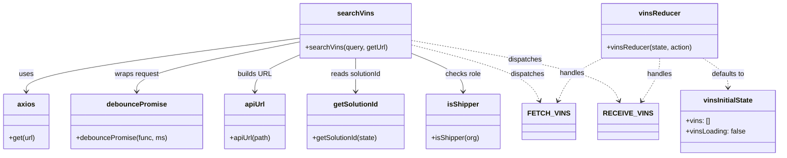

# Diagram: web/portal/src/pages/driveaway/redux/VinSearchStateExtensions.js

> Auto-generated by Obscura crawlers

## Mermaid

### SVG

<svg id="container" width="1765.1953125" xmlns="http://www.w3.org/2000/svg" class="classDiagram" height="360" viewBox="0 0 1765.1953125 360" role="graphics-document document" aria-roledescription="class"><g><defs><marker id="container_class-aggregationStart" class="marker aggregation class" refX="18" refY="7" markerWidth="190" markerHeight="240" orient="auto"><path d="M 18,7 L9,13 L1,7 L9,1 Z"></path></marker></defs><defs><marker id="container_class-aggregationEnd" class="marker aggregation class" refX="1" refY="7" markerWidth="20" markerHeight="28" orient="auto"><path d="M 18,7 L9,13 L1,7 L9,1 Z"></path></marker></defs><defs><marker id="container_class-extensionStart" class="marker extension class" refX="18" refY="7" markerWidth="190" markerHeight="240" orient="auto"><path d="M 1,7 L18,13 V 1 Z"></path></marker></defs><defs><marker id="container_class-extensionEnd" class="marker extension class" refX="1" refY="7" markerWidth="20" markerHeight="28" orient="auto"><path d="M 1,1 V 13 L18,7 Z"></path></marker></defs><defs><marker id="container_class-compositionStart" class="marker composition class" refX="18" refY="7" markerWidth="190" markerHeight="240" orient="auto"><path d="M 18,7 L9,13 L1,7 L9,1 Z"></path></marker></defs><defs><marker id="container_class-compositionEnd" class="marker composition class" refX="1" refY="7" markerWidth="20" markerHeight="28" orient="auto"><path d="M 18,7 L9,13 L1,7 L9,1 Z"></path></marker></defs><defs><marker id="container_class-dependencyStart" class="marker dependency class" refX="6" refY="7" markerWidth="190" markerHeight="240" orient="auto"><path d="M 5,7 L9,13 L1,7 L9,1 Z"></path></marker></defs><defs><marker id="container_class-dependencyEnd" class="marker dependency class" refX="13" refY="7" markerWidth="20" markerHeight="28" orient="auto"><path d="M 18,7 L9,13 L14,7 L9,1 Z"></path></marker></defs><defs><marker id="container_class-lollipopStart" class="marker lollipop class" refX="13" refY="7" markerWidth="190" markerHeight="240" orient="auto"><circle stroke="black" fill="transparent" cx="7" cy="7" r="6"></circle></marker></defs><defs><marker id="container_class-lollipopEnd" class="marker lollipop class" refX="1" refY="7" markerWidth="190" markerHeight="240" orient="auto"><circle stroke="black" fill="transparent" cx="7" cy="7" r="6"></circle></marker></defs><g class="root"><g class="clusters"></g><g class="edgePaths"><path d="M690.195,87.692L585.193,101.577C480.191,115.461,270.188,143.231,165.186,163.782C60.184,184.333,60.184,197.667,60.184,204.333L60.184,211" id="id_searchVins_axios_1" class="edge-thickness-normal edge-pattern-solid relation" style=";;;" data-edge="true" data-et="edge" data-id="id_searchVins_axios_1" data-points="W3sieCI6NjkwLjE5NTMxMjUsInkiOjg3LjY5MjIzNDk4MDU1MjU4fSx7IngiOjYwLjE4MzU5Mzc1LCJ5IjoxNzF9LHsieCI6NjAuMTgzNTkzNzUsInkiOjIxN31d" marker-end="url(#container_class-dependencyEnd)"></path><path d="M690.195,96.026L627.166,108.522C564.137,121.017,438.078,146.009,375.049,165.171C312.02,184.333,312.02,197.667,312.02,204.333L312.02,211" id="id_searchVins_debouncePromise_2" class="edge-thickness-normal edge-pattern-solid relation" style=";;;" data-edge="true" data-et="edge" data-id="id_searchVins_debouncePromise_2" data-points="W3sieCI6NjkwLjE5NTMxMjUsInkiOjk2LjAyNjEzNjY1NDA0MzYzfSx7IngiOjMxMi4wMTk1MzEyNSwieSI6MTcxfSx7IngiOjMxMi4wMTk1MzEyNSwieSI6MjE3fV0=" marker-end="url(#container_class-dependencyEnd)"></path><path d="M690.195,124.969L672.251,132.641C654.306,140.313,618.417,155.656,600.472,169.995C582.527,184.333,582.527,197.667,582.527,204.333L582.527,211" id="id_searchVins_apiUrl_3" class="edge-thickness-normal edge-pattern-solid relation" style=";;;" data-edge="true" data-et="edge" data-id="id_searchVins_apiUrl_3" data-points="W3sieCI6NjkwLjE5NTMxMjUsInkiOjEyNC45Njg4MzcxNTQ5MjkxfSx7IngiOjU4Mi41MjczNDM3NSwieSI6MTcxfSx7IngiOjU4Mi41MjczNDM3NSwieSI6MjE3fV0=" marker-end="url(#container_class-dependencyEnd)"></path><path d="M816.43,134L816.43,140.167C816.43,146.333,816.43,158.667,816.43,171.5C816.43,184.333,816.43,197.667,816.43,204.333L816.43,211" id="id_searchVins_getSolutionId_4" class="edge-thickness-normal edge-pattern-solid relation" style=";;;" data-edge="true" data-et="edge" data-id="id_searchVins_getSolutionId_4" data-points="W3sieCI6ODE2LjQyOTY4NzUsInkiOjEzNH0seyJ4Ijo4MTYuNDI5Njg3NSwieSI6MTcxfSx7IngiOjgxNi40Mjk2ODc1LCJ5IjoyMTd9XQ==" marker-end="url(#container_class-dependencyEnd)"></path><path d="M942.664,121.973L962.9,130.144C983.135,138.315,1023.607,154.658,1043.842,169.496C1064.078,184.333,1064.078,197.667,1064.078,204.333L1064.078,211" id="id_searchVins_isShipper_5" class="edge-thickness-normal edge-pattern-solid relation" style=";;;" data-edge="true" data-et="edge" data-id="id_searchVins_isShipper_5" data-points="W3sieCI6OTQyLjY2NDA2MjUsInkiOjEyMS45NzMyMTY4MjA3MTk5fSx7IngiOjEwNjQuMDc4MTI1LCJ5IjoxNzF9LHsieCI6MTA2NC4wNzgxMjUsInkiOjIxN31d" marker-end="url(#container_class-dependencyEnd)"></path><path d="M942.664,103.182L986.999,114.485C1031.335,125.788,1120.005,148.394,1168.533,169.938C1217.061,191.482,1225.445,211.965,1229.638,222.206L1233.83,232.447" id="id_searchVins_FETCH_VINS_6" class="edge-thickness-normal edge-pattern-dashed relation" style=";;;" data-edge="true" data-et="edge" data-id="id_searchVins_FETCH_VINS_6" data-points="W3sieCI6OTQyLjY2NDA2MjUsInkiOjEwMy4xODI0NDI4NjIxMjIyfSx7IngiOjEyMDguNjc1NzgxMjUsInkiOjE3MX0seyJ4IjoxMjM2LjEwMzQyNjAzMjExLCJ5IjoyMzh9XQ==" marker-end="url(#container_class-dependencyEnd)"></path><path d="M942.664,93.185L1016.46,106.154C1090.255,119.123,1237.846,145.062,1315.78,168.27C1393.713,191.479,1401.989,211.958,1406.126,222.198L1410.264,232.437" id="id_searchVins_RECEIVE_VINS_7" class="edge-thickness-normal edge-pattern-dashed relation" style=";;;" data-edge="true" data-et="edge" data-id="id_searchVins_RECEIVE_VINS_7" data-points="W3sieCI6OTQyLjY2NDA2MjUsInkiOjkzLjE4NDk5ODU1ODM0NTh9LHsieCI6MTM4NS40Mzc1LCJ5IjoxNzF9LHsieCI6MTQxMi41MTIxODQ2MzMwMjc2LCJ5IjoyMzh9XQ==" marker-end="url(#container_class-dependencyEnd)"></path><path d="M1592.164,134L1601.652,140.167C1611.139,146.333,1630.115,158.667,1639.602,170C1649.09,181.333,1649.09,191.667,1649.09,196.833L1649.09,202" id="id_vinsReducer_vinsInitialState_8" class="edge-thickness-normal edge-pattern-dashed relation" style=";;;" data-edge="true" data-et="edge" data-id="id_vinsReducer_vinsInitialState_8" data-points="W3sieCI6MTU5Mi4xNjQwNDI5Njg3NSwieSI6MTM0fSx7IngiOjE2NDkuMDg5ODQzNzUsInkiOjE3MX0seyJ4IjoxNjQ5LjA4OTg0Mzc1LCJ5IjoyMDh9XQ==" marker-end="url(#container_class-dependencyEnd)"></path><path d="M1370.564,134L1358.361,140.167C1346.157,146.333,1321.751,158.667,1305.409,175.073C1289.068,191.479,1280.793,211.958,1276.655,222.198L1272.517,232.437" id="id_vinsReducer_FETCH_VINS_9" class="edge-thickness-normal edge-pattern-dashed relation" style=";;;" data-edge="true" data-et="edge" data-id="id_vinsReducer_FETCH_VINS_9" data-points="W3sieCI6MTM3MC41NjQwMDM5MDYyNSwieSI6MTM0fSx7IngiOjEyOTcuMzQzNzUsInkiOjE3MX0seyJ4IjoxMjcwLjI2OTA2NTM2Njk3MjQsInkiOjIzOH1d" marker-end="url(#container_class-dependencyEnd)"></path><path d="M1495.236,134L1495.236,140.167C1495.236,146.333,1495.236,158.667,1489.017,175.144C1482.797,191.621,1470.358,212.242,1464.139,222.552L1457.919,232.862" id="id_vinsReducer_RECEIVE_VINS_10" class="edge-thickness-normal edge-pattern-dashed relation" style=";;;" data-edge="true" data-et="edge" data-id="id_vinsReducer_RECEIVE_VINS_10" data-points="W3sieCI6MTQ5NS4yMzYzMjgxMjUsInkiOjEzNH0seyJ4IjoxNDk1LjIzNjMyODEyNSwieSI6MTcxfSx7IngiOjE0NTQuODE5OTg5OTY1NTk2MywieSI6MjM4fV0=" marker-end="url(#container_class-dependencyEnd)"></path></g><g class="edgeLabels"><g class="edgeLabel" transform="translate(60.18359375, 171)"><g class="label" data-id="id_searchVins_axios_1" transform="translate(-16.4921875, -12)"><foreignObject width="32.984375" height="24">

uses

</foreignObject></g></g><g class="edgeLabel" transform="translate(312.01953125, 171)"><g class="label" data-id="id_searchVins_debouncePromise_2" transform="translate(-51.140625, -12)"><foreignObject width="102.28125" height="24">

wraps request

</foreignObject></g></g><g class="edgeLabel" transform="translate(582.52734375, 171)"><g class="label" data-id="id_searchVins_apiUrl_3" transform="translate(-38.734375, -12)"><foreignObject width="77.46875" height="24">

builds URL

</foreignObject></g></g><g class="edgeLabel" transform="translate(816.4296875, 171)"><g class="label" data-id="id_searchVins_getSolutionId_4" transform="translate(-59.1796875, -12)"><foreignObject width="118.359375" height="24">

reads solutionId

</foreignObject></g></g><g class="edgeLabel" transform="translate(1064.078125, 171)"><g class="label" data-id="id_searchVins_isShipper_5" transform="translate(-40.796875, -12)"><foreignObject width="81.59375" height="24">

checks role

</foreignObject></g></g><g class="edgeLabel" transform="translate(1110.74629, 146.03366)"><g class="label" data-id="id_searchVins_FETCH_VINS_6" transform="translate(-39.1796875, -12)"><foreignObject width="78.359375" height="24">

dispatches

</foreignObject></g></g><g class="edgeLabel" transform="translate(1199.63723, 138.34662)"><g class="label" data-id="id_searchVins_RECEIVE_VINS_7" transform="translate(-39.1796875, -12)"><foreignObject width="78.359375" height="24">

dispatches

</foreignObject></g></g><g class="edgeLabel" transform="translate(1649.08984375, 171)"><g class="label" data-id="id_vinsReducer_vinsInitialState_8" transform="translate(-39.1875, -12)"><foreignObject width="78.375" height="24">

defaults to

</foreignObject></g></g><g class="edgeLabel" transform="translate(1301.70556, 168.79587)"><g class="label" data-id="id_vinsReducer_FETCH_VINS_9" transform="translate(-28.9140625, -12)"><foreignObject width="57.828125" height="24">

handles

</foreignObject></g></g><g class="edgeLabel" transform="translate(1495.236328125, 171)"><g class="label" data-id="id_vinsReducer_RECEIVE_VINS_10" transform="translate(-28.9140625, -12)"><foreignObject width="57.828125" height="24">

handles

</foreignObject></g></g></g><g class="nodes"><g class="node default" id="classId-searchVins-0" transform="translate(816.4296875, 71)"><g class="basic label-container"><path d="M-126.234375 -63 L126.234375 -63 L126.234375 63 L-126.234375 63" stroke="none" stroke-width="0" fill="#ECECFF" style=""></path><path d="M-126.234375 -63 C-27.043045039455023 -63, 72.14828492108995 -63, 126.234375 -63 M-126.234375 -63 C-51.09444878589214 -63, 24.04547742821572 -63, 126.234375 -63 M126.234375 -63 C126.234375 -33.740860446894956, 126.234375 -4.48172089378992, 126.234375 63 M126.234375 -63 C126.234375 -23.104223819512846, 126.234375 16.791552360974308, 126.234375 63 M126.234375 63 C33.55962706910492 63, -59.11512086179016 63, -126.234375 63 M126.234375 63 C25.31274316082093 63, -75.60888867835814 63, -126.234375 63 M-126.234375 63 C-126.234375 29.661890915559134, -126.234375 -3.676218168881732, -126.234375 -63 M-126.234375 63 C-126.234375 28.429135973241742, -126.234375 -6.141728053516516, -126.234375 -63" stroke="#9370DB" stroke-width="1.3" fill="none" stroke-dasharray="0 0" style=""></path></g><g class="annotation-group text" transform="translate(0, -39)"></g><g class="label-group text" transform="translate(-39.296875, -39)"><g class="label" style="font-weight: bolder" transform="translate(0,-12)"><foreignObject width="78.59375" height="24">

searchVins

</foreignObject></g></g><g class="members-group text" transform="translate(-114.234375, 9)"></g><g class="methods-group text" transform="translate(-114.234375, 39)"><g class="label" style="" transform="translate(0,-12)"><foreignObject width="189.171875" height="24">

+searchVins(query, getUrl)

</foreignObject></g></g><g class="divider" style=""><path d="M-126.234375 -15 C-45.84842571075437 -15, 34.53752357849126 -15, 126.234375 -15 M-126.234375 -15 C-52.903169274496165 -15, 20.42803645100767 -15, 126.234375 -15" stroke="#9370DB" stroke-width="1.3" fill="none" stroke-dasharray="0 0" style=""></path></g><g class="divider" style=""><path d="M-126.234375 9 C-26.138377534190127 9, 73.95761993161975 9, 126.234375 9 M-126.234375 9 C-51.47796916108821 9, 23.278436677823578 9, 126.234375 9" stroke="#9370DB" stroke-width="1.3" fill="none" stroke-dasharray="0 0" style=""></path></g></g><g class="node default" id="classId-vinsReducer-1" transform="translate(1495.236328125, 71)"><g class="basic label-container"><path d="M-132.4140625 -63 L132.4140625 -63 L132.4140625 63 L-132.4140625 63" stroke="none" stroke-width="0" fill="#ECECFF" style=""></path><path d="M-132.4140625 -63 C-58.72951687774932 -63, 14.955028744501362 -63, 132.4140625 -63 M-132.4140625 -63 C-39.44185642993409 -63, 53.53034964013182 -63, 132.4140625 -63 M132.4140625 -63 C132.4140625 -17.20304295271702, 132.4140625 28.59391409456596, 132.4140625 63 M132.4140625 -63 C132.4140625 -23.445659164850476, 132.4140625 16.10868167029905, 132.4140625 63 M132.4140625 63 C79.0831336003096 63, 25.752204700619174 63, -132.4140625 63 M132.4140625 63 C45.18416948131339 63, -42.04572353737322 63, -132.4140625 63 M-132.4140625 63 C-132.4140625 23.4262718104721, -132.4140625 -16.147456379055797, -132.4140625 -63 M-132.4140625 63 C-132.4140625 27.04951944192223, -132.4140625 -8.900961116155543, -132.4140625 -63" stroke="#9370DB" stroke-width="1.3" fill="none" stroke-dasharray="0 0" style=""></path></g><g class="annotation-group text" transform="translate(0, -39)"></g><g class="label-group text" transform="translate(-44.75, -39)"><g class="label" style="font-weight: bolder" transform="translate(0,-12)"><foreignObject width="89.5" height="24">

vinsReducer

</foreignObject></g></g><g class="members-group text" transform="translate(-120.4140625, 9)"></g><g class="methods-group text" transform="translate(-120.4140625, 39)"><g class="label" style="" transform="translate(0,-12)"><foreignObject width="196.078125" height="24">

+vinsReducer(state, action)

</foreignObject></g></g><g class="divider" style=""><path d="M-132.4140625 -15 C-31.3760913237319 -15, 69.6618798525362 -15, 132.4140625 -15 M-132.4140625 -15 C-51.88303864474973 -15, 28.647985210500536 -15, 132.4140625 -15" stroke="#9370DB" stroke-width="1.3" fill="none" stroke-dasharray="0 0" style=""></path></g><g class="divider" style=""><path d="M-132.4140625 9 C-67.55183254133492 9, -2.689602582669835 9, 132.4140625 9 M-132.4140625 9 C-32.700583594772425 9, 67.01289531045515 9, 132.4140625 9" stroke="#9370DB" stroke-width="1.3" fill="none" stroke-dasharray="0 0" style=""></path></g></g><g class="node default" id="classId-vinsInitialState-2" transform="translate(1649.08984375, 280)"><g class="basic label-container"><path d="M-108.10546875 -72 L108.10546875 -72 L108.10546875 72 L-108.10546875 72" stroke="none" stroke-width="0" fill="#ECECFF" style=""></path><path d="M-108.10546875 -72 C-37.7686056127978 -72, 32.5682575244044 -72, 108.10546875 -72 M-108.10546875 -72 C-48.190300887400845 -72, 11.72486697519831 -72, 108.10546875 -72 M108.10546875 -72 C108.10546875 -18.379935026163388, 108.10546875 35.240129947673225, 108.10546875 72 M108.10546875 -72 C108.10546875 -33.24993198514876, 108.10546875 5.500136029702475, 108.10546875 72 M108.10546875 72 C54.85425750920529 72, 1.60304626841058 72, -108.10546875 72 M108.10546875 72 C34.9409087375885 72, -38.223651274823 72, -108.10546875 72 M-108.10546875 72 C-108.10546875 28.687069583198266, -108.10546875 -14.625860833603468, -108.10546875 -72 M-108.10546875 72 C-108.10546875 21.153099073435882, -108.10546875 -29.693801853128235, -108.10546875 -72" stroke="#9370DB" stroke-width="1.3" fill="none" stroke-dasharray="0 0" style=""></path></g><g class="annotation-group text" transform="translate(0, -48)"></g><g class="label-group text" transform="translate(-55.3984375, -48)"><g class="label" style="font-weight: bolder" transform="translate(0,-12)"><foreignObject width="110.796875" height="24">

vinsInitialState

</foreignObject></g></g><g class="members-group text" transform="translate(-96.10546875, 0)"><g class="label" style="" transform="translate(0,-12)"><foreignObject width="55.453125" height="24">

+vins: []

</foreignObject></g><g class="label" style="" transform="translate(0,12)"><foreignObject width="136.8125" height="24">

+vinsLoading: false

</foreignObject></g></g><g class="methods-group text" transform="translate(-96.10546875, 72)"></g><g class="divider" style=""><path d="M-108.10546875 -24 C-49.648608470592634 -24, 8.808251808814731 -24, 108.10546875 -24 M-108.10546875 -24 C-43.826438858521215 -24, 20.45259103295757 -24, 108.10546875 -24" stroke="#9370DB" stroke-width="1.3" fill="none" stroke-dasharray="0 0" style=""></path></g><g class="divider" style=""><path d="M-108.10546875 48 C-35.92462557705004 48, 36.256217595899926 48, 108.10546875 48 M-108.10546875 48 C-28.14624136713813 48, 51.81298601572374 48, 108.10546875 48" stroke="#9370DB" stroke-width="1.3" fill="none" stroke-dasharray="0 0" style=""></path></g></g><g class="node default" id="classId-axios-3" transform="translate(60.18359375, 280)"><g class="basic label-container"><path d="M-52.18359375 -63 L52.18359375 -63 L52.18359375 63 L-52.18359375 63" stroke="none" stroke-width="0" fill="#ECECFF" style=""></path><path d="M-52.18359375 -63 C-11.899221813597897 -63, 28.385150122804205 -63, 52.18359375 -63 M-52.18359375 -63 C-23.10277143194108 -63, 5.978050886117842 -63, 52.18359375 -63 M52.18359375 -63 C52.18359375 -31.7896559029591, 52.18359375 -0.5793118059182021, 52.18359375 63 M52.18359375 -63 C52.18359375 -28.43806409328179, 52.18359375 6.123871813436423, 52.18359375 63 M52.18359375 63 C24.09856513977297 63, -3.986463470454062 63, -52.18359375 63 M52.18359375 63 C19.479632039652415 63, -13.22432967069517 63, -52.18359375 63 M-52.18359375 63 C-52.18359375 35.906066934744906, -52.18359375 8.812133869489813, -52.18359375 -63 M-52.18359375 63 C-52.18359375 27.007809592189815, -52.18359375 -8.98438081562037, -52.18359375 -63" stroke="#9370DB" stroke-width="1.3" fill="none" stroke-dasharray="0 0" style=""></path></g><g class="annotation-group text" transform="translate(0, -39)"></g><g class="label-group text" transform="translate(-19.2734375, -39)"><g class="label" style="font-weight: bolder" transform="translate(0,-12)"><foreignObject width="38.546875" height="24">

axios

</foreignObject></g></g><g class="members-group text" transform="translate(-40.18359375, 9)"></g><g class="methods-group text" transform="translate(-40.18359375, 39)"><g class="label" style="" transform="translate(0,-12)"><foreignObject width="61.09375" height="24">

+get(url)

</foreignObject></g></g><g class="divider" style=""><path d="M-52.18359375 -15 C-19.859887435642797 -15, 12.463818878714406 -15, 52.18359375 -15 M-52.18359375 -15 C-31.11334124996793 -15, -10.043088749935862 -15, 52.18359375 -15" stroke="#9370DB" stroke-width="1.3" fill="none" stroke-dasharray="0 0" style=""></path></g><g class="divider" style=""><path d="M-52.18359375 9 C-29.428420604562632 9, -6.673247459125264 9, 52.18359375 9 M-52.18359375 9 C-14.701663318943233 9, 22.780267112113535 9, 52.18359375 9" stroke="#9370DB" stroke-width="1.3" fill="none" stroke-dasharray="0 0" style=""></path></g></g><g class="node default" id="classId-debouncePromise-4" transform="translate(312.01953125, 280)"><g class="basic label-container"><path d="M-149.65234375 -63 L149.65234375 -63 L149.65234375 63 L-149.65234375 63" stroke="none" stroke-width="0" fill="#ECECFF" style=""></path><path d="M-149.65234375 -63 C-68.29951683079237 -63, 13.053310088415259 -63, 149.65234375 -63 M-149.65234375 -63 C-60.909140584788574 -63, 27.834062580422852 -63, 149.65234375 -63 M149.65234375 -63 C149.65234375 -30.791938638148643, 149.65234375 1.4161227237027134, 149.65234375 63 M149.65234375 -63 C149.65234375 -19.37470394334415, 149.65234375 24.250592113311697, 149.65234375 63 M149.65234375 63 C65.7341283978385 63, -18.184086954322993 63, -149.65234375 63 M149.65234375 63 C80.30170208618274 63, 10.951060422365487 63, -149.65234375 63 M-149.65234375 63 C-149.65234375 33.318331329190535, -149.65234375 3.63666265838107, -149.65234375 -63 M-149.65234375 63 C-149.65234375 28.064778461056655, -149.65234375 -6.870443077886691, -149.65234375 -63" stroke="#9370DB" stroke-width="1.3" fill="none" stroke-dasharray="0 0" style=""></path></g><g class="annotation-group text" transform="translate(0, -39)"></g><g class="label-group text" transform="translate(-65.5234375, -39)"><g class="label" style="font-weight: bolder" transform="translate(0,-12)"><foreignObject width="131.046875" height="24">

debouncePromise

</foreignObject></g></g><g class="members-group text" transform="translate(-137.65234375, 9)"></g><g class="methods-group text" transform="translate(-137.65234375, 39)"><g class="label" style="" transform="translate(0,-12)"><foreignObject width="209.78125" height="24">

+debouncePromise(func, ms)

</foreignObject></g></g><g class="divider" style=""><path d="M-149.65234375 -15 C-77.41465567292497 -15, -5.176967595849931 -15, 149.65234375 -15 M-149.65234375 -15 C-73.15348522178894 -15, 3.3453733064221183 -15, 149.65234375 -15" stroke="#9370DB" stroke-width="1.3" fill="none" stroke-dasharray="0 0" style=""></path></g><g class="divider" style=""><path d="M-149.65234375 9 C-56.943057876112235 9, 35.76622799777553 9, 149.65234375 9 M-149.65234375 9 C-55.1572278674919 9, 39.337888015016205 9, 149.65234375 9" stroke="#9370DB" stroke-width="1.3" fill="none" stroke-dasharray="0 0" style=""></path></g></g><g class="node default" id="classId-apiUrl-5" transform="translate(582.52734375, 280)"><g class="basic label-container"><path d="M-70.85546875 -63 L70.85546875 -63 L70.85546875 63 L-70.85546875 63" stroke="none" stroke-width="0" fill="#ECECFF" style=""></path><path d="M-70.85546875 -63 C-27.16910764292637 -63, 16.51725346414726 -63, 70.85546875 -63 M-70.85546875 -63 C-18.97148041634506 -63, 32.91250791730988 -63, 70.85546875 -63 M70.85546875 -63 C70.85546875 -29.748126600444785, 70.85546875 3.5037467991104307, 70.85546875 63 M70.85546875 -63 C70.85546875 -34.711549449814015, 70.85546875 -6.423098899628037, 70.85546875 63 M70.85546875 63 C36.512447180503386 63, 2.1694256110067727 63, -70.85546875 63 M70.85546875 63 C31.825073744213526 63, -7.205321261572948 63, -70.85546875 63 M-70.85546875 63 C-70.85546875 25.283964102620757, -70.85546875 -12.432071794758485, -70.85546875 -63 M-70.85546875 63 C-70.85546875 16.761677366833453, -70.85546875 -29.476645266333094, -70.85546875 -63" stroke="#9370DB" stroke-width="1.3" fill="none" stroke-dasharray="0 0" style=""></path></g><g class="annotation-group text" transform="translate(0, -39)"></g><g class="label-group text" transform="translate(-22.2109375, -39)"><g class="label" style="font-weight: bolder" transform="translate(0,-12)"><foreignObject width="44.421875" height="24">

apiUrl

</foreignObject></g></g><g class="members-group text" transform="translate(-58.85546875, 9)"></g><g class="methods-group text" transform="translate(-58.85546875, 39)"><g class="label" style="" transform="translate(0,-12)"><foreignObject width="95.5" height="24">

+apiUrl(path)

</foreignObject></g></g><g class="divider" style=""><path d="M-70.85546875 -15 C-36.61807509036532 -15, -2.3806814307306468 -15, 70.85546875 -15 M-70.85546875 -15 C-22.352880540710544 -15, 26.149707668578912 -15, 70.85546875 -15" stroke="#9370DB" stroke-width="1.3" fill="none" stroke-dasharray="0 0" style=""></path></g><g class="divider" style=""><path d="M-70.85546875 9 C-17.49659312586897 9, 35.86228249826206 9, 70.85546875 9 M-70.85546875 9 C-21.733430968611813 9, 27.388606812776374 9, 70.85546875 9" stroke="#9370DB" stroke-width="1.3" fill="none" stroke-dasharray="0 0" style=""></path></g></g><g class="node default" id="classId-getSolutionId-6" transform="translate(816.4296875, 280)"><g class="basic label-container"><path d="M-113.046875 -63 L113.046875 -63 L113.046875 63 L-113.046875 63" stroke="none" stroke-width="0" fill="#ECECFF" style=""></path><path d="M-113.046875 -63 C-58.649427038991185 -63, -4.251979077982369 -63, 113.046875 -63 M-113.046875 -63 C-58.30233360304917 -63, -3.557792206098341 -63, 113.046875 -63 M113.046875 -63 C113.046875 -21.751367547570098, 113.046875 19.497264904859804, 113.046875 63 M113.046875 -63 C113.046875 -16.102013787167635, 113.046875 30.79597242566473, 113.046875 63 M113.046875 63 C58.819028929138035 63, 4.5911828582760705 63, -113.046875 63 M113.046875 63 C57.65135923377513 63, 2.255843467550264 63, -113.046875 63 M-113.046875 63 C-113.046875 36.705178799224825, -113.046875 10.41035759844965, -113.046875 -63 M-113.046875 63 C-113.046875 32.72970143839755, -113.046875 2.459402876795096, -113.046875 -63" stroke="#9370DB" stroke-width="1.3" fill="none" stroke-dasharray="0 0" style=""></path></g><g class="annotation-group text" transform="translate(0, -39)"></g><g class="label-group text" transform="translate(-49.71875, -39)"><g class="label" style="font-weight: bolder" transform="translate(0,-12)"><foreignObject width="99.4375" height="24">

getSolutionId

</foreignObject></g></g><g class="members-group text" transform="translate(-101.046875, 9)"></g><g class="methods-group text" transform="translate(-101.046875, 39)"><g class="label" style="" transform="translate(0,-12)"><foreignObject width="152.375" height="24">

+getSolutionId(state)

</foreignObject></g></g><g class="divider" style=""><path d="M-113.046875 -15 C-33.92022169571284 -15, 45.20643160857432 -15, 113.046875 -15 M-113.046875 -15 C-37.39753703857586 -15, 38.251800922848275 -15, 113.046875 -15" stroke="#9370DB" stroke-width="1.3" fill="none" stroke-dasharray="0 0" style=""></path></g><g class="divider" style=""><path d="M-113.046875 9 C-40.10309682703544 9, 32.84068134592911 9, 113.046875 9 M-113.046875 9 C-29.858004851098343 9, 53.330865297803314 9, 113.046875 9" stroke="#9370DB" stroke-width="1.3" fill="none" stroke-dasharray="0 0" style=""></path></g></g><g class="node default" id="classId-isShipper-7" transform="translate(1064.078125, 280)"><g class="basic label-container"><path d="M-84.6015625 -63 L84.6015625 -63 L84.6015625 63 L-84.6015625 63" stroke="none" stroke-width="0" fill="#ECECFF" style=""></path><path d="M-84.6015625 -63 C-35.14187645953993 -63, 14.317809580920141 -63, 84.6015625 -63 M-84.6015625 -63 C-30.45622868030422 -63, 23.689105139391557 -63, 84.6015625 -63 M84.6015625 -63 C84.6015625 -23.58780310780157, 84.6015625 15.824393784396861, 84.6015625 63 M84.6015625 -63 C84.6015625 -15.576180504033573, 84.6015625 31.847638991932854, 84.6015625 63 M84.6015625 63 C25.859916269639605 63, -32.88172996072079 63, -84.6015625 63 M84.6015625 63 C25.323902406499954 63, -33.95375768700009 63, -84.6015625 63 M-84.6015625 63 C-84.6015625 23.387207966444194, -84.6015625 -16.225584067111612, -84.6015625 -63 M-84.6015625 63 C-84.6015625 36.55934246081358, -84.6015625 10.118684921627164, -84.6015625 -63" stroke="#9370DB" stroke-width="1.3" fill="none" stroke-dasharray="0 0" style=""></path></g><g class="annotation-group text" transform="translate(0, -39)"></g><g class="label-group text" transform="translate(-34.75, -39)"><g class="label" style="font-weight: bolder" transform="translate(0,-12)"><foreignObject width="69.5" height="24">

isShipper

</foreignObject></g></g><g class="members-group text" transform="translate(-72.6015625, 9)"></g><g class="methods-group text" transform="translate(-72.6015625, 39)"><g class="label" style="" transform="translate(0,-12)"><foreignObject width="110.453125" height="24">

+isShipper(org)

</foreignObject></g></g><g class="divider" style=""><path d="M-84.6015625 -15 C-24.728767184259176 -15, 35.14402813148165 -15, 84.6015625 -15 M-84.6015625 -15 C-25.484839308268455 -15, 33.63188388346309 -15, 84.6015625 -15" stroke="#9370DB" stroke-width="1.3" fill="none" stroke-dasharray="0 0" style=""></path></g><g class="divider" style=""><path d="M-84.6015625 9 C-17.90200970612956 9, 48.79754308774088 9, 84.6015625 9 M-84.6015625 9 C-48.95535522545363 9, -13.30914795090726 9, 84.6015625 9" stroke="#9370DB" stroke-width="1.3" fill="none" stroke-dasharray="0 0" style=""></path></g></g><g class="node default" id="classId-FETCH_VINS-8" transform="translate(1253.296875, 280)"><g class="basic label-container"><path d="M-54.6171875 -42 L54.6171875 -42 L54.6171875 42 L-54.6171875 42" stroke="none" stroke-width="0" fill="#ECECFF" style=""></path><path d="M-54.6171875 -42 C-30.242184691766578 -42, -5.867181883533156 -42, 54.6171875 -42 M-54.6171875 -42 C-15.000406992371616 -42, 24.616373515256768 -42, 54.6171875 -42 M54.6171875 -42 C54.6171875 -12.182189781230182, 54.6171875 17.635620437539636, 54.6171875 42 M54.6171875 -42 C54.6171875 -18.60999391880721, 54.6171875 4.780012162385582, 54.6171875 42 M54.6171875 42 C15.572179245779118 42, -23.472829008441764 42, -54.6171875 42 M54.6171875 42 C25.634280308336628 42, -3.3486268833267445 42, -54.6171875 42 M-54.6171875 42 C-54.6171875 23.906836335879188, -54.6171875 5.8136726717583755, -54.6171875 -42 M-54.6171875 42 C-54.6171875 18.031216506402878, -54.6171875 -5.937566987194245, -54.6171875 -42" stroke="#9370DB" stroke-width="1.3" fill="none" stroke-dasharray="0 0" style=""></path></g><g class="annotation-group text" transform="translate(0, -18)"></g><g class="label-group text" transform="translate(-42.6171875, -18)"><g class="label" style="font-weight: bolder" transform="translate(0,-12)"><foreignObject width="85.234375" height="24">

FETCH_VINS

</foreignObject></g></g><g class="members-group text" transform="translate(-42.6171875, 30)"></g><g class="methods-group text" transform="translate(-42.6171875, 60)"></g><g class="divider" style=""><path d="M-54.6171875 6 C-32.38316898139627 6, -10.149150462792534 6, 54.6171875 6 M-54.6171875 6 C-25.474791483633012 6, 3.667604532733975 6, 54.6171875 6" stroke="#9370DB" stroke-width="1.3" fill="none" stroke-dasharray="0 0" style=""></path></g><g class="divider" style=""><path d="M-54.6171875 24 C-28.883290060000007 24, -3.1493926200000146 24, 54.6171875 24 M-54.6171875 24 C-13.422127783868213 24, 27.772931932263575 24, 54.6171875 24" stroke="#9370DB" stroke-width="1.3" fill="none" stroke-dasharray="0 0" style=""></path></g></g><g class="node default" id="classId-RECEIVE_VINS-9" transform="translate(1429.484375, 280)"><g class="basic label-container"><path d="M-61.5 -42 L61.5 -42 L61.5 42 L-61.5 42" stroke="none" stroke-width="0" fill="#ECECFF" style=""></path><path d="M-61.5 -42 C-34.692064902652234 -42, -7.884129805304468 -42, 61.5 -42 M-61.5 -42 C-24.799764126356934 -42, 11.900471747286133 -42, 61.5 -42 M61.5 -42 C61.5 -13.427457459709377, 61.5 15.145085080581246, 61.5 42 M61.5 -42 C61.5 -8.543743572762523, 61.5 24.912512854474954, 61.5 42 M61.5 42 C19.082927943499897 42, -23.334144113000207 42, -61.5 42 M61.5 42 C19.02170995495422 42, -23.456580090091563 42, -61.5 42 M-61.5 42 C-61.5 24.208217208230515, -61.5 6.41643441646103, -61.5 -42 M-61.5 42 C-61.5 19.446089066059955, -61.5 -3.107821867880091, -61.5 -42" stroke="#9370DB" stroke-width="1.3" fill="none" stroke-dasharray="0 0" style=""></path></g><g class="annotation-group text" transform="translate(0, -18)"></g><g class="label-group text" transform="translate(-49.5, -18)"><g class="label" style="font-weight: bolder" transform="translate(0,-12)"><foreignObject width="99" height="24">

RECEIVE_VINS

</foreignObject></g></g><g class="members-group text" transform="translate(-49.5, 30)"></g><g class="methods-group text" transform="translate(-49.5, 60)"></g><g class="divider" style=""><path d="M-61.5 6 C-21.293277219923887 6, 18.913445560152226 6, 61.5 6 M-61.5 6 C-36.52866335195141 6, -11.55732670390281 6, 61.5 6" stroke="#9370DB" stroke-width="1.3" fill="none" stroke-dasharray="0 0" style=""></path></g><g class="divider" style=""><path d="M-61.5 24 C-29.259500177270226 24, 2.9809996454595478 24, 61.5 24 M-61.5 24 C-34.610236549732484 24, -7.720473099464968 24, 61.5 24" stroke="#9370DB" stroke-width="1.3" fill="none" stroke-dasharray="0 0" style=""></path></g></g></g></g></g></svg>
