# Diagram: web/portal/src/pages/driveaway/search/DriveAway.Search.columns.js

> Auto-generated by Obscura crawlers

## Mermaid

```mermaid
classDiagram
    class VinCell {
        +props.value
        +handleCopy()
        +render()
    }
    class StatusCell {
        +props.value
        +state hooks (dialogs, phone/email, comments)
        +submittedAgingTime (useMemo)
        +isValidPhoneNumber()
        +render()
    }
    class LastUpdateCell {
        +props.value
        +render()
    }
    class LocationCell {
        +props.value
        +render()
    }
    class CancelModal {
        +props
        +submitButtonDisabled (state)
        +render()
    }
    class DealerPickUpConfirmationModal {
        +props
        +requestdriveawayDebounced
        +render()
    }
    class OneWayDistanceText {
        +props (oneWayDistanceKm, oneWayDistanceMi, countryCode)
        +render()
    }
    class RequiredLabel {
        +props.label
        +render()
    }
    class ModalErrorIndicator {
        +render()
    }
    class util_calculatMinutesPassedNoSunday {
        +calculatMinutesPassedNoSunday(ddaTimeStamp)
    }
    class columns {
        +columns(...)
        +returns results array of column definitions
    }
    class mapStateToProps {
        +mapStateToProps(state)
    }

    %% Relationships / usage
    StatusCell --> OneWayDistanceText : uses
    StatusCell --> DealerPickUpConfirmationModal : contains
    StatusCell --> CancelModal : contains
    StatusCell --> ModalErrorIndicator : uses
    StatusCell --> DealerPickUpFormButton : composes
    StatusCell --> PickupWindowField : uses
    StatusCell --> DialogModal : uses
    StatusCell --> Icon : uses
    StatusCell --> Text : uses
    StatusCell --> PhoneInput : uses
    StatusCell --> mapStateToProps : connected via connect()

    VinCell --> Icon : uses
    VinCell --> Tooltip : uses
    VinCell --> Text : uses

    LastUpdateCell --> MadChiclet : uses
    LastUpdateCell --> Tooltip : uses
    LastUpdateCell --> Text : uses

    LocationCell --> DateTime : uses
    LocationCell --> Text : uses

    CancelModal --> DialogModal : uses
    CancelModal --> Text : uses
    CancelModal --> FormControl : uses

    DealerPickUpConfirmationModal --> DialogModal : uses
    DealerPickUpConfirmationModal --> Text : uses
    DealerPickUpConfirmationModal --> _
    util_calculatMinutesPassedNoSunday <-- StatusCell : used by

    columns --> VinCell : uses as Cell
    columns --> StatusCell : uses as Cell
    columns --> LastUpdateCell : uses as Cell
    columns --> LocationCell : uses as Cell
    columns --> VinMilestoneCell : uses
    columns --> BaseTable : returns columns for

    %% High-level module relationships
    StatusCell ..> AuthenticationUtils : reads userEmail
    StatusCell ..> DPUStatus : checks status enum
    StatusCell ..> isDealer : role checks
    StatusCell ..> isCarrier : role checks
    StatusCell ..> isShipper : role checks
    LocationCell ..> useEtaTranslations : uses
    LastUpdateCell ..> SourceType : uses constants

    %% Notes expressed in graph (as classes with no methods)
    class DialogModal
    class Text
    class Icon
    class Tooltip
    class PhoneInput
    class DateTime
    class MadChiclet
    class VinMilestoneCell
    class BaseTable
    class DealerPickUpFormButton
    class PickupWindowField
    class AuthenticationUtils
    class DPUStatus
    class SourceType

    DialogModal <|-- StatusCell
    Text <|-- VinCell
    Icon <|-- VinCell
    Tooltip <|-- VinCell
    PhoneInput <|-- StatusCell
    DateTime <|-- LocationCell
    MadChiclet <|-- LastUpdateCell
    VinMilestoneCell <|-- columns
    BaseTable <|-- columns
    DealerPickUpFormButton <|-- StatusCell
    PickupWindowField <|-- StatusCell
```

### SVG

<svg id="container" width="4698.060546875" xmlns="http://www.w3.org/2000/svg" class="classDiagram" height="850" viewBox="0 0 4698.060546875 850" role="graphics-document document" aria-roledescription="class"><g><defs><marker id="container_class-aggregationStart" class="marker aggregation class" refX="18" refY="7" markerWidth="190" markerHeight="240" orient="auto"><path d="M 18,7 L9,13 L1,7 L9,1 Z"></path></marker></defs><defs><marker id="container_class-aggregationEnd" class="marker aggregation class" refX="1" refY="7" markerWidth="20" markerHeight="28" orient="auto"><path d="M 18,7 L9,13 L1,7 L9,1 Z"></path></marker></defs><defs><marker id="container_class-extensionStart" class="marker extension class" refX="18" refY="7" markerWidth="190" markerHeight="240" orient="auto"><path d="M 1,7 L18,13 V 1 Z"></path></marker></defs><defs><marker id="container_class-extensionEnd" class="marker extension class" refX="1" refY="7" markerWidth="20" markerHeight="28" orient="auto"><path d="M 1,1 V 13 L18,7 Z"></path></marker></defs><defs><marker id="container_class-compositionStart" class="marker composition class" refX="18" refY="7" markerWidth="190" markerHeight="240" orient="auto"><path d="M 18,7 L9,13 L1,7 L9,1 Z"></path></marker></defs><defs><marker id="container_class-compositionEnd" class="marker composition class" refX="1" refY="7" markerWidth="20" markerHeight="28" orient="auto"><path d="M 18,7 L9,13 L1,7 L9,1 Z"></path></marker></defs><defs><marker id="container_class-dependencyStart" class="marker dependency class" refX="6" refY="7" markerWidth="190" markerHeight="240" orient="auto"><path d="M 5,7 L9,13 L1,7 L9,1 Z"></path></marker></defs><defs><marker id="container_class-dependencyEnd" class="marker dependency class" refX="13" refY="7" markerWidth="20" markerHeight="28" orient="auto"><path d="M 18,7 L9,13 L14,7 L9,1 Z"></path></marker></defs><defs><marker id="container_class-lollipopStart" class="marker lollipop class" refX="13" refY="7" markerWidth="190" markerHeight="240" orient="auto"><circle stroke="black" fill="transparent" cx="7" cy="7" r="6"></circle></marker></defs><defs><marker id="container_class-lollipopEnd" class="marker lollipop class" refX="1" refY="7" markerWidth="190" markerHeight="240" orient="auto"><circle stroke="black" fill="transparent" cx="7" cy="7" r="6"></circle></marker></defs><g class="root"><g class="clusters"></g><g class="edgePaths"><path d="M2311.912,359.118L2152.21,379.098C1992.508,399.079,1673.105,439.039,1513.403,465.686C1353.701,492.333,1353.701,505.667,1353.701,512.333L1353.701,519" id="id_StatusCell_OneWayDistanceText_1" class="edge-thickness-normal edge-pattern-solid relation" style=";;;" data-edge="true" data-et="edge" data-id="id_StatusCell_OneWayDistanceText_1" data-points="W3sieCI6MjMxMS45MTIxMDkzNzUsInkiOjM1OS4xMTc4NjM5NTU5NDE3NH0seyJ4IjoxMzUzLjcwMTE3MTg3NSwieSI6NDc5fSx7IngiOjEzNTMuNzAxMTcxODc1LCJ5Ijo1MjV9XQ==" marker-end="url(#container_class-dependencyEnd)"></path><path d="M2311.912,348.141L2002.272,369.951C1692.633,391.761,1073.354,435.38,763.714,462.357C454.074,489.333,454.074,499.667,454.074,504.833L454.074,510" id="id_StatusCell_DealerPickUpConfirmationModal_2" class="edge-thickness-normal edge-pattern-solid relation" style=";;;" data-edge="true" data-et="edge" data-id="id_StatusCell_DealerPickUpConfirmationModal_2" data-points="W3sieCI6MjMxMS45MTIxMDkzNzUsInkiOjM0OC4xNDExNDczMzgwMTA3NH0seyJ4Ijo0NTQuMDc0MjE4NzUsInkiOjQ3OX0seyJ4Ijo0NTQuMDc0MjE4NzUsInkiOjUxNn1d" marker-end="url(#container_class-dependencyEnd)"></path><path d="M2311.912,351.284L2064.655,372.57C1817.397,393.856,1322.882,436.428,1075.625,462.881C828.367,489.333,828.367,499.667,828.367,504.833L828.367,510" id="id_StatusCell_CancelModal_3" class="edge-thickness-normal edge-pattern-solid relation" style=";;;" data-edge="true" data-et="edge" data-id="id_StatusCell_CancelModal_3" data-points="W3sieCI6MjMxMS45MTIxMDkzNzUsInkiOjM1MS4yODM2MzkxMDAyOTAyNn0seyJ4Ijo4MjguMzY3MTg3NSwieSI6NDc5fSx7IngiOjgyOC4zNjcxODc1LCJ5Ijo1MTZ9XQ==" marker-end="url(#container_class-dependencyEnd)"></path><path d="M2311.912,372.771L2220.233,390.476C2128.554,408.181,1945.196,443.59,1853.517,469.962C1761.838,496.333,1761.838,513.667,1761.838,522.333L1761.838,531" id="id_StatusCell_ModalErrorIndicator_4" class="edge-thickness-normal edge-pattern-solid relation" style=";;;" data-edge="true" data-et="edge" data-id="id_StatusCell_ModalErrorIndicator_4" data-points="W3sieCI6MjMxMS45MTIxMDkzNzUsInkiOjM3Mi43NzEyNzE3NTI5ODQ5NH0seyJ4IjoxNzYxLjgzNzg5MDYyNSwieSI6NDc5fSx7IngiOjE3NjEuODM3ODkwNjI1LCJ5Ijo1Mzd9XQ==" marker-end="url(#container_class-dependencyEnd)"></path><path d="M2437.872,442L2433.601,448.167C2429.329,454.333,2420.787,466.667,2407.272,485.199C2393.756,503.731,2375.268,528.463,2366.024,540.829L2356.78,553.194" id="id_StatusCell_DealerPickUpFormButton_5" class="edge-thickness-normal edge-pattern-solid relation" style=";;;" data-edge="true" data-et="edge" data-id="id_StatusCell_DealerPickUpFormButton_5" data-points="W3sieCI6MjQzNy44NzIwMjMxNjgxMDM2LCJ5Ijo0NDJ9LHsieCI6MjQxMi4yNDQxNDA2MjUsInkiOjQ3OX0seyJ4IjoyMzUzLjE4Nzk2ODEwNDMzOSwieSI6NTU4fV0=" marker-end="url(#container_class-dependencyEnd)"></path><path d="M2603.544,442L2608.732,448.167C2613.92,454.333,2624.297,466.667,2621.797,485.152C2619.297,503.637,2603.919,528.273,2596.231,540.592L2588.542,552.91" id="id_StatusCell_PickupWindowField_6" class="edge-thickness-normal edge-pattern-solid relation" style=";;;" data-edge="true" data-et="edge" data-id="id_StatusCell_PickupWindowField_6" data-points="W3sieCI6MjYwMy41NDM3OTA0MDk0ODMsInkiOjQ0Mn0seyJ4IjoyNjM0LjY3MzgyODEyNSwieSI6NDc5fSx7IngiOjI1ODUuMzY1MTM3NTI1ODI2NCwieSI6NTU4fV0=" marker-end="url(#container_class-dependencyEnd)"></path><path d="M2311.912,346.709L1963.598,368.757C1615.284,390.806,918.656,434.903,570.341,477.118C222.027,519.333,222.027,559.667,222.027,600C222.027,640.333,222.027,680.667,217.734,706.218C213.441,731.77,204.855,742.539,200.562,747.924L196.269,753.309" id="id_StatusCell_DialogModal_7" class="edge-thickness-normal edge-pattern-solid relation" style=";;;" data-edge="true" data-et="edge" data-id="id_StatusCell_DialogModal_7" data-points="W3sieCI6MjMxMS45MTIxMDkzNzUsInkiOjM0Ni43MDg2MjQ0NzgwNzExfSx7IngiOjIyMi4wMjczNDM3NSwieSI6NDc5fSx7IngiOjIyMi4wMjczNDM3NSwieSI6NjAwfSx7IngiOjIyMi4wMjczNDM3NSwieSI6NzIxfSx7IngiOjE5Mi41MjgzMzI2NzQwNTA2MywieSI6NzU4fV0=" marker-end="url(#container_class-dependencyEnd)"></path><path d="M2311.912,353.63L2098.206,374.525C1884.499,395.42,1457.087,437.21,1243.38,478.272C1029.674,519.333,1029.674,559.667,1029.674,600C1029.674,640.333,1029.674,680.667,1027.245,706.092C1024.815,731.518,1019.957,742.035,1017.528,747.294L1015.099,752.553" id="id_StatusCell_Icon_8" class="edge-thickness-normal edge-pattern-solid relation" style=";;;" data-edge="true" data-et="edge" data-id="id_StatusCell_Icon_8" data-points="W3sieCI6MjMxMS45MTIxMDkzNzUsInkiOjM1My42Mjk3NjMyODEzNDY3fSx7IngiOjEwMjkuNjczODI4MTI1LCJ5Ijo0Nzl9LHsieCI6MTAyOS42NzM4MjgxMjUsInkiOjYwMH0seyJ4IjoxMDI5LjY3MzgyODEyNSwieSI6NzIxfSx7IngiOjEwMTIuNTgyNTUwNDM1MTI2NiwieSI6NzU4fV0=" marker-end="url(#container_class-dependencyEnd)"></path><path d="M2713.443,354.331L2918.626,375.109C3123.809,395.887,3534.175,437.444,3739.358,478.388C3944.541,519.333,3944.541,559.667,3944.541,600C3944.541,640.333,3944.541,680.667,3921.385,711.483C3898.229,742.3,3851.917,763.599,3828.761,774.249L3805.605,784.899" id="id_StatusCell_Text_9" class="edge-thickness-normal edge-pattern-solid relation" style=";;;" data-edge="true" data-et="edge" data-id="id_StatusCell_Text_9" data-points="W3sieCI6MjcxMy40NDMzNTkzNzUsInkiOjM1NC4zMzA4NjI1OTQzNTc3N30seyJ4IjozOTQ0LjU0MTAxNTYyNSwieSI6NDc5fSx7IngiOjM5NDQuNTQxMDE1NjI1LCJ5Ijo2MDB9LHsieCI6Mzk0NC41NDEwMTU2MjUsInkiOjcyMX0seyJ4IjozODAwLjE1NDI5Njg3NSwieSI6Nzg3LjQwNjEzNTU4MzE5ODh9XQ==" marker-end="url(#container_class-dependencyEnd)"></path><path d="M2713.443,437.807L2726.721,444.673C2739.999,451.538,2766.555,465.269,2775.14,484.368C2783.725,503.466,2774.338,527.932,2769.645,540.165L2764.952,552.398" id="id_StatusCell_PhoneInput_10" class="edge-thickness-normal edge-pattern-solid relation" style=";;;" data-edge="true" data-et="edge" data-id="id_StatusCell_PhoneInput_10" data-points="W3sieCI6MjcxMy40NDMzNTkzNzUsInkiOjQzNy44MDcxNjI0NTc2ODk3fSx7IngiOjI3OTMuMTExMzI4MTI1LCJ5Ijo0Nzl9LHsieCI6Mjc2Mi44MDI4MzEyMjQxNzM2LCJ5Ijo1NTh9XQ==" marker-end="url(#container_class-dependencyEnd)"></path><path d="M2311.912,394.628L2265.347,408.69C2218.782,422.752,2125.652,450.876,2079.087,473.605C2032.521,496.333,2032.521,513.667,2032.521,522.333L2032.521,531" id="id_StatusCell_mapStateToProps_11" class="edge-thickness-normal edge-pattern-solid relation" style=";;;" data-edge="true" data-et="edge" data-id="id_StatusCell_mapStateToProps_11" data-points="W3sieCI6MjMxMS45MTIxMDkzNzUsInkiOjM5NC42MjgyMTM0NzIxNzcwNH0seyJ4IjoyMDMyLjUyMTQ4NDM3NSwieSI6NDc5fSx7IngiOjIwMzIuNTIxNDg0Mzc1LCJ5Ijo1Mzd9XQ==" marker-end="url(#container_class-dependencyEnd)"></path><path d="M3661.537,603.322L3209.665,622.935C2757.793,642.548,1854.049,681.774,1405.047,706.675C956.045,731.576,961.784,742.151,964.654,747.439L967.524,752.727" id="id_VinCell_Icon_12" class="edge-thickness-normal edge-pattern-solid relation" style=";;;" data-edge="true" data-et="edge" data-id="id_VinCell_Icon_12" data-points="W3sieCI6MzY2MS41MzcxMDkzNzUsInkiOjYwMy4zMjE3NTk3ODMwOTIzfSx7IngiOjk1MC4zMDQ2ODc1LCJ5Ijo3MjF9LHsieCI6OTcwLjM4NjI5ODQ1NzI3ODUsInkiOjc1OH1d" marker-end="url(#container_class-dependencyEnd)"></path><path d="M3814.6,628.661L3855.694,644.051C3896.788,659.441,3978.977,690.22,4014.001,711.729C4049.024,733.238,4036.882,745.477,4030.811,751.596L4024.74,757.715" id="id_VinCell_Tooltip_13" class="edge-thickness-normal edge-pattern-solid relation" style=";;;" data-edge="true" data-et="edge" data-id="id_VinCell_Tooltip_13" data-points="W3sieCI6MzgxNC41OTk2MDkzNzUsInkiOjYyOC42NjA5MzYwMDc2NDA5fSx7IngiOjQwNjEuMTY2MDE1NjI1LCJ5Ijo3MjF9LHsieCI6NDAyMC41MTM2NzE4NzUsInkiOjc2MS45NzQ0ODI5MzA0NzU5fV0=" marker-end="url(#container_class-dependencyEnd)"></path><path d="M3814.6,674.551L3822.547,682.292C3830.494,690.034,3846.389,705.517,3844.731,721.736C3843.073,737.954,3823.863,754.908,3814.258,763.385L3804.653,771.863" id="id_VinCell_Text_14" class="edge-thickness-normal edge-pattern-solid relation" style=";;;" data-edge="true" data-et="edge" data-id="id_VinCell_Text_14" data-points="W3sieCI6MzgxNC41OTk2MDkzNzUsInkiOjY3NC41NTA1MjA0NTY2MTgyfSx7IngiOjM4NjIuMjgzMjAzMTI1LCJ5Ijo3MjF9LHsieCI6MzgwMC4xNTQyOTY4NzUsInkiOjc3NS44MzI4NjA1NzE2Nzc5fV0=" marker-end="url(#container_class-dependencyEnd)"></path><path d="M4174.548,672L4171.499,680.167C4168.449,688.333,4162.351,704.667,4157.097,718.078C4151.844,731.49,4147.436,741.979,4145.232,747.224L4143.027,752.469" id="id_LastUpdateCell_MadChiclet_15" class="edge-thickness-normal edge-pattern-solid relation" style=";;;" data-edge="true" data-et="edge" data-id="id_LastUpdateCell_MadChiclet_15" data-points="W3sieCI6NDE3NC41NDc4NTk2MzMyNjQsInkiOjY3Mn0seyJ4Ijo0MTU2LjI1MTk1MzEyNSwieSI6NzIxfSx7IngiOjQxNDAuNzAyOTUxOTM4MjkxLCJ5Ijo3NTh9XQ==" marker-end="url(#container_class-dependencyEnd)"></path><path d="M4115.924,653.539L4097.967,664.783C4080.01,676.026,4044.096,698.513,4024.462,714.971C4004.829,731.429,4001.477,741.859,3999.8,747.073L3998.124,752.288" id="id_LastUpdateCell_Tooltip_16" class="edge-thickness-normal edge-pattern-solid relation" style=";;;" data-edge="true" data-et="edge" data-id="id_LastUpdateCell_Tooltip_16" data-points="W3sieCI6NDExNS45MjM4MjgxMjUsInkiOjY1My41MzkxNzM2NzM5OTc0fSx7IngiOjQwMDguMTgxNjQwNjI1LCJ5Ijo3MjF9LHsieCI6Mzk5Ni4yODc5OTk0MDY2NDU3LCJ5Ijo3NTh9XQ==" marker-end="url(#container_class-dependencyEnd)"></path><path d="M4115.924,606.36L3859.047,625.467C3602.17,644.573,3088.416,682.787,3025.662,714.693C2962.909,746.6,3351.155,772.2,3545.278,785L3739.402,797.8" id="id_LastUpdateCell_Text_17" class="edge-thickness-normal edge-pattern-solid relation" style=";;;" data-edge="true" data-et="edge" data-id="id_LastUpdateCell_Text_17" data-points="W3sieCI6NDExNS45MjM4MjgxMjUsInkiOjYwNi4zNjAxMTc0NjgyMzc3fSx7IngiOjI1NzQuNjYyMTA5Mzc1LCJ5Ijo3MjF9LHsieCI6Mzc0NS4zODg2NzE4NzUsInkiOjc5OC4xOTQ0NTM1MDA5NTg1fV0=" marker-end="url(#container_class-dependencyEnd)"></path><path d="M4503.898,672L4502.11,680.167C4500.322,688.333,4496.746,704.667,4490.699,718.216C4484.651,731.765,4476.132,742.53,4471.873,747.912L4467.614,753.295" id="id_LocationCell_DateTime_18" class="edge-thickness-normal edge-pattern-solid relation" style=";;;" data-edge="true" data-et="edge" data-id="id_LocationCell_DateTime_18" data-points="W3sieCI6NDUwMy44OTgxNjMwOTQwMDgsInkiOjY3Mn0seyJ4Ijo0NDkzLjE2OTkyMTg3NSwieSI6NzIxfSx7IngiOjQ0NjMuODkwNDUxOTM4MjkxLCJ5Ijo3NTh9XQ==" marker-end="url(#container_class-dependencyEnd)"></path><path d="M4439.389,604.861L4119.77,624.218C3800.152,643.574,3160.915,682.287,3044.25,714.459C2927.585,746.631,3333.493,772.262,3536.447,785.077L3739.401,797.893" id="id_LocationCell_Text_19" class="edge-thickness-normal edge-pattern-solid relation" style=";;;" data-edge="true" data-et="edge" data-id="id_LocationCell_Text_19" data-points="W3sieCI6NDQzOS4zODg2NzE4NzUsInkiOjYwNC44NjE0NDIzOTExNTk4fSx7IngiOjI1MjEuNjc3NzM0Mzc1LCJ5Ijo3MjF9LHsieCI6Mzc0NS4zODg2NzE4NzUsInkiOjc5OC4yNzA5MTkxOTU3MDM4fV0=" marker-end="url(#container_class-dependencyEnd)"></path><path d="M684.629,627.056L601.447,642.713C518.264,658.371,351.9,689.685,266.967,710.561C182.035,731.437,178.535,741.874,176.785,747.093L175.035,752.311" id="id_CancelModal_DialogModal_20" class="edge-thickness-normal edge-pattern-solid relation" style=";;;" data-edge="true" data-et="edge" data-id="id_CancelModal_DialogModal_20" data-points="W3sieCI6Njg0LjYyODkwNjI1LCJ5Ijo2MjcuMDU1Nzk1NTgyMjkyN30seyJ4IjoxODUuNTM1MTU2MjUsInkiOjcyMX0seyJ4IjoxNzMuMTI3NDIyODYzOTI0MDQsInkiOjc1OH1d" marker-end="url(#container_class-dependencyEnd)"></path><path d="M972.105,610.603L1221.537,629.002C1470.968,647.402,1969.831,684.201,2431.046,715.43C2892.262,746.659,3315.831,772.319,3527.615,785.149L3739.4,797.978" id="id_CancelModal_Text_21" class="edge-thickness-normal edge-pattern-solid relation" style=";;;" data-edge="true" data-et="edge" data-id="id_CancelModal_Text_21" data-points="W3sieCI6OTcyLjEwNTQ2ODc1LCJ5Ijo2MTAuNjAyOTcxNzMxNzU1OX0seyJ4IjoyNDY4LjY5MzM1OTM3NSwieSI6NzIxfSx7IngiOjM3NDUuMzg4NjcxODc1LCJ5Ijo3OTguMzQxMTcxMzI1NTI5M31d" marker-end="url(#container_class-dependencyEnd)"></path><path d="M828.367,684L828.367,690.167C828.367,696.333,828.367,708.667,828.367,720C828.367,731.333,828.367,741.667,828.367,746.833L828.367,752" id="id_CancelModal_FormControl_22" class="edge-thickness-normal edge-pattern-solid relation" style=";;;" data-edge="true" data-et="edge" data-id="id_CancelModal_FormControl_22" data-points="W3sieCI6ODI4LjM2NzE4NzUsInkiOjY4NH0seyJ4Ijo4MjguMzY3MTg3NSwieSI6NzIxfSx7IngiOjgyOC4zNjcxODc1LCJ5Ijo3NTh9XQ==" marker-end="url(#container_class-dependencyEnd)"></path><path d="M273.52,667.949L250.025,676.791C226.53,685.633,179.54,703.316,157.796,717.377C136.051,731.437,139.551,741.874,141.301,747.093L143.051,752.311" id="id_DealerPickUpConfirmationModal_DialogModal_23" class="edge-thickness-normal edge-pattern-solid relation" style=";;;" data-edge="true" data-et="edge" data-id="id_DealerPickUpConfirmationModal_DialogModal_23" data-points="W3sieCI6MjczLjUxOTUzMTI1LCJ5Ijo2NjcuOTQ4NzU0NzA3ODEyfSx7IngiOjEzMi41NTA3ODEyNSwieSI6NzIxfSx7IngiOjE0NC45NTg1MTQ2MzYwNzU5NiwieSI6NzU4fV0=" marker-end="url(#container_class-dependencyEnd)"></path><path d="M634.629,611.137L931.476,629.448C1228.322,647.758,1822.016,684.379,2339.477,715.532C2856.939,746.686,3298.169,772.371,3518.784,785.214L3739.399,798.057" id="id_DealerPickUpConfirmationModal_Text_24" class="edge-thickness-normal edge-pattern-solid relation" style=";;;" data-edge="true" data-et="edge" data-id="id_DealerPickUpConfirmationModal_Text_24" data-points="W3sieCI6NjM0LjYyODkwNjI1LCJ5Ijo2MTEuMTM3MTk5MjIyOTg1NX0seyJ4IjoyNDE1LjcwODk4NDM3NSwieSI6NzIxfSx7IngiOjM3NDUuMzg4NjcxODc1LCJ5Ijo3OTguNDA1OTM3Njg3MDk5OX1d" marker-end="url(#container_class-dependencyEnd)"></path><path d="M273.52,650.818L231.96,662.515C190.401,674.212,107.283,697.606,65.723,714.47C24.164,731.333,24.164,741.667,24.164,746.833L24.164,752" id="id_DealerPickUpConfirmationModal___25" class="edge-thickness-normal edge-pattern-solid relation" style=";;;" data-edge="true" data-et="edge" data-id="id_DealerPickUpConfirmationModal___25" data-points="W3sieCI6MjczLjUxOTUzMTI1LCJ5Ijo2NTAuODE3ODY3MTA1MjI3M30seyJ4IjoyNC4xNjQwNjI1LCJ5Ijo3MjF9LHsieCI6MjQuMTY0MDYyNSwieSI6NzU4fV0=" marker-end="url(#container_class-dependencyEnd)"></path><path d="M2961.236,144.983L2982.182,152.319C3003.127,159.656,3045.019,174.328,3003.72,197.381C2962.421,220.435,2837.932,251.87,2775.688,267.587L2713.443,283.304" id="id_util_calculatMinutesPassedNoSunday_StatusCell_26" class="edge-thickness-normal edge-pattern-solid relation" style=";;;" data-edge="true" data-et="edge" data-id="id_util_calculatMinutesPassedNoSunday_StatusCell_26" data-points="W3sieCI6Mjk1NS41NzM0MzAzMzI1NjksInkiOjE0M30seyJ4IjozMDg2LjkxMDE1NjI1LCJ5IjoxODl9LHsieCI6MjcxMy40NDMzNTkzNzUsInkiOjI4My4zMDQ0NzIzNDI0OTUzfV0=" marker-start="url(#container_class-dependencyStart)"></path><path d="M3457.027,123.167L3503.868,134.139C3550.708,145.111,3644.388,167.056,3691.228,202.194C3738.068,237.333,3738.068,285.667,3738.068,334C3738.068,382.333,3738.068,430.667,3738.068,460C3738.068,489.333,3738.068,499.667,3738.068,504.833L3738.068,510" id="id_columns_VinCell_27" class="edge-thickness-normal edge-pattern-solid relation" style=";;;" data-edge="true" data-et="edge" data-id="id_columns_VinCell_27" data-points="W3sieCI6MzQ1Ny4wMjczNDM3NSwieSI6MTIzLjE2NjY0MDc4MjczMDI0fSx7IngiOjM3MzguMDY4MzU5Mzc1LCJ5IjoxODl9LHsieCI6MzczOC4wNjgzNTkzNzUsInkiOjMzNH0seyJ4IjozNzM4LjA2ODM1OTM3NSwieSI6NDc5fSx7IngiOjM3MzguMDY4MzU5Mzc1LCJ5Ijo1MTZ9XQ==" marker-end="url(#container_class-dependencyEnd)"></path><path d="M3088.473,104.943L2984.972,118.953C2881.471,132.962,2674.469,160.981,2572.593,180.203C2470.717,199.424,2473.967,209.848,2475.592,215.06L2477.217,220.272" id="id_columns_StatusCell_28" class="edge-thickness-normal edge-pattern-solid relation" style=";;;" data-edge="true" data-et="edge" data-id="id_columns_StatusCell_28" data-points="W3sieCI6MzA4OC40NzI2NTYyNSwieSI6MTA0Ljk0MzA2Mzk5Mzg4ODAyfSx7IngiOjI0NjcuNDY2Nzk2ODc1LCJ5IjoxODl9LHsieCI6MjQ3OS4wMDMzODA5MjY3MjQzLCJ5IjoyMjZ9XQ==" marker-end="url(#container_class-dependencyEnd)"></path><path d="M3457.027,101.629L3581.095,116.191C3705.162,130.753,3953.297,159.876,4077.364,198.605C4201.432,237.333,4201.432,285.667,4201.432,334C4201.432,382.333,4201.432,430.667,4201.432,462C4201.432,493.333,4201.432,507.667,4201.432,514.833L4201.432,522" id="id_columns_LastUpdateCell_29" class="edge-thickness-normal edge-pattern-solid relation" style=";;;" data-edge="true" data-et="edge" data-id="id_columns_LastUpdateCell_29" data-points="W3sieCI6MzQ1Ny4wMjczNDM3NSwieSI6MTAxLjYyODc1ODAwNDk4NDM4fSx7IngiOjQyMDEuNDMxNjQwNjI1LCJ5IjoxODl9LHsieCI6NDIwMS40MzE2NDA2MjUsInkiOjMzNH0seyJ4Ijo0MjAxLjQzMTY0MDYyNSwieSI6NDc5fSx7IngiOjQyMDEuNDMxNjQwNjI1LCJ5Ijo1Mjh9XQ==" marker-end="url(#container_class-dependencyEnd)"></path><path d="M3457.027,96.109L3634.133,111.591C3811.239,127.073,4165.451,158.036,4342.556,197.685C4519.662,237.333,4519.662,285.667,4519.662,334C4519.662,382.333,4519.662,430.667,4519.662,462C4519.662,493.333,4519.662,507.667,4519.662,514.833L4519.662,522" id="id_columns_LocationCell_30" class="edge-thickness-normal edge-pattern-solid relation" style=";;;" data-edge="true" data-et="edge" data-id="id_columns_LocationCell_30" data-points="W3sieCI6MzQ1Ny4wMjczNDM3NSwieSI6OTYuMTA4Nzc4MDkwODc3NjJ9LHsieCI6NDUxOS42NjIxMDkzNzUsInkiOjE4OX0seyJ4Ijo0NTE5LjY2MjEwOTM3NSwieSI6MzM0fSx7IngiOjQ1MTkuNjYyMTA5Mzc1LCJ5Ijo0Nzl9LHsieCI6NDUxOS42NjIxMDkzNzUsInkiOjUyOH1d" marker-end="url(#container_class-dependencyEnd)"></path><path d="M3408.987,152L3420.656,158.167C3432.324,164.333,3455.661,176.667,3459.72,199.094C3463.778,221.522,3448.558,254.044,3440.948,270.305L3433.338,286.566" id="id_columns_VinMilestoneCell_31" class="edge-thickness-normal edge-pattern-solid relation" style=";;;" data-edge="true" data-et="edge" data-id="id_columns_VinMilestoneCell_31" data-points="W3sieCI6MzQwOC45ODcyNDE5NzI0NzcsInkiOjE1Mn0seyJ4IjozNDc4Ljk5ODA0Njg3NSwieSI6MTg5fSx7IngiOjM0MzAuNzk0NDkwODQwNTE3LCJ5IjoyOTJ9XQ==" marker-end="url(#container_class-dependencyEnd)"></path><path d="M3457.027,136.368L3485.705,145.14C3514.382,153.912,3571.737,171.456,3595.3,196.441C3618.863,221.426,3608.633,253.852,3603.519,270.065L3598.404,286.278" id="id_columns_BaseTable_32" class="edge-thickness-normal edge-pattern-solid relation" style=";;;" data-edge="true" data-et="edge" data-id="id_columns_BaseTable_32" data-points="W3sieCI6MzQ1Ny4wMjczNDM3NSwieSI6MTM2LjM2Nzg3NjY5ODQzODQ3fSx7IngiOjM2MjkuMDkxNzk2ODc1LCJ5IjoxODl9LHsieCI6MzU5Ni41OTkwNzA1ODE4OTY3LCJ5IjoyOTJ9XQ==" marker-end="url(#container_class-dependencyEnd)"></path><path d="M2713.443,403.095L2750.202,415.746C2786.96,428.397,2860.477,453.698,2897.236,478.516C2933.994,503.333,2933.994,527.667,2933.994,539.833L2933.994,552" id="id_StatusCell_AuthenticationUtils_33" class="edge-thickness-normal edge-pattern-dashed relation" style=";;;" data-edge="true" data-et="edge" data-id="id_StatusCell_AuthenticationUtils_33" data-points="W3sieCI6MjcxMy40NDMzNTkzNzUsInkiOjQwMy4wOTUzNzYyODUyNjY2fSx7IngiOjI5MzMuOTk0MTQwNjI1LCJ5Ijo0Nzl9LHsieCI6MjkzMy45OTQxNDA2MjUsInkiOjU1OH1d" marker-end="url(#container_class-dependencyEnd)"></path><path d="M2713.443,382.125L2780.799,398.271C2848.156,414.417,2982.868,446.708,3050.224,475.021C3117.58,503.333,3117.58,527.667,3117.58,539.833L3117.58,552" id="id_StatusCell_DPUStatus_34" class="edge-thickness-normal edge-pattern-dashed relation" style=";;;" data-edge="true" data-et="edge" data-id="id_StatusCell_DPUStatus_34" data-points="W3sieCI6MjcxMy40NDMzNTkzNzUsInkiOjM4Mi4xMjUxNDkzMzMyNDcyNH0seyJ4IjozMTE3LjU4MDA3ODEyNSwieSI6NDc5fSx7IngiOjMxMTcuNTgwMDc4MTI1LCJ5Ijo1NTh9XQ==" marker-end="url(#container_class-dependencyEnd)"></path><path d="M2713.443,372.946L2804.563,390.621C2895.682,408.297,3077.92,443.649,3169.039,473.491C3260.158,503.333,3260.158,527.667,3260.158,539.833L3260.158,552" id="id_StatusCell_isDealer_35" class="edge-thickness-normal edge-pattern-dashed relation" style=";;;" data-edge="true" data-et="edge" data-id="id_StatusCell_isDealer_35" data-points="W3sieCI6MjcxMy40NDMzNTkzNzUsInkiOjM3Mi45NDU1MjAxMDY2MDgxfSx7IngiOjMyNjAuMTU4MjAzMTI1LCJ5Ijo0Nzl9LHsieCI6MzI2MC4xNTgyMDMxMjUsInkiOjU1OH1d" marker-end="url(#container_class-dependencyEnd)"></path><path d="M2713.443,366.978L2827.104,385.649C2940.765,404.319,3168.087,441.659,3281.747,472.496C3395.408,503.333,3395.408,527.667,3395.408,539.833L3395.408,552" id="id_StatusCell_isCarrier_36" class="edge-thickness-normal edge-pattern-dashed relation" style=";;;" data-edge="true" data-et="edge" data-id="id_StatusCell_isCarrier_36" data-points="W3sieCI6MjcxMy40NDMzNTkzNzUsInkiOjM2Ni45NzgzNzQwOTY3MDgxfSx7IngiOjMzOTUuNDA4MjAzMTI1LCJ5Ijo0Nzl9LHsieCI6MzM5NS40MDgyMDMxMjUsInkiOjU1OH1d" marker-end="url(#container_class-dependencyEnd)"></path><path d="M2713.443,362.462L2850.449,381.885C2987.455,401.308,3261.467,440.154,3398.473,471.744C3535.479,503.333,3535.479,527.667,3535.479,539.833L3535.479,552" id="id_StatusCell_isShipper_37" class="edge-thickness-normal edge-pattern-dashed relation" style=";;;" data-edge="true" data-et="edge" data-id="id_StatusCell_isShipper_37" data-points="W3sieCI6MjcxMy40NDMzNTkzNzUsInkiOjM2Mi40NjIwNTg0NTYyMTUxfSx7IngiOjM1MzUuNDc4NTE1NjI1LCJ5Ijo0Nzl9LHsieCI6MzUzNS40Nzg1MTU2MjUsInkiOjU1OH1d" marker-end="url(#container_class-dependencyEnd)"></path><path d="M4572.625,672L4578.633,680.167C4584.64,688.333,4596.655,704.667,4602.663,718C4608.67,731.333,4608.67,741.667,4608.67,746.833L4608.67,752" id="id_LocationCell_useEtaTranslations_38" class="edge-thickness-normal edge-pattern-dashed relation" style=";;;" data-edge="true" data-et="edge" data-id="id_LocationCell_useEtaTranslations_38" data-points="W3sieCI6NDU3Mi42MjU0MzU4MjEyODEsInkiOjY3Mn0seyJ4Ijo0NjA4LjY2OTkyMTg3NSwieSI6NzIxfSx7IngiOjQ2MDguNjY5OTIxODc1LCJ5Ijo3NTh9XQ==" marker-end="url(#container_class-dependencyEnd)"></path><path d="M4248.07,672L4253.36,680.167C4258.65,688.333,4269.23,704.667,4274.521,718C4279.811,731.333,4279.811,741.667,4279.811,746.833L4279.811,752" id="id_LastUpdateCell_SourceType_39" class="edge-thickness-normal edge-pattern-dashed relation" style=";;;" data-edge="true" data-et="edge" data-id="id_LastUpdateCell_SourceType_39" data-points="W3sieCI6NDI0OC4wNzAzMjg2NDE1MjksInkiOjY3Mn0seyJ4Ijo0Mjc5LjgxMDU0Njg3NSwieSI6NzIxfSx7IngiOjQyNzkuODEwNTQ2ODc1LCJ5Ijo3NTh9XQ==" marker-end="url(#container_class-dependencyEnd)"></path><path d="M114.804,744.512L111.68,740.593C108.556,736.675,102.307,728.837,99.183,704.752C96.059,680.667,96.059,640.333,96.059,600C96.059,559.667,96.059,519.333,465.368,477.008C834.676,434.682,1573.294,390.364,1942.603,368.205L2311.912,346.046" id="id_DialogModal_StatusCell_40" class="edge-thickness-normal edge-pattern-solid relation" style=";;;" data-edge="true" data-et="edge" data-id="id_DialogModal_StatusCell_40" data-points="W3sieCI6MTI1LjU1NzYwNDgyNTk0OTM3LCJ5Ijo3NTh9LHsieCI6OTYuMDU4NTkzNzUsInkiOjcyMX0seyJ4Ijo5Ni4wNTg1OTM3NSwieSI6NjAwfSx7IngiOjk2LjA1ODU5Mzc1LCJ5Ijo0Nzl9LHsieCI6MjMxMS45MTIxMDkzNzUsInkiOjM0Ni4wNDYxNzQzOTk0NDI2M31d" marker-start="url(#container_class-extensionStart)"></path><path d="M3728.166,797.471L3503.341,784.726C3278.516,771.981,2828.867,746.49,2817.762,714.714C2806.657,682.938,3234.097,644.877,3447.817,625.846L3661.537,606.815" id="id_Text_VinCell_41" class="edge-thickness-normal edge-pattern-solid relation" style=";;;" data-edge="true" data-et="edge" data-id="id_Text_VinCell_41" data-points="W3sieCI6Mzc0NS4zODg2NzE4NzUsInkiOjc5OC40NDc2ODA0NDg0OTMzfSx7IngiOjIzNzkuMjE2Nzk2ODc1LCJ5Ijo3MjF9LHsieCI6MzY2MS41MzcxMDkzNzUsInkiOjYwNi44MTQ3ODUwMDM0MjA5fV0=" marker-start="url(#container_class-extensionStart)"></path><path d="M953.651,760.653L947.011,754.044C940.371,747.435,927.092,734.218,1378.406,707.989C1829.721,681.76,2745.629,642.519,3203.583,622.899L3661.537,603.279" id="id_Icon_VinCell_42" class="edge-thickness-normal edge-pattern-solid relation" style=";;;" data-edge="true" data-et="edge" data-id="id_Icon_VinCell_42" data-points="W3sieCI6OTY1Ljg3Njk1MzEyNSwieSI6NzcyLjgyMjMwNDc5NjEyMTh9LHsieCI6OTEzLjgxMjUsInkiOjcyMX0seyJ4IjozNjYxLjUzNzEwOTM3NSwieSI6NjAzLjI3ODgzOTM1MTM1MDF9XQ==" marker-start="url(#container_class-extensionStart)"></path><path d="M3969.205,741.192L3968.427,737.827C3967.65,734.462,3966.096,727.731,3940.328,711.014C3914.561,694.296,3864.58,667.593,3839.59,654.241L3814.6,640.889" id="id_Tooltip_VinCell_43" class="edge-thickness-normal edge-pattern-solid relation" style=";;;" data-edge="true" data-et="edge" data-id="id_Tooltip_VinCell_43" data-points="W3sieCI6Mzk3My4wODY2NTQ0Njk5MzY1LCJ5Ijo3NTh9LHsieCI6Mzk2NC41NDEwMTU2MjUsInkiOjcyMX0seyJ4IjozODE0LjU5OTYwOTM3NSwieSI6NjQwLjg4OTE4MDE5MjE0NTJ9XQ==" marker-start="url(#container_class-extensionStart)"></path><path d="M2711.341,543.367L2704.645,532.639C2697.949,521.911,2684.558,500.456,2671.122,483.561C2657.685,466.667,2644.205,454.333,2637.464,448.167L2630.724,442" id="id_PhoneInput_StatusCell_44" class="edge-thickness-normal edge-pattern-solid relation" style=";;;" data-edge="true" data-et="edge" data-id="id_PhoneInput_StatusCell_44" data-points="W3sieCI6MjcyMC40NzQ3MDYyMjQxNzM2LCJ5Ijo1NTh9LHsieCI6MjY3MS4xNjYwMTU2MjUsInkiOjQ3OX0seyJ4IjoyNjMwLjcyNDE3ODM0MDUxNywieSI6NDQyfV0=" marker-start="url(#container_class-extensionStart)"></path><path d="M4402.637,742.493L4400.892,738.91C4399.147,735.328,4395.656,728.164,4402.516,716.415C4409.376,704.667,4426.586,688.333,4435.192,680.167L4443.797,672" id="id_DateTime_LocationCell_45" class="edge-thickness-normal edge-pattern-solid relation" style=";;;" data-edge="true" data-et="edge" data-id="id_DateTime_LocationCell_45" data-points="W3sieCI6NDQxMC4xOTIxNzI2NjYxMzksInkiOjc1OH0seyJ4Ijo0MzkyLjE2NjAxNTYyNSwieSI6NzIxfSx7IngiOjQ0NDMuNzk2NjY1MTYwMTI0LCJ5Ijo2NzJ9XQ==" marker-start="url(#container_class-extensionStart)"></path><path d="M4104.273,741.578L4103.17,738.148C4102.068,734.718,4099.863,727.859,4105.765,716.263C4111.666,704.667,4125.674,688.333,4132.678,680.167L4139.682,672" id="id_MadChiclet_LastUpdateCell_46" class="edge-thickness-normal edge-pattern-solid relation" style=";;;" data-edge="true" data-et="edge" data-id="id_MadChiclet_LastUpdateCell_46" data-points="W3sieCI6NDEwOS41NTE4NDQzNDMzNTUsInkiOjc1OH0seyJ4Ijo0MDk3LjY1ODIwMzEyNSwieSI6NzIxfSx7IngiOjQxMzkuNjgyMTU3MTUzOTI2LCJ5Ijo2NzJ9XQ==" marker-start="url(#container_class-extensionStart)"></path><path d="M3359.39,279.49L3345.073,264.408C3330.756,249.326,3302.121,219.163,3287.762,197.915C3273.403,176.667,3273.32,164.333,3273.278,158.167L3273.236,152" id="id_VinMilestoneCell_columns_47" class="edge-thickness-normal edge-pattern-solid relation" style=";;;" data-edge="true" data-et="edge" data-id="id_VinMilestoneCell_columns_47" data-points="W3sieCI6MzM3MS4yNjY5NTg1MTI5MzEsInkiOjI5Mn0seyJ4IjozMjczLjQ4NjMyODEyNSwieSI6MTg5fSx7IngiOjMyNzMuMjM2MzgxODgwNzM0LCJ5IjoxNTJ9XQ==" marker-start="url(#container_class-extensionStart)"></path><path d="M3556.382,276.376L3549.567,261.814C3542.751,247.251,3529.121,218.125,3508.573,197.396C3488.024,176.667,3460.558,164.333,3446.825,158.167L3433.092,152" id="id_BaseTable_columns_48" class="edge-thickness-normal edge-pattern-solid relation" style=";;;" data-edge="true" data-et="edge" data-id="id_BaseTable_columns_48" data-points="W3sieCI6MzU2My42OTM3OTA0MDk0ODMsInkiOjI5Mn0seyJ4IjozNTE1LjQ5MDIzNDM3NSwieSI6MTg5fSx7IngiOjM0MzMuMDkyMTczMTY1MTM3NCwieSI6MTUyfV0=" marker-start="url(#container_class-extensionStart)"></path><path d="M2279.688,544.233L2271.479,533.361C2263.271,522.489,2246.854,500.744,2252.225,482.896C2257.596,465.048,2284.754,451.095,2298.333,444.119L2311.912,437.143" id="id_DealerPickUpFormButton_StatusCell_49" class="edge-thickness-normal edge-pattern-solid relation" style=";;;" data-edge="true" data-et="edge" data-id="id_DealerPickUpFormButton_StatusCell_49" data-points="W3sieCI6MjI5MC4wODE1MzA4NjI2MDM0LCJ5Ijo1NTh9LHsieCI6MjIzMC40Mzc1LCJ5Ijo0Nzl9LHsieCI6MjMxMS45MTIxMDkzNzUsInkiOjQzNy4xNDI2ODUxMjk0NDAxfV0=" marker-start="url(#container_class-extensionStart)"></path><path d="M2550.245,540.943L2548.688,530.619C2547.131,520.295,2544.018,499.648,2541.261,483.157C2538.503,466.667,2536.103,454.333,2534.902,448.167L2533.702,442" id="id_PickupWindowField_StatusCell_50" class="edge-thickness-normal edge-pattern-solid relation" style=";;;" data-edge="true" data-et="edge" data-id="id_PickupWindowField_StatusCell_50" data-points="W3sieCI6MjU1Mi44MTcwMzU3Njk2MjgsInkiOjU1OH0seyJ4IjoyNTQwLjkwNDI5Njg3NSwieSI6NDc5fSx7IngiOjI1MzMuNzAxNjU2Nzg4NzkzLCJ5Ijo0NDJ9XQ==" marker-start="url(#container_class-extensionStart)"></path></g><g class="edgeLabels"><g class="edgeLabel" transform="translate(1353.701171875, 479)"><g class="label" data-id="id_StatusCell_OneWayDistanceText_1" transform="translate(-16.4921875, -12)"><foreignObject width="32.984375" height="24">

uses

</foreignObject></g></g><g class="edgeLabel" transform="translate(454.07421875, 479)"><g class="label" data-id="id_StatusCell_DealerPickUpConfirmationModal_2" transform="translate(-30.890625, -12)"><foreignObject width="61.78125" height="24">

contains

</foreignObject></g></g><g class="edgeLabel" transform="translate(828.3671875, 479)"><g class="label" data-id="id_StatusCell_CancelModal_3" transform="translate(-30.890625, -12)"><foreignObject width="61.78125" height="24">

contains

</foreignObject></g></g><g class="edgeLabel" transform="translate(1761.837890625, 479)"><g class="label" data-id="id_StatusCell_ModalErrorIndicator_4" transform="translate(-16.4921875, -12)"><foreignObject width="32.984375" height="24">

uses

</foreignObject></g></g><g class="edgeLabel" transform="translate(2396.19036, 500.47529)"><g class="label" data-id="id_StatusCell_DealerPickUpFormButton_5" transform="translate(-36.453125, -12)"><foreignObject width="72.90625" height="24">

composes

</foreignObject></g></g><g class="edgeLabel" transform="translate(2622.8208, 497.99034)"><g class="label" data-id="id_StatusCell_PickupWindowField_6" transform="translate(-16.4921875, -12)"><foreignObject width="32.984375" height="24">

uses

</foreignObject></g></g><g class="edgeLabel" transform="translate(222.02734375, 600)"><g class="label" data-id="id_StatusCell_DialogModal_7" transform="translate(-16.4921875, -12)"><foreignObject width="32.984375" height="24">

uses

</foreignObject></g></g><g class="edgeLabel" transform="translate(1029.673828125, 600)"><g class="label" data-id="id_StatusCell_Icon_8" transform="translate(-16.4921875, -12)"><foreignObject width="32.984375" height="24">

uses

</foreignObject></g></g><g class="edgeLabel" transform="translate(3944.541015625, 600)"><g class="label" data-id="id_StatusCell_Text_9" transform="translate(-16.4921875, -12)"><foreignObject width="32.984375" height="24">

uses

</foreignObject></g></g><g class="edgeLabel" transform="translate(2790.8582, 477.83501)"><g class="label" data-id="id_StatusCell_PhoneInput_10" transform="translate(-16.4921875, -12)"><foreignObject width="32.984375" height="24">

uses

</foreignObject></g></g><g class="edgeLabel" transform="translate(2032.521484375, 479)"><g class="label" data-id="id_StatusCell_mapStateToProps_11" transform="translate(-86.5625, -12)"><foreignObject width="173.125" height="24">

connected via connect()

</foreignObject></g></g><g class="edgeLabel" transform="translate(2284.89152, 663.07364)"><g class="label" data-id="id_VinCell_Icon_12" transform="translate(-16.4921875, -12)"><foreignObject width="32.984375" height="24">

uses

</foreignObject></g></g><g class="edgeLabel" transform="translate(3964.9094, 684.95192)"><g class="label" data-id="id_VinCell_Tooltip_13" transform="translate(-16.4921875, -12)"><foreignObject width="32.984375" height="24">

uses

</foreignObject></g></g><g class="edgeLabel" transform="translate(3856.17366, 726.39207)"><g class="label" data-id="id_VinCell_Text_14" transform="translate(-16.4921875, -12)"><foreignObject width="32.984375" height="24">

uses

</foreignObject></g></g><g class="edgeLabel" transform="translate(4158.38045, 715.29947)"><g class="label" data-id="id_LastUpdateCell_MadChiclet_15" transform="translate(-16.4921875, -12)"><foreignObject width="32.984375" height="24">

uses

</foreignObject></g></g><g class="edgeLabel" transform="translate(4045.58255, 697.58209)"><g class="label" data-id="id_LastUpdateCell_Tooltip_16" transform="translate(-16.4921875, -12)"><foreignObject width="32.984375" height="24">

uses

</foreignObject></g></g><g class="edgeLabel" transform="translate(2760.27464, 707.19404)"><g class="label" data-id="id_LastUpdateCell_Text_17" transform="translate(-16.4921875, -12)"><foreignObject width="32.984375" height="24">

uses

</foreignObject></g></g><g class="edgeLabel" transform="translate(4493.48829, 719.54587)"><g class="label" data-id="id_LocationCell_DateTime_18" transform="translate(-16.4921875, -12)"><foreignObject width="32.984375" height="24">

uses

</foreignObject></g></g><g class="edgeLabel" transform="translate(2868.58032, 699.99122)"><g class="label" data-id="id_LocationCell_Text_19" transform="translate(-16.4921875, -12)"><foreignObject width="32.984375" height="24">

uses

</foreignObject></g></g><g class="edgeLabel" transform="translate(415.90627, 677.63734)"><g class="label" data-id="id_CancelModal_DialogModal_20" transform="translate(-16.4921875, -12)"><foreignObject width="32.984375" height="24">

uses

</foreignObject></g></g><g class="edgeLabel" transform="translate(2358.18445, 712.84822)"><g class="label" data-id="id_CancelModal_Text_21" transform="translate(-16.4921875, -12)"><foreignObject width="32.984375" height="24">

uses

</foreignObject></g></g><g class="edgeLabel" transform="translate(828.3671875, 721)"><g class="label" data-id="id_CancelModal_FormControl_22" transform="translate(-16.4921875, -12)"><foreignObject width="32.984375" height="24">

uses

</foreignObject></g></g><g class="edgeLabel" transform="translate(184.77304, 701.34702)"><g class="label" data-id="id_DealerPickUpConfirmationModal_DialogModal_23" transform="translate(-16.4921875, -12)"><foreignObject width="32.984375" height="24">

uses

</foreignObject></g></g><g class="edgeLabel" transform="translate(2189.87103, 707.06958)"><g class="label" data-id="id_DealerPickUpConfirmationModal_Text_24" transform="translate(-16.4921875, -12)"><foreignObject width="32.984375" height="24">

uses

</foreignObject></g></g><g class="edgeLabel"><g class="label" data-id="id_DealerPickUpConfirmationModal___25" transform="translate(0, 0)"><foreignObject width="0" height="0">

</foreignObject></g></g><g class="edgeLabel" transform="translate(2967.63893, 219.1173)"><g class="label" data-id="id_util_calculatMinutesPassedNoSunday_StatusCell_26" transform="translate(-28.3125, -12)"><foreignObject width="56.625" height="24">

used by

</foreignObject></g></g><g class="edgeLabel" transform="translate(3738.068359375, 334)"><g class="label" data-id="id_columns_VinCell_27" transform="translate(-42.109375, -12)"><foreignObject width="84.21875" height="24">

uses as Cell

</foreignObject></g></g><g class="edgeLabel" transform="translate(2758.76642, 149.57082)"><g class="label" data-id="id_columns_StatusCell_28" transform="translate(-42.109375, -12)"><foreignObject width="84.21875" height="24">

uses as Cell

</foreignObject></g></g><g class="edgeLabel" transform="translate(4201.431640625, 334)"><g class="label" data-id="id_columns_LastUpdateCell_29" transform="translate(-42.109375, -12)"><foreignObject width="84.21875" height="24">

uses as Cell

</foreignObject></g></g><g class="edgeLabel" transform="translate(4519.662109375, 334)"><g class="label" data-id="id_columns_LocationCell_30" transform="translate(-42.109375, -12)"><foreignObject width="84.21875" height="24">

uses as Cell

</foreignObject></g></g><g class="edgeLabel" transform="translate(3471.67882, 204.63952)"><g class="label" data-id="id_columns_VinMilestoneCell_31" transform="translate(-16.4921875, -12)"><foreignObject width="32.984375" height="24">

uses

</foreignObject></g></g><g class="edgeLabel" transform="translate(3594.6995, 178.47988)"><g class="label" data-id="id_columns_BaseTable_32" transform="translate(-71.484375, -12)"><foreignObject width="142.96875" height="24">

returns columns for

</foreignObject></g></g><g class="edgeLabel" transform="translate(2933.994140625, 479)"><g class="label" data-id="id_StatusCell_AuthenticationUtils_33" transform="translate(-57.96875, -12)"><foreignObject width="115.9375" height="24">

reads userEmail

</foreignObject></g></g><g class="edgeLabel" transform="translate(3117.580078125, 479)"><g class="label" data-id="id_StatusCell_DPUStatus_34" transform="translate(-71.4921875, -12)"><foreignObject width="142.984375" height="24">

checks status enum

</foreignObject></g></g><g class="edgeLabel" transform="translate(3260.158203125, 479)"><g class="label" data-id="id_StatusCell_isDealer_35" transform="translate(-40.796875, -12)"><foreignObject width="81.59375" height="24">

role checks

</foreignObject></g></g><g class="edgeLabel" transform="translate(3395.408203125, 479)"><g class="label" data-id="id_StatusCell_isCarrier_36" transform="translate(-40.796875, -12)"><foreignObject width="81.59375" height="24">

role checks

</foreignObject></g></g><g class="edgeLabel" transform="translate(3535.478515625, 479)"><g class="label" data-id="id_StatusCell_isShipper_37" transform="translate(-40.796875, -12)"><foreignObject width="81.59375" height="24">

role checks

</foreignObject></g></g><g class="edgeLabel" transform="translate(4608.669921875, 721)"><g class="label" data-id="id_LocationCell_useEtaTranslations_38" transform="translate(-16.4921875, -12)"><foreignObject width="32.984375" height="24">

uses

</foreignObject></g></g><g class="edgeLabel" transform="translate(4279.810546875, 721)"><g class="label" data-id="id_LastUpdateCell_SourceType_39" transform="translate(-53.8671875, -12)"><foreignObject width="107.734375" height="24">

uses constants

</foreignObject></g></g><g class="edgeLabel"><g class="label" data-id="id_DialogModal_StatusCell_40" transform="translate(0, 0)"><foreignObject width="0" height="0">

</foreignObject></g></g><g class="edgeLabel"><g class="label" data-id="id_Text_VinCell_41" transform="translate(0, 0)"><foreignObject width="0" height="0">

</foreignObject></g></g><g class="edgeLabel"><g class="label" data-id="id_Icon_VinCell_42" transform="translate(0, 0)"><foreignObject width="0" height="0">

</foreignObject></g></g><g class="edgeLabel"><g class="label" data-id="id_Tooltip_VinCell_43" transform="translate(0, 0)"><foreignObject width="0" height="0">

</foreignObject></g></g><g class="edgeLabel"><g class="label" data-id="id_PhoneInput_StatusCell_44" transform="translate(0, 0)"><foreignObject width="0" height="0">

</foreignObject></g></g><g class="edgeLabel"><g class="label" data-id="id_DateTime_LocationCell_45" transform="translate(0, 0)"><foreignObject width="0" height="0">

</foreignObject></g></g><g class="edgeLabel"><g class="label" data-id="id_MadChiclet_LastUpdateCell_46" transform="translate(0, 0)"><foreignObject width="0" height="0">

</foreignObject></g></g><g class="edgeLabel"><g class="label" data-id="id_VinMilestoneCell_columns_47" transform="translate(0, 0)"><foreignObject width="0" height="0">

</foreignObject></g></g><g class="edgeLabel"><g class="label" data-id="id_BaseTable_columns_48" transform="translate(0, 0)"><foreignObject width="0" height="0">

</foreignObject></g></g><g class="edgeLabel"><g class="label" data-id="id_DealerPickUpFormButton_StatusCell_49" transform="translate(0, 0)"><foreignObject width="0" height="0">

</foreignObject></g></g><g class="edgeLabel"><g class="label" data-id="id_PickupWindowField_StatusCell_50" transform="translate(0, 0)"><foreignObject width="0" height="0">

</foreignObject></g></g></g><g class="nodes"><g class="node default" id="classId-VinCell-0" transform="translate(3738.068359375, 600)"><g class="basic label-container"><path d="M-76.53125 -84 L76.53125 -84 L76.53125 84 L-76.53125 84" stroke="none" stroke-width="0" fill="#ECECFF" style=""></path><path d="M-76.53125 -84 C-15.742739868187051 -84, 45.0457702636259 -84, 76.53125 -84 M-76.53125 -84 C-16.95932607173343 -84, 42.61259785653314 -84, 76.53125 -84 M76.53125 -84 C76.53125 -36.22262785140027, 76.53125 11.554744297199463, 76.53125 84 M76.53125 -84 C76.53125 -25.49530339853426, 76.53125 33.00939320293148, 76.53125 84 M76.53125 84 C17.21488811761521 84, -42.10147376476958 84, -76.53125 84 M76.53125 84 C17.446959478603937 84, -41.63733104279213 84, -76.53125 84 M-76.53125 84 C-76.53125 21.65329549110332, -76.53125 -40.69340901779336, -76.53125 -84 M-76.53125 84 C-76.53125 19.736824713735032, -76.53125 -44.526350572529935, -76.53125 -84" stroke="#9370DB" stroke-width="1.3" fill="none" stroke-dasharray="0 0" style=""></path></g><g class="annotation-group text" transform="translate(0, -60)"></g><g class="label-group text" transform="translate(-25.046875, -60)"><g class="label" style="font-weight: bolder" transform="translate(0,-12)"><foreignObject width="50.09375" height="24">

VinCell

</foreignObject></g></g><g class="members-group text" transform="translate(-64.53125, -12)"><g class="label" style="" transform="translate(0,-12)"><foreignObject width="91.59375" height="24">

+props.value

</foreignObject></g></g><g class="methods-group text" transform="translate(-64.53125, 36)"><g class="label" style="" transform="translate(0,-12)"><foreignObject width="104.015625" height="24">

+handleCopy()

</foreignObject></g><g class="label" style="" transform="translate(0,12)"><foreignObject width="66.609375" height="24">

+render()

</foreignObject></g></g><g class="divider" style=""><path d="M-76.53125 -36 C-28.780014298142667 -36, 18.971221403714665 -36, 76.53125 -36 M-76.53125 -36 C-24.37795103787115 -36, 27.7753479242577 -36, 76.53125 -36" stroke="#9370DB" stroke-width="1.3" fill="none" stroke-dasharray="0 0" style=""></path></g><g class="divider" style=""><path d="M-76.53125 12 C-25.88676479599127 12, 24.757720408017462 12, 76.53125 12 M-76.53125 12 C-16.236688122696094 12, 44.05787375460781 12, 76.53125 12" stroke="#9370DB" stroke-width="1.3" fill="none" stroke-dasharray="0 0" style=""></path></g></g><g class="node default" id="classId-StatusCell-1" transform="translate(2512.677734375, 334)"><g class="basic label-container"><path d="M-200.765625 -108 L200.765625 -108 L200.765625 108 L-200.765625 108" stroke="none" stroke-width="0" fill="#ECECFF" style=""></path><path d="M-200.765625 -108 C-59.78615669165808 -108, 81.19331161668384 -108, 200.765625 -108 M-200.765625 -108 C-107.35494631800842 -108, -13.944267636016832 -108, 200.765625 -108 M200.765625 -108 C200.765625 -61.23376195989774, 200.765625 -14.467523919795482, 200.765625 108 M200.765625 -108 C200.765625 -47.96500193313057, 200.765625 12.069996133738854, 200.765625 108 M200.765625 108 C56.070008061769215 108, -88.62560887646157 108, -200.765625 108 M200.765625 108 C103.63590390001066 108, 6.506182800021321 108, -200.765625 108 M-200.765625 108 C-200.765625 53.73007790064767, -200.765625 -0.5398441987046567, -200.765625 -108 M-200.765625 108 C-200.765625 52.10026092211984, -200.765625 -3.799478155760326, -200.765625 -108" stroke="#9370DB" stroke-width="1.3" fill="none" stroke-dasharray="0 0" style=""></path></g><g class="annotation-group text" transform="translate(0, -84)"></g><g class="label-group text" transform="translate(-37.09375, -84)"><g class="label" style="font-weight: bolder" transform="translate(0,-12)"><foreignObject width="74.1875" height="24">

StatusCell

</foreignObject></g></g><g class="members-group text" transform="translate(-188.765625, -36)"><g class="label" style="" transform="translate(0,-12)"><foreignObject width="91.59375" height="24">

+props.value

</foreignObject></g></g><g class="methods-group text" transform="translate(-188.765625, 12)"><g class="label" style="" transform="translate(0,-12)"><foreignObject width="340.4375" height="24">

+state hooks(dialogs, phone/email, comments)

</foreignObject></g><g class="label" style="" transform="translate(0,12)"><foreignObject width="237.109375" height="24">

+submittedAgingTime(useMemo)

</foreignObject></g><g class="label" style="" transform="translate(0,36)"><foreignObject width="170.0625" height="24">

+isValidPhoneNumber()

</foreignObject></g><g class="label" style="" transform="translate(0,60)"><foreignObject width="66.609375" height="24">

+render()

</foreignObject></g></g><g class="divider" style=""><path d="M-200.765625 -60 C-86.8356155022111 -60, 27.094393995577803 -60, 200.765625 -60 M-200.765625 -60 C-75.50674480555722 -60, 49.75213538888556 -60, 200.765625 -60" stroke="#9370DB" stroke-width="1.3" fill="none" stroke-dasharray="0 0" style=""></path></g><g class="divider" style=""><path d="M-200.765625 -12 C-42.231419878190394 -12, 116.30278524361921 -12, 200.765625 -12 M-200.765625 -12 C-55.328678441224895 -12, 90.10826811755021 -12, 200.765625 -12" stroke="#9370DB" stroke-width="1.3" fill="none" stroke-dasharray="0 0" style=""></path></g></g><g class="node default" id="classId-LastUpdateCell-2" transform="translate(4201.431640625, 600)"><g class="basic label-container"><path d="M-85.5078125 -72 L85.5078125 -72 L85.5078125 72 L-85.5078125 72" stroke="none" stroke-width="0" fill="#ECECFF" style=""></path><path d="M-85.5078125 -72 C-38.287503912351674 -72, 8.932804675296651 -72, 85.5078125 -72 M-85.5078125 -72 C-47.54414527010585 -72, -9.580478040211702 -72, 85.5078125 -72 M85.5078125 -72 C85.5078125 -18.454617449076622, 85.5078125 35.090765101846756, 85.5078125 72 M85.5078125 -72 C85.5078125 -38.87135214839692, 85.5078125 -5.742704296793846, 85.5078125 72 M85.5078125 72 C40.76272095168229 72, -3.9823705966354197 72, -85.5078125 72 M85.5078125 72 C37.286211143764874 72, -10.935390212470253 72, -85.5078125 72 M-85.5078125 72 C-85.5078125 17.38273771423558, -85.5078125 -37.23452457152884, -85.5078125 -72 M-85.5078125 72 C-85.5078125 17.721375929611796, -85.5078125 -36.55724814077641, -85.5078125 -72" stroke="#9370DB" stroke-width="1.3" fill="none" stroke-dasharray="0 0" style=""></path></g><g class="annotation-group text" transform="translate(0, -48)"></g><g class="label-group text" transform="translate(-55.421875, -48)"><g class="label" style="font-weight: bolder" transform="translate(0,-12)"><foreignObject width="110.84375" height="24">

LastUpdateCell

</foreignObject></g></g><g class="members-group text" transform="translate(-73.5078125, 0)"><g class="label" style="" transform="translate(0,-12)"><foreignObject width="91.59375" height="24">

+props.value

</foreignObject></g></g><g class="methods-group text" transform="translate(-73.5078125, 48)"><g class="label" style="" transform="translate(0,-12)"><foreignObject width="66.609375" height="24">

+render()

</foreignObject></g></g><g class="divider" style=""><path d="M-85.5078125 -24 C-41.56540492869349 -24, 2.3770026426130215 -24, 85.5078125 -24 M-85.5078125 -24 C-30.44801974562251 -24, 24.61177300875498 -24, 85.5078125 -24" stroke="#9370DB" stroke-width="1.3" fill="none" stroke-dasharray="0 0" style=""></path></g><g class="divider" style=""><path d="M-85.5078125 24 C-22.77095456113728 24, 39.96590337772544 24, 85.5078125 24 M-85.5078125 24 C-42.44682704785936 24, 0.6141584042812838 24, 85.5078125 24" stroke="#9370DB" stroke-width="1.3" fill="none" stroke-dasharray="0 0" style=""></path></g></g><g class="node default" id="classId-LocationCell-3" transform="translate(4519.662109375, 600)"><g class="basic label-container"><path d="M-80.2734375 -72 L80.2734375 -72 L80.2734375 72 L-80.2734375 72" stroke="none" stroke-width="0" fill="#ECECFF" style=""></path><path d="M-80.2734375 -72 C-25.584657458179905 -72, 29.10412258364019 -72, 80.2734375 -72 M-80.2734375 -72 C-29.75450703923513 -72, 20.76442342152974 -72, 80.2734375 -72 M80.2734375 -72 C80.2734375 -40.280567082647906, 80.2734375 -8.561134165295819, 80.2734375 72 M80.2734375 -72 C80.2734375 -36.599297661237095, 80.2734375 -1.1985953224741905, 80.2734375 72 M80.2734375 72 C34.34668226651583 72, -11.580072966968345 72, -80.2734375 72 M80.2734375 72 C17.22995318210257 72, -45.81353113579486 72, -80.2734375 72 M-80.2734375 72 C-80.2734375 24.220840798720722, -80.2734375 -23.558318402558555, -80.2734375 -72 M-80.2734375 72 C-80.2734375 36.042847586995364, -80.2734375 0.08569517399072879, -80.2734375 -72" stroke="#9370DB" stroke-width="1.3" fill="none" stroke-dasharray="0 0" style=""></path></g><g class="annotation-group text" transform="translate(0, -48)"></g><g class="label-group text" transform="translate(-44.953125, -48)"><g class="label" style="font-weight: bolder" transform="translate(0,-12)"><foreignObject width="89.90625" height="24">

LocationCell

</foreignObject></g></g><g class="members-group text" transform="translate(-68.2734375, 0)"><g class="label" style="" transform="translate(0,-12)"><foreignObject width="91.59375" height="24">

+props.value

</foreignObject></g></g><g class="methods-group text" transform="translate(-68.2734375, 48)"><g class="label" style="" transform="translate(0,-12)"><foreignObject width="66.609375" height="24">

+render()

</foreignObject></g></g><g class="divider" style=""><path d="M-80.2734375 -24 C-45.370389965907634 -24, -10.467342431815268 -24, 80.2734375 -24 M-80.2734375 -24 C-25.163202559801626 -24, 29.94703238039675 -24, 80.2734375 -24" stroke="#9370DB" stroke-width="1.3" fill="none" stroke-dasharray="0 0" style=""></path></g><g class="divider" style=""><path d="M-80.2734375 24 C-39.79899269802227 24, 0.6754521039554646 24, 80.2734375 24 M-80.2734375 24 C-28.349889348019893 24, 23.573658803960214 24, 80.2734375 24" stroke="#9370DB" stroke-width="1.3" fill="none" stroke-dasharray="0 0" style=""></path></g></g><g class="node default" id="classId-CancelModal-4" transform="translate(828.3671875, 600)"><g class="basic label-container"><path d="M-143.73828125 -84 L143.73828125 -84 L143.73828125 84 L-143.73828125 84" stroke="none" stroke-width="0" fill="#ECECFF" style=""></path><path d="M-143.73828125 -84 C-81.21551960066296 -84, -18.692757951325902 -84, 143.73828125 -84 M-143.73828125 -84 C-30.95028670755343 -84, 81.83770783489314 -84, 143.73828125 -84 M143.73828125 -84 C143.73828125 -44.475387085279245, 143.73828125 -4.950774170558489, 143.73828125 84 M143.73828125 -84 C143.73828125 -26.121336798775403, 143.73828125 31.757326402449195, 143.73828125 84 M143.73828125 84 C31.8744619788244 84, -79.9893572923512 84, -143.73828125 84 M143.73828125 84 C51.377359937176465 84, -40.98356137564707 84, -143.73828125 84 M-143.73828125 84 C-143.73828125 18.313441142229166, -143.73828125 -47.37311771554167, -143.73828125 -84 M-143.73828125 84 C-143.73828125 18.416650808419462, -143.73828125 -47.166698383161076, -143.73828125 -84" stroke="#9370DB" stroke-width="1.3" fill="none" stroke-dasharray="0 0" style=""></path></g><g class="annotation-group text" transform="translate(0, -60)"></g><g class="label-group text" transform="translate(-46.4296875, -60)"><g class="label" style="font-weight: bolder" transform="translate(0,-12)"><foreignObject width="92.859375" height="24">

CancelModal

</foreignObject></g></g><g class="members-group text" transform="translate(-131.73828125, -12)"><g class="label" style="" transform="translate(0,-12)"><foreignObject width="49.515625" height="24">

+props

</foreignObject></g></g><g class="methods-group text" transform="translate(-131.73828125, 36)"><g class="label" style="" transform="translate(0,-12)"><foreignObject width="217.046875" height="24">

+submitButtonDisabled(state)

</foreignObject></g><g class="label" style="" transform="translate(0,12)"><foreignObject width="66.609375" height="24">

+render()

</foreignObject></g></g><g class="divider" style=""><path d="M-143.73828125 -36 C-77.56093864444514 -36, -11.383596038890289 -36, 143.73828125 -36 M-143.73828125 -36 C-77.4235965072376 -36, -11.10891176447521 -36, 143.73828125 -36" stroke="#9370DB" stroke-width="1.3" fill="none" stroke-dasharray="0 0" style=""></path></g><g class="divider" style=""><path d="M-143.73828125 12 C-81.79371359171373 12, -19.849145933427465 12, 143.73828125 12 M-143.73828125 12 C-66.35906348165074 12, 11.020154286698528 12, 143.73828125 12" stroke="#9370DB" stroke-width="1.3" fill="none" stroke-dasharray="0 0" style=""></path></g></g><g class="node default" id="classId-DealerPickUpConfirmationModal-5" transform="translate(454.07421875, 600)"><g class="basic label-container"><path d="M-180.5546875 -84 L180.5546875 -84 L180.5546875 84 L-180.5546875 84" stroke="none" stroke-width="0" fill="#ECECFF" style=""></path><path d="M-180.5546875 -84 C-45.488532418808006 -84, 89.57762266238399 -84, 180.5546875 -84 M-180.5546875 -84 C-49.22197436541424 -84, 82.11073876917152 -84, 180.5546875 -84 M180.5546875 -84 C180.5546875 -30.934265741046964, 180.5546875 22.13146851790607, 180.5546875 84 M180.5546875 -84 C180.5546875 -18.817870652698147, 180.5546875 46.364258694603706, 180.5546875 84 M180.5546875 84 C47.36391604707873 84, -85.82685540584254 84, -180.5546875 84 M180.5546875 84 C63.634708010389915 84, -53.28527147922017 84, -180.5546875 84 M-180.5546875 84 C-180.5546875 23.897200308251257, -180.5546875 -36.205599383497486, -180.5546875 -84 M-180.5546875 84 C-180.5546875 31.06644940529104, -180.5546875 -21.867101189417923, -180.5546875 -84" stroke="#9370DB" stroke-width="1.3" fill="none" stroke-dasharray="0 0" style=""></path></g><g class="annotation-group text" transform="translate(0, -60)"></g><g class="label-group text" transform="translate(-119.046875, -60)"><g class="label" style="font-weight: bolder" transform="translate(0,-12)"><foreignObject width="238.09375" height="24">

DealerPickUpConfirmationModal

</foreignObject></g></g><g class="members-group text" transform="translate(-168.5546875, -12)"><g class="label" style="" transform="translate(0,-12)"><foreignObject width="49.515625" height="24">

+props

</foreignObject></g><g class="label" style="" transform="translate(0,12)"><foreignObject width="218.0625" height="24">

+requestdriveawayDebounced

</foreignObject></g></g><g class="methods-group text" transform="translate(-168.5546875, 60)"><g class="label" style="" transform="translate(0,-12)"><foreignObject width="66.609375" height="24">

+render()

</foreignObject></g></g><g class="divider" style=""><path d="M-180.5546875 -36 C-71.33306974683883 -36, 37.88854800632234 -36, 180.5546875 -36 M-180.5546875 -36 C-93.90527015295379 -36, -7.25585280590758 -36, 180.5546875 -36" stroke="#9370DB" stroke-width="1.3" fill="none" stroke-dasharray="0 0" style=""></path></g><g class="divider" style=""><path d="M-180.5546875 36 C-40.83557445539296 36, 98.88353858921408 36, 180.5546875 36 M-180.5546875 36 C-44.34481072730844 36, 91.86506604538312 36, 180.5546875 36" stroke="#9370DB" stroke-width="1.3" fill="none" stroke-dasharray="0 0" style=""></path></g></g><g class="node default" id="classId-OneWayDistanceText-6" transform="translate(1353.701171875, 600)"><g class="basic label-container"><path d="M-272.53515625 -75 L272.53515625 -75 L272.53515625 75 L-272.53515625 75" stroke="none" stroke-width="0" fill="#ECECFF" style=""></path><path d="M-272.53515625 -75 C-128.70230918979723 -75, 15.130537870405533 -75, 272.53515625 -75 M-272.53515625 -75 C-69.41161959675262 -75, 133.71191705649477 -75, 272.53515625 -75 M272.53515625 -75 C272.53515625 -20.61201829899362, 272.53515625 33.77596340201276, 272.53515625 75 M272.53515625 -75 C272.53515625 -18.6944351892093, 272.53515625 37.6111296215814, 272.53515625 75 M272.53515625 75 C78.75148227269463 75, -115.03219170461074 75, -272.53515625 75 M272.53515625 75 C144.12403357661864 75, 15.712910903237287 75, -272.53515625 75 M-272.53515625 75 C-272.53515625 18.912753817843026, -272.53515625 -37.17449236431395, -272.53515625 -75 M-272.53515625 75 C-272.53515625 26.19569318514195, -272.53515625 -22.608613629716103, -272.53515625 -75" stroke="#9370DB" stroke-width="1.3" fill="none" stroke-dasharray="0 0" style=""></path></g><g class="annotation-group text" transform="translate(0, -51)"></g><g class="label-group text" transform="translate(-76.2890625, -51)"><g class="label" style="font-weight: bolder" transform="translate(0,-12)"><foreignObject width="152.578125" height="24">

OneWayDistanceText

</foreignObject></g></g><g class="members-group text" transform="translate(-260.53515625, -3)"></g><g class="methods-group text" transform="translate(-260.53515625, 27)"><g class="label" style="" transform="translate(0,-12)"><foreignObject width="444.78125" height="24">

+props(oneWayDistanceKm, oneWayDistanceMi, countryCode)

</foreignObject></g><g class="label" style="" transform="translate(0,12)"><foreignObject width="66.609375" height="24">

+render()

</foreignObject></g></g><g class="divider" style=""><path d="M-272.53515625 -27 C-78.27099807377971 -27, 115.99316010244058 -27, 272.53515625 -27 M-272.53515625 -27 C-57.68478002045384 -27, 157.1655962090923 -27, 272.53515625 -27" stroke="#9370DB" stroke-width="1.3" fill="none" stroke-dasharray="0 0" style=""></path></g><g class="divider" style=""><path d="M-272.53515625 -3 C-140.076404429632 -3, -7.617652609263985 -3, 272.53515625 -3 M-272.53515625 -3 C-136.63276953769866 -3, -0.7303828253973279 -3, 272.53515625 -3" stroke="#9370DB" stroke-width="1.3" fill="none" stroke-dasharray="0 0" style=""></path></g></g><g class="node default" id="classId-RequiredLabel-7" transform="translate(2379.62109375, 80)"><g class="basic label-container"><path d="M-83.3046875 -72 L83.3046875 -72 L83.3046875 72 L-83.3046875 72" stroke="none" stroke-width="0" fill="#ECECFF" style=""></path><path d="M-83.3046875 -72 C-47.456375984248005 -72, -11.60806446849601 -72, 83.3046875 -72 M-83.3046875 -72 C-34.48608505633385 -72, 14.332517387332302 -72, 83.3046875 -72 M83.3046875 -72 C83.3046875 -38.75051128698915, 83.3046875 -5.501022573978304, 83.3046875 72 M83.3046875 -72 C83.3046875 -18.693679041245176, 83.3046875 34.61264191750965, 83.3046875 72 M83.3046875 72 C19.751187228552162 72, -43.802313042895676 72, -83.3046875 72 M83.3046875 72 C26.312811982031484 72, -30.679063535937033 72, -83.3046875 72 M-83.3046875 72 C-83.3046875 42.76490485379996, -83.3046875 13.529809707599924, -83.3046875 -72 M-83.3046875 72 C-83.3046875 34.49212093709224, -83.3046875 -3.0157581258155233, -83.3046875 -72" stroke="#9370DB" stroke-width="1.3" fill="none" stroke-dasharray="0 0" style=""></path></g><g class="annotation-group text" transform="translate(0, -48)"></g><g class="label-group text" transform="translate(-53.03125, -48)"><g class="label" style="font-weight: bolder" transform="translate(0,-12)"><foreignObject width="106.0625" height="24">

RequiredLabel

</foreignObject></g></g><g class="members-group text" transform="translate(-71.3046875, 0)"><g class="label" style="" transform="translate(0,-12)"><foreignObject width="89.578125" height="24">

+props.label

</foreignObject></g></g><g class="methods-group text" transform="translate(-71.3046875, 48)"><g class="label" style="" transform="translate(0,-12)"><foreignObject width="66.609375" height="24">

+render()

</foreignObject></g></g><g class="divider" style=""><path d="M-83.3046875 -24 C-21.27027659595845 -24, 40.7641343080831 -24, 83.3046875 -24 M-83.3046875 -24 C-24.412850384035316 -24, 34.47898673192937 -24, 83.3046875 -24" stroke="#9370DB" stroke-width="1.3" fill="none" stroke-dasharray="0 0" style=""></path></g><g class="divider" style=""><path d="M-83.3046875 24 C-38.45543841591635 24, 6.393810668167305 24, 83.3046875 24 M-83.3046875 24 C-32.22282508859944 24, 18.859037322801115 24, 83.3046875 24" stroke="#9370DB" stroke-width="1.3" fill="none" stroke-dasharray="0 0" style=""></path></g></g><g class="node default" id="classId-ModalErrorIndicator-8" transform="translate(1761.837890625, 600)"><g class="basic label-container"><path d="M-85.6015625 -63 L85.6015625 -63 L85.6015625 63 L-85.6015625 63" stroke="none" stroke-width="0" fill="#ECECFF" style=""></path><path d="M-85.6015625 -63 C-25.938491359028262 -63, 33.724579781943476 -63, 85.6015625 -63 M-85.6015625 -63 C-27.462971545731065 -63, 30.67561940853787 -63, 85.6015625 -63 M85.6015625 -63 C85.6015625 -28.679964314668226, 85.6015625 5.640071370663549, 85.6015625 63 M85.6015625 -63 C85.6015625 -29.26727692284077, 85.6015625 4.465446154318457, 85.6015625 63 M85.6015625 63 C30.3286819093503 63, -24.944198681299397 63, -85.6015625 63 M85.6015625 63 C24.68112853749094 63, -36.23930542501812 63, -85.6015625 63 M-85.6015625 63 C-85.6015625 32.40859120154758, -85.6015625 1.8171824030951669, -85.6015625 -63 M-85.6015625 63 C-85.6015625 29.032276098344404, -85.6015625 -4.935447803311192, -85.6015625 -63" stroke="#9370DB" stroke-width="1.3" fill="none" stroke-dasharray="0 0" style=""></path></g><g class="annotation-group text" transform="translate(0, -39)"></g><g class="label-group text" transform="translate(-73.6015625, -39)"><g class="label" style="font-weight: bolder" transform="translate(0,-12)"><foreignObject width="147.203125" height="24">

ModalErrorIndicator

</foreignObject></g></g><g class="members-group text" transform="translate(-73.6015625, 9)"></g><g class="methods-group text" transform="translate(-73.6015625, 39)"><g class="label" style="" transform="translate(0,-12)"><foreignObject width="66.609375" height="24">

+render()

</foreignObject></g></g><g class="divider" style=""><path d="M-85.6015625 -15 C-42.31417892503762 -15, 0.9732046499247531 -15, 85.6015625 -15 M-85.6015625 -15 C-18.028921171167113 -15, 49.543720157665774 -15, 85.6015625 -15" stroke="#9370DB" stroke-width="1.3" fill="none" stroke-dasharray="0 0" style=""></path></g><g class="divider" style=""><path d="M-85.6015625 9 C-30.06299067515647 9, 25.47558114968706 9, 85.6015625 9 M-85.6015625 9 C-32.24427495446933 9, 21.113012591061334 9, 85.6015625 9" stroke="#9370DB" stroke-width="1.3" fill="none" stroke-dasharray="0 0" style=""></path></g></g><g class="node default" id="classId-util_calculatMinutesPassedNoSunday-9" transform="translate(2775.69921875, 80)"><g class="basic label-container"><path d="M-262.7734375 -63 L262.7734375 -63 L262.7734375 63 L-262.7734375 63" stroke="none" stroke-width="0" fill="#ECECFF" style=""></path><path d="M-262.7734375 -63 C-117.53622007434973 -63, 27.700997351300543 -63, 262.7734375 -63 M-262.7734375 -63 C-61.904355483802135 -63, 138.96472653239573 -63, 262.7734375 -63 M262.7734375 -63 C262.7734375 -35.05057023499723, 262.7734375 -7.101140469994462, 262.7734375 63 M262.7734375 -63 C262.7734375 -30.362258528131456, 262.7734375 2.2754829437370887, 262.7734375 63 M262.7734375 63 C136.22901354334135 63, 9.684589586682677 63, -262.7734375 63 M262.7734375 63 C141.70027304401992 63, 20.627108588039874 63, -262.7734375 63 M-262.7734375 63 C-262.7734375 35.480215470035134, -262.7734375 7.960430940070275, -262.7734375 -63 M-262.7734375 63 C-262.7734375 21.559789169315025, -262.7734375 -19.88042166136995, -262.7734375 -63" stroke="#9370DB" stroke-width="1.3" fill="none" stroke-dasharray="0 0" style=""></path></g><g class="annotation-group text" transform="translate(0, -39)"></g><g class="label-group text" transform="translate(-136.3125, -39)"><g class="label" style="font-weight: bolder" transform="translate(0,-12)"><foreignObject width="272.625" height="24">

util_calculatMinutesPassedNoSunday

</foreignObject></g></g><g class="members-group text" transform="translate(-250.7734375, 9)"></g><g class="methods-group text" transform="translate(-250.7734375, 39)"><g class="label" style="" transform="translate(0,-12)"><foreignObject width="365.234375" height="24">

+calculatMinutesPassedNoSunday(ddaTimeStamp)

</foreignObject></g></g><g class="divider" style=""><path d="M-262.7734375 -15 C-133.50174915391835 -15, -4.230060807836708 -15, 262.7734375 -15 M-262.7734375 -15 C-123.97541938015135 -15, 14.822598739697298 -15, 262.7734375 -15" stroke="#9370DB" stroke-width="1.3" fill="none" stroke-dasharray="0 0" style=""></path></g><g class="divider" style=""><path d="M-262.7734375 9 C-130.5726925871627 9, 1.6280523256746164 9, 262.7734375 9 M-262.7734375 9 C-136.59379635629028 9, -10.414155212580567 9, 262.7734375 9" stroke="#9370DB" stroke-width="1.3" fill="none" stroke-dasharray="0 0" style=""></path></g></g><g class="node default" id="classId-columns-10" transform="translate(3272.75, 80)"><g class="basic label-container"><path d="M-184.27734375 -72 L184.27734375 -72 L184.27734375 72 L-184.27734375 72" stroke="none" stroke-width="0" fill="#ECECFF" style=""></path><path d="M-184.27734375 -72 C-55.31495633646449 -72, 73.64743107707102 -72, 184.27734375 -72 M-184.27734375 -72 C-71.32259333954728 -72, 41.632157070905436 -72, 184.27734375 -72 M184.27734375 -72 C184.27734375 -31.251089948082637, 184.27734375 9.497820103834727, 184.27734375 72 M184.27734375 -72 C184.27734375 -39.430688722317704, 184.27734375 -6.8613774446354086, 184.27734375 72 M184.27734375 72 C73.78708855700604 72, -36.70316663598791 72, -184.27734375 72 M184.27734375 72 C87.95411907021663 72, -8.36910560956673 72, -184.27734375 72 M-184.27734375 72 C-184.27734375 28.720513712625888, -184.27734375 -14.558972574748225, -184.27734375 -72 M-184.27734375 72 C-184.27734375 20.703090344861316, -184.27734375 -30.593819310277368, -184.27734375 -72" stroke="#9370DB" stroke-width="1.3" fill="none" stroke-dasharray="0 0" style=""></path></g><g class="annotation-group text" transform="translate(0, -48)"></g><g class="label-group text" transform="translate(-30.5390625, -48)"><g class="label" style="font-weight: bolder" transform="translate(0,-12)"><foreignObject width="61.078125" height="24">

columns

</foreignObject></g></g><g class="members-group text" transform="translate(-172.27734375, 0)"><g class="label" style="" transform="translate(0,-12)"><foreignObject width="314.015625" height="24">

+returns results array of column definitions

</foreignObject></g></g><g class="methods-group text" transform="translate(-172.27734375, 48)"><g class="label" style="" transform="translate(0,-12)"><foreignObject width="91.109375" height="24">

+columns(...)

</foreignObject></g></g><g class="divider" style=""><path d="M-184.27734375 -24 C-73.71633742221928 -24, 36.844668905561434 -24, 184.27734375 -24 M-184.27734375 -24 C-41.97883370257591 -24, 100.31967634484818 -24, 184.27734375 -24" stroke="#9370DB" stroke-width="1.3" fill="none" stroke-dasharray="0 0" style=""></path></g><g class="divider" style=""><path d="M-184.27734375 24 C-91.70751207573608 24, 0.8623195985278471 24, 184.27734375 24 M-184.27734375 24 C-73.84789523446285 24, 36.58155328107429 24, 184.27734375 24" stroke="#9370DB" stroke-width="1.3" fill="none" stroke-dasharray="0 0" style=""></path></g></g><g class="node default" id="classId-mapStateToProps-11" transform="translate(2032.521484375, 600)"><g class="basic label-container"><path d="M-135.08203125 -63 L135.08203125 -63 L135.08203125 63 L-135.08203125 63" stroke="none" stroke-width="0" fill="#ECECFF" style=""></path><path d="M-135.08203125 -63 C-36.83496386019054 -63, 61.41210352961892 -63, 135.08203125 -63 M-135.08203125 -63 C-63.92078601853629 -63, 7.240459212927419 -63, 135.08203125 -63 M135.08203125 -63 C135.08203125 -36.60221435785266, 135.08203125 -10.204428715705326, 135.08203125 63 M135.08203125 -63 C135.08203125 -29.64834662496925, 135.08203125 3.7033067500615005, 135.08203125 63 M135.08203125 63 C61.20793746183702 63, -12.666156326325961 63, -135.08203125 63 M135.08203125 63 C67.08092762465836 63, -0.9201760006832842 63, -135.08203125 63 M-135.08203125 63 C-135.08203125 14.955088300704048, -135.08203125 -33.0898233985919, -135.08203125 -63 M-135.08203125 63 C-135.08203125 30.219848589339442, -135.08203125 -2.560302821321116, -135.08203125 -63" stroke="#9370DB" stroke-width="1.3" fill="none" stroke-dasharray="0 0" style=""></path></g><g class="annotation-group text" transform="translate(0, -39)"></g><g class="label-group text" transform="translate(-64.7109375, -39)"><g class="label" style="font-weight: bolder" transform="translate(0,-12)"><foreignObject width="129.421875" height="24">

mapStateToProps

</foreignObject></g></g><g class="members-group text" transform="translate(-123.08203125, 9)"></g><g class="methods-group text" transform="translate(-123.08203125, 39)"><g class="label" style="" transform="translate(0,-12)"><foreignObject width="181.453125" height="24">

+mapStateToProps(state)

</foreignObject></g></g><g class="divider" style=""><path d="M-135.08203125 -15 C-57.71445550971727 -15, 19.653120230565463 -15, 135.08203125 -15 M-135.08203125 -15 C-71.72032964953617 -15, -8.358628049072337 -15, 135.08203125 -15" stroke="#9370DB" stroke-width="1.3" fill="none" stroke-dasharray="0 0" style=""></path></g><g class="divider" style=""><path d="M-135.08203125 9 C-69.88747027143305 9, -4.692909292866091 9, 135.08203125 9 M-135.08203125 9 C-80.46785835218604 9, -25.853685454372084 9, 135.08203125 9" stroke="#9370DB" stroke-width="1.3" fill="none" stroke-dasharray="0 0" style=""></path></g></g><g class="node default" id="classId-DealerPickUpFormButton-12" transform="translate(2321.791015625, 600)"><g class="basic label-container"><path d="M-104.1875 -42 L104.1875 -42 L104.1875 42 L-104.1875 42" stroke="none" stroke-width="0" fill="#ECECFF" style=""></path><path d="M-104.1875 -42 C-61.82992839412914 -42, -19.47235678825828 -42, 104.1875 -42 M-104.1875 -42 C-41.94088653379556 -42, 20.305726932408874 -42, 104.1875 -42 M104.1875 -42 C104.1875 -22.951531912698, 104.1875 -3.9030638253960035, 104.1875 42 M104.1875 -42 C104.1875 -16.884934961923367, 104.1875 8.230130076153266, 104.1875 42 M104.1875 42 C25.81799657876988 42, -52.55150684246024 42, -104.1875 42 M104.1875 42 C32.47012869521612 42, -39.24724260956776 42, -104.1875 42 M-104.1875 42 C-104.1875 17.804191008995538, -104.1875 -6.391617982008924, -104.1875 -42 M-104.1875 42 C-104.1875 25.175293496628512, -104.1875 8.350586993257025, -104.1875 -42" stroke="#9370DB" stroke-width="1.3" fill="none" stroke-dasharray="0 0" style=""></path></g><g class="annotation-group text" transform="translate(0, -18)"></g><g class="label-group text" transform="translate(-92.1875, -18)"><g class="label" style="font-weight: bolder" transform="translate(0,-12)"><foreignObject width="184.375" height="24">

DealerPickUpFormButton

</foreignObject></g></g><g class="members-group text" transform="translate(-92.1875, 30)"></g><g class="methods-group text" transform="translate(-92.1875, 60)"></g><g class="divider" style=""><path d="M-104.1875 6 C-26.47684285144551 6, 51.23381429710898 6, 104.1875 6 M-104.1875 6 C-26.62916848316148 6, 50.92916303367704 6, 104.1875 6" stroke="#9370DB" stroke-width="1.3" fill="none" stroke-dasharray="0 0" style=""></path></g><g class="divider" style=""><path d="M-104.1875 24 C-54.49952047758715 24, -4.811540955174294 24, 104.1875 24 M-104.1875 24 C-43.29835758361147 24, 17.59078483277706 24, 104.1875 24" stroke="#9370DB" stroke-width="1.3" fill="none" stroke-dasharray="0 0" style=""></path></g></g><g class="node default" id="classId-PickupWindowField-13" transform="translate(2559.150390625, 600)"><g class="basic label-container"><path d="M-83.171875 -42 L83.171875 -42 L83.171875 42 L-83.171875 42" stroke="none" stroke-width="0" fill="#ECECFF" style=""></path><path d="M-83.171875 -42 C-48.91983043160237 -42, -14.667785863204742 -42, 83.171875 -42 M-83.171875 -42 C-25.95662322758605 -42, 31.2586285448279 -42, 83.171875 -42 M83.171875 -42 C83.171875 -9.716846369007712, 83.171875 22.566307261984576, 83.171875 42 M83.171875 -42 C83.171875 -14.642975441269606, 83.171875 12.714049117460789, 83.171875 42 M83.171875 42 C45.54572012043611 42, 7.919565240872217 42, -83.171875 42 M83.171875 42 C22.508025458754332 42, -38.155824082491336 42, -83.171875 42 M-83.171875 42 C-83.171875 19.66866531386645, -83.171875 -2.6626693722671035, -83.171875 -42 M-83.171875 42 C-83.171875 14.617242500693738, -83.171875 -12.765514998612524, -83.171875 -42" stroke="#9370DB" stroke-width="1.3" fill="none" stroke-dasharray="0 0" style=""></path></g><g class="annotation-group text" transform="translate(0, -18)"></g><g class="label-group text" transform="translate(-71.171875, -18)"><g class="label" style="font-weight: bolder" transform="translate(0,-12)"><foreignObject width="142.34375" height="24">

PickupWindowField

</foreignObject></g></g><g class="members-group text" transform="translate(-71.171875, 30)"></g><g class="methods-group text" transform="translate(-71.171875, 60)"></g><g class="divider" style=""><path d="M-83.171875 6 C-48.869182930776304 6, -14.566490861552609 6, 83.171875 6 M-83.171875 6 C-26.187463763496126 6, 30.796947473007748 6, 83.171875 6" stroke="#9370DB" stroke-width="1.3" fill="none" stroke-dasharray="0 0" style=""></path></g><g class="divider" style=""><path d="M-83.171875 24 C-29.425382162537147 24, 24.321110674925706 24, 83.171875 24 M-83.171875 24 C-39.28884724796795 24, 4.594180504064099 24, 83.171875 24" stroke="#9370DB" stroke-width="1.3" fill="none" stroke-dasharray="0 0" style=""></path></g></g><g class="node default" id="classId-DialogModal-14" transform="translate(159.04296875, 800)"><g class="basic label-container"><path d="M-57.625 -42 L57.625 -42 L57.625 42 L-57.625 42" stroke="none" stroke-width="0" fill="#ECECFF" style=""></path><path d="M-57.625 -42 C-12.077059343939972 -42, 33.470881312120056 -42, 57.625 -42 M-57.625 -42 C-28.638356376636242 -42, 0.34828724672751576 -42, 57.625 -42 M57.625 -42 C57.625 -14.450197106011288, 57.625 13.099605787977424, 57.625 42 M57.625 -42 C57.625 -17.2953613252649, 57.625 7.409277349470202, 57.625 42 M57.625 42 C18.837086572942745 42, -19.95082685411451 42, -57.625 42 M57.625 42 C14.732148001296267 42, -28.160703997407467 42, -57.625 42 M-57.625 42 C-57.625 20.531030197293653, -57.625 -0.9379396054126943, -57.625 -42 M-57.625 42 C-57.625 13.451545470512649, -57.625 -15.096909058974703, -57.625 -42" stroke="#9370DB" stroke-width="1.3" fill="none" stroke-dasharray="0 0" style=""></path></g><g class="annotation-group text" transform="translate(0, -18)"></g><g class="label-group text" transform="translate(-45.625, -18)"><g class="label" style="font-weight: bolder" transform="translate(0,-12)"><foreignObject width="91.25" height="24">

DialogModal

</foreignObject></g></g><g class="members-group text" transform="translate(-45.625, 30)"></g><g class="methods-group text" transform="translate(-45.625, 60)"></g><g class="divider" style=""><path d="M-57.625 6 C-33.772213099430985 6, -9.919426198861963 6, 57.625 6 M-57.625 6 C-21.84192758605208 6, 13.94114482789584 6, 57.625 6" stroke="#9370DB" stroke-width="1.3" fill="none" stroke-dasharray="0 0" style=""></path></g><g class="divider" style=""><path d="M-57.625 24 C-14.807163062855906 24, 28.010673874288187 24, 57.625 24 M-57.625 24 C-16.86518838294026 24, 23.89462323411948 24, 57.625 24" stroke="#9370DB" stroke-width="1.3" fill="none" stroke-dasharray="0 0" style=""></path></g></g><g class="node default" id="classId-Icon-15" transform="translate(993.181640625, 800)"><g class="basic label-container"><path d="M-27.3046875 -42 L27.3046875 -42 L27.3046875 42 L-27.3046875 42" stroke="none" stroke-width="0" fill="#ECECFF" style=""></path><path d="M-27.3046875 -42 C-5.736824895102785 -42, 15.83103770979443 -42, 27.3046875 -42 M-27.3046875 -42 C-9.075471660209612 -42, 9.153744179580777 -42, 27.3046875 -42 M27.3046875 -42 C27.3046875 -8.484658498610194, 27.3046875 25.03068300277961, 27.3046875 42 M27.3046875 -42 C27.3046875 -10.111819944610254, 27.3046875 21.776360110779493, 27.3046875 42 M27.3046875 42 C13.389643826679084 42, -0.5253998466418324 42, -27.3046875 42 M27.3046875 42 C7.078225128790123 42, -13.148237242419754 42, -27.3046875 42 M-27.3046875 42 C-27.3046875 8.689546933907515, -27.3046875 -24.62090613218497, -27.3046875 -42 M-27.3046875 42 C-27.3046875 24.36389263923233, -27.3046875 6.727785278464658, -27.3046875 -42" stroke="#9370DB" stroke-width="1.3" fill="none" stroke-dasharray="0 0" style=""></path></g><g class="annotation-group text" transform="translate(0, -18)"></g><g class="label-group text" transform="translate(-15.3046875, -18)"><g class="label" style="font-weight: bolder" transform="translate(0,-12)"><foreignObject width="30.609375" height="24">

Icon

</foreignObject></g></g><g class="members-group text" transform="translate(-15.3046875, 30)"></g><g class="methods-group text" transform="translate(-15.3046875, 60)"></g><g class="divider" style=""><path d="M-27.3046875 6 C-15.755281333381959 6, -4.205875166763917 6, 27.3046875 6 M-27.3046875 6 C-6.8966060434662495 6, 13.511475413067501 6, 27.3046875 6" stroke="#9370DB" stroke-width="1.3" fill="none" stroke-dasharray="0 0" style=""></path></g><g class="divider" style=""><path d="M-27.3046875 24 C-5.760374552966969 24, 15.783938394066062 24, 27.3046875 24 M-27.3046875 24 C-14.083556815342707 24, -0.8624261306854137 24, 27.3046875 24" stroke="#9370DB" stroke-width="1.3" fill="none" stroke-dasharray="0 0" style=""></path></g></g><g class="node default" id="classId-Text-16" transform="translate(3772.771484375, 800)"><g class="basic label-container"><path d="M-27.3828125 -42 L27.3828125 -42 L27.3828125 42 L-27.3828125 42" stroke="none" stroke-width="0" fill="#ECECFF" style=""></path><path d="M-27.3828125 -42 C-8.091878047409722 -42, 11.199056405180556 -42, 27.3828125 -42 M-27.3828125 -42 C-15.359898961554872 -42, -3.336985423109745 -42, 27.3828125 -42 M27.3828125 -42 C27.3828125 -9.290574009032838, 27.3828125 23.418851981934324, 27.3828125 42 M27.3828125 -42 C27.3828125 -20.88880297950086, 27.3828125 0.22239404099828164, 27.3828125 42 M27.3828125 42 C12.10904042796435 42, -3.164731644071299 42, -27.3828125 42 M27.3828125 42 C12.069042411607954 42, -3.244727676784091 42, -27.3828125 42 M-27.3828125 42 C-27.3828125 21.204162751155792, -27.3828125 0.40832550231158393, -27.3828125 -42 M-27.3828125 42 C-27.3828125 11.156072227719168, -27.3828125 -19.687855544561664, -27.3828125 -42" stroke="#9370DB" stroke-width="1.3" fill="none" stroke-dasharray="0 0" style=""></path></g><g class="annotation-group text" transform="translate(0, -18)"></g><g class="label-group text" transform="translate(-15.3828125, -18)"><g class="label" style="font-weight: bolder" transform="translate(0,-12)"><foreignObject width="30.765625" height="24">

Text

</foreignObject></g></g><g class="members-group text" transform="translate(-15.3828125, 30)"></g><g class="methods-group text" transform="translate(-15.3828125, 60)"></g><g class="divider" style=""><path d="M-27.3828125 6 C-6.046785540399373 6, 15.289241419201254 6, 27.3828125 6 M-27.3828125 6 C-10.334443476802502 6, 6.7139255463949965 6, 27.3828125 6" stroke="#9370DB" stroke-width="1.3" fill="none" stroke-dasharray="0 0" style=""></path></g><g class="divider" style=""><path d="M-27.3828125 24 C-6.246069089764639 24, 14.890674320470723 24, 27.3828125 24 M-27.3828125 24 C-15.527372140750016 24, -3.6719317815000316 24, 27.3828125 24" stroke="#9370DB" stroke-width="1.3" fill="none" stroke-dasharray="0 0" style=""></path></g></g><g class="node default" id="classId-PhoneInput-17" transform="translate(2746.689453125, 600)"><g class="basic label-container"><path d="M-54.3671875 -42 L54.3671875 -42 L54.3671875 42 L-54.3671875 42" stroke="none" stroke-width="0" fill="#ECECFF" style=""></path><path d="M-54.3671875 -42 C-12.988028197884056 -42, 28.39113110423189 -42, 54.3671875 -42 M-54.3671875 -42 C-13.997237962313143 -42, 26.372711575373714 -42, 54.3671875 -42 M54.3671875 -42 C54.3671875 -22.097516335471198, 54.3671875 -2.195032670942396, 54.3671875 42 M54.3671875 -42 C54.3671875 -18.72200534554226, 54.3671875 4.555989308915478, 54.3671875 42 M54.3671875 42 C13.247218059713575 42, -27.87275138057285 42, -54.3671875 42 M54.3671875 42 C14.10992895893176 42, -26.14732958213648 42, -54.3671875 42 M-54.3671875 42 C-54.3671875 17.89210578042266, -54.3671875 -6.215788439154679, -54.3671875 -42 M-54.3671875 42 C-54.3671875 11.545342984704725, -54.3671875 -18.90931403059055, -54.3671875 -42" stroke="#9370DB" stroke-width="1.3" fill="none" stroke-dasharray="0 0" style=""></path></g><g class="annotation-group text" transform="translate(0, -18)"></g><g class="label-group text" transform="translate(-42.3671875, -18)"><g class="label" style="font-weight: bolder" transform="translate(0,-12)"><foreignObject width="84.734375" height="24">

PhoneInput

</foreignObject></g></g><g class="members-group text" transform="translate(-42.3671875, 30)"></g><g class="methods-group text" transform="translate(-42.3671875, 60)"></g><g class="divider" style=""><path d="M-54.3671875 6 C-30.985852906212983 6, -7.6045183124259665 6, 54.3671875 6 M-54.3671875 6 C-17.807331224198492 6, 18.752525051603016 6, 54.3671875 6" stroke="#9370DB" stroke-width="1.3" fill="none" stroke-dasharray="0 0" style=""></path></g><g class="divider" style=""><path d="M-54.3671875 24 C-25.839429348583415 24, 2.688328802833169 24, 54.3671875 24 M-54.3671875 24 C-15.765480550915711 24, 22.836226398168577 24, 54.3671875 24" stroke="#9370DB" stroke-width="1.3" fill="none" stroke-dasharray="0 0" style=""></path></g></g><g class="node default" id="classId-Tooltip-18" transform="translate(3982.787109375, 800)"><g class="basic label-container"><path d="M-37.7265625 -42 L37.7265625 -42 L37.7265625 42 L-37.7265625 42" stroke="none" stroke-width="0" fill="#ECECFF" style=""></path><path d="M-37.7265625 -42 C-20.781538407140125 -42, -3.836514314280251 -42, 37.7265625 -42 M-37.7265625 -42 C-17.413328683443115 -42, 2.8999051331137693 -42, 37.7265625 -42 M37.7265625 -42 C37.7265625 -9.482070007353315, 37.7265625 23.03585998529337, 37.7265625 42 M37.7265625 -42 C37.7265625 -11.957646613674108, 37.7265625 18.084706772651785, 37.7265625 42 M37.7265625 42 C16.195479343809453 42, -5.335603812381095 42, -37.7265625 42 M37.7265625 42 C8.37422085833359 42, -20.97812078333282 42, -37.7265625 42 M-37.7265625 42 C-37.7265625 14.438706711672033, -37.7265625 -13.122586576655934, -37.7265625 -42 M-37.7265625 42 C-37.7265625 12.41441672821324, -37.7265625 -17.17116654357352, -37.7265625 -42" stroke="#9370DB" stroke-width="1.3" fill="none" stroke-dasharray="0 0" style=""></path></g><g class="annotation-group text" transform="translate(0, -18)"></g><g class="label-group text" transform="translate(-25.7265625, -18)"><g class="label" style="font-weight: bolder" transform="translate(0,-12)"><foreignObject width="51.453125" height="24">

Tooltip

</foreignObject></g></g><g class="members-group text" transform="translate(-25.7265625, 30)"></g><g class="methods-group text" transform="translate(-25.7265625, 60)"></g><g class="divider" style=""><path d="M-37.7265625 6 C-20.760464441106347 6, -3.7943663822126936 6, 37.7265625 6 M-37.7265625 6 C-20.443619696668335 6, -3.160676893336671 6, 37.7265625 6" stroke="#9370DB" stroke-width="1.3" fill="none" stroke-dasharray="0 0" style=""></path></g><g class="divider" style=""><path d="M-37.7265625 24 C-12.510144794645754 24, 12.706272910708492 24, 37.7265625 24 M-37.7265625 24 C-13.2797140737616 24, 11.1671343524768 24, 37.7265625 24" stroke="#9370DB" stroke-width="1.3" fill="none" stroke-dasharray="0 0" style=""></path></g></g><g class="node default" id="classId-MadChiclet-19" transform="translate(4123.052734375, 800)"><g class="basic label-container"><path d="M-52.5390625 -42 L52.5390625 -42 L52.5390625 42 L-52.5390625 42" stroke="none" stroke-width="0" fill="#ECECFF" style=""></path><path d="M-52.5390625 -42 C-17.555349576230498 -42, 17.428363347539005 -42, 52.5390625 -42 M-52.5390625 -42 C-14.880628879705966 -42, 22.777804740588067 -42, 52.5390625 -42 M52.5390625 -42 C52.5390625 -21.291992197911338, 52.5390625 -0.5839843958226751, 52.5390625 42 M52.5390625 -42 C52.5390625 -21.58046316631249, 52.5390625 -1.1609263326249817, 52.5390625 42 M52.5390625 42 C17.78817973236054 42, -16.96270303527892 42, -52.5390625 42 M52.5390625 42 C18.100825242301788 42, -16.337412015396424 42, -52.5390625 42 M-52.5390625 42 C-52.5390625 15.583771451480445, -52.5390625 -10.83245709703911, -52.5390625 -42 M-52.5390625 42 C-52.5390625 16.01517771919933, -52.5390625 -9.969644561601342, -52.5390625 -42" stroke="#9370DB" stroke-width="1.3" fill="none" stroke-dasharray="0 0" style=""></path></g><g class="annotation-group text" transform="translate(0, -18)"></g><g class="label-group text" transform="translate(-40.5390625, -18)"><g class="label" style="font-weight: bolder" transform="translate(0,-12)"><foreignObject width="81.078125" height="24">

MadChiclet

</foreignObject></g></g><g class="members-group text" transform="translate(-40.5390625, 30)"></g><g class="methods-group text" transform="translate(-40.5390625, 60)"></g><g class="divider" style=""><path d="M-52.5390625 6 C-26.752029073158194 6, -0.9649956463163889 6, 52.5390625 6 M-52.5390625 6 C-11.507246640172923 6, 29.524569219654154 6, 52.5390625 6" stroke="#9370DB" stroke-width="1.3" fill="none" stroke-dasharray="0 0" style=""></path></g><g class="divider" style=""><path d="M-52.5390625 24 C-24.264837019246038 24, 4.009388461507925 24, 52.5390625 24 M-52.5390625 24 C-17.29799517189055 24, 17.943072156218904 24, 52.5390625 24" stroke="#9370DB" stroke-width="1.3" fill="none" stroke-dasharray="0 0" style=""></path></g></g><g class="node default" id="classId-DateTime-20" transform="translate(4430.654296875, 800)"><g class="basic label-container"><path d="M-46.625 -42 L46.625 -42 L46.625 42 L-46.625 42" stroke="none" stroke-width="0" fill="#ECECFF" style=""></path><path d="M-46.625 -42 C-21.27248452956281 -42, 4.08003094087438 -42, 46.625 -42 M-46.625 -42 C-25.220462249442324 -42, -3.815924498884648 -42, 46.625 -42 M46.625 -42 C46.625 -19.156927432766523, 46.625 3.6861451344669547, 46.625 42 M46.625 -42 C46.625 -10.125941815240488, 46.625 21.748116369519025, 46.625 42 M46.625 42 C9.710619331168289 42, -27.203761337663423 42, -46.625 42 M46.625 42 C18.915540692041034 42, -8.793918615917931 42, -46.625 42 M-46.625 42 C-46.625 12.970135287773868, -46.625 -16.059729424452264, -46.625 -42 M-46.625 42 C-46.625 14.353173651990282, -46.625 -13.293652696019436, -46.625 -42" stroke="#9370DB" stroke-width="1.3" fill="none" stroke-dasharray="0 0" style=""></path></g><g class="annotation-group text" transform="translate(0, -18)"></g><g class="label-group text" transform="translate(-34.625, -18)"><g class="label" style="font-weight: bolder" transform="translate(0,-12)"><foreignObject width="69.25" height="24">

DateTime

</foreignObject></g></g><g class="members-group text" transform="translate(-34.625, 30)"></g><g class="methods-group text" transform="translate(-34.625, 60)"></g><g class="divider" style=""><path d="M-46.625 6 C-17.77907575091449 6, 11.06684849817102 6, 46.625 6 M-46.625 6 C-19.861865648243352 6, 6.901268703513296 6, 46.625 6" stroke="#9370DB" stroke-width="1.3" fill="none" stroke-dasharray="0 0" style=""></path></g><g class="divider" style=""><path d="M-46.625 24 C-23.946158939940666 24, -1.2673178798813325 24, 46.625 24 M-46.625 24 C-24.59258186813436 24, -2.56016373626872 24, 46.625 24" stroke="#9370DB" stroke-width="1.3" fill="none" stroke-dasharray="0 0" style=""></path></g></g><g class="node default" id="classId-FormControl-21" transform="translate(828.3671875, 800)"><g class="basic label-container"><path d="M-57.09375 -42 L57.09375 -42 L57.09375 42 L-57.09375 42" stroke="none" stroke-width="0" fill="#ECECFF" style=""></path><path d="M-57.09375 -42 C-31.479273901050135 -42, -5.86479780210027 -42, 57.09375 -42 M-57.09375 -42 C-31.36395553616973 -42, -5.6341610723394595 -42, 57.09375 -42 M57.09375 -42 C57.09375 -23.8267776544919, 57.09375 -5.6535553089837975, 57.09375 42 M57.09375 -42 C57.09375 -14.55019144248687, 57.09375 12.89961711502626, 57.09375 42 M57.09375 42 C13.015441909484387 42, -31.062866181031225 42, -57.09375 42 M57.09375 42 C21.549957951348638 42, -13.993834097302724 42, -57.09375 42 M-57.09375 42 C-57.09375 13.202205608908926, -57.09375 -15.595588782182148, -57.09375 -42 M-57.09375 42 C-57.09375 24.644527422085098, -57.09375 7.289054844170195, -57.09375 -42" stroke="#9370DB" stroke-width="1.3" fill="none" stroke-dasharray="0 0" style=""></path></g><g class="annotation-group text" transform="translate(0, -18)"></g><g class="label-group text" transform="translate(-45.09375, -18)"><g class="label" style="font-weight: bolder" transform="translate(0,-12)"><foreignObject width="90.1875" height="24">

FormControl

</foreignObject></g></g><g class="members-group text" transform="translate(-45.09375, 30)"></g><g class="methods-group text" transform="translate(-45.09375, 60)"></g><g class="divider" style=""><path d="M-57.09375 6 C-30.727626089247273 6, -4.361502178494547 6, 57.09375 6 M-57.09375 6 C-16.625710305239686 6, 23.84232938952063 6, 57.09375 6" stroke="#9370DB" stroke-width="1.3" fill="none" stroke-dasharray="0 0" style=""></path></g><g class="divider" style=""><path d="M-57.09375 24 C-16.433194199293638 24, 24.227361601412724 24, 57.09375 24 M-57.09375 24 C-15.889959896031002 24, 25.313830207937997 24, 57.09375 24" stroke="#9370DB" stroke-width="1.3" fill="none" stroke-dasharray="0 0" style=""></path></g></g><g class="node default" id="classId-_-22" transform="translate(24.1640625, 800)"><g class="basic label-container"><path d="M-16.1640625 -42 L16.1640625 -42 L16.1640625 42 L-16.1640625 42" stroke="none" stroke-width="0" fill="#ECECFF" style=""></path><path d="M-16.1640625 -42 C-3.5007705011341823 -42, 9.162521497731635 -42, 16.1640625 -42 M-16.1640625 -42 C-8.395188937341956 -42, -0.6263153746839105 -42, 16.1640625 -42 M16.1640625 -42 C16.1640625 -14.565648694662912, 16.1640625 12.868702610674177, 16.1640625 42 M16.1640625 -42 C16.1640625 -11.298252597360744, 16.1640625 19.403494805278513, 16.1640625 42 M16.1640625 42 C6.230839850424239 42, -3.702382799151522 42, -16.1640625 42 M16.1640625 42 C8.44796442057211 42, 0.731866341144217 42, -16.1640625 42 M-16.1640625 42 C-16.1640625 12.612136862813351, -16.1640625 -16.775726274373298, -16.1640625 -42 M-16.1640625 42 C-16.1640625 13.922546872525082, -16.1640625 -14.154906254949836, -16.1640625 -42" stroke="#9370DB" stroke-width="1.3" fill="none" stroke-dasharray="0 0" style=""></path></g><g class="annotation-group text" transform="translate(0, -18)"></g><g class="label-group text" transform="translate(-4.1640625, -18)"><g class="label" style="font-weight: bolder" transform="translate(0,-12)"><foreignObject width="8.328125" height="24">

_

</foreignObject></g></g><g class="members-group text" transform="translate(-4.1640625, 30)"></g><g class="methods-group text" transform="translate(-4.1640625, 60)"></g><g class="divider" style=""><path d="M-16.1640625 6 C-7.410803426632128 6, 1.3424556467357434 6, 16.1640625 6 M-16.1640625 6 C-9.117784325564886 6, -2.071506151129771 6, 16.1640625 6" stroke="#9370DB" stroke-width="1.3" fill="none" stroke-dasharray="0 0" style=""></path></g><g class="divider" style=""><path d="M-16.1640625 24 C-8.586640993637022 24, -1.0092194872740432 24, 16.1640625 24 M-16.1640625 24 C-6.593542672814955 24, 2.97697715437009 24, 16.1640625 24" stroke="#9370DB" stroke-width="1.3" fill="none" stroke-dasharray="0 0" style=""></path></g></g><g class="node default" id="classId-VinMilestoneCell-23" transform="translate(3411.138671875, 334)"><g class="basic label-container"><path d="M-72.8515625 -42 L72.8515625 -42 L72.8515625 42 L-72.8515625 42" stroke="none" stroke-width="0" fill="#ECECFF" style=""></path><path d="M-72.8515625 -42 C-20.702453574477616 -42, 31.446655351044768 -42, 72.8515625 -42 M-72.8515625 -42 C-37.04157996191435 -42, -1.2315974238287026 -42, 72.8515625 -42 M72.8515625 -42 C72.8515625 -24.712943189846726, 72.8515625 -7.425886379693452, 72.8515625 42 M72.8515625 -42 C72.8515625 -13.739126945627834, 72.8515625 14.521746108744331, 72.8515625 42 M72.8515625 42 C39.45074335330817 42, 6.049924206616339 42, -72.8515625 42 M72.8515625 42 C35.182653762790075 42, -2.4862549744198503 42, -72.8515625 42 M-72.8515625 42 C-72.8515625 21.091056294132994, -72.8515625 0.18211258826598709, -72.8515625 -42 M-72.8515625 42 C-72.8515625 15.147245903626505, -72.8515625 -11.70550819274699, -72.8515625 -42" stroke="#9370DB" stroke-width="1.3" fill="none" stroke-dasharray="0 0" style=""></path></g><g class="annotation-group text" transform="translate(0, -18)"></g><g class="label-group text" transform="translate(-60.8515625, -18)"><g class="label" style="font-weight: bolder" transform="translate(0,-12)"><foreignObject width="121.703125" height="24">

VinMilestoneCell

</foreignObject></g></g><g class="members-group text" transform="translate(-60.8515625, 30)"></g><g class="methods-group text" transform="translate(-60.8515625, 60)"></g><g class="divider" style=""><path d="M-72.8515625 6 C-28.572700930873772 6, 15.706160638252456 6, 72.8515625 6 M-72.8515625 6 C-21.26916126369627 6, 30.313239972607462 6, 72.8515625 6" stroke="#9370DB" stroke-width="1.3" fill="none" stroke-dasharray="0 0" style=""></path></g><g class="divider" style=""><path d="M-72.8515625 24 C-28.20553629158593 24, 16.44048991682814 24, 72.8515625 24 M-72.8515625 24 C-29.863891299483235 24, 13.12377990103353 24, 72.8515625 24" stroke="#9370DB" stroke-width="1.3" fill="none" stroke-dasharray="0 0" style=""></path></g></g><g class="node default" id="classId-BaseTable-24" transform="translate(3583.349609375, 334)"><g class="basic label-container"><path d="M-49.359375 -42 L49.359375 -42 L49.359375 42 L-49.359375 42" stroke="none" stroke-width="0" fill="#ECECFF" style=""></path><path d="M-49.359375 -42 C-15.629410720809659 -42, 18.100553558380682 -42, 49.359375 -42 M-49.359375 -42 C-24.004935653212698 -42, 1.3495036935746043 -42, 49.359375 -42 M49.359375 -42 C49.359375 -22.182528790077942, 49.359375 -2.3650575801558844, 49.359375 42 M49.359375 -42 C49.359375 -24.98483052999856, 49.359375 -7.969661059997122, 49.359375 42 M49.359375 42 C20.02074274607279 42, -9.317889507854417 42, -49.359375 42 M49.359375 42 C10.93557037323501 42, -27.48823425352998 42, -49.359375 42 M-49.359375 42 C-49.359375 22.407198185209758, -49.359375 2.814396370419516, -49.359375 -42 M-49.359375 42 C-49.359375 20.561827203760963, -49.359375 -0.8763455924780743, -49.359375 -42" stroke="#9370DB" stroke-width="1.3" fill="none" stroke-dasharray="0 0" style=""></path></g><g class="annotation-group text" transform="translate(0, -18)"></g><g class="label-group text" transform="translate(-37.359375, -18)"><g class="label" style="font-weight: bolder" transform="translate(0,-12)"><foreignObject width="74.71875" height="24">

BaseTable

</foreignObject></g></g><g class="members-group text" transform="translate(-37.359375, 30)"></g><g class="methods-group text" transform="translate(-37.359375, 60)"></g><g class="divider" style=""><path d="M-49.359375 6 C-22.848861317170787 6, 3.6616523656584263 6, 49.359375 6 M-49.359375 6 C-27.328873726547545 6, -5.298372453095091 6, 49.359375 6" stroke="#9370DB" stroke-width="1.3" fill="none" stroke-dasharray="0 0" style=""></path></g><g class="divider" style=""><path d="M-49.359375 24 C-14.509314986768715 24, 20.34074502646257 24, 49.359375 24 M-49.359375 24 C-25.040471498586015 24, -0.7215679971720306 24, 49.359375 24" stroke="#9370DB" stroke-width="1.3" fill="none" stroke-dasharray="0 0" style=""></path></g></g><g class="node default" id="classId-AuthenticationUtils-25" transform="translate(2933.994140625, 600)"><g class="basic label-container"><path d="M-82.9375 -42 L82.9375 -42 L82.9375 42 L-82.9375 42" stroke="none" stroke-width="0" fill="#ECECFF" style=""></path><path d="M-82.9375 -42 C-16.779887111551005 -42, 49.37772577689799 -42, 82.9375 -42 M-82.9375 -42 C-20.183015327823902 -42, 42.571469344352195 -42, 82.9375 -42 M82.9375 -42 C82.9375 -11.40935317320847, 82.9375 19.18129365358306, 82.9375 42 M82.9375 -42 C82.9375 -12.862768683330472, 82.9375 16.274462633339056, 82.9375 42 M82.9375 42 C47.608749147296955 42, 12.27999829459391 42, -82.9375 42 M82.9375 42 C49.69070494530704 42, 16.44390989061408 42, -82.9375 42 M-82.9375 42 C-82.9375 20.991602158398056, -82.9375 -0.016795683203888245, -82.9375 -42 M-82.9375 42 C-82.9375 11.798044697890653, -82.9375 -18.403910604218694, -82.9375 -42" stroke="#9370DB" stroke-width="1.3" fill="none" stroke-dasharray="0 0" style=""></path></g><g class="annotation-group text" transform="translate(0, -18)"></g><g class="label-group text" transform="translate(-70.9375, -18)"><g class="label" style="font-weight: bolder" transform="translate(0,-12)"><foreignObject width="141.875" height="24">

AuthenticationUtils

</foreignObject></g></g><g class="members-group text" transform="translate(-70.9375, 30)"></g><g class="methods-group text" transform="translate(-70.9375, 60)"></g><g class="divider" style=""><path d="M-82.9375 6 C-16.823512696280375 6, 49.29047460743925 6, 82.9375 6 M-82.9375 6 C-27.815838925789322 6, 27.305822148421356 6, 82.9375 6" stroke="#9370DB" stroke-width="1.3" fill="none" stroke-dasharray="0 0" style=""></path></g><g class="divider" style=""><path d="M-82.9375 24 C-42.46213576719567 24, -1.9867715343913375 24, 82.9375 24 M-82.9375 24 C-29.45272623698228 24, 24.03204752603544 24, 82.9375 24" stroke="#9370DB" stroke-width="1.3" fill="none" stroke-dasharray="0 0" style=""></path></g></g><g class="node default" id="classId-DPUStatus-26" transform="translate(3117.580078125, 600)"><g class="basic label-container"><path d="M-50.6484375 -42 L50.6484375 -42 L50.6484375 42 L-50.6484375 42" stroke="none" stroke-width="0" fill="#ECECFF" style=""></path><path d="M-50.6484375 -42 C-17.298244387091245 -42, 16.05194872581751 -42, 50.6484375 -42 M-50.6484375 -42 C-24.447471866657786 -42, 1.7534937666844286 -42, 50.6484375 -42 M50.6484375 -42 C50.6484375 -18.25008225915702, 50.6484375 5.499835481685963, 50.6484375 42 M50.6484375 -42 C50.6484375 -11.261376858708466, 50.6484375 19.477246282583067, 50.6484375 42 M50.6484375 42 C13.622236602589041 42, -23.403964294821918 42, -50.6484375 42 M50.6484375 42 C29.996674283469453 42, 9.344911066938906 42, -50.6484375 42 M-50.6484375 42 C-50.6484375 16.447897839977276, -50.6484375 -9.104204320045447, -50.6484375 -42 M-50.6484375 42 C-50.6484375 24.790708437834542, -50.6484375 7.581416875669085, -50.6484375 -42" stroke="#9370DB" stroke-width="1.3" fill="none" stroke-dasharray="0 0" style=""></path></g><g class="annotation-group text" transform="translate(0, -18)"></g><g class="label-group text" transform="translate(-38.6484375, -18)"><g class="label" style="font-weight: bolder" transform="translate(0,-12)"><foreignObject width="77.296875" height="24">

DPUStatus

</foreignObject></g></g><g class="members-group text" transform="translate(-38.6484375, 30)"></g><g class="methods-group text" transform="translate(-38.6484375, 60)"></g><g class="divider" style=""><path d="M-50.6484375 6 C-10.188643937479895 6, 30.27114962504021 6, 50.6484375 6 M-50.6484375 6 C-22.712750557601805 6, 5.222936384796391 6, 50.6484375 6" stroke="#9370DB" stroke-width="1.3" fill="none" stroke-dasharray="0 0" style=""></path></g><g class="divider" style=""><path d="M-50.6484375 24 C-16.659043892860225 24, 17.33034971427955 24, 50.6484375 24 M-50.6484375 24 C-15.677178336302113 24, 19.294080827395774 24, 50.6484375 24" stroke="#9370DB" stroke-width="1.3" fill="none" stroke-dasharray="0 0" style=""></path></g></g><g class="node default" id="classId-isDealer-27" transform="translate(3260.158203125, 600)"><g class="basic label-container"><path d="M-41.9296875 -42 L41.9296875 -42 L41.9296875 42 L-41.9296875 42" stroke="none" stroke-width="0" fill="#ECECFF" style=""></path><path d="M-41.9296875 -42 C-15.101826077183329 -42, 11.726035345633342 -42, 41.9296875 -42 M-41.9296875 -42 C-25.022271316545694 -42, -8.114855133091389 -42, 41.9296875 -42 M41.9296875 -42 C41.9296875 -10.287840926120122, 41.9296875 21.424318147759756, 41.9296875 42 M41.9296875 -42 C41.9296875 -17.136373041409925, 41.9296875 7.72725391718015, 41.9296875 42 M41.9296875 42 C17.94172755384774 42, -6.046232392304518 42, -41.9296875 42 M41.9296875 42 C10.425753362804429 42, -21.078180774391143 42, -41.9296875 42 M-41.9296875 42 C-41.9296875 8.462826079326206, -41.9296875 -25.07434784134759, -41.9296875 -42 M-41.9296875 42 C-41.9296875 15.982271694695843, -41.9296875 -10.035456610608314, -41.9296875 -42" stroke="#9370DB" stroke-width="1.3" fill="none" stroke-dasharray="0 0" style=""></path></g><g class="annotation-group text" transform="translate(0, -18)"></g><g class="label-group text" transform="translate(-29.9296875, -18)"><g class="label" style="font-weight: bolder" transform="translate(0,-12)"><foreignObject width="59.859375" height="24">

isDealer

</foreignObject></g></g><g class="members-group text" transform="translate(-29.9296875, 30)"></g><g class="methods-group text" transform="translate(-29.9296875, 60)"></g><g class="divider" style=""><path d="M-41.9296875 6 C-22.252782558934964 6, -2.575877617869928 6, 41.9296875 6 M-41.9296875 6 C-13.121356573020098 6, 15.686974353959805 6, 41.9296875 6" stroke="#9370DB" stroke-width="1.3" fill="none" stroke-dasharray="0 0" style=""></path></g><g class="divider" style=""><path d="M-41.9296875 24 C-21.531489745648837 24, -1.1332919912976749 24, 41.9296875 24 M-41.9296875 24 C-20.302988570348642 24, 1.3237103593027157 24, 41.9296875 24" stroke="#9370DB" stroke-width="1.3" fill="none" stroke-dasharray="0 0" style=""></path></g></g><g class="node default" id="classId-isCarrier-28" transform="translate(3395.408203125, 600)"><g class="basic label-container"><path d="M-43.3203125 -42 L43.3203125 -42 L43.3203125 42 L-43.3203125 42" stroke="none" stroke-width="0" fill="#ECECFF" style=""></path><path d="M-43.3203125 -42 C-11.244359110645078 -42, 20.831594278709844 -42, 43.3203125 -42 M-43.3203125 -42 C-18.48210441946572 -42, 6.356103661068559 -42, 43.3203125 -42 M43.3203125 -42 C43.3203125 -18.65309873820928, 43.3203125 4.693802523581439, 43.3203125 42 M43.3203125 -42 C43.3203125 -24.240449529360152, 43.3203125 -6.480899058720304, 43.3203125 42 M43.3203125 42 C19.983636909261552 42, -3.353038681476896 42, -43.3203125 42 M43.3203125 42 C21.603751579583605 42, -0.11280934083278993 42, -43.3203125 42 M-43.3203125 42 C-43.3203125 12.654391945308927, -43.3203125 -16.691216109382147, -43.3203125 -42 M-43.3203125 42 C-43.3203125 20.312822303626664, -43.3203125 -1.374355392746672, -43.3203125 -42" stroke="#9370DB" stroke-width="1.3" fill="none" stroke-dasharray="0 0" style=""></path></g><g class="annotation-group text" transform="translate(0, -18)"></g><g class="label-group text" transform="translate(-31.3203125, -18)"><g class="label" style="font-weight: bolder" transform="translate(0,-12)"><foreignObject width="62.640625" height="24">

isCarrier

</foreignObject></g></g><g class="members-group text" transform="translate(-31.3203125, 30)"></g><g class="methods-group text" transform="translate(-31.3203125, 60)"></g><g class="divider" style=""><path d="M-43.3203125 6 C-14.761155582336773 6, 13.798001335326454 6, 43.3203125 6 M-43.3203125 6 C-22.035060476865773 6, -0.7498084537315464 6, 43.3203125 6" stroke="#9370DB" stroke-width="1.3" fill="none" stroke-dasharray="0 0" style=""></path></g><g class="divider" style=""><path d="M-43.3203125 24 C-25.788685191946758 24, -8.257057883893516 24, 43.3203125 24 M-43.3203125 24 C-19.693402941255833 24, 3.9335066174883337 24, 43.3203125 24" stroke="#9370DB" stroke-width="1.3" fill="none" stroke-dasharray="0 0" style=""></path></g></g><g class="node default" id="classId-isShipper-29" transform="translate(3535.478515625, 600)"><g class="basic label-container"><path d="M-46.75 -42 L46.75 -42 L46.75 42 L-46.75 42" stroke="none" stroke-width="0" fill="#ECECFF" style=""></path><path d="M-46.75 -42 C-13.674684110893224 -42, 19.40063177821355 -42, 46.75 -42 M-46.75 -42 C-21.542359602769167 -42, 3.6652807944616654 -42, 46.75 -42 M46.75 -42 C46.75 -21.556573145014955, 46.75 -1.1131462900299098, 46.75 42 M46.75 -42 C46.75 -14.824055033651799, 46.75 12.351889932696402, 46.75 42 M46.75 42 C21.99849687755959 42, -2.7530062448808224 42, -46.75 42 M46.75 42 C10.013636209281323 42, -26.722727581437354 42, -46.75 42 M-46.75 42 C-46.75 11.781609016218322, -46.75 -18.436781967563356, -46.75 -42 M-46.75 42 C-46.75 16.701650341068177, -46.75 -8.596699317863646, -46.75 -42" stroke="#9370DB" stroke-width="1.3" fill="none" stroke-dasharray="0 0" style=""></path></g><g class="annotation-group text" transform="translate(0, -18)"></g><g class="label-group text" transform="translate(-34.75, -18)"><g class="label" style="font-weight: bolder" transform="translate(0,-12)"><foreignObject width="69.5" height="24">

isShipper

</foreignObject></g></g><g class="members-group text" transform="translate(-34.75, 30)"></g><g class="methods-group text" transform="translate(-34.75, 60)"></g><g class="divider" style=""><path d="M-46.75 6 C-13.998877810755815 6, 18.75224437848837 6, 46.75 6 M-46.75 6 C-14.270227545047959 6, 18.209544909904082 6, 46.75 6" stroke="#9370DB" stroke-width="1.3" fill="none" stroke-dasharray="0 0" style=""></path></g><g class="divider" style=""><path d="M-46.75 24 C-10.16383944792733 24, 26.42232110414534 24, 46.75 24 M-46.75 24 C-20.087040063934428 24, 6.575919872131145 24, 46.75 24" stroke="#9370DB" stroke-width="1.3" fill="none" stroke-dasharray="0 0" style=""></path></g></g><g class="node default" id="classId-useEtaTranslations-30" transform="translate(4608.669921875, 800)"><g class="basic label-container"><path d="M-81.390625 -42 L81.390625 -42 L81.390625 42 L-81.390625 42" stroke="none" stroke-width="0" fill="#ECECFF" style=""></path><path d="M-81.390625 -42 C-47.52295087823991 -42, -13.655276756479822 -42, 81.390625 -42 M-81.390625 -42 C-48.23287294049222 -42, -15.075120880984443 -42, 81.390625 -42 M81.390625 -42 C81.390625 -21.809704944722885, 81.390625 -1.6194098894457696, 81.390625 42 M81.390625 -42 C81.390625 -12.097273281009695, 81.390625 17.80545343798061, 81.390625 42 M81.390625 42 C29.190922483045917 42, -23.008780033908167 42, -81.390625 42 M81.390625 42 C17.482692373143387 42, -46.42524025371323 42, -81.390625 42 M-81.390625 42 C-81.390625 24.61711095699469, -81.390625 7.23422191398938, -81.390625 -42 M-81.390625 42 C-81.390625 21.010591715664003, -81.390625 0.021183431328005042, -81.390625 -42" stroke="#9370DB" stroke-width="1.3" fill="none" stroke-dasharray="0 0" style=""></path></g><g class="annotation-group text" transform="translate(0, -18)"></g><g class="label-group text" transform="translate(-69.390625, -18)"><g class="label" style="font-weight: bolder" transform="translate(0,-12)"><foreignObject width="138.78125" height="24">

useEtaTranslations

</foreignObject></g></g><g class="members-group text" transform="translate(-69.390625, 30)"></g><g class="methods-group text" transform="translate(-69.390625, 60)"></g><g class="divider" style=""><path d="M-81.390625 6 C-46.63951668428527 6, -11.888408368570538 6, 81.390625 6 M-81.390625 6 C-36.118655967401615 6, 9.15331306519677 6, 81.390625 6" stroke="#9370DB" stroke-width="1.3" fill="none" stroke-dasharray="0 0" style=""></path></g><g class="divider" style=""><path d="M-81.390625 24 C-16.473384354238902 24, 48.443856291522195 24, 81.390625 24 M-81.390625 24 C-29.29559615309865 24, 22.7994326938027 24, 81.390625 24" stroke="#9370DB" stroke-width="1.3" fill="none" stroke-dasharray="0 0" style=""></path></g></g><g class="node default" id="classId-SourceType-31" transform="translate(4279.810546875, 800)"><g class="basic label-container"><path d="M-54.21875 -42 L54.21875 -42 L54.21875 42 L-54.21875 42" stroke="none" stroke-width="0" fill="#ECECFF" style=""></path><path d="M-54.21875 -42 C-16.853620030053598 -42, 20.511509939892804 -42, 54.21875 -42 M-54.21875 -42 C-19.991747966937993 -42, 14.235254066124014 -42, 54.21875 -42 M54.21875 -42 C54.21875 -19.76126809904105, 54.21875 2.4774638019178994, 54.21875 42 M54.21875 -42 C54.21875 -22.172216906034134, 54.21875 -2.3444338120682673, 54.21875 42 M54.21875 42 C29.301649423175018 42, 4.384548846350036 42, -54.21875 42 M54.21875 42 C29.668326132483003 42, 5.1179022649660055 42, -54.21875 42 M-54.21875 42 C-54.21875 24.2537050433666, -54.21875 6.507410086733202, -54.21875 -42 M-54.21875 42 C-54.21875 18.28826051555037, -54.21875 -5.423478968899261, -54.21875 -42" stroke="#9370DB" stroke-width="1.3" fill="none" stroke-dasharray="0 0" style=""></path></g><g class="annotation-group text" transform="translate(0, -18)"></g><g class="label-group text" transform="translate(-42.21875, -18)"><g class="label" style="font-weight: bolder" transform="translate(0,-12)"><foreignObject width="84.4375" height="24">

SourceType

</foreignObject></g></g><g class="members-group text" transform="translate(-42.21875, 30)"></g><g class="methods-group text" transform="translate(-42.21875, 60)"></g><g class="divider" style=""><path d="M-54.21875 6 C-28.429370722580668 6, -2.6399914451613355 6, 54.21875 6 M-54.21875 6 C-27.025216950907513 6, 0.16831609818497384 6, 54.21875 6" stroke="#9370DB" stroke-width="1.3" fill="none" stroke-dasharray="0 0" style=""></path></g><g class="divider" style=""><path d="M-54.21875 24 C-14.074065059859507 24, 26.070619880280987 24, 54.21875 24 M-54.21875 24 C-18.48055523777593 24, 17.257639524448138 24, 54.21875 24" stroke="#9370DB" stroke-width="1.3" fill="none" stroke-dasharray="0 0" style=""></path></g></g></g></g></g></svg>
