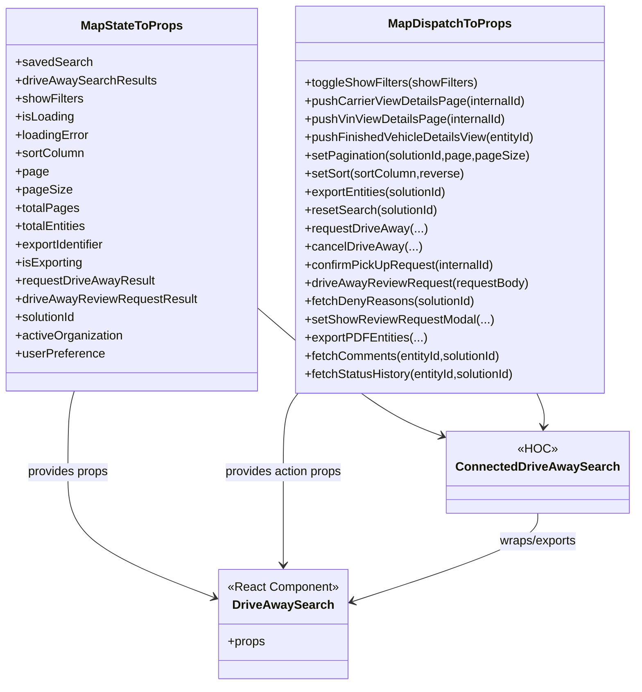

# Diagram: web/portal/src/pages/driveaway/search/DriveAway.Search.page.container.js


> Auto-generated by Obscura crawlers

## Diagram 1

```mermaid
flowchart LR
  subgraph ReduxState
    DASB[DriveAwaySearchBarState]
    RDA[RequestDriveAwayState]
    RDR[DriveAwayReviewRequestState]
    DEPF[DriveAwayExportPickUpFormState]
    DBAM[DriveAwayBulkActionState]
    DSH[DriveAwayStatusHistoryState]
    PROFILE[ProfileState]
    ORG[getSolutionId / getActiveOrganization]
  end

  MapStateToProps[mapStateToProps]
  MapDispatchToProps[mapDispatchToProps]
  MergeProps[mergeProps]
  Connect[connect(...) → ConnectedDriveAwaySearch]
  DriveAwaySearch[DriveAwaySearch Component]

  MapStateToProps -->|reads selectors| DASB
  MapStateToProps --> RDA
  MapStateToProps --> RDR
  MapStateToProps --> DEPF
  MapStateToProps --> DBAM
  MapStateToProps --> DSH
  MapStateToProps --> PROFILE
  MapStateToProps --> ORG
  DASB -->|provides many props (searchResults, page, export, loading, comments...)| MapStateToProps
  RDA -->|requestDriveAwayStatus| MapStateToProps
  RDR -->|reviewRequestStatus, denyReasons, modal flags, time windows...| MapStateToProps
  DEPF -->|exportPDFIdentifier/name/isExporting| MapStateToProps
  DBAM -->|bulkActionStatus| MapStateToProps
  DSH -->|statusHistory & fetchStatus| MapStateToProps
  PROFILE -->|userPreference| MapStateToProps
  ORG -->|solutionId, activeOrganization| MapStateToProps

  MapDispatchToProps -->|dispatches actionCreators| DASB
  MapDispatchToProps --> RDA
  MapDispatchToProps --> RDR
  MapDispatchToProps --> DEPF
  MapDispatchToProps --> DSH
  MapDispatchToProps -->|dispatches navigation events| NAV[Navigation Actions: CARRIERVIEW_DETAILS, VINVIEW_DETAILS, VIN_DETAILS]

  MapStateToProps --> MergeProps
  MapDispatchToProps --> MergeProps
  OWNPROPS[ownProps] --> MergeProps
  MergeProps -->|overrides: resetSearch() uses stateProps.solutionId; exportEntities() uses stateProps.solutionId| Connect
  Connect --> DriveAwaySearch
```

> SVG rendering failed for this diagram.

## Diagram 2



### SVG

<svg id="container" width="822.05859375" xmlns="http://www.w3.org/2000/svg" class="classDiagram" height="902" viewBox="0 0 822.05859375 902" role="graphics-document document" aria-roledescription="class"><style>#container{font-family:"trebuchet ms",verdana,arial,sans-serif;font-size:16px;fill:#333;}@keyframes edge-animation-frame{from{stroke-dashoffset:0;}}@keyframes dash{to{stroke-dashoffset:0;}}#container .edge-animation-slow{stroke-dasharray:9,5!important;stroke-dashoffset:900;animation:dash 50s linear infinite;stroke-linecap:round;}#container .edge-animation-fast{stroke-dasharray:9,5!important;stroke-dashoffset:900;animation:dash 20s linear infinite;stroke-linecap:round;}#container .error-icon{fill:#552222;}#container .error-text{fill:#552222;stroke:#552222;}#container .edge-thickness-normal{stroke-width:1px;}#container .edge-thickness-thick{stroke-width:3.5px;}#container .edge-pattern-solid{stroke-dasharray:0;}#container .edge-thickness-invisible{stroke-width:0;fill:none;}#container .edge-pattern-dashed{stroke-dasharray:3;}#container .edge-pattern-dotted{stroke-dasharray:2;}#container .marker{fill:#333333;stroke:#333333;}#container .marker.cross{stroke:#333333;}#container svg{font-family:"trebuchet ms",verdana,arial,sans-serif;font-size:16px;}#container p{margin:0;}#container g.classGroup text{fill:#9370DB;stroke:none;font-family:"trebuchet ms",verdana,arial,sans-serif;font-size:10px;}#container g.classGroup text .title{font-weight:bolder;}#container .nodeLabel,#container .edgeLabel{color:#131300;}#container .edgeLabel .label rect{fill:#ECECFF;}#container .label text{fill:#131300;}#container .labelBkg{background:#ECECFF;}#container .edgeLabel .label span{background:#ECECFF;}#container .classTitle{font-weight:bolder;}#container .node rect,#container .node circle,#container .node ellipse,#container .node polygon,#container .node path{fill:#ECECFF;stroke:#9370DB;stroke-width:1px;}#container .divider{stroke:#9370DB;stroke-width:1;}#container g.clickable{cursor:pointer;}#container g.classGroup rect{fill:#ECECFF;stroke:#9370DB;}#container g.classGroup line{stroke:#9370DB;stroke-width:1;}#container .classLabel .box{stroke:none;stroke-width:0;fill:#ECECFF;opacity:0.5;}#container .classLabel .label{fill:#9370DB;font-size:10px;}#container .relation{stroke:#333333;stroke-width:1;fill:none;}#container .dashed-line{stroke-dasharray:3;}#container .dotted-line{stroke-dasharray:1 2;}#container #compositionStart,#container .composition{fill:#333333!important;stroke:#333333!important;stroke-width:1;}#container #compositionEnd,#container .composition{fill:#333333!important;stroke:#333333!important;stroke-width:1;}#container #dependencyStart,#container .dependency{fill:#333333!important;stroke:#333333!important;stroke-width:1;}#container #dependencyStart,#container .dependency{fill:#333333!important;stroke:#333333!important;stroke-width:1;}#container #extensionStart,#container .extension{fill:transparent!important;stroke:#333333!important;stroke-width:1;}#container #extensionEnd,#container .extension{fill:transparent!important;stroke:#333333!important;stroke-width:1;}#container #aggregationStart,#container .aggregation{fill:transparent!important;stroke:#333333!important;stroke-width:1;}#container #aggregationEnd,#container .aggregation{fill:transparent!important;stroke:#333333!important;stroke-width:1;}#container #lollipopStart,#container .lollipop{fill:#ECECFF!important;stroke:#333333!important;stroke-width:1;}#container #lollipopEnd,#container .lollipop{fill:#ECECFF!important;stroke:#333333!important;stroke-width:1;}#container .edgeTerminals{font-size:11px;line-height:initial;}#container .classTitleText{text-anchor:middle;font-size:18px;fill:#333;}#container .label-icon{display:inline-block;height:1em;overflow:visible;vertical-align:-0.125em;}#container .node .label-icon path{fill:currentColor;stroke:revert;stroke-width:revert;}#container :root{--mermaid-font-family:"trebuchet ms",verdana,arial,sans-serif;}</style><g><defs><marker id="container_class-aggregationStart" class="marker aggregation class" refX="18" refY="7" markerWidth="190" markerHeight="240" orient="auto"><path d="M 18,7 L9,13 L1,7 L9,1 Z"></path></marker></defs><defs><marker id="container_class-aggregationEnd" class="marker aggregation class" refX="1" refY="7" markerWidth="20" markerHeight="28" orient="auto"><path d="M 18,7 L9,13 L1,7 L9,1 Z"></path></marker></defs><defs><marker id="container_class-extensionStart" class="marker extension class" refX="18" refY="7" markerWidth="190" markerHeight="240" orient="auto"><path d="M 1,7 L18,13 V 1 Z"></path></marker></defs><defs><marker id="container_class-extensionEnd" class="marker extension class" refX="1" refY="7" markerWidth="20" markerHeight="28" orient="auto"><path d="M 1,1 V 13 L18,7 Z"></path></marker></defs><defs><marker id="container_class-compositionStart" class="marker composition class" refX="18" refY="7" markerWidth="190" markerHeight="240" orient="auto"><path d="M 18,7 L9,13 L1,7 L9,1 Z"></path></marker></defs><defs><marker id="container_class-compositionEnd" class="marker composition class" refX="1" refY="7" markerWidth="20" markerHeight="28" orient="auto"><path d="M 18,7 L9,13 L1,7 L9,1 Z"></path></marker></defs><defs><marker id="container_class-dependencyStart" class="marker dependency class" refX="6" refY="7" markerWidth="190" markerHeight="240" orient="auto"><path d="M 5,7 L9,13 L1,7 L9,1 Z"></path></marker></defs><defs><marker id="container_class-dependencyEnd" class="marker dependency class" refX="13" refY="7" markerWidth="20" markerHeight="28" orient="auto"><path d="M 18,7 L9,13 L14,7 L9,1 Z"></path></marker></defs><defs><marker id="container_class-lollipopStart" class="marker lollipop class" refX="13" refY="7" markerWidth="190" markerHeight="240" orient="auto"><circle stroke="black" fill="transparent" cx="7" cy="7" r="6"></circle></marker></defs><defs><marker id="container_class-lollipopEnd" class="marker lollipop class" refX="1" refY="7" markerWidth="190" markerHeight="240" orient="auto"><circle stroke="black" fill="transparent" cx="7" cy="7" r="6"></circle></marker></defs><g class="root"><g class="clusters"></g><g class="edgePaths"><path d="M92.503,515L91.06,519.667C89.617,524.333,86.73,533.667,85.287,551.5C83.844,569.333,83.844,595.667,83.844,624C83.844,652.333,83.844,682.667,116.159,710.205C148.474,737.744,213.104,762.488,245.419,774.86L277.735,787.232" id="id_MapStateToProps_DriveAwaySearch_1" class="edge-thickness-normal edge-pattern-solid relation" style=";;;" data-edge="true" data-et="edge" data-id="id_MapStateToProps_DriveAwaySearch_1" data-points="W3sieCI6OTIuNTAzMTI1LCJ5Ijo1MTV9LHsieCI6ODMuODQzNzUsInkiOjU0M30seyJ4Ijo4My44NDM3NSwieSI6NjIyfSx7IngiOjgzLjg0Mzc1LCJ5Ijo3MTN9LHsieCI6MjgzLjMzNzg5MDYyNSwieSI6Nzg5LjM3Njc5NDc5MTc1OTZ9XQ==" marker-end="url(#container_class-dependencyEnd)"></path><path d="M388.023,518L384.777,522.167C381.532,526.333,375.04,534.667,371.795,552C368.549,569.333,368.549,595.667,368.549,624C368.549,652.333,368.549,682.667,368.549,703C368.549,723.333,368.549,733.667,368.549,738.833L368.549,744" id="id_MapDispatchToProps_DriveAwaySearch_2" class="edge-thickness-normal edge-pattern-solid relation" style=";;;" data-edge="true" data-et="edge" data-id="id_MapDispatchToProps_DriveAwaySearch_2" data-points="W3sieCI6Mzg4LjAyMzA1Mzg1MDQ0NjQ0LCJ5Ijo1MTh9LHsieCI6MzY4LjU0ODgyODEyNSwieSI6NTQzfSx7IngiOjM2OC41NDg4MjgxMjUsInkiOjYyMn0seyJ4IjozNjguNTQ4ODI4MTI1LCJ5Ijo3MTN9LHsieCI6MzY4LjU0ODgyODEyNSwieSI6NzUwfV0=" marker-end="url(#container_class-dependencyEnd)"></path><path d="M332.875,404.29L359.453,427.409C386.032,450.527,439.189,496.763,480.584,525.506C521.979,554.249,551.613,565.498,566.429,571.122L581.246,576.747" id="id_MapStateToProps_ConnectedDriveAwaySearch_3" class="edge-thickness-normal edge-pattern-solid relation" style=";;;" data-edge="true" data-et="edge" data-id="id_MapStateToProps_ConnectedDriveAwaySearch_3" data-points="W3sieCI6MzMyLjg3NSwieSI6NDA0LjI5MDI3OTUyMjEzNjY0fSx7IngiOjQ5Mi4zNDU3MDMxMjUsInkiOjU0M30seyJ4Ijo1ODYuODU1NDY4NzUsInkiOjU3OC44NzYzMzM4NDMyNTE3fV0=" marker-end="url(#container_class-dependencyEnd)"></path><path d="M699.404,518L701.246,522.167C703.088,526.333,706.773,534.667,708.213,542.008C709.653,549.349,708.85,555.698,708.448,558.873L708.046,562.047" id="id_MapDispatchToProps_ConnectedDriveAwaySearch_4" class="edge-thickness-normal edge-pattern-solid relation" style=";;;" data-edge="true" data-et="edge" data-id="id_MapDispatchToProps_ConnectedDriveAwaySearch_4" data-points="W3sieCI6Njk5LjQwMzczODgzOTI4NTcsInkiOjUxOH0seyJ4Ijo3MTAuNDU3MDMxMjUsInkiOjU0M30seyJ4Ijo3MDcuMjkyNDc0Mjg3OTc0NiwieSI6NTY4fV0=" marker-end="url(#container_class-dependencyEnd)"></path><path d="M700.457,676L700.457,682.167C700.457,688.333,700.457,700.667,660.291,720.024C620.125,739.381,539.793,765.763,499.626,778.954L459.46,792.144" id="id_ConnectedDriveAwaySearch_DriveAwaySearch_5" class="edge-thickness-normal edge-pattern-solid relation" style=";;;" data-edge="true" data-et="edge" data-id="id_ConnectedDriveAwaySearch_DriveAwaySearch_5" data-points="W3sieCI6NzAwLjQ1NzAzMTI1LCJ5Ijo2NzZ9LHsieCI6NzAwLjQ1NzAzMTI1LCJ5Ijo3MTN9LHsieCI6NDUzLjc1OTc2NTYyNSwieSI6Nzk0LjAxNjM4MjU0MTc2NTR9XQ==" marker-end="url(#container_class-dependencyEnd)"></path></g><g class="edgeLabels"><g class="edgeLabel" transform="translate(83.84375, 622)"><g class="label" data-id="id_MapStateToProps_DriveAwaySearch_1" transform="translate(-54.1953125, -12)"><foreignObject width="108.390625" height="24"><div xmlns="http://www.w3.org/1999/xhtml" class="labelBkg" style="display: table-cell; white-space: nowrap; line-height: 1.5; max-width: 200px; text-align: center;"><span class="edgeLabel"><p>provides props</p></span></div></foreignObject></g></g><g class="edgeLabel" transform="translate(368.548828125, 622)"><g class="label" data-id="id_MapDispatchToProps_DriveAwaySearch_2" transform="translate(-78.9921875, -12)"><foreignObject width="157.984375" height="24"><div xmlns="http://www.w3.org/1999/xhtml" class="labelBkg" style="display: table-cell; white-space: nowrap; line-height: 1.5; max-width: 200px; text-align: center;"><span class="edgeLabel"><p>provides action props</p></span></div></foreignObject></g></g><g class="edgeLabel"><g class="label" data-id="id_MapStateToProps_ConnectedDriveAwaySearch_3" transform="translate(0, 0)"><foreignObject width="0" height="0"><div xmlns="http://www.w3.org/1999/xhtml" class="labelBkg" style="display: table-cell; white-space: nowrap; line-height: 1.5; max-width: 200px; text-align: center;"><span class="edgeLabel"></span></div></foreignObject></g></g><g class="edgeLabel"><g class="label" data-id="id_MapDispatchToProps_ConnectedDriveAwaySearch_4" transform="translate(0, 0)"><foreignObject width="0" height="0"><div xmlns="http://www.w3.org/1999/xhtml" class="labelBkg" style="display: table-cell; white-space: nowrap; line-height: 1.5; max-width: 200px; text-align: center;"><span class="edgeLabel"></span></div></foreignObject></g></g><g class="edgeLabel" transform="translate(700.45703125, 713)"><g class="label" data-id="id_ConnectedDriveAwaySearch_DriveAwaySearch_5" transform="translate(-52.453125, -12)"><foreignObject width="104.90625" height="24"><div xmlns="http://www.w3.org/1999/xhtml" class="labelBkg" style="display: table-cell; white-space: nowrap; line-height: 1.5; max-width: 200px; text-align: center;"><span class="edgeLabel"><p>wraps/exports</p></span></div></foreignObject></g></g></g><g class="nodes"><g class="node default" id="classId-DriveAwaySearch-0" transform="translate(368.548828125, 822)"><g class="basic label-container"><path d="M-85.2109375 -72 L85.2109375 -72 L85.2109375 72 L-85.2109375 72" stroke="none" stroke-width="0" fill="#ECECFF" style=""></path><path d="M-85.2109375 -72 C-43.58512348424988 -72, -1.9593094684997538 -72, 85.2109375 -72 M-85.2109375 -72 C-37.51082816960164 -72, 10.189281160796725 -72, 85.2109375 -72 M85.2109375 -72 C85.2109375 -20.801141769319173, 85.2109375 30.397716461361654, 85.2109375 72 M85.2109375 -72 C85.2109375 -39.615113257478654, 85.2109375 -7.230226514957309, 85.2109375 72 M85.2109375 72 C50.35978582620161 72, 15.508634152403218 72, -85.2109375 72 M85.2109375 72 C44.805999989705796 72, 4.401062479411593 72, -85.2109375 72 M-85.2109375 72 C-85.2109375 15.769721399048095, -85.2109375 -40.46055720190381, -85.2109375 -72 M-85.2109375 72 C-85.2109375 34.321532558037006, -85.2109375 -3.3569348839259874, -85.2109375 -72" stroke="#9370DB" stroke-width="1.3" fill="none" stroke-dasharray="0 0" style=""></path></g><g class="annotation-group text" transform="translate(-73.2109375, -48)"><g class="label" style="" transform="translate(0,-12)"><foreignObject width="146.421875" height="24"><div xmlns="http://www.w3.org/1999/xhtml" style="display: table-cell; white-space: nowrap; line-height: 1.5; max-width: 196px; text-align: center;"><span class="nodeLabel markdown-node-label" style=""><p>«React Component»</p></span></div></foreignObject></g></g><g class="label-group text" transform="translate(-62.8515625, -24)"><g class="label" style="font-weight: bolder" transform="translate(0,-12)"><foreignObject width="125.703125" height="24"><div xmlns="http://www.w3.org/1999/xhtml" style="display: table-cell; white-space: nowrap; line-height: 1.5; max-width: 173px; text-align: center;"><span class="nodeLabel markdown-node-label" style=""><p>DriveAwaySearch</p></span></div></foreignObject></g></g><g class="members-group text" transform="translate(-73.2109375, 24)"><g class="label" style="" transform="translate(0,-12)"><foreignObject width="49.515625" height="24"><div xmlns="http://www.w3.org/1999/xhtml" style="display: table-cell; white-space: nowrap; line-height: 1.5; max-width: 107px; text-align: center;"><span class="nodeLabel markdown-node-label" style=""><p>+props</p></span></div></foreignObject></g></g><g class="methods-group text" transform="translate(-73.2109375, 72)"></g><g class="divider" style=""><path d="M-85.2109375 0 C-27.778226440348234 0, 29.65448461930353 0, 85.2109375 0 M-85.2109375 0 C-32.31574048540948 0, 20.579456529181044 0, 85.2109375 0" stroke="#9370DB" stroke-width="1.3" fill="none" stroke-dasharray="0 0" style=""></path></g><g class="divider" style=""><path d="M-85.2109375 48 C-24.668186246247167 48, 35.874565007505666 48, 85.2109375 48 M-85.2109375 48 C-17.853171683792922 48, 49.504594132414155 48, 85.2109375 48" stroke="#9370DB" stroke-width="1.3" fill="none" stroke-dasharray="0 0" style=""></path></g></g><g class="node default" id="classId-ConnectedDriveAwaySearch-1" transform="translate(700.45703125, 622)"><g class="basic label-container"><path d="M-113.6015625 -54 L113.6015625 -54 L113.6015625 54 L-113.6015625 54" stroke="none" stroke-width="0" fill="#ECECFF" style=""></path><path d="M-113.6015625 -54 C-25.98876334484271 -54, 61.62403581031458 -54, 113.6015625 -54 M-113.6015625 -54 C-39.046852894833336 -54, 35.50785671033333 -54, 113.6015625 -54 M113.6015625 -54 C113.6015625 -30.22787412252237, 113.6015625 -6.455748245044738, 113.6015625 54 M113.6015625 -54 C113.6015625 -21.161023169881936, 113.6015625 11.677953660236128, 113.6015625 54 M113.6015625 54 C48.736768762438786 54, -16.12802497512243 54, -113.6015625 54 M113.6015625 54 C27.16200988184457 54, -59.27754273631086 54, -113.6015625 54 M-113.6015625 54 C-113.6015625 13.001648856638617, -113.6015625 -27.996702286722766, -113.6015625 -54 M-113.6015625 54 C-113.6015625 22.7825273558595, -113.6015625 -8.434945288281, -113.6015625 -54" stroke="#9370DB" stroke-width="1.3" fill="none" stroke-dasharray="0 0" style=""></path></g><g class="annotation-group text" transform="translate(-24.4296875, -30)"><g class="label" style="" transform="translate(0,-12)"><foreignObject width="48.859375" height="24"><div xmlns="http://www.w3.org/1999/xhtml" style="display: table-cell; white-space: nowrap; line-height: 1.5; max-width: 99px; text-align: center;"><span class="nodeLabel markdown-node-label" style=""><p>«HOC»</p></span></div></foreignObject></g></g><g class="label-group text" transform="translate(-101.6015625, -6)"><g class="label" style="font-weight: bolder" transform="translate(0,-12)"><foreignObject width="203.203125" height="24"><div xmlns="http://www.w3.org/1999/xhtml" style="display: table-cell; white-space: nowrap; line-height: 1.5; max-width: 250px; text-align: center;"><span class="nodeLabel markdown-node-label" style=""><p>ConnectedDriveAwaySearch</p></span></div></foreignObject></g></g><g class="members-group text" transform="translate(-101.6015625, 42)"></g><g class="methods-group text" transform="translate(-101.6015625, 72)"></g><g class="divider" style=""><path d="M-113.6015625 18 C-40.98582052215447 18, 31.62992145569106 18, 113.6015625 18 M-113.6015625 18 C-68.00289713785963 18, -22.404231775719254 18, 113.6015625 18" stroke="#9370DB" stroke-width="1.3" fill="none" stroke-dasharray="0 0" style=""></path></g><g class="divider" style=""><path d="M-113.6015625 36 C-64.3067606687927 36, -15.01195883758541 36, 113.6015625 36 M-113.6015625 36 C-39.32126340779631 36, 34.95903568440738 36, 113.6015625 36" stroke="#9370DB" stroke-width="1.3" fill="none" stroke-dasharray="0 0" style=""></path></g></g><g class="node default" id="classId-MapStateToProps-2" transform="translate(170.4375, 263)"><g class="basic label-container"><path d="M-162.4375 -252 L162.4375 -252 L162.4375 252 L-162.4375 252" stroke="none" stroke-width="0" fill="#ECECFF" style=""></path><path d="M-162.4375 -252 C-40.38772910316678 -252, 81.66204179366645 -252, 162.4375 -252 M-162.4375 -252 C-67.69559719580204 -252, 27.046305608395926 -252, 162.4375 -252 M162.4375 -252 C162.4375 -118.07324219810008, 162.4375 15.853515603799849, 162.4375 252 M162.4375 -252 C162.4375 -147.61383339596173, 162.4375 -43.22766679192347, 162.4375 252 M162.4375 252 C85.88346528121151 252, 9.329430562423028 252, -162.4375 252 M162.4375 252 C71.45266195511516 252, -19.532176089769678 252, -162.4375 252 M-162.4375 252 C-162.4375 113.1036052255975, -162.4375 -25.79278954880499, -162.4375 -252 M-162.4375 252 C-162.4375 140.6038146546721, -162.4375 29.207629309344213, -162.4375 -252" stroke="#9370DB" stroke-width="1.3" fill="none" stroke-dasharray="0 0" style=""></path></g><g class="annotation-group text" transform="translate(0, -228)"></g><g class="label-group text" transform="translate(-64.234375, -228)"><g class="label" style="font-weight: bolder" transform="translate(0,-12)"><foreignObject width="128.46875" height="24"><div xmlns="http://www.w3.org/1999/xhtml" style="display: table-cell; white-space: nowrap; line-height: 1.5; max-width: 176px; text-align: center;"><span class="nodeLabel markdown-node-label" style=""><p>MapStateToProps</p></span></div></foreignObject></g></g><g class="members-group text" transform="translate(-150.4375, -180)"><g class="label" style="" transform="translate(0,-12)"><foreignObject width="98.5625" height="24"><div xmlns="http://www.w3.org/1999/xhtml" style="display: table-cell; white-space: nowrap; line-height: 1.5; max-width: 156px; text-align: center;"><span class="nodeLabel markdown-node-label" style=""><p>+savedSearch</p></span></div></foreignObject></g><g class="label" style="" transform="translate(0,12)"><foreignObject width="183.140625" height="24"><div xmlns="http://www.w3.org/1999/xhtml" style="display: table-cell; white-space: nowrap; line-height: 1.5; max-width: 241px; text-align: center;"><span class="nodeLabel markdown-node-label" style=""><p>+driveAwaySearchResults</p></span></div></foreignObject></g><g class="label" style="" transform="translate(0,36)"><foreignObject width="89.8125" height="24"><div xmlns="http://www.w3.org/1999/xhtml" style="display: table-cell; white-space: nowrap; line-height: 1.5; max-width: 147px; text-align: center;"><span class="nodeLabel markdown-node-label" style=""><p>+showFilters</p></span></div></foreignObject></g><g class="label" style="" transform="translate(0,60)"><foreignObject width="77.203125" height="24"><div xmlns="http://www.w3.org/1999/xhtml" style="display: table-cell; white-space: nowrap; line-height: 1.5; max-width: 135px; text-align: center;"><span class="nodeLabel markdown-node-label" style=""><p>+isLoading</p></span></div></foreignObject></g><g class="label" style="" transform="translate(0,84)"><foreignObject width="98.0625" height="24"><div xmlns="http://www.w3.org/1999/xhtml" style="display: table-cell; white-space: nowrap; line-height: 1.5; max-width: 156px; text-align: center;"><span class="nodeLabel markdown-node-label" style=""><p>+loadingError</p></span></div></foreignObject></g><g class="label" style="" transform="translate(0,108)"><foreignObject width="91.828125" height="24"><div xmlns="http://www.w3.org/1999/xhtml" style="display: table-cell; white-space: nowrap; line-height: 1.5; max-width: 149px; text-align: center;"><span class="nodeLabel markdown-node-label" style=""><p>+sortColumn</p></span></div></foreignObject></g><g class="label" style="" transform="translate(0,132)"><foreignObject width="42.65625" height="24"><div xmlns="http://www.w3.org/1999/xhtml" style="display: table-cell; white-space: nowrap; line-height: 1.5; max-width: 100px; text-align: center;"><span class="nodeLabel markdown-node-label" style=""><p>+page</p></span></div></foreignObject></g><g class="label" style="" transform="translate(0,156)"><foreignObject width="71.5" height="24"><div xmlns="http://www.w3.org/1999/xhtml" style="display: table-cell; white-space: nowrap; line-height: 1.5; max-width: 129px; text-align: center;"><span class="nodeLabel markdown-node-label" style=""><p>+pageSize</p></span></div></foreignObject></g><g class="label" style="" transform="translate(0,180)"><foreignObject width="82.90625" height="24"><div xmlns="http://www.w3.org/1999/xhtml" style="display: table-cell; white-space: nowrap; line-height: 1.5; max-width: 140px; text-align: center;"><span class="nodeLabel markdown-node-label" style=""><p>+totalPages</p></span></div></foreignObject></g><g class="label" style="" transform="translate(0,204)"><foreignObject width="96.234375" height="24"><div xmlns="http://www.w3.org/1999/xhtml" style="display: table-cell; white-space: nowrap; line-height: 1.5; max-width: 154px; text-align: center;"><span class="nodeLabel markdown-node-label" style=""><p>+totalEntities</p></span></div></foreignObject></g><g class="label" style="" transform="translate(0,228)"><foreignObject width="121.890625" height="24"><div xmlns="http://www.w3.org/1999/xhtml" style="display: table-cell; white-space: nowrap; line-height: 1.5; max-width: 180px; text-align: center;"><span class="nodeLabel markdown-node-label" style=""><p>+exportIdentifier</p></span></div></foreignObject></g><g class="label" style="" transform="translate(0,252)"><foreignObject width="89.296875" height="24"><div xmlns="http://www.w3.org/1999/xhtml" style="display: table-cell; white-space: nowrap; line-height: 1.5; max-width: 147px; text-align: center;"><span class="nodeLabel markdown-node-label" style=""><p>+isExporting</p></span></div></foreignObject></g><g class="label" style="" transform="translate(0,276)"><foreignObject width="182.96875" height="24"><div xmlns="http://www.w3.org/1999/xhtml" style="display: table-cell; white-space: nowrap; line-height: 1.5; max-width: 241px; text-align: center;"><span class="nodeLabel markdown-node-label" style=""><p>+requestDriveAwayResult</p></span></div></foreignObject></g><g class="label" style="" transform="translate(0,300)"><foreignObject width="236.640625" height="24"><div xmlns="http://www.w3.org/1999/xhtml" style="display: table-cell; white-space: nowrap; line-height: 1.5; max-width: 294px; text-align: center;"><span class="nodeLabel markdown-node-label" style=""><p>+driveAwayReviewRequestResult</p></span></div></foreignObject></g><g class="label" style="" transform="translate(0,324)"><foreignObject width="82.109375" height="24"><div xmlns="http://www.w3.org/1999/xhtml" style="display: table-cell; white-space: nowrap; line-height: 1.5; max-width: 139px; text-align: center;"><span class="nodeLabel markdown-node-label" style=""><p>+solutionId</p></span></div></foreignObject></g><g class="label" style="" transform="translate(0,348)"><foreignObject width="143" height="24"><div xmlns="http://www.w3.org/1999/xhtml" style="display: table-cell; white-space: nowrap; line-height: 1.5; max-width: 200px; text-align: center;"><span class="nodeLabel markdown-node-label" style=""><p>+activeOrganization</p></span></div></foreignObject></g><g class="label" style="" transform="translate(0,372)"><foreignObject width="116.828125" height="24"><div xmlns="http://www.w3.org/1999/xhtml" style="display: table-cell; white-space: nowrap; line-height: 1.5; max-width: 174px; text-align: center;"><span class="nodeLabel markdown-node-label" style=""><p>+userPreference</p></span></div></foreignObject></g></g><g class="methods-group text" transform="translate(-150.4375, 252)"></g><g class="divider" style=""><path d="M-162.4375 -204 C-90.45002801515541 -204, -18.46255603031082 -204, 162.4375 -204 M-162.4375 -204 C-57.347830519474314 -204, 47.74183896105137 -204, 162.4375 -204" stroke="#9370DB" stroke-width="1.3" fill="none" stroke-dasharray="0 0" style=""></path></g><g class="divider" style=""><path d="M-162.4375 228 C-40.904225452386584 228, 80.62904909522683 228, 162.4375 228 M-162.4375 228 C-87.5909757877899 228, -12.744451575579802 228, 162.4375 228" stroke="#9370DB" stroke-width="1.3" fill="none" stroke-dasharray="0 0" style=""></path></g></g><g class="node default" id="classId-MapDispatchToProps-3" transform="translate(586.66015625, 263)"><g class="basic label-container"><path d="M-203.78515625 -255 L203.78515625 -255 L203.78515625 255 L-203.78515625 255" stroke="none" stroke-width="0" fill="#ECECFF" style=""></path><path d="M-203.78515625 -255 C-79.98341422225012 -255, 43.81832780549976 -255, 203.78515625 -255 M-203.78515625 -255 C-113.77479456986617 -255, -23.764432889732348 -255, 203.78515625 -255 M203.78515625 -255 C203.78515625 -52.59605742085654, 203.78515625 149.80788515828692, 203.78515625 255 M203.78515625 -255 C203.78515625 -58.30073271689761, 203.78515625 138.39853456620477, 203.78515625 255 M203.78515625 255 C62.8015335901855 255, -78.182089069629 255, -203.78515625 255 M203.78515625 255 C117.85024821674402 255, 31.91534018348804 255, -203.78515625 255 M-203.78515625 255 C-203.78515625 77.81642601095677, -203.78515625 -99.36714797808645, -203.78515625 -255 M-203.78515625 255 C-203.78515625 129.1947078127821, -203.78515625 3.389415625564226, -203.78515625 -255" stroke="#9370DB" stroke-width="1.3" fill="none" stroke-dasharray="0 0" style=""></path></g><g class="annotation-group text" transform="translate(0, -231)"></g><g class="label-group text" transform="translate(-76.7265625, -231)"><g class="label" style="font-weight: bolder" transform="translate(0,-12)"><foreignObject width="153.453125" height="24"><div xmlns="http://www.w3.org/1999/xhtml" style="display: table-cell; white-space: nowrap; line-height: 1.5; max-width: 201px; text-align: center;"><span class="nodeLabel markdown-node-label" style=""><p>MapDispatchToProps</p></span></div></foreignObject></g></g><g class="members-group text" transform="translate(-191.78515625, -183)"></g><g class="methods-group text" transform="translate(-191.78515625, -153)"><g class="label" style="" transform="translate(0,-12)"><foreignObject width="228.03125" height="24"><div xmlns="http://www.w3.org/1999/xhtml" style="display: table-cell; white-space: nowrap; line-height: 1.5; max-width: 285px; text-align: center;"><span class="nodeLabel markdown-node-label" style=""><p>+toggleShowFilters(showFilters)</p></span></div></foreignObject></g><g class="label" style="" transform="translate(0,12)"><foreignObject width="291.90625" height="24"><div xmlns="http://www.w3.org/1999/xhtml" style="display: table-cell; white-space: nowrap; line-height: 1.5; max-width: 349px; text-align: center;"><span class="nodeLabel markdown-node-label" style=""><p>+pushCarrierViewDetailsPage(internalId)</p></span></div></foreignObject></g><g class="label" style="" transform="translate(0,36)"><foreignObject width="265.4375" height="24"><div xmlns="http://www.w3.org/1999/xhtml" style="display: table-cell; white-space: nowrap; line-height: 1.5; max-width: 323px; text-align: center;"><span class="nodeLabel markdown-node-label" style=""><p>+pushVinViewDetailsPage(internalId)</p></span></div></foreignObject></g><g class="label" style="" transform="translate(0,60)"><foreignObject width="306.84375" height="24"><div xmlns="http://www.w3.org/1999/xhtml" style="display: table-cell; white-space: nowrap; line-height: 1.5; max-width: 364px; text-align: center;"><span class="nodeLabel markdown-node-label" style=""><p>+pushFinishedVehicleDetailsView(entityId)</p></span></div></foreignObject></g><g class="label" style="" transform="translate(0,84)"><foreignObject width="297.015625" height="24"><div xmlns="http://www.w3.org/1999/xhtml" style="display: table-cell; white-space: nowrap; line-height: 1.5; max-width: 354px; text-align: center;"><span class="nodeLabel markdown-node-label" style=""><p>+setPagination(solutionId,page,pageSize)</p></span></div></foreignObject></g><g class="label" style="" transform="translate(0,108)"><foreignObject width="211.03125" height="24"><div xmlns="http://www.w3.org/1999/xhtml" style="display: table-cell; white-space: nowrap; line-height: 1.5; max-width: 268px; text-align: center;"><span class="nodeLabel markdown-node-label" style=""><p>+setSort(sortColumn,reverse)</p></span></div></foreignObject></g><g class="label" style="" transform="translate(0,132)"><foreignObject width="194.15625" height="24"><div xmlns="http://www.w3.org/1999/xhtml" style="display: table-cell; white-space: nowrap; line-height: 1.5; max-width: 252px; text-align: center;"><span class="nodeLabel markdown-node-label" style=""><p>+exportEntities(solutionId)</p></span></div></foreignObject></g><g class="label" style="" transform="translate(0,156)"><foreignObject width="177.5625" height="24"><div xmlns="http://www.w3.org/1999/xhtml" style="display: table-cell; white-space: nowrap; line-height: 1.5; max-width: 235px; text-align: center;"><span class="nodeLabel markdown-node-label" style=""><p>+resetSearch(solutionId)</p></span></div></foreignObject></g><g class="label" style="" transform="translate(0,180)"><foreignObject width="159.453125" height="24"><div xmlns="http://www.w3.org/1999/xhtml" style="display: table-cell; white-space: nowrap; line-height: 1.5; max-width: 217px; text-align: center;"><span class="nodeLabel markdown-node-label" style=""><p>+requestDriveAway(...)</p></span></div></foreignObject></g><g class="label" style="" transform="translate(0,204)"><foreignObject width="150.484375" height="24"><div xmlns="http://www.w3.org/1999/xhtml" style="display: table-cell; white-space: nowrap; line-height: 1.5; max-width: 208px; text-align: center;"><span class="nodeLabel markdown-node-label" style=""><p>+cancelDriveAway(...)</p></span></div></foreignObject></g><g class="label" style="" transform="translate(0,228)"><foreignObject width="253.46875" height="24"><div xmlns="http://www.w3.org/1999/xhtml" style="display: table-cell; white-space: nowrap; line-height: 1.5; max-width: 311px; text-align: center;"><span class="nodeLabel markdown-node-label" style=""><p>+confirmPickUpRequest(internalId)</p></span></div></foreignObject></g><g class="label" style="" transform="translate(0,252)"><foreignObject width="293.390625" height="24"><div xmlns="http://www.w3.org/1999/xhtml" style="display: table-cell; white-space: nowrap; line-height: 1.5; max-width: 351px; text-align: center;"><span class="nodeLabel markdown-node-label" style=""><p>+driveAwayReviewRequest(requestBody)</p></span></div></foreignObject></g><g class="label" style="" transform="translate(0,276)"><foreignObject width="225.078125" height="24"><div xmlns="http://www.w3.org/1999/xhtml" style="display: table-cell; white-space: nowrap; line-height: 1.5; max-width: 282px; text-align: center;"><span class="nodeLabel markdown-node-label" style=""><p>+fetchDenyReasons(solutionId)</p></span></div></foreignObject></g><g class="label" style="" transform="translate(0,300)"><foreignObject width="245.03125" height="24"><div xmlns="http://www.w3.org/1999/xhtml" style="display: table-cell; white-space: nowrap; line-height: 1.5; max-width: 302px; text-align: center;"><span class="nodeLabel markdown-node-label" style=""><p>+setShowReviewRequestModal(...)</p></span></div></foreignObject></g><g class="label" style="" transform="translate(0,324)"><foreignObject width="159.015625" height="24"><div xmlns="http://www.w3.org/1999/xhtml" style="display: table-cell; white-space: nowrap; line-height: 1.5; max-width: 216px; text-align: center;"><span class="nodeLabel markdown-node-label" style=""><p>+exportPDFEntities(...)</p></span></div></foreignObject></g><g class="label" style="" transform="translate(0,348)"><foreignObject width="265.609375" height="24"><div xmlns="http://www.w3.org/1999/xhtml" style="display: table-cell; white-space: nowrap; line-height: 1.5; max-width: 323px; text-align: center;"><span class="nodeLabel markdown-node-label" style=""><p>+fetchComments(entityId,solutionId)</p></span></div></foreignObject></g><g class="label" style="" transform="translate(0,372)"><foreignObject width="286.296875" height="24"><div xmlns="http://www.w3.org/1999/xhtml" style="display: table-cell; white-space: nowrap; line-height: 1.5; max-width: 344px; text-align: center;"><span class="nodeLabel markdown-node-label" style=""><p>+fetchStatusHistory(entityId,solutionId)</p></span></div></foreignObject></g></g><g class="divider" style=""><path d="M-203.78515625 -207 C-91.36858230383349 -207, 21.047991642333017 -207, 203.78515625 -207 M-203.78515625 -207 C-54.32806079360023 -207, 95.12903466279954 -207, 203.78515625 -207" stroke="#9370DB" stroke-width="1.3" fill="none" stroke-dasharray="0 0" style=""></path></g><g class="divider" style=""><path d="M-203.78515625 -183 C-90.53733404962635 -183, 22.710488150747295 -183, 203.78515625 -183 M-203.78515625 -183 C-104.09114626231418 -183, -4.397136274628366 -183, 203.78515625 -183" stroke="#9370DB" stroke-width="1.3" fill="none" stroke-dasharray="0 0" style=""></path></g></g></g></g></g></svg>
