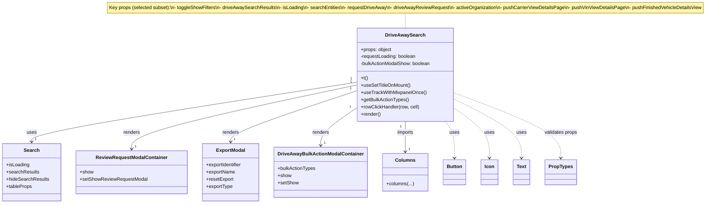
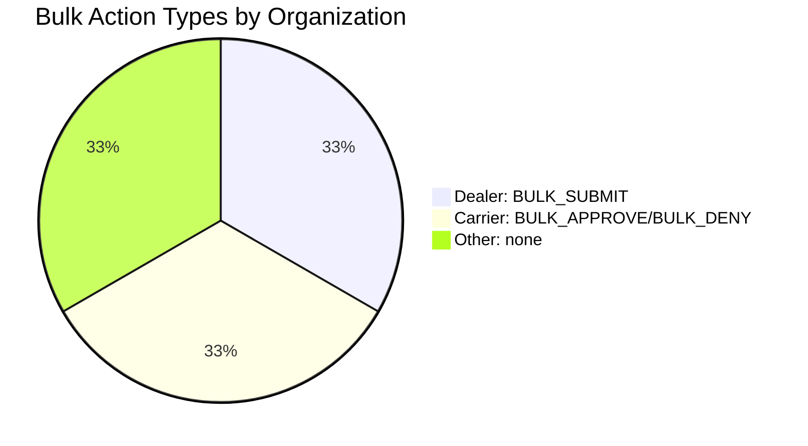

# Diagram: web/portal/src/pages/driveaway/search/DriveAway.Search.page.js


> Auto-generated by Obscura crawlers

## Diagram 1



### SVG

<svg id="container" width="2341.44921875" xmlns="http://www.w3.org/2000/svg" class="classDiagram" height="680" viewBox="0 0 2341.44921875 680" role="graphics-document document" aria-roledescription="class"><style>#container{font-family:"trebuchet ms",verdana,arial,sans-serif;font-size:16px;fill:#333;}@keyframes edge-animation-frame{from{stroke-dashoffset:0;}}@keyframes dash{to{stroke-dashoffset:0;}}#container .edge-animation-slow{stroke-dasharray:9,5!important;stroke-dashoffset:900;animation:dash 50s linear infinite;stroke-linecap:round;}#container .edge-animation-fast{stroke-dasharray:9,5!important;stroke-dashoffset:900;animation:dash 20s linear infinite;stroke-linecap:round;}#container .error-icon{fill:#552222;}#container .error-text{fill:#552222;stroke:#552222;}#container .edge-thickness-normal{stroke-width:1px;}#container .edge-thickness-thick{stroke-width:3.5px;}#container .edge-pattern-solid{stroke-dasharray:0;}#container .edge-thickness-invisible{stroke-width:0;fill:none;}#container .edge-pattern-dashed{stroke-dasharray:3;}#container .edge-pattern-dotted{stroke-dasharray:2;}#container .marker{fill:#333333;stroke:#333333;}#container .marker.cross{stroke:#333333;}#container svg{font-family:"trebuchet ms",verdana,arial,sans-serif;font-size:16px;}#container p{margin:0;}#container g.classGroup text{fill:#9370DB;stroke:none;font-family:"trebuchet ms",verdana,arial,sans-serif;font-size:10px;}#container g.classGroup text .title{font-weight:bolder;}#container .nodeLabel,#container .edgeLabel{color:#131300;}#container .edgeLabel .label rect{fill:#ECECFF;}#container .label text{fill:#131300;}#container .labelBkg{background:#ECECFF;}#container .edgeLabel .label span{background:#ECECFF;}#container .classTitle{font-weight:bolder;}#container .node rect,#container .node circle,#container .node ellipse,#container .node polygon,#container .node path{fill:#ECECFF;stroke:#9370DB;stroke-width:1px;}#container .divider{stroke:#9370DB;stroke-width:1;}#container g.clickable{cursor:pointer;}#container g.classGroup rect{fill:#ECECFF;stroke:#9370DB;}#container g.classGroup line{stroke:#9370DB;stroke-width:1;}#container .classLabel .box{stroke:none;stroke-width:0;fill:#ECECFF;opacity:0.5;}#container .classLabel .label{fill:#9370DB;font-size:10px;}#container .relation{stroke:#333333;stroke-width:1;fill:none;}#container .dashed-line{stroke-dasharray:3;}#container .dotted-line{stroke-dasharray:1 2;}#container #compositionStart,#container .composition{fill:#333333!important;stroke:#333333!important;stroke-width:1;}#container #compositionEnd,#container .composition{fill:#333333!important;stroke:#333333!important;stroke-width:1;}#container #dependencyStart,#container .dependency{fill:#333333!important;stroke:#333333!important;stroke-width:1;}#container #dependencyStart,#container .dependency{fill:#333333!important;stroke:#333333!important;stroke-width:1;}#container #extensionStart,#container .extension{fill:transparent!important;stroke:#333333!important;stroke-width:1;}#container #extensionEnd,#container .extension{fill:transparent!important;stroke:#333333!important;stroke-width:1;}#container #aggregationStart,#container .aggregation{fill:transparent!important;stroke:#333333!important;stroke-width:1;}#container #aggregationEnd,#container .aggregation{fill:transparent!important;stroke:#333333!important;stroke-width:1;}#container #lollipopStart,#container .lollipop{fill:#ECECFF!important;stroke:#333333!important;stroke-width:1;}#container #lollipopEnd,#container .lollipop{fill:#ECECFF!important;stroke:#333333!important;stroke-width:1;}#container .edgeTerminals{font-size:11px;line-height:initial;}#container .classTitleText{text-anchor:middle;font-size:18px;fill:#333;}#container .label-icon{display:inline-block;height:1em;overflow:visible;vertical-align:-0.125em;}#container .node .label-icon path{fill:currentColor;stroke:revert;stroke-width:revert;}#container :root{--mermaid-font-family:"trebuchet ms",verdana,arial,sans-serif;}</style><g><defs><marker id="container_class-aggregationStart" class="marker aggregation class" refX="18" refY="7" markerWidth="190" markerHeight="240" orient="auto"><path d="M 18,7 L9,13 L1,7 L9,1 Z"></path></marker></defs><defs><marker id="container_class-aggregationEnd" class="marker aggregation class" refX="1" refY="7" markerWidth="20" markerHeight="28" orient="auto"><path d="M 18,7 L9,13 L1,7 L9,1 Z"></path></marker></defs><defs><marker id="container_class-extensionStart" class="marker extension class" refX="18" refY="7" markerWidth="190" markerHeight="240" orient="auto"><path d="M 1,7 L18,13 V 1 Z"></path></marker></defs><defs><marker id="container_class-extensionEnd" class="marker extension class" refX="1" refY="7" markerWidth="20" markerHeight="28" orient="auto"><path d="M 1,1 V 13 L18,7 Z"></path></marker></defs><defs><marker id="container_class-compositionStart" class="marker composition class" refX="18" refY="7" markerWidth="190" markerHeight="240" orient="auto"><path d="M 18,7 L9,13 L1,7 L9,1 Z"></path></marker></defs><defs><marker id="container_class-compositionEnd" class="marker composition class" refX="1" refY="7" markerWidth="20" markerHeight="28" orient="auto"><path d="M 18,7 L9,13 L1,7 L9,1 Z"></path></marker></defs><defs><marker id="container_class-dependencyStart" class="marker dependency class" refX="6" refY="7" markerWidth="190" markerHeight="240" orient="auto"><path d="M 5,7 L9,13 L1,7 L9,1 Z"></path></marker></defs><defs><marker id="container_class-dependencyEnd" class="marker dependency class" refX="13" refY="7" markerWidth="20" markerHeight="28" orient="auto"><path d="M 18,7 L9,13 L14,7 L9,1 Z"></path></marker></defs><defs><marker id="container_class-lollipopStart" class="marker lollipop class" refX="13" refY="7" markerWidth="190" markerHeight="240" orient="auto"><circle stroke="black" fill="transparent" cx="7" cy="7" r="6"></circle></marker></defs><defs><marker id="container_class-lollipopEnd" class="marker lollipop class" refX="1" refY="7" markerWidth="190" markerHeight="240" orient="auto"><circle stroke="black" fill="transparent" cx="7" cy="7" r="6"></circle></marker></defs><g class="root"><g class="clusters"></g><g class="edgePaths"><path d="M1320.496,44L1320.496,48.167C1320.496,52.333,1320.496,60.667,1320.496,69C1320.496,77.333,1320.496,85.667,1320.496,89.833L1320.496,94" id="edgeNote1" class="edge-thickness-normal edge-pattern-dotted relation" style="fill: none;;;fill: none" data-edge="true" data-et="edge" data-id="edgeNote1" data-points="W3sieCI6MTMyMC40OTYwOTM3NSwieSI6NDR9LHsieCI6MTMyMC40OTYwOTM3NSwieSI6Njl9LHsieCI6MTMyMC40OTYwOTM3NSwieSI6OTR9XQ=="></path><path d="M1159.539,275.52L983.488,303.433C807.438,331.347,455.336,387.173,279.285,420.253C103.234,453.333,103.234,463.667,103.234,468.833L103.234,474" id="id_DriveAwaySearch_Search_1" class="edge-thickness-normal edge-pattern-solid relation" style=";;;" data-edge="true" data-et="edge" data-id="id_DriveAwaySearch_Search_1" data-points="W3sieCI6MTE1OS41MzkwNjI1LCJ5IjoyNzUuNTIwMTU0NDE5MzM5fSx7IngiOjEwMy4yMzQzNzUsInkiOjQ0M30seyJ4IjoxMDMuMjM0Mzc1LCJ5Ijo0ODB9XQ==" marker-end="url(#container_class-dependencyEnd)"></path><path d="M1159.539,284.846L1037.785,311.205C916.031,337.564,672.523,390.282,550.77,425.808C429.016,461.333,429.016,479.667,429.016,488.833L429.016,498" id="id_DriveAwaySearch_ReviewRequestModalContainer_2" class="edge-thickness-normal edge-pattern-solid relation" style=";;;" data-edge="true" data-et="edge" data-id="id_DriveAwaySearch_ReviewRequestModalContainer_2" data-points="W3sieCI6MTE1OS41MzkwNjI1LCJ5IjoyODQuODQ2MjAwMzYwMTgwNH0seyJ4Ijo0MjkuMDE1NjI1LCJ5Ijo0NDN9LHsieCI6NDI5LjAxNTYyNSwieSI6NTA0fV0=" marker-end="url(#container_class-dependencyEnd)"></path><path d="M1159.539,305.007L1092.242,328.006C1024.944,351.005,890.349,397.002,823.051,425.168C755.754,453.333,755.754,463.667,755.754,468.833L755.754,474" id="id_DriveAwaySearch_ExportModal_3" class="edge-thickness-normal edge-pattern-solid relation" style=";;;" data-edge="true" data-et="edge" data-id="id_DriveAwaySearch_ExportModal_3" data-points="W3sieCI6MTE1OS41MzkwNjI1LCJ5IjozMDUuMDA2ODgyMjg4NjU0OTR9LHsieCI6NzU1Ljc1MzkwNjI1LCJ5Ijo0NDN9LHsieCI6NzU1Ljc1MzkwNjI1LCJ5Ijo0ODB9XQ==" marker-end="url(#container_class-dependencyEnd)"></path><path d="M1159.539,364.681L1141.219,377.734C1122.898,390.787,1086.258,416.894,1067.938,437.114C1049.617,457.333,1049.617,471.667,1049.617,478.833L1049.617,486" id="id_DriveAwaySearch_DriveAwayBulkActionModalContainer_4" class="edge-thickness-normal edge-pattern-solid relation" style=";;;" data-edge="true" data-et="edge" data-id="id_DriveAwaySearch_DriveAwayBulkActionModalContainer_4" data-points="W3sieCI6MTE1OS41MzkwNjI1LCJ5IjozNjQuNjgxMTU5NDIwMjg5OX0seyJ4IjoxMDQ5LjYxNzE4NzUsInkiOjQ0M30seyJ4IjoxMDQ5LjYxNzE4NzUsInkiOjQ5Mn1d" marker-end="url(#container_class-dependencyEnd)"></path><path d="M1320.496,406L1320.496,412.167C1320.496,418.333,1320.496,430.667,1320.496,447.5C1320.496,464.333,1320.496,485.667,1320.496,496.333L1320.496,507" id="id_DriveAwaySearch_Columns_5" class="edge-thickness-normal edge-pattern-solid relation" style=";;;" data-edge="true" data-et="edge" data-id="id_DriveAwaySearch_Columns_5" data-points="W3sieCI6MTMyMC40OTYwOTM3NSwieSI6NDA2fSx7IngiOjEzMjAuNDk2MDkzNzUsInkiOjQ0M30seyJ4IjoxMzIwLjQ5NjA5Mzc1LCJ5Ijo1MTN9XQ==" marker-end="url(#container_class-dependencyEnd)"></path><path d="M1449.857,406L1454.971,412.167C1460.085,418.333,1470.312,430.667,1475.425,451C1480.539,471.333,1480.539,499.667,1480.539,513.833L1480.539,528" id="id_DriveAwaySearch_Button_6" class="edge-thickness-normal edge-pattern-dashed relation" style=";;;" data-edge="true" data-et="edge" data-id="id_DriveAwaySearch_Button_6" data-points="W3sieCI6MTQ0OS44NTcyNDk4MzgwODMsInkiOjQwNn0seyJ4IjoxNDgwLjUzOTA2MjUsInkiOjQ0M30seyJ4IjoxNDgwLjUzOTA2MjUsInkiOjUzNH1d" marker-end="url(#container_class-dependencyEnd)"></path><path d="M1481.453,363.299L1500.324,376.582C1519.195,389.866,1556.938,416.433,1575.809,443.883C1594.68,471.333,1594.68,499.667,1594.68,513.833L1594.68,528" id="id_DriveAwaySearch_Icon_7" class="edge-thickness-normal edge-pattern-dashed relation" style=";;;" data-edge="true" data-et="edge" data-id="id_DriveAwaySearch_Icon_7" data-points="W3sieCI6MTQ4MS40NTMxMjUsInkiOjM2My4yOTg5MjcyMTI4OTA1M30seyJ4IjoxNTk0LjY3OTY4NzUsInkiOjQ0M30seyJ4IjoxNTk0LjY3OTY4NzUsInkiOjUzNH1d" marker-end="url(#container_class-dependencyEnd)"></path><path d="M1481.453,331.993L1517.772,350.494C1554.091,368.995,1626.729,405.998,1663.048,438.665C1699.367,471.333,1699.367,499.667,1699.367,513.833L1699.367,528" id="id_DriveAwaySearch_Text_8" class="edge-thickness-normal edge-pattern-dashed relation" style=";;;" data-edge="true" data-et="edge" data-id="id_DriveAwaySearch_Text_8" data-points="W3sieCI6MTQ4MS40NTMxMjUsInkiOjMzMS45OTI4MTM3NjYyMjU3fSx7IngiOjE2OTkuMzY3MTg3NSwieSI6NDQzfSx7IngiOjE2OTkuMzY3MTg3NSwieSI6NTM0fV0=" marker-end="url(#container_class-dependencyEnd)"></path><path d="M1481.453,311.331L1539.046,333.276C1596.638,355.22,1711.823,399.11,1769.415,435.222C1827.008,471.333,1827.008,499.667,1827.008,513.833L1827.008,528" id="id_DriveAwaySearch_PropTypes_9" class="edge-thickness-normal edge-pattern-dashed relation" style=";;;" data-edge="true" data-et="edge" data-id="id_DriveAwaySearch_PropTypes_9" data-points="W3sieCI6MTQ4MS40NTMxMjUsInkiOjMxMS4zMzA2Nzc4MTMxNjc2fSx7IngiOjE4MjcuMDA3ODEyNSwieSI6NDQzfSx7IngiOjE4MjcuMDA3ODEyNSwieSI6NTM0fV0=" marker-end="url(#container_class-dependencyEnd)"></path></g><g class="edgeLabels"><g class="edgeLabel"><g class="label" data-id="edgeNote1" transform="translate(0, 0)"><foreignObject width="0" height="0"><div xmlns="http://www.w3.org/1999/xhtml" class="labelBkg" style="display: table-cell; white-space: nowrap; line-height: 1.5; max-width: 200px; text-align: center;"><span class="edgeLabel"></span></div></foreignObject></g></g><g class="edgeLabel" transform="translate(103.234375, 443)"><g class="label" data-id="id_DriveAwaySearch_Search_1" transform="translate(-16.4921875, -12)"><foreignObject width="32.984375" height="24"><div xmlns="http://www.w3.org/1999/xhtml" class="labelBkg" style="display: table-cell; white-space: nowrap; line-height: 1.5; max-width: 200px; text-align: center;"><span class="edgeLabel"><p>uses</p></span></div></foreignObject></g></g><g class="edgeLabel" transform="translate(429.015625, 443)"><g class="label" data-id="id_DriveAwaySearch_ReviewRequestModalContainer_2" transform="translate(-27.75, -12)"><foreignObject width="55.5" height="24"><div xmlns="http://www.w3.org/1999/xhtml" class="labelBkg" style="display: table-cell; white-space: nowrap; line-height: 1.5; max-width: 200px; text-align: center;"><span class="edgeLabel"><p>renders</p></span></div></foreignObject></g></g><g class="edgeLabel" transform="translate(755.75390625, 443)"><g class="label" data-id="id_DriveAwaySearch_ExportModal_3" transform="translate(-27.75, -12)"><foreignObject width="55.5" height="24"><div xmlns="http://www.w3.org/1999/xhtml" class="labelBkg" style="display: table-cell; white-space: nowrap; line-height: 1.5; max-width: 200px; text-align: center;"><span class="edgeLabel"><p>renders</p></span></div></foreignObject></g></g><g class="edgeLabel" transform="translate(1049.6171875, 443)"><g class="label" data-id="id_DriveAwaySearch_DriveAwayBulkActionModalContainer_4" transform="translate(-27.75, -12)"><foreignObject width="55.5" height="24"><div xmlns="http://www.w3.org/1999/xhtml" class="labelBkg" style="display: table-cell; white-space: nowrap; line-height: 1.5; max-width: 200px; text-align: center;"><span class="edgeLabel"><p>renders</p></span></div></foreignObject></g></g><g class="edgeLabel" transform="translate(1320.49609375, 443)"><g class="label" data-id="id_DriveAwaySearch_Columns_5" transform="translate(-28.25, -12)"><foreignObject width="56.5" height="24"><div xmlns="http://www.w3.org/1999/xhtml" class="labelBkg" style="display: table-cell; white-space: nowrap; line-height: 1.5; max-width: 200px; text-align: center;"><span class="edgeLabel"><p>imports</p></span></div></foreignObject></g></g><g class="edgeLabel" transform="translate(1480.5390625, 443)"><g class="label" data-id="id_DriveAwaySearch_Button_6" transform="translate(-16.4921875, -12)"><foreignObject width="32.984375" height="24"><div xmlns="http://www.w3.org/1999/xhtml" class="labelBkg" style="display: table-cell; white-space: nowrap; line-height: 1.5; max-width: 200px; text-align: center;"><span class="edgeLabel"><p>uses</p></span></div></foreignObject></g></g><g class="edgeLabel" transform="translate(1594.6796875, 443)"><g class="label" data-id="id_DriveAwaySearch_Icon_7" transform="translate(-16.4921875, -12)"><foreignObject width="32.984375" height="24"><div xmlns="http://www.w3.org/1999/xhtml" class="labelBkg" style="display: table-cell; white-space: nowrap; line-height: 1.5; max-width: 200px; text-align: center;"><span class="edgeLabel"><p>uses</p></span></div></foreignObject></g></g><g class="edgeLabel" transform="translate(1699.3671875, 443)"><g class="label" data-id="id_DriveAwaySearch_Text_8" transform="translate(-16.4921875, -12)"><foreignObject width="32.984375" height="24"><div xmlns="http://www.w3.org/1999/xhtml" class="labelBkg" style="display: table-cell; white-space: nowrap; line-height: 1.5; max-width: 200px; text-align: center;"><span class="edgeLabel"><p>uses</p></span></div></foreignObject></g></g><g class="edgeLabel" transform="translate(1827.0078125, 443)"><g class="label" data-id="id_DriveAwaySearch_PropTypes_9" transform="translate(-55.5625, -12)"><foreignObject width="111.125" height="24"><div xmlns="http://www.w3.org/1999/xhtml" class="labelBkg" style="display: table-cell; white-space: nowrap; line-height: 1.5; max-width: 200px; text-align: center;"><span class="edgeLabel"><p>validates props</p></span></div></foreignObject></g></g><g class="edgeTerminals" transform="translate(1139.906019505315, 263.4456521426077)"><g class="inner" transform="translate(0, 0)"><foreignObject style="width: 9px; height: 12px;"><div xmlns="http://www.w3.org/1999/xhtml" style="display: inline-block; padding-right: 1px; white-space: nowrap;"><span class="edgeLabel">1</span></div></foreignObject></g></g><g class="edgeTerminals" transform="translate(1139.2614163565893, 273.8886888879911)"><g class="inner" transform="translate(0, 0)"><foreignObject style="width: 9px; height: 12px;"><div xmlns="http://www.w3.org/1999/xhtml" style="display: inline-block; padding-right: 1px; white-space: nowrap;"><span class="edgeLabel">1</span></div></foreignObject></g></g><g class="edgeTerminals" transform="translate(1138.1286013194879, 296.4721223533651)"><g class="inner" transform="translate(0, 0)"><foreignObject style="width: 9px; height: 12px;"><div xmlns="http://www.w3.org/1999/xhtml" style="display: inline-block; padding-right: 1px; white-space: nowrap;"><span class="edgeLabel">1</span></div></foreignObject></g></g><g class="edgeTerminals" transform="translate(1136.582585499897, 362.619587646407)"><g class="inner" transform="translate(0, 0)"><foreignObject style="width: 9px; height: 12px;"><div xmlns="http://www.w3.org/1999/xhtml" style="display: inline-block; padding-right: 1px; white-space: nowrap;"><span class="edgeLabel">1</span></div></foreignObject></g></g><g class="edgeTerminals" transform="translate(1305.496091875, 423.4999983928572)"><g class="inner" transform="translate(0, 0)"><foreignObject style="width: 9px; height: 12px;"><div xmlns="http://www.w3.org/1999/xhtml" style="display: inline-block; padding-right: 1px; white-space: nowrap;"><span class="edgeLabel">1</span></div></foreignObject></g></g><g class="edgeTerminals" transform="translate(113.23437749999984, 457.50000214285717)"><g class="inner" transform="translate(0, 0)"></g><foreignObject style="width: 9px; height: 12px;"><div xmlns="http://www.w3.org/1999/xhtml" style="display: inline-block; padding-right: 1px; white-space: nowrap;"><span class="edgeLabel">1</span></div></foreignObject></g><g class="edgeTerminals" transform="translate(439.0156274999998, 481.5000021428571)"><g class="inner" transform="translate(0, 0)"></g><foreignObject style="width: 9px; height: 12px;"><div xmlns="http://www.w3.org/1999/xhtml" style="display: inline-block; padding-right: 1px; white-space: nowrap;"><span class="edgeLabel">1</span></div></foreignObject></g><g class="edgeTerminals" transform="translate(765.7539081249998, 457.50000160714285)"><g class="inner" transform="translate(0, 0)"></g><foreignObject style="width: 9px; height: 12px;"><div xmlns="http://www.w3.org/1999/xhtml" style="display: inline-block; padding-right: 1px; white-space: nowrap;"><span class="edgeLabel">1</span></div></foreignObject></g><g class="edgeTerminals" transform="translate(1059.61718875, 469.5000010714285)"><g class="inner" transform="translate(0, 0)"></g><foreignObject style="width: 9px; height: 12px;"><div xmlns="http://www.w3.org/1999/xhtml" style="display: inline-block; padding-right: 1px; white-space: nowrap;"><span class="edgeLabel">1</span></div></foreignObject></g><g class="edgeTerminals" transform="translate(1330.496091875, 490.4999983928572)"><g class="inner" transform="translate(0, 0)"></g><foreignObject style="width: 9px; height: 12px;"><div xmlns="http://www.w3.org/1999/xhtml" style="display: inline-block; padding-right: 1px; white-space: nowrap;"><span class="edgeLabel">1</span></div></foreignObject></g></g><g class="nodes"><g class="node default" id="classId-DriveAwaySearch-0" transform="translate(1320.49609375, 250)"><g class="basic label-container"><path d="M-160.95703125 -156 L160.95703125 -156 L160.95703125 156 L-160.95703125 156" stroke="none" stroke-width="0" fill="#ECECFF" style=""></path><path d="M-160.95703125 -156 C-84.95348583619491 -156, -8.94994042238983 -156, 160.95703125 -156 M-160.95703125 -156 C-75.75358128988681 -156, 9.44986867022638 -156, 160.95703125 -156 M160.95703125 -156 C160.95703125 -58.68200889452113, 160.95703125 38.635982210957735, 160.95703125 156 M160.95703125 -156 C160.95703125 -58.66755024982122, 160.95703125 38.66489950035756, 160.95703125 156 M160.95703125 156 C95.4135730274439 156, 29.870114804887805 156, -160.95703125 156 M160.95703125 156 C95.25426338058793 156, 29.551495511175858 156, -160.95703125 156 M-160.95703125 156 C-160.95703125 39.47681399464655, -160.95703125 -77.0463720107069, -160.95703125 -156 M-160.95703125 156 C-160.95703125 36.04566966676097, -160.95703125 -83.90866066647806, -160.95703125 -156" stroke="#9370DB" stroke-width="1.3" fill="none" stroke-dasharray="0 0" style=""></path></g><g class="annotation-group text" transform="translate(0, -132)"></g><g class="label-group text" transform="translate(-62.8515625, -132)"><g class="label" style="font-weight: bolder" transform="translate(0,-12)"><foreignObject width="125.703125" height="24"><div xmlns="http://www.w3.org/1999/xhtml" style="display: table-cell; white-space: nowrap; line-height: 1.5; max-width: 173px; text-align: center;"><span class="nodeLabel markdown-node-label" style=""><p>DriveAwaySearch</p></span></div></foreignObject></g></g><g class="members-group text" transform="translate(-148.95703125, -84)"><g class="label" style="" transform="translate(0,-12)"><foreignObject width="103.0625" height="24"><div xmlns="http://www.w3.org/1999/xhtml" style="display: table-cell; white-space: nowrap; line-height: 1.5; max-width: 161px; text-align: center;"><span class="nodeLabel markdown-node-label" style=""><p>+props: object</p></span></div></foreignObject></g><g class="label" style="" transform="translate(0,12)"><foreignObject width="186.46875" height="24"><div xmlns="http://www.w3.org/1999/xhtml" style="display: table-cell; white-space: nowrap; line-height: 1.5; max-width: 244px; text-align: center;"><span class="nodeLabel markdown-node-label" style=""><p>-requestLoading: boolean</p></span></div></foreignObject></g><g class="label" style="" transform="translate(0,36)"><foreignObject width="235.0625" height="24"><div xmlns="http://www.w3.org/1999/xhtml" style="display: table-cell; white-space: nowrap; line-height: 1.5; max-width: 292px; text-align: center;"><span class="nodeLabel markdown-node-label" style=""><p>-bulkActionModalShow: boolean</p></span></div></foreignObject></g></g><g class="methods-group text" transform="translate(-148.95703125, 12)"><g class="label" style="" transform="translate(0,-12)"><foreignObject width="24.0625" height="24"><div xmlns="http://www.w3.org/1999/xhtml" style="display: table-cell; white-space: nowrap; line-height: 1.5; max-width: 81px; text-align: center;"><span class="nodeLabel markdown-node-label" style=""><p>+t()</p></span></div></foreignObject></g><g class="label" style="" transform="translate(0,12)"><foreignObject width="165.515625" height="24"><div xmlns="http://www.w3.org/1999/xhtml" style="display: table-cell; white-space: nowrap; line-height: 1.5; max-width: 223px; text-align: center;"><span class="nodeLabel markdown-node-label" style=""><p>+useSetTitleOnMount()</p></span></div></foreignObject></g><g class="label" style="" transform="translate(0,36)"><foreignObject width="216.75" height="24"><div xmlns="http://www.w3.org/1999/xhtml" style="display: table-cell; white-space: nowrap; line-height: 1.5; max-width: 274px; text-align: center;"><span class="nodeLabel markdown-node-label" style=""><p>+useTrackWithMixpanelOnce()</p></span></div></foreignObject></g><g class="label" style="" transform="translate(0,60)"><foreignObject width="159.859375" height="24"><div xmlns="http://www.w3.org/1999/xhtml" style="display: table-cell; white-space: nowrap; line-height: 1.5; max-width: 217px; text-align: center;"><span class="nodeLabel markdown-node-label" style=""><p>+getBulkActionTypes()</p></span></div></foreignObject></g><g class="label" style="" transform="translate(0,84)"><foreignObject width="196.4375" height="24"><div xmlns="http://www.w3.org/1999/xhtml" style="display: table-cell; white-space: nowrap; line-height: 1.5; max-width: 254px; text-align: center;"><span class="nodeLabel markdown-node-label" style=""><p>+rowClickHandler(row, cell)</p></span></div></foreignObject></g><g class="label" style="" transform="translate(0,108)"><foreignObject width="66.609375" height="24"><div xmlns="http://www.w3.org/1999/xhtml" style="display: table-cell; white-space: nowrap; line-height: 1.5; max-width: 124px; text-align: center;"><span class="nodeLabel markdown-node-label" style=""><p>+render()</p></span></div></foreignObject></g></g><g class="divider" style=""><path d="M-160.95703125 -108 C-94.64823621905622 -108, -28.33944118811243 -108, 160.95703125 -108 M-160.95703125 -108 C-38.91969799604156 -108, 83.11763525791687 -108, 160.95703125 -108" stroke="#9370DB" stroke-width="1.3" fill="none" stroke-dasharray="0 0" style=""></path></g><g class="divider" style=""><path d="M-160.95703125 -12 C-42.94358943143493 -12, 75.06985238713014 -12, 160.95703125 -12 M-160.95703125 -12 C-34.32326063374103 -12, 92.31050998251794 -12, 160.95703125 -12" stroke="#9370DB" stroke-width="1.3" fill="none" stroke-dasharray="0 0" style=""></path></g></g><g class="node default" id="classId-Search-1" transform="translate(103.234375, 576)"><g class="basic label-container"><path d="M-95.234375 -96 L95.234375 -96 L95.234375 96 L-95.234375 96" stroke="none" stroke-width="0" fill="#ECECFF" style=""></path><path d="M-95.234375 -96 C-28.018063841241485 -96, 39.19824731751703 -96, 95.234375 -96 M-95.234375 -96 C-54.88625073629744 -96, -14.538126472594882 -96, 95.234375 -96 M95.234375 -96 C95.234375 -45.18652621924781, 95.234375 5.62694756150438, 95.234375 96 M95.234375 -96 C95.234375 -53.42301157701192, 95.234375 -10.84602315402384, 95.234375 96 M95.234375 96 C36.78584465239307 96, -21.662685695213867 96, -95.234375 96 M95.234375 96 C24.248367921926487 96, -46.737639156147026 96, -95.234375 96 M-95.234375 96 C-95.234375 37.17338072096764, -95.234375 -21.653238558064714, -95.234375 -96 M-95.234375 96 C-95.234375 38.02708343796836, -95.234375 -19.945833124063284, -95.234375 -96" stroke="#9370DB" stroke-width="1.3" fill="none" stroke-dasharray="0 0" style=""></path></g><g class="annotation-group text" transform="translate(0, -72)"></g><g class="label-group text" transform="translate(-24.71875, -72)"><g class="label" style="font-weight: bolder" transform="translate(0,-12)"><foreignObject width="49.4375" height="24"><div xmlns="http://www.w3.org/1999/xhtml" style="display: table-cell; white-space: nowrap; line-height: 1.5; max-width: 99px; text-align: center;"><span class="nodeLabel markdown-node-label" style=""><p>Search</p></span></div></foreignObject></g></g><g class="members-group text" transform="translate(-83.234375, -24)"><g class="label" style="" transform="translate(0,-12)"><foreignObject width="77.203125" height="24"><div xmlns="http://www.w3.org/1999/xhtml" style="display: table-cell; white-space: nowrap; line-height: 1.5; max-width: 135px; text-align: center;"><span class="nodeLabel markdown-node-label" style=""><p>+isLoading</p></span></div></foreignObject></g><g class="label" style="" transform="translate(0,12)"><foreignObject width="108.328125" height="24"><div xmlns="http://www.w3.org/1999/xhtml" style="display: table-cell; white-space: nowrap; line-height: 1.5; max-width: 166px; text-align: center;"><span class="nodeLabel markdown-node-label" style=""><p>+searchResults</p></span></div></foreignObject></g><g class="label" style="" transform="translate(0,36)"><foreignObject width="141.75" height="24"><div xmlns="http://www.w3.org/1999/xhtml" style="display: table-cell; white-space: nowrap; line-height: 1.5; max-width: 199px; text-align: center;"><span class="nodeLabel markdown-node-label" style=""><p>+hideSearchResults</p></span></div></foreignObject></g><g class="label" style="" transform="translate(0,60)"><foreignObject width="86.109375" height="24"><div xmlns="http://www.w3.org/1999/xhtml" style="display: table-cell; white-space: nowrap; line-height: 1.5; max-width: 143px; text-align: center;"><span class="nodeLabel markdown-node-label" style=""><p>+tableProps</p></span></div></foreignObject></g></g><g class="methods-group text" transform="translate(-83.234375, 96)"></g><g class="divider" style=""><path d="M-95.234375 -48 C-31.952465174312664 -48, 31.329444651374672 -48, 95.234375 -48 M-95.234375 -48 C-49.150812473514264 -48, -3.067249947028529 -48, 95.234375 -48" stroke="#9370DB" stroke-width="1.3" fill="none" stroke-dasharray="0 0" style=""></path></g><g class="divider" style=""><path d="M-95.234375 72 C-36.64373618556306 72, 21.946902628873886 72, 95.234375 72 M-95.234375 72 C-53.98008988838544 72, -12.725804776770886 72, 95.234375 72" stroke="#9370DB" stroke-width="1.3" fill="none" stroke-dasharray="0 0" style=""></path></g></g><g class="node default" id="classId-ReviewRequestModalContainer-2" transform="translate(429.015625, 576)"><g class="basic label-container"><path d="M-180.546875 -72 L180.546875 -72 L180.546875 72 L-180.546875 72" stroke="none" stroke-width="0" fill="#ECECFF" style=""></path><path d="M-180.546875 -72 C-37.20587144172481 -72, 106.13513211655038 -72, 180.546875 -72 M-180.546875 -72 C-38.196767778235085 -72, 104.15333944352983 -72, 180.546875 -72 M180.546875 -72 C180.546875 -26.35090955980028, 180.546875 19.298180880399443, 180.546875 72 M180.546875 -72 C180.546875 -34.46197038572206, 180.546875 3.076059228555877, 180.546875 72 M180.546875 72 C104.54036959259798 72, 28.533864185195966 72, -180.546875 72 M180.546875 72 C100.97952185740479 72, 21.41216871480958 72, -180.546875 72 M-180.546875 72 C-180.546875 26.073560774025133, -180.546875 -19.852878451949735, -180.546875 -72 M-180.546875 72 C-180.546875 24.770241872872198, -180.546875 -22.459516254255604, -180.546875 -72" stroke="#9370DB" stroke-width="1.3" fill="none" stroke-dasharray="0 0" style=""></path></g><g class="annotation-group text" transform="translate(0, -48)"></g><g class="label-group text" transform="translate(-113.953125, -48)"><g class="label" style="font-weight: bolder" transform="translate(0,-12)"><foreignObject width="227.90625" height="24"><div xmlns="http://www.w3.org/1999/xhtml" style="display: table-cell; white-space: nowrap; line-height: 1.5; max-width: 276px; text-align: center;"><span class="nodeLabel markdown-node-label" style=""><p>ReviewRequestModalContainer</p></span></div></foreignObject></g></g><g class="members-group text" transform="translate(-168.546875, 0)"><g class="label" style="" transform="translate(0,-12)"><foreignObject width="45.65625" height="24"><div xmlns="http://www.w3.org/1999/xhtml" style="display: table-cell; white-space: nowrap; line-height: 1.5; max-width: 104px; text-align: center;"><span class="nodeLabel markdown-node-label" style=""><p>+show</p></span></div></foreignObject></g><g class="label" style="" transform="translate(0,12)"><foreignObject width="223.140625" height="24"><div xmlns="http://www.w3.org/1999/xhtml" style="display: table-cell; white-space: nowrap; line-height: 1.5; max-width: 281px; text-align: center;"><span class="nodeLabel markdown-node-label" style=""><p>+setShowReviewRequestModal</p></span></div></foreignObject></g></g><g class="methods-group text" transform="translate(-168.546875, 72)"></g><g class="divider" style=""><path d="M-180.546875 -24 C-75.60932362751558 -24, 29.328227744968842 -24, 180.546875 -24 M-180.546875 -24 C-54.56436913893309 -24, 71.41813672213382 -24, 180.546875 -24" stroke="#9370DB" stroke-width="1.3" fill="none" stroke-dasharray="0 0" style=""></path></g><g class="divider" style=""><path d="M-180.546875 48 C-63.149337611471935 48, 54.24819977705613 48, 180.546875 48 M-180.546875 48 C-105.52156472350153 48, -30.496254447003054 48, 180.546875 48" stroke="#9370DB" stroke-width="1.3" fill="none" stroke-dasharray="0 0" style=""></path></g></g><g class="node default" id="classId-ExportModal-3" transform="translate(755.75390625, 576)"><g class="basic label-container"><path d="M-96.19140625 -96 L96.19140625 -96 L96.19140625 96 L-96.19140625 96" stroke="none" stroke-width="0" fill="#ECECFF" style=""></path><path d="M-96.19140625 -96 C-25.183567897738996 -96, 45.82427045452201 -96, 96.19140625 -96 M-96.19140625 -96 C-43.15309880192225 -96, 9.885208646155505 -96, 96.19140625 -96 M96.19140625 -96 C96.19140625 -32.006204103472065, 96.19140625 31.98759179305587, 96.19140625 96 M96.19140625 -96 C96.19140625 -47.30747239240536, 96.19140625 1.3850552151892828, 96.19140625 96 M96.19140625 96 C45.95285930637736 96, -4.285687637245275 96, -96.19140625 96 M96.19140625 96 C28.723996798233372 96, -38.743412653533255 96, -96.19140625 96 M-96.19140625 96 C-96.19140625 53.153521871277164, -96.19140625 10.307043742554328, -96.19140625 -96 M-96.19140625 96 C-96.19140625 40.51152850719552, -96.19140625 -14.976942985608957, -96.19140625 -96" stroke="#9370DB" stroke-width="1.3" fill="none" stroke-dasharray="0 0" style=""></path></g><g class="annotation-group text" transform="translate(0, -72)"></g><g class="label-group text" transform="translate(-46.4921875, -72)"><g class="label" style="font-weight: bolder" transform="translate(0,-12)"><foreignObject width="92.984375" height="24"><div xmlns="http://www.w3.org/1999/xhtml" style="display: table-cell; white-space: nowrap; line-height: 1.5; max-width: 142px; text-align: center;"><span class="nodeLabel markdown-node-label" style=""><p>ExportModal</p></span></div></foreignObject></g></g><g class="members-group text" transform="translate(-84.19140625, -24)"><g class="label" style="" transform="translate(0,-12)"><foreignObject width="121.890625" height="24"><div xmlns="http://www.w3.org/1999/xhtml" style="display: table-cell; white-space: nowrap; line-height: 1.5; max-width: 180px; text-align: center;"><span class="nodeLabel markdown-node-label" style=""><p>+exportIdentifier</p></span></div></foreignObject></g><g class="label" style="" transform="translate(0,12)"><foreignObject width="97.1875" height="24"><div xmlns="http://www.w3.org/1999/xhtml" style="display: table-cell; white-space: nowrap; line-height: 1.5; max-width: 155px; text-align: center;"><span class="nodeLabel markdown-node-label" style=""><p>+exportName</p></span></div></foreignObject></g><g class="label" style="" transform="translate(0,36)"><foreignObject width="91.5" height="24"><div xmlns="http://www.w3.org/1999/xhtml" style="display: table-cell; white-space: nowrap; line-height: 1.5; max-width: 149px; text-align: center;"><span class="nodeLabel markdown-node-label" style=""><p>+resetExport</p></span></div></foreignObject></g><g class="label" style="" transform="translate(0,60)"><foreignObject width="88.859375" height="24"><div xmlns="http://www.w3.org/1999/xhtml" style="display: table-cell; white-space: nowrap; line-height: 1.5; max-width: 146px; text-align: center;"><span class="nodeLabel markdown-node-label" style=""><p>+exportType</p></span></div></foreignObject></g></g><g class="methods-group text" transform="translate(-84.19140625, 96)"></g><g class="divider" style=""><path d="M-96.19140625 -48 C-19.323455869509033 -48, 57.544494510981934 -48, 96.19140625 -48 M-96.19140625 -48 C-29.908033951773746 -48, 36.37533834645251 -48, 96.19140625 -48" stroke="#9370DB" stroke-width="1.3" fill="none" stroke-dasharray="0 0" style=""></path></g><g class="divider" style=""><path d="M-96.19140625 72 C-40.71887110242492 72, 14.75366404515016 72, 96.19140625 72 M-96.19140625 72 C-42.22370513773068 72, 11.743995974538635 72, 96.19140625 72" stroke="#9370DB" stroke-width="1.3" fill="none" stroke-dasharray="0 0" style=""></path></g></g><g class="node default" id="classId-DriveAwayBulkActionModalContainer-4" transform="translate(1049.6171875, 576)"><g class="basic label-container"><path d="M-147.671875 -84 L147.671875 -84 L147.671875 84 L-147.671875 84" stroke="none" stroke-width="0" fill="#ECECFF" style=""></path><path d="M-147.671875 -84 C-50.88847059574921 -84, 45.89493380850158 -84, 147.671875 -84 M-147.671875 -84 C-66.5201578818969 -84, 14.631559236206186 -84, 147.671875 -84 M147.671875 -84 C147.671875 -32.14659316199224, 147.671875 19.706813676015514, 147.671875 84 M147.671875 -84 C147.671875 -23.526190157980032, 147.671875 36.947619684039935, 147.671875 84 M147.671875 84 C67.03568021064223 84, -13.600514578715547 84, -147.671875 84 M147.671875 84 C52.00186856731942 84, -43.66813786536116 84, -147.671875 84 M-147.671875 84 C-147.671875 38.702790684767464, -147.671875 -6.594418630465071, -147.671875 -84 M-147.671875 84 C-147.671875 33.74823349128749, -147.671875 -16.503533017425013, -147.671875 -84" stroke="#9370DB" stroke-width="1.3" fill="none" stroke-dasharray="0 0" style=""></path></g><g class="annotation-group text" transform="translate(0, -60)"></g><g class="label-group text" transform="translate(-135.671875, -60)"><g class="label" style="font-weight: bolder" transform="translate(0,-12)"><foreignObject width="271.34375" height="24"><div xmlns="http://www.w3.org/1999/xhtml" style="display: table-cell; white-space: nowrap; line-height: 1.5; max-width: 318px; text-align: center;"><span class="nodeLabel markdown-node-label" style=""><p>DriveAwayBulkActionModalContainer</p></span></div></foreignObject></g></g><g class="members-group text" transform="translate(-135.671875, -12)"><g class="label" style="" transform="translate(0,-12)"><foreignObject width="126.71875" height="24"><div xmlns="http://www.w3.org/1999/xhtml" style="display: table-cell; white-space: nowrap; line-height: 1.5; max-width: 184px; text-align: center;"><span class="nodeLabel markdown-node-label" style=""><p>+bulkActionTypes</p></span></div></foreignObject></g><g class="label" style="" transform="translate(0,12)"><foreignObject width="45.65625" height="24"><div xmlns="http://www.w3.org/1999/xhtml" style="display: table-cell; white-space: nowrap; line-height: 1.5; max-width: 104px; text-align: center;"><span class="nodeLabel markdown-node-label" style=""><p>+show</p></span></div></foreignObject></g><g class="label" style="" transform="translate(0,36)"><foreignObject width="68.875" height="24"><div xmlns="http://www.w3.org/1999/xhtml" style="display: table-cell; white-space: nowrap; line-height: 1.5; max-width: 127px; text-align: center;"><span class="nodeLabel markdown-node-label" style=""><p>+setShow</p></span></div></foreignObject></g></g><g class="methods-group text" transform="translate(-135.671875, 84)"></g><g class="divider" style=""><path d="M-147.671875 -36 C-32.377228679439355 -36, 82.91741764112129 -36, 147.671875 -36 M-147.671875 -36 C-33.825432710721515 -36, 80.02100957855697 -36, 147.671875 -36" stroke="#9370DB" stroke-width="1.3" fill="none" stroke-dasharray="0 0" style=""></path></g><g class="divider" style=""><path d="M-147.671875 60 C-49.896498715176506 60, 47.87887756964699 60, 147.671875 60 M-147.671875 60 C-33.208434134030384 60, 81.25500673193923 60, 147.671875 60" stroke="#9370DB" stroke-width="1.3" fill="none" stroke-dasharray="0 0" style=""></path></g></g><g class="node default" id="classId-Columns-5" transform="translate(1320.49609375, 576)"><g class="basic label-container"><path d="M-73.20703125 -63 L73.20703125 -63 L73.20703125 63 L-73.20703125 63" stroke="none" stroke-width="0" fill="#ECECFF" style=""></path><path d="M-73.20703125 -63 C-38.81297880531818 -63, -4.4189263606363625 -63, 73.20703125 -63 M-73.20703125 -63 C-43.56569586615158 -63, -13.924360482303157 -63, 73.20703125 -63 M73.20703125 -63 C73.20703125 -15.971096379322603, 73.20703125 31.057807241354794, 73.20703125 63 M73.20703125 -63 C73.20703125 -37.24844843563976, 73.20703125 -11.496896871279517, 73.20703125 63 M73.20703125 63 C21.041165159763587 63, -31.124700930472827 63, -73.20703125 63 M73.20703125 63 C33.411533511828495 63, -6.383964226343011 63, -73.20703125 63 M-73.20703125 63 C-73.20703125 36.61712366962743, -73.20703125 10.234247339254871, -73.20703125 -63 M-73.20703125 63 C-73.20703125 16.457513188855884, -73.20703125 -30.08497362228823, -73.20703125 -63" stroke="#9370DB" stroke-width="1.3" fill="none" stroke-dasharray="0 0" style=""></path></g><g class="annotation-group text" transform="translate(0, -39)"></g><g class="label-group text" transform="translate(-31.3046875, -39)"><g class="label" style="font-weight: bolder" transform="translate(0,-12)"><foreignObject width="62.609375" height="24"><div xmlns="http://www.w3.org/1999/xhtml" style="display: table-cell; white-space: nowrap; line-height: 1.5; max-width: 113px; text-align: center;"><span class="nodeLabel markdown-node-label" style=""><p>Columns</p></span></div></foreignObject></g></g><g class="members-group text" transform="translate(-61.20703125, 9)"></g><g class="methods-group text" transform="translate(-61.20703125, 39)"><g class="label" style="" transform="translate(0,-12)"><foreignObject width="91.109375" height="24"><div xmlns="http://www.w3.org/1999/xhtml" style="display: table-cell; white-space: nowrap; line-height: 1.5; max-width: 148px; text-align: center;"><span class="nodeLabel markdown-node-label" style=""><p>+columns(...)</p></span></div></foreignObject></g></g><g class="divider" style=""><path d="M-73.20703125 -15 C-27.500025910599632 -15, 18.206979428800736 -15, 73.20703125 -15 M-73.20703125 -15 C-37.89522156412543 -15, -2.583411878250857 -15, 73.20703125 -15" stroke="#9370DB" stroke-width="1.3" fill="none" stroke-dasharray="0 0" style=""></path></g><g class="divider" style=""><path d="M-73.20703125 9 C-30.834358846784284 9, 11.538313556431433 9, 73.20703125 9 M-73.20703125 9 C-19.740749604034818 9, 33.725532041930364 9, 73.20703125 9" stroke="#9370DB" stroke-width="1.3" fill="none" stroke-dasharray="0 0" style=""></path></g></g><g class="node default" id="classId-Button-6" transform="translate(1480.5390625, 576)"><g class="basic label-container"><path d="M-36.8359375 -42 L36.8359375 -42 L36.8359375 42 L-36.8359375 42" stroke="none" stroke-width="0" fill="#ECECFF" style=""></path><path d="M-36.8359375 -42 C-21.2027265686608 -42, -5.569515637321601 -42, 36.8359375 -42 M-36.8359375 -42 C-18.474357703399082 -42, -0.1127779067981649 -42, 36.8359375 -42 M36.8359375 -42 C36.8359375 -16.140957513463828, 36.8359375 9.718084973072344, 36.8359375 42 M36.8359375 -42 C36.8359375 -8.607642641065283, 36.8359375 24.784714717869434, 36.8359375 42 M36.8359375 42 C12.597125463338262 42, -11.641686573323476 42, -36.8359375 42 M36.8359375 42 C17.964913270861878 42, -0.9061109582762441 42, -36.8359375 42 M-36.8359375 42 C-36.8359375 12.901600233530743, -36.8359375 -16.196799532938513, -36.8359375 -42 M-36.8359375 42 C-36.8359375 17.832777389841333, -36.8359375 -6.334445220317335, -36.8359375 -42" stroke="#9370DB" stroke-width="1.3" fill="none" stroke-dasharray="0 0" style=""></path></g><g class="annotation-group text" transform="translate(0, -18)"></g><g class="label-group text" transform="translate(-24.8359375, -18)"><g class="label" style="font-weight: bolder" transform="translate(0,-12)"><foreignObject width="49.671875" height="24"><div xmlns="http://www.w3.org/1999/xhtml" style="display: table-cell; white-space: nowrap; line-height: 1.5; max-width: 99px; text-align: center;"><span class="nodeLabel markdown-node-label" style=""><p>Button</p></span></div></foreignObject></g></g><g class="members-group text" transform="translate(-24.8359375, 30)"></g><g class="methods-group text" transform="translate(-24.8359375, 60)"></g><g class="divider" style=""><path d="M-36.8359375 6 C-20.66014771499425 6, -4.484357929988498 6, 36.8359375 6 M-36.8359375 6 C-8.753075287458856 6, 19.32978692508229 6, 36.8359375 6" stroke="#9370DB" stroke-width="1.3" fill="none" stroke-dasharray="0 0" style=""></path></g><g class="divider" style=""><path d="M-36.8359375 24 C-18.991430229330195 24, -1.1469229586603902 24, 36.8359375 24 M-36.8359375 24 C-9.107529076041196 24, 18.620879347917608 24, 36.8359375 24" stroke="#9370DB" stroke-width="1.3" fill="none" stroke-dasharray="0 0" style=""></path></g></g><g class="node default" id="classId-Icon-7" transform="translate(1594.6796875, 576)"><g class="basic label-container"><path d="M-27.3046875 -42 L27.3046875 -42 L27.3046875 42 L-27.3046875 42" stroke="none" stroke-width="0" fill="#ECECFF" style=""></path><path d="M-27.3046875 -42 C-6.114856856788286 -42, 15.074973786423428 -42, 27.3046875 -42 M-27.3046875 -42 C-11.830239650324252 -42, 3.644208199351496 -42, 27.3046875 -42 M27.3046875 -42 C27.3046875 -18.002896435535128, 27.3046875 5.9942071289297445, 27.3046875 42 M27.3046875 -42 C27.3046875 -14.993395299420392, 27.3046875 12.013209401159216, 27.3046875 42 M27.3046875 42 C13.642044915375196 42, -0.020597669249607264 42, -27.3046875 42 M27.3046875 42 C9.87686403729613 42, -7.55095942540774 42, -27.3046875 42 M-27.3046875 42 C-27.3046875 19.73982143206822, -27.3046875 -2.520357135863563, -27.3046875 -42 M-27.3046875 42 C-27.3046875 18.27505865008807, -27.3046875 -5.44988269982386, -27.3046875 -42" stroke="#9370DB" stroke-width="1.3" fill="none" stroke-dasharray="0 0" style=""></path></g><g class="annotation-group text" transform="translate(0, -18)"></g><g class="label-group text" transform="translate(-15.3046875, -18)"><g class="label" style="font-weight: bolder" transform="translate(0,-12)"><foreignObject width="30.609375" height="24"><div xmlns="http://www.w3.org/1999/xhtml" style="display: table-cell; white-space: nowrap; line-height: 1.5; max-width: 81px; text-align: center;"><span class="nodeLabel markdown-node-label" style=""><p>Icon</p></span></div></foreignObject></g></g><g class="members-group text" transform="translate(-15.3046875, 30)"></g><g class="methods-group text" transform="translate(-15.3046875, 60)"></g><g class="divider" style=""><path d="M-27.3046875 6 C-12.099859267149618 6, 3.1049689657007633 6, 27.3046875 6 M-27.3046875 6 C-6.665540518485532 6, 13.973606463028936 6, 27.3046875 6" stroke="#9370DB" stroke-width="1.3" fill="none" stroke-dasharray="0 0" style=""></path></g><g class="divider" style=""><path d="M-27.3046875 24 C-13.370050273509705 24, 0.5645869529805907 24, 27.3046875 24 M-27.3046875 24 C-13.258008433219187 24, 0.788670633561626 24, 27.3046875 24" stroke="#9370DB" stroke-width="1.3" fill="none" stroke-dasharray="0 0" style=""></path></g></g><g class="node default" id="classId-Text-8" transform="translate(1699.3671875, 576)"><g class="basic label-container"><path d="M-27.3828125 -42 L27.3828125 -42 L27.3828125 42 L-27.3828125 42" stroke="none" stroke-width="0" fill="#ECECFF" style=""></path><path d="M-27.3828125 -42 C-11.780361818432139 -42, 3.822088863135722 -42, 27.3828125 -42 M-27.3828125 -42 C-12.34676109735641 -42, 2.68929030528718 -42, 27.3828125 -42 M27.3828125 -42 C27.3828125 -21.256840258677617, 27.3828125 -0.5136805173552332, 27.3828125 42 M27.3828125 -42 C27.3828125 -23.806603512328213, 27.3828125 -5.613207024656425, 27.3828125 42 M27.3828125 42 C5.9030911038049965 42, -15.576630292390007 42, -27.3828125 42 M27.3828125 42 C15.793751316212436 42, 4.204690132424872 42, -27.3828125 42 M-27.3828125 42 C-27.3828125 24.83595198812234, -27.3828125 7.671903976244678, -27.3828125 -42 M-27.3828125 42 C-27.3828125 20.99161376216905, -27.3828125 -0.01677247566190232, -27.3828125 -42" stroke="#9370DB" stroke-width="1.3" fill="none" stroke-dasharray="0 0" style=""></path></g><g class="annotation-group text" transform="translate(0, -18)"></g><g class="label-group text" transform="translate(-15.3828125, -18)"><g class="label" style="font-weight: bolder" transform="translate(0,-12)"><foreignObject width="30.765625" height="24"><div xmlns="http://www.w3.org/1999/xhtml" style="display: table-cell; white-space: nowrap; line-height: 1.5; max-width: 80px; text-align: center;"><span class="nodeLabel markdown-node-label" style=""><p>Text</p></span></div></foreignObject></g></g><g class="members-group text" transform="translate(-15.3828125, 30)"></g><g class="methods-group text" transform="translate(-15.3828125, 60)"></g><g class="divider" style=""><path d="M-27.3828125 6 C-9.845938213693014 6, 7.690936072613972 6, 27.3828125 6 M-27.3828125 6 C-16.09507235114601 6, -4.807332202292013 6, 27.3828125 6" stroke="#9370DB" stroke-width="1.3" fill="none" stroke-dasharray="0 0" style=""></path></g><g class="divider" style=""><path d="M-27.3828125 24 C-14.893780968638229 24, -2.4047494372764575 24, 27.3828125 24 M-27.3828125 24 C-10.752140690426167 24, 5.878531119147667 24, 27.3828125 24" stroke="#9370DB" stroke-width="1.3" fill="none" stroke-dasharray="0 0" style=""></path></g></g><g class="node default" id="classId-PropTypes-9" transform="translate(1827.0078125, 576)"><g class="basic label-container"><path d="M-50.2578125 -42 L50.2578125 -42 L50.2578125 42 L-50.2578125 42" stroke="none" stroke-width="0" fill="#ECECFF" style=""></path><path d="M-50.2578125 -42 C-14.170244995537331 -42, 21.917322508925338 -42, 50.2578125 -42 M-50.2578125 -42 C-13.328208826172848 -42, 23.601394847654305 -42, 50.2578125 -42 M50.2578125 -42 C50.2578125 -8.958908095865525, 50.2578125 24.08218380826895, 50.2578125 42 M50.2578125 -42 C50.2578125 -19.680963452299782, 50.2578125 2.6380730954004363, 50.2578125 42 M50.2578125 42 C11.628333362740719 42, -27.001145774518562 42, -50.2578125 42 M50.2578125 42 C16.737704847086995 42, -16.78240280582601 42, -50.2578125 42 M-50.2578125 42 C-50.2578125 22.810373340484954, -50.2578125 3.6207466809699085, -50.2578125 -42 M-50.2578125 42 C-50.2578125 20.679416480137107, -50.2578125 -0.6411670397257865, -50.2578125 -42" stroke="#9370DB" stroke-width="1.3" fill="none" stroke-dasharray="0 0" style=""></path></g><g class="annotation-group text" transform="translate(0, -18)"></g><g class="label-group text" transform="translate(-38.2578125, -18)"><g class="label" style="font-weight: bolder" transform="translate(0,-12)"><foreignObject width="76.515625" height="24"><div xmlns="http://www.w3.org/1999/xhtml" style="display: table-cell; white-space: nowrap; line-height: 1.5; max-width: 125px; text-align: center;"><span class="nodeLabel markdown-node-label" style=""><p>PropTypes</p></span></div></foreignObject></g></g><g class="members-group text" transform="translate(-38.2578125, 30)"></g><g class="methods-group text" transform="translate(-38.2578125, 60)"></g><g class="divider" style=""><path d="M-50.2578125 6 C-18.091636421603184 6, 14.074539656793633 6, 50.2578125 6 M-50.2578125 6 C-20.26021737127261 6, 9.73737775745478 6, 50.2578125 6" stroke="#9370DB" stroke-width="1.3" fill="none" stroke-dasharray="0 0" style=""></path></g><g class="divider" style=""><path d="M-50.2578125 24 C-12.773326388736791 24, 24.711159722526418 24, 50.2578125 24 M-50.2578125 24 C-27.4961300659722 24, -4.734447631944398 24, 50.2578125 24" stroke="#9370DB" stroke-width="1.3" fill="none" stroke-dasharray="0 0" style=""></path></g></g><g class="node undefined" id="note0" transform="translate(1320.49609375, 26)"><g class="basic label-container"><path d="M-1012.953125 -18 L1012.953125 -18 L1012.953125 18 L-1012.953125 18" stroke="none" stroke-width="0" fill="#fff5ad" style="fill:#fff5ad !important;stroke:#aaaa33 !important"></path><path d="M-1012.953125 -18 C-456.63330642396306 -18, 99.68651215207387 -18, 1012.953125 -18 M-1012.953125 -18 C-518.539908348029 -18, -24.126691696057947 -18, 1012.953125 -18 M1012.953125 -18 C1012.953125 -8.156111146193895, 1012.953125 1.6877777076122094, 1012.953125 18 M1012.953125 -18 C1012.953125 -8.040248728350633, 1012.953125 1.9195025432987336, 1012.953125 18 M1012.953125 18 C602.1596300510479 18, 191.36613510209577 18, -1012.953125 18 M1012.953125 18 C312.8504844660488 18, -387.25215606790243 18, -1012.953125 18 M-1012.953125 18 C-1012.953125 5.036276009842508, -1012.953125 -7.927447980314984, -1012.953125 -18 M-1012.953125 18 C-1012.953125 9.365958661274224, -1012.953125 0.7319173225484477, -1012.953125 -18" stroke="#aaaa33" stroke-width="1.3" fill="none" stroke-dasharray="0 0" style="fill:#fff5ad !important;stroke:#aaaa33 !important"></path></g><g class="label" style="text-align:left !important;white-space:nowrap !important" transform="translate(-1006.953125, -12)"><rect></rect><foreignObject width="2013.90625" height="24"><div style="text-align: center; white-space: break-spaces; display: table; line-height: 1.5; max-width: 200px; width: 200px;" xmlns="http://www.w3.org/1999/xhtml"><span style="text-align:left !important;white-space:nowrap !important" class="nodeLabel"><p>Key props (selected subset):\n- toggleShowFilters\n- driveAwaySearchResults\n- isLoading\n- searchEntities\n- requestDriveAway\n- driveAwayReviewRequest\n- activeOrganization\n- pushCarrierViewDetailsPage\n- pushVinViewDetailsPage\n- pushFinishedVehicleDetailsView</p></span></div></foreignObject></g></g></g></g></g></svg>

## Diagram 2

```mermaid
flowchart TD
    A[Component Mount] --> B[useSetTitleOnMount & useTrackWithMixpanelOnce]
    B --> C[Initial State: requestLoading=false, bulkActionModalShow=false]
    C --> D[Effect: watch requestDriveAwayResult, driveAwayReviewRequestResult, bulkActionStatus]
    subgraph EffectLogic
        D --> E{Status == "SUCCESS"?}
        E -- yes --> F[searchEntities()\nresetDriveAwayRequestStatus()\nsetRequestLoading(false)]
        E -- no --> G{Status == "IN_PROGRESS"?}
        G -- yes --> H[setRequestLoading(true)]
        G -- no --> I{Status in ["DUPLICATE","ERROR","NOT_ALL_SUCCESS"]?}
        I -- yes --> J[setRequestLoading(false)]
        I -- no --> K[no change]
    end
```

> SVG rendering failed for this diagram.

## Diagram 3

```mermaid
flowchart LR
    O[Row Click] --> P{activeOrganization type}
    P -->|isCarrier| Q[pushCarrierViewDetailsPage(internal_id)]
    P -->|isDealer| R[pushVinViewDetailsPage(internal_id)]
    P -->|isShipper| S[pushFinishedVehicleDetailsView(id)]
    P -->|other| T[noop]
```

> SVG rendering failed for this diagram.

## Diagram 4



### SVG

<svg id="container" width="100%" xmlns="http://www.w3.org/2000/svg" viewBox="0 0 791.2623901367188 450" style="max-width: 791.2623901367188px;" role="graphics-document document" aria-roledescription="pie"><style>#container{font-family:"trebuchet ms",verdana,arial,sans-serif;font-size:16px;fill:#333;}@keyframes edge-animation-frame{from{stroke-dashoffset:0;}}@keyframes dash{to{stroke-dashoffset:0;}}#container .edge-animation-slow{stroke-dasharray:9,5!important;stroke-dashoffset:900;animation:dash 50s linear infinite;stroke-linecap:round;}#container .edge-animation-fast{stroke-dasharray:9,5!important;stroke-dashoffset:900;animation:dash 20s linear infinite;stroke-linecap:round;}#container .error-icon{fill:#552222;}#container .error-text{fill:#552222;stroke:#552222;}#container .edge-thickness-normal{stroke-width:1px;}#container .edge-thickness-thick{stroke-width:3.5px;}#container .edge-pattern-solid{stroke-dasharray:0;}#container .edge-thickness-invisible{stroke-width:0;fill:none;}#container .edge-pattern-dashed{stroke-dasharray:3;}#container .edge-pattern-dotted{stroke-dasharray:2;}#container .marker{fill:#333333;stroke:#333333;}#container .marker.cross{stroke:#333333;}#container svg{font-family:"trebuchet ms",verdana,arial,sans-serif;font-size:16px;}#container p{margin:0;}#container .pieCircle{stroke:black;stroke-width:2px;opacity:0.7;}#container .pieOuterCircle{stroke:black;stroke-width:2px;fill:none;}#container .pieTitleText{text-anchor:middle;font-size:25px;fill:black;font-family:"trebuchet ms",verdana,arial,sans-serif;}#container .slice{font-family:"trebuchet ms",verdana,arial,sans-serif;fill:#333;font-size:17px;}#container .legend text{fill:black;font-family:"trebuchet ms",verdana,arial,sans-serif;font-size:17px;}#container :root{--mermaid-font-family:"trebuchet ms",verdana,arial,sans-serif;}</style><g></g><g transform="translate(225,225)"><circle cx="0" cy="0" r="186" class="pieOuterCircle"></circle><path d="M0,-185A185,185,0,0,1,160.215,92.5L0,0Z" fill="#ECECFF" class="pieCircle"></path><path d="M160.215,92.5A185,185,0,0,1,-160.215,92.5L0,0Z" fill="#ffffde" class="pieCircle"></path><path d="M-160.215,92.5A185,185,0,0,1,0,-185L0,0Z" fill="hsl(80, 100%, 56.2745098039%)" class="pieCircle"></path><text transform="translate(120.16102477509085,-69.375)" class="slice" style="text-anchor: middle;">33%</text><text transform="translate(8.495987169084764e-15,138.75)" class="slice" style="text-anchor: middle;">33%</text><text transform="translate(-120.16102477509092,-69.37499999999991)" class="slice" style="text-anchor: middle;">33%</text><text x="0" y="-200" class="pieTitleText">Bulk Action Types by Organization</text><g class="legend" transform="translate(216,-33)"><rect width="18" height="18" style="fill: rgb(236, 236, 255); stroke: rgb(236, 236, 255);"></rect><text x="22" y="14">Dealer: BULK_SUBMIT</text></g><g class="legend" transform="translate(216,-11)"><rect width="18" height="18" style="fill: rgb(255, 255, 222); stroke: rgb(255, 255, 222);"></rect><text x="22" y="14">Carrier: BULK_APPROVE/BULK_DENY</text></g><g class="legend" transform="translate(216,11)"><rect width="18" height="18" style="fill: rgb(181, 255, 32); stroke: rgb(181, 255, 32);"></rect><text x="22" y="14">Other: none</text></g></g></svg>
