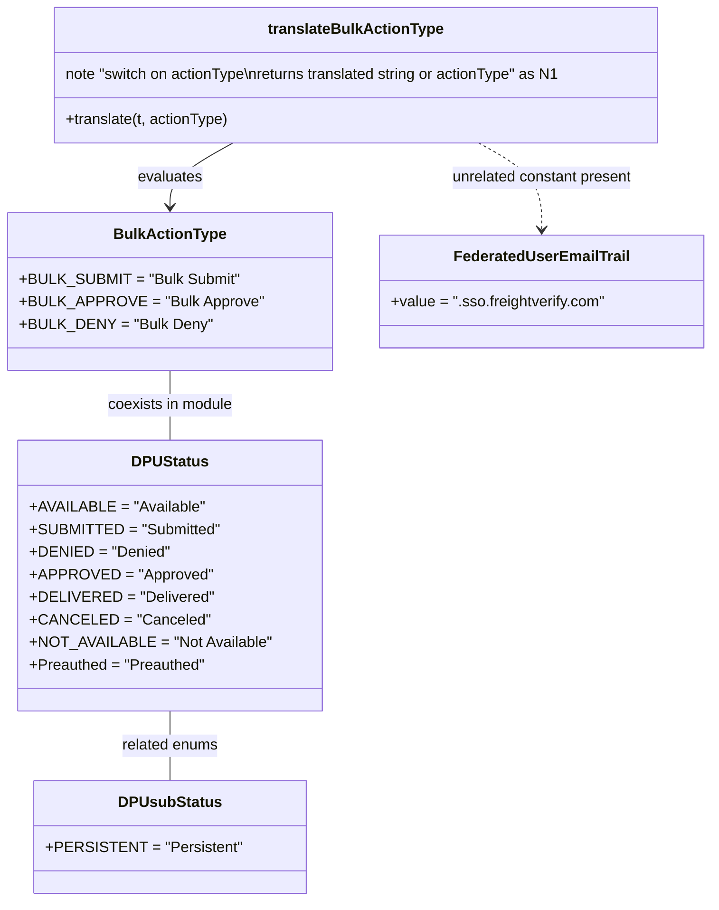

# Diagram: web/portal/src/pages/driveaway/utils/enums.utils.js

> Auto-generated by Obscura crawlers

## Mermaid

### SVG

<svg id="container" width="732.0703125" xmlns="http://www.w3.org/2000/svg" class="classDiagram" height="958" viewBox="0 0 732.0703125 958" role="graphics-document document" aria-roledescription="class"><g><defs><marker id="container_class-aggregationStart" class="marker aggregation class" refX="18" refY="7" markerWidth="190" markerHeight="240" orient="auto"><path d="M 18,7 L9,13 L1,7 L9,1 Z"></path></marker></defs><defs><marker id="container_class-aggregationEnd" class="marker aggregation class" refX="1" refY="7" markerWidth="20" markerHeight="28" orient="auto"><path d="M 18,7 L9,13 L1,7 L9,1 Z"></path></marker></defs><defs><marker id="container_class-extensionStart" class="marker extension class" refX="18" refY="7" markerWidth="190" markerHeight="240" orient="auto"><path d="M 1,7 L18,13 V 1 Z"></path></marker></defs><defs><marker id="container_class-extensionEnd" class="marker extension class" refX="1" refY="7" markerWidth="20" markerHeight="28" orient="auto"><path d="M 1,1 V 13 L18,7 Z"></path></marker></defs><defs><marker id="container_class-compositionStart" class="marker composition class" refX="18" refY="7" markerWidth="190" markerHeight="240" orient="auto"><path d="M 18,7 L9,13 L1,7 L9,1 Z"></path></marker></defs><defs><marker id="container_class-compositionEnd" class="marker composition class" refX="1" refY="7" markerWidth="20" markerHeight="28" orient="auto"><path d="M 18,7 L9,13 L1,7 L9,1 Z"></path></marker></defs><defs><marker id="container_class-dependencyStart" class="marker dependency class" refX="6" refY="7" markerWidth="190" markerHeight="240" orient="auto"><path d="M 5,7 L9,13 L1,7 L9,1 Z"></path></marker></defs><defs><marker id="container_class-dependencyEnd" class="marker dependency class" refX="13" refY="7" markerWidth="20" markerHeight="28" orient="auto"><path d="M 18,7 L9,13 L14,7 L9,1 Z"></path></marker></defs><defs><marker id="container_class-lollipopStart" class="marker lollipop class" refX="13" refY="7" markerWidth="190" markerHeight="240" orient="auto"><circle stroke="black" fill="transparent" cx="7" cy="7" r="6"></circle></marker></defs><defs><marker id="container_class-lollipopEnd" class="marker lollipop class" refX="1" refY="7" markerWidth="190" markerHeight="240" orient="auto"><circle stroke="black" fill="transparent" cx="7" cy="7" r="6"></circle></marker></defs><g class="root"><g class="clusters"></g><g class="edgePaths"><path d="M235.776,152L224.941,158.167C214.106,164.333,192.436,176.667,181.601,188C170.766,199.333,170.766,209.667,170.766,214.833L170.766,220" id="id_translateBulkActionType_BulkActionType_1" class="edge-thickness-normal edge-pattern-solid relation" style=";;;" data-edge="true" data-et="edge" data-id="id_translateBulkActionType_BulkActionType_1" data-points="W3sieCI6MjM1Ljc3NjE3OTA0MjQzMTE4LCJ5IjoxNTJ9LHsieCI6MTcwLjc2NTYyNSwieSI6MTg5fSx7IngiOjE3MC43NjU2MjUsInkiOjIyNn1d" marker-end="url(#container_class-dependencyEnd)"></path><path d="M488.79,152L499.625,158.167C510.46,164.333,532.131,176.667,542.966,192C553.801,207.333,553.801,225.667,553.801,234.833L553.801,244" id="id_translateBulkActionType_FederatedUserEmailTrail_2" class="edge-thickness-normal edge-pattern-dashed relation" style=";;;" data-edge="true" data-et="edge" data-id="id_translateBulkActionType_FederatedUserEmailTrail_2" data-points="W3sieCI6NDg4Ljc5MDIyNzIwNzU2ODgsInkiOjE1Mn0seyJ4Ijo1NTMuODAwNzgxMjUsInkiOjE4OX0seyJ4Ijo1NTMuODAwNzgxMjUsInkiOjI1MH1d" marker-end="url(#container_class-dependencyEnd)"></path><path d="M170.766,394L170.766,400.167C170.766,406.333,170.766,418.667,170.766,431C170.766,443.333,170.766,455.667,170.766,461.833L170.766,468" id="id_BulkActionType_DPUStatus_3" class="edge-thickness-normal edge-pattern-solid relation" style=";;;" data-edge="true" data-et="edge" data-id="id_BulkActionType_DPUStatus_3" data-points="W3sieCI6MTcwLjc2NTYyNSwieSI6Mzk0fSx7IngiOjE3MC43NjU2MjUsInkiOjQzMX0seyJ4IjoxNzAuNzY1NjI1LCJ5Ijo0Njh9XQ=="></path><path d="M170.766,756L170.766,762.167C170.766,768.333,170.766,780.667,170.766,793C170.766,805.333,170.766,817.667,170.766,823.833L170.766,830" id="id_DPUStatus_DPUsubStatus_4" class="edge-thickness-normal edge-pattern-solid relation" style=";;;" data-edge="true" data-et="edge" data-id="id_DPUStatus_DPUsubStatus_4" data-points="W3sieCI6MTcwLjc2NTYyNSwieSI6NzU2fSx7IngiOjE3MC43NjU2MjUsInkiOjc5M30seyJ4IjoxNzAuNzY1NjI1LCJ5Ijo4MzB9XQ=="></path></g><g class="edgeLabels"><g class="edgeLabel" transform="translate(170.765625, 189)"><g class="label" data-id="id_translateBulkActionType_BulkActionType_1" transform="translate(-34.625, -12)"><foreignObject width="69.25" height="24">

evaluates

</foreignObject></g></g><g class="edgeLabel" transform="translate(553.80078125, 189)"><g class="label" data-id="id_translateBulkActionType_FederatedUserEmailTrail_2" transform="translate(-98.515625, -12)"><foreignObject width="197.03125" height="24">

unrelated constant present

</foreignObject></g></g><g class="edgeLabel" transform="translate(170.765625, 431)"><g class="label" data-id="id_BulkActionType_DPUStatus_3" transform="translate(-67.9375, -12)"><foreignObject width="135.875" height="24">

coexists in module

</foreignObject></g></g><g class="edgeLabel" transform="translate(170.765625, 793)"><g class="label" data-id="id_DPUStatus_DPUsubStatus_4" transform="translate(-52.1953125, -12)"><foreignObject width="104.390625" height="24">

related enums

</foreignObject></g></g></g><g class="nodes"><g class="node default" id="classId-BulkActionType-0" transform="translate(170.765625, 310)"><g class="basic label-container"><path d="M-162.765625 -84 L162.765625 -84 L162.765625 84 L-162.765625 84" stroke="none" stroke-width="0" fill="#ECECFF" style=""></path><path d="M-162.765625 -84 C-52.92761557545859 -84, 56.91039384908282 -84, 162.765625 -84 M-162.765625 -84 C-65.66928571725326 -84, 31.42705356549348 -84, 162.765625 -84 M162.765625 -84 C162.765625 -44.80418169986786, 162.765625 -5.6083633997357225, 162.765625 84 M162.765625 -84 C162.765625 -21.432449300827187, 162.765625 41.135101398345626, 162.765625 84 M162.765625 84 C77.98776441286498 84, -6.790096174270047 84, -162.765625 84 M162.765625 84 C40.16247171197617 84, -82.44068157604767 84, -162.765625 84 M-162.765625 84 C-162.765625 37.82619899226807, -162.765625 -8.347602015463863, -162.765625 -84 M-162.765625 84 C-162.765625 46.16661548561106, -162.765625 8.333230971222122, -162.765625 -84" stroke="#9370DB" stroke-width="1.3" fill="none" stroke-dasharray="0 0" style=""></path></g><g class="annotation-group text" transform="translate(0, -60)"></g><g class="label-group text" transform="translate(-56.828125, -60)"><g class="label" style="font-weight: bolder" transform="translate(0,-12)"><foreignObject width="113.65625" height="24">

BulkActionType

</foreignObject></g></g><g class="members-group text" transform="translate(-150.765625, -12)"><g class="label" style="" transform="translate(0,-12)"><foreignObject width="224.890625" height="24">

+BULK_SUBMIT = "Bulk Submit"

</foreignObject></g><g class="label" style="" transform="translate(0,12)"><foreignObject width="244.703125" height="24">

+BULK_APPROVE = "Bulk Approve"

</foreignObject></g><g class="label" style="" transform="translate(0,36)"><foreignObject width="194.1875" height="24">

+BULK_DENY = "Bulk Deny"

</foreignObject></g></g><g class="methods-group text" transform="translate(-150.765625, 84)"></g><g class="divider" style=""><path d="M-162.765625 -36 C-67.31534063379111 -36, 28.13494373241778 -36, 162.765625 -36 M-162.765625 -36 C-53.3716627641584 -36, 56.0222994716832 -36, 162.765625 -36" stroke="#9370DB" stroke-width="1.3" fill="none" stroke-dasharray="0 0" style=""></path></g><g class="divider" style=""><path d="M-162.765625 60 C-66.72618366033716 60, 29.313257679325687 60, 162.765625 60 M-162.765625 60 C-92.73433259256728 60, -22.70304018513457 60, 162.765625 60" stroke="#9370DB" stroke-width="1.3" fill="none" stroke-dasharray="0 0" style=""></path></g></g><g class="node default" id="classId-translateBulkActionType-1" transform="translate(362.283203125, 80)"><g class="basic label-container"><path d="M-327.35546875 -72 L327.35546875 -72 L327.35546875 72 L-327.35546875 72" stroke="none" stroke-width="0" fill="#ECECFF" style=""></path><path d="M-327.35546875 -72 C-122.3976490418705 -72, 82.56017066625901 -72, 327.35546875 -72 M-327.35546875 -72 C-82.65846417872356 -72, 162.03854039255287 -72, 327.35546875 -72 M327.35546875 -72 C327.35546875 -32.99175025358558, 327.35546875 6.016499492828842, 327.35546875 72 M327.35546875 -72 C327.35546875 -19.16485390938314, 327.35546875 33.67029218123372, 327.35546875 72 M327.35546875 72 C118.5221631778804 72, -90.3111423942392 72, -327.35546875 72 M327.35546875 72 C88.9469776754608 72, -149.4615133990784 72, -327.35546875 72 M-327.35546875 72 C-327.35546875 22.456453574200133, -327.35546875 -27.087092851599735, -327.35546875 -72 M-327.35546875 72 C-327.35546875 27.3935393258729, -327.35546875 -17.2129213482542, -327.35546875 -72" stroke="#9370DB" stroke-width="1.3" fill="none" stroke-dasharray="0 0" style=""></path></g><g class="annotation-group text" transform="translate(0, -48)"></g><g class="label-group text" transform="translate(-89.7890625, -48)"><g class="label" style="font-weight: bolder" transform="translate(0,-12)"><foreignObject width="179.578125" height="24">

translateBulkActionType

</foreignObject></g></g><g class="members-group text" transform="translate(-315.35546875, 0)"><g class="label" style="" transform="translate(0,-12)"><foreignObject width="540.921875" height="24">

note "switch on actionType\nreturns translated string or actionType" as N1

</foreignObject></g></g><g class="methods-group text" transform="translate(-315.35546875, 48)"><g class="label" style="" transform="translate(0,-12)"><foreignObject width="175.796875" height="24">

+translate(t, actionType)

</foreignObject></g></g><g class="divider" style=""><path d="M-327.35546875 -24 C-177.83798271867005 -24, -28.320496687340096 -24, 327.35546875 -24 M-327.35546875 -24 C-125.75234772938265 -24, 75.8507732912347 -24, 327.35546875 -24" stroke="#9370DB" stroke-width="1.3" fill="none" stroke-dasharray="0 0" style=""></path></g><g class="divider" style=""><path d="M-327.35546875 24 C-127.7395648527368 24, 71.87633904452639 24, 327.35546875 24 M-327.35546875 24 C-105.48358934392601 24, 116.38829006214797 24, 327.35546875 24" stroke="#9370DB" stroke-width="1.3" fill="none" stroke-dasharray="0 0" style=""></path></g></g><g class="node default" id="classId-DPUStatus-2" transform="translate(170.765625, 612)"><g class="basic label-container"><path d="M-154.14453125 -144 L154.14453125 -144 L154.14453125 144 L-154.14453125 144" stroke="none" stroke-width="0" fill="#ECECFF" style=""></path><path d="M-154.14453125 -144 C-33.34945051352871 -144, 87.44563022294258 -144, 154.14453125 -144 M-154.14453125 -144 C-36.573280736011654 -144, 80.99796977797669 -144, 154.14453125 -144 M154.14453125 -144 C154.14453125 -46.37480315913048, 154.14453125 51.25039368173904, 154.14453125 144 M154.14453125 -144 C154.14453125 -84.68160806738177, 154.14453125 -25.363216134763547, 154.14453125 144 M154.14453125 144 C73.55755043313255 144, -7.029430383734905 144, -154.14453125 144 M154.14453125 144 C42.92482621441158 144, -68.29487882117684 144, -154.14453125 144 M-154.14453125 144 C-154.14453125 68.97094422234265, -154.14453125 -6.058111555314696, -154.14453125 -144 M-154.14453125 144 C-154.14453125 81.76842950962929, -154.14453125 19.53685901925857, -154.14453125 -144" stroke="#9370DB" stroke-width="1.3" fill="none" stroke-dasharray="0 0" style=""></path></g><g class="annotation-group text" transform="translate(0, -120)"></g><g class="label-group text" transform="translate(-38.6484375, -120)"><g class="label" style="font-weight: bolder" transform="translate(0,-12)"><foreignObject width="77.296875" height="24">

DPUStatus

</foreignObject></g></g><g class="members-group text" transform="translate(-142.14453125, -72)"><g class="label" style="" transform="translate(0,-12)"><foreignObject width="177.484375" height="24">

+AVAILABLE = "Available"

</foreignObject></g><g class="label" style="" transform="translate(0,12)"><foreignObject width="193.578125" height="24">

+SUBMITTED = "Submitted"

</foreignObject></g><g class="label" style="" transform="translate(0,36)"><foreignObject width="141.8125" height="24">

+DENIED = "Denied"

</foreignObject></g><g class="label" style="" transform="translate(0,60)"><foreignObject width="181.890625" height="24">

+APPROVED = "Approved"

</foreignObject></g><g class="label" style="" transform="translate(0,84)"><foreignObject width="183.53125" height="24">

+DELIVERED = "Delivered"

</foreignObject></g><g class="label" style="" transform="translate(0,108)"><foreignObject width="176.46875" height="24">

+CANCELED = "Canceled"

</foreignObject></g><g class="label" style="" transform="translate(0,132)"><foreignObject width="245.640625" height="24">

+NOT_AVAILABLE = "Not Available"

</foreignObject></g><g class="label" style="" transform="translate(0,156)"><foreignObject width="186.609375" height="24">

+Preauthed = "Preauthed"

</foreignObject></g></g><g class="methods-group text" transform="translate(-142.14453125, 144)"></g><g class="divider" style=""><path d="M-154.14453125 -96 C-60.09193316275197 -96, 33.96066492449606 -96, 154.14453125 -96 M-154.14453125 -96 C-62.203811186898406 -96, 29.736908876203188 -96, 154.14453125 -96" stroke="#9370DB" stroke-width="1.3" fill="none" stroke-dasharray="0 0" style=""></path></g><g class="divider" style=""><path d="M-154.14453125 120 C-74.47338446126066 120, 5.197762327478671 120, 154.14453125 120 M-154.14453125 120 C-80.88295743136082 120, -7.621383612721644 120, 154.14453125 120" stroke="#9370DB" stroke-width="1.3" fill="none" stroke-dasharray="0 0" style=""></path></g></g><g class="node default" id="classId-DPUsubStatus-3" transform="translate(170.765625, 890)"><g class="basic label-container"><path d="M-135.234375 -60 L135.234375 -60 L135.234375 60 L-135.234375 60" stroke="none" stroke-width="0" fill="#ECECFF" style=""></path><path d="M-135.234375 -60 C-46.31249316692069 -60, 42.60938866615862 -60, 135.234375 -60 M-135.234375 -60 C-38.78554212336603 -60, 57.663290753267944 -60, 135.234375 -60 M135.234375 -60 C135.234375 -24.148937263046015, 135.234375 11.70212547390797, 135.234375 60 M135.234375 -60 C135.234375 -19.550597703699857, 135.234375 20.898804592600285, 135.234375 60 M135.234375 60 C61.17687466504448 60, -12.88062566991104 60, -135.234375 60 M135.234375 60 C41.68653265621141 60, -51.861309687577176 60, -135.234375 60 M-135.234375 60 C-135.234375 21.73492661376244, -135.234375 -16.53014677247512, -135.234375 -60 M-135.234375 60 C-135.234375 34.066014997022194, -135.234375 8.13202999404438, -135.234375 -60" stroke="#9370DB" stroke-width="1.3" fill="none" stroke-dasharray="0 0" style=""></path></g><g class="annotation-group text" transform="translate(0, -36)"></g><g class="label-group text" transform="translate(-51.875, -36)"><g class="label" style="font-weight: bolder" transform="translate(0,-12)"><foreignObject width="103.75" height="24">

DPUsubStatus

</foreignObject></g></g><g class="members-group text" transform="translate(-123.234375, 12)"><g class="label" style="" transform="translate(0,-12)"><foreignObject width="194.59375" height="24">

+PERSISTENT = "Persistent"

</foreignObject></g></g><g class="methods-group text" transform="translate(-123.234375, 60)"></g><g class="divider" style=""><path d="M-135.234375 -12 C-41.04586258357759 -12, 53.142649832844825 -12, 135.234375 -12 M-135.234375 -12 C-72.09410747420216 -12, -8.953839948404308 -12, 135.234375 -12" stroke="#9370DB" stroke-width="1.3" fill="none" stroke-dasharray="0 0" style=""></path></g><g class="divider" style=""><path d="M-135.234375 36 C-72.92227520440366 36, -10.610175408807322 36, 135.234375 36 M-135.234375 36 C-54.91327267214808 36, 25.407829655703836 36, 135.234375 36" stroke="#9370DB" stroke-width="1.3" fill="none" stroke-dasharray="0 0" style=""></path></g></g><g class="node default" id="classId-FederatedUserEmailTrail-4" transform="translate(553.80078125, 310)"><g class="basic label-container"><path d="M-170.26953125 -60 L170.26953125 -60 L170.26953125 60 L-170.26953125 60" stroke="none" stroke-width="0" fill="#ECECFF" style=""></path><path d="M-170.26953125 -60 C-69.27628844803361 -60, 31.716954353932778 -60, 170.26953125 -60 M-170.26953125 -60 C-70.721550006362 -60, 28.82643123727601 -60, 170.26953125 -60 M170.26953125 -60 C170.26953125 -22.742391413832422, 170.26953125 14.515217172335156, 170.26953125 60 M170.26953125 -60 C170.26953125 -25.812716162241514, 170.26953125 8.374567675516971, 170.26953125 60 M170.26953125 60 C52.997474003991115 60, -64.27458324201777 60, -170.26953125 60 M170.26953125 60 C40.26711450143901 60, -89.73530224712198 60, -170.26953125 60 M-170.26953125 60 C-170.26953125 30.353545579505685, -170.26953125 0.7070911590113695, -170.26953125 -60 M-170.26953125 60 C-170.26953125 35.3385308034726, -170.26953125 10.677061606945202, -170.26953125 -60" stroke="#9370DB" stroke-width="1.3" fill="none" stroke-dasharray="0 0" style=""></path></g><g class="annotation-group text" transform="translate(0, -36)"></g><g class="label-group text" transform="translate(-89.3046875, -36)"><g class="label" style="font-weight: bolder" transform="translate(0,-12)"><foreignObject width="178.609375" height="24">

FederatedUserEmailTrail

</foreignObject></g></g><g class="members-group text" transform="translate(-158.26953125, 12)"><g class="label" style="" transform="translate(0,-12)"><foreignObject width="227.234375" height="24">

+value = ".sso.freightverify.com"

</foreignObject></g></g><g class="methods-group text" transform="translate(-158.26953125, 60)"></g><g class="divider" style=""><path d="M-170.26953125 -12 C-82.36763746049205 -12, 5.5342563290159035 -12, 170.26953125 -12 M-170.26953125 -12 C-41.73529868422838 -12, 86.79893388154323 -12, 170.26953125 -12" stroke="#9370DB" stroke-width="1.3" fill="none" stroke-dasharray="0 0" style=""></path></g><g class="divider" style=""><path d="M-170.26953125 36 C-52.91809889424036 36, 64.43333346151928 36, 170.26953125 36 M-170.26953125 36 C-46.9673251071912 36, 76.3348810356176 36, 170.26953125 36" stroke="#9370DB" stroke-width="1.3" fill="none" stroke-dasharray="0 0" style=""></path></g></g></g></g></g></svg>
