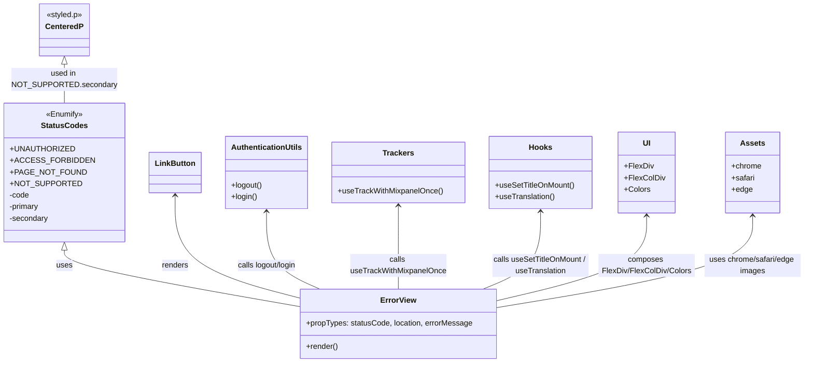

# Diagram: web/portal/src/pages/error/Error.page.js


> Auto-generated by Obscura crawlers

## Diagram 1



### SVG

<svg id="container" width="1624.71484375" xmlns="http://www.w3.org/2000/svg" class="classDiagram" height="752" viewBox="0 0 1624.71484375 752" role="graphics-document document" aria-roledescription="class"><style>#container{font-family:"trebuchet ms",verdana,arial,sans-serif;font-size:16px;fill:#333;}@keyframes edge-animation-frame{from{stroke-dashoffset:0;}}@keyframes dash{to{stroke-dashoffset:0;}}#container .edge-animation-slow{stroke-dasharray:9,5!important;stroke-dashoffset:900;animation:dash 50s linear infinite;stroke-linecap:round;}#container .edge-animation-fast{stroke-dasharray:9,5!important;stroke-dashoffset:900;animation:dash 20s linear infinite;stroke-linecap:round;}#container .error-icon{fill:#552222;}#container .error-text{fill:#552222;stroke:#552222;}#container .edge-thickness-normal{stroke-width:1px;}#container .edge-thickness-thick{stroke-width:3.5px;}#container .edge-pattern-solid{stroke-dasharray:0;}#container .edge-thickness-invisible{stroke-width:0;fill:none;}#container .edge-pattern-dashed{stroke-dasharray:3;}#container .edge-pattern-dotted{stroke-dasharray:2;}#container .marker{fill:#333333;stroke:#333333;}#container .marker.cross{stroke:#333333;}#container svg{font-family:"trebuchet ms",verdana,arial,sans-serif;font-size:16px;}#container p{margin:0;}#container g.classGroup text{fill:#9370DB;stroke:none;font-family:"trebuchet ms",verdana,arial,sans-serif;font-size:10px;}#container g.classGroup text .title{font-weight:bolder;}#container .nodeLabel,#container .edgeLabel{color:#131300;}#container .edgeLabel .label rect{fill:#ECECFF;}#container .label text{fill:#131300;}#container .labelBkg{background:#ECECFF;}#container .edgeLabel .label span{background:#ECECFF;}#container .classTitle{font-weight:bolder;}#container .node rect,#container .node circle,#container .node ellipse,#container .node polygon,#container .node path{fill:#ECECFF;stroke:#9370DB;stroke-width:1px;}#container .divider{stroke:#9370DB;stroke-width:1;}#container g.clickable{cursor:pointer;}#container g.classGroup rect{fill:#ECECFF;stroke:#9370DB;}#container g.classGroup line{stroke:#9370DB;stroke-width:1;}#container .classLabel .box{stroke:none;stroke-width:0;fill:#ECECFF;opacity:0.5;}#container .classLabel .label{fill:#9370DB;font-size:10px;}#container .relation{stroke:#333333;stroke-width:1;fill:none;}#container .dashed-line{stroke-dasharray:3;}#container .dotted-line{stroke-dasharray:1 2;}#container #compositionStart,#container .composition{fill:#333333!important;stroke:#333333!important;stroke-width:1;}#container #compositionEnd,#container .composition{fill:#333333!important;stroke:#333333!important;stroke-width:1;}#container #dependencyStart,#container .dependency{fill:#333333!important;stroke:#333333!important;stroke-width:1;}#container #dependencyStart,#container .dependency{fill:#333333!important;stroke:#333333!important;stroke-width:1;}#container #extensionStart,#container .extension{fill:transparent!important;stroke:#333333!important;stroke-width:1;}#container #extensionEnd,#container .extension{fill:transparent!important;stroke:#333333!important;stroke-width:1;}#container #aggregationStart,#container .aggregation{fill:transparent!important;stroke:#333333!important;stroke-width:1;}#container #aggregationEnd,#container .aggregation{fill:transparent!important;stroke:#333333!important;stroke-width:1;}#container #lollipopStart,#container .lollipop{fill:#ECECFF!important;stroke:#333333!important;stroke-width:1;}#container #lollipopEnd,#container .lollipop{fill:#ECECFF!important;stroke:#333333!important;stroke-width:1;}#container .edgeTerminals{font-size:11px;line-height:initial;}#container .classTitleText{text-anchor:middle;font-size:18px;fill:#333;}#container .label-icon{display:inline-block;height:1em;overflow:visible;vertical-align:-0.125em;}#container .node .label-icon path{fill:currentColor;stroke:revert;stroke-width:revert;}#container :root{--mermaid-font-family:"trebuchet ms",verdana,arial,sans-serif;}</style><g><defs><marker id="container_class-aggregationStart" class="marker aggregation class" refX="18" refY="7" markerWidth="190" markerHeight="240" orient="auto"><path d="M 18,7 L9,13 L1,7 L9,1 Z"></path></marker></defs><defs><marker id="container_class-aggregationEnd" class="marker aggregation class" refX="1" refY="7" markerWidth="20" markerHeight="28" orient="auto"><path d="M 18,7 L9,13 L1,7 L9,1 Z"></path></marker></defs><defs><marker id="container_class-extensionStart" class="marker extension class" refX="18" refY="7" markerWidth="190" markerHeight="240" orient="auto"><path d="M 1,7 L18,13 V 1 Z"></path></marker></defs><defs><marker id="container_class-extensionEnd" class="marker extension class" refX="1" refY="7" markerWidth="20" markerHeight="28" orient="auto"><path d="M 1,1 V 13 L18,7 Z"></path></marker></defs><defs><marker id="container_class-compositionStart" class="marker composition class" refX="18" refY="7" markerWidth="190" markerHeight="240" orient="auto"><path d="M 18,7 L9,13 L1,7 L9,1 Z"></path></marker></defs><defs><marker id="container_class-compositionEnd" class="marker composition class" refX="1" refY="7" markerWidth="20" markerHeight="28" orient="auto"><path d="M 18,7 L9,13 L1,7 L9,1 Z"></path></marker></defs><defs><marker id="container_class-dependencyStart" class="marker dependency class" refX="6" refY="7" markerWidth="190" markerHeight="240" orient="auto"><path d="M 5,7 L9,13 L1,7 L9,1 Z"></path></marker></defs><defs><marker id="container_class-dependencyEnd" class="marker dependency class" refX="13" refY="7" markerWidth="20" markerHeight="28" orient="auto"><path d="M 18,7 L9,13 L14,7 L9,1 Z"></path></marker></defs><defs><marker id="container_class-lollipopStart" class="marker lollipop class" refX="13" refY="7" markerWidth="190" markerHeight="240" orient="auto"><circle stroke="black" fill="transparent" cx="7" cy="7" r="6"></circle></marker></defs><defs><marker id="container_class-lollipopEnd" class="marker lollipop class" refX="1" refY="7" markerWidth="190" markerHeight="240" orient="auto"><circle stroke="black" fill="transparent" cx="7" cy="7" r="6"></circle></marker></defs><g class="root"><g class="clusters"></g><g class="edgePaths"><path d="M118.246,519.25L118.246,524.542C118.246,529.833,118.246,540.417,195.666,559.765C273.086,579.114,427.926,607.228,505.346,621.285L582.766,635.342" id="id_StatusCodes_ErrorView_1" class="edge-thickness-normal edge-pattern-solid relation" style=";;;" data-edge="true" data-et="edge" data-id="id_StatusCodes_ErrorView_1" data-points="W3sieCI6MTE4LjI0NjA5Mzc1LCJ5Ijo1MDJ9LHsieCI6MTE4LjI0NjA5Mzc1LCJ5Ijo1NTF9LHsieCI6NTgyLjc2NTYyNSwieSI6NjM1LjM0MjI1MjcyODU3Mjl9XQ==" marker-start="url(#container_class-extensionStart)"></path><path d="M118.246,133.25L118.246,138.542C118.246,143.833,118.246,154.417,118.246,167.875C118.246,181.333,118.246,197.667,118.246,205.833L118.246,214" id="id_CenteredP_StatusCodes_2" class="edge-thickness-normal edge-pattern-solid relation" style=";;;" data-edge="true" data-et="edge" data-id="id_CenteredP_StatusCodes_2" data-points="W3sieCI6MTE4LjI0NjA5Mzc1LCJ5IjoxMTZ9LHsieCI6MTE4LjI0NjA5Mzc1LCJ5IjoxNjV9LHsieCI6MTE4LjI0NjA5Mzc1LCJ5IjoyMTR9XQ==" marker-start="url(#container_class-extensionStart)"></path><path d="M330.719,406L330.719,430.167C330.719,454.333,330.719,502.667,372.727,538.031C414.734,573.395,498.75,595.789,540.758,606.987L582.766,618.184" id="id_LinkButton_ErrorView_3" class="edge-thickness-normal edge-pattern-solid relation" style=";;;" data-edge="true" data-et="edge" data-id="id_LinkButton_ErrorView_3" data-points="W3sieCI6MzMwLjcxODc1LCJ5Ijo0MDB9LHsieCI6MzMwLjcxODc1LCJ5Ijo1NTF9LHsieCI6NTgyLjc2NTYyNSwieSI6NjE4LjE4NDE1OTU3NDU1OTd9XQ==" marker-start="url(#container_class-dependencyStart)"></path><path d="M515.883,439L515.883,457.667C515.883,476.333,515.883,513.667,534.023,540.5C552.164,567.333,588.445,583.667,606.586,591.833L624.727,600" id="id_AuthenticationUtils_ErrorView_4" class="edge-thickness-normal edge-pattern-solid relation" style=";;;" data-edge="true" data-et="edge" data-id="id_AuthenticationUtils_ErrorView_4" data-points="W3sieCI6NTE1Ljg4MjgxMjUsInkiOjQzM30seyJ4Ijo1MTUuODgyODEyNSwieSI6NTUxfSx7IngiOjYyNC43MjY1MzAyMTY5NDIxLCJ5Ijo2MDB9XQ==" marker-start="url(#container_class-dependencyStart)"></path><path d="M784.66,427L784.66,447.667C784.66,468.333,784.66,509.667,784.66,538.5C784.66,567.333,784.66,583.667,784.66,591.833L784.66,600" id="id_Trackers_ErrorView_5" class="edge-thickness-normal edge-pattern-solid relation" style=";;;" data-edge="true" data-et="edge" data-id="id_Trackers_ErrorView_5" data-points="W3sieCI6Nzg0LjY2MDE1NjI1LCJ5Ijo0MjF9LHsieCI6Nzg0LjY2MDE1NjI1LCJ5Ijo1NTF9LHsieCI6Nzg0LjY2MDE1NjI1LCJ5Ijo2MDB9XQ==" marker-start="url(#container_class-dependencyStart)"></path><path d="M1076.715,439L1076.715,457.667C1076.715,476.333,1076.715,513.667,1057.003,540.5C1037.291,567.333,997.868,583.667,978.156,591.833L958.445,600" id="id_Hooks_ErrorView_6" class="edge-thickness-normal edge-pattern-solid relation" style=";;;" data-edge="true" data-et="edge" data-id="id_Hooks_ErrorView_6" data-points="W3sieCI6MTA3Ni43MTQ4NDM3NSwieSI6NDMzfSx7IngiOjEwNzYuNzE0ODQzNzUsInkiOjU1MX0seyJ4Ijo5NTguNDQ0NzYzNjg4MDE2NiwieSI6NjAwfV0=" marker-start="url(#container_class-dependencyStart)"></path><path d="M1296.715,448L1296.715,465.167C1296.715,482.333,1296.715,516.667,1245.021,546.049C1193.328,575.431,1089.941,599.861,1038.248,612.076L986.555,624.292" id="id_UI_ErrorView_7" class="edge-thickness-normal edge-pattern-solid relation" style=";;;" data-edge="true" data-et="edge" data-id="id_UI_ErrorView_7" data-points="W3sieCI6MTI5Ni43MTQ4NDM3NSwieSI6NDQyfSx7IngiOjEyOTYuNzE0ODQzNzUsInkiOjU1MX0seyJ4Ijo5ODYuNTU0Njg3NSwieSI6NjI0LjI5MTczOTc3Mzg4ODl9XQ==" marker-start="url(#container_class-dependencyStart)"></path><path d="M1516.715,448L1516.715,465.167C1516.715,482.333,1516.715,516.667,1428.355,548.438C1339.995,580.21,1163.275,609.419,1074.915,624.024L986.555,638.629" id="id_Assets_ErrorView_8" class="edge-thickness-normal edge-pattern-solid relation" style=";;;" data-edge="true" data-et="edge" data-id="id_Assets_ErrorView_8" data-points="W3sieCI6MTUxNi43MTQ4NDM3NSwieSI6NDQyfSx7IngiOjE1MTYuNzE0ODQzNzUsInkiOjU1MX0seyJ4Ijo5ODYuNTU0Njg3NSwieSI6NjM4LjYyOTIxNjc4MDY3OTR9XQ==" marker-start="url(#container_class-dependencyStart)"></path></g><g class="edgeLabels"><g class="edgeLabel" transform="translate(118.24609375, 551)"><g class="label" data-id="id_StatusCodes_ErrorView_1" transform="translate(-16.4921875, -12)"><foreignObject width="32.984375" height="24"><div xmlns="http://www.w3.org/1999/xhtml" class="labelBkg" style="display: table-cell; white-space: nowrap; line-height: 1.5; max-width: 200px; text-align: center;"><span class="edgeLabel"><p>uses</p></span></div></foreignObject></g></g><g class="edgeLabel" transform="translate(118.24609375, 165)"><g class="label" data-id="id_CenteredP_StatusCodes_2" transform="translate(-100.2578125, -24)"><foreignObject width="200.515625" height="48"><div xmlns="http://www.w3.org/1999/xhtml" class="labelBkg" style="display: table; white-space: break-spaces; line-height: 1.5; max-width: 200px; text-align: center; width: 200px;"><span class="edgeLabel"><p>used in NOT_SUPPORTED.secondary</p></span></div></foreignObject></g></g><g class="edgeLabel" transform="translate(330.71875, 551)"><g class="label" data-id="id_LinkButton_ErrorView_3" transform="translate(-27.75, -12)"><foreignObject width="55.5" height="24"><div xmlns="http://www.w3.org/1999/xhtml" class="labelBkg" style="display: table-cell; white-space: nowrap; line-height: 1.5; max-width: 200px; text-align: center;"><span class="edgeLabel"><p>renders</p></span></div></foreignObject></g></g><g class="edgeLabel" transform="translate(515.8828125, 551)"><g class="label" data-id="id_AuthenticationUtils_ErrorView_4" transform="translate(-64.03125, -12)"><foreignObject width="128.0625" height="24"><div xmlns="http://www.w3.org/1999/xhtml" class="labelBkg" style="display: table-cell; white-space: nowrap; line-height: 1.5; max-width: 200px; text-align: center;"><span class="edgeLabel"><p>calls logout/login</p></span></div></foreignObject></g></g><g class="edgeLabel" transform="translate(784.66015625, 551)"><g class="label" data-id="id_Trackers_ErrorView_5" transform="translate(-100, -24)"><foreignObject width="200" height="48"><div xmlns="http://www.w3.org/1999/xhtml" class="labelBkg" style="display: table; white-space: break-spaces; line-height: 1.5; max-width: 200px; text-align: center; width: 200px;"><span class="edgeLabel"><p>calls useTrackWithMixpanelOnce</p></span></div></foreignObject></g></g><g class="edgeLabel" transform="translate(1076.71484375, 551)"><g class="label" data-id="id_Hooks_ErrorView_6" transform="translate(-100, -24)"><foreignObject width="200" height="48"><div xmlns="http://www.w3.org/1999/xhtml" class="labelBkg" style="display: table; white-space: break-spaces; line-height: 1.5; max-width: 200px; text-align: center; width: 200px;"><span class="edgeLabel"><p>calls useSetTitleOnMount / useTranslation</p></span></div></foreignObject></g></g><g class="edgeLabel" transform="translate(1296.71484375, 551)"><g class="label" data-id="id_UI_ErrorView_7" transform="translate(-100, -24)"><foreignObject width="200" height="48"><div xmlns="http://www.w3.org/1999/xhtml" class="labelBkg" style="display: table; white-space: break-spaces; line-height: 1.5; max-width: 200px; text-align: center; width: 200px;"><span class="edgeLabel"><p>composes FlexDiv/FlexColDiv/Colors</p></span></div></foreignObject></g></g><g class="edgeLabel" transform="translate(1516.71484375, 551)"><g class="label" data-id="id_Assets_ErrorView_8" transform="translate(-100, -24)"><foreignObject width="200" height="48"><div xmlns="http://www.w3.org/1999/xhtml" class="labelBkg" style="display: table; white-space: break-spaces; line-height: 1.5; max-width: 200px; text-align: center; width: 200px;"><span class="edgeLabel"><p>uses chrome/safari/edge images</p></span></div></foreignObject></g></g></g><g class="nodes"><g class="node default" id="classId-StatusCodes-0" transform="translate(118.24609375, 358)"><g class="basic label-container"><path d="M-110.24609375 -144 L110.24609375 -144 L110.24609375 144 L-110.24609375 144" stroke="none" stroke-width="0" fill="#ECECFF" style=""></path><path d="M-110.24609375 -144 C-53.77350281747809 -144, 2.6990881150438213 -144, 110.24609375 -144 M-110.24609375 -144 C-41.957670685375575 -144, 26.33075237924885 -144, 110.24609375 -144 M110.24609375 -144 C110.24609375 -82.20394343619225, 110.24609375 -20.40788687238448, 110.24609375 144 M110.24609375 -144 C110.24609375 -67.95454414543224, 110.24609375 8.090911709135526, 110.24609375 144 M110.24609375 144 C35.96037141980919 144, -38.325350910381616 144, -110.24609375 144 M110.24609375 144 C38.724745454320924 144, -32.79660284135815 144, -110.24609375 144 M-110.24609375 144 C-110.24609375 30.580230432727348, -110.24609375 -82.8395391345453, -110.24609375 -144 M-110.24609375 144 C-110.24609375 76.99029753183497, -110.24609375 9.980595063669938, -110.24609375 -144" stroke="#9370DB" stroke-width="1.3" fill="none" stroke-dasharray="0 0" style=""></path></g><g class="annotation-group text" transform="translate(-38.40625, -120)"><g class="label" style="" transform="translate(0,-12)"><foreignObject width="76.8125" height="24"><div xmlns="http://www.w3.org/1999/xhtml" style="display: table-cell; white-space: nowrap; line-height: 1.5; max-width: 127px; text-align: center;"><span class="nodeLabel markdown-node-label" style=""><p>«Enumify»</p></span></div></foreignObject></g></g><g class="label-group text" transform="translate(-45.6796875, -96)"><g class="label" style="font-weight: bolder" transform="translate(0,-12)"><foreignObject width="91.359375" height="24"><div xmlns="http://www.w3.org/1999/xhtml" style="display: table-cell; white-space: nowrap; line-height: 1.5; max-width: 139px; text-align: center;"><span class="nodeLabel markdown-node-label" style=""><p>StatusCodes</p></span></div></foreignObject></g></g><g class="members-group text" transform="translate(-98.24609375, -48)"><g class="label" style="" transform="translate(0,-12)"><foreignObject width="120.953125" height="24"><div xmlns="http://www.w3.org/1999/xhtml" style="display: table-cell; white-space: nowrap; line-height: 1.5; max-width: 178px; text-align: center;"><span class="nodeLabel markdown-node-label" style=""><p>+UNAUTHORIZED</p></span></div></foreignObject></g><g class="label" style="" transform="translate(0,12)"><foreignObject width="150.8125" height="24"><div xmlns="http://www.w3.org/1999/xhtml" style="display: table-cell; white-space: nowrap; line-height: 1.5; max-width: 208px; text-align: center;"><span class="nodeLabel markdown-node-label" style=""><p>+ACCESS_FORBIDDEN</p></span></div></foreignObject></g><g class="label" style="" transform="translate(0,36)"><foreignObject width="140.03125" height="24"><div xmlns="http://www.w3.org/1999/xhtml" style="display: table-cell; white-space: nowrap; line-height: 1.5; max-width: 197px; text-align: center;"><span class="nodeLabel markdown-node-label" style=""><p>+PAGE_NOT_FOUND</p></span></div></foreignObject></g><g class="label" style="" transform="translate(0,60)"><foreignObject width="130.375" height="24"><div xmlns="http://www.w3.org/1999/xhtml" style="display: table-cell; white-space: nowrap; line-height: 1.5; max-width: 188px; text-align: center;"><span class="nodeLabel markdown-node-label" style=""><p>+NOT_SUPPORTED</p></span></div></foreignObject></g><g class="label" style="" transform="translate(0,84)"><foreignObject width="41.421875" height="24"><div xmlns="http://www.w3.org/1999/xhtml" style="display: table-cell; white-space: nowrap; line-height: 1.5; max-width: 99px; text-align: center;"><span class="nodeLabel markdown-node-label" style=""><p>-code</p></span></div></foreignObject></g><g class="label" style="" transform="translate(0,108)"><foreignObject width="63.109375" height="24"><div xmlns="http://www.w3.org/1999/xhtml" style="display: table-cell; white-space: nowrap; line-height: 1.5; max-width: 121px; text-align: center;"><span class="nodeLabel markdown-node-label" style=""><p>-primary</p></span></div></foreignObject></g><g class="label" style="" transform="translate(0,132)"><foreignObject width="81.015625" height="24"><div xmlns="http://www.w3.org/1999/xhtml" style="display: table-cell; white-space: nowrap; line-height: 1.5; max-width: 138px; text-align: center;"><span class="nodeLabel markdown-node-label" style=""><p>-secondary</p></span></div></foreignObject></g></g><g class="methods-group text" transform="translate(-98.24609375, 144)"></g><g class="divider" style=""><path d="M-110.24609375 -72 C-56.48725050746488 -72, -2.728407264929757 -72, 110.24609375 -72 M-110.24609375 -72 C-36.80575035101448 -72, 36.63459304797104 -72, 110.24609375 -72" stroke="#9370DB" stroke-width="1.3" fill="none" stroke-dasharray="0 0" style=""></path></g><g class="divider" style=""><path d="M-110.24609375 120 C-22.15978654965788 120, 65.92652065068424 120, 110.24609375 120 M-110.24609375 120 C-39.7529063023151 120, 30.740281145369806 120, 110.24609375 120" stroke="#9370DB" stroke-width="1.3" fill="none" stroke-dasharray="0 0" style=""></path></g></g><g class="node default" id="classId-ErrorView-1" transform="translate(784.66015625, 672)"><g class="basic label-container"><path d="M-201.89453125 -72 L201.89453125 -72 L201.89453125 72 L-201.89453125 72" stroke="none" stroke-width="0" fill="#ECECFF" style=""></path><path d="M-201.89453125 -72 C-67.9895131100557 -72, 65.9155050298886 -72, 201.89453125 -72 M-201.89453125 -72 C-105.60627449331633 -72, -9.318017736632669 -72, 201.89453125 -72 M201.89453125 -72 C201.89453125 -38.99698255847066, 201.89453125 -5.993965116941325, 201.89453125 72 M201.89453125 -72 C201.89453125 -24.65981997889711, 201.89453125 22.680360042205777, 201.89453125 72 M201.89453125 72 C100.67889991604244 72, -0.5367314179151208 72, -201.89453125 72 M201.89453125 72 C115.36072619550153 72, 28.826921141003055 72, -201.89453125 72 M-201.89453125 72 C-201.89453125 40.32830848106347, -201.89453125 8.656616962126947, -201.89453125 -72 M-201.89453125 72 C-201.89453125 28.95986748756787, -201.89453125 -14.08026502486426, -201.89453125 -72" stroke="#9370DB" stroke-width="1.3" fill="none" stroke-dasharray="0 0" style=""></path></g><g class="annotation-group text" transform="translate(0, -48)"></g><g class="label-group text" transform="translate(-35.4140625, -48)"><g class="label" style="font-weight: bolder" transform="translate(0,-12)"><foreignObject width="70.828125" height="24"><div xmlns="http://www.w3.org/1999/xhtml" style="display: table-cell; white-space: nowrap; line-height: 1.5; max-width: 120px; text-align: center;"><span class="nodeLabel markdown-node-label" style=""><p>ErrorView</p></span></div></foreignObject></g></g><g class="members-group text" transform="translate(-189.89453125, 0)"><g class="label" style="" transform="translate(0,-12)"><foreignObject width="344.375" height="24"><div xmlns="http://www.w3.org/1999/xhtml" style="display: table-cell; white-space: nowrap; line-height: 1.5; max-width: 402px; text-align: center;"><span class="nodeLabel markdown-node-label" style=""><p>+propTypes: statusCode, location, errorMessage</p></span></div></foreignObject></g></g><g class="methods-group text" transform="translate(-189.89453125, 48)"><g class="label" style="" transform="translate(0,-12)"><foreignObject width="66.609375" height="24"><div xmlns="http://www.w3.org/1999/xhtml" style="display: table-cell; white-space: nowrap; line-height: 1.5; max-width: 124px; text-align: center;"><span class="nodeLabel markdown-node-label" style=""><p>+render()</p></span></div></foreignObject></g></g><g class="divider" style=""><path d="M-201.89453125 -24 C-56.92148190586167 -24, 88.05156743827666 -24, 201.89453125 -24 M-201.89453125 -24 C-89.92190735019257 -24, 22.05071654961486 -24, 201.89453125 -24" stroke="#9370DB" stroke-width="1.3" fill="none" stroke-dasharray="0 0" style=""></path></g><g class="divider" style=""><path d="M-201.89453125 24 C-89.79826825840125 24, 22.2979947331975 24, 201.89453125 24 M-201.89453125 24 C-57.639969231154424 24, 86.61459278769115 24, 201.89453125 24" stroke="#9370DB" stroke-width="1.3" fill="none" stroke-dasharray="0 0" style=""></path></g></g><g class="node default" id="classId-CenteredP-2" transform="translate(118.24609375, 62)"><g class="basic label-container"><path d="M-49.8203125 -54 L49.8203125 -54 L49.8203125 54 L-49.8203125 54" stroke="none" stroke-width="0" fill="#ECECFF" style=""></path><path d="M-49.8203125 -54 C-10.00963705737847 -54, 29.80103838524306 -54, 49.8203125 -54 M-49.8203125 -54 C-15.24573882148723 -54, 19.32883485702554 -54, 49.8203125 -54 M49.8203125 -54 C49.8203125 -11.735306294081838, 49.8203125 30.529387411836325, 49.8203125 54 M49.8203125 -54 C49.8203125 -20.213047861806167, 49.8203125 13.573904276387665, 49.8203125 54 M49.8203125 54 C15.533732389484058 54, -18.752847721031884 54, -49.8203125 54 M49.8203125 54 C18.95907462273862 54, -11.902163254522762 54, -49.8203125 54 M-49.8203125 54 C-49.8203125 27.779292759721613, -49.8203125 1.558585519443227, -49.8203125 -54 M-49.8203125 54 C-49.8203125 25.084340702878276, -49.8203125 -3.8313185942434487, -49.8203125 -54" stroke="#9370DB" stroke-width="1.3" fill="none" stroke-dasharray="0 0" style=""></path></g><g class="annotation-group text" transform="translate(-37.609375, -30)"><g class="label" style="" transform="translate(0,-12)"><foreignObject width="75.21875" height="24"><div xmlns="http://www.w3.org/1999/xhtml" style="display: table-cell; white-space: nowrap; line-height: 1.5; max-width: 125px; text-align: center;"><span class="nodeLabel markdown-node-label" style=""><p>«styled.p»</p></span></div></foreignObject></g></g><g class="label-group text" transform="translate(-37.8203125, -6)"><g class="label" style="font-weight: bolder" transform="translate(0,-12)"><foreignObject width="75.640625" height="24"><div xmlns="http://www.w3.org/1999/xhtml" style="display: table-cell; white-space: nowrap; line-height: 1.5; max-width: 124px; text-align: center;"><span class="nodeLabel markdown-node-label" style=""><p>CenteredP</p></span></div></foreignObject></g></g><g class="members-group text" transform="translate(-37.8203125, 42)"></g><g class="methods-group text" transform="translate(-37.8203125, 72)"></g><g class="divider" style=""><path d="M-49.8203125 18 C-14.054163928891768 18, 21.711984642216464 18, 49.8203125 18 M-49.8203125 18 C-28.31764225134862 18, -6.814972002697239 18, 49.8203125 18" stroke="#9370DB" stroke-width="1.3" fill="none" stroke-dasharray="0 0" style=""></path></g><g class="divider" style=""><path d="M-49.8203125 36 C-17.941014729627593 36, 13.938283040744814 36, 49.8203125 36 M-49.8203125 36 C-24.59272444803556 36, 0.6348636039288778 36, 49.8203125 36" stroke="#9370DB" stroke-width="1.3" fill="none" stroke-dasharray="0 0" style=""></path></g></g><g class="node default" id="classId-LinkButton-3" transform="translate(330.71875, 358)"><g class="basic label-container"><path d="M-52.2265625 -42 L52.2265625 -42 L52.2265625 42 L-52.2265625 42" stroke="none" stroke-width="0" fill="#ECECFF" style=""></path><path d="M-52.2265625 -42 C-11.25560513501263 -42, 29.71535222997474 -42, 52.2265625 -42 M-52.2265625 -42 C-11.08690118709741 -42, 30.05276012580518 -42, 52.2265625 -42 M52.2265625 -42 C52.2265625 -11.775680461314579, 52.2265625 18.448639077370842, 52.2265625 42 M52.2265625 -42 C52.2265625 -17.747463955426134, 52.2265625 6.505072089147731, 52.2265625 42 M52.2265625 42 C17.926541125821196 42, -16.37348024835761 42, -52.2265625 42 M52.2265625 42 C16.516628470407454 42, -19.19330555918509 42, -52.2265625 42 M-52.2265625 42 C-52.2265625 8.944987173304824, -52.2265625 -24.110025653390352, -52.2265625 -42 M-52.2265625 42 C-52.2265625 19.58102694851848, -52.2265625 -2.8379461029630377, -52.2265625 -42" stroke="#9370DB" stroke-width="1.3" fill="none" stroke-dasharray="0 0" style=""></path></g><g class="annotation-group text" transform="translate(0, -18)"></g><g class="label-group text" transform="translate(-40.2265625, -18)"><g class="label" style="font-weight: bolder" transform="translate(0,-12)"><foreignObject width="80.453125" height="24"><div xmlns="http://www.w3.org/1999/xhtml" style="display: table-cell; white-space: nowrap; line-height: 1.5; max-width: 129px; text-align: center;"><span class="nodeLabel markdown-node-label" style=""><p>LinkButton</p></span></div></foreignObject></g></g><g class="members-group text" transform="translate(-40.2265625, 30)"></g><g class="methods-group text" transform="translate(-40.2265625, 60)"></g><g class="divider" style=""><path d="M-52.2265625 6 C-20.07758382156876 6, 12.071394856862483 6, 52.2265625 6 M-52.2265625 6 C-29.40395132825184 6, -6.581340156503678 6, 52.2265625 6" stroke="#9370DB" stroke-width="1.3" fill="none" stroke-dasharray="0 0" style=""></path></g><g class="divider" style=""><path d="M-52.2265625 24 C-12.675939249204063 24, 26.874684001591874 24, 52.2265625 24 M-52.2265625 24 C-12.202721308332656 24, 27.82111988333469 24, 52.2265625 24" stroke="#9370DB" stroke-width="1.3" fill="none" stroke-dasharray="0 0" style=""></path></g></g><g class="node default" id="classId-AuthenticationUtils-4" transform="translate(515.8828125, 358)"><g class="basic label-container"><path d="M-82.9375 -75 L82.9375 -75 L82.9375 75 L-82.9375 75" stroke="none" stroke-width="0" fill="#ECECFF" style=""></path><path d="M-82.9375 -75 C-35.383869027507906 -75, 12.169761944984188 -75, 82.9375 -75 M-82.9375 -75 C-27.008964054299327 -75, 28.919571891401347 -75, 82.9375 -75 M82.9375 -75 C82.9375 -35.22007524503191, 82.9375 4.5598495099361855, 82.9375 75 M82.9375 -75 C82.9375 -20.872300323898195, 82.9375 33.25539935220361, 82.9375 75 M82.9375 75 C25.500421567729838 75, -31.936656864540325 75, -82.9375 75 M82.9375 75 C25.423432852883586 75, -32.09063429423283 75, -82.9375 75 M-82.9375 75 C-82.9375 38.651331331913866, -82.9375 2.302662663827732, -82.9375 -75 M-82.9375 75 C-82.9375 31.32501215356328, -82.9375 -12.349975692873443, -82.9375 -75" stroke="#9370DB" stroke-width="1.3" fill="none" stroke-dasharray="0 0" style=""></path></g><g class="annotation-group text" transform="translate(0, -51)"></g><g class="label-group text" transform="translate(-70.9375, -51)"><g class="label" style="font-weight: bolder" transform="translate(0,-12)"><foreignObject width="141.875" height="24"><div xmlns="http://www.w3.org/1999/xhtml" style="display: table-cell; white-space: nowrap; line-height: 1.5; max-width: 190px; text-align: center;"><span class="nodeLabel markdown-node-label" style=""><p>AuthenticationUtils</p></span></div></foreignObject></g></g><g class="members-group text" transform="translate(-70.9375, -3)"></g><g class="methods-group text" transform="translate(-70.9375, 27)"><g class="label" style="" transform="translate(0,-12)"><foreignObject width="64.8125" height="24"><div xmlns="http://www.w3.org/1999/xhtml" style="display: table-cell; white-space: nowrap; line-height: 1.5; max-width: 122px; text-align: center;"><span class="nodeLabel markdown-node-label" style=""><p>+logout()</p></span></div></foreignObject></g><g class="label" style="" transform="translate(0,12)"><foreignObject width="54.515625" height="24"><div xmlns="http://www.w3.org/1999/xhtml" style="display: table-cell; white-space: nowrap; line-height: 1.5; max-width: 112px; text-align: center;"><span class="nodeLabel markdown-node-label" style=""><p>+login()</p></span></div></foreignObject></g></g><g class="divider" style=""><path d="M-82.9375 -27 C-44.82879927235447 -27, -6.7200985447089465 -27, 82.9375 -27 M-82.9375 -27 C-27.16277637699703 -27, 28.61194724600594 -27, 82.9375 -27" stroke="#9370DB" stroke-width="1.3" fill="none" stroke-dasharray="0 0" style=""></path></g><g class="divider" style=""><path d="M-82.9375 -3 C-41.40868747360617 -3, 0.12012505278765673 -3, 82.9375 -3 M-82.9375 -3 C-41.53921343850408 -3, -0.14092687700815532 -3, 82.9375 -3" stroke="#9370DB" stroke-width="1.3" fill="none" stroke-dasharray="0 0" style=""></path></g></g><g class="node default" id="classId-Trackers-5" transform="translate(784.66015625, 358)"><g class="basic label-container"><path d="M-135.83984375 -63 L135.83984375 -63 L135.83984375 63 L-135.83984375 63" stroke="none" stroke-width="0" fill="#ECECFF" style=""></path><path d="M-135.83984375 -63 C-80.33441753780164 -63, -24.82899132560327 -63, 135.83984375 -63 M-135.83984375 -63 C-30.903842826179513 -63, 74.03215809764097 -63, 135.83984375 -63 M135.83984375 -63 C135.83984375 -33.98946661795747, 135.83984375 -4.978933235914937, 135.83984375 63 M135.83984375 -63 C135.83984375 -36.623468996629455, 135.83984375 -10.246937993258904, 135.83984375 63 M135.83984375 63 C50.03825897850153 63, -35.76332579299694 63, -135.83984375 63 M135.83984375 63 C58.57847673568938 63, -18.682890278621244 63, -135.83984375 63 M-135.83984375 63 C-135.83984375 30.459809706218216, -135.83984375 -2.0803805875635675, -135.83984375 -63 M-135.83984375 63 C-135.83984375 20.086290409815277, -135.83984375 -22.827419180369446, -135.83984375 -63" stroke="#9370DB" stroke-width="1.3" fill="none" stroke-dasharray="0 0" style=""></path></g><g class="annotation-group text" transform="translate(0, -39)"></g><g class="label-group text" transform="translate(-30.9296875, -39)"><g class="label" style="font-weight: bolder" transform="translate(0,-12)"><foreignObject width="61.859375" height="24"><div xmlns="http://www.w3.org/1999/xhtml" style="display: table-cell; white-space: nowrap; line-height: 1.5; max-width: 110px; text-align: center;"><span class="nodeLabel markdown-node-label" style=""><p>Trackers</p></span></div></foreignObject></g></g><g class="members-group text" transform="translate(-123.83984375, 9)"></g><g class="methods-group text" transform="translate(-123.83984375, 39)"><g class="label" style="" transform="translate(0,-12)"><foreignObject width="216.75" height="24"><div xmlns="http://www.w3.org/1999/xhtml" style="display: table-cell; white-space: nowrap; line-height: 1.5; max-width: 274px; text-align: center;"><span class="nodeLabel markdown-node-label" style=""><p>+useTrackWithMixpanelOnce()</p></span></div></foreignObject></g></g><g class="divider" style=""><path d="M-135.83984375 -15 C-37.10839114449594 -15, 61.62306146100812 -15, 135.83984375 -15 M-135.83984375 -15 C-39.82929098080807 -15, 56.181261788383864 -15, 135.83984375 -15" stroke="#9370DB" stroke-width="1.3" fill="none" stroke-dasharray="0 0" style=""></path></g><g class="divider" style=""><path d="M-135.83984375 9 C-49.849648170906875 9, 36.14054740818625 9, 135.83984375 9 M-135.83984375 9 C-65.95175794947983 9, 3.936327851040346 9, 135.83984375 9" stroke="#9370DB" stroke-width="1.3" fill="none" stroke-dasharray="0 0" style=""></path></g></g><g class="node default" id="classId-Hooks-6" transform="translate(1076.71484375, 358)"><g class="basic label-container"><path d="M-106.21484375 -75 L106.21484375 -75 L106.21484375 75 L-106.21484375 75" stroke="none" stroke-width="0" fill="#ECECFF" style=""></path><path d="M-106.21484375 -75 C-40.38260223325777 -75, 25.44963928348446 -75, 106.21484375 -75 M-106.21484375 -75 C-57.67002375758312 -75, -9.125203765166233 -75, 106.21484375 -75 M106.21484375 -75 C106.21484375 -16.510539960734825, 106.21484375 41.97892007853035, 106.21484375 75 M106.21484375 -75 C106.21484375 -32.410410652936825, 106.21484375 10.17917869412635, 106.21484375 75 M106.21484375 75 C45.27647700636713 75, -15.661889737265739 75, -106.21484375 75 M106.21484375 75 C30.83816427567392 75, -44.53851519865216 75, -106.21484375 75 M-106.21484375 75 C-106.21484375 34.625553434917855, -106.21484375 -5.748893130164291, -106.21484375 -75 M-106.21484375 75 C-106.21484375 26.259098140760614, -106.21484375 -22.481803718478773, -106.21484375 -75" stroke="#9370DB" stroke-width="1.3" fill="none" stroke-dasharray="0 0" style=""></path></g><g class="annotation-group text" transform="translate(0, -51)"></g><g class="label-group text" transform="translate(-22.9140625, -51)"><g class="label" style="font-weight: bolder" transform="translate(0,-12)"><foreignObject width="45.828125" height="24"><div xmlns="http://www.w3.org/1999/xhtml" style="display: table-cell; white-space: nowrap; line-height: 1.5; max-width: 95px; text-align: center;"><span class="nodeLabel markdown-node-label" style=""><p>Hooks</p></span></div></foreignObject></g></g><g class="members-group text" transform="translate(-94.21484375, -3)"></g><g class="methods-group text" transform="translate(-94.21484375, 27)"><g class="label" style="" transform="translate(0,-12)"><foreignObject width="165.515625" height="24"><div xmlns="http://www.w3.org/1999/xhtml" style="display: table-cell; white-space: nowrap; line-height: 1.5; max-width: 223px; text-align: center;"><span class="nodeLabel markdown-node-label" style=""><p>+useSetTitleOnMount()</p></span></div></foreignObject></g><g class="label" style="" transform="translate(0,12)"><foreignObject width="125.140625" height="24"><div xmlns="http://www.w3.org/1999/xhtml" style="display: table-cell; white-space: nowrap; line-height: 1.5; max-width: 183px; text-align: center;"><span class="nodeLabel markdown-node-label" style=""><p>+useTranslation()</p></span></div></foreignObject></g></g><g class="divider" style=""><path d="M-106.21484375 -27 C-61.41771434228694 -27, -16.620584934573884 -27, 106.21484375 -27 M-106.21484375 -27 C-26.342379625091112 -27, 53.530084499817775 -27, 106.21484375 -27" stroke="#9370DB" stroke-width="1.3" fill="none" stroke-dasharray="0 0" style=""></path></g><g class="divider" style=""><path d="M-106.21484375 -3 C-56.391136848045576 -3, -6.567429946091153 -3, 106.21484375 -3 M-106.21484375 -3 C-49.45774338722445 -3, 7.299356975551106 -3, 106.21484375 -3" stroke="#9370DB" stroke-width="1.3" fill="none" stroke-dasharray="0 0" style=""></path></g></g><g class="node default" id="classId-UI-7" transform="translate(1296.71484375, 358)"><g class="basic label-container"><path d="M-56.76953125 -84 L56.76953125 -84 L56.76953125 84 L-56.76953125 84" stroke="none" stroke-width="0" fill="#ECECFF" style=""></path><path d="M-56.76953125 -84 C-27.984917182930225 -84, 0.79969688413955 -84, 56.76953125 -84 M-56.76953125 -84 C-28.19618560594632 -84, 0.37716003810736254 -84, 56.76953125 -84 M56.76953125 -84 C56.76953125 -26.343626408848067, 56.76953125 31.312747182303866, 56.76953125 84 M56.76953125 -84 C56.76953125 -40.624183261949206, 56.76953125 2.7516334761015884, 56.76953125 84 M56.76953125 84 C15.214324587204096 84, -26.340882075591807 84, -56.76953125 84 M56.76953125 84 C19.256090825333146 84, -18.257349599333708 84, -56.76953125 84 M-56.76953125 84 C-56.76953125 16.901745403038845, -56.76953125 -50.19650919392231, -56.76953125 -84 M-56.76953125 84 C-56.76953125 23.6634163165211, -56.76953125 -36.6731673669578, -56.76953125 -84" stroke="#9370DB" stroke-width="1.3" fill="none" stroke-dasharray="0 0" style=""></path></g><g class="annotation-group text" transform="translate(0, -60)"></g><g class="label-group text" transform="translate(-7.5546875, -60)"><g class="label" style="font-weight: bolder" transform="translate(0,-12)"><foreignObject width="15.109375" height="24"><div xmlns="http://www.w3.org/1999/xhtml" style="display: table-cell; white-space: nowrap; line-height: 1.5; max-width: 65px; text-align: center;"><span class="nodeLabel markdown-node-label" style=""><p>UI</p></span></div></foreignObject></g></g><g class="members-group text" transform="translate(-44.76953125, -12)"><g class="label" style="" transform="translate(0,-12)"><foreignObject width="59.3125" height="24"><div xmlns="http://www.w3.org/1999/xhtml" style="display: table-cell; white-space: nowrap; line-height: 1.5; max-width: 117px; text-align: center;"><span class="nodeLabel markdown-node-label" style=""><p>+FlexDiv</p></span></div></foreignObject></g><g class="label" style="" transform="translate(0,12)"><foreignObject width="81.984375" height="24"><div xmlns="http://www.w3.org/1999/xhtml" style="display: table-cell; white-space: nowrap; line-height: 1.5; max-width: 139px; text-align: center;"><span class="nodeLabel markdown-node-label" style=""><p>+FlexColDiv</p></span></div></foreignObject></g><g class="label" style="" transform="translate(0,36)"><foreignObject width="53.328125" height="24"><div xmlns="http://www.w3.org/1999/xhtml" style="display: table-cell; white-space: nowrap; line-height: 1.5; max-width: 111px; text-align: center;"><span class="nodeLabel markdown-node-label" style=""><p>+Colors</p></span></div></foreignObject></g></g><g class="methods-group text" transform="translate(-44.76953125, 84)"></g><g class="divider" style=""><path d="M-56.76953125 -36 C-30.03485374110423 -36, -3.3001762322084573 -36, 56.76953125 -36 M-56.76953125 -36 C-22.206452705754586 -36, 12.356625838490828 -36, 56.76953125 -36" stroke="#9370DB" stroke-width="1.3" fill="none" stroke-dasharray="0 0" style=""></path></g><g class="divider" style=""><path d="M-56.76953125 60 C-25.833117934598718 60, 5.103295380802564 60, 56.76953125 60 M-56.76953125 60 C-13.559955901931055 60, 29.64961944613789 60, 56.76953125 60" stroke="#9370DB" stroke-width="1.3" fill="none" stroke-dasharray="0 0" style=""></path></g></g><g class="node default" id="classId-Assets-8" transform="translate(1516.71484375, 358)"><g class="basic label-container"><path d="M-55.125 -84 L55.125 -84 L55.125 84 L-55.125 84" stroke="none" stroke-width="0" fill="#ECECFF" style=""></path><path d="M-55.125 -84 C-14.186872555091561 -84, 26.751254889816877 -84, 55.125 -84 M-55.125 -84 C-32.709073636244554 -84, -10.293147272489108 -84, 55.125 -84 M55.125 -84 C55.125 -27.33012137335087, 55.125 29.33975725329826, 55.125 84 M55.125 -84 C55.125 -27.251397720677907, 55.125 29.497204558644185, 55.125 84 M55.125 84 C13.237117842861643 84, -28.650764314276714 84, -55.125 84 M55.125 84 C16.477347666428386 84, -22.170304667143228 84, -55.125 84 M-55.125 84 C-55.125 39.7155957881024, -55.125 -4.568808423795204, -55.125 -84 M-55.125 84 C-55.125 25.27479051318243, -55.125 -33.45041897363514, -55.125 -84" stroke="#9370DB" stroke-width="1.3" fill="none" stroke-dasharray="0 0" style=""></path></g><g class="annotation-group text" transform="translate(0, -60)"></g><g class="label-group text" transform="translate(-23.765625, -60)"><g class="label" style="font-weight: bolder" transform="translate(0,-12)"><foreignObject width="47.53125" height="24"><div xmlns="http://www.w3.org/1999/xhtml" style="display: table-cell; white-space: nowrap; line-height: 1.5; max-width: 96px; text-align: center;"><span class="nodeLabel markdown-node-label" style=""><p>Assets</p></span></div></foreignObject></g></g><g class="members-group text" transform="translate(-43.125, -12)"><g class="label" style="" transform="translate(0,-12)"><foreignObject width="62.484375" height="24"><div xmlns="http://www.w3.org/1999/xhtml" style="display: table-cell; white-space: nowrap; line-height: 1.5; max-width: 120px; text-align: center;"><span class="nodeLabel markdown-node-label" style=""><p>+chrome</p></span></div></foreignObject></g><g class="label" style="" transform="translate(0,12)"><foreignObject width="48.40625" height="24"><div xmlns="http://www.w3.org/1999/xhtml" style="display: table-cell; white-space: nowrap; line-height: 1.5; max-width: 106px; text-align: center;"><span class="nodeLabel markdown-node-label" style=""><p>+safari</p></span></div></foreignObject></g><g class="label" style="" transform="translate(0,36)"><foreignObject width="43.0625" height="24"><div xmlns="http://www.w3.org/1999/xhtml" style="display: table-cell; white-space: nowrap; line-height: 1.5; max-width: 100px; text-align: center;"><span class="nodeLabel markdown-node-label" style=""><p>+edge</p></span></div></foreignObject></g></g><g class="methods-group text" transform="translate(-43.125, 84)"></g><g class="divider" style=""><path d="M-55.125 -36 C-25.01470244419308 -36, 5.095595111613839 -36, 55.125 -36 M-55.125 -36 C-17.210157480262467 -36, 20.704685039475066 -36, 55.125 -36" stroke="#9370DB" stroke-width="1.3" fill="none" stroke-dasharray="0 0" style=""></path></g><g class="divider" style=""><path d="M-55.125 60 C-26.123281797055576 60, 2.8784364058888485 60, 55.125 60 M-55.125 60 C-22.33266081776359 60, 10.459678364472822 60, 55.125 60" stroke="#9370DB" stroke-width="1.3" fill="none" stroke-dasharray="0 0" style=""></path></g></g></g></g></g></svg>

## Diagram 2

```mermaid
flowchart TD
  A[Start ErrorView] --> B{statusCode === UNAUTHORIZED?}
  B -- Yes --> C[Render LinkButton "Login" -> AuthenticationUtils.logout() then login()]
  B -- No --> D{statusCode === NOT_SUPPORTED?}
  D -- Yes --> E[Render FlexDiv with 3 LinkButtons linking to Chrome/Safari/Edge pages with images]
  D -- No --> F[Render "Go Back" if no location.query.orgId and "Go Home" LinkButton]
  C --> G[Display status code UI (code, primary, secondary) and linkElem]
  E --> G
  F --> G
  G --> H[Return composed FlexColDiv inside full-page container styled with Colors]
  H --> I[End]
```

> SVG rendering failed for this diagram.
